# Referencia Rapida — Modulo de Bitacora
## TMS Navitel . Cheat Sheet para Desarrollo

> **Fecha:** Febrero 2026
> **Proposito:** Consulta rapida para desarrolladores. Control operativo de ingresos, salidas, paradas no planificadas, desviaciones y eventos no esperados de la flota.

---

## Indice

| # | Seccion |
|---|---------|
| 1 | [Contexto del Modulo](#1-contexto-del-modulo) |
| 2 | [Entidades del Dominio](#2-entidades-del-dominio) |
| 3 | [Modelo de Base de Datos — PostgreSQL](#3-modelo-de-base-de-datos--postgresql) |
| 4 | [Maquina de Estados — BitacoraStatus](#4-maquina-de-estados--bitacorastatus) |
| 5 | [Maquina de Estados — BitacoraSeverity](#5-maquina-de-estados--bitacoraseverity) |
| 6 | [Maquina de Estados — BitacoraEventType](#6-maquina-de-estados--bitacoraeventtype) |
| 7 | [Tabla de Referencia Operativa de Transiciones](#7-tabla-de-referencia-operativa-de-transiciones) |
| 8 | [Casos de Uso — Referencia Backend](#8-casos-de-uso--referencia-backend) |
| 9 | [Endpoints API REST](#9-endpoints-api-rest) |
| 10 | [Eventos de Dominio](#10-eventos-de-dominio) |
| 11 | [Reglas de Negocio Clave](#11-reglas-de-negocio-clave) |
| 12 | [Catalogo de Errores HTTP](#12-catalogo-de-errores-http) |
| 13 | [Permisos RBAC](#13-permisos-rbac) |
| 14 | [Diagrama de Componentes](#14-diagrama-de-componentes) |
| 15 | [Diagrama de Despliegue](#15-diagrama-de-despliegue) |

---

# 1. Contexto del Modulo

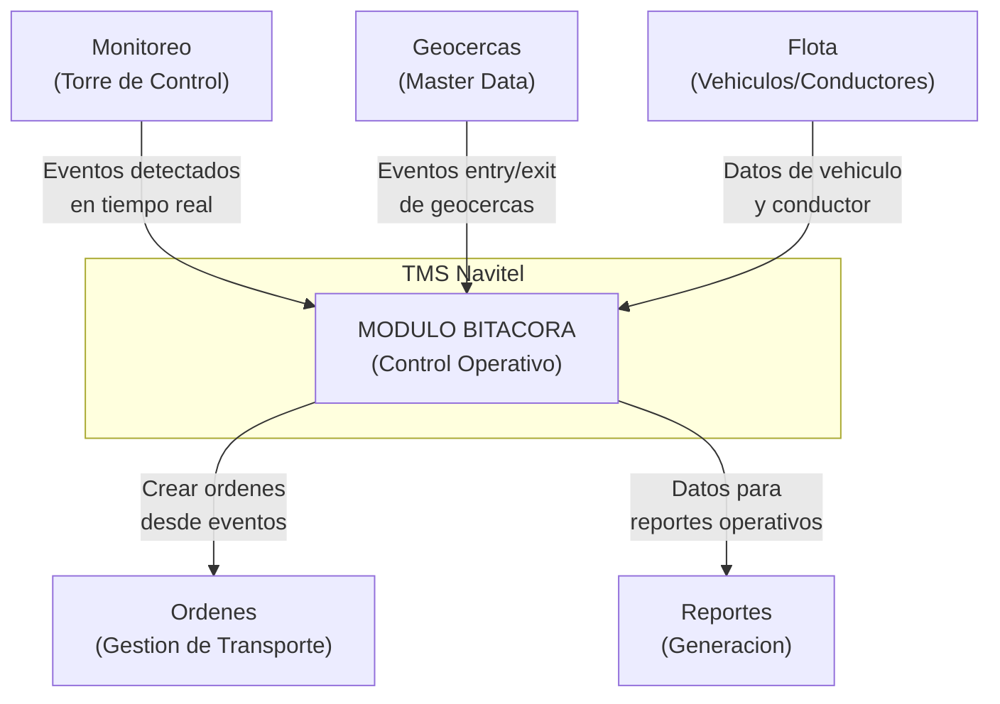

**Responsabilidades:** Registrar, clasificar y gestionar eventos operativos de la flota: ingresos/salidas de geocercas, paradas no planificadas, desviaciones de ruta, permanencias prolongadas, tiempo inactivo y excesos de velocidad. Permite al operador revisar eventos, agregar notas, descartar falsos positivos y crear ordenes de transporte a partir de eventos detectados.

**Alcance:** Una sola pagina `/bitacora` con tres vistas: linea de tiempo (cronologica), resumen por vehiculo y resumen por geocerca. Incluye filtrado avanzado por tipo de evento, estado, severidad, rango de fechas, placa y planificacion esperada/no esperada.

---

# 2. Entidades del Dominio

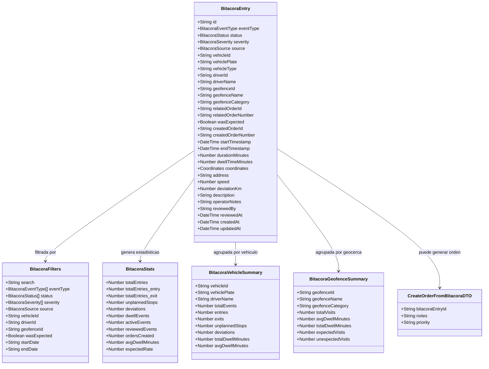

---

# 3. Modelo de Base de Datos — PostgreSQL

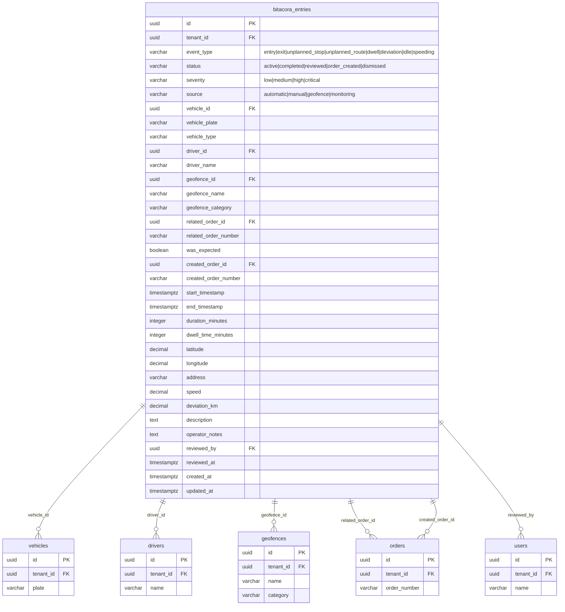

> **Nota multi-tenant:** Todas las consultas a `bitacora_entries` deben incluir `WHERE tenant_id = :tenantId` extraido del JWT del usuario autenticado. El `tenant_id` NO se envia en el body — se inyecta automaticamente en el backend.

---

# 4. Maquina de Estados — BitacoraStatus

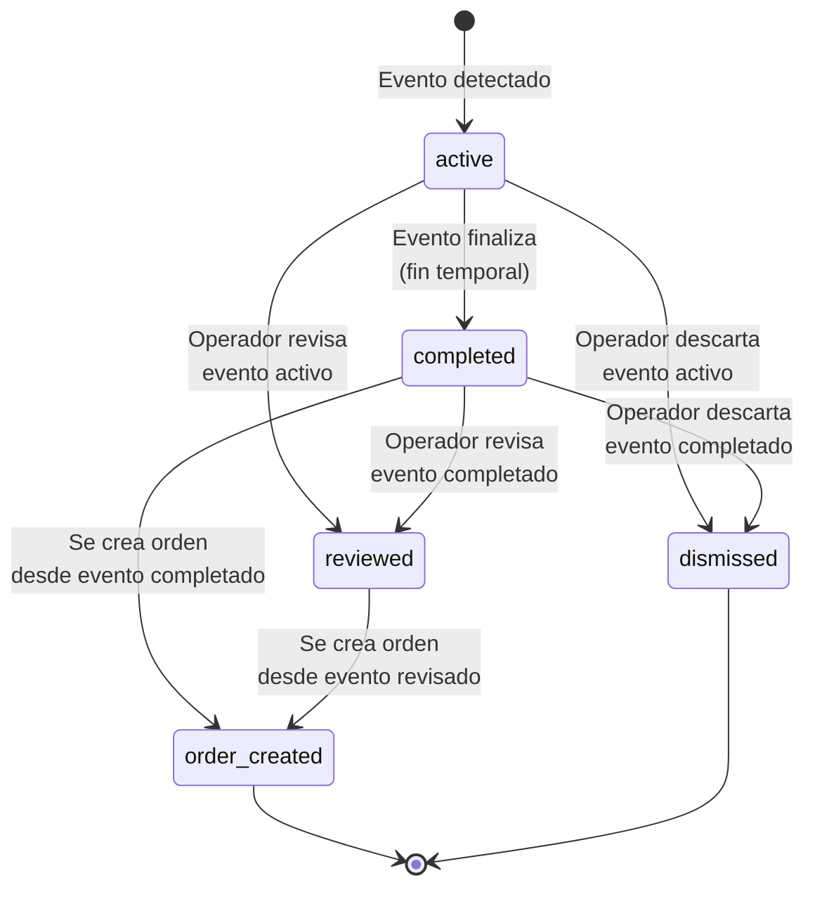

| Estado | Valor | Descripcion |
|--------|-------|-------------|
| Activo | `active` | Evento en curso, aun no ha finalizado temporalmente |
| Completado | `completed` | Evento finalizado (se detecto fin temporal) |
| Revisado | `reviewed` | Un operador reviso el evento y agrego notas o lo valido |
| Orden creada | `order_created` | Se genero una orden de transporte a partir de este evento |
| Descartado | `dismissed` | Evento descartado por el operador (falso positivo o irrelevante) |

---

# 5. Maquina de Estados — BitacoraSeverity

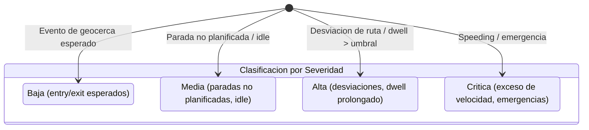

| Severidad | Valor | Criterio de asignacion |
|-----------|-------|------------------------|
| Baja | `low` | Eventos de geocerca esperados (entry/exit dentro de ruta planificada) |
| Media | `medium` | Paradas no planificadas, tiempo inactivo |
| Alta | `high` | Desviaciones de ruta, permanencia prolongada sobre umbral |
| Critica | `critical` | Exceso de velocidad, emergencias, desviaciones mayores |

---

# 6. Maquina de Estados — BitacoraEventType

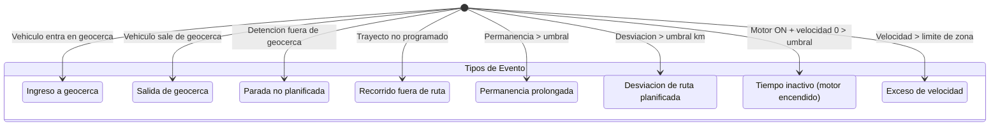

| Tipo | Valor | Fuente tipica | Severidad default |
|------|-------|---------------|-------------------|
| Ingreso | `entry` | Geocerca | low |
| Salida | `exit` | Geocerca | low |
| Parada no planificada | `unplanned_stop` | Automatica | medium |
| Recorrido no planificado | `unplanned_route` | Automatica | medium |
| Permanencia prolongada | `dwell` | Automatica | high |
| Desviacion de ruta | `deviation` | Monitoreo | high |
| Tiempo inactivo | `idle` | Automatica | medium |
| Exceso de velocidad | `speeding` | Monitoreo | critical |

---

# 7. Tabla de Referencia Operativa de Transiciones

| # | Transicion | De | A | Actor(es) | Endpoint | Condiciones |
|---|-----------|-----|---|-----------|----------|-------------|
| T-01 | Detectar evento | (nuevo) | `active` | Sistema / Monitoreo | POST /api/bitacora | Datos de vehiculo y coordenadas validos |
| T-02 | Completar evento | `active` | `completed` | Sistema (automatico) | PUT /api/bitacora/:id/complete | Se detecto fin temporal del evento |
| T-03 | Revisar evento activo | `active` | `reviewed` | Owner, Usuario Maestro, Subusuario (si tiene permiso `bitacora.review`) | PUT /api/bitacora/:id/review | Notas de revision opcionales |
| T-04 | Revisar evento completado | `completed` | `reviewed` | Owner, Usuario Maestro, Subusuario (si tiene permiso `bitacora.review`) | PUT /api/bitacora/:id/review | Notas de revision opcionales |
| T-05 | Crear orden desde completado | `completed` | `order_created` | Owner, Usuario Maestro, Subusuario (si tiene permiso `bitacora.create_order`) | POST /api/bitacora/:id/create-order | Datos de la nueva orden validos |
| T-06 | Crear orden desde revisado | `reviewed` | `order_created` | Owner, Usuario Maestro, Subusuario (si tiene permiso `bitacora.create_order`) | POST /api/bitacora/:id/create-order | Datos de la nueva orden validos |
| T-07 | Descartar activo | `active` | `dismissed` | Owner, Usuario Maestro, Subusuario (si tiene permiso `bitacora.dismiss`) | PUT /api/bitacora/:id/dismiss | Confirmacion del operador |
| T-08 | Descartar completado | `completed` | `dismissed` | Owner, Usuario Maestro, Subusuario (si tiene permiso `bitacora.dismiss`) | PUT /api/bitacora/:id/dismiss | Confirmacion del operador |

---

# 8. Casos de Uso — Referencia Backend

## CU-01: Listar Registros de Bitacora

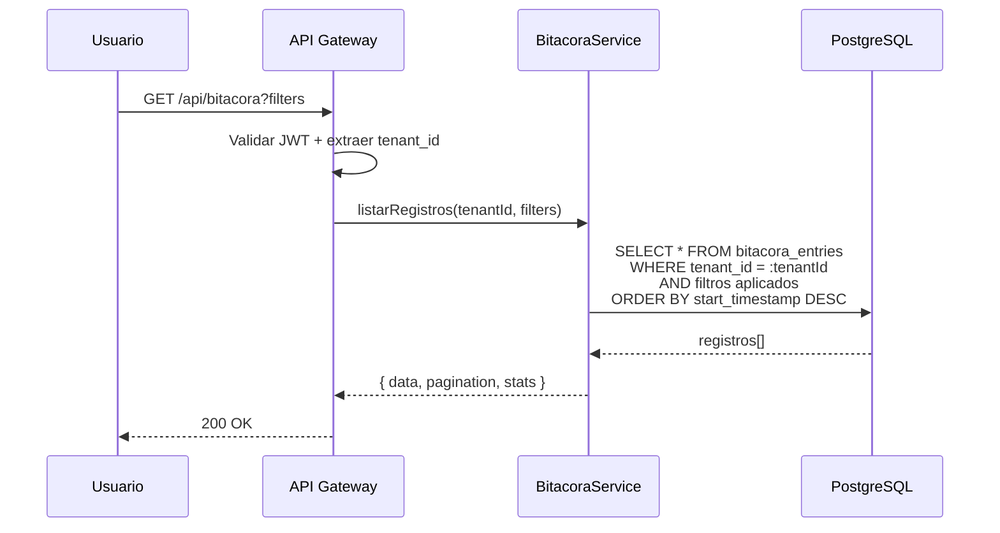

| Campo | Detalle |
|-------|---------|
| Nombre | Listar Registros de Bitacora |
| Actor(es) | Owner, Usuario Maestro, Subusuario (si tiene permiso `bitacora.read`) |
| Precondiciones | PRE-01: Usuario autenticado con JWT valido. PRE-02: tenant_id extraido del token. |
| Flujo | 1. Usuario solicita lista con filtros opcionales. 2. API valida JWT y extrae tenant_id. 3. Se aplican filtros (eventType, status, severity, source, vehicleId, dateRange, etc). 4. Se retorna lista paginada con estadisticas. |
| Resultado | Lista paginada de registros de bitacora con estadisticas generales |
| Excepciones | 401 si JWT invalido; 403 si sin permiso `bitacora.read` |

---

## CU-02: Revisar Evento de Bitacora

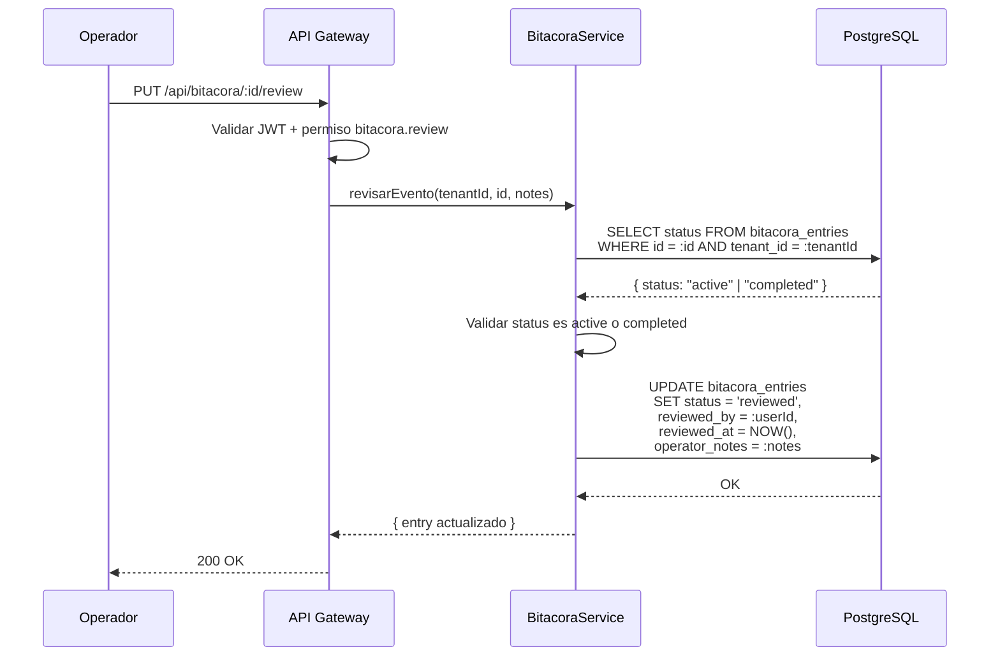

| Campo | Detalle |
|-------|---------|
| Nombre | Revisar Evento de Bitacora |
| Actor(es) | Owner, Usuario Maestro, Subusuario (si tiene permiso `bitacora.review`) |
| Precondiciones | PRE-01, PRE-02. Evento en estado `active` o `completed`. |
| Flujo | 1. Operador selecciona evento y elige "Marcar como revisado". 2. Opcionalmente agrega notas. 3. Sistema valida que el estado permite revision. 4. Se actualiza status a `reviewed`, se registra reviewer y timestamp. |
| Resultado | Evento transicionado a `reviewed` con metadata de revision |
| Excepciones | 404 si evento no existe en tenant; 409 si estado no permite revision |

---

## CU-03: Crear Orden desde Evento de Bitacora

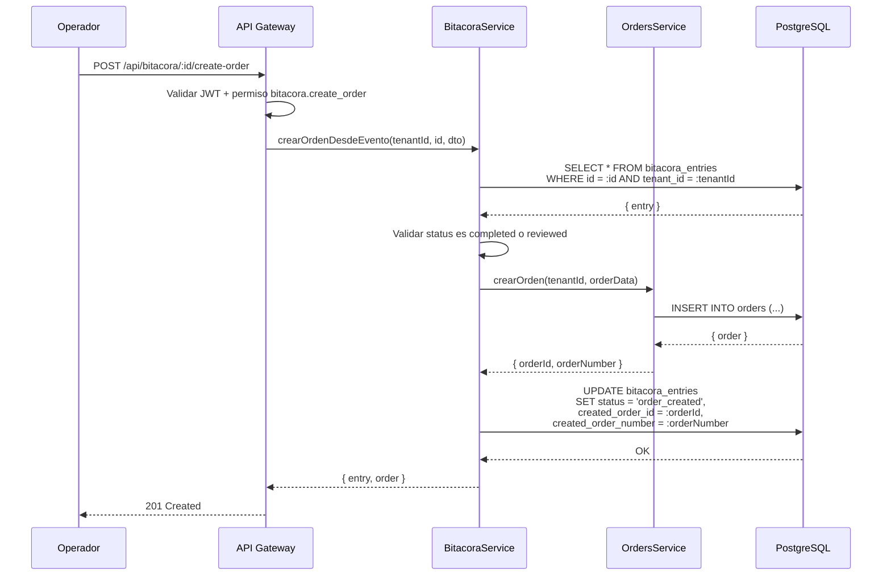

| Campo | Detalle |
|-------|---------|
| Nombre | Crear Orden desde Evento de Bitacora |
| Actor(es) | Owner, Usuario Maestro, Subusuario (si tiene permiso `bitacora.create_order`) |
| Precondiciones | PRE-01, PRE-02. Evento en estado `completed` o `reviewed`. |
| Flujo | 1. Operador selecciona evento y elige "Crear orden". 2. Completa formulario (prioridad, notas, referencia). 3. Sistema valida que el estado permite crear orden. 4. Se crea la orden en el modulo de Ordenes. 5. Se actualiza la bitacora con referencia a la orden creada. |
| Resultado | Orden creada en el modulo de Ordenes; evento transicionado a `order_created` |
| Excepciones | 409 si estado no permite crear orden; 422 si datos de la orden invalidos |

---

## CU-04: Descartar Evento de Bitacora

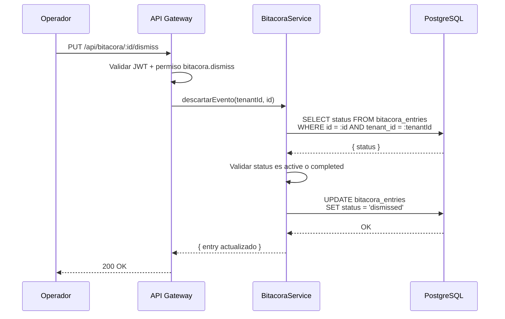

| Campo | Detalle |
|-------|---------|
| Nombre | Descartar Evento de Bitacora |
| Actor(es) | Owner, Usuario Maestro, Subusuario (si tiene permiso `bitacora.dismiss`) |
| Precondiciones | PRE-01, PRE-02. Evento en estado `active` o `completed`. |
| Flujo | 1. Operador selecciona evento y elige "Descartar". 2. Se muestra dialogo de confirmacion. 3. Sistema valida estado. 4. Se actualiza status a `dismissed`. |
| Resultado | Evento marcado como descartado; no aparece en vistas principales |
| Excepciones | 409 si estado no permite descarte (ya revisado o con orden creada) |

---

## CU-05: Agregar Notas a Evento

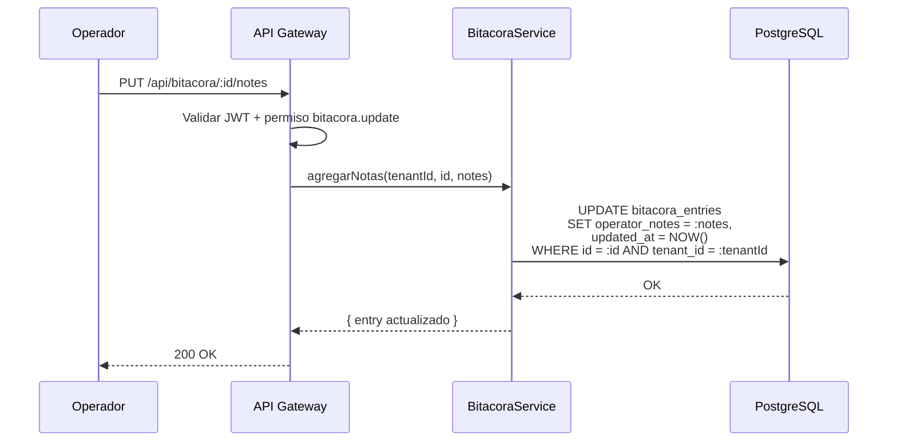

| Campo | Detalle |
|-------|---------|
| Nombre | Agregar Notas a Evento |
| Actor(es) | Owner, Usuario Maestro, Subusuario (si tiene permiso `bitacora.update`) |
| Precondiciones | PRE-01, PRE-02. Evento existe en el tenant. |
| Flujo | 1. Operador abre modal de notas. 2. Escribe observaciones. 3. Se actualiza el campo operator_notes. |
| Resultado | Notas del operador guardadas en el evento |
| Excepciones | 404 si evento no existe; 403 sin permiso |

---

## CU-06: Asignar Evento a Orden Existente

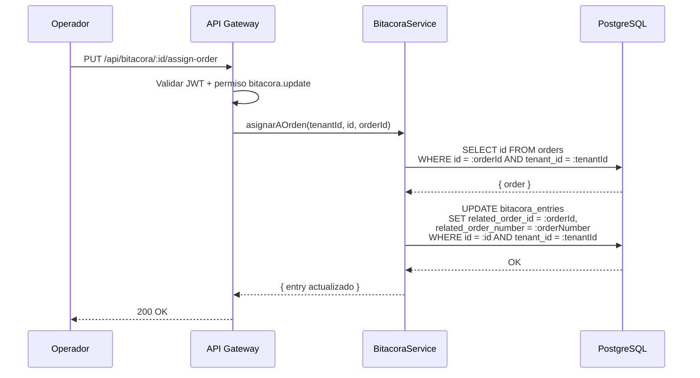

| Campo | Detalle |
|-------|---------|
| Nombre | Asignar Evento a Orden Existente |
| Actor(es) | Owner, Usuario Maestro, Subusuario (si tiene permiso `bitacora.update`) |
| Precondiciones | PRE-01, PRE-02. Evento y orden existen en el mismo tenant. |
| Flujo | 1. Operador selecciona "Asignar a orden". 2. Busca y selecciona orden existente. 3. Se vincula el evento con la orden. |
| Resultado | Evento vinculado a la orden seleccionada |
| Excepciones | 404 si evento u orden no existen; 422 si la orden no pertenece al tenant |

---

## CU-07: Exportar Registros de Bitacora

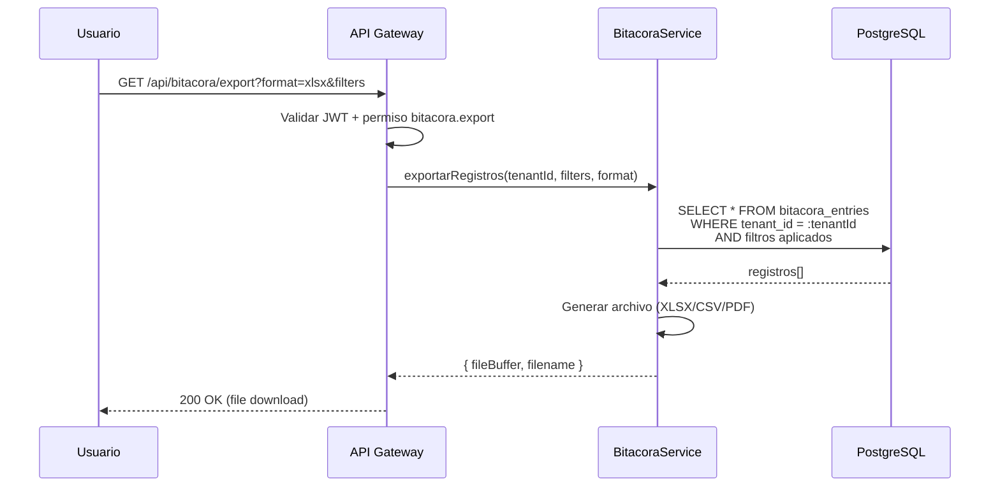

| Campo | Detalle |
|-------|---------|
| Nombre | Exportar Registros de Bitacora |
| Actor(es) | Owner, Usuario Maestro, Subusuario (si tiene permiso `bitacora.export`) |
| Precondiciones | PRE-01, PRE-02. |
| Flujo | 1. Usuario aplica filtros deseados. 2. Hace clic en "Exportar". 3. Selecciona formato (XLSX/CSV/PDF). 4. Backend genera archivo con registros filtrados. 5. Se descarga el archivo. |
| Resultado | Archivo descargado con registros de bitacora |
| Excepciones | 400 si formato no soportado; 403 sin permiso |

---

## CU-08: Ver Resumen por Vehiculo y por Geocerca

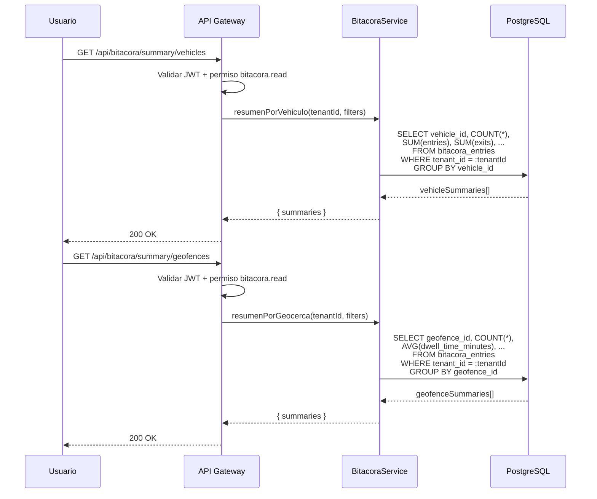

| Campo | Detalle |
|-------|---------|
| Nombre | Ver Resumen por Vehiculo y por Geocerca |
| Actor(es) | Owner, Usuario Maestro, Subusuario (si tiene permiso `bitacora.read`) |
| Precondiciones | PRE-01, PRE-02. |
| Flujo | 1. Usuario cambia a la pestana "Por vehiculo" o "Por geocerca". 2. Se solicita resumen agrupado al backend. 3. Se muestran tablas con metricas agregadas. |
| Resultado | Tablas de resumen con metricas por vehiculo o por geocerca |
| Excepciones | 401/403 si sin autenticacion o permiso |

---

## CU-09: Ver Detalle de Evento

| Campo | Detalle |
|-------|---------|
| Nombre | Ver Detalle de Evento |
| Actor(es) | Owner, Usuario Maestro, Subusuario (si tiene permiso `bitacora.read`) |
| Precondiciones | PRE-01, PRE-02. Evento existe en el tenant. |
| Flujo | 1. Usuario expande un evento o hace clic en "Ver detalles completos". 2. Se muestra toda la informacion del evento: ubicacion, geocerca, tiempos, velocidad, desviacion, orden relacionada, notas. |
| Resultado | Vista completa del detalle del evento |
| Excepciones | 404 si evento no existe en el tenant |

---

## CU-10: Ver Evento en Mapa

| Campo | Detalle |
|-------|---------|
| Nombre | Ver Evento en Mapa |
| Actor(es) | Owner, Usuario Maestro, Subusuario (si tiene permiso `bitacora.read`) |
| Precondiciones | PRE-01, PRE-02. Evento tiene coordenadas validas. |
| Flujo | 1. Usuario selecciona "Ver en mapa". 2. Se abre modal con mapa centrado en las coordenadas del evento. 3. Se muestra marcador con informacion del evento. |
| Resultado | Mapa con ubicacion del evento |
| Excepciones | Coordenadas invalidas se manejan mostrando mensaje de error en el modal |

---

# 9. Endpoints API REST

| ID | Metodo | Ruta | Descripcion | Request Body / Params | Response | CU |
|----|--------|------|-------------|----------------------|----------|-----|
| E-01 | GET | `/api/bitacora` | Listar registros con filtros | Query: `eventType`, `status`, `severity`, `source`, `vehicleId`, `driverId`, `geofenceId`, `wasExpected`, `startDate`, `endDate`, `search`, `page`, `limit`, `sort` | `{ data: BitacoraEntry[], pagination, stats: BitacoraStats }` | CU-01 |
| E-02 | GET | `/api/bitacora/:id` | Obtener detalle de un evento | Path: `id` | `{ data: BitacoraEntry }` | CU-09 |
| E-03 | POST | `/api/bitacora` | Crear registro de evento | `{ eventType, severity, source, vehicleId, vehiclePlate, driverId?, driverName?, geofenceId?, coordinates, speed?, description? }` | `{ data: BitacoraEntry }` | T-01 |
| E-04 | PUT | `/api/bitacora/:id/review` | Marcar evento como revisado | `{ operatorNotes? }` | `{ data: BitacoraEntry }` | CU-02 |
| E-05 | PUT | `/api/bitacora/:id/dismiss` | Descartar evento | (sin body) | `{ data: BitacoraEntry }` | CU-04 |
| E-06 | PUT | `/api/bitacora/:id/notes` | Agregar/actualizar notas | `{ operatorNotes }` | `{ data: BitacoraEntry }` | CU-05 |
| E-07 | PUT | `/api/bitacora/:id/assign-order` | Vincular evento a orden existente | `{ orderId }` | `{ data: BitacoraEntry }` | CU-06 |
| E-08 | POST | `/api/bitacora/:id/create-order` | Crear orden desde evento | `{ priority?, notes?, serviceType?, reference? }` | `{ data: { entry: BitacoraEntry, order: Order } }` | CU-03 |
| E-09 | PUT | `/api/bitacora/:id/complete` | Completar evento (cierre temporal) | `{ endTimestamp?, durationMinutes? }` | `{ data: BitacoraEntry }` | T-02 |
| E-10 | GET | `/api/bitacora/stats` | Obtener estadisticas generales | Query: filtros (mismos que E-01) | `{ data: BitacoraStats }` | CU-01 |
| E-11 | GET | `/api/bitacora/summary/vehicles` | Resumen agrupado por vehiculo | Query: filtros | `{ data: BitacoraVehicleSummary[] }` | CU-08 |
| E-12 | GET | `/api/bitacora/summary/geofences` | Resumen agrupado por geocerca | Query: filtros | `{ data: BitacoraGeofenceSummary[] }` | CU-08 |
| E-13 | GET | `/api/bitacora/export` | Exportar registros | Query: `format` (xlsx/csv/pdf), filtros | File download | CU-07 |

---

# 10. Eventos de Dominio

| ID | Evento | Trigger | Payload clave | Consumidor(es) |
|----|--------|---------|---------------|----------------|
| EV-01 | `bitacora.entry.created` | Se crea un nuevo registro de bitacora | `{ entryId, eventType, vehicleId, tenantId }` | Monitoreo (dashboard), Reportes |
| EV-02 | `bitacora.entry.reviewed` | Un operador revisa un evento | `{ entryId, reviewedBy, tenantId }` | Reportes (metricas de operacion) |
| EV-03 | `bitacora.entry.dismissed` | Un operador descarta un evento | `{ entryId, tenantId }` | Reportes (tasa de descarte) |
| EV-04 | `bitacora.entry.order_created` | Se crea orden desde un evento de bitacora | `{ entryId, orderId, orderNumber, tenantId }` | Ordenes (sincronizar referencia) |
| EV-05 | `bitacora.entry.completed` | Evento finaliza temporalmente | `{ entryId, durationMinutes, tenantId }` | Monitoreo (actualizar estado), Reportes |
| EV-06 | `bitacora.entry.notes_updated` | Se actualizan notas del operador | `{ entryId, tenantId }` | Auditoria |

---

# 11. Reglas de Negocio Clave

| ID | Regla | Detalle |
|----|-------|---------|
| R-01 | Multi-tenant obligatorio | Todas las queries a `bitacora_entries` filtran por `tenant_id` del JWT. Un tenant nunca ve datos de otro tenant. |
| R-02 | Severidad automatica | Los eventos de geocerca esperados (entry/exit con `wasExpected=true`) se asignan severidad `low`. Paradas no planificadas e idle se asignan `medium`. Desviaciones y dwell sobre umbral se asignan `high`. Speeding se asigna `critical`. |
| R-03 | Solo se puede crear orden desde completed o reviewed | No se puede crear una orden desde un evento `active` (podria aun estar en curso) ni desde un evento `dismissed`. |
| R-04 | Descarte irreversible | Una vez descartado (`dismissed`), el evento no puede volver a un estado anterior. Es un estado terminal. |
| R-05 | Orden creada es terminal | Una vez que se crea una orden desde un evento (`order_created`), el evento queda en estado terminal y no puede ser modificado. |
| R-06 | Revision no requiere cambio de estado previo | Se puede revisar un evento desde `active` o `completed` directamente. No es obligatorio que el evento este completado para revisarlo. |
| R-07 | Coordenadas obligatorias | Todo registro de bitacora requiere coordenadas validas (lat, lng). La geocodificacion de la direccion es opcional. |
| R-08 | Eventos de geocerca se generan automaticamente | Los eventos `entry` y `exit` se crean automaticamente cuando el modulo de Monitoreo detecta que un vehiculo cruza los limites de una geocerca. |
| R-09 | Unicidad de orden creada por evento | Un evento de bitacora solo puede generar una orden. Si ya tiene `created_order_id`, no se permite crear otra. |
| R-10 | Filtrado por rango de fechas usa start_timestamp | Al filtrar por fechas, se usa `start_timestamp` como referencia, no `created_at`. |
| R-11 | Dwell time se calcula en minutos | La permanencia (`dwell_time_minutes`) se calcula como la diferencia entre el momento actual (o `end_timestamp`) y `start_timestamp`. |
| R-12 | Velocidad se registra en km/h | El campo `speed` almacena la velocidad en km/h al momento del evento. Para speeding, se compara contra el limite de la zona. |

---

# 12. Catalogo de Errores HTTP

| Codigo | Tipo | Detalle | Causa tipica |
|--------|------|---------|-------------- |
| 400 | Bad Request | Datos de entrada invalidos | Filtros con formato incorrecto, formato de exportacion no soportado |
| 401 | Unauthorized | Token JWT ausente o expirado | Sesion expirada, falta header Authorization |
| 403 | Forbidden | Sin permiso para la accion solicitada | Subusuario sin permiso `bitacora.read`, `bitacora.review`, etc. |
| 404 | Not Found | Evento no encontrado en el tenant | ID invalido o evento pertenece a otro tenant |
| 409 | Conflict | Transicion de estado no permitida | Intentar descartar un evento ya revisado; intentar crear orden desde evento activo |
| 422 | Unprocessable Entity | Datos validos pero logicamente incorrectos | Coordenadas fuera de rango, orden referenciada no existe |
| 500 | Internal Server Error | Error inesperado del servidor | Fallo en DB, error en servicio de geocodificacion |

---

# 13. Permisos RBAC

**Jerarquia de roles (modelo Edson):**

| Rol | Descripcion |
|-----|-------------|
| **Owner** | Proveedor/Super Admin del TMS. Acceso total a todas las funcionalidades de la plataforma y todos los tenants. |
| **Usuario Maestro** | Administrador del tenant (empresa cliente). Control total dentro de su empresa: gestiona usuarios, configura permisos, opera todos los modulos habilitados. |
| **Subusuario** | Operador con permisos configurables. Solo puede realizar las acciones que el Usuario Maestro le haya asignado explicitamente. |

**Leyenda de permisos:**

| Simbolo | Significado |
|---------|-------------|
| Si | Permitido |
| Configurable | Permitido si el Usuario Maestro le asigno el permiso al Subusuario |
| No | Denegado |

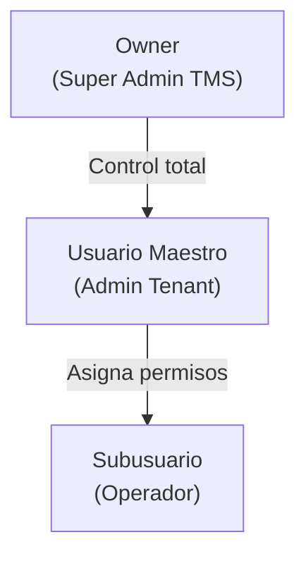

### Tabla de Permisos — Modulo Bitacora

| Permiso | Recurso.Accion | Owner | Usuario Maestro | Subusuario |
|---------|---------------|-------|-----------------|------------|
| Ver registros de bitacora | `bitacora.read` | Si | Si | Configurable |
| Crear registro manual | `bitacora.create` | Si | Si | Configurable |
| Revisar evento | `bitacora.review` | Si | Si | Configurable |
| Descartar evento | `bitacora.dismiss` | Si | Si | Configurable |
| Agregar/editar notas | `bitacora.update` | Si | Si | Configurable |
| Crear orden desde evento | `bitacora.create_order` | Si | Si | Configurable |
| Exportar registros | `bitacora.export` | Si | Si | Configurable |
| Asignar evento a orden | `bitacora.update` | Si | Si | Configurable |

> **Nota:** El Subusuario no tiene acceso a ninguna funcionalidad de bitacora por defecto. El Usuario Maestro debe asignar explicitamente cada permiso.

---

# 14. Diagrama de Componentes

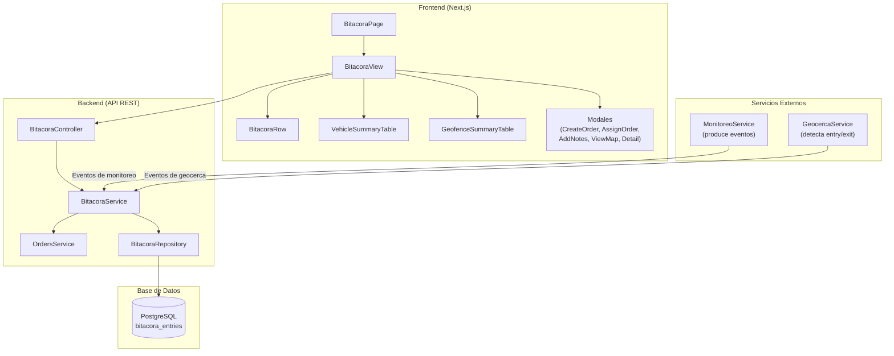

---

# 15. Diagrama de Despliegue

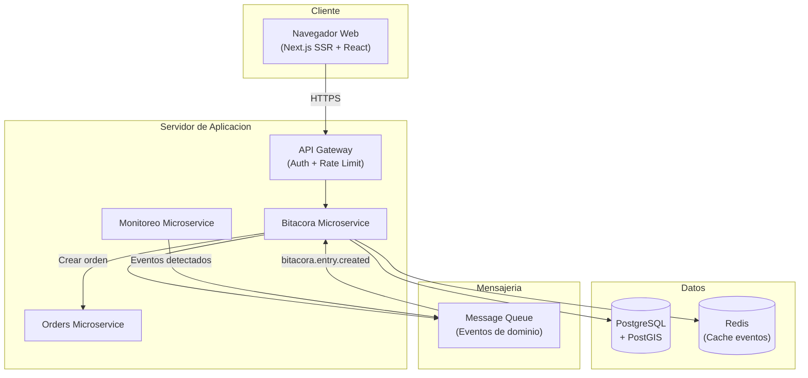

---

> **Nota final:** Este documento es una referencia operativa para desarrollo frontend y backend. Todos los endpoints requieren autenticacion via JWT y filtraje automatico por `tenant_id`. Para detalles de implementacion, consultar los archivos fuente: `src/types/bitacora.ts`, `src/mocks/bitacora.mock.ts`, `src/components/bitacora/bitacora-view.tsx`.
