# Referencia Rapida — Modulo de Dashboard
## TMS Navitel . Cheat Sheet para Desarrollo

> **Fecha:** Febrero 2026
> **Proposito:** Consulta rapida para desarrolladores. Resumen operativo consolidado del TMS: KPIs, indicadores en tiempo real, graficos de flota y tabla de vehiculos en ruta.

---

## Indice

| # | Seccion |
|---|---------|
| 1 | [Contexto del Modulo](#1-contexto-del-modulo) |
| 2 | [Entidades del Dominio](#2-entidades-del-dominio) |
| 3 | [Modelo de Base de Datos — PostgreSQL](#3-modelo-de-base-de-datos--postgresql) |
| 4 | [Fuentes de Datos y Agregaciones](#4-fuentes-de-datos-y-agregaciones) |
| 5 | [KPIs y Metricas](#5-kpis-y-metricas) |
| 6 | [Vistas y Componentes Visuales](#6-vistas-y-componentes-visuales) |
| 7 | [Tabla de Referencia Operativa de Datos](#7-tabla-de-referencia-operativa-de-datos) |
| 8 | [Casos de Uso — Referencia Backend](#8-casos-de-uso--referencia-backend) |
| 9 | [Endpoints API REST](#9-endpoints-api-rest) |
| 10 | [Eventos de Dominio](#10-eventos-de-dominio) |
| 11 | [Reglas de Negocio Clave](#11-reglas-de-negocio-clave) |
| 12 | [Catalogo de Errores HTTP](#12-catalogo-de-errores-http) |
| 13 | [Permisos RBAC](#13-permisos-rbac) |
| 14 | [Diagrama de Componentes](#14-diagrama-de-componentes) |
| 15 | [Diagrama de Despliegue](#15-diagrama-de-despliegue) |

---

# 1. Contexto del Modulo

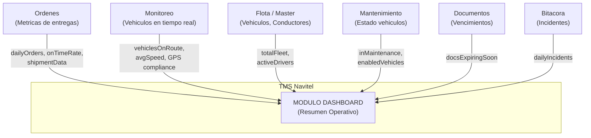

**Responsabilidades:** Consolidar y presentar el resumen operativo del TMS en una vista unica. Agrega datos de multiples modulos (Ordenes, Monitoreo, Flota, Mantenimiento, Documentos, Bitacora) para mostrar KPIs, tendencias historicas, distribucion de flota, estadisticas de envios y tabla de vehiculos en ruta.

**Alcance:** Una sola pagina raiz `/` (home del dashboard). Modulo de solo lectura — no modifica datos, solo consulta y agrega. Incluye filtro por fecha para ajustar el periodo de consulta.

---

# 2. Entidades del Dominio

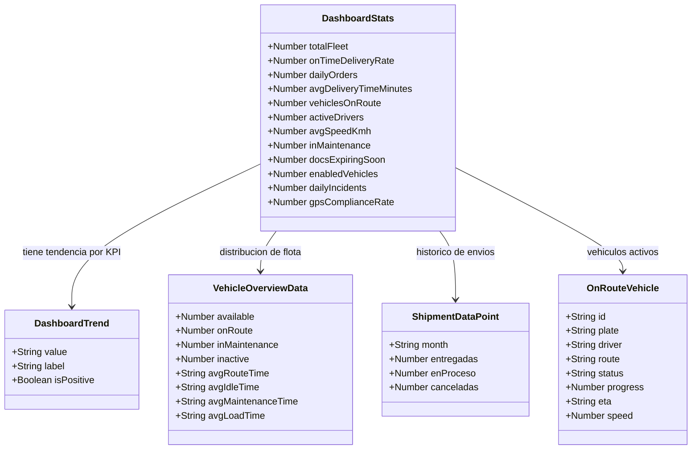

---

# 3. Modelo de Base de Datos — PostgreSQL

> **Nota:** El modulo Dashboard NO tiene tablas propias. Es un modulo de lectura que agrega datos de otros modulos mediante vistas materializadas o queries directas.

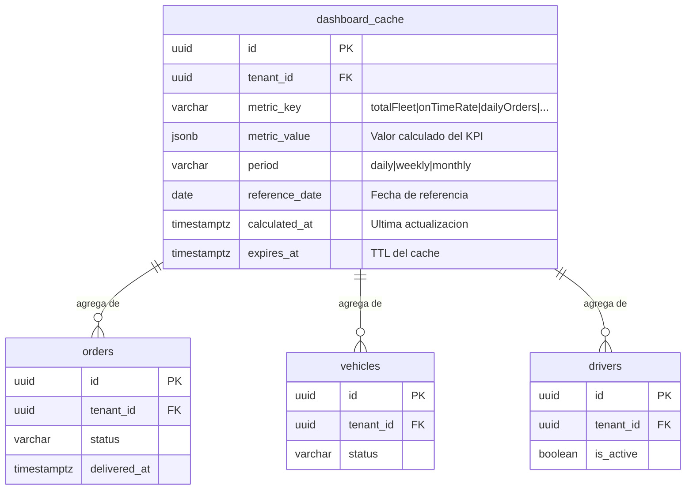

> **Nota multi-tenant:** Todas las consultas de agregacion filtran por `tenant_id` del JWT. El cache (si existe) se segmenta por tenant. Un tenant nunca ve metricas de otro tenant.

> **Nota de implementacion:** El backend puede optar por: (a) calcular los KPIs en tiempo real con queries agregadas, o (b) usar una tabla `dashboard_cache` con TTL para metricas costosas. La decision depende del volumen de datos.

---

# 4. Fuentes de Datos y Agregaciones

El Dashboard consolida datos de 6 modulos. Cada KPI tiene una fuente y una logica de agregacion especifica:

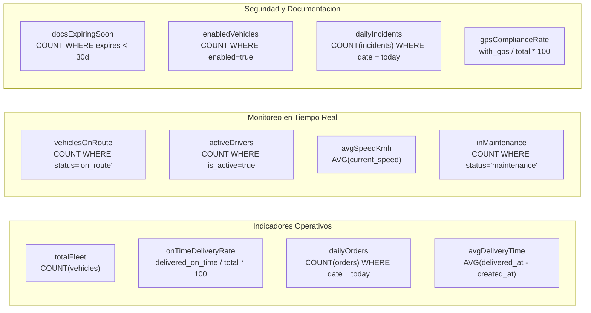

### Tabla de fuentes por KPI

| KPI | Fuente (Modulo) | Tabla/Vista | Agregacion | Periodo |
|-----|-----------------|-------------|------------|---------|
| `totalFleet` | Flota/Master | `vehicles` | `COUNT(*) WHERE tenant_id = :t AND deleted_at IS NULL` | Snapshot |
| `onTimeDeliveryRate` | Ordenes | `orders` | `(delivered_on_time / total_delivered) * 100` | Diario |
| `dailyOrders` | Ordenes | `orders` | `COUNT(*) WHERE created_at::date = :date` | Diario |
| `avgDeliveryTimeMinutes` | Ordenes | `orders` | `AVG(EXTRACT(EPOCH FROM (delivered_at - dispatched_at)) / 60)` | Diario |
| `vehiclesOnRoute` | Monitoreo | `vehicle_tracking` | `COUNT(*) WHERE status = 'on_route'` | Tiempo real |
| `activeDrivers` | Flota/Master | `drivers` | `COUNT(*) WHERE is_active = true` | Snapshot |
| `avgSpeedKmh` | Monitoreo | `vehicle_tracking` | `AVG(current_speed) WHERE status = 'on_route'` | Tiempo real |
| `inMaintenance` | Mantenimiento | `vehicles` | `COUNT(*) WHERE status = 'maintenance'` | Snapshot |
| `docsExpiringSoon` | Documentos | `vehicle_documents` | `COUNT(*) WHERE expiry_date < NOW() + INTERVAL '30 days'` | Diario |
| `enabledVehicles` | Mantenimiento | `vehicles` | `COUNT(*) WHERE operational_status = 'enabled'` | Snapshot |
| `dailyIncidents` | Bitacora | `bitacora_entries` | `COUNT(*) WHERE severity IN ('high','critical') AND date = today` | Diario |
| `gpsComplianceRate` | Monitoreo | `vehicle_tracking` | `(with_active_gps / total_vehicles) * 100` | Tiempo real |

---

# 5. KPIs y Metricas

### Seccion 1: Indicadores Operativos

| KPI | Etiqueta UI | Unidad | Rango esperado | Trend |
|-----|-------------|--------|----------------|-------|
| `totalFleet` | Flota Total | Unidades | 1 - 10,000 | vs mes anterior (+/- unidades) |
| `onTimeDeliveryRate` | Entregas a Tiempo | Porcentaje (%) | 0 - 100 | vs semana anterior (+/- %) |
| `dailyOrders` | Ordenes del Dia | Unidades | 0 - 1,000 | vs ayer (+/- unidades) |
| `avgDeliveryTimeMinutes` | Tiempo Promedio Entrega | Minutos | 0 - 480 | vs promedio (+/- minutos) |

### Seccion 2: Monitoreo en Tiempo Real

| KPI | Etiqueta UI | Unidad | Rango esperado | Trend |
|-----|-------------|--------|----------------|-------|
| `vehiclesOnRoute` | Vehiculos en Ruta | Unidades | 0 - totalFleet | % de la flota |
| `activeDrivers` | Conductores Activos | Unidades | 0 - total drivers | % disponibilidad |
| `avgSpeedKmh` | Velocidad Promedio | km/h | 0 - 120 | vs ayer (+/- km/h) |
| `inMaintenance` | En Mantenimiento | Unidades | 0 - totalFleet | vs semana anterior |

### Seccion 3: Seguridad y Documentacion

| KPI | Etiqueta UI | Unidad | Rango esperado | Trend |
|-----|-------------|--------|----------------|-------|
| `docsExpiringSoon` | Docs por Vencer | Unidades | 0 - 100 | esta semana |
| `enabledVehicles` | Vehiculos Habilitados | Unidades | 0 - totalFleet | % de la flota |
| `dailyIncidents` | Incidentes del Dia | Unidades | 0 - 50 | vs ayer |
| `gpsComplianceRate` | Cumplimiento GPS | Porcentaje (%) | 0 - 100 | vs mes anterior |

### Datos de Tendencia (Sparklines)

Cada KPI tiene un array historico de 7 valores para renderizar sparklines. El backend debe retornar los ultimos 7 periodos (dias o semanas segun el KPI).

| Campo | Tipo | Descripcion |
|-------|------|-------------|
| `sparklines[key]` | `number[]` | Array de 7 valores historicos para el KPI |
| `trends[key].value` | `string` | Texto de tendencia (ej: "+3", "-5m", "+2.1%") |
| `trends[key].label` | `string` | Contexto de la tendencia (ej: "vs mes anterior") |
| `trends[key].isPositive` | `boolean` | `true` si la tendencia es favorable |

---

# 6. Vistas y Componentes Visuales

### Distribucion de Flota (VehicleOverview)

Grafico tipo donut que muestra la distribucion de vehiculos por estado:

| Campo | Tipo | Descripcion | Ejemplo |
|-------|------|-------------|---------|
| `available` | `number` | Porcentaje disponibles | 39.7 |
| `onRoute` | `number` | Porcentaje en ruta | 28.3 |
| `inMaintenance` | `number` | Porcentaje en mantenimiento | 17.4 |
| `inactive` | `number` | Porcentaje inactivos | 14.6 |
| `avgRouteTime` | `string` | Tiempo promedio en ruta | "2hr 10min" |
| `avgIdleTime` | `string` | Tiempo promedio inactivo | "45min" |
| `avgMaintenanceTime` | `string` | Tiempo promedio en mantenimiento | "1hr 30min" |
| `avgLoadTime` | `string` | Tiempo promedio de carga | "25min" |

### Estadisticas de Envios (ShipmentStatistics)

Grafico de barras apiladas mensual:

| Campo | Tipo | Descripcion |
|-------|------|-------------|
| `month` | `string` | Mes abreviado (Ene, Feb, ...) |
| `entregadas` | `number` | Ordenes entregadas en el mes |
| `enProceso` | `number` | Ordenes en proceso en el mes |
| `canceladas` | `number` | Ordenes canceladas en el mes |
| `total` | `number` | Suma total de todos los meses |

### Vehiculos en Ruta (OnRouteVehicles)

Tabla interactiva de vehiculos actualmente en ruta:

| Campo | Tipo | Descripcion | Valores posibles |
|-------|------|-------------|-----------------|
| `id` | `string` | ID del vehiculo | UUID |
| `plate` | `string` | Placa del vehiculo | "ABC-123" |
| `driver` | `string` | Nombre del conductor | Texto |
| `route` | `string` | Ruta asignada | "Lima -> Arequipa" |
| `status` | `string` | Estado del viaje | `on-time`, `delayed`, `ahead` |
| `progress` | `number` | Porcentaje de avance | 0 - 100 |
| `eta` | `string` | Hora estimada de llegada | "14:30" |
| `speed` | `number` | Velocidad actual (km/h) | 0 - 120 |

---

# 7. Tabla de Referencia Operativa de Datos

> **Nota:** El Dashboard no tiene maquinas de estado ni transiciones propias. Esta seccion documenta el flujo de datos y las dependencias de actualizacion.

| # | Dato | Origen | Frecuencia | Cache TTL | Endpoint |
|---|------|--------|------------|-----------|----------|
| D-01 | DashboardStats (12 KPIs) | Multi-modulo | Cada request (o cache 1 min) | 60s | GET /api/dashboard/stats |
| D-02 | Trends (sparklines + labels) | Multi-modulo | Cada request (o cache 5 min) | 300s | GET /api/dashboard/stats (incluido) |
| D-03 | VehicleOverview (distribucion) | Flota + Monitoreo | Cada request (o cache 2 min) | 120s | GET /api/dashboard/vehicles/overview |
| D-04 | ShipmentData (historico mensual) | Ordenes | Cada request (o cache 1 hora) | 3600s | GET /api/dashboard/shipments |
| D-05 | OnRouteVehicles (tabla en vivo) | Monitoreo | Cada request (o polling 30s) | 30s | GET /api/dashboard/vehicles/on-route |

---

# 8. Casos de Uso — Referencia Backend

## CU-01: Consultar KPIs del Dashboard

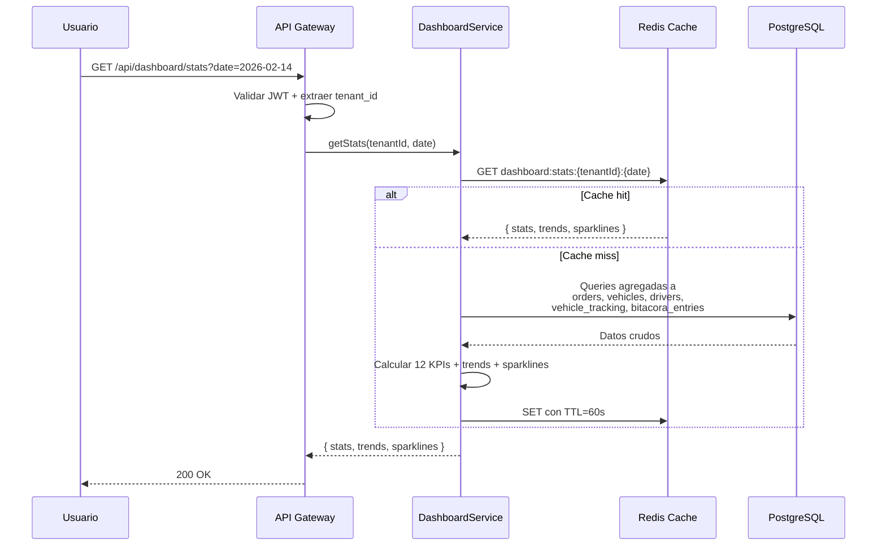

| Campo | Detalle |
|-------|---------|
| Nombre | Consultar KPIs del Dashboard |
| Actor(es) | Owner, Usuario Maestro, Subusuario (si tiene permiso `dashboard.read`) |
| Precondiciones | PRE-01: Usuario autenticado con JWT valido. PRE-02: tenant_id extraido del token. |
| Flujo | 1. Usuario accede al Dashboard o cambia filtro de fecha. 2. API valida JWT y extrae tenant_id. 3. Se consulta cache; si miss, se ejecutan queries agregadas a multiples tablas. 4. Se calculan los 12 KPIs, tendencias y sparklines. 5. Se almacena en cache con TTL de 60 segundos. 6. Se retorna respuesta completa. |
| Resultado | Objeto con 12 KPIs, tendencias y sparklines para la fecha solicitada |
| Excepciones | 401 si JWT invalido; 403 si sin permiso `dashboard.read` |

---

## CU-02: Consultar Distribucion de Flota

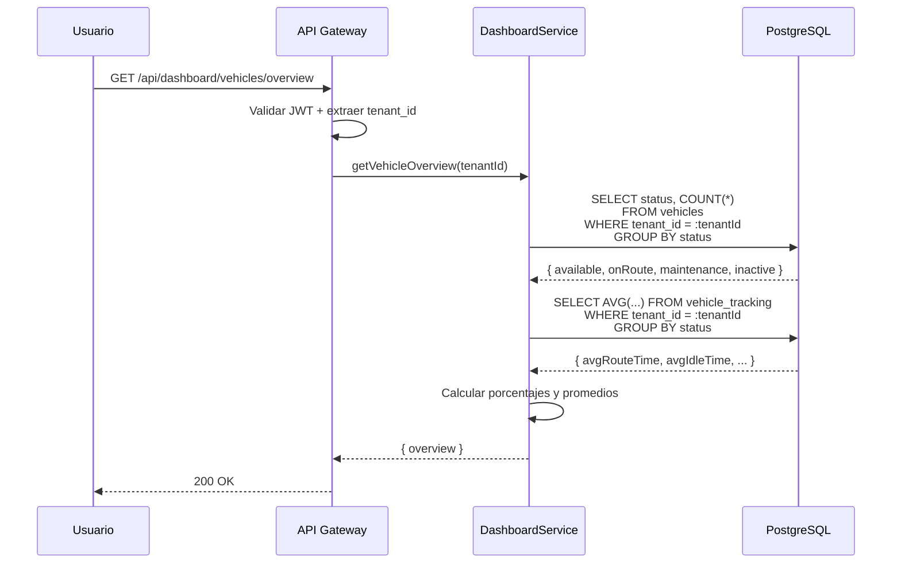

| Campo | Detalle |
|-------|---------|
| Nombre | Consultar Distribucion de Flota |
| Actor(es) | Owner, Usuario Maestro, Subusuario (si tiene permiso `dashboard.read`) |
| Precondiciones | PRE-01, PRE-02. |
| Flujo | 1. Se consulta la distribucion de vehiculos por estado. 2. Se calculan porcentajes y tiempos promedio. 3. Se retorna como VehicleOverviewData. |
| Resultado | Distribucion porcentual de flota con tiempos promedio |
| Excepciones | 401/403 si sin autenticacion o permiso |

---

## CU-03: Consultar Estadisticas de Envios

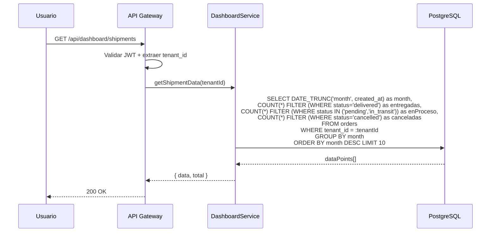

| Campo | Detalle |
|-------|---------|
| Nombre | Consultar Estadisticas de Envios |
| Actor(es) | Owner, Usuario Maestro, Subusuario (si tiene permiso `dashboard.read`) |
| Precondiciones | PRE-01, PRE-02. |
| Flujo | 1. Se consultan ordenes agrupadas por mes. 2. Se clasifican por estado (entregadas, en proceso, canceladas). 3. Se retorna array de 10 meses con totales. |
| Resultado | Array de ShipmentDataPoint[] con total acumulado |
| Excepciones | 401/403 si sin autenticacion o permiso |

---

## CU-04: Consultar Vehiculos en Ruta

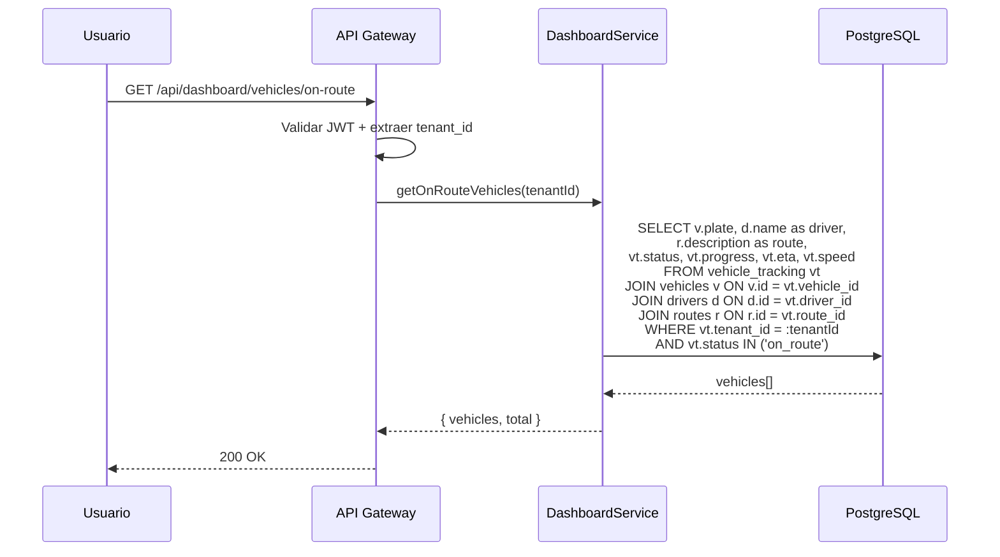

| Campo | Detalle |
|-------|---------|
| Nombre | Consultar Vehiculos en Ruta |
| Actor(es) | Owner, Usuario Maestro, Subusuario (si tiene permiso `dashboard.read`) |
| Precondiciones | PRE-01, PRE-02. |
| Flujo | 1. Se consultan vehiculos con estado on_route. 2. Se enriquece con datos de conductor y ruta. 3. Se retorna lista con progreso, ETA y velocidad. |
| Resultado | Lista de OnRouteVehicle[] con total de vehiculos en ruta |
| Excepciones | 401/403 si sin autenticacion o permiso |

---

# 9. Endpoints API REST

| ID | Metodo | Ruta | Descripcion | Request Body / Params | Response | CU |
|----|--------|------|-------------|----------------------|----------|-----|
| E-01 | GET | `/api/dashboard/stats` | Obtener 12 KPIs + trends + sparklines | Query: `date` (opcional, default=hoy) | `{ stats: DashboardStats, trends: Record<string, DashboardTrend>, sparklines: Record<string, number[]> }` | CU-01 |
| E-02 | GET | `/api/dashboard/vehicles/overview` | Distribucion de flota por estado | (ninguno) | `{ data: VehicleOverviewData }` | CU-02 |
| E-03 | GET | `/api/dashboard/shipments` | Historico de envios por mes | (ninguno) | `{ data: ShipmentDataPoint[], total: number }` | CU-03 |
| E-04 | GET | `/api/dashboard/vehicles/on-route` | Vehiculos actualmente en ruta | (ninguno) | `{ vehicles: OnRouteVehicle[], total: number }` | CU-04 |

---

# 10. Eventos de Dominio

> **Nota:** El Dashboard es un modulo de solo lectura. No produce eventos de dominio propios. Sin embargo, CONSUME eventos de otros modulos para invalidar su cache:

| ID | Evento consumido | Origen | Accion en Dashboard |
|----|-----------------|--------|---------------------|
| EV-01 | `order.created` | Ordenes | Invalidar cache de `dailyOrders`, `shipmentData` |
| EV-02 | `order.delivered` | Ordenes | Invalidar cache de `onTimeDeliveryRate`, `avgDeliveryTime` |
| EV-03 | `order.cancelled` | Ordenes | Invalidar cache de `shipmentData` |
| EV-04 | `vehicle.status_changed` | Flota | Invalidar cache de `vehicleOverview`, `totalFleet` |
| EV-05 | `monitoring.position_updated` | Monitoreo | Actualizar `vehiclesOnRoute`, `avgSpeed` (si usa push) |
| EV-06 | `maintenance.work_order_created` | Mantenimiento | Invalidar cache de `inMaintenance` |
| EV-07 | `bitacora.entry.created` | Bitacora | Invalidar cache de `dailyIncidents` |
| EV-08 | `document.expiry_warning` | Documentos | Invalidar cache de `docsExpiringSoon` |

---

# 11. Reglas de Negocio Clave

| ID | Regla | Detalle |
|----|-------|---------|
| R-01 | Multi-tenant obligatorio | Todas las agregaciones filtran por `tenant_id` del JWT. Un tenant solo ve sus propias metricas. |
| R-02 | Dashboard es de solo lectura | No se permiten operaciones de escritura desde el Dashboard. Toda modificacion de datos se hace desde el modulo correspondiente. |
| R-03 | Filtro de fecha aplica solo a KPIs diarios | Los KPIs de tipo "snapshot" (totalFleet, enabledVehicles, etc.) no se ven afectados por el filtro de fecha. Solo los KPIs diarios (dailyOrders, dailyIncidents, onTimeDeliveryRate) cambian. |
| R-04 | Cache es opcional pero recomendado | Para tenants con alto volumen de datos (>1000 vehiculos), se recomienda cache con TTL de 60s para stats, 120s para vehicleOverview, y 30s para onRouteVehicles. |
| R-05 | Sparklines siempre retornan 7 valores | El array de sparklines debe tener exactamente 7 valores historicos. Si no hay datos suficientes, se rellena con ceros a la izquierda. |
| R-06 | onTimeDeliveryRate se calcula sobre entregas completadas | Solo las ordenes con status `delivered` entran en el calculo. Las ordenes pendientes o canceladas no afectan esta metrica. |
| R-07 | Vehiculos en ruta es tiempo real | La tabla de vehiculos en ruta muestra el estado actual. No hay historico. El frontend puede implementar polling cada 30 segundos. |
| R-08 | Porcentajes de VehicleOverview suman 100 | Los 4 campos (available, onRoute, inMaintenance, inactive) deben sumar 100%. El backend debe garantizar esta invariante. |
| R-09 | ShipmentData retorna maximo 10 meses | Para limitar el volumen de datos, se retornan los ultimos 10 meses. Si se necesita mas historico, se debe usar el modulo de Reportes. |

---

# 12. Catalogo de Errores HTTP

| Codigo | Tipo | Detalle | Causa tipica |
|--------|------|---------|-------------- |
| 400 | Bad Request | Parametro de fecha invalido | Formato de fecha incorrecto en query param `date` |
| 401 | Unauthorized | Token JWT ausente o expirado | Sesion expirada, falta header Authorization |
| 403 | Forbidden | Sin permiso para consultar dashboard | Subusuario sin permiso `dashboard.read` |
| 500 | Internal Server Error | Error inesperado del servidor | Fallo en DB, timeout en queries agregadas |
| 503 | Service Unavailable | Servicio temporalmente no disponible | Cache Redis caido, dependencia de modulo no responde |

---

# 13. Permisos RBAC

**Jerarquia de roles (modelo Edson):**

| Rol | Descripcion |
|-----|-------------|
| **Owner** | Proveedor/Super Admin del TMS. Acceso total a todas las funcionalidades de la plataforma y todos los tenants. |
| **Usuario Maestro** | Administrador del tenant (empresa cliente). Control total dentro de su empresa: gestiona usuarios, configura permisos, opera todos los modulos habilitados. |
| **Subusuario** | Operador con permisos configurables. Solo puede realizar las acciones que el Usuario Maestro le haya asignado explicitamente. |

**Leyenda de permisos:**

| Simbolo | Significado |
|---------|-------------|
| Si | Permitido |
| Configurable | Permitido si el Usuario Maestro le asigno el permiso al Subusuario |
| No | Denegado |

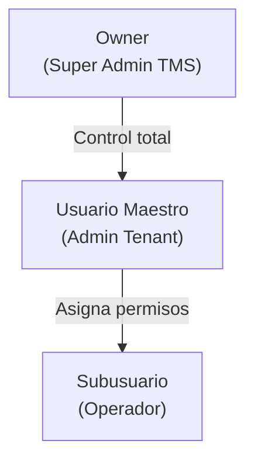

### Tabla de Permisos — Modulo Dashboard

| Permiso | Recurso.Accion | Owner | Usuario Maestro | Subusuario |
|---------|---------------|-------|-----------------|------------|
| Ver dashboard completo | `dashboard.read` | Si | Si | Configurable |
| Ver KPIs operativos | `dashboard.stats` | Si | Si | Configurable |
| Ver distribucion de flota | `dashboard.vehicles` | Si | Si | Configurable |
| Ver estadisticas de envios | `dashboard.shipments` | Si | Si | Configurable |
| Ver vehiculos en ruta | `dashboard.on_route` | Si | Si | Configurable |

> **Nota:** El Dashboard es un modulo de solo lectura. No existen permisos de escritura. El Subusuario necesita al menos `dashboard.read` para acceder a la pagina principal del TMS.

---

# 14. Diagrama de Componentes

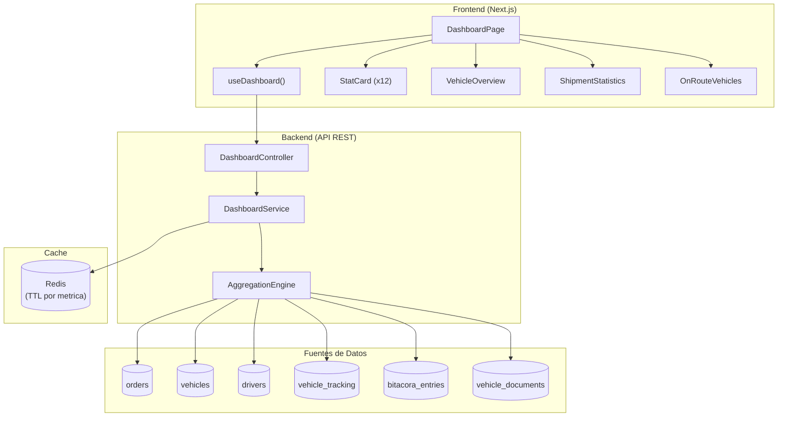

---

# 15. Diagrama de Despliegue

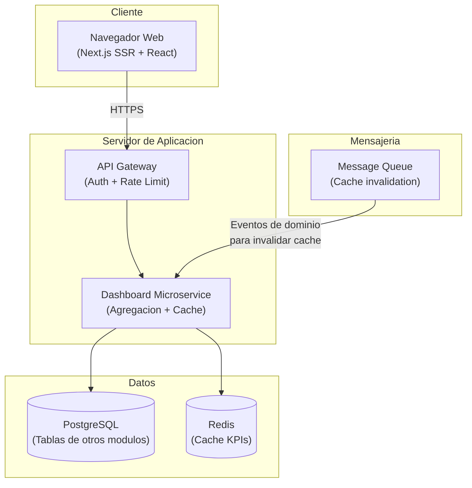

---

> **Nota final:** Este documento es una referencia operativa para desarrollo frontend y backend. El Dashboard es un modulo de solo lectura que agrega datos de multiples modulos. Todos los endpoints requieren autenticacion via JWT y filtraje automatico por `tenant_id`. Para detalles de implementacion, consultar: `src/hooks/useDashboard.ts`, `src/mocks/dashboard.mock.ts`, `src/app/(dashboard)/page.tsx`.
