# Referencia Rapida — Modulo de Finanzas
## TMS Navitel · Cheat Sheet para Desarrollo

> **Fecha:** Febrero 2026
> **Proposito:** Consulta rapida para desarrolladores. Cubre Centro Financiero, Facturas, Pagos, Costos de Transporte, Tarifario y Analisis Financiero (Rentabilidad, Flujo de Caja, Aging).

---

## Indice

| # | Seccion |
|---|---------|
| 1 | [Contexto del Modulo](#1-contexto-del-modulo) |
| 2 | [Entidades del Dominio](#2-entidades-del-dominio) |
| 3 | [Modelo de Base de Datos — PostgreSQL](#3-modelo-de-base-de-datos--postgresql) |
| 4 | [Maquina de Estados — InvoiceStatus](#4-maquina-de-estados--invoicestatus) |
| 5 | [Maquina de Estados — PaymentStatus](#5-maquina-de-estados--paymentstatus) |
| 6 | [Catalogos y Enumeraciones](#6-catalogos-y-enumeraciones) |
| 7 | [Tabla de Referencia Operativa de Transiciones](#7-tabla-de-referencia-operativa-de-transiciones) |
| 8 | [Casos de Uso — Referencia Backend](#8-casos-de-uso--referencia-backend) |
| 9 | [Endpoints API REST](#9-endpoints-api-rest) |
| 10 | [Eventos de Dominio](#10-eventos-de-dominio) |
| 11 | [Reglas de Negocio Clave](#11-reglas-de-negocio-clave) |
| 12 | [Catalogo de Errores HTTP](#12-catalogo-de-errores-http) |
| 13 | [Permisos RBAC](#13-permisos-rbac) |
| 14 | [Diagrama de Componentes](#14-diagrama-de-componentes) |
| 15 | [Diagrama de Despliegue](#15-diagrama-de-despliegue) |

---

# 1. Contexto del Modulo

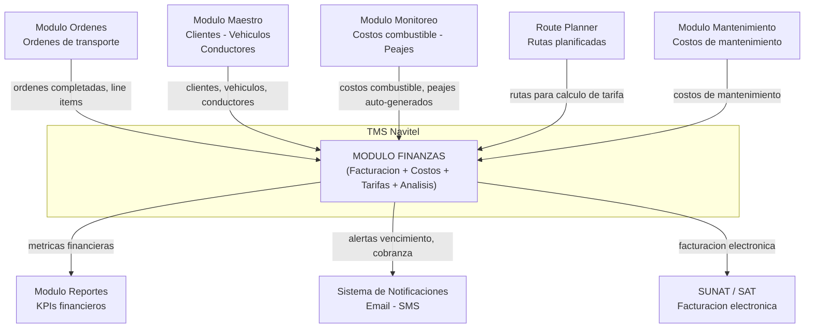

**Responsabilidades:** Gestion integral del ciclo financiero del transporte: facturacion (creacion, envio, seguimiento de cobro), registro y aprobacion de costos operativos (combustible, peajes, mantenimiento, mano de obra), tarifario configurable (por peso, volumen, distancia, tarifa plana, escalonado), registro de pagos con conciliacion automatica de facturas, analisis financiero (estadisticas, rentabilidad por cliente/ruta/vehiculo, flujo de caja, aging de cuentas por cobrar).

**Sub-modulos:** Centro Financiero (/finance), Facturas (/invoices), Tarifario (/pricing).

---

# 2. Entidades del Dominio

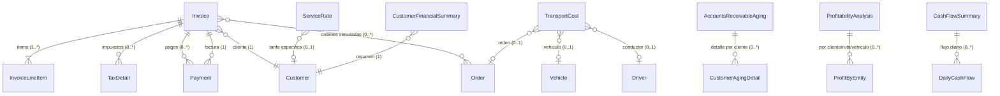

| Entidad | Tipo | Campos clave | Descripcion |
|---|---|---|---|
| **Invoice** | Raiz (agregado) | id, invoiceNumber, type, status, customerId, issueDate, dueDate, subtotal, taxTotal, discountTotal, total, amountPaid, amountDue, lineItems[], taxes[] | Factura de servicio de transporte. Contiene items de linea, impuestos y referencias a ordenes. |
| **InvoiceLineItem** | Sub-entidad | id, description, quantity, unitPrice, unit, taxRate, taxAmount, discount, discountType, subtotal, total, orderId? | Item individual dentro de una factura. Puede vincularse a una orden especifica. |
| **TaxDetail** | Value Object | id, name, code, rate, amount, isInclusive | Impuesto aplicado a la factura (ej: IGV 18%). |
| **Payment** | Entidad | id, paymentNumber, invoiceId, customerId, amount, currency, method, status, paymentDate, referenceNumber?, bankName? | Registro de pago contra una factura. Actualiza automaticamente el estado de la factura. |
| **TransportCost** | Entidad | id, type, category, description, amount, currency, quantity, unitCost, unit, orderId?, vehicleId?, driverId?, isApproved, approvedBy? | Costo operativo de transporte. Requiere aprobacion antes de contabilizarse. |
| **ServiceRate** | Entidad | id, code, name, category, baseRate, currency, unit, minCharge?, maxCharge?, ranges[]?, customerId?, originZone?, destinationZone?, effectiveFrom, isActive | Tarifa configurable para calculo de precios. Soporta tarifas escalonadas por rangos. |
| **CustomerFinancialSummary** | Vista (agregado) | customerId, totalInvoiced, totalPaid, totalDue, overdueAmount, invoiceCount, avgPaymentDays, creditLimit? | Resumen financiero consolidado de un cliente. |
| **FinanceStats** | Vista (agregado) | totalInvoiced, totalPaid, totalPending, totalOverdue, totalCosts, profitMargin, revenueGrowth, costGrowth | Estadisticas generales del modulo financiero. |
| **AccountsReceivableAging** | Vista (agregado) | current, days1to30, days31to60, days61to90, over90Days, total, byCustomer[]? | Analisis de antiguedad de cuentas por cobrar. |
| **ProfitabilityAnalysis** | Vista (agregado) | totalRevenue, totalCosts, grossProfit, grossMarginPercent, operatingProfit, netProfit, byCustomer[]?, byRoute[]?, byVehicle[]? | Analisis de rentabilidad con desglose por entidad. |
| **CashFlowSummary** | Vista (agregado) | openingBalance, closingBalance, totalInflows, totalOutflows, netCashFlow, daily[]? | Resumen de flujo de caja con detalle diario. |

### Campos clave de Invoice (resumen)

| Campo | Tipo | Obligatorio | Descripcion rapida |
|---|---|---|---|
| id | UUID | Si | PK, auto-generado |
| invoiceNumber | String | Si | Numero unico de factura. Formato: INV-YYYY-NNNNN |
| type | InvoiceType | Si | Tipo de factura (service, freight, accessorial, fuel, credit, debit) |
| status | InvoiceStatus | Si | Estado actual de la factura (8 estados posibles) |
| customerId | UUID FK | Si | Cliente al que se factura |
| customerName | String | Si | Nombre del cliente (desnormalizado) |
| customerTaxId | String | No | RUC/RFC del cliente |
| issueDate | DateTime | Si | Fecha de emision |
| dueDate | DateTime | Si | Fecha de vencimiento |
| paidDate | DateTime | No | Fecha de pago completo. Null si no esta pagada |
| currency | String | Si | Moneda (default: PEN) |
| subtotal | Decimal | Si | Suma de items antes de impuestos y descuentos |
| taxTotal | Decimal | Si | Total de impuestos |
| discountTotal | Decimal | Si | Total de descuentos |
| total | Decimal | Si | Monto total = subtotal - discountTotal + taxTotal |
| amountPaid | Decimal | Si | Monto pagado acumulado |
| amountDue | Decimal | Si | Saldo pendiente = total - amountPaid |
| lineItems | InvoiceLineItem[] | Si | Items de linea (min 1) |
| taxes | TaxDetail[] | Si | Detalle de impuestos aplicados |
| orderIds | UUID[] | No | Ordenes vinculadas a esta factura |
| relatedInvoiceId | UUID FK | No | Factura relacionada (para notas de credito/debito) |
| createdBy | String | Si | Usuario que creo la factura |
| sentAt | DateTime | No | Fecha/hora de envio al cliente |

### Campos clave de TransportCost (resumen)

| Campo | Tipo | Obligatorio | Descripcion rapida |
|---|---|---|---|
| id | UUID | Si | PK, auto-generado |
| type | CostType | Si | Tipo de costo (fuel, toll, maintenance, etc.) |
| category | String | Si | Categoria libre (ej: operativo, mantenimiento) |
| description | String | Si | Descripcion del gasto |
| amount | Decimal | Si | Monto total del costo |
| currency | String | Si | Moneda (default: PEN) |
| quantity | Decimal | Si | Cantidad de unidades |
| unitCost | Decimal | Si | Costo por unidad = amount / quantity |
| unit | String | Si | Unidad de medida (galon, viaje, servicio) |
| orderId | UUID FK | No | Orden de transporte asociada |
| vehicleId | UUID FK | No | Vehiculo asociado |
| driverId | UUID FK | No | Conductor asociado |
| date | DateTime | Si | Fecha del gasto |
| isReimbursable | Boolean | Si | Si es reembolsable al conductor |
| isApproved | Boolean | Si | Si el costo esta aprobado. Default: false |
| approvedBy | String | No | Usuario que aprobo el costo |
| approvedAt | DateTime | No | Fecha/hora de aprobacion |
| receiptNumber | String | No | Numero de recibo/comprobante |

---

# 3. Modelo de Base de Datos — PostgreSQL

> Esquema relacional para PostgreSQL + PostGIS. Todas las tablas usan `UUID` como PK y timestamps UTC. Filtro `tenant_id` obligatorio en todas las consultas (multi-tenant).

### Diagrama Entidad-Relacion

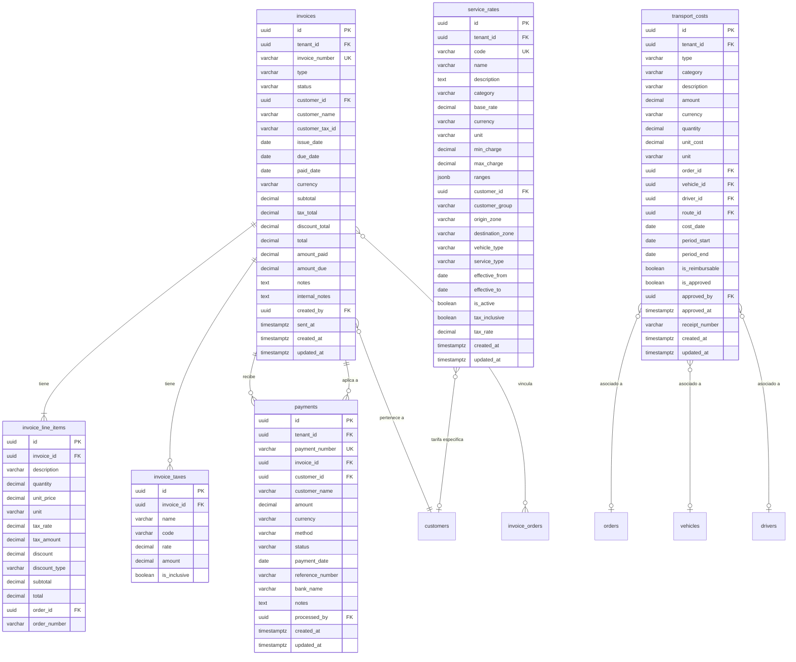

### Tablas, Columnas y Tipos de Dato

#### Tabla: `invoices` (Facturas de transporte)

> Tabla principal del modulo financiero. Una factura puede referenciar multiples ordenes y recibir multiples pagos. El campo `amount_due` se recalcula automaticamente al registrar pagos.

| Columna | Tipo PostgreSQL | Nullable | Default | Constraint | Descripcion |
|---|---|---|---|---|---|
| id | UUID | NO | gen_random_uuid() | PK | Identificador unico |
| tenant_id | UUID | NO | - | FK tenants(id) | Aislamiento multi-tenant |
| invoice_number | VARCHAR(30) | NO | - | UNIQUE per tenant | Numero de factura INV-YYYY-NNNNN |
| type | VARCHAR(20) | NO | 'service' | CHECK(valid_type) | Tipo: service, freight, accessorial, fuel, credit, debit |
| status | VARCHAR(20) | NO | 'draft' | CHECK(valid_status) | Estado de la factura (8 valores) |
| customer_id | UUID | NO | - | FK customers(id) | Cliente facturado |
| customer_name | VARCHAR(200) | NO | - | - | Nombre del cliente (desnormalizado) |
| customer_tax_id | VARCHAR(20) | SI | NULL | - | RUC/RFC del cliente |
| customer_address | TEXT | SI | NULL | - | Direccion del cliente |
| customer_email | VARCHAR(200) | SI | NULL | - | Email del cliente |
| issue_date | DATE | NO | CURRENT_DATE | - | Fecha de emision |
| due_date | DATE | NO | - | CHECK(>= issue_date) | Fecha de vencimiento |
| paid_date | DATE | SI | NULL | - | Fecha de pago completo |
| currency | VARCHAR(3) | NO | 'PEN' | - | Moneda ISO 4217 |
| subtotal | DECIMAL(15,2) | NO | 0 | CHECK(>= 0) | Subtotal antes de impuestos |
| tax_total | DECIMAL(15,2) | NO | 0 | CHECK(>= 0) | Total impuestos |
| discount_total | DECIMAL(15,2) | NO | 0 | CHECK(>= 0) | Total descuentos |
| total | DECIMAL(15,2) | NO | 0 | CHECK(>= 0) | Total factura |
| amount_paid | DECIMAL(15,2) | NO | 0 | CHECK(>= 0) | Monto pagado acumulado |
| amount_due | DECIMAL(15,2) | NO | 0 | CHECK(>= 0) | Saldo pendiente |
| related_invoice_id | UUID | SI | NULL | FK invoices(id) | Factura relacionada (credito/debito) |
| purchase_order_number | VARCHAR(50) | SI | NULL | - | Numero de orden de compra del cliente |
| notes | TEXT | SI | NULL | - | Notas visibles al cliente |
| internal_notes | TEXT | SI | NULL | - | Notas internas |
| terms_and_conditions | TEXT | SI | NULL | - | Terminos y condiciones |
| created_by | UUID | NO | - | FK users(id) | Usuario creador |
| sent_at | TIMESTAMPTZ | SI | NULL | - | Fecha/hora de envio |
| created_at | TIMESTAMPTZ | NO | NOW() | - | Fecha de creacion |
| updated_at | TIMESTAMPTZ | NO | NOW() | - | Ultima actualizacion |

#### Tabla: `invoice_line_items` (Items de linea de factura)

| Columna | Tipo PostgreSQL | Nullable | Default | Constraint | Descripcion |
|---|---|---|---|---|---|
| id | UUID | NO | gen_random_uuid() | PK | Identificador unico |
| invoice_id | UUID | NO | - | FK invoices(id) ON DELETE CASCADE | Factura padre |
| description | VARCHAR(500) | NO | - | - | Descripcion del servicio |
| quantity | DECIMAL(10,3) | NO | 1 | CHECK(> 0) | Cantidad |
| unit_price | DECIMAL(15,2) | NO | - | CHECK(>= 0) | Precio unitario |
| unit | VARCHAR(20) | NO | 'unidad' | - | Unidad de medida |
| tax_rate | DECIMAL(5,2) | NO | 0 | CHECK(>= 0) | Tasa de impuesto (%) |
| tax_amount | DECIMAL(15,2) | NO | 0 | - | Monto de impuesto calculado |
| discount | DECIMAL(15,2) | NO | 0 | CHECK(>= 0) | Descuento aplicado |
| discount_type | VARCHAR(10) | NO | 'percentage' | CHECK(percentage/fixed) | Tipo de descuento |
| subtotal | DECIMAL(15,2) | NO | - | - | Subtotal = quantity * unit_price |
| total | DECIMAL(15,2) | NO | - | - | Total con impuestos y descuentos |
| order_id | UUID | SI | NULL | FK orders(id) | Orden vinculada |
| order_number | VARCHAR(30) | SI | NULL | - | Numero de orden (desnormalizado) |

#### Tabla: `payments` (Pagos recibidos)

| Columna | Tipo PostgreSQL | Nullable | Default | Constraint | Descripcion |
|---|---|---|---|---|---|
| id | UUID | NO | gen_random_uuid() | PK | Identificador unico |
| tenant_id | UUID | NO | - | FK tenants(id) | Aislamiento multi-tenant |
| payment_number | VARCHAR(30) | NO | - | UNIQUE per tenant | Numero de pago PAY-YYYY-NNNNN |
| invoice_id | UUID | NO | - | FK invoices(id) | Factura a la que se aplica |
| customer_id | UUID | NO | - | FK customers(id) | Cliente que paga |
| customer_name | VARCHAR(200) | NO | - | - | Nombre del cliente (desnormalizado) |
| amount | DECIMAL(15,2) | NO | - | CHECK(> 0) | Monto del pago |
| currency | VARCHAR(3) | NO | 'PEN' | - | Moneda |
| method | VARCHAR(20) | NO | - | CHECK(valid_method) | Metodo de pago (7 valores) |
| status | VARCHAR(20) | NO | 'pending' | CHECK(valid_status) | Estado del pago (6 valores) |
| payment_date | DATE | NO | - | - | Fecha del pago |
| reference_number | VARCHAR(50) | SI | NULL | - | Numero de referencia bancaria |
| bank_name | VARCHAR(100) | SI | NULL | - | Nombre del banco |
| account_number | VARCHAR(30) | SI | NULL | - | Numero de cuenta (parcial) |
| check_number | VARCHAR(20) | SI | NULL | - | Numero de cheque |
| notes | TEXT | SI | NULL | - | Observaciones |
| processed_by | UUID | SI | NULL | FK users(id) | Usuario que proceso |
| created_at | TIMESTAMPTZ | NO | NOW() | - | Fecha de creacion |
| updated_at | TIMESTAMPTZ | NO | NOW() | - | Ultima actualizacion |

#### Tabla: `transport_costs` (Costos de transporte)

| Columna | Tipo PostgreSQL | Nullable | Default | Constraint | Descripcion |
|---|---|---|---|---|---|
| id | UUID | NO | gen_random_uuid() | PK | Identificador unico |
| tenant_id | UUID | NO | - | FK tenants(id) | Aislamiento multi-tenant |
| type | VARCHAR(20) | NO | - | CHECK(valid_type) | Tipo de costo (10 valores) |
| category | VARCHAR(50) | NO | 'general' | - | Categoria libre |
| description | VARCHAR(500) | NO | - | - | Descripcion del gasto |
| amount | DECIMAL(15,2) | NO | - | CHECK(> 0) | Monto total |
| currency | VARCHAR(3) | NO | 'PEN' | - | Moneda |
| quantity | DECIMAL(10,3) | NO | 1 | CHECK(> 0) | Cantidad |
| unit_cost | DECIMAL(15,2) | NO | - | CHECK(>= 0) | Costo unitario |
| unit | VARCHAR(20) | NO | 'unidad' | - | Unidad de medida |
| order_id | UUID | SI | NULL | FK orders(id) | Orden asociada |
| vehicle_id | UUID | SI | NULL | FK vehicles(id) | Vehiculo asociado |
| driver_id | UUID | SI | NULL | FK drivers(id) | Conductor asociado |
| route_id | UUID | SI | NULL | FK routes(id) | Ruta asociada |
| cost_date | DATE | NO | - | - | Fecha del gasto |
| period_start | DATE | SI | NULL | - | Inicio del periodo (costos periodicos) |
| period_end | DATE | SI | NULL | - | Fin del periodo |
| is_reimbursable | BOOLEAN | NO | false | - | Si es reembolsable |
| is_approved | BOOLEAN | NO | false | - | Si esta aprobado |
| approved_by | UUID | SI | NULL | FK users(id) | Aprobador |
| approved_at | TIMESTAMPTZ | SI | NULL | - | Fecha de aprobacion |
| receipt_number | VARCHAR(50) | SI | NULL | - | Numero de recibo |
| created_at | TIMESTAMPTZ | NO | NOW() | - | Fecha de creacion |
| updated_at | TIMESTAMPTZ | NO | NOW() | - | Ultima actualizacion |

#### Tabla: `service_rates` (Tarifas de servicio)

| Columna | Tipo PostgreSQL | Nullable | Default | Constraint | Descripcion |
|---|---|---|---|---|---|
| id | UUID | NO | gen_random_uuid() | PK | Identificador unico |
| tenant_id | UUID | NO | - | FK tenants(id) | Aislamiento multi-tenant |
| code | VARCHAR(30) | NO | - | UNIQUE per tenant | Codigo unico de tarifa |
| name | VARCHAR(200) | NO | - | - | Nombre descriptivo |
| description | TEXT | SI | NULL | - | Descripcion detallada |
| category | VARCHAR(20) | NO | - | CHECK(valid_category) | Categoria (8 valores) |
| base_rate | DECIMAL(15,4) | NO | - | CHECK(> 0) | Tarifa base |
| currency | VARCHAR(3) | NO | 'PEN' | - | Moneda |
| unit | VARCHAR(20) | NO | - | - | Unidad (kg, m3, km, viaje, hora, paquete, pallet) |
| min_charge | DECIMAL(15,2) | SI | NULL | CHECK(> 0) | Cargo minimo |
| max_charge | DECIMAL(15,2) | SI | NULL | CHECK(> min_charge) | Cargo maximo |
| ranges | JSONB | SI | NULL | - | Rangos para tarifas escalonadas [{from, to, rate}] |
| customer_id | UUID | SI | NULL | FK customers(id) | Tarifa especifica de cliente |
| customer_group | VARCHAR(50) | SI | NULL | - | Grupo de clientes |
| origin_zone | VARCHAR(50) | SI | NULL | - | Zona de origen |
| destination_zone | VARCHAR(50) | SI | NULL | - | Zona de destino |
| vehicle_type | VARCHAR(30) | SI | NULL | - | Tipo de vehiculo |
| service_type | VARCHAR(30) | SI | NULL | - | Tipo de servicio |
| effective_from | DATE | NO | - | - | Fecha de inicio de vigencia |
| effective_to | DATE | SI | NULL | CHECK(> effective_from) | Fecha de fin de vigencia |
| is_active | BOOLEAN | NO | true | - | Si la tarifa esta activa |
| tax_inclusive | BOOLEAN | NO | false | - | Si incluye impuestos |
| tax_rate | DECIMAL(5,2) | SI | NULL | - | Tasa de impuesto aplicable |
| created_at | TIMESTAMPTZ | NO | NOW() | - | Fecha de creacion |
| updated_at | TIMESTAMPTZ | NO | NOW() | - | Ultima actualizacion |

### Indices Recomendados

| Tabla | Indice | Columnas | Tipo | Justificacion |
|---|---|---|---|---|
| invoices | idx_inv_tenant | tenant_id | B-tree | Filtro obligatorio multi-tenant |
| invoices | idx_inv_tenant_status | tenant_id, status | B-tree | Listado por estado (filtro principal) |
| invoices | idx_inv_tenant_customer | tenant_id, customer_id | B-tree | Facturas por cliente |
| invoices | idx_inv_tenant_dates | tenant_id, issue_date, due_date | B-tree | Filtro por rango de fechas |
| invoices | idx_inv_overdue | tenant_id, status, due_date | B-tree (parcial) | WHERE status IN ('sent','partial') AND due_date < NOW() |
| invoices | idx_inv_number | tenant_id, invoice_number | B-tree UNIQUE | Busqueda por numero de factura |
| payments | idx_pay_tenant | tenant_id | B-tree | Filtro multi-tenant |
| payments | idx_pay_invoice | tenant_id, invoice_id | B-tree | Pagos por factura |
| payments | idx_pay_customer | tenant_id, customer_id | B-tree | Pagos por cliente |
| payments | idx_pay_date | tenant_id, payment_date | B-tree | Filtro por fecha de pago |
| transport_costs | idx_cost_tenant | tenant_id | B-tree | Filtro multi-tenant |
| transport_costs | idx_cost_type | tenant_id, type | B-tree | Costos por tipo |
| transport_costs | idx_cost_vehicle | tenant_id, vehicle_id | B-tree | Costos por vehiculo |
| transport_costs | idx_cost_order | tenant_id, order_id | B-tree | Costos por orden |
| transport_costs | idx_cost_approval | tenant_id, is_approved | B-tree (parcial) | WHERE is_approved = false |
| service_rates | idx_rate_tenant | tenant_id | B-tree | Filtro multi-tenant |
| service_rates | idx_rate_zones | tenant_id, origin_zone, destination_zone | B-tree | Busqueda por ruta |
| service_rates | idx_rate_active | tenant_id, is_active | B-tree (parcial) | WHERE is_active = true |
| service_rates | idx_rate_code | tenant_id, code | B-tree UNIQUE | Busqueda por codigo |

### Relaciones con Tablas de Otros Modulos (FK externas)

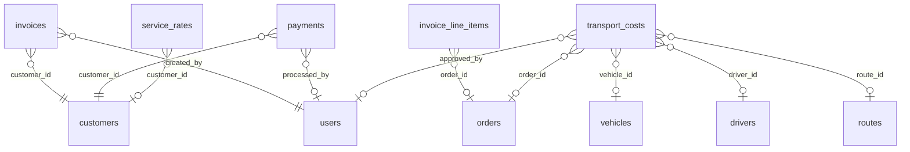

---

# 4. Maquina de Estados — InvoiceStatus

**8 estados, 2 terminales (paid, cancelled)**

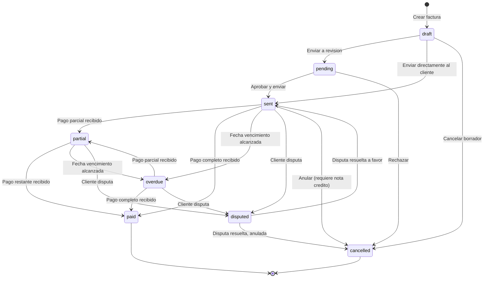

### Tabla de estados

| # | Estado | Etiqueta | Color | Terminal | Transiciones de salida |
|---|---|---|---|---|---|
| 1 | draft | Borrador | gray | No | pending, sent, cancelled |
| 2 | pending | Pendiente | yellow | No | sent, cancelled |
| 3 | sent | Enviada | blue | No | partial, paid, overdue, disputed, cancelled |
| 4 | partial | Pago Parcial | orange | No | paid, overdue, disputed |
| 5 | paid | Pagada | green | Si | - (terminal) |
| 6 | overdue | Vencida | red | No | partial, paid, disputed |
| 7 | cancelled | Cancelada | gray | Si | - (terminal) |
| 8 | disputed | En Disputa | purple | No | sent, cancelled |

---

# 5. Maquina de Estados — PaymentStatus

**6 estados, 4 terminales (completed, failed, refunded, cancelled)**

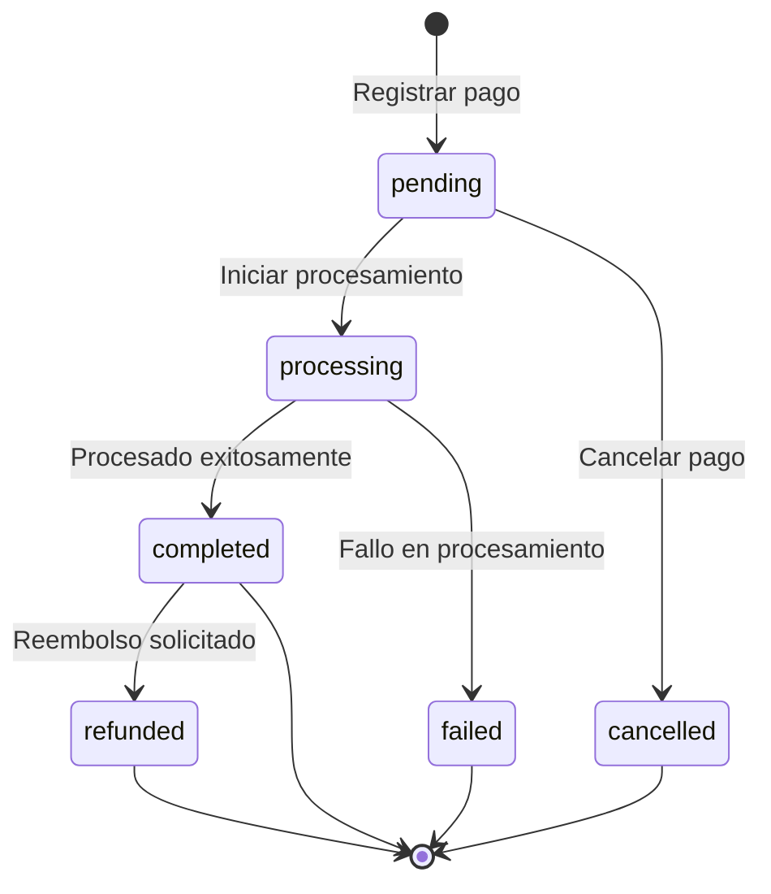

### Tabla de estados

| # | Estado | Etiqueta | Color | Terminal | Transiciones de salida |
|---|---|---|---|---|---|
| 1 | pending | Pendiente | yellow | No | processing, cancelled |
| 2 | processing | En Proceso | blue | No | completed, failed |
| 3 | completed | Completado | green | Si | refunded |
| 4 | failed | Fallido | red | Si | - (terminal) |
| 5 | refunded | Reembolsado | orange | Si | - (terminal) |
| 6 | cancelled | Cancelado | gray | Si | - (terminal) |

---

# 6. Catalogos y Enumeraciones

### InvoiceType — Tipos de factura

| Valor | Etiqueta | Descripcion |
|---|---|---|
| service | Servicio de transporte | Factura por servicio de transporte regular |
| freight | Flete | Factura por servicio de flete/carga |
| accessorial | Servicios adicionales | Cargos por servicios complementarios (esperas, maniobras) |
| fuel | Combustible | Factura por recargo de combustible |
| credit | Nota de credito | Documento que reduce el saldo a favor del cliente |
| debit | Nota de debito | Documento que incrementa el saldo a cobrar |

### PaymentMethod — Metodos de pago

| Valor | Etiqueta | Descripcion |
|---|---|---|
| cash | Efectivo | Pago en efectivo |
| bank_transfer | Transferencia bancaria | Transferencia electronica entre cuentas |
| check | Cheque | Pago con cheque bancario |
| credit_card | Tarjeta de credito | Pago con tarjeta de credito |
| debit_card | Tarjeta de debito | Pago con tarjeta de debito |
| credit | Credito a cuenta | Pago aplicado contra credito disponible del cliente |
| other | Otro | Otro metodo de pago |

### CostType — Tipos de costo de transporte

| Valor | Etiqueta | Descripcion |
|---|---|---|
| fuel | Combustible | Gasto de combustible (diesel, gasolina, GNV) |
| toll | Peajes | Peajes de rutas y autopistas |
| maintenance | Mantenimiento | Costos de mantenimiento vehicular |
| insurance | Seguro | Primas de seguro de carga y vehicular |
| labor | Mano de obra | Salarios y viaticos de conductores |
| depreciation | Depreciacion | Depreciacion de vehiculos y equipos |
| administrative | Administrativo | Gastos administrativos generales |
| accessorial | Servicios adicionales | Costos de servicios complementarios |
| penalty | Multas/Penalidades | Multas de transito y penalidades contractuales |
| other | Otros | Otros costos no clasificados |

### RateCategory — Categorias de tarifa

| Valor | Etiqueta | Unidad tipica | Descripcion |
|---|---|---|---|
| weight | Por peso | kg | Tarifa calculada segun peso de la carga |
| volume | Por volumen | m3 | Tarifa calculada segun volumen de la carga |
| distance | Por distancia | km | Tarifa calculada segun distancia del recorrido |
| flat | Tarifa plana | viaje | Precio fijo por servicio |
| hourly | Por hora | hora | Tarifa calculada por tiempo de servicio |
| package | Por paquete | paquete | Tarifa por unidad de paquete |
| pallet | Por pallet | pallet | Tarifa por unidad de pallet |
| custom | Personalizada | variable | Tarifa con logica de calculo personalizada |

---

# 7. Tabla de Referencia Operativa de Transiciones

> Tabla unificada que cruza: estado origen/destino, endpoint/trigger, payload, validaciones, actor, evento emitido e idempotencia.

### Transiciones de InvoiceStatus

| # | From | To | Endpoint / Trigger | Validaciones | Actor | Evento | Idempotente |
|---|---|---|---|---|---|---|---|
| T-01 | (nuevo) | draft | `POST /api/v1/finance/invoices` | customerId existe, dueDate >= issueDate, min 1 lineItem | Owner / Usuario Maestro / Subusuario (`invoices:create`) | `invoice.created` | No |
| T-02 | draft | pending | `PATCH .../invoices/:id/status` | Invoice en draft, lineItems validados | Owner / Usuario Maestro | `invoice.submitted` | Si |
| T-03 | draft | sent | `POST .../invoices/:id/send` | Invoice en draft, customer con email | Owner / Usuario Maestro | `invoice.sent` | Si |
| T-04 | draft | cancelled | `PATCH .../invoices/:id/status` | Invoice en draft | Owner / Usuario Maestro | `invoice.cancelled` | Si |
| T-05 | pending | sent | `POST .../invoices/:id/send` | Invoice en pending | Owner / Usuario Maestro | `invoice.sent` | Si |
| T-06 | pending | cancelled | `PATCH .../invoices/:id/status` | Invoice en pending | Owner / Usuario Maestro | `invoice.cancelled` | Si |
| T-07 | sent | partial | `POST /api/v1/finance/payments` (auto) | Pago registrado, 0 < amountPaid < total | Sistema (via recordPayment) | `invoice.partial_payment` | No |
| T-08 | sent | paid | `POST /api/v1/finance/payments` (auto) | Pago registrado, amountPaid >= total | Sistema (via recordPayment) | `invoice.paid` | No |
| T-09 | sent | overdue | Trigger: CRON diario | due_date < NOW(), status = sent | Sistema (scheduler) | `invoice.overdue` | Si |
| T-10 | sent | disputed | `PATCH .../invoices/:id/status` | Invoice en sent | Owner / Usuario Maestro | `invoice.disputed` | Si |
| T-11 | sent | cancelled | `PATCH .../invoices/:id/status` | Invoice en sent, requiere nota credito | Owner / Usuario Maestro | `invoice.cancelled` | Si |
| T-12 | partial | paid | `POST /api/v1/finance/payments` (auto) | Pago registrado, amountPaid >= total | Sistema (via recordPayment) | `invoice.paid` | No |
| T-13 | partial | overdue | Trigger: CRON diario | due_date < NOW(), status = partial | Sistema (scheduler) | `invoice.overdue` | Si |
| T-14 | partial | disputed | `PATCH .../invoices/:id/status` | Invoice en partial | Owner / Usuario Maestro | `invoice.disputed` | Si |
| T-15 | overdue | partial | `POST /api/v1/finance/payments` (auto) | Pago parcial en factura vencida | Sistema (via recordPayment) | `invoice.partial_payment` | No |
| T-16 | overdue | paid | `POST /api/v1/finance/payments` (auto) | Pago completo en factura vencida | Sistema (via recordPayment) | `invoice.paid` | No |
| T-17 | overdue | disputed | `PATCH .../invoices/:id/status` | Invoice en overdue | Owner / Usuario Maestro | `invoice.disputed` | Si |
| T-18 | disputed | sent | `PATCH .../invoices/:id/status` | Disputa resuelta, factura valida | Owner / Usuario Maestro | `invoice.dispute_resolved` | Si |
| T-19 | disputed | cancelled | `PATCH .../invoices/:id/status` | Disputa resuelta, factura anulada | Owner / Usuario Maestro | `invoice.cancelled` | Si |

### Transiciones de PaymentStatus

| # | From | To | Endpoint / Trigger | Validaciones | Actor | Evento | Idempotente |
|---|---|---|---|---|---|---|---|
| T-20 | (nuevo) | pending | `POST /api/v1/finance/payments` | invoiceId valido, amount > 0, amount <= amountDue | Owner / Usuario Maestro / Subusuario (`payments:create`) | `payment.created` | No |
| T-21 | pending | processing | Sistema (pasarela de pago) | Pago en pending | Sistema | `payment.processing` | Si |
| T-22 | pending | cancelled | (manual o timeout) | Pago en pending | Owner / Usuario Maestro | `payment.cancelled` | Si |
| T-23 | processing | completed | Sistema (confirmacion banco) | Procesamiento exitoso | Sistema | `payment.completed` | Si |
| T-24 | processing | failed | Sistema (rechazo banco) | Procesamiento fallido | Sistema | `payment.failed` | Si |
| T-25 | completed | refunded | (manual, requiere autorizacion) | Pago completado, monto disponible | Owner / Usuario Maestro | `payment.refunded` | Si |

> **Restriccion T-04, T-06, T-11:** Cancelar factura solo **Owner** o **Usuario Maestro**. Subusuario NO puede cancelar facturas.
> **Restriccion T-10, T-14, T-17:** Marcar como disputa solo **Owner** o **Usuario Maestro**. Requiere justificacion documentada.
> **Restriccion T-18, T-19:** Resolver disputa solo **Owner** o **Usuario Maestro**.
> **Restriccion T-25:** Reembolso solo **Owner** o **Usuario Maestro**. Requiere autorizacion adicional.

---

# 8. Casos de Uso — Referencia Backend

> **14 Casos de Uso** con precondiciones, flujo principal, excepciones y postcondiciones.

### Matriz Actor x Caso de Uso

> **Modelo de 3 roles (definicion Edson):** Owner (Super Admin TMS), Usuario Maestro (Admin de cuenta cliente), Subusuario (Operador con permisos configurables).
> **Leyenda:** Si = Permitido | Configurable = Permitido si el Usuario Maestro le asigno el permiso | No = Denegado

| Caso de Uso | Owner | Usuario Maestro | Subusuario | Sistema |
|---|:---:|:---:|:---:|:---:|
| CU-01: Listar Facturas | Si | Si | Configurable `invoices:read` | - |
| CU-02: Crear Factura | Si | Si | Configurable `invoices:create` | - |
| CU-03: Enviar Factura al Cliente | Si | Si | No | - |
| CU-04: Cancelar Factura | Si | Si | No | - |
| CU-05: Registrar Pago | Si | Si | Configurable `payments:create` | - |
| CU-06: Registrar Costo de Transporte | Si | Si | Configurable `costs:create` | Si (auto) |
| CU-07: Aprobar Costo de Transporte | Si | Si | No | - |
| CU-08: Consultar Tarifas | Si | Si | Configurable `rates:read` | - |
| CU-09: Calcular Tarifa por Ruta | Si | Si | Configurable `rates:read` | - |
| CU-10: Consultar Estadisticas Financieras | Si | Si | No | - |
| CU-11: Consultar Cuentas por Cobrar (Aging) | Si | Si | No | - |
| CU-12: Analizar Rentabilidad | Si | Si | No | - |
| CU-13: Consultar Flujo de Caja | Si | Si | No | - |
| CU-14: Consultar Resumen Financiero de Cliente | Si | Si | No | - |

> **Restriccion CU-03, CU-04:** Enviar y cancelar facturas requiere autorizacion administrativa. Solo **Owner** y **Usuario Maestro**.
> **Restriccion CU-07:** Aprobar costos es operacion administrativa. Solo **Owner** y **Usuario Maestro**.
> **Restriccion CU-10 a CU-14:** Analisis financiero es informacion sensible. Solo **Owner** y **Usuario Maestro**.
> **Nota:** Los permisos del Subusuario son configurables por el Usuario Maestro. Un Subusuario sin el permiso correspondiente recibira HTTP `403 FORBIDDEN`.

---

## CU-01: Listar Facturas

| Atributo | Valor |
|---|---|
| **Endpoint** | `GET /api/v1/finance/invoices` |
| **Actor Principal** | Owner / Usuario Maestro / Subusuario (permiso `invoices:read`) |
| **Trigger** | Usuario accede al listado de facturas |
| **Frecuencia** | Alta — multiples veces al dia |

**Precondiciones (backend DEBE validar)**

| # | Precondicion | Si no se cumple |
|---|---|---|
| PRE-01 | Token JWT valido y no expirado | HTTP `401 UNAUTHORIZED` |
| PRE-02 | Usuario tiene permiso `invoices:read` | HTTP `403 FORBIDDEN` |

**Secuencia Backend (flujo principal)**

| Paso | Accion del backend | Detalle |
|---|---|---|
| 1 | Validar JWT y extraer tenant_id | Middleware de autenticacion |
| 2 | Validar permiso `invoices:read` | Middleware RBAC |
| 3 | Parsear filtros del query string | search, status[], type[], customerId, startDate, endDate, minAmount, maxAmount, isOverdue, hasBalance |
| 4 | Consultar invoices WHERE tenant_id = :tenantId | Aplicar filtros, ordenar por issue_date DESC |
| 5 | Paginar resultados | page, pageSize (default 20) |
| 6 | Retornar { data, total, page, pageSize } | HTTP 200 |

**Postcondiciones (backend DEBE garantizar)**

| # | Postcondicion | Verificacion |
|---|---|---|
| POST-01 | Solo facturas del tenant del usuario retornadas | Verificar tenant_id en WHERE |
| POST-02 | Paginacion correcta | total refleja cantidad real filtrada |

**Excepciones**

| HTTP | Codigo | Cuando | Respuesta |
|---|---|---|---|
| 400 | INVALID_FILTERS | Filtros con formato invalido | Detalle del campo erroneo |
| 401 | UNAUTHORIZED | Token ausente o expirado | Redirigir a login |
| 403 | FORBIDDEN | Sin permiso invoices:read | Mensaje de acceso denegado |

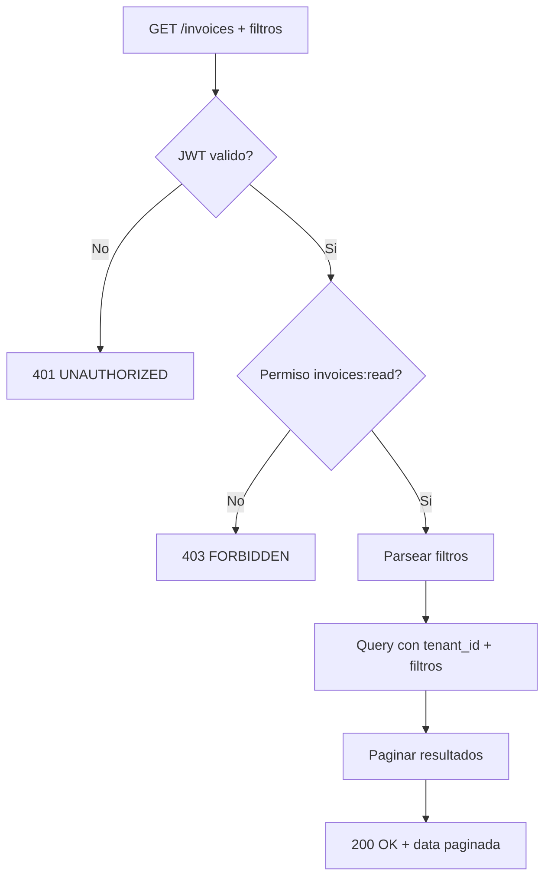

---

## CU-02: Crear Factura

| Atributo | Valor |
|---|---|
| **Endpoint** | `POST /api/v1/finance/invoices` |
| **Actor Principal** | Owner / Usuario Maestro / Subusuario (permiso `invoices:create`) |
| **Trigger** | Usuario crea nueva factura desde el formulario |
| **Frecuencia** | Media — varias veces al dia |

**Precondiciones (backend DEBE validar)**

| # | Precondicion | Si no se cumple |
|---|---|---|
| PRE-01 | Token JWT valido y no expirado | HTTP `401 UNAUTHORIZED` |
| PRE-02 | Usuario tiene permiso `invoices:create` | HTTP `403 FORBIDDEN` |
| PRE-03 | customerId existe y pertenece al tenant | HTTP `404 CUSTOMER_NOT_FOUND` |
| PRE-04 | dueDate >= issueDate | HTTP `400 VALIDATION_ERROR` |
| PRE-05 | Al menos 1 lineItem con quantity > 0 y unitPrice >= 0 | HTTP `400 VALIDATION_ERROR` |

**Secuencia Backend (flujo principal)**

| Paso | Accion del backend | Detalle |
|---|---|---|
| 1 | Validar JWT y extraer tenant_id | Middleware de autenticacion |
| 2 | Validar permiso `invoices:create` | Middleware RBAC |
| 3 | Validar schema Zod del body | CreateInvoiceDTO |
| 4 | Verificar que customerId existe en tenant | Query customers WHERE id AND tenant_id |
| 5 | Generar invoice_number secuencial | Formato INV-YYYY-NNNNN, unico por tenant |
| 6 | Calcular totales de line items | subtotal, taxAmount, discount, total por item |
| 7 | Calcular totales de factura | subtotal, taxTotal, discountTotal, total |
| 8 | Insertar invoice con status = 'draft' | amount_paid = 0, amount_due = total |
| 9 | Insertar line items | Bulk insert en invoice_line_items |
| 10 | Insertar taxes | Calcular IGV u otros impuestos |
| 11 | Emitir evento `invoice.created` | Payload: invoiceId, customerId, total |
| 12 | Retornar factura creada | HTTP 201 |

**Postcondiciones (backend DEBE garantizar)**

| # | Postcondicion | Verificacion |
|---|---|---|
| POST-01 | Factura creada con status = 'draft' | SELECT status WHERE id |
| POST-02 | invoice_number unico dentro del tenant | Constraint UNIQUE |
| POST-03 | Totales calculados correctamente | total = subtotal - discountTotal + taxTotal |
| POST-04 | amount_due = total (sin pagos) | amount_paid = 0 |
| POST-05 | Evento invoice.created emitido | Log de eventos |

**Excepciones**

| HTTP | Codigo | Cuando | Respuesta |
|---|---|---|---|
| 400 | VALIDATION_ERROR | Campos invalidos | Detalle de validacion Zod |
| 404 | CUSTOMER_NOT_FOUND | customerId no existe en tenant | "Cliente no encontrado" |
| 409 | DUPLICATE_NUMBER | Colision de invoice_number | Reintentar generacion |

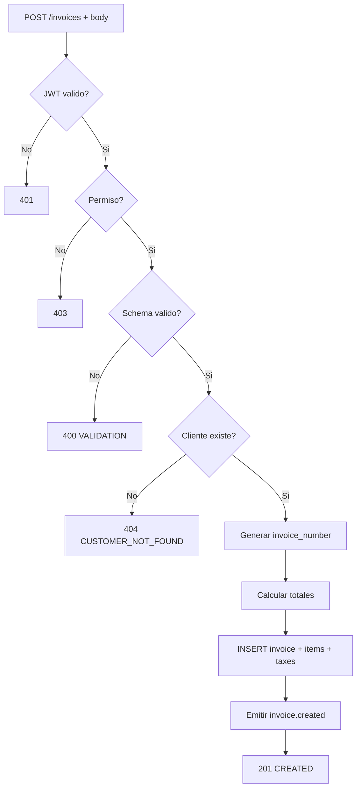

---

## CU-03: Enviar Factura al Cliente

| Atributo | Valor |
|---|---|
| **Endpoint** | `POST /api/v1/finance/invoices/:id/send` |
| **Actor Principal** | Owner / Usuario Maestro. Subusuario: DENEGADO |
| **Trigger** | Usuario envia factura al cliente |
| **Frecuencia** | Media |

**Precondiciones (backend DEBE validar)**

| # | Precondicion | Si no se cumple |
|---|---|---|
| PRE-01 | Token JWT valido y no expirado | HTTP `401 UNAUTHORIZED` |
| PRE-02 | Usuario es Owner o Usuario Maestro | HTTP `403 FORBIDDEN` |
| PRE-03 | Factura existe y pertenece al tenant | HTTP `404 NOT_FOUND` |
| PRE-04 | Factura en estado draft o pending | HTTP `409 INVALID_STATUS` |

**Secuencia Backend (flujo principal)**

| Paso | Accion del backend | Detalle |
|---|---|---|
| 1 | Validar JWT y permisos (Owner/UM) | Middleware |
| 2 | Buscar factura por id + tenant_id | Query invoices |
| 3 | Validar status IN ('draft', 'pending') | Maquina de estados |
| 4 | Actualizar status = 'sent', sent_at = NOW() | UPDATE invoices |
| 5 | Notificar al cliente por email | Enviar copia de factura |
| 6 | Emitir evento `invoice.sent` | Payload: invoiceId, customerId |
| 7 | Retornar factura actualizada | HTTP 200 |

**Postcondiciones (backend DEBE garantizar)**

| # | Postcondicion | Verificacion |
|---|---|---|
| POST-01 | Status actualizado a 'sent' | SELECT status WHERE id |
| POST-02 | sent_at registrado | Timestamp no nulo |
| POST-03 | Email enviado al cliente | Log de notificaciones |

**Excepciones**

| HTTP | Codigo | Cuando | Respuesta |
|---|---|---|---|
| 404 | NOT_FOUND | Factura no existe en tenant | "Factura no encontrada" |
| 409 | INVALID_STATUS | Factura no esta en draft/pending | "Solo se pueden enviar facturas en borrador o pendientes" |

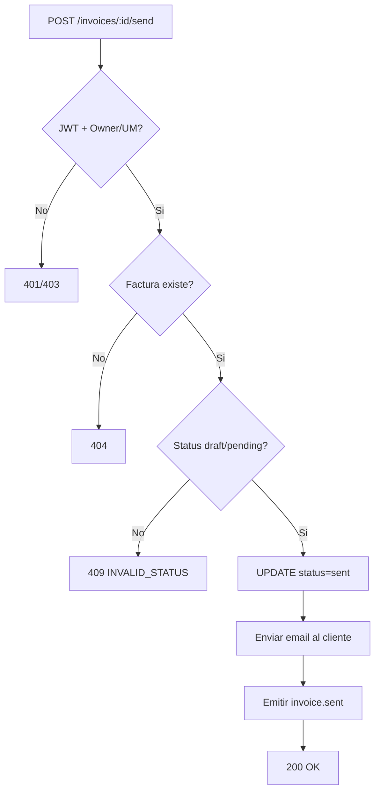

---

## CU-04: Cancelar Factura

| Atributo | Valor |
|---|---|
| **Endpoint** | `PATCH /api/v1/finance/invoices/:id/status` |
| **Actor Principal** | Owner / Usuario Maestro. Subusuario: DENEGADO |
| **Trigger** | Usuario cancela una factura |
| **Frecuencia** | Baja |

**Precondiciones (backend DEBE validar)**

| # | Precondicion | Si no se cumple |
|---|---|---|
| PRE-01 | Token JWT valido y no expirado | HTTP `401 UNAUTHORIZED` |
| PRE-02 | Usuario es Owner o Usuario Maestro | HTTP `403 FORBIDDEN` |
| PRE-03 | Factura existe y pertenece al tenant | HTTP `404 NOT_FOUND` |
| PRE-04 | Factura no esta en estado paid | HTTP `409 INVALID_STATUS` |
| PRE-05 | Si factura tiene pagos, generar nota de credito | Regla de negocio R-06 |

**Secuencia Backend (flujo principal)**

| Paso | Accion del backend | Detalle |
|---|---|---|
| 1 | Validar JWT y permisos | Owner o UM |
| 2 | Buscar factura por id + tenant_id | Query invoices |
| 3 | Validar status != 'paid' AND status != 'cancelled' | Transicion valida |
| 4 | Si amountPaid > 0, crear nota de credito | Factura tipo 'credit' vinculada |
| 5 | Actualizar status = 'cancelled' | UPDATE invoices |
| 6 | Emitir evento `invoice.cancelled` | Payload: invoiceId, reason |
| 7 | Retornar factura actualizada | HTTP 200 |

**Postcondiciones (backend DEBE garantizar)**

| # | Postcondicion | Verificacion |
|---|---|---|
| POST-01 | Status actualizado a 'cancelled' | SELECT status WHERE id |
| POST-02 | Si habia pagos, nota de credito creada | Factura tipo 'credit' con relatedInvoiceId |

**Excepciones**

| HTTP | Codigo | Cuando | Respuesta |
|---|---|---|---|
| 404 | NOT_FOUND | Factura no existe | "Factura no encontrada" |
| 409 | INVALID_STATUS | Factura ya pagada o cancelada | "No se puede cancelar factura pagada" |

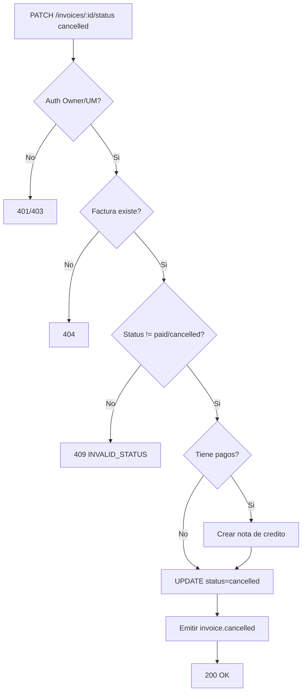

---

## CU-05: Registrar Pago

| Atributo | Valor |
|---|---|
| **Endpoint** | `POST /api/v1/finance/payments` |
| **Actor Principal** | Owner / Usuario Maestro / Subusuario (permiso `payments:create`) |
| **Trigger** | Usuario registra un pago recibido |
| **Frecuencia** | Alta — multiples veces al dia |

**Precondiciones (backend DEBE validar)**

| # | Precondicion | Si no se cumple |
|---|---|---|
| PRE-01 | Token JWT valido y no expirado | HTTP `401 UNAUTHORIZED` |
| PRE-02 | Usuario tiene permiso `payments:create` | HTTP `403 FORBIDDEN` |
| PRE-03 | invoiceId existe y pertenece al tenant | HTTP `404 INVOICE_NOT_FOUND` |
| PRE-04 | Factura tiene saldo pendiente (amountDue > 0) | HTTP `409 NO_BALANCE` |
| PRE-05 | amount > 0 y amount <= amountDue | HTTP `400 VALIDATION_ERROR` |

**Secuencia Backend (flujo principal)**

| Paso | Accion del backend | Detalle |
|---|---|---|
| 1 | Validar JWT y permiso `payments:create` | Middleware |
| 2 | Validar schema Zod del body | CreatePaymentDTO |
| 3 | Buscar factura por invoiceId + tenant_id | Validar existencia y saldo |
| 4 | Generar payment_number secuencial | Formato PAY-YYYY-NNNNN |
| 5 | Insertar payment con status = 'completed' | Para pagos manuales, status directo |
| 6 | Actualizar factura: amountPaid += amount | Recalcular amountDue |
| 7 | Determinar nuevo status de factura | Si amountDue <= 0: 'paid', sino: 'partial' |
| 8 | Actualizar invoice.status y invoice.paidDate | Si pagada completamente |
| 9 | Emitir evento `payment.completed` | Payload: paymentId, invoiceId, amount |
| 10 | Emitir evento invoice.paid o invoice.partial_payment | Segun corresponda |
| 11 | Retornar pago creado | HTTP 201 |

**Postcondiciones (backend DEBE garantizar)**

| # | Postcondicion | Verificacion |
|---|---|---|
| POST-01 | Pago registrado con payment_number unico | Constraint UNIQUE |
| POST-02 | Invoice.amountPaid incrementado correctamente | Suma de pagos = amountPaid |
| POST-03 | Invoice.amountDue = total - amountPaid | Recalculado |
| POST-04 | Invoice.status actualizado (partial o paid) | Consistente con montos |
| POST-05 | Si paid, invoice.paidDate = NOW() | Timestamp registrado |

**Excepciones**

| HTTP | Codigo | Cuando | Respuesta |
|---|---|---|---|
| 400 | VALIDATION_ERROR | amount <= 0 o excede saldo | Detalle de validacion |
| 404 | INVOICE_NOT_FOUND | Factura no existe en tenant | "Factura no encontrada" |
| 409 | NO_BALANCE | Factura sin saldo pendiente | "Factura ya pagada completamente" |

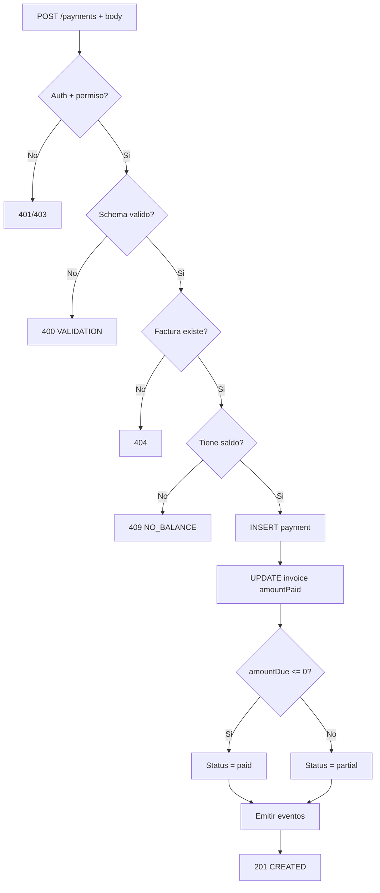

---

## CU-06: Registrar Costo de Transporte

| Atributo | Valor |
|---|---|
| **Endpoint** | `POST /api/v1/finance/costs` |
| **Actor Principal** | Owner / Usuario Maestro / Subusuario (permiso `costs:create`) / Sistema (auto-generado) |
| **Trigger** | Usuario registra costo manualmente o Sistema lo genera automaticamente (via IntegrationHub) |
| **Frecuencia** | Alta — multiples veces al dia |

**Precondiciones (backend DEBE validar)**

| # | Precondicion | Si no se cumple |
|---|---|---|
| PRE-01 | Token JWT valido y no expirado | HTTP `401 UNAUTHORIZED` |
| PRE-02 | Usuario tiene permiso `costs:create` | HTTP `403 FORBIDDEN` |
| PRE-03 | type es un CostType valido | HTTP `400 VALIDATION_ERROR` |
| PRE-04 | amount > 0 | HTTP `400 VALIDATION_ERROR` |
| PRE-05 | Si orderId proporcionado, orden existe en tenant | HTTP `404 ORDER_NOT_FOUND` |

**Secuencia Backend (flujo principal)**

| Paso | Accion del backend | Detalle |
|---|---|---|
| 1 | Validar JWT y permiso `costs:create` | Middleware |
| 2 | Validar schema Zod del body | CreateTransportCostDTO |
| 3 | Verificar referencias opcionales | orderId, vehicleId, driverId existen en tenant |
| 4 | Calcular unitCost = amount / quantity | Si quantity no proporcionado, default 1 |
| 5 | Insertar transport_cost con isApproved = false | Requiere aprobacion posterior |
| 6 | Emitir evento `cost.created` | Payload: costId, type, amount, vehicleId? |
| 7 | Retornar costo creado | HTTP 201 |

**Postcondiciones (backend DEBE garantizar)**

| # | Postcondicion | Verificacion |
|---|---|---|
| POST-01 | Costo creado con isApproved = false | Default hasta aprobacion |
| POST-02 | unitCost calculado correctamente | amount / quantity |
| POST-03 | Referencias FK validas | orderId, vehicleId, driverId en tenant |

**Excepciones**

| HTTP | Codigo | Cuando | Respuesta |
|---|---|---|---|
| 400 | VALIDATION_ERROR | Campos invalidos o type no valido | Detalle de validacion |
| 404 | ORDER_NOT_FOUND | orderId no existe en tenant | "Orden no encontrada" |
| 404 | VEHICLE_NOT_FOUND | vehicleId no existe en tenant | "Vehiculo no encontrado" |

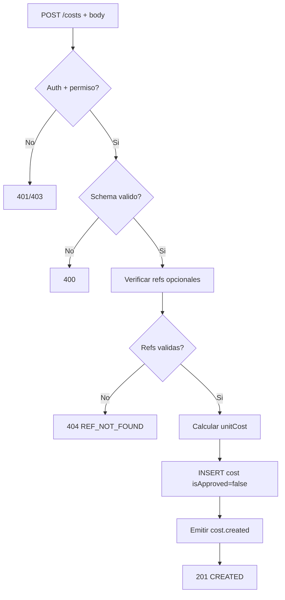

---

## CU-07: Aprobar Costo de Transporte

| Atributo | Valor |
|---|---|
| **Endpoint** | `POST /api/v1/finance/costs/:id/approve` |
| **Actor Principal** | Owner / Usuario Maestro. Subusuario: DENEGADO |
| **Trigger** | Owner o Usuario Maestro aprueba un costo registrado |
| **Frecuencia** | Media |

**Precondiciones (backend DEBE validar)**

| # | Precondicion | Si no se cumple |
|---|---|---|
| PRE-01 | Token JWT valido y no expirado | HTTP `401 UNAUTHORIZED` |
| PRE-02 | Usuario es Owner o Usuario Maestro | HTTP `403 FORBIDDEN` |
| PRE-03 | Costo existe y pertenece al tenant | HTTP `404 NOT_FOUND` |
| PRE-04 | Costo no esta ya aprobado | HTTP `409 ALREADY_APPROVED` |

**Secuencia Backend (flujo principal)**

| Paso | Accion del backend | Detalle |
|---|---|---|
| 1 | Validar JWT y permisos (Owner/UM) | Middleware |
| 2 | Buscar costo por id + tenant_id | Query transport_costs |
| 3 | Validar isApproved = false | Evitar doble aprobacion |
| 4 | UPDATE isApproved = true, approvedBy, approvedAt | Registrar aprobador y timestamp |
| 5 | Emitir evento `cost.approved` | Payload: costId, approvedBy, amount |
| 6 | Retornar costo actualizado | HTTP 200 |

**Postcondiciones (backend DEBE garantizar)**

| # | Postcondicion | Verificacion |
|---|---|---|
| POST-01 | isApproved = true | SELECT isApproved WHERE id |
| POST-02 | approvedBy = userId del aprobador | Traza de autoria |
| POST-03 | approvedAt = timestamp de aprobacion | Registro temporal |

**Excepciones**

| HTTP | Codigo | Cuando | Respuesta |
|---|---|---|---|
| 404 | NOT_FOUND | Costo no existe en tenant | "Costo no encontrado" |
| 409 | ALREADY_APPROVED | Costo ya aprobado | "Costo ya fue aprobado" |

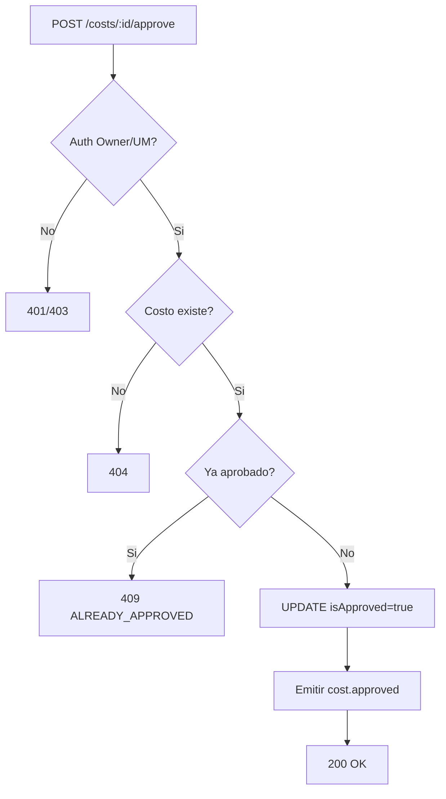

---

## CU-08: Consultar Tarifas

| Atributo | Valor |
|---|---|
| **Endpoint** | `GET /api/v1/finance/rates` |
| **Actor Principal** | Owner / Usuario Maestro / Subusuario (permiso `rates:read`) |
| **Trigger** | Usuario consulta el tarifario |
| **Frecuencia** | Media |

**Precondiciones (backend DEBE validar)**

| # | Precondicion | Si no se cumple |
|---|---|---|
| PRE-01 | Token JWT valido y no expirado | HTTP `401 UNAUTHORIZED` |
| PRE-02 | Usuario tiene permiso `rates:read` | HTTP `403 FORBIDDEN` |

**Secuencia Backend (flujo principal)**

| Paso | Accion del backend | Detalle |
|---|---|---|
| 1 | Validar JWT y permiso | Middleware |
| 2 | Parsear filtros | category, originZone, destinationZone, isActive |
| 3 | Query service_rates WHERE tenant_id + filtros | Retornar todas las tarifas que coincidan |
| 4 | Retornar lista de tarifas | HTTP 200 |

**Postcondiciones (backend DEBE garantizar)**

| # | Postcondicion | Verificacion |
|---|---|---|
| POST-01 | Solo tarifas del tenant retornadas | Filtro tenant_id |

**Excepciones**

| HTTP | Codigo | Cuando | Respuesta |
|---|---|---|---|
| 401 | UNAUTHORIZED | Token invalido | Redirigir a login |
| 403 | FORBIDDEN | Sin permiso | Acceso denegado |

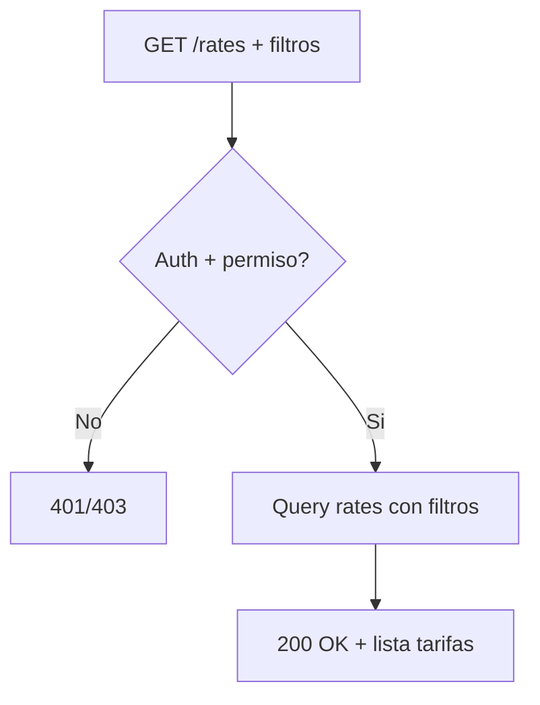

---

## CU-09: Calcular Tarifa por Ruta

| Atributo | Valor |
|---|---|
| **Endpoint** | `GET /api/v1/finance/rates/calculate` |
| **Actor Principal** | Owner / Usuario Maestro / Subusuario (permiso `rates:read`) |
| **Trigger** | Usuario o sistema necesita calcular precio para una ruta |
| **Frecuencia** | Alta — al crear ordenes y cotizaciones |

**Precondiciones (backend DEBE validar)**

| # | Precondicion | Si no se cumple |
|---|---|---|
| PRE-01 | Token JWT valido y no expirado | HTTP `401 UNAUTHORIZED` |
| PRE-02 | Usuario tiene permiso `rates:read` | HTTP `403 FORBIDDEN` |
| PRE-03 | originZone y destinationZone proporcionados | HTTP `400 VALIDATION_ERROR` |

**Secuencia Backend (flujo principal)**

| Paso | Accion del backend | Detalle |
|---|---|---|
| 1 | Validar JWT y permiso | Middleware |
| 2 | Buscar tarifa activa para origen-destino | WHERE isActive AND originZone AND destinationZone |
| 3 | Si no existe tarifa, retornar amount = 0 | Tarifa no configurada |
| 4 | Calcular monto segun categoria | weight: baseRate * weight, volume: baseRate * volume, flat: baseRate |
| 5 | Aplicar rangos escalonados si existen | Buscar rango que aplique al valor |
| 6 | Aplicar min/max charge | Math.max(amount, minCharge), Math.min(amount, maxCharge) |
| 7 | Retornar { rate, amount } | HTTP 200 |

**Postcondiciones (backend DEBE garantizar)**

| # | Postcondicion | Verificacion |
|---|---|---|
| POST-01 | Calculo respeta min/max charge | amount dentro de limites |
| POST-02 | Solo tarifas activas consideradas | isActive = true |

**Excepciones**

| HTTP | Codigo | Cuando | Respuesta |
|---|---|---|---|
| 400 | VALIDATION_ERROR | Faltan originZone o destinationZone | Campos requeridos |

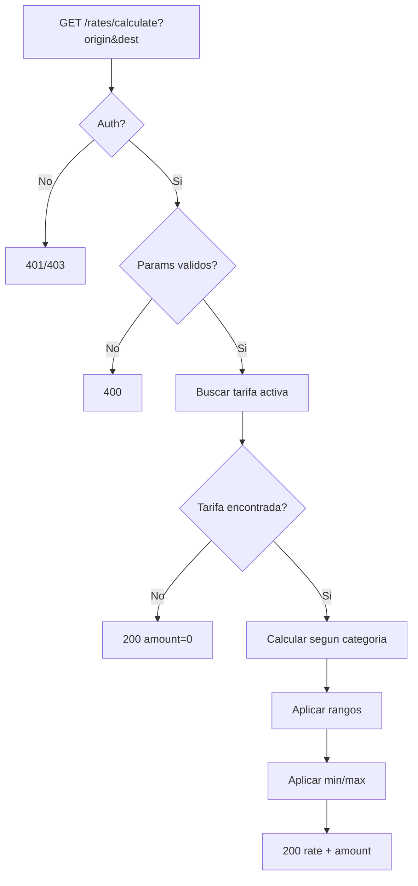

---

## CU-10: Consultar Estadisticas Financieras

| Atributo | Valor |
|---|---|
| **Endpoint** | `GET /api/v1/finance/stats` |
| **Actor Principal** | Owner / Usuario Maestro. Subusuario: DENEGADO |
| **Trigger** | Usuario accede al dashboard financiero |
| **Frecuencia** | Media |

**Precondiciones (backend DEBE validar)**

| # | Precondicion | Si no se cumple |
|---|---|---|
| PRE-01 | Token JWT valido y no expirado | HTTP `401 UNAUTHORIZED` |
| PRE-02 | Usuario es Owner o Usuario Maestro | HTTP `403 FORBIDDEN` |

**Secuencia Backend (flujo principal)**

| Paso | Accion del backend | Detalle |
|---|---|---|
| 1 | Validar JWT y permisos | Owner o UM |
| 2 | Parsear rango de fechas opcional | startDate, endDate |
| 3 | Agregar facturas del periodo | totalInvoiced, totalPaid, totalPending, totalOverdue, conteos |
| 4 | Agregar costos del periodo | totalCosts, desglose por tipo |
| 5 | Calcular rentabilidad | grossRevenue, netRevenue, profitMargin |
| 6 | Calcular tendencias | revenueGrowth, costGrowth vs periodo anterior |
| 7 | Retornar FinanceStats | HTTP 200 |

**Postcondiciones (backend DEBE garantizar)**

| # | Postcondicion | Verificacion |
|---|---|---|
| POST-01 | Datos filtrados por tenant_id | Aislamiento multi-tenant |
| POST-02 | Totales matematicamente consistentes | totalInvoiced = suma de invoice.total |

**Excepciones**

| HTTP | Codigo | Cuando | Respuesta |
|---|---|---|---|
| 401 | UNAUTHORIZED | Token invalido | Redirigir a login |
| 403 | FORBIDDEN | Subusuario intenta acceder | Acceso denegado |

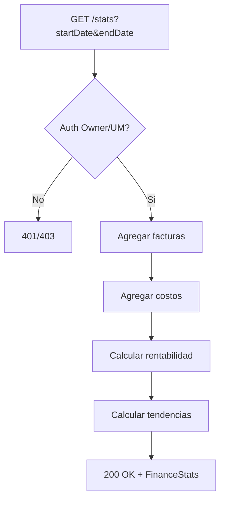

---

## CU-11: Consultar Cuentas por Cobrar (Aging)

| Atributo | Valor |
|---|---|
| **Endpoint** | `GET /api/v1/finance/aging` |
| **Actor Principal** | Owner / Usuario Maestro. Subusuario: DENEGADO |
| **Trigger** | Usuario consulta antiguedad de cuentas por cobrar |
| **Frecuencia** | Baja — semanal o mensual |

**Precondiciones (backend DEBE validar)**

| # | Precondicion | Si no se cumple |
|---|---|---|
| PRE-01 | Token JWT valido y no expirado | HTTP `401 UNAUTHORIZED` |
| PRE-02 | Usuario es Owner o Usuario Maestro | HTTP `403 FORBIDDEN` |

**Secuencia Backend (flujo principal)**

| Paso | Accion del backend | Detalle |
|---|---|---|
| 1 | Validar JWT y permisos | Owner o UM |
| 2 | Consultar facturas con saldo pendiente | WHERE amountDue > 0 AND status != 'cancelled' |
| 3 | Clasificar por antiguedad | current (no vencido), 1-30, 31-60, 61-90, >90 dias |
| 4 | Agrupar por cliente opcionalmente | byCustomer[] |
| 5 | Retornar AccountsReceivableAging | HTTP 200 |

**Postcondiciones (backend DEBE garantizar)**

| # | Postcondicion | Verificacion |
|---|---|---|
| POST-01 | total = current + days1to30 + days31to60 + days61to90 + over90Days | Suma correcta |
| POST-02 | Solo facturas del tenant | Filtro tenant_id |

**Excepciones**

| HTTP | Codigo | Cuando | Respuesta |
|---|---|---|---|
| 401 | UNAUTHORIZED | Token invalido | Redirigir a login |
| 403 | FORBIDDEN | Sin permisos | Acceso denegado |

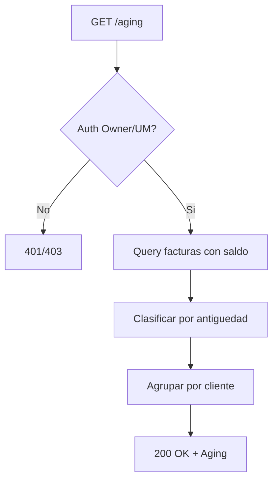

---

## CU-12: Analizar Rentabilidad

| Atributo | Valor |
|---|---|
| **Endpoint** | `GET /api/v1/finance/profitability` |
| **Actor Principal** | Owner / Usuario Maestro. Subusuario: DENEGADO |
| **Trigger** | Usuario solicita analisis de rentabilidad |
| **Frecuencia** | Baja — semanal o mensual |

**Precondiciones (backend DEBE validar)**

| # | Precondicion | Si no se cumple |
|---|---|---|
| PRE-01 | Token JWT valido y no expirado | HTTP `401 UNAUTHORIZED` |
| PRE-02 | Usuario es Owner o Usuario Maestro | HTTP `403 FORBIDDEN` |
| PRE-03 | startDate y endDate proporcionados | HTTP `400 VALIDATION_ERROR` |

**Secuencia Backend (flujo principal)**

| Paso | Accion del backend | Detalle |
|---|---|---|
| 1 | Validar JWT y permisos | Owner o UM |
| 2 | Agregar ingresos del periodo | totalRevenue desglosado (service, accessorial, other) |
| 3 | Agregar costos del periodo | totalCosts desglosado por tipo (fuel, labor, maintenance, etc.) |
| 4 | Calcular margenes | grossProfit, grossMargin%, operatingProfit, netProfit |
| 5 | Desglosar por cliente/ruta/vehiculo | byCustomer[], byRoute[], byVehicle[] |
| 6 | Retornar ProfitabilityAnalysis | HTTP 200 |

**Postcondiciones (backend DEBE garantizar)**

| # | Postcondicion | Verificacion |
|---|---|---|
| POST-01 | grossProfit = totalRevenue - totalCosts | Calculo correcto |
| POST-02 | Margenes expresados como porcentaje | grossMarginPercent = (grossProfit / totalRevenue) * 100 |

**Excepciones**

| HTTP | Codigo | Cuando | Respuesta |
|---|---|---|---|
| 400 | VALIDATION_ERROR | Faltan startDate o endDate | Campos requeridos |

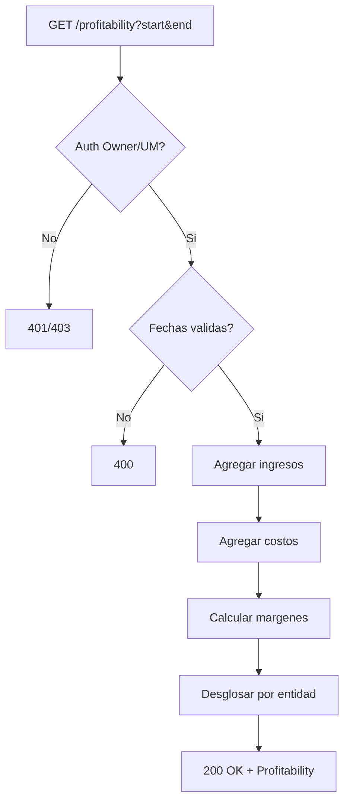

---

## CU-13: Consultar Flujo de Caja

| Atributo | Valor |
|---|---|
| **Endpoint** | `GET /api/v1/finance/cash-flow` |
| **Actor Principal** | Owner / Usuario Maestro. Subusuario: DENEGADO |
| **Trigger** | Usuario consulta flujo de caja del periodo |
| **Frecuencia** | Baja — semanal o mensual |

**Precondiciones (backend DEBE validar)**

| # | Precondicion | Si no se cumple |
|---|---|---|
| PRE-01 | Token JWT valido y no expirado | HTTP `401 UNAUTHORIZED` |
| PRE-02 | Usuario es Owner o Usuario Maestro | HTTP `403 FORBIDDEN` |
| PRE-03 | startDate y endDate proporcionados | HTTP `400 VALIDATION_ERROR` |

**Secuencia Backend (flujo principal)**

| Paso | Accion del backend | Detalle |
|---|---|---|
| 1 | Validar JWT y permisos | Owner o UM |
| 2 | Calcular entradas | customerPayments (pagos completados), otherInflows |
| 3 | Calcular salidas | supplierPayments, fuelExpenses, salaryPayments, otherOutflows |
| 4 | Calcular balances | openingBalance, closingBalance, netCashFlow |
| 5 | Generar detalle diario | daily[]: date, inflows, outflows, netFlow, balance |
| 6 | Retornar CashFlowSummary | HTTP 200 |

**Postcondiciones (backend DEBE garantizar)**

| # | Postcondicion | Verificacion |
|---|---|---|
| POST-01 | netCashFlow = totalInflows - totalOutflows | Calculo correcto |
| POST-02 | closingBalance = openingBalance + netCashFlow | Balance consistente |

**Excepciones**

| HTTP | Codigo | Cuando | Respuesta |
|---|---|---|---|
| 400 | VALIDATION_ERROR | Faltan fechas | Campos requeridos |

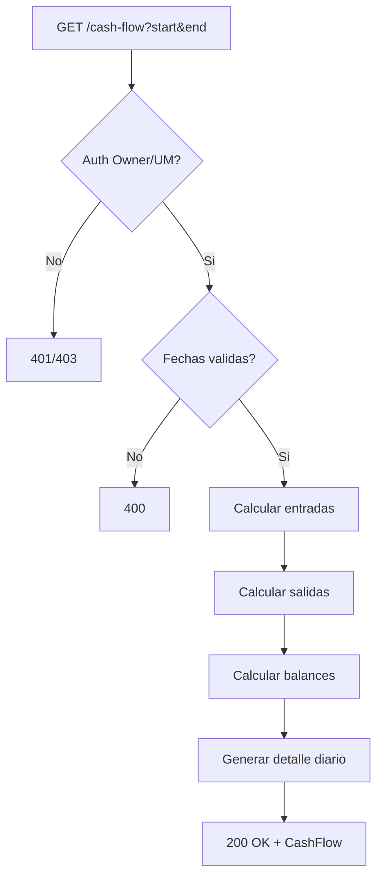

---

## CU-14: Consultar Resumen Financiero de Cliente

| Atributo | Valor |
|---|---|
| **Endpoint** | `GET /api/v1/finance/customers/:id/summary` |
| **Actor Principal** | Owner / Usuario Maestro. Subusuario: DENEGADO |
| **Trigger** | Usuario consulta la situacion financiera de un cliente |
| **Frecuencia** | Media |

**Precondiciones (backend DEBE validar)**

| # | Precondicion | Si no se cumple |
|---|---|---|
| PRE-01 | Token JWT valido y no expirado | HTTP `401 UNAUTHORIZED` |
| PRE-02 | Usuario es Owner o Usuario Maestro | HTTP `403 FORBIDDEN` |
| PRE-03 | Cliente existe y pertenece al tenant | HTTP `404 CUSTOMER_NOT_FOUND` |

**Secuencia Backend (flujo principal)**

| Paso | Accion del backend | Detalle |
|---|---|---|
| 1 | Validar JWT y permisos | Owner o UM |
| 2 | Verificar cliente en tenant | Query customers |
| 3 | Agregar facturas del cliente | totalInvoiced, totalPaid, totalDue, overdueAmount |
| 4 | Calcular conteos | invoiceCount, paidCount, pendingCount, overdueCount |
| 5 | Calcular promedios | avgPaymentDays, avgInvoiceAmount |
| 6 | Obtener credito disponible | creditLimit, availableCredit |
| 7 | Retornar CustomerFinancialSummary | HTTP 200 |

**Postcondiciones (backend DEBE garantizar)**

| # | Postcondicion | Verificacion |
|---|---|---|
| POST-01 | totalDue = totalInvoiced - totalPaid | Consistencia matematica |
| POST-02 | avgPaymentDays calculado sobre facturas pagadas | Promedio de (paidDate - issueDate) |

**Excepciones**

| HTTP | Codigo | Cuando | Respuesta |
|---|---|---|---|
| 404 | CUSTOMER_NOT_FOUND | Cliente no existe en tenant | "Cliente no encontrado" |

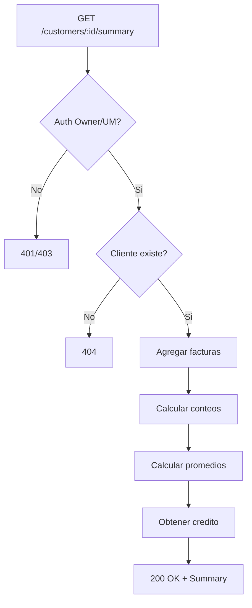

---

### Diagrama general de interaccion CU

```mermaid
sequenceDiagram
    actor U as Usuario (Owner/UM/Sub)
    participant API as Finance API
    participant DB as PostgreSQL
    participant EVT as tmsEventBus
    participant NOTIF as Notificaciones

    U->>API: POST /invoices (crear factura)
    API->>DB: INSERT invoice + line_items
    API->>EVT: invoice.created
    API-->>U: 201 Invoice (draft)

    U->>API: POST /invoices/:id/send
    API->>DB: UPDATE status = sent
    API->>EVT: invoice.sent
    API->>NOTIF: Email al cliente
    API-->>U: 200 Invoice (sent)

    U->>API: POST /payments (registrar pago)
    API->>DB: INSERT payment
    API->>DB: UPDATE invoice (amountPaid, status)
    API->>EVT: payment.completed + invoice.paid
    API-->>U: 201 Payment

    U->>API: POST /costs (registrar costo)
    API->>DB: INSERT transport_cost
    API->>EVT: cost.created
    API-->>U: 201 TransportCost

    U->>API: POST /costs/:id/approve
    API->>DB: UPDATE isApproved = true
    API->>EVT: cost.approved
    API-->>U: 200 TransportCost

    U->>API: GET /stats
    API->>DB: Aggregate invoices + costs
    API-->>U: 200 FinanceStats
```

---

# 9. Endpoints API REST

**Base path:** `/api/v1/finance`

### Facturas

| # | Metodo | Endpoint | Descripcion | Permiso | Roles | Request/Query | Response |
|---|---|---|---|---|---|---|---|
| E-01 | GET | `/invoices` | Listar facturas con filtros y paginacion | `invoices:read` | Owner, UM, Sub (`invoices:read`) | `?search&status&type&customerId&startDate&endDate&minAmount&maxAmount&isOverdue&hasBalance&page&pageSize` | `{ data: Invoice[], total, page, pageSize }` |
| E-02 | GET | `/invoices/:id` | Obtener factura por ID | `invoices:read` | Owner, UM, Sub (`invoices:read`) | Path: id | `Invoice` |
| E-03 | POST | `/invoices` | Crear nueva factura | `invoices:create` | Owner, UM, Sub (`invoices:create`) | Body: `CreateInvoiceDTO` | `Invoice` (status=draft) |
| E-04 | PATCH | `/invoices/:id/status` | Actualizar estado de factura | `invoices:status_update` | Owner, UM | Body: `{ status: InvoiceStatus }` | `Invoice` |
| E-05 | POST | `/invoices/:id/send` | Enviar factura al cliente | `invoices:send` | Owner, UM | Path: id | `Invoice` (status=sent) |

### Pagos

| # | Metodo | Endpoint | Descripcion | Permiso | Roles | Request/Query | Response |
|---|---|---|---|---|---|---|---|
| E-06 | GET | `/payments` | Listar pagos con filtros | `payments:read` | Owner, UM, Sub (`payments:read`) | `?search&status&method&invoiceId&customerId&startDate&endDate&page&pageSize` | `{ data: Payment[], total, page, pageSize }` |
| E-07 | POST | `/payments` | Registrar pago | `payments:create` | Owner, UM, Sub (`payments:create`) | Body: `CreatePaymentDTO` | `Payment` |
| E-08 | GET | `/payments?invoiceId=:id` | Pagos de una factura | `payments:read` | Owner, UM, Sub (`payments:read`) | Query: invoiceId | `Payment[]` |

### Costos de Transporte

| # | Metodo | Endpoint | Descripcion | Permiso | Roles | Request/Query | Response |
|---|---|---|---|---|---|---|---|
| E-09 | GET | `/costs` | Listar costos con filtros | `costs:read` | Owner, UM, Sub (`costs:read`) | `?search&type&category&orderId&vehicleId&startDate&endDate&isApproved&page&pageSize` | `{ data: TransportCost[], total, page, pageSize }` |
| E-10 | POST | `/costs` | Registrar costo | `costs:create` | Owner, UM, Sub (`costs:create`) | Body: `CreateTransportCostDTO` | `TransportCost` |
| E-11 | POST | `/costs/:id/approve` | Aprobar costo | `costs:approve` | Owner, UM | Path: id | `TransportCost` (isApproved=true) |
| E-12 | GET | `/costs/by-order/:orderId` | Costos de una orden | `costs:read` | Owner, UM, Sub (`costs:read`) | Path: orderId | `TransportCost[]` |
| E-13 | GET | `/costs/by-vehicle/:vehicleId` | Costos de un vehiculo | `costs:read` | Owner, UM, Sub (`costs:read`) | Path: vehicleId | `TransportCost[]` |

### Tarifas

| # | Metodo | Endpoint | Descripcion | Permiso | Roles | Request/Query | Response |
|---|---|---|---|---|---|---|---|
| E-14 | GET | `/rates` | Listar tarifas | `rates:read` | Owner, UM, Sub (`rates:read`) | `?category&originZone&destinationZone&isActive` | `ServiceRate[]` |
| E-15 | GET | `/rates/:id` | Obtener tarifa por ID | `rates:read` | Owner, UM, Sub (`rates:read`) | Path: id | `ServiceRate` |
| E-16 | GET | `/rates/calculate` | Calcular tarifa para ruta | `rates:read` | Owner, UM, Sub (`rates:read`) | `?originZone&destinationZone&weight&volume` | `{ rate: ServiceRate, amount: number }` |

### Analisis Financiero

| # | Metodo | Endpoint | Descripcion | Permiso | Roles | Request/Query | Response |
|---|---|---|---|---|---|---|---|
| E-17 | GET | `/stats` | Estadisticas financieras | `finance:stats` | Owner, UM | `?startDate&endDate` | `FinanceStats` |
| E-18 | GET | `/customers/:id/summary` | Resumen financiero de cliente | `finance:customer_summary` | Owner, UM | Path: customerId | `CustomerFinancialSummary` |
| E-19 | GET | `/aging` | Cuentas por cobrar aging | `finance:aging` | Owner, UM | - | `AccountsReceivableAging` |
| E-20 | GET | `/profitability` | Analisis de rentabilidad | `finance:profitability` | Owner, UM | `?startDate&endDate` | `ProfitabilityAnalysis` |
| E-21 | GET | `/cash-flow` | Flujo de caja | `finance:cash_flow` | Owner, UM | `?startDate&endDate` | `CashFlowSummary` |

---

# 10. Eventos de Dominio

### Catalogo

| Evento | Payload | Se emite cuando | Modulos suscriptores |
|---|---|---|---|
| `invoice.created` | { invoiceId, customerId, type, total, currency } | Se crea una nueva factura | Reportes, Notificaciones |
| `invoice.sent` | { invoiceId, customerId, customerEmail } | Se envia factura al cliente | Notificaciones (email) |
| `invoice.paid` | { invoiceId, customerId, total, paidDate } | Factura pagada completamente | Reportes, Ordenes |
| `invoice.partial_payment` | { invoiceId, customerId, amountPaid, amountDue } | Se recibe pago parcial | Notificaciones |
| `invoice.overdue` | { invoiceId, customerId, amountDue, dueDate } | Factura vence sin pago completo | Notificaciones (alerta), Reportes |
| `invoice.cancelled` | { invoiceId, customerId, reason } | Se cancela una factura | Reportes |
| `invoice.disputed` | { invoiceId, customerId, reason } | Cliente disputa factura | Notificaciones (escalamiento) |
| `payment.completed` | { paymentId, invoiceId, amount, method } | Pago procesado exitosamente | Reportes |
| `payment.failed` | { paymentId, invoiceId, reason } | Pago falla en procesamiento | Notificaciones |
| `payment.refunded` | { paymentId, invoiceId, amount } | Pago reembolsado | Reportes, Contabilidad |
| `cost.created` | { costId, type, amount, vehicleId?, orderId? } | Se registra nuevo costo | Reportes, Mantenimiento |
| `cost.approved` | { costId, approvedBy, amount } | Costo aprobado por supervisor | Contabilidad |

### Diagrama de propagacion

```mermaid
graph LR
    FIN["Modulo Finanzas"]

    FIN -->|invoice.created| REP["Reportes"]
    FIN -->|invoice.sent| NOTIF["Notificaciones"]
    FIN -->|invoice.paid| REP
    FIN -->|invoice.paid| ORD["Ordenes"]
    FIN -->|invoice.overdue| NOTIF
    FIN -->|invoice.overdue| REP
    FIN -->|invoice.disputed| NOTIF
    FIN -->|payment.completed| REP
    FIN -->|payment.failed| NOTIF
    FIN -->|cost.created| REP
    FIN -->|cost.created| MAINT["Mantenimiento"]
    FIN -->|cost.approved| CONT["Contabilidad"]

    MON["Monitoreo"] -->|auto-costs (combustible, peajes)| FIN
    ORD2["Ordenes"] -->|order.completed (auto-invoice)| FIN
```

---

# 11. Reglas de Negocio Clave

| # | Regla | Descripcion |
|---|---|---|
| R-01 | Aislamiento multi-tenant | Todas las consultas filtran por `tenant_id` del JWT. Un usuario NUNCA puede ver datos financieros de otro tenant |
| R-02 | Factura inicia en draft | Toda factura nueva se crea con status 'draft'. No se puede crear directamente en otro estado |
| R-03 | Pagos no pueden exceder saldo | El monto de un pago no puede ser mayor que el amountDue de la factura |
| R-04 | Pago actualiza factura automaticamente | Al registrar un pago, el backend actualiza amountPaid, amountDue y status de la factura en la misma transaccion |
| R-05 | Factura pagada es inmutable | Una factura en status 'paid' no puede cambiar de estado (es terminal) |
| R-06 | Cancelar factura con pagos genera nota credito | Si la factura tiene pagos registrados, se debe crear automaticamente una factura tipo 'credit' vinculada |
| R-07 | Costos requieren aprobacion | Todo costo registrado inicia con isApproved=false. Solo Owner o UM pueden aprobar |
| R-08 | Deteccion automatica de vencimiento | Un job CRON diario marca como 'overdue' las facturas con due_date < NOW() y status IN ('sent', 'partial') |
| R-09 | Numero de factura unico por tenant | invoice_number es secuencial y unico dentro de cada tenant. Formato: INV-YYYY-NNNNN |
| R-10 | Tarifas escalonadas por rangos | ServiceRate con category 'weight' o 'volume' puede tener rangos [{from, to, rate}] para calculo escalonado |
| R-11 | Min/Max charge en tarifas | El monto calculado se ajusta a minCharge y maxCharge si estan definidos |
| R-12 | Costos auto-generados por IntegrationHub | El modulo de Monitoreo puede generar costos automaticos (combustible, peajes) via IntegrationHub/localStorage |
| R-13 | Currency default PEN | Si no se especifica moneda, se usa PEN (Sol Peruano) como default |
| R-14 | Analisis financiero solo para Owner/UM | Las operaciones de analisis (stats, aging, profitability, cash-flow, customer summary) son informacion sensible restringida |

---

# 12. Catalogo de Errores HTTP

| HTTP | Codigo interno | Cuando ocurre | Resolucion |
|---|---|---|---|
| 400 | VALIDATION_ERROR | Campos invalidos segun schema Zod | Leer details: mapa {campo: mensaje} |
| 401 | UNAUTHORIZED | Token JWT ausente o expirado | Redirigir a /login |
| 403 | FORBIDDEN | Sin permisos para la operacion | Verificar rol del usuario y permisos (ver seccion 13) |
| 404 | INVOICE_NOT_FOUND | Factura no existe o no pertenece al tenant | Verificar ID y tenant |
| 404 | CUSTOMER_NOT_FOUND | Cliente no existe en el tenant | Verificar customerId |
| 404 | COST_NOT_FOUND | Costo de transporte no encontrado | Verificar ID |
| 404 | RATE_NOT_FOUND | Tarifa no encontrada | Verificar ID o parametros de ruta |
| 409 | INVALID_STATUS | Transicion de estado no permitida | Verificar estado actual vs transicion solicitada |
| 409 | NO_BALANCE | Factura sin saldo pendiente | Factura ya esta completamente pagada |
| 409 | ALREADY_APPROVED | Costo ya fue aprobado | No se puede aprobar dos veces |
| 409 | DUPLICATE_NUMBER | Colision de numero secuencial | Reintentar la operacion |
| 422 | AMOUNT_EXCEEDS_BALANCE | Monto del pago excede saldo | Ajustar amount <= amountDue |
| 500 | INTERNAL_ERROR | Error inesperado del servidor | Reintentar; si persiste, contactar soporte |

---

# 13. Permisos RBAC

**3 niveles jerarquicos (definicion de Edson). Arquitectura Multi-tenant con RBAC granular por modulo y por accion.**

```
Owner (Proveedor TMS)
   +-- Cuenta Cliente (Tenant)
           +-- Usuario Maestro
                   +-- Subusuarios
```

> **Modelo de 3 roles (definicion Edson):** Owner (Super Admin TMS), Usuario Maestro (Admin de cuenta cliente), Subusuario (Operador con permisos configurables).
> **Leyenda:** Si = Permitido | Configurable = Permitido si el Usuario Maestro le asigno el permiso | No = Denegado

| Permiso | Owner | Usuario Maestro | Subusuario |
|---|:---:|:---:|:---:|
| `invoices:read` — Ver listado de facturas | Si | Si | Configurable |
| `invoices:create` — Crear nueva factura | Si | Si | Configurable |
| `invoices:send` — Enviar factura al cliente | Si | Si | No |
| `invoices:cancel` — Cancelar factura | Si | Si | No |
| `invoices:status_update` — Cambiar estado de factura | Si | Si | No |
| `payments:read` — Ver listado de pagos | Si | Si | Configurable |
| `payments:create` — Registrar pago | Si | Si | Configurable |
| `costs:read` — Ver costos de transporte | Si | Si | Configurable |
| `costs:create` — Registrar costo | Si | Si | Configurable |
| `costs:approve` — Aprobar costo | Si | Si | No |
| `rates:read` — Ver tarifario | Si | Si | Configurable |
| `rates:manage` — Crear/editar/eliminar tarifas | Si | Si | No |
| `finance:stats` — Ver estadisticas financieras | Si | Si | No |
| `finance:aging` — Ver cuentas por cobrar | Si | Si | No |
| `finance:profitability` — Ver analisis de rentabilidad | Si | Si | No |
| `finance:cash_flow` — Ver flujo de caja | Si | Si | No |
| `finance:customer_summary` — Ver resumen de cliente | Si | Si | No |

> **Owner:** Rol maximo del sistema (proveedor TMS). Acceso total sin restricciones a todas las cuentas. Puede crear/suspender/eliminar cuentas de clientes, activar/desactivar modulos, crear Usuarios Maestros, resetear credenciales.
> **Usuario Maestro:** Administrador principal de una cuenta cliente. Control total SOLO dentro de su empresa. Crea subusuarios, asigna roles y permisos internos por modulo, asigna unidades, restringe visibilidad por grupo/flota/geocerca. NO puede crear cuentas, activar modulos no contratados, ni ver otras cuentas.
> **Subusuario:** Operador con permisos limitados definidos por el Usuario Maestro. NO puede crear usuarios, modificar estructura de permisos, activar/desactivar modulos, ni cambiar configuracion de la cuenta.
> **Multi-tenant:** Todos los queries filtran por `tenant_id` del JWT. Un Subusuario solo ve datos del tenant al que pertenece.

### Restricciones del Subusuario

- `invoices:send`: Enviar facturas es operacion administrativa que compromete al cliente. Solo Owner y UM.
- `invoices:cancel`: Cancelar facturas tiene implicaciones contables. Solo Owner y UM.
- `invoices:status_update`: Cambiar estado manualmente es operacion privilegiada. Solo Owner y UM.
- `costs:approve`: Aprobar costos autoriza gastos. Solo Owner y UM.
- `rates:manage`: Gestionar tarifas afecta precios de toda la operacion. Solo Owner y UM.
- `finance:stats`, `finance:aging`, `finance:profitability`, `finance:cash_flow`, `finance:customer_summary`: Informacion financiera sensible. Solo Owner y UM.
- El Subusuario **NO puede**: enviar/cancelar facturas, aprobar costos, gestionar tarifas, acceder a analisis financiero, cambiar estados manualmente, acceder a datos de otros tenants.
- El Subusuario **SI puede** (si tiene el permiso asignado): ver facturas, crear facturas en borrador, registrar pagos, registrar costos, consultar tarifas, calcular tarifas por ruta.

---

# 14. Diagrama de Componentes

```mermaid
graph TB
    subgraph "Modulo de Finanzas"
        subgraph "Capa Presentacion - Next.js"
            P1["FinancePage<br/>/finance<br/>Centro Financiero"]
            P2["InvoicesPage<br/>/invoices<br/>Gestion de Facturas"]
            P3["PricingPage<br/>/pricing<br/>Tarifario"]
            C1["FinanceStatsCards"]
            C2["InvoiceList + InvoiceFilters"]
            C3["PaymentList"]
            C4["CostsList"]
            C5["ProfitabilityChart"]
            C6["CashFlowChart"]
            C7["CreateInvoiceDialog"]
            C8["RecordPaymentDialog"]
            C9["RecordCostDialog"]
        end

        subgraph "Capa Logica - React Hooks"
            H1["useFinance<br/>(hook principal)"]
            H2["useInvoices<br/>(listado standalone)"]
            H3["useProfitability<br/>(analisis rentabilidad)"]
            H4["useCashFlow<br/>(flujo de caja)"]
            H5["useCustomerFinancials<br/>(resumen cliente)"]
            H6["useVehicleCosts<br/>(costos vehiculo)"]
            H7["useOrderCosts<br/>(costos orden)"]
        end

        subgraph "Capa Servicios"
            S1["FinanceService<br/>(881 lineas - el mas grande)<br/>Invoices + Payments + Costs<br/>+ Rates + Analysis"]
        end

        subgraph "Infraestructura"
            EB["tmsEventBus<br/>Eventos de dominio"]
            LS["localStorage<br/>Auto-generated costs/invoices<br/>(IntegrationHub)"]
            API["apiClient<br/>HTTP REST"]
        end
    end

    P1 --> H1
    P1 --> H3
    P1 --> H4
    P2 --> H1
    P2 --> H2
    P3 --> H1
    C1 --> H1
    C2 --> H1
    C5 --> H3
    C6 --> H4

    H1 --> S1
    H2 --> S1
    H3 --> S1
    H4 --> S1
    H5 --> S1
    H6 --> S1
    H7 --> S1

    S1 --> API
    S1 --> LS
    S1 --> EB
```

---

# 15. Diagrama de Despliegue

```mermaid
graph TB
    subgraph "Nodo: Cloud Server - Vercel"
        FE["Next.js Frontend<br/>App Router + SSR<br/>React 19"]
    end

    subgraph "Nodo: API Backend"
        API["REST API<br/>Node.js"]
        WS["WebSocket Server<br/>Eventos tiempo real"]
        CRON["CRON Jobs<br/>Deteccion vencimientos<br/>Auto-facturacion"]
    end

    subgraph "Nodo: Base de Datos"
        DB["PostgreSQL<br/>+ PostGIS"]
    end

    subgraph "Nodo: Message Broker"
        EVT["tmsEventBus<br/>Redis Pub/Sub"]
    end

    subgraph "Nodo: Servicios Externos"
        SUNAT["SUNAT / SAT<br/>Facturacion Electronica"]
        BANK["Pasarela de Pagos<br/>Procesamiento bancario"]
        EMAIL["Servicio Email<br/>Envio de facturas"]
    end

    subgraph "Nodo: Almacenamiento"
        S3["S3 / GCS<br/>PDFs facturas, comprobantes"]
    end

    FE -->|HTTPS REST| API
    FE -->|WSS| WS
    API -->|SQL| DB
    API -->|publish| EVT
    API -->|presigned URLs| S3
    API -->|emision electronica| SUNAT
    API -->|procesamiento| BANK
    API -->|envio factura| EMAIL
    EVT -->|notify| WS
    WS -->|subscribe| EVT
    CRON -->|detectar vencimientos| DB
    CRON -->|publish overdue events| EVT
```

---

> **Nota:** Este documento es una referencia operativa para desarrollo frontend y backend. Incluye los 14 Casos de Uso con precondiciones, secuencia, postcondiciones y excepciones. Para detalles de implementacion frontend, consultar el codigo fuente del modulo. Todas las consultas filtran por `tenant_id` del JWT para garantizar aislamiento multi-tenant.
