# Referencia Rapida — Modulo de Mantenimiento
## TMS Navitel · Cheat Sheet para Desarrollo

> **Fecha:** Febrero 2026
> **Proposito:** Documento de referencia tecnica para el desarrollo e implementacion del modulo de Mantenimiento de Flota del sistema TMS Navitel. Cubre vehiculos, mantenimiento preventivo, correctivo, ordenes de trabajo, repuestos, inspecciones y alertas.

---

## Indice

| # | Seccion |
|---|---------|
| 1 | Contexto del Modulo |
| 2 | Entidades del Dominio |
| 3 | Modelo de Base de Datos — PostgreSQL |
| 4 | Maquina de Estados — WorkOrderStatus |
| 5 | Maquina de Estados — InspectionStatus |
| 6 | Maquina de Estados — BreakdownStatus |
| 7 | Tabla de Referencia Operativa de Transiciones |
| 8 | Casos de Uso — Referencia Backend |
| 9 | Endpoints API REST |
| 10 | Eventos de Dominio |
| 11 | Reglas de Negocio Clave |
| 12 | Catalogo de Errores HTTP |
| 13 | Permisos RBAC |
| 14 | Diagrama de Componentes |
| 15 | Diagrama de Despliegue |

---

# 1. Contexto del Modulo

El modulo de **Mantenimiento** gestiona el ciclo de vida completo del mantenimiento de la flota vehicular. Abarca siete sub-areas: vehiculos, mantenimiento preventivo, mantenimiento correctivo (averias), ordenes de trabajo, inventario de repuestos, inspecciones y alertas.

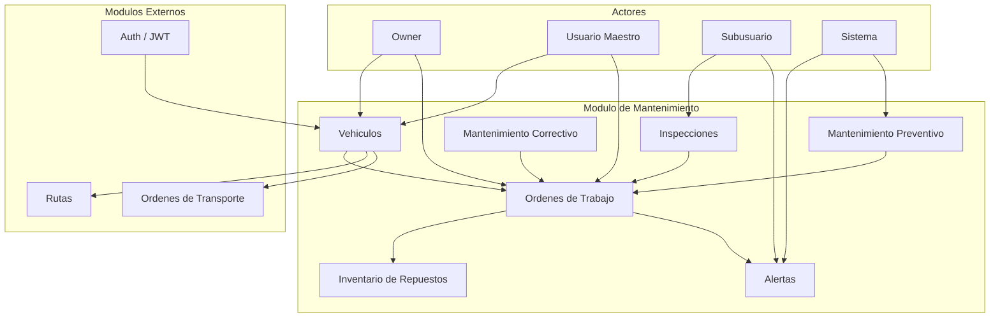
```mermaid
graph TB
    subgraph "Modulo de Mantenimiento"
        VEH[Vehiculos]
        PREV[Mantenimiento Preventivo]
        CORR[Mantenimiento Correctivo]
        WO[Ordenes de Trabajo]
        PARTS[Inventario de Repuestos]
        INSP[Inspecciones]
        ALERTS[Alertas]
    end

    subgraph "Actores"
        OW[Owner]
        UM[Usuario Maestro]
        SUB[Subusuario]
        SYS[Sistema]
    end

    subgraph "Modulos Externos"
        AUTH[Auth / JWT]
        ROUTES[Rutas]
        ORDERS[Ordenes de Transporte]
    end

    OW --> VEH
    OW --> WO
    UM --> VEH
    UM --> WO
    SUB --> INSP
    SUB --> ALERTS
    SYS --> ALERTS
    SYS --> PREV

    VEH --> WO
    PREV --> WO
    CORR --> WO
    INSP --> WO
    WO --> PARTS
    WO --> ALERTS
    AUTH --> VEH
    VEH --> ROUTES
    VEH --> ORDERS
```

**Responsabilidades principales:**

| Responsabilidad | Descripcion |
|----------------|-------------|
| Gestion de vehiculos | Registro, actualizacion de estado y seguimiento de kilometraje de la flota |
| Mantenimiento preventivo | Programacion basada en tiempo y/o kilometraje |
| Mantenimiento correctivo | Reporte y seguimiento de fallas/averias |
| Ordenes de trabajo | Creacion, asignacion, seguimiento y cierre de trabajos de mantenimiento |
| Inventario de repuestos | Control de stock, consumo y reabastecimiento |
| Inspecciones | Inspecciones pre-viaje, post-viaje, periodicas y de seguridad |
| Alertas | Notificaciones automaticas de vencimientos, stock bajo y mantenimientos pendientes |

**Navegacion en el sistema:**

- Sidebar: "Mantenimiento" (`/maintenance`)
- `requiredPermission`: `work_orders:read`
- `requiredModule`: `maintenance`

**Sub-paginas:**

| Ruta | Descripcion |
|------|-------------|
| `/maintenance` | Dashboard general de mantenimiento |
| `/maintenance/work-orders` | Gestion de ordenes de trabajo |
| `/maintenance/preventive` | Programacion de mantenimiento preventivo |
| `/maintenance/inspections` | Gestion de inspecciones |
| `/maintenance/parts` | Inventario de repuestos |
| `/maintenance/vehicles` | Flota vehicular |
| `/maintenance/documents` | Documentos de mantenimiento |
| `/maintenance/alerts` | Centro de alertas |

---

# 2. Entidades del Dominio

## 2.1 Diagrama Entidad-Relacion

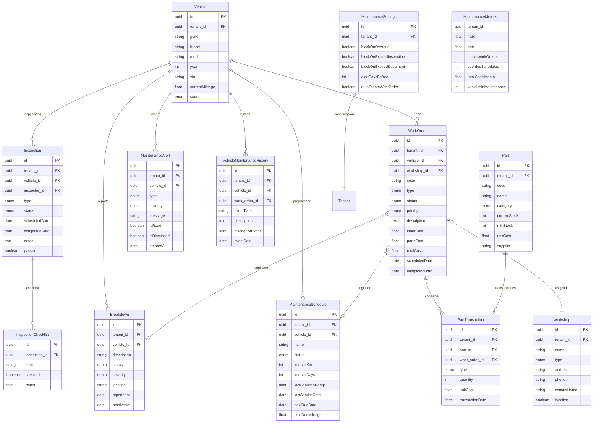
```mermaid
erDiagram
    Vehicle ||--o{ WorkOrder : "tiene"
    Vehicle ||--o{ MaintenanceSchedule : "programado"
    Vehicle ||--o{ Breakdown : "reporta"
    Vehicle ||--o{ Inspection : "inspecciona"
    Vehicle ||--o{ MaintenanceAlert : "genera"
    Vehicle ||--o{ VehicleMaintenanceHistory : "historial"

    WorkOrder ||--o{ PartTransaction : "consume"
    WorkOrder }o--|| Workshop : "asignado"
    WorkOrder }o--o| Breakdown : "originado"
    WorkOrder }o--o| MaintenanceSchedule : "originado"

    Part ||--o{ PartTransaction : "transacciones"

    Inspection ||--o{ InspectionChecklist : "checklist"

    MaintenanceSettings ||--|| Tenant : "configuracion"

    Vehicle {
        uuid id PK
        uuid tenant_id FK
        string plate
        string brand
        string model
        int year
        string vin
        float currentMileage
        enum status
    }

    WorkOrder {
        uuid id PK
        uuid tenant_id FK
        uuid vehicle_id FK
        uuid workshop_id FK
        string code
        enum type
        enum status
        enum priority
        text description
        float laborCost
        float partsCost
        float totalCost
        date scheduledDate
        date completedDate
    }

    MaintenanceSchedule {
        uuid id PK
        uuid tenant_id FK
        uuid vehicle_id FK
        string name
        enum status
        int intervalKm
        int intervalDays
        float lastServiceMileage
        date lastServiceDate
        date nextDueDate
        float nextDueMileage
    }

    Breakdown {
        uuid id PK
        uuid tenant_id FK
        uuid vehicle_id FK
        string description
        enum status
        enum severity
        string location
        date reportedAt
        date resolvedAt
    }

    Workshop {
        uuid id PK
        uuid tenant_id FK
        string name
        enum type
        string address
        string phone
        string contactName
        boolean isActive
    }

    Part {
        uuid id PK
        uuid tenant_id FK
        string code
        string name
        enum category
        int currentStock
        int minStock
        float unitCost
        string supplier
    }

    PartTransaction {
        uuid id PK
        uuid tenant_id FK
        uuid part_id FK
        uuid work_order_id FK
        enum type
        int quantity
        float unitCost
        date transactionDate
    }

    Inspection {
        uuid id PK
        uuid tenant_id FK
        uuid vehicle_id FK
        uuid inspector_id FK
        enum type
        enum status
        date scheduledDate
        date completedDate
        text notes
        boolean passed
    }

    InspectionChecklist {
        uuid id PK
        uuid inspection_id FK
        string item
        boolean checked
        text notes
    }

    MaintenanceAlert {
        uuid id PK
        uuid tenant_id FK
        uuid vehicle_id FK
        enum type
        enum severity
        string message
        boolean isRead
        boolean isDismissed
        date createdAt
    }

    VehicleMaintenanceHistory {
        uuid id PK
        uuid tenant_id FK
        uuid vehicle_id FK
        uuid work_order_id FK
        string eventType
        text description
        float mileageAtEvent
        date eventDate
    }

    MaintenanceSettings {
        uuid id PK
        uuid tenant_id FK
        boolean blockOnOverdue
        boolean blockOnExpiredInspection
        boolean blockOnExpiredDocument
        int alertDaysBefore
        boolean autoCreateWorkOrder
    }

    MaintenanceMetrics {
        uuid tenant_id
        float mtbf
        float mttr
        int activeWorkOrders
        int overdueSchedules
        float totalCostsMonth
        int vehiclesInMaintenance
    }
```

## 2.2 Tabla de Entidades

| Entidad | Descripcion | Tabla PostgreSQL |
|---------|-------------|-----------------|
| Vehicle | Vehiculo de la flota | `vehicles` |
| WorkOrder | Orden de trabajo de mantenimiento | `work_orders` |
| MaintenanceSchedule | Programacion de mantenimiento preventivo | `maintenance_schedules` |
| Breakdown | Reporte de falla o averia | `breakdowns` |
| Workshop | Taller interno o externo | `workshops` |
| Part | Repuesto o pieza en inventario | `parts` |
| PartTransaction | Movimiento de inventario de repuestos | `part_transactions` |
| Inspection | Inspeccion vehicular | `inspections` |
| InspectionChecklist | Items de checklist de inspeccion | `inspection_checklists` |
| MaintenanceAlert | Alerta generada por el sistema | `maintenance_alerts` |
| VehicleMaintenanceHistory | Historial de eventos de mantenimiento | `vehicle_maintenance_history` |
| MaintenanceSettings | Configuracion del modulo por tenant | `maintenance_settings` |
| MaintenanceMetrics | Metricas calculadas (vista/query) | Vista calculada |

## 2.3 Enumeraciones

### VehicleStatus

| Valor | Descripcion |
|-------|-------------|
| `active` | Vehiculo operativo y disponible |
| `maintenance` | Vehiculo en mantenimiento |
| `out_of_service` | Vehiculo fuera de servicio |
| `reserved` | Vehiculo reservado para uso |

### MaintenanceScheduleStatus

| Valor | Descripcion |
|-------|-------------|
| `upcoming` | Mantenimiento programado a futuro |
| `due_soon` | Mantenimiento proximo a vencer |
| `overdue` | Mantenimiento vencido |
| `completed` | Mantenimiento completado |

### WorkOrderStatus

| Valor | Descripcion |
|-------|-------------|
| `pending` | Orden creada, pendiente de inicio |
| `in_progress` | Orden en ejecucion |
| `on_hold` | Orden suspendida temporalmente |
| `completed` | Orden finalizada |
| `cancelled` | Orden cancelada |

### WorkOrderType

| Valor | Descripcion |
|-------|-------------|
| `preventive` | Mantenimiento preventivo programado |
| `corrective` | Mantenimiento correctivo por falla |
| `inspection` | Inspeccion vehicular |
| `emergency` | Mantenimiento de emergencia |

### WorkOrderPriority

| Valor | Descripcion |
|-------|-------------|
| `low` | Prioridad baja |
| `normal` | Prioridad normal |
| `high` | Prioridad alta |
| `urgent` | Prioridad urgente |

### BreakdownStatus

| Valor | Descripcion |
|-------|-------------|
| `reported` | Falla reportada |
| `diagnosed` | Falla diagnosticada |
| `in_repair` | Falla en reparacion |
| `resolved` | Falla resuelta |

### BreakdownSeverity

| Valor | Descripcion |
|-------|-------------|
| `low` | Severidad baja, no afecta operacion |
| `medium` | Severidad media, operacion limitada |
| `high` | Severidad alta, requiere atencion pronta |
| `critical` | Severidad critica, vehiculo detenido |

### InspectionStatus

| Valor | Descripcion |
|-------|-------------|
| `pending` | Inspeccion pendiente de realizacion |
| `completed` | Inspeccion completada exitosamente |
| `failed` | Inspeccion con fallas detectadas |
| `expired` | Inspeccion vencida sin realizar |

### InspectionType

| Valor | Descripcion |
|-------|-------------|
| `pre_trip` | Inspeccion antes de viaje |
| `post_trip` | Inspeccion despues de viaje |
| `periodic` | Inspeccion periodica |
| `safety` | Inspeccion de seguridad |

### PartCategory

| Valor | Descripcion |
|-------|-------------|
| `engine` | Motor |
| `transmission` | Transmision |
| `brakes` | Frenos |
| `suspension` | Suspension |
| `electrical` | Electrico |
| `tires` | Llantas |
| `filters` | Filtros |
| `fluids` | Fluidos |
| `body` | Carroceria |
| `exhaust` | Escape |
| `other` | Otros |

### PartTransactionType

| Valor | Descripcion |
|-------|-------------|
| `purchase` | Compra de repuesto |
| `usage` | Uso en orden de trabajo |
| `adjustment` | Ajuste de inventario |
| `return` | Devolucion |

### AlertType

| Valor | Descripcion |
|-------|-------------|
| `maintenance_due` | Mantenimiento proximo a vencer |
| `maintenance_overdue` | Mantenimiento vencido |
| `inspection_due` | Inspeccion proxima a vencer |
| `inspection_expired` | Inspeccion vencida |
| `low_stock` | Stock bajo de repuesto |
| `breakdown_reported` | Falla reportada |
| `document_expiring` | Documento por vencer |

### AlertSeverity

| Valor | Descripcion |
|-------|-------------|
| `info` | Informativa |
| `warning` | Advertencia |
| `error` | Error / requiere atencion |
| `critical` | Critica / accion inmediata |

### WorkshopType

| Valor | Descripcion |
|-------|-------------|
| `internal` | Taller propio de la empresa |
| `external` | Taller externo / proveedor |

---

# 3. Modelo de Base de Datos — PostgreSQL

> **Nota multi-tenant:** Todas las tablas incluyen la columna `tenant_id` (UUID, NOT NULL). Todas las consultas deben filtrar por `tenant_id` extraido del JWT del usuario autenticado. Los indices compuestos inician con `tenant_id`.

## 3.1 Tabla: `vehicles`

| Columna | Tipo | Restricciones | Descripcion |
|---------|------|---------------|-------------|
| `id` | UUID | PK, DEFAULT uuid_generate_v4() | Identificador unico |
| `tenant_id` | UUID | NOT NULL, FK -> tenants(id) | Inquilino |
| `plate` | VARCHAR(20) | NOT NULL | Placa del vehiculo |
| `brand` | VARCHAR(100) | NOT NULL | Marca |
| `model` | VARCHAR(100) | NOT NULL | Modelo |
| `year` | INTEGER | NOT NULL | Anio de fabricacion |
| `vin` | VARCHAR(50) | | Numero de identificacion vehicular |
| `color` | VARCHAR(50) | | Color |
| `fuel_type` | VARCHAR(30) | | Tipo de combustible |
| `current_mileage` | DECIMAL(12,2) | DEFAULT 0 | Kilometraje actual |
| `status` | VARCHAR(20) | NOT NULL, DEFAULT 'active' | VehicleStatus |
| `notes` | TEXT | | Notas adicionales |
| `created_at` | TIMESTAMP | DEFAULT NOW() | Fecha de creacion |
| `updated_at` | TIMESTAMP | DEFAULT NOW() | Fecha de actualizacion |
| `created_by` | UUID | FK -> users(id) | Creado por |

**Indices:**
- `idx_vehicles_tenant` ON (`tenant_id`)
- `idx_vehicles_tenant_status` ON (`tenant_id`, `status`)
- `idx_vehicles_tenant_plate` ON (`tenant_id`, `plate`) UNIQUE

## 3.2 Tabla: `work_orders`

| Columna | Tipo | Restricciones | Descripcion |
|---------|------|---------------|-------------|
| `id` | UUID | PK, DEFAULT uuid_generate_v4() | Identificador unico |
| `tenant_id` | UUID | NOT NULL, FK -> tenants(id) | Inquilino |
| `vehicle_id` | UUID | NOT NULL, FK -> vehicles(id) | Vehiculo asociado |
| `workshop_id` | UUID | FK -> workshops(id) | Taller asignado |
| `schedule_id` | UUID | FK -> maintenance_schedules(id) | Programacion origen |
| `breakdown_id` | UUID | FK -> breakdowns(id) | Averia origen |
| `code` | VARCHAR(20) | NOT NULL | Codigo de orden (WO-XXXX) |
| `type` | VARCHAR(20) | NOT NULL | WorkOrderType |
| `status` | VARCHAR(20) | NOT NULL, DEFAULT 'pending' | WorkOrderStatus |
| `priority` | VARCHAR(20) | NOT NULL, DEFAULT 'normal' | WorkOrderPriority |
| `description` | TEXT | NOT NULL | Descripcion del trabajo |
| `labor_cost` | DECIMAL(12,2) | DEFAULT 0 | Costo de mano de obra |
| `parts_cost` | DECIMAL(12,2) | DEFAULT 0 | Costo de repuestos |
| `total_cost` | DECIMAL(12,2) | GENERATED (labor_cost + parts_cost) | Costo total |
| `assigned_to` | VARCHAR(200) | | Tecnico asignado |
| `scheduled_date` | DATE | | Fecha programada |
| `started_date` | TIMESTAMP | | Fecha de inicio |
| `completed_date` | TIMESTAMP | | Fecha de finalizacion |
| `notes` | TEXT | | Notas adicionales |
| `created_at` | TIMESTAMP | DEFAULT NOW() | Fecha de creacion |
| `updated_at` | TIMESTAMP | DEFAULT NOW() | Fecha de actualizacion |
| `created_by` | UUID | FK -> users(id) | Creado por |

**Indices:**
- `idx_work_orders_tenant` ON (`tenant_id`)
- `idx_work_orders_tenant_status` ON (`tenant_id`, `status`)
- `idx_work_orders_tenant_vehicle` ON (`tenant_id`, `vehicle_id`)
- `idx_work_orders_tenant_code` ON (`tenant_id`, `code`) UNIQUE
- `idx_work_orders_tenant_type` ON (`tenant_id`, `type`)

## 3.3 Tabla: `maintenance_schedules`

| Columna | Tipo | Restricciones | Descripcion |
|---------|------|---------------|-------------|
| `id` | UUID | PK, DEFAULT uuid_generate_v4() | Identificador unico |
| `tenant_id` | UUID | NOT NULL, FK -> tenants(id) | Inquilino |
| `vehicle_id` | UUID | NOT NULL, FK -> vehicles(id) | Vehiculo asociado |
| `name` | VARCHAR(200) | NOT NULL | Nombre del mantenimiento |
| `description` | TEXT | | Descripcion detallada |
| `status` | VARCHAR(20) | NOT NULL, DEFAULT 'upcoming' | MaintenanceScheduleStatus |
| `interval_km` | INTEGER | | Intervalo en kilometros |
| `interval_days` | INTEGER | | Intervalo en dias |
| `last_service_mileage` | DECIMAL(12,2) | | Kilometraje del ultimo servicio |
| `last_service_date` | DATE | | Fecha del ultimo servicio |
| `next_due_date` | DATE | | Proxima fecha de vencimiento |
| `next_due_mileage` | DECIMAL(12,2) | | Proximo kilometraje de vencimiento |
| `created_at` | TIMESTAMP | DEFAULT NOW() | Fecha de creacion |
| `updated_at` | TIMESTAMP | DEFAULT NOW() | Fecha de actualizacion |
| `created_by` | UUID | FK -> users(id) | Creado por |

**Indices:**
- `idx_schedules_tenant` ON (`tenant_id`)
- `idx_schedules_tenant_vehicle` ON (`tenant_id`, `vehicle_id`)
- `idx_schedules_tenant_status` ON (`tenant_id`, `status`)
- `idx_schedules_tenant_next_due` ON (`tenant_id`, `next_due_date`)

## 3.4 Tabla: `breakdowns`

| Columna | Tipo | Restricciones | Descripcion |
|---------|------|---------------|-------------|
| `id` | UUID | PK, DEFAULT uuid_generate_v4() | Identificador unico |
| `tenant_id` | UUID | NOT NULL, FK -> tenants(id) | Inquilino |
| `vehicle_id` | UUID | NOT NULL, FK -> vehicles(id) | Vehiculo afectado |
| `description` | TEXT | NOT NULL | Descripcion de la falla |
| `status` | VARCHAR(20) | NOT NULL, DEFAULT 'reported' | BreakdownStatus |
| `severity` | VARCHAR(20) | NOT NULL | BreakdownSeverity |
| `location` | VARCHAR(300) | | Ubicacion donde ocurrio |
| `reported_by` | UUID | FK -> users(id) | Reportado por |
| `diagnosed_by` | VARCHAR(200) | | Diagnosticado por |
| `diagnosis` | TEXT | | Diagnostico |
| `reported_at` | TIMESTAMP | NOT NULL, DEFAULT NOW() | Fecha de reporte |
| `diagnosed_at` | TIMESTAMP | | Fecha de diagnostico |
| `resolved_at` | TIMESTAMP | | Fecha de resolucion |
| `created_at` | TIMESTAMP | DEFAULT NOW() | Fecha de creacion |
| `updated_at` | TIMESTAMP | DEFAULT NOW() | Fecha de actualizacion |

**Indices:**
- `idx_breakdowns_tenant` ON (`tenant_id`)
- `idx_breakdowns_tenant_vehicle` ON (`tenant_id`, `vehicle_id`)
- `idx_breakdowns_tenant_status` ON (`tenant_id`, `status`)
- `idx_breakdowns_tenant_severity` ON (`tenant_id`, `severity`)

## 3.5 Tabla: `workshops`

| Columna | Tipo | Restricciones | Descripcion |
|---------|------|---------------|-------------|
| `id` | UUID | PK, DEFAULT uuid_generate_v4() | Identificador unico |
| `tenant_id` | UUID | NOT NULL, FK -> tenants(id) | Inquilino |
| `name` | VARCHAR(200) | NOT NULL | Nombre del taller |
| `type` | VARCHAR(20) | NOT NULL | WorkshopType |
| `address` | VARCHAR(500) | | Direccion |
| `phone` | VARCHAR(30) | | Telefono |
| `email` | VARCHAR(200) | | Correo electronico |
| `contact_name` | VARCHAR(200) | | Nombre de contacto |
| `specialties` | TEXT[] | | Especialidades |
| `is_active` | BOOLEAN | DEFAULT true | Activo |
| `created_at` | TIMESTAMP | DEFAULT NOW() | Fecha de creacion |
| `updated_at` | TIMESTAMP | DEFAULT NOW() | Fecha de actualizacion |

**Indices:**
- `idx_workshops_tenant` ON (`tenant_id`)
- `idx_workshops_tenant_active` ON (`tenant_id`, `is_active`)

## 3.6 Tabla: `parts`

| Columna | Tipo | Restricciones | Descripcion |
|---------|------|---------------|-------------|
| `id` | UUID | PK, DEFAULT uuid_generate_v4() | Identificador unico |
| `tenant_id` | UUID | NOT NULL, FK -> tenants(id) | Inquilino |
| `code` | VARCHAR(50) | NOT NULL | Codigo de parte |
| `name` | VARCHAR(200) | NOT NULL | Nombre del repuesto |
| `description` | TEXT | | Descripcion |
| `category` | VARCHAR(30) | NOT NULL | PartCategory |
| `current_stock` | INTEGER | NOT NULL, DEFAULT 0 | Stock actual |
| `min_stock` | INTEGER | NOT NULL, DEFAULT 0 | Stock minimo |
| `unit_cost` | DECIMAL(12,2) | NOT NULL, DEFAULT 0 | Costo unitario |
| `supplier` | VARCHAR(200) | | Proveedor |
| `location` | VARCHAR(100) | | Ubicacion en almacen |
| `is_active` | BOOLEAN | DEFAULT true | Activo |
| `created_at` | TIMESTAMP | DEFAULT NOW() | Fecha de creacion |
| `updated_at` | TIMESTAMP | DEFAULT NOW() | Fecha de actualizacion |

**Indices:**
- `idx_parts_tenant` ON (`tenant_id`)
- `idx_parts_tenant_code` ON (`tenant_id`, `code`) UNIQUE
- `idx_parts_tenant_category` ON (`tenant_id`, `category`)
- `idx_parts_tenant_low_stock` ON (`tenant_id`) WHERE `current_stock` <= `min_stock`

## 3.7 Tabla: `part_transactions`

| Columna | Tipo | Restricciones | Descripcion |
|---------|------|---------------|-------------|
| `id` | UUID | PK, DEFAULT uuid_generate_v4() | Identificador unico |
| `tenant_id` | UUID | NOT NULL, FK -> tenants(id) | Inquilino |
| `part_id` | UUID | NOT NULL, FK -> parts(id) | Repuesto |
| `work_order_id` | UUID | FK -> work_orders(id) | Orden de trabajo asociada |
| `type` | VARCHAR(20) | NOT NULL | PartTransactionType |
| `quantity` | INTEGER | NOT NULL | Cantidad |
| `unit_cost` | DECIMAL(12,2) | NOT NULL | Costo unitario al momento |
| `total_cost` | DECIMAL(12,2) | GENERATED (quantity * unit_cost) | Costo total |
| `notes` | TEXT | | Notas |
| `transaction_date` | TIMESTAMP | NOT NULL, DEFAULT NOW() | Fecha de transaccion |
| `created_by` | UUID | FK -> users(id) | Creado por |

**Indices:**
- `idx_part_tx_tenant` ON (`tenant_id`)
- `idx_part_tx_tenant_part` ON (`tenant_id`, `part_id`)
- `idx_part_tx_tenant_wo` ON (`tenant_id`, `work_order_id`)
- `idx_part_tx_tenant_type` ON (`tenant_id`, `type`)

## 3.8 Tabla: `inspections`

| Columna | Tipo | Restricciones | Descripcion |
|---------|------|---------------|-------------|
| `id` | UUID | PK, DEFAULT uuid_generate_v4() | Identificador unico |
| `tenant_id` | UUID | NOT NULL, FK -> tenants(id) | Inquilino |
| `vehicle_id` | UUID | NOT NULL, FK -> vehicles(id) | Vehiculo inspeccionado |
| `inspector_id` | UUID | FK -> users(id) | Inspector |
| `type` | VARCHAR(20) | NOT NULL | InspectionType |
| `status` | VARCHAR(20) | NOT NULL, DEFAULT 'pending' | InspectionStatus |
| `scheduled_date` | DATE | NOT NULL | Fecha programada |
| `completed_date` | TIMESTAMP | | Fecha de realizacion |
| `passed` | BOOLEAN | | Resultado (aprobado/reprobado) |
| `notes` | TEXT | | Notas generales |
| `mileage_at_inspection` | DECIMAL(12,2) | | Kilometraje al inspeccionar |
| `created_at` | TIMESTAMP | DEFAULT NOW() | Fecha de creacion |
| `updated_at` | TIMESTAMP | DEFAULT NOW() | Fecha de actualizacion |

**Indices:**
- `idx_inspections_tenant` ON (`tenant_id`)
- `idx_inspections_tenant_vehicle` ON (`tenant_id`, `vehicle_id`)
- `idx_inspections_tenant_status` ON (`tenant_id`, `status`)
- `idx_inspections_tenant_type` ON (`tenant_id`, `type`)
- `idx_inspections_tenant_scheduled` ON (`tenant_id`, `scheduled_date`)

## 3.9 Tabla: `inspection_checklists`

| Columna | Tipo | Restricciones | Descripcion |
|---------|------|---------------|-------------|
| `id` | UUID | PK, DEFAULT uuid_generate_v4() | Identificador unico |
| `inspection_id` | UUID | NOT NULL, FK -> inspections(id) ON DELETE CASCADE | Inspeccion padre |
| `item` | VARCHAR(300) | NOT NULL | Elemento a verificar |
| `checked` | BOOLEAN | DEFAULT false | Verificado |
| `passed` | BOOLEAN | | Aprobado |
| `notes` | TEXT | | Observaciones |
| `order_index` | INTEGER | DEFAULT 0 | Orden de presentacion |

**Indices:**
- `idx_checklist_inspection` ON (`inspection_id`)

## 3.10 Tabla: `maintenance_alerts`

| Columna | Tipo | Restricciones | Descripcion |
|---------|------|---------------|-------------|
| `id` | UUID | PK, DEFAULT uuid_generate_v4() | Identificador unico |
| `tenant_id` | UUID | NOT NULL, FK -> tenants(id) | Inquilino |
| `vehicle_id` | UUID | FK -> vehicles(id) | Vehiculo relacionado |
| `type` | VARCHAR(30) | NOT NULL | AlertType |
| `severity` | VARCHAR(20) | NOT NULL | AlertSeverity |
| `title` | VARCHAR(300) | NOT NULL | Titulo de la alerta |
| `message` | TEXT | NOT NULL | Mensaje descriptivo |
| `reference_id` | UUID | | ID de entidad relacionada |
| `reference_type` | VARCHAR(50) | | Tipo de entidad relacionada |
| `is_read` | BOOLEAN | DEFAULT false | Leida |
| `is_dismissed` | BOOLEAN | DEFAULT false | Descartada |
| `created_at` | TIMESTAMP | DEFAULT NOW() | Fecha de creacion |

**Indices:**
- `idx_alerts_tenant` ON (`tenant_id`)
- `idx_alerts_tenant_unread` ON (`tenant_id`) WHERE `is_read` = false AND `is_dismissed` = false
- `idx_alerts_tenant_type` ON (`tenant_id`, `type`)
- `idx_alerts_tenant_severity` ON (`tenant_id`, `severity`)

## 3.11 Tabla: `vehicle_maintenance_history`

| Columna | Tipo | Restricciones | Descripcion |
|---------|------|---------------|-------------|
| `id` | UUID | PK, DEFAULT uuid_generate_v4() | Identificador unico |
| `tenant_id` | UUID | NOT NULL, FK -> tenants(id) | Inquilino |
| `vehicle_id` | UUID | NOT NULL, FK -> vehicles(id) | Vehiculo |
| `work_order_id` | UUID | FK -> work_orders(id) | Orden de trabajo asociada |
| `event_type` | VARCHAR(50) | NOT NULL | Tipo de evento |
| `description` | TEXT | | Descripcion del evento |
| `mileage_at_event` | DECIMAL(12,2) | | Kilometraje al momento del evento |
| `cost` | DECIMAL(12,2) | | Costo asociado |
| `event_date` | TIMESTAMP | NOT NULL | Fecha del evento |
| `created_at` | TIMESTAMP | DEFAULT NOW() | Fecha de creacion |

**Indices:**
- `idx_history_tenant` ON (`tenant_id`)
- `idx_history_tenant_vehicle` ON (`tenant_id`, `vehicle_id`)
- `idx_history_tenant_vehicle_date` ON (`tenant_id`, `vehicle_id`, `event_date` DESC)

## 3.12 Tabla: `maintenance_settings`

| Columna | Tipo | Restricciones | Descripcion |
|---------|------|---------------|-------------|
| `id` | UUID | PK, DEFAULT uuid_generate_v4() | Identificador unico |
| `tenant_id` | UUID | NOT NULL, UNIQUE, FK -> tenants(id) | Inquilino (uno por tenant) |
| `block_on_overdue` | BOOLEAN | DEFAULT false | Bloquear vehiculo si mantenimiento vencido |
| `block_on_expired_inspection` | BOOLEAN | DEFAULT false | Bloquear vehiculo si inspeccion vencida |
| `block_on_expired_document` | BOOLEAN | DEFAULT false | Bloquear vehiculo si documento vencido |
| `alert_days_before` | INTEGER | DEFAULT 7 | Dias de anticipacion para alertas |
| `auto_create_work_order` | BOOLEAN | DEFAULT false | Crear orden automatica en falla/inspeccion fallida |
| `mileage_alert_threshold` | INTEGER | DEFAULT 500 | Km antes del proximo servicio para alerta |
| `updated_at` | TIMESTAMP | DEFAULT NOW() | Fecha de actualizacion |
| `updated_by` | UUID | FK -> users(id) | Actualizado por |

**Indices:**
- `idx_settings_tenant` ON (`tenant_id`) UNIQUE

## 3.13 Diagrama de Claves Foraneas

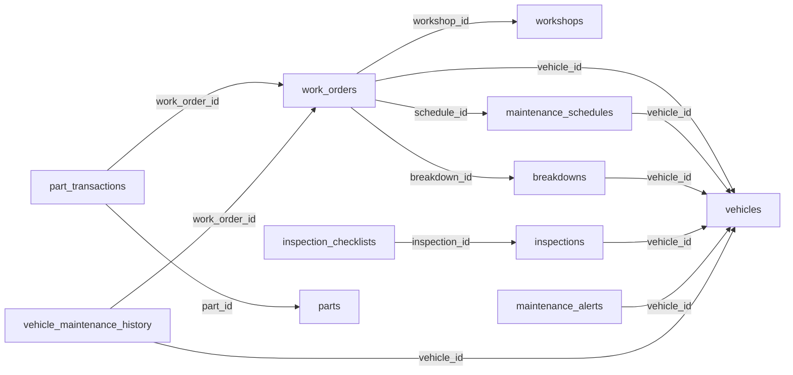
```mermaid
graph LR
    work_orders -->|vehicle_id| vehicles
    work_orders -->|workshop_id| workshops
    work_orders -->|schedule_id| maintenance_schedules
    work_orders -->|breakdown_id| breakdowns
    maintenance_schedules -->|vehicle_id| vehicles
    breakdowns -->|vehicle_id| vehicles
    inspections -->|vehicle_id| vehicles
    inspection_checklists -->|inspection_id| inspections
    part_transactions -->|part_id| parts
    part_transactions -->|work_order_id| work_orders
    maintenance_alerts -->|vehicle_id| vehicles
    vehicle_maintenance_history -->|vehicle_id| vehicles
    vehicle_maintenance_history -->|work_order_id| work_orders
```

---

# 4. Maquina de Estados — WorkOrderStatus

**5 estados | 2 estados terminales (`completed`, `cancelled`)**

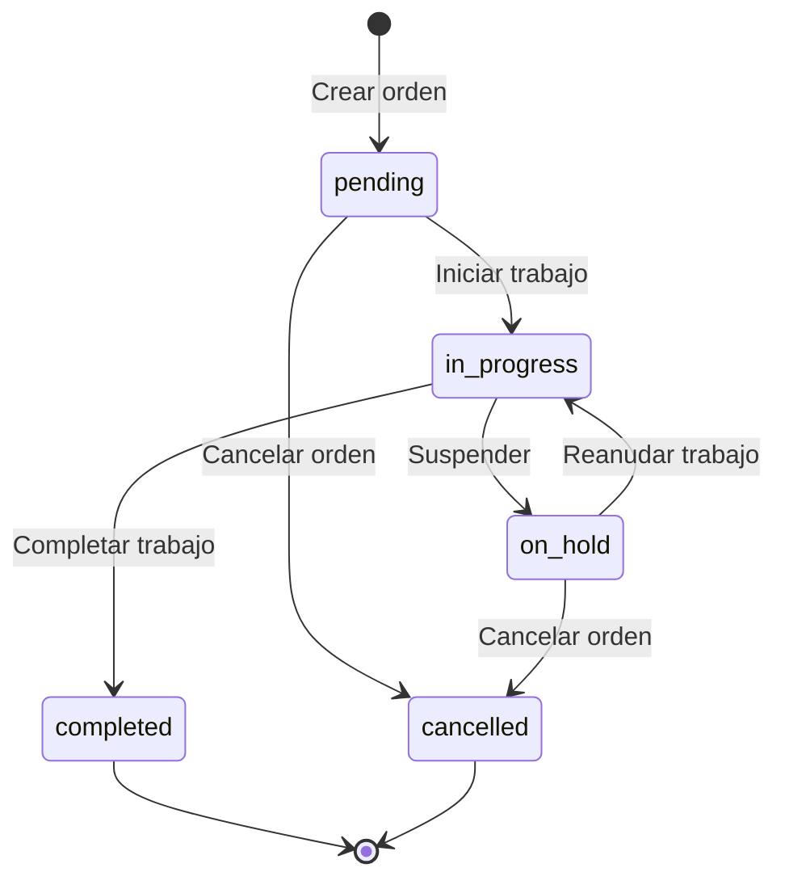
```mermaid
stateDiagram-v2
    [*] --> pending : Crear orden

    pending --> in_progress : Iniciar trabajo
    pending --> cancelled : Cancelar orden

    in_progress --> on_hold : Suspender
    in_progress --> completed : Completar trabajo

    on_hold --> in_progress : Reanudar trabajo
    on_hold --> cancelled : Cancelar orden

    completed --> [*]
    cancelled --> [*]
```

| Estado | Descripcion | Terminal |
|--------|-------------|----------|
| `pending` | Orden creada, pendiente de inicio | No |
| `in_progress` | Trabajo en ejecucion | No |
| `on_hold` | Trabajo suspendido temporalmente | No |
| `completed` | Trabajo finalizado exitosamente | Si |
| `cancelled` | Orden cancelada | Si |

---

# 5. Maquina de Estados — InspectionStatus

**4 estados | 3 estados terminales (`completed`, `failed`, `expired`)**

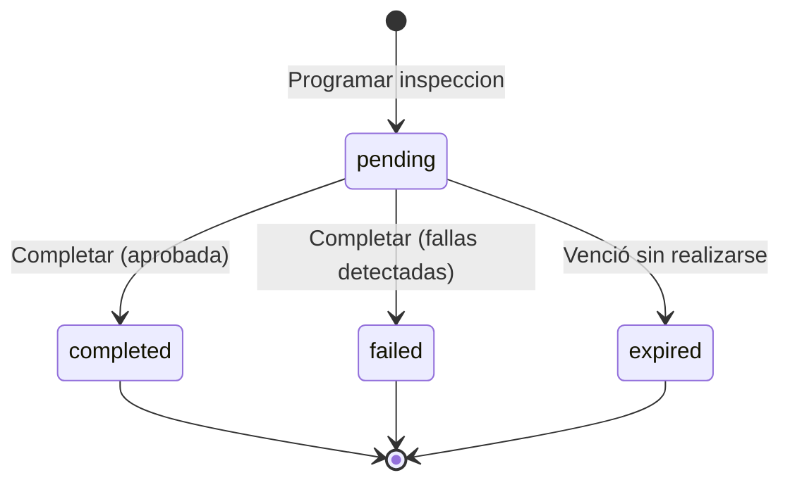
```mermaid
stateDiagram-v2
    [*] --> pending : Programar inspeccion

    pending --> completed : Completar (aprobada)
    pending --> failed : Completar (fallas detectadas)
    pending --> expired : Venció sin realizarse

    completed --> [*]
    failed --> [*]
    expired --> [*]
```

| Estado | Descripcion | Terminal |
|--------|-------------|----------|
| `pending` | Inspeccion programada, pendiente de realizacion | No |
| `completed` | Inspeccion completada y aprobada | Si |
| `failed` | Inspeccion completada con fallas detectadas | Si |
| `expired` | Inspeccion vencida sin haberse realizado | Si |

---

# 6. Maquina de Estados — BreakdownStatus

**4 estados | 1 estado terminal (`resolved`)**

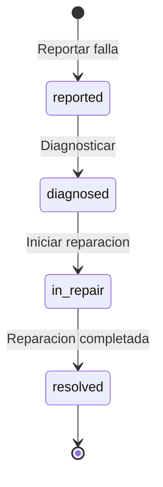
```mermaid
stateDiagram-v2
    [*] --> reported : Reportar falla

    reported --> diagnosed : Diagnosticar
    diagnosed --> in_repair : Iniciar reparacion
    in_repair --> resolved : Reparacion completada

    resolved --> [*]
```

| Estado | Descripcion | Terminal |
|--------|-------------|----------|
| `reported` | Falla reportada inicialmente | No |
| `diagnosed` | Falla diagnosticada por tecnico | No |
| `in_repair` | Falla en proceso de reparacion | No |
| `resolved` | Falla resuelta completamente | Si |

---

# 7. Tabla de Referencia Operativa de Transiciones

## 7.1 Transiciones de WorkOrderStatus

| ID | Estado Origen | Estado Destino | Accion | Actor | Notas |
|----|--------------|----------------|--------|-------|-------|
| T-01 | `(nuevo)` | `pending` | Crear orden de trabajo | Owner / Usuario Maestro / Subusuario | Estado inicial al crear |
| T-02 | `pending` | `in_progress` | Iniciar trabajo | Owner / Usuario Maestro | Asigna tecnico, registra fecha de inicio |
| T-03 | `pending` | `cancelled` | Cancelar orden | Owner / Usuario Maestro | Requiere motivo de cancelacion |
| T-04 | `in_progress` | `on_hold` | Suspender trabajo | Owner / Usuario Maestro | Registra motivo de suspension |
| T-05 | `in_progress` | `completed` | Completar trabajo | Owner / Usuario Maestro | Registra costos, actualiza stock, genera historial |
| T-06 | `on_hold` | `in_progress` | Reanudar trabajo | Owner / Usuario Maestro | Reanuda trabajo previamente suspendido |
| T-07 | `on_hold` | `cancelled` | Cancelar orden suspendida | Owner / Usuario Maestro | Requiere motivo de cancelacion |

## 7.2 Transiciones de InspectionStatus

| ID | Estado Origen | Estado Destino | Accion | Actor | Notas |
|----|--------------|----------------|--------|-------|-------|
| T-08 | `(nuevo)` | `pending` | Programar inspeccion | Owner / Usuario Maestro / Subusuario | Estado inicial al crear |
| T-09 | `pending` | `completed` | Completar inspeccion (aprobada) | Owner / Usuario Maestro / Subusuario | Todos los items del checklist aprobados |
| T-10 | `pending` | `failed` | Completar inspeccion (fallida) | Owner / Usuario Maestro / Subusuario | Items del checklist con fallas |
| T-11 | `pending` | `expired` | Vencimiento automatico | Sistema | Fecha programada superada sin completar |

## 7.3 Transiciones de BreakdownStatus

| ID | Estado Origen | Estado Destino | Accion | Actor | Notas |
|----|--------------|----------------|--------|-------|-------|
| T-12 | `(nuevo)` | `reported` | Reportar falla | Owner / Usuario Maestro / Subusuario | Estado inicial al reportar |
| T-13 | `reported` | `diagnosed` | Diagnosticar falla | Owner / Usuario Maestro | Registra diagnostico y tecnico |
| T-14 | `diagnosed` | `in_repair` | Iniciar reparacion | Owner / Usuario Maestro | Puede generar orden de trabajo automatica |
| T-15 | `in_repair` | `resolved` | Resolver falla | Owner / Usuario Maestro | Registra fecha de resolucion |

---

# 8. Casos de Uso — Referencia Backend

> **Modelo de 3 roles (definicion Edson)**

## Matriz de Acceso — Casos de Uso

> **Leyenda:** Si = Permitido | Configurable = Permitido si el Usuario Maestro le asigno el permiso | No = Denegado

| CU | Nombre | Owner | Usuario Maestro | Subusuario | Sistema |
|----|--------|-------|----------------|------------|---------|
| CU-01 | Listar Vehiculos de Flota | Si | Si | Configurable | -- |
| CU-02 | Registrar Vehiculo | Si | Si | Configurable | -- |
| CU-03 | Crear Programacion de Mantenimiento Preventivo | Si | Si | Configurable | -- |
| CU-04 | Reportar Falla/Averia | Si | Si | Configurable | -- |
| CU-05 | Crear Orden de Trabajo | Si | Si | Configurable | -- |
| CU-06 | Completar Orden de Trabajo | Si | Si | No | -- |
| CU-07 | Realizar Inspeccion | Si | Si | Configurable | -- |
| CU-08 | Gestionar Inventario de Repuestos | Si | Si | Configurable | -- |
| CU-09 | Consultar Alertas de Mantenimiento | Si | Si | Configurable | Si |
| CU-10 | Consultar Metricas de Mantenimiento | Si | Si | Configurable | -- |
| CU-11 | Consultar Historial de Vehiculo | Si | Si | Configurable | -- |
| CU-12 | Configurar Ajustes de Mantenimiento | Si | Si | No | -- |

---

### CU-01: Listar Vehiculos de Flota

**Atributos**

| Atributo | Valor |
|----------|-------|
| Codigo | CU-01 |
| Nombre | Listar Vehiculos de Flota |
| Actor Principal | Owner / Usuario Maestro / Subusuario (permiso `vehicles:read`) |
| Descripcion | Consultar la lista de vehiculos de la flota con filtros y estado actual |

**Precondiciones**

| # | Precondicion |
|---|-------------|
| 1 | El usuario esta autenticado y tiene permiso `vehicles:read` |
| 2 | El tenant tiene al menos un vehiculo registrado |

**Secuencia Backend**

| Paso | Accion |
|------|--------|
| 1 | Recibir GET `/api/v1/maintenance/vehicles` con query params (status, search, page, limit) |
| 2 | Extraer `tenant_id` del JWT |
| 3 | Validar permiso `vehicles:read` |
| 4 | Consultar `vehicles` WHERE `tenant_id` = :tenant_id con filtros aplicados |
| 5 | Aplicar paginacion (page, limit) |
| 6 | Retornar lista paginada con total count |

**Postcondiciones**

| # | Postcondicion |
|---|--------------|
| 1 | Se retorna la lista de vehiculos filtrada por tenant |
| 2 | La paginacion incluye total de registros |

**Excepciones**

| # | Excepcion | Codigo HTTP |
|---|-----------|-------------|
| 1 | Token JWT invalido o expirado | 401 |
| 2 | Sin permiso `vehicles:read` | 403 |

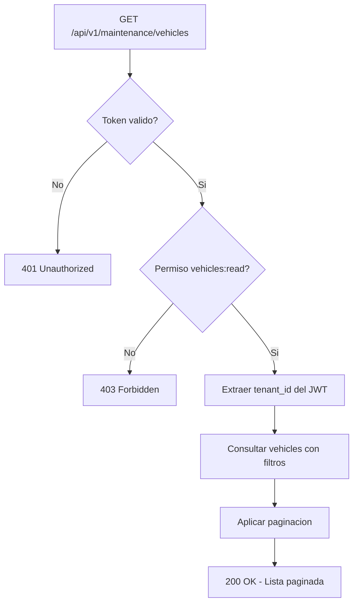
```mermaid
graph TD
    A[GET /api/v1/maintenance/vehicles] --> B{Token valido?}
    B -->|No| C[401 Unauthorized]
    B -->|Si| D{Permiso vehicles:read?}
    D -->|No| E[403 Forbidden]
    D -->|Si| F[Extraer tenant_id del JWT]
    F --> G[Consultar vehicles con filtros]
    G --> H[Aplicar paginacion]
    H --> I[200 OK - Lista paginada]
```

---

### CU-02: Registrar Vehiculo

**Atributos**

| Atributo | Valor |
|----------|-------|
| Codigo | CU-02 |
| Nombre | Registrar Vehiculo |
| Actor Principal | Owner / Usuario Maestro / Subusuario (permiso `vehicles:create`) |
| Descripcion | Registrar un nuevo vehiculo en la flota del tenant |

**Precondiciones**

| # | Precondicion |
|---|-------------|
| 1 | El usuario esta autenticado y tiene permiso `vehicles:create` |
| 2 | La placa no esta duplicada dentro del tenant |

**Secuencia Backend**

| Paso | Accion |
|------|--------|
| 1 | Recibir POST `/api/v1/maintenance/vehicles` con datos del vehiculo |
| 2 | Extraer `tenant_id` del JWT |
| 3 | Validar permiso `vehicles:create` |
| 4 | Validar datos requeridos (plate, brand, model, year) |
| 5 | Verificar que la placa no exista en el tenant |
| 6 | Insertar en `vehicles` con status = 'active' |
| 7 | Retornar vehiculo creado |

**Postcondiciones**

| # | Postcondicion |
|---|--------------|
| 1 | El vehiculo queda registrado con status `active` |
| 2 | El vehiculo pertenece al tenant del usuario |

**Excepciones**

| # | Excepcion | Codigo HTTP |
|---|-----------|-------------|
| 1 | Token JWT invalido o expirado | 401 |
| 2 | Sin permiso `vehicles:create` | 403 |
| 3 | Datos requeridos faltantes | 400 |
| 4 | Placa duplicada en el tenant | 409 |

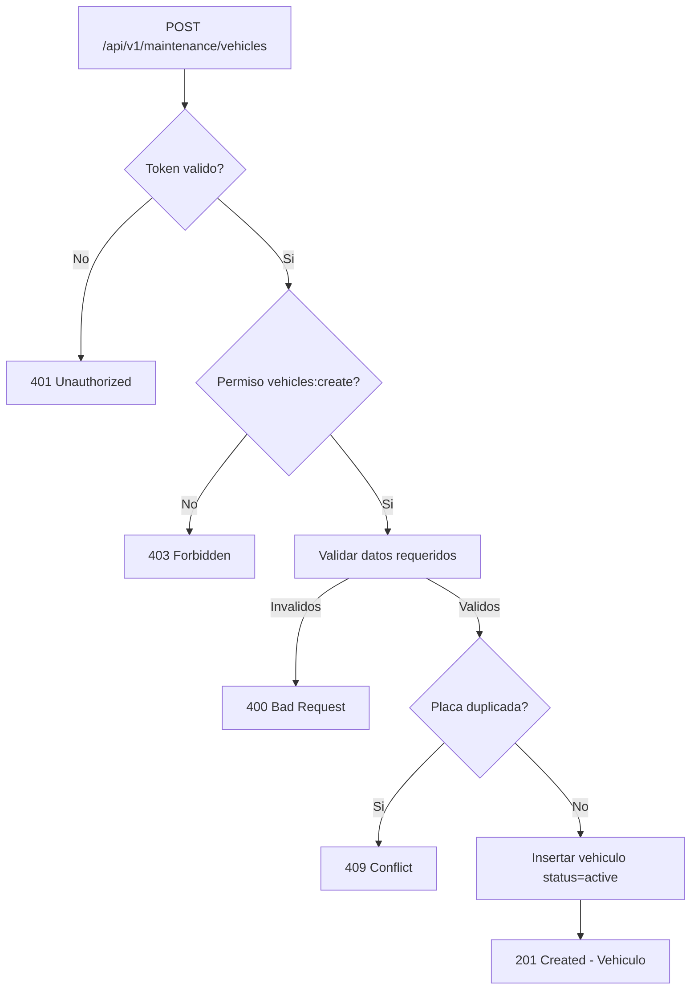
```mermaid
graph TD
    A[POST /api/v1/maintenance/vehicles] --> B{Token valido?}
    B -->|No| C[401 Unauthorized]
    B -->|Si| D{Permiso vehicles:create?}
    D -->|No| E[403 Forbidden]
    D -->|Si| F[Validar datos requeridos]
    F -->|Invalidos| G[400 Bad Request]
    F -->|Validos| H{Placa duplicada?}
    H -->|Si| I[409 Conflict]
    H -->|No| J[Insertar vehiculo status=active]
    J --> K[201 Created - Vehiculo]
```

---

### CU-03: Crear Programacion de Mantenimiento Preventivo

**Atributos**

| Atributo | Valor |
|----------|-------|
| Codigo | CU-03 |
| Nombre | Crear Programacion de Mantenimiento Preventivo |
| Actor Principal | Owner / Usuario Maestro / Subusuario (permiso `schedules:create`) |
| Descripcion | Crear una programacion de mantenimiento preventivo basada en tiempo y/o kilometraje |

**Precondiciones**

| # | Precondicion |
|---|-------------|
| 1 | El usuario esta autenticado y tiene permiso `schedules:create` |
| 2 | El vehiculo existe y pertenece al tenant |
| 3 | Se proporciona al menos un intervalo (km o dias) |

**Secuencia Backend**

| Paso | Accion |
|------|--------|
| 1 | Recibir POST `/api/v1/maintenance/schedules` con datos de programacion |
| 2 | Extraer `tenant_id` del JWT |
| 3 | Validar permiso `schedules:create` |
| 4 | Validar que el vehiculo exista y pertenezca al tenant |
| 5 | Validar que se incluya al menos interval_km o interval_days |
| 6 | Calcular next_due_date y/o next_due_mileage |
| 7 | Insertar en `maintenance_schedules` con status = 'upcoming' |
| 8 | Retornar programacion creada |

**Postcondiciones**

| # | Postcondicion |
|---|--------------|
| 1 | La programacion queda registrada con status `upcoming` |
| 2 | Se calculan las fechas/kilometrajes de proximo vencimiento |

**Excepciones**

| # | Excepcion | Codigo HTTP |
|---|-----------|-------------|
| 1 | Token JWT invalido o expirado | 401 |
| 2 | Sin permiso `schedules:create` | 403 |
| 3 | Vehiculo no encontrado | 404 |
| 4 | Sin intervalo definido (km ni dias) | 400 |

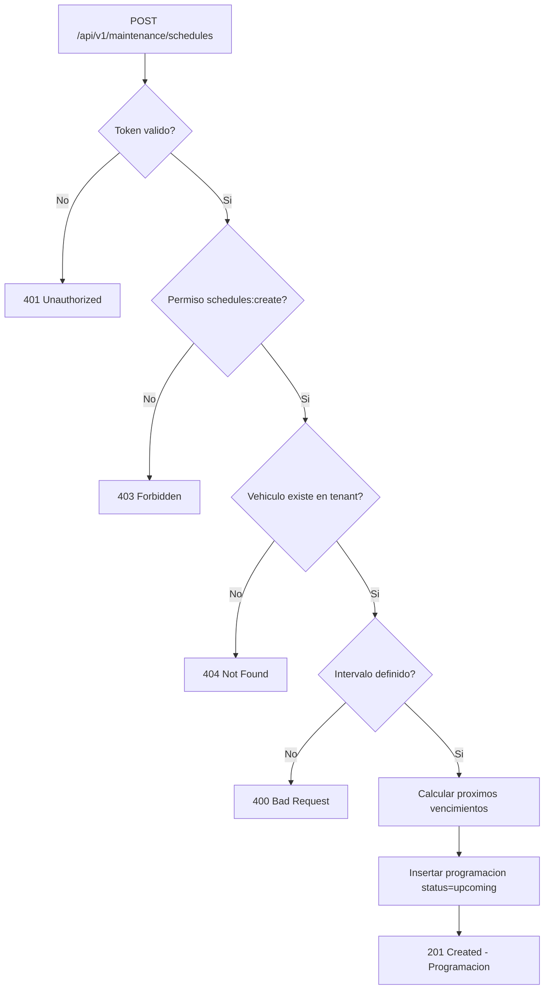
```mermaid
graph TD
    A[POST /api/v1/maintenance/schedules] --> B{Token valido?}
    B -->|No| C[401 Unauthorized]
    B -->|Si| D{Permiso schedules:create?}
    D -->|No| E[403 Forbidden]
    D -->|Si| F{Vehiculo existe en tenant?}
    F -->|No| G[404 Not Found]
    F -->|Si| H{Intervalo definido?}
    H -->|No| I[400 Bad Request]
    H -->|Si| J[Calcular proximos vencimientos]
    J --> K[Insertar programacion status=upcoming]
    K --> L[201 Created - Programacion]
```

---

### CU-04: Reportar Falla/Averia

**Atributos**

| Atributo | Valor |
|----------|-------|
| Codigo | CU-04 |
| Nombre | Reportar Falla/Averia |
| Actor Principal | Owner / Usuario Maestro / Subusuario (permiso `breakdowns:create`) |
| Descripcion | Reportar una falla o averia en un vehiculo de la flota |

**Precondiciones**

| # | Precondicion |
|---|-------------|
| 1 | El usuario esta autenticado y tiene permiso `breakdowns:create` |
| 2 | El vehiculo existe y pertenece al tenant |

**Secuencia Backend**

| Paso | Accion |
|------|--------|
| 1 | Recibir POST `/api/v1/maintenance/breakdowns` con datos de la falla |
| 2 | Extraer `tenant_id` del JWT |
| 3 | Validar permiso `breakdowns:create` |
| 4 | Validar que el vehiculo exista y pertenezca al tenant |
| 5 | Validar datos requeridos (description, severity) |
| 6 | Insertar en `breakdowns` con status = 'reported' |
| 7 | Si severity = 'critical', cambiar vehiculo a status = 'out_of_service' |
| 8 | Emitir evento `maintenance.breakdown.reported` |
| 9 | Si autoCreateWorkOrder esta activo, crear orden de trabajo tipo 'corrective' |
| 10 | Generar alerta tipo `breakdown_reported` |
| 11 | Retornar breakdown creado |

**Postcondiciones**

| # | Postcondicion |
|---|--------------|
| 1 | La falla queda registrada con status `reported` |
| 2 | Si severidad critica, el vehiculo pasa a `out_of_service` |
| 3 | Se emite evento de dominio `maintenance.breakdown.reported` |
| 4 | Se genera alerta de falla reportada |

**Excepciones**

| # | Excepcion | Codigo HTTP |
|---|-----------|-------------|
| 1 | Token JWT invalido o expirado | 401 |
| 2 | Sin permiso `breakdowns:create` | 403 |
| 3 | Vehiculo no encontrado | 404 |
| 4 | Datos requeridos faltantes | 400 |

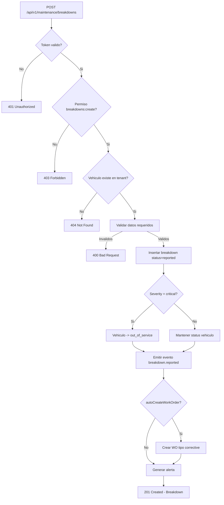
```mermaid
graph TD
    A[POST /api/v1/maintenance/breakdowns] --> B{Token valido?}
    B -->|No| C[401 Unauthorized]
    B -->|Si| D{Permiso breakdowns:create?}
    D -->|No| E[403 Forbidden]
    D -->|Si| F{Vehiculo existe en tenant?}
    F -->|No| G[404 Not Found]
    F -->|Si| H[Validar datos requeridos]
    H -->|Invalidos| I[400 Bad Request]
    H -->|Validos| J[Insertar breakdown status=reported]
    J --> K{Severity = critical?}
    K -->|Si| L[Vehiculo -> out_of_service]
    K -->|No| M[Mantener status vehiculo]
    L --> N[Emitir evento breakdown.reported]
    M --> N
    N --> O{autoCreateWorkOrder?}
    O -->|Si| P[Crear WO tipo corrective]
    O -->|No| Q[Generar alerta]
    P --> Q
    Q --> R[201 Created - Breakdown]
```

---

### CU-05: Crear Orden de Trabajo

**Atributos**

| Atributo | Valor |
|----------|-------|
| Codigo | CU-05 |
| Nombre | Crear Orden de Trabajo |
| Actor Principal | Owner / Usuario Maestro / Subusuario (permiso `work_orders:create`) |
| Descripcion | Crear una nueva orden de trabajo de mantenimiento para un vehiculo |

**Precondiciones**

| # | Precondicion |
|---|-------------|
| 1 | El usuario esta autenticado y tiene permiso `work_orders:create` |
| 2 | El vehiculo existe y pertenece al tenant |
| 3 | Si se indica taller, este debe existir y estar activo |

**Secuencia Backend**

| Paso | Accion |
|------|--------|
| 1 | Recibir POST `/api/v1/maintenance/work-orders` con datos de la orden |
| 2 | Extraer `tenant_id` del JWT |
| 3 | Validar permiso `work_orders:create` |
| 4 | Validar que el vehiculo exista y pertenezca al tenant |
| 5 | Validar datos requeridos (type, priority, description) |
| 6 | Si workshop_id proporcionado, validar que exista y este activo |
| 7 | Generar codigo WO-XXXX secuencial por tenant |
| 8 | Insertar en `work_orders` con status = 'pending' |
| 9 | Cambiar vehiculo a status = 'maintenance' |
| 10 | Emitir evento `maintenance.work_order.created` via tmsEventBus |
| 11 | Retornar orden creada |

**Postcondiciones**

| # | Postcondicion |
|---|--------------|
| 1 | La orden de trabajo queda registrada con status `pending` |
| 2 | El vehiculo pasa a status `maintenance` |
| 3 | Se emite evento `maintenance:started` via tmsEventBus |

**Excepciones**

| # | Excepcion | Codigo HTTP |
|---|-----------|-------------|
| 1 | Token JWT invalido o expirado | 401 |
| 2 | Sin permiso `work_orders:create` | 403 |
| 3 | Vehiculo no encontrado | 404 |
| 4 | Taller no encontrado o inactivo | 404 |
| 5 | Datos requeridos faltantes | 400 |

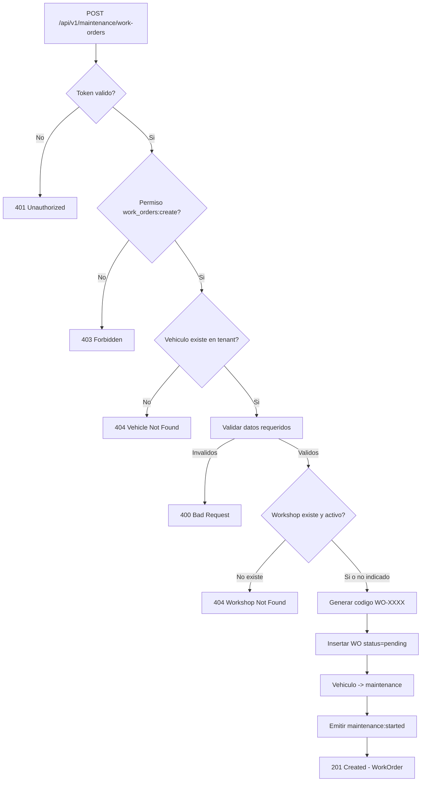
```mermaid
graph TD
    A[POST /api/v1/maintenance/work-orders] --> B{Token valido?}
    B -->|No| C[401 Unauthorized]
    B -->|Si| D{Permiso work_orders:create?}
    D -->|No| E[403 Forbidden]
    D -->|Si| F{Vehiculo existe en tenant?}
    F -->|No| G[404 Vehicle Not Found]
    F -->|Si| H[Validar datos requeridos]
    H -->|Invalidos| I[400 Bad Request]
    H -->|Validos| J{Workshop existe y activo?}
    J -->|No existe| K[404 Workshop Not Found]
    J -->|Si o no indicado| L[Generar codigo WO-XXXX]
    L --> M[Insertar WO status=pending]
    M --> N[Vehiculo -> maintenance]
    N --> O[Emitir maintenance:started]
    O --> P[201 Created - WorkOrder]
```

---

### CU-06: Completar Orden de Trabajo

**Atributos**

| Atributo | Valor |
|----------|-------|
| Codigo | CU-06 |
| Nombre | Completar Orden de Trabajo |
| Actor Principal | Owner / Usuario Maestro |
| Descripcion | Completar una orden de trabajo activa, registrando costos y actualizando inventario |

**Precondiciones**

| # | Precondicion |
|---|-------------|
| 1 | El usuario esta autenticado y tiene permiso `work_orders:complete` |
| 2 | La orden de trabajo existe y esta en status `in_progress` |
| 3 | El usuario es Owner o Usuario Maestro (Subusuario no puede completar) |

**Secuencia Backend**

| Paso | Accion |
|------|--------|
| 1 | Recibir PATCH `/api/v1/maintenance/work-orders/:id/complete` con datos de cierre |
| 2 | Extraer `tenant_id` del JWT |
| 3 | Validar permiso `work_orders:complete` y rol Owner/UM |
| 4 | Buscar orden de trabajo por id y tenant_id |
| 5 | Validar que status actual sea `in_progress` |
| 6 | Registrar labor_cost y parts_cost |
| 7 | Decrementar stock de repuestos usados |
| 8 | Verificar si algun repuesto quedo bajo minStock -> generar alerta low_stock |
| 9 | Actualizar status a `completed`, registrar completed_date |
| 10 | Devolver vehiculo a status `active` |
| 11 | Registrar en `vehicle_maintenance_history` |
| 12 | Emitir evento `maintenance:completed` via tmsEventBus |
| 13 | Si la orden vino de un schedule, actualizar last_service_date y recalcular next_due |
| 14 | Retornar orden completada |

**Postcondiciones**

| # | Postcondicion |
|---|--------------|
| 1 | La orden de trabajo pasa a status `completed` |
| 2 | El vehiculo retorna a status `active` |
| 3 | Los costos quedan registrados (labor + parts = total) |
| 4 | El stock de repuestos se actualiza |
| 5 | Se genera historial de mantenimiento del vehiculo |
| 6 | Se emite evento `maintenance:completed` |

**Excepciones**

| # | Excepcion | Codigo HTTP |
|---|-----------|-------------|
| 1 | Token JWT invalido o expirado | 401 |
| 2 | Sin permiso `work_orders:complete` o no es Owner/UM | 403 |
| 3 | Orden de trabajo no encontrada | 404 |
| 4 | Transicion de estado invalida (no esta en in_progress) | 422 |
| 5 | Stock insuficiente de repuesto | 422 |

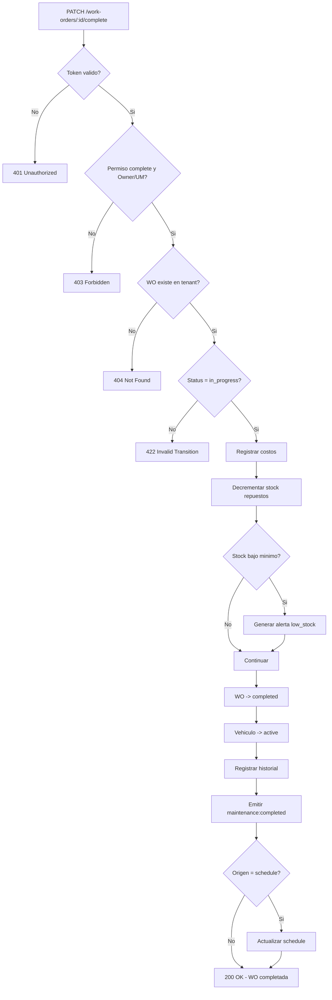
```mermaid
graph TD
    A[PATCH /work-orders/:id/complete] --> B{Token valido?}
    B -->|No| C[401 Unauthorized]
    B -->|Si| D{Permiso complete y Owner/UM?}
    D -->|No| E[403 Forbidden]
    D -->|Si| F{WO existe en tenant?}
    F -->|No| G[404 Not Found]
    F -->|Si| H{Status = in_progress?}
    H -->|No| I[422 Invalid Transition]
    H -->|Si| J[Registrar costos]
    J --> K[Decrementar stock repuestos]
    K --> L{Stock bajo minimo?}
    L -->|Si| M[Generar alerta low_stock]
    L -->|No| N[Continuar]
    M --> N
    N --> O[WO -> completed]
    O --> P[Vehiculo -> active]
    P --> Q[Registrar historial]
    Q --> R[Emitir maintenance:completed]
    R --> S{Origen = schedule?}
    S -->|Si| T[Actualizar schedule]
    S -->|No| U[200 OK - WO completada]
    T --> U
```

---

### CU-07: Realizar Inspeccion

**Atributos**

| Atributo | Valor |
|----------|-------|
| Codigo | CU-07 |
| Nombre | Realizar Inspeccion |
| Actor Principal | Owner / Usuario Maestro / Subusuario (permiso `inspections:create`) |
| Descripcion | Crear y completar una inspeccion vehicular con checklist |

**Precondiciones**

| # | Precondicion |
|---|-------------|
| 1 | El usuario esta autenticado y tiene permiso `inspections:create` |
| 2 | El vehiculo existe y pertenece al tenant |

**Secuencia Backend**

| Paso | Accion |
|------|--------|
| 1 | Recibir POST `/api/v1/maintenance/inspections` con datos de inspeccion |
| 2 | Extraer `tenant_id` del JWT |
| 3 | Validar permiso `inspections:create` |
| 4 | Validar que el vehiculo exista y pertenezca al tenant |
| 5 | Validar datos requeridos (type, scheduled_date, checklist items) |
| 6 | Insertar en `inspections` con status = 'pending' |
| 7 | Insertar items de checklist en `inspection_checklists` |
| 8 | Si se completa inmediatamente, evaluar passed basado en checklist |
| 9 | Si failed, emitir evento `maintenance.inspection.failed` |
| 10 | Si failed y autoCreateWorkOrder, crear WO tipo 'inspection' |
| 11 | Si completed, emitir evento `maintenance.inspection.completed` |
| 12 | Retornar inspeccion creada |

**Postcondiciones**

| # | Postcondicion |
|---|--------------|
| 1 | La inspeccion queda registrada con checklist |
| 2 | Si completada fallida, puede generar orden de trabajo automatica |
| 3 | Se emite evento de dominio correspondiente |

**Excepciones**

| # | Excepcion | Codigo HTTP |
|---|-----------|-------------|
| 1 | Token JWT invalido o expirado | 401 |
| 2 | Sin permiso `inspections:create` | 403 |
| 3 | Vehiculo no encontrado | 404 |
| 4 | Datos requeridos faltantes | 400 |

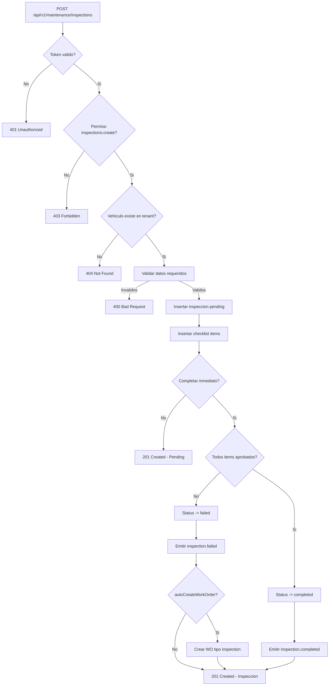
```mermaid
graph TD
    A[POST /api/v1/maintenance/inspections] --> B{Token valido?}
    B -->|No| C[401 Unauthorized]
    B -->|Si| D{Permiso inspections:create?}
    D -->|No| E[403 Forbidden]
    D -->|Si| F{Vehiculo existe en tenant?}
    F -->|No| G[404 Not Found]
    F -->|Si| H[Validar datos requeridos]
    H -->|Invalidos| I[400 Bad Request]
    H -->|Validos| J[Insertar inspeccion pending]
    J --> K[Insertar checklist items]
    K --> L{Completar inmediato?}
    L -->|No| M[201 Created - Pending]
    L -->|Si| N{Todos items aprobados?}
    N -->|Si| O[Status -> completed]
    N -->|No| P[Status -> failed]
    O --> Q[Emitir inspection.completed]
    P --> R[Emitir inspection.failed]
    R --> S{autoCreateWorkOrder?}
    S -->|Si| T[Crear WO tipo inspection]
    S -->|No| U[201 Created - Inspeccion]
    T --> U
    Q --> U
```

---

### CU-08: Gestionar Inventario de Repuestos

**Atributos**

| Atributo | Valor |
|----------|-------|
| Codigo | CU-08 |
| Nombre | Gestionar Inventario de Repuestos |
| Actor Principal | Owner / Usuario Maestro / Subusuario (permiso `parts:create`) |
| Descripcion | Registrar, actualizar y consultar repuestos e inventario |

**Precondiciones**

| # | Precondicion |
|---|-------------|
| 1 | El usuario esta autenticado y tiene permiso `parts:create` o `parts:update` |
| 2 | El codigo de parte no esta duplicado dentro del tenant |

**Secuencia Backend**

| Paso | Accion |
|------|--------|
| 1 | Recibir POST `/api/v1/maintenance/parts` con datos del repuesto |
| 2 | Extraer `tenant_id` del JWT |
| 3 | Validar permiso `parts:create` |
| 4 | Validar datos requeridos (code, name, category, unit_cost) |
| 5 | Verificar que el codigo no exista en el tenant |
| 6 | Insertar en `parts` |
| 7 | Si se incluye stock inicial, registrar transaction tipo 'purchase' |
| 8 | Retornar repuesto creado |

**Postcondiciones**

| # | Postcondicion |
|---|--------------|
| 1 | El repuesto queda registrado en el inventario del tenant |
| 2 | Si se incluyo stock inicial, se genera transaccion de compra |

**Excepciones**

| # | Excepcion | Codigo HTTP |
|---|-----------|-------------|
| 1 | Token JWT invalido o expirado | 401 |
| 2 | Sin permiso `parts:create` | 403 |
| 3 | Datos requeridos faltantes | 400 |
| 4 | Codigo de parte duplicado | 409 |

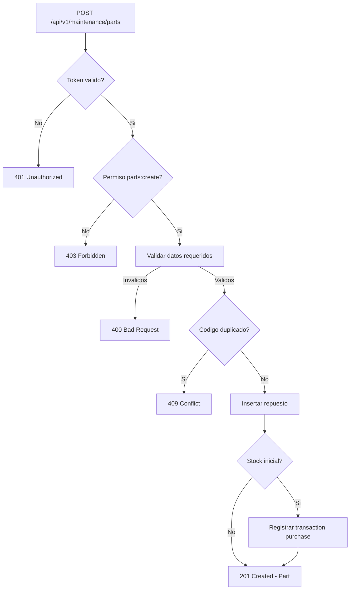
```mermaid
graph TD
    A[POST /api/v1/maintenance/parts] --> B{Token valido?}
    B -->|No| C[401 Unauthorized]
    B -->|Si| D{Permiso parts:create?}
    D -->|No| E[403 Forbidden]
    D -->|Si| F[Validar datos requeridos]
    F -->|Invalidos| G[400 Bad Request]
    F -->|Validos| H{Codigo duplicado?}
    H -->|Si| I[409 Conflict]
    H -->|No| J[Insertar repuesto]
    J --> K{Stock inicial?}
    K -->|Si| L[Registrar transaction purchase]
    K -->|No| M[201 Created - Part]
    L --> M
```

---

### CU-09: Consultar Alertas de Mantenimiento

**Atributos**

| Atributo | Valor |
|----------|-------|
| Codigo | CU-09 |
| Nombre | Consultar Alertas de Mantenimiento |
| Actor Principal | Owner / Usuario Maestro / Subusuario (permiso `alerts:read`) / Sistema |
| Descripcion | Consultar alertas de mantenimiento, marcarlas como leidas o descartarlas |

**Precondiciones**

| # | Precondicion |
|---|-------------|
| 1 | El usuario esta autenticado y tiene permiso `alerts:read` |
| 2 | El tenant tiene alertas generadas (automaticas o manuales) |

**Secuencia Backend**

| Paso | Accion |
|------|--------|
| 1 | Recibir GET `/api/v1/maintenance/alerts` con query params (type, severity, isRead, page, limit) |
| 2 | Extraer `tenant_id` del JWT |
| 3 | Validar permiso `alerts:read` |
| 4 | Consultar `maintenance_alerts` WHERE `tenant_id` = :tenant_id con filtros |
| 5 | Ordenar por severidad (critical primero) y fecha |
| 6 | Aplicar paginacion |
| 7 | Retornar lista paginada de alertas |

**Postcondiciones**

| # | Postcondicion |
|---|--------------|
| 1 | Se retorna la lista de alertas filtrada y ordenada por prioridad |

**Excepciones**

| # | Excepcion | Codigo HTTP |
|---|-----------|-------------|
| 1 | Token JWT invalido o expirado | 401 |
| 2 | Sin permiso `alerts:read` | 403 |

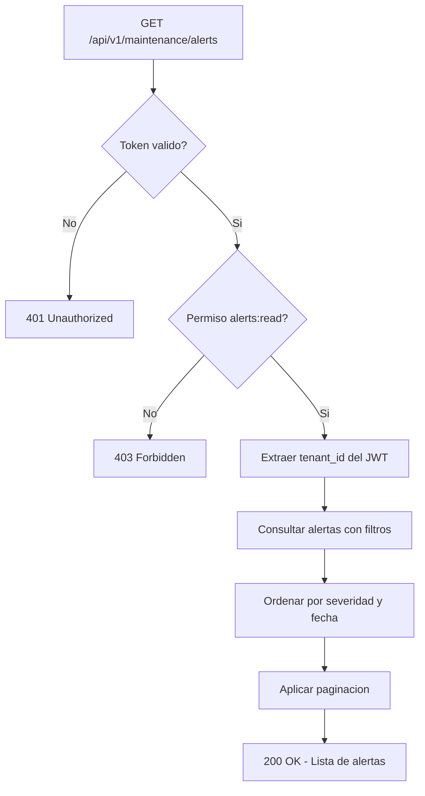
```mermaid
graph TD
    A[GET /api/v1/maintenance/alerts] --> B{Token valido?}
    B -->|No| C[401 Unauthorized]
    B -->|Si| D{Permiso alerts:read?}
    D -->|No| E[403 Forbidden]
    D -->|Si| F[Extraer tenant_id del JWT]
    F --> G[Consultar alertas con filtros]
    G --> H[Ordenar por severidad y fecha]
    H --> I[Aplicar paginacion]
    I --> J[200 OK - Lista de alertas]
```

---

### CU-10: Consultar Metricas de Mantenimiento

**Atributos**

| Atributo | Valor |
|----------|-------|
| Codigo | CU-10 |
| Nombre | Consultar Metricas de Mantenimiento |
| Actor Principal | Owner / Usuario Maestro / Subusuario (permiso `maintenance:metrics`) |
| Descripcion | Consultar metricas consolidadas de mantenimiento de la flota |

**Precondiciones**

| # | Precondicion |
|---|-------------|
| 1 | El usuario esta autenticado y tiene permiso `maintenance:metrics` |
| 2 | El tenant tiene datos de mantenimiento para calcular metricas |

**Secuencia Backend**

| Paso | Accion |
|------|--------|
| 1 | Recibir GET `/api/v1/maintenance/metrics` con query params (dateFrom, dateTo) |
| 2 | Extraer `tenant_id` del JWT |
| 3 | Validar permiso `maintenance:metrics` |
| 4 | Calcular MTBF (Mean Time Between Failures) desde historial |
| 5 | Calcular MTTR (Mean Time To Repair) desde ordenes completadas |
| 6 | Contar ordenes activas, programaciones vencidas |
| 7 | Calcular costos totales del periodo |
| 8 | Contar vehiculos actualmente en mantenimiento |
| 9 | Retornar metricas consolidadas |

**Postcondiciones**

| # | Postcondicion |
|---|--------------|
| 1 | Se retornan metricas calculadas: MTBF, MTTR, costos, conteos |

**Excepciones**

| # | Excepcion | Codigo HTTP |
|---|-----------|-------------|
| 1 | Token JWT invalido o expirado | 401 |
| 2 | Sin permiso `maintenance:metrics` | 403 |

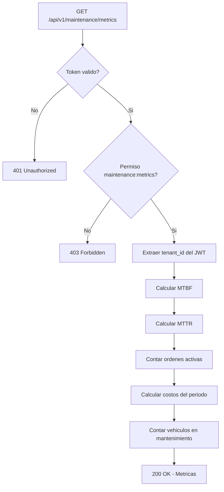
```mermaid
graph TD
    A[GET /api/v1/maintenance/metrics] --> B{Token valido?}
    B -->|No| C[401 Unauthorized]
    B -->|Si| D{Permiso maintenance:metrics?}
    D -->|No| E[403 Forbidden]
    D -->|Si| F[Extraer tenant_id del JWT]
    F --> G[Calcular MTBF]
    G --> H[Calcular MTTR]
    H --> I[Contar ordenes activas]
    I --> J[Calcular costos del periodo]
    J --> K[Contar vehiculos en mantenimiento]
    K --> L[200 OK - Metricas]
```

---

### CU-11: Consultar Historial de Vehiculo

**Atributos**

| Atributo | Valor |
|----------|-------|
| Codigo | CU-11 |
| Nombre | Consultar Historial de Vehiculo |
| Actor Principal | Owner / Usuario Maestro / Subusuario (permiso `maintenance:metrics`) |
| Descripcion | Consultar el historial completo de mantenimiento de un vehiculo |

**Precondiciones**

| # | Precondicion |
|---|-------------|
| 1 | El usuario esta autenticado y tiene permiso `maintenance:metrics` |
| 2 | El vehiculo existe y pertenece al tenant |

**Secuencia Backend**

| Paso | Accion |
|------|--------|
| 1 | Recibir GET `/api/v1/maintenance/vehicles/:id/history` con query params |
| 2 | Extraer `tenant_id` del JWT |
| 3 | Validar permiso `maintenance:metrics` |
| 4 | Validar que el vehiculo exista y pertenezca al tenant |
| 5 | Consultar `vehicle_maintenance_history` WHERE vehicle_id AND tenant_id |
| 6 | Ordenar por event_date DESC |
| 7 | Aplicar paginacion |
| 8 | Retornar historial paginado |

**Postcondiciones**

| # | Postcondicion |
|---|--------------|
| 1 | Se retorna el historial de mantenimiento del vehiculo ordenado cronologicamente |

**Excepciones**

| # | Excepcion | Codigo HTTP |
|---|-----------|-------------|
| 1 | Token JWT invalido o expirado | 401 |
| 2 | Sin permiso `maintenance:metrics` | 403 |
| 3 | Vehiculo no encontrado | 404 |

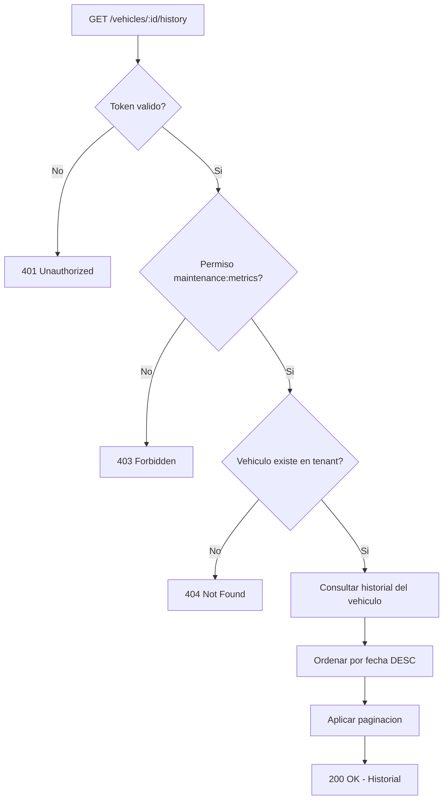
```mermaid
graph TD
    A[GET /vehicles/:id/history] --> B{Token valido?}
    B -->|No| C[401 Unauthorized]
    B -->|Si| D{Permiso maintenance:metrics?}
    D -->|No| E[403 Forbidden]
    D -->|Si| F{Vehiculo existe en tenant?}
    F -->|No| G[404 Not Found]
    F -->|Si| H[Consultar historial del vehiculo]
    H --> I[Ordenar por fecha DESC]
    I --> J[Aplicar paginacion]
    J --> K[200 OK - Historial]
```

---

### CU-12: Configurar Ajustes de Mantenimiento

**Atributos**

| Atributo | Valor |
|----------|-------|
| Codigo | CU-12 |
| Nombre | Configurar Ajustes de Mantenimiento |
| Actor Principal | Owner / Usuario Maestro |
| Descripcion | Configurar parametros globales del modulo de mantenimiento para el tenant |

**Precondiciones**

| # | Precondicion |
|---|-------------|
| 1 | El usuario esta autenticado y tiene permiso `maintenance:settings` |
| 2 | El usuario es Owner o Usuario Maestro (Subusuario no puede configurar) |

**Secuencia Backend**

| Paso | Accion |
|------|--------|
| 1 | Recibir PUT `/api/v1/maintenance/settings` con datos de configuracion |
| 2 | Extraer `tenant_id` del JWT |
| 3 | Validar permiso `maintenance:settings` y rol Owner/UM |
| 4 | Validar datos (alertDaysBefore > 0, mileageAlertThreshold > 0) |
| 5 | Buscar o crear registro en `maintenance_settings` para el tenant |
| 6 | Actualizar configuracion |
| 7 | Retornar configuracion actualizada |

**Postcondiciones**

| # | Postcondicion |
|---|--------------|
| 1 | La configuracion del modulo queda actualizada para el tenant |
| 2 | Los cambios aplican inmediatamente a las validaciones del modulo |

**Excepciones**

| # | Excepcion | Codigo HTTP |
|---|-----------|-------------|
| 1 | Token JWT invalido o expirado | 401 |
| 2 | Sin permiso `maintenance:settings` o no es Owner/UM | 403 |
| 3 | Datos de configuracion invalidos | 400 |

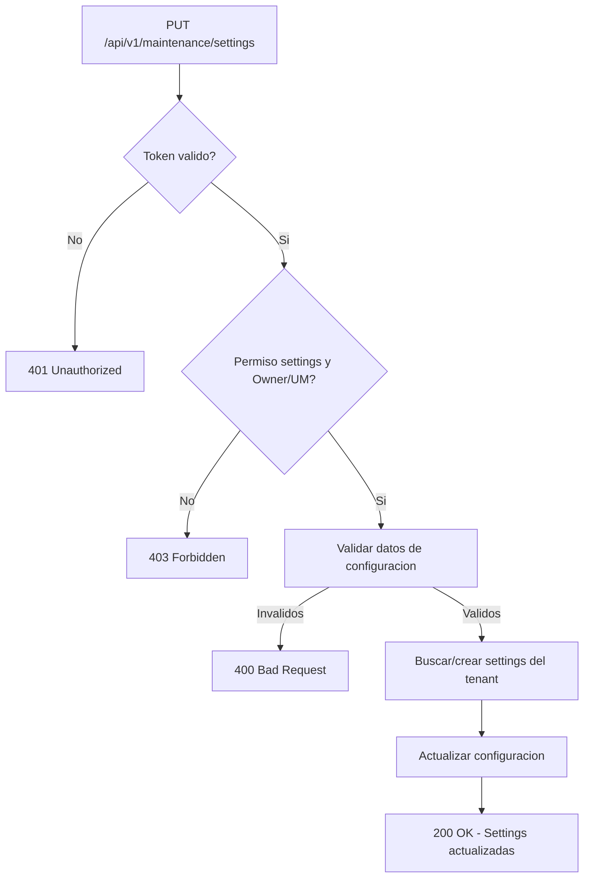
```mermaid
graph TD
    A[PUT /api/v1/maintenance/settings] --> B{Token valido?}
    B -->|No| C[401 Unauthorized]
    B -->|Si| D{Permiso settings y Owner/UM?}
    D -->|No| E[403 Forbidden]
    D -->|Si| F[Validar datos de configuracion]
    F -->|Invalidos| G[400 Bad Request]
    F -->|Validos| H[Buscar/crear settings del tenant]
    H --> I[Actualizar configuracion]
    I --> J[200 OK - Settings actualizadas]
```

---

## Diagrama de Secuencia General — Interaccion Backend

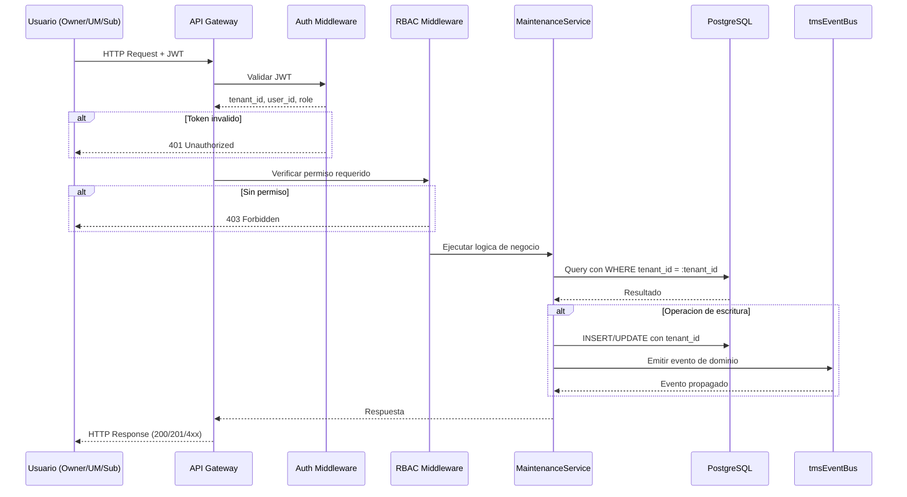
```mermaid
sequenceDiagram
    participant U as Usuario (Owner/UM/Sub)
    participant API as API Gateway
    participant Auth as Auth Middleware
    participant RBAC as RBAC Middleware
    participant MS as MaintenanceService
    participant DB as PostgreSQL
    participant EB as tmsEventBus

    U->>API: HTTP Request + JWT
    API->>Auth: Validar JWT
    Auth-->>API: tenant_id, user_id, role

    alt Token invalido
        Auth-->>U: 401 Unauthorized
    end

    API->>RBAC: Verificar permiso requerido

    alt Sin permiso
        RBAC-->>U: 403 Forbidden
    end

    RBAC->>MS: Ejecutar logica de negocio
    MS->>DB: Query con WHERE tenant_id = :tenant_id
    DB-->>MS: Resultado

    alt Operacion de escritura
        MS->>DB: INSERT/UPDATE con tenant_id
        MS->>EB: Emitir evento de dominio
        EB-->>MS: Evento propagado
    end

    MS-->>API: Respuesta
    API-->>U: HTTP Response (200/201/4xx)
```

---

# 9. Endpoints API REST

**Base path:** `/api/v1/maintenance`

> Todos los endpoints requieren autenticacion JWT. El `tenant_id` se extrae automaticamente del token. La columna **Roles** indica que roles tienen acceso al endpoint.

## 9.1 Vehiculos

| # | Metodo | Endpoint | Descripcion | Permiso | Roles | Request/Query | Response |
|---|--------|----------|-------------|---------|-------|---------------|----------|
| E-01 | GET | `/vehicles` | Listar vehiculos de la flota | `vehicles:read` | Owner, UM, Sub (conf.) | `?status=active&search=ABC&page=1&limit=20` | `{ data: Vehicle[], total, page, limit }` |
| E-02 | GET | `/vehicles/:id` | Obtener detalle de vehiculo | `vehicles:read` | Owner, UM, Sub (conf.) | Path: `id` (UUID) | `Vehicle` |
| E-03 | POST | `/vehicles` | Registrar nuevo vehiculo | `vehicles:create` | Owner, UM, Sub (conf.) | `{ plate, brand, model, year, vin?, color?, fuelType?, currentMileage? }` | `Vehicle` (201) |
| E-04 | PUT | `/vehicles/:id` | Actualizar vehiculo | `vehicles:update` | Owner, UM, Sub (conf.) | `{ plate?, brand?, model?, year?, vin?, color?, fuelType?, status?, notes? }` | `Vehicle` |
| E-05 | DELETE | `/vehicles/:id` | Eliminar vehiculo | `vehicles:delete` | Owner, UM | Path: `id` (UUID) | `204 No Content` |
| E-06 | PATCH | `/vehicles/:id/mileage` | Actualizar kilometraje | `vehicles:update` | Owner, UM, Sub (conf.) | `{ currentMileage: number }` | `Vehicle` |

## 9.2 Programaciones de Mantenimiento

| # | Metodo | Endpoint | Descripcion | Permiso | Roles | Request/Query | Response |
|---|--------|----------|-------------|---------|-------|---------------|----------|
| E-07 | GET | `/schedules` | Listar programaciones | `schedules:read` | Owner, UM, Sub (conf.) | `?vehicleId=&status=&page=1&limit=20` | `{ data: MaintenanceSchedule[], total, page, limit }` |
| E-08 | POST | `/schedules` | Crear programacion preventiva | `schedules:create` | Owner, UM, Sub (conf.) | `{ vehicleId, name, description?, intervalKm?, intervalDays?, lastServiceMileage?, lastServiceDate? }` | `MaintenanceSchedule` (201) |
| E-09 | PUT | `/schedules/:id` | Actualizar programacion | `schedules:update` | Owner, UM, Sub (conf.) | `{ name?, description?, intervalKm?, intervalDays?, status? }` | `MaintenanceSchedule` |
| E-10 | DELETE | `/schedules/:id` | Eliminar programacion | `schedules:delete` | Owner, UM | Path: `id` (UUID) | `204 No Content` |

## 9.3 Averias / Fallas

| # | Metodo | Endpoint | Descripcion | Permiso | Roles | Request/Query | Response |
|---|--------|----------|-------------|---------|-------|---------------|----------|
| E-11 | GET | `/breakdowns` | Listar averias | `breakdowns:read` | Owner, UM, Sub (conf.) | `?vehicleId=&status=&severity=&page=1&limit=20` | `{ data: Breakdown[], total, page, limit }` |
| E-12 | POST | `/breakdowns` | Reportar averia | `breakdowns:create` | Owner, UM, Sub (conf.) | `{ vehicleId, description, severity, location? }` | `Breakdown` (201) |
| E-13 | PUT | `/breakdowns/:id` | Actualizar averia (diagnosticar, reparar, resolver) | `breakdowns:create` | Owner, UM | `{ status?, diagnosis?, diagnosedBy?, resolvedAt? }` | `Breakdown` |

## 9.4 Ordenes de Trabajo

| # | Metodo | Endpoint | Descripcion | Permiso | Roles | Request/Query | Response |
|---|--------|----------|-------------|---------|-------|---------------|----------|
| E-14 | GET | `/work-orders` | Listar ordenes de trabajo | `work_orders:read` | Owner, UM, Sub (conf.) | `?vehicleId=&status=&type=&priority=&page=1&limit=20` | `{ data: WorkOrder[], total, page, limit }` |
| E-15 | GET | `/work-orders/:id` | Obtener detalle de orden | `work_orders:read` | Owner, UM, Sub (conf.) | Path: `id` (UUID) | `WorkOrder` (con vehiculo y taller) |
| E-16 | POST | `/work-orders` | Crear orden de trabajo | `work_orders:create` | Owner, UM, Sub (conf.) | `{ vehicleId, workshopId?, type, priority, description, assignedTo?, scheduledDate? }` | `WorkOrder` (201) |
| E-17 | PUT | `/work-orders/:id` | Actualizar orden de trabajo | `work_orders:create` | Owner, UM | `{ status?, priority?, description?, assignedTo?, laborCost?, partsCost?, notes? }` | `WorkOrder` |
| E-18 | PATCH | `/work-orders/:id/complete` | Completar orden de trabajo | `work_orders:complete` | Owner, UM | `{ laborCost, partsCost, notes?, partsUsed?: [{ partId, quantity }] }` | `WorkOrder` |

## 9.5 Talleres

| # | Metodo | Endpoint | Descripcion | Permiso | Roles | Request/Query | Response |
|---|--------|----------|-------------|---------|-------|---------------|----------|
| E-19 | GET | `/workshops` | Listar talleres | `workshops:read` | Owner, UM, Sub (conf.) | `?type=&isActive=true&page=1&limit=20` | `{ data: Workshop[], total, page, limit }` |
| E-20 | POST | `/workshops` | Crear taller | `workshops:manage` | Owner, UM | `{ name, type, address?, phone?, email?, contactName?, specialties? }` | `Workshop` (201) |
| E-21 | PUT | `/workshops/:id` | Actualizar taller | `workshops:manage` | Owner, UM | `{ name?, type?, address?, phone?, email?, contactName?, isActive? }` | `Workshop` |

## 9.6 Repuestos / Inventario

| # | Metodo | Endpoint | Descripcion | Permiso | Roles | Request/Query | Response |
|---|--------|----------|-------------|---------|-------|---------------|----------|
| E-22 | GET | `/parts` | Listar repuestos | `parts:read` | Owner, UM, Sub (conf.) | `?category=&search=&lowStock=true&page=1&limit=20` | `{ data: Part[], total, page, limit }` |
| E-23 | POST | `/parts` | Registrar repuesto | `parts:create` | Owner, UM, Sub (conf.) | `{ code, name, description?, category, currentStock?, minStock, unitCost, supplier?, location? }` | `Part` (201) |
| E-24 | PUT | `/parts/:id` | Actualizar repuesto | `parts:update` | Owner, UM, Sub (conf.) | `{ name?, description?, category?, minStock?, unitCost?, supplier?, location?, isActive? }` | `Part` |
| E-25 | GET | `/parts/:id/transactions` | Listar transacciones de repuesto | `parts:read` | Owner, UM, Sub (conf.) | `?type=&page=1&limit=20` | `{ data: PartTransaction[], total, page, limit }` |

## 9.7 Inspecciones

| # | Metodo | Endpoint | Descripcion | Permiso | Roles | Request/Query | Response |
|---|--------|----------|-------------|---------|-------|---------------|----------|
| E-26 | GET | `/inspections` | Listar inspecciones | `inspections:read` | Owner, UM, Sub (conf.) | `?vehicleId=&status=&type=&page=1&limit=20` | `{ data: Inspection[], total, page, limit }` |
| E-27 | POST | `/inspections` | Crear inspeccion | `inspections:create` | Owner, UM, Sub (conf.) | `{ vehicleId, type, scheduledDate, notes?, checklist: [{ item, checked?, passed? }] }` | `Inspection` (201) |
| E-28 | GET | `/inspections/:id/checklists` | Obtener checklist de inspeccion | `inspections:read` | Owner, UM, Sub (conf.) | Path: `id` (UUID) | `InspectionChecklist[]` |

## 9.8 Alertas

| # | Metodo | Endpoint | Descripcion | Permiso | Roles | Request/Query | Response |
|---|--------|----------|-------------|---------|-------|---------------|----------|
| E-29 | GET | `/alerts` | Listar alertas | `alerts:read` | Owner, UM, Sub (conf.) | `?type=&severity=&isRead=false&page=1&limit=20` | `{ data: MaintenanceAlert[], total, page, limit }` |
| E-30 | PATCH | `/alerts/:id/read` | Marcar alerta como leida | `alerts:manage` | Owner, UM, Sub (conf.) | Path: `id` (UUID) | `MaintenanceAlert` |
| E-31 | PATCH | `/alerts/:id/dismiss` | Descartar alerta | `alerts:manage` | Owner, UM | Path: `id` (UUID) | `MaintenanceAlert` |

## 9.9 Metricas e Historial

| # | Metodo | Endpoint | Descripcion | Permiso | Roles | Request/Query | Response |
|---|--------|----------|-------------|---------|-------|---------------|----------|
| E-32 | GET | `/metrics` | Obtener metricas de mantenimiento | `maintenance:metrics` | Owner, UM, Sub (conf.) | `?dateFrom=&dateTo=` | `MaintenanceMetrics` |
| E-33 | GET | `/vehicles/:id/history` | Obtener historial de vehiculo | `maintenance:metrics` | Owner, UM, Sub (conf.) | `?page=1&limit=20` | `{ data: VehicleMaintenanceHistory[], total, page, limit }` |

## 9.10 Configuracion

| # | Metodo | Endpoint | Descripcion | Permiso | Roles | Request/Query | Response |
|---|--------|----------|-------------|---------|-------|---------------|----------|
| E-34 | GET | `/settings` | Obtener configuracion del modulo | `maintenance:settings` | Owner, UM | -- | `MaintenanceSettings` |
| E-35 | PUT | `/settings` | Actualizar configuracion | `maintenance:settings` | Owner, UM | `{ blockOnOverdue?, blockOnExpiredInspection?, blockOnExpiredDocument?, alertDaysBefore?, autoCreateWorkOrder?, mileageAlertThreshold? }` | `MaintenanceSettings` |

---

# 10. Eventos de Dominio

## 10.1 Catalogo de Eventos

| ID | Evento | Trigger | Payload | Consumidores |
|----|--------|---------|---------|-------------|
| EV-01 | `maintenance.work_order.created` | Se crea una orden de trabajo | `{ workOrderId, vehicleId, type, priority, tenantId }` | Dashboard, Alertas |
| EV-02 | `maintenance.work_order.completed` | Se completa una orden de trabajo | `{ workOrderId, vehicleId, totalCost, completedDate, tenantId }` | Dashboard, Historial, Metricas |
| EV-03 | `maintenance.work_order.cancelled` | Se cancela una orden de trabajo | `{ workOrderId, vehicleId, reason, tenantId }` | Dashboard |
| EV-04 | `maintenance.vehicle.status_changed` | Cambia el estado de un vehiculo | `{ vehicleId, previousStatus, newStatus, tenantId }` | Rutas, Ordenes de Transporte |
| EV-05 | `maintenance.inspection.failed` | Inspeccion completada con fallas | `{ inspectionId, vehicleId, type, failedItems, tenantId }` | Alertas, Ordenes de Trabajo |
| EV-06 | `maintenance.inspection.completed` | Inspeccion completada exitosamente | `{ inspectionId, vehicleId, type, tenantId }` | Dashboard |
| EV-07 | `maintenance.alert.generated` | Se genera una alerta automatica | `{ alertId, vehicleId, type, severity, message, tenantId }` | Notificaciones |
| EV-08 | `maintenance.breakdown.reported` | Se reporta una falla/averia | `{ breakdownId, vehicleId, severity, description, tenantId }` | Alertas, Ordenes de Trabajo |
| EV-09 | `maintenance.schedule.overdue` | Mantenimiento programado vencido | `{ scheduleId, vehicleId, scheduleName, tenantId }` | Alertas |
| EV-10 | `maintenance.parts.low_stock` | Stock de repuesto bajo el minimo | `{ partId, partName, currentStock, minStock, tenantId }` | Alertas, Notificaciones |

## 10.2 Propagacion via tmsEventBus

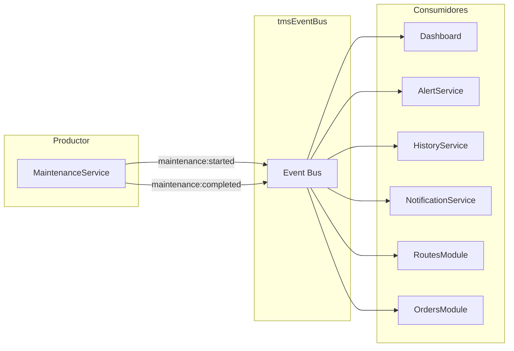
```mermaid
graph LR
    subgraph "Productor"
        MS[MaintenanceService]
    end

    subgraph "tmsEventBus"
        EB[Event Bus]
    end

    subgraph "Consumidores"
        DASH[Dashboard]
        ALERT[AlertService]
        HIST[HistoryService]
        NOTIF[NotificationService]
        ROUTES[RoutesModule]
        ORDERS_MOD[OrdersModule]
    end

    MS -->|maintenance:started| EB
    MS -->|maintenance:completed| EB

    EB --> DASH
    EB --> ALERT
    EB --> HIST
    EB --> NOTIF
    EB --> ROUTES
    EB --> ORDERS_MOD
```

## 10.3 Mapeo de Eventos en Codigo

| Evento tmsEventBus | Evento de Dominio | Contexto |
|--------------------|-------------------|----------|
| `maintenance:started` | `maintenance.work_order.created` | Cuando se crea una orden de trabajo |
| `maintenance:completed` | `maintenance.work_order.completed` | Cuando se completa una orden de trabajo |

---

# 11. Reglas de Negocio Clave

| ID | Regla | Descripcion | Impacto |
|----|-------|-------------|---------|
| R-01 | Aislamiento multi-tenant | Todas las consultas filtran por `tenant_id` extraido del JWT. Un tenant nunca puede ver ni modificar datos de otro tenant. | Seguridad, Integridad |
| R-02 | Estado inicial de orden de trabajo | Toda orden de trabajo inicia en status `pending`. No se puede crear directamente en otro estado. | Integridad |
| R-03 | Bloqueo por mantenimiento vencido | Si `blockOnOverdue = true` en settings, un vehiculo con mantenimiento vencido se marca como `out_of_service` y no puede asignarse a rutas. Configurable por tenant. | Operacion |
| R-04 | Bloqueo por inspeccion vencida | Si `blockOnExpiredInspection = true` en settings, un vehiculo con inspeccion expirada se bloquea para operacion. Configurable por tenant. | Operacion |
| R-05 | Bloqueo por documento vencido | Si `blockOnExpiredDocument = true` en settings, un vehiculo con documentos vencidos se bloquea para operacion. Configurable por tenant. | Operacion |
| R-06 | Decremento de stock | Al completar una orden de trabajo, el stock de los repuestos utilizados se decrementa automaticamente segun las cantidades registradas. | Inventario |
| R-07 | Alertas de stock bajo | Cuando el `currentStock` de un repuesto alcanza o cae debajo de `minStock`, se genera automaticamente una alerta tipo `low_stock`. | Inventario |
| R-08 | Orden automatica por averia | Si `autoCreateWorkOrder = true` en settings, al reportar una averia se crea automaticamente una orden de trabajo tipo `corrective`. | Automatizacion |
| R-09 | Orden automatica por inspeccion fallida | Si `autoCreateWorkOrder = true` en settings, al fallar una inspeccion se crea automaticamente una orden de trabajo tipo `inspection`. | Automatizacion |
| R-10 | Trigger por kilometraje | Cuando el kilometraje del vehiculo alcanza `nextDueMileage - mileageAlertThreshold`, la programacion pasa a `due_soon`. Al superar `nextDueMileage`, pasa a `overdue`. | Mantenimiento Preventivo |
| R-11 | Trigger por tiempo | Cuando la fecha actual se acerca a `nextDueDate` (dentro de `alertDaysBefore` dias), la programacion pasa a `due_soon`. Al superar `nextDueDate`, pasa a `overdue`. | Mantenimiento Preventivo |
| R-12 | Alerta anticipada | Se genera alerta tipo `maintenance_due` con severidad `warning` cuando faltan `alertDaysBefore` dias (por defecto 7) para el proximo mantenimiento. | Alertas |
| R-13 | Calculo de costos | El costo total de una orden de trabajo se calcula como `totalCost = laborCost + partsCost`. Ambos campos se registran al completar la orden. | Financiero |
| R-14 | Calculo de MTBF y MTTR | MTBF (Mean Time Between Failures) y MTTR (Mean Time To Repair) se calculan a partir del historial de ordenes de trabajo completadas del vehiculo/flota. | Metricas |

---

# 12. Catalogo de Errores HTTP

## 12.1 Errores Generales

| Codigo HTTP | Codigo Error | Mensaje | Descripcion |
|-------------|-------------|---------|-------------|
| 400 | `BAD_REQUEST` | Solicitud invalida | Datos de entrada invalidos o faltantes |
| 401 | `UNAUTHORIZED` | No autorizado | Token JWT invalido, expirado o ausente |
| 403 | `FORBIDDEN` | Sin permisos | El rol del usuario no tiene el permiso requerido |
| 404 | `NOT_FOUND` | Recurso no encontrado | El recurso solicitado no existe en el tenant |
| 409 | `CONFLICT` | Conflicto | Duplicidad de datos (placa, codigo de parte) |
| 422 | `UNPROCESSABLE_ENTITY` | Entidad no procesable | Regla de negocio violada |
| 500 | `INTERNAL_ERROR` | Error interno | Error no esperado del servidor |

## 12.2 Errores Especificos del Modulo

| Codigo HTTP | Codigo Error | Mensaje | Contexto |
|-------------|-------------|---------|----------|
| 404 | `VEHICLE_NOT_FOUND` | Vehiculo no encontrado | El vehiculo no existe o no pertenece al tenant |
| 404 | `WORK_ORDER_NOT_FOUND` | Orden de trabajo no encontrada | La orden no existe o no pertenece al tenant |
| 404 | `SCHEDULE_NOT_FOUND` | Programacion no encontrada | La programacion no existe o no pertenece al tenant |
| 404 | `BREAKDOWN_NOT_FOUND` | Averia no encontrada | La averia no existe o no pertenece al tenant |
| 404 | `WORKSHOP_NOT_FOUND` | Taller no encontrado | El taller no existe o no pertenece al tenant |
| 404 | `PART_NOT_FOUND` | Repuesto no encontrado | El repuesto no existe o no pertenece al tenant |
| 404 | `INSPECTION_NOT_FOUND` | Inspeccion no encontrada | La inspeccion no existe o no pertenece al tenant |
| 404 | `ALERT_NOT_FOUND` | Alerta no encontrada | La alerta no existe o no pertenece al tenant |
| 409 | `VEHICLE_PLATE_DUPLICATE` | Placa duplicada | Ya existe un vehiculo con esa placa en el tenant |
| 409 | `PART_CODE_DUPLICATE` | Codigo de parte duplicado | Ya existe un repuesto con ese codigo en el tenant |
| 422 | `INVALID_STATUS_TRANSITION` | Transicion de estado invalida | La transicion de estado solicitada no es valida |
| 422 | `PART_INSUFFICIENT_STOCK` | Stock insuficiente | No hay suficiente stock del repuesto para la operacion |
| 422 | `VEHICLE_IN_MAINTENANCE` | Vehiculo en mantenimiento | El vehiculo ya esta en mantenimiento y no se puede operar |
| 422 | `WORK_ORDER_NOT_IN_PROGRESS` | Orden no esta en progreso | Se intento completar una orden que no esta en `in_progress` |
| 422 | `INSPECTION_ALREADY_COMPLETED` | Inspeccion ya completada | Se intento modificar una inspeccion que ya fue completada |
| 422 | `SCHEDULE_INTERVAL_REQUIRED` | Intervalo requerido | Se debe proporcionar al menos un intervalo (km o dias) |

---

# 13. Permisos RBAC

> **Modelo de 3 roles (definicion Edson)**

> **Leyenda:** Si = Permitido | Configurable = Permitido si el Usuario Maestro le asigno el permiso | No = Denegado

## 13.1 Jerarquia de Roles

```
Owner (nivel superior)
  └── Usuario Maestro (administrador operativo)
       └── Subusuario (Operador con permisos configurables)
```

## 13.2 Descripcion de Roles

| Rol | Descripcion | Alcance |
|-----|-------------|---------|
| **Owner** | Propietario del tenant. Acceso total a todos los modulos y configuraciones. No puede ser restringido. | Total |
| **Usuario Maestro** | Administrador operativo designado por el Owner. Gestiona usuarios, permisos y operaciones del dia a dia. Acceso completo al modulo de mantenimiento. | Administrativo |
| **Subusuario** | Operador con permisos configurables asignados por el Usuario Maestro. Solo puede acceder a las funcionalidades que le fueron otorgadas explicitamente. | Configurable |

## 13.3 Tabla de Permisos

| Permiso | Descripcion | Owner | Usuario Maestro | Subusuario |
|---------|-------------|-------|----------------|------------|
| `vehicles:read` | Consultar vehiculos de la flota | Si | Si | Configurable |
| `vehicles:create` | Registrar nuevos vehiculos | Si | Si | Configurable |
| `vehicles:update` | Actualizar datos de vehiculos | Si | Si | Configurable |
| `vehicles:delete` | Eliminar vehiculos de la flota | Si | Si | No |
| `work_orders:read` | Consultar ordenes de trabajo | Si | Si | Configurable |
| `work_orders:create` | Crear ordenes de trabajo | Si | Si | Configurable |
| `work_orders:complete` | Completar ordenes de trabajo | Si | Si | No |
| `work_orders:cancel` | Cancelar ordenes de trabajo | Si | Si | No |
| `schedules:read` | Consultar programaciones preventivas | Si | Si | Configurable |
| `schedules:create` | Crear programaciones preventivas | Si | Si | Configurable |
| `schedules:update` | Actualizar programaciones preventivas | Si | Si | Configurable |
| `schedules:delete` | Eliminar programaciones preventivas | Si | Si | No |
| `inspections:read` | Consultar inspecciones | Si | Si | Configurable |
| `inspections:create` | Crear y realizar inspecciones | Si | Si | Configurable |
| `parts:read` | Consultar inventario de repuestos | Si | Si | Configurable |
| `parts:create` | Registrar repuestos | Si | Si | Configurable |
| `parts:update` | Actualizar repuestos | Si | Si | Configurable |
| `breakdowns:read` | Consultar averias/fallas | Si | Si | Configurable |
| `breakdowns:create` | Reportar averias/fallas | Si | Si | Configurable |
| `alerts:read` | Consultar alertas | Si | Si | Configurable |
| `alerts:manage` | Gestionar alertas (marcar leida, descartar) | Si | Si | Configurable |
| `workshops:read` | Consultar talleres | Si | Si | Configurable |
| `workshops:manage` | Crear y actualizar talleres | Si | Si | No |
| `maintenance:metrics` | Consultar metricas e historial | Si | Si | Configurable |
| `maintenance:settings` | Configurar ajustes del modulo | Si | Si | No |

## 13.4 Restricciones del Subusuario

El Subusuario tiene las siguientes restricciones fijas (no configurables):

| Accion Restringida | Motivo |
|-------------------|--------|
| `vehicles:delete` | La eliminacion de vehiculos es una accion administrativa critica |
| `work_orders:complete` | Completar ordenes implica registro de costos y actualizacion de inventario |
| `work_orders:cancel` | Cancelar ordenes afecta la planificacion operativa |
| `schedules:delete` | Eliminar programaciones afecta el mantenimiento preventivo de la flota |
| `workshops:manage` | La gestion de talleres es administrativa |
| `maintenance:settings` | La configuracion del modulo afecta a todo el tenant |

> **Nota multi-tenant:** Los permisos aplican siempre dentro del contexto del `tenant_id` del usuario. Un Subusuario con permiso `vehicles:read` solo puede ver vehiculos de su propio tenant.

---

# 14. Diagrama de Componentes

```mermaid
graph TB
    subgraph "Capa de Presentacion - 8 Paginas"
        P1["/maintenance - Dashboard"]
        P2["/maintenance/work-orders - Ordenes de Trabajo"]
        P3["/maintenance/preventive - Mantenimiento Preventivo"]
        P4["/maintenance/inspections - Inspecciones"]
        P5["/maintenance/parts - Inventario de Repuestos"]
        P6["/maintenance/vehicles - Vehiculos de Flota"]
        P7["/maintenance/documents - Documentos"]
        P8["/maintenance/alerts - Centro de Alertas"]
    end

    subgraph "Capa de Logica - 2 Hooks"
        H1["useMaintenance (243 lineas)\nHook general del modulo"]
        H2["useVehicleMaintenance (493 lineas)\nHook por vehiculo con alertas,\nestadisticas y filtros"]
    end

    subgraph "Capa de Servicios"
        S1["MaintenanceService (480 lineas)\ngetVehicles, getVehicleById, createVehicle,\nupdateVehicle, deleteVehicle, updateVehicleMileage,\ngetMaintenanceSchedules, createMaintenanceSchedule,\nupdateMaintenanceSchedule, deleteMaintenanceSchedule,\ngetBreakdowns, createBreakdown, updateBreakdown,\ngetWorkOrders, getWorkOrderById, createWorkOrder,\nupdateWorkOrder, completeWorkOrder,\ngetWorkshops, createWorkshop, updateWorkshop,\ngetParts, createPart, updatePart, getPartTransactions,\ngetInspections, createInspection, getInspectionChecklists,\ngetAlerts, markAlertAsRead, dismissAlert,\ngetMaintenanceMetrics, getVehicleHistory,\ngetSettings, updateSettings"]
    end

    subgraph "Capa de Infraestructura"
        I1["API Client (Axios/Fetch)"]
        I2["tmsEventBus"]
        I3["Auth Context (JWT)"]
    end

    P1 --> H1
    P2 --> H1
    P3 --> H1
    P4 --> H1
    P5 --> H1
    P6 --> H2
    P7 --> H1
    P8 --> H1

    P6 --> H1

    H1 --> S1
    H2 --> S1

    S1 --> I1
    S1 --> I2
    S1 --> I3

    I1 -->|HTTP| API["API REST Backend"]
    I2 -->|Eventos| CONSUMERS["Modulos Consumidores"]
    I3 -->|JWT| AUTH["Auth Service"]
```

### Detalle de Hooks

| Hook | Archivo | Lineas | Responsabilidad |
|------|---------|--------|----------------|
| `useMaintenance` | `src/hooks/useMaintenance.ts` | 243 | Hook general que envuelve todas las llamadas del MaintenanceService con manejo de errores, loading states y cache |
| `useVehicleMaintenance` | `src/hooks/useVehicleMaintenance.ts` | 493 | Hook especializado por vehiculo que incluye calculo de alertas, estadisticas de mantenimiento y filtros avanzados |

### Detalle del Servicio

| Servicio | Archivo | Lineas | Metodos |
|----------|---------|--------|---------|
| `MaintenanceService` | `src/services/maintenance.service.ts` | 480 | 34 metodos organizados por sub-area (vehiculos, schedules, breakdowns, work orders, workshops, parts, inspections, alerts, metrics, settings) |

---

# 15. Diagrama de Despliegue

```mermaid
graph TB
    subgraph "Cliente - Navegador"
        SPA["TMS Navitel SPA\n(Next.js / React)"]
        STORE["Estado Local\n(Context / Hooks)"]
    end

    subgraph "CDN / Edge"
        CDN["Vercel Edge Network"]
    end

    subgraph "Backend Services"
        API_GW["API Gateway\n(Nginx / Load Balancer)"]
        AUTH_SVC["Auth Service\n(JWT / RBAC)"]
        MAINT_SVC["Maintenance Service\n(Node.js / Express)"]
        EVENT_BUS["tmsEventBus\n(Event Emitter)"]
    end

    subgraph "Base de Datos"
        PG["PostgreSQL\n(Datos multi-tenant)"]
        PG_READ["PostgreSQL Read Replica\n(Consultas / Metricas)"]
    end

    subgraph "Servicios Externos"
        NOTIF_SVC["Servicio de Notificaciones\n(Email / Push)"]
        FILE_SVC["Servicio de Archivos\n(Documentos de mantenimiento)"]
        SCHEDULER["Scheduler / Cron\n(Verificacion programaciones,\nvencimiento inspecciones,\nalertas automaticas)"]
    end

    SPA --> CDN
    CDN --> API_GW
    SPA --> STORE

    API_GW --> AUTH_SVC
    API_GW --> MAINT_SVC

    MAINT_SVC --> PG
    MAINT_SVC --> PG_READ
    MAINT_SVC --> EVENT_BUS

    EVENT_BUS --> NOTIF_SVC
    EVENT_BUS --> SCHEDULER

    MAINT_SVC --> FILE_SVC

    SCHEDULER --> MAINT_SVC
```

### Componentes de Despliegue Especificos de Mantenimiento

| Componente | Funcion | Tecnologia |
|-----------|---------|------------|
| Maintenance Service | API REST para todas las operaciones de mantenimiento | Node.js / Express |
| Scheduler / Cron | Verificacion periodica de vencimientos de programaciones, inspecciones y documentos. Generacion automatica de alertas. | Node-cron / Bull Queue |
| File Service | Almacenamiento de documentos de mantenimiento (reportes, facturas, fotos) | S3 / MinIO |
| Notification Service | Envio de notificaciones de alertas criticas | Email (SMTP) / Push |
| PostgreSQL | Base de datos principal con aislamiento multi-tenant por tenant_id | PostgreSQL 15+ |
| Read Replica | Replica de lectura para consultas pesadas de metricas e historial | PostgreSQL 15+ |

---

> **Nota final:** Este documento cubre **12 casos de uso** del modulo de Mantenimiento. Todas las operaciones de lectura y escritura estan filtradas por `tenant_id` extraido del JWT para garantizar el aislamiento multi-tenant. El modulo se integra con el resto del sistema TMS Navitel a traves del `tmsEventBus`, emitiendo eventos `maintenance:started` y `maintenance:completed` que otros modulos pueden consumir para actualizar el estado de rutas, ordenes de transporte y dashboard general.
