# Referencia Rapida -- Modulo de Datos Maestros
## TMS Navitel -- Cheat Sheet para Desarrollo

> **Fecha:** Febrero 2026
> **Proposito:** Documento de referencia rapida para el equipo de desarrollo backend del modulo de Datos Maestros (Master Data). Cubre entidades, estados, endpoints, permisos RBAC, eventos de dominio y reglas de negocio para las 6 entidades maestras del sistema.

---

## Indice

| # | Seccion |
|---|---------|
| 1 | Contexto del Modulo |
| 2 | Entidades del Dominio |
| 3 | Modelo de Base de Datos -- PostgreSQL |
| 4 | Maquina de Estados -- EntityStatus |
| 5 | Maquina de Estados -- DriverStatus |
| 6 | Catalogos y Enumeraciones |
| 7 | Tabla de Referencia Operativa de Transiciones |
| 8 | Casos de Uso -- Referencia Backend |
| 9 | Endpoints API REST |
| 10 | Eventos de Dominio |
| 11 | Reglas de Negocio Clave |
| 12 | Catalogo de Errores HTTP |
| 13 | Permisos RBAC |
| 14 | Diagrama de Componentes |
| 15 | Diagrama de Despliegue |

---

## 1. Contexto del Modulo

El modulo de **Datos Maestros** gestiona las 6 entidades fundamentales que alimentan toda la operacion logistica del TMS Navitel. Cada entidad es multi-tenant: todas las consultas filtran por `tenant_id` extraido del JWT del usuario autenticado.

### 1.1 Navegacion en el Sistema

| Item | Ruta | Permiso | Modulo |
|------|------|---------|--------|
| Clientes | `/master/customers` | `customers:read` | `master_data` |
| Conductores | `/master/drivers` | `drivers:read` | `master_data` |
| Vehiculos | `/master/vehicles` | `vehicles:read` | `master_data` |
| Operadores Logisticos | `/master/operators` | `operators:read` | `master_data` |
| Productos | `/master/products` | `products:read` | `master_data` |
| Geocercas | `/master/geofences` | `geofences:read` | `geofences` |

- **Grupo sidebar:** "MAESTRO", `requiredModule: "master_data"`
- **Nota:** Geocercas pertenece al modulo `geofences` (distinto a `master_data`), aunque se agrupa visualmente bajo MAESTRO en la navegacion.

### 1.2 Diagrama de Contexto

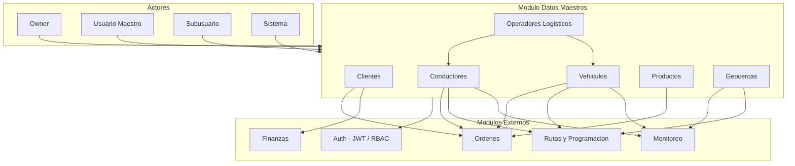

### 1.3 Responsabilidades del Modulo

| Responsabilidad | Descripcion |
|----------------|-------------|
| Registro y gestion de clientes | CRUD completo, validacion de documentos, gestion de credito y facturacion |
| Registro y gestion de conductores | CRUD, documentacion legal, examenes medicos, licencias, control de horas |
| Registro y gestion de vehiculos | CRUD, documentacion vehicular, mantenimiento, seguimiento de kilometraje |
| Registro y gestion de operadores | CRUD, validacion de contratos, asociacion con conductores y vehiculos |
| Registro y gestion de productos | CRUD, condiciones de transporte, categorias especiales |
| Registro y gestion de geocercas | CRUD, geometrias (poligono/circulo/corredor), alertas, importacion/exportacion KML |
| Multi-tenancy | Aislamiento de datos por `tenant_id` en todas las operaciones |
| Eventos de dominio | Publicacion de eventos al crear, actualizar o eliminar entidades maestras |

---

## 2. Entidades del Dominio

### 2.1 Diagrama Entidad-Relacion

```mermaid
erDiagram
    CUSTOMER ||--o{ CUSTOMER_ADDRESS : tiene
    CUSTOMER ||--o{ CUSTOMER_CONTACT : tiene
    CUSTOMER ||--o| CUSTOMER_BILLING_CONFIG : configura
    CUSTOMER ||--o| CUSTOMER_OPERATIONAL_STATS : acumula

    DRIVER ||--|| DRIVER_LICENSE : posee
    DRIVER ||--|| EMERGENCY_CONTACT : registra
    DRIVER ||--o{ MEDICAL_EXAM : realiza
    DRIVER ||--o{ PSYCHOLOGICAL_EXAM : realiza
    DRIVER ||--o{ TRAINING_CERTIFICATION : obtiene
    DRIVER ||--o| POLICE_RECORD : presenta
    DRIVER ||--o| CRIMINAL_RECORD : presenta
    DRIVER ||--o| DRIVING_RECORD : consulta
    DRIVER ||--|| DRIVING_LIMITS : configura
    DRIVER ||--o{ DRIVER_INCIDENT : registra
    DRIVER ||--o| DRIVER_PERFORMANCE_METRICS : mide

    VEHICLE ||--|| VEHICLE_SPECS : especifica
    VEHICLE ||--o| VEHICLE_DIMENSIONS : dimensiona
    VEHICLE ||--|| VEHICLE_CAPACITY : capacita
    VEHICLE ||--|| VEHICLE_REGISTRATION : registra
    VEHICLE ||--o{ INSURANCE_POLICY : asegura
    VEHICLE ||--o{ TECHNICAL_INSPECTION : inspecciona
    VEHICLE ||--o| OPERATING_CERTIFICATE : certifica
    VEHICLE ||--o| GPS_DEVICE : instala
    VEHICLE ||--o{ MAINTENANCE_RECORD : mantiene
    VEHICLE ||--o{ MAINTENANCE_SCHEDULE : programa
    VEHICLE ||--o{ FUEL_RECORD : carga
    VEHICLE ||--o{ VEHICLE_INCIDENT : registra
    VEHICLE ||--o{ VEHICLE_CERTIFICATION : certifica

    OPERATOR ||--o{ OPERATOR_CONTACT : contacta
    OPERATOR ||--o| OPERATOR_VALIDATION_CHECKLIST : valida
    OPERATOR ||--o{ OPERATOR_DOCUMENT : documenta

    PRODUCT ||--o| PRODUCT_DIMENSIONS : dimensiona
    PRODUCT ||--|| TRANSPORT_CONDITIONS : requiere

    GEOFENCE ||--o{ GEO_COORDINATE : define
    GEOFENCE ||--o{ GEOFENCE_TAG : etiqueta
    GEOFENCE ||--|| GEOFENCE_ALERTS : configura
    GEOFENCE ||--o| GEOFENCE_ADDRESS : ubica

    OPERATOR ||--o{ DRIVER : emplea
    OPERATOR ||--o{ VEHICLE : posee
    DRIVER }o--o| VEHICLE : asignado
    CUSTOMER ||--o{ GEOFENCE : asocia
    CUSTOMER ||--o{ PRODUCT : vincula
```

### 2.2 Customer (Cliente)

| Campo | Tipo | Restriccion | Descripcion |
|-------|------|-------------|-------------|
| id | uuid | PK | Identificador unico |
| tenant_id | uuid | FK, NOT NULL | Identificador del tenant |
| code | varchar(20) | UNIQUE(tenant_id, code) | Codigo interno del cliente |
| type | CustomerType | NOT NULL | empresa / persona |
| documentType | DocumentType | NOT NULL | RUC, DNI, CE, PASSPORT |
| documentNumber | varchar(20) | UNIQUE(tenant_id, documentNumber) | Numero de documento |
| name | varchar(200) | NOT NULL | Razon social o nombre completo |
| tradeName | varchar(200) | | Nombre comercial |
| email | varchar(100) | NOT NULL | Email principal |
| phone | varchar(20) | NOT NULL | Telefono principal |
| status | EntityStatus | NOT NULL, DEFAULT 'active' | Estado de la entidad |
| category | CustomerCategory | DEFAULT 'standard' | Categoria del cliente |
| creditLimit | decimal(12,2) | | Limite de credito |
| creditUsed | decimal(12,2) | DEFAULT 0 | Credito utilizado |
| notes | text | | Notas adicionales |
| createdAt | timestamptz | NOT NULL | Fecha de creacion |
| updatedAt | timestamptz | NOT NULL | Fecha de actualizacion |

**Sub-entidades:**

- **CustomerAddress:** id, label, street, city, state, country, zipCode, reference, isDefault, coordinates(lat/lng), geofenceId
- **CustomerContact:** id, name, email, phone, position, department, isPrimary, notifyDeliveries, notifyIncidents
- **CustomerBillingConfig:** paymentTerms, currency(PEN/USD), requiresPO, billingEmail, billingAddress, volumeDiscount
- **CustomerOperationalStats:** totalOrders, completedOrders, cancelledOrders, onTimeDeliveryRate, totalVolumeKg, lastOrderDate, totalBilledAmount

### 2.3 Driver (Conductor)

| Campo | Tipo | Restriccion | Descripcion |
|-------|------|-------------|-------------|
| id | uuid | PK | Identificador unico |
| tenant_id | uuid | FK, NOT NULL | Identificador del tenant |
| code | varchar(20) | UNIQUE(tenant_id, code) | Codigo interno |
| documentType | DriverDocumentType | NOT NULL | DNI, CE, PASSPORT |
| documentNumber | varchar(20) | UNIQUE(tenant_id, documentNumber) | Numero de documento |
| firstName | varchar(100) | NOT NULL | Nombres |
| lastName | varchar(100) | NOT NULL | Apellido paterno |
| fullName | varchar(250) | GENERATED | Nombre completo (computed) |
| email | varchar(100) | NOT NULL | Email corporativo |
| phone | varchar(20) | NOT NULL | Telefono personal |
| status | DriverStatus | NOT NULL, DEFAULT 'active' | Estado administrativo |
| availability | DriverAvailability | NOT NULL, DEFAULT 'available' | Disponibilidad operativa |
| birthDate | date | NOT NULL | Fecha de nacimiento |
| bloodType | BloodType | | Tipo de sangre |
| address | text | NOT NULL | Direccion de domicilio |
| hireDate | date | NOT NULL | Fecha de contratacion |
| operatorId | uuid | FK | Operador logistico asignado |
| assignedVehicleId | uuid | FK | Vehiculo asignado actualmente |
| photoUrl | varchar(500) | | URL de la foto |
| notes | text | | Notas generales |
| createdAt | timestamptz | NOT NULL | Fecha de creacion |
| updatedAt | timestamptz | NOT NULL | Fecha de actualizacion |

**Sub-entidades:**

- **DriverLicense:** number, category(LicenseCategory: A-I, A-IIa, A-IIb, A-IIIa, A-IIIb, A-IIIc), issueDate, expiryDate, issuingAuthority, issuingCountry, points, maxPoints, restrictions, verificationStatus
- **EmergencyContact:** name, relationship, phone, alternativePhone, address
- **MedicalExam:** id, type(MedicalExamType), date, expiryDate, result(ExamResult), restrictions, clinicName, doctorName, certificateNumber
- **PsychologicalExam:** id, date, expiryDate, result(ExamResult), centerName, psychologistName, profile(PsychologicalProfile)
- **TrainingCertification:** id, type(CertificationType), name, issueDate, expiryDate, institutionName, hours, isRequired
- **PoliceRecord:** id, issueDate, expiryDate, result(clean/with_records/pending), certificateNumber
- **CriminalRecord:** id, issueDate, expiryDate, result(clean/with_records/pending), certificateNumber
- **DrivingRecord:** id, queryDate, pendingTickets, totalDebt, accumulatedPoints, hasSuspension, infractions
- **DrivingLimits:** maxHoursPerDay, maxHoursPerWeek, restRequiredAfterHours, minRestDuration, nightDrivingAllowed
- **DriverIncident:** id, type(IncidentType), severity, date, description, vehicleId, orderId, status(open/investigating/resolved/closed)
- **DriverPerformanceMetrics:** overallRating, onTimeDeliveryRate, completedDeliveries, incidentCount, totalKilometers

### 2.4 Vehicle (Vehiculo)

| Campo | Tipo | Restriccion | Descripcion |
|-------|------|-------------|-------------|
| id | uuid | PK | Identificador unico |
| tenant_id | uuid | FK, NOT NULL | Identificador del tenant |
| code | varchar(20) | UNIQUE(tenant_id, code) | Codigo interno |
| plate | varchar(10) | UNIQUE(tenant_id, plate) | Numero de placa |
| trailerPlate | varchar(10) | | Placa de remolque |
| type | VehicleType | NOT NULL | Tipo de vehiculo |
| bodyType | BodyType | NOT NULL | Tipo de carroceria |
| operationalStatus | VehicleOperationalStatus | NOT NULL, DEFAULT 'available' | Estado operativo |
| status | EntityStatus | NOT NULL, DEFAULT 'active' | Estado administrativo |
| currentMileage | integer | NOT NULL, DEFAULT 0 | Kilometraje actual |
| operatorId | uuid | FK | Operador logistico propietario |
| currentDriverId | uuid | FK | Conductor asignado actualmente |
| notes | text | | Notas generales |
| createdAt | timestamptz | NOT NULL | Fecha de creacion |
| updatedAt | timestamptz | NOT NULL | Fecha de actualizacion |

**Sub-entidades:**

- **VehicleSpecs:** brand, model, year, color, engineNumber, chassisNumber, axles, wheels, fuelType, fuelTankCapacity, transmission
- **VehicleDimensions:** length, width, height, cargoLength, cargoWidth, cargoHeight
- **VehicleCapacity:** grossWeight, tareWeight, maxPayload, maxVolume, palletCapacity
- **VehicleRegistration:** registrationNumber, ownerName, ownerDocument, registrationDate, registryOffice
- **InsurancePolicy:** id, type(InsuranceType), policyNumber, insurerName, startDate, endDate, coverageAmount, isRequired, verificationStatus
- **TechnicalInspection:** id, certificateNumber, inspectionDate, expiryDate, result(approved/observations/rejected), inspectionCenter, observations
- **OperatingCertificate:** id, certificateNumber, serviceType, issueDate, expiryDate, operationScope(nacional/regional/urbano)
- **GPSDevice:** id, deviceId, imei, provider, model, installationDate, certificationExpiry, homologationNumber, status(active/inactive/malfunction/removed)
- **MaintenanceRecord:** id, type(MaintenanceType), status(MaintenanceStatus), scheduledDate, completionDate, mileage, description, totalCost, workshopName
- **MaintenanceSchedule:** id, name, intervalKm, intervalDays, lastPerformedDate, nextDueDate, nextDueMileage, isCritical
- **FuelRecord:** id, date, mileage, quantity, unit, cost, pricePerUnit, station, fuelType, fullTank, calculatedEfficiency
- **VehicleIncident:** id, type(VehicleIncidentType), severity, dateTime, location, description, driverId, status(open/investigating/resolved/closed)
- **VehicleCertification:** id, type, name, certificateNumber, certifyingEntity, issueDate, expiryDate, isRequired

### 2.5 Operator (Operador Logistico)

| Campo | Tipo | Restriccion | Descripcion |
|-------|------|-------------|-------------|
| id | uuid | PK | Identificador unico |
| tenant_id | uuid | FK, NOT NULL | Identificador del tenant |
| code | varchar(20) | UNIQUE(tenant_id, code) | Codigo interno |
| ruc | varchar(11) | UNIQUE(tenant_id, ruc) | RUC del operador |
| businessName | varchar(200) | NOT NULL | Razon social |
| tradeName | varchar(200) | | Nombre comercial |
| type | OperatorType | NOT NULL | propio / tercero / asociado |
| email | varchar(100) | NOT NULL | Email de contacto |
| phone | varchar(20) | NOT NULL | Telefono |
| fiscalAddress | text | NOT NULL | Direccion fiscal |
| status | OperatorStatus | NOT NULL, DEFAULT 'pending' | Estado: enabled / blocked / pending |
| driversCount | integer | NOT NULL, DEFAULT 0 | Cantidad de conductores asociados |
| vehiclesCount | integer | NOT NULL, DEFAULT 0 | Cantidad de vehiculos asociados |
| contractStartDate | date | | Fecha inicio de contrato |
| contractEndDate | date | | Fecha fin de contrato |
| createdAt | timestamptz | NOT NULL | Fecha de creacion |
| updatedAt | timestamptz | NOT NULL | Fecha de actualizacion |

**Sub-entidades:**

- **OperatorContact:** id, name, position, email, phone, isPrimary
- **OperatorValidationChecklist:** items(OperatorChecklistItem[]), isComplete, lastUpdated
- **OperatorDocument:** id, name, required, uploaded, fileName, uploadedAt, expiresAt

### 2.6 Product (Producto)

| Campo | Tipo | Restriccion | Descripcion |
|-------|------|-------------|-------------|
| id | uuid | PK | Identificador unico |
| tenant_id | uuid | FK, NOT NULL | Identificador del tenant |
| sku | varchar(50) | UNIQUE(tenant_id, sku) | SKU unico |
| name | varchar(200) | NOT NULL | Nombre del producto |
| description | text | | Descripcion |
| category | ProductCategory | NOT NULL | Categoria del producto |
| unitOfMeasure | UnitOfMeasure | NOT NULL | Unidad de medida |
| status | EntityStatus | NOT NULL, DEFAULT 'active' | Estado |
| barcode | varchar(50) | | Codigo de barras |
| unitPrice | decimal(10,2) | | Precio unitario referencial |
| customerId | uuid | FK | Cliente asociado (si es especifico) |
| notes | text | | Notas |
| createdAt | timestamptz | NOT NULL | Fecha de creacion |
| updatedAt | timestamptz | NOT NULL | Fecha de actualizacion |

**Sub-entidades:**

- **ProductDimensions:** length(cm), width(cm), height(cm), weight(kg), volume(m3)
- **TransportConditions:** requiresRefrigeration, minTemperature, maxTemperature, requiresSpecialHandling, handlingInstructions, stackable, maxStackHeight

### 2.7 Geofence (Geocerca)

| Campo | Tipo | Restriccion | Descripcion |
|-------|------|-------------|-------------|
| id | uuid | PK | Identificador unico |
| tenant_id | uuid | FK, NOT NULL | Identificador del tenant |
| code | varchar(20) | UNIQUE(tenant_id, code) | Codigo unico |
| name | varchar(200) | NOT NULL | Nombre de la geocerca |
| description | text | | Descripcion |
| type | GeofenceType | NOT NULL | polygon / circle / corridor |
| category | GeofenceCategory | NOT NULL | Categoria de la geocerca |
| geometry | jsonb | NOT NULL | Geometria (GeofenceGeometry) |
| status | EntityStatus | NOT NULL, DEFAULT 'active' | Estado |
| color | varchar(7) | NOT NULL | Color en el mapa (hex) |
| opacity | decimal(3,2) | NOT NULL, DEFAULT 0.5 | Opacidad (0-1) |
| customerId | uuid | FK | Cliente asociado |
| notes | text | | Notas |
| createdAt | timestamptz | NOT NULL | Fecha de creacion |
| updatedAt | timestamptz | NOT NULL | Fecha de actualizacion |

**Sub-entidades:**

- **GeoCoordinate:** lat(number), lng(number)
- **GeofenceTag:** id, name, color
- **GeofenceAlerts:** onEntry, onExit, onDwell, dwellTimeMinutes, notifyEmails
- **GeofenceAddress:** city, district, street, reference

---

## 3. Modelo de Base de Datos -- PostgreSQL

### 3.1 Esquema General

- **Schema:** `public`
- **Multi-tenancy:** Todas las tablas incluyen columna `tenant_id` (uuid, FK a `tenants.id`, NOT NULL)
- **Aislamiento:** Toda consulta incluye `WHERE tenant_id = :tenantId` (extraido del JWT)
- **Soft delete:** Las entidades no se eliminan fisicamente; se marcan con `status = 'terminated'` o se registra `deleted_at`

### 3.2 Tablas Principales

| Tabla | Entidad | tenant_id | Constraint Unico |
|-------|---------|-----------|-------------------|
| `customers` | Customer | FK NOT NULL | `(tenant_id, code)`, `(tenant_id, document_number)` |
| `customer_addresses` | CustomerAddress | FK via customer | |
| `customer_contacts` | CustomerContact | FK via customer | |
| `drivers` | Driver | FK NOT NULL | `(tenant_id, code)`, `(tenant_id, document_number)` |
| `driver_licenses` | DriverLicense | FK via driver | |
| `driver_medical_exams` | MedicalExam | FK via driver | |
| `driver_certifications` | TrainingCertification | FK via driver | |
| `vehicles` | Vehicle | FK NOT NULL | `(tenant_id, code)`, `(tenant_id, plate)` |
| `vehicle_insurance_policies` | InsurancePolicy | FK via vehicle | |
| `vehicle_inspections` | TechnicalInspection | FK via vehicle | |
| `vehicle_maintenance` | MaintenanceRecord | FK via vehicle | |
| `operators` | Operator | FK NOT NULL | `(tenant_id, code)`, `(tenant_id, ruc)` |
| `operator_contacts` | OperatorContact | FK via operator | |
| `operator_documents` | OperatorDocument | FK via operator | |
| `products` | Product | FK NOT NULL | `(tenant_id, sku)` |
| `geofences` | Geofence | FK NOT NULL | `(tenant_id, code)` |
| `geofence_tags` | GeofenceTag | FK via geofence | |

### 3.3 Indices Recomendados

```sql
-- Indices compuestos por tenant_id + status (patron comun de consulta)
CREATE INDEX idx_customers_tenant_status ON customers(tenant_id, status);
CREATE INDEX idx_drivers_tenant_status ON drivers(tenant_id, status);
CREATE INDEX idx_vehicles_tenant_status ON vehicles(tenant_id, status);
CREATE INDEX idx_operators_tenant_status ON operators(tenant_id, status);
CREATE INDEX idx_products_tenant_status ON products(tenant_id, status);
CREATE INDEX idx_geofences_tenant_status ON geofences(tenant_id, status);

-- Indices para busqueda por documento
CREATE UNIQUE INDEX idx_customers_tenant_doc ON customers(tenant_id, document_number);
CREATE UNIQUE INDEX idx_drivers_tenant_doc ON drivers(tenant_id, document_number);
CREATE UNIQUE INDEX idx_vehicles_tenant_plate ON vehicles(tenant_id, plate);
CREATE UNIQUE INDEX idx_operators_tenant_ruc ON operators(tenant_id, ruc);
CREATE UNIQUE INDEX idx_products_tenant_sku ON products(tenant_id, sku);

-- Indice espacial para geocercas (requiere PostGIS)
CREATE INDEX idx_geofences_geometry ON geofences USING GIST(geometry);

-- Indices para relaciones FK frecuentes
CREATE INDEX idx_drivers_operator ON drivers(tenant_id, operator_id);
CREATE INDEX idx_vehicles_operator ON vehicles(tenant_id, operator_id);
CREATE INDEX idx_vehicles_driver ON vehicles(tenant_id, current_driver_id);
CREATE INDEX idx_products_customer ON products(tenant_id, customer_id);
CREATE INDEX idx_geofences_customer ON geofences(tenant_id, customer_id);
```

### 3.4 Nota sobre Particionamiento

Para tenants con alto volumen de datos (>1M registros por tabla), se recomienda particionar las tablas `customers`, `drivers`, `vehicles` y `geofences` por `tenant_id` usando particionamiento por hash o lista:

```sql
CREATE TABLE customers (
    id uuid NOT NULL,
    tenant_id uuid NOT NULL,
    -- ... demas columnas
) PARTITION BY HASH (tenant_id);
```

---

## 4. Maquina de Estados -- EntityStatus

EntityStatus es compartido por Customer, Vehicle, Product y Geofence.

### 4.1 Diagrama de Estados

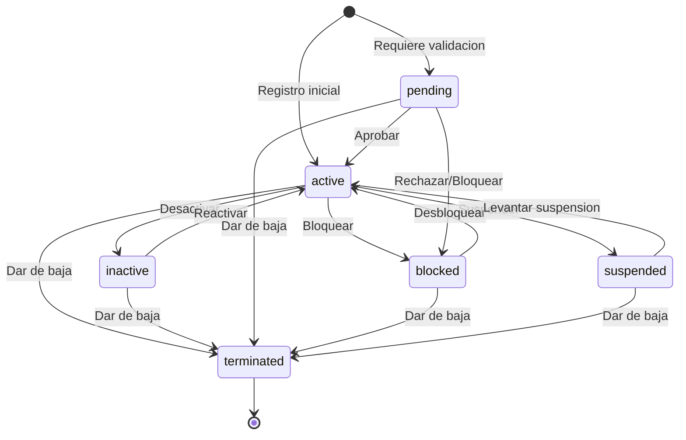

### 4.2 Tabla de Estados

| Estado | Valor | Descripcion | Es terminal |
|--------|-------|-------------|-------------|
| Activo | `active` | Entidad activa y operativa. Estado inicial por defecto para la mayoria de entidades. | No |
| Inactivo | `inactive` | Desactivada temporalmente. No disponible para operaciones pero conserva sus datos. | No |
| Pendiente | `pending` | Pendiente de validacion o aprobacion por un usuario con permisos administrativos. | No |
| Bloqueado | `blocked` | Bloqueada por incumplimiento, falta de documentacion u otra razon administrativa. | No |
| Suspendido | `suspended` | Suspendida administrativamente. Requiere revision para reactivacion. | No |
| Permiso temporal | `on_leave` | Permiso temporal (usado principalmente por conductores via DriverStatus). | No |
| Terminado | `terminated` | Dado de baja definitiva. No puede reactivarse. | Si |

### 4.3 Reglas de Transicion

- Solo un Owner o Usuario Maestro puede ejecutar transiciones hacia `terminated`.
- La transicion `pending` --> `active` requiere que toda la documentacion obligatoria este completa.
- Un Subusuario con permiso `xxx:update` puede ejecutar transiciones entre `active` e `inactive` (Configurable).
- El Sistema puede cambiar automaticamente a `blocked` si detecta documentacion vencida.
- `terminated` es un estado terminal: no admite transiciones de salida.
- Todas las transiciones se registran en el log de auditoria con `tenant_id`, actor y timestamp.

---

## 5. Maquina de Estados -- DriverStatus

DriverStatus es especifico para la entidad Conductor y gestiona su ciclo de vida administrativo.

### 5.1 Diagrama de Estados

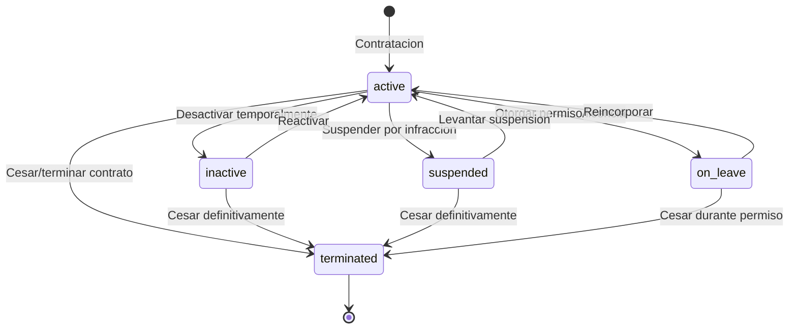

### 5.2 Tabla de Estados

| Estado | Valor | Descripcion | Es terminal |
|--------|-------|-------------|-------------|
| Activo | `active` | Conductor activo y disponible para asignaciones operativas. | No |
| Inactivo | `inactive` | Inactivo temporalmente. Sin asignaciones pero puede reactivarse. | No |
| Suspendido | `suspended` | Suspendido por infraccion, sancion o incumplimiento. Requiere revision. | No |
| De permiso | `on_leave` | De permiso, licencia medica o vacaciones. Temporalmente no disponible. | No |
| Terminado | `terminated` | Cesado o contrato terminado. Estado terminal, no admite reactivacion. | Si |

### 5.3 DriverAvailability (Sub-estado Operativo)

Ademas de DriverStatus, los conductores tienen un sub-estado operativo que indica su disponibilidad en tiempo real:

| Valor | Descripcion |
|-------|-------------|
| `available` | Disponible para asignacion a nuevas rutas u ordenes |
| `on-route` | En ruta activa, ejecutando una orden de transporte |
| `resting` | En descanso obligatorio (cumplimiento de horas maximas) |
| `vacation` | Vacaciones programadas |
| `sick-leave` | Descanso medico |
| `suspended` | Suspendido temporalmente (alineado con DriverStatus suspended) |
| `unavailable` | No disponible por otros motivos |

**Relacion DriverStatus vs DriverAvailability:**
- Un conductor con `status = 'active'` puede tener cualquier `availability` excepto `suspended`.
- Un conductor con `status = 'suspended'` siempre tiene `availability = 'suspended'`.
- Un conductor con `status = 'on_leave'` tiene `availability = 'vacation'` o `availability = 'sick-leave'`.
- Un conductor con `status = 'terminated'` no tiene `availability` relevante.
- El Sistema actualiza `availability` automaticamente cuando cambia `status`.

---

## 6. Catalogos y Enumeraciones

### 6.1 OperatorStatus

| Valor | Descripcion |
|-------|-------------|
| `enabled` | Operador habilitado y activo para operar |
| `blocked` | Bloqueado por incumplimiento o documentacion incompleta |
| `pending` | Pendiente de validacion de documentacion y checklist |

Transiciones validas: `pending` --> `enabled`, `pending` --> `blocked`, `enabled` --> `blocked`, `blocked` --> `enabled`.

### 6.2 CustomerType

| Valor | Descripcion |
|-------|-------------|
| `empresa` | Cliente tipo empresa (persona juridica, requiere RUC) |
| `persona` | Cliente tipo persona natural (DNI, CE o PASSPORT) |

### 6.3 DocumentType

| Valor | Descripcion | Formato |
|-------|-------------|---------|
| `RUC` | Registro Unico de Contribuyentes | 11 digitos |
| `DNI` | Documento Nacional de Identidad | 8 digitos |
| `CE` | Carnet de Extranjeria | 9-12 caracteres |
| `PASSPORT` | Pasaporte | Variable |

### 6.4 CustomerCategory

| Valor | Descripcion |
|-------|-------------|
| `standard` | Cliente estandar, condiciones normales |
| `premium` | Cliente premium, atencion prioritaria |
| `vip` | Cliente VIP, maxima prioridad y beneficios especiales |
| `wholesale` | Mayorista, tarifas por volumen |
| `corporate` | Corporativo, contrato empresarial |
| `government` | Gobierno o entidad publica |

### 6.5 VehicleType

| Valor | Descripcion |
|-------|-------------|
| `camion` | Camion rigido |
| `tractocamion` | Tracto camion (cabezal) |
| `remolque` | Remolque |
| `semiremolque` | Semirremolque |
| `furgoneta` | Furgoneta de reparto |
| `pickup` | Camioneta pickup |
| `minivan` | Minivan de carga |
| `cisterna` | Camion cisterna |
| `volquete` | Volquete |

### 6.6 BodyType

| Valor | Descripcion |
|-------|-------------|
| `furgon` | Furgon cerrado |
| `furgon_frigorifico` | Furgon refrigerado |
| `plataforma` | Plataforma abierta |
| `cisterna` | Tanque/cisterna |
| `tolva` | Tolva |
| `volquete` | Volquete |
| `portacontenedor` | Portacontenedor |
| `cama_baja` | Cama baja |
| `jaula` | Jaula para ganado |
| `baranda` | Baranda rebatible |
| `otros` | Otros tipos |

### 6.7 FuelType

| Valor | Descripcion |
|-------|-------------|
| `diesel` | Diesel |
| `gasoline` | Gasolina |
| `gas_glp` | Gas licuado de petroleo (GLP) |
| `gas_gnv` | Gas natural vehicular (GNV) |
| `electric` | Electrico |
| `hybrid` | Hibrido |

### 6.8 LicenseCategory (MTC Peru)

| Valor | Descripcion | Vehiculos permitidos |
|-------|-------------|---------------------|
| `A-I` | Categoria basica | Vehiculos menores (moto/mototaxi) |
| `A-IIa` | Categoria intermedia | Vehiculos hasta 3,500 kg |
| `A-IIb` | Categoria media | Vehiculos hasta 6,000 kg |
| `A-IIIa` | Categoria pesada | Vehiculos hasta 12,000 kg |
| `A-IIIb` | Categoria pesada superior | Vehiculos mayores a 12,000 kg o articulados |
| `A-IIIc` | Categoria especial | Transporte de materiales peligrosos |

### 6.9 ProductCategory

| Valor | Descripcion |
|-------|-------------|
| `general` | Mercancia general sin requerimientos especiales |
| `perecible` | Productos perecederos con vida util limitada |
| `peligroso` | Materiales peligrosos (HAZMAT) |
| `fragil` | Productos fragiles que requieren manejo cuidadoso |
| `refrigerado` | Productos que requieren refrigeracion controlada |
| `congelado` | Productos que requieren congelacion |
| `granel` | Productos a granel (sin empaque individual) |

### 6.10 UnitOfMeasure

| Valor | Descripcion |
|-------|-------------|
| `kg` | Kilogramos |
| `ton` | Toneladas |
| `lt` | Litros |
| `m3` | Metros cubicos |
| `unit` | Unidades |
| `pallet` | Pallets |
| `container` | Contenedores |

### 6.11 GeofenceType

| Valor | Descripcion |
|-------|-------------|
| `polygon` | Poligono definido por 3+ coordenadas |
| `circle` | Circulo definido por centro y radio |
| `corridor` | Corredor definido por ruta con ancho (buffer) |

### 6.12 GeofenceCategory

| Valor | Descripcion |
|-------|-------------|
| `warehouse` | Almacen o centro de distribucion |
| `customer` | Ubicacion de cliente |
| `plant` | Planta de produccion |
| `port` | Puerto maritimo o terrestre |
| `checkpoint` | Punto de control o verificacion |
| `restricted` | Zona restringida o prohibida |
| `delivery` | Zona de entrega |
| `other` | Otra categoria |

### 6.13 PaymentTerms

| Valor | Descripcion |
|-------|-------------|
| `immediate` | Pago inmediato (contado) |
| `15_days` | Credito a 15 dias |
| `30_days` | Credito a 30 dias |
| `45_days` | Credito a 45 dias |
| `60_days` | Credito a 60 dias |

---

## 7. Tabla de Referencia Operativa de Transiciones

### 7.1 Transiciones de EntityStatus (Customer, Vehicle, Product, Geofence)

| ID | Estado Origen | Estado Destino | Accion | Actor | Notas |
|----|---------------|----------------|--------|-------|-------|
| T-01 | (nuevo) | `active` | Crear entidad | Owner / Usuario Maestro / Subusuario (permiso `xxx:create`) | Estado inicial por defecto |
| T-02 | (nuevo) | `pending` | Crear entidad pendiente | Owner / Usuario Maestro | Cuando requiere validacion previa |
| T-03 | `active` | `inactive` | Desactivar | Owner / Usuario Maestro / Subusuario (permiso `xxx:update`) | Desactivacion temporal |
| T-04 | `active` | `blocked` | Bloquear | Owner / Usuario Maestro / Sistema | Por incumplimiento o documentacion vencida |
| T-05 | `active` | `suspended` | Suspender | Owner / Usuario Maestro | Suspension administrativa |
| T-06 | `active` | `terminated` | Dar de baja | Owner / Usuario Maestro | Baja definitiva, estado terminal |
| T-07 | `inactive` | `active` | Reactivar | Owner / Usuario Maestro / Subusuario (permiso `xxx:update`) | Reactivacion de entidad |
| T-08 | `inactive` | `terminated` | Dar de baja | Owner / Usuario Maestro | Baja desde inactivo |
| T-09 | `pending` | `active` | Aprobar | Owner / Usuario Maestro | Aprobacion tras validacion completa |
| T-10 | `pending` | `blocked` | Rechazar | Owner / Usuario Maestro | Documentacion insuficiente |
| T-11 | `pending` | `terminated` | Dar de baja | Owner / Usuario Maestro | Descarte de entidad pendiente |
| T-12 | `blocked` | `active` | Desbloquear | Owner / Usuario Maestro | Tras corregir incumplimiento |
| T-13 | `blocked` | `terminated` | Dar de baja | Owner / Usuario Maestro | Baja desde bloqueado |
| T-14 | `suspended` | `active` | Levantar suspension | Owner / Usuario Maestro | Reactivacion tras revision |
| T-15 | `suspended` | `terminated` | Dar de baja | Owner / Usuario Maestro | Baja desde suspendido |

### 7.2 Transiciones de DriverStatus

| ID | Estado Origen | Estado Destino | Accion | Actor | Notas |
|----|---------------|----------------|--------|-------|-------|
| T-16 | (nuevo) | `active` | Contratar conductor | Owner / Usuario Maestro / Subusuario (permiso `drivers:create`) | Alta inicial |
| T-17 | `active` | `inactive` | Desactivar | Owner / Usuario Maestro | Desactivacion temporal |
| T-18 | `active` | `suspended` | Suspender | Owner / Usuario Maestro / Sistema | Por infraccion, sancion o documentacion vencida |
| T-19 | `active` | `on_leave` | Otorgar permiso | Owner / Usuario Maestro | Vacaciones, licencia medica |
| T-20 | `active` | `terminated` | Cesar | Owner / Usuario Maestro | Terminacion de contrato |
| T-21 | `inactive` | `active` | Reactivar | Owner / Usuario Maestro | Reincorporacion |
| T-22 | `inactive` | `terminated` | Cesar | Owner / Usuario Maestro | Baja desde inactivo |
| T-23 | `suspended` | `active` | Levantar suspension | Owner / Usuario Maestro | Tras cumplir sancion |
| T-24 | `suspended` | `terminated` | Cesar | Owner / Usuario Maestro | Baja desde suspendido |
| T-25 | `on_leave` | `active` | Reincorporar | Owner / Usuario Maestro / Sistema | Retorno automatico en fecha programada |
| T-26 | `on_leave` | `terminated` | Cesar | Owner / Usuario Maestro | Baja durante permiso |

### 7.3 Transiciones de OperatorStatus

| ID | Estado Origen | Estado Destino | Accion | Actor | Notas |
|----|---------------|----------------|--------|-------|-------|
| T-27 | (nuevo) | `pending` | Registrar operador | Owner / Usuario Maestro | Estado inicial obligatorio |
| T-28 | `pending` | `enabled` | Aprobar operador | Owner / Usuario Maestro | Tras completar checklist de validacion |
| T-29 | `pending` | `blocked` | Rechazar operador | Owner / Usuario Maestro | Documentacion insuficiente o invalida |
| T-30 | `enabled` | `blocked` | Bloquear operador | Owner / Usuario Maestro / Sistema | Incumplimiento contractual o documentacion vencida |
| T-31 | `blocked` | `enabled` | Desbloquear operador | Owner / Usuario Maestro | Tras regularizar documentacion |

---

## 8. Casos de Uso -- Referencia Backend

> **Modelo de 3 roles (definicion Edson)**

> **Leyenda:** Si = Permitido | Configurable = Permitido si el Usuario Maestro le asigno el permiso | No = Denegado

### 8.1 Matriz de Casos de Uso

| CU | Nombre | Owner | Usuario Maestro | Subusuario | Sistema |
|----|--------|-------|-----------------|------------|---------|
| CU-01 | Listar Clientes | Si | Si | Configurable | No |
| CU-02 | Registrar Cliente | Si | Si | Configurable | No |
| CU-03 | Actualizar Cliente | Si | Si | Configurable | No |
| CU-04 | Eliminar Cliente | Si | Si | No | No |
| CU-05 | Importar/Exportar Clientes | Si | Si | Configurable | No |
| CU-06 | Listar Conductores | Si | Si | Configurable | No |
| CU-07 | Registrar Conductor | Si | Si | Configurable | No |
| CU-08 | Actualizar Conductor | Si | Si | Configurable | No |
| CU-09 | Eliminar Conductor | Si | Si | No | No |
| CU-10 | Listar Vehiculos | Si | Si | Configurable | No |
| CU-11 | Registrar Vehiculo | Si | Si | Configurable | No |
| CU-12 | Actualizar Vehiculo | Si | Si | Configurable | No |
| CU-13 | Eliminar Vehiculo | Si | Si | No | No |
| CU-14 | Listar Operadores | Si | Si | Configurable | No |
| CU-15 | Registrar Operador | Si | Si | No | No |
| CU-16 | Actualizar Operador | Si | Si | No | No |
| CU-17 | Listar Productos | Si | Si | Configurable | No |
| CU-18 | Registrar Producto | Si | Si | Configurable | No |
| CU-19 | Actualizar Producto | Si | Si | Configurable | No |
| CU-20 | Eliminar Producto | Si | Si | No | No |
| CU-21 | Listar Geocercas | Si | Si | Configurable | No |
| CU-22 | Crear Geocerca | Si | Si | Configurable | No |
| CU-23 | Actualizar Geocerca | Si | Si | Configurable | No |
| CU-24 | Eliminar Geocerca | Si | Si | No | No |

### 8.2 Detalle de Casos de Uso -- Clientes

#### CU-01: Listar Clientes

| Atributo | Valor |
|----------|-------|
| Codigo | CU-01 |
| Nombre | Listar Clientes |
| Actor Principal | Owner / Usuario Maestro / Subusuario (permiso `customers:read`) |
| Descripcion | Obtener la lista paginada de clientes del tenant con filtros opcionales |

| # | Precondicion |
|---|-------------|
| 1 | El actor esta autenticado y tiene un `tenant_id` valido en el JWT |
| 2 | El actor tiene el permiso `customers:read` (Owner y Usuario Maestro lo tienen por defecto) |

| # | Paso | Actor |
|---|------|-------|
| 1 | El actor solicita la lista de clientes | Actor Principal |
| 2 | El sistema valida el JWT y extrae `tenant_id` | Sistema |
| 3 | El sistema verifica el permiso `customers:read` | Sistema |
| 4 | El sistema ejecuta la consulta con `WHERE tenant_id = :tenantId` aplicando filtros y paginacion | Sistema |
| 5 | El sistema retorna la lista paginada de clientes | Sistema |

| # | Postcondicion |
|---|--------------|
| 1 | Se retorna la lista de clientes filtrada por `tenant_id` con metadatos de paginacion |

| Codigo | Excepcion | Respuesta |
|--------|-----------|-----------|
| E-01 | Token JWT invalido o expirado | 401 Unauthorized |
| E-02 | Sin permiso `customers:read` | 403 Forbidden |

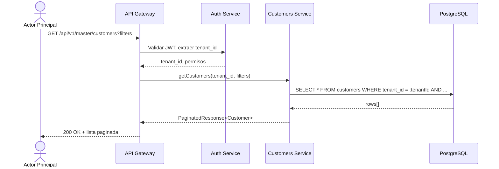

#### CU-02: Registrar Cliente

| Atributo | Valor |
|----------|-------|
| Codigo | CU-02 |
| Nombre | Registrar Cliente |
| Actor Principal | Owner / Usuario Maestro / Subusuario (permiso `customers:create`) |
| Descripcion | Crear un nuevo cliente en el tenant actual |

| # | Precondicion |
|---|-------------|
| 1 | El actor esta autenticado con `tenant_id` valido |
| 2 | El actor tiene el permiso `customers:create` |
| 3 | No existe un cliente con el mismo `documentNumber` en el mismo `tenant_id` |

| # | Paso | Actor |
|---|------|-------|
| 1 | El actor envia los datos del nuevo cliente (CreateCustomerDTO) | Actor Principal |
| 2 | El sistema valida el JWT y extrae `tenant_id` | Sistema |
| 3 | El sistema verifica el permiso `customers:create` | Sistema |
| 4 | El sistema valida los datos de entrada (formato de documento, email, telefono) | Sistema |
| 5 | El sistema verifica unicidad de `documentNumber` dentro del `tenant_id` | Sistema |
| 6 | El sistema genera codigo unico y crea el registro con `tenant_id` | Sistema |
| 7 | El sistema publica evento `customer.created` | Sistema |
| 8 | El sistema retorna el cliente creado | Sistema |

| # | Postcondicion |
|---|--------------|
| 1 | El cliente queda registrado en la base de datos con el `tenant_id` del actor |
| 2 | Se emite el evento de dominio `customer.created` |

| Codigo | Excepcion | Respuesta |
|--------|-----------|-----------|
| E-01 | Token JWT invalido | 401 Unauthorized |
| E-02 | Sin permiso `customers:create` | 403 Forbidden |
| E-03 | Documento duplicado en el tenant | 409 Conflict |
| E-04 | Datos de entrada invalidos | 422 Unprocessable Entity |

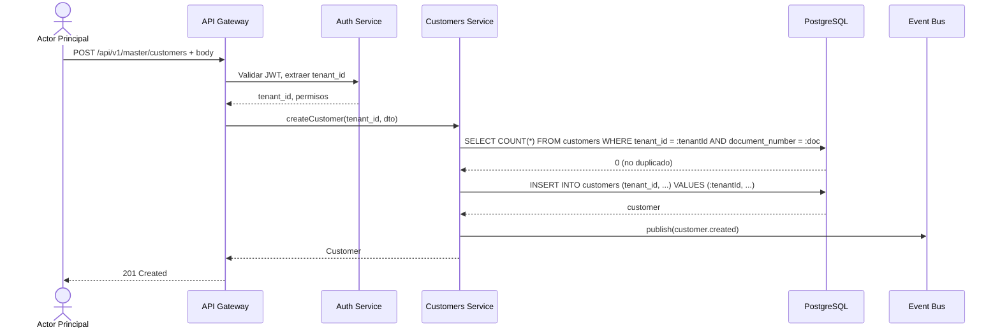

#### CU-03: Actualizar Cliente

| Atributo | Valor |
|----------|-------|
| Codigo | CU-03 |
| Nombre | Actualizar Cliente |
| Actor Principal | Owner / Usuario Maestro / Subusuario (permiso `customers:update`) |
| Descripcion | Actualizar los datos de un cliente existente del tenant |

| # | Precondicion |
|---|-------------|
| 1 | El actor esta autenticado con `tenant_id` valido |
| 2 | El actor tiene el permiso `customers:update` |
| 3 | El cliente existe y pertenece al `tenant_id` del actor |

| # | Paso | Actor |
|---|------|-------|
| 1 | El actor envia el ID del cliente y los datos a actualizar | Actor Principal |
| 2 | El sistema valida el JWT y extrae `tenant_id` | Sistema |
| 3 | El sistema verifica el permiso `customers:update` | Sistema |
| 4 | El sistema busca el cliente con `WHERE id = :id AND tenant_id = :tenantId` | Sistema |
| 5 | El sistema valida los datos de actualizacion | Sistema |
| 6 | El sistema actualiza el registro | Sistema |
| 7 | El sistema publica evento `customer.updated` | Sistema |
| 8 | El sistema retorna el cliente actualizado | Sistema |

| # | Postcondicion |
|---|--------------|
| 1 | El cliente queda actualizado con los nuevos datos |
| 2 | Se emite el evento de dominio `customer.updated` |

| Codigo | Excepcion | Respuesta |
|--------|-----------|-----------|
| E-01 | Cliente no encontrado en el tenant | 404 Not Found |
| E-02 | Sin permiso `customers:update` | 403 Forbidden |
| E-03 | Documento duplicado al cambiar | 409 Conflict |

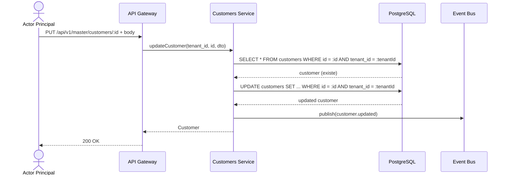

#### CU-04: Eliminar Cliente

| Atributo | Valor |
|----------|-------|
| Codigo | CU-04 |
| Nombre | Eliminar Cliente |
| Actor Principal | Owner / Usuario Maestro |
| Descripcion | Eliminar (soft delete) un cliente del tenant. Accion restringida a roles administrativos. |

| # | Precondicion |
|---|-------------|
| 1 | El actor esta autenticado con `tenant_id` valido |
| 2 | El actor es Owner o Usuario Maestro (Subusuario NO tiene acceso) |
| 3 | El cliente existe y pertenece al `tenant_id` del actor |
| 4 | El cliente no tiene ordenes activas asociadas |

| # | Paso | Actor |
|---|------|-------|
| 1 | El actor solicita la eliminacion del cliente por ID | Actor Principal |
| 2 | El sistema valida el JWT y verifica que el rol sea Owner o Usuario Maestro | Sistema |
| 3 | El sistema busca el cliente con `WHERE id = :id AND tenant_id = :tenantId` | Sistema |
| 4 | El sistema verifica que no existan ordenes activas vinculadas | Sistema |
| 5 | El sistema ejecuta soft delete (marca `status = 'terminated'` o `deleted_at`) | Sistema |
| 6 | El sistema publica evento `customer.deleted` | Sistema |

| # | Postcondicion |
|---|--------------|
| 1 | El cliente queda marcado como eliminado y no aparece en consultas regulares |
| 2 | Se emite el evento de dominio `customer.deleted` |

| Codigo | Excepcion | Respuesta |
|--------|-----------|-----------|
| E-01 | Subusuario intenta eliminar | 403 Forbidden |
| E-02 | Cliente con ordenes activas | 409 Conflict |
| E-03 | Cliente no encontrado en el tenant | 404 Not Found |

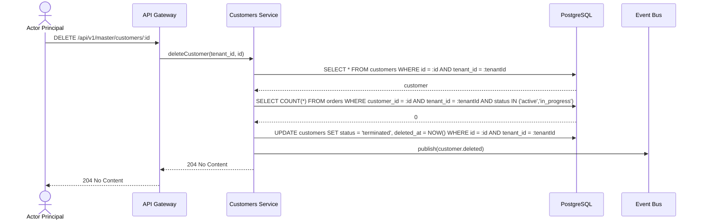

#### CU-05: Importar/Exportar Clientes

| Atributo | Valor |
|----------|-------|
| Codigo | CU-05 |
| Nombre | Importar/Exportar Clientes |
| Actor Principal | Owner / Usuario Maestro / Subusuario (permiso `customers:import` o `customers:export`) |
| Descripcion | Importar clientes desde CSV o exportar la lista a CSV, filtrada por `tenant_id` |

| # | Precondicion |
|---|-------------|
| 1 | El actor esta autenticado con `tenant_id` valido |
| 2 | Para importar: permiso `customers:import`. Para exportar: permiso `customers:export` |

| # | Paso | Actor |
|---|------|-------|
| 1 | El actor solicita exportar o importar clientes | Actor Principal |
| 2 | El sistema valida JWT y permisos | Sistema |
| 3 | (Exportar) El sistema genera CSV con clientes filtrados por `tenant_id` | Sistema |
| 4 | (Importar) El sistema valida cada fila, verifica unicidad de documentos en el `tenant_id` | Sistema |
| 5 | El sistema retorna resultado de la operacion | Sistema |

| # | Postcondicion |
|---|--------------|
| 1 | (Exportar) Se descarga archivo CSV con los datos del tenant |
| 2 | (Importar) Se crean los clientes validos y se reportan errores por fila |

| Codigo | Excepcion | Respuesta |
|--------|-----------|-----------|
| E-01 | Formato de archivo invalido | 400 Bad Request |
| E-02 | Documentos duplicados en la importacion | 422 con detalle por fila |

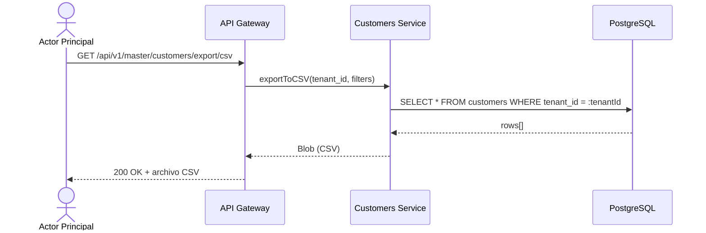

### 8.3 Detalle de Casos de Uso -- Conductores

#### CU-06: Listar Conductores

| Atributo | Valor |
|----------|-------|
| Codigo | CU-06 |
| Nombre | Listar Conductores |
| Actor Principal | Owner / Usuario Maestro / Subusuario (permiso `drivers:read`) |
| Descripcion | Obtener la lista paginada de conductores del tenant con filtros opcionales |

| # | Precondicion |
|---|-------------|
| 1 | El actor esta autenticado con `tenant_id` valido |
| 2 | El actor tiene el permiso `drivers:read` |

| # | Paso | Actor |
|---|------|-------|
| 1 | El actor solicita la lista de conductores con filtros opcionales | Actor Principal |
| 2 | El sistema valida JWT y extrae `tenant_id` | Sistema |
| 3 | El sistema verifica el permiso `drivers:read` | Sistema |
| 4 | El sistema consulta `WHERE tenant_id = :tenantId` con filtros y paginacion | Sistema |
| 5 | El sistema retorna lista paginada | Sistema |

| # | Postcondicion |
|---|--------------|
| 1 | Se retorna la lista de conductores del tenant con paginacion |

| Codigo | Excepcion | Respuesta |
|--------|-----------|-----------|
| E-01 | Token invalido | 401 Unauthorized |
| E-02 | Sin permiso | 403 Forbidden |

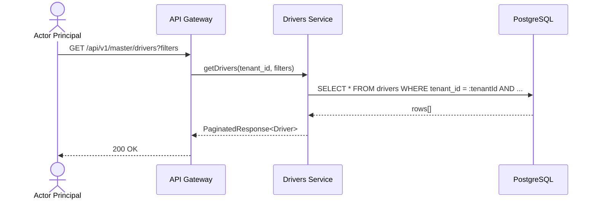

#### CU-07: Registrar Conductor

| Atributo | Valor |
|----------|-------|
| Codigo | CU-07 |
| Nombre | Registrar Conductor |
| Actor Principal | Owner / Usuario Maestro / Subusuario (permiso `drivers:create`) |
| Descripcion | Crear un nuevo conductor en el tenant |

| # | Precondicion |
|---|-------------|
| 1 | El actor esta autenticado con `tenant_id` valido |
| 2 | El actor tiene el permiso `drivers:create` |
| 3 | No existe conductor con mismo `documentNumber` en el `tenant_id` |

| # | Paso | Actor |
|---|------|-------|
| 1 | El actor envia los datos del conductor (CreateDriverDTO) | Actor Principal |
| 2 | El sistema valida JWT y permisos | Sistema |
| 3 | El sistema valida datos (documento, licencia, fecha de nacimiento) | Sistema |
| 4 | El sistema verifica unicidad de documento en el `tenant_id` | Sistema |
| 5 | El sistema crea el registro con `tenant_id` | Sistema |
| 6 | El sistema publica evento `driver.created` | Sistema |

| # | Postcondicion |
|---|--------------|
| 1 | El conductor queda registrado con `tenant_id` y `status = 'active'` |
| 2 | Se emite el evento `driver.created` |

| Codigo | Excepcion | Respuesta |
|--------|-----------|-----------|
| E-01 | Documento duplicado en el tenant | 409 Conflict |
| E-02 | Licencia vencida al momento del registro | 422 Unprocessable Entity |
| E-03 | Operador (operatorId) no encontrado en el tenant | 404 Not Found |

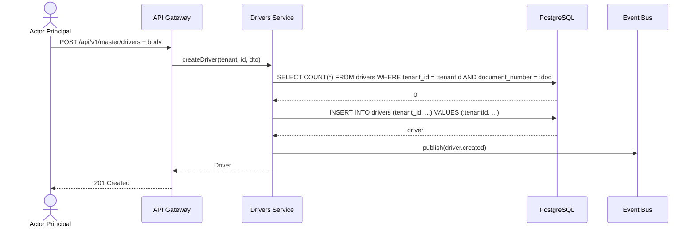

#### CU-08: Actualizar Conductor

| Atributo | Valor |
|----------|-------|
| Codigo | CU-08 |
| Nombre | Actualizar Conductor |
| Actor Principal | Owner / Usuario Maestro / Subusuario (permiso `drivers:update`) |
| Descripcion | Actualizar datos de un conductor existente del tenant |

| # | Precondicion |
|---|-------------|
| 1 | El actor tiene permiso `drivers:update` |
| 2 | El conductor existe en el `tenant_id` del actor |

| # | Paso | Actor |
|---|------|-------|
| 1 | El actor envia ID y datos a actualizar | Actor Principal |
| 2 | El sistema valida JWT y permisos | Sistema |
| 3 | El sistema busca conductor con `WHERE id = :id AND tenant_id = :tenantId` | Sistema |
| 4 | El sistema valida datos y actualiza el registro | Sistema |
| 5 | Si cambia el status, el sistema publica `driver.status_changed` | Sistema |
| 6 | El sistema publica `driver.updated` | Sistema |

| # | Postcondicion |
|---|--------------|
| 1 | El conductor queda actualizado |
| 2 | Se emiten los eventos correspondientes |

| Codigo | Excepcion | Respuesta |
|--------|-----------|-----------|
| E-01 | Conductor no encontrado en el tenant | 404 Not Found |
| E-02 | Transicion de estado invalida | 422 Unprocessable Entity |

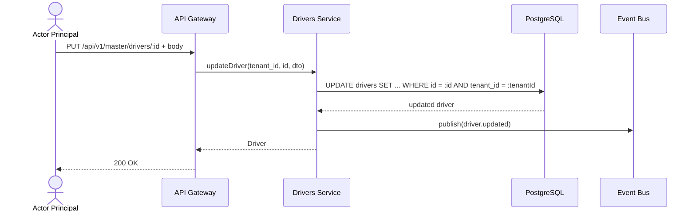

#### CU-09: Eliminar Conductor

| Atributo | Valor |
|----------|-------|
| Codigo | CU-09 |
| Nombre | Eliminar Conductor |
| Actor Principal | Owner / Usuario Maestro |
| Descripcion | Eliminar (soft delete) un conductor. Restringido a roles administrativos. |

| # | Precondicion |
|---|-------------|
| 1 | El actor es Owner o Usuario Maestro |
| 2 | El conductor existe en el `tenant_id` del actor |
| 3 | El conductor no tiene rutas activas asignadas |

| # | Paso | Actor |
|---|------|-------|
| 1 | El actor solicita eliminar conductor por ID | Actor Principal |
| 2 | El sistema valida que el actor sea Owner o Usuario Maestro | Sistema |
| 3 | El sistema verifica que no haya rutas activas | Sistema |
| 4 | El sistema ejecuta soft delete con `tenant_id` | Sistema |
| 5 | El sistema desvincula el vehiculo asignado si existe | Sistema |
| 6 | El sistema publica `driver.deleted` | Sistema |

| # | Postcondicion |
|---|--------------|
| 1 | El conductor queda marcado como eliminado |
| 2 | El vehiculo previamente asignado queda libre |

| Codigo | Excepcion | Respuesta |
|--------|-----------|-----------|
| E-01 | Subusuario intenta eliminar | 403 Forbidden |
| E-02 | Conductor con rutas activas | 409 Conflict |

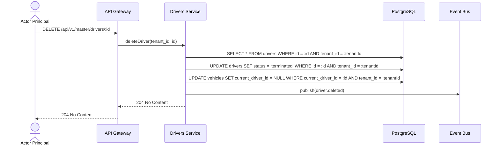

### 8.4 Detalle de Casos de Uso -- Vehiculos

#### CU-10: Listar Vehiculos

| Atributo | Valor |
|----------|-------|
| Codigo | CU-10 |
| Nombre | Listar Vehiculos |
| Actor Principal | Owner / Usuario Maestro / Subusuario (permiso `vehicles:read`) |
| Descripcion | Obtener lista paginada de vehiculos del tenant |

| # | Precondicion |
|---|-------------|
| 1 | El actor tiene permiso `vehicles:read` |

| # | Paso | Actor |
|---|------|-------|
| 1 | El actor solicita la lista con filtros opcionales | Actor Principal |
| 2 | El sistema consulta `WHERE tenant_id = :tenantId` con filtros | Sistema |
| 3 | El sistema retorna lista paginada | Sistema |

| # | Postcondicion |
|---|--------------|
| 1 | Se retorna la lista de vehiculos del tenant |

| Codigo | Excepcion | Respuesta |
|--------|-----------|-----------|
| E-01 | Sin permiso | 403 Forbidden |

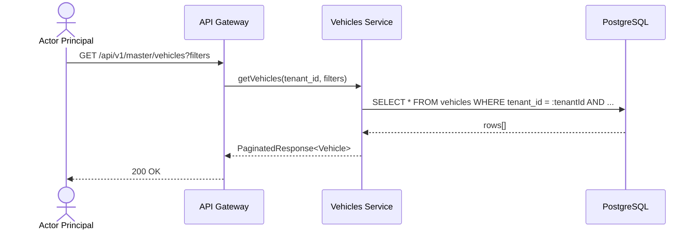

#### CU-11: Registrar Vehiculo

| Atributo | Valor |
|----------|-------|
| Codigo | CU-11 |
| Nombre | Registrar Vehiculo |
| Actor Principal | Owner / Usuario Maestro / Subusuario (permiso `vehicles:create`) |
| Descripcion | Registrar un nuevo vehiculo en el tenant |

| # | Precondicion |
|---|-------------|
| 1 | El actor tiene permiso `vehicles:create` |
| 2 | La placa no existe en el `tenant_id` |

| # | Paso | Actor |
|---|------|-------|
| 1 | El actor envia datos del vehiculo | Actor Principal |
| 2 | El sistema valida unicidad de placa en el `tenant_id` | Sistema |
| 3 | El sistema crea el registro con `tenant_id` | Sistema |
| 4 | El sistema publica `vehicle.created` | Sistema |

| # | Postcondicion |
|---|--------------|
| 1 | El vehiculo queda registrado con `tenant_id` |

| Codigo | Excepcion | Respuesta |
|--------|-----------|-----------|
| E-01 | Placa duplicada en el tenant | 409 Conflict |

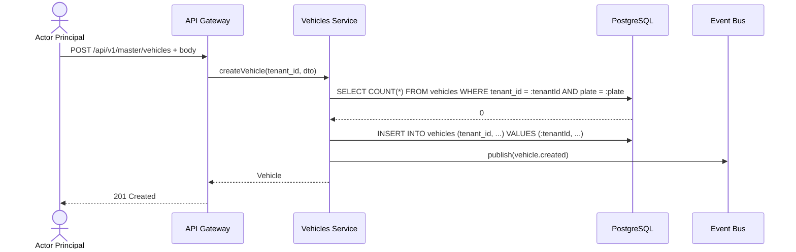

#### CU-12: Actualizar Vehiculo

| Atributo | Valor |
|----------|-------|
| Codigo | CU-12 |
| Nombre | Actualizar Vehiculo |
| Actor Principal | Owner / Usuario Maestro / Subusuario (permiso `vehicles:update`) |
| Descripcion | Actualizar datos de un vehiculo existente del tenant |

| # | Precondicion |
|---|-------------|
| 1 | El actor tiene permiso `vehicles:update` |
| 2 | El vehiculo existe en el `tenant_id` del actor |

| # | Paso | Actor |
|---|------|-------|
| 1 | El actor envia ID y datos a actualizar | Actor Principal |
| 2 | El sistema busca vehiculo con `WHERE id = :id AND tenant_id = :tenantId` | Sistema |
| 3 | El sistema valida y actualiza | Sistema |
| 4 | El sistema publica `vehicle.updated` | Sistema |

| # | Postcondicion |
|---|--------------|
| 1 | El vehiculo queda actualizado |

| Codigo | Excepcion | Respuesta |
|--------|-----------|-----------|
| E-01 | Vehiculo no encontrado en el tenant | 404 Not Found |

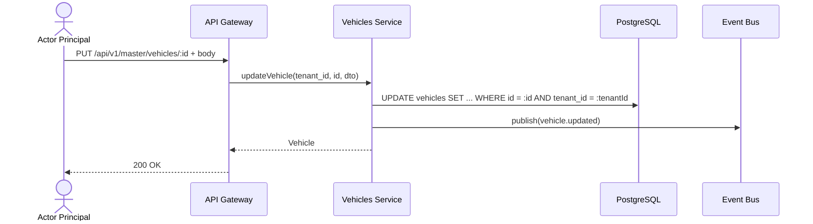

#### CU-13: Eliminar Vehiculo

| Atributo | Valor |
|----------|-------|
| Codigo | CU-13 |
| Nombre | Eliminar Vehiculo |
| Actor Principal | Owner / Usuario Maestro |
| Descripcion | Eliminar (soft delete) un vehiculo. Restringido a roles administrativos. |

| # | Precondicion |
|---|-------------|
| 1 | El actor es Owner o Usuario Maestro |
| 2 | El vehiculo no tiene rutas activas asignadas |

| # | Paso | Actor |
|---|------|-------|
| 1 | El actor solicita eliminar vehiculo | Actor Principal |
| 2 | El sistema verifica rol y dependencias | Sistema |
| 3 | El sistema ejecuta soft delete con `tenant_id` | Sistema |
| 4 | El sistema publica `vehicle.deleted` | Sistema |

| # | Postcondicion |
|---|--------------|
| 1 | El vehiculo queda marcado como eliminado |

| Codigo | Excepcion | Respuesta |
|--------|-----------|-----------|
| E-01 | Subusuario intenta eliminar | 403 Forbidden |
| E-02 | Vehiculo con rutas activas | 409 Conflict |

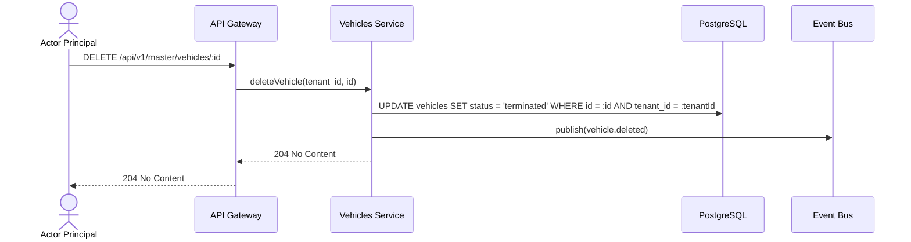

### 8.5 Detalle de Casos de Uso -- Operadores Logisticos

#### CU-14: Listar Operadores

| Atributo | Valor |
|----------|-------|
| Codigo | CU-14 |
| Nombre | Listar Operadores |
| Actor Principal | Owner / Usuario Maestro / Subusuario (permiso `operators:read`) |
| Descripcion | Obtener lista de operadores logisticos del tenant |

| # | Precondicion |
|---|-------------|
| 1 | El actor tiene permiso `operators:read` |

| # | Paso | Actor |
|---|------|-------|
| 1 | El actor solicita la lista de operadores | Actor Principal |
| 2 | El sistema consulta `WHERE tenant_id = :tenantId` | Sistema |
| 3 | El sistema retorna lista | Sistema |

| # | Postcondicion |
|---|--------------|
| 1 | Se retorna la lista de operadores del tenant |

| Codigo | Excepcion | Respuesta |
|--------|-----------|-----------|
| E-01 | Sin permiso | 403 Forbidden |

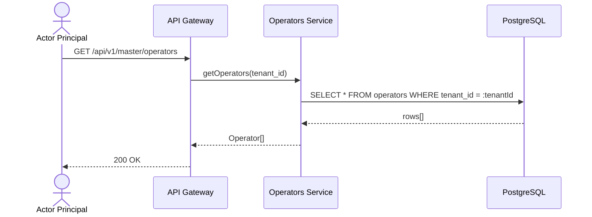

#### CU-15: Registrar Operador

| Atributo | Valor |
|----------|-------|
| Codigo | CU-15 |
| Nombre | Registrar Operador |
| Actor Principal | Owner / Usuario Maestro |
| Descripcion | Registrar un nuevo operador logistico. Operacion exclusiva de roles administrativos. |

| # | Precondicion |
|---|-------------|
| 1 | El actor es Owner o Usuario Maestro (Subusuario NO tiene acceso) |
| 2 | El RUC no existe en el `tenant_id` |

| # | Paso | Actor |
|---|------|-------|
| 1 | El actor envia datos del operador | Actor Principal |
| 2 | El sistema verifica unicidad de RUC en el `tenant_id` | Sistema |
| 3 | El sistema crea operador con `status = 'pending'` y `tenant_id` | Sistema |
| 4 | El sistema publica `operator.created` | Sistema |

| # | Postcondicion |
|---|--------------|
| 1 | El operador queda registrado con `status = 'pending'` y `tenant_id` |

| Codigo | Excepcion | Respuesta |
|--------|-----------|-----------|
| E-01 | Subusuario intenta registrar | 403 Forbidden |
| E-02 | RUC duplicado en el tenant | 409 Conflict |

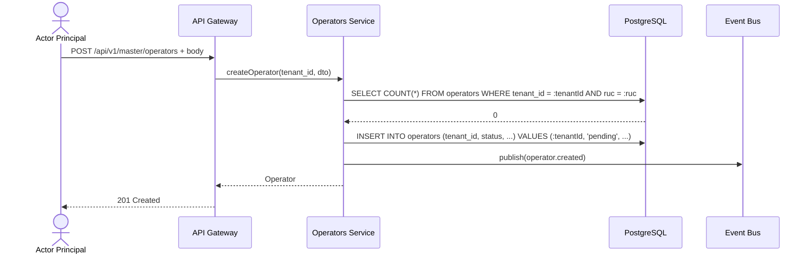

#### CU-16: Actualizar Operador

| Atributo | Valor |
|----------|-------|
| Codigo | CU-16 |
| Nombre | Actualizar Operador |
| Actor Principal | Owner / Usuario Maestro |
| Descripcion | Actualizar datos de un operador. Operacion exclusiva de roles administrativos. |

| # | Precondicion |
|---|-------------|
| 1 | El actor es Owner o Usuario Maestro (Subusuario NO tiene acceso) |
| 2 | El operador existe en el `tenant_id` del actor |

| # | Paso | Actor |
|---|------|-------|
| 1 | El actor envia ID y datos a actualizar | Actor Principal |
| 2 | El sistema busca operador con `WHERE id = :id AND tenant_id = :tenantId` | Sistema |
| 3 | El sistema actualiza y publica `operator.updated` | Sistema |

| # | Postcondicion |
|---|--------------|
| 1 | El operador queda actualizado |

| Codigo | Excepcion | Respuesta |
|--------|-----------|-----------|
| E-01 | Subusuario intenta actualizar | 403 Forbidden |
| E-02 | Operador no encontrado en el tenant | 404 Not Found |

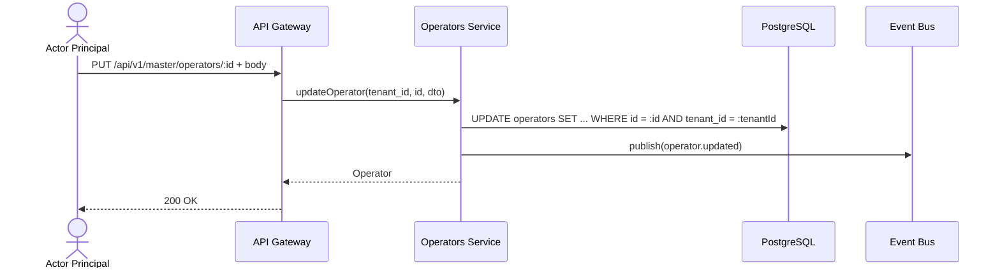

### 8.6 Detalle de Casos de Uso -- Productos

#### CU-17: Listar Productos

| Atributo | Valor |
|----------|-------|
| Codigo | CU-17 |
| Nombre | Listar Productos |
| Actor Principal | Owner / Usuario Maestro / Subusuario (permiso `products:read`) |
| Descripcion | Obtener lista de productos del tenant con filtros |

| # | Precondicion |
|---|-------------|
| 1 | El actor tiene permiso `products:read` |

| # | Paso | Actor |
|---|------|-------|
| 1 | El actor solicita la lista de productos | Actor Principal |
| 2 | El sistema consulta `WHERE tenant_id = :tenantId` con filtros | Sistema |
| 3 | El sistema retorna lista | Sistema |

| # | Postcondicion |
|---|--------------|
| 1 | Se retorna la lista de productos del tenant |

| Codigo | Excepcion | Respuesta |
|--------|-----------|-----------|
| E-01 | Sin permiso | 403 Forbidden |

```mermaid
sequenceDiagram
    actor A as Actor Principal
    participant API as API Gateway
    participant SVC as Products Service
    participant DB as PostgreSQL

    A->>API: GET /api/v1/master/products?filters
    API->>SVC: getProducts(tenant_id, filters)
    SVC->>DB: SELECT * FROM products WHERE tenant_id = :tenantId AND ...
    DB-->>SVC: rows[]
    SVC-->>API: Product[]
    API-->>A: 200 OK
```

#### CU-18: Registrar Producto

| Atributo | Valor |
|----------|-------|
| Codigo | CU-18 |
| Nombre | Registrar Producto |
| Actor Principal | Owner / Usuario Maestro / Subusuario (permiso `products:create`) |
| Descripcion | Crear un nuevo producto en el tenant |

| # | Precondicion |
|---|-------------|
| 1 | El actor tiene permiso `products:create` |
| 2 | El SKU no existe en el `tenant_id` |

| # | Paso | Actor |
|---|------|-------|
| 1 | El actor envia datos del producto | Actor Principal |
| 2 | El sistema verifica unicidad de SKU en el `tenant_id` | Sistema |
| 3 | El sistema valida condiciones de transporte segun categoria | Sistema |
| 4 | El sistema crea el producto con `tenant_id` | Sistema |
| 5 | El sistema publica `product.created` | Sistema |

| # | Postcondicion |
|---|--------------|
| 1 | El producto queda registrado con `tenant_id` |

| Codigo | Excepcion | Respuesta |
|--------|-----------|-----------|
| E-01 | SKU duplicado en el tenant | 409 Conflict |
| E-02 | Condiciones de transporte incompletas para categoria especial | 422 Unprocessable Entity |

```mermaid
sequenceDiagram
    actor A as Actor Principal
    participant API as API Gateway
    participant SVC as Products Service
    participant DB as PostgreSQL
    participant EVT as Event Bus

    A->>API: POST /api/v1/master/products + body
    API->>SVC: createProduct(tenant_id, dto)
    SVC->>DB: SELECT COUNT(*) FROM products WHERE tenant_id = :tenantId AND sku = :sku
    DB-->>SVC: 0
    SVC->>DB: INSERT INTO products (tenant_id, ...) VALUES (:tenantId, ...)
    SVC->>EVT: publish(product.created)
    SVC-->>API: Product
    API-->>A: 201 Created
```

#### CU-19: Actualizar Producto

| Atributo | Valor |
|----------|-------|
| Codigo | CU-19 |
| Nombre | Actualizar Producto |
| Actor Principal | Owner / Usuario Maestro / Subusuario (permiso `products:update`) |
| Descripcion | Actualizar datos de un producto del tenant |

| # | Precondicion |
|---|-------------|
| 1 | El actor tiene permiso `products:update` |
| 2 | El producto existe en el `tenant_id` |

| # | Paso | Actor |
|---|------|-------|
| 1 | El actor envia ID y datos | Actor Principal |
| 2 | El sistema busca con `WHERE id = :id AND tenant_id = :tenantId` | Sistema |
| 3 | El sistema actualiza y publica `product.updated` | Sistema |

| # | Postcondicion |
|---|--------------|
| 1 | El producto queda actualizado |

| Codigo | Excepcion | Respuesta |
|--------|-----------|-----------|
| E-01 | Producto no encontrado en el tenant | 404 Not Found |

```mermaid
sequenceDiagram
    actor A as Actor Principal
    participant API as API Gateway
    participant SVC as Products Service
    participant DB as PostgreSQL
    participant EVT as Event Bus

    A->>API: PUT /api/v1/master/products/:id + body
    API->>SVC: updateProduct(tenant_id, id, dto)
    SVC->>DB: UPDATE products SET ... WHERE id = :id AND tenant_id = :tenantId
    SVC->>EVT: publish(product.updated)
    SVC-->>API: Product
    API-->>A: 200 OK
```

#### CU-20: Eliminar Producto

| Atributo | Valor |
|----------|-------|
| Codigo | CU-20 |
| Nombre | Eliminar Producto |
| Actor Principal | Owner / Usuario Maestro |
| Descripcion | Eliminar un producto. Restringido a roles administrativos. |

| # | Precondicion |
|---|-------------|
| 1 | El actor es Owner o Usuario Maestro |
| 2 | El producto no esta referenciado en ordenes activas |

| # | Paso | Actor |
|---|------|-------|
| 1 | El actor solicita eliminar producto | Actor Principal |
| 2 | El sistema verifica dependencias en ordenes del `tenant_id` | Sistema |
| 3 | El sistema ejecuta soft delete | Sistema |
| 4 | El sistema publica `product.deleted` | Sistema |

| # | Postcondicion |
|---|--------------|
| 1 | El producto queda marcado como eliminado |

| Codigo | Excepcion | Respuesta |
|--------|-----------|-----------|
| E-01 | Subusuario intenta eliminar | 403 Forbidden |
| E-02 | Producto en ordenes activas | 409 Conflict |

```mermaid
sequenceDiagram
    actor A as Actor Principal
    participant API as API Gateway
    participant SVC as Products Service
    participant DB as PostgreSQL
    participant EVT as Event Bus

    A->>API: DELETE /api/v1/master/products/:id
    API->>SVC: deleteProduct(tenant_id, id)
    SVC->>DB: UPDATE products SET status = 'terminated' WHERE id = :id AND tenant_id = :tenantId
    SVC->>EVT: publish(product.deleted)
    SVC-->>API: 204 No Content
    API-->>A: 204 No Content
```

### 8.7 Detalle de Casos de Uso -- Geocercas

#### CU-21: Listar Geocercas

| Atributo | Valor |
|----------|-------|
| Codigo | CU-21 |
| Nombre | Listar Geocercas |
| Actor Principal | Owner / Usuario Maestro / Subusuario (permiso `geofences:read`) |
| Descripcion | Obtener lista de geocercas del tenant con filtros |

| # | Precondicion |
|---|-------------|
| 1 | El actor tiene permiso `geofences:read` |

| # | Paso | Actor |
|---|------|-------|
| 1 | El actor solicita la lista de geocercas | Actor Principal |
| 2 | El sistema consulta `WHERE tenant_id = :tenantId` con filtros | Sistema |
| 3 | El sistema retorna lista | Sistema |

| # | Postcondicion |
|---|--------------|
| 1 | Se retorna la lista de geocercas del tenant |

| Codigo | Excepcion | Respuesta |
|--------|-----------|-----------|
| E-01 | Sin permiso | 403 Forbidden |

```mermaid
sequenceDiagram
    actor A as Actor Principal
    participant API as API Gateway
    participant SVC as Geofences Service
    participant DB as PostgreSQL

    A->>API: GET /api/v1/master/geofences?filters
    API->>SVC: getGeofences(tenant_id, filters)
    SVC->>DB: SELECT * FROM geofences WHERE tenant_id = :tenantId AND ...
    DB-->>SVC: rows[]
    SVC-->>API: Geofence[]
    API-->>A: 200 OK
```

#### CU-22: Crear Geocerca

| Atributo | Valor |
|----------|-------|
| Codigo | CU-22 |
| Nombre | Crear Geocerca |
| Actor Principal | Owner / Usuario Maestro / Subusuario (permiso `geofences:create`) |
| Descripcion | Crear una nueva geocerca con geometria definida |

| # | Precondicion |
|---|-------------|
| 1 | El actor tiene permiso `geofences:create` |
| 2 | La geometria es valida (poligono con 3+ puntos, circulo con radio > 0, corredor con 2+ puntos) |

| # | Paso | Actor |
|---|------|-------|
| 1 | El actor envia datos de la geocerca con geometria | Actor Principal |
| 2 | El sistema valida la geometria segun el tipo | Sistema |
| 3 | El sistema crea la geocerca con `tenant_id` | Sistema |
| 4 | El sistema publica `geofence.created` | Sistema |

| # | Postcondicion |
|---|--------------|
| 1 | La geocerca queda registrada con `tenant_id` |

| Codigo | Excepcion | Respuesta |
|--------|-----------|-----------|
| E-01 | Geometria invalida | 422 Unprocessable Entity |
| E-02 | Codigo duplicado en el tenant | 409 Conflict |

```mermaid
sequenceDiagram
    actor A as Actor Principal
    participant API as API Gateway
    participant SVC as Geofences Service
    participant DB as PostgreSQL
    participant EVT as Event Bus

    A->>API: POST /api/v1/master/geofences + body
    API->>SVC: createGeofence(tenant_id, dto)
    SVC->>SVC: validateGeometry(dto.geometry)
    SVC->>DB: INSERT INTO geofences (tenant_id, ...) VALUES (:tenantId, ...)
    SVC->>EVT: publish(geofence.created)
    SVC-->>API: Geofence
    API-->>A: 201 Created
```

#### CU-23: Actualizar Geocerca

| Atributo | Valor |
|----------|-------|
| Codigo | CU-23 |
| Nombre | Actualizar Geocerca |
| Actor Principal | Owner / Usuario Maestro / Subusuario (permiso `geofences:update`) |
| Descripcion | Actualizar datos o geometria de una geocerca del tenant |

| # | Precondicion |
|---|-------------|
| 1 | El actor tiene permiso `geofences:update` |
| 2 | La geocerca existe en el `tenant_id` |

| # | Paso | Actor |
|---|------|-------|
| 1 | El actor envia ID y datos a actualizar | Actor Principal |
| 2 | El sistema busca con `WHERE id = :id AND tenant_id = :tenantId` | Sistema |
| 3 | Si incluye geometria, el sistema la valida | Sistema |
| 4 | El sistema actualiza y publica `geofence.updated` | Sistema |

| # | Postcondicion |
|---|--------------|
| 1 | La geocerca queda actualizada |

| Codigo | Excepcion | Respuesta |
|--------|-----------|-----------|
| E-01 | Geocerca no encontrada en el tenant | 404 Not Found |
| E-02 | Geometria invalida | 422 Unprocessable Entity |

```mermaid
sequenceDiagram
    actor A as Actor Principal
    participant API as API Gateway
    participant SVC as Geofences Service
    participant DB as PostgreSQL
    participant EVT as Event Bus

    A->>API: PUT /api/v1/master/geofences/:id + body
    API->>SVC: updateGeofence(tenant_id, id, dto)
    SVC->>DB: UPDATE geofences SET ... WHERE id = :id AND tenant_id = :tenantId
    SVC->>EVT: publish(geofence.updated)
    SVC-->>API: Geofence
    API-->>A: 200 OK
```

#### CU-24: Eliminar Geocerca

| Atributo | Valor |
|----------|-------|
| Codigo | CU-24 |
| Nombre | Eliminar Geocerca |
| Actor Principal | Owner / Usuario Maestro |
| Descripcion | Eliminar una geocerca. Restringido a roles administrativos. |

| # | Precondicion |
|---|-------------|
| 1 | El actor es Owner o Usuario Maestro |

| # | Paso | Actor |
|---|------|-------|
| 1 | El actor solicita eliminar geocerca | Actor Principal |
| 2 | El sistema verifica rol | Sistema |
| 3 | El sistema ejecuta soft delete con `tenant_id` | Sistema |
| 4 | El sistema publica `geofence.deleted` | Sistema |

| # | Postcondicion |
|---|--------------|
| 1 | La geocerca queda marcada como eliminada |

| Codigo | Excepcion | Respuesta |
|--------|-----------|-----------|
| E-01 | Subusuario intenta eliminar | 403 Forbidden |

```mermaid
sequenceDiagram
    actor A as Actor Principal
    participant API as API Gateway
    participant SVC as Geofences Service
    participant DB as PostgreSQL
    participant EVT as Event Bus

    A->>API: DELETE /api/v1/master/geofences/:id
    API->>SVC: deleteGeofence(tenant_id, id)
    SVC->>DB: UPDATE geofences SET status = 'terminated' WHERE id = :id AND tenant_id = :tenantId
    SVC->>EVT: publish(geofence.deleted)
    SVC-->>API: 204 No Content
    API-->>A: 204 No Content
```

---

## 9. Endpoints API REST

Todos los endpoints requieren autenticacion JWT. El `tenant_id` se extrae automaticamente del token. Todas las consultas a base de datos incluyen `WHERE tenant_id = :tenantId`.

**Base path:** `/api/v1/master`

### 9.1 Clientes -- `/api/v1/master/customers`

| # | Metodo | Endpoint | Descripcion | Permiso | Roles | Request/Query | Response |
|---|--------|----------|-------------|---------|-------|---------------|----------|
| E-01 | GET | /customers | Listar clientes paginados con filtros | `customers:read` | Owner, Usuario Maestro, Subusuario (Configurable) | Query: search, status, type, category, city, sortBy, sortOrder, page, pageSize | `PaginatedResponse<Customer>` |
| E-02 | GET | /customers/:id | Obtener cliente por ID | `customers:read` | Owner, Usuario Maestro, Subusuario (Configurable) | Path: id (uuid) | Customer |
| E-03 | POST | /customers | Crear cliente | `customers:create` | Owner, Usuario Maestro, Subusuario (Configurable) | Body: CreateCustomerDTO | `201` Customer |
| E-04 | PUT | /customers/:id | Actualizar cliente | `customers:update` | Owner, Usuario Maestro, Subusuario (Configurable) | Path: id, Body: UpdateCustomerDTO | Customer |
| E-05 | DELETE | /customers/:id | Eliminar cliente (soft delete) | `customers:delete` | Owner, Usuario Maestro | Path: id | `204` No Content |
| E-06 | POST | /customers/bulk-delete | Eliminar clientes masivo | `customers:delete` | Owner, Usuario Maestro | Body: `{ ids: string[] }` | `{ success: string[], failed: string[] }` |
| E-07 | POST | /customers/:id/toggle-status | Cambiar estado activo/inactivo | `customers:update` | Owner, Usuario Maestro, Subusuario (Configurable) | Path: id | Customer |
| E-08 | GET | /customers/stats | Obtener estadisticas de clientes | `customers:read` | Owner, Usuario Maestro, Subusuario (Configurable) | -- | CustomerStats |
| E-09 | GET | /customers/find-by-document | Buscar cliente por documento | `customers:read` | Owner, Usuario Maestro, Subusuario (Configurable) | Query: documentNumber | Customer o 404 |
| E-10 | POST | /customers/import | Importar clientes desde CSV | `customers:import` | Owner, Usuario Maestro | Body: CreateCustomerDTO[] | `{ success: [], failed: [] }` |
| E-11 | GET | /customers/export/csv | Exportar clientes a CSV | `customers:export` | Owner, Usuario Maestro, Subusuario (Configurable) | Query: filtros aplicados | Blob (text/csv) |
| E-12 | GET | /customers/cities | Ciudades disponibles para filtro | `customers:read` | Owner, Usuario Maestro, Subusuario (Configurable) | -- | string[] |

### 9.2 Conductores -- `/api/v1/master/drivers`

| # | Metodo | Endpoint | Descripcion | Permiso | Roles | Request/Query | Response |
|---|--------|----------|-------------|---------|-------|---------------|----------|
| E-13 | GET | /drivers | Listar conductores paginados | `drivers:read` | Owner, Usuario Maestro, Subusuario (Configurable) | Query: search, status, licenseType, assignedVehicle, page, pageSize, sortBy, sortOrder | `PaginatedResponse<Driver>` |
| E-14 | GET | /drivers/:id | Obtener conductor por ID | `drivers:read` | Owner, Usuario Maestro, Subusuario (Configurable) | Path: id | Driver |
| E-15 | POST | /drivers | Crear conductor | `drivers:create` | Owner, Usuario Maestro, Subusuario (Configurable) | Body: CreateDriverDTO | `201` Driver |
| E-16 | PUT | /drivers/:id | Actualizar conductor | `drivers:update` | Owner, Usuario Maestro, Subusuario (Configurable) | Path: id, Body: UpdateDriverDTO | Driver |
| E-17 | DELETE | /drivers/:id | Eliminar conductor (soft delete) | `drivers:delete` | Owner, Usuario Maestro | Path: id | `204` No Content |
| E-18 | POST | /drivers/bulk-delete | Eliminar conductores masivo | `drivers:delete` | Owner, Usuario Maestro | Body: `{ ids: string[] }` | `204` No Content |
| E-19 | GET | /drivers/stats | Obtener estadisticas de conductores | `drivers:read` | Owner, Usuario Maestro, Subusuario (Configurable) | -- | DriverStats |
| E-20 | GET | /drivers/expiring-licenses | Licencias proximas a vencer | `drivers:read` | Owner, Usuario Maestro, Subusuario (Configurable) | Query: days (default 30) | Driver[] |

### 9.3 Vehiculos -- `/api/v1/master/vehicles`

| # | Metodo | Endpoint | Descripcion | Permiso | Roles | Request/Query | Response |
|---|--------|----------|-------------|---------|-------|---------------|----------|
| E-21 | GET | /vehicles | Listar vehiculos paginados | `vehicles:read` | Owner, Usuario Maestro, Subusuario (Configurable) | Query: search, status, operationalStatus, type, hasDriver, needsMaintenance, page, pageSize, sortBy, sortOrder | `PaginatedResponse<Vehicle>` |
| E-22 | GET | /vehicles/:id | Obtener vehiculo por ID | `vehicles:read` | Owner, Usuario Maestro, Subusuario (Configurable) | Path: id | Vehicle |
| E-23 | POST | /vehicles | Crear vehiculo | `vehicles:create` | Owner, Usuario Maestro, Subusuario (Configurable) | Body: CreateVehicleDTO | `201` Vehicle |
| E-24 | PUT | /vehicles/:id | Actualizar vehiculo | `vehicles:update` | Owner, Usuario Maestro, Subusuario (Configurable) | Path: id, Body: UpdateVehicleDTO | Vehicle |
| E-25 | DELETE | /vehicles/:id | Eliminar vehiculo (soft delete) | `vehicles:delete` | Owner, Usuario Maestro | Path: id | `204` No Content |
| E-26 | POST | /vehicles/bulk-delete | Eliminar vehiculos masivo | `vehicles:delete` | Owner, Usuario Maestro | Body: `{ ids: string[] }` | `204` No Content |
| E-27 | GET | /vehicles/stats | Obtener estadisticas de vehiculos | `vehicles:read` | Owner, Usuario Maestro, Subusuario (Configurable) | -- | VehicleStats |
| E-28 | GET | /vehicles/expiring-documents | Documentos vehiculares por vencer | `vehicles:read` | Owner, Usuario Maestro, Subusuario (Configurable) | Query: days (default 30) | Vehicle[] |
| E-29 | GET | /vehicles/needing-maintenance | Vehiculos con mantenimiento pendiente | `vehicles:read` | Owner, Usuario Maestro, Subusuario (Configurable) | -- | Vehicle[] |

### 9.4 Operadores Logisticos -- `/api/v1/master/operators`

| # | Metodo | Endpoint | Descripcion | Permiso | Roles | Request/Query | Response |
|---|--------|----------|-------------|---------|-------|---------------|----------|
| E-30 | GET | /operators | Listar operadores | `operators:read` | Owner, Usuario Maestro, Subusuario (Configurable) | Query: search, type, status, page, pageSize | Operator[] |
| E-31 | GET | /operators/:id | Obtener operador por ID | `operators:read` | Owner, Usuario Maestro, Subusuario (Configurable) | Path: id | Operator |
| E-32 | POST | /operators | Crear operador | `operators:create` | Owner, Usuario Maestro | Body: CreateOperatorDTO | `201` Operator |
| E-33 | PUT | /operators/:id | Actualizar operador | `operators:update` | Owner, Usuario Maestro | Path: id, Body: UpdateOperatorDTO | Operator |
| E-34 | DELETE | /operators/:id | Eliminar operador (soft delete) | `operators:delete` | Owner, Usuario Maestro | Path: id | `204` No Content |
| E-35 | GET | /operators/stats | Obtener estadisticas | `operators:read` | Owner, Usuario Maestro, Subusuario (Configurable) | -- | OperatorStats |

### 9.5 Productos -- `/api/v1/master/products`

| # | Metodo | Endpoint | Descripcion | Permiso | Roles | Request/Query | Response |
|---|--------|----------|-------------|---------|-------|---------------|----------|
| E-36 | GET | /products | Listar productos | `products:read` | Owner, Usuario Maestro, Subusuario (Configurable) | Query: search, category, status | Product[] |
| E-37 | GET | /products/:id | Obtener producto por ID | `products:read` | Owner, Usuario Maestro, Subusuario (Configurable) | Path: id | Product |
| E-38 | POST | /products | Crear producto | `products:create` | Owner, Usuario Maestro, Subusuario (Configurable) | Body: CreateProductDTO | `201` Product |
| E-39 | PUT | /products/:id | Actualizar producto | `products:update` | Owner, Usuario Maestro, Subusuario (Configurable) | Path: id, Body: UpdateProductDTO | Product |
| E-40 | DELETE | /products/:id | Eliminar producto (soft delete) | `products:delete` | Owner, Usuario Maestro | Path: id | `204` No Content |
| E-41 | POST | /products/:id/duplicate | Duplicar producto | `products:duplicate` | Owner, Usuario Maestro, Subusuario (Configurable) | Path: id | `201` Product |
| E-42 | PATCH | /products/:id/status | Cambiar estado | `products:update` | Owner, Usuario Maestro, Subusuario (Configurable) | Body: `{ status: EntityStatus }` | Product |
| E-43 | GET | /products/stats | Obtener estadisticas | `products:read` | Owner, Usuario Maestro, Subusuario (Configurable) | -- | ProductStats |

### 9.6 Geocercas -- `/api/v1/master/geofences`

| # | Metodo | Endpoint | Descripcion | Permiso | Roles | Request/Query | Response |
|---|--------|----------|-------------|---------|-------|---------------|----------|
| E-44 | GET | /geofences | Listar geocercas con filtros | `geofences:read` | Owner, Usuario Maestro, Subusuario (Configurable) | Query: search, category, type, status, tags, customerId | `{ items: Geofence[] }` |
| E-45 | POST | /geofences | Crear geocerca | `geofences:create` | Owner, Usuario Maestro, Subusuario (Configurable) | Body: CreateGeofenceDTO (geometry + alerts + tags) | `201` Geofence |
| E-46 | PUT | /geofences/:id | Actualizar geocerca | `geofences:update` | Owner, Usuario Maestro, Subusuario (Configurable) | Path: id, Body: Partial Geofence | Geofence |
| E-47 | DELETE | /geofences/:id | Eliminar geocerca (soft delete) | `geofences:delete` | Owner, Usuario Maestro | Path: id | `204` No Content |
| E-48 | POST | /geofences/bulk-delete | Eliminar geocercas masivo | `geofences:delete` | Owner, Usuario Maestro | Body: `{ ids: string[] }` | `204` No Content |
| E-49 | POST | /geofences/:id/duplicate | Duplicar geocerca | `geofences:create` | Owner, Usuario Maestro, Subusuario (Configurable) | Path: id, Query: name | `201` Geofence |
| E-50 | PATCH | /geofences/batch-color | Actualizar color masivo | `geofences:batch_update` | Owner, Usuario Maestro | Body: `{ ids: string[], color: string }` | Geofence[] |
| E-51 | PATCH | /geofences/batch-category | Actualizar categoria masivo | `geofences:batch_update` | Owner, Usuario Maestro | Body: `{ ids: string[], category: GeofenceCategory }` | Geofence[] |
| E-52 | POST | /geofences/toggle-status-batch | Cambiar estado masivo | `geofences:batch_update` | Owner, Usuario Maestro | Body: `{ ids: string[] }` | 200 OK |
| E-53 | GET | /geofences/export/kml | Exportar a KML | `geofences:export` | Owner, Usuario Maestro, Subusuario (Configurable) | Query: geofenceIds | string (KML) |
| E-54 | POST | /geofences/import/kml | Importar desde KML | `geofences:import` | Owner, Usuario Maestro | Body: `{ content: string }` | `{ imported: Geofence[], errors: [] }` |
| E-55 | GET | /geofences/stats | Obtener estadisticas | `geofences:read` | Owner, Usuario Maestro, Subusuario (Configurable) | -- | GeofenceStats |
| E-56 | GET | /geofences/containing-point | Geocercas que contienen un punto | `geofences:read` | Owner, Usuario Maestro, Subusuario (Configurable) | Query: lat, lng | Geofence[] |

---

## 10. Eventos de Dominio

### Catalogo

| Evento | Payload | Se emite cuando | Modulos suscriptores |
|--------|---------|-----------------|----------------------|
| customer.created | customerId, tenantId, name, documentNumber, type | Se crea un nuevo cliente | Ordenes (autocompletar), Finanzas (crear cuenta) |
| customer.updated | customerId, tenantId, changedFields[] | Se actualiza un cliente | Ordenes, Finanzas |
| customer.deleted | customerId, tenantId | Se elimina un cliente (soft delete) | Ordenes (validar referencias), Finanzas |
| customer.status_changed | customerId, tenantId, oldStatus, newStatus | Cambia el estado del cliente | Ordenes (bloquear si inactive/blocked) |
| driver.created | driverId, tenantId, fullName, documentNumber | Se registra un conductor | Programacion (pool disponible) |
| driver.updated | driverId, tenantId, changedFields[] | Se actualiza un conductor | Programacion, Monitoreo |
| driver.enabled | driverId, tenantId | Conductor habilitado tras checklist completo | Programacion (disponible para asignar) |
| driver.blocked | driverId, tenantId, reason | Conductor bloqueado | Programacion (remover de pool), Ordenes (reasignar) |
| driver.status_changed | driverId, tenantId, oldStatus, newStatus | Cambia el estado del conductor | Programacion, Monitoreo, Ordenes |
| driver.vehicle_assigned | driverId, vehicleId, tenantId | Vehiculo asignado a conductor | Monitoreo (vincular tracking) |
| driver.vehicle_unassigned | driverId, vehicleId, tenantId | Vehiculo desasignado | Monitoreo (desvincular tracking) |
| vehicle.created | vehicleId, tenantId, plate, type | Se registra un vehiculo | Monitoreo (iniciar tracking), Mantenimiento |
| vehicle.updated | vehicleId, tenantId, changedFields[] | Se actualiza un vehiculo | Monitoreo, Mantenimiento |
| vehicle.enabled | vehicleId, tenantId | Vehiculo habilitado tras checklist completo | Programacion (disponible para asignar) |
| vehicle.blocked | vehicleId, tenantId, reason | Vehiculo bloqueado | Programacion (remover), Ordenes (reasignar) |
| vehicle.status_changed | vehicleId, tenantId, oldStatus, newStatus | Cambia el estado del vehiculo | Programacion, Monitoreo, Mantenimiento |
| vehicle.driver_assigned | vehicleId, driverId, tenantId | Conductor asignado a vehiculo | Monitoreo (vincular conductor en tracking) |
| vehicle.driver_unassigned | vehicleId, driverId, tenantId | Conductor desasignado | Monitoreo |
| operator.created | operatorId, tenantId, businessName, type | Se registra un operador | -- |
| operator.approved | operatorId, tenantId | Operador aprobado | Conductores/Vehiculos (asociar) |
| operator.blocked | operatorId, tenantId, reason | Operador bloqueado | Conductores/Vehiculos (revisar asociados) |
| product.created | productId, tenantId, sku, name, category | Se registra un producto | Ordenes (catalogo disponible) |
| product.updated | productId, tenantId, changedFields[] | Se actualiza un producto | Ordenes |
| product.deleted | productId, tenantId | Se elimina un producto | Ordenes (validar referencias) |
| geofence.created | geofenceId, tenantId, name, type, category | Se crea una geocerca | Monitoreo (detector de geocercas), Rutas |
| geofence.updated | geofenceId, tenantId, changedFields[] | Se actualiza una geocerca | Monitoreo, Rutas |
| geofence.deleted | geofenceId, tenantId | Se elimina una geocerca | Monitoreo (remover de detector), Rutas |

### Diagrama de propagacion

```mermaid
graph LR
    subgraph "Modulo Datos Maestros"
        CLI_SVC["Customers Service"]
        DRV_SVC["Drivers Service"]
        VEH_SVC["Vehicles Service"]
        OPR_SVC["Operators Service"]
        PRD_SVC["Products Service"]
        GEO_SVC["Geofences Service"]
    end

    CLI_SVC -->|customer.*| EB["Event Bus"]
    DRV_SVC -->|driver.*| EB
    VEH_SVC -->|vehicle.*| EB
    OPR_SVC -->|operator.*| EB
    PRD_SVC -->|product.*| EB
    GEO_SVC -->|geofence.*| EB

    EB -->|customer.*| ORD["Modulo Ordenes"]
    EB -->|customer.*| FIN["Modulo Finanzas"]
    EB -->|driver.*, vehicle.*| PROG["Modulo Programacion"]
    EB -->|vehicle.*, driver.*, geofence.*| MON["Modulo Monitoreo"]
    EB -->|vehicle.*| MANT["Modulo Mantenimiento"]
    EB -->|product.*| ORD
    EB -->|geofence.*| RUT["Modulo Rutas"]
    EB -->|all events| AUDIT["Auditoria / Bitacora"]
```

---

## 11. Reglas de Negocio Clave

| # | Regla | Descripcion |
|---|-------|-------------|
| R-01 | Aislamiento multi-tenant | Todas las consultas filtran por `tenant_id` del JWT. Un usuario NUNCA puede ver entidades de otro tenant |
| R-02 | Unicidad de documento por tenant | `documentNumber` de Customer y Driver debe ser unico dentro del mismo `tenant_id`. Dos tenants distintos pueden tener el mismo documento |
| R-03 | Unicidad de placa por tenant | `plate` de Vehicle debe ser unica dentro del mismo `tenant_id` |
| R-04 | Unicidad de SKU por tenant | `sku` de Product debe ser unico dentro del mismo `tenant_id` |
| R-05 | Unicidad de RUC de operador por tenant | `ruc` de Operator debe ser unico dentro del mismo `tenant_id` |
| R-06 | Codigo autogenerado | Cada entidad recibe un codigo unico autogenerado al crearse (CLI-xxx, DRV-xxx, VEH-xxx, OPR-xxx, PRD-xxx, GEO-xxx) |
| R-07 | Soft delete obligatorio | Ninguna entidad se elimina fisicamente. DELETE cambia status a `terminated` (EntityStatus) o marca `isDeleted = true` |
| R-08 | Checklist obligatorio para habilitar | Conductores y Vehiculos requieren checklist de validacion completo (`checklist.isComplete = true`) antes de poder ser habilitados |
| R-09 | Operador inicia en pending | Todo operador nuevo entra en estado `pending` obligatoriamente. Debe ser aprobado por Owner o Usuario Maestro tras completar checklist de validacion |
| R-10 | Estado terminal irrecuperable | Una entidad en estado `terminated` no puede transicionar a ningun otro estado. Es un estado final |
| R-11 | Asignacion vehiculo-conductor bidireccional | Al asignar un vehiculo a un conductor (o viceversa), ambas entidades se actualizan. El conductor recibe `assignedVehicleId` y el vehiculo recibe `currentDriverId` |
| R-12 | Eliminacion restringida a Owner y UM | Solo Owner y Usuario Maestro pueden eliminar entidades. El Subusuario nunca puede eliminar, incluso con permisos de escritura |
| R-13 | Operadores solo gestionados por Owner/UM | Los Operadores Logisticos son entidades administrativas. El Subusuario no puede crear, editar ni aprobar operadores |
| R-14 | Geocercas requieren geometria valida | Toda geocerca debe tener geometria valida: poligono (min 3 vertices), circulo (centro + radio > 0), corredor (min 2 puntos + ancho > 0) |
| R-15 | Importacion CSV con validacion | La importacion masiva de clientes valida cada registro. Registros invalidos se reportan como errores sin detener la importacion de los validos |
| R-16 | KML import/export para geocercas | Las geocercas soportan importacion y exportacion en formato KML estandar. Los errores de conversion se reportan individualmente |
| R-17 | Licencia MTC Peru para conductores | Las categorias de licencia siguen el estandar MTC Peru: AI, AIIA, AIIB, AIIIA, AIIIB, AIIIC |
| R-18 | Documentos con vencimiento monitoreado | Licencias, examenes medicos, SOAT, revisiones tecnicas y certificados generan alertas cuando estan proximos a vencer (configurable, por defecto 30 dias) |
| R-19 | Bulk operations max 100 | Las operaciones masivas (bulk delete, batch update) aceptan un maximo de 100 IDs por solicitud |
| R-20 | Exportacion filtrada | La exportacion CSV/KML respeta los filtros aplicados actualmente. Solo se exportan las entidades visibles tras filtrado |

---

## 12. Catalogo de Errores HTTP

| HTTP | Codigo interno | Cuando ocurre | Resolucion |
|------|----------------|---------------|------------|
| 400 | VALIDATION_ERROR | Datos de entrada invalidos (formato, campos faltantes, tipos incorrectos) | Leer details: mapa {campo: mensaje} |
| 400 | INVALID_GEOMETRY | Geometria de geocerca invalida (poligono < 3 vertices, radio <= 0) | Verificar coordenadas y tipo de geometria |
| 401 | UNAUTHORIZED | Token JWT ausente o expirado | Redirigir a /login |
| 403 | FORBIDDEN | Sin permisos para la operacion (ej: Subusuario intenta eliminar) | Verificar rol y permisos asignados (ver seccion 13) |
| 404 | CUSTOMER_NOT_FOUND | Cliente con ID no existe o no pertenece al tenant | Verificar UUID y tenant_id |
| 404 | DRIVER_NOT_FOUND | Conductor con ID no existe o no pertenece al tenant | Verificar UUID y tenant_id |
| 404 | VEHICLE_NOT_FOUND | Vehiculo con ID no existe o no pertenece al tenant | Verificar UUID y tenant_id |
| 404 | OPERATOR_NOT_FOUND | Operador con ID no existe o no pertenece al tenant | Verificar UUID y tenant_id |
| 404 | PRODUCT_NOT_FOUND | Producto con ID no existe o no pertenece al tenant | Verificar UUID y tenant_id |
| 404 | GEOFENCE_NOT_FOUND | Geocerca con ID no existe o no pertenece al tenant | Verificar UUID y tenant_id |
| 409 | DUPLICATE_DOCUMENT | Ya existe una entidad con el mismo documentNumber en el tenant | Usar busqueda por documento antes de crear |
| 409 | DUPLICATE_PLATE | Ya existe un vehiculo con la misma placa en el tenant | Usar busqueda por placa antes de crear |
| 409 | DUPLICATE_SKU | Ya existe un producto con el mismo SKU en el tenant | Usar busqueda por SKU antes de crear |
| 409 | DUPLICATE_RUC | Ya existe un operador con el mismo RUC en el tenant | Verificar RUC |
| 422 | CHECKLIST_INCOMPLETE | Se intenta habilitar conductor/vehiculo sin checklist completo | Completar todos los items del checklist primero |
| 422 | INVALID_TRANSITION | Transicion de estado no permitida (ej: terminated -> active) | Verificar diagrama de estados (secciones 4-5) |
| 422 | ENTITY_HAS_REFERENCES | Se intenta eliminar entidad referenciada por ordenes activas | Cerrar ordenes vinculadas primero |
| 500 | INTERNAL_ERROR | Error inesperado del servidor | Reintentar; si persiste, contactar soporte |

---

## 13. Permisos RBAC

> **Modelo de 3 roles (definicion Edson)**

> **Leyenda:** Si = Permitido | Configurable = Permitido si el Usuario Maestro le asigno el permiso | No = Denegado

### 13.1 Jerarquia de Roles

```
Owner (Proveedor TMS - Super Admin)
    |
    +-- Tenant (Cuenta Cliente)
            |
            +-- Usuario Maestro (Admin del Tenant)
                    |
                    +-- Subusuario (Operador con permisos configurables)
                    +-- Subusuario (Operador con permisos configurables)
                    +-- ...
```

### 13.2 Descripcion de Roles

| Rol | Descripcion | Alcance |
|-----|-------------|---------|
| Owner | Super administrador del TMS. Acceso total sin restricciones a todas las cuentas. Puede crear/suspender/eliminar tenants, activar/desactivar modulos, crear Usuarios Maestros, resetear credenciales. | Global (todos los tenants) |
| Usuario Maestro | Administrador principal de una cuenta cliente (tenant). Control total SOLO dentro de su empresa. Crea Subusuarios, asigna permisos por modulo. NO puede ver otras cuentas ni activar modulos no contratados. | Tenant propio |
| Subusuario | Operador con permisos limitados, definidos por el Usuario Maestro. NO puede crear usuarios, modificar permisos, activar/desactivar modulos ni cambiar configuracion de la cuenta. | Tenant propio, segun permisos asignados |

### 13.3 Tabla de Permisos

#### Permisos de Clientes

| Permiso | Owner | Usuario Maestro | Subusuario |
|---------|:-----:|:---------------:|:----------:|
| customers:read | Si | Si | Configurable |
| customers:create | Si | Si | Configurable |
| customers:update | Si | Si | Configurable |
| customers:delete | Si | Si | No |
| customers:export | Si | Si | Configurable |
| customers:import | Si | Si | No |

#### Permisos de Conductores

| Permiso | Owner | Usuario Maestro | Subusuario |
|---------|:-----:|:---------------:|:----------:|
| drivers:read | Si | Si | Configurable |
| drivers:create | Si | Si | Configurable |
| drivers:update | Si | Si | Configurable |
| drivers:delete | Si | Si | No |
| drivers:enable | Si | Si | No |
| drivers:block | Si | Si | No |
| drivers:assign_vehicle | Si | Si | No |

#### Permisos de Vehiculos

| Permiso | Owner | Usuario Maestro | Subusuario |
|---------|:-----:|:---------------:|:----------:|
| vehicles:read | Si | Si | Configurable |
| vehicles:create | Si | Si | Configurable |
| vehicles:update | Si | Si | Configurable |
| vehicles:delete | Si | Si | No |
| vehicles:enable | Si | Si | No |
| vehicles:block | Si | Si | No |
| vehicles:assign_driver | Si | Si | No |

#### Permisos de Operadores Logisticos

| Permiso | Owner | Usuario Maestro | Subusuario |
|---------|:-----:|:---------------:|:----------:|
| operators:read | Si | Si | Configurable |
| operators:create | Si | Si | No |
| operators:update | Si | Si | No |
| operators:delete | Si | Si | No |
| operators:approve | Si | Si | No |
| operators:block | Si | Si | No |

#### Permisos de Productos

| Permiso | Owner | Usuario Maestro | Subusuario |
|---------|:-----:|:---------------:|:----------:|
| products:read | Si | Si | Configurable |
| products:create | Si | Si | Configurable |
| products:update | Si | Si | Configurable |
| products:delete | Si | Si | No |
| products:duplicate | Si | Si | Configurable |

#### Permisos de Geocercas

| Permiso | Owner | Usuario Maestro | Subusuario |
|---------|:-----:|:---------------:|:----------:|
| geofences:read | Si | Si | Configurable |
| geofences:create | Si | Si | Configurable |
| geofences:update | Si | Si | Configurable |
| geofences:delete | Si | Si | No |
| geofences:export | Si | Si | Configurable |
| geofences:import | Si | Si | No |
| geofences:batch_update | Si | Si | No |

### 13.4 Descripciones de Roles

> **Owner:** Rol maximo del sistema (proveedor TMS). Acceso total sin restricciones a todas las cuentas. Puede crear/suspender/eliminar cuentas de clientes, activar/desactivar modulos, crear Usuarios Maestros, resetear credenciales.

> **Usuario Maestro:** Administrador principal de una cuenta cliente. Control total SOLO dentro de su empresa. Crea subusuarios, asigna roles y permisos internos por modulo, asigna unidades, restringe visibilidad por grupo/flota/geocerca. NO puede crear cuentas, activar modulos no contratados, ni ver otras cuentas.

> **Subusuario:** Operador con permisos limitados definidos por el Usuario Maestro. NO puede crear usuarios, modificar estructura de permisos, activar/desactivar modulos, ni cambiar configuracion de la cuenta.

### 13.5 Restricciones del Subusuario

- **Eliminacion siempre denegada:** El Subusuario NUNCA puede eliminar ninguna entidad maestra (customers:delete, drivers:delete, vehicles:delete, operators:delete, products:delete, geofences:delete = No).
- **Operadores siempre denegado (excepto lectura):** Los Operadores Logisticos son entidades administrativas. operators:create, operators:update, operators:approve, operators:block = No para Subusuario.
- **Habilitar/Bloquear denegado:** Solo Owner y Usuario Maestro pueden habilitar o bloquear conductores y vehiculos (drivers:enable, drivers:block, vehicles:enable, vehicles:block = No).
- **Asignaciones denegadas:** Asignar/desasignar vehiculo-conductor es operacion administrativa (drivers:assign_vehicle, vehicles:assign_driver = No para Subusuario).
- **Importacion denegada:** Importar clientes (CSV) y geocercas (KML) es operacion administrativa (customers:import, geofences:import = No para Subusuario).
- **Operaciones batch denegadas:** Actualizaciones masivas de geocercas (color, categoria, estado) solo Owner y Usuario Maestro (geofences:batch_update = No para Subusuario).
- El Subusuario **NO puede**: crear usuarios, modificar estructura de permisos, activar/desactivar modulos, cambiar configuracion de la cuenta, acceder a datos de otros tenants.

> **Multi-tenant:** Todos los queries filtran por `tenant_id` del JWT. Un Subusuario solo ve entidades del tenant al que pertenece. Dos tenants pueden tener entidades con el mismo nombre/documento sin conflicto.

---

## 14. Diagrama de Componentes

```mermaid
graph TB
    subgraph "Modulo de Datos Maestros"
        subgraph "Capa Presentacion - Next.js"
            UI_CLI["CustomersPage<br/>/master/customers"]
            UI_DRV["DriversPage<br/>/master/drivers"]
            UI_VEH["VehiclesPage<br/>/master/vehicles"]
            UI_OPR["OperatorsPage<br/>/master/operators"]
            UI_PRD["ProductsPage<br/>/master/products"]
            UI_GEO["GeofencesPage<br/>/master/geofences"]
        end

        subgraph "Capa Logica - React Hooks"
            H_CLI["useCustomers<br/>CRUD + filtros + import/export"]
            H_DRV["useDrivers<br/>CRUD + checklist + asignacion"]
            H_VEH["useVehicles<br/>CRUD + checklist + asignacion"]
            H_OPR["useOperators<br/>via useService"]
            H_PRD["useProducts<br/>CRUD + filtros + duplicate"]
            H_GEO["useGeofences<br/>CRUD + batch + KML + geometria"]
        end

        subgraph "Capa Servicios"
            SVC_CLI["CustomersService<br/>extends BulkService"]
            SVC_DRV["DriversService<br/>extends BulkService"]
            SVC_VEH["VehiclesService<br/>extends BulkService"]
            SVC_OPR["OperatorsService<br/>singleton"]
            SVC_PRD["ProductsService<br/>singleton"]
            SVC_GEO["GeofencesService<br/>extends BulkService"]
        end

        subgraph "Infraestructura"
            BASE["BulkService<br/>CRUD + bulk + import/export"]
            EVT["tmsEventBus<br/>Event Bus"]
            API_CFG["API_ENDPOINTS<br/>Configuracion endpoints"]
        end
    end

    UI_CLI --> H_CLI
    UI_DRV --> H_DRV
    UI_VEH --> H_VEH
    UI_OPR --> H_OPR
    UI_PRD --> H_PRD
    UI_GEO --> H_GEO

    H_CLI --> SVC_CLI
    H_DRV --> SVC_DRV
    H_VEH --> SVC_VEH
    H_OPR --> SVC_OPR
    H_PRD --> SVC_PRD
    H_GEO --> SVC_GEO

    SVC_CLI --> BASE
    SVC_DRV --> BASE
    SVC_VEH --> BASE
    SVC_GEO --> BASE
    SVC_CLI --> EVT
    SVC_DRV --> EVT
    SVC_VEH --> EVT
    SVC_OPR --> EVT
    SVC_PRD --> EVT
    SVC_GEO --> EVT
    BASE --> API_CFG
```

---

## 15. Diagrama de Despliegue

```mermaid
graph TB
    subgraph "Nodo: Cloud Server - Vercel"
        FE["Next.js Frontend<br/>App Router + SSR<br/>React 19"]
    end

    subgraph "Nodo: API Backend"
        API["REST API<br/>Node.js"]
        VAL["Validation Layer<br/>DTOs + unicidad"]
        CHECKER["Checklist Validator<br/>Conductores + Vehiculos"]
    end

    subgraph "Nodo: Base de Datos"
        DB["PostgreSQL<br/>+ PostGIS"]
        DB_TBL["Tablas: customers, drivers,<br/>vehicles, operators,<br/>products, geofences<br/>(todas con tenant_id)"]
    end

    subgraph "Nodo: Message Broker"
        EVT_BUS["tmsEventBus<br/>Redis Pub/Sub"]
    end

    subgraph "Nodo: Almacenamiento"
        S3["S3 / GCS<br/>CSV exports, KML files"]
    end

    subgraph "Nodo: Modulos Suscriptores"
        MOD_ORD["Ordenes"]
        MOD_MON["Monitoreo"]
        MOD_PROG["Programacion"]
        MOD_FIN["Finanzas"]
        MOD_MANT["Mantenimiento"]
        MOD_RUT["Rutas"]
    end

    FE -->|HTTPS REST| API
    API -->|validar DTO| VAL
    API -->|validar checklist| CHECKER
    API -->|SQL + tenant_id| DB
    DB --- DB_TBL
    API -->|publish events| EVT_BUS
    API -->|CSV/KML| S3
    EVT_BUS -->|customer.*, product.*| MOD_ORD
    EVT_BUS -->|customer.*| MOD_FIN
    EVT_BUS -->|driver.*, vehicle.*| MOD_PROG
    EVT_BUS -->|vehicle.*, driver.*, geofence.*| MOD_MON
    EVT_BUS -->|vehicle.*| MOD_MANT
    EVT_BUS -->|geofence.*| MOD_RUT
```

---

> **Nota:** Este documento es una referencia operativa para desarrollo frontend y backend. Incluye los 24 Casos de Uso agrupados por las 6 entidades maestras, con precondiciones, secuencia, postcondiciones y excepciones. Para detalles de implementacion frontend (componentes React, props, layouts), consultar el codigo fuente en `src/app/(dashboard)/master/`, `src/hooks/`, y `src/services/master/`.
