# Referencia Rapida — Modulo de Monitoreo
## TMS Navitel · Cheat Sheet para Desarrollo

> **Fecha:** Febrero 2026
> **Proposito:** Consulta rapida para desarrolladores. Cubre torre de control, rastreo en tiempo real, alertas, historial de rutas, retransmision GPS y eventos de geocerca.

---

## Indice

| # | Seccion |
|---|---------|
| 1 | [Contexto del Modulo](#1-contexto-del-modulo) |
| 2 | [Entidades del Dominio](#2-entidades-del-dominio) |
| 3 | [Modelo de Base de Datos — PostgreSQL](#3-modelo-de-base-de-datos--postgresql) |
| 4 | [Maquina de Estados — RetransmissionStatus](#4-maquina-de-estados--retransmissionstatus) |
| 5 | [Maquina de Estados — AlertStatus](#5-maquina-de-estados--alertstatus) |
| 6 | [Maquina de Estados — GeofenceEventStatus](#6-maquina-de-estados--geofenceeventstatus) |
| 7 | [Tabla de Referencia Operativa de Transiciones](#7-tabla-de-referencia-operativa-de-transiciones) |
| 8 | [Casos de Uso — Referencia Backend](#8-casos-de-uso--referencia-backend) |
| 9 | [Endpoints API REST](#9-endpoints-api-rest) |
| 10 | [Eventos de Dominio](#10-eventos-de-dominio) |
| 11 | [Reglas de Negocio Clave](#11-reglas-de-negocio-clave) |
| 12 | [Catalogo de Errores HTTP](#12-catalogo-de-errores-http) |
| 13 | [Permisos RBAC](#13-permisos-rbac) |
| 14 | [Diagrama de Componentes](#14-diagrama-de-componentes) |
| 15 | [Diagrama de Despliegue](#15-diagrama-de-despliegue) |

---

# 1. Contexto del Modulo

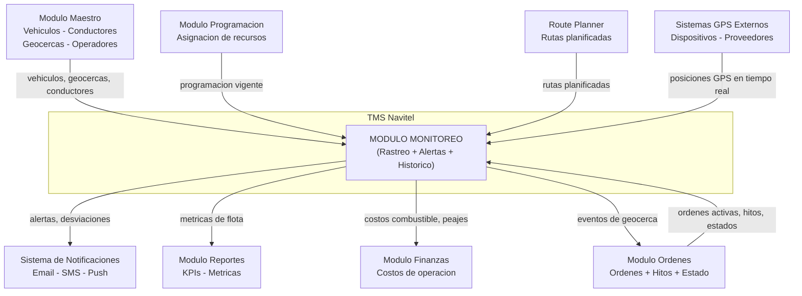

**Responsabilidades:** Rastreo de flota en tiempo real (Control Tower), gestion de alertas (5 tipos, 3 severidades), historial de rutas con reproduccion y exportacion (CSV/JSON/GPX), monitoreo de retransmision GPS (conectividad de dispositivos), eventos de geocerca (entrada/salida/permanencia), vista multi-ventana para seguimiento simultaneo, calculo de ETA dinamico, KPIs de flota en tiempo real.

**Sub-modulos:** Control Tower (torre de control), Historical (historial de rutas), Multi-Window (multi-ventana), Retransmission (retransmision GPS).

---

# 2. Entidades del Dominio

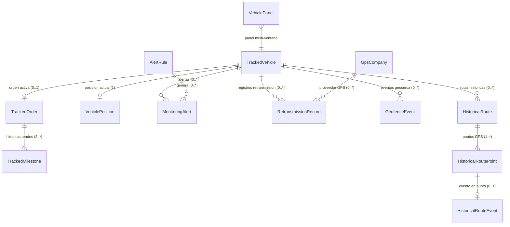

| Entidad | Tipo | Campos clave | Descripcion |
|---|---|---|---|
| **TrackedVehicle** | Raiz (vista en tiempo real) | id, plate, economicNumber, type, position, movementStatus, connectionStatus, driverId, activeOrderId, companyName, speed | Vehiculo rastreado en tiempo real. Combina datos de vehiculo, conductor, orden activa y posicion GPS. |
| **VehiclePosition** | Value Object | lat, lng, speed, heading, timestamp, accuracy, altitude | Posicion GPS instantanea de un vehiculo. |
| **TrackedOrder** | Sub-entidad (vista) | id, orderNumber, reference, serviceType, customerId, customerName, status, milestones, progress | Orden activa vinculada a un vehiculo rastreado. Vista de lectura del modulo Ordenes. |
| **TrackedMilestone** | Sub-entidad (vista) | id, name, type, sequence, coordinates, trackingStatus, estimatedArrival, actualArrival, delayMinutes | Hito rastreado en tiempo real. trackingStatus: pending, in_progress, completed. |
| **RetransmissionRecord** | Entidad | id, vehicleId, vehiclePlate, companyName, gpsCompanyId, retransmissionStatus, movementStatus, disconnectedDuration, comments | Estado de conectividad GPS de un vehiculo. |
| **GpsCompany** | Entidad (catalogo) | id, name, code, contactEmail, contactPhone, isActive | Proveedor de servicios GPS. |
| **MonitoringAlert** | Entidad | id, vehicleId, vehiclePlate, alertType, severity, status, title, message, position, acknowledgedAt, resolvedAt | Alerta generada por reglas de monitoreo. Ciclo: active -> acknowledged -> resolved. |
| **AlertRule** | Entidad | id, name, type, enabled, severity, conditions, notifyEmail, notifySms, notifySound | Regla configurable para generacion automatica de alertas. |
| **HistoricalRoute** | Entidad (consulta) | id, vehicleId, vehiclePlate, startDate, endDate, points, stats | Ruta historica reconstruida a partir de datos de telemetria. |
| **HistoricalRoutePoint** | Sub-entidad | index, lat, lng, speed, heading, timestamp, isStopped, stopDuration, distanceFromStart, event | Punto GPS individual dentro de una ruta historica. |
| **HistoricalRouteEvent** | Value Object | type, description, data | Evento detectado en un punto (geofence_enter, geofence_exit, stop_start, stop_end, speed_alert, ignition_on, ignition_off). |
| **GeofenceEvent** | Entidad | id, geofenceId, vehicleId, orderId, milestoneId, eventType, status, timestamp, durationMinutes, wasExpected, arrivedOnTime | Registro de entrada/salida/permanencia de un vehiculo en una geocerca. |
| **VehiclePanel** | Entidad (preferencia) | id, vehicleId, vehiclePlate, position, isActive, addedAt | Panel de vehiculo en la vista multi-ventana. Persistido por usuario. |
| **DynamicETA** | Value Object | vehicleId, milestoneId, distanceRemainingKm, estimatedArrival, estimatedDurationMinutes, isDelayed, delayMinutes | Estimacion dinamica de tiempo de llegada recalculada en tiempo real. |
| **MonitoringKPIs** | Value Object | totalVehicles, activeVehicles, movingVehicles, stoppedVehicles, disconnectedVehicles, totalKmToday, avgSpeedFleet, onTimeDeliveryRate, activeAlerts | Indicadores clave de rendimiento de flota en tiempo real. |

### Campos clave de TrackedVehicle (resumen)

| Campo | Tipo | Obligatorio | Descripcion rapida |
|---|---|---|---|
| id | UUID | Si | PK del vehiculo (referencia a vehicles) |
| plate | String | Si | Placa del vehiculo. Formato ABC-1234 |
| economicNumber | String | No | Numero economico interno |
| type | String | Si | Tipo de vehiculo (camion, tractocamion, etc.) |
| position | VehiclePosition | Si | Posicion GPS actual |
| movementStatus | Enum | Si | moving, stopped |
| connectionStatus | Enum | Si | online, temporary_loss, disconnected |
| driverId | UUID FK | No | Conductor asignado actualmente |
| driverName | String | No | Nombre del conductor (desnormalizado) |
| driverPhone | String | No | Telefono del conductor |
| activeOrderId | UUID FK | No | Orden activa vinculada al vehiculo |
| activeOrderNumber | String | No | Numero de orden activa (desnormalizado) |
| reference | String | No | Referencia de la orden (booking, guia, viaje) |
| serviceType | String | No | Tipo de servicio de la orden activa |
| companyName | String | No | Nombre del operador/transportista |
| stoppedSince | DateTime | No | Timestamp desde que el vehiculo esta detenido. Null si esta en movimiento |
| lastUpdate | DateTime | Si | Ultimo timestamp de actualizacion GPS |
| speed | Decimal | Si | Velocidad actual en km/h |
| kmToMaintenance | Decimal | No | Km restantes hasta proximo mantenimiento |
| daysToMaintenance | Integer | No | Dias restantes hasta proximo mantenimiento |

### Campos clave de RetransmissionRecord (resumen)

| Campo | Tipo | Obligatorio | Descripcion rapida |
|---|---|---|---|
| id | UUID | Si | PK, auto-generado |
| vehicleId | UUID FK | Si | Vehiculo monitoreado |
| vehiclePlate | String | Si | Placa (desnormalizado) |
| companyName | String | Si | Operador/transportista del vehiculo |
| gpsCompanyId | UUID FK | Si | Proveedor GPS del dispositivo |
| gpsCompanyName | String | Si | Nombre del proveedor GPS (desnormalizado) |
| lastConnection | DateTime | Si | Ultimo timestamp de conexion GPS exitosa |
| movementStatus | Enum | Si | moving, stopped |
| retransmissionStatus | Enum | Si | online, temporary_loss, disconnected |
| disconnectedDuration | Integer | Si | Segundos sin conexion GPS |
| comments | Text | No | Comentarios del operador sobre el estado |
| lastLocation | Object | No | Ultima posicion conocida: { lat, lng } |
| lastAddress | String | No | Direccion geocodificada de la ultima posicion |
| speed | Decimal | No | Velocidad al momento de la ultima conexion (km/h) |

---

# 3. Modelo de Base de Datos — PostgreSQL

> Esquema relacional para PostgreSQL + PostGIS. Todas las tablas usan `UUID` como PK y timestamps UTC. Filtro `tenant_id` obligatorio en todas las consultas (multi-tenant).

### Diagrama Entidad-Relacion

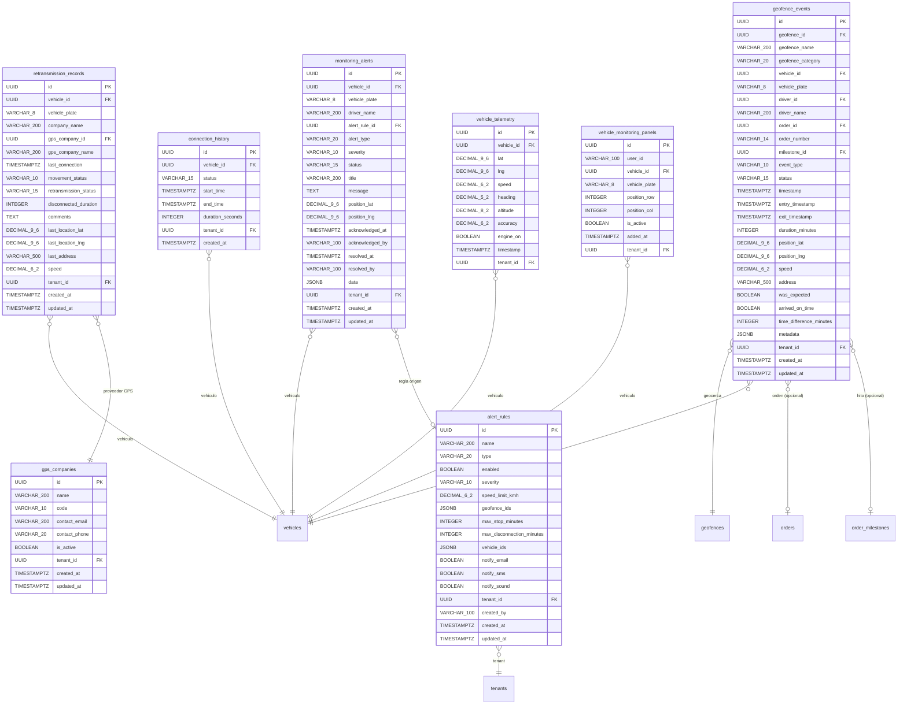

### Tablas, Columnas y Tipos de Dato

#### Tabla: `vehicle_telemetry` (Datos de telemetria GPS — alta frecuencia)

> **Nota:** Tabla de alta escritura. Recibe posiciones GPS de todos los vehiculos cada 3-10 segundos. Usar particionamiento por fecha (`PARTITION BY RANGE (timestamp)`) para mantener rendimiento. Retener datos detallados por 90 dias; datos agregados por 1 ano. Las consultas de ruta historica operan sobre esta tabla con filtros `vehicle_id + timestamp BETWEEN start AND end`.

| Columna | Tipo PostgreSQL | Nullable | Default | Constraint | Descripcion |
|---|---|---|---|---|---|
| id | `UUID` | NOT NULL | `gen_random_uuid()` | **PK** | Identificador unico del punto |
| vehicle_id | `UUID` | NOT NULL | — | **FK** -> vehicles(id) | Vehiculo origen |
| lat | `DECIMAL(9,6)` | NOT NULL | — | CHECK -90..90 | Latitud WGS 84 |
| lng | `DECIMAL(9,6)` | NOT NULL | — | CHECK -180..180 | Longitud WGS 84 |
| speed | `DECIMAL(6,2)` | NOT NULL | — | CHECK >= 0 | Velocidad en km/h |
| heading | `DECIMAL(5,2)` | NULL | — | CHECK 0..360 | Direccion en grados |
| altitude | `DECIMAL(8,2)` | NULL | — | — | Altitud en metros |
| accuracy | `DECIMAL(6,2)` | NULL | — | CHECK >= 0 | Precision GPS en metros |
| engine_on | `BOOLEAN` | NULL | — | — | Estado del motor |
| timestamp | `TIMESTAMPTZ` | NOT NULL | — | — | Timestamp UTC del dato GPS |
| tenant_id | `UUID` | NOT NULL | — | **FK** -> tenants(id) | Aislamiento multi-tenant |

#### Tabla: `retransmission_records` (Estado de conectividad GPS por vehiculo)

> **Nota:** Un registro por vehiculo. Se actualiza con cada heartbeat GPS. `disconnected_duration` se calcula como `NOW() - last_connection` en segundos. El campo `comments` permite al operador anotar observaciones sobre la desconexion (ej: "vehiculo en zona sin cobertura").

| Columna | Tipo PostgreSQL | Nullable | Default | Constraint | Descripcion |
|---|---|---|---|---|---|
| id | `UUID` | NOT NULL | `gen_random_uuid()` | **PK** | Identificador unico |
| vehicle_id | `UUID` | NOT NULL | — | **FK** -> vehicles(id), **UNIQUE** | 1:1 con vehiculo |
| vehicle_plate | `VARCHAR(8)` | NOT NULL | — | — | Desnormalizado de vehicles |
| company_name | `VARCHAR(200)` | NOT NULL | — | — | Operador/transportista |
| gps_company_id | `UUID` | NOT NULL | — | **FK** -> gps_companies(id) | Proveedor GPS |
| gps_company_name | `VARCHAR(200)` | NOT NULL | — | — | Desnormalizado de gps_companies |
| last_connection | `TIMESTAMPTZ` | NOT NULL | — | — | Ultimo heartbeat GPS exitoso |
| movement_status | `VARCHAR(10)` | NOT NULL | — | CHECK: moving, stopped | Estado de movimiento |
| retransmission_status | `VARCHAR(15)` | NOT NULL | `'online'` | CHECK: online, temporary_loss, disconnected | Estado de conectividad |
| disconnected_duration | `INTEGER` | NOT NULL | `0` | CHECK >= 0 | Segundos sin conexion GPS |
| comments | `TEXT` | NULL | — | CHECK char_length <= 2000 | Observaciones del operador |
| last_location_lat | `DECIMAL(9,6)` | NULL | — | CHECK -90..90 | Ultima latitud conocida |
| last_location_lng | `DECIMAL(9,6)` | NULL | — | CHECK -180..180 | Ultima longitud conocida |
| last_address | `VARCHAR(500)` | NULL | — | — | Direccion geocodificada |
| speed | `DECIMAL(6,2)` | NULL | — | CHECK >= 0 | Velocidad al ultimo contacto |
| tenant_id | `UUID` | NOT NULL | — | **FK** -> tenants(id) | Aislamiento multi-tenant |
| created_at | `TIMESTAMPTZ` | NOT NULL | `NOW()` | — | Primer registro |
| updated_at | `TIMESTAMPTZ` | NOT NULL | `NOW()` | — | Ultima actualizacion |

#### Tabla: `monitoring_alerts` (Alertas generadas por reglas)

> **Nota sobre `acknowledged_by` / `resolved_by`**: Se almacena el claim `sub` del JWT como string (`VARCHAR(100)`). Sin FK a `users` por diseno — permite auditar acciones incluso si el usuario es eliminado.

| Columna | Tipo PostgreSQL | Nullable | Default | Constraint | Descripcion |
|---|---|---|---|---|---|
| id | `UUID` | NOT NULL | `gen_random_uuid()` | **PK** | Identificador unico |
| vehicle_id | `UUID` | NOT NULL | — | **FK** -> vehicles(id) | Vehiculo que genero la alerta |
| vehicle_plate | `VARCHAR(8)` | NOT NULL | — | — | Desnormalizado |
| driver_name | `VARCHAR(200)` | NULL | — | — | Conductor al momento de la alerta |
| alert_rule_id | `UUID` | NULL | — | **FK** -> alert_rules(id) ON DELETE SET NULL | Regla que genero la alerta. NULL si regla fue eliminada |
| alert_type | `VARCHAR(20)` | NOT NULL | — | CHECK: speed_limit, geofence, stop_duration, disconnection, sos | Tipo de alerta |
| severity | `VARCHAR(10)` | NOT NULL | — | CHECK: info, warning, critical | Severidad |
| status | `VARCHAR(15)` | NOT NULL | `'active'` | CHECK: active, acknowledged, resolved | Estado del ciclo de vida |
| title | `VARCHAR(200)` | NOT NULL | — | — | Titulo descriptivo |
| message | `TEXT` | NOT NULL | — | — | Mensaje detallado |
| position_lat | `DECIMAL(9,6)` | NULL | — | CHECK -90..90 | Latitud donde ocurrio |
| position_lng | `DECIMAL(9,6)` | NULL | — | CHECK -180..180 | Longitud donde ocurrio |
| acknowledged_at | `TIMESTAMPTZ` | NULL | — | — | Timestamp de reconocimiento |
| acknowledged_by | `VARCHAR(100)` | NULL | — | — | JWT `sub` del usuario |
| resolved_at | `TIMESTAMPTZ` | NULL | — | — | Timestamp de resolucion |
| resolved_by | `VARCHAR(100)` | NULL | — | — | JWT `sub` del usuario |
| data | `JSONB` | NOT NULL | `'{}'` | CHECK (octet_length(data::text) <= 10240) | Datos adicionales (velocidad, geocerca, etc.) |
| tenant_id | `UUID` | NOT NULL | — | **FK** -> tenants(id) | Aislamiento multi-tenant |
| created_at | `TIMESTAMPTZ` | NOT NULL | `NOW()` | — | Cuando se genero la alerta |
| updated_at | `TIMESTAMPTZ` | NOT NULL | `NOW()` | — | Ultima modificacion |

#### Tabla: `alert_rules` (Reglas de generacion de alertas)

> **Nota sobre campos condicionales:** `speed_limit_kmh` solo aplica si `type = 'speed_limit'`. `geofence_ids` solo aplica si `type = 'geofence'`. `max_stop_minutes` solo aplica si `type = 'stop_duration'`. `max_disconnection_minutes` solo aplica si `type = 'disconnection'`. `vehicle_ids = '[]'` (vacio) significa que la regla aplica a TODOS los vehiculos del tenant.

| Columna | Tipo PostgreSQL | Nullable | Default | Constraint | Descripcion |
|---|---|---|---|---|---|
| id | `UUID` | NOT NULL | `gen_random_uuid()` | **PK** | Identificador unico |
| name | `VARCHAR(200)` | NOT NULL | — | — | Nombre descriptivo de la regla |
| type | `VARCHAR(20)` | NOT NULL | — | CHECK: speed_limit, geofence, stop_duration, disconnection, sos | Tipo de regla |
| enabled | `BOOLEAN` | NOT NULL | `true` | — | Si esta activa |
| severity | `VARCHAR(10)` | NOT NULL | — | CHECK: info, warning, critical | Severidad de alertas generadas |
| speed_limit_kmh | `DECIMAL(6,2)` | NULL | — | CHECK > 0. CHECK (type != 'speed_limit' OR speed_limit_kmh IS NOT NULL) | Obligatorio si type=speed_limit |
| geofence_ids | `JSONB` | NULL | — | CHECK (type != 'geofence' OR geofence_ids IS NOT NULL) | Array de UUIDs. Obligatorio si type=geofence |
| max_stop_minutes | `INTEGER` | NULL | — | CHECK > 0. CHECK (type != 'stop_duration' OR max_stop_minutes IS NOT NULL) | Obligatorio si type=stop_duration |
| max_disconnection_minutes | `INTEGER` | NULL | — | CHECK > 0. CHECK (type != 'disconnection' OR max_disconnection_minutes IS NOT NULL) | Obligatorio si type=disconnection |
| vehicle_ids | `JSONB` | NOT NULL | `'[]'` | — | Array de UUIDs. Vacio = todos los vehiculos |
| notify_email | `BOOLEAN` | NOT NULL | `false` | — | Notificar por email |
| notify_sms | `BOOLEAN` | NOT NULL | `false` | — | Notificar por SMS |
| notify_sound | `BOOLEAN` | NOT NULL | `true` | — | Reproducir sonido en UI |
| tenant_id | `UUID` | NOT NULL | — | **FK** -> tenants(id) | Aislamiento multi-tenant |
| created_by | `VARCHAR(100)` | NOT NULL | — | — | JWT `sub` del creador |
| created_at | `TIMESTAMPTZ` | NOT NULL | `NOW()` | — | Fecha de creacion |
| updated_at | `TIMESTAMPTZ` | NOT NULL | `NOW()` | — | Ultima modificacion |

#### Tabla: `geofence_events` (Eventos de entrada/salida de geocerca)

> **Nota:** Un evento `entry` se crea cuando el vehiculo entra en la geocerca (status=active). Cuando sale, se actualiza `exit_timestamp`, se calcula `duration_minutes` y status pasa a `completed`. Ademas se crea un nuevo registro con `event_type=exit`. `was_expected` indica si el evento corresponde a un hito planificado. `arrived_on_time` y `time_difference_minutes` comparan contra el ETA estimado.

| Columna | Tipo PostgreSQL | Nullable | Default | Constraint | Descripcion |
|---|---|---|---|---|---|
| id | `UUID` | NOT NULL | `gen_random_uuid()` | **PK** | Identificador unico |
| geofence_id | `UUID` | NOT NULL | — | **FK** -> geofences(id) | Geocerca involucrada |
| geofence_name | `VARCHAR(200)` | NOT NULL | — | — | Desnormalizado |
| geofence_category | `VARCHAR(20)` | NOT NULL | — | CHECK: warehouse, customer, plant, port, checkpoint, restricted, delivery, other | Categoria de la geocerca |
| vehicle_id | `UUID` | NOT NULL | — | **FK** -> vehicles(id) | Vehiculo detectado |
| vehicle_plate | `VARCHAR(8)` | NOT NULL | — | — | Desnormalizado |
| driver_id | `UUID` | NULL | — | **FK** -> drivers(id) | Conductor al momento del evento |
| driver_name | `VARCHAR(200)` | NULL | — | — | Desnormalizado |
| order_id | `UUID` | NULL | — | **FK** -> orders(id) | Orden activa al momento (si aplica) |
| order_number | `VARCHAR(14)` | NULL | — | — | Desnormalizado |
| milestone_id | `UUID` | NULL | — | **FK** -> order_milestones(id) | Hito vinculado (si aplica) |
| event_type | `VARCHAR(10)` | NOT NULL | — | CHECK: entry, exit, dwell | Tipo de evento |
| status | `VARCHAR(15)` | NOT NULL | `'active'` | CHECK: active, completed, cancelled | Estado del evento |
| timestamp | `TIMESTAMPTZ` | NOT NULL | `NOW()` | — | Cuando ocurrio |
| entry_timestamp | `TIMESTAMPTZ` | NULL | — | — | Momento de entrada |
| exit_timestamp | `TIMESTAMPTZ` | NULL | — | — | Momento de salida |
| duration_minutes | `INTEGER` | NULL | — | CHECK >= 0 | Tiempo de permanencia |
| position_lat | `DECIMAL(9,6)` | NOT NULL | — | CHECK -90..90 | Latitud del evento |
| position_lng | `DECIMAL(9,6)` | NOT NULL | — | CHECK -180..180 | Longitud del evento |
| speed | `DECIMAL(6,2)` | NULL | — | CHECK >= 0 | Velocidad al momento del evento |
| address | `VARCHAR(500)` | NULL | — | — | Direccion geocodificada |
| was_expected | `BOOLEAN` | NULL | — | — | Si el evento corresponde a un hito planificado |
| arrived_on_time | `BOOLEAN` | NULL | — | — | Si llego dentro del ETA |
| time_difference_minutes | `INTEGER` | NULL | — | — | Diferencia vs ETA. Positivo = tarde, negativo = temprano |
| metadata | `JSONB` | NOT NULL | `'{}'` | CHECK (octet_length(metadata::text) <= 10240) | Datos adicionales |
| tenant_id | `UUID` | NOT NULL | — | **FK** -> tenants(id) | Aislamiento multi-tenant |
| created_at | `TIMESTAMPTZ` | NOT NULL | `NOW()` | — | Registro creado |
| updated_at | `TIMESTAMPTZ` | NOT NULL | `NOW()` | — | Ultima modificacion |

#### Tabla: `connection_history` (Historial de conectividad GPS)

| Columna | Tipo PostgreSQL | Nullable | Default | Constraint | Descripcion |
|---|---|---|---|---|---|
| id | `UUID` | NOT NULL | `gen_random_uuid()` | **PK** | Identificador unico |
| vehicle_id | `UUID` | NOT NULL | — | **FK** -> vehicles(id) | Vehiculo |
| status | `VARCHAR(15)` | NOT NULL | — | CHECK: online, temporary_loss, disconnected | Estado de la conexion |
| start_time | `TIMESTAMPTZ` | NOT NULL | — | — | Inicio del periodo en este estado |
| end_time | `TIMESTAMPTZ` | NULL | — | — | Fin del periodo. NULL = estado actual |
| duration_seconds | `INTEGER` | NOT NULL | `0` | CHECK >= 0 | Duracion del periodo |
| tenant_id | `UUID` | NOT NULL | — | **FK** -> tenants(id) | Aislamiento multi-tenant |
| created_at | `TIMESTAMPTZ` | NOT NULL | `NOW()` | — | Registro creado |

#### Tabla: `gps_companies` (Proveedores GPS)

| Columna | Tipo PostgreSQL | Nullable | Default | Constraint | Descripcion |
|---|---|---|---|---|---|
| id | `UUID` | NOT NULL | `gen_random_uuid()` | **PK** | Identificador unico |
| name | `VARCHAR(200)` | NOT NULL | — | — | Nombre del proveedor |
| code | `VARCHAR(10)` | NOT NULL | — | **UNIQUE** | Codigo corto (ej: GPSTRACK, HUNTER) |
| contact_email | `VARCHAR(200)` | NOT NULL | — | — | Email de contacto |
| contact_phone | `VARCHAR(20)` | NULL | — | — | Telefono de contacto |
| is_active | `BOOLEAN` | NOT NULL | `true` | — | Si esta activo |
| tenant_id | `UUID` | NOT NULL | — | **FK** -> tenants(id) | Aislamiento multi-tenant |
| created_at | `TIMESTAMPTZ` | NOT NULL | `NOW()` | — | Fecha de creacion |
| updated_at | `TIMESTAMPTZ` | NOT NULL | `NOW()` | — | Ultima modificacion |

#### Tabla: `vehicle_monitoring_panels` (Preferencias multi-ventana por usuario)

| Columna | Tipo PostgreSQL | Nullable | Default | Constraint | Descripcion |
|---|---|---|---|---|---|
| id | `UUID` | NOT NULL | `gen_random_uuid()` | **PK** | Identificador unico |
| user_id | `VARCHAR(100)` | NOT NULL | — | — | JWT `sub` del usuario |
| vehicle_id | `UUID` | NOT NULL | — | **FK** -> vehicles(id) | Vehiculo en el panel |
| vehicle_plate | `VARCHAR(8)` | NOT NULL | — | — | Desnormalizado |
| position_row | `INTEGER` | NOT NULL | — | CHECK >= 0 | Fila en el grid |
| position_col | `INTEGER` | NOT NULL | — | CHECK >= 0 | Columna en el grid |
| is_active | `BOOLEAN` | NOT NULL | `true` | — | Panel activo |
| added_at | `TIMESTAMPTZ` | NOT NULL | `NOW()` | — | Cuando se agrego |
| tenant_id | `UUID` | NOT NULL | — | **FK** -> tenants(id) | Aislamiento multi-tenant |
| UNIQUE | | | | (user_id, vehicle_id) | Un vehiculo por usuario en paneles |

### Indices Recomendados

| Tabla | Indice | Columnas | Tipo | Justificacion |
|---|---|---|---|---|
| vehicle_telemetry | idx_telemetry_vehicle_ts | vehicle_id, timestamp DESC | BRIN | Consultas de ruta historica por rango de tiempo |
| vehicle_telemetry | idx_telemetry_timestamp | timestamp | BRIN | Particionamiento y purga de datos antiguos |
| retransmission_records | idx_retrans_vehicle | vehicle_id | B-tree UNIQUE | Lookup 1:1 por vehiculo |
| retransmission_records | idx_retrans_status | retransmission_status | B-tree | Filtro principal en vista de retransmision |
| retransmission_records | idx_retrans_tenant | tenant_id | B-tree | Filtro multi-tenant |
| monitoring_alerts | idx_alerts_vehicle | vehicle_id | B-tree | Alertas por vehiculo |
| monitoring_alerts | idx_alerts_status | status, severity | B-tree | Filtro: alertas activas + criticidad |
| monitoring_alerts | idx_alerts_created | created_at DESC | B-tree | Orden cronologico (mas recientes primero) |
| monitoring_alerts | idx_alerts_tenant | tenant_id | B-tree | Filtro multi-tenant |
| alert_rules | idx_rules_tenant | tenant_id, enabled | B-tree | Reglas activas del tenant |
| geofence_events | idx_gevents_geofence | geofence_id, timestamp DESC | B-tree | Eventos por geocerca |
| geofence_events | idx_gevents_vehicle | vehicle_id, timestamp DESC | B-tree | Eventos por vehiculo |
| geofence_events | idx_gevents_order | order_id | B-tree | Eventos por orden |
| geofence_events | idx_gevents_active | status | B-tree | Filtro de eventos activos. **Parcial:** `WHERE status = 'active'` |
| geofence_events | idx_gevents_tenant | tenant_id | B-tree | Filtro multi-tenant |
| connection_history | idx_connhist_vehicle | vehicle_id, start_time DESC | B-tree | Historial por vehiculo |
| vehicle_monitoring_panels | idx_panels_user | user_id, tenant_id | B-tree | Paneles por usuario |

### Relaciones con Tablas de Otros Modulos (FK externas)

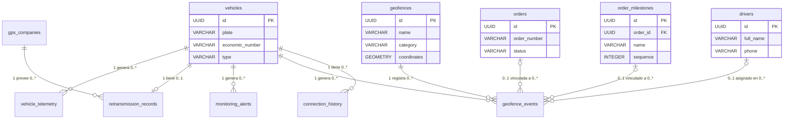

---

# 4. Maquina de Estados — RetransmissionStatus

**3 estados para la conectividad GPS de cada vehiculo**

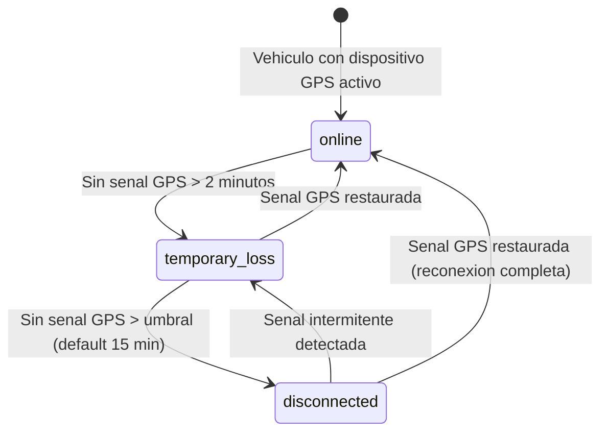

### Tabla de estados

| # | Estado | Etiqueta | Color | Terminal | Transiciones de salida |
|---|---|---|---|---|---|
| 1 | online | En linea | #10B981 esmeralda | No | temporary_loss |
| 2 | temporary_loss | Perdida temporal | #F59E0B ambar | No | online, disconnected |
| 3 | disconnected | Sin conexion | #EF4444 rojo | No | online, temporary_loss |

> **Nota:** Ningun estado es terminal porque un vehiculo puede reconectarse en cualquier momento. El estado se determina automaticamente por el sistema basado en el tiempo transcurrido desde el ultimo heartbeat GPS.

---

# 5. Maquina de Estados — AlertStatus

**3 estados para el ciclo de vida de alertas de monitoreo**

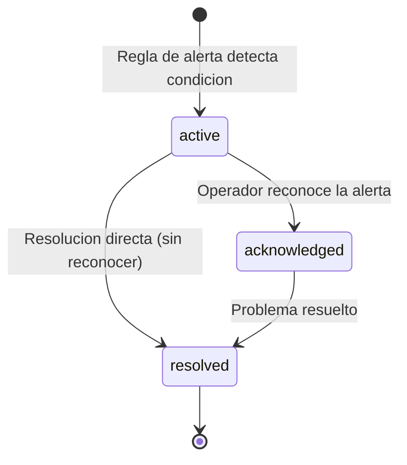

### Tabla de estados

| # | Estado | Etiqueta | Color | Terminal | Transiciones de salida |
|---|---|---|---|---|---|
| 1 | active | Activa | #EF4444 rojo | No | acknowledged, resolved |
| 2 | acknowledged | Reconocida | #F59E0B ambar | No | resolved |
| 3 | resolved | Resuelta | #10B981 esmeralda | Si | ninguna |

---

# 6. Maquina de Estados — GeofenceEventStatus

**3 estados para eventos de geocerca**

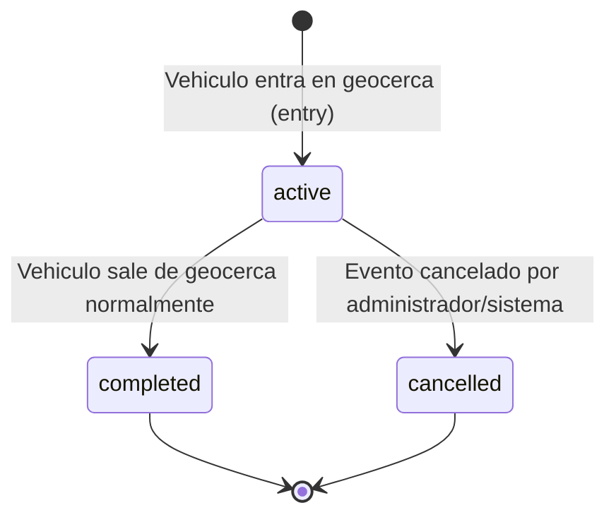

### Tabla de estados

| # | Estado | Etiqueta | Color | Terminal | Transiciones de salida |
|---|---|---|---|---|---|
| 1 | active | Activo | #3B82F6 azul | No | completed, cancelled |
| 2 | completed | Completado | #10B981 esmeralda | Si | ninguna |
| 3 | cancelled | Cancelado | #6B7280 gris | Si | ninguna |

---

# 7. Tabla de Referencia Operativa de Transiciones

> Tabla unificada que cruza: estado origen/destino, trigger, validaciones, actor, evento emitido e idempotencia.

### Transiciones de RetransmissionStatus

| # | From | To | Trigger | Validaciones | Actor | Evento | Idempotente |
|---|---|---|---|---|---|---|---|
| T-01 | online | temporary_loss | Heartbeat GPS no recibido en > 2 minutos | last_connection + 2 min < NOW() | Sistema (detector GPS) | monitoring.connection_status_changed | Si |
| T-02 | temporary_loss | disconnected | Sin senal GPS por mas del umbral (default 15 min) | disconnected_duration > max_disconnection_minutes de regla | Sistema (detector GPS) | monitoring.connection_status_changed, monitoring.alert (si regla activa) | Si |
| T-03 | temporary_loss | online | Heartbeat GPS recibido exitosamente | Nuevo dato de posicion valido (lat, lng, timestamp) | Sistema (receptor GPS) | monitoring.connection_status_changed | Si |
| T-04 | disconnected | online | Senal GPS restaurada tras desconexion total | Nuevo dato de posicion valido | Sistema (receptor GPS) | monitoring.connection_status_changed | Si |
| T-05 | disconnected | temporary_loss | Senal GPS intermitente (recibida y perdida en < 2 min) | Dato recibido pero no estable | Sistema (receptor GPS) | monitoring.connection_status_changed | Si |

### Transiciones de AlertStatus

| # | From | To | Endpoint | Payload | Validaciones | Actor | Evento | Idempotente |
|---|---|---|---|---|---|---|---|---|
| T-06 | [*] | active | — (generacion automatica) | — | Condicion de regla detectada en datos de vehiculo | Sistema (motor de alertas) | monitoring.alert_created | Si |
| T-07 | active | acknowledged | PATCH /alerts/:id/acknowledge | `{}` | alert.status === 'active' | Owner / Usuario Maestro / Subusuario (monitoring:alerts_manage) | monitoring.alert_acknowledged | Si |
| T-08 | acknowledged | resolved | PATCH /alerts/:id/resolve | `{}` | alert.status === 'acknowledged' | Owner / Usuario Maestro / Subusuario (monitoring:alerts_manage) | monitoring.alert_resolved | Si |
| T-09 | active | resolved | PATCH /alerts/:id/resolve | `{}` | alert.status === 'active' (resolucion directa) | Owner / Usuario Maestro / Subusuario (monitoring:alerts_manage) | monitoring.alert_resolved | Si |

### Transiciones de GeofenceEventStatus

| # | From | To | Trigger | Validaciones | Actor | Evento | Idempotente |
|---|---|---|---|---|---|---|---|
| T-10 | [*] | active | Vehiculo detectado dentro del perimetro de geocerca | position dentro de geometry de la geocerca, no existe evento activo duplicado | Sistema GPS (detector de geocerca) | monitoring.geofence_entry | Si |
| T-11 | active | completed | Vehiculo detectado fuera del perimetro de geocerca | Existe evento entry activo para este vehiculo + geocerca | Sistema GPS (detector de geocerca) | monitoring.geofence_exit | Si |
| T-12 | active | cancelled | Cancelacion manual por administrador o correccion de datos | event.status === 'active' | Owner / Usuario Maestro | monitoring.geofence_event_cancelled | Si |

> **Restriccion T-12:** Cancelar un evento de geocerca es accion administrativa. Solo **Owner** o **Usuario Maestro** pueden cancelar eventos. Subusuario NO tiene acceso a esta transicion.

---

# 8. Casos de Uso — Referencia Backend

> **9 Casos de Uso** con precondiciones, flujo principal, excepciones y postcondiciones. Cada CU indica quien ejecuta, que endpoint consume, que debe validar el backend y que debe devolver.

### Matriz Actor x Caso de Uso

> **Modelo de 3 roles (definicion Edson):** Owner (Super Admin TMS), Usuario Maestro (Admin de cuenta cliente), Subusuario (Operador con permisos configurables).
> **Leyenda:** ✅ = Permitido | ⚙️ = Permitido si el Usuario Maestro le asigno el permiso | ❌ = Denegado

| Caso de Uso | Owner | Usuario Maestro | Subusuario | Sistema GPS |
|---|:---:|:---:|:---:|:---:|
| **CU-01** Consultar vehiculos en tiempo real | ✅ | ✅ | ⚙️ `monitoring:view` | — |
| **CU-02** Suscribirse a actualizaciones WebSocket | ✅ | ✅ | ⚙️ `monitoring:view` | — |
| **CU-03** Gestionar alertas de monitoreo | ✅ | ✅ | ⚙️ `monitoring:alerts_manage` | — |
| **CU-04** Configurar reglas de alerta | ✅ | ✅ | ❌ | — |
| **CU-05** Consultar ruta historica de vehiculo | ✅ | ✅ | ⚙️ `monitoring:historical_view` | — |
| **CU-06** Exportar ruta historica | ✅ | ✅ | ⚙️ `monitoring:historical_export` | — |
| **CU-07** Monitorear retransmision GPS | ✅ | ✅ | ⚙️ `monitoring:retransmission_view` | — |
| **CU-08** Registrar y consultar eventos de geocerca | ✅ | ✅ | ⚙️ `monitoring:geofence_events_view` | ✅ (auto) |
| **CU-09** Consultar orden activa de vehiculo | ✅ | ✅ | ⚙️ `monitoring:view` | — |

> **Restriccion CU-04:** Configurar reglas de alerta (crear, editar, eliminar, habilitar/deshabilitar) es accion administrativa exclusiva de **Owner** y **Usuario Maestro**. El Subusuario puede ver las alertas generadas (CU-03) pero no puede modificar las reglas que las generan.
> **Nota:** Los permisos del Subusuario son configurables por el Usuario Maestro. Un Subusuario sin el permiso correspondiente recibira HTTP `403 FORBIDDEN`.

---

## CU-01: Consultar Vehiculos Rastreados en Tiempo Real

| Atributo | Valor |
|---|---|
| **Endpoint** | `GET /api/v1/monitoring/tracking` |
| **Actor Principal** | Owner / Usuario Maestro / Subusuario (permiso `monitoring:view`) |
| **Trigger** | El operador abre la Torre de Control o aplica filtros |
| **Frecuencia** | 100-500 veces/dia (incluye refreshes automaticos) |

**Precondiciones (backend DEBE validar)**

| # | Precondicion | Si no se cumple |
|---|---|---|
| PRE-01 | Token JWT valido y no expirado | HTTP `401 UNAUTHORIZED` |
| PRE-02 | Usuario tiene permiso `monitoring:view` | HTTP `403 FORBIDDEN` |
| PRE-03 | `tenant_id` extraido del JWT | Filtro automatico obligatorio |

**Query Parameters (filtros opcionales)**

| Parametro | Tipo | Descripcion |
|---|---|---|
| unitSearch | string | Buscar por placa o numero economico (ILIKE) |
| carrierId | UUID | Filtrar por operador/transportista |
| orderNumber | string | Filtrar por numero de orden activa |
| reference | string | Filtrar por referencia (booking, guia, viaje) |
| customerId | UUID | Filtrar por cliente de la orden activa |
| activeOrdersOnly | boolean | Solo vehiculos con orden activa (default: false) |
| connectionStatus | string | online, temporary_loss, disconnected, o all (default: all) |

**Secuencia Backend (flujo principal)**

| Paso | Accion del backend | Detalle |
|---|---|---|
| 1 | Autenticar JWT y extraer `tenant_id` | Middleware de autenticacion |
| 2 | Verificar permiso `monitoring:view` | Middleware RBAC |
| 3 | Consultar vehiculos con ultima posicion conocida | JOIN vehicles + vehicle_telemetry (ultimo registro) + retransmission_records |
| 4 | Aplicar filtros de query parameters | WHERE clauses dinamicas |
| 5 | Filtrar por `tenant_id` (obligatorio) | `WHERE vehicles.tenant_id = :tenantId` |
| 6 | Enriquecer con datos de orden activa (si existe) | LEFT JOIN orders WHERE status IN ('in_transit', 'at_milestone', 'delayed') |
| 7 | Enriquecer con datos de conductor | LEFT JOIN drivers |
| 8 | Calcular `movementStatus` | speed > 0 = 'moving', speed = 0 = 'stopped' |
| 9 | Calcular KPIs de flota | Agregados: totalVehicles, movingVehicles, stoppedVehicles, disconnectedVehicles, etc. |
| 10 | Retornar HTTP `200 OK` | `{ vehicles: TrackedVehicle[], kpis: MonitoringKPIs }` |

**Postcondiciones (backend DEBE garantizar)**

| # | Postcondicion | Verificacion |
|---|---|---|
| POST-01 | Solo vehiculos del `tenant_id` del JWT son retornados | Ningun vehiculo de otro tenant en response |
| POST-02 | Cada vehiculo incluye `position`, `movementStatus`, `connectionStatus` | Campos no null |
| POST-03 | `connectionStatus` refleja el estado real de retransmision | Consistente con `retransmission_records` |
| POST-04 | KPIs calculados sobre el set filtrado | Valores coherentes con vehiculos retornados |

**Excepciones**

| HTTP | Codigo | Cuando | Respuesta |
|---|---|---|---|
| `401` | UNAUTHORIZED | Token JWT ausente o expirado | `{ error: { code, message } }` |
| `403` | FORBIDDEN | Sin permiso `monitoring:view` | `{ error: { code, message } }` |

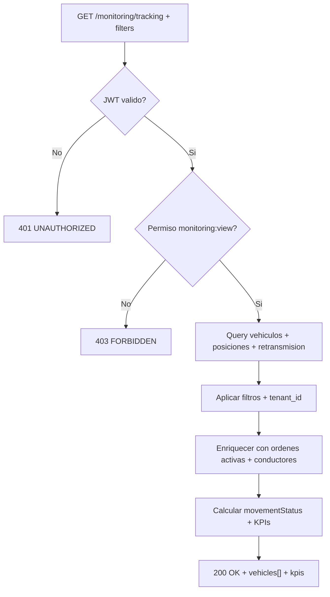

---

## CU-02: Suscribirse a Actualizaciones de Posicion via WebSocket

| Atributo | Valor |
|---|---|
| **Endpoint** | `WS /api/v1/monitoring/websocket` |
| **Actor Principal** | Owner / Usuario Maestro / Subusuario (permiso `monitoring:view`) |
| **Trigger** | El operador abre la Torre de Control (conexion automatica) |
| **Frecuencia** | Conexion persistente. Mensajes cada 3-10 segundos por vehiculo suscrito |

**Precondiciones**

| # | Precondicion | Si no se cumple |
|---|---|---|
| PRE-01 | Token JWT valido enviado como query parameter o header en handshake | Conexion rechazada (HTTP `401`) |
| PRE-02 | Usuario tiene permiso `monitoring:view` | Conexion rechazada (HTTP `403`) |
| PRE-03 | Servidor WebSocket disponible y aceptando conexiones | Error de conexion, cliente reintenta |

**Protocolo de Mensajes (cliente -> servidor)**

| Tipo | Payload | Descripcion |
|---|---|---|
| subscribe | `{ type: "subscribe", vehicleIds: string[] }` | Suscribirse a actualizaciones de vehiculos |
| unsubscribe | `{ type: "unsubscribe", vehicleIds: string[] }` | Cancelar suscripcion |
| ping | `{ type: "ping" }` | Heartbeat (cada 30 segundos) |

**Protocolo de Mensajes (servidor -> cliente)**

| Tipo | Payload | Descripcion |
|---|---|---|
| position_update | `{ type: "position_update", vehicleId, position: VehiclePosition, movementStatus, connectionStatus, timestamp }` | Actualizacion de posicion GPS |
| connection_status | `{ type: "connection_status", vehicleId, status: RetransmissionStatus, lastConnection }` | Cambio de estado de conectividad |
| alert | `{ type: "alert", vehicleId, alertType, message, timestamp, data }` | Nueva alerta generada |
| pong | `{ type: "pong" }` | Respuesta a heartbeat |

**Secuencia Backend (flujo principal)**

| Paso | Accion del backend | Detalle |
|---|---|---|
| 1 | Validar JWT en handshake WebSocket | Extraer `tenant_id` y `userId` |
| 2 | Aceptar conexion y registrar sesion | Map: sessionId -> { userId, tenantId, subscribedVehicles: Set } |
| 3 | Al recibir `subscribe`: validar vehicleIds pertenecen al tenant | Verificar ownership en BD |
| 4 | Agregar vehicleIds a la suscripcion de la sesion | subscribedVehicles.add(vehicleIds) |
| 5 | Al recibir datos GPS del vehiculo: filtrar sesiones suscritas | Broadcast solo a sesiones suscritas a ese vehicleId |
| 6 | Enviar `position_update` a cada sesion suscrita | Serializar como JSON |
| 7 | Al detectar cambio de `retransmissionStatus`: enviar `connection_status` | Broadcast a sesiones suscritas |
| 8 | Al generar alerta: enviar `alert` a sesiones con vehiculo suscrito | Broadcast selectivo |
| 9 | Heartbeat: responder `pong` a cada `ping` | Timeout: 60 segundos sin ping -> cerrar conexion |
| 10 | Al desconectar: limpiar sesion y suscripciones | Liberar memoria |

**Postcondiciones**

| # | Postcondicion |
|---|---|
| POST-01 | Cliente recibe actualizaciones solo de vehiculos suscritos y de su tenant |
| POST-02 | Conexion se mantiene activa con heartbeat cada 30 segundos |
| POST-03 | Al perder conexion, el cliente puede reconectarse y re-suscribirse |

**Configuracion de Reconexion (cliente)**

| Parametro | Valor | Descripcion |
|---|---|---|
| maxReconnectAttempts | 5 | Maximo intentos de reconexion |
| reconnectBaseDelay | 1000 ms | Delay base entre intentos |
| reconnectBackoffFactor | 2 | Factor de backoff exponencial |
| maxReconnectDelay | 30000 ms | Delay maximo entre intentos |
| heartbeatInterval | 30000 ms | Intervalo de ping |
| connectionTimeout | 10000 ms | Timeout de conexion inicial |

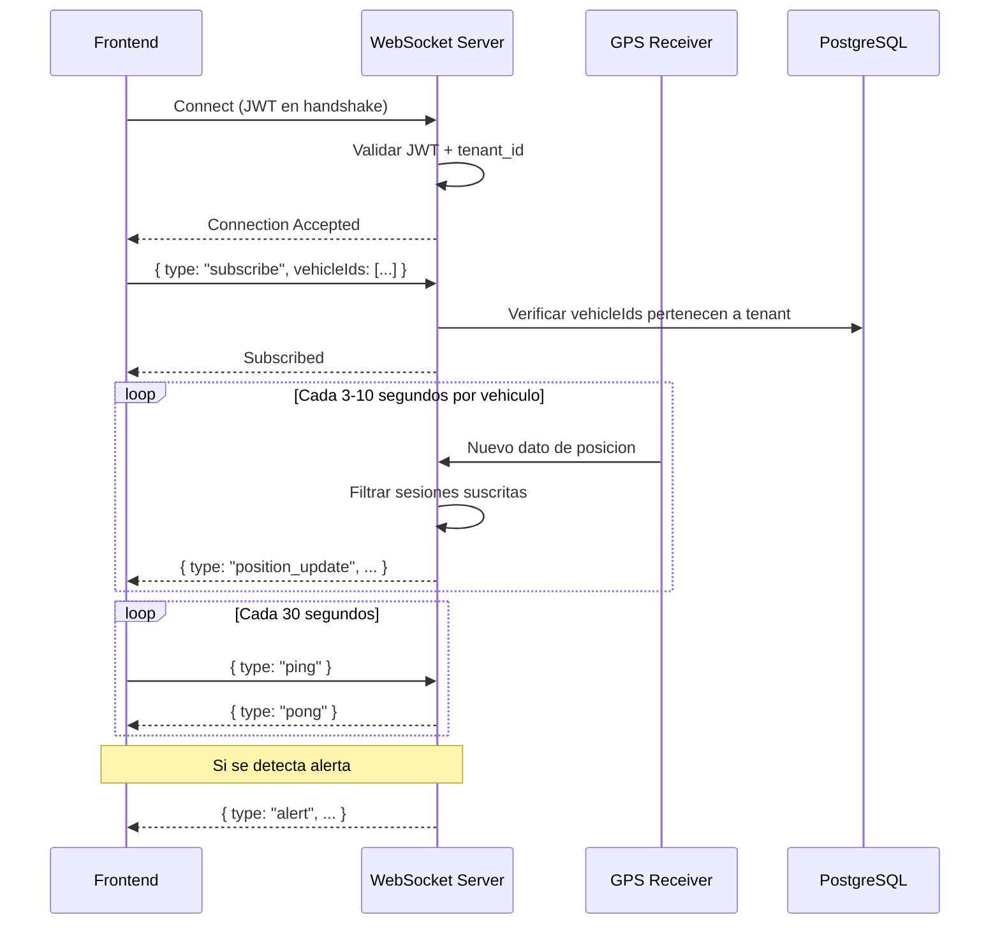

---

## CU-03: Gestionar Alertas de Monitoreo

| Atributo | Valor |
|---|---|
| **Endpoint Listar** | `GET /api/v1/monitoring/alerts` |
| **Endpoint Reconocer** | `PATCH /api/v1/monitoring/alerts/:id/acknowledge` |
| **Endpoint Resolver** | `PATCH /api/v1/monitoring/alerts/:id/resolve` |
| **Actor Principal** | Owner / Usuario Maestro / Subusuario (permiso `monitoring:alerts_manage`) |
| **Trigger** | Operador visualiza y gestiona alertas activas |
| **Frecuencia** | 50-200 veces/dia |

**Precondiciones**

| # | Precondicion | Si no se cumple |
|---|---|---|
| PRE-01 | Token JWT valido | HTTP `401 UNAUTHORIZED` |
| PRE-02 | Usuario tiene permiso `monitoring:alerts_manage` (para acknowledge/resolve) | HTTP `403 FORBIDDEN` |
| PRE-03 | Alerta con `id` existe en BD | HTTP `404 ALERT_NOT_FOUND` |
| PRE-04 | Transicion de estado valida (active->acknowledged, active->resolved, acknowledged->resolved) | HTTP `422 INVALID_ALERT_TRANSITION` |

**Query Parameters para listar**

| Parametro | Tipo | Descripcion |
|---|---|---|
| severity | string | info, warning, critical, o all (default: all) |
| status | string | active, acknowledged, resolved, o all (default: all) |
| alertType | string | speed_limit, geofence, stop_duration, disconnection, sos |
| vehicleId | UUID | Filtrar por vehiculo |
| page | integer | Pagina (default: 1) |
| limit | integer | Items por pagina (default: 50) |

**Secuencia Backend — Reconocer alerta**

| Paso | Accion del backend | Detalle |
|---|---|---|
| 1 | Buscar alerta por `id` | Si no existe -> 404 |
| 2 | Verificar `alert.status === 'active'` | Si no -> 422 INVALID_ALERT_TRANSITION |
| 3 | Actualizar `status = 'acknowledged'` | UPDATE en BD |
| 4 | Registrar `acknowledged_at = NOW()`, `acknowledged_by = currentUserId` | Auditoria |
| 5 | Emitir evento `monitoring.alert_acknowledged` | Notificar suscriptores |
| 6 | Retornar HTTP `200 OK` con alerta actualizada | Incluir nuevos campos |

**Secuencia Backend — Resolver alerta**

| Paso | Accion del backend | Detalle |
|---|---|---|
| 1 | Buscar alerta por `id` | Si no existe -> 404 |
| 2 | Verificar `alert.status` es `active` o `acknowledged` | Si es `resolved` -> 422 |
| 3 | Actualizar `status = 'resolved'` | UPDATE en BD |
| 4 | Registrar `resolved_at = NOW()`, `resolved_by = currentUserId` | Auditoria |
| 5 | Emitir evento `monitoring.alert_resolved` | Notificar suscriptores |
| 6 | Retornar HTTP `200 OK` con alerta actualizada | |

**Postcondiciones**

| # | Postcondicion |
|---|---|
| POST-01 | Estado de la alerta actualizado correctamente |
| POST-02 | Timestamps de auditoria registrados (`acknowledged_at`/`resolved_at`) |
| POST-03 | Evento de dominio emitido |

**Excepciones**

| HTTP | Codigo | Cuando |
|---|---|---|
| `404` | ALERT_NOT_FOUND | Alerta no existe |
| `422` | INVALID_ALERT_TRANSITION | Transicion de estado no permitida (ej: resolved -> acknowledged) |

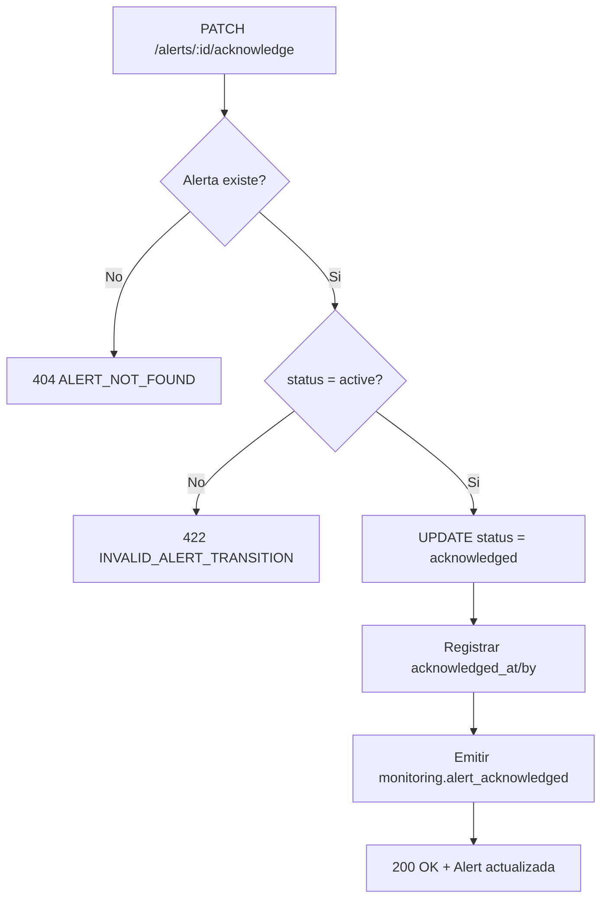

---

## CU-04: Configurar Reglas de Alerta

| Atributo | Valor |
|---|---|
| **Endpoint Listar** | `GET /api/v1/monitoring/alert-rules` |
| **Endpoint Crear** | `POST /api/v1/monitoring/alert-rules` |
| **Endpoint Actualizar** | `PATCH /api/v1/monitoring/alert-rules/:id` |
| **Endpoint Eliminar** | `DELETE /api/v1/monitoring/alert-rules/:id` |
| **Actor Principal** | Owner / Usuario Maestro. Subusuario: DENEGADO |
| **Trigger** | Administrador configura nuevas reglas o modifica existentes |
| **Frecuencia** | 1-5 veces/semana |

**Precondiciones**

| # | Precondicion | Si no se cumple |
|---|---|---|
| PRE-01 | Token JWT valido | HTTP `401 UNAUTHORIZED` |
| PRE-02 | Rol = Owner o Usuario Maestro | HTTP `403 FORBIDDEN` (Subusuario siempre denegado) |
| PRE-03 | Para update/delete: regla con `id` existe | HTTP `404 RULE_NOT_FOUND` |
| PRE-04 | Campos condicionales presentes segun `type` | HTTP `400 VALIDATION_ERROR` |

**Request Body — Crear regla (CreateAlertRuleDTO)**

| Campo | Tipo | Obligatorio | Validacion |
|---|---|---|---|
| name | string | Si | min 1 char, max 200 chars |
| type | enum | Si | speed_limit, geofence, stop_duration, disconnection, sos |
| severity | enum | Si | info, warning, critical |
| speedLimitKmh | decimal | Condicional | Obligatorio si type=speed_limit. CHECK > 0 |
| geofenceIds | UUID[] | Condicional | Obligatorio si type=geofence. Min 1 UUID |
| maxStopMinutes | integer | Condicional | Obligatorio si type=stop_duration. CHECK > 0 |
| maxDisconnectionMinutes | integer | Condicional | Obligatorio si type=disconnection. CHECK > 0 |
| vehicleIds | UUID[] | No | Vacio = todos los vehiculos del tenant |
| notifyEmail | boolean | No | Default: false |
| notifySms | boolean | No | Default: false |
| notifySound | boolean | No | Default: true |

**Secuencia Backend — Crear regla**

| Paso | Accion del backend | Detalle |
|---|---|---|
| 1 | Validar DTO con schema Zod | Validar campos obligatorios y condicionales |
| 2 | Verificar que vehicleIds (si proporcionados) pertenecen al tenant | Consulta en BD |
| 3 | Verificar que geofenceIds (si proporcionados) pertenecen al tenant | Consulta en BD |
| 4 | Generar `id` (UUID v4) | Auto-generado |
| 5 | Persistir regla con `enabled = true` | INSERT en BD |
| 6 | Registrar en motor de alertas (hot-reload) | Activar evaluacion en tiempo real |
| 7 | Retornar HTTP `201 Created` | Regla completa |

**Postcondiciones**

| # | Postcondicion |
|---|---|
| POST-01 | Regla creada con `enabled = true` |
| POST-02 | Motor de alertas evalua la nueva regla en tiempo real |
| POST-03 | Solo vehiculos del tenant pueden activar la regla |

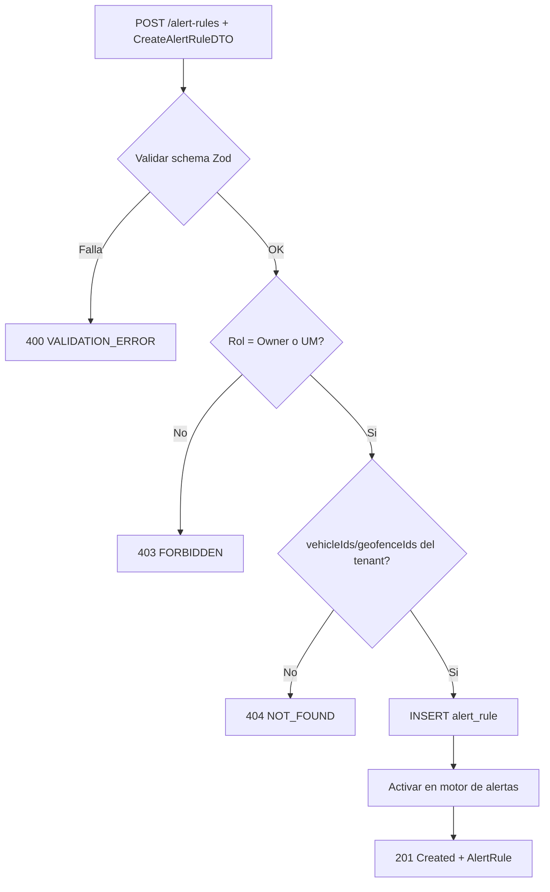

---

## CU-05: Consultar Ruta Historica de Vehiculo

| Atributo | Valor |
|---|---|
| **Endpoint** | `GET /api/v1/monitoring/historical` |
| **Actor Principal** | Owner / Usuario Maestro / Subusuario (permiso `monitoring:historical_view`) |
| **Trigger** | El operador selecciona vehiculo y rango de fechas para consultar historial |
| **Frecuencia** | 10-50 veces/dia |

**Precondiciones**

| # | Precondicion | Si no se cumple |
|---|---|---|
| PRE-01 | Token JWT valido | HTTP `401 UNAUTHORIZED` |
| PRE-02 | Usuario tiene permiso `monitoring:historical_view` | HTTP `403 FORBIDDEN` |
| PRE-03 | `vehicleId` proporcionado y pertenece al tenant | HTTP `404 VEHICLE_NOT_FOUND` |
| PRE-04 | `startDateTime` proporcionado | HTTP `400 VALIDATION_ERROR` |
| PRE-05 | `endDateTime` proporcionado | HTTP `400 VALIDATION_ERROR` |
| PRE-06 | `startDateTime < endDateTime` | HTTP `400 VALIDATION_ERROR` |
| PRE-07 | Rango maximo: 7 dias | HTTP `400 VALIDATION_ERROR`: "Rango maximo de 7 dias" |
| PRE-08 | `endDateTime <= NOW()` (no fechas futuras) | HTTP `400 VALIDATION_ERROR` |

**Query Parameters**

| Parametro | Tipo | Obligatorio | Descripcion |
|---|---|---|---|
| vehicleId | UUID | Si | Vehiculo a consultar |
| startDateTime | ISO 8601 | Si | Inicio del rango |
| endDateTime | ISO 8601 | Si | Fin del rango |
| sampleInterval | integer | No | Intervalo de muestreo en segundos (para reducir puntos) |
| includeEvents | boolean | No | Incluir eventos en puntos (default: true) |

**Secuencia Backend**

| Paso | Accion del backend | Detalle |
|---|---|---|
| 1 | Validar parametros (vehicleId, fechas, rango) | Rechazar si rango > 7 dias o fechas futuras |
| 2 | Consultar `vehicle_telemetry` filtrado por `vehicle_id` + `timestamp BETWEEN start AND end` | Ordenar por timestamp ASC |
| 3 | Si `sampleInterval` proporcionado: reducir puntos por muestreo | Tomar 1 punto cada N segundos |
| 4 | Detectar paradas: puntos con `speed = 0` consecutivos | Agregar `isStopped = true`, calcular `stopDuration` |
| 5 | Si `includeEvents = true`: detectar eventos (geofence enter/exit, speed alerts, ignition changes) | Cruzar con geofence_events |
| 6 | Calcular estadisticas: distancia total, velocidad max/avg, tiempo movimiento vs parado, total paradas | HistoricalRouteStats |
| 7 | Retornar HTTP `200 OK` | `{ id, vehicleId, vehiclePlate, startDate, endDate, points: HistoricalRoutePoint[], stats: HistoricalRouteStats }` |

**Postcondiciones**

| # | Postcondicion |
|---|---|
| POST-01 | Puntos ordenados cronologicamente (timestamp ASC) |
| POST-02 | Estadisticas calculadas correctamente sobre el set de puntos |
| POST-03 | Eventos detectados y vinculados a puntos (si includeEvents=true) |
| POST-04 | Solo datos del vehiculo del tenant son retornados |

**Excepciones**

| HTTP | Codigo | Cuando |
|---|---|---|
| `400` | VALIDATION_ERROR | Parametros invalidos (rango > 7 dias, fecha futura, campos faltantes) |
| `404` | VEHICLE_NOT_FOUND | Vehiculo no existe o no pertenece al tenant |
| `404` | NO_DATA_FOUND | No hay datos de telemetria para el rango especificado |

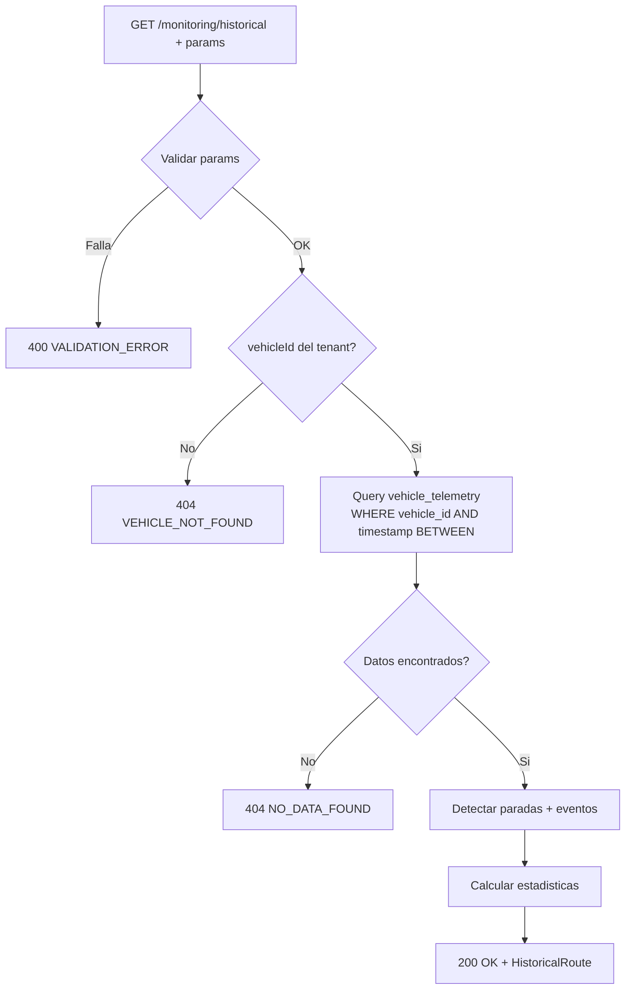

---

## CU-06: Exportar Ruta Historica

| Atributo | Valor |
|---|---|
| **Endpoint** | `GET /api/v1/monitoring/historical/export` |
| **Actor Principal** | Owner / Usuario Maestro / Subusuario (permiso `monitoring:historical_export`) |
| **Trigger** | Operador solicita exportacion de ruta en formato CSV, JSON o GPX |
| **Frecuencia** | 5-20 veces/dia |

**Precondiciones**

| # | Precondicion | Si no se cumple |
|---|---|---|
| PRE-01 | Mismas que CU-05 (vehicleId, fechas, rango) | Mismos errores que CU-05 |
| PRE-02 | `format` proporcionado (csv, json, gpx) | HTTP `400 VALIDATION_ERROR` |

**Query Parameters adicionales**

| Parametro | Tipo | Obligatorio | Descripcion |
|---|---|---|---|
| format | enum | Si | csv, json, gpx |
| includeStats | boolean | No | Incluir estadisticas en exportacion (default: true) |
| includeEvents | boolean | No | Incluir eventos (default: true) |
| filename | string | No | Nombre personalizado del archivo |

**Secuencia Backend**

| Paso | Accion del backend | Detalle |
|---|---|---|
| 1 | Obtener ruta historica (misma logica que CU-05) | Reusar servicio |
| 2 | Formatear segun `format` | Ver formatos abajo |
| 3 | Generar archivo (Blob) | Con MIME type correspondiente |
| 4 | Retornar HTTP `200 OK` con Content-Disposition: attachment | Descarga directa |

**Formatos de Exportacion**

| Formato | MIME Type | Contenido |
|---|---|---|
| csv | `text/csv;charset=utf-8;` | Columnas: Index, Latitude, Longitude, Speed, Heading, Timestamp, IsStopped, StopDuration, Event |
| json | `application/json;charset=utf-8;` | Objeto estructurado con metadata, points[], stats (opcional), events (opcional) |
| gpx | `application/gpx+xml;charset=utf-8;` | GPS Exchange Format estandar con trackpoints, metadata y extensiones |

---

## CU-07: Monitorear Retransmision GPS

| Atributo | Valor |
|---|---|
| **Endpoint Listar** | `GET /api/v1/monitoring/retransmission` |
| **Endpoint Stats** | `GET /api/v1/monitoring/retransmission/stats` |
| **Endpoint Comentar** | `PATCH /api/v1/monitoring/retransmission/:id/comment` |
| **Endpoint Comentar Masivo** | `PATCH /api/v1/monitoring/retransmission/bulk-comments` |
| **Actor Principal** | Owner / Usuario Maestro / Subusuario (permiso `monitoring:retransmission_view`) |
| **Trigger** | Operador consulta estado de conectividad GPS de la flota |
| **Frecuencia** | 50-200 veces/dia (incluye auto-refresh cada 10-15 segundos) |

**Precondiciones**

| # | Precondicion | Si no se cumple |
|---|---|---|
| PRE-01 | Token JWT valido | HTTP `401 UNAUTHORIZED` |
| PRE-02 | Permiso `monitoring:retransmission_view` | HTTP `403 FORBIDDEN` |
| PRE-03 | Para comentar: permiso `monitoring:retransmission_edit` | HTTP `403 FORBIDDEN` |
| PRE-04 | Para comentar: registro con `id` existe | HTTP `404 RECORD_NOT_FOUND` |

**Query Parameters para listar**

| Parametro | Tipo | Descripcion |
|---|---|---|
| vehicleSearch | string | Buscar por placa (ILIKE) |
| companyId | UUID | Filtrar por operador |
| movementStatus | string | moving, stopped, o all |
| retransmissionStatus | string | online, temporary_loss, disconnected, o all |
| gpsCompanyId | UUID | Filtrar por proveedor GPS |
| hasComments | boolean | Solo registros con/sin comentarios |

**Secuencia Backend — Listar**

| Paso | Accion del backend | Detalle |
|---|---|---|
| 1 | Consultar `retransmission_records` filtrado por `tenant_id` | Aplicar filtros de query params |
| 2 | Recalcular `disconnected_duration` en tiempo real | `EXTRACT(EPOCH FROM NOW() - last_connection)` para estados no-online |
| 3 | Retornar registros ordenados por severidad (disconnected primero) | Orden: disconnected -> temporary_loss -> online |

**Secuencia Backend — Stats**

| Paso | Accion del backend | Detalle |
|---|---|---|
| 1 | Agregar registros por `retransmission_status` | COUNT + porcentajes |
| 2 | Retornar `RetransmissionStats` | `{ total, online, temporaryLoss, disconnected, onlinePercentage, ... }` |

**Secuencia Backend — Actualizar comentario**

| Paso | Accion del backend | Detalle |
|---|---|---|
| 1 | Buscar registro por `id` | Si no existe -> 404 |
| 2 | Validar `comment` (max 2000 chars) | Zod validation |
| 3 | UPDATE `comments = :comment`, `updated_at = NOW()` | Persistir |
| 4 | Retornar HTTP `200 OK` | Registro actualizado |

**Request Body — Bulk comments**

```
{ recordIds: UUID[], comment: string }
```

**Postcondiciones**

| # | Postcondicion |
|---|---|
| POST-01 | `disconnected_duration` recalculado en tiempo real para cada registro |
| POST-02 | Estadisticas son consistentes con los registros filtrados |
| POST-03 | Comentario actualizado y persistido con timestamp |

---

## CU-08: Registrar y Consultar Eventos de Geocerca

| Atributo | Valor |
|---|---|
| **Endpoint Listar** | `GET /api/v1/monitoring/geofence-events` |
| **Endpoint Crear** | `POST /api/v1/monitoring/geofence-events` |
| **Endpoint Stats** | `GET /api/v1/monitoring/geofence-events/stats` |
| **Endpoint Dwell** | `GET /api/v1/monitoring/geofence-events/dwell-summary` |
| **Endpoint Activos** | `GET /api/v1/monitoring/geofence-events/active` |
| **Actor Principal** | Sistema GPS (auto), Owner / Usuario Maestro / Subusuario (`monitoring:geofence_events_view`) |
| **Trigger** | Vehiculo detectado dentro/fuera de geocerca o consulta de operador |
| **Frecuencia** | 20-100 veces/dia (depende de tamano de flota y geocercas activas) |

**Precondiciones — Crear evento**

| # | Precondicion | Si no se cumple |
|---|---|---|
| PRE-01 | `geofenceId` existe y pertenece al tenant | HTTP `404 GEOFENCE_NOT_FOUND` |
| PRE-02 | `vehicleId` existe y pertenece al tenant | HTTP `404 VEHICLE_NOT_FOUND` |
| PRE-03 | Si `eventType = entry`: no existe evento activo duplicado para este vehiculo + geocerca | HTTP `409 DUPLICATE_EVENT` |
| PRE-04 | Coordenadas validas (lat: -90..90, lng: -180..180) | HTTP `400 VALIDATION_ERROR` |

**Request Body — CreateGeofenceEventDTO**

| Campo | Tipo | Obligatorio | Descripcion |
|---|---|---|---|
| geofenceId | UUID | Si | Geocerca detectada |
| vehicleId | UUID | Si | Vehiculo detectado |
| driverId | UUID | No | Conductor actual |
| orderId | UUID | No | Orden activa vinculada |
| milestoneId | UUID | No | Hito de ruta vinculado |
| eventType | enum | Si | entry, exit |
| coordinates | object | Si | { lat, lng } |
| speed | decimal | No | Velocidad al momento |
| timestamp | ISO 8601 | No | Default: NOW() |

**Secuencia Backend — Crear evento entry**

| Paso | Accion del backend | Detalle |
|---|---|---|
| 1 | Validar DTO | Verificar existencia de geofence, vehicle en tenant |
| 2 | Verificar no duplicado (evento activo para vehicle + geofence) | Si existe -> 409 |
| 3 | Enriquecer con nombres desnormalizados | geofenceName, vehiclePlate, driverName, orderNumber |
| 4 | Determinar `was_expected` | Cruzar con order_milestones para ver si geocerca corresponde a un hito planificado |
| 5 | Calcular `arrived_on_time` y `time_difference_minutes` | Comparar con estimated_arrival del hito |
| 6 | INSERT evento con `status = 'active'` | Persistir |
| 7 | Emitir evento `monitoring.geofence_entry` via Event Bus | Payload: vehicleId, geofenceId, orderId, milestoneId, timestamp |
| 8 | Enviar notificacion si geocerca tiene `alerts.onEntry = true` | Via notification service |
| 9 | Retornar HTTP `201 Created` | Evento completo |

**Secuencia Backend — Record exit (vehiculo sale)**

| Paso | Accion del backend | Detalle |
|---|---|---|
| 1 | Buscar evento entry activo para vehiculo + geocerca | Si no existe -> 404 |
| 2 | Calcular `duration_minutes` = (NOW() - entry_timestamp) | En minutos |
| 3 | UPDATE evento entry: `exit_timestamp = NOW()`, `status = 'completed'`, `duration_minutes` | Persistir |
| 4 | CREATE nuevo evento con `eventType = 'exit'`, `status = 'completed'` | Registro de salida |
| 5 | Emitir `monitoring.geofence_exit` via Event Bus | Incluir durationMinutes |
| 6 | Enviar notificacion si geocerca tiene `alerts.onExit = true` | Via notification service |

**Query Parameters para listar**

| Parametro | Tipo | Descripcion |
|---|---|---|
| geofenceId | UUID | Filtrar por geocerca |
| vehicleId | UUID | Filtrar por vehiculo |
| orderId | UUID | Filtrar por orden |
| eventType | string | entry, exit, dwell |
| status | string | active, completed, cancelled |
| startDate | ISO 8601 | Desde |
| endDate | ISO 8601 | Hasta |
| wasExpected | boolean | Solo eventos esperados/inesperados |
| arrivedOnTime | boolean | Solo a tiempo/retrasados |
| page | integer | Pagina (default: 1) |
| pageSize | integer | Items (default: 50) |

**Postcondiciones**

| # | Postcondicion |
|---|---|
| POST-01 | Evento creado con datos enriquecidos (nombres, puntualidad) |
| POST-02 | Evento de dominio emitido (`geofence_entry` o `geofence_exit`) |
| POST-03 | Si corresponde a hito de orden: `was_expected = true`, puntualidad calculada |
| POST-04 | Notificacion enviada si configurado en la geocerca |

---

## CU-09: Consultar Orden Activa de Vehiculo

| Atributo | Valor |
|---|---|
| **Endpoint** | `GET /api/v1/monitoring/tracking/:vehicleId/order` |
| **Actor Principal** | Owner / Usuario Maestro / Subusuario (permiso `monitoring:view`) |
| **Trigger** | El operador selecciona un vehiculo en la Torre de Control para ver detalle de su orden |
| **Frecuencia** | 50-200 veces/dia |

**Precondiciones**

| # | Precondicion | Si no se cumple |
|---|---|---|
| PRE-01 | Token JWT valido | HTTP `401 UNAUTHORIZED` |
| PRE-02 | Permiso `monitoring:view` | HTTP `403 FORBIDDEN` |
| PRE-03 | `vehicleId` existe y pertenece al tenant | HTTP `404 VEHICLE_NOT_FOUND` |

**Secuencia Backend**

| Paso | Accion del backend | Detalle |
|---|---|---|
| 1 | Buscar orden activa del vehiculo | `SELECT FROM orders WHERE vehicle_id = :vehicleId AND status IN ('in_transit', 'at_milestone', 'delayed') AND tenant_id = :tenantId` |
| 2 | Si no hay orden activa | Retornar `{ order: null }` con HTTP `200 OK` |
| 3 | Obtener hitos con estado de tracking | JOIN order_milestones. Mapear status a trackingStatus (pending, in_progress, completed) |
| 4 | Calcular progreso | `(completedMilestones / totalMilestones) * 100` |
| 5 | Calcular ETA dinamico | Distancia restante / velocidad promedio actual |
| 6 | Retornar HTTP `200 OK` | `{ order: TrackedOrder, eta: DynamicETA }` |

**Postcondiciones**

| # | Postcondicion |
|---|---|
| POST-01 | Si hay orden activa: retorna orden con hitos, progreso y ETA |
| POST-02 | Si no hay orden activa: retorna `{ order: null }` (no error) |
| POST-03 | Hitos incluyen estimatedArrival, actualArrival, delayMinutes |
| POST-04 | ETA calculado con datos de velocidad en tiempo real |

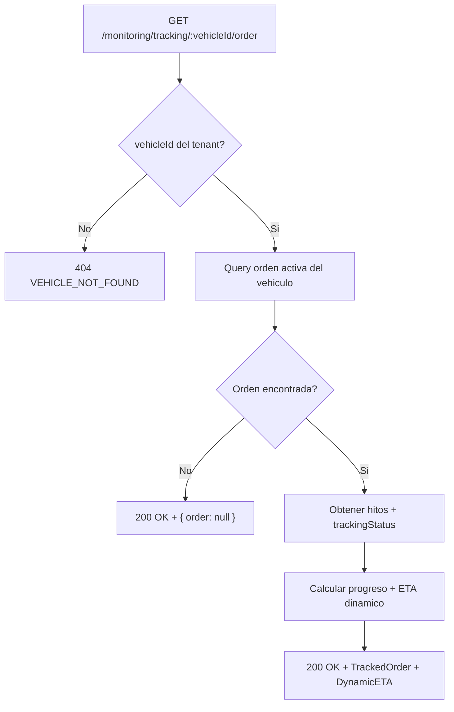

### Diagrama general de interaccion CU

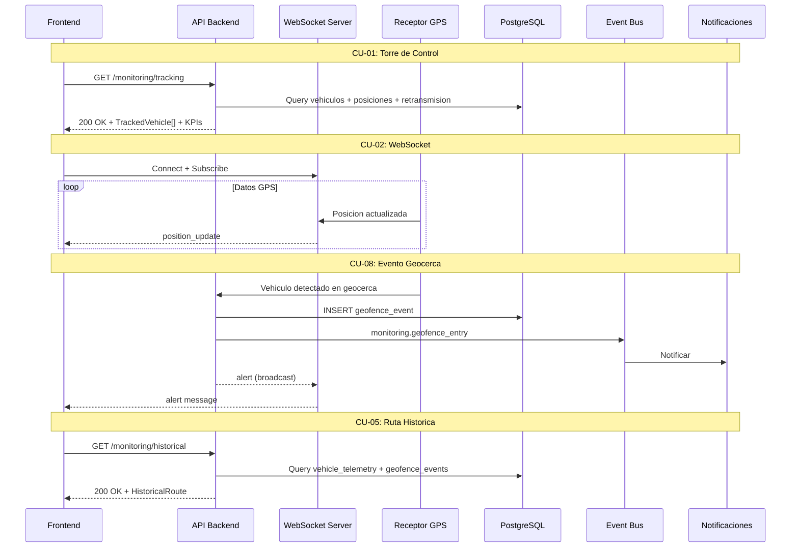

---

# 9. Endpoints API REST

**Base path:** `/api/v1/monitoring`

### Tracking (Torre de Control)

| # | Metodo | Endpoint | Descripcion | Permiso | Request/Query | Response |
|---|---|---|---|---|---|---|
| E-01 | GET | /tracking | Listar vehiculos rastreados con filtros | monitoring:view | Query: unitSearch, carrierId, orderNumber, reference, customerId, activeOrdersOnly, connectionStatus | `{ vehicles: TrackedVehicle[], kpis: MonitoringKPIs }` |
| E-02 | GET | /tracking/:vehicleId | Obtener vehiculo rastreado individual | monitoring:view | — | TrackedVehicle completo |
| E-03 | GET | /tracking/:vehicleId/position | Obtener solo posicion actual | monitoring:view | — | VehiclePosition |
| E-04 | GET | /tracking/:vehicleId/order | Obtener orden activa del vehiculo | monitoring:view | — | `{ order: TrackedOrder or null, eta: DynamicETA or null }` |
| E-05 | GET | /tracking/carriers | Listar operadores/transportistas unicos | monitoring:view | — | `string[]` (nombres de empresas) |

### Alertas

| # | Metodo | Endpoint | Descripcion | Permiso | Request/Query | Response |
|---|---|---|---|---|---|---|
| E-06 | GET | /alerts | Listar alertas con filtros y paginacion | monitoring:alerts_manage | Query: severity, status, alertType, vehicleId, page, limit | `{ items: MonitoringAlert[], total, page, totalPages }` |
| E-07 | PATCH | /alerts/:id/acknowledge | Reconocer alerta | monitoring:alerts_manage | `{}` | MonitoringAlert actualizada |
| E-08 | PATCH | /alerts/:id/resolve | Resolver alerta | monitoring:alerts_manage | `{}` | MonitoringAlert actualizada |

### Reglas de Alerta

| # | Metodo | Endpoint | Descripcion | Permiso | Request/Query | Response |
|---|---|---|---|---|---|---|
| E-09 | GET | /alert-rules | Listar reglas de alerta del tenant | monitoring:alerts_config | — | `AlertRule[]` |
| E-10 | POST | /alert-rules | Crear nueva regla | monitoring:alerts_config | CreateAlertRuleDTO | `201` AlertRule creada |
| E-11 | PATCH | /alert-rules/:id | Actualizar regla (parcial, incluye enable/disable) | monitoring:alerts_config | UpdateAlertRuleDTO (parcial) | AlertRule actualizada |
| E-12 | DELETE | /alert-rules/:id | Eliminar regla | monitoring:alerts_config | — | `204` No Content |

### Ruta Historica

| # | Metodo | Endpoint | Descripcion | Permiso | Request/Query | Response |
|---|---|---|---|---|---|---|
| E-13 | GET | /historical | Consultar ruta historica | monitoring:historical_view | Query: vehicleId, startDateTime, endDateTime, sampleInterval, includeEvents | HistoricalRoute completa con puntos y stats |
| E-14 | GET | /historical/export | Exportar ruta historica | monitoring:historical_export | Query: vehicleId, startDateTime, endDateTime, format (csv/json/gpx), includeStats, includeEvents | Archivo descargable |
| E-15 | GET | /historical/vehicles | Listar vehiculos con datos historicos disponibles | monitoring:historical_view | — | `{ id, plate }[]` |
| E-16 | GET | /historical/vehicles/:vehicleId/date-range | Rango de fechas disponible para vehiculo | monitoring:historical_view | — | `{ min: ISO8601, max: ISO8601 }` |

### Retransmision GPS

| # | Metodo | Endpoint | Descripcion | Permiso | Request/Query | Response |
|---|---|---|---|---|---|---|
| E-17 | GET | /retransmission | Listar registros de retransmision con filtros | monitoring:retransmission_view | Query: vehicleSearch, companyId, movementStatus, retransmissionStatus, gpsCompanyId, hasComments | `RetransmissionRecord[]` |
| E-18 | GET | /retransmission/:id | Obtener registro individual | monitoring:retransmission_view | — | RetransmissionRecord |
| E-19 | GET | /retransmission/stats | Obtener estadisticas de retransmision | monitoring:retransmission_view | Query: mismos filtros que E-17 | RetransmissionStats |
| E-20 | PATCH | /retransmission/:id/comment | Actualizar comentario | monitoring:retransmission_edit | `{ comment: string }` | RetransmissionRecord actualizado |
| E-21 | PATCH | /retransmission/bulk-comments | Actualizar comentarios masivo | monitoring:retransmission_edit | `{ recordIds: UUID[], comment: string }` | `RetransmissionRecord[]` |
| E-22 | GET | /retransmission/gps-companies | Listar proveedores GPS | monitoring:retransmission_view | — | `GpsCompany[]` |
| E-23 | GET | /retransmission/companies | Listar operadores unicos | monitoring:retransmission_view | — | `string[]` |

### Eventos de Geocerca

| # | Metodo | Endpoint | Descripcion | Permiso | Request/Query | Response |
|---|---|---|---|---|---|---|
| E-24 | GET | /geofence-events | Listar eventos con filtros y paginacion | monitoring:geofence_events_view | Query: geofenceId, vehicleId, orderId, eventType, status, startDate, endDate, wasExpected, arrivedOnTime, page, pageSize | `{ data: GeofenceEvent[], total, page, pageSize }` |
| E-25 | GET | /geofence-events/:id | Obtener evento individual | monitoring:geofence_events_view | — | GeofenceEvent |
| E-26 | POST | /geofence-events | Registrar evento de geocerca | Sistema (interno) | CreateGeofenceEventDTO | `201` GeofenceEvent creado |
| E-27 | PATCH | /geofence-events/:id | Actualizar evento (completar, cancelar) | Sistema (interno) | UpdateGeofenceEventDTO | GeofenceEvent actualizado |
| E-28 | POST | /geofence-events/record-exit | Registrar salida de vehiculo | Sistema (interno) | `{ vehicleId, geofenceId, coordinates, speed }` | GeofenceEvent actualizado |
| E-29 | GET | /geofence-events/dwell-summary | Resumen de permanencia por geocerca/vehiculo | monitoring:geofence_events_view | Query: filtros | `GeofenceDwellSummary[]` |
| E-30 | GET | /geofence-events/stats | Estadisticas de eventos de geocerca | monitoring:geofence_events_view | Query: filtros | GeofenceEventStats |
| E-31 | GET | /geofence-events/active | Eventos activos (vehiculos actualmente en geocercas) | monitoring:geofence_events_view | — | `GeofenceEvent[]` |
| E-32 | GET | /geofence-events/check/:vehicleId/:geofenceId | Verificar si vehiculo esta en geocerca | monitoring:geofence_events_view | — | `{ isInside: boolean, event: GeofenceEvent or null }` |

### WebSocket

| # | Protocolo | Endpoint | Descripcion | Permiso |
|---|---|---|---|---|
| E-33 | WS | /websocket | Canal de actualizaciones en tiempo real | monitoring:view |

---

# 10. Eventos de Dominio

### Catalogo

| Evento | Payload | Se emite cuando | Modulos suscriptores |
|---|---|---|---|
| monitoring.position_update | vehicleId, position (lat, lng, speed, heading), movementStatus, connectionStatus, timestamp | Nueva posicion GPS recibida para un vehiculo | WebSocket (broadcast a clientes), Alertas (evaluacion de reglas) |
| monitoring.connection_status_changed | vehicleId, vehiclePlate, oldStatus, newStatus, lastConnection, disconnectedDuration | Cambia el estado de retransmision de un vehiculo | Alertas, Notificaciones, Retransmision |
| monitoring.alert_created | alertId, vehicleId, vehiclePlate, alertType, severity, title, message, position | Se genera nueva alerta por regla detectada | WebSocket (broadcast), Notificaciones (email/SMS) |
| monitoring.alert_acknowledged | alertId, vehicleId, acknowledgedBy, acknowledgedAt | Operador reconoce una alerta | Auditoria |
| monitoring.alert_resolved | alertId, vehicleId, resolvedBy, resolvedAt | Alerta es resuelta | Auditoria |
| monitoring.geofence_entry | eventId, vehicleId, geofenceId, geofenceName, orderId, milestoneId, coordinates, timestamp, wasExpected | Vehiculo entra en geocerca | Ordenes (actualizar milestone), Notificaciones |
| monitoring.geofence_exit | eventId, vehicleId, geofenceId, geofenceName, orderId, milestoneId, durationMinutes, timestamp | Vehiculo sale de geocerca | Ordenes (actualizar milestone), Notificaciones |
| monitoring.geofence_event_cancelled | eventId, vehicleId, geofenceId, cancelledBy | Evento de geocerca cancelado | Auditoria |
| monitoring.vehicle_stopped | vehicleId, vehiclePlate, position, stoppedSince, durationMinutes | Vehiculo detenido por mas del umbral configurado | Alertas (evaluacion de regla stop_duration) |

### Diagrama de propagacion

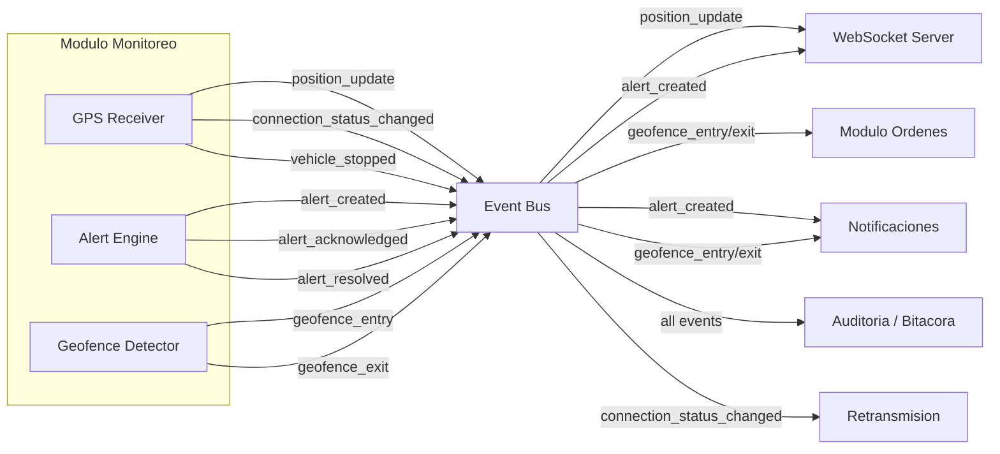

---

# 11. Reglas de Negocio Clave

| # | Regla | Descripcion |
|---|---|---|
| R-01 | Aislamiento multi-tenant | Todas las consultas filtran por `tenant_id` del JWT. Un usuario NUNCA puede ver vehiculos, alertas o eventos de otro tenant |
| R-02 | Retransmission status automatico | El estado de retransmision se calcula automaticamente: online (senal < 2 min), temporary_loss (2-15 min sin senal), disconnected (> 15 min). Los umbrales son configurables por regla de alerta |
| R-03 | MovementStatus derivado | `movementStatus` se determina por `speed`: speed > 0 = 'moving', speed = 0 = 'stopped'. No es una maquina de estados con transiciones manuales |
| R-04 | Alerta resolved es terminal | Una alerta en estado `resolved` no puede volver a `active` o `acknowledged`. Se crea una nueva alerta si la condicion se repite |
| R-05 | Reglas de alerta solo Owner/UM | Solo Owner y Usuario Maestro pueden crear, editar, eliminar o habilitar/deshabilitar reglas de alerta. El Subusuario solo puede ver y gestionar (acknowledge/resolve) las alertas generadas |
| R-06 | Ruta historica max 7 dias | La consulta de ruta historica tiene un rango maximo de 7 dias para evitar consultas excesivamente pesadas |
| R-07 | No fechas futuras en historico | El `endDateTime` de una consulta historica no puede ser posterior a `NOW()` |
| R-08 | Retencion de telemetria | Datos detallados de `vehicle_telemetry` se retienen por 90 dias. Datos agregados por 1 ano. Purga automatica via job programado |
| R-09 | Evento geocerca sin duplicados | No puede existir mas de un evento `entry` activo para la misma combinacion vehiculo + geocerca. Si el vehiculo ya esta "dentro", el sistema ignora nuevas detecciones de entrada |
| R-10 | Geocerca exit calcula duracion | Al registrar salida, `duration_minutes` se calcula como `exit_timestamp - entry_timestamp` en minutos. El evento entry se completa automaticamente |
| R-11 | Cancelar evento geocerca es administrativo | Solo Owner o Usuario Maestro pueden cancelar eventos de geocerca (T-12). El Subusuario no tiene acceso |
| R-12 | WebSocket heartbeat obligatorio | Si el servidor no recibe `ping` del cliente en 60 segundos, cierra la conexion. El cliente debe enviar ping cada 30 segundos |
| R-13 | Reconexion WebSocket con backoff | El cliente usa backoff exponencial para reconexion: delay = min(baseDelay * 2^attempts, maxDelay). Max 5 intentos |
| R-14 | Vehicle subscriptions por tenant | Un cliente WebSocket solo puede suscribirse a vehiculos de su propio tenant. El servidor valida ownership |
| R-15 | ETA dinamico | Se recalcula con cada actualizacion de posicion: distancia restante / velocidad promedio. `isDelayed = true` si estimatedArrival > planned ETA |
| R-16 | Exportacion formatos | Rutas historicas se exportan en 3 formatos: CSV (tabular), JSON (estructurado), GPX (estandar GPS). Todos incluyen opcionalmente estadisticas y eventos |
| R-17 | Auto-refresh retransmision | La vista de retransmision se actualiza automaticamente cada 10-15 segundos para reflejar cambios de conectividad |
| R-18 | Paneles multi-ventana max 20 | Un usuario puede tener maximo 20 paneles de vehiculos simultaneos. Layouts: 2x2, 3x3, 4x4, 5x4, auto |
| R-19 | Comentarios retransmision max 2000 chars | Los comentarios de retransmision tienen un limite de 2000 caracteres |
| R-20 | Alertas speed: umbrales tipicos | Umbral urbano: 60 km/h (warning), umbral carretera: 90 km/h (critical). Configurables por regla |
| R-21 | Alertas stop: umbral tipico | Umbral por defecto: 30 minutos detenido genera warning. Configurable por regla |
| R-22 | Generacion automatica de alertas | El motor de alertas evalua las reglas activas contra cada posicion GPS recibida. Si una condicion se cumple, genera una alerta automatica sin intervencion humana |
| R-23 | Geofence events vinculados a ordenes | Si al momento del evento existe una orden activa con un hito que tiene la misma `geofence_id`, el evento se vincula automaticamente (`was_expected = true`) |

---

# 12. Catalogo de Errores HTTP

| HTTP | Codigo interno | Cuando ocurre | Resolucion |
|---|---|---|---|
| 400 | VALIDATION_ERROR | Parametros de query invalidos (rango > 7 dias, formato incorrecto, campos faltantes) | Leer details: mapa {campo: mensaje} |
| 401 | UNAUTHORIZED | Token JWT ausente o expirado | Redirigir a /login |
| 403 | FORBIDDEN | Sin permisos para la operacion | Verificar rol del usuario y permisos asignados (ver seccion 13) |
| 404 | VEHICLE_NOT_FOUND | vehicleId no existe o no pertenece al tenant | Verificar UUID y tenant |
| 404 | ALERT_NOT_FOUND | Alerta con id no existe | Verificar UUID |
| 404 | RULE_NOT_FOUND | Regla de alerta con id no existe | Verificar UUID |
| 404 | RECORD_NOT_FOUND | Registro de retransmision con id no existe | Verificar UUID |
| 404 | GEOFENCE_NOT_FOUND | Geocerca no existe o no pertenece al tenant | Verificar UUID |
| 404 | NO_DATA_FOUND | No hay datos de telemetria para el rango especificado | Ampliar rango de fechas o verificar vehiculo |
| 409 | DUPLICATE_EVENT | Ya existe evento entry activo para vehiculo + geocerca | El vehiculo ya esta dentro de la geocerca |
| 422 | INVALID_ALERT_TRANSITION | Transicion de estado de alerta no permitida (ej: resolved -> acknowledged) | Verificar estado actual de la alerta |
| 500 | INTERNAL_ERROR | Error inesperado del servidor | Reintentar; si persiste, contactar soporte |
| 503 | WEBSOCKET_UNAVAILABLE | Servidor WebSocket no disponible | Reintentar conexion con backoff exponencial |

---

# 13. Permisos RBAC

**3 niveles jerarquicos (definicion de Edson). Arquitectura Multi-tenant con RBAC granular por modulo y por accion.**

```
Owner (Proveedor TMS)
   +-- Cuenta Cliente (Tenant)
           +-- Usuario Maestro
                   +-- Subusuarios
```

> **Modelo de 3 roles (definicion Edson):** Owner (Super Admin TMS), Usuario Maestro (Admin de cuenta cliente), Subusuario (Operador con permisos configurables).
> **Leyenda:** ✅ = Permitido | ⚙️ = Permitido si el Usuario Maestro le asigno el permiso | ❌ = Denegado

| Permiso | Owner | Usuario Maestro | Subusuario |
|---|:---:|:---:|:---:|
| monitoring:view | ✅ | ✅ | ⚙️ |
| monitoring:alerts_manage | ✅ | ✅ | ⚙️ |
| monitoring:alerts_config | ✅ | ✅ | ❌ |
| monitoring:historical_view | ✅ | ✅ | ⚙️ |
| monitoring:historical_export | ✅ | ✅ | ⚙️ |
| monitoring:retransmission_view | ✅ | ✅ | ⚙️ |
| monitoring:retransmission_edit | ✅ | ✅ | ⚙️ |
| monitoring:multi_window | ✅ | ✅ | ⚙️ |
| monitoring:geofence_events_view | ✅ | ✅ | ⚙️ |
| monitoring:geofence_events_cancel | ✅ | ✅ | ❌ |

> **Owner:** Rol maximo del sistema (proveedor TMS). Acceso total sin restricciones a todas las cuentas. Puede crear/suspender/eliminar cuentas de clientes, activar/desactivar modulos, crear Usuarios Maestros, resetear credenciales.
> **Usuario Maestro:** Administrador principal de una cuenta cliente. Control total SOLO dentro de su empresa. Crea subusuarios, asigna roles y permisos internos por modulo, asigna unidades, restringe visibilidad por grupo/flota/geocerca. NO puede crear cuentas, activar modulos no contratados, ni ver otras cuentas.
> **Subusuario:** Operador con permisos limitados definidos por el Usuario Maestro. NO puede crear usuarios, modificar estructura de permisos, activar/desactivar modulos, ni cambiar configuracion de la cuenta.
> **monitoring:alerts_config = siempre denegado para Subusuario:** Configurar reglas de alerta es accion administrativa exclusiva de Owner y Usuario Maestro. El Subusuario puede ver y gestionar alertas generadas (acknowledge/resolve) pero NO puede crear/editar/eliminar las reglas que las generan.
> **monitoring:geofence_events_cancel = siempre denegado para Subusuario:** Cancelar eventos de geocerca es accion administrativa que puede afectar el tracking de ordenes. Solo Owner y Usuario Maestro.
> **Multi-tenant:** Todos los queries filtran por `tenant_id` del JWT. Un Subusuario solo ve vehiculos, alertas y eventos del tenant al que pertenece.

### Restricciones del Subusuario

- **monitoring:alerts_config = siempre denegado:** Crear/editar/eliminar reglas de alerta compromete la configuracion de seguridad de la flota. Solo Owner y Usuario Maestro.
- **monitoring:geofence_events_cancel = siempre denegado:** Cancelar eventos de geocerca afecta la trazabilidad de ordenes y hitos. Solo Owner y Usuario Maestro.
- El Subusuario **NO puede**: crear usuarios, modificar estructura de permisos, activar/desactivar modulos, cambiar configuracion de la cuenta, acceder a datos de otros tenants.
- El Subusuario **SI puede** (si tiene el permiso asignado): ver la torre de control, conectarse al WebSocket, ver y gestionar alertas (acknowledge/resolve), consultar rutas historicas, exportar rutas, ver retransmision GPS, agregar comentarios de retransmision, usar multi-ventana, ver eventos de geocerca.

---

# 14. Diagrama de Componentes

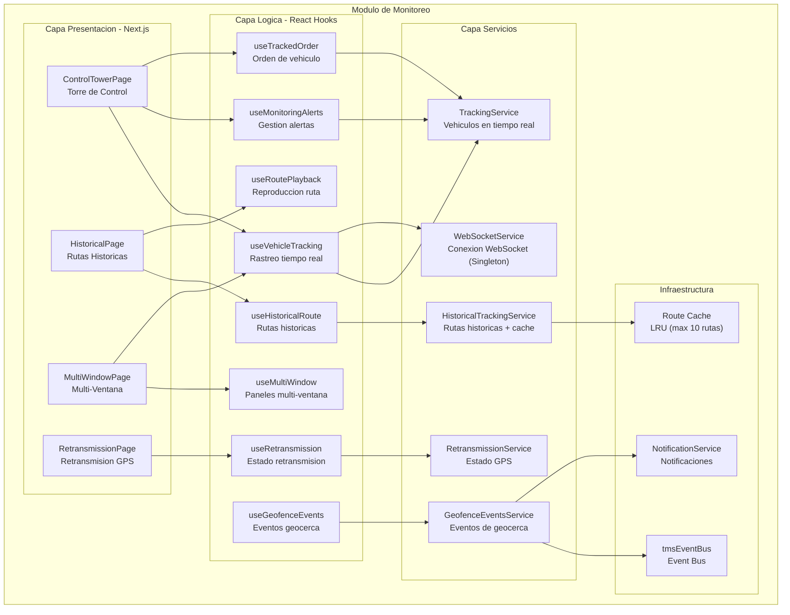

---

# 15. Diagrama de Despliegue

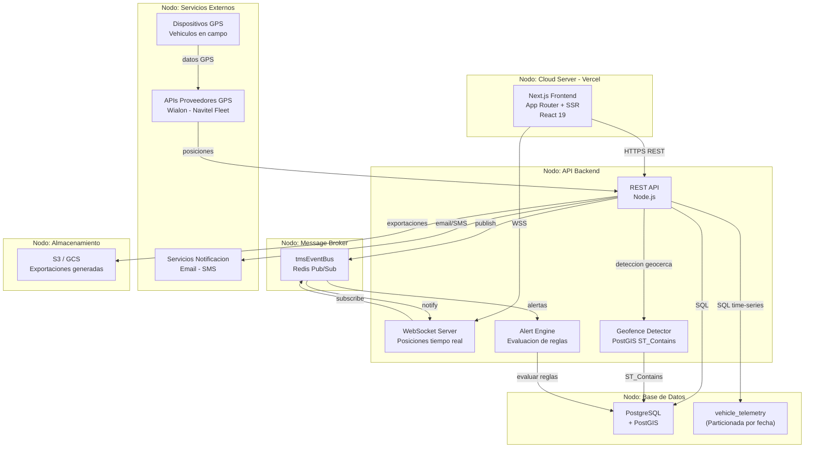

---

> **Nota:** Este documento es una referencia operativa para desarrollo frontend y backend. Incluye los 9 Casos de Uso con precondiciones, secuencia, postcondiciones y excepciones. Para detalles de implementacion frontend (componentes React, props, layouts, animaciones), consultar el codigo fuente del modulo en `src/app/(dashboard)/monitoring/`, `src/components/monitoring/`, `src/hooks/monitoring/`, y `src/services/monitoring/`.
