# Referencia Rapida — Modulo de Ordenes
## TMS Navitel · Cheat Sheet para Desarrollo

> **Basado en:** ORDERS_SYSTEM_DESIGN4.md (v4.0)
> **Fecha:** Febrero 2026
> **Proposito:** Consulta rapida para desarrolladores. Para detalle completo, ver el documento fuente.

---

## Indice

| # | Seccion |
|---|---------|
| 1 | [Contexto del Modulo](#1-contexto-del-modulo) |
| 2 | [Entidades del Dominio](#2-entidades-del-dominio) |
| 3 | [Modelo de Base de Datos — PostgreSQL](#3-modelo-de-base-de-datos--postgresql) |
| 4 | [Maquina de Estados — OrderStatus](#4-maquina-de-estados--orderstatus) |
| 5 | [Maquina de Estados — MilestoneStatus](#5-maquina-de-estados--milestonestatus) |
| 6 | [Maquina de Estados — OrderSyncStatus](#6-maquina-de-estados--ordersyncstatus) |
| 7 | [Tabla de Referencia Operativa de Transiciones](#7-tabla-de-referencia-operativa-de-transiciones) |
| 8 | [Casos de Uso — Referencia Backend](#8-casos-de-uso--referencia-backend) |
| 9 | [Endpoints API REST](#9-endpoints-api-rest) |
| 10 | [Eventos de Dominio](#10-eventos-de-dominio) |
| 11 | [Reglas de Negocio Clave](#11-reglas-de-negocio-clave) |
| 12 | [Catalogo de Errores HTTP](#12-catalogo-de-errores-http) |
| 13 | [Permisos RBAC](#13-permisos-rbac) |
| 14 | [Diagrama de Componentes](#14-diagrama-de-componentes) |
| 15 | [Diagrama de Despliegue](#15-diagrama-de-despliegue) |

---

# 1. Contexto del Modulo

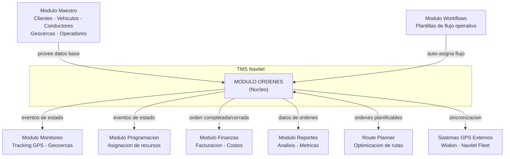

**Responsabilidades:** CRUD de ordenes, gestion de estados (9 estados, 18 transiciones), hitos de ruta, asignacion de recursos con deteccion de conflictos, cierre administrativo, sincronizacion GPS, importacion/exportacion masiva, eventos de dominio, conexion con workflows.

---

# 2. Entidades del Dominio

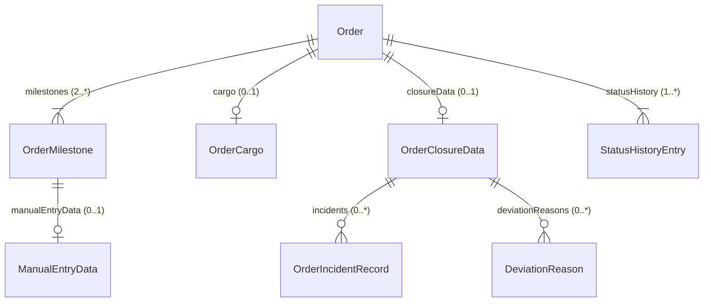

| Entidad | Tipo | Campos clave | Descripcion |
|---|---|---|---|
| **Order** | Raiz (aggregate root) | id, orderNumber, customerId, status, syncStatus, milestones, cargo, closureData, statusHistory | Entidad principal. Ciclo de vida completo de un servicio de transporte. |
| **OrderMilestone** | Sub-entidad | id, orderId, name, type, sequence, status, coordinates, geofenceId | Punto de control en la ruta (origen, waypoint, destino). Min 2 por orden. |
| **OrderCargo** | Value Object | type, description, weight, volume, quantity, declaredValue | Datos de la carga transportada. |
| **OrderClosureData** | Value Object | observations, incidents, deliveryPhotos, customerSignature, customerRating | Datos del cierre administrativo. Solo existe cuando status = closed. |
| **StatusHistoryEntry** | Sub-entidad | id, fromStatus, toStatus, changedAt, changedBy, reason | Registro inmutable de cada transicion de estado. |
| **OrderIncidentRecord** | Sub-entidad | id, incidentCatalogId, severity, freeDescription | Incidencia registrada durante el servicio. |
| **DeviationReason** | Value Object | type, description, impact | Motivo de desviacion respecto al plan original. |
| **ManualEntryData** | Value Object | entryType, reason, observation, evidence | Datos de registro manual de hito (sin GPS). |

### Campos clave de Order (resumen)

| Campo | Tipo | Obligatorio | Descripcion rapida |
|---|---|---|---|
| id | UUID | Si | PK, auto-generado |
| orderNumber | String | Si | Formato: `ORD-YYYY-NNNNN` (14 chars, 5 digitos), unico e inmutable |
| customerId | UUID FK | Si | Cliente que solicita el servicio |
| vehicleId | UUID FK | No | Vehiculo asignado (se asigna al transicionar a assigned) |
| driverId | UUID FK | No | Conductor asignado (junto con vehicleId) |
| serviceType | Enum | Si | 9 valores: distribucion, importacion, exportacion, minero, residuos, interprovincial, mudanza, courier, otro |
| priority | Enum | Si | low, normal, high, urgent |
| status | Enum | Si | 9 estados (ver seccion 4). Default: draft |
| syncStatus | Enum | Si | 6 estados: not_sent, pending, sending, sent, error, retry |
| completionPercentage | Integer | Si | 0-100, auto-calculado: (hitos_completed + hitos_skipped) / total x 100 |
| scheduledStartDate | DateTime | No | Debe ser anterior a scheduledEndDate |
| scheduledEndDate | DateTime | No | Fecha programada de fin |

---

# 3. Modelo de Base de Datos — PostgreSQL

> Esquema relacional para PostgreSQL + PostGIS. Todas las tablas usan `UUID` como PK y timestamps UTC.

### Diagrama Entidad-Relacion

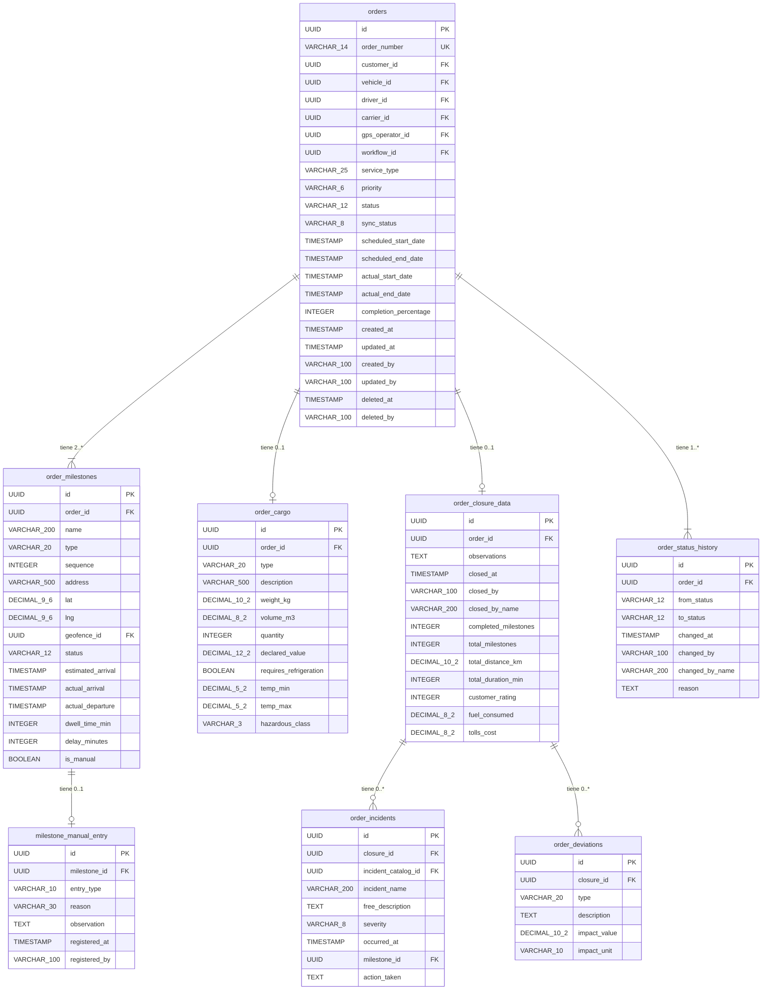

### Tablas, Columnas y Tipos de Dato

#### Tabla: `orders` (Entidad raiz)

> **Nota sobre `order_number`**: No se genera via DEFAULT de PostgreSQL. Lo genera la **capa de aplicacion** (servicio `OrderService.generateOrderNumber()`) con formato `ORD-YYYY-NNNNN` usando una tabla auxiliar `order_number_sequence` con lock `SELECT FOR UPDATE` para garantizar unicidad sin gaps. La columna tiene constraint `UNIQUE` como red de seguridad.
>
> ```sql
> -- Tabla auxiliar (fuera del schema de orders, compartida por el sistema)
> CREATE TABLE order_number_sequence (
>   year     INTEGER NOT NULL,
>   last_seq INTEGER NOT NULL DEFAULT 0,
>   PRIMARY KEY (year)
> );
> -- Uso: SELECT last_seq FROM order_number_sequence WHERE year = 2026 FOR UPDATE;
> --       UPDATE order_number_sequence SET last_seq = last_seq + 1 WHERE year = 2026;
> ```
>
> **Nota sobre `created_by` / `updated_by`**: Se almacena el claim `sub` del JWT como string (`VARCHAR(100)`). **No tiene FK a `users`** por diseno — permite auditar acciones incluso si el usuario es eliminado, y desacopla el modulo orders del modulo de autenticacion. Debe ser consistente con el campo `sub` del JWT en todo el sistema.
>
> **Nota sobre `metadata`**: PostgreSQL no tiene CHECK nativo para tamano de JSONB. Se usa `CHECK (octet_length(metadata::text) <= 10240)` como constraint de base de datos **mas** validacion en capa de aplicacion. El CHECK tiene costo marginal en writes pero protege contra abusos directos a BD.

| Columna | Tipo PostgreSQL | Nullable | Default | Constraint | Descripcion |
|---|---|---|---|---|---|
| id | `UUID` | NOT NULL | `gen_random_uuid()` | **PK** | Identificador unico |
| order_number | `VARCHAR(14)` | NOT NULL | — | **UNIQUE** | Formato ORD-YYYY-NNNNN. Generado por app (ver nota) |
| external_reference | `VARCHAR(100)` | NULL | — | — | Referencia del sistema externo |
| customer_id | `UUID` | NOT NULL | — | **FK** -> customers(id) | Cliente que solicita |
| customer_name | `VARCHAR(200)` | NOT NULL | — | — | Desnormalizado de customers |
| carrier_id | `UUID` | NULL | — | **FK** -> operators(id) | Transportista tercero |
| carrier_name | `VARCHAR(200)` | NULL | — | — | Desnormalizado |
| vehicle_id | `UUID` | NULL | — | **FK** -> vehicles(id) | Vehiculo asignado |
| vehicle_plate | `VARCHAR(8)` | NULL | — | — | Desnormalizado, formato ABC-1234 |
| driver_id | `UUID` | NULL | — | **FK** -> drivers(id) | Conductor asignado |
| driver_name | `VARCHAR(200)` | NULL | — | — | Desnormalizado |
| gps_operator_id | `UUID` | NULL | — | **FK** -> operators(id) | Operador GPS |
| gps_operator_name | `VARCHAR(200)` | NULL | — | — | Desnormalizado |
| service_type | `VARCHAR(25)` | NOT NULL | — | CHECK (9 valores) | distribucion, importacion, exportacion, minero, residuos, interprovincial, mudanza, courier, otro |
| priority | `VARCHAR(6)` | NOT NULL | `'normal'` | CHECK (4 valores) | low, normal, high, urgent |
| status | `VARCHAR(12)` | NOT NULL | `'draft'` | CHECK (9 valores) | draft, pending, assigned, in_transit, at_milestone, delayed, completed, closed, cancelled |
| sync_status | `VARCHAR(8)` | NOT NULL | `'not_sent'` | CHECK (6 valores) | not_sent, pending, sending, sent, error, retry |
| sync_error_message | `TEXT` | NULL | — | — | Mensaje de error GPS |
| last_sync_attempt | `TIMESTAMPTZ` | NULL | — | — | Ultimo intento de sync |
| workflow_id | `UUID` | NULL | — | **FK** -> workflows(id) | Workflow asignado |
| workflow_name | `VARCHAR(200)` | NULL | — | — | Desnormalizado |
| scheduled_start_date | `TIMESTAMPTZ` | NULL | — | CHECK (scheduled_start_date IS NULL OR scheduled_end_date IS NULL OR scheduled_start_date < scheduled_end_date) | Permite ambos NULL, uno NULL, o start < end |
| scheduled_end_date | `TIMESTAMPTZ` | NULL | — | CHECK (ver scheduled_start_date) | Fecha programada fin |
| actual_start_date | `TIMESTAMPTZ` | NULL | — | — | Se llena al pasar a in_transit |
| actual_end_date | `TIMESTAMPTZ` | NULL | — | — | Se llena al pasar a completed |
| estimated_distance | `DECIMAL(10,2)` | NULL | — | CHECK >= 0 | Distancia estimada (km) |
| actual_distance | `DECIMAL(10,2)` | NULL | — | CHECK >= 0 | Distancia real (km) |
| completion_percentage | `INTEGER` | NOT NULL | `0` | CHECK 0..100 | Auto-calculado |
| cancellation_reason | `TEXT` | NULL | — | CHECK (status != 'cancelled' OR cancellation_reason IS NOT NULL) | Obligatorio si status=cancelled |
| cancelled_at | `TIMESTAMPTZ` | NULL | — | — | Timestamp de cancelacion |
| cancelled_by | `VARCHAR(100)` | NULL | — | — | Usuario que cancelo |
| notes | `TEXT` | NULL | — | CHECK char_length <= 1000 | Notas generales |
| reference | `VARCHAR(200)` | NULL | — | — | Bill of Lading, guia, etc. |
| tags | `JSONB` | NOT NULL | `'[]'` | — | Array de strings |
| metadata | `JSONB` | NOT NULL | `'{}'` | CHECK octet_length <= 10240 | Campos custom extensibles (ver nota) |
| created_at | `TIMESTAMPTZ` | NOT NULL | `NOW()` | — | Inmutable |
| updated_at | `TIMESTAMPTZ` | NOT NULL | `NOW()` | — | Se actualiza en cada write via trigger |
| created_by | `VARCHAR(100)` | NOT NULL | — | — | JWT `sub` claim. Sin FK a users (ver nota) |
| updated_by | `VARCHAR(100)` | NOT NULL | — | — | JWT `sub` del ultimo usuario que modifico |
| deleted_at | `TIMESTAMPTZ` | NULL | — | — | Soft delete. NULL = activa. Solo se llena si status=draft al eliminar |
| deleted_by | `VARCHAR(100)` | NULL | — | — | Usuario que elimino (JWT `sub`) |

#### Tabla: `order_milestones` (Hitos de ruta)

| Columna | Tipo PostgreSQL | Nullable | Default | Constraint | Descripcion |
|---|---|---|---|---|---|
| id | `UUID` | NOT NULL | `gen_random_uuid()` | **PK** | ID del hito |
| order_id | `UUID` | NOT NULL | — | **FK** -> orders(id) ON DELETE CASCADE | Orden padre |
| name | `VARCHAR(200)` | NOT NULL | — | — | Nombre del punto |
| type | `VARCHAR(20)` | NOT NULL | — | CHECK: origin, waypoint, destination | Tipo de hito |
| sequence | `INTEGER` | NOT NULL | — | CHECK >= 1 | Posicion en ruta. origin=1, destination=ultimo |
| address | `VARCHAR(500)` | NOT NULL | — | — | Direccion legible |
| lat | `DECIMAL(9,6)` | NOT NULL | — | CHECK -90..90 | Latitud (WGS 84) |
| lng | `DECIMAL(9,6)` | NOT NULL | — | CHECK -180..180 | Longitud (WGS 84) |
| geofence_id | `UUID` | NULL | — | **FK** -> geofences(id) | Para deteccion GPS automatica |
| geofence_name | `VARCHAR(200)` | NULL | — | — | Desnormalizado |
| status | `VARCHAR(12)` | NOT NULL | `'pending'` | CHECK (7 valores) | pending, approaching, arrived, in_progress, completed, skipped, delayed |
| estimated_arrival | `TIMESTAMPTZ` | NULL | — | — | ETA |
| estimated_departure | `TIMESTAMPTZ` | NULL | — | — | Hora estimada salida |
| actual_arrival | `TIMESTAMPTZ` | NULL | — | — | Hora real de llegada |
| actual_departure | `TIMESTAMPTZ` | NULL | — | — | Hora real de salida |
| dwell_time_min | `INTEGER` | NULL | — | CHECK >= 0 | departure - arrival en minutos |
| delay_minutes | `INTEGER` | NULL | — | — | Positivo=retraso, negativo=adelanto |
| contact_name | `VARCHAR(200)` | NULL | — | — | Contacto en el punto |
| contact_phone | `VARCHAR(20)` | NULL | — | — | Telefono del contacto |
| notes | `TEXT` | NULL | — | — | Notas del hito |
| is_manual | `BOOLEAN` | NOT NULL | `false` | — | true si registro manual |
| UNIQUE | | | | (order_id, sequence) | No duplicar secuencia por orden |

#### Tabla: `order_cargo` (Datos de carga)

| Columna | Tipo PostgreSQL | Nullable | Default | Constraint | Descripcion |
|---|---|---|---|---|---|
| id | `UUID` | NOT NULL | `gen_random_uuid()` | **PK** | |
| order_id | `UUID` | NOT NULL | — | **FK** -> orders(id) ON DELETE CASCADE, **UNIQUE** | 1:1 con orders |
| type | `VARCHAR(20)` | NOT NULL | — | CHECK: general, perishable, hazardous, fragile, bulk, liquid, refrigerated | Tipo carga |
| description | `VARCHAR(500)` | NOT NULL | — | CHECK (char_length(description) >= 3) | Descripcion de mercancia |
| weight_kg | `DECIMAL(10,2)` | NOT NULL | — | CHECK 0.01..100000 | Peso en kg |
| volume_m3 | `DECIMAL(8,2)` | NULL | — | CHECK 0.01..1000 | Volumen metros cubicos |
| quantity | `INTEGER` | NOT NULL | — | CHECK 1..99999 | Cantidad de bultos |
| declared_value | `DECIMAL(12,2)` | NULL | — | CHECK >= 0 | Valor declarado USD |
| requires_refrigeration | `BOOLEAN` | NOT NULL | `false` | — | Necesita cadena de frio |
| temp_min | `DECIMAL(5,2)` | NULL | — | CHECK (requires_refrigeration = false OR temp_min IS NOT NULL) | Obligatorio si requires_refrigeration |
| temp_max | `DECIMAL(5,2)` | NULL | — | CHECK (requires_refrigeration = false OR temp_max IS NOT NULL), CHECK (temp_min IS NULL OR temp_max IS NULL OR temp_min < temp_max) | Obligatorio si requires_refrigeration |
| hazardous_class | `VARCHAR(3)` | NULL | — | CHECK (type != 'hazardous' OR hazardous_class IS NOT NULL), CHECK 1..9 | Obligatorio si type=hazardous |
| special_instructions | `TEXT` | NULL | — | CHECK char_length <= 2000 | Instrucciones de manejo |

#### Tabla: `order_closure_data` (Cierre administrativo)

| Columna | Tipo PostgreSQL | Nullable | Default | Constraint | Descripcion |
|---|---|---|---|---|---|
| id | `UUID` | NOT NULL | `gen_random_uuid()` | **PK** | |
| order_id | `UUID` | NOT NULL | — | **FK** -> orders(id), **UNIQUE** | 1:1 con orders |
| observations | `TEXT` | NOT NULL | — | CHECK (char_length(observations) BETWEEN 1 AND 5000) | Obligatorio |
| closed_at | `TIMESTAMPTZ` | NOT NULL | `NOW()` | — | Generado por backend |
| closed_by | `VARCHAR(100)` | NOT NULL | — | — | ID del usuario |
| closed_by_name | `VARCHAR(200)` | NOT NULL | — | — | Nombre del usuario |
| completed_milestones | `INTEGER` | NOT NULL | — | CHECK >= 0 | Calculado por backend |
| total_milestones | `INTEGER` | NOT NULL | — | CHECK >= 2 | Calculado por backend |
| total_distance_km | `DECIMAL(10,2)` | NOT NULL | — | CHECK >= 0 | Distancia recorrida |
| total_duration_min | `INTEGER` | NOT NULL | — | CHECK >= 0 | Duracion en minutos |
| customer_signature | `TEXT` | NULL | — | CHECK (customer_signature IS NULL OR octet_length(customer_signature) <= 512000) | Firma digital base64 (max 500KB) |
| delivery_photos | `JSONB` | NOT NULL | `'[]'` | CHECK jsonb_array_length <= 20 | Array de URLs de fotos |
| customer_rating | `INTEGER` | NULL | — | CHECK 1..5 | Escala Likert |
| fuel_consumed | `DECIMAL(8,2)` | NULL | — | CHECK >= 0 | Litros |
| tolls_cost | `DECIMAL(8,2)` | NULL | — | CHECK >= 0 | USD |
| attachments | `JSONB` | NOT NULL | `'[]'` | CHECK jsonb_array_length <= 50 | Documentos adjuntos |

#### Tabla: `order_status_history` (Historial de transiciones — inmutable)

| Columna | Tipo PostgreSQL | Nullable | Default | Constraint | Descripcion |
|---|---|---|---|---|---|
| id | `UUID` | NOT NULL | `gen_random_uuid()` | **PK** | |
| order_id | `UUID` | NOT NULL | — | **FK** -> orders(id) ON DELETE CASCADE | Orden padre |
| from_status | `VARCHAR(12)` | NULL | — | CHECK (from_status IS NULL OR from_status IN ('draft','pending','assigned','in_transit','at_milestone','delayed','completed','closed','cancelled')) | Estado origen. NULL = entrada inicial (creacion) |
| to_status | `VARCHAR(12)` | NOT NULL | — | CHECK (9 valores) | Estado destino |
| changed_at | `TIMESTAMPTZ` | NOT NULL | `NOW()` | — | Timestamp del cambio |
| changed_by | `VARCHAR(100)` | NOT NULL | — | — | ID del usuario/sistema |
| changed_by_name | `VARCHAR(200)` | NOT NULL | — | — | Nombre legible |
| reason | `TEXT` | NULL | — | CHECK char_length <= 1000 | Motivo (obligatorio para cancelled, via trigger) |

#### Tabla: `order_incidents` (Incidencias del cierre)

| Columna | Tipo PostgreSQL | Nullable | Default | Constraint | Descripcion |
|---|---|---|---|---|---|
| id | `UUID` | NOT NULL | `gen_random_uuid()` | **PK** | |
| closure_id | `UUID` | NOT NULL | — | **FK** -> order_closure_data(id) ON DELETE CASCADE | Cierre padre |
| incident_catalog_id | `UUID` | NULL | — | **FK** -> incident_catalog(id) | Si null = incidencia libre |
| incident_name | `VARCHAR(200)` | NOT NULL | — | — | Nombre descriptivo |
| free_description | `TEXT` | NOT NULL | — | CHECK (char_length(free_description) >= 1) | Descripcion detallada |
| severity | `VARCHAR(8)` | NOT NULL | — | CHECK: low, medium, high, critical | Severidad |
| occurred_at | `TIMESTAMPTZ` | NOT NULL | — | — | Cuando ocurrio |
| milestone_id | `UUID` | NULL | — | **FK** -> order_milestones(id) | Donde ocurrio (null = en transito) |
| action_taken | `TEXT` | NULL | — | — | Accion correctiva |
| evidence | `JSONB` | NOT NULL | `'[]'` | CHECK jsonb_array_length <= 10 | Fotos/documentos |

#### Tabla: `order_deviations` (Desviaciones del cierre)

| Columna | Tipo PostgreSQL | Nullable | Default | Constraint | Descripcion |
|---|---|---|---|---|---|
| id | `UUID` | NOT NULL | `gen_random_uuid()` | **PK** | |
| closure_id | `UUID` | NOT NULL | — | **FK** -> order_closure_data(id) ON DELETE CASCADE | Cierre padre |
| type | `VARCHAR(20)` | NOT NULL | — | CHECK: route, time, cargo, other | Tipo desviacion |
| description | `TEXT` | NOT NULL | — | CHECK (char_length(description) >= 1) | Descripcion |
| impact_value | `DECIMAL(10,2)` | NOT NULL | — | CHECK > 0 | Cuantificacion |
| impact_unit | `VARCHAR(10)` | NOT NULL | — | CHECK: minutes, hours, kilometers | Unidad del impacto |
| documentation | `TEXT` | NULL | — | — | Referencia documental |

#### Tabla: `milestone_manual_entry` (Registro manual de hito)

| Columna | Tipo PostgreSQL | Nullable | Default | Constraint | Descripcion |
|---|---|---|---|---|---|
| id | `UUID` | NOT NULL | `gen_random_uuid()` | **PK** | |
| milestone_id | `UUID` | NOT NULL | — | **FK** -> order_milestones(id) ON DELETE CASCADE | Hito padre |
| entry_type | `VARCHAR(10)` | NOT NULL | — | CHECK: arrival, departure | Tipo de registro |
| UNIQUE | | | | (milestone_id, entry_type) | Permite 1 arrival + 1 departure por hito |
| reason | `VARCHAR(30)` | NOT NULL | — | CHECK: gps_failure, no_signal, geofence_error, manual_override, other | Motivo |
| observation | `TEXT` | NULL | — | — | Detalle adicional |
| registered_at | `TIMESTAMPTZ` | NOT NULL | `NOW()` | — | Cuando se registro |
| registered_by | `VARCHAR(100)` | NOT NULL | — | — | ID del operador |
| registered_by_name | `VARCHAR(200)` | NOT NULL | — | — | Nombre del operador |
| evidence_urls | `JSONB` | NOT NULL | `'[]'` | CHECK jsonb_array_length <= 10 | Evidencias adjuntas |

### Indices Recomendados

| Tabla | Indice | Columnas | Tipo | Justificacion |
|---|---|---|---|---|
| orders | idx_orders_status | status | B-tree | Filtro principal en listado. **Parcial:** `WHERE deleted_at IS NULL` |
| orders | idx_orders_customer | customer_id | B-tree | FK mas consultada. **Parcial:** `WHERE deleted_at IS NULL` |
| orders | idx_orders_vehicle | vehicle_id | B-tree | Deteccion de conflictos. **Parcial:** `WHERE deleted_at IS NULL` |
| orders | idx_orders_driver | driver_id | B-tree | Deteccion de conflictos. **Parcial:** `WHERE deleted_at IS NULL` |
| orders | idx_orders_dates | scheduled_start_date, scheduled_end_date | B-tree | Filtro por rango de fechas. **Parcial:** `WHERE deleted_at IS NULL` |
| orders | idx_orders_created | created_at DESC | B-tree | Ordenamiento por defecto. **Parcial:** `WHERE deleted_at IS NULL` |
| orders | idx_orders_number | order_number | B-tree UNIQUE | Busqueda por numero |
| orders | idx_search_number | order_number | GIN (gin_trgm_ops) | Busqueda por numero de orden |
| orders | idx_search_customer | customer_name | GIN (gin_trgm_ops) | Busqueda por nombre de cliente |
| orders | idx_search_extref | external_reference | GIN (gin_trgm_ops) | Busqueda por referencia externa |
| order_milestones | idx_milestones_order | order_id, sequence | B-tree UNIQUE | Lookup + orden secuencial |
| order_milestones | idx_milestones_geofence | geofence_id | B-tree | Deteccion GPS de geocerca |
| order_status_history | idx_history_order | order_id, changed_at DESC | B-tree | Timeline de transiciones |
| order_closure_data | idx_closure_order | order_id | B-tree UNIQUE | 1:1 lookup rapido |
| orders | idx_orders_sync | sync_status | B-tree | Job de re-envio GPS (filtra pending/retry/error). **Parcial:** `WHERE deleted_at IS NULL` |

### Relaciones con Tablas de Otros Modulos (FK externas)

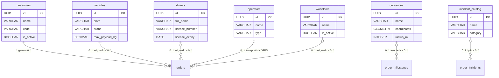

---

# 4. Maquina de Estados — OrderStatus

**9 estados, 18 transiciones, 2 estados terminales (closed, cancelled)**

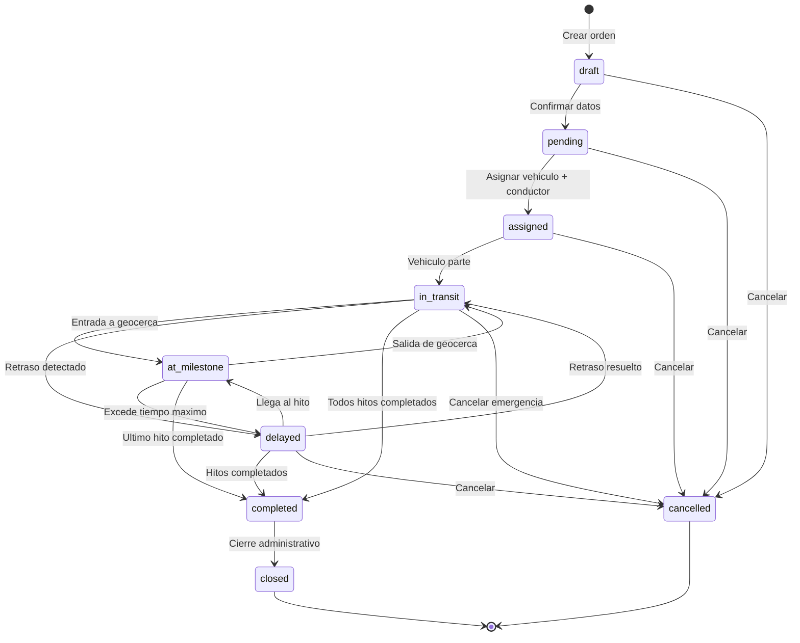

### Tabla de estados con colores

| # | Estado | Etiqueta | Color | Icono | Terminal | Transiciones de salida |
|---|---|---|---|---|---|---|
| 1 | draft | Borrador | #6B7280 gris | FileEdit | No | pending, cancelled |
| 2 | pending | Pendiente | #F59E0B ambar | Clock | No | assigned, cancelled |
| 3 | assigned | Asignada | #3B82F6 azul | UserCheck | No | in_transit, cancelled |
| 4 | in_transit | En Transito | #8B5CF6 violeta | Truck | No | at_milestone, delayed, completed, cancelled |
| 5 | at_milestone | En Hito | #06B6D4 cian | MapPin | No | in_transit, delayed, completed |
| 6 | delayed | Retrasado | #EF4444 rojo | AlertTriangle | No | in_transit, at_milestone, completed, cancelled |
| 7 | completed | Completada | #10B981 verde | CheckCircle | No* | closed |
| 8 | closed | Cerrada | #1F2937 gris oscuro | Lock | Si | ninguna |
| 9 | cancelled | Cancelada | #DC2626 rojo oscuro | XCircle | Si | ninguna |

---

# 5. Maquina de Estados — MilestoneStatus

**7 estados para hitos de ruta**

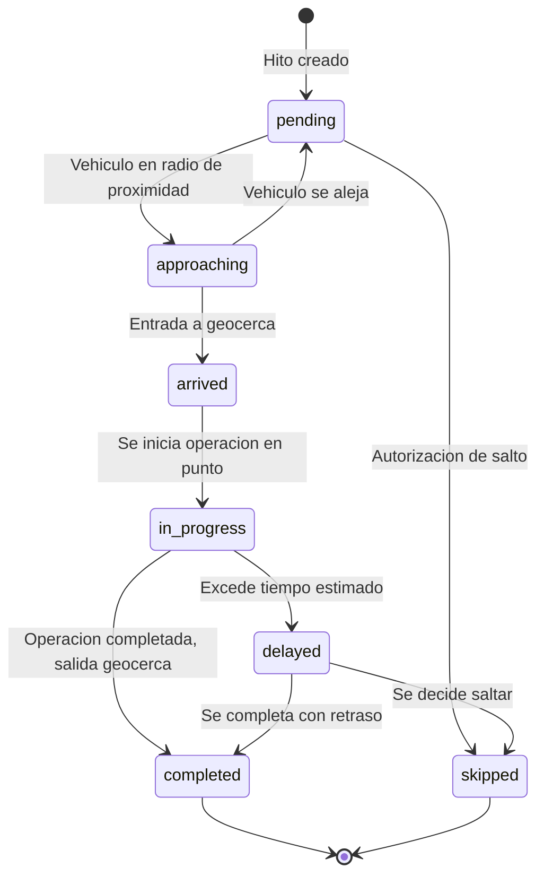

---

# 6. Maquina de Estados — OrderSyncStatus

**6 estados para sincronizacion GPS**

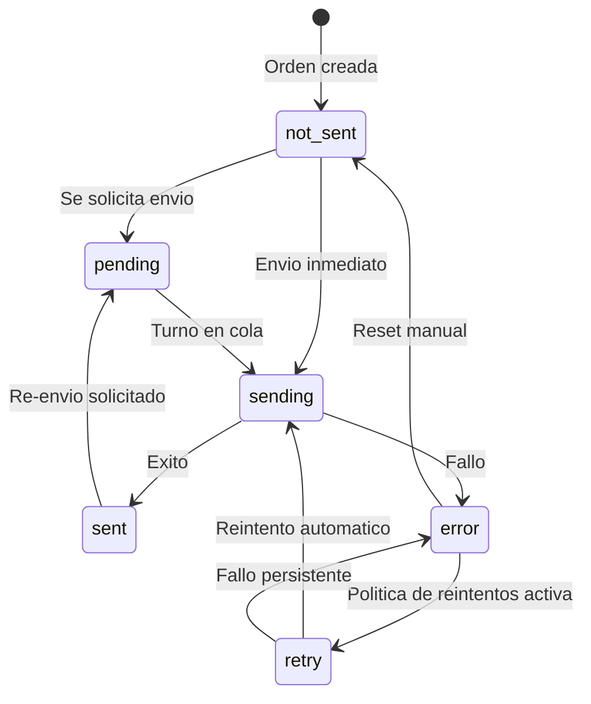

---

# 7. Tabla de Referencia Operativa de Transiciones

> Tabla unificada que cruza: estado origen/destino, endpoint, payload, validaciones, actor, evento emitido e idempotencia.

| # | From | To | Endpoint | Payload | Validaciones | Actor | Evento | Idempotente |
|---|---|---|---|---|---|---|---|---|
| T-01 | draft | pending | PATCH /:id/status | `{ status: "pending" }` | customerId != null, milestones >= 2 (1 origin + 1 destination) | Owner / Usuario Maestro / Subusuario (orders:edit) | order.status_changed | Si |
| T-02 | draft | cancelled | PATCH /:id/status | `{ status: "cancelled", reason: "..." }` | reason.length >= 1 | Owner / Usuario Maestro / Subusuario (orders:cancel) | order.status_changed, order.cancelled | Si |
| T-03 | pending | assigned | PATCH /:id/status | `{ status: "assigned", vehicleId: "...", driverId: "..." }` | vehicleId != null, driverId != null, sin conflicto de horario, licencia vigente | Owner / Usuario Maestro / Subusuario (orders:edit) | order.status_changed, order.assigned | Si |
| T-04 | pending | cancelled | PATCH /:id/status | `{ status: "cancelled", reason: "..." }` | reason.length >= 1 | Owner / Usuario Maestro / Subusuario (orders:cancel) | order.status_changed, order.cancelled | Si |
| T-05 | assigned | in_transit | PATCH /:id/status | `{ status: "in_transit" }` | vehicleId != null AND driverId != null (ya asignados) | Owner / Usuario Maestro / Subusuario (orders:edit) / Sistema GPS | order.status_changed | Si |
| T-06 | assigned | cancelled | PATCH /:id/status | `{ status: "cancelled", reason: "..." }` | reason.length >= 1; libera vehiculo y conductor | Owner / Usuario Maestro / Subusuario (orders:cancel) | order.status_changed, order.cancelled | Si |
| T-07 | in_transit | at_milestone | PATCH /:id/status | `{ status: "at_milestone" }` | Vehiculo dentro de geocerca de un hito pendiente | Sistema GPS / Subusuario (milestones:manual_entry) | order.status_changed, order.milestone_updated | Si |
| T-08 | in_transit | delayed | PATCH /:id/status | `{ status: "delayed" }` | delayMinutes > umbral (default: 30 min) | Sistema GPS | order.status_changed | Si |
| T-09 | in_transit | completed | AUTO | none | Todos los milestones en status completed o skipped | Sistema (automatico) | order.status_changed, order.completed | Si |
| T-10 | in_transit | cancelled | PATCH /:id/status | `{ status: "cancelled", reason: "..." }` | reason.length >= 1; cancelacion de emergencia | Owner / Usuario Maestro | order.status_changed, order.cancelled | Si |
| T-11 | at_milestone | in_transit | PATCH /:id/status | `{ status: "in_transit" }` | Vehiculo sale de la geocerca del hito | Sistema GPS / Subusuario (milestones:manual_entry) | order.status_changed, order.milestone_updated | Si |
| T-12 | at_milestone | delayed | PATCH /:id/status | `{ status: "delayed" }` | Excede maxDurationMinutes del workflow step | Sistema | order.status_changed | Si |
| T-13 | at_milestone | completed | AUTO | none | Era el ultimo hito y se marca completado | Sistema (automatico) | order.status_changed, order.completed | Si |
| T-14 | delayed | in_transit | PATCH /:id/status | `{ status: "in_transit" }` | El retraso se resuelve, vehiculo continua | Sistema GPS | order.status_changed | Si |
| T-15 | delayed | at_milestone | PATCH /:id/status | `{ status: "at_milestone" }` | Llega al hito aunque retrasado | Sistema GPS | order.status_changed, order.milestone_updated | Si |
| T-16 | delayed | completed | AUTO | none | Todos los milestones completados o skipped | Sistema | order.status_changed, order.completed | Si |
| T-17 | delayed | cancelled | PATCH /:id/status | `{ status: "cancelled", reason: "..." }` | reason.length >= 1 | Owner / Usuario Maestro | order.status_changed, order.cancelled | Si |
| T-18 | completed | closed | POST /:id/close | `OrderClosureDTO { observations, incidents[], deliveryPhotos[], customerSignature, customerRating }` | closureData == null (aun no existe), status == completed, todos los hitos completed/skipped | Owner / Usuario Maestro / Subusuario (orders:close) | order.status_changed, order.closed | Si |

### Diagrama de flujo de transiciones con endpoints

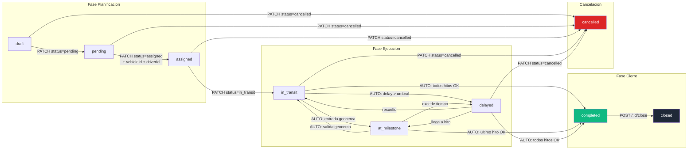

---

# 8. Casos de Uso — Referencia Backend

> **7 Casos de Uso UML** con precondiciones, flujo principal, excepciones y postcondiciones. Cada CU indica quien ejecuta, que endpoint consume, que debe validar el backend y que debe devolver.

### Matriz Actor x Caso de Uso

> **Leyenda:** ✅ = Permitido | ❌ = Denegado | � = Solo lectura/export
> **Nota:** Los permisos del Subusuario son **configurables** por el Usuario Maestro. Los permisos entre parentesis indican el permiso especifico que debe tener habilitado.

| Caso de Uso | Owner | Usuario Maestro | Subusuario | Sistema GPS | Motor Workflows |
|---|:---:|:---:|:---:|:---:|:---:|
| **CU-01** Crear Orden | ✅ | ✅ | ✅ (orders:create) | — | Auto-asigna |
| **CU-02** Transicionar Estado | ✅ | ✅ | ✅ (orders:edit) | ✅ (auto) | — |
| **CU-03** Cierre Administrativo | ✅ | ✅ | ✅ (orders:close) | — | — |
| **CU-04** Cancelar Orden | ✅ | ✅ | ✅* (orders:cancel) | — | — |
| **CU-05** Enviar a GPS | ✅ | ✅ | ✅ (orders:sync_gps) | — | — |
| **CU-06** Importar/Exportar Excel | ✅ | ✅ | ✅ (orders:import / orders:export) | — | — |
| **CU-07** Registro Manual de Hito | ✅ | ✅ | ✅ (milestones:manual_entry) | — | — |

> **\*Restriccion CU-04:** Subusuario puede cancelar ordenes en `draft`, `pending`, `assigned`. Para cancelar desde `in_transit` o `delayed` se requiere `Owner` o `Usuario Maestro`.
> **Subusuario:** Los permisos son asignados por el Usuario Maestro. Sin el permiso correspondiente, el Subusuario no tiene acceso al caso de uso.

---

## CU-01: Crear Orden de Transporte

| Atributo | Valor |
|---|---|
| **Endpoint** | `POST /api/v1/orders` |
| **Actor Principal** | Owner / Usuario Maestro / Subusuario (permiso `orders:create`) |
| **Actor Secundario** | Motor de Workflows (auto-asigna), Validacion Zod |
| **Trigger** | El operador envia `CreateOrderDTO` al backend |
| **Frecuencia** | 10-50 veces/dia |

**Precondiciones (backend DEBE validar)**

| # | Precondicion | Si no se cumple |
|---|---|---|
| PRE-01 | Token JWT valido y no expirado | HTTP `401 UNAUTHORIZED` |
| PRE-02 | Usuario tiene permiso `orders:create` | HTTP `403 FORBIDDEN` |
| PRE-03 | `customerId` existe y esta activo en BD | HTTP `404 CUSTOMER_NOT_FOUND` |
| PRE-04 | Milestones >= 2, con exactamente 1 `type=origin` (seq=1) y 1 `type=destination` (seq=ultimo) | HTTP `400 VALIDATION_ERROR` |
| PRE-05 | `scheduledStartDate < scheduledEndDate` | HTTP `400 VALIDATION_ERROR` |
| PRE-06 | `cargo.weight` en rango 0.01 - 100,000 kg | HTTP `400 VALIDATION_ERROR` |
| PRE-07 | Si `cargo.type=hazardous` entonces `hazardousClass` obligatorio | HTTP `400 VALIDATION_ERROR` |
| PRE-08 | Si `requiresRefrigeration=true` entonces `temperatureRange.min` y `.max` obligatorios | HTTP `400 VALIDATION_ERROR` |
| PRE-09 | Si se asigna `vehicleId`/`driverId`, verificar conflicto de horario | HTTP `409 VEHICLE_CONFLICT` / `DRIVER_CONFLICT` |

**Secuencia Backend (flujo principal)**

| Paso | Accion del backend | Detalle |
|---|---|---|
| 1 | Validar DTO completo con `createOrderSchema` (Zod) | Validar todos los campos del request body |
| 2 | Verificar que `customerId` existe y esta activo | `SELECT * FROM customers WHERE id = :customerId AND status = 'active'` |
| 3 | Si se envian `vehicleId`/`driverId`, verificar conflictos | Buscar ordenes activas del vehiculo/conductor en rango de fechas |
| 4 | Generar `id` (UUID v4) | Auto-generado |
| 5 | Generar `orderNumber` con formato `ORD-YYYY-NNNNN` | Secuencial unico (5 digitos), inmutable. Ej: `ORD-2026-00142` |
| 6 | Establecer `status = "draft"`, `syncStatus = "not_sent"`, `completionPercentage = 0` | Valores iniciales fijos |
| 7 | Crear milestones con `status = "pending"` y secuencias consecutivas | origin=1, waypoints consecutivos, destination=ultimo |
| 8 | Crear `StatusHistoryEntry` inicial | `{ fromStatus: null, toStatus: "draft", reason: "Orden creada", changedBy: currentUser }` |
| 9 | Buscar workflow compatible por `serviceType` + `cargo.type` | Si existe, asignar `workflowId`. Si no, `workflowId = null` |
| 10 | Persistir en BD (INSERT order + milestones + history) | Transaccion atomica |
| 11 | Emitir evento `order.created` via Event Bus | Payload: `{ orderId, orderNumber, customerId, serviceType, priority, createdBy }` |
| 12 | Retornar HTTP `201 Created` con la orden completa | Incluir milestones, cargo, statusHistory |

**Postcondiciones (backend DEBE garantizar)**

| # | Postcondicion | Verificacion |
|---|---|---|
| POST-01 | Orden existe en BD con `id` UUID y `orderNumber` unico | `GET /orders/:id` retorna 200 |
| POST-02 | `status = "draft"`, `syncStatus = "not_sent"`, `completionPercentage = 0` | Campos en response |
| POST-03 | Milestones tienen `status = "pending"` y `sequence` secuencial | Verificar array |
| POST-04 | `statusHistory` tiene 1 entrada inicial (`null -> draft`) | `statusHistory.length === 1` |
| POST-05 | Evento `order.created` publicado en Event Bus | Log de auditoria |
| POST-06 | `createdAt` y `updatedAt` con timestamp UTC (ISO 8601) | Formato con sufijo Z |

**Excepciones**

| HTTP | Codigo | Cuando | Respuesta |
|---|---|---|---|
| `400` | VALIDATION_ERROR | Campos invalidos | `{ error: { code, message, details: { campo: "mensaje" } } }` |
| `404` | CUSTOMER_NOT_FOUND | Cliente no existe o inactivo | `{ error: { code, message } }` |
| `409` | VEHICLE_CONFLICT | Vehiculo con conflicto de horario | `{ error: { code, message, details: { conflictingOrder, dates } } }` |
| `409` | DRIVER_CONFLICT | Conductor con conflicto | Mismo formato que VEHICLE_CONFLICT |

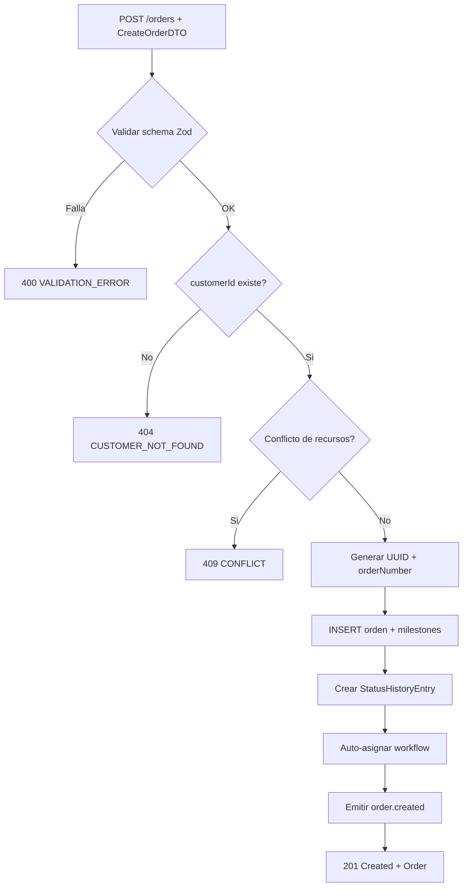

---

## CU-02: Transicionar Estado de Orden

| Atributo | Valor |
|---|---|
| **Endpoint** | `PATCH /api/v1/orders/:id/status` |
| **Actor Principal** | Owner / Usuario Maestro / Subusuario (permiso `orders:edit`) / Sistema GPS (automatico) |
| **Trigger** | Solicitud de cambio de estado manual o evento GPS |
| **Frecuencia** | 50-200 veces/dia |

**Precondiciones**

| # | Precondicion | Si no se cumple |
|---|---|---|
| PRE-01 | Orden con `id` existe en BD | HTTP `404 ORDER_NOT_FOUND` |
| PRE-02 | Usuario tiene permiso `orders:edit` | HTTP `403 FORBIDDEN` |
| PRE-03 | Transicion `currentStatus -> newStatus` esta en tabla de transiciones validas (seccion 7) | HTTP `422 INVALID_STATE_TRANSITION` con `validTransitions[]` |
| PRE-04 | Precondiciones especificas de la transicion se cumplen | HTTP `422 PRECONDITION_FAILED` con `missingConditions[]` |

**Precondiciones especificas por transicion**

| Transicion | Validacion extra |
|---|---|
| pending -> assigned | `vehicleId != null AND driverId != null`, sin conflicto horario, licencia vigente |
| assigned -> in_transit | `vehicleId AND driverId` ya asignados (no null) |
| in_transit -> at_milestone | Vehiculo dentro de geocerca de un hito pendiente |
| in_transit -> delayed | `delayMinutes > 30` (umbral configurable) |
| in_transit/at_milestone/delayed -> completed | TODOS los milestones en `completed` o `skipped` |
| * -> cancelled | `reason.length >= 1` (motivo obligatorio) |
| in_transit -> cancelled | Solo Owner o Usuario Maestro (cancelacion de emergencia) |

**Secuencia Backend**

| Paso | Accion | Detalle |
|---|---|---|
| 1 | Buscar orden por `id` | Si no existe -> 404 |
| 2 | Validar `currentStatus -> newStatus` en tabla de transiciones | Si no es valida -> 422 INVALID_STATE_TRANSITION |
| 3 | Verificar precondiciones especificas | Si fallan -> 422 PRECONDITION_FAILED |
| 4 | Actualizar `status = newStatus`, `updatedAt = NOW()` | UPDATE en BD |
| 5 | Si `newStatus = "in_transit"`: registrar `actualStartDate = NOW()` | Campo de fecha real de inicio |
| 6 | Si `newStatus = "completed"`: registrar `actualEndDate = NOW()` | Campo de fecha real de fin |
| 7 | Si `newStatus = "cancelled"`: registrar `cancelledAt`, `cancelledBy`, `cancellationReason` | Liberar vehiculo/conductor |
| 8 | Crear `StatusHistoryEntry` | `{ fromStatus, toStatus, changedAt: NOW(), changedBy, reason }` |
| 9 | Recalcular `completionPercentage` | `(hitos_completed + skipped) / total * 100` |
| 10 | Emitir `order.status_changed` | Siempre |
| 11 | Si completed: emitir tambien `order.completed` | Evento adicional |
| 12 | Si cancelled: emitir tambien `order.cancelled` | Evento adicional |
| 13 | Retornar HTTP `200 OK` con orden actualizada | Incluir statusHistory nuevo |

**Postcondiciones**

| # | Postcondicion |
|---|---|
| POST-01 | `order.status === newStatus` |
| POST-02 | `statusHistory` tiene nuevo registro con la transicion |
| POST-03 | `completionPercentage` recalculado |
| POST-04 | Evento `order.status_changed` publicado |
| POST-05 | Si cancelled: recursos liberados, `cancellationReason` registrado |

**Excepciones**

| HTTP | Codigo | Cuando |
|---|---|---|
| `404` | ORDER_NOT_FOUND | Orden no existe |
| `422` | INVALID_STATE_TRANSITION | Transicion no permitida. Respuesta incluye `validTransitions[]` |
| `422` | PRECONDITION_FAILED | Transicion valida pero faltan precondiciones. Respuesta incluye `missingConditions[]` |
| `409` | VEHICLE_CONFLICT | Conflicto de horario al asignar |
| `409` | DRIVER_CONFLICT | Conflicto de conductor al asignar |

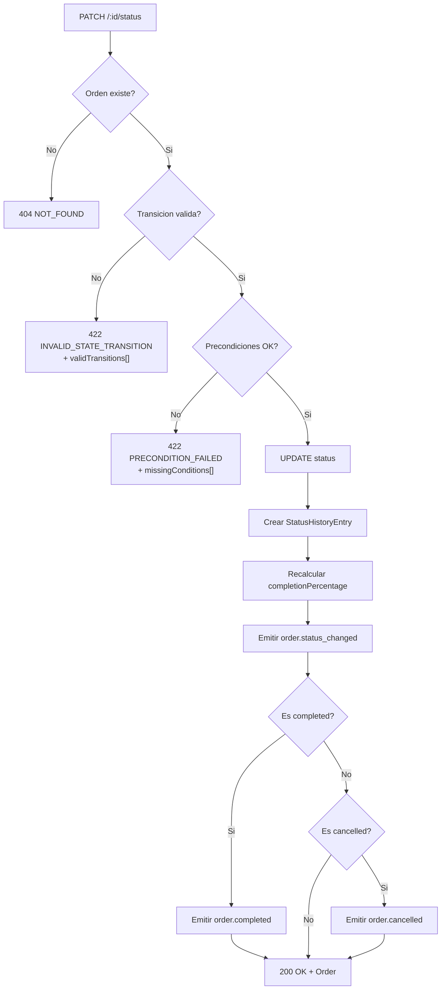

---

## CU-03: Cierre Administrativo de Orden

| Atributo | Valor |
|---|---|
| **Endpoint** | `POST /api/v1/orders/:id/close` |
| **Actor Principal** | Owner / Usuario Maestro / Subusuario (permiso `orders:close`) |
| **Trigger** | Supervisor o despachador envia `OrderClosureDTO` para cerrar orden completada |
| **Frecuencia** | 5-20 veces/dia |

**Precondiciones**

| # | Precondicion | Si no se cumple |
|---|---|---|
| PRE-01 | `order.status === "completed"` | HTTP `422 CANNOT_CLOSE_ORDER` |
| PRE-02 | TODOS los milestones en `completed` o `skipped` | HTTP `422 CANNOT_CLOSE_ORDER` con `pendingMilestones[]` |
| PRE-03 | `order.closureData === null` (no cerrada previamente) | HTTP `422`: "La orden ya fue cerrada" |
| PRE-04 | Usuario tiene permiso `orders:close` | HTTP `403 FORBIDDEN` |

**Request Body — OrderClosureDTO**

| Campo | Tipo | Obligatorio | Validacion |
|---|---|---|---|
| observations | string | **Si** | min 1 char, max 5000 chars |
| incidents | array | No | Cada uno: { incidentCatalogId, severity, freeDescription } |
| deviationReasons | array | No | Cada uno: { type, description, impact } |
| deliveryPhotos | string[] | No | JPG/PNG base64, max 2MB c/u, max 20 |
| customerSignature | string | No | PNG base64, max 500KB |
| customerRating | integer | No | 1-5 (escala Likert) |
| fuelConsumed | float | No | >= 0 |
| tollsCost | float | No | >= 0 |

**Secuencia Backend**

| Paso | Accion | Detalle |
|---|---|---|
| 1 | Verificar `status === "completed"` | Si no -> 422 |
| 2 | Verificar todos los milestones en estado terminal | Si hay pendientes -> 422 con lista |
| 3 | Verificar `closureData === null` | Si ya existe -> 422 |
| 4 | Validar `OrderClosureDTO` con `orderClosureSchema` (Zod) | Validar observations, rangos, formatos |
| 5 | Generar `closedAt = NOW()`, `closedBy = currentUserId` | Timestamp UTC |
| 6 | Calcular metricas: `completedMilestones`, `totalMilestones`, `totalDurationMinutes` | `actualEndDate - actualStartDate` |
| 7 | Crear `closureData` con todos los campos | Persistir |
| 8 | Transicionar `completed -> closed` | UPDATE status |
| 9 | Crear `StatusHistoryEntry` | `{ fromStatus: "completed", toStatus: "closed" }` |
| 10 | Emitir `order.status_changed` + `order.closed` | Modulo Finanzas genera facturacion |
| 11 | Retornar HTTP `200 OK` con orden cerrada | Incluir closureData completo |

**Postcondiciones**

| # | Postcondicion |
|---|---|
| POST-01 | `status === "closed"` (estado terminal, **inmutable**) |
| POST-02 | `closureData` poblado con observations, closedBy, closedAt, metricas |
| POST-03 | Recursos (vehiculo/conductor) liberados |
| POST-04 | Eventos `order.status_changed` + `order.closed` emitidos |
| POST-05 | La orden es **read-only** — no acepta mas modificaciones |

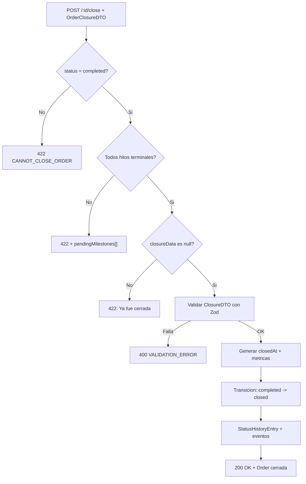

---

## CU-04: Cancelar Orden

| Atributo | Valor |
|---|---|
| **Endpoint** | `PATCH /api/v1/orders/:id/status` con `{ status: "cancelled", reason: "..." }` |
| **Actor Principal** | Owner / Usuario Maestro / Subusuario (permiso `orders:cancel`). Desde `in_transit`/`delayed`: solo Owner o Usuario Maestro |
| **Trigger** | Solicitud del cliente, error, duplicado u otra razon operativa |

**Precondiciones**

| # | Precondicion | Si no se cumple |
|---|---|---|
| PRE-01 | `status` es cancelable: `draft`, `pending`, `assigned`, `in_transit`, `delayed`. NO se puede cancelar desde `at_milestone`, `completed`, `closed`, `cancelled` | HTTP `422 INVALID_STATE_TRANSITION` |
| PRE-02 | `cancellationReason` proporcionado (min 1 char) | HTTP `400 VALIDATION_ERROR` |
| PRE-03 | Si `status = "in_transit"` o `delayed`: solo Owner o Usuario Maestro | HTTP `403 FORBIDDEN` |

**Secuencia Backend**

| Paso | Accion |
|---|---|
| 1 | Verificar que la orden NO esta en estado terminal |
| 2 | Si esta en `in_transit` o `delayed`, verificar que el rol sea Owner o Usuario Maestro |
| 3 | Validar `cancellationReason` no vacio |
| 4 | Registrar `cancelledAt = NOW()`, `cancelledBy = currentUserId`, `cancellationReason` |
| 5 | Si tenia `vehicleId`/`driverId`: **liberar recursos** (disponibles para otras ordenes) |
| 6 | Crear `StatusHistoryEntry` con la transicion |
| 7 | Emitir `order.status_changed` + `order.cancelled` |
| 8 | Si `syncStatus = "sent"`: enviar cancelacion al proveedor GPS (best-effort) |
| 9 | Retornar HTTP `200 OK` |

**Postcondiciones**

| # | Postcondicion |
|---|---|
| POST-01 | `status === "cancelled"` (terminal, inmutable) |
| POST-02 | `cancelledAt`, `cancelledBy`, `cancellationReason` registrados |
| POST-03 | Recursos (vehiculo/conductor) liberados |
| POST-04 | Evento `order.cancelled` emitido |

---

## CU-05: Enviar Orden a Sistema GPS

| Atributo | Valor |
|---|---|
| **Endpoint Individual** | `PATCH /api/v1/orders/:id/status` (sync) o endpoint dedicado |
| **Endpoint Masivo** | `POST /api/v1/orders/bulk-send` con `{ orderIds[] }` |
| **Actor Principal** | Owner / Usuario Maestro / Subusuario (permiso `orders:sync_gps`) |

**Precondiciones**

| # | Precondicion | Si no se cumple |
|---|---|---|
| PRE-01 | Orden(es) existen en BD | HTTP `404 ORDER_NOT_FOUND` |
| PRE-02 | `syncStatus != "sending"` (no hay envio en proceso) | HTTP `409 SYNC_IN_PROGRESS` |
| PRE-03 | Conexion al API del proveedor GPS disponible | `syncStatus = "error"`, `syncErrorMessage` con detalle |

**Secuencia Backend**

| Paso | Accion |
|---|---|
| 1 | Cambiar `syncStatus = "sending"` |
| 2 | Construir payload de sincronizacion (orden + milestones + geocercas) |
| 3 | Enviar a API del proveedor GPS (Wialon / Navitel Fleet) |
| 4 | Si exito: `syncStatus = "sent"`, `lastSyncAttempt = NOW()`, `syncErrorMessage = null` |
| 5 | Si fallo: `syncStatus = "error"`, `syncErrorMessage = <detalle>` |
| 6 | Si fallo: programar reintentos con backoff exponencial (5s, 15s, 45s). Max 3 intentos |
| 7 | Emitir evento `order.sync_updated` |

**Envio masivo:** Procesar ordenes secuencialmente (no paralelo para no saturar API GPS). **Maximo 50 orderIds por llamada** (validar en endpoint; si > 50 retornar HTTP `400 VALIDATION_ERROR`). Para volumenes mayores, usar cola de trabajo (queue) asincrona. Retornar `{ results: [{ orderId, success, error? }] }`.

**Postcondiciones**

| # | Postcondicion |
|---|---|
| POST-01 | `syncStatus` actualizado (sent/error/retry) |
| POST-02 | `lastSyncAttempt` registrado |
| POST-03 | Evento `order.sync_updated` emitido |

---

## CU-06: Importar Ordenes desde Excel/CSV

| Atributo | Valor |
|---|---|
| **Endpoint** | `POST /api/v1/orders/import` (multipart/form-data) |
| **Actor Principal** | Owner / Usuario Maestro / Subusuario (permiso `orders:import` / `orders:export`) |
| **Trigger** | El operador sube un archivo .xlsx, .xls o .csv |

**Precondiciones**

| # | Precondicion | Si no se cumple |
|---|---|---|
| PRE-01 | Archivo con extension `.xlsx`, `.xls` o `.csv` | HTTP `422 INVALID_FILE_FORMAT` |
| PRE-02 | Archivo <= 10 MB | HTTP `413 PAYLOAD_TOO_LARGE` |
| PRE-03 | <= 1000 filas de datos | HTTP `422`: "Maximo 1000 filas por importacion" |
| PRE-04 | Encoding: UTF-8 (con/sin BOM) o Latin-1. Deteccion automatica | — |

**Secuencia Backend**

| Paso | Accion |
|---|---|
| 1 | Validar formato y tamano del archivo |
| 2 | Parsear archivo fila por fila |
| 3 | Validar cada fila contra `createOrderSchema` (mismas reglas que CU-01) |
| 4 | Verificar que `customerId` de cada fila exista |
| 5 | Verificar que geocercas referenciadas existan |
| 6 | Clasificar filas: valida (verde), warning (amarillo), invalida (rojo) |
| 7 | Retornar preview: `{ rows: [{ rowNumber, status, data, errors[], warnings[] }] }` |
| 8 | Cuando el frontend confirma "Importar validas": crear 1 orden por fila valida via `OrderService.createOrder()` |
| 9 | Retornar resumen: `{ created: N, errors: N, warnings: N }` |

**Validaciones por fila (mismas que CreateOrderDTO)**

| Campo | Validacion |
|---|---|
| customerId | Debe existir como cliente activo |
| milestones | Min 2 (origin + destination) |
| cargo.weight | 0.01 - 100,000 |
| scheduledStartDate | < scheduledEndDate |
| Formatos de fecha | ISO 8601, DD/MM/YYYY HH:mm, o epoch |

**Postcondiciones**

| # | Postcondicion |
|---|---|
| POST-01 | N ordenes creadas en estado `draft` (una por fila valida) |
| POST-02 | Filas invalidas NO generaron ordenes |
| POST-03 | Cada orden tiene `orderNumber` auto-generado |

---

## CU-07: Registro Manual de Hito

| Atributo | Valor |
|---|---|
| **Endpoint** | `PATCH /api/v1/orders/:id/milestones/:milestoneId` o endpoint dedicado |
| **Actor Principal** | Owner / Usuario Maestro / Subusuario (permiso `milestones:manual_entry`) |
| **Trigger** | GPS no detecto entrada/salida y el operador registra manualmente |

**Precondiciones**

| # | Precondicion | Si no se cumple |
|---|---|---|
| PRE-01 | `order.status` es `in_transit`, `at_milestone` o `delayed` | Operacion rechazada |
| PRE-02 | El hito pertenece a la orden | HTTP `404 MILESTONE_NOT_FOUND` |
| PRE-03 | El hito NO esta en estado terminal (`completed`/`skipped`) | Ignorar — no doble registro |
| PRE-04 | `manualEntryData.reason` proporcionado (obligatorio) | HTTP `400 VALIDATION_ERROR` |

**Request Body**

| Campo | Tipo | Obligatorio | Valores |
|---|---|---|---|
| entryType | enum | Si | `arrival` o `departure` |
| reason | enum | Si | `gps_failure`, `no_signal`, `geofence_error`, `manual_override`, `other` |
| observation | string | No (recomendado) | Texto libre |
| evidence | string | No | Base64 de foto/documento |

**Secuencia Backend**

| Paso | Accion |
|---|---|
| 1 | Verificar que la orden esta en estado activo (in_transit/at_milestone/delayed) |
| 2 | Verificar que el hito pertenece a la orden y no esta en estado terminal |
| 3 | Si `entryType = "arrival"`: registrar `actualArrival = NOW()`, `status = "in_progress"`, `isManual = true` |
| 4 | Si `entryType = "departure"`: registrar `actualDeparture = NOW()`, `status = "completed"`, calcular `dwellTime` |
| 5 | Guardar `manualEntryData = { reason, observation, evidence, registeredBy }` |
| 6 | Recalcular `completionPercentage` de la orden |
| 7 | Evaluar si el status de la orden debe cambiar (ej: todos hitos completed -> orden completed) |
| 8 | Emitir evento `order.milestone_updated` con `{ orderId, milestoneId, newStatus, isManual: true }` |

**Postcondiciones**

| # | Postcondicion |
|---|---|
| POST-01 | Hito tiene `actualArrival` y/o `actualDeparture` con timestamp UTC |
| POST-02 | `isManual = true` y `manualEntryData` poblado |
| POST-03 | `completionPercentage` recalculado |
| POST-04 | Si fue ultimo hito: `order.status = "completed"` automaticamente |
| POST-05 | Evento `order.milestone_updated` emitido |

### Diagrama general de interaccion CU

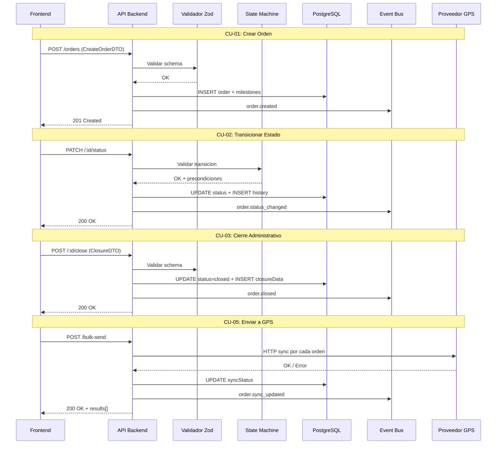

---

# 9. Endpoints API REST

**Base path:** `/api/v1/orders`

| # | Metodo | Endpoint | Descripcion | Permiso | Request Body | Response |
|---|---|---|---|---|---|---|
| E-01 | GET | / | Listar ordenes con paginacion y filtros | orders:view | Query: page, limit, status, priority, serviceType, customerId, search, dateType, dateFrom, dateTo, sortBy, sortDir | `{ items[], total, page, totalPages, statusCounts }` |
| E-02 | GET | /:id | Obtener detalle completo | orders:view | — | Order completa con milestones, cargo, closureData, statusHistory |
| E-03 | POST | / | Crear nueva orden | orders:create | CreateOrderDTO | `201` Order creada con status=draft |
| E-04 | PATCH | /:id | Actualizar orden existente (parcial) | orders:edit | UpdateOrderDTO (parcial) | Order actualizada |
| E-05 | DELETE | /:id | Eliminar orden (solo draft) | orders:delete | — | `204` No Content |
| E-06 | PATCH | /:id/status | Transicionar estado | orders:edit | `{ status, reason?, vehicleId?, driverId? }` | Order con nuevo estado |
| E-07 | POST | /:id/close | Cerrar orden | orders:close | OrderClosureDTO | Order con status=closed |
| E-08 | POST | /import | Importacion masiva Excel/CSV | orders:import | multipart/form-data (archivo) | `{ created, errors[], warnings[] }` |
| E-09 | GET | /export | Exportar a Excel | orders:export | Query: filtros + columns[] | Archivo .xlsx descargable |
| E-10 | POST | /bulk-send | Envio masivo a GPS | orders:sync_gps | `{ orderIds[] }` | `{ results: [{orderId, success, error?}] }` |
| E-11 | GET | /:id/workflow-progress | Progreso del workflow | orders:view | — | `{ steps[], currentStep, completionPercentage }` |
| E-12 | PATCH | /:id/milestones/:milestoneId | Registro manual de hito | milestones:manual_entry | `{ entryType, reason, observation?, evidence? }` | Milestone actualizado |

### Diagrama de flujo API

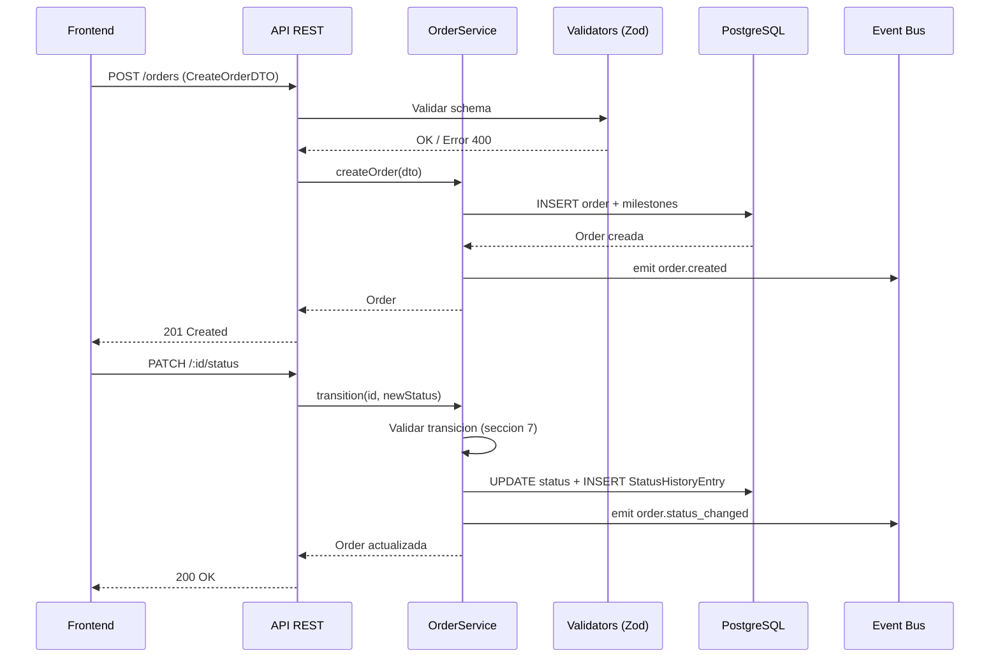

---

# 10. Eventos de Dominio

### Catalogo

| Evento | Payload | Se emite cuando | Modulos suscriptores |
|---|---|---|---|
| order.created | orderId, orderNumber, customerId, serviceType, priority, createdBy | Se crea una nueva orden | Dashboard, Notificaciones |
| order.status_changed | orderId, orderNumber, oldStatus, newStatus, changedBy, reason | Cualquier transicion de estado | Monitoreo, Programacion, Auditoria |
| order.assigned | orderId, orderNumber, vehicleId, vehiclePlate, driverId, driverName | Se asignan vehiculo + conductor | Monitoreo, Programacion |
| order.milestone_updated | orderId, milestoneId, milestoneName, milestoneStatus, actualArrival, actualDeparture | Cambia estado de un hito | Monitoreo, Notificaciones |
| order.sync_updated | orderId, syncStatus, gpsOperatorId, errorMessage | Cambia estado de sincronizacion GPS | Monitoreo |
| order.completed | orderId, orderNumber, totalDistanceKm, totalDurationMinutes, completionPercentage | Orden alcanza completed (antes del cierre) | Finanzas, Reportes |
| order.cancelled | orderId, orderNumber, reason, cancelledBy, previousStatus | Orden es cancelada | Programacion, Finanzas |
| order.closed | orderId, orderNumber, closedBy, closedAt, customerRating | Orden alcanza closed | Finanzas, Reportes |
| order.location_update | orderId, vehicleId, position (lat/lng), speed, heading, timestamp | Actualizacion de posicion GPS | Monitoreo (WebSocket) |

### Diagrama de propagacion

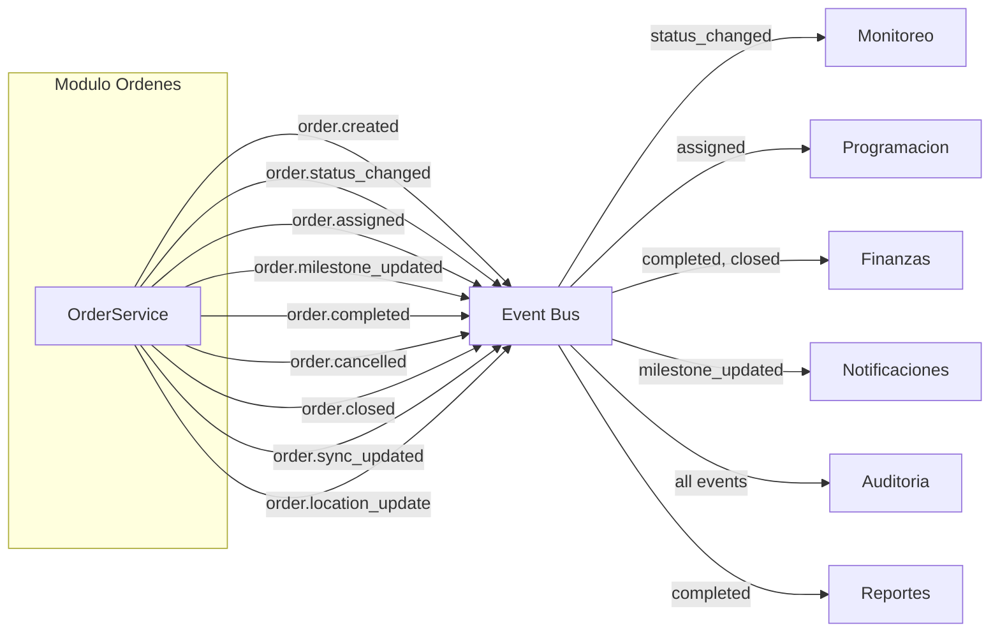

---

# 11. Reglas de Negocio Clave

| # | Regla | Descripcion |
|---|---|---|
| R-01 | Estados terminales | closed y cancelled no tienen transiciones de salida |
| R-02 | Solo draft se elimina (soft delete) | DELETE solo valido si status = draft. Marca `deleted_at = NOW()` + `deleted_by`. Todas las queries deben filtrar `WHERE deleted_at IS NULL`. HTTP 409 si status != draft |
| R-03 | Asignacion requiere recursos | pending a assigned requiere vehicleId + driverId |
| R-04 | Inicio requiere asignacion | assigned a in_transit requiere vehicleId AND driverId |
| R-05 | Cierre requiere completitud | completed a closed requiere todos los hitos en completed o skipped |
| R-06 | Auto-status por hitos | Al actualizar un hito, el status de la orden se recalcula |
| R-07 | completionPercentage | Se recalcula: (hitos_completed + hitos_skipped) / total_hitos x 100 |
| R-08 | Cancelacion con motivo | cancellationReason es obligatorio al cancelar |
| R-09 | Historial inmutable | Cada transicion genera StatusHistoryEntry. NUNCA se modifica |
| R-10 | orderNumber inmutable | Formato `ORD-YYYY-NNNNN` (14 chars, 5 digitos), unico global, no editable |
| R-11 | Min 2 hitos | Toda orden requiere minimo 1 origin + 1 destination |
| R-12 | Conflicto de recursos | Vehiculo/conductor no puede tener superposicion de fechas con otra orden activa |
| R-13 | Workflow auto-asignado | Si existe workflow compatible con serviceType + cargoType, se asigna al crear |
| R-14 | Fechas cruzadas | scheduledStartDate debe ser anterior a scheduledEndDate |

---

# 12. Catalogo de Errores HTTP

| HTTP | Codigo interno | Cuando ocurre | Resolucion |
|---|---|---|---|
| 400 | VALIDATION_ERROR | Campos invalidos segun schema Zod | Leer details: mapa {campo: mensaje} |
| 401 | UNAUTHORIZED | Token JWT ausente o expirado | Redirigir a /login |
| 403 | FORBIDDEN | Sin permisos para la operacion | Verificar rol del usuario (ver seccion 13) |
| 404 | ORDER_NOT_FOUND | ID de orden no existe | Verificar UUID |
| 404 | CUSTOMER_NOT_FOUND | customerId no existe o inactivo | Seleccionar otro cliente |
| 404 | VEHICLE_NOT_FOUND | vehicleId no existe o inactivo | Seleccionar otro vehiculo |
| 404 | DRIVER_NOT_FOUND | driverId no existe o licencia vencida | Seleccionar otro conductor |
| 404 | MILESTONE_NOT_FOUND | milestoneId no existe o no pertenece a la orden | Verificar UUID del hito y la orden |
| 409 | CANNOT_DELETE_NON_DRAFT | DELETE con status != draft | Cancelar en vez de eliminar |
| 409 | VEHICLE_CONFLICT | Vehiculo en conflicto de horario | Elegir otro vehiculo o ajustar fechas |
| 409 | DRIVER_CONFLICT | Conductor en conflicto de horario | Elegir otro conductor o ajustar fechas |
| 422 | INVALID_STATE_TRANSITION | Transicion no permitida en maquina de estados | Leer details.validTransitions |
| 422 | PRECONDITION_FAILED | Transicion valida pero faltan precondiciones | Leer details.missingConditions |
| 422 | CANNOT_CLOSE_ORDER | Cierre con hitos pendientes o status != completed | Completar/saltar hitos pendientes |
| 422 | INVALID_FILE_FORMAT | Archivo de importacion no es xlsx/xls/csv | Convertir formato |
| 413 | PAYLOAD_TOO_LARGE | Archivo de importacion excede 10 MB | Reducir tamano o dividir en lotes |
| 500 | INTERNAL_ERROR | Error inesperado del servidor | Reintentar; si persiste, contactar soporte |
| 409 | SYNC_IN_PROGRESS | Ya hay un envio GPS en proceso para esta orden | Esperar a que finalice el envio actual |
| 502 | GPS_SYNC_FAILED | Proveedor GPS no respondio | Verificar proveedor y reintentar |

---

# 13. Permisos RBAC

**3 niveles jerarquicos (definicion de Edson). Arquitectura Multi-tenant con RBAC granular por modulo y por accion.**

```
Owner (Proveedor TMS)
   └── Cuenta Cliente (Tenant)
           └── Usuario Maestro
                   └── Subusuarios
```

> **Leyenda:** ✅ = Permitido | ❌ = Denegado | ⚙️ = Configurable por el Usuario Maestro

| Permiso | Owner | Usuario Maestro | Subusuario |
|---|:---:|:---:|:---:|
| orders:view | ✅ | ✅ | ⚙️ |
| orders:create | ✅ | ✅ | ⚙️ |
| orders:edit | ✅ | ✅ | ⚙️ |
| orders:delete | ✅ | ✅ | ❌ |
| orders:cancel | ✅ | ✅ | ⚙️* |
| orders:close | ✅ | ✅ | ⚙️ |
| orders:approve | ✅ | ✅ | ❌ |
| orders:assign | ✅ | ✅ | ⚙️ |
| orders:import | ✅ | ✅ | ⚙️ |
| orders:export | ✅ | ✅ | ⚙️ |
| orders:sync_gps | ✅ | ✅ | ⚙️ |
| milestones:manual_entry | ✅ | ✅ | ⚙️ |

> **Owner:** Rol maximo del sistema (proveedor TMS). Acceso total sin restricciones a todas las cuentas. Puede crear/suspender/eliminar cuentas de clientes, activar/desactivar modulos, crear Usuarios Maestros, resetear credenciales.
> **Usuario Maestro:** Administrador principal de una cuenta cliente. Control total SOLO dentro de su empresa. Crea subusuarios, asigna roles y permisos internos por modulo, asigna unidades, restringe visibilidad por grupo/flota/geocerca. NO puede crear cuentas, activar modulos no contratados, ni ver otras cuentas.
> **Subusuario:** Operador con permisos limitados definidos por el Usuario Maestro. NO puede crear usuarios, modificar estructura de permisos, activar/desactivar modulos, ni cambiar configuracion de la cuenta.
> **⚙️ Configurable:** El Usuario Maestro habilita o deshabilita cada permiso por subusuario segun necesidades operativas. Control granular por modulo y por accion (view, create, edit, delete, approve).
> **\*orders:cancel:** Subusuario (si tiene el permiso) puede cancelar desde `draft`, `pending`, `assigned`. Cancelar desde `in_transit` o `delayed` requiere Owner o Usuario Maestro.
> **orders:delete:** Solo valido para ordenes en estado `draft` (soft delete). Solo Owner y Usuario Maestro.
> **Recomendacion tecnica:** Sistema basado en Role-Based Access Control (RBAC) con control de alcance por unidades y grupos.

---

# 14. Diagrama de Componentes

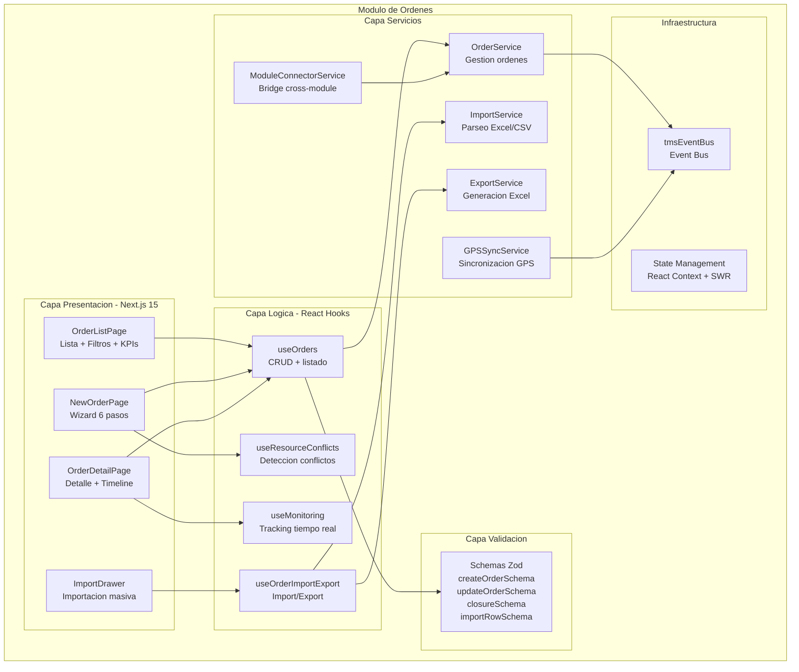

---

# 15. Diagrama de Despliegue

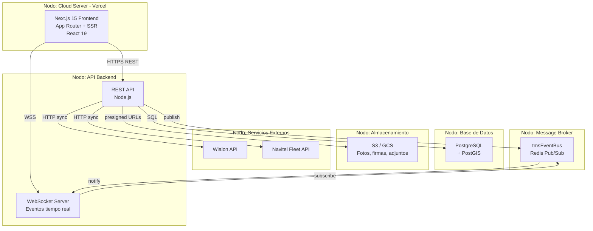

---

> **Nota:** Este documento es una referencia operativa para desarrollo frontend y backend. Incluye los 7 Casos de Uso con precondiciones, secuencia, postcondiciones y excepciones. Para detalles completos (12 historias de usuario con criterios de aceptacion, conversaciones de equipo, escenarios narrativos con actores nombrados, payloads exactos con ejemplos JSON, y validaciones con justificacion WHY), consultar **ORDERS_SYSTEM_DESIGN4.md**.
