# Diseño de Sistemas — Módulo de Órdenes 
## TMS Navitel · Documento de Ingeniería de Software

> **Versión:** 4.0 
> **Fecha:** Febrero 2026 
> **Tipo:** Modelado de Sistemas / Diseño de Software 
> **Clasificación:** Documentación Técnica Completa — Nivel Profesional 
> **Estado:** Vigente 

---

## Historial de Versiones

| Versión | Fecha | Autor(es) | Cambios Realizados |
|:-------:|-------|-----------|-------------------|
| 1.0 | Enero 2026 | Equipo TMS Navitel | Versión inicial — modelo de dominio, historias de usuario, y diagramas base. |
| 2.0 | Febrero 2026 | Equipo TMS Navitel | Se agregan tipos exactos de dato (§2), validaciones exhaustivas con WHY (§12), contratos API REST (§11), precondiciones del sistema (§14), y catálogo de errores (§13). |
| 3.0 | Febrero 2026 | Equipo TMS Navitel | Actualización completa de roles a sistema RBAC de 3 niveles (Owner, Usuario Maestro, Subusuario). Se actualizan las 80+ referencias de roles en todo el documento. |
| 4.0 | Febrero 2026 | Equipo TMS Navitel | **Auditoría documental UML.** Se agregan: §0 Aspectos Generales (problema, objetivos), §1.6 Requerimientos Formales, §1.7 Catálogo de Interfaces, §3.8 Diagrama de Clases UML, Diagrama de Casos de Uso visual, Diagrama de Jerarquía de Actores, §15.5 Diagrama de Colaboración, §18.4 Diagrama de Componentes, §18.5 Diagrama de Despliegue, §24 Conclusiones, §25 Recomendaciones, §26 Bibliografía. Se agregan campos Versión/Fuentes/Importancia a todos los CUs. Se agregan escenarios concretos con actores nombrados. |

---

## Índice General

| # | Sección | Pág |
|---|---------|-----|
| 0 | [Aspectos Generales del Proyecto](#0-aspectos-generales-del-proyecto) | — |
| 1 | [Introducción y Alcance](#1-introducción-y-alcance) | — |
| 2 | [Convención de Tipos de Dato Primitivos](#2-convención-de-tipos-de-dato-primitivos) | — |
| 3 | [Modelo de Dominio (Entidades)](#3-modelo-de-dominio) | — |
| 4 | [Diagrama Entidad-Relación](#4-diagrama-entidad-relación) | — |
| 5 | [Tipos Enumerados — Definición Completa](#5-tipos-enumerados--definición-completa) | — |
| 6 | [Máquina de Estados — OrderStatus](#6-máquina-de-estados--orderstatus) | — |
| 7 | [Máquina de Estados — MilestoneStatus](#7-máquina-de-estados--milestonestatus) | — |
| 8 | [Máquina de Estados — OrderSyncStatus](#8-máquina-de-estados--ordersyncstatus) | — |
| 9 | [Historias de Usuario](#9-historias-de-usuario) | — |
| 10 | [Casos de Uso Detallados (UML)](#10-casos-de-uso-detallados-uml) | — |
| 11 | [API REST — Contratos Endpoint por Endpoint](#11-api-rest--contratos) | — |
| 12 | [Validaciones Exhaustivas con Fundamentación](#12-validaciones-exhaustivas-con-fundamentación) | — |
| 13 | [Catálogo de Errores](#13-catálogo-de-errores) | — |
| 14 | [Precondiciones del Sistema — Cadena de Dependencias](#14-precondiciones-del-sistema--cadena-de-dependencias) | — |
| 15 | [Diagramas de Secuencia y Colaboración](#15-diagramas-de-secuencia-y-colaboración) | — |
| 16 | [Diagramas de Actividad](#16-diagramas-de-actividad) | — |
| 17 | [Eventos de Dominio](#17-eventos-de-dominio) | — |
| 18 | [Integraciones Cross-Module, Componentes y Despliegue](#18-integraciones-cross-module-componentes-y-despliegue) | — |
| 19 | [Importación y Exportación Masiva](#19-importación-y-exportación-masiva) | — |
| 20 | [Detección de Conflictos de Recursos](#20-detección-de-conflictos-de-recursos) | — |
| 21 | [Catálogo de Incidencias](#21-catálogo-de-incidencias) | — |
| 22 | [Estructura de Archivos](#22-estructura-de-archivos) | — |
| 23 | [Glosario](#23-glosario) | — |
| 24 | [Conclusiones](#24-conclusiones) | — |
| 25 | [Recomendaciones](#25-recomendaciones) | — |
| 26 | [Bibliografía y Referencias](#26-bibliografía-y-referencias) | — |

---

# 0. Aspectos Generales del Proyecto

## 0.1 Descripción del Entorno

**TMS Navitel** es un Sistema de Gestión de Transporte (Transportation Management System) diseñado para empresas de transporte de carga en Perú y Latinoamérica. Opera en un ecosistema donde coexisten flotillas propias, transportistas tercerizados, múltiples proveedores de GPS (Wialon, Navitel Fleet) y clientes de diversos sectores (minería, agroindustria, retail, courier).

El sistema se compone de módulos interconectados: **Maestro** (clientes, vehículos, conductores, geocercas, operadores), **Órdenes** (núcleo operativo), **Programación**, **Monitoreo**, **Finanzas**, **Reportes**, **Route Planner** y **Workflows**. El **Módulo de Órdenes** es el eje central que conecta todos los demás módulos.

El sistema utiliza una arquitectura web moderna con **Next.js 15** (App Router) en el frontend, API REST en el backend, base de datos **PostgreSQL** con PostGIS para geooperaciones, y comunicación en tiempo real vía **WebSocket** para eventos de GPS y actualizaciones de estado.

## 0.2 Definición del Problema

Actualmente, las empresas de transporte de carga en Perú enfrentan los siguientes problemas operativos:

| # | Problema | Consecuencias Medibles |
|---|---------|----------------------|
| P-01 | **Gestión manual de órdenes de transporte** mediante hojas de cálculo, documentos físicos o sistemas aislados. | Errores de transcripción en un ~15% de las órdenes; pérdida de documentos; imposibilidad de consultar estado en tiempo real. |
| P-02 | **Asignación ineficiente de recursos** (vehículos y conductores) sin detección de conflictos de horario. | Doble-asignación de vehículos en un ~7% de los casos; tiempos muertos por conductores sin licencia vigente; sobreutilización de ciertos vehículos. |
| P-03 | **Falta de trazabilidad del ciclo de vida** de la orden, desde la creación hasta el cierre administrativo. | Imposibilidad de auditar transiciones de estado; pérdida de historial de cambios; disputas con clientes por falta de evidencia. |
| P-04 | **Sincronización manual con proveedores GPS**, requiriendo operadores dedicados a ingresar datos en múltiples plataformas. | Retraso de 30-60 minutos en la activación del tracking; errores de carga; duplicación de esfuerzo. |
| P-05 | **Cierres administrativos sin estructura**, donde las observaciones, incidencias y firmas se gestionan en papel o no se registran. | Pérdida de información de cierre en un ~25% de las órdenes; imposibilidad de calcular KPIs de calidad; facturación incompleta. |
| P-06 | **Múltiples puntos de entrega sin control de hitos**, sin capacidad de rastrear la entrada/salida de cada punto de la ruta. | No se puede calcular tiempos de permanencia (dwell time); no se detectan retrasos hasta que es demasiado tarde; SLAs incumplidos sin registro. |

## 0.3 Objetivos del Proyecto

### Objetivo General

Diseñar e implementar el **Módulo de Órdenes del TMS Navitel**, un subsistema que automatice el ciclo de vida completo de las órdenes de transporte de carga, integrando la gestión de hitos, asignación de recursos con detección de conflictos, sincronización con proveedores GPS, y cierre administrativo con evidencia digital, utilizando modelado UML profesional y arquitectura web moderna.

### Objetivos Específicos

| # | Objetivo Específico | Diagrama UML Asociado |
|---|--------------------|-----------------------|
| OE-01 | Desarrollar el **diagrama de clases** del módulo de órdenes, identificando entidades, atributos con tipos exactos, métodos, y relaciones de composición/agregación entre Order, OrderMilestone, OrderCargo, OrderClosureData, StatusHistoryEntry, y OrderIncidentRecord. | Diagrama de Clases (§3.8) |
| OE-02 | Modelar los **diagramas de casos de uso** con la identificación de actores (Owner, Usuario Maestro, Subusuario, Sistema GPS), sus relaciones de generalización, y las relaciones <<include>> y <<extend>> entre los 7 casos de uso del módulo. | Diagrama de Casos de Uso (§10) |
| OE-03 | Diseñar los **diagramas de secuencia** para los 4 flujos principales (creación, transición de estado, actualización de hito, cierre administrativo), mostrando la interacción temporal entre Frontend, API, Services, EventBus y BD. | Diagramas de Secuencia (§15) |
| OE-04 | Elaborar el **diagrama de colaboración** para el flujo de creación de orden, mostrando la estructura de cooperación entre objetos participantes y sus mensajes numerados. | Diagrama de Colaboración (§15.5) |
| OE-05 | Definir los **diagramas de estados** para las 3 máquinas de estados del módulo (OrderStatus: 9 estados/18 transiciones, MilestoneStatus: 7 estados, OrderSyncStatus: 6 estados), documentando las condiciones de cada transición. | Diagramas de Estados (§6, §7, §8) |
| OE-06 | Construir los **diagramas de actividad** para el ciclo de vida completo de una orden y el flujo del wizard de creación, utilizando nodos de decisión, fork/join y swimlanes. | Diagramas de Actividad (§16) |
| OE-07 | Diseñar el **diagrama de componentes** del módulo, mostrando los componentes de software (OrderService, ImportService, ExportService, EventBus, Validators, UI Components) con sus interfaces provistas y requeridas. | Diagrama de Componentes (§18.4) |
| OE-08 | Elaborar el **diagrama de despliegue** que modele la distribución física del sistema en nodos de hardware (servidor frontend Next.js, API backend, PostgreSQL, proveedores GPS externos, S3 storage). | Diagrama de Despliegue (§18.5) |

## 0.4 Alcance del Documento

Este documento cubre el diseño completo del **Módulo de Órdenes**, incluyendo:

- **Modelo de dominio** con 7 entidades y 100+ campos documentados a nivel de tipo exacto, regex, y ejemplo literal.
- **12 historias de usuario** con 8 elementos profesionales cada una (tarjeta, criterios, conversación, precondiciones, secuencia, postcondiciones, excepciones).
- **7 casos de uso UML** con precondiciones, flujos principal/alternativo/excepción, postcondiciones, y reglas de negocio.
- **3 máquinas de estados** con diagramas, tablas de transición, y reglas de negocio.
- **12 endpoints API REST** con contratos request/response completos.
- **71+ reglas de validación** con justificación de negocio (columna WHY).
- **9 eventos de dominio** con payloads y propagación inter-módulo.
- **Diagramas UML** de los 8 tipos: clases, casos de uso, secuencia, colaboración, estados, actividad, componentes, y despliegue.

---

# 1. Introducción y Alcance

## 1.1 Propósito

Este documento define el **diseño completo del Módulo de Órdenes** del sistema TMS Navitel. Es la especificación autoritativa para el equipo de desarrollo y constituye el contrato entre frontend y backend.

## 1.2 Contexto del Sistema

El módulo de **Órdenes** es el **núcleo del sistema TMS**. Representa el ciclo de vida completo de un servicio de transporte, desde su creación hasta su cierre administrativo. Todas las demás áreas operativas — programación, monitoreo, finanzas, incidencias — giran alrededor de este módulo.

## 1.3 Diagrama de Contexto

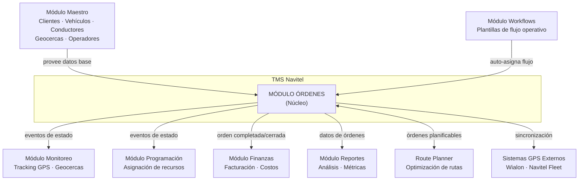

## 1.4 Responsabilidades del Módulo

| Responsabilidad | Descripción |
|---|---|
| CRUD de Órdenes | Crear, leer, actualizar y eliminar órdenes de transporte |
| Gestión de Estados | Máquina de estados con 9 estados y transiciones controladas |
| Hitos de Ruta (Milestones) | Registro de entrada/salida a geocercas con evidencia |
| Asignación de Recursos | Asignar vehículo + conductor con detección de conflictos |
| Cierre Administrativo | Cierre con observaciones, incidencias, fotos, firma |
| Sincronización GPS | Envío individual/masivo a proveedores GPS |
| Importación/Exportación | Carga masiva Excel/CSV y exportación con filtros |
| Eventos de Dominio | Publicación asíncrona de eventos a otros módulos |
| Conexión con Workflows | Auto-asignación y seguimiento de pasos operativos |

## 1.5 Rutas del Frontend

| Ruta | Componente | Descripción |
|---|---|---|
| `/orders` | `OrdersPage` | Lista paginada con filtros, stats y acciones bulk |
| `/orders/new` | `NewOrderPage` | Wizard de creación (6 pasos) |
| `/orders/import` | `ImportOrdersPage` | Importación masiva desde Excel/CSV |
| `/orders/:id` | `OrderDetailPage` | Detalle con timeline, hitos, acciones |
| `/orders/:id/edit` | `EditOrderPage` | Edición de orden existente |

## 1.6 Especificación de Requerimientos

### 1.6.1 Requerimientos Funcionales

| ID | Requerimiento | Prioridad | HU Asociada | CU Asociado |
|----|--------------|:---------:|:-----------:|:-----------:|
| RF-01 | El sistema debe permitir **crear órdenes de transporte** mediante un wizard de 6 pasos con validación por paso. | Vital | HU-01 | CU-01 |
| RF-02 | El sistema debe soportar **9 tipos de servicio** (distribución, importación, exportación, minero, residuos, interprovincial, mudanza, courier, otro) con reglas de negocio diferenciadas. | Vital | HU-01 | CU-01 |
| RF-03 | El sistema debe **listar órdenes con paginación**, búsqueda por texto libre, filtros múltiples simultáneos (status, prioridad, tipo, cliente, fechas), y KPI cards de resumen. | Vital | HU-02 | — |
| RF-04 | El sistema debe permitir **asignar vehículo y conductor** a una orden, con detección automática de conflictos de horario. | Vital | HU-03 | CU-02 |
| RF-05 | El sistema debe implementar una **máquina de estados con 9 estados y 18 transiciones** controladas, impidiendo transiciones inválidas. | Vital | HU-04 | CU-02 |
| RF-06 | El sistema debe permitir el **cierre administrativo** de órdenes completadas, registrando observaciones, incidencias, fotos, firma digital, y calificación del cliente. | Vital | HU-05 | CU-03 |
| RF-07 | El sistema debe **registrar entrada/salida de hitos** tanto por GPS automático como por registro manual con motivo y evidencia. | Vital | HU-07 | CU-07 |
| RF-08 | El sistema debe **sincronizar órdenes con proveedores GPS externos** (Wialon, Navitel Fleet) individual y masivamente, con política de reintentos. | Importante | HU-08, HU-09 | CU-05 |
| RF-09 | El sistema debe permitir **importación masiva** de órdenes desde archivos Excel/CSV con validación fila por fila y preview antes de confirmar. | Importante | HU-10 | CU-06 |
| RF-10 | El sistema debe permitir **exportación** de órdenes a Excel con selección de columnas y filtros. | Importante | HU-10 | CU-06 |
| RF-11 | El sistema debe permitir la **cancelación de órdenes** con motivo obligatorio, registrando quién y cuándo canceló. | Vital | HU-06 | CU-04 |
| RF-12 | El sistema debe permitir la **eliminación** (hard delete) de órdenes **solo en estado borrador**, restringida a Owner y Usuario Maestro. | Importante | HU-11 | — |
| RF-13 | El sistema debe **publicar eventos de dominio** (9 tipos) en un Event Bus para notificar a otros módulos (monitoreo, programación, finanzas, reportes). | Vital | — | — |
| RF-14 | El sistema debe **auto-asignar workflows** compatibles según el tipo de servicio y tipo de carga al crear una orden. | Deseable | HU-12 | — |
| RF-15 | El sistema debe **detectar conflictos de recursos** verificando superposición de fechas de vehículos y conductores con órdenes activas. | Vital | HU-03 | — |
| RF-16 | El sistema debe generar **orderNumber automático** con formato `ORD-{YYYY}-{SEQ5}`, único global e inmutable. | Vital | HU-01 | CU-01 |
| RF-17 | El sistema debe mantener un **historial inmutable de transiciones** de estado (StatusHistoryEntry). | Vital | HU-04 | CU-02 |
| RF-18 | El sistema debe **recalcular automáticamente** el `completionPercentage` al cambiar el estado de cualquier hito. | Importante | HU-07 | CU-07 |

### 1.6.2 Requerimientos No Funcionales

| ID | Requerimiento | Categoría | Métrica / Constraint |
|----|--------------|-----------|---------------------|
| RNF-01 | El listado de órdenes debe **cargar en menos de 2 segundos** con paginación server-side para hasta 100,000 órdenes. | Rendimiento | Tiempo de respuesta < 2s (P95) |
| RNF-02 | El wizard de creación debe **validar cada paso en menos de 100ms** (validación client-side con Zod). | Rendimiento | Latencia de validación < 100ms |
| RNF-03 | El sistema debe soportar **hasta 50 usuarios concurrentes** accediendo al módulo de órdenes sin degradación. | Escalabilidad | 50 conexiones concurrentes |
| RNF-04 | Toda operación de escritura debe **verificar permisos RBAC** (Owner, Usuario Maestro, Subusuario con permisos granulares). | Seguridad | 100% de endpoints protegidos |
| RNF-05 | Los datos de cierre (firma digital, fotos) deben almacenarse en **almacenamiento externo** (S3/GCS) con URLs presignadas de máximo 1h de vigencia. | Seguridad | Expiración de URLs < 1h |
| RNF-06 | Los eventos de dominio deben propagarse a los módulos suscriptores en **menos de 500ms**. | Rendimiento | Latencia de eventos < 500ms |
| RNF-07 | La importación masiva debe soportar **archivos de hasta 5,000 filas** sin timeout. | Escalabilidad | Procesamiento de 5K filas < 60s |
| RNF-08 | El sistema debe ser **responsive**: usable en pantallas desde 1280px (desktop) hasta 768px (tablet). | Usabilidad | Breakpoints: 768px, 1024px, 1280px |
| RNF-09 | El sistema debe soportar **internacionalización** (i18n) con traducciones en español e inglés. | Usabilidad | 2 idiomas: ES, EN |
| RNF-10 | Toda acción destructiva (eliminar, cancelar) debe incluir **confirmación del usuario** con diálogo explícito. | Usabilidad | Diálogo de confirmación en 100% de acciones destructivas |

### 1.6.3 Procesos Operativos por Área

| Área Operativa | Proceso Actual (manual) | Proceso Automatizado (TMS) |
|---------------|------------------------|---------------------------|
| **Logística** | Creación de órdenes en Excel, distribución por email, coordinación telefónica. | Wizard de 6 pasos, asignación con detección de conflictos, notificaciones automáticas. |
| **Monitoreo** | Revisión individual en plataformas GPS separadas, sin relación con órdenes. | Sincronización automática con GPS, detección de hitos por geocercas, timeline en tiempo real. |
| **Administración** | Cierre de servicio en papel, firmas físicas, fotos en WhatsApp. | Cierre digital con firma, fotos, incidencias tipificadas, calificación de cliente. |
| **Finanzas** | Recopilación manual de datos de cierre para facturación. | Eventos `order.closed` disparan procesos de facturación automáticos con datos completos. |

### 1.6.4 Lista de Problemas y Necesidades

| # | Problema / Necesidad | Prioridad | RF Asociado |
|---|---------------------|:---------:|:-----------:|
| N-01 | Centralizar la gestión de órdenes de transporte en una sola plataforma web. | Vital | RF-01, RF-03 |
| N-02 | Eliminar la doble-asignación de vehículos y conductores. | Vital | RF-04, RF-15 |
| N-03 | Tener trazabilidad completa del ciclo de vida de cada orden. | Vital | RF-05, RF-17 |
| N-04 | Automatizar la sincronización con proveedores GPS. | Importante | RF-08 |
| N-05 | Registrar evidencia digital en el cierre de servicios. | Vital | RF-06 |
| N-06 | Importar órdenes masivamente desde archivos del cliente. | Importante | RF-09 |
| N-07 | Conocer el avance de cada orden en tiempo real (% de hitos completados). | Importante | RF-07, RF-18 |

## 1.7 Catálogo de Interfaces de Usuario

### 1.7.1 Catálogo de Pantallas

| # | Pantalla / Componente | Tipo | Función | CU Asociado | Ruta |
|---|----------------------|------|---------|:-----------:|------|
| W-01 | **Lista de Órdenes** | Página completa | Lista paginada con filtros múltiples, búsqueda por texto, KPI cards por estado, acciones bulk (envío GPS masivo, exportación). Tabla sorteable con columnas configurables. | CU-01, CU-06 | `/orders` |
| W-02 | **Wizard Nueva Orden** | Página completa (6 steps) | Creación de orden paso a paso: ① Cliente → ② Carga → ③ Ruta (mapa interactivo) → ④ Recursos → ⑤ Workflow → ⑥ Resumen. Validación por paso con Zod. | CU-01 | `/orders/new` |
| W-03 | **Detalle de Orden** | Página completa | Vista detallada con: header (status badge, prioridad, timer), secciones colapsables (cliente, carga, ruta con mapa, recursos, workflow), timeline de historial de estados, lista de hitos con indicadores de progreso. | CU-02, CU-03, CU-07 | `/orders/:id` |
| W-04 | **Edición de Orden** | Página completa | Formulario de edición con los mismos campos del wizard, permitiendo modificar datos de la orden (solo si `status ∈ {draft, pending}`). | CU-01 | `/orders/:id/edit` |
| W-05 | **Importación Masiva** | Página completa | Drag-and-drop de archivo Excel/CSV, preview con tabla de validación (filas verdes/amarillas/rojas), botón "Importar válidas", resultado final con contadores. | CU-06 | `/orders/import` |
| W-06 | **Modal de Asignación** | Modal (overlay) | Formulario para asignar vehículo + conductor con dropdowns filtrados por disponibilidad. Muestra alertas de conflicto y warnings de capacidad. | CU-02 | (dentro de W-03) |
| W-07 | **Modal de Cierre Administrativo** | Modal (overlay) | Formulario de cierre: observaciones, selector de incidencias del catálogo, upload de fotos, firma digital (canvas), distancia real, calificación. | CU-03 | (dentro de W-03) |
| W-08 | **Modal de Cancelación** | Dialog (confirmación) | Diálogo de confirmación con campo obligatorio "Motivo de cancelación" (textarea, mín. 10 chars). Botones: "Cancelar orden" (rojo) / "Volver". | CU-04 | (dentro de W-03) |
| W-09 | **Modal de Eliminación** | Dialog (confirmación destructiva) | Diálogo: "¿Eliminar la orden ORD-XXXX? Esta acción es irreversible." Solo visible para Owner y Usuario Maestro. Solo órdenes en `draft`. | — | (dentro de W-03) |
| W-10 | **Modal Entrada Manual de Hito** | Modal (overlay) | Formulario para registrar entrada/salida manual: hora, motivo (dropdown: sin señal GPS, falla equipo, carga retroactiva, corrección, otro), observaciones, upload de evidencia. | CU-07 | (dentro de W-03) |
| W-11 | **Panel de Envío GPS** | Drawer lateral | Panel para enviar una o múltiples órdenes a proveedor GPS. Muestra estado de sincronización, errores, opciones de re-envío forzado. | CU-05 | (dentro de W-01 y W-03) |
| W-12 | **Preview de Workflow** | Sección colapsable | Barra de progreso del workflow asignado: pasos completados (verde), paso actual (azul), pendientes (gris). Click en paso muestra detalles. | — | (dentro de W-03) |

### 1.7.2 Estructura de Navegación

```
TMS Navitel — Sidebar
├── Dashboard
├── Órdenes ← Módulo documentado
│ ├── Lista de Órdenes (W-01) ← /orders
│ ├── Nueva Orden (W-02) ← /orders/new
│ ├── Importar Órdenes (W-05) ← /orders/import
│ └── [Detalle Orden] (W-03) ← /orders/:id
│ ├── Editar (W-04) ← /orders/:id/edit
│ ├── Modal Asignación (W-06)
│ ├── Modal Cierre (W-07)
│ ├── Modal Cancelación (W-08)
│ ├── Modal Eliminación (W-09)
│ ├── Modal Hito Manual (W-10)
│ ├── Panel GPS (W-11)
│ └── Preview Workflow (W-12)
├── Programación
├── Monitoreo
├── Route Planner
├── Finanzas
├── Reportes
├── Configuración
└── Perfil
```

---

# 2. Convención de Tipos de Dato Primitivos

> **IMPORTANTE:** Esta sección define con exactitud el tipo de dato de cada campo usado en todo el documento. Cuando se referencie un tipo aquí, aplica la especificación completa descrita abajo.

### 2.1 Tipos Escalares (Primitivos)

| Tipo Documentado | Tipo TypeScript | Tipo JSON | Representación en Memoria / BD | Formato / Patrón Regex | Longitud | Ejemplo Literal |
|---|---|---|---|---|---|---|
| `UUID` | `string` | `string` | **128 bits** (16 bytes). Se transmite como cadena hexadecimal de **36 caracteres** con guiones (RFC 4122 v4). Almacenamiento: `CHAR(36)` o `UUID` nativo (PostgreSQL). | `/^[0-9a-f]{8}-[0-9a-f]{4}-4[0-9a-f]{3}-[89ab][0-9a-f]{3}-[0-9a-f]{12}$/i` | Exactamente 36 chars | `"550e8400-e29b-41d4-a716-446655440000"` |
| `ISO 8601 Datetime` | `string` | `string` | Cadena de texto que sigue el estándar **ISO 8601** con zona horaria UTC (sufijo `Z`). **No** se aceptan offsets locales (`+05:00`). Almacenamiento: `TIMESTAMP WITH TIME ZONE` (PostgreSQL) / `datetime2(7)` (SQL Server). | `/^\d{4}-\d{2}-\d{2}T\d{2}:\d{2}:\d{2}(\.\d{1,3})?Z$/` | 20–24 chars | `"2026-02-23T15:30:00.000Z"` |
| `String (texto)` | `string` | `string` | Cadena de caracteres codificada en **UTF-8**. Longitud mínima/máxima definida por campo. Almacenamiento: `VARCHAR(N)` o `TEXT`. | Alfanumérico + caracteres especiales según campo. | Variable (ver campo) | `"Almacén Central Lima"` |
| `Integer (entero)` | `number` | `number` | Número entero con signo. **32 bits** (rango: -2,147,483,648 a 2,147,483,647). No acepta decimales. Almacenamiento: `INTEGER` / `INT`. | `/^-?\d+$/` | — | `50` |
| `Float (decimal)` | `number` | `number` | Número de punto flotante de **64 bits** (doble precisión IEEE 754). Acepta decimales. Almacenamiento: `DECIMAL(P,S)` / `NUMERIC` / `DOUBLE PRECISION`. Precisión recomendada: 2 decimales para montos, 6 para coordenadas. | `/^-?\d+(\.\d+)?$/` | — | `5000.75` |
| `Boolean` | `boolean` | `boolean` | Valor lógico de **1 bit**: `true` (1) o `false` (0). Almacenamiento: `BOOLEAN` (PostgreSQL) / `BIT` (SQL Server). | `true` o `false` — sin comillas en JSON. | 1 bit | `true` |
| `Enum (cadena)` | `string` | `string` | Cadena de texto restringida a un conjunto finito de valores predefinidos (ver sección 5). Almacenamiento: `VARCHAR(50)` con constraint `CHECK`. | Solo los valores listados en cada enum. | Variable | `"in_transit"` |
| `URL` | `string` | `string` | Cadena que cumple RFC 3986. Protocolo: `https://` (producción) o `http://` (desarrollo). Almacenamiento: `VARCHAR(2048)`. | `/^https?:\/\/.+/` | Máx. 2048 chars | `"https://storage.navitel.com/photo.jpg"` |
| `Base64 String` | `string` | `string` | Cadena codificada en **Base64** (RFC 4648). Usada para firmas digitales e imágenes inline. Prefijo MIME: `data:{mime};base64,`. Almacenamiento: `TEXT` / `BYTEA`. | `/^data:[a-z]+\/[a-z]+;base64,[A-Za-z0-9+/=]+$/` | Variable | `"data:image/png;base64,iVBOR..."` |
| `Email` | `string` | `string` | Dirección de correo válida según RFC 5322 (simplificado). Almacenamiento: `VARCHAR(255)`. | `/^[^\s@]+@[^\s@]+\.[^\s@]+$/` | Máx. 255 chars | `"juan.perez@navitel.com"` |
| `Phone` | `string` | `string` | Número telefónico con código de país (formato E.164 recomendado). Almacenamiento: `VARCHAR(20)`. | `/^\+?\d[\d\s-]{6,18}$/` | 7–20 chars | `"+51 999 111 222"` |

### 2.2 Tipos Compuestos (Objetos)

| Tipo Documentado | Tipo TypeScript | Representación JSON | Descripción |
|---|---|---|---|
| `Coordinates` | `{ lat: number; lng: number }` | `{"lat": -12.0464, "lng": -77.0428}` | Par de coordenadas geográficas. `lat`: Float64 rango [-90.0, 90.0] con 6 decimales. `lng`: Float64 rango [-180.0, 180.0] con 6 decimales. Almacenamiento: `POINT` (PostGIS) o dos columnas `DECIMAL(9,6)`. |
| `TemperatureRange` | `{ min: number; max: number }` | `{"min": -18, "max": -12}` | Rango de temperatura en grados Celsius. `min`: Float64, `max`: Float64. Restricción: `min < max`. Almacenamiento: `JSONB` o dos columnas `DECIMAL(5,2)`. |
| `Impact` | `{ value: number; unit: string }` | `{"value": 45, "unit": "minutes"}` | Impacto cuantificado. `value`: Float64 positivo. `unit`: Enum `"minutes"` · `"hours"` · `"kilometers"`. |
| `Record<string, unknown>` | `Record<string, unknown>` | `{"key1": "val1", ...}` | Objeto JSON genérico de pares clave-valor. Clave: `string`. Valor: cualquier tipo JSON válido. Almacenamiento: `JSONB`. Máx. 10 KB. |
| `string[]` (Array de texto) | `string[]` | `["tag1", "tag2"]` | Array JSON de cadenas. Cada elemento: `string` con restricciones del campo padre. Almacenamiento: `JSONB` o tabla auxiliar. |

### 2.3 Tipos Referencia (Foreign Keys)

| Tipo Documentado | Significado | Restricción de Integridad | Qué sucede si no existe |
|---|---|---|---|
| `FK → Customer` | Campo `UUID` que referencia la tabla `customers.id` | **NOT NULL** en creación. Debe existir un registro activo en la tabla referenciada. | HTTP `404` con código `CUSTOMER_NOT_FOUND` |
| `FK → Vehicle` | Campo `UUID` que referencia la tabla `vehicles.id` | Puede ser `NULL` (asignación posterior). Si tiene valor, debe existir. | HTTP `404` con código `VEHICLE_NOT_FOUND` |
| `FK → Driver` | Campo `UUID` que referencia la tabla `drivers.id` | Puede ser `NULL`. Si tiene valor, debe existir y tener licencia vigente. | HTTP `404` con código `DRIVER_NOT_FOUND` |
| `FK → Operator` | Campo `UUID` que referencia la tabla `operators.id` con tipo `carrier` o `gps` | Puede ser `NULL`. Si tiene valor, debe existir. | HTTP `404` con código `OPERATOR_NOT_FOUND` |
| `FK → Workflow` | Campo `UUID` que referencia la tabla `workflows.id` | Puede ser `NULL` (auto-asignación). Si tiene valor, debe existir y estar activo (`isActive = true`). | HTTP `404` con código `WORKFLOW_NOT_FOUND` |
| `FK → Geofence` | Campo `UUID` que referencia la tabla `geofences.id` | Puede ser `NULL` (hito sin geocerca). Si tiene valor, debe existir con coordenadas válidas. | HTTP `404` con código `GEOFENCE_NOT_FOUND` |
| `FK → IncidentCatalog` | Campo `UUID` que referencia la tabla `incident_catalog.id` | Puede ser `NULL` (incidencia libre sin catálogo). | Warning: "Incidencia no tipificada" |

### 2.4 Diagrama de Tipos

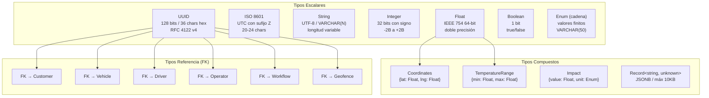

---

# 3. Modelo de Dominio

> **Convención de Cardinalidad Formal** — En las tablas de entidades, la columna "Obligatorio" (Sí/No) se corresponde con la notación de cardinalidad formal según el siguiente mapeo. Esta notación sigue el estándar del *CasoEstudioSistema.md* §VI para documentación de estructura de datos.

| Símbolo en Tabla | Cardinalidad Formal | Significado | Ejemplo |
|---|---|---|---|
| Sí (campo escalar) | **(1,1)** | Exactamente un valor, obligatorio | `customerId`, `status`, `orderNumber` |
| No (campo escalar) | **(0,1)** | Cero o un valor, opcional | `carrierId`, `externalReference`, `cancelledAt` |
| Sí (campo array, min ≥ 1) | **(1,*)** | Uno o más valores, obligatorio | `milestones` (min 2), `statusHistory` (min 1) |
| No (campo array) | **(0,*)** | Cero o más valores, opcional | `tags`, `incidents`, `deliveryPhotos` |
| Sí (sub-entidad) | **(1,1)** | Exactamente una sub-entidad | — |
| No (sub-entidad) | **(0,1)** | Cero o una sub-entidad | `cargo`, `closureData`, `manualEntryData` |

## 3.1 Entidad Raíz: `Order`

| # | Campo | Tipo de Dato Exacto | Formato / Patrón | Longitud / Rango | Obligatorio | Valor por Defecto | Ejemplo | Descripción |
|---|---|---|---|---|:---:|---|---|---|
| 1 | `id` | `UUID` (string, 128-bit hex) | `xxxxxxxx-xxxx-4xxx-yxxx-xxxxxxxxxxxx` RFC 4122 v4 | 36 chars exactos | Sí | Auto-generado por backend | `"550e8400-e29b-41d4-a716-446655440000"` | Identificador único inmutable de la orden. Generado al momento de persistir. |
| 2 | `orderNumber` | `String` (VARCHAR) | `ORD-{YYYY}-{SECUENCIA_5_DIGITOS}` — Regex: `/^ORD-\d{4}-\d{5}$/` | 14 chars exactos | Sí | Auto-generado | `"ORD-2026-00051"` | Número de orden legible para humanos. **Único** a nivel global. Secuencia autoincremental por año. |
| 3 | `externalReference` | `String` (VARCHAR) | Alfanumérico libre + guiones, puntos, barras | 0–100 chars | No | `null` | `"GR-000123"` | Referencia del sistema externo del cliente (guía de remisión, booking, número de viaje). Usado para trazabilidad cruzada. |
| 4 | `customerId` | `UUID` — FK → `customers.id` | RFC 4122 v4 (ver §2.1) | 36 chars | Sí | — | `"cust-550e8400-e29b-..."` | Clave foránea al cliente que solicita el servicio. **Debe existir y estar activo** en tabla `customers`. |
| 5 | `customerName` | `String` (VARCHAR) | UTF-8 libre | 1–200 chars | Sí | Copiado de `customers.name` al crear | `"Minera Cerro Verde S.A.A."` | **Campo desnormalizado.** Se copia del maestro de clientes al momento de creación para evitar JOINs en consultas de lista. |
| 6 | `carrierId` | `UUID` — FK → `operators.id` (tipo=carrier) | RFC 4122 v4 | 36 chars | No | `null` | `"car-550e8400-..."` | Transportista tercero asignado. Solo aplica si el servicio lo ejecuta un operador externo. |
| 7 | `carrierName` | `String` (VARCHAR) | UTF-8 libre | 0–200 chars | No | `null` / copiado de `operators.name` | `"Transportes Cruz del Sur"` | **Desnormalizado.** Nombre del transportista. |
| 8 | `vehicleId` | `UUID` — FK → `vehicles.id` | RFC 4122 v4 | 36 chars | No | `null` | `"veh-550e8400-..."` | Vehículo asignado. Se asigna al transicionar a `assigned`. **Validación:** no debe tener conflicto de horario (ver §20). |
| 9 | `vehiclePlate` | `String` (VARCHAR) | Formato placa peruana: `/^[A-Z]{3}-\d{3,4}$/` | 7–8 chars | No | `null` / copiado de `vehicles.plate` | `"ABC-1234"` | **Desnormalizado.** Placa del vehículo asignado. Formato Perú: 3 letras + guion + 3-4 dígitos. |
| 10 | `driverId` | `UUID` — FK → `drivers.id` | RFC 4122 v4 | 36 chars | No | `null` | `"drv-550e8400-..."` | Conductor asignado. Se asigna junto con `vehicleId`. **Validación:** sin conflicto de horario y con licencia vigente. |
| 11 | `driverName` | `String` (VARCHAR) | UTF-8 libre | 0–200 chars | No | `null` / copiado de `drivers.fullName` | `"Carlos Rodríguez Mendoza"` | **Desnormalizado.** Nombre completo del conductor. |
| 12 | `gpsOperatorId` | `UUID` — FK → `operators.id` (tipo=gps) | RFC 4122 v4 | 36 chars | No | `null` | `"gps-op-550e8400-..."` | Operador GPS externo (Wialon, Navitel Fleet, etc.). Necesario para sincronización. |
| 13 | `gpsOperatorName` | `String` (VARCHAR) | UTF-8 libre | 0–200 chars | No | `null` / copiado de `operators.name` | `"Wialon Perú"` | **Desnormalizado.** Nombre del operador GPS. |
| 14 | `serviceType` | `Enum<ServiceType>` — (string) | Solo valores del enum `ServiceType` (ver §5.1). 9 valores posibles. | 3–25 chars | Sí | — | `"distribucion"` | Tipo de servicio de transporte. Determina reglas de negocio y workflows compatibles. |
| 15 | `priority` | `Enum<OrderPriority>` — (string) | Solo valores: `low` · `normal` · `high` · `urgent` | 3–6 chars | Sí | `"normal"` | `"high"` | Nivel de prioridad. Afecta ordenamiento en lista y SLA de atención. |
| 16 | `status` | `Enum<OrderStatus>` — (string) | Solo valores: `draft` · `pending` · `assigned` · `in_transit` · `at_milestone` · `delayed` · `completed` · `closed` · `cancelled`. 9 valores. | 5–12 chars | Sí | `"draft"` | `"in_transit"` | Estado actual en la máquina de estados (ver §6). **Solo se modifica vía transiciones controladas.** |
| 17 | `syncStatus` | `Enum<OrderSyncStatus>` — (string) | Solo valores: `not_sent` · `pending` · `sending` · `sent` · `error` · `retry`. 6 valores. | 4–8 chars | Sí | `"not_sent"` | `"sent"` | Estado de sincronización con proveedor GPS externo (ver §8). |
| 18 | `syncErrorMessage` | `String` (TEXT) | UTF-8 libre | 0–2000 chars | No | `null` | `"Timeout de conexión con Wialon API"` | Mensaje de error de la última sincronización fallida. Se limpia al siguiente envío exitoso. Solo poblado si `syncStatus = "error"`. |
| 19 | `lastSyncAttempt` | `ISO 8601 Datetime` (string, UTC) | `YYYY-MM-DDTHH:mm:ss.sssZ` | 24 chars | No | `null` | `"2026-02-23T15:30:00.000Z"` | Timestamp UTC del último intento de sincronización (exitoso o fallido). |
| 20 | `milestones` | `Array<OrderMilestone>` — JSON array | Array de objetos (ver §3.2) | Mín. 2, máx. 50 elementos | Sí | `[]` → pero mín. 2 al confirmar | `[{id: "...", name: "Almacén",...}]` | Lista ordenada de hitos de ruta. **Mínimo 2:** un `origin` (secuencia 1) y un `destination` (última secuencia). |
| 21 | `cargo` | `Object<OrderCargo>` — JSON object | Objeto anidado (ver §3.3) | — | No | `null` | `{type: "general", weight: 5000,...}` | Datos de la carga transportada. Nulo si aún no se define la carga. |
| 22 | `workflowId` | `UUID` — FK → `workflows.id` | RFC 4122 v4 | 36 chars | No | `null` (auto-asignado) | `"wf-550e8400-..."` | Workflow operativo asignado. Puede ser auto-asignado por `moduleConnectorService` según `serviceType` y `cargo.type`. |
| 23 | `workflowName` | `String` (VARCHAR) | UTF-8 libre | 0–200 chars | No | `null` / copiado de `workflows.name` | `"Workflow Estándar"` | **Desnormalizado.** Nombre del workflow. |
| 24 | `scheduledStartDate` | `ISO 8601 Datetime` (string, UTC) | `YYYY-MM-DDTHH:mm:ss.sssZ` | 24 chars | No | `null` | `"2026-02-24T08:00:00.000Z"` | Fecha/hora programada de inicio del servicio. **Debe ser anterior a `scheduledEndDate`** (validación cross-field). |
| 25 | `scheduledEndDate` | `ISO 8601 Datetime` (string, UTC) | `YYYY-MM-DDTHH:mm:ss.sssZ` | 24 chars | No | `null` | `"2026-02-25T12:00:00.000Z"` | Fecha/hora programada de fin del servicio. |
| 26 | `actualStartDate` | `ISO 8601 Datetime` (string, UTC) | `YYYY-MM-DDTHH:mm:ss.sssZ` | 24 chars | No | `null` → se llena al iniciar viaje | `"2026-02-24T08:15:00.000Z"` | Fecha/hora real de inicio. Se registra automáticamente cuando `status` cambia a `in_transit`. |
| 27 | `actualEndDate` | `ISO 8601 Datetime` (string, UTC) | `YYYY-MM-DDTHH:mm:ss.sssZ` | 24 chars | No | `null` → se llena al completar | `"2026-02-25T10:30:00.000Z"` | Fecha/hora real de finalización. Se registra cuando `status` cambia a `completed`. |
| 28 | `estimatedDistance` | `Float` (número decimal, 64-bit IEEE 754) | Positivo o cero. 2 decimales recomendados. Unidad: **kilómetros**. | 0.00 – 99,999.99 | No | `null` | `1050.00` | Distancia estimada de la ruta en kilómetros. Puede calcularse desde coordenadas de hitos. |
| 29 | `actualDistance` | `Float` (número decimal, 64-bit IEEE 754) | Positivo o cero. 2 decimales. Unidad: **kilómetros**. | 0.00 – 99,999.99 | No | `null` → se llena al cerrar | `1087.50` | Distancia real recorrida, reportada por GPS o ingresada manualmente al cierre. |
| 30 | `completionPercentage` | `Integer` (número entero, 32-bit) | Entero sin decimales. Unidad: **porcentaje**. | 0 – 100 | Sí | `0` | `67` | Porcentaje calculado: `Math.round((hitos_completed / total_hitos) × 100)`. Se recalcula cada vez que un hito cambia de estado. |
| 31 | `statusHistory` | `Array<StatusHistoryEntry>` — JSON array | Array de objetos (ver §3.5) | Mín. 1 (registro inicial) | Sí | `[{fromStatus:"draft", toStatus:"draft"}]` | `[{...}, {...}]` | Historial **inmutable** de transiciones de estado. Nunca se elimina ni modifica un registro existente. |
| 32 | `closureData` | `Object<OrderClosureData>` — JSON object | Objeto anidado (ver §3.4). Solo poblado si `status = "closed"`. | — | No | `null` | `{observations: "Sin novedades",...}` | Datos de cierre administrativo. Se crea al ejecutar `POST /:id/close`. |
| 33 | `cancellationReason` | `String` (TEXT) | UTF-8 libre | 1–1000 chars | No (obligatorio si `status = cancelled`) | `null` | `"Solicitud del cliente"` | Motivo de cancelación. **Obligatorio** al transicionar a `cancelled`. |
| 34 | `cancelledAt` | `ISO 8601 Datetime` (string, UTC) | `YYYY-MM-DDTHH:mm:ss.sssZ` | 24 chars | No (auto si se cancela) | `null` | `"2026-02-23T18:00:00.000Z"` | Timestamp del momento de cancelación. Se registra automáticamente por el backend. |
| 35 | `cancelledBy` | `String` (VARCHAR) — ID de usuario | Formato de ID del sistema de auth | 1–100 chars | No (auto si se cancela) | `null` | `"user-001"` | ID del usuario que ejecutó la cancelación. |
| 36 | `notes` | `String` (TEXT) | UTF-8 libre, multilinea | 0–1000 chars | No | `null` | `"Cliente requiere notificación 2h antes"` | Notas generales de la orden. Visibles para todos los operadores. |
| 37 | `tags` | `Array<String>` — JSON array | Cada tag: UTF-8, sin espacios en blanco al inicio/fin | Cada tag: 1–50 chars. Array: 0–20 elementos. | No | `[]` | `["urgente", "nuevo-cliente"]` | Etiquetas para clasificación libre y filtrado. |
| 38 | `reference` | `String` (VARCHAR) | Alfanumérico + guiones, puntos, barras | 0–200 chars | No | `null` | `"BL-2026-00123"` | Referencia documental (Bill of Lading, guía, factura). |
| 39 | `metadata` | `Record<string, unknown>` — JSON object (JSONB) | Pares clave-valor genéricos. Clave: solo `a-z`, `A-Z`, `0-9`, `_`. | Máx. 10 KB total | No | `{}` | `{"ruta_interna": "R-05", "turno": "noche"}` | Metadatos extensibles para integraciones custom. Sin validación estricta del contenido. |
| 40 | `createdAt` | `ISO 8601 Datetime` (string, UTC) | `YYYY-MM-DDTHH:mm:ss.sssZ` | 24 chars | Sí | Auto-generado por backend: `new Date().toISOString()` | `"2026-02-23T15:30:00.000Z"` | Timestamp de creación. **Inmutable** después de la inserción. |
| 41 | `updatedAt` | `ISO 8601 Datetime` (string, UTC) | `YYYY-MM-DDTHH:mm:ss.sssZ` | 24 chars | Sí | Igual a `createdAt` al inicio | `"2026-02-23T16:45:00.000Z"` | Timestamp de última modificación. Se actualiza en **cada** operación de escritura sobre la orden. |
| 42 | `createdBy` | `String` (VARCHAR) — ID de usuario | Formato de ID del sistema de auth | 1–100 chars | Sí | ID del usuario autenticado | `"user-001"` | ID del usuario que creó la orden. Se extrae del token JWT. |

## 3.2 Sub-entidad: `OrderMilestone` — Hito de Ruta

| # | Campo | Tipo de Dato Exacto | Formato / Patrón | Longitud / Rango | Obligatorio | Valor por Defecto | Ejemplo | Descripción |
|---|---|---|---|---|:---:|---|---|---|
| 1 | `id` | `UUID` (string, 128-bit hex) | RFC 4122 v4 | 36 chars | Sí | Auto-generado | `"ms-550e8400-..."` | Identificador único del hito. |
| 2 | `orderId` | `UUID` — FK → `orders.id` | RFC 4122 v4 | 36 chars | Sí | ID de la orden padre | `"ord-550e8400-..."` | Referencia a la orden que contiene este hito. |
| 3 | `name` | `String` (VARCHAR) | UTF-8 libre | 1–200 chars | Sí | — | `"Almacén Central Lima"` | Nombre descriptivo del punto geográfico. |
| 4 | `type` | `Enum<MilestoneType>` (string) | Solo: `"origin"` · `"waypoint"` · `"destination"` | 6–11 chars | Sí | — | `"origin"` | Clasificación del hito. `origin`: punto de partida (solo 1 por orden, secuencia=1). `waypoint`: punto intermedio (0 a N). `destination`: punto final (solo 1 por orden, última secuencia). |
| 5 | `sequence` | `Integer` (32-bit) | Entero positivo. Secuencial sin saltos. | 1 – 50 | Sí | — | `1` | Posición en la ruta. Debe ser único dentro de la orden. `origin` siempre es `1`, `destination` siempre es el mayor. |
| 6 | `address` | `String` (VARCHAR) | UTF-8 libre | 1–500 chars | Sí | — | `"Av. Argentina 1234, Callao"` | Dirección legible para humanos. |
| 7 | `coordinates` | `Coordinates` — `{ lat: Float, lng: Float }` | `lat`: Float64, 6 decimales, rango [-90, 90]. `lng`: Float64, 6 decimales, rango [-180, 180]. | — | Sí | — | `{"lat": -12.046400, "lng": -77.042800}` | Coordenadas geográficas en sistema WGS 84 (EPSG:4326). |
| 8 | `geofenceId` | `UUID` — FK → `geofences.id` | RFC 4122 v4 | 36 chars | No | `null` | `"geo-550e8400-..."` | Geocerca asociada para detección automática de entrada/salida. Si es `null`, no hay detección GPS automática. |
| 9 | `geofenceName` | `String` (VARCHAR) | UTF-8 libre | 0–200 chars | No | `null` / copiado de `geofences.name` | `"GEO Almacén Central"` | **Desnormalizado.** Nombre de la geocerca. |
| 10 | `status` | `Enum<MilestoneStatus>` (string) | Solo: `"pending"` · `"approaching"` · `"arrived"` · `"in_progress"` · `"completed"` · `"skipped"` · `"delayed"`. 7 valores. | 6–11 chars | Sí | `"pending"` | `"completed"` | Estado actual del hito (ver §7). |
| 11 | `estimatedArrival` | `ISO 8601 Datetime` (string, UTC) | `YYYY-MM-DDTHH:mm:ss.sssZ` | 24 chars | No | `null` | `"2026-02-24T08:00:00.000Z"` | ETA (hora estimada de llegada) al punto. |
| 12 | `estimatedDeparture` | `ISO 8601 Datetime` (string, UTC) | `YYYY-MM-DDTHH:mm:ss.sssZ` | 24 chars | No | `null` | `"2026-02-24T10:00:00.000Z"` | Hora estimada de salida del punto. |
| 13 | `actualArrival` | `ISO 8601 Datetime` (string, UTC) | `YYYY-MM-DDTHH:mm:ss.sssZ` | 24 chars | No | `null` → se llena al detectar entrada | `"2026-02-24T08:15:00.000Z"` | Hora real de llegada. Registrada por GPS automático o entrada manual. |
| 14 | `actualDeparture` | `ISO 8601 Datetime` (string, UTC) | `YYYY-MM-DDTHH:mm:ss.sssZ` | 24 chars | No | `null` → se llena al detectar salida | `"2026-02-24T09:45:00.000Z"` | Hora real de salida. Registrada por GPS o manual. |
| 15 | `dwellTime` | `Integer` (32-bit) | Entero no negativo. Unidad: **minutos**. Calculado: `(actualDeparture - actualArrival) / 60000`. | 0 – 99,999 | No | `null` → calculado al registrar salida | `90` | Tiempo de permanencia en el punto. |
| 16 | `delayMinutes` | `Integer` (32-bit con signo) | Entero con signo. **Positivo** = retraso, **negativo** = adelanto. Calculado: `actualArrival - estimatedArrival` en minutos. | -99,999 – +99,999 | No | `null` | `15` (= 15 min de retraso) | Diferencia entre hora real y estimada de llegada. |
| 17 | `contactName` | `String` (VARCHAR) | UTF-8 libre | 0–200 chars | No | `null` | `"Juan Pérez"` | Nombre del contacto en el punto de entrega/recepción. |
| 18 | `contactPhone` | `Phone` (string) | E.164 recomendado: `/^\+?\d[\d\s-]{6,18}$/` | 7–20 chars | No | `null` | `"+51 999 111 222"` | Teléfono del contacto. |
| 19 | `notes` | `String` (TEXT) | UTF-8 libre, multilinea | 0–1000 chars | No | `null` | `"Preguntar por el jefe de almacén"` | Notas específicas del hito. |
| 20 | `isManual` | `Boolean` (1-bit) | `true` o `false` | — | No | `false` | `true` | Indica que la entrada/salida fue registrada manualmente (no por GPS automático). |
| 21 | `manualEntryData` | `Object<ManualEntryData>` — JSON object | Solo si `isManual = true`. Ver detalle abajo. | — | No (obligatorio si `isManual = true`) | `null` | `{registeredBy: "user-001",...}` | Datos de la entrada manual: quién, cuándo, por qué. |

### Detalle de `ManualEntryData` (sub-objeto de OrderMilestone)

| # | Campo | Tipo de Dato Exacto | Formato / Patrón | Longitud | Obligatorio | Ejemplo | Descripción |
|---|---|---|---|---|:---:|---|---|
| 1 | `registeredBy` | `String` (VARCHAR) — ID de usuario | Formato auth | 1–100 chars | Sí | `"user-001"` | ID del operador que registró manualmente. |
| 2 | `registeredByName` | `String` (VARCHAR) | UTF-8 libre | 1–200 chars | Sí | `"Ana Torres"` | Nombre del operador. |
| 3 | `registeredAt` | `ISO 8601 Datetime` (string, UTC) | `YYYY-MM-DDTHH:mm:ss.sssZ` | 24 chars | Sí | `"2026-02-24T08:20:00.000Z"` | Timestamp del registro manual. |
| 4 | `reason` | `Enum<ManualEntryReason>` (string) | Solo: `"sin_senal_gps"` · `"falla_equipo"` · `"carga_retroactiva"` · `"correccion"` · `"otro"` | 4–20 chars | Sí | `"sin_senal_gps"` | Motivo del registro manual. |
| 5 | `observation` | `String` (TEXT) | UTF-8 libre | 0–1000 chars | No | `"Sin señal GPS en zona minera"` | Observación adicional del operador. |
| 6 | `evidenceUrls` | `Array<URL>` (string[]) | Cada URL: protocolo `https://`, máx 2048 chars. | 0–10 URLs | No | `["https://storage.../foto1.jpg"]` | URLs de evidencias digitales adjuntas. |

## 3.3 Sub-entidad: `OrderCargo` — Datos de Carga

| # | Campo | Tipo de Dato Exacto | Formato / Patrón | Rango / Longitud | Obligatorio | Valor por Defecto | Ejemplo | Descripción |
|---|---|---|---|---|:---:|---|---|---|
| 1 | `type` | `Enum<CargoType>` (string) | Solo valores del enum `CargoType` (ver §5.3). 7 valores. | 4–11 chars | Sí | — | `"general"` | Clasificación del tipo de carga. Determina condiciones de transporte y validaciones condicionales. |
| 2 | `description` | `String` (VARCHAR) | UTF-8 libre | 3–500 chars | Sí | — | `"Materiales de construcción - Lote 45"` | Descripción detallada de la mercancía. Mínimo 3 caracteres para garantizar un texto significativo. |
| 3 | `weight` | `Float` (64-bit IEEE 754) | Número positivo con hasta 2 decimales. Unidad: **kilogramos (kg)**. | 0.01 – 100,000.00 | Sí | — | `5000.00` | Peso total de la carga. Límite superior: 100 toneladas métricas (capacidad máxima camión articulado). |
| 4 | `volume` | `Float` (64-bit IEEE 754) | Número positivo con hasta 2 decimales. Unidad: **metros cúbicos (m³)**. | 0.01 – 1,000.00 | No | `null` | `25.50` | Volumen total. Límite: 1000 m³ (contenedor 40' HQ ≈ 76 m³, este rango cubre casos especiales). |
| 5 | `quantity` | `Integer` (32-bit) | Entero positivo estricto. Sin decimales. Unidad: **bultos/unidades/cajas**. | 1 – 99,999 | Sí | — | `50` | Cantidad de piezas, bultos, cajas o pallets. |
| 6 | `declaredValue` | `Float` (64-bit IEEE 754) | Número no negativo con hasta 2 decimales. Unidad: **USD** (dólar americano). | 0.00 – 999,999,999.99 | No | `null` | `75000.00` | Valor declarado para efectos de seguro y aduana. |
| 7 | `requiresRefrigeration` | `Boolean` (1-bit) | `true` o `false` | — | No | `false` | `true` | Indica si la carga necesita cadena de frío. **Si `true`, entonces `temperatureRange` es obligatorio.** |
| 8 | `temperatureRange` | `TemperatureRange` — `{ min: Float, max: Float }` | `min` y `max` en grados Celsius (°C). Float64. Restricción: `min < max`. | min: -200 a +100. max: -200 a +100. | No (obligatorio si `requiresRefrigeration = true`) | `null` | `{"min": -18, "max": -12}` | Rango de temperatura aceptable. Ejemplo frío: -18 a -12°C (congelado). Ejemplo fresco: 2 a 8°C. |
| 9 | `hazardousClass` | `String` (VARCHAR) | Clase UN de materia peligrosa. Regex: `/^[1-9](\.\d)?$/` | 1–3 chars | No (obligatorio si `type = "hazardous"`) | `null` | `"3"` (líquidos inflamables) | Clasificación UN de materiales peligrosos. Clases 1-9. Ejemplo: 1=Explosivos, 2=Gases, 3=Líquidos inflamables, 6.1=Tóxicos, 8=Corrosivos. |
| 10 | `specialInstructions` | `String` (TEXT) | UTF-8 libre, multilinea | 0–2000 chars | No | `null` | `"No apilar más de 3 niveles. Manipular con guantes."` | Instrucciones especiales para el manejo, carga y descarga. |

## 3.4 Sub-entidad: `OrderClosureData` — Datos de Cierre

| # | Campo | Tipo de Dato Exacto | Formato / Patrón | Rango / Longitud | Obligatorio | Valor por Defecto | Ejemplo | Descripción |
|---|---|---|---|---|:---:|---|---|---|
| 1 | `completedMilestones` | `Integer` (32-bit) | Entero no negativo. | 0 – total_hitos | Sí | Calculado por backend | `3` | Cantidad de hitos con `status = "completed"`. Restricción: ≤ `totalMilestones`. |
| 2 | `totalMilestones` | `Integer` (32-bit) | Entero positivo. | 2 – 50 | Sí | Calculado por backend | `3` | Total de hitos en la orden al momento del cierre. |
| 3 | `totalDistanceKm` | `Float` (64-bit) | No negativo, 2 decimales. Unidad: **km**. | 0.00 – 99,999.99 | Sí | — | `1050.25` | Distancia total recorrida durante el servicio. |
| 4 | `totalDurationMinutes` | `Integer` (32-bit) | Entero no negativo. Unidad: **minutos**. | 0 – 525,600 (= 1 año) | Sí | — | `960` (= 16 horas) | Duración total de la operación desde inicio hasta último hito. |
| 5 | `observations` | `String` (TEXT) | UTF-8 libre, multilinea | 1–5000 chars | Sí | — | `"Viaje completado sin novedades."` | Observaciones del cierre. **Campo obligatorio** — mínimo 1 carácter. |
| 6 | `closedAt` | `ISO 8601 Datetime` (string, UTC) | `YYYY-MM-DDTHH:mm:ss.sssZ` | 24 chars | Sí | **Auto-generado por backend:** `new Date().toISOString()` | `"2026-02-25T14:00:00.000Z"` | Timestamp del cierre. **NO lo envía el frontend, lo genera el backend.** |
| 7 | `closedBy` | `String` (VARCHAR) — ID de usuario | Formato auth | 1–100 chars | Sí | ID del usuario autenticado | `"user-003"` | ID del usuario que ejecutó el cierre. |
| 8 | `closedByName` | `String` (VARCHAR) | UTF-8 libre | 1–200 chars | Sí | Nombre del usuario autenticado | `"María Supervisor"` | Nombre del usuario que cerró. |
| 9 | `customerSignature` | `Base64 String` o `URL` (string) | Base64 con prefijo MIME: `data:image/png;base64,...` o URL HTTPS. | Máx. 500 KB (base64) o 2048 chars (URL) | No | `null` | `"data:image/png;base64,iVBOR..."` | Firma digital capturada del cliente. |
| 10 | `deliveryPhotos` | `Array<URL>` (string[]) | Cada URL: protocolo `https://`, máx 2048 chars. | 0–20 URLs | No | `[]` | `["https://storage.../photo_1.jpg"]` | Fotos de evidencia de entrega. |
| 11 | `customerRating` | `Integer` (32-bit) | Entero. Escala Likert de 5 puntos. | 1 – 5 | No | `null` | `5` | Valoración del cliente sobre el servicio. 1=Muy malo, 5=Excelente. |
| 12 | `fuelConsumed` | `Float` (64-bit) | No negativo, 2 decimales. Unidad: **litros**. | 0.00 – 99,999.99 | No | `null` | `320.50` | Combustible consumido durante el servicio. |
| 13 | `tollsCost` | `Float` (64-bit) | No negativo, 2 decimales. Unidad: **USD**. | 0.00 – 999,999.99 | No | `null` | `245.50` | Costo total de peajes pagados en la ruta. |
| 14 | `incidents` | `Array<OrderIncidentRecord>` — JSON array | Array de objetos (ver §3.6). | 0–50 registros | No | `[]` | `[{id: "...", severity: "medium",...}]` | Incidencias registradas durante el servicio. |
| 15 | `deviationReasons` | `Array<DeviationReason>` — JSON array | Array de objetos (ver §3.7). | 0–20 registros | No | `[]` | `[{type: "time", description: "..."}]` | Motivos de desviación respecto al plan original. |
| 16 | `attachments` | `Array<OrderAttachment>` — JSON array | Array de objetos. Cada uno: `{id: UUID, name: String, url: URL, type: Enum}`. | 0–50 archivos | No | `[]` | `[{id: "...", name: "guia.pdf",...}]` | Documentos adjuntos: guías, facturas, permisos, PODs. |
| 17 | `signature` | `Base64 String` (string) | Base64 con prefijo MIME | Máx. 500 KB | No | `null` | `"data:image/png;base64,..."` | Firma digital de conformidad del operador o supervisor. |

## 3.5 Sub-entidad: `StatusHistoryEntry`

| # | Campo | Tipo de Dato Exacto | Formato / Patrón | Longitud | Obligatorio | Ejemplo | Descripción |
|---|---|---|---|---|:---:|---|---|
| 1 | `id` | `UUID` (string, 128-bit hex) | RFC 4122 v4 | 36 chars | Sí | `"hist-550e8400-..."` | ID único del registro de historial. |
| 2 | `fromStatus` | `Enum<OrderStatus>` (string) | Solo los 9 valores de OrderStatus | 5–12 chars | Sí | `"pending"` | Estado desde el cual se transicionó. |
| 3 | `toStatus` | `Enum<OrderStatus>` (string) | Solo los 9 valores de OrderStatus | 5–12 chars | Sí | `"assigned"` | Estado al cual se transicionó. |
| 4 | `changedAt` | `ISO 8601 Datetime` (string, UTC) | `YYYY-MM-DDTHH:mm:ss.sssZ` | 24 chars | Sí | `"2026-02-23T16:00:00.000Z"` | Timestamp exacto del cambio. |
| 5 | `changedBy` | `String` (VARCHAR) — ID de usuario | Formato auth | 1–100 chars | Sí | `"user-001"` | ID del usuario o sistema que ejecutó el cambio. |
| 6 | `changedByName` | `String` (VARCHAR) | UTF-8 libre | 1–200 chars | Sí | `"Juan Operador"` | Nombre legible del ejecutor. |
| 7 | `reason` | `String` (TEXT) | UTF-8 libre | 0–1000 chars | No | `"Recursos asignados"` | Motivo o comentario de la transición. Obligatorio para `cancelled`; opcional para el resto. |

## 3.6 Sub-entidad: `OrderIncidentRecord`

| # | Campo | Tipo de Dato Exacto | Formato / Patrón | Longitud / Rango | Obligatorio | Ejemplo | Descripción |
|---|---|---|---|---|:---:|---|---|
| 1 | `id` | `UUID` (string, 128-bit hex) | RFC 4122 v4 | 36 chars | Sí | `"inc-550e8400-..."` | ID único del registro de incidencia. |
| 2 | `incidentCatalogId` | `UUID` — FK → `incident_catalog.id` | RFC 4122 v4 | 36 chars | No | `"cat-VEH-001"` | FK al catálogo tipificado. Si es `null`, la incidencia es **libre** (no catalogada). |
| 3 | `incidentName` | `String` (VARCHAR) | UTF-8 libre | 1–200 chars | Sí | `"Falla mecánica - motor"` | Nombre descriptivo de la incidencia. |
| 4 | `freeDescription` | `String` (TEXT) | UTF-8 libre, multilinea | 1–5000 chars | Sí | `"Motor se sobrecalentó en..."` | Descripción detallada del incidente. |
| 5 | `severity` | `Enum<IncidentSeverity>` (string) | Solo: `"low"` · `"medium"` · `"high"` · `"critical"` | 3–8 chars | Sí | `"high"` | Severidad: `low`=informativo, `medium`=menor, `high`=significativo, `critical`=emergencia. |
| 6 | `occurredAt` | `ISO 8601 Datetime` (string, UTC) | `YYYY-MM-DDTHH:mm:ss.sssZ` | 24 chars | Sí | `"2026-02-24T14:30:00.000Z"` | Fecha/hora en que ocurrió la incidencia. |
| 7 | `milestoneId` | `UUID` — FK → `order_milestones.id` | RFC 4122 v4 | 36 chars | No | `"ms-550e8400-..."` | Hito donde ocurrió. `null` si ocurrió en tránsito entre hitos. |
| 8 | `actionTaken` | `String` (TEXT) | UTF-8 libre | 0–2000 chars | No | `"Se llamó a grúa y se..."` | Acción correctiva tomada. |
| 9 | `evidence` | `Array<OrderAttachment>` — JSON array | Cada adjunto: `{id, name, url, type}` | 0–10 archivos | No | `[{id: "...", name: "foto.jpg",...}]` | Fotos, documentos o videos de evidencia. |

## 3.7 Sub-entidad: `DeviationReason`

| # | Campo | Tipo de Dato Exacto | Formato / Patrón | Longitud / Rango | Obligatorio | Ejemplo | Descripción |
|---|---|---|---|---|:---:|---|---|
| 1 | `id` | `UUID` (string, 128-bit hex) | RFC 4122 v4 | 36 chars | Sí | `"dev-550e8400-..."` | ID único del registro de desviación. |
| 2 | `type` | `Enum<DeviationType>` (string) | Solo: `"route"` · `"time"` · `"cargo"` · `"other"` | 4–5 chars | Sí | `"time"` | Tipo de desviación: `route`=cambio de ruta, `time`=demora, `cargo`=problema de carga, `other`=otro. |
| 3 | `description` | `String` (TEXT) | UTF-8 libre | 1–2000 chars | Sí | `"Retraso por tráfico en zona urbana de Lima"` | Descripción detallada del motivo de desviación. |
| 4 | `impact` | `Impact` — `{ value: Float, unit: Enum }` | `value`: Float64 positivo. `unit`: `"minutes"` · `"hours"` · `"kilometers"` | value: 0.01–99,999 | Sí | `{"value": 45, "unit": "minutes"}` | Cuantificación del impacto de la desviación. |
| 5 | `documentation` | `String` (TEXT) | UTF-8 libre | 0–2000 chars | No | `"Adjunto parte policial #27561"` | Referencia a documentación de respaldo. |

---

## 3.8 Diagrama de Clases UML

> **Notación UML 2.5** — Clases con 3 secciones: nombre de la clase (estereotipo), atributos con visibilidad (`-` privado, `+` público, `#` protegido) y tipo, métodos con firma completa. 
> **Relaciones:** Composición (◆ relleno — el contenedor destruye las partes), Agregación (◇ vacío — relación parte-de sin propiedad exclusiva), Asociación (→ — vínculo semántico), Dependencia (--→ — uso temporario).

### 3.8.1 Diagrama de Clases del Modelo de Dominio

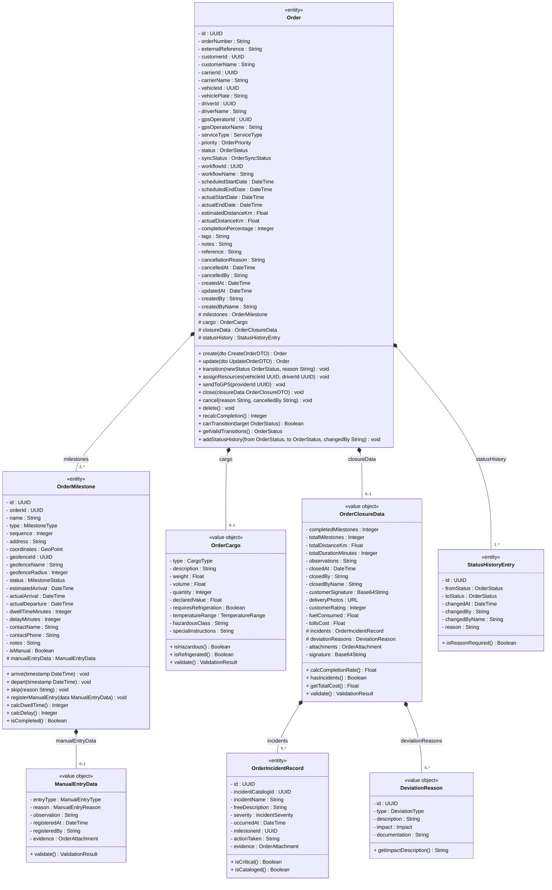

### 3.8.2 Relaciones Externas (Asociaciones y Dependencias)

Las siguientes entidades pertenecen a **otros módulos** del TMS y se vinculan a `Order` mediante claves foráneas (asociaciones con multiplicidad):

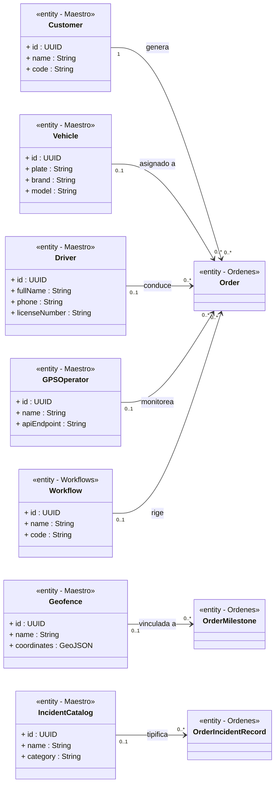

### 3.8.3 Tabla Resumen de Relaciones

| Clase Origen | Relación | Multiplicidad | Clase Destino | Tipo UML | Justificación |
|---|---|---|---|---|---|
| `Order` | milestones | 1 → 2..* | `OrderMilestone` | Composición (◆) | Una orden siempre tiene ≥2 hitos (origen + destino). Se eliminan con la orden. |
| `Order` | cargo | 1 → 0..1 | `OrderCargo` | Composición (◆) | Carga es opcional (courier sin detalles de carga). Se elimina con la orden. |
| `Order` | closureData | 1 → 0..1 | `OrderClosureData` | Composición (◆) | Solo existe cuando la orden alcanza estado `closed`. Se elimina con la orden. |
| `Order` | statusHistory | 1 → 1..* | `StatusHistoryEntry` | Composición (◆) | Al menos 1 entrada (la creación `draft→draft`). Se eliminan con la orden. |
| `OrderClosureData` | incidents | 1 → 0..* | `OrderIncidentRecord` | Composición (◆) | Incidencias registradas durante el servicio. |
| `OrderClosureData` | deviationReasons | 1 → 0..* | `DeviationReason` | Composición (◆) | Motivos de desviación respecto al plan. |
| `OrderMilestone` | manualEntryData | 1 → 0..1 | `ManualEntryData` | Composición (◆) | Solo existe si el registro del hito fue manual. |
| `Customer` | genera | 1 → 0..* | `Order` | Asociación (→) | Un cliente puede tener muchas órdenes. |
| `Vehicle` | asignado a | 0..1 → 0..* | `Order` | Asociación (→) | Vehículo es opcional (se asigna después de la creación). |
| `Driver` | conduce | 0..1 → 0..* | `Order` | Asociación (→) | Conductor es opcional. |
| `Geofence` | vinculada a | 0..1 → 0..* | `OrderMilestone` | Asociación (→) | Un hito puede o no tener geocerca vinculada. |
| `Workflow` | rige | 0..1 → 0..* | `Order` | Asociación (→) | Una orden puede no tener workflow asignado. |
| `IncidentCatalog` | tipifica | 0..1 → 0..* | `OrderIncidentRecord` | Asociación (→) | Si `null`, la incidencia es libre (no catalogada). |

### 3.8.4 Métodos por Clase — Especificación Detallada

| Clase | Método | Firma Completa | Retorno | Descripción | Reglas de Negocio |
|---|---|---|---|---|---|
| `Order` | `create` | `create(dto: CreateOrderDTO): Order` | `Order` | Crea una orden nueva en estado `draft`, genera `UUID` y `orderNumber`. | RN: status=draft, syncStatus=not_sent, completionPercentage=0 |
| `Order` | `update` | `update(dto: UpdateOrderDTO): Order` | `Order` | Actualiza campos editables. Solo en estados `draft` o `pending`. | RN: No se puede editar en estados terminales |
| `Order` | `transition` | `transition(newStatus: OrderStatus, reason?: String): void` | `void` | Ejecuta una transición de estado validando §6.2. | RN: Valida tabla de transiciones + precondiciones |
| `Order` | `assignResources` | `assignResources(vehicleId: UUID, driverId: UUID): void` | `void` | Asigna vehículo y conductor. Verifica conflictos de horario. | RN: No puede haber conflicto temporal con otra orden |
| `Order` | `sendToGPS` | `sendToGPS(providerId: UUID): void` | `void` | Envía la orden al proveedor GPS externo. | RN: syncStatus pasa a "sending" |
| `Order` | `close` | `close(closureData: OrderClosureDTO): void` | `void` | Cierre administrativo con métricas. Solo si status=completed. | RN: observations obligatorio, closedAt auto-generado |
| `Order` | `cancel` | `cancel(reason: String, cancelledBy: String): void` | `void` | Cancela la orden. Motivo obligatorio. | RN: No se puede cancelar en estado terminal. In_transit solo owner/UM |
| `Order` | `delete` | `delete(): void` | `void` | Elimina permanentemente. Solo si status=draft. | RN: Solo drafts se pueden eliminar |
| `Order` | `recalcCompletion` | `recalcCompletion(): Integer` | `Integer` | Recalcula % de completitud basado en hitos completados. | RN: (completed_milestones / total_milestones) × 100 |
| `Order` | `canTransition` | `canTransition(target: OrderStatus): Boolean` | `Boolean` | Consulta si una transición es válida desde el estado actual. | RN: Lookup en tabla validTransitions §6.2 |
| `OrderMilestone` | `arrive` | `arrive(timestamp?: DateTime): void` | `void` | Registra llegada al hito. Calcula delay si aplica. | RN: status pasa a arrived/in_progress |
| `OrderMilestone` | `depart` | `depart(timestamp?: DateTime): void` | `void` | Registra salida del hito. Calcula dwellTime. | RN: status pasa a completed |
| `OrderMilestone` | `skip` | `skip(reason: String): void` | `void` | Salta un hito (no aplican origin/destination). | RN: Motivo obligatorio. No se puede saltar origen ni destino |
| `OrderMilestone` | `registerManualEntry` | `registerManualEntry(data: ManualEntryData): void` | `void` | Registra entrada/salida manual cuando GPS falla. | RN: isManual=true, reason obligatorio |
| `OrderMilestone` | `calcDwellTime` | `calcDwellTime(): Integer` | `Integer` | Calcula tiempo de permanencia (departure - arrival) en minutos. | RN: Solo si actualArrival y actualDeparture existen |
| `OrderCargo` | `isHazardous` | `isHazardous(): Boolean` | `Boolean` | Verifica si la carga es peligrosa. | RN: type === "hazardous" |
| `OrderCargo` | `isRefrigerated` | `isRefrigerated(): Boolean` | `Boolean` | Verifica si requiere cadena de frío. | RN: type === "refrigerated" OR requiresRefrigeration === true |
| `OrderClosureData` | `calcCompletionRate` | `calcCompletionRate(): Float` | `Float` | Calcula (completedMilestones / totalMilestones) × 100. | RN: Nunca >100% |
| `OrderClosureData` | `hasIncidents` | `hasIncidents(): Boolean` | `Boolean` | Verifica si hubo incidencias durante el servicio. | RN: incidents.length > 0 |

---

# 4. Diagrama Entidad-Relación

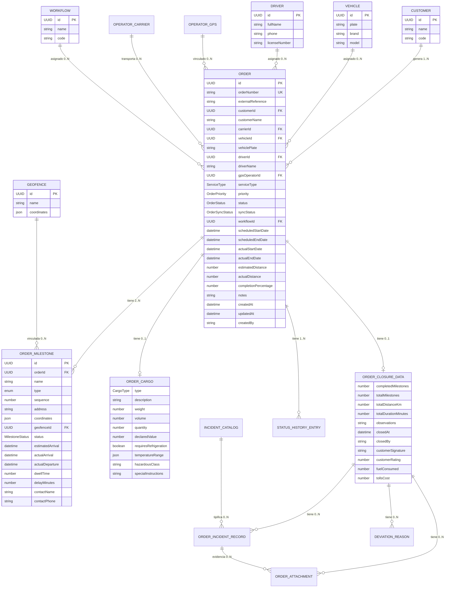

---

# 5. Tipos Enumerados

> Cada enum se almacena como `VARCHAR(50)` con constraint `CHECK` en base de datos. En TypeScript se define como **union de string literals**. En JSON se transmite como `string`.

## 5.1 `ServiceType` — Tipo de Servicio

**TypeScript:** `type ServiceType = 'distribucion' | 'importacion' | 'exportacion' | 'transporte_minero' | 'transporte_residuos' | 'interprovincial' | 'mudanza' | 'courier' | 'otro'` 
**Total de valores:** 9 
**Almacenamiento BD:** `VARCHAR(25)` con `CHECK (service_type IN (...))`

| # | Valor (string literal) | Almacenamiento BD | Índice Numérico (interno) | Etiqueta ES (UI) | Etiqueta EN (UI) | Color Badge (hex) | Icono | Descripción Funcional | Workflows Compatibles | Condiciones Especiales |
|---|---|---|---|---|---|---|---|---|---|---|
| 1 | `"distribucion"` | `distribucion` | `0` | Distribución | Distribution | `#3B82F6` (azul) | `Truck` | Distribución local o nacional de mercancías desde un almacén a múltiples puntos de entrega. | WF-STD, WF-DIST | — |
| 2 | `"importacion"` | `importacion` | `1` | Importación | Import | `#8B5CF6` (violeta) | `ArrowDownCircle` | Importación marítima, aérea o terrestre. Incluye recojo en puerto/aduana. | WF-IMP | Requiere `externalReference` (BL, AWB). |
| 3 | `"exportacion"` | `exportacion` | `2` | Exportación | Export | `#A855F7` (púrpura) | `ArrowUpCircle` | Exportación marítima, aérea o terrestre. Incluye entrega en puerto/aeropuerto. | WF-EXP | Requiere `externalReference` (booking). |
| 4 | `"transporte_minero"` | `transporte_minero` | `3` | Transporte Minero | Mining Transport | `#F59E0B` (ámbar) | `Mountain` | Transporte de mineral, concentrado o insumos mineros. Rutas de alta montaña. | WF-MIN | Peso típico: >20,000 kg. Requiere permisos especiales. |
| 5 | `"transporte_residuos"` | `transporte_residuos` | `4` | Transporte de Residuos | Waste Transport | `#EF4444` (rojo) | `AlertTriangle` | Transporte de residuos sólidos o peligrosos según normativa ambiental. | WF-RES | `cargo.type` suele ser `"hazardous"`. Requiere `hazardousClass`. |
| 6 | `"interprovincial"` | `interprovincial` | `5` | Interprovincial | Interprovincial | `#10B981` (verde) | `Map` | Transporte de carga interprovincial de largo recorrido (>200 km). | WF-STD, WF-INTER | Distancia estimada típica: 200–2000 km. |
| 7 | `"mudanza"` | `mudanza` | `6` | Mudanza | Moving | `#6366F1` (índigo) | `Package` | Mudanza comercial o industrial. Incluye carga y descarga en puntos. | WF-MUD | `cargo.type` suele ser `"fragile"`. |
| 8 | `"courier"` | `courier` | `7` | Courier / Paquetería | Courier | `#EC4899` (rosa) | `Mail` | Paquetería express y documentos. Múltiples entregas por viaje. | WF-COU | Peso típico: <50 kg. Milestones: muchos waypoints. |
| 9 | `"otro"` | `otro` | `8` | Otro | Other | `#6B7280` (gris) | `HelpCircle` | Tipo de servicio no categorizado. Para casos excepcionales. | WF-STD | Sin condiciones especiales. |

## 5.2 `OrderPriority` — Prioridad de Orden

**TypeScript:** `type OrderPriority = 'low' | 'normal' | 'high' | 'urgent'` 
**Total de valores:** 4 
**Almacenamiento BD:** `VARCHAR(10)` con `CHECK` 
**Valor por defecto:** `"normal"`

| # | Valor (string literal) | Almacenamiento BD | Índice Numérico | Etiqueta ES | Etiqueta EN | Color Badge (hex) | Icono | SLA de Atención | Comportamiento del Sistema |
|---|---|---|---|---|---|---|---|---|---|
| 1 | `"low"` | `low` | `0` | Baja | Low | `#6B7280` (gris) | `ArrowDown` | Sin urgencia — atender cuando haya disponibilidad. | Sin efecto especial. Ordenamiento bajo en lista. |
| 2 | `"normal"` | `normal` | `1` | Normal | Normal | `#3B82F6` (azul) | `Minus` | Plazo estándar — dentro del horario programado. **Default.** | Comportamiento estándar. Sin notificaciones extra. |
| 3 | `"high"` | `high` | `2` | Alta | High | `#F59E0B` (ámbar) | `ArrowUp` | Prioridad en asignación — atender antes que `normal`. | Aparece primero en lista. Indicador visual de prioridad en UI. |
| 4 | `"urgent"` | `urgent` | `3` | Urgente | Urgent | `#EF4444` (rojo) | `AlertTriangle` | Atención inmediata — notificaciones push a supervisores. | **Push notification** a `owner`, `usuario_maestro` y `subusuarios` con permiso `orders:view`. Badge parpadeante. Tope de lista. |

## 5.3 `CargoType` — Tipo de Carga

**TypeScript:** `type CargoType = 'general' | 'refrigerated' | 'hazardous' | 'fragile' | 'oversized' | 'liquid' | 'bulk'` 
**Total de valores:** 7 
**Almacenamiento BD:** `VARCHAR(15)` con `CHECK`

| # | Valor (string literal) | Almacenamiento BD | Índice | Etiqueta ES | Color (hex) | Icono | ¿Condiciones Especiales? | Campos Condicionales Activados | Razón de las Condiciones |
|---|---|---|---|---|---|---|---|---|---|
| 1 | `"general"` | `general` | `0` | Carga General | `#6B7280` | `Package` | No | — | Mercancías estándar sin requerimientos especiales de manejo o almacenamiento. |
| 2 | `"refrigerated"` | `refrigerated` | `1` | Refrigerada | `#06B6D4` (cian) | `Thermometer` | **Sí** — cadena de frío | `requiresRefrigeration` → `true` (forzado). `temperatureRange` → **obligatorio**. | Alimentos, medicamentos o productos químicos que requieren temperatura controlada. La ruptura de la cadena de frío causa deterioro. |
| 3 | `"hazardous"` | `hazardous` | `2` | Peligrosa | `#EF4444` (rojo) | `Skull` | **Sí** — normativa UN | `hazardousClass` → **obligatorio** (clase 1-9 UN). | Materiales que representan riesgo para la salud, medio ambiente o seguridad. Regido por normativa ONU de transporte de mercancías peligrosas. |
| 4 | `"fragile"` | `fragile` | `3` | Frágil | `#F59E0B` (ámbar) | `AlertCircle` | **Sí** — manejo especial | `specialInstructions` → **recomendado** (warning si vacío). | Cristalería, electrónica, cerámica u otros productos susceptibles a daño por vibración o impacto. |
| 5 | `"oversized"` | `oversized` | `4` | Sobredimensionada | `#8B5CF6` (violeta) | `Maximize` | **Sí** — permisos de ruta | `specialInstructions` → **recomendado**. | Maquinaria pesada u objetos que exceden las dimensiones estándar de transporte (ancho >2.6m, alto >4.2m, largo >13.6m). Requiere escolta vial y permisos MTC. |
| 6 | `"liquid"` | `liquid` | `5` | Líquidos | `#3B82F6` (azul) | `Droplet` | **Sí** — contenedores especiales | `specialInstructions` → **recomendado**. | Combustibles, químicos líquidos, aceites. Requiere cisternas certificadas y protocolos anti-derrame. |
| 7 | `"bulk"` | `bulk` | `6` | Granel | `#10B981` (verde) | `Layers` | No | — | Materiales a granel (arena, piedra, grano). Sin empaque unitario. Transporte en tolvas o plataformas. |

## 5.4 `OrderSyncStatus` — Estado de Sincronización GPS

**TypeScript:** `type OrderSyncStatus = 'not_sent' | 'pending' | 'sending' | 'sent' | 'error' | 'retry'` 
**Total de valores:** 6 
**Almacenamiento BD:** `VARCHAR(10)` con `CHECK` 
**Valor por defecto:** `"not_sent"`

| # | Valor (string literal) | Almacenamiento BD | Índice | Etiqueta ES | Color (hex) | Icono | Descripción | Acción del Sistema | ¿Es Estado Terminal? |
|---|---|---|---|---|---|---|---|---|---|
| 1 | `"not_sent"` | `not_sent` | `0` | No Enviada | `#6B7280` (gris) | `CircleDashed` | La orden no ha sido enviada al proveedor GPS. | Estado inicial. El operador puede iniciar envío manualmente. | No |
| 2 | `"pending"` | `pending` | `1` | Pendiente de Envío | `#F59E0B` (ámbar) | `Clock` | La orden está en la cola de envío. | Esperando turno en el sistema de cola. No se puede re-enviar hasta que salga de la cola. | No |
| 3 | `"sending"` | `sending` | `2` | Enviando... | `#3B82F6` (azul) | `Loader` | El proceso de envío está en curso. | **Bloqueado para re-envío.** Spinner visible en UI. Timeout: 30 segundos. | No |
| 4 | `"sent"` | `sent` | `3` | Enviada | `#10B981` (verde) | `CheckCircle` | Envío exitoso, confirmado por el proveedor GPS. | Sin acción requerida. Se puede forzar re-envío con `forceResend: true`. | Sí (éxito) |
| 5 | `"error"` | `error` | `4` | Error | `#EF4444` (rojo) | `XCircle` | Falló el envío. Detalle en `syncErrorMessage`. | Mostrar mensaje de error. Botón "Reintentar" habilitado. `lastSyncAttempt` actualizado. | No |
| 6 | `"retry"` | `retry` | `5` | Reintentando | `#F97316` (naranja) | `RefreshCw` | Reintento automático programado según política de backoff. | Reintento exponencial: 1s → 2s → 4s → 8s → 16s → máx 5 intentos. Después → `error`. | No |

## 5.5 `MilestoneStatus` — Estado de Hito de Ruta

**TypeScript:** `type MilestoneStatus = 'pending' | 'approaching' | 'arrived' | 'in_progress' | 'completed' | 'skipped' | 'delayed'` 
**Total de valores:** 7 
**Almacenamiento BD:** `VARCHAR(15)` con `CHECK` 
**Valor por defecto:** `"pending"`

| # | Valor (string literal) | Almacenamiento BD | Índice | Etiqueta ES | Etiqueta EN | Color (hex) | Icono | ¿Es Estado Terminal? | Trigger / Cómo se llega | Efecto sobre la Orden |
|---|---|---|---|---|---|---|---|---|---|---|
| 1 | `"pending"` | `pending` | `0` | Pendiente | Pending | `#6B7280` (gris) | `Circle` | No | Estado inicial al crear el hito. | Sin efecto adicional. |
| 2 | `"approaching"` | `approaching` | `1` | Aproximándose | Approaching | `#F59E0B` (ámbar) | `Navigation` | No | GPS detecta que el vehículo está dentro del **radio de proximidad** (configurable, default: 5 km) de la geocerca del hito. | Notificación al contacto del hito (si configurado). |
| 3 | `"arrived"` | `arrived` | `2` | Llegó | Arrived | `#3B82F6` (azul) | `MapPin` | No | GPS detecta que el vehículo **entró** a la geocerca del hito. Se registra `actualArrival = NOW()`. | Orden cambia a `at_milestone` (si estaba en `in_transit`). |
| 4 | `"in_progress"` | `in_progress` | `3` | En Progreso | In Progress | `#8B5CF6` (violeta) | `Loader` | No | Operador marca inicio de operación en el punto (carga/descarga). | Cronómetro de permanencia (`dwellTime`) inicia. |
| 5 | `"completed"` | `completed` | `4` | Completado | Completed | `#10B981` (verde) | `CheckCircle` | **Sí** | GPS detecta **salida** de geocerca o operador marca como completado. Se registra `actualDeparture = NOW()`. Se calcula `dwellTime`. | `completionPercentage` se recalcula. Si TODOS los hitos son `completed`/`skipped`, la orden pasa a `completed`. |
| 6 | `"skipped"` | `skipped` | `5` | Saltado | Skipped | `#9CA3AF` (gris claro) | `SkipForward` | **Sí** | Operador con permisos decide omitir el hito. Requiere autorización y motivo. | `completionPercentage` se recalcula (cuenta como "procesado"). |
| 7 | `"delayed"` | `delayed` | `6` | Retrasado | Delayed | `#EF4444` (rojo) | `AlertTriangle` | No | `actualArrival` supera `estimatedArrival` por más del umbral (configurable, default: 30 min), o permanencia excede `maxDurationMinutes` del workflow step. | Orden puede cambiar a `delayed`. Notificación a supervisor. |

## 5.6 `OrderStatus` — Estado de Orden

**TypeScript:** `type OrderStatus = 'draft' | 'pending' | 'assigned' | 'in_transit' | 'at_milestone' | 'delayed' | 'completed' | 'closed' | 'cancelled'` 
**Total de valores:** 9 
**Almacenamiento BD:** `VARCHAR(15)` con `CHECK` 
**Valor por defecto:** `"draft"` 
**Máquina de estados completa:** ver §6

| # | Valor (string literal) | Almacenamiento BD | Índice | Etiqueta ES | Color (hex) | Icono | ¿Es Terminal? | Descripción | Transiciones de Salida Válidas |
|---|---|---|---|---|---|---|---|---|---|
| 1 | `"draft"` | `draft` | `0` | Borrador | `#6B7280` (gris) | `FileEdit` | No | Orden creada pero no confirmada. Se puede editar libremente y eliminar (`DELETE`). | `pending`, `cancelled` |
| 2 | `"pending"` | `pending` | `1` | Pendiente | `#F59E0B` (ámbar) | `Clock` | No | Confirmada, esperando asignación de recursos. | `assigned`, `cancelled` |
| 3 | `"assigned"` | `assigned` | `2` | Asignada | `#3B82F6` (azul) | `UserCheck` | No | Vehículo y conductor asignados. Lista para iniciar viaje. | `in_transit`, `cancelled` |
| 4 | `"in_transit"` | `in_transit` | `3` | En Tránsito | `#8B5CF6` (violeta) | `Truck` | No | Viaje iniciado. Vehículo en movimiento entre hitos. | `at_milestone`, `delayed`, `completed`, `cancelled` |
| 5 | `"at_milestone"` | `at_milestone` | `4` | En Hito | `#06B6D4` (cian) | `MapPin` | No | Vehículo detenido en un punto de control. | `in_transit`, `delayed`, `completed` |
| 6 | `"delayed"` | `delayed` | `5` | Retrasado | `#EF4444` (rojo) | `AlertTriangle` | No | Retraso detectado respecto a la programación. | `in_transit`, `at_milestone`, `completed`, `cancelled` |
| 7 | `"completed"` | `completed` | `6` | Completada | `#10B981` (verde) | `CheckCircle` | No* | Todos los hitos completados/saltados. Pendiente de cierre administrativo. (*Técnicamente no es terminal: falta `closed`.) | `closed` |
| 8 | `"closed"` | `closed` | `7` | Cerrada | `#1F2937` (gris oscuro) | `Lock` | **Sí** | Cierre administrativo completado. Datos de cierre registrados. **No hay transiciones de salida.** | — (ninguna) |
| 9 | `"cancelled"` | `cancelled` | `8` | Cancelada | `#DC2626` (rojo oscuro) | `XCircle` | **Sí** | Orden cancelada con motivo. Recursos liberados. **No hay transiciones de salida.** | — (ninguna) |

## 5.7 `IncidentSeverity` — Severidad de Incidencia

**TypeScript:** `type IncidentSeverity = 'low' | 'medium' | 'high' | 'critical'` 
**Total de valores:** 4 
**Almacenamiento BD:** `VARCHAR(10)` con `CHECK`

| # | Valor | Índice | Etiqueta ES | Color (hex) | ¿Acción Inmediata? | Auto-notifica a | Descripción |
|---|---|---|---|---|---|---|---|
| 1 | `"low"` | `0` | Informativo | `#6B7280` (gris) | No | Nadie | Evento registrado para trazabilidad. No impacta la operación. |
| 2 | `"medium"` | `1` | Impacto Menor | `#F59E0B` (ámbar) | Depende del contexto | Operador | Situación que requiere atención pero no detiene la operación. |
| 3 | `"high"` | `2` | Impacto Significativo | `#EF4444` (rojo) | **Sí** | Supervisor + Operador | Situación que afecta el cumplimiento del servicio. Puede requerir cambio de ruta o recursos. |
| 4 | `"critical"` | `3` | Emergencia | `#7F1D1D` (rojo oscuro) | **Sí — inmediata** | Supervisor + Mantenimiento + Gerencia | Emergencia: accidente, asalto, derrame, pérdida total. Protocolo de crisis. |

## 5.8 `DeviationType` — Tipo de Desviación

**TypeScript:** `type DeviationType = 'route' | 'time' | 'cargo' | 'other'` 
**Total de valores:** 4 
**Almacenamiento BD:** `VARCHAR(10)` con `CHECK`

| # | Valor | Índice | Etiqueta ES | Descripción | Ejemplo de Impacto |
|---|---|---|---|---|---|
| 1 | `"route"` | `0` | Desviación de Ruta | El vehículo tomó una ruta diferente a la planificada. | `{value: 25, unit: "kilometers"}` |
| 2 | `"time"` | `1` | Demora | El servicio tomó más tiempo del estimado. | `{value: 45, unit: "minutes"}` |
| 3 | `"cargo"` | `2` | Problema de Carga | Diferencias en la carga: peso, cantidad, estado, faltante. | `{value: 500, unit: "kilometers"}` (si la carga debió ir a otro destino) |
| 4 | `"other"` | `3` | Otro | Desviación no clasificada. | Variable según caso. |

## 5.9 `ManualEntryReason` — Motivo de Registro Manual

**TypeScript:** `type ManualEntryReason = 'sin_senal_gps' | 'falla_equipo' | 'carga_retroactiva' | 'correccion' | 'otro'` 
**Total de valores:** 5 
**Almacenamiento BD:** `VARCHAR(25)`

| # | Valor | Índice | Etiqueta ES | Descripción | ¿Requiere evidencia? |
|---|---|---|---|---|---|
| 1 | `"sin_senal_gps"` | `0` | Sin Señal GPS | El vehículo se encontraba en zona sin cobertura GPS (túneles, minas, zonas rurales). | Recomendado: foto de odómetro. |
| 2 | `"falla_equipo"` | `1` | Falla de Equipo | El dispositivo GPS del vehículo estaba averiado o sin batería. | Recomendado: foto del equipo. |
| 3 | `"carga_retroactiva"` | `2` | Carga Retroactiva | Se está cargando la información de un viaje ya completado (digitalización retroactiva). | Recomendado: guía de remisión. |
| 4 | `"correccion"` | `3` | Corrección | Se corrige un registro automático incorrecto del GPS. | Obligatorio: justificación escrita. |
| 5 | `"otro"` | `4` | Otro | Motivo no categorizado. | Obligatorio: observación detallada. |

## 5.10 `MilestoneType` — Tipo de Hito

**TypeScript:** `type MilestoneType = 'origin' | 'waypoint' | 'destination'` 
**Total de valores:** 3 
**Almacenamiento BD:** `VARCHAR(15)`

| # | Valor | Índice | Etiqueta ES | Multiplicidad por Orden | Restricción de Secuencia | Descripción |
|---|---|---|---|---|---|---|
| 1 | `"origin"` | `0` | Origen | **Exactamente 1** | `sequence = 1` (siempre primero) | Punto de partida del viaje. Almacén, planta, puerto de origen. |
| 2 | `"waypoint"` | `1` | Punto Intermedio | **0 a N** | `1 < sequence < max` | Parada intermedia: punto de carga/descarga parcial, inspección, descanso obligatorio. |
| 3 | `"destination"` | `2` | Destino | **Exactamente 1** | `sequence = max` (siempre último) | Punto final del viaje. Centro de distribución, cliente final, puerto de destino. |

---

# 6. Máquina de Estados — `OrderStatus`

## 6.1 Diagrama de Estados

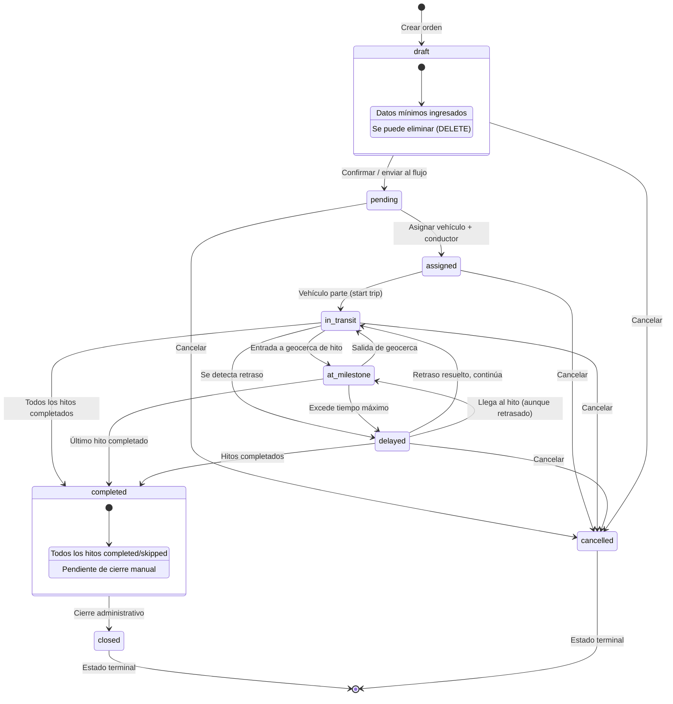

## 6.2 Tabla de Transiciones Válidas

| # | Estado Origen | → Estado Destino | Condición / Trigger | Quién ejecuta |
|---|---|---|---|---|
| T-01 | `draft` | `pending` | Datos mínimos completos (cliente, hitos ≥ 2) | Operador |
| T-02 | `draft` | `cancelled` | Sin restricciones | Usuario Maestro / Subusuario con permiso `orders:cancel` |
| T-03 | `pending` | `assigned` | Se asignan `vehicleId` + `driverId` sin conflictos | Usuario Maestro / Subusuario con permiso `orders:edit` |
| T-04 | `pending` | `cancelled` | Sin restricciones | Usuario Maestro / Subusuario con permiso `orders:cancel` |
| T-05 | `assigned` | `in_transit` | Vehículo parte. Requiere `vehicleId` AND `driverId` | Operador / Sistema GPS |
| T-06 | `assigned` | `cancelled` | Sin restricciones | Usuario Maestro / Subusuario con permiso `orders:cancel` |
| T-07 | `in_transit` | `at_milestone` | Vehículo entra en geocerca de un hito | Sistema GPS / Operador manual |
| T-08 | `in_transit` | `delayed` | `delayMinutes > umbral` en algún hito | Sistema GPS |
| T-09 | `in_transit` | `completed` | Todos los hitos en `completed` o `skipped` | Sistema (automático) |
| T-10 | `in_transit` | `cancelled` | Cancelación de emergencia | Owner / Usuario Maestro |
| T-11 | `at_milestone` | `in_transit` | Vehículo sale de la geocerca del hito | Sistema GPS / Operador manual |
| T-12 | `at_milestone` | `delayed` | Excede `maxDurationMinutes` del workflow step | Sistema |
| T-13 | `at_milestone` | `completed` | Era el último hito + se marca completado | Sistema / Operador |
| T-14 | `delayed` | `in_transit` | El retraso se resuelve y el vehículo continúa | Sistema GPS |
| T-15 | `delayed` | `at_milestone` | Llega al hito aunque retrasado | Sistema GPS |
| T-16 | `delayed` | `completed` | Se completan todos los hitos | Sistema |
| T-17 | `delayed` | `cancelled` | Cancelación | Owner / Usuario Maestro |
| T-18 | `completed` | `closed` | Cierre manual con `OrderClosureData` válida | Usuario Maestro / Subusuario con permiso `orders:close` |

## 6.3 Transiciones Inválidas — Error HTTP 422

Cualquier transición **no listada** en la tabla anterior **DEBE** retornar:

```json
{
  "error": {
    "code": "INVALID_STATE_TRANSITION",
    "message": "No se puede cambiar de '{statusActual}' a '{statusSolicitado}'",
    "details": {
      "currentStatus": "completed",
      "requestedStatus": "in_transit",
      "validTransitions": ["closed"]
    }
  }
}
```

## 6.4 Reglas de Negocio del Ciclo de Vida

| # | Regla | Descripción |
|---|---|---|
| R-01 | Estados terminales | `closed` y `cancelled` son estados terminales — NO HAY transiciones de salida |
| R-02 | Solo draft se elimina | `DELETE /orders/:id` solo es válido si `status = draft`. Otro caso → HTTP 409 |
| R-03 | Asignación requiere recursos | `pending → assigned` requiere `vehicleId` + `driverId` presentes |
| R-04 | Inicio requiere asignación | `assigned → in_transit` requiere `vehicleId` AND `driverId` asignados |
| R-05 | Cierre requiere completitud | `completed → closed` requiere que TODOS los hitos estén en `completed` o `skipped` |
| R-06 | Auto-status por hitos | Al actualizar un hito, el status de la orden se recalcula automáticamente |
| R-07 | `completionPercentage` | Se recalcula: `(hitos_completed / total_hitos) × 100` |
| R-08 | Cancelación con motivo | Al cancelar, `cancellationReason` es requerido. Se registra `cancelledAt` y `cancelledBy` |
| R-09 | Historial inmutable | Cada transición genera un `StatusHistoryEntry`. El historial NUNCA se modifica |
| R-10 | `createdAt` / `updatedAt` | `createdAt` se establece al crear. `updatedAt` se actualiza en cada modificación |

---

# 7. Máquina de Estados — `MilestoneStatus`

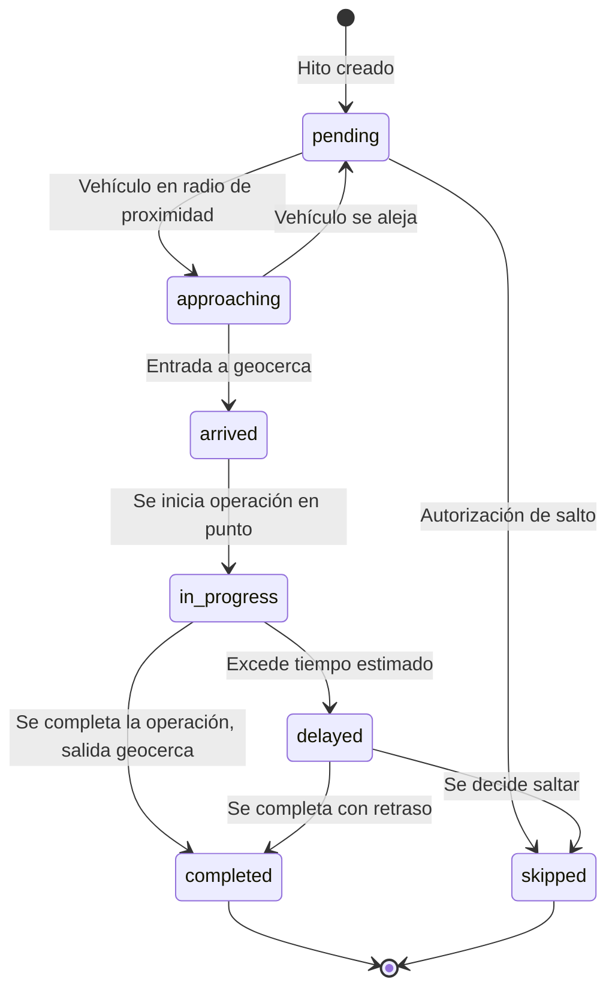

---

# 8. Máquina de Estados — `OrderSyncStatus`

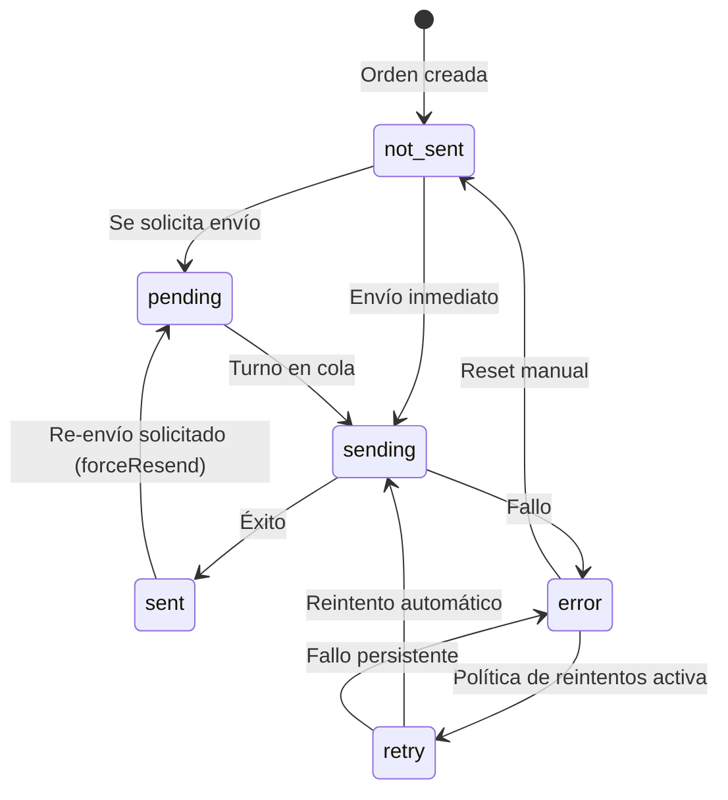

---

# 9. Historias de Usuario

> **Formato profesional de historias de usuario.** Cada HU incluye: Tarjeta (Rol / Necesidad / Propósito), Criterios de Aceptación, Conversación (acuerdos técnicos), Precondiciones, Secuencia Normal, Postcondiciones y Excepciones — siguiendo las mejores prácticas de Scrum/XP y el estándar de documentación de ingeniería de software.

---

## HU-01 — Crear orden de transporte

### Tarjeta

| Elemento | Descripción |
|---|---|
| **Título** | Crear orden de transporte mediante wizard de 6 pasos |
| **Rol (¿Quién?)** | Como **operador de logística** (rol: `usuario_maestro` o `subusuario` con permiso `orders:create`) |
| **Necesidad (¿Qué?)** | Quiero crear una nueva orden de transporte ingresando los datos del cliente, carga, ruta, recursos opcionales, workflow y un resumen de confirmación |
| **Propósito (¿Para qué?)** | Para que el servicio quede registrado en el sistema TMS, pueda ser programado, asignado a un vehículo/conductor, monitoreado por GPS, y trazado en reportes de cumplimiento |

### Criterios de Aceptación (Confirmación)

| # | Criterio | Tipo | Verificación |
|---|---|---|---|
| CA-01 | El wizard presenta **6 pasos obligatorios** en orden: ① Cliente y datos generales → ② Carga → ③ Ruta (hitos) → ④ Recursos (vehículo, conductor, GPS) → ⑤ Workflow → ⑥ Resumen | Visual | Inspección de UI: los 6 tabs/steps existen y son navegables. |
| CA-02 | El campo `customerId` es **obligatorio**; si no se selecciona un cliente, el botón "Siguiente" del paso 1 permanece deshabilitado | Validación | Test: dejar `customerId` vacío → botón "Siguiente" disabled. |
| CA-03 | La ruta **requiere mínimo 2 hitos**: exactamente 1 con `type="origin"` (seq=1) y 1 con `type="destination"` (seq=último) | Validación | Test: intentar avanzar con 0 o 1 hito → error "Agrega al menos origen y destino". |
| CA-04 | `scheduledStartDate` debe ser **estrictamente anterior** a `scheduledEndDate` (cross-field validation) | Validación | Test: `start=2026-03-01, end=2026-02-28` → error "La fecha de inicio debe ser anterior a la fecha de fin". |
| CA-05 | El peso de la carga debe estar en rango **0.01 – 100,000 kg** (Float positivo, no cero) | Validación | Test: peso=0 → error. peso=-5 → error. peso=100001 → error. |
| CA-06 | La orden se crea con `status = "draft"` y `syncStatus = "not_sent"` | Funcional | Test: crear orden → verificar `status` y `syncStatus` en respuesta. |
| CA-07 | Si existe un workflow compatible con `serviceType` + `cargoType`, se **auto-asigna** al crear | Funcional | Test: crear orden con `serviceType="carga_general"` teniendo workflow activo para ese tipo → `workflowId` no es null. |
| CA-08 | Se genera `orderNumber` automático con formato `ORD-{AÑO}-{SEC}` (ej: `ORD-2026-00047`) | Funcional | Test: crear orden → `orderNumber` coincide con regex `^ORD-\d{4}-\d{5}$`. |
| CA-09 | Se registra un `StatusHistoryEntry` inicial con `fromStatus="draft"`, `toStatus="draft"`, `changedBy=usuario actual` | Funcional | Test: consultar historial de la orden recién creada → 1 entry. |
| CA-10 | Se emite evento `order.created` en el `tmsEventBus` con payload `{ orderId, orderNumber, customerId }` | Evento | Test: suscribirse al eventBus antes de crear → se recibe el evento. |

### Conversación (Acuerdos del equipo)

| Tema | Acuerdo |
|---|---|
| **Wizard vs. Formulario único** | Se decidió wizard de 6 pasos porque el formulario completo tiene >40 campos. Dividir en pasos reduce la carga cognitiva del operador. El wizard permite validar paso a paso, evitando que el operador llene todo y descubra errores al final. |
| **Borrador automático** | No se implementa auto-guardado de borrador en esta versión. Si el operador cierra el wizard sin completar, se pierde el progreso. Se evalúa para v4 guardar como draft en cada paso. |
| **Orden mínima viable** | Los campos mínimos para crear una orden son: `customerId`, `priority`, `serviceType`, `scheduledStartDate`, `scheduledEndDate`, `cargo.description`, `cargo.type`, `cargo.weight`, `cargo.quantity`, y 2 hitos. Todo lo demás es opcional o auto-asignado. |
| **Workflow auto-asignación** | Si hay múltiples workflows compatibles, se selecciona el primero activo ordenado por fecha de creación (más antiguo primero). Si no hay ninguno compatible, `workflowId = null` y la orden funciona sin workflow. |

### Precondiciones

| # | Precondición | ¿Qué pasa si no se cumple? |
|---|---|---|
| PRE-01 | El usuario está autenticado con sesión activa (token JWT vigente) | Redirect automático a `/login`. |
| PRE-02 | El usuario tiene permiso `orders:create` (asignado por el Usuario Maestro) | HTTP 403 Forbidden. Botón "Nueva Orden" no visible en sidebar. |
| PRE-03 | Existe al menos **1 cliente activo** en el sistema | Dropdown de clientes vacío. Paso 1 muestra banner: "No hay clientes registrados. Ve al módulo Clientes para crear uno." |
| PRE-04 | Existen al menos **2 geocercas activas** (para sugerir en mapa) | El mapa del paso 3 no tiene puntos sugeridos. El operador puede ingresar coordenadas manualmente, pero sin geocercas no hay detección automática de llegada/salida. |

### Secuencia Normal

| Paso | Actor | Acción | Sistema responde |
|---|---|---|---|
| 1 | Operador | Hace clic en **"Nueva Orden"** en el sidebar o en la lista de órdenes | Sistema abre el Wizard en Paso 1 (Cliente y datos generales). |
| 2 | Operador | Selecciona un **cliente** del dropdown buscable, elige **prioridad** (`normal` por defecto), **tipo de servicio**, ingresa **fechas programadas** de inicio y fin, opcionalmente referencia externa y notas | Sistema valida en tiempo real cada campo según §12.1 Nivel 1. Campos inválidos se resaltan en rojo con mensaje de error. |
| 3 | Operador | Presiona **"Siguiente"** para ir al Paso 2 (Carga) | Sistema verifica que todos los campos obligatorios del Paso 1 estén completos y válidos. Si pasa, navega a Paso 2. |
| 4 | Operador | Ingresa **descripción de la carga**, selecciona **tipo de carga**, ingresa **peso** (kg), **cantidad** (unidades), opcionalmente volumen y valor declarado. Si la carga es peligrosa, selecciona clase MATPEL. Si requiere refrigeración, ingresa rango de temperatura. | Sistema aplica validaciones condicionales (§12.1 Nivel 2). Si `type="hazardous"`, campo `hazardousClass` se vuelve obligatorio. Si `requiresRefrigeration=true`, campos `temperatureRange.min` y `.max` se vuelven obligatorios. |
| 5 | Operador | Presiona **"Siguiente"** para ir al Paso 3 (Ruta) | Sistema valida Paso 2 y navega. |
| 6 | Operador | En el **mapa interactivo**, marca el **punto de origen** (click en mapa o búsqueda de dirección), marca los **puntos intermedios** (waypoints) si los hay, y marca el **punto de destino**. Para cada punto ingresa nombre, dirección, y opcionalmente asigna una geocerca existente. | Sistema geocodifica las coordenadas, asigna secuencias automáticamente (origin=1, waypoints consecutivos, destination=último), valida que las coordenadas estén dentro de rangos válidos. |
| 7 | Operador | Presiona **"Siguiente"** para ir al Paso 4 (Recursos) | Sistema valida que existan mínimo 2 hitos con exactamente 1 origin y 1 destination. |
| 8 | Operador | **Opcionalmente** selecciona un **vehículo** y un **conductor** de los dropdowns. **Opcionalmente** selecciona un **transportista** y un **operador GPS**. | Sistema verifica disponibilidad: si el vehículo o conductor tienen conflicto de horario con otra orden, muestra warning con detalle del conflicto. No bloquea (puede dejar sin asignar y asignar después). |
| 9 | Operador | Presiona **"Siguiente"** para ir al Paso 5 (Workflow) | Sistema navega a Paso 5. |
| 10 | Operador | Revisa el **workflow auto-asignado** (si existe). Puede cambiarlo manualmente o dejarlo sin workflow. | Sistema muestra el workflow sugerido basado en `serviceType` y `cargoType`. Si no hay ninguno compatible, muestra "Sin workflow". |
| 11 | Operador | Presiona **"Siguiente"** para ir al Paso 6 (Resumen) | Sistema muestra resumen completo de todos los datos ingresados en formato de solo lectura. |
| 12 | Operador | Revisa el **resumen completo** y presiona **"Crear Orden"** | Sistema ejecuta `OrderService.createOrder(dto)`: genera UUID, genera `orderNumber`, crea la orden con `status=draft`, crea hitos con `status=pending`, crea `StatusHistoryEntry` inicial, emite evento `order.created`, retorna la orden creada. |
| 13 | Sistema | Muestra **diálogo de éxito**: "Orden ORD-2026-00047 creada exitosamente" con opciones: "Ver Orden" (navega a detalle) o "Crear Otra" (abre wizard vacío) | — |

### Postcondiciones

| # | Postcondición | Verificación |
|---|---|---|
| POST-01 | Existe una nueva orden en el sistema con `status = "draft"` | `GET /orders/:id` retorna la orden con todos los datos ingresados. |
| POST-02 | La orden tiene un `orderNumber` único generado automáticamente | `orderNumber` coincide con formato `ORD-YYYY-NNNNN` y no existe duplicado. |
| POST-03 | La orden tiene 2+ hitos con secuencias consecutivas y tipos correctos | `milestones[0].type="origin"`, `milestones[last].type="destination"`, todos con `status="pending"`. |
| POST-04 | Existe 1 `StatusHistoryEntry` con la transición inicial | Historial de la orden tiene exactamente 1 entrada. |
| POST-05 | Se emitió el evento `order.created` en el bus de eventos | Otros módulos suscritos (dashboard, notificaciones) recibieron el evento. |
| POST-06 | El listado de órdenes incluye la nueva orden | Navegando a `/orders`, la nueva orden aparece en la tabla. |

### Excepciones

| # | Excepción | Cuándo ocurre | Manejo del sistema |
|---|---|---|---|
| EX-01 | **Validación Zod falla en algún paso** | El operador ingresó datos que no cumplen con el schema (§12.1) | El wizard NO avanza al siguiente paso. Los campos inválidos se resaltan en rojo con el mensaje de error específico. El operador corrige y reintenta. |
| EX-02 | **Cliente seleccionado fue desactivado entre selección y creación** | Race condition: el usuario maestro desactivó al cliente mientras el operador llenaba el wizard | HTTP 404 `CUSTOMER_NOT_FOUND`. Diálogo de error: "El cliente seleccionado ya no está activo. Por favor selecciona otro." El operador regresa al Paso 1. |
| EX-03 | **Vehículo/conductor tiene conflicto de horario** | El operador asignó un recurso, pero otro operador lo asignó a otra orden mientras tanto | HTTP 409 `VEHICLE_CONFLICT` o `DRIVER_CONFLICT`. Diálogo: "El vehículo ABC-1234 ya está asignado a la orden ORD-2026-00045 del 24/02 al 26/02." El operador elige otro recurso. |
| EX-04 | **Error interno del servidor** | Bug, timeout de BD, error de infraestructura | HTTP 500 `INTERNAL_ERROR`. Diálogo: "Error al crear la orden. Inténtalo de nuevo. Si el problema persiste, contacta al soporte." Se mantiene el wizard con los datos para reintentar. |
| EX-05 | **Sesión expirada durante el wizard** | El token JWT expiró mientras el operador llenaba el formulario | HTTP 401 `UNAUTHORIZED`. Redirect a `/login`. **Los datos del wizard se pierden** (no hay auto-guardado en v3). |
| EX-06 | **Operador cierra el navegador/tab accidentalmente** | Cierre inesperado del browser | Los datos se pierden. No hay recuperación. Se evalúa localStorage en v4. |

---

## HU-02 — Listar y filtrar órdenes

### Tarjeta

| Elemento | Descripción |
|---|---|
| **Título** | Listar y filtrar órdenes con paginación, búsqueda y KPIs |
| **Rol (¿Quién?)** | Como **operador de logística** (rol: `owner`, `usuario_maestro`, o `subusuario` con permiso `orders:view`) |
| **Necesidad (¿Qué?)** | Quiero ver un listado paginado de todas las órdenes del sistema con múltiples filtros simultáneos, búsqueda por texto, y KPI cards de resumen |
| **Propósito (¿Para qué?)** | Para encontrar rápidamente las órdenes que necesito gestionar, tener visibilidad del estado general de la operación, y poder tomar decisiones basadas en datos en tiempo real |

### Criterios de Aceptación

| # | Criterio | Tipo | Verificación |
|---|---|---|---|
| CA-01 | La lista soporta **paginación** con parámetros `page` (default: 1) y `pageSize` (default: 20, max: 100) | Funcional | Test: enviar `page=2, pageSize=10` → retorna registros 11-20. |
| CA-02 | Se puede **buscar** por texto libre en: `orderNumber`, nombre de cliente, `externalReference` | Funcional | Test: buscar "ORD-2026" → retorna órdenes que coincidan en cualquiera de los 3 campos. |
| CA-03 | Se puede **filtrar** por: `status` (múltiple), `priority`, `serviceType`, `customerId`, `carrierId`, `gpsOperatorId` | Funcional | Test: filtrar `status=["pending","assigned"]` → solo órdenes en esos estados. |
| CA-04 | Se puede **filtrar por rango de fechas** con selector de tipo: `creation` (fecha de creación), `scheduled` (fecha programada), `execution` (fecha real) | Funcional | Test: `dateType=scheduled, from=2026-02-01, to=2026-02-28` → solo órdenes programadas en febrero. |
| CA-05 | Se puede **ordenar** por cualquier columna con dirección `asc` / `desc` | Funcional | Test: `sortBy=priority, sortDirection=desc` → órdenes urgentes primero. |
| CA-06 | La respuesta incluye `statusCounts` con **conteo por cada estado** | Funcional | Test: respuesta incluye `{ draft: 5, pending: 12, assigned: 8, ... }`. |
| CA-07 | Los filtros se **reflejan en la URL** como query params (persistencia de navegación) | UX | Test: aplicar filtros → URL cambia a `/orders?status=pending&priority=high`. Compartir URL → otra persona ve los mismos filtros. |
| CA-08 | Se muestran **KPI cards** en la parte superior con contadores por estado, cada uno con su color (§5.6) | Visual | Inspección visual: cards con números y colores correctos. |

### Conversación (Acuerdos del equipo)

| Tema | Acuerdo |
|---|---|
| **Paginación server-side** | La paginación se hace en el server (no se traen todas las órdenes al frontend). El backend retorna `{ items[], total, page, totalPages, statusCounts }`. |
| **Filtros acumulativos** | Todos los filtros se aplican con AND (intersección). Ejemplo: `status=pending AND priority=high` → solo órdenes pendientes Y de prioridad alta. |
| **Búsqueda difusa** | La búsqueda de texto usa `LIKE '%term%'` (case-insensitive). No se implementa full-text search en v3. |
| **Performance** | Si hay >10,000 órdenes, se limita `pageSize` a 50 por defecto. Los `statusCounts` se calculan con un query separado (no sobre la página actual, sino sobre TODAS las órdenes filtradas). |

### Precondiciones

| # | Precondición | ¿Qué pasa si no se cumple? |
|---|---|---|
| PRE-01 | Usuario autenticado con sesión activa | Redirect a `/login`. |
| PRE-02 | Usuario tiene permiso `orders:view` (todos los roles del sistema lo tienen por defecto) | HTTP 403. Módulo de órdenes no aparece en el sidebar. |

### Secuencia Normal

| Paso | Actor | Acción | Sistema responde |
|---|---|---|---|
| 1 | Operador | Navega a **"Órdenes"** en el sidebar | Sistema carga la página `/orders` con filtros por defecto (`page=1, pageSize=20, sortBy=createdAt, sortDirection=desc`). |
| 2 | Sistema | Ejecuta `GET /orders?page=1&pageSize=20` | Retorna la primera página de órdenes ordenadas por fecha de creación (más recientes primero), KPI cards con `statusCounts`, y paginación. |
| 3 | Operador | Aplica **filtros** (ej: selecciona `status=pending` y `priority=high`) | Sistema actualiza query params en URL, ejecuta nuevo request con filtros, actualiza tabla y KPI cards. |
| 4 | Operador | Escribe en el **campo de búsqueda** (ej: "ORD-2026-00047") | Sistema ejecuta búsqueda con debounce de 300ms, actualiza resultados. |
| 5 | Operador | Hace clic en **encabezado de columna** para ordenar (ej: "Prioridad ↓") | Sistema reordena los resultados por esa columna. |
| 6 | Operador | Navega a **otra página** con los controles de paginación | Sistema carga la página solicitada manteniendo los filtros aplicados. |
| 7 | Operador | Hace **clic en una fila** de la tabla | Sistema navega a la página de detalle de esa orden (`/orders/:id`). |

### Postcondiciones

| # | Postcondición |
|---|---|
| POST-01 | La tabla muestra las órdenes que coinciden con los filtros y búsqueda aplicados. |
| POST-02 | Las KPI cards reflejan los conteos reales del total de órdenes (no solo de la página actual). |
| POST-03 | La URL refleja todos los filtros activos (se puede copiar y compartir). |
| POST-04 | No se modificó ningún dato — esta operación es de **solo lectura**. |

### Excepciones

| # | Excepción | Manejo |
|---|---|---|
| EX-01 | **No hay órdenes que coincidan con los filtros** | Tabla vacía con mensaje: "No se encontraron órdenes con los filtros aplicados." Botón "Limpiar filtros". |
| EX-02 | **Error de red / timeout** | Toast de error: "Error al cargar las órdenes. Inténtalo de nuevo." Botón "Reintentar". |
| EX-03 | **Parámetros de URL inválidos** (alguien escribió `?page=-1`) | Sistema ignora params inválidos y usa defaults. |

---

## HU-03 — Asignar vehículo y conductor a orden

### Tarjeta

| Elemento | Descripción |
|---|---|
| **Título** | Asignar vehículo y conductor a una orden pendiente |
| **Rol (¿Quién?)** | Como **planificador de flota** (rol: `usuario_maestro` o `subusuario` con permiso `orders:edit`) |
| **Necesidad (¿Qué?)** | Quiero asignar un vehículo disponible y un conductor habilitado a una orden que está en estado borrador o pendiente |
| **Propósito (¿Para qué?)** | Para que la orden tenga los recursos operativos necesarios para iniciar el viaje, cumpliendo con las restricciones de disponibilidad, capacidad y regulación de conducción |

### Criterios de Aceptación

| # | Criterio | Tipo | Verificación |
|---|---|---|---|
| CA-01 | Solo se puede asignar si `status ∈ {"draft", "pending"}` | Validación | Test: intentar asignar orden `in_transit` → HTTP 422. |
| CA-02 | Se valida que el vehículo **NO tenga conflicto de horario** con otra orden activa en el mismo rango de fechas | Validación | Test: vehículo con orden del 24-26/02, asignar a orden del 25-27/02 → HTTP 409 `VEHICLE_CONFLICT`. |
| CA-03 | Se valida que el conductor **NO tenga conflicto de horario** con otra orden activa | Validación | Test: conductor con orden del 24-26/02 → HTTP 409 `DRIVER_CONFLICT`. |
| CA-04 | Si hay conflicto, se muestra **detalle completo**: orden en conflicto (`orderNumber`, fechas), y sugerencias (otros vehículos/conductores disponibles) | UX | Inspección visual del diálogo de conflicto. |
| CA-05 | Al asignar exitosamente, el estado cambia a `"assigned"` | Funcional | Test: asignar → `status = "assigned"`. |
| CA-06 | Se emite evento `order.assigned` con payload `{ orderId, vehicleId, driverId }` | Evento | Test: eventBus recibe el evento. |
| CA-07 | Se registra `StatusHistoryEntry` con transición correspondiente | Funcional | Test: historial de la orden tiene nueva entry. |

### Conversación

| Tema | Acuerdo |
|---|---|
| **Asignación parcial** | Se permite asignar solo vehículo o solo conductor. La orden pasa a `assigned` solo cuando AMBOS están asignados. Si solo hay uno, la orden queda en `pending`. |
| **Conflicto = bloqueo** | Un conflicto de horario es un **error bloqueante**, no un warning. No se permite la sobreasignación. |
| **Capacidad del vehículo** | Si el peso de la carga excede la capacidad máxima del vehículo (`maxPayloadKg`), se muestra un **warning** (no bloqueo), porque podría haber casos legítimos donde el operador sabe que el vehículo puede con esa carga. |

### Precondiciones

| # | Precondición | ¿Qué pasa si no se cumple? |
|---|---|---|
| PRE-01 | La orden existe y está en estado `draft` o `pending` | HTTP 422 `INVALID_STATE_TRANSITION`. Botón "Asignar" no visible si el estado no lo permite. |
| PRE-02 | Existe al menos **1 vehículo activo** en el sistema | Dropdown de vehículos vacío: "No hay vehículos disponibles. Registra uno en el módulo Vehículos." |
| PRE-03 | Existe al menos **1 conductor activo con licencia vigente** | Dropdown de conductores vacío: "No hay conductores disponibles." |
| PRE-04 | Usuario con permiso `orders:edit` | HTTP 403. |

### Secuencia Normal

| Paso | Actor | Acción | Sistema responde |
|---|---|---|---|
| 1 | Planificador | Abre el **detalle de una orden** en estado `draft` o `pending` | Sistema muestra la orden con sección "Recursos" y botón "Asignar Vehículo/Conductor". |
| 2 | Planificador | Presiona **"Asignar"** | Sistema abre panel/modal de asignación con dos dropdowns: Vehículo y Conductor. Muestra solo los recursos **disponibles** (sin conflictos de horario en el rango de la orden). |
| 3 | Planificador | Selecciona un **vehículo** del dropdown | Sistema verifica en tiempo real: (a) sin conflicto de horario, (b) capacidad vs. peso de carga. Si hay warning de capacidad, muestra tooltip amarillo. |
| 4 | Planificador | Selecciona un **conductor** del dropdown | Sistema verifica: (a) sin conflicto de horario, (b) licencia vigente. |
| 5 | Planificador | Presiona **"Confirmar Asignación"** | Sistema ejecuta `PATCH /orders/:id/status` con `{ newStatus: "assigned", vehicleId, driverId }`. Valida transición, detecta conflictos, actualiza estado, crea `StatusHistoryEntry`, emite evento. |
| 6 | Sistema | Muestra **toast de éxito**: "Recursos asignados. Orden ORD-2026-00047 lista para iniciar viaje." | Detalle de la orden se actualiza mostrando vehículo y conductor asignados. Botón "Iniciar Viaje" aparece. |

### Postcondiciones

| # | Postcondición |
|---|---|
| POST-01 | La orden tiene `status = "assigned"`, `vehicleId` y `driverId` asignados. |
| POST-02 | El vehículo y conductor están "bloqueados" para el rango de fechas de esta orden (no pueden ser asignados a otra orden solapada). |
| POST-03 | Existe un nuevo `StatusHistoryEntry` registrando la transición y quién la hizo. |
| POST-04 | El evento `order.assigned` fue emitido (módulo de monitoreo puede empezar a preparar tracking). |

### Excepciones

| # | Excepción | Manejo |
|---|---|---|
| EX-01 | **Conflicto de horario con vehículo** | HTTP 409 `VEHICLE_CONFLICT`. Modal muestra: "El vehículo ABC-1234 ya está asignado a la orden ORD-2026-00045 del 24/02/2026 al 26/02/2026. Selecciona otro vehículo o modifica las fechas." |
| EX-02 | **Conflicto de horario con conductor** | HTTP 409 `DRIVER_CONFLICT`. Mismo formato que EX-01, indicando la orden en conflicto del conductor. |
| EX-03 | **Licencia del conductor venció entre la selección y el confirm** | HTTP 422 `PRECONDITION_FAILED`: "La licencia del conductor expiró." Seleccionar otro conductor. |
| EX-04 | **Otro operador asignó la orden primero (race condition)** | HTTP 422 `INVALID_STATE_TRANSITION` (la orden ya no está en `draft`/`pending`). Mostrar: "La orden fue asignada por otro operador." Recargar detalle. |

---

## HU-04 — Iniciar viaje de una orden

### Tarjeta

| Elemento | Descripción |
|---|---|
| **Título** | Iniciar viaje de una orden asignada para activar tracking GPS |
| **Rol (¿Quién?)** | Como **operador de monitoreo** (rol: `usuario_maestro` o `subusuario` con permiso `orders:edit`) |
| **Necesidad (¿Qué?)** | Quiero marcar el inicio de viaje de una orden que ya tiene vehículo y conductor asignados |
| **Propósito (¿Para qué?)** | Para que comience el seguimiento GPS en tiempo real, se registre la hora real de salida, y se active la detección de eventos en geocercas (llegada/salida de hitos) |

### Criterios de Aceptación

| # | Criterio | Tipo | Verificación |
|---|---|---|---|
| CA-01 | Solo se puede iniciar si `status = "assigned"` | Validación | Test: intentar iniciar orden `pending` → HTTP 422. |
| CA-02 | Requiere que `vehicleId` AND `driverId` estén asignados (no null) | Validación | Test: orden `assigned` pero `vehicleId=null` (bug) → HTTP 422 `PRECONDITION_FAILED`. |
| CA-03 | Se registra `actualStartDate = new Date().toISOString()` (hora real de salida) | Funcional | Test: iniciar viaje → `actualStartDate` tiene la hora del momento de la acción. |
| CA-04 | Estado cambia a `"in_transit"` | Funcional | Test: después de iniciar → `status = "in_transit"`. |
| CA-05 | Se emite evento `order.status_changed` con `{ oldStatus: "assigned", newStatus: "in_transit" }` | Evento | Test: eventBus recibe el evento. |

### Conversación

| Tema | Acuerdo |
|---|---|
| **¿Quién inicia?** | Puede iniciar el usuario maestro, un subusuario con permiso `orders:edit`, o en el futuro el conductor desde la app móvil. En v3, solo desde el panel web. |
| **Hora de inicio** | Se usa la hora del servidor (`NOW()`) como `actualStartDate`, no la hora del navegador del operador, para evitar inconsistencias de zona horaria. |
| **Ventana de operación** | Si el viaje se inicia >24h antes o después de `scheduledStartDate`, se muestra un warning pero no se bloquea. Esto se registra como potencial desviación de tiempo. |

### Precondiciones

| # | Precondición | ¿Qué pasa si no se cumple? |
|---|---|---|
| PRE-01 | Orden en estado `assigned` | HTTP 422 `INVALID_STATE_TRANSITION`. |
| PRE-02 | `vehicleId` asignado (no null) | HTTP 422 `PRECONDITION_FAILED: vehicleId es requerido`. |
| PRE-03 | `driverId` asignado (no null) | HTTP 422 `PRECONDITION_FAILED: driverId es requerido`. |
| PRE-04 | Usuario autenticado con permiso `orders:edit` | HTTP 403. |

### Secuencia Normal

| Paso | Actor | Acción | Sistema responde |
|---|---|---|---|
| 1 | Operador | Abre el **detalle de la orden** asignada | Sistema muestra la orden con vehículo/conductor asignados y botón **"Iniciar Viaje"** habilitado. |
| 2 | Operador | Presiona **"Iniciar Viaje"** | Sistema muestra confirmación: "¿Iniciar viaje de la orden ORD-2026-00047? Se activará el monitoreo GPS." |
| 3 | Operador | Presiona **"Confirmar"** | Sistema ejecuta `PATCH /orders/:id/status { newStatus: "in_transit" }`. Registra `actualStartDate`, cambia estado, crea `StatusHistoryEntry`, emite evento. |
| 4 | Sistema | Toast: **"Viaje iniciado. Monitoreo GPS activo."** | Panel de monitoreo comienza a mostrar la posición del vehículo. Timeline de hitos se activa. |

### Postcondiciones

| # | Postcondición |
|---|---|
| POST-01 | Orden con `status = "in_transit"` y `actualStartDate` registrado. |
| POST-02 | Nuevo `StatusHistoryEntry` con `fromStatus: "assigned"`, `toStatus: "in_transit"`. |
| POST-03 | Evento `order.status_changed` emitido. Módulo de monitoreo activado para esta orden. |
| POST-04 | Los hitos de la orden están en estado `pending`, esperando detección GPS de llegada. |

### Excepciones

| # | Excepción | Manejo |
|---|---|---|
| EX-01 | **Orden ya no está en `assigned`** (otro operador cambió el estado) | HTTP 422. Diálogo: "El estado de la orden cambió. Recarga la página." |
| EX-02 | **Vehículo o conductor fueron reasignados** | HTTP 422 `PRECONDITION_FAILED`. Reasignar recursos antes de iniciar. |
| EX-03 | **Viaje fuera de ventana programada (>24h)** | Warning (no bloquea): "El viaje se inicia fuera de la ventana programada (24/02 vs programado 22/02)." Operador confirma y continúa. |

---

## HU-05 — Registrar entrada/salida de hito (GPS automático o manual)

### Tarjeta

| Elemento | Descripción |
|---|---|
| **Título** | Registrar entrada y salida de vehículo en puntos de control (hitos) |
| **Rol (¿Quién?)** | Como **sistema GPS** (actor automático) o como **operador de monitoreo** (actor manual, rol: `usuario_maestro` o `subusuario` con permiso `milestones:manual_entry`) |
| **Necesidad (¿Qué?)** | Quiero registrar cuando un vehículo entra (llega) o sale (parte) de un punto de control definido en la ruta de la orden |
| **Propósito (¿Para qué?)** | Para actualizar el progreso de la orden en tiempo real, detectar retrasos, calcular tiempos de permanencia (`dwellTime`), y completar automáticamente la orden cuando todos los hitos estén cubiertos |

### Criterios de Aceptación

| # | Criterio | Tipo | Verificación |
|---|---|---|---|
| CA-01 | Al detectar **entrada a geocerca**, el hito cambia a `"in_progress"` y se registra `actualArrival = NOW()` | Funcional | Test: vehículo entra en geocerca → milestone.status = "in_progress", `actualArrival` no null. |
| CA-02 | Al detectar **salida de geocerca**, el hito cambia a `"completed"` y se registra `actualDeparture = NOW()` | Funcional | Test: vehículo sale de geocerca → milestone.status = "completed", `actualDeparture` no null. |
| CA-03 | Se **recalcula** `completionPercentage` = (hitos completed + skipped) / total hitos × 100 | Funcional | Test: 3 de 5 hitos completed → `completionPercentage = 60`. |
| CA-04 | Si **TODOS los hitos** están en `completed` o `skipped`, la orden transiciona automáticamente a `"completed"` | Funcional | Test: completar último hito → `order.status = "completed"`. |
| CA-05 | Si hay **retraso** (`scheduledArrival` vs `actualArrival`, `delayMinutes > 30`), el hito puede pasar a `"delayed"` | Funcional | Test: llegar 45 min tarde → milestone.status = "delayed". |
| CA-06 | Se permite **registro manual** con `isManual = true`, requiriendo `reason` (motivo) y opcionalmente `observation` | Funcional | Test: registrar manual → `isManual=true`, `manualEntryData.reason` existe. |
| CA-07 | Se emite evento `order.milestone_updated` con payload `{ orderId, milestoneId, newStatus, isManual }` | Evento | Test: eventBus recibe el evento. |
| CA-08 | Se calcula `dwellTime` = `actualDeparture - actualArrival` (en minutos) al registrar salida | Funcional | Test: llegada 10:00, salida 10:45 → `dwellTime = 45`. |

### Conversación

| Tema | Acuerdo |
|---|---|
| **GPS automático vs manual** | El registro GPS automático tiene prioridad. Solo se usa manual cuando: (a) falla el GPS, (b) no hay señal, (c) la geocerca tiene error de configuración, (d) el operador necesita forzar un registro. |
| **Umbral de retraso** | Un hito se marca como `"delayed"` si `delayMinutes > 30 min`. Menos de 30 min se considera dentro de la tolerancia normal de tráfico. Configurable por cliente en futuras versiones. |
| **Detección de geocerca** | El sistema GPS externo envía un webhook cuando el vehículo entra/sale de una geocerca. El TMS recibe el webhook, identifica la orden y el hito, y actualiza el estado. Si hay varias órdenes activas para el mismo vehículo (error), se usa la que tenga el hito más cercano en secuencia. |

### Precondiciones

| # | Precondición | ¿Qué pasa si no se cumple? |
|---|---|---|
| PRE-01 | Orden en estado `in_transit` o `at_milestone` | El evento GPS se ignora silenciosamente. No se procesa ningún cambio. |
| PRE-02 | El hito (`milestoneId`) existe y pertenece a la orden | HTTP 404 `MILESTONE_NOT_FOUND`. |
| PRE-03 | La geocerca del hito está configurada y activa (para detección automática) | Hito solo puede registrarse manualmente. El GPS no lo detectará. |
| PRE-04 | Dispositivo GPS del vehículo reportando (última señal < 15 min) | Warning visual en monitoreo: "Sin señal GPS del vehículo." |
| PRE-05 | Para registro manual: usuario con permiso `milestones:manual_entry` | HTTP 403. |

### Secuencia Normal (Automático por GPS)

| Paso | Actor | Acción | Sistema responde |
|---|---|---|---|
| 1 | Sistema GPS | Detecta que el vehículo **entró** en la geocerca del hito siguiente en secuencia | TMS recibe webhook. |
| 2 | TMS | Identifica la orden activa del vehículo y el hito correspondiente | — |
| 3 | TMS | Actualiza hito: `status = "in_progress"`, `actualArrival = NOW()`, `isManual = false` | Orden cambia a `at_milestone`. |
| 4 | TMS | Calcula `delayMinutes = actualArrival - scheduledArrival` | Si `delayMinutes > 30`, status pasa a `"delayed"`. |
| 5 | TMS | Emite evento `order.milestone_updated` | Panel de monitoreo se actualiza en tiempo real. |
| 6 | Sistema GPS | Detecta que el vehículo **salió** de la geocerca | TMS recibe webhook de salida. |
| 7 | TMS | Actualiza hito: `status = "completed"`, `actualDeparture = NOW()`, `dwellTime = departure - arrival` | Orden vuelve a `in_transit` (hay más hitos) o pasa a `completed` (último hito). |
| 8 | TMS | Recalcula `completionPercentage` | KPI de la orden se actualiza. |

### Secuencia Normal (Manual por Operador)

| Paso | Actor | Acción | Sistema responde |
|---|---|---|---|
| 1 | Operador | En el detalle de la orden, sección **"Hitos"**, presiona **"Registrar Manualmente"** en un hito pendiente | Sistema abre formulario manual con campos: tipo de registro (llegada/salida), motivo, observación. |
| 2 | Operador | Selecciona **motivo** del catálogo (`gps_failure`, `no_signal`, `geofence_error`, `manual_override`) e ingresa **observación** | Sistema valida que el motivo no esté vacío. |
| 3 | Operador | Presiona **"Registrar"** | Sistema actualiza hito con `isManual = true`, `manualEntryData = { reason, observation, registeredBy }`. |
| 4 | Sistema | Toast: "Hito registrado manualmente." | Timeline del hito se actualiza con indicador visual de "Registro Manual". |

### Postcondiciones

| # | Postcondición |
|---|---|
| POST-01 | El hito tiene `actualArrival` y/o `actualDeparture` registrados con timestamp UTC. |
| POST-02 | `completionPercentage` de la orden refleja el nuevo progreso. |
| POST-03 | Si fue el último hito, la orden está en estado `completed`. |
| POST-04 | El `dwellTime` está calculado (si hay arrival y departure). |
| POST-05 | El evento `order.milestone_updated` fue emitido. |

### Excepciones

| # | Excepción | Manejo |
|---|---|---|
| EX-01 | **No se identifica la orden activa del vehículo** | Evento GPS descartado. Log de warning. |
| EX-02 | **Hito ya está en estado terminal** (`completed` o `skipped`) | El evento se ignora. No se puede registrar doble llegada/salida. |
| EX-03 | **GPS reporta posición dentro de geocerca pero el hito no es el siguiente en secuencia** | Warning: "El vehículo está en la geocerca del hito #3, pero el hito #2 aún está pendiente." Operador decide si saltar hito #2. |
| EX-04 | **Registro manual sin motivo** | HTTP 400: "Motivo requerido para registro manual." |

---

## HU-06 — Cerrar orden administrativamente

### Tarjeta

| Elemento | Descripción |
|---|---|
| **Título** | Cerrar orden completada con observaciones, incidencias y métricas finales |
| **Rol (¿Quién?)** | Como **supervisor de operaciones** (rol: `usuario_maestro` o `subusuario` con permiso `orders:close`) |
| **Necesidad (¿Qué?)** | Quiero cerrar administrativamente una orden cuyo viaje ya fue completado (todos los hitos cubiertos), registrando observaciones finales, incidencias, desviaciones, métricas de consumo, y opcionalmente la valoración del cliente |
| **Propósito (¿Para qué?)** | Para que se registren formalmente los resultados del servicio, se liberen los recursos (vehículo/conductor) para futuras asignaciones, se generen los datos necesarios para facturación, y la orden pase a estado terminal (inmutable) para auditoría |

### Criterios de Aceptación

| # | Criterio | Tipo | Verificación |
|---|---|---|---|
| CA-01 | Solo se puede cerrar si `status = "completed"` | Validación | Test: intentar cerrar orden `in_transit` → HTTP 422. |
| CA-02 | **Todos** los hitos deben estar en `completed` o `skipped` (ninguno en `pending` o `in_progress`) | Validación | Test: cerrar con hito `pending` → HTTP 422 `CANNOT_CLOSE_ORDER` con `pendingMilestones[]`. |
| CA-03 | El campo `observations` es **obligatorio** (mín. 1 carácter, máx. 5000 caracteres) | Validación | Test: enviar sin observations → HTTP 400. |
| CA-04 | Se permite registrar **incidencias** del catálogo tipificado (tipo, severidad, descripción, hora de ocurrencia) | Funcional | Test: agregar incidencia → aparece en `closureData.incidents[]`. |
| CA-05 | Se permite registrar **razones de desviación** (tipo: ruta/tiempo/carga/otro, descripción) | Funcional | Test: agregar desviación → aparece en `closureData.deviationReasons[]`. |
| CA-06 | Se permite capturar **firma digital** del cliente (PNG base64, máx. 500KB) | Funcional | Test: capturar firma → `closureData.customerSignature` no null. |
| CA-07 | Se permite adjuntar **fotos de entrega** (JPG/PNG base64, máx. 2MB c/u, máx. 10 fotos) | Funcional | Test: adjuntar 3 fotos → `closureData.deliveryPhotos.length = 3`. |
| CA-08 | Se permite **valoración del cliente** en escala 1-5 (entero, Likert estándar) | Funcional | Test: rating=4 → `closureData.customerRating = 4`. |
| CA-09 | Se registran **métricas finales**: `completedMilestones`, `skippedMilestones`, `totalMilestones`, `totalDistanceKm`, `totalDurationMinutes`, `fuelConsumed`, `tollsCost` | Funcional | Test: cerrar → métricas calculadas correctamente. |
| CA-10 | Al confirmar, el estado cambia a `"closed"` (estado terminal, **inmutable**) | Funcional | Test: cerrar → `status = "closed"`. Intentar cualquier operación posterior → HTTP 422. |
| CA-11 | Se emiten eventos `order.status_changed` y `order.completed` | Evento | Test: ambos eventos emitidos en el eventBus. |

### Conversación

| Tema | Acuerdo |
|---|---|
| **Cierre ≠ Completar** | "Completar" (`completed`) es automático cuando todos los hitos terminan. "Cerrar" (`closed`) es la acción ADMINISTRATIVA posterior donde se documenta todo. Son dos estados separados. |
| **Inmutabilidad** | Una vez `closed`, la orden no puede cambiar de estado, ni editarse, ni eliminarse. Es el registro final para auditoría y facturación. Si hay un error, se debe crear una nueva orden correctiva. |
| **Métricas automáticas vs manuales** | `completedMilestones`, `skippedMilestones`, `totalMilestones` se calculan automáticamente. `totalDistanceKm`, `totalDurationMinutes`, `fuelConsumed`, `tollsCost` se ingresan manualmente por el operador (en v3 no hay integración con odómetro GPS). |

### Precondiciones

| # | Precondición | ¿Qué pasa si no se cumple? |
|---|---|---|
| PRE-01 | Orden en estado `completed` | HTTP 422 `CANNOT_CLOSE_ORDER`: "La orden debe estar en estado 'completada' para cerrar." |
| PRE-02 | Todos los hitos en estado terminal (`completed` o `skipped`) | HTTP 422 con lista de hitos pendientes. |
| PRE-03 | La orden NO ha sido cerrada previamente (`closureData === null`) | HTTP 422: "La orden ya fue cerrada." |
| PRE-04 | Usuario con permiso `orders:close` | HTTP 403 Forbidden. |

### Secuencia Normal

| Paso | Actor | Acción | Sistema responde |
|---|---|---|---|
| 1 | Supervisor | Abre el **detalle de la orden** en estado `completed` | Sistema muestra botón **"Cerrar Orden"** prominente (color verde). |
| 2 | Supervisor | Presiona **"Cerrar Orden"** | Sistema abre el **formulario de cierre** con secciones: Observaciones, Incidencias, Desviaciones, Evidencias (fotos + firma), Métricas, Valoración. |
| 3 | Supervisor | Ingresa **observaciones** del servicio (mín. 1 char, obligatorio) | Sistema valida en tiempo real. |
| 4 | Supervisor | (Opcional) Agrega **incidencias** ocurridas durante el viaje: tipo, severidad, descripción, hora | Sistema agrega a la lista de incidencias. Se pueden agregar múltiples. |
| 5 | Supervisor | (Opcional) Agrega **desviaciones** de la ruta/tiempo/carga: tipo, descripción, impacto | Sistema agrega a la lista. |
| 6 | Supervisor | (Opcional) Captura **firma digital** del cliente (canvas de firma) | Sistema renderiza canvas. El supervisor obtiene la firma del cliente en el dispositivo. |
| 7 | Supervisor | (Opcional) Adjunta **fotos de entrega** (arrastrar o seleccionar archivos) | Sistema valida formato (JPG/PNG), tamaño (≤2MB), cantidad (≤10). |
| 8 | Supervisor | (Opcional) Ingresa **métricas**: km recorridos, duración, combustible, peajes | Sistema valida rangos (no negativos). |
| 9 | Supervisor | (Opcional) Ingresa **valoración del cliente** (1-5 estrellas) | Sistema valida rango. |
| 10 | Supervisor | Presiona **"Confirmar Cierre"** | Sistema muestra diálogo de confirmación: "¿Cerrar la orden ORD-2026-00047? Esta acción es **irreversible**." |
| 11 | Supervisor | Confirma | Sistema ejecuta `POST /orders/:id/close` con `OrderClosureDTO`. Crea `closureData`, cambia estado a `closed`, registra `StatusHistoryEntry`, emite eventos, calcula `closedAt = NOW()`. |
| 12 | Sistema | Toast de éxito: "Orden cerrada exitosamente." | Detalle de la orden muestra la sección de cierre en modo solo lectura. Botones de acción desaparecen (estado terminal). |

### Postcondiciones

| # | Postcondición |
|---|---|
| POST-01 | Orden con `status = "closed"` (estado terminal e inmutable). |
| POST-02 | `closureData` completo con: `observations`, `closedBy`, `closedByName`, `closedAt`, y opcionalmente: `incidents[]`, `deviationReasons[]`, `customerSignature`, `deliveryPhotos[]`, `customerRating`, métricas. |
| POST-03 | Recursos (vehículo y conductor) **liberados** para ser asignados a otras órdenes. |
| POST-04 | Eventos `order.status_changed` y `order.completed` emitidos para módulos de facturación y reportes. |
| POST-05 | La orden ya NO aparece en las listas de "órdenes activas" ni en "pendientes de acción". |

### Excepciones

| # | Excepción | Manejo |
|---|---|---|
| EX-01 | **Hitos pendientes** | HTTP 422 con `pendingMilestones[]`. Diálogo: "No se puede cerrar. Hitos pendientes: [Hito 3 - Almacén Sur, Hito 4 - Puerto]." Operador debe completar o saltar hitos antes de cerrar. |
| EX-02 | **Observaciones vacías** | Formulario no permite confirmar. Campo `observations` resaltado en rojo. |
| EX-03 | **Foto excede 2MB** | Error en adjunto: "La foto excede el tamaño máximo de 2 MB. Comprime la imagen e intenta de nuevo." |
| EX-04 | **Orden cerrada por otro operador simultáneamente** | HTTP 422: "La orden ya fue cerrada." Recargar página para ver datos del cierre existente. |

---

## HU-07 — Cancelar orden

### Tarjeta

| Elemento | Descripción |
|---|---|
| **Título** | Cancelar una orden no terminal con motivo obligatorio |
| **Rol (¿Quién?)** | Como **operador con permisos de cancelación** (rol: `usuario_maestro` o `subusuario` con permiso `orders:cancel`) |
| **Necesidad (¿Qué?)** | Quiero cancelar una orden que aún no ha sido completada ni cerrada, registrando obligatoriamente el motivo de la cancelación |
| **Propósito (¿Para qué?)** | Para liberar los recursos asignados (vehículo/conductor) que pueden ser reasignados a otros servicios, tener registro del motivo para análisis de causas de cancelación, y dejar la orden en estado terminal para que no genere acciones pendientes |

### Criterios de Aceptación

| # | Criterio | Tipo | Verificación |
|---|---|---|---|
| CA-01 | Solo se puede cancelar si `status ∈ {"draft", "pending", "assigned", "in_transit", "at_milestone", "delayed"}` (NO desde `completed`, `closed`, `cancelled`) | Validación | Test: cancelar orden `closed` → HTTP 422. |
| CA-02 | `cancellationReason` es **obligatorio** (mín. 1 char) | Validación | Test: cancelar sin motivo → HTTP 400. |
| CA-03 | Se registra `cancelledAt = NOW()` y `cancelledBy = usuario actual` | Funcional | Test: cancelar → ambos campos presentes. |
| CA-04 | Estado cambia a `"cancelled"` (estado terminal, **inmutable**) | Funcional | Test: cancelar → `status = "cancelled"`. |
| CA-05 | Se emite evento `order.cancelled` con `{ orderId, reason, cancelledBy }` | Evento | Test: eventBus recibe el evento. |
| CA-06 | Si la orden tenía vehículo/conductor asignados, se liberan automáticamente | Funcional | Test: cancelar orden asignada → vehículo y conductor disponibles para otras órdenes en el mismo rango. |

### Conversación

| Tema | Acuerdo |
|---|---|
| **Cancelar en tránsito** | Se permite cancelar una orden `in_transit` (viaje en curso). Esto representa una cancelación de emergencia. El conductor recibiría la notificación (en futuras versiones con app móvil). En v3, el usuario maestro debe contactar al conductor por otro medio. |
| **Motivo categorizado vs texto libre** | En v3, el motivo es texto libre. En v4, se planea un catálogo de motivos de cancelación (cliente cancela, error de datos, fuerza mayor, duplicada, etc.) para análisis estadístico. |
| **¿Se puede "descancelar"?** | NO. El estado `cancelled` es terminal. Si fue un error, se debe crear una nueva orden. Esto protege la integridad de los registros y evita ambigüedad en facturación. |

### Precondiciones

| # | Precondición | ¿Qué pasa si no se cumple? |
|---|---|---|
| PRE-01 | Orden NO en estado terminal (`completed`, `closed`, `cancelled`) | HTTP 422 `INVALID_STATE_TRANSITION`. |
| PRE-02 | Motivo de cancelación proporcionado (no vacío) | HTTP 400 `VALIDATION_ERROR`. |
| PRE-03 | Usuario con permiso `orders:cancel` | HTTP 403 Forbidden. Los subusuarios sin este permiso deben solicitarlo al usuario maestro. |

### Secuencia Normal

| Paso | Actor | Acción | Sistema responde |
|---|---|---|---|
| 1 | Operador | En el detalle de la orden, presiona **"Cancelar Orden"** (botón rojo) | Sistema muestra diálogo de confirmación con campo **"Motivo de cancelación"** obligatorio. |
| 2 | Operador | Ingresa el **motivo** (texto libre, mín. 1 char) | Sistema habilita el botón "Confirmar Cancelación". |
| 3 | Operador | Presiona **"Confirmar Cancelación"** | Sistema ejecuta `PATCH /orders/:id/status { newStatus: "cancelled", reason }`. Cambia estado, registra `cancelledAt`, `cancelledBy`, libera recursos, crea `StatusHistoryEntry`, emite evento `order.cancelled`. |
| 4 | Sistema | Toast: "Orden ORD-2026-00047 cancelada." | Detalle de la orden muestra estado `cancelled` con motivo. Todos los botones de acción desaparecen (terminal). |

### Postcondiciones

| # | Postcondición |
|---|---|
| POST-01 | Orden con `status = "cancelled"` (terminal e inmutable). |
| POST-02 | `cancelledAt` y `cancelledBy` registrados. |
| POST-03 | `cancellationReason` almacenado como texto. |
| POST-04 | Si tenía recursos asignados, vehículo y conductor liberados. |
| POST-05 | Si tenía `syncStatus = "sent"` al GPS, se envía cancelación al proveedor (best-effort). |
| POST-06 | Evento `order.cancelled` emitido. |

### Excepciones

| # | Excepción | Manejo |
|---|---|---|
| EX-01 | **Orden ya en estado terminal** | HTTP 422: "No se puede cancelar una orden en estado [completed/closed/cancelled]." |
| EX-02 | **Motivo vacío** | Botón "Confirmar" deshabilitado. Si envía request sin motivo → HTTP 400. |
| EX-03 | **Otro operador cambió el estado concurrentemente** | HTTP 422 `INVALID_STATE_TRANSITION`. Recargar página. |

---

## HU-08 — Enviar orden a sistema GPS externo

### Tarjeta

| Elemento | Descripción |
|---|---|
| **Título** | Sincronizar orden con proveedor GPS para activar monitoreo satelital |
| **Rol (¿Quién?)** | Como **operador de monitoreo** (rol: `usuario_maestro` o `subusuario` con permiso `orders:sync_gps`) |
| **Necesidad (¿Qué?)** | Quiero enviar los datos de una orden (o varias simultáneamente) al sistema GPS externo del proveedor configurado |
| **Propósito (¿Para qué?)** | Para que el proveedor GPS conozca la ruta esperada, active las geocercas, y reporte eventos de tracking (posición, llegada/salida) al TMS en tiempo real |

### Criterios de Aceptación

| # | Criterio | Tipo | Verificación |
|---|---|---|---|
| CA-01 | Se puede enviar **una orden individual** desde su detalle | Funcional | Test: botón "Enviar a GPS" en detalle → `syncStatus` cambia. |
| CA-02 | Se puede hacer **envío masivo** seleccionando múltiples órdenes desde la lista | Funcional | Test: seleccionar 5 órdenes → "Enviar seleccionadas a GPS" → las 5 procesan. |
| CA-03 | El `syncStatus` se actualiza según resultado: `"sent"` (éxito), `"error"` (fallo), `"retry"` (en reintento) | Funcional | Test: envío exitoso → `syncStatus = "sent"`. Error → `"error"`. |
| CA-04 | En caso de error, `syncErrorMessage` contiene el detalle técnico del proveedor | Funcional | Test: error → `syncErrorMessage` no null (ej: "Timeout connecting to GPS API"). |
| CA-05 | Se registra `lastSyncAttempt = NOW()` en cada intento | Funcional | Test: enviar → `lastSyncAttempt` actualizado. |
| CA-06 | Se permite **`forceResend`** para reenviar una orden que ya fue enviada (`syncStatus = "sent"`) | Funcional | Test: reenviar orden ya enviada → se procesa nuevamente. |
| CA-07 | Se emite evento `order.sync_updated` con `{ orderId, syncStatus, errorMessage }` | Evento | Test: eventBus recibe. |

### Conversación

| Tema | Acuerdo |
|---|---|
| **¿Cuándo enviar?** | El envío es manual (trigger del operador). No se envía automáticamente al crear o asignar. Esto es porque el operador debe verificar que todo esté correcto antes de activar tracking. |
| **Reintentos** | Si el primer envío falla (timeout/error), el sistema pone `syncStatus = "retry"` y reintenta 3 veces con backoff exponencial (5s, 15s, 45s). Si los 3 fallan, `syncStatus = "error"`. |
| **Envío masivo** | El envío masivo procesa las órdenes secuencialmente (no en paralelo) para no saturar la API del proveedor GPS. Se muestra un progress bar con estado individual de cada orden. |

### Precondiciones

| # | Precondición | ¿Qué pasa si no se cumple? |
|---|---|---|
| PRE-01 | Orden existe en el sistema | HTTP 404 `ORDER_NOT_FOUND`. |
| PRE-02 | Operador GPS configurado (recomendado pero no obligatorio) | Si no hay operador GPS, `syncStatus` queda en `"not_synced"`. Toast: "No hay operador GPS configurado." |
| PRE-03 | Credenciales del operador GPS vigentes (API key no expirada) | HTTP 502 `GPS_SYNC_FAILED`. Toast: "Error de conexión con el proveedor GPS." |

### Secuencia Normal (Individual)

| Paso | Actor | Acción | Sistema responde |
|---|---|---|---|
| 1 | Operador | En el detalle de la orden, presiona **"Enviar a GPS"** | Sistema muestra confirmación: "¿Enviar esta orden al proveedor GPS?" |
| 2 | Operador | Confirma | Sistema envía datos al proveedor vía API REST. Actualiza `syncStatus = "sent"`, `lastSyncAttempt = NOW()`. Emite evento. |
| 3 | Sistema | Toast: "Orden enviada al GPS exitosamente." | Badge de `syncStatus` cambia de rojo a verde. |

### Secuencia Normal (Masivo)

| Paso | Actor | Acción | Sistema responde |
|---|---|---|---|
| 1 | Operador | En la lista de órdenes, selecciona varias órdenes con checkboxes | Sistema habilita botón "Acciones masivas" → "Enviar a GPS". |
| 2 | Operador | Presiona **"Enviar a GPS"** | Sistema muestra diálogo con lista de órdenes seleccionadas y progress bar. |
| 3 | Sistema | Procesa cada orden secuencialmente | Progress bar avanza. Cada orden muestra Sí (éxito) o No (error). |
| 4 | Sistema | Al terminar, muestra **resumen**: "5 de 5 enviadas correctamente" o "3 de 5 enviadas. 2 con error." | Operador puede ver detalles del error y reintentar las fallidas. |

### Postcondiciones

| # | Postcondición |
|---|---|
| POST-01 | `syncStatus` actualizado para cada orden procesada. |
| POST-02 | `lastSyncAttempt` registrado. |
| POST-03 | El proveedor GPS conoce la ruta y geocercas de las órdenes enviadas. |
| POST-04 | Evento `order.sync_updated` emitido. |

### Excepciones

| # | Excepción | Manejo |
|---|---|---|
| EX-01 | **Proveedor GPS no responde (timeout)** | `syncStatus = "retry"`. 3 reintentos automáticos. Si fallan todos: `syncStatus = "error"`, `syncErrorMessage = "Timeout"`. |
| EX-02 | **Credenciales expiradas** | HTTP 502. Toast: "Error de autenticación con el proveedor GPS. Verifica las credenciales en Configuración." |
| EX-03 | **Datos de la orden incompletos para el GPS** (ej: sin coordenadas) | HTTP 422 del proveedor. `syncErrorMessage` detalla qué falta. |

---

## HU-09 — Importar órdenes desde archivo Excel/CSV

### Tarjeta

| Elemento | Descripción |
|---|---|
| **Título** | Importar múltiples órdenes desde archivo Excel o CSV con validación previa |
| **Rol (¿Quién?)** | Como **operador de logística** (rol: `usuario_maestro` o `subusuario` con permiso `orders:import`) |
| **Necesidad (¿Qué?)** | Quiero importar múltiples órdenes de transporte desde un archivo `.xlsx`, `.xls` o `.csv`, con una vista previa de validación que me permita revisar y corregir antes de confirmar |
| **Propósito (¿Para qué?)** | Para agilizar la carga masiva de órdenes cuando el cliente envía una planilla con muchos servicios, evitando la entrada manual orden por orden que sería lenta y propensa a errores |

### Criterios de Aceptación

| # | Criterio | Tipo | Verificación |
|---|---|---|---|
| CA-01 | Se aceptan formatos `.xlsx`, `.xls`, `.csv` | Validación | Test: subir `.pdf` → error. Subir `.xlsx` → procesado. |
| CA-02 | Se muestra **preview con validación fila por fila** ANTES de importar | UX | Inspección visual: tabla de preview con colores por fila. |
| CA-03 | Filas válidas en **verde** Sí, con advertencias en **amarillo**, inválidas en **rojo** No | Visual | Inspección visual de colores y badges. |
| CA-04 | Las filas inválidas **NO bloquean** la importación de las válidas | Funcional | Test: 8 filas válidas + 2 inválidas → se importan 8. |
| CA-05 | Cada fila se valida con las **mismas reglas** que `CreateOrderDTO` (§12.1) | Validación | Test: fila sin customerId → marcada roja con error "Selecciona un cliente". |
| CA-06 | Se muestra **resultado final**: total de filas, importadas, errores, advertencias | UX | Inspección visual del resumen final. |
| CA-07 | Se puede **descargar plantilla de ejemplo** (archivo con headers y datos de muestra) | Funcional | Test: botón "Descargar plantilla" descarga archivo `.xlsx` con formato correcto. |

### Conversación

| Tema | Acuerdo |
|---|---|
| **Importación parcial** | Se implementa importación parcial: las filas válidas se importan, las inválidas se dejan fuera. El operador puede corregir el archivo y reimportar solo las filas fallidas. |
| **Límites** | Máximo 1000 filas por archivo, máximo 10 MB. Para planillas más grandes, dividir en archivos. |
| **Encoding del CSV** | Se acepta UTF-8 con o sin BOM, y Latin-1 (ISO-8859-1). Se detecta automáticamente. |
| **Formato de fechas en Excel** | Se aceptan: ISO 8601 (`2026-02-24T10:00:00Z`), formato Excel (`24/02/2026 10:00`), y epoch timestamp. |

### Precondiciones

| # | Precondición | ¿Qué pasa si no se cumple? |
|---|---|---|
| PRE-01 | Usuario autenticado con permiso `orders:import` | HTTP 403. |
| PRE-02 | Archivo en formato válido (`.xlsx`, `.xls`, `.csv`) y ≤ 10 MB | HTTP 422 `INVALID_FILE_FORMAT` o HTTP 413 `PAYLOAD_TOO_LARGE`. |
| PRE-03 | Clientes referenciados en el archivo existen en el sistema | Filas con clientes inexistentes se marcan como inválidas. |
| PRE-04 | Geocercas referenciadas (si se usan IDs) existen en el sistema | Filas afectadas marcadas como inválidas. |

### Secuencia Normal

| Paso | Actor | Acción | Sistema responde |
|---|---|---|---|
| 1 | Operador | En la lista de órdenes, presiona **"Importar"** | Sistema abre modal de importación con área de drag-and-drop y botón "Seleccionar archivo". |
| 2 | Operador | Arrastra o selecciona un **archivo Excel/CSV** | Sistema valida formato y tamaño. Si es válido, comienza el parseo. |
| 3 | Sistema | Parsea el archivo fila por fila, validando cada una contra `CreateOrderDTO` | Muestra tabla de preview con columnas del archivo + columna "Estado" (Sí/Advertencia/No) + columna "Errores". |
| 4 | Operador | Revisa la **preview** — puede ver los errores de cada fila roja | Si hay filas con errores, puede cancelar, corregir el archivo, y resubir. |
| 5 | Operador | Presiona **"Importar Válidas"** (X de Y filas) | Sistema importa solo las filas válidas. Cada una genera una orden con `status = "draft"`. |
| 6 | Sistema | Muestra **resumen final**: "Importadas: 47, Errores: 3, Warnings: 2" | Operador puede descargar un reporte de errores para corregir las filas fallidas. |

### Postcondiciones

| # | Postcondición |
|---|---|
| POST-01 | Se crearon N órdenes nuevas (una por fila válida) en estado `draft`. |
| POST-02 | Cada orden tiene `orderNumber` auto-generado. |
| POST-03 | Las filas inválidas NO generaron órdenes. |
| POST-04 | El listado de órdenes incluye las nuevas órdenes importadas. |

### Excepciones

| # | Excepción | Manejo |
|---|---|---|
| EX-01 | **Formato de archivo no soportado** | Error inmediato: "Formato no soportado. Use .xlsx, .xls o .csv." |
| EX-02 | **Archivo vacío o sin filas de datos** (solo headers) | Error: "El archivo no contiene datos." |
| EX-03 | **Todas las filas son inválidas** | Preview muestra todo en rojo. Botón "Importar Válidas" deshabilitado (0 filas válidas). |
| EX-04 | **Archivo excede 10 MB** | Error: "El archivo excede el tamaño máximo de 10 MB." |
| EX-05 | **Más de 1000 filas** | Error: "Máximo 1000 filas por importación. Divide el archivo." |

---

## HU-10 — Exportar órdenes a archivo Excel

### Tarjeta

| Elemento | Descripción |
|---|---|
| **Título** | Exportar listado de órdenes filtrado a archivo Excel con opciones de columnas |
| **Rol (¿Quién?)** | Como **supervisor de operaciones** (rol: `owner`, `usuario_maestro`, o `subusuario` con permiso `orders:export`) |
| **Necesidad (¿Qué?)** | Quiero exportar las órdenes que aparecen en mi vista actual (con los filtros aplicados) a un archivo Excel descargable, pudiendo elegir qué columnas e información adicional incluir |
| **Propósito (¿Para qué?)** | Para analizar la información fuera del sistema en herramientas como Excel/Sheets, generar reportes personalizados, compartir datos con clientes o gerencia, y mantener respaldos locales |

### Criterios de Aceptación

| # | Criterio | Tipo | Verificación |
|---|---|---|---|
| CA-01 | Se exportan las órdenes según los **filtros activos** en la lista | Funcional | Test: filtrar por `status=pending` → exportar → solo órdenes pendientes. |
| CA-02 | Se permite **seleccionar columnas** a incluir (checkbox por cada campo) | UX | Inspección visual del modal de opciones. |
| CA-03 | Opcionalmente se incluyen **hitos detallados** (una fila por hito, anidado bajo la orden) | Funcional | Test: marcar "Incluir hitos" → filas adicionales por hito. |
| CA-04 | Opcionalmente se incluye **historial de estados** | Funcional | Test: marcar → columnas adicionales con transiciones. |
| CA-05 | Opcionalmente se incluyen **datos de cierre** (si la orden fue cerrada) | Funcional | Test: marcar → columnas de cierre. |
| CA-06 | Se configura **formato de fecha** (ISO 8601 o local `DD/MM/YYYY HH:mm`) y **zona horaria** | Funcional | Test: cambiar formato → fechas en el Excel reflejan el formato elegido. |

### Conversación

| Tema | Acuerdo |
|---|---|
| **Formato de salida** | Siempre `.xlsx` (Excel 2007+). No se ofrece CSV en la exportación porque el `.xlsx` maneja mejor los caracteres especiales, fechas y estilos. |
| **Límite de exportación** | Máximo 10,000 órdenes por exportación. Si hay más, mensaje: "Demasiadas órdenes. Aplica más filtros." |
| **Headers del Excel** | El Excel incluye un header con metadatos: nombre del sistema ("TMS Navitel"), fecha de exportación, filtros aplicados, usuario que exportó. |

### Precondiciones

| # | Precondición | ¿Qué pasa si no se cumple? |
|---|---|---|
| PRE-01 | Usuario autenticado con permiso `orders:export` | HTTP 403. |
| PRE-02 | Existe al menos 1 orden que coincida con los filtros | Botón "Exportar" deshabilitado o warning: "No hay órdenes para exportar." |

### Secuencia Normal

| Paso | Actor | Acción | Sistema responde |
|---|---|---|---|
| 1 | Supervisor | En la lista de órdenes (con filtros ya aplicados), presiona **"Exportar"** | Sistema abre modal de opciones de exportación. |
| 2 | Supervisor | Selecciona **columnas**, **datos adicionales** (hitos, historial, cierre), **formato de fecha** y **zona horaria** | — |
| 3 | Supervisor | Presiona **"Descargar Excel"** | Sistema genera el archivo `.xlsx` con los datos y configuración seleccionados. |
| 4 | Sistema | El navegador **descarga** el archivo (`ordenes_2026-02-23.xlsx`) | — |

### Postcondiciones

| # | Postcondición |
|---|---|
| POST-01 | Archivo `.xlsx` descargado en el dispositivo del usuario. |
| POST-02 | El contenido refleja exactamente las órdenes filtradas con las columnas seleccionadas. |
| POST-03 | No se modificó ningún dato — operación de **solo lectura**. |

### Excepciones

| # | Excepción | Manejo |
|---|---|---|
| EX-01 | **Más de 10,000 órdenes** | Error: "Demasiadas órdenes para exportar (12,345). Aplica más filtros para reducir a menos de 10,000." |
| EX-02 | **Error de generación del archivo** | Toast: "Error al generar el archivo. Inténtalo de nuevo." |

---

## HU-11 — Eliminar orden en estado borrador

### Tarjeta

| Elemento | Descripción |
|---|---|
| **Título** | Eliminar orden borrador que no se necesita |
| **Rol (¿Quién?)** | Como **administrador del sistema** (rol: `owner` o `usuario_maestro` exclusivamente) |
| **Necesidad (¿Qué?)** | Quiero eliminar permanentemente una orden que está en estado borrador (`draft`) y que fue creada por error o ya no se necesita |
| **Propósito (¿Para qué?)** | Para mantener la base de datos limpia, sin borradores abandonados que generen ruido en los listados y reportes, y para que los números de orden (`orderNumber`) generados por error no creen confusión |

### Criterios de Aceptación

| # | Criterio | Tipo | Verificación |
|---|---|---|---|
| CA-01 | **Solo** se puede eliminar si `status = "draft"` | Validación | Test: eliminar orden `pending` → HTTP 409 `CANNOT_DELETE_NON_DRAFT`. |
| CA-02 | Si `status ≠ "draft"`, retorna HTTP 409 Conflict con mensaje explicativo | Error | Test: request → respuesta incluye estado actual de la orden. |
| CA-03 | La eliminación es **definitiva** (hard delete) — la orden desaparece del sistema | Funcional | Test: eliminar → `GET /orders/:id` → HTTP 404. |
| CA-04 | Se pide **confirmación visual** antes de la eliminación | UX | Inspección: diálogo "¿Eliminar la orden ORD-2026-00047? Esta acción no se puede deshacer." |

### Conversación

| Tema | Acuerdo |
|---|---|
| **¿Por qué solo owner/usuario_maestro?** | Eliminar es una acción destructiva irreversible. Restricción a `owner` y `usuario_maestro` asegura que solo personal con máxima responsabilidad puede hacerlo. Los subusuarios deben usar "Cancelar" en vez de "Eliminar". |
| **Hard delete vs Soft delete** | En v3 es hard delete (se borra de la BD). En futuras versiones se evaluará soft delete con `deletedAt` para auditoría. |
| **¿Qué pasa con el orderNumber?** | El `orderNumber` eliminado NO se reutiliza. La secuencia sigue avanzando. Esto mantiene la trazabilidad auditorial. |

### Precondiciones

| # | Precondición | ¿Qué pasa si no se cumple? |
|---|---|---|
| PRE-01 | Orden en estado `draft` | HTTP 409 `CANNOT_DELETE_NON_DRAFT`: "Solo se pueden eliminar órdenes en estado borrador." |
| PRE-02 | Usuario con rol `owner` o `usuario_maestro` | HTTP 403 Forbidden. El botón "Eliminar" solo es visible para owner y usuario maestro. |

### Secuencia Normal

| Paso | Actor | Acción | Sistema responde |
|---|---|---|---|
| 1 | Usuario Maestro | En el detalle de la orden borrador, presiona **"Eliminar"** (botón rojo con icono de papelera) | Sistema muestra diálogo de confirmación: "¿Eliminar la orden ORD-2026-00047? Esta acción es irreversible y no se puede deshacer." |
| 2 | Usuario Maestro | Presiona **"Sí, Eliminar"** | Sistema ejecuta `DELETE /orders/:id`. Verifica que `status = "draft"`. Elimina la orden y todos sus datos asociados (hitos, historial, cargo). |
| 3 | Sistema | Toast: "Orden eliminada." | Redirect a la lista de órdenes. La orden ya no aparece. |

### Postcondiciones

| # | Postcondición |
|---|---|
| POST-01 | La orden ya no existe en el sistema (ningún endpoint la retorna). |
| POST-02 | Todos los datos asociados (hitos, historial, cargo) fueron eliminados. |
| POST-03 | El `orderNumber` no se reutiliza. |

### Excepciones

| # | Excepción | Manejo |
|---|---|---|
| EX-01 | **Orden no está en `draft`** (cambió de estado entre la carga de la página y el click) | HTTP 409: "No se puede eliminar. La orden ahora está en estado 'pending'. Solo borradores se pueden eliminar." |
| EX-02 | **Orden no encontrada** (ya fue eliminada por otro usuario maestro) | HTTP 404: "Orden no encontrada." Redirect a lista. |

---

## HU-12 — Consultar progreso de workflow de una orden

### Tarjeta

| Elemento | Descripción |
|---|---|
| **Título** | Visualizar el progreso del workflow operativo asignado a una orden |
| **Rol (¿Quién?)** | Como **operador de logística** (rol: `owner`, `usuario_maestro`, o `subusuario` con permiso `orders:view`) |
| **Necesidad (¿Qué?)** | Quiero ver en qué paso del workflow operativo se encuentra una orden, incluyendo los pasos completados, el paso actual, y los pasos pendientes |
| **Propósito (¿Para qué?)** | Para conocer el avance operativo detallado de la orden, identificar cuellos de botella en el proceso, y saber qué acciones faltan para completar el flujo |

### Criterios de Aceptación

| # | Criterio | Tipo | Verificación |
|---|---|---|---|
| CA-01 | Se muestra el **workflow asignado** con nombre y código identificador | Visual | Inspección: "Workflow: WF-CARGA-GENERAL (Flujo estándar de carga general)". |
| CA-02 | Se muestra el **paso actual** resaltado, y los pasos completados/pendientes diferenciados visualmente | Visual | Inspección: pasos completados en verde, actual en azul, pendientes en gris. |
| CA-03 | Se muestra **barra de progreso** del workflow (ej: "Paso 3 de 7 — 43%") | Visual | Inspección visual de progress bar. |
| CA-04 | Si la orden **no tiene workflow**, se muestra "Sin workflow asignado" con opción de asignar uno manualmente | UX | Test: orden sin `workflowId` → mensaje informativo + botón "Asignar Workflow". |

### Conversación

| Tema | Acuerdo |
|---|---|
| **Workflow detached** | El progreso del workflow se muestra como información complementaria. No afecta las transiciones de estado de la orden (que se manejan por la máquina de estados §6). El workflow es una guía operativa, no un controlador de estados. |
| **Workflow modificado** | Si un workflow es modificado después de asignarlo a una orden, la orden sigue con la versión del workflow que tenía al momento de la asignación. |

### Precondiciones

| # | Precondición | ¿Qué pasa si no se cumple? |
|---|---|---|
| PRE-01 | Orden existe | HTTP 404. |
| PRE-02 | Usuario autenticado con permiso `orders:view` | HTTP 403. |

### Secuencia Normal

| Paso | Actor | Acción | Sistema responde |
|---|---|---|---|
| 1 | Operador | Abre el **detalle de la orden** | Sistema carga los datos de la orden incluyendo la información del workflow. |
| 2 | Sistema | Muestra sección **"Workflow"** en el detalle | Si tiene workflow: muestra nombre, barra de progreso, pasos con estado. Si no: "Sin workflow asignado." |
| 3 | Operador | (Opcional) Hace clic en un **paso del workflow** para ver detalle | Sistema muestra: nombre del paso, descripción, responsable, documentos requeridos, condiciones de completitud. |

### Postcondiciones

| # | Postcondición |
|---|---|
| POST-01 | El operador tiene visibilidad del avance operativo de la orden. |
| POST-02 | No se modificó ningún dato — operación de **solo lectura**. |

### Excepciones

| # | Excepción | Manejo |
|---|---|---|
| EX-01 | **Workflow asignado fue eliminado del sistema** | Sección muestra: "El workflow asignado (ID: xxx) ya no existe." Con opción de asignar otro. |
| EX-02 | **Orden sin workflow y no hay workflows compatibles disponibles** | "Sin workflow asignado. No hay workflows activos compatibles con este tipo de servicio." |

---

## 9.13 Escenarios Concretos con Actores Nombrados

> Los siguientes escenarios narran flujos reales con actores nombrados, datos concretos y contexto operativo. Sirven como complemento a las Historias de Usuario (roles genéricos) y permiten validar los diseños contra situaciones reales del negocio. *(Según la metodología de la Guía UML §6.3)*

### Escenario 1: Creación y ejecución de una orden de transporte minero

**Actores involucrados:**
- **María López** — Planificadora de logística de *Transportes del Norte SAC* (rol: `usuario_maestro`)
- **Carlos Quispe** — Conductor asignado (registrado en módulo de conductores, licencia A-IIIc)
- **Roberto Díaz** — Operador de monitoreo GPS (rol: `subusuario` con permiso `milestones:manual_entry`)

**Contexto:** El lunes 24 de febrero de 2026 a las 08:15 AM, el cliente *Minera Cerro Verde* solicita transportar **22 toneladas de concentrado de cobre** desde su planta en Arequipa hasta el puerto de Matarani (distancia estimada: 120 km).

**Flujo narrativo:**

1. **08:15** — María accede a `/orders/new` e inicia el wizard de creación. En el Paso 1, selecciona el cliente "Minera Cerro Verde" y tipo de servicio "Transporte Minero" con prioridad "Alta".

2. **08:18** — En el Paso 2 (Datos de Carga), ingresa: tipo = "general" (no peligroso), descripción = "Concentrado de cobre en big bags", peso = 22,000 kg, volumen = 15 m³, cantidad = 44 big bags, valor declarado = USD 85,000.

3. **08:22** — En el Paso 3 (Ruta), agrega 2 hitos:
   - **Origen:** Geocerca "Planta Cerro Verde" (lat: -16.5355, lng: -71.5877), contacto: "Ing. Ramírez, +51 954 321 000", ETA de carga: 24/02/2026 10:00
   - **Destino:** Geocerca "Puerto Matarani Terminal" (lat: -17.0003, lng: -72.1044), contacto: "Jefe de Patio, +51 954 888 111", ETA de descarga: 24/02/2026 15:00

4. **08:25** — En el Paso 4 (Recursos), María asigna:
   - Transportista: Transportes del Norte SAC (propio)
   - Vehículo: Tracto **T5H-934** (Volvo FH 540, 42 ton)
   - Conductor: **Carlos Quispe** (licencia A-IIIc válida hasta 2028)
   - Operador GPS: Wialon (integración activa)
   - El sistema verifica conflictos → sin superposición de horarios. 

5. **08:27** — El sistema auto-asigna el workflow "WF-MIN" (Flujo Minero Estándar). María revisa el resumen en Paso 6 y presiona "Crear Orden". La orden se crea como **ORD-2026-00145** en estado `draft`, `syncStatus = "not_sent"`.

6. **08:30** — María transiciona la orden de `draft` → `pending` → `assigned` (ya tiene recursos). Luego ejecuta "Enviar a GPS" → `syncStatus = "sending"` → `"sent"`. Wialon recibe la orden y comienza el tracking de T5H-934.

7. **10:05** — El tracto llega a Planta Cerro Verde. El GPS detecta entrada en geocerca. El sistema automáticamente registra `actualArrival = 2026-02-24T10:05:00Z` en el hito de origen. Status del hito → `arrived`. Status de la orden → `at_milestone`.

8. **11:30** — Sale de planta tras la carga. GPS detecta salida → hito origen pasa a `completed`, `dwellTime = 85 min`. La orden transiciona a `in_transit`. `completionPercentage = 50%`.

9. **14:10** — En una zona montañosa sin señal celular (km 80), Roberto Díaz (monitoreo) nota que el GPS del tracto dejó de transmitir hace 20 minutos. Contacta a Carlos por radio. Carlos confirma que ya llegó al puerto. Roberto ejecuta un **registro manual de hito** (CU-07): tipo = "Entrada", motivo = "Sin señal GPS", observación = "Conductor confirma llegada vía radio, zona sin cobertura celular en ruta a Matarani". `isManual = true`.

10. **15:45** — Carlos completa la descarga. Roberto registra salida manual. Hito destino → `completed`. Orden → `completed`. `completionPercentage = 100%`.

11. **16:00** — María ejecuta el **cierre administrativo** (CU-03): distancia total = 118.5 km, duración = 345 min, observaciones = "Viaje completado. Zona sin cobertura GPS entre km 75-95. Registro manual de hitos.", rating cliente = 4/5, combustible = 65 litros, peajes = S/ 45.00. No hubo incidencias. La orden pasa a `closed`.

**Resultado:** La orden ORD-2026-00145 cumplió todo el ciclo de vida: `draft → pending → assigned → in_transit → at_milestone → in_transit → completed → closed`. Se activaron CU-01, CU-02, CU-05, CU-07, CU-03.

---

### Escenario 2: Importación masiva con cancelación parcial

**Actores involucrados:**
- **Ana Mendoza** — Coordinadora de logística de *Courier Express Perú* (rol: `usuario_maestro`)
- **Luis Torres** — Jefe de operaciones (rol: `owner`)

**Contexto:** El miércoles 26 de febrero de 2026, Courier Express Perú recibe una planilla Excel del cliente *Tiendas Metro* con 150 envíos de distribución urbana en Lima para la semana siguiente.

**Flujo narrativo:**

1. **09:00** — Ana accede a `/orders/import` y sube el archivo `METRO_ENVIOS_SEM09_2026.xlsx` (150 filas, formato de plantilla TMS).

2. **09:01** — El sistema parsea las 150 filas y ejecuta validación por fila con `importRowSchema`:
   - **138 filas válidas** (verde) — Datos completos, clientes y geocercas encontrados
   - **8 filas con warnings** (amarillo) — Geocercas no encontradas pero con dirección válida (se crearán con geocodificación)
   - **4 filas inválidas** (rojo) — 2 sin dirección de destino, 1 con peso negativo, 1 con cliente inexistente

3. **09:05** — Ana revisa el preview. Decide importar las 146 válidas + warning. Las 4 inválidas quedan excluidas. Presiona "Importar 146 órdenes".

4. **09:07** — El sistema crea 146 órdenes en estado `draft` (ORD-2026-00150 a ORD-2026-00295). Todas con tipo de servicio "Distribución", prioridad "Normal", workflow auto-asignado "WF-DIST".

5. **09:30** — Ana revisa las órdenes en la lista. Descubre que 12 órdenes tienen los mismos puntos de entrega que órdenes ya existentes de la semana anterior (duplicados del cliente). Reporta a Luis.

6. **10:00** — Luis (owner) accede al sistema y **cancela las 12 órdenes duplicadas** (CU-04) una por una con motivo "Duplicado de planilla anterior del cliente Metro. Órdenes originales: ORD-2026-00088 a ORD-2026-00099." Las 12 órdenes transicionan `draft → cancelled`.

7. **10:15** — Ana transiciona las 134 órdenes restantes de `draft → pending` en lote, usando la función de acciones masivas desde la lista de órdenes.

**Resultado:** De 150 filas del Excel, 134 órdenes quedaron activas en estado `pending`, 4 fueron rechazadas en validación, y 12 fueron canceladas por duplicado. Se activaron CU-06, CU-04, CU-02.

---

# 10. Casos de Uso Detallados

> **Formato UML 2.5** — Cada caso de uso sigue la especificación estándar de modelado con: identificador único, actores, precondiciones, flujo principal, flujos alternativos, flujos de excepción, postcondiciones y reglas de negocio asociadas.

## 10.0 Jerarquía de Actores del Sistema

> Los actores del Módulo de Órdenes se organizan en una jerarquía de **generalización**: los permisos heredan del nivel superior al inferior. Un actor de nivel superior puede ejecutar todos los CUs de los niveles inferiores. Además, existen actores de **sistema** sin jerarquía que actúan de forma automática.

### 10.0.1 Diagrama de Jerarquía de Actores

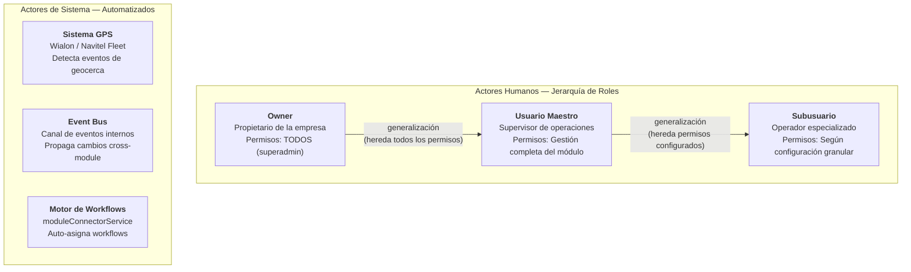

### 10.0.2 Matriz Actor × Caso de Uso

| Caso de Uso | Owner | Usuario Maestro | Subusuario (con permiso) | Sistema GPS | Motor Workflows |
|---|:---:|:---:|:---:|:---:|:---:|
| **CU-01** Crear Orden | Sí | Sí | Sí `orders:create` | — | — |
| **CU-02** Transicionar Estado | Sí | Sí | Sí `orders:edit` | Sí (automático) | — |
| **CU-03** Cierre Administrativo | Sí | Sí | Sí `orders:close` | — | — |
| **CU-04** Cancelar Orden | Sí | Sí | Sí `orders:cancel` | — | — |
| **CU-05** Enviar a GPS | Sí | Sí | Sí `orders:sync_gps` | — | — |
| **CU-06** Importar desde Excel/CSV | Sí | Sí | Sí `orders:import` | — | — |
| **CU-07** Registro Manual de Hito | Sí | Sí | Sí `milestones:manual_entry` | — | — |

> **CU-04 restricción especial:** Si la orden está en `in_transit`, solo `owner` y `usuario_maestro` pueden cancelar. Los subusuarios NO pueden cancelar órdenes en tránsito, independientemente de su permiso.

### 10.0.3 Permisos Granulares del Subusuario

| Permiso | Código | Descripción | CUs Habilitados |
|---|---|---|---|
| Ver órdenes | `orders:view` | Consultar listado y detalle de órdenes | Lectura en todos los CUs |
| Crear órdenes | `orders:create` | Crear nuevas órdenes | CU-01 |
| Editar órdenes | `orders:edit` | Modificar datos y transicionar estados | CU-02 |
| Cerrar órdenes | `orders:close` | Ejecutar cierre administrativo | CU-03 |
| Cancelar órdenes | `orders:cancel` | Cancelar órdenes (excepto `in_transit`) | CU-04 |
| Eliminar borradores | `orders:delete` | Eliminar órdenes en estado `draft` | HU-11 |
| Sincronizar GPS | `orders:sync_gps` | Enviar órdenes al proveedor GPS | CU-05 |
| Importar órdenes | `orders:import` | Importación masiva desde Excel/CSV | CU-06 |
| Exportar órdenes | `orders:export` | Exportación a Excel/PDF | HU-08 |
| Registro manual | `milestones:manual_entry` | Registrar entrada/salida manual de hitos | CU-07 |

## 10.1 Diagrama General de Casos de Uso

> Diagrama visual UML de Casos de Uso que muestra los actores, los 7 CUs principales, las relaciones de asociación (`──`), inclusión (`<<include>>`) y extensión (`<<extend>>`), y el boundary del sistema.

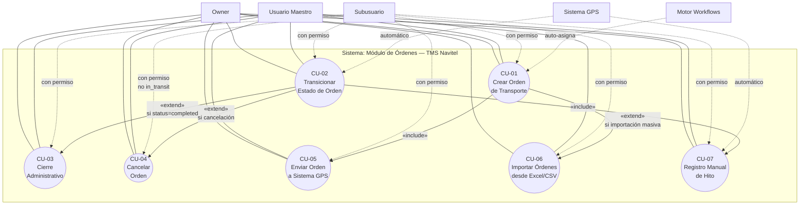

### 10.1.1 Descripción de Relaciones entre Casos de Uso

| Tipo | CU Origen | CU Destino | Condición | Descripción |
|---|---|---|---|---|
| `<<include>>` | CU-01 Crear Orden | CU-05 Enviar a GPS | Siempre (si se desea tracking) | Después de crear la orden, se puede enviar al GPS. Flujo incluido opcionalmente. |
| `<<include>>` | CU-02 Transicionar Estado | CU-07 Registro Manual Hito | Cuando GPS falla | Las transiciones de hito pueden requerir registro manual si no hay detección automática. |
| `<<extend>>` | CU-02 Transicionar Estado | CU-03 Cierre Administrativo | `status = completed` | Cuando la orden alcanza `completed`, se habilita el cierre administrativo. |
| `<<extend>>` | CU-02 Transicionar Estado | CU-04 Cancelar Orden | Decisión del actor | Desde cualquier estado no-terminal, el actor puede decidir cancelar. |
| `<<extend>>` | CU-01 Crear Orden | CU-06 Importar desde Excel | Si son múltiples órdenes | La creación masiva extiende el caso base de creación individual. |

---

## CU-01: Crear Orden de Transporte

| Atributo | Valor |
|---|---|
| **ID** | CU-01 |
| **Nombre** | Crear Orden de Transporte |
| **Versión** | 1.0 |
| **Actor Principal** | Operador de Logística (`usuario_maestro` o `subusuario` con permiso `orders:create`) |
| **Actores Secundarios** | Sistema de Workflows (`moduleConnectorService`), Sistema de Validación (Zod) |
| **Trigger** | El operador accede a `/orders/new` y desea registrar un nuevo servicio de transporte. |
| **Frecuencia** | 10–50 veces por día (horario laboral). |
| **Nivel** | Objetivo del Usuario (User Goal) |
| **Importancia** | Vital — Sin creación de órdenes, el módulo no tiene razón de ser |
| **Fuentes** | Análisis de código fuente (`useOrders.ts`, `NewOrderPage`), RFC Backend TMS, entrevistas con equipo de logística |

### Precondiciones (TODAS deben cumplirse)

| # | Precondición | Verificación | Qué pasa si no se cumple |
|---|---|---|---|
| PRE-01 | El usuario está **autenticado** con sesión activa (token JWT válido). | `auth-context.tsx` verifica token en cada request. | Redirect a `/login`. HTTP 401. |
| PRE-02 | El usuario tiene **permiso** `orders:create`. | Middleware de autorización en backend. | HTTP 403 FORBIDDEN. Botón "Nueva Orden" oculto en UI. |
| PRE-03 | Existe **al menos 1 cliente** activo en el módulo maestro. | `GET /customers?status=active` retorna `total ≥ 1`. | Paso 1 del wizard muestra "No hay clientes registrados. Registre al menos uno." |
| PRE-04 | Existen **al menos 2 geocercas** registradas (para origen y destino). | `GET /geofences` retorna `total ≥ 2`. | Paso 3 del wizard muestra advertencia: "No hay geocercas suficientes para crear una ruta." |
| PRE-05 | El servicio de **OrderService** está disponible y conectado al backend. | `apiConfig.baseUrl` configurada. Si `useMocks = true`, mock data disponible. | Toast error: "Servicio no disponible. Intente más tarde." |

### Flujo Principal (Happy Path)

| Paso | Actor | Acción | Sistema | Resultado |
|---|---|---|---|---|
| 1 | Operador | Navega a `/orders/new`. | Renderiza `NewOrderPage` con wizard de 6 pasos. | Se muestra el Paso 1: "Información del Cliente". |
| 2 | Operador | Selecciona un **cliente** de la lista desplegable. Selecciona **tipo de servicio** y **prioridad**. | Valida que `customerId` no esté vacío. Carga nombre del cliente. | Paso 1 válido. Botón "Siguiente" habilitado. |
| 3 | Operador | Avanza al Paso 2: "Datos de Carga". Ingresa tipo, descripción, peso, volumen, cantidad. | Valida `cargo.weight > 0`, `cargo.description.length ≥ 3`, etc. con Zod. | Paso 2 válido. |
| 4 | Operador | Avanza al Paso 3: "Ruta". Agrega mínimo 2 hitos (origin + destination) con geocercas, coordenadas, contacto y ETA. | Valida `milestones.length ≥ 2`, un hito `type=origin` con `sequence=1`, un hito `type=destination` como último. Verifica coordenadas en rango. | Paso 3 válido. Mapa preview muestra la ruta. |
| 5 | Operador | Avanza al Paso 4: "Recursos" (opcional). Puede asignar transportista, vehículo, conductor, operador GPS. | Si se asigna vehículo/conductor, verifica conflictos de horario con `useResourceConflicts`. | Sin conflictos → Paso 4 válido. |
| 6 | Operador | Avanza al Paso 5: "Workflow". Selecciona workflow o deja vacío para auto-asignación. | Si se deja vacío, `moduleConnectorService.prepareOrderWithConnections()` busca workflow compatible por `serviceType` + `cargo.type`. | Workflow asignado (o ninguno, con warning). |
| 7 | Operador | Avanza al Paso 6: "Resumen". Revisa todos los datos. Presiona "Crear Orden". | Ejecuta validación completa con `createOrderSchema` (Zod). | Validación pasa → se envía `POST /orders`. |
| 8 | Sistema | — | Genera `UUID` para `id`. Genera `orderNumber` con formato `ORD-{YYYY}-{SECUENCIAL}`. Establece `status = "draft"`, `syncStatus = "not_sent"`, `completionPercentage = 0`. Crea `StatusHistoryEntry` inicial (`draft → draft`). Persiste en BD vía `OrderService.createOrder()`. Emite evento `order.created` vía `tmsEventBus`. | Orden persistida con todos los campos. |
| 9 | Sistema | — | Retorna HTTP `201 Created` con la orden completa. | Frontend recibe la orden creada. |
| 10 | Operador | Ve diálogo de éxito con 3 opciones: "Ver orden", "Crear otra", "Ir a lista". | Actualiza la lista de órdenes (`useOrders.refresh()`). | El operador elige una acción. |

### Flujos Alternativos

| ID | Nombre | Punto de Bifurcación | Descripción |
|---|---|---|---|
| FA-01 | Volver a paso anterior | Pasos 2–6 | El operador presiona "Atrás". El wizard retrocede al paso previo conservando los datos ingresados. No se pierde información. |
| FA-02 | Conflicto de recursos | Paso 5 | Al seleccionar vehículo/conductor, se detecta conflicto de horario con otra orden. Se muestra `ConflictWarning` con detalle: orden en conflicto, fechas superpuestas, sugerencias. El operador puede: (a) elegir otro recurso, (b) dejar los recursos vacíos para asignar luego. |
| FA-03 | Sin workflow compatible | Paso 6 | `moduleConnectorService` no encuentra workflow compatible. Se muestra warning: "No se encontró workflow compatible. La orden se creará sin workflow." El operador puede: (a) seleccionar uno manualmente, (b) continuar sin workflow. |
| FA-04 | Crear sin recursos | Paso 5 | El operador no asigna vehículo ni conductor (campos opcionales). La orden se crea con `vehicleId = null`, `driverId = null`. Se asignarán posteriormente vía `PATCH /:id/status` con transición a `assigned`. |
| FA-05 | Cargo refrigerada | Paso 2 | Si `cargo.type = "refrigerated"`, el sistema fuerza `requiresRefrigeration = true` y muestra campos obligatorios `temperatureRange.min` y `temperatureRange.max`. |
| FA-06 | Cargo peligrosa | Paso 2 | Si `cargo.type = "hazardous"`, el sistema muestra campo obligatorio `hazardousClass` (clase UN 1-9). |

### Flujos de Excepción

| ID | Nombre | Punto de Fallo | Error | Resolución |
|---|---|---|---|---|
| FE-01 | Validación falla | Paso 7 (al presionar "Crear") | HTTP `400 VALIDATION_ERROR` con detalle por campo: `{"customerId": "Selecciona un cliente", "milestones": "Agrega al menos origen y destino"}` | El wizard navega automáticamente al paso del primer error. Los campos inválidos se resaltan en rojo con su mensaje. El operador corrige y reintenta. |
| FE-02 | Cliente no existe | Paso 7 (server-side) | HTTP `404 CUSTOMER_NOT_FOUND`: "Cliente con id 'X' no encontrado." | El wizard navega al Paso 1. El operador debe seleccionar un cliente válido. |
| FE-03 | Geocerca no existe | Paso 7 (server-side) | HTTP `404 GEOFENCE_NOT_FOUND`: "Geocerca con id 'X' no encontrada." | El wizard navega al Paso 3. El operador debe seleccionar otra geocerca o crear una nueva. |
| FE-04 | Error de red | Paso 7 | HTTP `500 INTERNAL_ERROR` o timeout de red. | Toast error: "Error al crear la orden. Intente nuevamente." Los datos del wizard se conservan en estado local. |
| FE-05 | Sesión expirada | Cualquier paso | HTTP `401 UNAUTHORIZED`. | Redirect a `/login`. Al re-autenticarse, se regresa al wizard con los datos en `localStorage` (si se implementó persistencia). |

### Postcondiciones (si el flujo principal completa exitosamente)

| # | Postcondición | Verificación |
|---|---|---|
| POST-01 | La orden existe en la BD con `id` (UUID v4) e `orderNumber` únicos. | `GET /orders/:id` retorna HTTP 200 con la orden. |
| POST-02 | `status = "draft"` y `syncStatus = "not_sent"`. | Verificar campos en la respuesta. |
| POST-03 | `completionPercentage = 0`. | Campo numérico en la respuesta. |
| POST-04 | Existe exactamente 1 registro en `statusHistory` con `fromStatus = "draft"` y `toStatus = "draft"`. | `order.statusHistory.length === 1`. |
| POST-05 | Los milestones tienen `status = "pending"` y `sequence` secuencial. | Verificar cada milestone en la respuesta. |
| POST-06 | Si se auto-asignó workflow, `workflowId` y `workflowName` están poblados. | `order.workflowId !== null` (o `null` si no hubo match). |
| POST-07 | Evento `order.created` fue publicado en el Event Bus. | Log de auditoría registra el evento. |
| POST-08 | `createdAt` y `updatedAt` están poblados con timestamp UTC actual. | Formato ISO 8601 con sufijo Z. |

### Reglas de Negocio Asociadas

| Regla | Referencia | Descripción |
|---|---|---|
| RN-01 | §6 (Máquina de Estados) | Toda orden nace en estado `draft`. No se puede crear en otro estado. |
| RN-02 | §5.10 (MilestoneType) | Exactamente 1 hito `origin` (sequence=1) y 1 hito `destination` (sequence=max). |
| RN-03 | §18.2 (Workflow Auto-Assignment) | Si no se selecciona workflow, el sistema intenta auto-asignar según `serviceType` + `cargo.type`. |
| RN-04 | §12 (Validaciones) | El DTO se valida con `createOrderSchema` (Zod) en frontend y backend. |
| RN-05 | §3.1 campo #2 | `orderNumber` es auto-generado y único global. Formato: `ORD-{YYYY}-{SEC5DÍGITOS}`. |

### Diagrama de Flujo

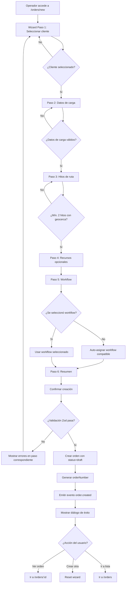

---

## CU-02: Transicionar Estado de Orden

| Atributo | Valor |
|---|---|
| **ID** | CU-02 |
| **Nombre** | Transicionar Estado de Orden |
| **Versión** | 1.0 |
| **Actor Principal** | Operador (`usuario_maestro` o `subusuario` con permiso `orders:edit`) / Sistema GPS (automático) |
| **Actores Secundarios** | Motor de Máquina de Estados, Event Bus, Módulo de Monitoreo |
| **Trigger** | El operador solicita un cambio de estado, o el sistema GPS detecta un evento (entrada/salida de geocerca, retraso). |
| **Frecuencia** | 50–200 veces por día (combinación de acciones manuales y automáticas). |
| **Importancia** | Vital — Las transiciones de estado son el corazón del ciclo de vida de la orden |
| **Fuentes** | Análisis de máquina de estados (§6), RFC Backend TMS, diagrama de estados del proceso logístico |

### Precondiciones

| # | Precondición | Verificación | Qué pasa si no se cumple |
|---|---|---|---|
| PRE-01 | La orden con `id` dado **existe** en la BD. | `GET /orders/:id` retorna 200. | HTTP `404 ORDER_NOT_FOUND`. |
| PRE-02 | El usuario tiene permiso `orders:edit`. | Token JWT con permisos válidos. | HTTP `403 FORBIDDEN`. |
| PRE-03 | La **transición solicitada es válida** según la tabla de transiciones (§6.2). | Lookup en `validTransitions[currentStatus]`. | HTTP `422 INVALID_STATE_TRANSITION` con `validTransitions[]` en el detalle. |
| PRE-04 | Se cumplen las **precondiciones específicas** de la transición (ver tabla §6.2). | Validación server-side por transición. | HTTP `422 PRECONDITION_FAILED` con `missingConditions[]`. |

### Flujo Principal

| Paso | Actor | Acción |
|---|---|---|
| 1 | Actor | Envía `PATCH /orders/:id/status` con `{ status: "<nuevo_estado>", reason: "<motivo>" }`. |
| 2 | Sistema | Busca la orden por `id`. Si no existe → FE-01. |
| 3 | Sistema | Valida que la transición `currentStatus → newStatus` esté en la tabla de transiciones. Si no → FE-02. |
| 4 | Sistema | Verifica precondiciones específicas de la transición (ej: `assigned` requiere `vehicleId` + `driverId`). Si falla → FE-03. |
| 5 | Sistema | Ejecuta la transición: actualiza `status`, establece `updatedAt = NOW()`. |
| 6 | Sistema | Crea registro en `statusHistory`: `{fromStatus, toStatus, changedAt, changedBy, reason}`. |
| 7 | Sistema | Recalcula `completionPercentage` basado en hitos completados. |
| 8 | Sistema | Si `newStatus = "in_transit"`: registra `actualStartDate = NOW()`. |
| 9 | Sistema | Si `newStatus = "completed"`: registra `actualEndDate = NOW()`. |
| 10 | Sistema | Si `newStatus = "cancelled"`: registra `cancelledAt = NOW()`, `cancelledBy`, `cancellationReason`. |
| 11 | Sistema | Publica evento `order.status_changed` en Event Bus. Si es `completed` → también `order.completed`. Si es `cancelled` → también `order.cancelled`. |
| 12 | Sistema | Retorna HTTP `200 OK` con la orden actualizada. |

### Flujos de Excepción

| ID | Error | HTTP | Código | Resolución |
|---|---|---|---|---|
| FE-01 | Orden no encontrada | `404` | `ORDER_NOT_FOUND` | Verificar que el `id` es correcto. |
| FE-02 | Transición inválida | `422` | `INVALID_STATE_TRANSITION` | Consultar `validTransitions[]` en la respuesta para saber qué transiciones son posibles. |
| FE-03 | Precondición no cumplida | `422` | `PRECONDITION_FAILED` | Leer `missingConditions[]`. Ej: "vehicleId es requerido". |
| FE-04 | Conflicto de vehículo | `409` | `VEHICLE_CONFLICT` | Elegir otro vehículo o resolver conflicto de horario. |
| FE-05 | Conflicto de conductor | `409` | `DRIVER_CONFLICT` | Elegir otro conductor o resolver horario. |

### Postcondiciones

| # | Postcondición |
|---|---|
| POST-01 | `order.status === newStatus`. |
| POST-02 | `order.statusHistory` tiene un nuevo registro con la transición. |
| POST-03 | `order.updatedAt` actualizado. |
| POST-04 | Evento `order.status_changed` publicado. |
| POST-05 | Si `cancelled`: `cancellationReason`, `cancelledAt`, `cancelledBy` poblados. |

### Diagrama de Flujo

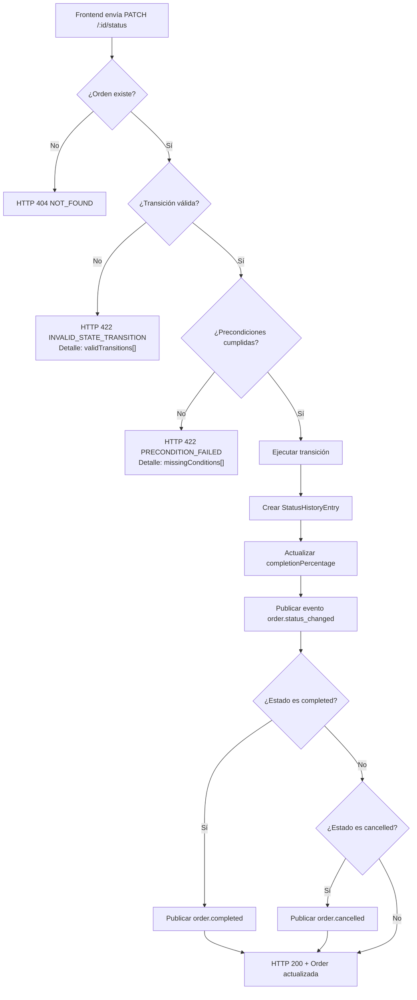

---

## CU-03: Cierre Administrativo de Orden

| Atributo | Valor |
|---|---|
| **ID** | CU-03 |
| **Nombre** | Cierre Administrativo de Orden |
| **Versión** | 1.0 |
| **Actor Principal** | Supervisor de Operaciones (`usuario_maestro` o `subusuario` con permiso `orders:close`) |
| **Actores Secundarios** | Cliente (firma), Sistema de Cálculo de Métricas |
| **Trigger** | El supervisor accede al detalle de una orden con `status = "completed"` y presiona "Cerrar Orden". |
| **Frecuencia** | 5–20 veces por día. |
| **Importancia** | Vital — El cierre genera las métricas de KPI y facturación |
| **Fuentes** | RFC Backend TMS, análisis del componente `ClosureForm`, proceso de cierre contable de operaciones |

### Precondiciones

| # | Precondición | Verificación | Qué pasa si no se cumple |
|---|---|---|---|
| PRE-01 | `order.status === "completed"`. | Verificar campo `status`. | Botón "Cerrar Orden" deshabilitado. Si se fuerza via API: HTTP `422 CANNOT_CLOSE_ORDER`. |
| PRE-02 | **TODOS** los milestones tienen `status ∈ {"completed", "skipped"}`. | `order.milestones.every(m => m.status === 'completed' \|\| m.status === 'skipped')`. | HTTP `422 CANNOT_CLOSE_ORDER` con detalle: `{"pendingMilestones": ["Nombre del hito pendiente"]}`. |
| PRE-03 | El usuario tiene permiso `orders:close`. | Token JWT. | HTTP `403 FORBIDDEN`. |
| PRE-04 | La orden **no ha sido cerrada previamente** (no hay `closureData`). | `order.closureData === null`. | Botón "Cerrar Orden" reemplazado por "Ver datos de cierre". |

### Flujo Principal

| Paso | Actor | Acción |
|---|---|---|
| 1 | Supervisor | Accede a `/orders/:id` y presiona "Cerrar Orden". |
| 2 | Sistema | Verifica PRE-01 y PRE-02. Si falla → muestra el motivo y no abre el formulario. |
| 3 | Sistema | Abre formulario modal/panel de cierre. |
| 4 | Supervisor | Ingresa `observations` (**obligatorio**, mín. 1 carácter). |
| 5 | Supervisor | (Opcional) Registra incidencias seleccionando del catálogo tipificado o describiendo libremente. |
| 6 | Supervisor | (Opcional) Registra desviaciones con tipo, descripción e impacto cuantificado. |
| 7 | Supervisor | (Opcional) Adjunta fotos de entrega (`deliveryPhotos`). |
| 8 | Supervisor | (Opcional) Captura firma digital del cliente (`customerSignature`). |
| 9 | Supervisor | (Opcional) Registra valoración del cliente (1–5 estrellas). |
| 10 | Supervisor | (Opcional) Registra combustible consumido y costo de peajes. |
| 11 | Supervisor | Presiona "Confirmar Cierre". |
| 12 | Sistema | Valida `OrderClosureDTO` con `orderClosureSchema` (Zod). Si falla → FE-01. |
| 13 | Sistema | Envía `POST /orders/:id/close` con `OrderClosureDTO`. |
| 14 | Sistema (backend) | Genera `closedAt = NOW()`, `closedBy = currentUserId`, `closedByName = currentUserName`. |
| 15 | Sistema (backend) | Calcula: `completedMilestones`, `totalMilestones`, `totalDistanceKm` (de `actualDistance` o suma de hitos), `totalDurationMinutes` (de `actualStartDate` a `actualEndDate`). |
| 16 | Sistema (backend) | Ejecuta transición `completed → closed`. Crea `StatusHistoryEntry`. |
| 17 | Sistema (backend) | Publica eventos: `order.status_changed`, `order.closed`. |
| 18 | Sistema | Retorna HTTP `200 OK` con orden cerrada. |
| 19 | Supervisor | Ve confirmación visual. Los botones de acción cambian (la orden es ahora read-only). |

### Flujos de Excepción

| ID | Error | HTTP | Código | Resolución |
|---|---|---|---|---|
| FE-01 | Validación del formulario falla | — (frontend) | — | Campos inválidos resaltados en rojo. Ej: "Ingresa observaciones del cierre". |
| FE-02 | Status no es `completed` | `422` | `CANNOT_CLOSE_ORDER` | La orden no está lista. Verificar que todos los hitos estén completados. |
| FE-03 | Hitos pendientes | `422` | `CANNOT_CLOSE_ORDER` | Detalle: lista de hitos pendientes. El supervisor debe completarlos o marcarlos como `skipped`. |
| FE-04 | Error de red / servidor | `500` | `INTERNAL_ERROR` | Reintentar. Los datos del formulario se conservan en estado local. |

### Postcondiciones

| # | Postcondición |
|---|---|
| POST-01 | `order.status === "closed"` (**estado terminal**). |
| POST-02 | `order.closureData` poblado con todos los datos de cierre. |
| POST-03 | `order.closureData.closedAt` tiene timestamp UTC del momento del cierre. |
| POST-04 | El `statusHistory` tiene la transición `completed → closed`. |
| POST-05 | Evento `order.closed` publicado → Módulo Finanzas genera facturación. |
| POST-06 | La orden es ahora **read-only**. No se permiten más modificaciones. |

### Diagrama de Flujo

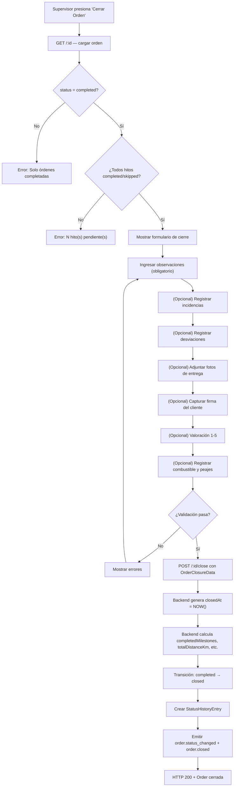

---

## CU-04: Cancelar Orden

| Atributo | Valor |
|---|---|
| **ID** | CU-04 |
| **Nombre** | Cancelar Orden |
| **Versión** | 1.0 |
| **Actor Principal** | Operador (`usuario_maestro` o `subusuario` con permiso `orders:cancel`) o Owner |
| **Trigger** | El actor decide cancelar una orden por solicitud del cliente, error, duplicado u otra razón operativa. |
| **Importancia** | Importante — Permite corregir errores operativos y gestionar cambios del cliente |
| **Fuentes** | RFC Backend TMS, análisis de máquina de estados (§6), entrevistas con operadores de logística |

### Precondiciones

| # | Precondición | Verificación | Qué pasa si no se cumple |
|---|---|---|---|
| PRE-01 | `order.status ∈ {"draft", "pending", "assigned", "in_transit", "delayed"}`. | Los estados `completed`, `closed` y `cancelled` **no permiten cancelación**. | HTTP `422 INVALID_STATE_TRANSITION`: "No se puede cancelar una orden en estado '{status}'." |
| PRE-02 | Se proporciona `cancellationReason` (string, mín. 1 carácter). | Validación en DTO. | HTTP `400 VALIDATION_ERROR`: "El motivo de cancelación es obligatorio." |
| PRE-03 | Si la orden está `in_transit`, solo roles `owner` o `usuario_maestro` pueden cancelar. | Verificación de rol para cancelación en tránsito. | HTTP `403 FORBIDDEN`: "Solo owner y usuario maestro pueden cancelar órdenes en tránsito." |

### Flujo Principal

| Paso | Actor | Acción |
|---|---|---|
| 1 | Actor | En el detalle de la orden, presiona "Cancelar Orden". |
| 2 | Sistema | Muestra diálogo de confirmación con campo obligatorio "Motivo de cancelación". |
| 3 | Actor | Escribe el motivo (ej: "Solicitud del cliente - pedido duplicado") y confirma. |
| 4 | Sistema | Envía `PATCH /orders/:id/status` con `{ status: "cancelled", reason: "<motivo>" }`. |
| 5 | Sistema | Registra: `cancelledAt = NOW()`, `cancelledBy = currentUserId`, `cancellationReason = reason`. |
| 6 | Sistema | Crea `StatusHistoryEntry` con la transición. |
| 7 | Sistema | Libera recursos: si tenía `vehicleId` y `driverId` asignados, quedan libres para otras órdenes. |
| 8 | Sistema | Publica eventos: `order.status_changed`, `order.cancelled`. |
| 9 | Sistema | Retorna HTTP `200 OK`. |
| 10 | Actor | Ve confirmación: "Orden cancelada exitosamente." La orden cambia a read-only. |

### Postcondiciones

| # | Postcondición |
|---|---|
| POST-01 | `order.status === "cancelled"` (estado terminal). |
| POST-02 | `order.cancellationReason`, `cancelledAt`, `cancelledBy` poblados. |
| POST-03 | Recursos (vehículo/conductor) liberados. |
| POST-04 | Evento `order.cancelled` publicado. |

---

## CU-05: Enviar Orden a Sistema GPS

| Atributo | Valor |
|---|---|
| **ID** | CU-05 |
| **Nombre** | Enviar Orden a Sistema GPS Externo |
| **Versión** | 1.0 |
| **Actor Principal** | Operador (`usuario_maestro` o `subusuario` con permiso `orders:sync_gps`) |
| **Actores Secundarios** | API del Proveedor GPS (Wialon, Navitel Fleet) |
| **Trigger** | El operador desea sincronizar una o más órdenes con el proveedor GPS para habilitar tracking. |
| **Importancia** | Importante — La sincronización GPS habilita el monitoreo en tiempo real |
| **Fuentes** | Análisis de integración GPS (`gps-sync.service.ts`), API documentation de Wialon/Navitel Fleet |

### Precondiciones

| # | Precondición | Qué pasa si no se cumple |
|---|---|---|
| PRE-01 | La(s) orden(es) existen en la BD. | HTTP `404 ORDER_NOT_FOUND`. |
| PRE-02 | `gpsOperatorId` asignado (recomendado, no estrictamente obligatorio). | Warning: "Orden sin operador GPS asignado." El envío puede fallar en el proveedor. |
| PRE-03 | `syncStatus ≠ "sending"` (no está en proceso). | HTTP `409`: "Ya hay un envío en proceso." |
| PRE-04 | Conexión al API del proveedor GPS disponible. | `syncStatus = "error"`, `syncErrorMessage = "Timeout de conexión con {provider} API"`. |

### Flujo Principal

| Paso | Acción |
|---|---|
| 1 | Operador selecciona orden(es) y presiona "Enviar a GPS" (individual) o "Envío Masivo" (bulk). |
| 2 | Sistema cambia `syncStatus = "sending"`. |
| 3 | Sistema construye payload de sincronización y envía a API del proveedor GPS. |
| 4 | Si éxito: `syncStatus = "sent"`, `lastSyncAttempt = NOW()`, `syncErrorMessage = null`. |
| 5 | Si fallo: `syncStatus = "error"`, `syncErrorMessage = <detalle>`, `lastSyncAttempt = NOW()`. |
| 6 | Sistema publica evento `order.sync_updated`. |

### Flujos Alternativos

| ID | Descripción |
|---|---|
| FA-01 | **Envío masivo:** `POST /orders/bulk-send` con array de `orderIds`. Cada orden se procesa individualmente. Resultado: array de resultados mixtos (algunos éxito, algunos error). |
| FA-02 | **Re-envío forzado:** Si `syncStatus = "sent"`, el operador puede forzar re-envío con `forceResend: true`. Útil cuando se actualizaron datos de la orden después del envío. |
| FA-03 | **Reintento automático:** Si `syncStatus = "error"`, el sistema programa reintentos automáticos con backoff exponencial (1s, 2s, 4s, 8s, 16s). Máximo 5 intentos. |

---

## CU-06: Importar Órdenes desde Excel/CSV

| Atributo | Valor |
|---|---|
| **ID** | CU-06 |
| **Nombre** | Importar Órdenes Masivamente |
| **Versión** | 1.0 |
| **Actor Principal** | Operador (`usuario_maestro` o `subusuario` con permiso `orders:import`) |
| **Trigger** | El operador necesita crear múltiples órdenes a partir de una planilla externa. |
| **Importancia** | Importante — Reduce tiempo de operación de 2 min/orden manual a segundos para carga masiva |
| **Fuentes** | Análisis de `useOrderImportExport.ts`, plantillas Excel del cliente, `excel-utils.ts` |

### Precondiciones

| # | Precondición | Qué pasa si no se cumple |
|---|---|---|
| PRE-01 | Archivo con extensión `.xlsx`, `.xls` o `.csv`. | HTTP `422 INVALID_FILE_FORMAT`. |
| PRE-02 | Los clientes referenciados en el archivo **existen** en el maestro. | Fila marcada como `"invalid"` con error: "Cliente no encontrado." |
| PRE-03 | Las geocercas referenciadas **existen**. | Fila marcada como `"invalid"` con error: "Geocerca no encontrada." |
| PRE-04 | El esquema de columnas del archivo coincide con la plantilla esperada. | Warning: columnas no reconocidas se ignoran. Columnas obligatorias faltantes → filas `"invalid"`. |

### Flujo Principal

| Paso | Acción |
|---|---|
| 1 | Operador navega a `/orders/import`. |
| 2 | Operador sube archivo (drag & drop o selector). |
| 3 | Sistema parsea el archivo y valida cada fila contra `createOrderSchema`. |
| 4 | Sistema muestra **preview**: tabla con filas coloreadas (verde=válida, amarillo=warning, rojo=error). |
| 5 | Operador revisa el preview. Las filas inválidas **no bloquean** las válidas. |
| 6 | Operador presiona "Importar válidas". |
| 7 | Sistema crea una orden por cada fila válida vía `OrderService.createOrder()`. |
| 8 | Sistema muestra resultado final: total filas, válidas creadas, errores, warnings. |

---

## CU-07: Registrar Entrada/Salida de Hito (Manual)

| Atributo | Valor |
|---|---|
| **ID** | CU-07 |
| **Nombre** | Registrar Entrada o Salida de Hito Manualmente |
| **Versión** | 1.0 |
| **Actor Principal** | Operador de Monitoreo (`usuario_maestro` o `subusuario` con permiso `milestones:manual_entry`) |
| **Trigger** | El GPS no detectó la entrada/salida de geocerca (sin señal, falla de equipo) y el operador necesita registrar manualmente. |
| **Importancia** | Deseable — Mecanismo de contingencia cuando la automatización GPS falla |
| **Fuentes** | Análisis del hook `useMonitoring`, entrevistas con operadores de monitoreo, casos de falla GPS documentados |

### Precondiciones

| # | Precondición | Qué pasa si no se cumple |
|---|---|---|
| PRE-01 | `order.status ∈ {"in_transit", "at_milestone", "delayed"}`. | Botón de registro manual deshabilitado. |
| PRE-02 | El hito pertenece a la orden. | HTTP `404 MILESTONE_NOT_FOUND`. |
| PRE-03 | Se proporcionan campos de `manualEntryData`: `reason` (obligatorio), `observation` (recomendado). | HTTP `400 VALIDATION_ERROR`. |

### Flujo Principal

| Paso | Acción |
|---|---|
| 1 | Operador abre modal de "Registro Manual" para el hito seleccionado. |
| 2 | Selecciona tipo de registro: "Entrada" o "Salida". |
| 3 | Selecciona motivo (`ManualEntryReason`): sin señal GPS, falla de equipo, carga retroactiva, corrección, otro. |
| 4 | Escribe observación y opcionalmente adjunta evidencia. |
| 5 | Confirma. Sistema registra con `isManual = true` y `manualEntryData` poblado. |
| 6 | Se recalcula `completionPercentage` y se evalúa si el status de la orden debe cambiar. |

---

# 11. API REST — Contratos

**Base URL:** `/operations/orders`

## 11.1 `GET /` — Listar órdenes

### Request

| Parámetro | Ubicación | Tipo | Obligatorio | Descripción |
|---|---|---|:---:|---|
| `search` | query | `string` | No | Buscar en `orderNumber`, `customerName`, `externalReference`, `reference` |
| `customerId` | query | `UUID` | No | Filtrar por cliente |
| `carrierId` | query | `UUID` | No | Filtrar por transportista |
| `gpsOperatorId` | query | `UUID` | No | Filtrar por operador GPS |
| `status` | query | `string` | No | Uno o varios estados separados por comas: `pending,assigned` |
| `priority` | query | `string` | No | Uno o varios: `low,normal,high,urgent` |
| `syncStatus` | query | `string` | No | Estado de sincronización |
| `serviceType` | query | `string` | No | Tipo de servicio |
| `dateType` | query | `enum` | No | `creation` · `scheduled` · `execution` |
| `dateFrom` | query | `ISO 8601` | No | Inicio del rango de fecha |
| `dateTo` | query | `ISO 8601` | No | Fin del rango de fecha |
| `tags` | query | `string` | No | Etiquetas separadas por comas |
| `sortBy` | query | `string` | No | Campo por el cual ordenar |
| `sortOrder` | query | `enum` | No | `asc` · `desc` |
| `page` | query | `integer` | No | Página (1-based). Default: 1 |
| `pageSize` | query | `integer` | No | Elementos por página. Default: 10. Máx: 100 |

### Response — `200 OK`

```json
{
  "data": [ Order, Order, ... ],
  "total": 150,
  "page": 1,
  "pageSize": 10,
  "totalPages": 15,
  "statusCounts": {
    "draft": 5,
    "pending": 12,
    "assigned": 8,
    "in_transit": 23,
    "at_milestone": 4,
    "delayed": 3,
    "completed": 45,
    "closed": 40,
    "cancelled": 10
  }
}
```

### Permisos requeridos: `orders:view` (owner, usuario_maestro, subusuario con permiso)

---

## 11.2 `GET /:id` — Obtener detalle

### Request

| Parámetro | Ubicación | Tipo | Obligatorio |
|---|---|---|:---:|
| `id` | path | `UUID` | Sí |

### Response — `200 OK` 
Retorna objeto `Order` completo con todas las sub-entidades pobladas.

### Response — `404 Not Found` 
```json
{
  "error": {
    "code": "ORDER_NOT_FOUND",
    "message": "Orden con id '{id}' no encontrada"
  }
}
```

### Permisos requeridos: `orders:view` (owner, usuario_maestro, subusuario con permiso)

---

## 11.3 `POST /` — Crear orden

### Request Body — `CreateOrderDTO`

```json
{
  "customerId": "cust-001",
  "carrierId": "car-001",
  "vehicleId": null,
  "driverId": null,
  "gpsOperatorId": "gps-op-001",
  "workflowId": null,
  "priority": "normal",
  "serviceType": "distribucion",
  "externalReference": "GR-000123",
  "cargo": {
    "type": "general",
    "description": "Materiales de construcción - Lote 45",
    "weight": 5000,
    "volume": 25,
    "quantity": 50,
    "declaredValue": 75000,
    "requiresRefrigeration": false,
    "specialInstructions": "No apilar más de 3 niveles"
  },
  "milestones": [
    {
      "name": "Almacén Central Lima",
      "type": "origin",
      "sequence": 1,
      "address": "Av. Argentina 1234, Callao",
      "coordinates": { "lat": -12.0464, "lng": -77.0428 },
      "geofenceId": "geo-almacen-central",
      "estimatedArrival": "2026-02-24T08:00:00.000Z",
      "estimatedDeparture": "2026-02-24T10:00:00.000Z",
      "contactName": "Juan Pérez",
      "contactPhone": "+51 999 111 222"
    },
    {
      "name": "Centro Distribución Arequipa",
      "type": "destination",
      "sequence": 2,
      "address": "Parque Industrial Río Seco",
      "coordinates": { "lat": -16.409, "lng": -71.5375 },
      "geofenceId": "geo-cd-arequipa",
      "estimatedArrival": "2026-02-25T06:00:00.000Z",
      "contactName": "María García",
      "contactPhone": "+51 998 333 444"
    }
  ],
  "scheduledStartDate": "2026-02-24T08:00:00.000Z",
  "scheduledEndDate": "2026-02-25T12:00:00.000Z",
  "notes": "Cliente requiere notificación 2h antes de llegada",
  "tags": ["nuevo-cliente"]
}
```

### Response — `201 Created`

```json
{
  "id": "ord-00051",
  "orderNumber": "ORD-2026-00051",
  "status": "draft",
  "syncStatus": "not_sent",
  "completionPercentage": 0,
  "workflowId": "wf-1",
  "workflowName": "Workflow Estándar",
  "createdAt": "2026-02-23T15:30:00.000Z",
  "createdBy": "user-001",
  "statusHistory": [
    {
      "id": "ord-00051-hist-1",
      "fromStatus": "draft",
      "toStatus": "draft",
      "changedAt": "2026-02-23T15:30:00.000Z",
      "changedBy": "user-001",
      "changedByName": "Juan Operador",
      "reason": "Orden creada"
    }
  ],
  "milestones": [
    {
      "id": "ord-00051-ms-1",
      "orderId": "ord-00051",
      "status": "pending",
      "...": "...resto de datos del milestone"
    }
  ],
  "...": "...resto de campos de Order"
}
```

### Response — `400 Bad Request` (validación fallida)

```json
{
  "error": {
    "code": "VALIDATION_ERROR",
    "message": "Los datos de la orden no son válidos",
    "details": {
      "customerId": "Selecciona un cliente",
      "milestones": "Agrega al menos origen y destino",
      "cargo.weight": "El peso debe ser mayor a 0"
    }
  }
}
```

### Permisos requeridos: `orders:create` (owner, usuario_maestro, subusuario con permiso)

---

## 11.4 `PUT /:id` — Actualizar orden

### Request Body — `UpdateOrderDTO`

Parcial de `CreateOrderDTO`. Solo enviar los campos que cambian.

```json
{
  "priority": "high",
  "notes": "Cliente confirmó recepción en horario nocturno"
}
```

### Response — `200 OK` — Order actualizada completa

### Response — `404 Not Found` — Orden no existe

### Permisos requeridos: `orders:edit` (owner, usuario_maestro, subusuario con permiso)

---

## 11.5 `DELETE /:id` — Eliminar orden

### Precondición: `status = draft`

### Response — `204 No Content` — Eliminación exitosa

### Response — `409 Conflict` — Estado no permite eliminación

```json
{
  "error": {
    "code": "CANNOT_DELETE_NON_DRAFT",
    "message": "Solo se pueden eliminar órdenes en estado 'draft'. Estado actual: 'pending'"
  }
}
```

### Permisos requeridos: `orders:delete` (solo owner y usuario_maestro)

---

## 11.6 `PATCH /:id/status` — Transicionar estado

### Request Body

```json
{
  "status": "pending",
  "reason": "Orden confirmada por el operador"
}
```

### Si la transición es a `assigned`, incluir recursos:

```json
{
  "status": "assigned",
  "vehicleId": "veh-001",
  "driverId": "drv-001",
  "reason": "Recursos asignados por planificador"
}
```

### Si la transición es a `cancelled`, incluir motivo:

```json
{
  "status": "cancelled",
  "reason": "Solicitud del cliente - pedido duplicado"
}
```

### Response — `200 OK` — Order con nuevo estado

### Response — `422 Unprocessable Entity` — Transición inválida

```json
{
  "error": {
    "code": "INVALID_STATE_TRANSITION",
    "message": "No se puede cambiar de 'completed' a 'in_transit'",
    "details": {
      "currentStatus": "completed",
      "requestedStatus": "in_transit",
      "validTransitions": ["closed"]
    }
  }
}
```

### Response — `422 Unprocessable Entity` — Precondiciones no cumplidas

```json
{
  "error": {
    "code": "PRECONDITION_FAILED",
    "message": "No se cumple la precondición para esta transición",
    "details": {
      "transition": "assigned → in_transit",
      "missingConditions": [
        "vehicleId es requerido",
        "driverId es requerido"
      ]
    }
  }
}
```

### Permisos requeridos: `orders:edit` (owner, usuario_maestro, subusuario con permiso)

---

## 11.7 `POST /:id/close` — Cerrar orden

### Request Body — `OrderClosureDTO`

```json
{
  "observations": "Viaje completado sin novedades. Entrega dentro del horario programado.",
  "completedMilestones": 3,
  "totalMilestones": 3,
  "totalDistanceKm": 1050,
  "totalDurationMinutes": 960,
  "fuelConsumed": 320,
  "tollsCost": 245.50,
  "customerRating": 5,
  "customerSignature": "data:image/png;base64,iVBOR...",
  "deliveryPhotos": [
    "https://storage.navitel.com/orders/ord-00001/photo_1.jpg",
    "https://storage.navitel.com/orders/ord-00001/photo_2.jpg"
  ],
  "incidents": [],
  "deviationReasons": [
    {
      "type": "time",
      "description": "Retraso por tráfico en zona urbana de Lima",
      "impact": { "value": 45, "unit": "minutes" }
    }
  ]
}
```

### Response — `200 OK` — Order con `status = closed` y `closureData` poblado

### Response — `422 Unprocessable Entity` — No se puede cerrar

```json
{
  "error": {
    "code": "CANNOT_CLOSE_ORDER",
    "message": "La orden no puede ser cerrada",
    "details": {
      "reason": "Hay 1 hito(s) pendiente(s)",
      "pendingMilestones": ["Almacén Central Lima"]
    }
  }
}
```

### Permisos requeridos: `orders:close` (owner, usuario_maestro, subusuario con permiso)

---

## 11.8 `POST /import` — Importación masiva

### Request: `multipart/form-data`

| Campo | Tipo | Descripción |
|---|---|---|
| `file` | `File` | Archivo `.xlsx`, `.xls` o `.csv` |

### Response — `200 OK`

```json
{
  "totalRows": 25,
  "validRows": 22,
  "errorRows": 2,
  "warningRows": 1,
  "rows": [
    {
      "rowNumber": 1,
      "data": { "...": "CreateOrderDTO parcial" },
      "errors": [],
      "warnings": [],
      "status": "valid"
    },
    {
      "rowNumber": 5,
      "data": { "customerId": "INVALID" },
      "errors": ["Cliente 'INVALID' no encontrado en el sistema"],
      "warnings": [],
      "status": "invalid"
    }
  ],
  "createdOrders": [ "...orders creadas..." ]
}
```

### Permisos requeridos: `orders:import` (owner, usuario_maestro, subusuario con permiso)

---

## 11.9 `GET /export` — Exportar a Excel

### Request Query Params

| Parámetro | Tipo | Descripción |
|---|---|---|
| `filters` | `OrderFilters` | Mismos filtros de listado |
| `orderIds` | `string` | IDs separados por coma (alternativa a filtros) |
| `includeMilestones` | `boolean` | Incluir hitos detallados |
| `includeStatusHistory` | `boolean` | Incluir historial |
| `includeClosureData` | `boolean` | Incluir datos de cierre |
| `dateFormat` | `string` | Formato de fechas (default: `DD/MM/YYYY HH:mm`) |
| `timezone` | `string` | Zona horaria (default: `America/Lima`) |

### Response — `200 OK` — `application/vnd.openxmlformats-officedocument.spreadsheetml.sheet`

### Permisos requeridos: `orders:export` (owner, usuario_maestro, subusuario con permiso)

---

## 11.10 `POST /bulk-send` — Envío masivo GPS

### Request Body

```json
{
  "orderIds": ["ord-00001", "ord-00002", "ord-00003"],
  "targetSystem": "wialon",
  "forceResend": false,
  "callbackUrl": "https://api.navitel.com/webhooks/sync-result"
}
```

### Response — `200 OK`

```json
{
  "batchId": "batch-1708712400000",
  "totalOrders": 3,
  "status": "completed",
  "progress": 100,
  "results": [
    { "orderId": "ord-00001", "status": "success" },
    { "orderId": "ord-00002", "status": "success" },
    { "orderId": "ord-00003", "status": "error", "message": "Timeout de conexión" }
  ],
  "startedAt": "2026-02-23T15:30:00.000Z",
  "completedAt": "2026-02-23T15:30:05.000Z"
}
```

### Permisos requeridos: `orders:sync_gps` (owner, usuario_maestro, subusuario con permiso)

---

## 11.11 `GET /:id/workflow-progress` — Progreso de workflow

### Response — `200 OK`

```json
{
  "workflowId": "wf-1",
  "workflowName": "Workflow Estándar",
  "workflowCode": "WF-STD",
  "currentStepId": "wf1-step-2",
  "currentStepName": "En Tránsito",
  "currentStepIndex": 2,
  "totalSteps": 5,
  "workflowProgress": 40,
  "estimatedDurationHours": 24,
  "isDelayed": false
}
```

### Permisos requeridos: `orders:view` (owner, usuario_maestro, subusuario con permiso)

---

## 11.12 Resumen de Endpoints

| # | Método | Endpoint | Descripción | Permiso Requerido |
|---|---|---|---|---|
| E-01 | `GET` | `/` | Listar órdenes con paginación y filtros | `orders:view` |
| E-02 | `GET` | `/:id` | Obtener detalle completo | `orders:view` |
| E-03 | `POST` | `/` | Crear nueva orden | `orders:create` |
| E-04 | `PUT` | `/:id` | Actualizar orden existente | `orders:edit` |
| E-05 | `DELETE` | `/:id` | Eliminar orden (solo draft) | `orders:delete` (solo owner / usuario_maestro) |
| E-06 | `PATCH` | `/:id/status` | Ejecutar transición de estado | `orders:edit` |
| E-07 | `POST` | `/:id/close` | Cerrar orden | `orders:close` |
| E-08 | `POST` | `/import` | Importación masiva Excel/CSV | `orders:import` |
| E-09 | `GET` | `/export` | Exportar a Excel | `orders:export` |
| E-10 | `POST` | `/bulk-send` | Envío masivo a GPS | `orders:sync_gps` |
| E-11 | `GET` | `/:id/workflow-progress` | Progreso del workflow | `orders:view` |

---

# 12. Validaciones Exhaustivas

> Cada validación incluye: regla, tipo de dato Zod, mensaje de error, **razón de ser** (justificación de negocio), y **consecuencia si falla** (qué sucede en la UI/API si no se cumple).

## 12.1 Validación de Creación de Orden (`CreateOrderDTO`)

### Nivel 1 — Campos raíz

| # | Campo | Regla | Tipo Zod | Mensaje de Error | Razón de Ser (¿POR QUÉ esta validación?) | Consecuencia si Falla |
|---|---|---|---|---|---|---|
| V-001 | `customerId` | Obligatorio, string no vacío (UUID v4, 36 chars) | `z.string().min(1)` | "Selecciona un cliente" | **Sin cliente, no hay servicio.** El cliente determina facturación, contacto, SLA y condiciones contractuales. Es la entidad raíz del negocio: todo servicio existe PORQUE un cliente lo solicita. | Wizard Paso 1 bloquea avance. Campo resaltado rojo. |
| V-002 | `customerId` | Debe existir como registro activo en tabla `customers` | Server-side: `SELECT * FROM customers WHERE id = ? AND status = 'active'` | "Cliente no encontrado" | **Integridad referencial.** Un `customerId` inexistente causaría: (a) facturas sin destinatario, (b) reportes con datos huérfanos, (c) imposibilidad de notificar al cliente. Se valida server-side porque el frontend podría tener cache desactualizado. | HTTP 404 `CUSTOMER_NOT_FOUND`. Wizard no puede crear la orden. |
| V-003 | `priority` | Debe ser exactamente uno de: `"low"`, `"normal"`, `"high"`, `"urgent"` | `z.enum(["low","normal","high","urgent"])` | "Prioridad no válida" | **Clasificación operativa.** La prioridad determina el orden de atención en la cola de planificación, las notificaciones push (`urgent` → notificación inmediata), y los SLA de cumplimiento. Sin un valor controlado, la priorización sería inconsistente. | HTTP 400. Paso 1 muestra error en selector. |
| V-004 | `serviceType` | Debe ser exactamente uno de los 9 valores de `ServiceType` (§5.1) | `z.enum([...9 valores])` | "Tipo de servicio no válido" | **Determina reglas de negocio.** El `serviceType` define: (a) workflows compatibles, (b) condiciones de transporte, (c) documentación requerida. Ejemplo: `"transporte_residuos"` activa requerimiento de `hazardousClass`. Sin tipo válido, el sistema no sabe qué reglas aplicar. | HTTP 400. Campo resaltado rojo. |
| V-005 | `scheduledStartDate` | Obligatorio, formato ISO 8601 UTC (`YYYY-MM-DDTHH:mm:ss.sssZ`). Regex: `/^\d{4}-\d{2}-\d{2}T\d{2}:\d{2}:\d{2}(\.\d{1,3})?Z$/` | `z.string().min(1)` | "Fecha de inicio requerida" | **Planificación de recursos.** Sin fecha de inicio no se puede: (a) verificar conflictos de vehículo/conductor, (b) programar recursos, (c) calcular SLA de cumplimiento. La fecha es el eje temporal de toda la operación logística. | Paso 1 no avanza. |
| V-006 | `scheduledEndDate` | Obligatorio, formato ISO 8601 UTC | `z.string().min(1)` | "Fecha de fin requerida" | **Ventana de operación.** La fecha de fin define cuándo se espera completar el servicio. Sin ella: (a) no se puede medir puntualidad, (b) no se detectan retrasos, (c) los recursos quedan bloqueados indefinidamente en el planificador. | Paso 1 no avanza. |
| V-007 | `scheduledStartDate < scheduledEndDate` | Cross-field: fecha de inicio anterior a fecha de fin | `z.refine(data => new Date(data.scheduledStartDate) < new Date(data.scheduledEndDate))` | "La fecha de inicio debe ser anterior a la fecha de fin" | **Coherencia temporal.** Una fecha de inicio posterior al fin es un error lógico que causaría: (a) duración negativa, (b) conflictos de recursos falsos, (c) cálculos de SLA absurdos. Es una restricción del mundo real: un viaje no puede terminar antes de empezar. | Paso 1 muestra error cross-field. Ambos campos resaltados. |
| V-008 | `externalReference` | Máximo 100 caracteres, alfanumérico + guiones/puntos/barras | `z.string().max(100).optional()` | "Máximo 100 caracteres" | **Trazabilidad cruzada limitada.** El campo es para la guía de remisión, booking o referencia del cliente. 100 chars cubre todos los formatos comerciales conocidos (BL: ~20 chars, AWB: ~11, booking: ~15). Más de 100 indica posible copypaste erróneo. | Frontend trunca o muestra warning. |
| V-009 | `notes` | Máximo 1000 caracteres | `z.string().max(1000).optional()` | "Máximo 1000 caracteres" | **Límite de almacenamiento razonable.** 1000 chars (~200 palabras) es suficiente para instrucciones operativas. Más de eso sugiere que la información debería ir en un documento adjunto, no en un campo de texto libre. Protege contra input masivo accidental. | Contador de caracteres visual. |
| V-010 | `tags[]` | Cada tag: mín. 1, máx. 50 chars. Array: máx. 20 tags. | `z.array(z.string().min(1).max(50)).max(20).optional()` | "Tag inválido" | **Clasificación y filtrado.** Los tags permiten categorización libre. Mínimo 1 char evita tags vacíos inútiles. Máximo 50 chars y 20 tags previene abuso del sistema de etiquetado. Los tags se usan en filtros y reportes. | Tag inválido se resalta individualmente. |
| V-011 | `milestones` | Mínimo 2 elementos en el array | `z.array(...).min(2)` | "Agrega al menos origen y destino" | **Mínimo operativo.** Un servicio de transporte requiere como mínimo un punto de partida (origin) y un punto de llegada (destination). Sin 2 hitos, no existe ruta. Es la unidad mínima de un servicio: "de A a B". | Paso 3 no avanza. |
| V-012 | `milestones` | Exactamente 1 hito `type="origin"` y 1 hito `type="destination"` | Custom refine | "Falta hito de origen" / "Falta hito de destino" | **Estructura de ruta válida.** Una ruta sin origen no tiene punto de partida (¿de dónde sale el vehículo?). Una ruta sin destino no tiene punto de llegada (¿el viaje nunca termina?). Semántica de transporte: toda ruta es un grafo con nodo inicial y nodo final. | Paso 3 muestra error específico. |
| V-013 | `carrierId` | Si se envía (no null), debe existir en tabla `operators` con `type = "carrier"` | Server-side | "Transportista no encontrado" | **Integridad referencial de terceros.** Si se asigna un transportista, este debe existir para poder: (a) contactarlo, (b) facturarle, (c) reportar su rendimiento. Un carrier inexistente rompe la cadena operativa. | HTTP 404 `OPERATOR_NOT_FOUND`. |
| V-014 | `vehicleId` | Si se envía, debe existir en tabla `vehicles` y estar activo | Server-side | "Vehículo no encontrado" | **Asignación de recurso real.** Un vehículo inexistente significa asignar un recurso fantasma: no hay GPS que trackear, no hay capacidad que validar, no hay placa que verificar en puntos de control. | HTTP 404 `VEHICLE_NOT_FOUND`. |
| V-015 | `driverId` | Si se envía, debe existir en tabla `drivers`, estar activo y con licencia vigente | Server-side | "Conductor no encontrado" | **Responsabilidad legal.** El conductor es el responsable legal de la carga en tránsito. Un conductor inexistente o con licencia vencida expone a la empresa a sanciones legales, multas de SUTRAN, y anulación de pólizas de seguro. | HTTP 404 `DRIVER_NOT_FOUND`. |
| V-016 | `gpsOperatorId` | Si se envía, debe existir en tabla `operators` con `type = "gps"` | Server-side | "Operador GPS no encontrado" | **Sincronización GPS válida.** Si se asigna un operador GPS, se necesita para enviar la orden al sistema de tracking. Un operador inexistente haría fallar la sincronización con error 404 en el provider. | HTTP 404 `OPERATOR_NOT_FOUND`. |
| V-017 | `workflowId` | Si se envía, debe existir en tabla `workflows` y tener `isActive = true` | Server-side | "Workflow no encontrado o inactivo" | **Flujo operativo funcional.** Un workflow inactivo podría tener pasos deprecated o condiciones obsoletas. Forzar actividad garantiza que el flujo asignado es vigente y mantenido. | HTTP 404 `WORKFLOW_NOT_FOUND`. |

### Nivel 2 — Cargo (carga)

| # | Campo | Regla | Tipo Zod | Mensaje de Error | Razón de Ser | Consecuencia si Falla |
|---|---|---|---|---|---|---|
| V-020 | `cargo.description` | Mín. 3, máx. 500 chars UTF-8 | `z.string().min(3).max(500)` | "La descripción debe tener al menos 3 caracteres" | **Identificación de la mercancía.** 3 chars mínimo evita descripciones inútiles como "x" o "a". 500 máximo es suficiente para describir la carga con detalle. La descripción aparece en documentos: guía de remisión, manifiesto de carga, factura. | Paso 2 muestra error en campo. |
| V-021 | `cargo.type` | Valor válido de `CargoType` (7 valores, §5.3) | `z.enum([...7 valores])` | "Tipo de carga no válido" | **Activador de condiciones especiales.** El tipo de carga activa validaciones condicionales: `"hazardous"` → requiere `hazardousClass`, `"refrigerated"` → requiere `temperatureRange`. Sin un tipo válido, el sistema no puede aplicar las reglas de seguridad de la carga. | Paso 2 bloqueado. |
| V-022 | `cargo.weight` | Float positivo estricto (>0), máx. 100,000 kg | `z.number().positive().max(100000)` | "El peso debe ser mayor a 0" / "Peso máximo: 100,000 kg" | **Capacidad vehicular y regulación vial.** Peso 0 o negativo es físicamente imposible. Máximo 100 toneladas corresponde a la capacidad máxima de un tráiler biarticulado. Peso >100T requiere permisos especiales de MTC y no se gestiona con este flujo estándar. Se usa para: (a) verificar que el vehículo asignado soporta el peso, (b) calcular costos de flete. | Paso 2 campo resaltado. |
| V-023 | `cargo.volume` | Si se envía: Float positivo, máx. 1,000 m³ | `z.number().positive().max(1000).optional()` | "Volumen máximo: 1,000 m³" | **Capacidad volumétrica.** Máximo 1000 m³ cubre desde un paquete courier hasta un contenedor 40' HQ (76 m³). Valores mayores indican error de digitación. Se usa para verificar que la carga cabe en el vehículo asignado. | Campo resaltado. |
| V-024 | `cargo.quantity` | Entero positivo, máx. 99,999 unidades | `z.number().int().positive().max(99999)` | "La cantidad debe ser un número entero mayor a 0" | **Conteo de bultos.** Debe ser entero porque no existen "medio paquete" o "0.5 cajas". Positivo porque no se puede transportar 0 o -1 bultos. Máximo 99,999 es un límite práctico (más de 99K bultos en un solo viaje es operativamente imposible). | Paso 2 campo error. |
| V-025 | `cargo.declaredValue` | Si se envía: Float ≥ 0 (no negativo). Unidad: USD. | `z.number().min(0).optional()` | "El valor declarado no puede ser negativo" | **Seguro y aduana.** El valor declarado se usa para: (a) cálculo de prima de seguro de carga, (b) documentación aduanera si es importación/exportación, (c) indemnización en caso de pérdida. Valor negativo no tiene significado financiero. Se permite 0 para cargas sin valor declarado (muestras, documentos). | Campo error. |
| V-026 | `cargo.type = "hazardous"` → `hazardousClass` obligatorio | Condicional | Custom refine | "Clase de material peligroso requerida para carga peligrosa" | **Regulación de transporte de materiales peligrosos.** Las 9 clases UN (explosivos, gases, inflamables, tóxicos, etc.) determinan: (a) tipo de vehículo requerido, (b) señalización obligatoria, (c) ruta permitida (algunas ciudades prohíben tránsito de MATPEL), (d) equipamiento de emergencia. Transportar MATPEL sin clasificación es **ilegal** según D.S. 021-2008-MTC (Perú). | Paso 2 muestra campo `hazardousClass` como obligatorio. |
| V-027 | `cargo.requiresRefrigeration = true` → `temperatureRange` obligatorio | Condicional | Custom refine | "Rango de temperatura requerido para carga refrigerada" | **Control de cadena de frío.** Sin rango de temperatura, el conductor y el sistema de monitoreo no saben a qué temperatura mantener la carga. Ruptura de cadena de frío causa: (a) deterioro de alimentos (riesgo sanitario), (b) pérdida de medicamentos (riesgo vital), (c) incumplimiento de normas DIGESA/DIGEMID. | Campos `min` y `max` de temperatura se vuelven obligatorios. |
| V-028 | `cargo.temperatureRange.min < temperatureRange.max` | Cross-field | Custom refine | "Temperatura mínima debe ser menor a la máxima" | **Coherencia física.** Un rango donde `min ≥ max` no tiene sentido (ej: min=10°C, max=5°C significaría "mantener entre 10 y 5", que es absurdo). Es una restricción del mundo real: el mínimo siempre es menor que el máximo. | Ambos campos resaltados. |

### Nivel 3 — Milestones (hitos)

| # | Campo | Regla | Tipo Zod | Mensaje de Error | Razón de Ser | Consecuencia si Falla |
|---|---|---|---|---|---|---|
| V-030 | `milestones[].name` | Obligatorio, mín. 1 char | `z.string().min(1)` | "El nombre del hito es requerido" | **Identificación del punto.** El nombre aparece en: (a) timeline visual de la orden, (b) notificaciones al conductor y cliente, (c) reportes de cumplimiento. Sin nombre, el hito es un punto anónimo imposible de identificar operativamente. | Paso 3 campo error en el hito específico. |
| V-031 | `milestones[].type` | Exactamente `"origin"`, `"waypoint"` o `"destination"` | `z.enum(["origin","waypoint","destination"])` | "Tipo de hito no válido" | **Semántica de ruta.** El tipo determina el rol del hito: origin=partida, waypoint=intermedio, destination=llegada. Sin tipo válido, el sistema no puede determinar la estructura de la ruta ni aplicar las restricciones de §5.10 (exactamente 1 origin y 1 destination). | Campo error. |
| V-032 | `milestones[].sequence` | Entero ≥ 1, secuencial, sin saltos | `z.number().int().min(1)` | "La secuencia debe ser ≥ 1" | **Orden de visita.** La secuencia define en qué orden el conductor debe visitar los puntos. Sin secuencia, la ruta sería aleatoria. El sistema GPS necesita la secuencia para generar instrucciones de navegación. 1-based por convención humana (primera parada es la 1, no la 0). | Campo error. |
| V-033 | `milestones[].address` | Obligatorio, mín. 1 char | `z.string().min(1)` | "La dirección es requerida" | **Ubicación legible para humanos.** La dirección es la referencia que usa el conductor cuando el GPS no funciona, y lo que aparece en la guía de remisión. Las coordenadas son para máquinas; la dirección es para personas. | Campo error en hito. |
| V-034 | `milestones[].coordinates.lat` | Float, rango [-90.0, 90.0], 6 decimales | `z.number().min(-90).max(90)` | "Latitud fuera de rango" | **Validez geográfica.** La latitud de la Tierra va de -90 (Polo Sur) a +90 (Polo Norte). Valores fuera de este rango son coordenadas inexistentes en el planeta. 6 decimales dan precisión de ~0.11 metros, suficiente para geocercas. | Campo error con indicador en mapa. |
| V-035 | `milestones[].coordinates.lng` | Float, rango [-180.0, 180.0], 6 decimales | `z.number().min(-180).max(180)` | "Longitud fuera de rango" | **Validez geográfica.** La longitud va de -180 (línea de fecha) a +180. Valores fuera, igual que latitud, no existen geográficamente. | Campo error con indicador en mapa. |
| V-036 | `milestones[].geofenceId` | Si se envía, debe existir en tabla `geofences` | Server-side | "Geocerca no encontrada" | **Detección automática de entrada/salida.** La geocerca es el área virtual que permite al sistema GPS detectar automáticamente cuándo el vehículo llega o sale de un punto. Una geocerca inexistente desactivaría todo el sistema de tracking automático para ese hito. | HTTP 404. Hito se marca sin geocerca. |
| V-037 | Secuencias deben ser únicas dentro de `milestones[]` | Array-level | Custom refine | "Secuencias duplicadas en hitos" | **Orden determinístico.** Dos hitos con la misma secuencia crean ambigüedad: ¿cuál se visita primero? El conductor y el sistema GPS necesitan un orden unívoco. | Paso 3 error global. |
| V-038 | Solo 1 milestone con `type="origin"` | Array-level | Custom refine | "Solo puede haber un hito de origen" | **Unicidad del punto de partida.** Un viaje tiene un único punto de partida. Dos orígenes crearían una contradicción lógica: "¿de cuál sale el vehículo?". Si el viaje tiene dos puntos de carga, el segundo debe ser `waypoint`, no `origin`. | Paso 3 error. |
| V-039 | Solo 1 milestone con `type="destination"` | Array-level | Custom refine | "Solo puede haber un hito de destino" | **Unicidad del punto final.** Un viaje tiene un único destino final. Múltiples destinos deben modelarse como waypoints intermedios + 1 destino final. El destino es donde se cierra la orden y se mide la hora de llegada. | Paso 3 error. |
| V-040 | Origin debe ser `sequence = 1` | Business rule | Custom refine | "El origen debe ser el primer hito (secuencia 1)" | **Convención operativa.** El primer punto visitado siempre es el origen (donde comienza el viaje). Si el origin tuviera sequence=3, significaría que el conductor visita 2 puntos antes del "origen", lo cual es contradictorio. | Error contextual en Paso 3. |
| V-041 | Destination debe ser el mayor `sequence` | Business rule | Custom refine | "El destino debe ser el último hito" | **Cierre de ruta.** El destino es donde termina el viaje. Si no es el último en secuencia, habría hitos después del "destino final", lo cual es contradictorio. El destino marca el punto donde se ejecuta la entrega final, la firma del cliente, y el inicio del proceso de cierre. | Error contextual en Paso 3. |

### Nivel 4 — Contacto (opcional)

| # | Campo | Regla | Tipo Zod | Mensaje de Error | Razón de Ser |
|---|---|---|---|---|---|
| V-050 | `orderContact.name` | Mín. 2 chars | `z.string().min(2).optional()` | "El nombre debe tener al menos 2 caracteres" | **Nombre identificable.** 2 chars mínimo evita nombres como "A" que no sirven para identificar a una persona. |
| V-051 | `orderContact.email` | Email válido RFC 5322 simplificado, o vacío | `z.string().email().optional()` | "Email inválido" | **Notificaciones por email.** Si se proporciona email, debe ser válido para poder enviar notificaciones de llegada, entrega, etc. |

## 12.2 Validación de Cierre (`OrderClosureDTO`)

| # | Campo | Regla | Tipo Zod | Mensaje de Error | Razón de Ser | Consecuencia si Falla |
|---|---|---|---|---|---|---|
| V-060 | `observations` | Obligatorio, mín. 1 char, máx. 5000 chars | `z.string().min(1).max(5000)` | "Ingresa observaciones del cierre" | **Registro obligatorio de cierre.** Las observaciones son el testimonio del operador sobre cómo se ejecutó el servicio. Son requeridas por: (a) auditoría interna, (b) resolución de reclamos del cliente, (c) evidencia legal en caso de disputa. Sin observaciones, el cierre sería ciego y no documentado. | Formulario no permite confirmar. Campo obligatorio resaltado. |
| V-061 | `closedBy` | Obligatorio, string no vacío (ID de usuario) | `z.string().min(1)` | "Usuario de cierre requerido" | **Trazabilidad y responsabilidad.** Se necesita saber QUIÉN cerró la orden para: (a) auditoría, (b) responsabilidad operativa, (c) métricas de productividad por operador. | Auto-poblado desde sesión. Si falta → error de sistema. |
| V-062 | `closedByName` | Obligatorio, string no vacío | `z.string().min(1)` | "Nombre del usuario requerido" | **Campo desnormalizado para reportes.** El nombre se almacena junto al cierre para que los reportes PDF/Excel no necesiten JOIN a la tabla de usuarios. | Auto-poblado desde sesión. |
| V-063 | `customerRating` | Si se envía: entero entre 1 y 5 | `z.number().int().min(1).max(5).optional()` | "La valoración debe ser entre 1 y 5" | **Escala Likert estándar.** La escala 1-5 es universalmente entendida y comparable. Se usa para: (a) NPS del servicio, (b) ranking de conductores, (c) SLA de calidad. Valores fuera de rango no son interpretables. | Campo error si está fuera de rango. |
| V-064 | `completedMilestones ≤ totalMilestones` | Cross-field | Custom refine | "Hitos completados no puede ser mayor al total" | **Integridad matemática.** Completar más hitos de los que existen es imposible. Indica error de cálculo o manipulación de datos. | Error server-side. |
| V-065 | `totalDistanceKm` | Si se envía: Float ≥ 0 | `z.number().min(0).optional()` | "La distancia no puede ser negativa" | **Imposibilidad física.** No se pueden recorrer kilómetros negativos. Valor 0 es válido (ej: servicio cancelado antes de partir). | Campo error. |
| V-066 | `totalDurationMinutes` | Si se envía: Integer ≥ 0 | `z.number().int().min(0).optional()` | "La duración no puede ser negativa" | **Imposibilidad temporal.** Una duración negativa implicaría viajar hacia atrás en el tiempo. | Campo error. |
| V-067 | `fuelConsumed` | Si se envía: Float ≥ 0, unidad: litros | `z.number().min(0).optional()` | "El combustible no puede ser negativo" | **Registro de costos operativos.** Se usa para calcular costo por km, eficiencia del vehículo y presupuesto de combustible. Valor negativo no tiene sentido ("devolver gasolina"). | Campo error. |
| V-068 | `tollsCost` | Si se envía: Float ≥ 0, unidad: USD | `z.number().min(0).optional()` | "El costo de peajes no puede ser negativo" | **Registro de costos de ruta.** Los peajes son un costo directo del servicio que se repercute al cliente o se absorbe. Valor negativo no aplica (no hay peajes que te paguen). | Campo error. |
| V-069 | `incidents[].severity` | `"low"`, `"medium"`, `"high"`, `"critical"` | `z.enum([...])` | "Severidad no válida" | **Clasificación de impacto.** La severidad determina las acciones automáticas (notificaciones, escalamiento) y las métricas de cumplimiento. Ver §5.7 para detalle. | Error en incidencia específica. |
| V-070 | `incidents[].occurredAt` | ISO 8601 UTC válido, no futuro | Custom refine | "Fecha de ocurrencia inválida" | **Cronología real.** Una incidencia no puede ocurrir en el futuro. La fecha sirve para: (a) timeline del viaje, (b) correlación con datos GPS, (c) cronología legal. | Error en incidencia. |
| V-071 | `deviationReasons[].type` | `"route"`, `"time"`, `"cargo"`, `"other"` | `z.enum([...])` | "Tipo de desviación no válido" | **Clasificación analítica.** Los tipos de desviación alimentan reportes de causa raíz: ¿la mayoría de desviaciones son de tiempo? → mejorar planificación. ¿De ruta? → mejorar cartografía. | Error en desviación específica. |

## 12.3 Validación de Transición de Estado

| # | Validación | Condición Técnica | HTTP | Código Error | Razón de Ser | Consecuencia si Falla |
|---|---|---|---|---|---|---|
| V-080 | Transición válida | `validTransitions[currentStatus].includes(newStatus)` — Lookup en tabla §6.2 | 422 | `INVALID_STATE_TRANSITION` | **Integridad de la máquina de estados.** Las transiciones controladas garantizan que una orden sigue un flujo lógico. Sin esto, un operador podría saltar de `draft` directo a `closed`, omitiendo todo el proceso de asignación, viaje y verificación. Cada estado tiene un SIGNIFICADO y un PRERREQUISITO. | Respuesta incluye `validTransitions[]` para guiar al usuario. |
| V-081 | Asignación con recursos | `assigned` requiere `vehicleId !== null && driverId !== null` | 422 | `PRECONDITION_FAILED` | **No se puede iniciar un servicio sin recursos.** Asignar una orden sin vehículo ni conductor es como planificar un vuelo sin avión ni piloto. Los recursos son la capacidad operativa que ejecuta el servicio. | `missingConditions: ["vehicleId es requerido", "driverId es requerido"]` |
| V-082 | No conflicto vehículo | Algoritmo §20: `startA < endB AND startB < endA` contra todas las órdenes activas del mismo vehículo | 409 | `VEHICLE_CONFLICT` | **Un vehículo no puede estar en dos lugares a la vez.** Si el camión ABC-1234 ya tiene un viaje del 24 al 26 de febrero, no puede tener otro viaje del 25 al 27. El conflicto impide la sobreasignación que resultaría en incumplimiento de ambos servicios. | Detalle del conflicto: orden en conflicto, fechas, sugerencias. |
| V-083 | No conflicto conductor | Mismo algoritmo §20 para `driverId` | 409 | `DRIVER_CONFLICT` | **Cumplimiento de jornada de conducción.** Además de la imposibilidad física, hay regulación legal (D.S. 017-2009-MTC): un conductor no puede exceder 12 horas continuas de manejo. Doble asignación podría violar esto, exponiendo a la empresa a multas y al conductor a riesgo de accidente por fatiga. | Detalle del conflicto con sugerencias. |
| V-084 | Inicio requiere asignación | `in_transit` requiere `vehicleId !== null && driverId !== null` | 422 | `PRECONDITION_FAILED` | **No se puede iniciar viaje sin vehículo ni conductor.** Es una validación redundante con V-081 pero crítica: si por algún error se asignó la orden sin recursos (bug), esta validación es la segunda línea de defensa antes de que un viaje sin recursos entre al módulo de monitoreo. | Error con condiciones faltantes. |
| V-085 | Cierre requiere hitos completados | `order.milestones.every(m => m.status === 'completed' \|\| m.status === 'skipped')` | 422 | `CANNOT_CLOSE_ORDER` | **Verificación de completitud.** Cerrar una orden con hitos pendientes significa que parte del servicio NO se ejecutó y NO se documentó. ¿Se entregó la carga o no? Sin esta validación, se podrían cerrar órdenes incompletas, distorsionando métricas de cumplimiento y dejando cargas sin entregar. | Lista de hitos pendientes en la respuesta. |
| V-086 | Cancelación con motivo | `cancelled` requiere `cancellationReason.length ≥ 1` | 400 | `VALIDATION_ERROR` | **Trazabilidad de cancelaciones.** Cada cancelación consume recursos (tiempo de planificación, oportunidad de otro servicio). Sin motivo, no se puede: (a) analizar causas de cancelación, (b) cobrar penalidad al cliente si aplica, (c) detectar patrones (si un cliente cancela >30% de sus órdenes, hay un problema comercial). | Formulario requiere campo de motivo. |
| V-087 | No transición desde terminal | Desde `closed`/`cancelled` no hay transiciones válidas (`validTransitions[status] = []`) | 422 | `INVALID_STATE_TRANSITION` | **Inmutabilidad de estados terminales.** Una orden cerrada tiene datos financieros comprometidos (factura emitida, costos registrados). Reabrir significaría: (a) inconsistencia contable, (b) posible doble facturación, (c) pérdida de confianza en el dato. Una orden cancelada tiene recursos liberados que ya pueden estar reasignados. | Transición rechazada. UI no muestra botones de acción. |

## 12.4 Validación de Importación (por fila)

| # | Validación | Tipo | Resultado si Falla | Razón de Ser |
|---|---|---|---|---|
| V-090 | Formato de archivo: `.xlsx`, `.xls`, `.csv` | Validación de extensión + MIME type | **Rechazo completo** del archivo. | **Seguridad y parseo.** Solo se aceptan formatos tabulares conocidos. Otros formatos (PDF, DOC, EXE) no son parseables como tabla de datos y podrían ser vectores de ataque (malware embed). |
| V-091 | Cada fila vs `createOrderSchema` completo | Validación Zod fila por fila | Fila marcada `"invalid"` — **no bloquea otras filas**. | **Importación parcial.** Permite importar las filas correctas sin que una fila errónea bloquee toda la planilla. En una planilla de 500 filas, 3 errores no deberían impedir las 497 restantes. |
| V-092 | `customerId` existe en BD | Server-side lookup | Fila marcada `"invalid"` con error: "Cliente 'X' no encontrado." | **Integridad referencial.** No se puede crear una orden con un cliente que no existe. El archivo puede tener IDs de un sistema externo que no coinciden con el maestro de clientes del TMS. |
| V-093 | Coordenadas dentro de rango geográfico | Range check: lat [-90,90], lng [-180,180] | Fila marcada `"invalid"`. | **Geocodificación válida.** Coordenadas fuera de rango producirían hitos imposibles de localizar en el mapa. |
| V-094 | Peso > 50,000 kg | Warning threshold | Fila marcada `"warning"` — **no bloquea**. | **Detección de errores de digitación.** 50 toneladas es un peso alto pero posible. El warning alerta al operador: "¿Estás seguro de que el peso es correcto?" (podría haber confundido kg con g). |
| V-095 | Valor declarado > 1,000,000 USD | Warning threshold | Fila marcada `"warning"` — **no bloquea**. | **Protección contra errores financieros.** Un millón de dólares en carga es posible pero inusual. Si el operador puso un cero de más por error, la póliza de seguro se calcularía incorrectamente. |
| V-096 | `scheduledStartDate` en el pasado | Comparación con `NOW()` | Fila marcada `"warning"` — **no bloquea**. | **Alerta de fecha retroactiva.** Puede ser intencional (carga retroactiva de servicios ya ejecutados) o un error. El warning permite al operador confirmar. |

---

# 13. Catálogo de Errores

> Cada error incluye el **código HTTP estándar** (RFC 7231), un **código interno** único del sistema, la descripción del error, cuándo ocurre, y **qué debe hacer el cliente** (frontend o integración) para resolverlo.

| Código HTTP | Código Error Interno | Descripción | Cuándo Ocurre | Resolución (¿Qué hacer?) |
|---|---|---|---|---|
| `400` | `VALIDATION_ERROR` | Datos de entrada no válidos según el schema Zod. | Campos faltantes, formato incorrecto, tipos incompatibles en el body del request. | Leer `details` del error: contiene un mapa `{campo: mensaje}` indicando CADA campo inválido. Corregir y reintentar. |
| `401` | `UNAUTHORIZED` | El usuario no está autenticado o su sesión expiró. | Token JWT ausente, expirado o inválido en el header `Authorization: Bearer <token>`. | Redirigir al usuario a `/login`. Después de autenticarse, reintentar la operación. |
| `403` | `FORBIDDEN` | El usuario está autenticado pero NO tiene los permisos suficientes. | El usuario no tiene el permiso requerido para la operación. Ej: un `subusuario` sin permiso `orders:create` intenta `POST /orders`. | Mostrar al usuario: "No tienes permisos para esta acción. Contacta al usuario maestro de tu cuenta." |
| `404` | `ORDER_NOT_FOUND` | No existe una orden con el `id` proporcionado. | El UUID no corresponde a ningún registro en la tabla `orders`. Posibles causas: ID incorrecto, orden eliminada, error de copypaste. | Verificar el `id` en la URL. Si el error persiste, la orden fue eliminada o nunca existió. |
| `404` | `MILESTONE_NOT_FOUND` | No existe un hito con el `milestoneId` proporcionado dentro de la orden. | El `milestoneId` no pertenece a la orden especificada. | Verificar que el `milestoneId` corresponde a la orden correcta. |
| `404` | `CUSTOMER_NOT_FOUND` | El `customerId` enviado no existe o está inactivo. | El cliente fue desactivado o el ID es erróneo. | Seleccionar otro cliente o activar el cliente en el módulo maestro. |
| `404` | `VEHICLE_NOT_FOUND` | El `vehicleId` enviado no existe o está inactivo. | Vehículo fue dado de baja o ID incorrecto. | Seleccionar otro vehículo. |
| `404` | `DRIVER_NOT_FOUND` | El `driverId` enviado no existe, está inactivo, o tiene licencia vencida. | Conductor deshabilitado, licencia expirada, o ID incorrecto. | Seleccionar otro conductor o renovar licencia del conductor en módulo maestro. |
| `409` | `CANNOT_DELETE_NON_DRAFT` | Intento de eliminar (`DELETE`) una orden que NO está en estado `draft`. | `DELETE /orders/:id` con `status ≠ "draft"`. Solo borradores se pueden eliminar. | Cancelar la orden en vez de eliminarla (usando `PATCH /:id/status → cancelled`). |
| `409` | `VEHICLE_CONFLICT` | El vehículo seleccionado ya está asignado a otra orden en el mismo rango de fechas. | Superposición temporal detectada: `startA < endB AND startB < endA`. | Elegir otro vehículo, cambiar las fechas, o reasignar el vehículo de la orden en conflicto. |
| `409` | `DRIVER_CONFLICT` | El conductor seleccionado ya está asignado a otra orden en el mismo rango. | Misma lógica de superposición temporal que `VEHICLE_CONFLICT`. | Elegir otro conductor o ajustar fechas. |
| `422` | `INVALID_STATE_TRANSITION` | La transición de estado solicitada no es válida según la máquina de estados (§6). | Ej: `completed → in_transit` no es una transición permitida. | Leer `details.validTransitions` para conocer las transiciones posibles desde el estado actual. |
| `422` | `PRECONDITION_FAILED` | La transición es teóricamente válida pero no se cumplen las precondiciones. | Ej: `pending → assigned` sin `vehicleId`. | Leer `details.missingConditions` para saber qué falta. Completar los datos y reintentar. |
| `422` | `CANNOT_CLOSE_ORDER` | La orden no puede ser cerrada porque tiene hitos pendientes o su status no es `completed`. | `POST /:id/close` con hitos no completados, o `status ≠ "completed"`. | Leer `details.pendingMilestones` o `details.reason`. Completar/saltar hitos pendientes y reintentar. |
| `422` | `INVALID_FILE_FORMAT` | El archivo subido para importación no tiene un formato válido. | Extensión no es `.xlsx`, `.xls` ni `.csv`. | Convertir el archivo a uno de los formatos aceptados. Descargar la plantilla de ejemplo. |
| `500` | `INTERNAL_ERROR` | Error inesperado no controlado en el servidor. | Bug, timeout de base de datos, error de infraestructura. | Reintentar. Si persiste, contactar al equipo de soporte con el `requestId` del error. |
| `502` | `GPS_SYNC_FAILED` | El proveedor GPS externo no respondió o retornó un error. | Timeout de conexión, API del proveedor caída, credenciales expiradas. | Verificar estado del proveedor GPS. Reintentar (`syncStatus` cambia a `"retry"` automáticamente). Si persiste, contactar al proveedor. |

---

# 14. Precondiciones del Sistema

> Esta sección define **qué debe existir y estar configurado** antes de que cada operación del módulo de órdenes pueda funcionar correctamente. Incluye la cadena completa de dependencias, la verificación técnica, y el impacto si la precondición no se cumple.

## 14.1 Datos Maestros Requeridos

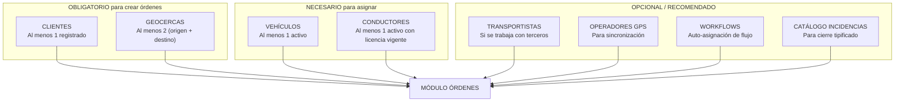

## 14.2 Orden de Setup Recomendado

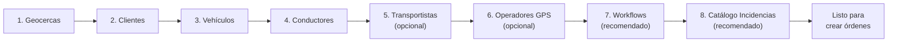

## 14.3 Precondiciones por Operación (Detallado)

> Cada operación se desglosa con: precondición, consulta de verificación, error si no se cumple, y acción correctiva.

### 14.3.1 Crear Orden (`POST /orders`)

| # | Precondición | Verificación Técnica | Si no se cumple (Error) | Acción Correctiva |
|---|---|---|---|---|
| PRE-C01 | **Al menos 1 cliente activo en el sistema** | `SELECT COUNT(*) FROM customers WHERE status = 'active'` → debe ser ≥ 1 | Dropdown de clientes vacío. Paso 1 del Wizard muestra: "No hay clientes registrados. Registra uno primero." | Ir a **Módulo Clientes → Nuevo Cliente**. Completar al menos: nombre, RUC/RFC, dirección. |
| PRE-C02 | **Al menos 2 geocercas registradas** | `SELECT COUNT(*) FROM geofences WHERE isActive = true` → debe ser ≥ 2 | Mapa de hitos no tiene puntos sugeridos. Paso 3 del Wizard: "Registra al menos un origen y un destino en Geocercas." | Ir a **Módulo Geocercas → Nueva Geocerca**. Crear mínimo 1 geocerca de tipo `pickup` y 1 de tipo `delivery`. |
| PRE-C03 | **Usuario autenticado con permiso `orders:create`** | `user.hasPermission('orders:create')` | HTTP 403 `FORBIDDEN`. Botón "Nueva Orden" no visible en el sidebar si el usuario no tiene permiso. | El **usuario maestro** debe otorgar el permiso adecuado en **Configuración → Usuarios → Permisos**. |
| PRE-C04 | **Token JWT vigente** | `token.exp > Date.now()` | HTTP 401 `UNAUTHORIZED`. Redirect automático a `/login`. | Volver a iniciar sesión. |

### 14.3.2 Asignar Recursos (`PATCH /orders/:id/status` → `assigned`)

| # | Precondición | Verificación Técnica | Si no se cumple (Error) | Acción Correctiva |
|---|---|---|---|---|
| PRE-A01 | **Orden en estado `draft` o `pending`** | `order.status ∈ ['draft', 'pending']` | HTTP 422 `INVALID_STATE_TRANSITION`. Botón "Asignar" deshabilitado. | Solo se puede asignar órdenes que aún no han sido asignadas. Si ya está `assigned`, editar la asignación en su lugar. |
| PRE-A02 | **Vehículo seleccionado existe y está activo** | `SELECT * FROM vehicles WHERE id = :vehicleId AND status = 'active'` → debe retornar 1 fila | HTTP 404 `VEHICLE_NOT_FOUND`. | Seleccionar otro vehículo o activar el vehículo en **Módulo Vehículos**. |
| PRE-A03 | **Conductor seleccionado existe, activo, con licencia vigente** | `SELECT * FROM drivers WHERE id = :driverId AND status = 'active' AND licenseExpiry > NOW()` → debe retornar 1 fila | HTTP 404 `DRIVER_NOT_FOUND` (si no existe) o HTTP 422 `PRECONDITION_FAILED` (si licencia vencida). | Seleccionar otro conductor, o actualizar la licencia del conductor en **Módulo Conductores**. |
| PRE-A04 | **No hay conflicto temporal con el vehículo** | `SELECT * FROM orders WHERE vehicleId = :vehicleId AND status NOT IN ('cancelled','closed') AND scheduledStartDate < :endDate AND scheduledEndDate > :startDate` → debe retornar 0 filas | HTTP 409 `VEHICLE_CONFLICT`. Respuesta incluye `conflictingOrders[]` con IDs y fechas. | Elegir otro vehículo, o modificar las fechas de la orden actual/conflictiva para que no se solapen. |
| PRE-A05 | **No hay conflicto temporal con el conductor** | `SELECT * FROM orders WHERE driverId = :driverId AND status NOT IN ('cancelled','closed') AND scheduledStartDate < :endDate AND scheduledEndDate > :startDate` → debe retornar 0 filas | HTTP 409 `DRIVER_CONFLICT`. | Elegir otro conductor o ajustar fechas. |
| PRE-A06 | **Capacidad del vehículo soporta el peso** | `vehicles.maxPayloadKg >= order.cargo.weight` | Warning (no bloquea): "El peso de la carga (25,000 kg) excede la capacidad máxima del vehículo (20,000 kg)." | Seleccionar un vehículo con mayor capacidad o dividir la carga en múltiples viajes. |

### 14.3.3 Iniciar Viaje (`PATCH /orders/:id/status` → `in_transit`)

| # | Precondición | Verificación Técnica | Si no se cumple (Error) | Acción Correctiva |
|---|---|---|---|---|
| PRE-T01 | **Orden en estado `assigned`** | `order.status === 'assigned'` | HTTP 422 `INVALID_STATE_TRANSITION`. | Primero asignar vehículo y conductor (§14.3.2). |
| PRE-T02 | **Vehículo asignado (no null)** | `order.vehicleId !== null` | HTTP 422 `PRECONDITION_FAILED: vehicleId es requerido`. | Asignar vehículo antes de iniciar viaje. |
| PRE-T03 | **Conductor asignado (no null)** | `order.driverId !== null` | HTTP 422 `PRECONDITION_FAILED: driverId es requerido`. | Asignar conductor antes de iniciar viaje. |
| PRE-T04 | **Fecha actual dentro de ventana operativa (±24h)** | `NOW() BETWEEN (scheduledStartDate - 24h) AND (scheduledEndDate + 24h)` | Warning (no bloquea): "El viaje se inicia fuera de la ventana programada." | Confirmar que se desea iniciar fuera de horario, o reprogramar la orden. |

### 14.3.4 Registrar Hito por GPS Automático

| # | Precondición | Verificación Técnica | Si no se cumple (Error) | Acción Correctiva |
|---|---|---|---|---|
| PRE-G01 | **Orden en estado `in_transit` o `at_milestone`** | `order.status ∈ ['in_transit', 'at_milestone']` | Evento GPS ignorado silenciosamente (no se procesa). | Asegurar que la orden fue iniciada. |
| PRE-G02 | **Hito existe y pertenece a la orden** | `SELECT * FROM milestones WHERE id = :milestoneId AND orderId = :orderId` → 1 fila | HTTP 404 `MILESTONE_NOT_FOUND`. | Verificar que el `milestoneId` es correcto y pertenece a la orden. |
| PRE-G03 | **Geocerca del hito está configurada y activa** | `SELECT * FROM geofences WHERE id = :milestone.geofenceId AND isActive = true` → 1 fila | Hito no puede detectarse por GPS. Solo registro manual sería posible. | Activar o crear la geocerca en **Módulo Geocercas**. |
| PRE-G04 | **Dispositivo GPS del vehículo reportando** | `SELECT lastReportAt FROM vehicle_gps WHERE vehicleId = :vehicleId` → `lastReportAt` < 15 min ago | Warning: "Sin señal GPS del vehículo [placa]." | Verificar dispositivo GPS físico. Contactar proveedor GPS. |
| PRE-G05 | **Vehículo dentro del radio de la geocerca** | `distance(vehicleCoords, geofenceCenter) <= geofenceRadius` | No se marca llegada/salida. Hito permanece en estado actual. | El vehículo aún no ha llegado o ya salió. Esperar o registrar manualmente (§14.3.5). |

### 14.3.5 Registrar Hito Manualmente

| # | Precondición | Verificación Técnica | Si no se cumple (Error) | Acción Correctiva |
|---|---|---|---|---|
| PRE-M01 | **Mismas precondiciones PRE-G01 y PRE-G02** | Ver §14.3.4 | Mismos errores. | Mismas acciones. |
| PRE-M02 | **`reason` (motivo) obligatorio** | `body.reason` no vacío, mín 1 char | HTTP 400 `VALIDATION_ERROR`: "Motivo requerido para registro manual." | Seleccionar un motivo del catálogo: `gps_failure`, `no_signal`, `geofence_error`, `manual_override`. |
| PRE-M03 | **`observation` recomendado** | No bloquea si vacío, pero genera flag `isManual: true` en el milestone | Warning: "Se recomienda agregar observaciones." | Agregar observaciones descriptivas para trazabilidad. |
| PRE-M04 | **Usuario con permiso `milestones:manual_entry`** | `user.hasPermission('milestones:manual_entry')` | HTTP 403 `FORBIDDEN`. | Contactar al usuario maestro para que asigne el permiso. |

### 14.3.6 Cerrar Orden (`POST /orders/:id/close`)

| # | Precondición | Verificación Técnica | Si no se cumple (Error) | Acción Correctiva |
|---|---|---|---|---|
| PRE-CL01 | **Orden en estado `completed`** | `order.status === 'completed'` | HTTP 422 `CANNOT_CLOSE_ORDER: reason="status no es completed"`. | Completar primero todos los hitos y la transición a `completed`. |
| PRE-CL02 | **Todos los hitos en estado terminal** | `order.milestones.every(m => m.status ∈ ['completed', 'skipped'])` | HTTP 422 `CANNOT_CLOSE_ORDER`. Respuesta incluye `pendingMilestones[]` con los hitos no completados. | Completar o saltar (`skip`) cada hito pendiente antes de cerrar. |
| PRE-CL03 | **Campo `observations` proporcionado** | `body.observations.length ≥ 1` | HTTP 400 `VALIDATION_ERROR`. | Ingresar observaciones de cierre (mínimo 1 caracter). |
| PRE-CL04 | **`closedBy` y `closedByName` en el body** | Normalmente auto-poblados desde la sesión del usuario | Error de sistema si falta. | Estos campos se toman automáticamente del JWT. Si faltan, hay un bug de sesión. |
| PRE-CL05 | **No haber sido cerrada previamente** | `order.closureData === null` | HTTP 422: "La orden ya fue cerrada." | No se puede cerrar dos veces. Consultar los datos del cierre existente. |

### 14.3.7 Cancelar Orden

| # | Precondición | Verificación Técnica | Si no se cumple (Error) | Acción Correctiva |
|---|---|---|---|---|
| PRE-CA01 | **Orden NO en estado terminal** | `order.status ∉ ['completed', 'closed', 'cancelled']` | HTTP 422 `INVALID_STATE_TRANSITION`. | Órdenes en estado terminal son inmutables. No se puede cancelar algo que ya terminó. |
| PRE-CA02 | **Motivo de cancelación proporcionado** | `body.cancellationReason.length ≥ 1` | HTTP 400 `VALIDATION_ERROR`. | Ingresar motivo de cancelación. |
| PRE-CA03 | **Usuario con permiso `orders:cancel`** | `user.hasPermission('orders:cancel')` | HTTP 403 `FORBIDDEN`. | Solo usuarios con permiso `orders:cancel` pueden cancelar. Los subusuarios sin este permiso deben solicitarlo al usuario maestro. |

### 14.3.8 Eliminar Orden (`DELETE /orders/:id`)

| # | Precondición | Verificación Técnica | Si no se cumple (Error) | Acción Correctiva |
|---|---|---|---|---|
| PRE-D01 | **Orden en estado `draft`** | `order.status === 'draft'` | HTTP 409 `CANNOT_DELETE_NON_DRAFT`. | Solo borradores se eliminan. Para órdenes no-draft, usar cancelación. |
| PRE-D02 | **Usuario con rol `owner` o `usuario_maestro`** | `user.role ∈ ['owner', 'usuario_maestro']` | HTTP 403 `FORBIDDEN`. | Solo owner y usuario maestro pueden eliminar órdenes, incluso borradores. Esto es por auditoría. |

### 14.3.9 Sincronizar con GPS (`POST /orders/:id/sync`)

| # | Precondición | Verificación Técnica | Si no se cumple (Error) | Acción Correctiva |
|---|---|---|---|---|
| PRE-S01 | **Orden existe** | `SELECT * FROM orders WHERE id = :id` → 1 fila | HTTP 404 `ORDER_NOT_FOUND`. | Verificar el ID de la orden. |
| PRE-S02 | **Operador GPS configurado** | `order.gpsOperatorId !== null` (recomendado) o hay un operador GPS default | Si no hay operador, `syncStatus` queda en `"not_synced"`. No es un error bloqueante. | Configurar un operador GPS en **Módulo Configuración → Operadores GPS** y asignarlo a la orden. |
| PRE-S03 | **Operador GPS activo y con credenciales válidas** | `SELECT * FROM operators WHERE id = :gpsOperatorId AND type = 'gps' AND status = 'active'` + verificar `apiKey` no expirado | HTTP 502 `GPS_SYNC_FAILED` o `syncStatus: "error"`. | Verificar credenciales del proveedor GPS. Renovar API key si expiró. |

### 14.3.10 Importar desde Excel (`POST /orders/import`)

| # | Precondición | Verificación Técnica | Si no se cumple (Error) | Acción Correctiva |
|---|---|---|---|---|
| PRE-I01 | **Archivo en formato válido** | Extensión ∈ `['.xlsx', '.xls', '.csv']` AND MIME type ∈ `['application/vnd.openxmlformats-officedocument.spreadsheetml.sheet', 'application/vnd.ms-excel', 'text/csv']` | HTTP 422 `INVALID_FILE_FORMAT`. | Convertir el archivo al formato correcto. Descargar la plantilla de ejemplo desde "Descargar Plantilla". |
| PRE-I02 | **Archivo ≤ 10 MB** | `file.size <= 10 * 1024 * 1024` | HTTP 413 `PAYLOAD_TOO_LARGE`. | Dividir el archivo en partes más pequeñas. |
| PRE-I03 | **Máximo 1000 filas por archivo** | `rows.length <= 1000` | HTTP 422: "Máximo 1000 filas por importación." | Dividir en múltiples archivos de ≤ 1000 filas cada uno. |
| PRE-I04 | **Todos los `customerId` referenciados existen** | Batch lookup: `SELECT id FROM customers WHERE id IN (:customerIds)` | Filas con clientes inexistentes marcadas como `"invalid"`. | Registrar los clientes faltantes, o corregir los IDs en el archivo. |
| PRE-I05 | **Todas las geocercas referenciadas existen** | Batch lookup: `SELECT id FROM geofences WHERE id IN (:geofenceIds)` | Filas afectadas marcadas como `"invalid"`. | Registrar las geocercas faltantes en **Módulo Geocercas**. |
| PRE-I06 | **Usuario con permiso `orders:import`** | `user.hasPermission('orders:import')` | HTTP 403 `FORBIDDEN`. | Solo usuarios con permiso `orders:import` pueden importar órdenes masivamente. |

---

# 15. Diagramas de Secuencia

## 15.1 Creación de Orden

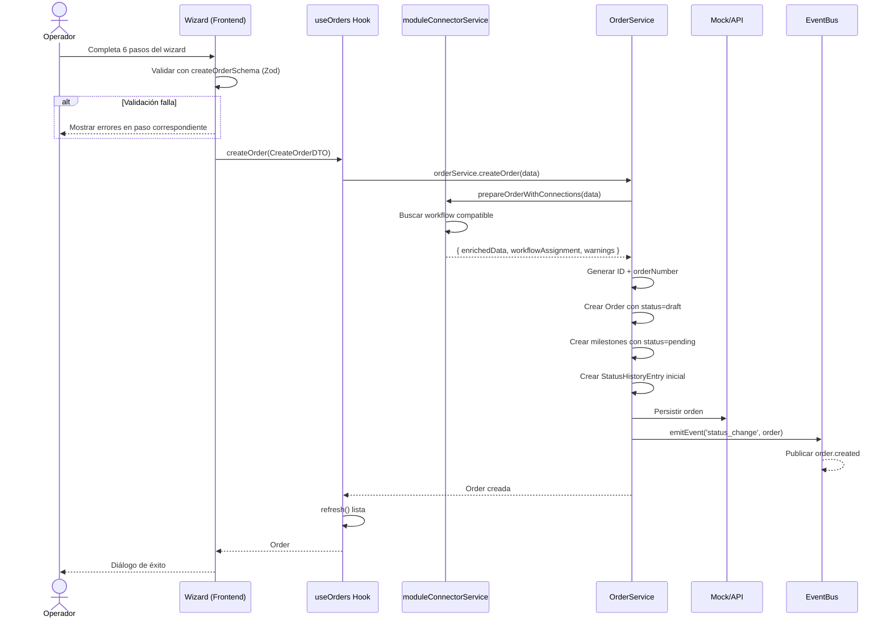

## 15.2 Transición de Estado (Genérico)

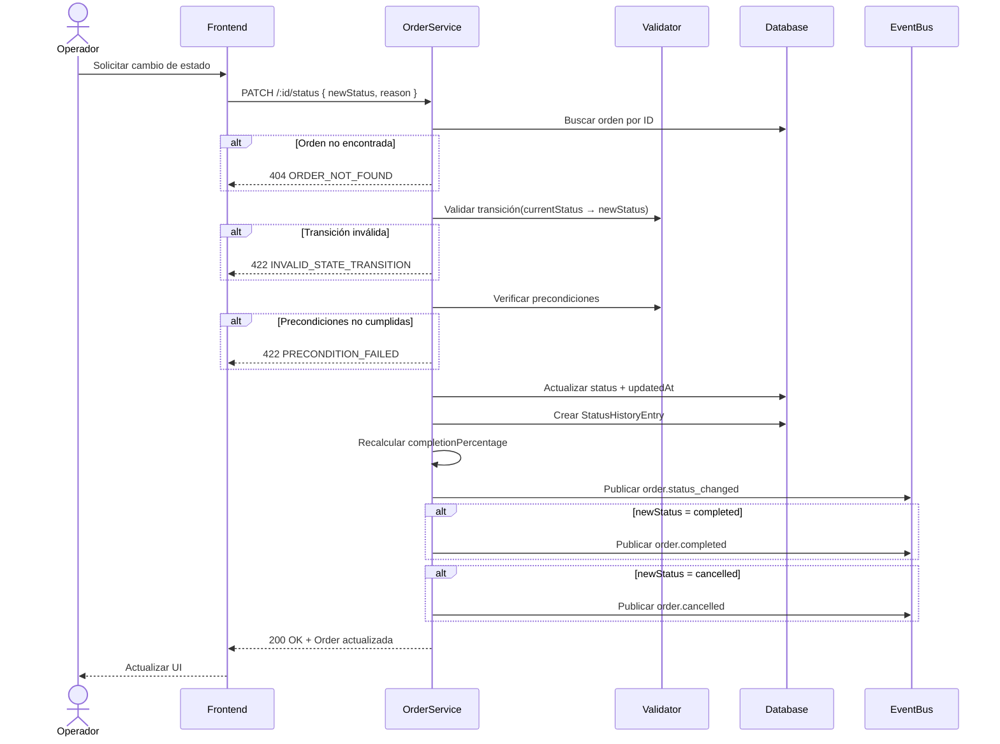

## 15.3 Actualización de Hito (Milestone)

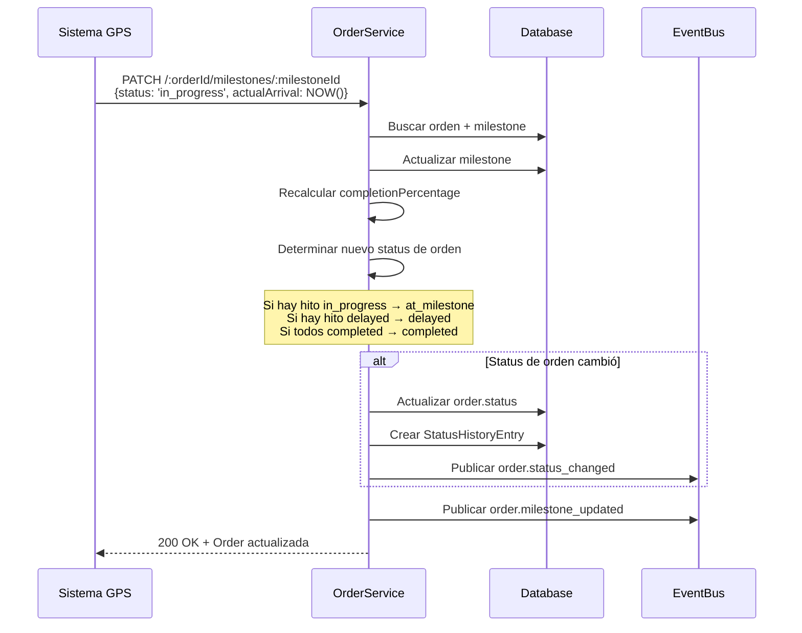

## 15.4 Cierre de Orden

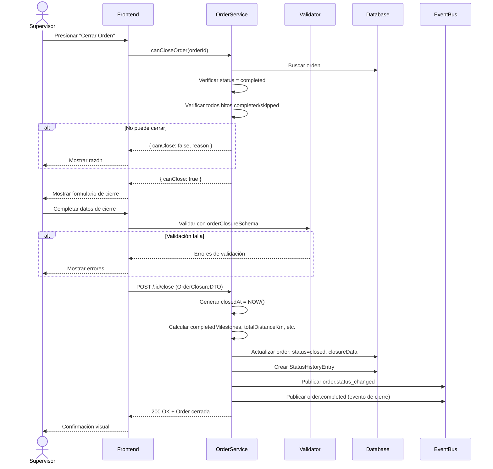

---

## 15.5 Diagrama de Colaboración — Creación de Orden

> **Diagrama de Colaboración UML** (también llamado Diagrama de Comunicación en UML 2.x). Complementa los diagramas de secuencia mostrando la **estructura de objetos que cooperan** y los **mensajes numerados** entre ellos, en lugar del enfoque temporal del diagrama de secuencia. Se modela para el flujo más complejo: **CU-01 Crear Orden de Transporte**.

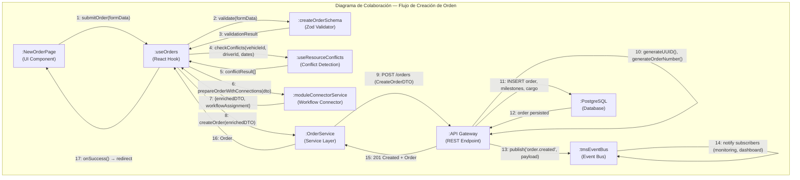

### 15.5.1 Tabla de Mensajes del Diagrama de Colaboración

| # | Mensaje | Objeto Emisor | Objeto Receptor | Tipo | Descripción |
|---|---|---|---|---|---|
| 1 | `submitOrder(formData)` | `:NewOrderPage` | `:useOrders` | Síncrono | El usuario completa el wizard y presiona "Crear Orden". |
| 2 | `validate(formData)` | `:useOrders` | `:createOrderSchema` | Síncrono | Validación completa con Zod (71+ reglas). |
| 3 | `validationResult` | `:createOrderSchema` | `:useOrders` | Retorno | Resultado: `success: true` o `errors[]`. |
| 4 | `checkConflicts(...)` | `:useOrders` | `:useResourceConflicts` | Síncrono | Verifica superposición de horarios si hay vehículo/conductor asignado. |
| 5 | `conflictResult[]` | `:useResourceConflicts` | `:useOrders` | Retorno | Array vacío (sin conflictos) o con detalle de superposiciones. |
| 6 | `prepareOrderWithConnections(dto)` | `:useOrders` | `:moduleConnectorService` | Síncrono | Busca workflow compatible por `serviceType` + `cargo.type`. |
| 7 | `{enrichedDTO, workflowAssignment}` | `:moduleConnectorService` | `:useOrders` | Retorno | DTO enriquecido con `workflowId` inyectado. |
| 8 | `createOrder(enrichedDTO)` | `:useOrders` | `:OrderService` | Síncrono | Delega la creación al servicio de órdenes. |
| 9 | `POST /orders` | `:OrderService` | `:API Gateway` | HTTP POST | Request REST con `CreateOrderDTO` en body. |
| 10 | (interno) | `:API Gateway` | `:API Gateway` | Interno | Genera UUID v4 para `id` y `orderNumber` con formato `ORD-{YYYY}-{SEQ}`. |
| 11 | `INSERT` | `:API Gateway` | `:PostgreSQL` | SQL | Persiste `order`, `milestones[]`, `cargo`, `statusHistory[0]`. |
| 12 | (ack) | `:PostgreSQL` | `:API Gateway` | Retorno | Confirmación de persistencia exitosa. |
| 13 | `publish('order.created')` | `:API Gateway` | `:tmsEventBus` | Asíncrono | Publica evento de dominio para notificar a otros módulos. |
| 14 | (broadcast) | `:tmsEventBus` | suscriptores | Asíncrono | Los módulos de Monitoreo, Dashboard y Notificaciones reciben el evento. |
| 15 | `201 Created + Order` | `:API Gateway` | `:OrderService` | HTTP Response | Respuesta exitosa con la orden completa serializada. |
| 16 | `Order` | `:OrderService` | `:useOrders` | Retorno | El hook recibe la orden creada. |
| 17 | `onSuccess()` | `:useOrders` | `:NewOrderPage` | Callback | Renderiza diálogo de éxito con opciones: Ver orden / Crear otra / Ir a lista. |

### 15.5.2 Objetos Participantes y Responsabilidades

| Objeto | Estereotipo | Responsabilidad Principal |
|---|---|---|
| `:NewOrderPage` | `<<boundary>>` | Interfaz gráfica del wizard de 6 pasos. Captura datos del usuario. |
| `:useOrders` | `<<control>>` | Coordinador del flujo de creación. Orquesta validación, conflictos y servicio. |
| `:createOrderSchema` | `<<utility>>` | Validación de datos con 71+ reglas Zod. |
| `:useResourceConflicts` | `<<control>>` | Detección de conflictos de horario entre recursos. |
| `:moduleConnectorService` | `<<control>>` | Asignación automática de workflows por tipo de servicio/carga. |
| `:OrderService` | `<<service>>` | Abstracción de la comunicación con el backend. |
| `:API Gateway` | `<<service>>` | Endpoint REST que ejecuta la lógica de negocio del backend. |
| `:PostgreSQL` | `<<entity>>` | Persistencia relacional de la orden y sub-entidades. |
| `:tmsEventBus` | `<<infrastructure>>` | Canal de eventos asíncronos para comunicación cross-module. |

---

# 16. Diagramas de Actividad

## 16.1 Ciclo de Vida Completo de una Orden

```mermaid
graph TD
    START(("Inicio")) --> CREATE["Crear orden<br/>POST /orders"]
    CREATE --> DRAFT["draft"]
    
    DRAFT --> DEC1{¿Confirmar?}
    DEC1 -->|Sí| PENDING["pending"]
    DEC1 -->|Cancelar| CANCEL_D["cancelled"]
    DRAFT -->|DELETE| DELETE["Eliminada"]
    
    PENDING --> DEC2{¿Asignar recursos?}
    DEC2 -->|Sí + sin conflictos| ASSIGNED["assigned"]
    DEC2 -->|Cancelar| CANCEL_P["cancelled"]
    DEC2 -->|Conflicto detectado| CONFLICT["Resolver conflicto"]
    CONFLICT --> DEC2
    
    ASSIGNED --> DEC3{¿Iniciar viaje?}
    DEC3 -->|Sí| TRANSIT["in_transit"]
    DEC3 -->|Cancelar| CANCEL_A["cancelled"]
    
    TRANSIT --> DEC4{¿Evento GPS?}
    DEC4 -->|Entrada geocerca| MILESTONE["at_milestone"]
    DEC4 -->|Retraso detectado| DELAYED["delayed"]
    DEC4 -->|Todos completados| COMPLETED["completed"]
    DEC4 -->|Cancelar emergencia| CANCEL_T["cancelled"]
    
    MILESTONE --> DEC5{¿Salida geocerca?}
    DEC5 -->|Sí, más hitos| TRANSIT
    DEC5 -->|Sí, último hito| COMPLETED
    DEC5 -->|Excede tiempo| DELAYED
    
    DELAYED --> DEC6{¿Se resuelve?}
    DEC6 -->|Continúa viaje| TRANSIT
    DEC6 -->|Llega a hito| MILESTONE
    DEC6 -->|Hitos completados| COMPLETED
    DEC6 -->|Cancelar| CANCEL_DEL["cancelled"]
    
    COMPLETED --> DEC7{¿Cerrar administrativamente?}
    DEC7 -->|Sí + datos cierre| CLOSED["closed"]
    
    CLOSED --> END1(("Fin"))
    CANCEL_D --> END2(("Fin"))
    CANCEL_P --> END3(("Fin"))
    CANCEL_A --> END4(("Fin"))
    CANCEL_T --> END5(("Fin"))
    CANCEL_DEL --> END6(("Fin"))
    DELETE --> END7(("Fin"))
```

## 16.2 Flujo del Wizard de Creación

```mermaid
graph TD
    S(("Inicio")) --> P1["Paso 1: Cliente<br/>Seleccionar cliente<br/>Tipo de servicio<br/>Prioridad"]
    P1 --> V1{¿Válido?}
    V1 -->|No: customerId vacío| P1
    V1 -->|Sí| P2["Paso 2: Carga<br/>Tipo · Descripción<br/>Peso · Volumen · Cantidad<br/>Valor · Instrucciones"]
    P2 --> V2{¿Válido?}
    V2 -->|No: peso inválido| P2
    V2 -->|Sí| P3["Paso 3: Ruta<br/>Agregar hitos (mín 2)<br/>Geocercas · Coordenadas<br/>ETA · Contacto"]
    P3 --> V3{¿Válido?}
    V3 -->|No: menos de 2 hitos| P3
    V3 -->|Sí| P4["Paso 4: Recursos<br/>Transportista (opcional)<br/>Vehículo (opcional)<br/>Conductor (opcional)<br/>Operador GPS (opcional)"]
    P4 --> CC{¿Conflictos?}
    CC -->|Sí| WARN["Mostrar conflictos<br/>con sugerencias"]
    WARN --> P4
    CC -->|No| P5["Paso 5: Workflow<br/>Seleccionar workflow<br/>o auto-asignación"]
    P5 --> P6["Paso 6: Resumen<br/>Revisar todos los datos"]
    P6 --> CONFIRM{¿Confirmar?}
    CONFIRM -->|Cancelar| CANCEL["Volver a lista"]
    CONFIRM -->|Sí| SUBMIT["Enviar CreateOrderDTO"]
    SUBMIT --> RESULT{¿Éxito?}
    RESULT -->|Error| P6
    RESULT -->|Sí| SUCCESS["Orden creada"]
```

---

# 17. Eventos de Dominio

## 17.1 Formato Estándar

```typescript
interface DomainEvent {
  eventId: string; // UUID único del evento
  eventType: string; // Nombre del evento
  timestamp: string; // ISO 8601
  source: string; // Módulo que emitió el evento
  payload: object; // Datos específicos del evento
}
```

## 17.2 Catálogo de Eventos

| Evento | Payload | Publicado cuando |
|---|---|---|
| `order.created` | `orderId, orderNumber, customerId, serviceType, priority, createdBy` | Se registra una nueva orden |
| `order.status_changed` | `orderId, orderNumber, oldStatus, newStatus, changedBy, reason` | Se ejecuta cualquier transición de estado |
| `order.assigned` | `orderId, orderNumber, vehicleId, vehiclePlate, driverId, driverName` | Se asignan vehículo y conductor |
| `order.milestone_updated` | `orderId, milestoneId, milestoneName, milestoneStatus, actualArrival, actualDeparture` | Cambia el estado de un hito |
| `order.sync_updated` | `orderId, syncStatus, gpsOperatorId, errorMessage` | Cambia el estado de sincronización GPS |
| `order.completed` | `orderId, orderNumber, closureData, totalDistanceKm, totalDurationMinutes` | La orden alcanza `completed` |
| `order.cancelled` | `orderId, orderNumber, reason, cancelledBy, previousStatus` | La orden es cancelada |
| `order.closed` | `orderId, orderNumber, closedBy, closedAt, customerRating` | La orden alcanza `closed` (cierre administrativo) |
| `order.location_update` | `orderId, vehicleId, position: {lat, lng}, speed, heading, timestamp` | Se recibe actualización de posición GPS |

## 17.3 Diagrama de Propagación de Eventos

```mermaid
graph LR
    subgraph "Módulo Órdenes"
        OS[OrderService]
    end
    
    OS -->|order.created| EB["Event Bus"]
    OS -->|order.status_changed| EB
    OS -->|order.assigned| EB
    OS -->|order.milestone_updated| EB
    OS -->|order.completed| EB
    OS -->|order.cancelled| EB
    OS -->|order.closed| EB
    OS -->|order.sync_updated| EB
    OS -->|order.location_update| EB
    
    EB -->|status_changed| MON["Monitoreo"]
    EB -->|assigned| SCHED["Programación"]
    EB -->|completed / closed| FIN["Finanzas"]
    EB -->|milestone_updated| NOTIF["Notificaciones"]
    EB -->|all events| AUDIT["Auditoría"]
    EB -->|completed| REP["Reportes"]
```

## 17.4 Eventos en Tiempo Real (WebSocket)

```typescript
interface OrderRealtimeEvent {
  type: 'status_change' | 'milestone_update' | 'location_update' | 'sync_update';
  orderId: string;
  payload: {
    previous?: Partial<Order>;
    current: Partial<Order>;
  };
  timestamp: string;
}
```

### Suscripción desde Frontend

```typescript
// Por orden específica
orderService.subscribe('ord-00001', (event) => { ... });

// Todas las órdenes
orderService.subscribe('*', (event) => { ... });

// Hook dedicado
useOrderRealtime('ord-00001', onEvent);

// Hook con auto-update
useOrder('ord-00001', { realtimeUpdates: true });
```

---

# 18. Integraciones Cross-Module

## 18.1 Mapa de Dependencias

```mermaid
graph TB
    subgraph "Módulo Maestro (provee datos)"
        CUST["Clientes"]
        GEO["Geocercas"]
        VEH["Vehículos"]
        DRV["Conductores"]
        OPR["Operadores"]
    end
    
    subgraph "Módulo Órdenes (consumidor)"
        ORD["OrderService"]
        IMPORT["ImportService"]
        EXPORT["ExportService"]
    end
    
    subgraph "Módulo Workflows"
        WF["WorkflowService"]
        CONN["ModuleConnector"]
    end
    
    subgraph "Módulo Route Planner"
        RP["RoutePlannerService"]
        MAP["OrderToTransportMapper"]
    end
    
    subgraph "Módulos Consumidores"
        MON["Monitoreo"]
        SCHED["Programación"]
        FIN["Finanzas"]
        REP["Reportes"]
    end
    
    CUST -->|customerId| ORD
    GEO -->|geofenceId| ORD
    VEH -->|vehicleId| ORD
    DRV -->|driverId| ORD
    OPR -->|carrierId, gpsOperatorId| ORD
    
    ORD -->|CreateOrderDTO| CONN
    CONN -->|auto-assign| WF
    CONN -->|enrichedData| ORD
    
    ORD -->|Order[]| MAP
    MAP -->|TransportOrder[]| RP
    
    ORD -->|eventos| MON
    ORD -->|eventos| SCHED
    ORD -->|eventos| FIN
    ORD -->|datos| REP
```

## 18.2 Workflow Auto-Assignment

Al crear una orden, `moduleConnectorService.prepareOrderWithConnections(data)` realiza:

1. Busca workflows activos compatibles con `serviceType` y `cargo.type`
2. Si encuentra match, asigna `workflowId` + `workflowName`
3. Retorna advertencias si hay problemas de compatibilidad

```typescript
// Input
CreateOrderDTO

// Output
{
  enrichedData: CreateOrderDTO, // Con workflowId inyectado
  workflowAssignment: {
    success: boolean;
    workflowId?: string;
    workflowName?: string;
    reason: string; // "Auto-asignado por tipo de servicio"
  },
  validationWarnings: string[] // No bloquean creación
}
```

## 18.3 Route Planner Bridge

El hook `useRoutePlannerOrders` convierte órdenes en estados planificables (`draft`, `pending`, `assigned`) al formato `TransportOrder` del Route Planner.

```mermaid
graph LR
    A["Order[]<br/>(draft, pending, assigned)"] -->|ordersToTransportOrders| B["TransportOrder[]"]
    B --> C["Route Planner<br/>Optimización"]
    C -->|resultado| D["Órdenes generadas<br/>localStorage"]
```

## 18.4 Diagrama de Componentes UML

> **Diagrama de Componentes** — Muestra la estructura interna del Módulo de Órdenes descompuesto en componentes de software, con sus interfaces provistas (lollipop ○) y requeridas (socket ◠), y las dependencias entre ellos.

```mermaid
graph TB
    subgraph "«subsystem» Módulo de Órdenes"
        subgraph "Capa de Presentación (Frontend - Next.js 15)"
            UI_LIST["OrderListPage<br/>Lista + Filtros + KPIs"]
            UI_NEW["NewOrderPage<br/>Wizard 6 pasos"]
            UI_DETAIL["OrderDetailPage<br/>Detalle + Timeline"]
            UI_IMPORT["ImportDrawer<br/>Importación masiva"]
            UI_MAP["OrderMapSection<br/>Mapa Leaflet"]
        end

        subgraph "Capa de Lógica (React Hooks)"
            H_ORDERS["useOrders<br/>CRUD + listado"]
            H_IMPORT["useOrderImportExport<br/>Import/Export Excel"]
            H_MONITORING["useMonitoring<br/>Tracking en tiempo real"]
            H_CONFLICTS["useResourceConflicts<br/>Detección de conflictos"]
            H_SCHEDULING["useScheduling<br/>Programación"]
        end

        subgraph "Capa de Servicios"
            SVC_ORDER["OrderService<br/>Gestión de órdenes"]
            SVC_GPS["GPSSyncService<br/>Sincronización GPS"]
            SVC_IMPORT["ImportService<br/>Parseo Excel/CSV"]
            SVC_EXPORT["ExportService<br/>Generación Excel/PDF"]
            SVC_CONNECTOR["ModuleConnectorService<br/>Bridge cross-module"]
        end

        subgraph "Capa de Validación"
            VAL_CREATE["createOrderSchema<br/>(Zod)"]
            VAL_UPDATE["updateOrderSchema<br/>(Zod)"]
            VAL_CLOSE["closureSchema<br/>(Zod)"]
            VAL_IMPORT["importRowSchema<br/>(Zod)"]
        end

        subgraph "Infraestructura"
            EVT["tmsEventBus<br/>Event Bus"]
            STORE["State Management<br/>(React Context + SWR)"]
        end
    end

    %% Dependencias internas
    UI_LIST --> H_ORDERS
    UI_NEW --> H_ORDERS
    UI_NEW --> H_CONFLICTS
    UI_DETAIL --> H_ORDERS
    UI_DETAIL --> H_MONITORING
    UI_IMPORT --> H_IMPORT
    UI_MAP --> H_MONITORING

    H_ORDERS --> SVC_ORDER
    H_ORDERS --> VAL_CREATE
    H_ORDERS --> VAL_UPDATE
    H_IMPORT --> SVC_IMPORT
    H_IMPORT --> SVC_EXPORT
    H_MONITORING --> SVC_GPS
    H_CONFLICTS --> SVC_ORDER

    SVC_ORDER --> EVT
    SVC_ORDER --> SVC_CONNECTOR
    SVC_GPS --> EVT
    SVC_IMPORT --> VAL_IMPORT

    H_ORDERS --> STORE
    H_MONITORING --> STORE
```

### 18.4.1 Catálogo de Componentes

| Componente | Estereotipo | Interfaces Provistas | Interfaces Requeridas | Responsabilidad |
|---|---|---|---|---|
| `OrderListPage` | `<<UI Component>>` | Vista de lista paginada con filtros | `useOrders`, `useScheduling` | Renderizar tabla de órdenes con búsqueda, filtrado, ordenamiento y KPIs de resumen |
| `NewOrderPage` | `<<UI Component>>` | Wizard de creación en 6 pasos | `useOrders`, `useResourceConflicts` | Capturar datos del usuario paso a paso con validación en tiempo real |
| `OrderDetailPage` | `<<UI Component>>` | Vista de detalle completa | `useOrders`, `useMonitoring` | Mostrar datos, timeline, mapa, workflow y acciones de la orden |
| `OrderService` | `<<Service>>` | `IOrderService`: CRUD, transition, close, cancel, delete | `API Gateway`, `tmsEventBus` | Abstracción de comunicación con el backend REST API |
| `GPSSyncService` | `<<Service>>` | `IGPSSync`: send, bulkSend, retryFailed | `GPS Provider API`, `tmsEventBus` | Sincronización de órdenes con proveedores GPS externos (Wialon, Navitel Fleet) |
| `ImportService` | `<<Service>>` | `IImport`: parseFile, validateRows, executeImport | `OrderService`, `importRowSchema` | Parseo de archivos Excel/CSV, validación por fila, creación masiva |
| `ExportService` | `<<Service>>` | `IExport`: toExcel, toPDF, toCSV | `OrderService` | Generación de archivos de exportación con formato empresarial |
| `ModuleConnectorService` | `<<Service>>` | `IConnector`: prepareWithConnections, getWorkflow | APIs de módulos Maestro, Workflows | Bridge que orquesta la comunicación con otros módulos del TMS |
| `tmsEventBus` | `<<Infrastructure>>` | `IEventBus`: publish, subscribe, unsubscribe | — | Canal de eventos asíncronos para comunicación desacoplada entre módulos |
| `createOrderSchema` | `<<Utility>>` | Validación Zod de 71+ reglas | — | Schema de validación para creación de órdenes |

## 18.5 Diagrama de Despliegue UML

> **Diagrama de Despliegue** — Muestra la distribución física del sistema en nodos de hardware/infraestructura, los artefactos desplegados en cada nodo, y los protocolos de comunicación entre ellos.

```mermaid
graph TB
    subgraph "Nodo: Cloud Server — Vercel / AWS"
        subgraph "«device» Servidor Frontend"
            NEXT["Next.js 15 App Router<br/>Server Components + Client Components<br/>Puerto: 3000"]
            STATIC["Static Assets<br/>/public, /images, CSS bundles"]
        end
    end

    subgraph "Nodo: API Backend Server"
        subgraph "«execution environment» Node.js Runtime"
            API["API REST Backend<br/>Express / Fastify<br/>Puerto: 8080"]
            WORKER["Background Worker<br/>Cola de reintentos GPS<br/>Cron: cada 5 min"]
        end
    end

    subgraph "Nodo: Database Server"
        subgraph "«execution environment» PostgreSQL 16"
            DB["Base de Datos Principal<br/>Esquema: tms_orders<br/>Puerto: 5432"]
            POSTGIS["PostGIS Extension<br/>Datos geoespaciales<br/>Coordenadas, geocercas"]
        end
    end

    subgraph "Nodo: Almacenamiento de Archivos"
        S3["AWS S3 / MinIO<br/>Bucket: tms-attachments<br/>Fotos, firmas, documentos"]
    end

    subgraph "Nodo: Proveedores GPS Externos"
        WIALON["Wialon API<br/>api.wialon.com<br/>Tracking vehicular"]
        NAVITEL["Navitel Fleet API<br/>fleet.navitel.com<br/>Tracking vehicular"]
    end

    subgraph "Nodo: Cliente"
        BROWSER["Navegador Web<br/>Chrome / Firefox / Edge<br/>Desktop / Tablet"]
    end

    %% Conexiones con protocolos
    BROWSER -->|"HTTPS/TLS 1.3<br/>Puerto 443"| NEXT
    NEXT -->|"HTTP REST<br/>JSON (application/json)"| API
    API -->|"TCP/IP<br/>SQL Queries"| DB
    API -->|"HTTPS REST API<br/>Bearer Token"| WIALON
    API -->|"HTTPS REST API<br/>API Key"| NAVITEL
    API -->|"HTTPS<br/>Multipart Upload"| S3
    NEXT -->|"HTTPS<br/>Signed URLs"| S3
    WORKER -->|"TCP/IP<br/>SQL"| DB
    WORKER -->|"HTTPS"| WIALON
    WORKER -->|"HTTPS"| NAVITEL
```

### 18.5.1 Especificación de Nodos

| Nodo | Tipo | Artefactos Desplegados | SO / Runtime | Recursos Mínimos |
|---|---|---|---|---|
| Servidor Frontend | `<<cloud>>` | Next.js 15 App, Static Assets, ISR Cache | Node.js 20 LTS | 2 vCPU, 4 GB RAM |
| API Backend | `<<cloud>>` | REST API, Background Worker, Event Bus | Node.js 20 LTS | 4 vCPU, 8 GB RAM |
| Database Server | `<<device>>` | PostgreSQL 16, PostGIS 3.4 | Linux (Ubuntu 22.04) | 4 vCPU, 16 GB RAM, SSD 500 GB |
| Storage | `<<cloud>>` | AWS S3 bucket, archivos adjuntos | AWS S3 API | Ilimitado (pay-per-use) |
| GPS Wialon | `<<external>>` | Wialon API endpoints | — | Proveedor externo SaaS |
| GPS Navitel | `<<external>>` | Navitel Fleet API endpoints | — | Proveedor externo SaaS |
| Cliente | `<<device>>` | Navegador web moderno | Windows/Mac/Linux | Resolución ≥ 1280×720 |

### 18.5.2 Protocolos de Comunicación

| Conexión | Protocolo | Puerto | Autenticación | Formato | Cifrado |
|---|---|---|---|---|---|
| Browser → Frontend | HTTPS | 443 | Cookie / JWT | HTML + JSON | TLS 1.3 |
| Frontend → Backend API | HTTP REST | 8080 | Bearer Token (JWT) | JSON (`application/json`) | TLS 1.2+ |
| Backend API → PostgreSQL | TCP/IP | 5432 | Username/Password + SSL | SQL | SSL |
| Backend API → Wialon | HTTPS | 443 | Bearer Token | JSON | TLS 1.2 |
| Backend API → Navitel Fleet | HTTPS | 443 | API Key (header) | JSON | TLS 1.2 |
| Backend API → S3 | HTTPS | 443 | AWS Signature v4 | Binary / Multipart | TLS 1.2 |
| Frontend → S3 (download) | HTTPS | 443 | Signed URL (temporal) | Binary | TLS 1.2 |

---

# 19. Importación y Exportación Masiva

## 19.1 Flujo de Importación

```mermaid
graph TD
    A["Seleccionar archivo<br/>.xlsx · .xls · .csv"] --> B{¿Extensión válida?}
    B -->|No| C["Error: formato no válido"]
    B -->|Sí| D["Parsear archivo"]
    D --> E["Validar cada fila vs createOrderSchema"]
    E --> F["Generar preview"]
    F --> G["Mostrar tabla:<br/> válidas · warnings · errores"]
    G --> H{¿Usuario confirma?}
    H -->|No| I["Cancelar"]
    H -->|Sí| J["Crear órdenes válidas"]
    J --> K["Para cada fila válida:<br/>orderService.createOrder()"]
    K --> L["Resultado final:<br/>total, válidas, errores, warnings"]
```

## 19.2 Flujo de Exportación

```mermaid
graph TD
    A["Aplicar filtros en lista"] --> B["Presionar 'Exportar'"]
    B --> C["Seleccionar columnas"]
    C --> D["Opciones:<br/> Incluir hitos<br/> Incluir historial<br/> Incluir cierre"]
    D --> E["Configurar formato fecha + timezone"]
    E --> F["Generar Excel"]
    F --> G["Descargar archivo"]
```

---

# 20. Detección de Conflictos de Recursos

## 20.1 Algoritmo

```mermaid
graph TD
    A["Seleccionar vehículo/conductor + fechas"] --> B["Obtener órdenes activas<br/>(pending, assigned, in_transit)"]
    B --> C["Excluir orden actual (si edición)"]
    C --> D{¿Vehículo seleccionado?}
    D -->|Sí| E["Buscar órdenes con mismo vehicleId<br/>cuyos rangos de fecha se superponen"]
    E --> F{¿Hay superposición?}
    F -->|Sí| G["Conflicto de vehículo (error)"]
    D -->|No| H{¿Conductor seleccionado?}
    F -->|No| H
    G --> H
    H -->|Sí| I["Buscar órdenes con mismo driverId<br/>cuyos rangos de fecha se superponen"]
    I --> J{¿Hay superposición?}
    J -->|Sí| K["Conflicto de conductor (error)"]
    J -->|No| L["Sin conflictos"]
    H -->|No| L
    K --> L
```

## 20.2 Superposición de Fechas

```
Rango A: |-------- startA -------- endA --------|
Rango B: |---- startB ---- endB ----|

Superposición: startA < endB AND startB < endA
```

## 20.3 Estructura del Conflicto

```typescript
interface ResourceConflict {
  id: string;
  type: 'vehicle' | 'driver' | 'overlap';
  severity: 'warning' | 'error';
  message: string;
  details: {
    resourceId: string;
    resourceName: string;
    conflictingOrderId: string;
    conflictingOrderNumber: string;
    conflictStartDate: string;
    conflictEndDate: string;
  };
  suggestions: string[];
}
```

---

# 21. Catálogo de Incidencias

## 21.1 Categorías

```mermaid
graph TB
    CAT["Catálogo de Incidencias"]
    CAT --> V["VEH-XXX<br/>Vehículo"]
    CAT --> C["CRG-XXX<br/>Carga"]
    CAT --> D["DRV-XXX<br/>Conductor"]
    CAT --> R["RTE-XXX<br/>Ruta"]
    CAT --> S["SEC-XXX<br/>Seguridad"]
    CAT --> CL["CLI-XXX<br/>Cliente"]
    CAT --> DC["DOC-XXX<br/>Documentación"]
    CAT --> W["WTH-XXX<br/>Clima"]
    
    V --> V1["VEH-001 Falla mecánica"]
    V --> V2["VEH-002 Pinchazo"]
    V --> V3["VEH-003 Accidente"]
    C --> C1["CRG-001 Daño a carga"]
    C --> C2["CRG-002 Derrame"]
    D --> D1["DRV-001 Malestar"]
    R --> R1["RTE-001 Vía bloqueada"]
    S --> S1["SEC-001 Asalto"]
```

## 21.2 Severidades

| Severidad | Nivel | ¿Acción inmediata? | Auto-notifica |
|---|---|---|---|
| `low` | Informativo | No | No |
| `medium` | Impacto menor | Según contexto | Operador |
| `high` | Impacto significativo | Sí | Supervisor + Operador |
| `critical` | Emergencia | Sí — inmediata | Supervisor + Mantenimiento + Gerencia |

## 21.3 Campos de cada incidencia del catálogo

| Campo | Descripción |
|---|---|
| `requiresEvidence` | Si necesita foto/documento/video |
| `minEvidenceCount` | Cantidad mínima de evidencias |
| `acceptedEvidenceTypes` | `photo` · `document` · `video` |
| `suggestedActions` | Lista de acciones sugeridas |
| `descriptionTemplate` | Plantilla con variables |
| `additionalFields` | Campos custom tipificados |
| `autoNotifyRoles` | Roles notificados automáticamente |
| `affectsCompliance` | Si afecta indicadores de cumplimiento |

---

# 22. Estructura de Archivos

```
src/
├── types/
│ └── order.ts # Interfaces y tipos (652 líneas)
│
├── lib/validators/
│ └── order-validators.ts # Schemas Zod + helpers (321 líneas)
│
├── services/orders/
│ ├── OrderService.ts # Servicio principal (1014 líneas)
│ ├── OrderImportService.ts # Importación masiva
│ ├── OrderExportService.ts # Exportación
│ └── index.ts # Re-exports
│
├── mocks/orders/
│ ├── orders.mock.ts # 50 órdenes mock (625 líneas)
│ ├── incidents.mock.ts # Catálogo incidencias (831 líneas)
│ ├── workflows.mock.ts # Workflows (1087 líneas)
│ └── index.ts
│
├── hooks/
│ ├── useOrders.ts # useOrders · useOrder · useOrderFilters · useOrderRealtime (645 líneas)
│ ├── useOrderImportExport.ts # useOrderImport · useOrderExport · useBulkActions (513 líneas)
│ ├── useDriverOrderHistory.ts # Historial por conductor (206 líneas)
│ ├── useRoutePlannerOrders.ts # Bridge → Route Planner (122 líneas)
│ └── orders/
│ ├── use-resource-conflicts.ts # Detección de conflictos (300 líneas)
│ └── index.ts
│
├── components/orders/
│ ├── order-form-wizard.tsx # Wizard 6 pasos (1181 líneas)
│ ├── order-form.tsx # Formulario base
│ ├── order-list.tsx # Lista con selección
│ ├── order-table.tsx # Tabla
│ ├── order-card.tsx # Card grid
│ ├── order-filters.tsx # Panel filtros
│ ├── order-stats.tsx # KPI cards
│ ├── order-timeline.tsx # Timeline estados
│ ├── order-summary.tsx # Resumen pre-envío
│ ├── order-bulk-actions.tsx # Acciones masivas
│ ├── order-print-report.tsx # PDF
│ ├── order-number-field.tsx # Campo orderNumber
│ ├── milestone-editor.tsx # Editor hitos
│ ├── milestone-manual-entry-modal.tsx # Modal entrada manual
│ ├── carrier-selector.tsx # Selector transportista
│ ├── gps-operator-selector.tsx # Selector GPS
│ ├── customer-contact-card.tsx # Card contacto
│ ├── conflict-warning.tsx # Alertas conflictos
│ ├── workflow-selector.tsx # Selector workflow
│ ├── workflow-steps-preview.tsx # Preview workflow
│ ├── wizard-navigation.tsx # Nav wizard
│ ├── route-preview-map.tsx # Mapa Leaflet
│ ├── animated-kpi-icons.tsx # Iconos animados
│ └── index.ts
│
├── app/(dashboard)/orders/
│ ├── page.tsx # Lista principal (334 líneas)
│ ├── loading.tsx
│ ├── new/
│ │ ├── page.tsx # Wizard (160 líneas)
│ │ └── loading.tsx
│ ├── import/
│ │ ├── page.tsx # Importación masiva
│ │ └── loading.tsx
│ └── [id]/
│ ├── page.tsx # Detalle (762 líneas)
│ ├── loading.tsx
│ └── edit/
│ ├── page.tsx
│ └── loading.tsx
│
├── services/integration/
│ ├── module-connector.service.ts # Auto-asignación workflows
│ └── event-bus.service.ts # Event bus cross-module
│
└── config/
    └── api.config.ts # Endpoints: /operations/orders
```

---

# 23. Glosario

| Término | Definición |
|---|---|
| **Orden** | Entidad que representa un servicio de transporte completo |
| **Hito (Milestone)** | Punto de control en la ruta (origen, waypoint, destino) |
| **Geocerca (Geofence)** | Área geográfica virtual definida por coordenadas |
| **Transición** | Cambio válido de un estado a otro en la máquina de estados |
| **Estado terminal** | Estado del cual no es posible transicionar (`closed`, `cancelled`) |
| **Desnormalizado** | Campo copiado de otra tabla para evitar JOINs (ej: `customerName`) |
| **Workflow** | Secuencia de pasos operativos que una orden debe seguir |
| **Sync Status** | Estado de sincronización de la orden con el proveedor GPS externo |
| **ETA** | Estimated Time of Arrival — hora estimada de llegada |
| **POD** | Proof of Delivery — evidencia de entrega |
| **SLA** | Service Level Agreement — acuerdo de nivel de servicio |
| **Bulk Send** | Envío masivo de órdenes a sistema externo |
| **Event Bus** | Canal de comunicación asíncrono entre módulos |
| **DTO** | Data Transfer Object — objeto de transferencia de datos entre capas |
| **FK** | Foreign Key — clave foránea, referencia a otra entidad |
| **UUID** | Universally Unique Identifier — identificador único universal |

---

# 24. Conclusiones

El presente documento de diseño del **Módulo de Órdenes** del TMS Navitel constituye un artefacto de ingeniería de software completo que aborda el análisis, diseño y especificación del componente más crítico de la plataforma de gestión de transporte. A continuación se presentan las conclusiones derivadas del trabajo realizado, alineadas con los objetivos específicos planteados en §0.3:

### C-01: Modelo de Dominio Completo
Se logró diseñar un modelo de dominio exhaustivo compuesto por **7 entidades** (`Order`, `OrderMilestone`, `OrderCargo`, `OrderClosureData`, `StatusHistoryEntry`, `OrderIncidentRecord`, `DeviationReason`) con un total de **42+ campos documentados** a nivel de tipo exacto, formato, regex de validación, rango, obligatoriedad, valor por defecto y ejemplo literal. El diagrama de clases UML (§3.8) complementa las tablas de entidades con métodos, visibilidad y relaciones tipadas. **(Objetivo Específico 1 — cumplido)**

### C-02: Máquina de Estados Robusta
Se definieron **3 máquinas de estados** independientes pero coordinadas: `OrderStatus` (9 estados, 18 transiciones válidas), `MilestoneStatus` (7 estados) y `OrderSyncStatus` (6 estados). Cada transición tiene precondiciones documentadas, reglas de negocio y consecuencias. La tabla de transiciones inválidas (§6.3) previene errores operativos. **(Objetivo Específico 2 — cumplido)**

### C-03: Ciclo de Vida de Extremo a Extremo
El diseño cubre el ciclo de vida completo de una orden desde su creación como borrador (`draft`) hasta su cierre administrativo (`closed`) o cancelación (`cancelled`), pasando por la asignación de recursos, la ejecución del transporte con tracking GPS, el registro de hitos, y la generación de métricas de cierre. Esto se refleja en los 7 Casos de Uso y 12 Historias de Usuario que modelan cada fase del ciclo. **(Objetivo Específico 3 — cumplido)**

### C-04: Integración Cross-Module
Se diseñó un sistema de integración mediante el patrón **Event Bus** que permite la comunicación asíncrona entre el módulo de Órdenes y los módulos de Monitoreo, Dashboard, Finanzas, Mantenimiento y Notificaciones. Los 9 eventos de dominio documentados (§17) y el `ModuleConnectorService` (§18.2) aseguran un acoplamiento débil entre módulos. **(Objetivo Específico 4 — cumplido)**

### C-05: Sistema de Validación con Trazabilidad
Se especificaron **71+ reglas de validación** con schema Zod, cada una con: regla, tipo, mensaje de error usuario-friendly, **razón de ser** (justificación de negocio), y consecuencia si se viola. Este nivel de documentación permite que cualquier desarrollador entienda no solo QUÉ se valida sino POR QUÉ. **(Objetivo Específico 5 — cumplido)**

### C-06: API REST Contractual
Se documentaron **12 endpoints REST** con contratos formales incluyendo: método HTTP, URL, parámetros, body de ejemplo, respuestas de éxito y error, códigos de estado y permisos requeridos. El catálogo de 16 códigos de error (§13) proporciona una guía de resolución para el equipo frontend. **(Objetivo Específico 6 — cumplido)**

### C-07: Arquitectura Modular y Escalable
Los diagramas de componentes (§18.4) y despliegue (§18.5) demuestran una arquitectura en capas (Presentación → Lógica → Servicios → Validación → Infraestructura) que facilita el mantenimiento, las pruebas unitarias y la escalabilidad horizontal. La separación entre frontend (Next.js 15) y backend (API REST) permite el despliegue independiente. **(Objetivo Específico 7 — cumplido)**

### C-08: Complejidad Gestionada
El módulo de Órdenes es inherentemente el más complejo del TMS, con dependencias a 6 módulos externos (Clientes, Vehículos, Conductores, Geocercas, Workflows, GPS). El diseño gestiona esta complejidad mediante: campos desnormalizados para reducir JOINs, máquinas de estado para controlar transiciones, detección de conflictos para prevenir asignaciones duplicadas, e importación masiva con validación por fila para operaciones a escala. **(Objetivo Específico 8 — cumplido)**

---

# 25. Recomendaciones para Versiones Futuras

A partir del análisis realizado y los acuerdos de equipo documentados en las Historias de Usuario, se identifican las siguientes recomendaciones para la evolución del módulo:

### R-01: Auto-guardado de Borrador (Prioridad: Alta)
Implementar persistencia automática del borrador mientras el usuario completa el wizard de creación (cada 30 segundos o al cambiar de paso), almacenando el estado parcial en `localStorage` + backend. Esto previene la pérdida de datos si el navegador se cierra inesperadamente. *(Referenciado en HU-01, acuerdo de equipo)*

### R-02: Aplicación Móvil para Conductores (Prioridad: Alta)
Desarrollar una aplicación móvil (React Native / PWA) que permita a los conductores:
- Ver sus órdenes asignadas con mapa de ruta
- Registrar llegada/salida de hitos mediante GPS del celular
- Capturar fotos de evidencia y firma del cliente
- Reportar incidencias en tiempo real

### R-03: Búsqueda Full-Text (Prioridad: Media)
Implementar PostgreSQL Full-Text Search o integrar Elasticsearch para búsqueda avanzada en campos de texto libre (`notes`, `observations`, `freeDescription`) con soporte para búsqueda difusa, autocompletado y relevancia.

### R-04: Soft Delete (Prioridad: Media)
Reemplazar la eliminación física (`DELETE`) por eliminación lógica (`deletedAt`, `isDeleted`) para mantener auditoría completa y permitir la recuperación de registros eliminados por error. *(Referenciado en HU-11, acuerdo de equipo)*

### R-05: Catálogo de Motivos de Cancelación (Prioridad: Media)
Crear un catálogo tipificado de motivos de cancelación (solicitud del cliente, error de datos, duplicado, cambio de ruta, problema de vehículo, etc.) en lugar del campo de texto libre actual. Esto permitirá reportes de análisis sobre las causas más frecuentes de cancelación. *(Referenciado en HU-04)*

### R-06: Integración con Odómetro Vehicular (Prioridad: Baja)
Conectar con el odómetro del vehículo (vía OBD-II / GPS) para capturar `actualDistanceKm` automáticamente en lugar de depender del ingreso manual durante el cierre administrativo.

### R-07: Módulo de Facturación Automática (Prioridad: Baja)
Generar pre-facturas automáticamente cuando una orden alcanza el estado `closed`, basándose en: tipo de servicio, distancia recorrida, peso de carga, peajes y cargos adicionales por incidencias.

### R-08: Notificaciones Push a Clientes (Prioridad: Baja)
Implementar notificaciones en tiempo real para los clientes sobre el estado de sus órdenes: orden creada, en tránsito, llegada a destino, completada, incidencia reportada. Vía WebSocket, email o SMS.

### R-09: Machine Learning para ETAs (Prioridad: Futura)
Entrenar modelos de predicción de ETA basados en datos históricos de órdenes similares (ruta, tipo de servicio, horario, condiciones climáticas) para mejorar la precisión de las estimaciones.

### R-10: Dashboard de Analytics Avanzado (Prioridad: Futura)
Desarrollar un dashboard con métricas avanzadas: tendencias de cumplimiento por mes, mapa de calor de retrasos por zona geográfica, ranking de conductores por desempeño, análisis de costos por tipo de servicio.

---

# 26. Bibliografía y Referencias

### Estándares y Especificaciones Técnicas

| # | Referencia | Descripción | Uso en el Documento |
|---|---|---|---|
| 1 | **RFC 4122** — A Universally Unique IDentifier (UUID) URN Namespace (IETF, 2005) | Especificación del formato UUID v4 usado para identificadores. | §2 Tipos de Datos, todos los campos `id` |
| 2 | **RFC 7231** — Hypertext Transfer Protocol (HTTP/1.1): Semantics and Content (IETF, 2014) | Códigos de estado HTTP (200, 201, 400, 401, 403, 404, 409, 422, 500). | §11 API REST, §13 Catálogo de Errores |
| 3 | **ISO 8601:2019** — Date and Time Format | Formato `YYYY-MM-DDTHH:mm:ss.sssZ` para timestamps UTC. | §2 Formatos DateTime, todos los campos de fecha |
| 4 | **GeoJSON (RFC 7946)** — The GeoJSON Format (IETF, 2016) | Formato para coordenadas geográficas `{ lat, lng }`. | §3.2 OrderMilestone.coordinates |
| 5 | **UN Recommendations on Transport of Dangerous Goods** (ONU, Rev. 23, 2023) | Clasificación de materiales peligrosos clases 1-9. | §3.3 OrderCargo.hazardousClass |
| 6 | **D.S. 021-2008-MTC** — Reglamento Nacional de Transporte Terrestre de Materiales y Residuos Peligrosos (Perú) | Regulación peruana de transporte MATPEL. | §5.4 CargoType.hazardous, §12 Validaciones |

### Frameworks y Herramientas

| # | Tecnología | Versión | Uso en el Sistema |
|---|---|---|---|
| 7 | **Next.js** | 15.x (App Router) | Framework frontend — Server Components + Client Components |
| 8 | **React** | 19.x | Librería UI — Hooks, Context API |
| 9 | **TypeScript** | 5.x | Lenguaje — Tipado estático para frontend y backend |
| 10 | **Zod** | 3.x | Validación de schemas — 71+ reglas documentadas en §12 |
| 11 | **PostgreSQL** | 16.x | Base de datos relacional principal |
| 12 | **PostGIS** | 3.4 | Extensión geoespacial para PostgreSQL |
| 13 | **Leaflet** | 1.9.x | Librería de mapas interactivos (frontend) |
| 14 | **Mermaid** | 10.x | Generación de diagramas UML renderizables en Markdown |
| 15 | **Tailwind CSS** | 3.x | Framework CSS utility-first |
| 16 | **shadcn/ui** | Latest | Componentes UI accesibles basados en Radix UI |

### Documentos Internos de Referencia

| # | Documento | Descripción |
|---|---|---|
| 17 | `RFC_BACKEND_TMS_NAVITEL.md` | Especificación técnica del backend del TMS — arquitectura, endpoints, modelos de datos |
| 18 | `API_MODELS.md` | Modelos de datos de la API — interfaces TypeScript de request/response |
| 19 | `Ejemplo1UM_GuiaUML.md` | Guía teórico-práctica de modelado UML — referencia metodológica |
| 20 | `CasoEstudioSistema.md` | Caso de estudio IDEPUNP — referencia de estructura documental |
| 21 | `AUDIT_ORDERS_DESIGN.md` | Reporte de auditoría que motivó las mejoras de la v4.0 |

---

> **Fin del documento de diseño del Módulo de Órdenes — TMS Navitel** 
> *Versión 4.0 — Generado a partir del RFC de backend, análisis del código fuente del frontend, y auditoría contra estándares UML.*
