# Referencia Rapida -- Modulo de Plataforma
## TMS Navitel -- Cheat Sheet para Desarrollo

> **Fecha:** Febrero 2026
> **Proposito:** Documento de referencia rapida para el equipo de desarrollo backend del modulo de Plataforma (Nivel 1 - Solo Owner). Cubre la gestion multi-tenant: tenants, modulos, transferencias, usuarios maestros, dashboard y actividad.

---

## Indice

| # | Seccion |
|---|---------|
| 1 | Contexto del Modulo |
| 2 | Entidades del Dominio |
| 3 | Modelo de Base de Datos -- PostgreSQL |
| 4 | Maquina de Estados -- TenantStatus |
| 5 | Maquina de Estados -- TransferStatus |
| 6 | Catalogos y Enumeraciones |
| 7 | Tabla de Referencia Operativa de Transiciones |
| 8 | Casos de Uso -- Referencia Backend |
| 9 | Endpoints API REST |
| 10 | Eventos de Dominio |
| 11 | Reglas de Negocio Clave |
| 12 | Catalogo de Errores HTTP |
| 13 | Permisos RBAC |
| 14 | Diagrama de Componentes |
| 15 | Diagrama de Despliegue |

---

## 1. Contexto del Modulo

El modulo de **Plataforma** es el panel de control de **Nivel 1** del sistema TMS Navitel. Opera exclusivamente a nivel del **Owner** (proveedor del TMS) y gestiona la infraestructura multi-tenant: cuentas de clientes (tenants), modulos contratados, transferencia de vehiculos entre cuentas, usuarios maestros y metricas globales.

**RBAC invertido:** A diferencia de todos los demas modulos, en Plataforma el acceso esta restringido **exclusivamente al Owner**. El Usuario Maestro y el Subusuario **NO tienen acceso** a ninguna funcionalidad de este modulo.

### 1.1 Navegacion en el Sistema

| Item | Ruta | Permiso | PlatformOnly |
|------|------|---------|:------------:|
| Dashboard | `/platform` | `platform:dashboard` | Si |
| Tenants | `/platform/tenants` | `platform:tenants` | Si |
| Modulos | `/platform/modules` | `platform:modules` | Si |
| Transferencias | `/platform/transfers` | `platform:transfers` | Si |
| Usuarios | `/platform/users` | `platform:users` | Si |
| Actividad | `/platform/activity` | `platform:activity` | Si |

- **Grupo sidebar:** "PLATAFORMA"
- **Flag:** `platformOnly: true` en todos los items (solo visible para el Owner)
- **Nota:** Ningun item de Plataforma depende de `requiredModule` porque los modulos son para tenants, no para el Owner.

### 1.2 Diagrama de Contexto

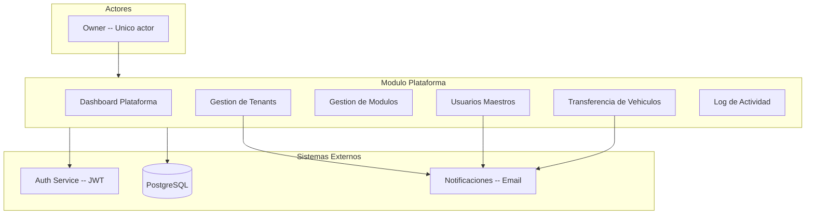

### 1.3 Responsabilidades del Modulo

| Responsabilidad | Descripcion |
|----------------|-------------|
| Gestion de Tenants | CRUD completo de cuentas de clientes: crear, editar, suspender, reactivar, cancelar |
| Gestion de Modulos | Activar/desactivar modulos del sistema por tenant con validacion de dependencias |
| Transferencia de Vehiculos | Mover vehiculos entre tenants con opcion de transferir historial GPS y mantenimiento |
| Usuarios Maestros | Crear usuario maestro por tenant, forzar reset de contrasena |
| Dashboard | Metricas globales: MRR, churn, distribucion por plan, modulos mas usados |
| Log de Actividad | Registro de todas las acciones administrativas de la plataforma |
| Fleet Groups | Crear y gestionar grupos de flota para organizacion interna de vehiculos por tenant |

---

## 2. Entidades del Dominio

### 2.1 Tenant (Cuenta de Cliente)

Entidad raiz de la arquitectura multi-tenant. Cada tenant es una empresa cliente independiente.

| Campo | Tipo | Descripcion |
|-------|------|-------------|
| id | string (UUID) | ID unico del tenant |
| code | string | Codigo interno (ej: "TRANSPORTES-NORTE") |
| name | string | Nombre comercial |
| legalName | string | Razon social |
| taxId | string | RUC / NIT / Tax ID |
| status | TenantStatus | Estado actual del tenant |
| address | string | Direccion fiscal |
| city | string | Ciudad |
| country | string | Pais (ISO 2) |
| phone | string | Telefono principal |
| email | string | Email principal |
| website | string? | Sitio web |
| logo | string? | URL del logo |
| plan | SubscriptionPlan | Plan de suscripcion |
| subscriptionStartDate | ISO 8601 | Inicio de suscripcion |
| subscriptionEndDate | ISO 8601? | Fin de suscripcion |
| isTrialActive | boolean | Si trial esta activo |
| trialEndDate | ISO 8601? | Fin del trial |
| maxUsers | number | Limite de usuarios |
| maxVehicles | number | Limite de vehiculos |
| currentUsersCount | number | Usuarios actuales |
| currentVehiclesCount | number | Vehiculos actuales |
| enabledModules | TenantModuleConfig[] | Modulos habilitados |
| masterUserId | string? | ID del usuario maestro |
| masterUserName | string? | Nombre del usuario maestro |
| masterUserEmail | string? | Email del usuario maestro |
| timezone | string | Zona horaria |
| defaultCurrency | string | Moneda (PEN, USD, etc.) |
| defaultLanguage | "es" o "en" | Idioma |
| suspensionReason | string? | Motivo de suspension |
| suspendedAt | ISO 8601? | Fecha de suspension |
| internalNotes | string? | Notas internas del Owner |
| createdAt | ISO 8601 | Fecha de creacion |
| updatedAt | ISO 8601 | Ultima actualizacion |
| createdBy | string | Quien creo |

### 2.2 TenantModuleConfig

Configuracion de un modulo habilitado para un tenant especifico.

| Campo | Tipo | Descripcion |
|-------|------|-------------|
| moduleCode | SystemModuleCode | Codigo del modulo |
| isEnabled | boolean | Si esta habilitado |
| enabledAt | ISO 8601? | Fecha de activacion |
| enabledBy | string? | Quien lo activo (Owner) |
| disabledAt | ISO 8601? | Fecha de desactivacion |
| limits | Record<string, number>? | Limites especificos del modulo |
| config | Record<string, unknown>? | Configuracion custom |

### 2.3 SystemModuleDefinition

Definicion estatica de un modulo del sistema (catalogo inmutable).

| Campo | Tipo | Descripcion |
|-------|------|-------------|
| code | SystemModuleCode | Codigo del modulo |
| name | string | Nombre para mostrar |
| description | string | Descripcion del modulo |
| category | string | Categoria: operations, monitoring, finance, maintenance, master, reports, support |
| icon | string | Icono lucide-react |
| isCore | boolean | Si es modulo core (siempre incluido) |
| includedInPlans | SubscriptionPlan[] | Planes que lo incluyen por defecto |
| dependencies | SystemModuleCode[]? | Modulos que deben estar activos |
| displayOrder | number | Orden de visualizacion |

### 2.4 VehicleTransferRequest

Solicitud de transferencia de vehiculos entre tenants.

| Campo | Tipo | Descripcion |
|-------|------|-------------|
| id | string (UUID) | ID unico de la solicitud |
| vehicleIds | string[] | IDs de vehiculos a transferir |
| fromTenantId | string | Tenant origen |
| fromTenantName | string | Nombre del tenant origen |
| toTenantId | string | Tenant destino |
| toTenantName | string | Nombre del tenant destino |
| reason | string | Motivo de la transferencia |
| status | TransferStatus | Estado de la transferencia |
| transferGpsHistory | boolean | Transferir historial GPS |
| transferMaintenanceHistory | boolean | Transferir historial mantenimiento |
| requestedBy | string | Quien solicito |
| requestedAt | ISO 8601 | Fecha de solicitud |
| processedBy | string? | Quien aprobo/rechazo |
| processedAt | ISO 8601? | Fecha de procesamiento |
| notes | string? | Notas adicionales |

### 2.5 FleetGroup

Grupo de flota para organizacion interna de vehiculos dentro de un tenant.

| Campo | Tipo | Descripcion |
|-------|------|-------------|
| id | string (UUID) | ID unico |
| tenantId | string | Tenant al que pertenece |
| name | string | Nombre del grupo |
| description | string? | Descripcion |
| vehicleIds | string[] | Vehiculos asignados |
| color | string? | Color identificador |
| createdAt | ISO 8601 | Fecha de creacion |
| updatedAt | ISO 8601 | Ultima actualizacion |

### 2.6 PlatformDashboard

Resumen de metricas para el dashboard del Owner.

| Campo | Tipo | Descripcion |
|-------|------|-------------|
| totalTenants | number | Total de tenants |
| activeTenants | number | Tenants activos |
| suspendedTenants | number | Tenants suspendidos |
| trialTenants | number | Tenants en trial |
| totalUsers | number | Total de usuarios en la plataforma |
| totalVehicles | number | Total de vehiculos |
| monthlyRecurringRevenue | number | MRR (ingresos mensuales recurrentes) |
| newTenantsThisMonth | number | Tenants creados este mes |
| churnRate | number | Tasa de churn del mes |
| planDistribution | PlanDistEntry[] | Distribucion por plan |
| topModules | TopModuleEntry[] | Modulos mas usados |
| recentActivity | PlatformActivityLog[] | Actividad reciente |

### 2.7 PlatformActivityLog

Registro de actividad de plataforma.

| Campo | Tipo | Descripcion |
|-------|------|-------------|
| id | string (UUID) | ID unico |
| timestamp | ISO 8601 | Fecha/hora |
| userId | string | ID del usuario (Owner) |
| userName | string | Nombre del usuario |
| action | PlatformAction | Tipo de accion |
| description | string | Descripcion legible |
| tenantId | string? | Tenant afectado |
| tenantName | string? | Nombre del tenant |
| metadata | Record<string, unknown>? | Datos adicionales |

### 2.8 UserScope

Alcance de visibilidad de un subusuario, definido por el Usuario Maestro.

| Campo | Tipo | Descripcion |
|-------|------|-------------|
| type | ScopeType | Tipo de restriccion |
| vehicleIds | string[]? | Vehiculos asignados |
| fleetGroupIds | string[]? | Grupos de flota asignados |
| geofenceIds | string[]? | Geocercas asignadas |
| customerIds | string[]? | Clientes asignados |
| operationTypes | string[]? | Tipos de operacion |
| restrictDriverVisibility | boolean? | Restringir visibilidad de conductores |
| driverIds | string[]? | Conductores visibles |

---

## 3. Modelo de Base de Datos -- PostgreSQL

### 3.1 Tabla tenants

```sql
CREATE TABLE tenants (
    id            uuid PRIMARY KEY DEFAULT gen_random_uuid(),
    code          varchar(50) UNIQUE NOT NULL,
    name          varchar(200) NOT NULL,
    legal_name    varchar(300) NOT NULL,
    tax_id        varchar(20) UNIQUE NOT NULL,
    status        varchar(20) NOT NULL DEFAULT 'pending',
    address       text NOT NULL,
    city          varchar(100) NOT NULL,
    country       varchar(2) NOT NULL DEFAULT 'PE',
    phone         varchar(30) NOT NULL,
    email         varchar(200) NOT NULL,
    website       varchar(300),
    logo          text,
    plan          varchar(20) NOT NULL DEFAULT 'starter',
    subscription_start_date timestamptz,
    subscription_end_date   timestamptz,
    is_trial_active         boolean DEFAULT false,
    trial_end_date          timestamptz,
    max_users               integer NOT NULL DEFAULT 5,
    max_vehicles            integer NOT NULL DEFAULT 20,
    current_users_count     integer NOT NULL DEFAULT 0,
    current_vehicles_count  integer NOT NULL DEFAULT 0,
    master_user_id          uuid,
    master_user_name        varchar(200),
    master_user_email       varchar(200),
    timezone                varchar(50) DEFAULT 'America/Lima',
    default_currency        varchar(3) DEFAULT 'PEN',
    default_language        varchar(2) DEFAULT 'es',
    suspension_reason       text,
    suspended_at            timestamptz,
    internal_notes          text,
    created_at              timestamptz NOT NULL DEFAULT NOW(),
    updated_at              timestamptz NOT NULL DEFAULT NOW(),
    created_by              varchar(100) NOT NULL
);

CREATE INDEX idx_tenants_status ON tenants(status);
CREATE INDEX idx_tenants_plan ON tenants(plan);
CREATE INDEX idx_tenants_code ON tenants(code);
```

### 3.2 Tabla tenant_modules

```sql
CREATE TABLE tenant_modules (
    id            uuid PRIMARY KEY DEFAULT gen_random_uuid(),
    tenant_id     uuid NOT NULL REFERENCES tenants(id) ON DELETE CASCADE,
    module_code   varchar(50) NOT NULL,
    is_enabled    boolean NOT NULL DEFAULT false,
    enabled_at    timestamptz,
    enabled_by    varchar(100),
    disabled_at   timestamptz,
    limits        jsonb,
    config        jsonb,
    UNIQUE(tenant_id, module_code)
);

CREATE INDEX idx_tenant_modules_tenant ON tenant_modules(tenant_id);
CREATE INDEX idx_tenant_modules_code ON tenant_modules(module_code);
```

### 3.3 Tabla vehicle_transfers

```sql
CREATE TABLE vehicle_transfers (
    id                uuid PRIMARY KEY DEFAULT gen_random_uuid(),
    vehicle_ids       uuid[] NOT NULL,
    from_tenant_id    uuid NOT NULL REFERENCES tenants(id),
    from_tenant_name  varchar(200) NOT NULL,
    to_tenant_id      uuid NOT NULL REFERENCES tenants(id),
    to_tenant_name    varchar(200) NOT NULL,
    reason            text NOT NULL,
    status            varchar(20) NOT NULL DEFAULT 'pending',
    transfer_gps_history          boolean DEFAULT false,
    transfer_maintenance_history  boolean DEFAULT false,
    requested_by      varchar(100) NOT NULL,
    requested_at      timestamptz NOT NULL DEFAULT NOW(),
    processed_by      varchar(100),
    processed_at      timestamptz,
    notes             text
);

CREATE INDEX idx_vehicle_transfers_status ON vehicle_transfers(status);
CREATE INDEX idx_vehicle_transfers_from ON vehicle_transfers(from_tenant_id);
CREATE INDEX idx_vehicle_transfers_to ON vehicle_transfers(to_tenant_id);
```

### 3.4 Tabla fleet_groups

```sql
CREATE TABLE fleet_groups (
    id           uuid PRIMARY KEY DEFAULT gen_random_uuid(),
    tenant_id    uuid NOT NULL REFERENCES tenants(id) ON DELETE CASCADE,
    name         varchar(100) NOT NULL,
    description  text,
    vehicle_ids  uuid[] DEFAULT '{}',
    color        varchar(7),
    created_at   timestamptz NOT NULL DEFAULT NOW(),
    updated_at   timestamptz NOT NULL DEFAULT NOW(),
    UNIQUE(tenant_id, name)
);

CREATE INDEX idx_fleet_groups_tenant ON fleet_groups(tenant_id);
```

### 3.5 Tabla platform_activity_log

```sql
CREATE TABLE platform_activity_log (
    id           uuid PRIMARY KEY DEFAULT gen_random_uuid(),
    timestamp    timestamptz NOT NULL DEFAULT NOW(),
    user_id      varchar(100) NOT NULL,
    user_name    varchar(200) NOT NULL,
    action       varchar(50) NOT NULL,
    description  text NOT NULL,
    tenant_id    uuid REFERENCES tenants(id),
    tenant_name  varchar(200),
    metadata     jsonb
);

CREATE INDEX idx_platform_activity_timestamp ON platform_activity_log(timestamp DESC);
CREATE INDEX idx_platform_activity_tenant ON platform_activity_log(tenant_id);
CREATE INDEX idx_platform_activity_action ON platform_activity_log(action);
```

---

## 4. Maquina de Estados -- TenantStatus

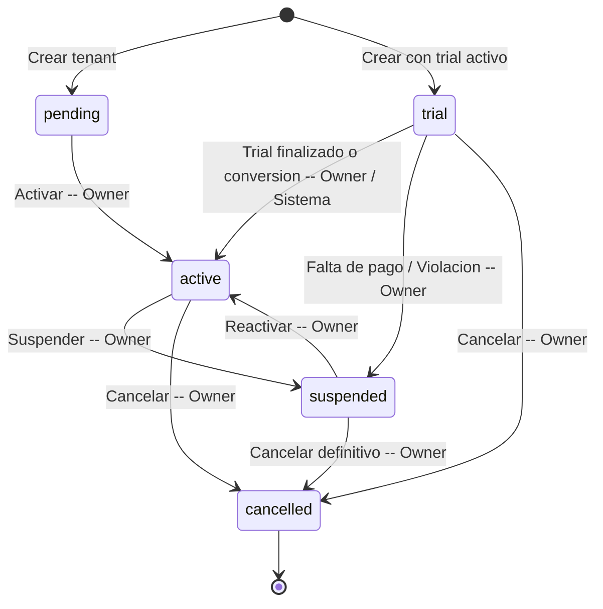

### Tabla de estados

| Estado | Descripcion | Puede transicionar a |
|--------|-------------|---------------------|
| pending | Tenant creado pero pendiente de activacion | active |
| trial | En periodo de prueba gratuito | active, suspended, cancelled |
| active | Cuenta operativa con acceso completo | suspended, cancelled |
| suspended | Suspendida temporalmente (falta de pago, violacion) | active, cancelled |
| cancelled | Cancelada definitivamente. Estado terminal | (ninguno) |

---

## 5. Maquina de Estados -- TransferStatus

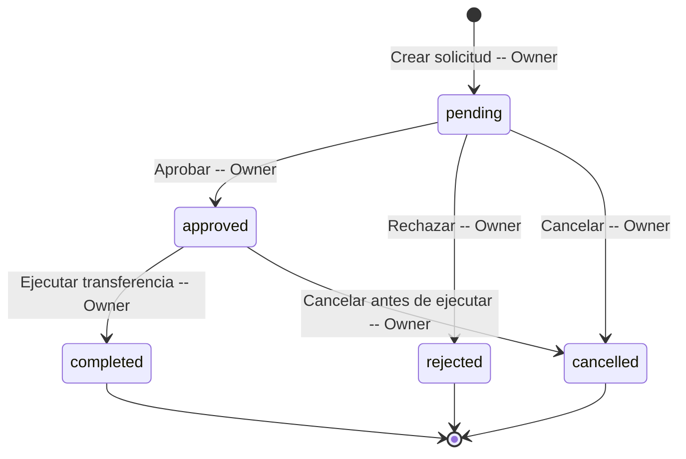

### Tabla de estados

| Estado | Descripcion | Puede transicionar a |
|--------|-------------|---------------------|
| pending | Solicitud creada, pendiente de revision | approved, rejected, cancelled |
| approved | Solicitud aprobada, lista para ejecutar | completed, cancelled |
| completed | Transferencia ejecutada. Estado terminal | (ninguno) |
| rejected | Solicitud rechazada. Estado terminal | (ninguno) |
| cancelled | Solicitud cancelada. Estado terminal | (ninguno) |

---

## 6. Catalogos y Enumeraciones

### 6.1 SubscriptionPlan

| Valor | Descripcion | Modulos incluidos |
|-------|-------------|-------------------|
| starter | Plan basico | orders, customers, drivers, vehicles, notifications (core modules) |
| professional | Plan profesional | starter + scheduling, workflows, incidents, bitacora, monitoring, alerts, invoicing, payments, operators, products, geofences, reports |
| enterprise | Plan empresarial | professional + route_planner, costs, rates, settlements, maintenance, integrations |
| custom | Plan personalizado | Configuracion a medida por el Owner |

### 6.2 SystemModuleCode (23 modulos)

| Codigo | Nombre | Categoria | Core | Dependencias |
|--------|--------|-----------|:----:|-------------|
| orders | Ordenes | operations | Si | -- |
| scheduling | Programacion | operations | No | orders |
| workflows | Workflows | operations | No | orders |
| incidents | Incidencias | operations | No | orders |
| bitacora | Bitacora | operations | No | orders |
| route_planner | Planificador de Rutas | operations | No | orders, vehicles |
| monitoring | Monitoreo | monitoring | No | vehicles |
| alerts | Alertas de Monitoreo | monitoring | No | monitoring |
| invoicing | Facturacion | finance | No | -- |
| payments | Cobros y Pagos | finance | No | -- |
| costs | Control de Costos | finance | No | -- |
| rates | Tarifario | finance | No | -- |
| settlements | Liquidaciones | finance | No | orders |
| maintenance | Mantenimiento | maintenance | No | vehicles |
| customers | Clientes | master | Si | -- |
| drivers | Conductores | master | Si | -- |
| vehicles | Vehiculos | master | Si | -- |
| operators | Operadores Logisticos | master | No | -- |
| products | Productos | master | No | -- |
| geofences | Geocercas | master | No | -- |
| reports | Centro de Reportes | reports | No | -- |
| notifications | Notificaciones | support | Si | -- |
| integrations | Integraciones Externas | support | No | -- |

### 6.3 ScopeType

| Valor | Descripcion |
|-------|-------------|
| all | Sin restricciones (ve todo dentro del tenant) |
| by_vehicles | Restringido a vehiculos especificos |
| by_fleet_groups | Restringido a grupos de flota |
| by_geofences | Restringido a geocercas |
| by_customers | Restringido a clientes |
| by_operation_type | Restringido a tipos de operacion |
| custom | Combinacion personalizada |

### 6.4 PlatformAction (Tipos de actividad)

| Accion | Descripcion |
|--------|-------------|
| tenant_created | Se creo un nuevo tenant |
| tenant_suspended | Tenant suspendido |
| tenant_reactivated | Tenant reactivado |
| tenant_cancelled | Tenant cancelado |
| module_enabled | Modulo activado para un tenant |
| module_disabled | Modulo desactivado para un tenant |
| user_created | Usuario creado en un tenant |
| user_reset_password | Reset de contrasena forzado |
| vehicle_transferred | Vehiculos transferidos entre tenants |
| plan_changed | Plan de suscripcion cambiado |
| master_user_created | Usuario maestro creado para un tenant |

---

## 7. Tabla de Referencia Operativa de Transiciones

### 7.1 Transiciones de TenantStatus

| ID | Estado Origen | Estado Destino | Accion | Actor | Notas |
|----|---------------|----------------|--------|-------|-------|
| T-01 | (nuevo) | `pending` | Crear tenant sin trial | Owner | Estado inicial cuando no hay trial |
| T-02 | (nuevo) | `trial` | Crear tenant con trial | Owner | Trial activo por N dias configurables |
| T-03 | `pending` | `active` | Activar tenant | Owner | Tras verificar datos y pago |
| T-04 | `trial` | `active` | Convertir trial a activo | Owner / Sistema | Manual o automatico al finalizar trial con pago |
| T-05 | `trial` | `suspended` | Suspender trial | Owner | Por violacion de terminos |
| T-06 | `trial` | `cancelled` | Cancelar trial | Owner | El cliente no continua |
| T-07 | `active` | `suspended` | Suspender tenant | Owner | Falta de pago, violacion de politicas |
| T-08 | `active` | `cancelled` | Cancelar tenant | Owner | Cancelacion definitiva |
| T-09 | `suspended` | `active` | Reactivar tenant | Owner | Tras regularizar situacion |
| T-10 | `suspended` | `cancelled` | Cancelar desde suspension | Owner | Sin recuperacion |

### 7.2 Transiciones de TransferStatus

| ID | Estado Origen | Estado Destino | Accion | Actor | Notas |
|----|---------------|----------------|--------|-------|-------|
| T-11 | (nuevo) | `pending` | Crear solicitud | Owner | Estado inicial obligatorio |
| T-12 | `pending` | `approved` | Aprobar transferencia | Owner | Validacion de vehiculos y tenants |
| T-13 | `pending` | `rejected` | Rechazar transferencia | Owner | Con motivo de rechazo |
| T-14 | `pending` | `cancelled` | Cancelar solicitud | Owner | Antes de procesar |
| T-15 | `approved` | `completed` | Ejecutar transferencia | Owner | Mueve vehiculos al tenant destino |
| T-16 | `approved` | `cancelled` | Cancelar antes de ejecutar | Owner | Reversion antes de ejecucion |

---

## 8. Casos de Uso -- Referencia Backend

> **Modelo de 3 roles (definicion Edson)**

> **Leyenda:** Si = Permitido | Configurable = Permitido si el Usuario Maestro le asigno el permiso | No = Denegado

> **IMPORTANTE:** En el modulo Plataforma, el RBAC esta **invertido**. Solo el Owner tiene acceso. Usuario Maestro y Subusuario = No en todo.

### 8.1 Matriz de Casos de Uso

| CU | Nombre | Owner | Usuario Maestro | Subusuario | Sistema |
|----|--------|-------|-----------------|------------|---------|
| CU-01 | Ver Dashboard de Plataforma | Si | No | No | No |
| CU-02 | Listar Tenants | Si | No | No | No |
| CU-03 | Crear Tenant | Si | No | No | No |
| CU-04 | Actualizar Tenant | Si | No | No | No |
| CU-05 | Suspender Tenant | Si | No | No | No |
| CU-06 | Reactivar Tenant | Si | No | No | No |
| CU-07 | Gestionar Modulos de Tenant | Si | No | No | No |
| CU-08 | Crear Usuario Maestro | Si | No | No | No |
| CU-09 | Forzar Reset de Contrasena | Si | No | No | No |
| CU-10 | Crear Transferencia de Vehiculos | Si | No | No | No |
| CU-11 | Aprobar/Rechazar Transferencia | Si | No | No | No |
| CU-12 | Ejecutar Transferencia | Si | No | No | No |

### 8.2 Detalle de Casos de Uso

#### CU-01: Ver Dashboard de Plataforma

| Atributo | Valor |
|----------|-------|
| Codigo | CU-01 |
| Nombre | Ver Dashboard de Plataforma |
| Actor Principal | Owner |
| Descripcion | Obtener metricas globales de la plataforma: MRR, churn, distribucion por plan, modulos mas usados, actividad reciente |

| # | Precondicion |
|---|-------------|
| 1 | El actor es Owner (validado por JWT con flag `isPlatformOwner = true`) |

| # | Paso | Actor |
|---|------|-------|
| 1 | El Owner solicita el dashboard | Owner |
| 2 | El sistema valida que el JWT tiene flag `isPlatformOwner` | Sistema |
| 3 | El sistema agrega datos de todos los tenants: conteos, MRR, churn | Sistema |
| 4 | El sistema calcula distribucion por plan y modulos mas usados | Sistema |
| 5 | El sistema obtiene las ultimas N actividades del log | Sistema |
| 6 | El sistema retorna PlatformDashboard completo | Sistema |

| # | Postcondicion |
|---|--------------|
| 1 | Se retorna el dashboard con todas las metricas globales |

| Codigo | Excepcion | Respuesta |
|--------|-----------|-----------|
| E-01 | JWT no es Owner | 403 Forbidden |

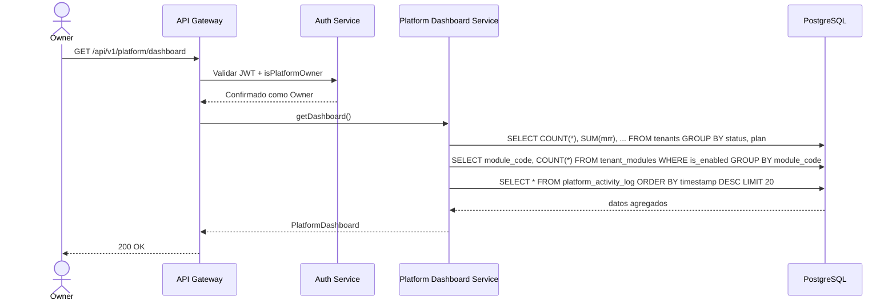

#### CU-02: Listar Tenants

| Atributo | Valor |
|----------|-------|
| Codigo | CU-02 |
| Nombre | Listar Tenants |
| Actor Principal | Owner |
| Descripcion | Obtener lista paginada de todos los tenants con filtros opcionales |

| # | Precondicion |
|---|-------------|
| 1 | El actor es Owner |

| # | Paso | Actor |
|---|------|-------|
| 1 | El Owner solicita la lista de tenants con filtros opcionales | Owner |
| 2 | El sistema valida que es Owner | Sistema |
| 3 | El sistema consulta tenants con filtros y paginacion | Sistema |
| 4 | El sistema retorna la lista paginada | Sistema |

| # | Postcondicion |
|---|--------------|
| 1 | Se retorna la lista de tenants con metadatos de paginacion |

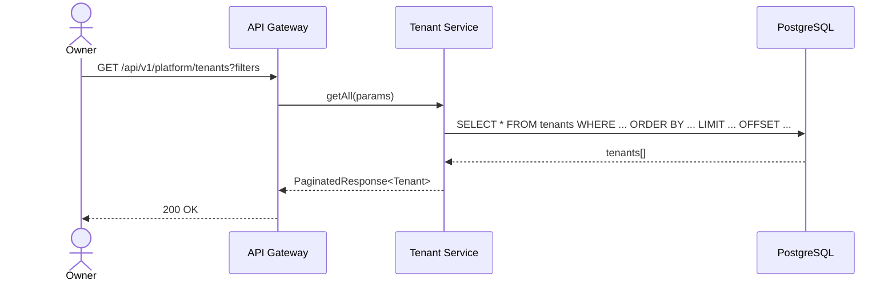

#### CU-03: Crear Tenant

| Atributo | Valor |
|----------|-------|
| Codigo | CU-03 |
| Nombre | Crear Tenant |
| Actor Principal | Owner |
| Descripcion | Crear una nueva cuenta de cliente en la plataforma |

| # | Precondicion |
|---|-------------|
| 1 | El actor es Owner |
| 2 | No existe un tenant con el mismo `code` o `taxId` |

| # | Paso | Actor |
|---|------|-------|
| 1 | El Owner envia los datos del nuevo tenant (CreateTenantDTO) | Owner |
| 2 | El sistema valida unicidad de `code` y `taxId` | Sistema |
| 3 | El sistema valida que los modulos solicitados existen y sus dependencias | Sistema |
| 4 | El sistema crea el tenant con estado `pending` (o `trial` si enableTrial=true) | Sistema |
| 5 | El sistema activa los modulos solicitados en `tenant_modules` | Sistema |
| 6 | El sistema publica evento `platform.tenant_created` | Sistema |
| 7 | El sistema registra actividad en `platform_activity_log` | Sistema |

| # | Postcondicion |
|---|--------------|
| 1 | Tenant creado con los modulos activados |
| 2 | Actividad registrada en el log |

| Codigo | Excepcion | Respuesta |
|--------|-----------|-----------|
| E-01 | Code duplicado | 409 Conflict |
| E-02 | TaxId duplicado | 409 Conflict |
| E-03 | Modulo con dependencia faltante | 422 Unprocessable Entity |

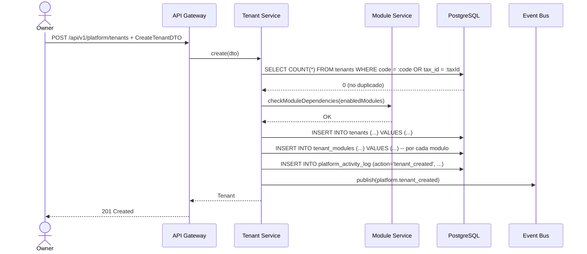

#### CU-04: Actualizar Tenant

| Atributo | Valor |
|----------|-------|
| Codigo | CU-04 |
| Nombre | Actualizar Tenant |
| Actor Principal | Owner |
| Descripcion | Actualizar datos de un tenant existente (nombre, contacto, plan, limites) |

| # | Precondicion |
|---|-------------|
| 1 | El actor es Owner |
| 2 | El tenant existe |

| # | Paso | Actor |
|---|------|-------|
| 1 | El Owner envia ID y datos a actualizar (UpdateTenantDTO) | Owner |
| 2 | El sistema busca el tenant por ID | Sistema |
| 3 | El sistema actualiza los campos proporcionados | Sistema |
| 4 | Si cambio el plan, se registra actividad `plan_changed` | Sistema |

| Codigo | Excepcion | Respuesta |
|--------|-----------|-----------|
| E-01 | Tenant no encontrado | 404 Not Found |

#### CU-05: Suspender Tenant

| Atributo | Valor |
|----------|-------|
| Codigo | CU-05 |
| Nombre | Suspender Tenant |
| Actor Principal | Owner |
| Descripcion | Suspender temporalmente un tenant. El tenant pierde acceso pero sus datos se mantienen |

| # | Precondicion |
|---|-------------|
| 1 | El actor es Owner |
| 2 | El tenant existe y su status es `active` o `trial` |

| # | Paso | Actor |
|---|------|-------|
| 1 | El Owner envia ID y motivo de suspension (SuspendTenantDTO) | Owner |
| 2 | El sistema valida que el tenant esta en estado suspendible | Sistema |
| 3 | El sistema cambia status a `suspended`, registra `suspensionReason` y `suspendedAt` | Sistema |
| 4 | Si `notifyMasterUser = true`, envia email al usuario maestro | Sistema |
| 5 | El sistema publica evento `platform.tenant_suspended` | Sistema |
| 6 | El sistema registra actividad | Sistema |

| Codigo | Excepcion | Respuesta |
|--------|-----------|-----------|
| E-01 | Tenant no encontrado | 404 Not Found |
| E-02 | Tenant ya suspendido o cancelado | 422 Unprocessable Entity |

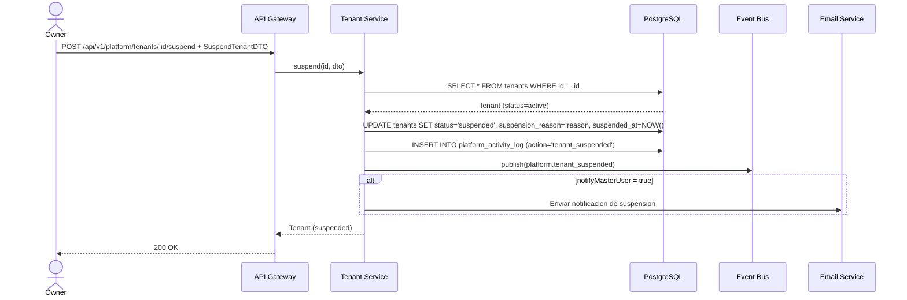

#### CU-06: Reactivar Tenant

| Atributo | Valor |
|----------|-------|
| Codigo | CU-06 |
| Nombre | Reactivar Tenant |
| Actor Principal | Owner |
| Descripcion | Reactivar un tenant suspendido |

| # | Precondicion |
|---|-------------|
| 1 | El actor es Owner |
| 2 | El tenant existe y su status es `suspended` |

| # | Paso | Actor |
|---|------|-------|
| 1 | El Owner solicita reactivar el tenant | Owner |
| 2 | El sistema valida que el tenant esta suspendido | Sistema |
| 3 | El sistema cambia status a `active`, limpia `suspensionReason` | Sistema |
| 4 | El sistema publica evento `platform.tenant_reactivated` | Sistema |

| Codigo | Excepcion | Respuesta |
|--------|-----------|-----------|
| E-01 | Tenant no esta suspendido | 422 Unprocessable Entity |

#### CU-07: Gestionar Modulos de Tenant

| Atributo | Valor |
|----------|-------|
| Codigo | CU-07 |
| Nombre | Gestionar Modulos de Tenant |
| Actor Principal | Owner |
| Descripcion | Activar o desactivar modulos para un tenant especifico, con validacion de dependencias |

| # | Precondicion |
|---|-------------|
| 1 | El actor es Owner |
| 2 | El tenant existe y esta activo |

| # | Paso | Actor |
|---|------|-------|
| 1 | El Owner envia la lista de modulos a activar/desactivar (UpdateTenantModulesDTO) | Owner |
| 2 | Para cada modulo a activar: validar dependencias (checkModuleDependencies) | Sistema |
| 3 | Para cada modulo a desactivar: validar que no haya dependientes activos (checkModuleDependents) | Sistema |
| 4 | El sistema actualiza `tenant_modules` | Sistema |
| 5 | El sistema registra actividad `module_enabled` o `module_disabled` por cada cambio | Sistema |

| Codigo | Excepcion | Respuesta |
|--------|-----------|-----------|
| E-01 | Dependencia faltante al activar | 422 Unprocessable Entity |
| E-02 | Modulo tiene dependientes activos al desactivar | 422 Unprocessable Entity |

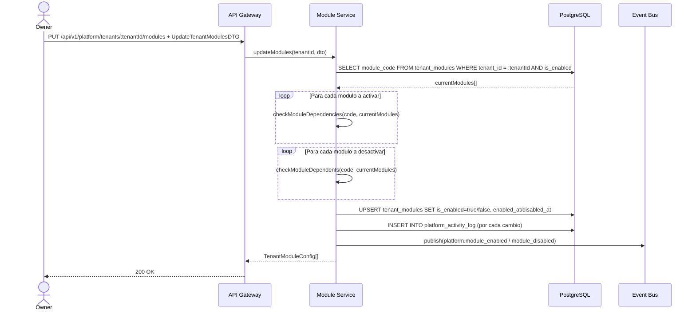

#### CU-08: Crear Usuario Maestro

| Atributo | Valor |
|----------|-------|
| Codigo | CU-08 |
| Nombre | Crear Usuario Maestro |
| Actor Principal | Owner |
| Descripcion | Crear el usuario maestro (admin) de un tenant |

| # | Precondicion |
|---|-------------|
| 1 | El actor es Owner |
| 2 | El tenant existe |
| 3 | El tenant no tiene ya un usuario maestro activo |

| # | Paso | Actor |
|---|------|-------|
| 1 | El Owner envia datos del usuario maestro (CreateMasterUserDTO) | Owner |
| 2 | El sistema valida que el email no este en uso | Sistema |
| 3 | El sistema crea el usuario con rol `master_user` para el tenant | Sistema |
| 4 | El sistema actualiza `master_user_id/name/email` en el tenant | Sistema |
| 5 | Si `forcePasswordChange = true`, marca para cambio en primer login | Sistema |
| 6 | El sistema publica evento `platform.master_user_created` | Sistema |

| Codigo | Excepcion | Respuesta |
|--------|-----------|-----------|
| E-01 | Email ya en uso | 409 Conflict |
| E-02 | Tenant ya tiene usuario maestro | 422 Unprocessable Entity |

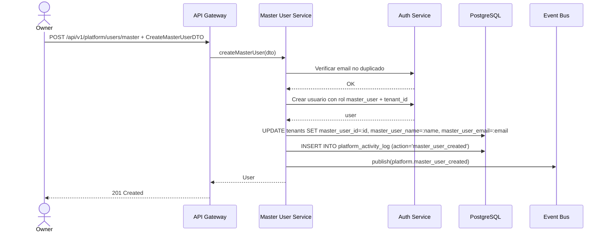

#### CU-09: Forzar Reset de Contrasena

| Atributo | Valor |
|----------|-------|
| Codigo | CU-09 |
| Nombre | Forzar Reset de Contrasena |
| Actor Principal | Owner |
| Descripcion | Forzar el reset de contrasena de cualquier usuario de un tenant |

| # | Precondicion |
|---|-------------|
| 1 | El actor es Owner |
| 2 | El usuario existe en el tenant especificado |

| # | Paso | Actor |
|---|------|-------|
| 1 | El Owner envia los datos de reset (ForcePasswordResetDTO) | Owner |
| 2 | El sistema valida que el usuario existe en el tenant | Sistema |
| 3 | Si no se proporciona `temporaryPassword`, genera una automaticamente | Sistema |
| 4 | El sistema actualiza la contrasena del usuario | Sistema |
| 5 | Si `sendByEmail = true`, envia la contrasena temporal por email | Sistema |
| 6 | Si `forceChangeOnLogin = true`, marca para cambio obligatorio | Sistema |

| Codigo | Excepcion | Respuesta |
|--------|-----------|-----------|
| E-01 | Usuario no encontrado en el tenant | 404 Not Found |

#### CU-10: Crear Transferencia de Vehiculos

| Atributo | Valor |
|----------|-------|
| Codigo | CU-10 |
| Nombre | Crear Transferencia de Vehiculos |
| Actor Principal | Owner |
| Descripcion | Crear una solicitud de transferencia de vehiculos de un tenant a otro |

| # | Precondicion |
|---|-------------|
| 1 | El actor es Owner |
| 2 | Los vehiculos existen en el tenant origen |
| 3 | El tenant destino existe y esta activo |
| 4 | El tenant destino tiene capacidad (maxVehicles no excedido) |

| # | Paso | Actor |
|---|------|-------|
| 1 | El Owner envia la solicitud (CreateVehicleTransferDTO) | Owner |
| 2 | El sistema valida que los vehiculos pertenecen al tenant origen | Sistema |
| 3 | El sistema valida que el tenant destino tiene capacidad | Sistema |
| 4 | El sistema crea la solicitud con status `pending` | Sistema |

| Codigo | Excepcion | Respuesta |
|--------|-----------|-----------|
| E-01 | Vehiculo no pertenece al tenant origen | 404 Not Found |
| E-02 | Tenant destino no tiene capacidad | 422 Unprocessable Entity |
| E-03 | Tenant origen = Tenant destino | 422 Unprocessable Entity |

#### CU-11: Aprobar/Rechazar Transferencia

| Atributo | Valor |
|----------|-------|
| Codigo | CU-11 |
| Nombre | Aprobar/Rechazar Transferencia |
| Actor Principal | Owner |
| Descripcion | Aprobar o rechazar una solicitud de transferencia pendiente |

| # | Precondicion |
|---|-------------|
| 1 | El actor es Owner |
| 2 | La transferencia existe y esta en status `pending` |

| # | Paso | Actor |
|---|------|-------|
| 1 | El Owner aprueba o rechaza la transferencia | Owner |
| 2 | El sistema cambia status a `approved` o `rejected` | Sistema |
| 3 | El sistema registra `processedBy` y `processedAt` | Sistema |

#### CU-12: Ejecutar Transferencia

| Atributo | Valor |
|----------|-------|
| Codigo | CU-12 |
| Nombre | Ejecutar Transferencia |
| Actor Principal | Owner |
| Descripcion | Ejecutar una transferencia aprobada, moviendo los vehiculos al tenant destino |

| # | Precondicion |
|---|-------------|
| 1 | El actor es Owner |
| 2 | La transferencia esta en status `approved` |

| # | Paso | Actor |
|---|------|-------|
| 1 | El Owner ejecuta la transferencia | Owner |
| 2 | El sistema mueve los vehiculos: UPDATE `tenant_id` de cada vehiculo al tenant destino | Sistema |
| 3 | Si `transferGpsHistory = true`, migra datos de telemetria | Sistema |
| 4 | Si `transferMaintenanceHistory = true`, migra registros de mantenimiento | Sistema |
| 5 | El sistema actualiza contadores: decrementa `currentVehiclesCount` en origen, incrementa en destino | Sistema |
| 6 | El sistema cambia status a `completed` | Sistema |
| 7 | El sistema publica evento `platform.vehicle_transferred` | Sistema |

| Codigo | Excepcion | Respuesta |
|--------|-----------|-----------|
| E-01 | Transferencia no esta aprobada | 422 Unprocessable Entity |
| E-02 | Tenant destino excede capacidad | 422 Unprocessable Entity |

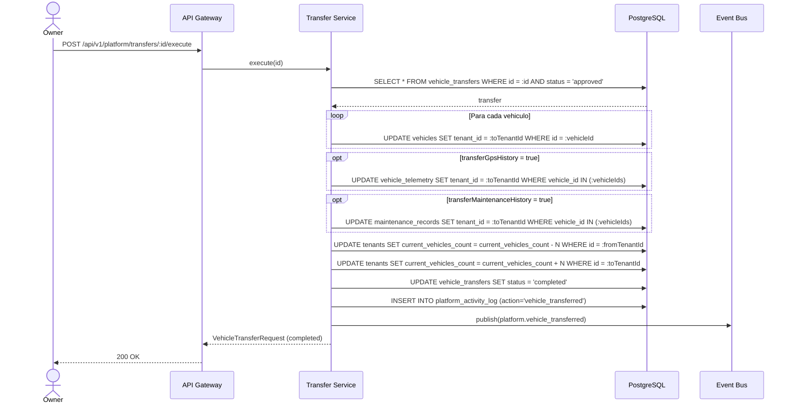

---

## 9. Endpoints API REST

**Base path:** `/api/v1/platform`

> **Nota:** TODOS los endpoints de Plataforma requieren JWT con flag `isPlatformOwner = true`. Solo el Owner tiene acceso.

### Tenants

| # | Metodo | Endpoint | Descripcion | Roles | Request/Query | Response |
|---|--------|----------|-------------|-------|---------------|----------|
| E-01 | GET | /tenants | Listar tenants paginados con filtros | Owner | Query: search, status, plan, city, page, pageSize | `PaginatedResponse<Tenant>` |
| E-02 | GET | /tenants/:id | Obtener tenant por ID | Owner | -- | Tenant |
| E-03 | POST | /tenants | Crear tenant | Owner | CreateTenantDTO | `201` Tenant |
| E-04 | PUT | /tenants/:id | Actualizar tenant | Owner | UpdateTenantDTO | Tenant |
| E-05 | POST | /tenants/:id/suspend | Suspender tenant | Owner | SuspendTenantDTO | Tenant |
| E-06 | POST | /tenants/:id/reactivate | Reactivar tenant | Owner | -- | Tenant |
| E-07 | DELETE | /tenants/:id | Cancelar/eliminar tenant | Owner | -- | `204` No Content |

### Modulos

| # | Metodo | Endpoint | Descripcion | Roles | Request/Query | Response |
|---|--------|----------|-------------|-------|---------------|----------|
| E-08 | GET | /tenants/:tenantId/modules | Obtener modulos de un tenant | Owner | -- | `TenantModuleConfig[]` |
| E-09 | PUT | /tenants/:tenantId/modules | Activar/desactivar modulos | Owner | UpdateTenantModulesDTO | `TenantModuleConfig[]` |
| E-10 | GET | /tenants/:tenantId/modules/:moduleCode/enabled | Verificar si modulo esta habilitado | Owner | -- | `{ isEnabled: boolean }` |

### Usuarios Maestros

| # | Metodo | Endpoint | Descripcion | Roles | Request/Query | Response |
|---|--------|----------|-------------|-------|---------------|----------|
| E-11 | POST | /users/master | Crear usuario maestro | Owner | CreateMasterUserDTO | `201` User |
| E-12 | POST | /users/force-password-reset | Forzar reset de contrasena | Owner | ForcePasswordResetDTO | `{ success: boolean, temporaryPassword?: string }` |

### Transferencias

| # | Metodo | Endpoint | Descripcion | Roles | Request/Query | Response |
|---|--------|----------|-------------|-------|---------------|----------|
| E-13 | GET | /transfers | Listar transferencias paginadas | Owner | Query: status, fromTenantId, toTenantId, page, pageSize | `PaginatedResponse<VehicleTransferRequest>` |
| E-14 | POST | /transfers | Crear solicitud de transferencia | Owner | CreateVehicleTransferDTO | `201` VehicleTransferRequest |
| E-15 | POST | /transfers/:id/approve | Aprobar transferencia | Owner | -- | VehicleTransferRequest |
| E-16 | POST | /transfers/:id/execute | Ejecutar transferencia | Owner | -- | VehicleTransferRequest |
| E-17 | POST | /transfers/:id/reject | Rechazar transferencia | Owner | `{ reason: string }` | VehicleTransferRequest |

### Dashboard y Actividad

| # | Metodo | Endpoint | Descripcion | Roles | Request/Query | Response |
|---|--------|----------|-------------|-------|---------------|----------|
| E-18 | GET | /dashboard | Obtener dashboard de plataforma | Owner | -- | PlatformDashboard |
| E-19 | GET | /activity | Listar log de actividad paginado | Owner | Query: action, tenantId, startDate, endDate, page, pageSize | `PaginatedResponse<PlatformActivityLog>` |

### Fleet Groups

| # | Metodo | Endpoint | Descripcion | Roles | Request/Query | Response |
|---|--------|----------|-------------|-------|---------------|----------|
| E-20 | GET | /tenants/:tenantId/fleet-groups | Listar grupos de flota de un tenant | Owner | -- | `FleetGroup[]` |
| E-21 | POST | /tenants/:tenantId/fleet-groups | Crear grupo de flota | Owner | `{ name, description?, vehicleIds?, color? }` | `201` FleetGroup |
| E-22 | PUT | /tenants/:tenantId/fleet-groups/:groupId | Actualizar grupo | Owner | `Partial<FleetGroup>` | FleetGroup |
| E-23 | DELETE | /tenants/:tenantId/fleet-groups/:groupId | Eliminar grupo | Owner | -- | `204` No Content |

---

## 10. Eventos de Dominio

### Catalogo

| Evento | Payload | Se emite cuando | Modulos suscriptores |
|--------|---------|-----------------|----------------------|
| platform.tenant_created | tenantId, name, plan, enabledModules[] | Se crea un nuevo tenant | Auth (crear namespace), Notificaciones |
| platform.tenant_suspended | tenantId, name, reason, suspendedAt | Tenant suspendido | Auth (bloquear acceso del tenant), Notificaciones (email al master user) |
| platform.tenant_reactivated | tenantId, name | Tenant reactivado | Auth (restaurar acceso) |
| platform.tenant_cancelled | tenantId, name | Tenant cancelado definitivamente | Auth (revocar todos los accesos), Cleanup (programar limpieza de datos) |
| platform.module_enabled | tenantId, moduleCode, moduleName, enabledBy | Modulo activado para un tenant | Auth (actualizar permisos disponibles) |
| platform.module_disabled | tenantId, moduleCode, moduleName | Modulo desactivado | Auth (revocar permisos del modulo), Frontend (ocultar menu) |
| platform.master_user_created | tenantId, userId, userName, email | Usuario maestro creado | Auth (crear credenciales), Notificaciones (email de bienvenida) |
| platform.user_reset_password | tenantId, userId, sendByEmail | Reset de contrasena forzado | Auth (invalidar sesiones activas), Notificaciones (si sendByEmail) |
| platform.vehicle_transferred | transferId, vehicleIds[], fromTenantId, toTenantId | Vehiculos transferidos | Monitoreo (reconfigurar tracking), Mantenimiento (mover registros) |
| platform.plan_changed | tenantId, oldPlan, newPlan | Plan de suscripcion cambiado | Auth (actualizar limites), Modulos (ajustar disponibilidad) |

### Diagrama de propagacion

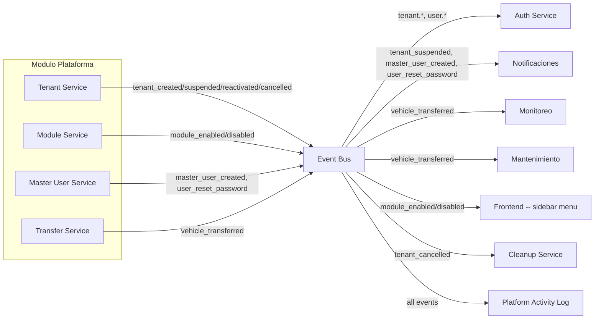

---

## 11. Reglas de Negocio Clave

| # | Regla | Descripcion |
|---|-------|-------------|
| R-01 | Solo Owner tiene acceso | TODOS los endpoints de Plataforma requieren `isPlatformOwner = true` en el JWT. Usuario Maestro y Subusuario reciben 403 Forbidden |
| R-02 | Unicidad de code y taxId | Cada tenant debe tener `code` y `taxId` unicos a nivel global (no por tenant, ya que los tenants son entidades de nivel superior) |
| R-03 | Cancelled es terminal | Un tenant en estado `cancelled` no puede transicionar a ningun otro estado. Es irreversible |
| R-04 | Suspension preserva datos | Al suspender un tenant, se bloquea el acceso pero NO se eliminan datos. El tenant puede ser reactivado |
| R-05 | Dependencias de modulos | No se puede activar un modulo si sus dependencias no estan activas. No se puede desactivar un modulo si tiene dependientes activos |
| R-06 | Modulos core siempre activos | Los modulos con `isCore = true` (orders, customers, drivers, vehicles, notifications) estan incluidos en todos los planes y no pueden desactivarse |
| R-07 | Limites de plan | Cada plan define limites de usuarios y vehiculos. Al crear/actualizar tenant, `maxUsers` y `maxVehicles` deben respetar los limites del plan |
| R-08 | Trial configurable | El periodo de trial es configurable en dias al crear el tenant. Al expirar, el sistema puede convertir automaticamente a activo (si hay pago) o suspender |
| R-09 | Transferencia solo entre tenants activos | No se pueden transferir vehiculos desde o hacia tenants suspendidos o cancelados |
| R-10 | Capacidad del destino | Antes de ejecutar una transferencia, validar que el tenant destino no exceda `maxVehicles` con los vehiculos transferidos |
| R-11 | Un usuario maestro por tenant | Cada tenant solo puede tener un usuario maestro activo. El Owner puede crear uno nuevo si el anterior fue desactivado |
| R-12 | Contrasena temporal obligatoria | Al hacer reset de contrasena, si no se proporciona una temporal, el sistema genera una automaticamente con reglas de complejidad |
| R-13 | Activity log es append-only | El log de actividad es inmutable. No se pueden editar ni eliminar registros |
| R-14 | Fleet groups por tenant | Los grupos de flota son por tenant. El nombre debe ser unico dentro del mismo tenant |
| R-15 | Transferencia de historial opcional | Al transferir vehiculos, el Owner decide si transferir tambien el historial GPS y de mantenimiento. Sin historial, el vehiculo llega "limpio" al destino |

---

## 12. Catalogo de Errores HTTP

| HTTP | Codigo interno | Cuando ocurre | Resolucion |
|------|----------------|---------------|------------|
| 400 | VALIDATION_ERROR | Datos de entrada invalidos (campos faltantes, formatos incorrectos) | Leer details: mapa {campo: mensaje} |
| 401 | UNAUTHORIZED | Token JWT ausente o expirado | Redirigir a /login |
| 403 | FORBIDDEN | JWT valido pero NO es Owner (isPlatformOwner != true) | Solo el Owner puede acceder a Plataforma |
| 403 | NOT_PLATFORM_OWNER | Usuario Maestro o Subusuario intentando acceder a Plataforma | Redirigir a su dashboard de tenant |
| 404 | TENANT_NOT_FOUND | Tenant con ID no existe | Verificar UUID |
| 404 | USER_NOT_FOUND | Usuario no encontrado en el tenant especificado | Verificar userId y tenantId |
| 404 | TRANSFER_NOT_FOUND | Transferencia con ID no existe | Verificar UUID |
| 404 | FLEET_GROUP_NOT_FOUND | Grupo de flota no encontrado | Verificar UUID y tenantId |
| 409 | DUPLICATE_CODE | Ya existe un tenant con el mismo code | Usar un code diferente |
| 409 | DUPLICATE_TAX_ID | Ya existe un tenant con el mismo taxId/RUC | Verificar RUC |
| 409 | DUPLICATE_EMAIL | Email ya en uso por otro usuario | Usar email diferente |
| 409 | MASTER_USER_EXISTS | El tenant ya tiene un usuario maestro activo | Desactivar el existente primero |
| 422 | INVALID_TRANSITION | Transicion de estado no permitida (ej: cancelled -> active) | Ver diagramas de estado (secciones 4-5) |
| 422 | MODULE_DEPENDENCY_MISSING | Modulo requiere dependencias que no estan activas | Activar primero las dependencias |
| 422 | MODULE_HAS_DEPENDENTS | Modulo tiene dependientes activos y no puede desactivarse | Desactivar primero los dependientes |
| 422 | CAPACITY_EXCEEDED | Transferencia excede maxVehicles del tenant destino | Aumentar limite o reducir vehiculos |
| 422 | SAME_TENANT | Origen y destino de transferencia son el mismo tenant | Seleccionar tenants diferentes |
| 500 | INTERNAL_ERROR | Error inesperado del servidor | Reintentar; si persiste, contactar soporte |

---

## 13. Permisos RBAC

> **Modelo de 3 roles (definicion Edson):** Owner (Super Admin TMS), Usuario Maestro (Admin de cuenta cliente), Subusuario (Operador con permisos configurables).

> **Leyenda:** Si = Permitido | Configurable = Permitido si el Usuario Maestro le asigno el permiso | No = Denegado

> **RBAC INVERTIDO:** El modulo Plataforma es exclusivo del Owner. Usuario Maestro y Subusuario NO tienen acceso a ninguna funcionalidad.

### 13.1 Jerarquia de Roles

```
Owner (Proveedor TMS - Super Admin)
    |
    +-- Tenant (Cuenta Cliente)
            |
            +-- Usuario Maestro (Admin del Tenant)
                    |
                    +-- Subusuario (permisos configurables)
```

### 13.2 Tabla de Permisos

| Permiso | Owner | Usuario Maestro | Subusuario |
|---------|:-----:|:---------------:|:----------:|
| platform:dashboard | Si | No | No |
| platform:tenants | Si | No | No |
| platform:tenants_create | Si | No | No |
| platform:tenants_update | Si | No | No |
| platform:tenants_suspend | Si | No | No |
| platform:tenants_reactivate | Si | No | No |
| platform:tenants_delete | Si | No | No |
| platform:modules | Si | No | No |
| platform:modules_update | Si | No | No |
| platform:users | Si | No | No |
| platform:users_create | Si | No | No |
| platform:users_reset_password | Si | No | No |
| platform:transfers | Si | No | No |
| platform:transfers_create | Si | No | No |
| platform:transfers_approve | Si | No | No |
| platform:transfers_reject | Si | No | No |
| platform:transfers_execute | Si | No | No |
| platform:activity | Si | No | No |
| platform:fleet_groups | Si | No | No |
| platform:fleet_groups_manage | Si | No | No |

### 13.3 Descripciones de Roles

> **Owner:** Rol maximo del sistema (proveedor TMS). Acceso total sin restricciones a todas las cuentas. Puede crear/suspender/eliminar cuentas de clientes, activar/desactivar modulos, crear Usuarios Maestros, resetear credenciales. Es el UNICO rol con acceso al modulo Plataforma.

> **Usuario Maestro:** Administrador principal de una cuenta cliente. Control total SOLO dentro de su empresa. Crea subusuarios, asigna roles y permisos internos por modulo. NO puede acceder a Plataforma. NO puede ver otras cuentas ni activar modulos no contratados.

> **Subusuario:** Operador con permisos limitados definidos por el Usuario Maestro. NO puede acceder a Plataforma. NO puede crear usuarios, modificar estructura de permisos, activar/desactivar modulos, ni cambiar configuracion de la cuenta.

### 13.4 Restricciones del Subusuario

- **Acceso total denegado:** El Subusuario NO tiene acceso a NINGUNA funcionalidad del modulo Plataforma. Todos los permisos platform:* = No.
- El modulo Plataforma ni siquiera aparece en el sidebar del Subusuario (flag `platformOnly: true`).
- Si un Subusuario intenta acceder a `/platform/*` por URL directa, recibe 403 Forbidden.

### 13.5 Restricciones del Usuario Maestro

- **Acceso total denegado:** El Usuario Maestro NO tiene acceso a NINGUNA funcionalidad del modulo Plataforma. Todos los permisos platform:* = No.
- El modulo Plataforma ni siquiera aparece en el sidebar del Usuario Maestro (flag `platformOnly: true`).
- Si un Usuario Maestro intenta acceder a `/platform/*` por URL directa, recibe 403 Forbidden.
- El Usuario Maestro NO puede: crear tenants, ver otros tenants, activar/desactivar modulos, transferir vehiculos entre cuentas, crear usuarios maestros de otros tenants, ni acceder al log de actividad de plataforma.

> **Multi-tenant:** La plataforma opera a nivel GLOBAL (cross-tenant). El Owner ve todos los tenants. Los datos de cada tenant estan aislados por `tenant_id` en todas las tablas operativas, pero las tablas de plataforma (`tenants`, `vehicle_transfers`, `platform_activity_log`) son accesibles solo por el Owner.

---

## 14. Diagrama de Componentes

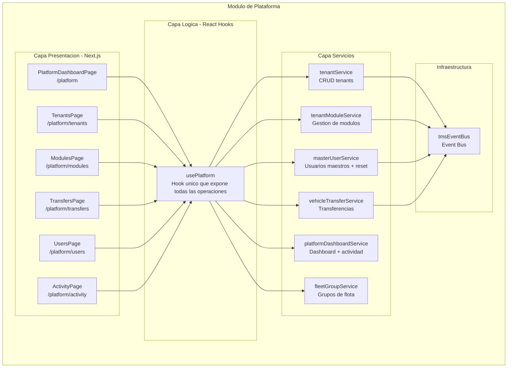

---

## 15. Diagrama de Despliegue

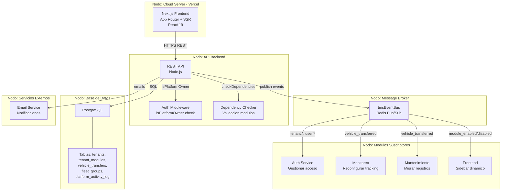

---

> **Nota:** Este documento es una referencia operativa para desarrollo frontend y backend. Incluye los 12 Casos de Uso exclusivos del Owner, con precondiciones, secuencia, postcondiciones y excepciones. Para detalles de implementacion frontend (componentes React, props, layouts), consultar el codigo fuente en `src/app/(dashboard)/platform/`, `src/hooks/usePlatform.ts`, y `src/services/platform.service.ts`.
