# Referencia Rapida — Modulo de Reportes
## TMS Navitel . Cheat Sheet para Desarrollo

> **Fecha:** Febrero 2026
> **Proposito:** Consulta rapida para desarrolladores. Gestion completa de reportes: definiciones, plantillas, generacion sincrona/asincrona, programacion automatica y datos precalculados operacionales/financieros.

---

## Indice

| # | Seccion |
|---|---------|
| 1 | [Contexto del Modulo](#1-contexto-del-modulo) |
| 2 | [Entidades del Dominio](#2-entidades-del-dominio) |
| 3 | [Modelo de Base de Datos — PostgreSQL](#3-modelo-de-base-de-datos--postgresql) |
| 4 | [Maquina de Estados — ReportStatus](#4-maquina-de-estados--reportstatus) |
| 5 | [Maquina de Estados — ScheduleFrequency](#5-maquina-de-estados--schedulefrequency) |
| 6 | [Catalogo de Tipos y Formatos](#6-catalogo-de-tipos-y-formatos) |
| 7 | [Tabla de Referencia Operativa de Transiciones](#7-tabla-de-referencia-operativa-de-transiciones) |
| 8 | [Casos de Uso — Referencia Backend](#8-casos-de-uso--referencia-backend) |
| 9 | [Endpoints API REST](#9-endpoints-api-rest) |
| 10 | [Eventos de Dominio](#10-eventos-de-dominio) |
| 11 | [Reglas de Negocio Clave](#11-reglas-de-negocio-clave) |
| 12 | [Catalogo de Errores HTTP](#12-catalogo-de-errores-http) |
| 13 | [Permisos RBAC](#13-permisos-rbac) |
| 14 | [Diagrama de Componentes](#14-diagrama-de-componentes) |
| 15 | [Diagrama de Despliegue](#15-diagrama-de-despliegue) |

---

# 1. Contexto del Modulo

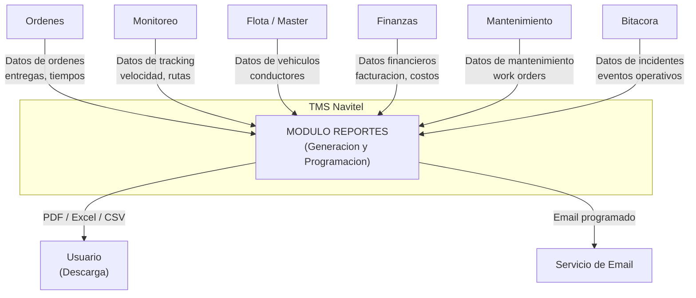

**Responsabilidades:** Gestionar el ciclo completo de reportes: definir estructuras de reporte (columnas, filtros, graficos), generar reportes bajo demanda (sincrono o asincrono), programar envios automaticos por email, y proveer datos precalculados operacionales y financieros. Soporta exportacion a PDF, Excel, CSV, JSON y HTML.

**Alcance:** Pagina `/reports` con cuatro vistas principales: catalogo de definiciones, historial de reportes generados, programaciones activas y dashboard de KPIs. El modulo consume datos de todos los demas modulos pero no los modifica.

---

# 2. Entidades del Dominio

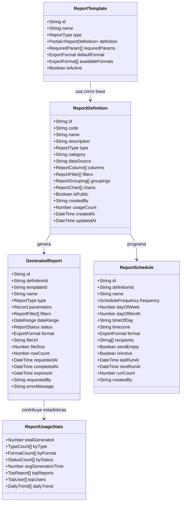

---

# 3. Modelo de Base de Datos — PostgreSQL

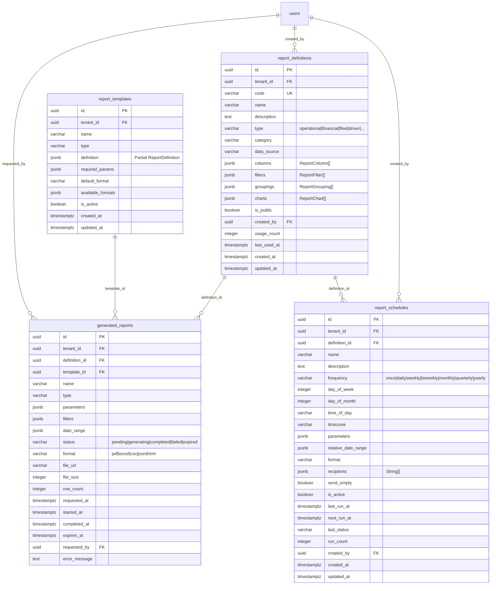

> **Nota multi-tenant:** Todas las consultas a tablas de reportes filtran por `tenant_id` del JWT. Las definiciones, plantillas, reportes generados y programaciones pertenecen al tenant del usuario. El `tenant_id` NO se envia en el body — se inyecta automaticamente en el backend.

---

# 4. Maquina de Estados — ReportStatus

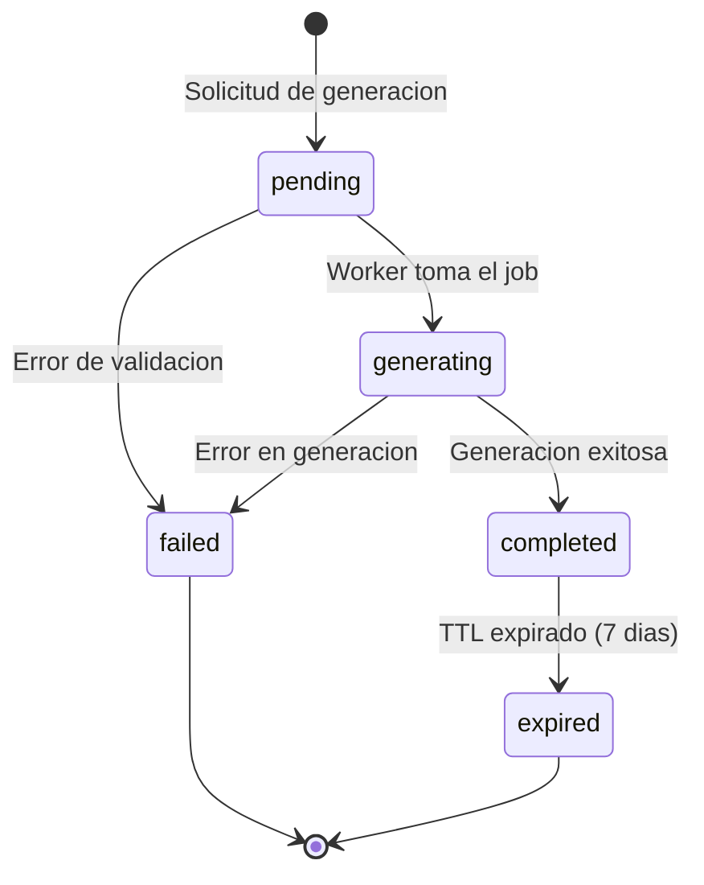

| Estado | Valor | Descripcion |
|--------|-------|-------------|
| Pendiente | `pending` | Reporte solicitado, esperando en cola de generacion |
| Generando | `generating` | Worker procesando el reporte (queries + renderizado) |
| Completado | `completed` | Reporte generado exitosamente, archivo disponible para descarga |
| Fallido | `failed` | Error durante la generacion (timeout, datos invalidos, error de sistema) |
| Expirado | `expired` | Archivo eliminado despues de TTL (7 dias por defecto) |

---

# 5. Maquina de Estados — ScheduleFrequency

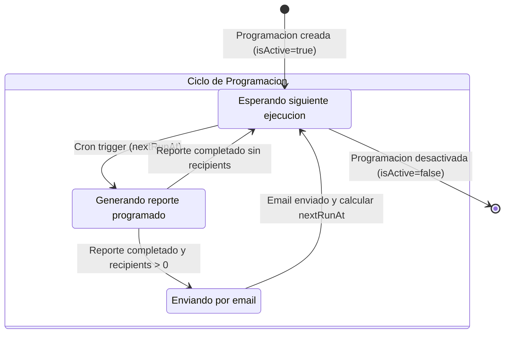

| Frecuencia | Valor | Descripcion | Calculo nextRunAt |
|------------|-------|-------------|-------------------|
| Una vez | `once` | Se ejecuta una sola vez | Fecha y hora especificada |
| Diario | `daily` | Todos los dias | Hoy + 1 dia a timeOfDay |
| Semanal | `weekly` | Cada semana | Proximo dayOfWeek a timeOfDay |
| Quincenal | `biweekly` | Cada 2 semanas | Proximo dayOfWeek + 14 dias |
| Mensual | `monthly` | Cada mes | Dia dayOfMonth del proximo mes |
| Trimestral | `quarterly` | Cada 3 meses | Primer dia del proximo trimestre |
| Anual | `yearly` | Cada ano | Misma fecha del proximo ano |

---

# 6. Catalogo de Tipos y Formatos

### Tipos de Reporte (ReportType)

| Tipo | Valor | Fuente principal | Descripcion |
|------|-------|-----------------|-------------|
| Operacional | `operational` | Ordenes + Monitoreo | Metricas de entregas, tiempos, utilizacion |
| Financiero | `financial` | Finanzas | Ingresos, costos, rentabilidad, facturacion |
| Flota | `fleet` | Master/Flota | Estado de vehiculos, KM recorridos |
| Conductores | `driver` | Master/Flota | Rendimiento por conductor |
| Clientes | `customer` | Ordenes + Finanzas | Entregas y facturacion por cliente |
| Ordenes | `order` | Ordenes | Detalle de ordenes por periodo |
| Rutas | `route` | Route Planner | Rutas planificadas vs ejecutadas |
| Mantenimiento | `maintenance` | Mantenimiento | Work orders, inspecciones, costos |
| Combustible | `fuel` | Flota | Consumo y costos de combustible |
| Incidentes | `incident` | Bitacora | Eventos operativos, desviaciones |
| Cumplimiento | `compliance` | Documentos + Flota | Vencimientos, habilitaciones |
| KPIs | `kpi` | Multi-modulo | Dashboard de indicadores |
| Personalizado | `custom` | Configurable | Reporte ad-hoc definido por usuario |

### Formatos de Exportacion (ExportFormat)

| Formato | Valor | Tipo MIME | Uso tipico |
|---------|-------|-----------|-----------|
| PDF | `pdf` | `application/pdf` | Reportes formales, envio por email |
| Excel | `excel` | `application/vnd.openxmlformats-officedocument.spreadsheetml.sheet` | Analisis, tablas dinamicas |
| CSV | `csv` | `text/csv` | Importacion a otros sistemas |
| JSON | `json` | `application/json` | Integracion API, automatizacion |
| HTML | `html` | `text/html` | Vista en navegador, intranet |

---

# 7. Tabla de Referencia Operativa de Transiciones

| # | Transicion | De | A | Actor(es) | Endpoint | Condiciones |
|---|-----------|-----|---|-----------|----------|-------------|
| T-01 | Solicitar generacion (sync) | (nuevo) | `completed` | Owner, Usuario Maestro, Subusuario (si tiene permiso `reports.generate`) | POST /api/reports/generate | `async=false`, definicion valida |
| T-02 | Solicitar generacion (async) | (nuevo) | `pending` | Owner, Usuario Maestro, Subusuario (si tiene permiso `reports.generate`) | POST /api/reports/generate | `async=true`, retorna ID para polling |
| T-03 | Iniciar procesamiento | `pending` | `generating` | Sistema (worker) | (interno) | Worker disponible en la cola |
| T-04 | Completar generacion | `generating` | `completed` | Sistema (worker) | (interno) | Archivo generado exitosamente |
| T-05 | Fallo en generacion | `generating` | `failed` | Sistema (worker) | (interno) | Timeout, error de datos, error de renderizado |
| T-06 | Fallo de validacion | `pending` | `failed` | Sistema | (interno) | Definicion invalida, permisos insuficientes |
| T-07 | Expirar reporte | `completed` | `expired` | Sistema (cron) | (interno) | TTL excedido (7 dias), archivo eliminado |
| T-08 | Ejecutar programacion | (schedule) | `pending` | Sistema (cron) | POST /api/reports/schedules/:id/run | nextRunAt alcanzado, isActive=true |

---

# 8. Casos de Uso — Referencia Backend

## CU-01: Listar Definiciones de Reporte

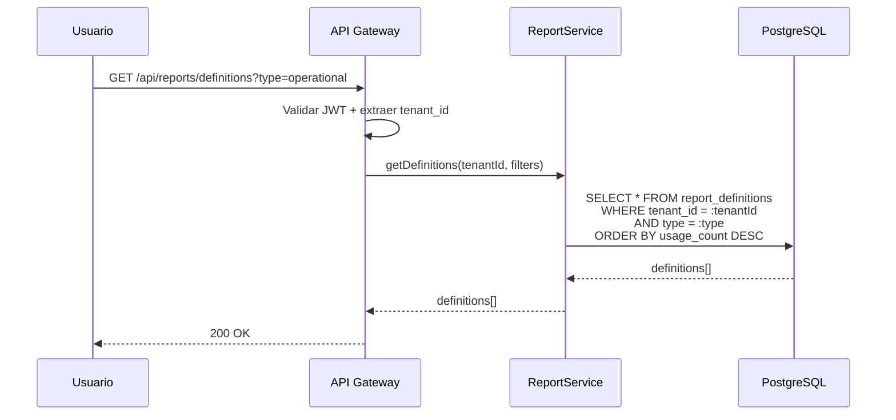

| Campo | Detalle |
|-------|---------|
| Nombre | Listar Definiciones de Reporte |
| Actor(es) | Owner, Usuario Maestro, Subusuario (si tiene permiso `reports.read`) |
| Precondiciones | PRE-01: Usuario autenticado con JWT valido. PRE-02: tenant_id extraido del token. |
| Flujo | 1. Usuario accede al catalogo de reportes. 2. Opcionalmente filtra por tipo, categoria o busqueda. 3. Se retornan definiciones ordenadas por uso. |
| Postcondiciones | Lista de definiciones de reporte disponibles |
| Excepciones | 401 si JWT invalido; 403 si sin permiso `reports.read` |

---

## CU-02: Crear Definicion de Reporte

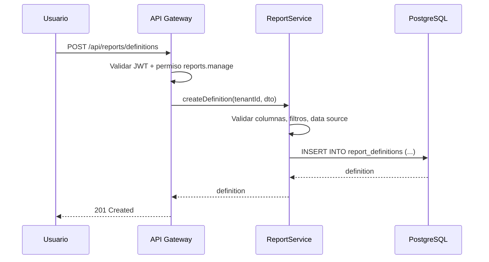

| Campo | Detalle |
|-------|---------|
| Nombre | Crear Definicion de Reporte |
| Actor(es) | Owner, Usuario Maestro, Subusuario (si tiene permiso `reports.manage`) |
| Precondiciones | PRE-01, PRE-02. |
| Flujo | 1. Usuario completa formulario de definicion (nombre, tipo, columnas, filtros). 2. Se valida estructura. 3. Se guarda la definicion. |
| Postcondiciones | Definicion de reporte creada |
| Excepciones | 422 si estructura invalida; 409 si codigo duplicado |

---

## CU-03: Generar Reporte

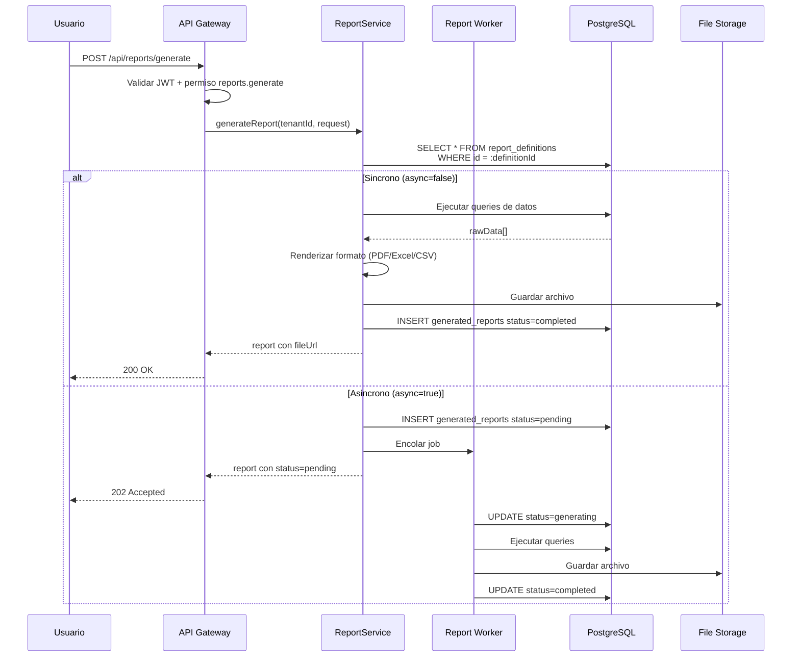

| Campo | Detalle |
|-------|---------|
| Nombre | Generar Reporte |
| Actor(es) | Owner, Usuario Maestro, Subusuario (si tiene permiso `reports.generate`) |
| Precondiciones | PRE-01, PRE-02. Definicion existe y es accesible. |
| Flujo | 1. Usuario selecciona definicion, parametros, formato. 2. Si sync: se genera y retorna inmediatamente. 3. Si async: se encola, retorna ID para polling. 4. Se guarda archivo con TTL de 7 dias. |
| Postcondiciones | Reporte generado (sync) o encolado (async) |
| Excepciones | 404 si definicion no existe; 422 si parametros invalidos; 500 si fallo en generacion |

---

## CU-04: Consultar Estado de Reporte Asincrono

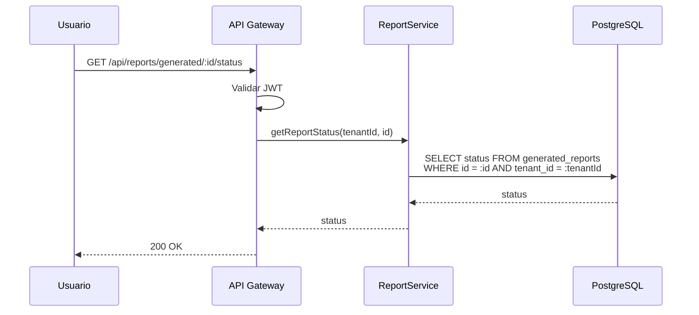

| Campo | Detalle |
|-------|---------|
| Nombre | Consultar Estado de Reporte Asincrono |
| Actor(es) | Owner, Usuario Maestro, Subusuario (si tiene permiso `reports.read`) |
| Precondiciones | PRE-01, PRE-02. Reporte existe en el tenant. |
| Flujo | 1. Frontend hace polling cada 2-5 segundos. 2. Retorna estado actual (pending/generating/completed/failed). |
| Postcondiciones | Estado actual del reporte |
| Excepciones | 404 si reporte no existe en el tenant |

---

## CU-05: Descargar Reporte

| Campo | Detalle |
|-------|---------|
| Nombre | Descargar Reporte Generado |
| Actor(es) | Owner, Usuario Maestro, Subusuario (si tiene permiso `reports.download`) |
| Precondiciones | PRE-01, PRE-02. Reporte en estado `completed`. |
| Flujo | 1. Usuario hace clic en descargar. 2. Se obtiene URL firmada del archivo. 3. Se inicia descarga. |
| Postcondiciones | Archivo descargado en formato solicitado |
| Excepciones | 404 si no existe; 410 si expirado; 409 si estado no es completed |

---

## CU-06: Crear Programacion de Reporte

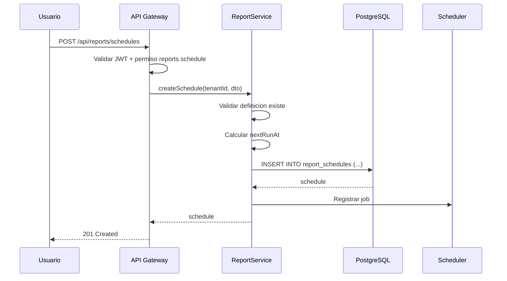

| Campo | Detalle |
|-------|---------|
| Nombre | Crear Programacion de Reporte |
| Actor(es) | Owner, Usuario Maestro, Subusuario (si tiene permiso `reports.schedule`) |
| Precondiciones | PRE-01, PRE-02. Definicion existe. Recipients son emails validos. |
| Flujo | 1. Usuario configura frecuencia, hora, recipients. 2. Se valida definicion. 3. Se calcula nextRunAt. 4. Se registra en scheduler. |
| Postcondiciones | Programacion creada y activa |
| Excepciones | 422 si frecuencia/hora invalida; 404 si definicion no existe |

---

## CU-07: Ejecutar Programacion Manualmente

| Campo | Detalle |
|-------|---------|
| Nombre | Ejecutar Programacion Manualmente |
| Actor(es) | Owner, Usuario Maestro, Subusuario (si tiene permiso `reports.schedule`) |
| Precondiciones | PRE-01, PRE-02. Programacion existe. |
| Flujo | 1. Usuario hace clic en "Ejecutar ahora". 2. Se genera reporte con los parametros de la programacion. 3. Se envia por email si hay recipients. |
| Postcondiciones | Reporte generado y opcionalmente enviado |
| Excepciones | 404 si programacion no existe |

---

## CU-08: Obtener Datos Operacionales Precalculados

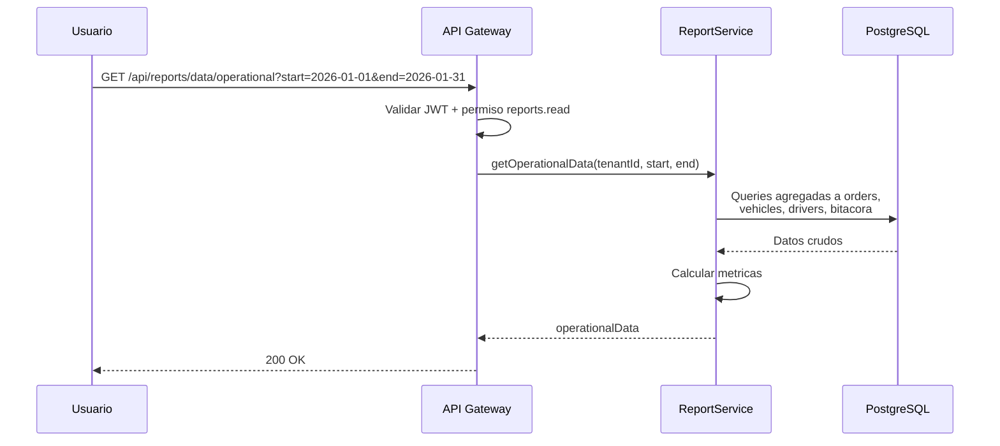

| Campo | Detalle |
|-------|---------|
| Nombre | Obtener Datos Operacionales Precalculados |
| Actor(es) | Owner, Usuario Maestro, Subusuario (si tiene permiso `reports.read`) |
| Precondiciones | PRE-01, PRE-02. Rango de fechas valido. |
| Flujo | 1. Se consultan ordenes, vehiculos, conductores e incidentes del periodo. 2. Se calculan metricas agregadas (completionRate, onTimeRate, utilizationRate, topDrivers). 3. Se retorna OperationalReportData. |
| Postcondiciones | Datos operacionales del periodo solicitado |
| Excepciones | 400 si rango de fechas invalido |

---

## CU-09: Obtener Datos Financieros Precalculados

| Campo | Detalle |
|-------|---------|
| Nombre | Obtener Datos Financieros Precalculados |
| Actor(es) | Owner, Usuario Maestro, Subusuario (si tiene permiso `reports.financial`) |
| Precondiciones | PRE-01, PRE-02. Rango de fechas valido. |
| Flujo | 1. Se consultan facturas, pagos, costos del periodo. 2. Se calculan: totalRevenue, revenueByService, totalCosts, grossProfit, netMargin. 3. Se compara con periodo anterior si aplica. |
| Postcondiciones | Datos financieros del periodo con comparacion |
| Excepciones | 400 si rango invalido; 403 si sin permiso `reports.financial` |

---

## CU-10: Ver Estadisticas de Uso de Reportes

| Campo | Detalle |
|-------|---------|
| Nombre | Ver Estadisticas de Uso de Reportes |
| Actor(es) | Owner, Usuario Maestro |
| Precondiciones | PRE-01, PRE-02. |
| Flujo | 1. Se calculan metricas de uso: total generados, por tipo, por formato, por estado. 2. Se identifican top reportes y top usuarios. 3. Se genera tendencia diaria de 7 dias. |
| Postcondiciones | Estadisticas completas de uso del modulo |
| Excepciones | 403 si Subusuario (solo Owner y Usuario Maestro pueden ver estadisticas de uso) |

---

# 9. Endpoints API REST

| ID | Metodo | Ruta | Descripcion | Roles | Request Body / Params | Response | CU |
|----|--------|------|-------------|-------|----------------------|----------|-----|
| E-01 | GET | `/api/reports/definitions` | Listar definiciones | Owner, UM, Sub (`reports.read`) | Query: `type`, `category`, `search` | `ReportDefinition[]` | CU-01 |
| E-02 | GET | `/api/reports/definitions/:id` | Obtener definicion por ID | Owner, UM, Sub (`reports.read`) | Path: `id` | `ReportDefinition` | CU-01 |
| E-03 | POST | `/api/reports/definitions` | Crear definicion | Owner, UM, Sub (`reports.manage`) | `CreateReportDefinitionDTO` | `ReportDefinition` | CU-02 |
| E-04 | PUT | `/api/reports/definitions/:id` | Actualizar definicion | Owner, UM, Sub (`reports.manage`) | `Partial<CreateReportDefinitionDTO>` | `ReportDefinition` | CU-02 |
| E-05 | DELETE | `/api/reports/definitions/:id` | Eliminar definicion | Owner, UM | Path: `id` | `204 No Content` | CU-02 |
| E-06 | GET | `/api/reports/definitions/categories` | Listar categorias | Owner, UM, Sub (`reports.read`) | (ninguno) | `string[]` | CU-01 |
| E-07 | GET | `/api/reports/templates` | Listar plantillas | Owner, UM, Sub (`reports.read`) | Query: `type` | `ReportTemplate[]` | CU-01 |
| E-08 | GET | `/api/reports/templates/:id` | Obtener plantilla por ID | Owner, UM, Sub (`reports.read`) | Path: `id` | `ReportTemplate` | CU-01 |
| E-09 | POST | `/api/reports/generate` | Generar reporte | Owner, UM, Sub (`reports.generate`) | `GenerateReportRequest` | `GeneratedReport` | CU-03 |
| E-10 | GET | `/api/reports/generated` | Listar reportes generados | Owner, UM, Sub (`reports.read`) | Query: `search`, `type`, `status`, `format`, `startDate`, `endDate`, `page`, `pageSize` | `{ data: GeneratedReport[], total }` | CU-04 |
| E-11 | GET | `/api/reports/generated/:id` | Obtener reporte por ID | Owner, UM, Sub (`reports.read`) | Path: `id` | `GeneratedReport` | CU-04 |
| E-12 | GET | `/api/reports/generated/:id/status` | Consultar estado | Owner, UM, Sub (`reports.read`) | Path: `id` | `ReportStatus` | CU-04 |
| E-13 | GET | `/api/reports/generated/:id/download` | Descargar reporte | Owner, UM, Sub (`reports.download`) | Path: `id` | `{ url, filename }` | CU-05 |
| E-14 | GET | `/api/reports/schedules` | Listar programaciones | Owner, UM, Sub (`reports.schedule`) | (ninguno) | `ReportSchedule[]` | CU-06 |
| E-15 | GET | `/api/reports/schedules/:id` | Obtener programacion | Owner, UM, Sub (`reports.schedule`) | Path: `id` | `ReportSchedule` | CU-06 |
| E-16 | POST | `/api/reports/schedules` | Crear programacion | Owner, UM, Sub (`reports.schedule`) | `CreateReportScheduleDTO` | `ReportSchedule` | CU-06 |
| E-17 | PUT | `/api/reports/schedules/:id` | Actualizar programacion | Owner, UM, Sub (`reports.schedule`) | `Partial<CreateReportScheduleDTO>` | `ReportSchedule` | CU-06 |
| E-18 | PATCH | `/api/reports/schedules/:id/toggle` | Activar/desactivar | Owner, UM, Sub (`reports.schedule`) | Path: `id` | `ReportSchedule` | CU-06 |
| E-19 | DELETE | `/api/reports/schedules/:id` | Eliminar programacion | Owner, UM | Path: `id` | `204 No Content` | CU-06 |
| E-20 | POST | `/api/reports/schedules/:id/run` | Ejecutar ahora | Owner, UM, Sub (`reports.schedule`) | Path: `id` | `GeneratedReport` | CU-07 |
| E-21 | GET | `/api/reports/data/operational` | Datos operacionales | Owner, UM, Sub (`reports.read`) | Query: `startDate`, `endDate` | `OperationalReportData` | CU-08 |
| E-22 | GET | `/api/reports/data/financial` | Datos financieros | Owner, UM, Sub (`reports.financial`) | Query: `startDate`, `endDate` | `FinancialReportData` | CU-09 |
| E-23 | GET | `/api/reports/usage-stats` | Estadisticas de uso | Owner, UM | (ninguno) | `ReportUsageStats` | CU-10 |

---

# 10. Eventos de Dominio

| ID | Evento | Trigger | Payload clave | Consumidor(es) |
|----|--------|---------|---------------|----------------|
| EV-01 | `report.generation.requested` | Se solicita generacion de reporte | `{ reportId, definitionId, format, tenantId }` | Worker de generacion |
| EV-02 | `report.generation.started` | Worker inicia procesamiento | `{ reportId, tenantId }` | Frontend (polling), Auditoria |
| EV-03 | `report.generation.completed` | Reporte generado exitosamente | `{ reportId, fileUrl, fileSize, rowCount, tenantId }` | Frontend, Email service |
| EV-04 | `report.generation.failed` | Error en generacion | `{ reportId, errorMessage, tenantId }` | Frontend, Auditoria |
| EV-05 | `report.schedule.executed` | Programacion ejecutada por cron | `{ scheduleId, reportId, tenantId }` | Auditoria, Email service |
| EV-06 | `report.schedule.created` | Nueva programacion creada | `{ scheduleId, frequency, tenantId }` | Scheduler, Auditoria |
| EV-07 | `report.expired` | Reporte alcanzo TTL | `{ reportId, tenantId }` | File cleanup service |
| EV-08 | `report.downloaded` | Usuario descarga reporte | `{ reportId, userId, tenantId }` | Auditoria, Usage stats |

---

# 11. Reglas de Negocio Clave

| ID | Regla | Detalle |
|----|-------|---------|
| R-01 | Multi-tenant obligatorio | Todas las queries filtran por `tenant_id` del JWT. Un tenant solo ve sus propias definiciones, reportes y programaciones. |
| R-02 | TTL de 7 dias para archivos generados | Los archivos de reportes completados se eliminan automaticamente despues de 7 dias. El registro permanece con status `expired`. |
| R-03 | Generacion asincrona para reportes grandes | Si el reporte tiene mas de 10,000 filas o multiples graficos, se recomienda generacion asincrona (`async=true`). |
| R-04 | Codigo de definicion unico por tenant | El campo `code` de ReportDefinition es unico dentro del tenant. No se permite duplicar codigos. |
| R-05 | Programaciones requieren definicion activa | Si se elimina una definicion, todas las programaciones asociadas se desactivan automaticamente. |
| R-06 | Recipients deben ser emails validos | Los recipients de una programacion deben ser direcciones de email con formato valido. Se valida en creacion y actualizacion. |
| R-07 | Reportes financieros requieren permiso especial | Acceder a datos financieros precalculados requiere `reports.financial`, un permiso separado de `reports.read`. |
| R-08 | Limite de reportes concurrentes | Un tenant puede tener maximo 5 reportes en estado `pending` o `generating` simultaneamente. |
| R-09 | Formato debe estar en availableFormats | Al generar desde plantilla, el formato solicitado debe estar en la lista `availableFormats` de la plantilla. |
| R-10 | sendEmpty controla envio sin datos | Si `sendEmpty=false` y el reporte no tiene filas, no se envia el email programado. |
| R-11 | Datos precalculados respetan permisos de modulos | Los datos operacionales requieren acceso a ordenes y flota. Los datos financieros requieren acceso al modulo de finanzas. |

---

# 12. Catalogo de Errores HTTP

| Codigo | Tipo | Detalle | Causa tipica |
|--------|------|---------|-------------- |
| 400 | Bad Request | Datos de entrada invalidos | Rango de fechas invalido, formato no soportado |
| 401 | Unauthorized | Token JWT ausente o expirado | Sesion expirada |
| 403 | Forbidden | Sin permiso para la accion | Subusuario sin permiso `reports.generate`, `reports.schedule`, etc. |
| 404 | Not Found | Recurso no encontrado | Definicion, reporte o programacion no existe en el tenant |
| 409 | Conflict | Conflicto de estado o unicidad | Codigo de definicion duplicado; limite de reportes concurrentes |
| 410 | Gone | Recurso ya no disponible | Reporte expirado, archivo eliminado |
| 422 | Unprocessable Entity | Datos logicamente invalidos | Columnas invalidas, data source no accesible, recipients invalidos |
| 500 | Internal Server Error | Error inesperado | Fallo en DB, timeout en queries de datos |
| 503 | Service Unavailable | Worker no disponible | Cola de generacion saturada |

---

# 13. Permisos RBAC

**Jerarquia de roles (modelo Edson):**

| Rol | Descripcion |
|-----|-------------|
| **Owner** | Proveedor/Super Admin del TMS. Acceso total a todas las funcionalidades de la plataforma y todos los tenants. |
| **Usuario Maestro** | Administrador del tenant (empresa cliente). Control total dentro de su empresa: gestiona usuarios, configura permisos, opera todos los modulos habilitados. |
| **Subusuario** | Operador con permisos configurables. Solo puede realizar las acciones que el Usuario Maestro le haya asignado explicitamente. |

**Leyenda de permisos:**

| Simbolo | Significado |
|---------|-------------|
| Si | Permitido |
| Configurable | Permitido si el Usuario Maestro le asigno el permiso al Subusuario |
| No | Denegado |

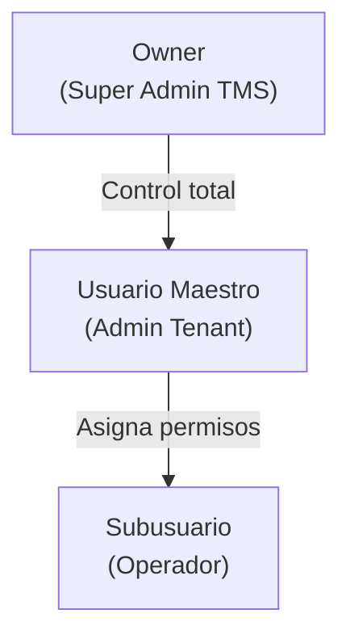

### Tabla de Permisos — Modulo Reportes

| Permiso | Recurso.Accion | Owner | Usuario Maestro | Subusuario |
|---------|---------------|-------|-----------------|------------|
| Ver definiciones y catalogo | `reports.read` | Si | Si | Configurable |
| Crear/editar definiciones | `reports.manage` | Si | Si | Configurable |
| Eliminar definiciones | `reports.delete` | Si | Si | No |
| Generar reportes | `reports.generate` | Si | Si | Configurable |
| Descargar reportes | `reports.download` | Si | Si | Configurable |
| Crear/editar programaciones | `reports.schedule` | Si | Si | Configurable |
| Eliminar programaciones | `reports.schedule_delete` | Si | Si | No |
| Acceder datos financieros | `reports.financial` | Si | Si | Configurable |
| Ver estadisticas de uso | `reports.usage_stats` | Si | Si | No |

> **Nota:** Los permisos de eliminacion (`reports.delete`, `reports.schedule_delete`) y estadisticas de uso (`reports.usage_stats`) no son configurables para Subusuario — solo Owner y Usuario Maestro pueden realizarlos.

---

# 14. Diagrama de Componentes

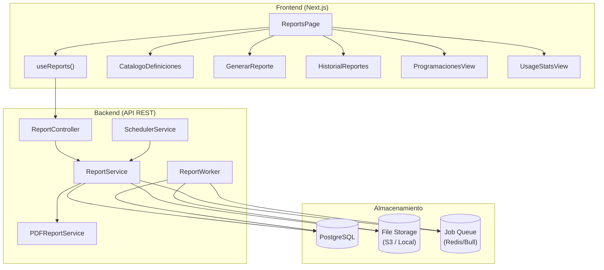

---

# 15. Diagrama de Despliegue

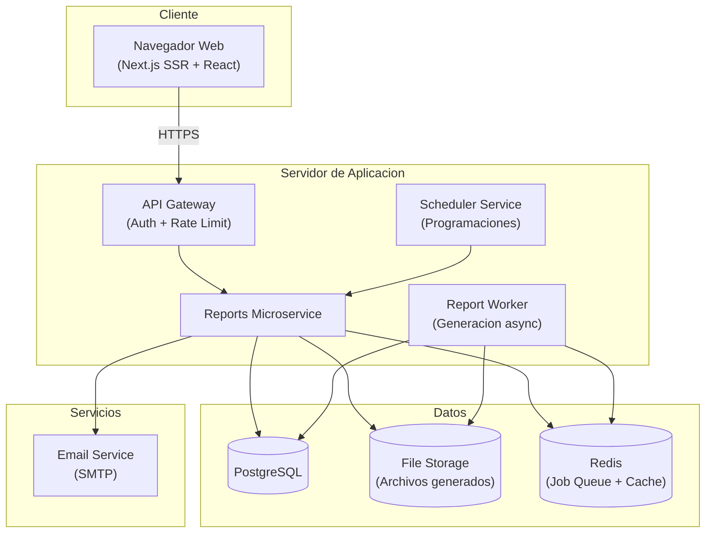

---

> **Nota final:** Este documento es una referencia operativa para desarrollo frontend y backend. El modulo de Reportes consume datos de todos los demas modulos pero no los modifica. Todos los endpoints requieren autenticacion via JWT y filtraje automatico por `tenant_id`. Para detalles de implementacion, consultar: `src/types/report.ts`, `src/services/report.service.ts`, `src/services/pdf-report.service.ts`, `src/hooks/useReports.ts`.
