# Referencia Rapida — Modulo Planificador de Rutas
## TMS Navitel · Cheat Sheet para Desarrollo

> **Basado en:** RFC_BACKEND_TMS_NAVITEL.md + Frontend src/types/route-planner.ts + src/contexts/route-planner-context.tsx + src/services/routing.service.ts + src/lib/mock-data/route-planner.ts
> **Fecha:** Febrero 2026
> **Proposito:** Consulta rapida para desarrolladores. Para detalle completo, ver el documento fuente.

---

## Indice

| # | Seccion |
|---|---------|
| 1 | [Contexto del Modulo](#1-contexto-del-modulo) |
| 2 | [Entidades del Dominio](#2-entidades-del-dominio) |
| 3 | [Modelo de Base de Datos — PostgreSQL](#3-modelo-de-base-de-datos--postgresql) |
| 4 | [Maquina de Estados — RouteStatus](#4-maquina-de-estados--routestatus) |
| 5 | [Maquina de Estados — RouteStopStatus](#5-maquina-de-estados--routestopstatus) |
| 6 | [Maquina de Estados — OrderStatus (Planificador)](#6-maquina-de-estados--orderstatus-planificador) |
| 7 | [Tabla de Referencia Operativa de Transiciones](#7-tabla-de-referencia-operativa-de-transiciones) |
| 8 | [Casos de Uso — Referencia Backend](#8-casos-de-uso--referencia-backend) |
| 9 | [Endpoints API REST](#9-endpoints-api-rest) |
| 10 | [Eventos de Dominio](#10-eventos-de-dominio) |
| 11 | [Reglas de Negocio Clave](#11-reglas-de-negocio-clave) |
| 12 | [Catalogo de Errores HTTP](#12-catalogo-de-errores-http) |
| 13 | [Permisos RBAC](#13-permisos-rbac) |
| 14 | [Diagrama de Componentes](#14-diagrama-de-componentes) |
| 15 | [Diagrama de Despliegue](#15-diagrama-de-despliegue) |

---

# 1. Contexto del Modulo

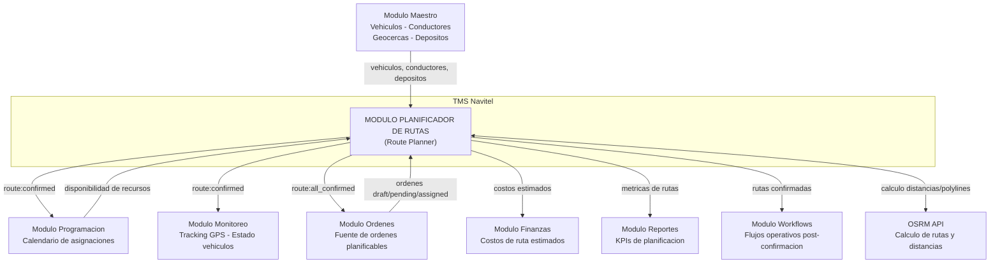

**Responsabilidades:** Seleccion y agrupacion de ordenes de transporte, configuracion de parametros de optimizacion (prioridad, ventanas de tiempo, cantidad de camiones), generacion de rutas optimizadas mediante clustering K-means++ y TSP con nearest-neighbor + 2-opt, calculo de metricas (distancia, duracion, costo, combustible, peajes), asignacion de vehiculo y conductor por ruta con validacion de capacidad, reordenamiento manual de paradas con recalculo de ETA, confirmacion individual y masiva con emision de eventos de dominio, integracion con OSRM para polylines reales, soporte para escenarios what-if, plantillas de rutas reutilizables, creacion manual de rutas, importacion/exportacion de ordenes via Excel.

---

# 2. Entidades del Dominio

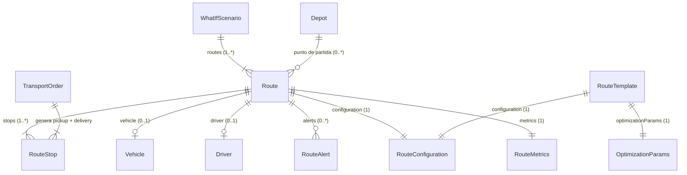

| Entidad | Tipo | Campos clave | Descripcion |
|---|---|---|---|
| **Route** | Raiz (aggregate root) | id, name, status, stops[], vehicle, driver, metrics, configuration, polyline, color, confirmedAt, alerts[] | Ruta optimizada con paradas secuenciadas, metricas calculadas y asignacion de recursos. |
| **RouteStop** | Sub-entidad | id, orderId, sequence, type, address, city, coordinates, estimatedArrival, timeWindow, duration, status | Parada en la ruta (pickup o delivery). Cada orden genera 2 stops. |
| **TransportOrder** | Entidad puente (VO) | id, orderNumber, client, pickup, delivery, cargo, status, priority, requestedDate, zone | Orden mapeada desde el modulo de ordenes para el planificador. |
| **Vehicle** | Referencia externa | id, plate, brand, model, year, capacity, fuelType, fuelConsumption, status, currentLocation, features | Vehiculo disponible para asignacion. Proviene del modulo maestro. |
| **Driver** | Referencia externa | id, firstName, lastName, phone, email, licenseNumber, licenseExpiry, rating, status, experience, specializations | Conductor disponible para asignacion. Proviene del modulo maestro. |
| **RouteAlert** | Value Object | id, type, severity, message, code | Alerta generada automaticamente al detectar problemas en la ruta. |
| **RouteConfiguration** | Value Object | avoidTolls, priority, considerTraffic, maxStops, timeBuffer | Configuracion de parametros de generacion de ruta. |
| **RouteMetrics** | Value Object | totalDistance, estimatedDuration, estimatedCost, fuelCost, tollsCost, totalWeight, totalVolume | Metricas calculadas de la ruta. |
| **OptimizationParams** | Value Object | timeWindowStart, timeWindowEnd, truckCount, stopDuration | Parametros de optimizacion multi-ruta. |
| **RouteAssignment** | Value Object | routeId, vehicle, driver | Asignacion de vehiculo y conductor a una ruta especifica. |
| **Depot** | Sub-entidad | id, name, address, city, coordinates, operatingHours | Deposito/almacen de partida para las rutas. |
| **VehicleRestrictions** | Value Object | maxHeight, maxWeight, hazmatClass, temperatureRequired, temperatureRange, requiresLiftGate | Restricciones del vehiculo para carga especial. |
| **WhatIfScenario** | Sub-entidad | id, name, configuration, optimizationParams, routes[], summary, createdAt | Escenario hipotetico para comparacion de configuraciones. |
| **RouteTemplate** | Sub-entidad | id, name, description, configuration, optimizationParams, defaultDepotId, tags, usageCount | Plantilla reutilizable de configuracion de rutas. |

### Campos clave de Route (resumen)

| Campo | Tipo | Obligatorio | Descripcion rapida |
|---|---|---|---|
| id | UUID | Si | PK, auto-generado |
| name | String | Si | Nombre descriptivo de la ruta (ej: "Ruta Lima Centro #1") |
| status | Enum | Si | 4 estados: draft, generated, confirmed, dispatched. Default: draft |
| stops | RouteStop[] | Si | Array de paradas ordenadas por secuencia. Min 2 paradas |
| vehicle | Vehicle | No | Vehiculo asignado. Se asigna en paso "assign" del wizard |
| driver | Driver | No | Conductor asignado. Se asigna en paso "assign" del wizard |
| metrics.totalDistance | Decimal | Si | Distancia total en km, calculada via OSRM o Haversine |
| metrics.estimatedDuration | Integer | Si | Duracion estimada en minutos (incluye paradas, buffer, trafico) |
| metrics.estimatedCost | Decimal | Si | Costo total estimado en USD (combustible + peajes + conductor) |
| metrics.fuelCost | Decimal | Si | Costo de combustible: distancia / fuelConsumption * precioGalon ($4.5) |
| metrics.tollsCost | Decimal | Si | Costo de peajes segun prioridad: speed=$0.15/km, cost=$0.05/km, balanced=$0.10/km |
| metrics.totalWeight | Decimal | Si | Peso total de la carga en kg |
| metrics.totalVolume | Decimal | Si | Volumen total de la carga en m3 |
| configuration | RouteConfiguration | Si | Configuracion usada para generar la ruta |
| polyline | [number, number][] | No | Array de coordenadas para trazar la ruta en el mapa |
| color | String (hex) | No | Color asignado del pool de 10 colores para visualizacion multi-ruta |
| confirmedAt | DateTime | No | Timestamp de confirmacion. Se llena al confirmar la ruta |
| alerts | RouteAlert[] | No | Alertas activas (capacidad excedida, riesgo de retraso, conflicto horario) |
| createdAt | DateTime | Si | Fecha de creacion |
| updatedAt | DateTime | Si | Fecha de ultima actualizacion |

### Campos clave de RouteStop

| Campo | Tipo | Obligatorio | Descripcion rapida |
|---|---|---|---|
| id | UUID | Si | PK, auto-generado |
| orderId | UUID FK | Si | Orden de transporte que genero esta parada |
| sequence | Integer | Si | Posicion en la ruta (1..N). Se actualiza al reordenar |
| type | Enum | Si | `pickup` o `delivery`. Precedencia: pickup antes que delivery de la misma orden |
| address | String | Si | Direccion legible de la parada |
| city | String | Si | Ciudad de la parada |
| coordinates | [lat, lng] | Si | Coordenadas WGS 84 |
| estimatedArrival | DateTime | No | ETA calculada secuencialmente: travelTime + stopDuration + timeBuffer |
| timeWindow | Object | No | `{ start: string, end: string }` — ventana horaria del cliente |
| duration | Integer | Si | Duracion de la parada en minutos (default: stopDuration del OptimizationParams) |
| status | Enum | Si | `pending`, `completed`, `skipped`. Default: pending |

### Campos clave de TransportOrder (mapeada desde Order)

| Campo | Tipo | Obligatorio | Descripcion rapida |
|---|---|---|---|
| id | UUID | Si | Heredado de Order.id |
| orderNumber | String | Si | Formato ORD-YYYY-NNNNN, heredado |
| client.name | String | Si | Nombre del cliente (de customer.name) |
| client.phone | String | Si | Telefono (de driver.phone o customer.email) |
| pickup | Object | Si | `{ address, city, coordinates, timeWindow? }` — del milestone type=origin |
| delivery | Object | Si | `{ address, city, coordinates, timeWindow? }` — del milestone type=destination |
| cargo.weight | Decimal | Si | Peso en kg |
| cargo.volume | Decimal | Si | Volumen en m3 |
| cargo.description | String | Si | Descripcion de la carga |
| cargo.requiresRefrigeration | Boolean | No | Si requiere cadena de frio |
| cargo.fragile | Boolean | No | Si la carga es fragil |
| status | Enum | Si | `pending`, `assigned`, `in_transit`, `delivered` (mapeado desde Order.status) |
| priority | Enum | Si | `high`, `medium`, `low` (mapeado desde Order.priority) |
| requestedDate | DateTime | Si | Fecha solicitada (de scheduledStartDate) |
| zone | String | Si | Zona inferida por ciudad: Lima Centro, Este, Norte, Sur, Callao, Arequipa, etc. |

---

# 3. Modelo de Base de Datos — PostgreSQL

> Esquema relacional para PostgreSQL + PostGIS. Todas las tablas usan `UUID` como PK y timestamps UTC. Filtrado multi-tenant obligatorio por `tenant_id`.

### Diagrama Entidad-Relacion

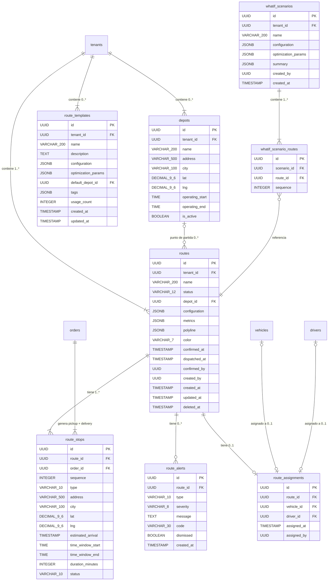

### Tablas, Columnas y Tipos de Dato

#### Tabla: `routes` (Entidad raiz)

> **Nota sobre `name`**: Se genera automaticamente por la capa de aplicacion con formato `"Ruta {Zone} #{N}"` al optimizar. El usuario puede renombrarlo despues.
>
> **Nota sobre `configuration` y `metrics`**: Se almacenan como JSONB para flexibilidad. La capa de aplicacion valida la estructura contra los interfaces `RouteConfiguration` y `RouteMetrics`.
>
> **Nota sobre `polyline`**: Array de coordenadas `[[lat, lng], ...]` obtenido de OSRM. Se almacena como JSONB. Si OSRM no esta disponible, se genera por interpolacion lineal entre paradas.
>
> **Nota sobre `color`**: Color hexadecimal del pool de 10 colores para visualizacion multi-ruta: `#3B82F6`, `#EF4444`, `#10B981`, `#F59E0B`, `#8B5CF6`, `#EC4899`, `#06B6D4`, `#84CC16`, `#F97316`, `#6366F1`.

| Columna | Tipo PostgreSQL | Nullable | Default | Constraint | Descripcion |
|---|---|---|---|---|---|
| id | `UUID` | NOT NULL | `gen_random_uuid()` | **PK** | Identificador unico |
| tenant_id | `UUID` | NOT NULL | — | **FK** -> tenants(id) | Multi-tenant obligatorio |
| name | `VARCHAR(200)` | NOT NULL | — | — | Nombre de la ruta |
| status | `VARCHAR(12)` | NOT NULL | `'draft'` | CHECK ('draft','generated','confirmed','dispatched') | Estado de la ruta |
| depot_id | `UUID` | NULL | — | **FK** -> depots(id) | Deposito de partida |
| configuration | `JSONB` | NOT NULL | `'{}'` | CHECK (octet_length(configuration::text) <= 4096) | RouteConfiguration serializada |
| metrics | `JSONB` | NOT NULL | `'{}'` | CHECK (octet_length(metrics::text) <= 4096) | RouteMetrics serializadas |
| polyline | `JSONB` | NULL | — | — | Array de coordenadas OSRM |
| color | `VARCHAR(7)` | NULL | — | CHECK (color ~ '^#[0-9A-Fa-f]{6}$') | Color hex para visualizacion |
| confirmed_at | `TIMESTAMPTZ` | NULL | — | — | Timestamp de confirmacion |
| confirmed_by | `UUID` | NULL | — | — | Usuario que confirmo (JWT `sub`) |
| dispatched_at | `TIMESTAMPTZ` | NULL | — | — | Timestamp de despacho |
| dispatched_by | `UUID` | NULL | — | — | Usuario que despacho (JWT `sub`) |
| planner_session_id | `UUID` | NULL | — | — | ID de sesion de planificacion (agrupa rutas generadas juntas) |
| created_at | `TIMESTAMPTZ` | NOT NULL | `NOW()` | — | Inmutable |
| updated_at | `TIMESTAMPTZ` | NOT NULL | `NOW()` | — | Se actualiza en cada write via trigger |
| created_by | `VARCHAR(100)` | NOT NULL | — | — | JWT `sub` claim. Sin FK a users |
| deleted_at | `TIMESTAMPTZ` | NULL | — | — | Soft delete. NULL = activa |
| deleted_by | `VARCHAR(100)` | NULL | — | — | Usuario que elimino |

#### Tabla: `route_stops` (Paradas de ruta)

| Columna | Tipo PostgreSQL | Nullable | Default | Constraint | Descripcion |
|---|---|---|---|---|---|
| id | `UUID` | NOT NULL | `gen_random_uuid()` | **PK** | ID de la parada |
| route_id | `UUID` | NOT NULL | — | **FK** -> routes(id) ON DELETE CASCADE | Ruta padre |
| order_id | `UUID` | NOT NULL | — | **FK** -> orders(id) | Orden de transporte que genera esta parada |
| sequence | `INTEGER` | NOT NULL | — | CHECK >= 1 | Posicion en la ruta |
| type | `VARCHAR(10)` | NOT NULL | — | CHECK ('pickup','delivery') | Tipo de parada |
| address | `VARCHAR(500)` | NOT NULL | — | — | Direccion legible |
| city | `VARCHAR(100)` | NOT NULL | — | — | Ciudad |
| lat | `DECIMAL(9,6)` | NOT NULL | — | CHECK -90..90 | Latitud WGS 84 |
| lng | `DECIMAL(9,6)` | NOT NULL | — | CHECK -180..180 | Longitud WGS 84 |
| estimated_arrival | `TIMESTAMPTZ` | NULL | — | — | ETA calculada |
| time_window_start | `TIME` | NULL | — | — | Inicio ventana horaria del cliente |
| time_window_end | `TIME` | NULL | — | — | Fin ventana horaria del cliente |
| duration_minutes | `INTEGER` | NOT NULL | `30` | CHECK 1..480 | Duracion de la parada en minutos |
| status | `VARCHAR(10)` | NOT NULL | `'pending'` | CHECK ('pending','completed','skipped') | Estado de la parada |
| UNIQUE | | | | (route_id, sequence) | No duplicar secuencia por ruta |

#### Tabla: `route_alerts` (Alertas de ruta)

| Columna | Tipo PostgreSQL | Nullable | Default | Constraint | Descripcion |
|---|---|---|---|---|---|
| id | `UUID` | NOT NULL | `gen_random_uuid()` | **PK** | ID de la alerta |
| route_id | `UUID` | NOT NULL | — | **FK** -> routes(id) ON DELETE CASCADE | Ruta padre |
| type | `VARCHAR(10)` | NOT NULL | — | CHECK ('warning','error','info') | Tipo de alerta |
| severity | `VARCHAR(8)` | NOT NULL | — | CHECK ('high','medium','low') | Severidad |
| message | `TEXT` | NOT NULL | — | — | Descripcion legible |
| code | `VARCHAR(30)` | NOT NULL | — | CHECK ('CAPACITY_EXCEEDED','DELAY_RISK','TRAFFIC_WARNING','TIME_WINDOW_CONFLICT','OTHER') | Codigo de la alerta |
| dismissed | `BOOLEAN` | NOT NULL | `false` | — | Si el usuario descarto la alerta |
| created_at | `TIMESTAMPTZ` | NOT NULL | `NOW()` | — | Timestamp de deteccion |

#### Tabla: `route_assignments` (Asignaciones vehiculo/conductor)

| Columna | Tipo PostgreSQL | Nullable | Default | Constraint | Descripcion |
|---|---|---|---|---|---|
| id | `UUID` | NOT NULL | `gen_random_uuid()` | **PK** | ID de la asignacion |
| route_id | `UUID` | NOT NULL | — | **FK** -> routes(id) ON DELETE CASCADE, **UNIQUE** | 1:1 con routes |
| vehicle_id | `UUID` | NULL | — | **FK** -> vehicles(id) | Vehiculo asignado |
| driver_id | `UUID` | NULL | — | **FK** -> drivers(id) | Conductor asignado |
| assigned_at | `TIMESTAMPTZ` | NOT NULL | `NOW()` | — | Timestamp de asignacion |
| assigned_by | `VARCHAR(100)` | NOT NULL | — | — | Usuario que asigno |

#### Tabla: `depots` (Depositos/almacenes)

| Columna | Tipo PostgreSQL | Nullable | Default | Constraint | Descripcion |
|---|---|---|---|---|---|
| id | `UUID` | NOT NULL | `gen_random_uuid()` | **PK** | ID del deposito |
| tenant_id | `UUID` | NOT NULL | — | **FK** -> tenants(id) | Multi-tenant |
| name | `VARCHAR(200)` | NOT NULL | — | — | Nombre del deposito |
| address | `VARCHAR(500)` | NOT NULL | — | — | Direccion legible |
| city | `VARCHAR(100)` | NOT NULL | — | — | Ciudad |
| lat | `DECIMAL(9,6)` | NOT NULL | — | CHECK -90..90 | Latitud WGS 84 |
| lng | `DECIMAL(9,6)` | NOT NULL | — | CHECK -180..180 | Longitud WGS 84 |
| operating_start | `TIME` | NOT NULL | `'06:00'` | — | Inicio de operaciones |
| operating_end | `TIME` | NOT NULL | `'22:00'` | — | Fin de operaciones |
| is_active | `BOOLEAN` | NOT NULL | `true` | — | Si esta activo |
| created_at | `TIMESTAMPTZ` | NOT NULL | `NOW()` | — | Fecha de creacion |
| updated_at | `TIMESTAMPTZ` | NOT NULL | `NOW()` | — | Fecha de actualizacion |

#### Tabla: `route_templates` (Plantillas de ruta)

| Columna | Tipo PostgreSQL | Nullable | Default | Constraint | Descripcion |
|---|---|---|---|---|---|
| id | `UUID` | NOT NULL | `gen_random_uuid()` | **PK** | ID de la plantilla |
| tenant_id | `UUID` | NOT NULL | — | **FK** -> tenants(id) | Multi-tenant |
| name | `VARCHAR(200)` | NOT NULL | — | — | Nombre de la plantilla |
| description | `TEXT` | NULL | — | CHECK char_length <= 1000 | Descripcion |
| configuration | `JSONB` | NOT NULL | — | — | RouteConfiguration serializada |
| optimization_params | `JSONB` | NOT NULL | — | — | OptimizationParams serializados |
| default_depot_id | `UUID` | NULL | — | **FK** -> depots(id) | Deposito por defecto |
| tags | `JSONB` | NOT NULL | `'[]'` | — | Array de strings |
| usage_count | `INTEGER` | NOT NULL | `0` | CHECK >= 0 | Contador de uso |
| created_at | `TIMESTAMPTZ` | NOT NULL | `NOW()` | — | Inmutable |
| updated_at | `TIMESTAMPTZ` | NOT NULL | `NOW()` | — | Se actualiza en cada write |

#### Tabla: `whatif_scenarios` (Escenarios hipoteticos)

| Columna | Tipo PostgreSQL | Nullable | Default | Constraint | Descripcion |
|---|---|---|---|---|---|
| id | `UUID` | NOT NULL | `gen_random_uuid()` | **PK** | ID del escenario |
| tenant_id | `UUID` | NOT NULL | — | **FK** -> tenants(id) | Multi-tenant |
| name | `VARCHAR(200)` | NOT NULL | — | — | Nombre del escenario |
| configuration | `JSONB` | NOT NULL | — | — | RouteConfiguration usada |
| optimization_params | `JSONB` | NOT NULL | — | — | OptimizationParams usados |
| summary | `JSONB` | NOT NULL | — | — | Resumen: totalDistance, totalDuration, totalCost, totalRoutes, avgStopsPerRoute |
| created_by | `VARCHAR(100)` | NOT NULL | — | — | JWT `sub` |
| created_at | `TIMESTAMPTZ` | NOT NULL | `NOW()` | — | Inmutable |

#### Tabla: `whatif_scenario_routes` (Rutas de escenarios)

| Columna | Tipo PostgreSQL | Nullable | Default | Constraint | Descripcion |
|---|---|---|---|---|---|
| id | `UUID` | NOT NULL | `gen_random_uuid()` | **PK** | ID |
| scenario_id | `UUID` | NOT NULL | — | **FK** -> whatif_scenarios(id) ON DELETE CASCADE | Escenario padre |
| route_id | `UUID` | NOT NULL | — | **FK** -> routes(id) | Ruta del escenario |
| sequence | `INTEGER` | NOT NULL | — | CHECK >= 1 | Orden de la ruta en el escenario |
| UNIQUE | | | | (scenario_id, sequence) | No duplicar secuencia |

### Indices Recomendados

| Tabla | Indice | Columnas | Tipo | Justificacion |
|---|---|---|---|---|
| routes | idx_routes_tenant_status | tenant_id, status | B-tree | Filtro principal multi-tenant. **Parcial:** `WHERE deleted_at IS NULL` |
| routes | idx_routes_session | planner_session_id | B-tree | Agrupar rutas de una misma sesion de planificacion |
| routes | idx_routes_confirmed | confirmed_at DESC | B-tree | Listado de rutas confirmadas. **Parcial:** `WHERE status = 'confirmed'` |
| routes | idx_routes_created | created_at DESC | B-tree | Ordenamiento por defecto. **Parcial:** `WHERE deleted_at IS NULL` |
| route_stops | idx_stops_route_seq | route_id, sequence | B-tree UNIQUE | Lookup + orden secuencial |
| route_stops | idx_stops_order | order_id | B-tree | Buscar en que ruta esta una orden |
| route_stops | idx_stops_coords | lat, lng | B-tree | Busqueda espacial basica |
| route_alerts | idx_alerts_route | route_id | B-tree | Lookup de alertas por ruta |
| route_alerts | idx_alerts_active | route_id, dismissed | B-tree | Alertas no descartadas. **Parcial:** `WHERE dismissed = false` |
| route_assignments | idx_assignments_route | route_id | B-tree UNIQUE | 1:1 rapido |
| route_assignments | idx_assignments_vehicle | vehicle_id | B-tree | Verificar unicidad de vehiculo |
| route_assignments | idx_assignments_driver | driver_id | B-tree | Verificar unicidad de conductor |
| depots | idx_depots_tenant | tenant_id, is_active | B-tree | Listado de depositos activos |
| route_templates | idx_templates_tenant | tenant_id | B-tree | Listado de plantillas por tenant |

### Relaciones con Tablas de Otros Modulos (FK externas)

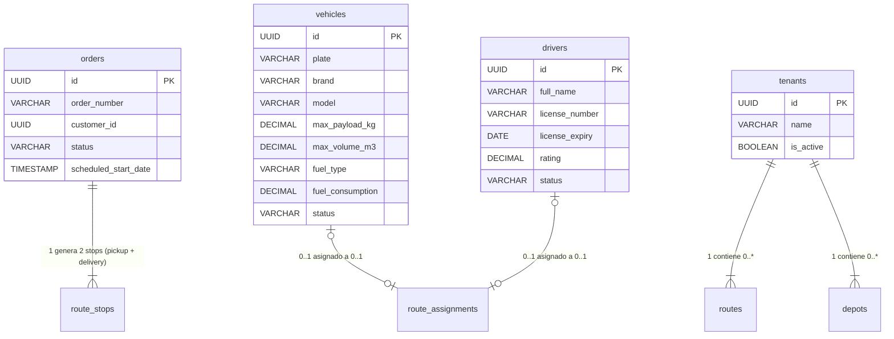

---

# 4. Maquina de Estados — RouteStatus

**4 estados, 5 transiciones, 1 estado terminal (dispatched)**

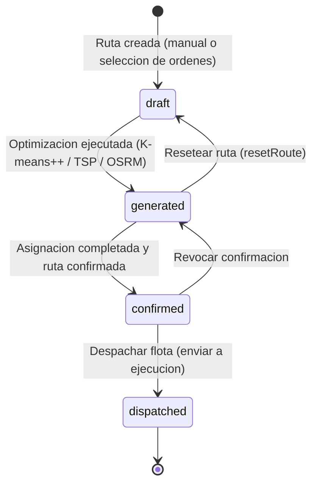

### Tabla de estados con colores

| # | Estado | Etiqueta | Color | Icono | Terminal | Transiciones de salida |
|---|---|---|---|---|---|---|
| 1 | draft | Borrador | #6B7280 gris | FileEdit | No | generated |
| 2 | generated | Generada | #3B82F6 azul | Route | No | confirmed, draft |
| 3 | confirmed | Confirmada | #10B981 verde | CheckCircle | No | dispatched, generated |
| 4 | dispatched | Despachada | #1F2937 gris oscuro | Truck | Si | ninguna |

---

# 5. Maquina de Estados — RouteStopStatus

**3 estados para paradas de ruta**

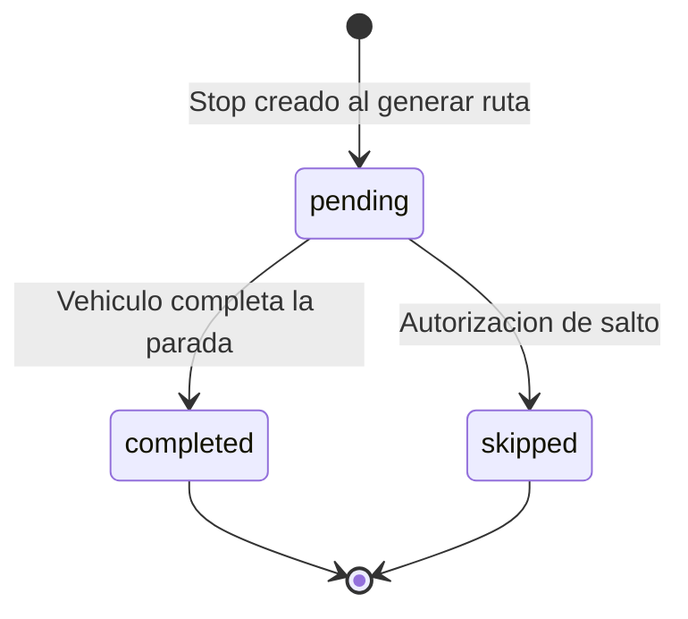

### Tabla de estados

| # | Estado | Etiqueta | Color | Descripcion |
|---|---|---|---|---|
| 1 | pending | Pendiente | #F59E0B ambar | Parada aun no visitada |
| 2 | completed | Completada | #10B981 verde | Vehiculo visito y completo la parada |
| 3 | skipped | Saltada | #6B7280 gris | Parada omitida con autorizacion |

---

# 6. Maquina de Estados — OrderStatus (Planificador)

**4 estados para ordenes dentro del contexto del planificador**

> Estos estados son un subconjunto mapeado desde `Order.status` del modulo de ordenes. La funcion `mapStatus()` en `order-to-transport-order.ts` realiza la conversion.

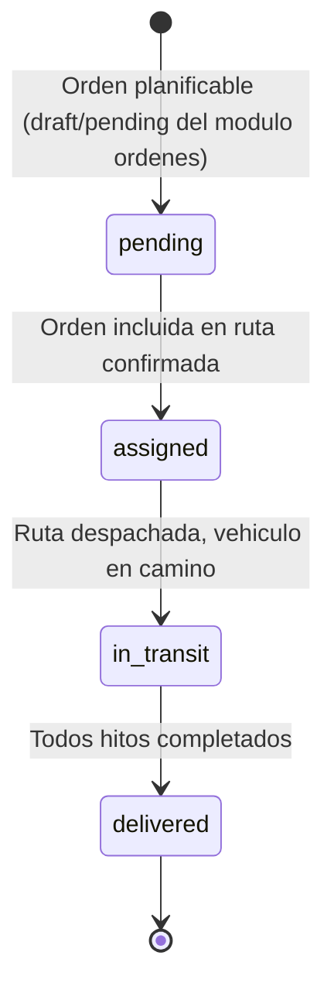

### Mapeo de estados Order -> TransportOrder

| Order.status (modulo ordenes) | TransportOrder.status (planificador) | Planificable |
|---|---|---|
| draft | pending | Si |
| pending | pending | Si |
| assigned | assigned | Si |
| in_transit | in_transit | No |
| at_milestone | in_transit | No |
| delayed | in_transit | No |
| completed | delivered | No |
| closed | delivered | No |
| cancelled | pending (descartado en filtro) | No |

---

# 7. Tabla de Referencia Operativa de Transiciones

> Tabla unificada que cruza: estado origen/destino, endpoint, payload, validaciones, actor, evento emitido e idempotencia.

| # | From | To | Endpoint | Payload | Validaciones | Actor | Evento | Idempotente |
|---|---|---|---|---|---|---|---|---|
| T-01 | draft | generated | POST /routing/optimize | `RouteOptimizationRequest { orders[], params, config, depotCoordinates?, vehicleIds? }` | orders.length >= 1, params.truckCount >= 1 && <= 10, timeWindowStart < timeWindowEnd, stopDuration >= 5 && <= 120 | Owner / Usuario Maestro / Subusuario (route_planner:create) | route.generated | No (genera IDs nuevos) |
| T-02 | generated | confirmed | PATCH /routes/:id/confirm | `{ vehicleId?: string, driverId?: string }` | route.status === 'generated', vehiculo disponible (status=available), conductor disponible (status=available), vehiculo no asignado a otra ruta activa, conductor no asignado a otra ruta activa | Owner / Usuario Maestro / Subusuario (route_planner:confirm) | route:confirmed | Si |
| T-03 | generated | draft | PATCH /routes/:id/reset | `{}` | route.status === 'generated' | Owner / Usuario Maestro / Subusuario (route_planner:edit) | — | Si |
| T-04 | confirmed | dispatched | PATCH /routes/:id/dispatch | `{}` | route.status === 'confirmed', vehicleId != null, driverId != null, no alertas severity=high sin resolver | Owner / Usuario Maestro / Subusuario (route_planner:dispatch) | route:dispatched | Si |
| T-05 | confirmed | generated | PATCH /routes/:id/revoke | `{}` | route.status === 'confirmed' | Owner / Usuario Maestro | route.revoked | Si |
| T-06 | — | — | POST /routing/optimize (masivo) | `RouteOptimizationRequest` (mismos campos) | Mismas validaciones que T-01. Genera N rutas segun truckCount. Ejecuta K-means++ clustering + NN-TSP + 2-opt por cluster | Owner / Usuario Maestro / Subusuario (route_planner:create) | route.batch_generated | No |
| T-07 | — | confirmed (todas) | POST /routes/confirm-all | `{ routeIds: string[] }` | Todas las rutas en status 'generated', vehiculos y conductores asignados a cada ruta, sin duplicados de vehiculo/conductor entre rutas | Owner / Usuario Maestro | route:all_confirmed | Si |
| T-08 | generated | generated | PATCH /routes/:id/stops/reorder | `{ stops: RouteStop[] }` | route.status === 'generated', stops.length >= 2, restriccion pickup antes de delivery por orden, sequences consecutivas | Owner / Usuario Maestro / Subusuario (route_planner:edit) | route.stops_reordered | Si |
| T-09 | generated | generated | PATCH /routes/:id/assign | `{ vehicleId?: string, driverId?: string }` | route.status === 'generated', vehiculo disponible, conductor disponible, capacidad del vehiculo >= totalWeight y totalVolume de la ruta | Owner / Usuario Maestro / Subusuario (route_planner:edit) | route.assigned | Si |
| T-10 | — | — | POST /routes/manual | `{ stops: CreateRouteStopDTO[], configuration: RouteConfiguration }` | stops.length >= 2, coordenadas validas (lat -90..90, lng -180..180), duration >= 1 | Owner / Usuario Maestro / Subusuario (route_planner:create) | route.manual_created | No |
| T-11 | — | — | GET /routes/:id/calculate | Query params: `?recalculate=true` | route existe, stops.length >= 2 | Owner / Usuario Maestro / Subusuario (route_planner:read) | — | Si |
| T-12 | — | — | POST /routing/geocode | `{ query: string }` | query.length >= 3 | Owner / Usuario Maestro / Subusuario (route_planner:read) | — | Si |

> **Restriccion T-05:** Revocar confirmacion de una ruta es accion administrativa. Solo **Owner** o **Usuario Maestro**. Subusuario NO tiene acceso a esta transicion.
> **Restriccion T-07:** Confirmacion masiva compromete multiples recursos simultaneamente. Solo **Owner** o **Usuario Maestro**.

### Diagrama de flujo de transiciones con endpoints

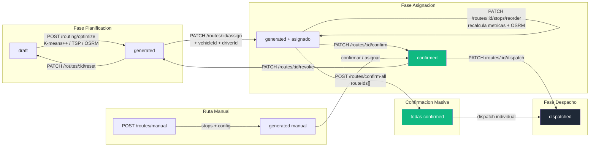

---

# 8. Casos de Uso — Referencia Backend

> **9 Casos de Uso UML** con precondiciones, flujo principal, excepciones y postcondiciones. Cada CU indica quien ejecuta, que endpoint consume, que debe validar el backend y que debe devolver.

### Matriz Actor x Caso de Uso

> **Modelo de 3 roles (definicion Edson):** Owner (Super Admin TMS), Usuario Maestro (Admin de cuenta cliente), Subusuario (Operador con permisos configurables).
> **Leyenda:** ✅ = Permitido | ⚙️ = Permitido si el Usuario Maestro le asigno el permiso | ❌ = Denegado

| Caso de Uso | Owner | Usuario Maestro | Subusuario | Sistema OSRM |
|---|:---:|:---:|:---:|:---:|
| **CU-01** Seleccionar Ordenes para Planificacion | ✅ | ✅ | ⚙️ `route_planner:read` | — |
| **CU-02** Configurar Parametros de Optimizacion | ✅ | ✅ | ⚙️ `route_planner:create` | — |
| **CU-03** Generar Rutas Optimizadas | ✅ | ✅ | ⚙️ `route_planner:create` | ✅ (auto) |
| **CU-04** Reordenar Paradas Manualmente | ✅ | ✅ | ⚙️ `route_planner:edit` | ✅ (recalc) |
| **CU-05** Asignar Vehiculo y Conductor a Ruta | ✅ | ✅ | ⚙️ `route_planner:edit` | — |
| **CU-06** Confirmar Ruta Individual | ✅ | ✅ | ⚙️ `route_planner:confirm` | — |
| **CU-07** Confirmar Todas las Rutas | ✅ | ✅ | ❌ | — |
| **CU-08** Crear Ruta Manual | ✅ | ✅ | ⚙️ `route_planner:create` | ✅ (polyline) |
| **CU-09** Despachar Ruta | ✅ | ✅ | ⚙️ `route_planner:dispatch` | — |

> **Restriccion CU-07:** Solo **Owner** y **Usuario Maestro** pueden confirmar todas las rutas de golpe, ya que involucra compromiso de multiples recursos simultaneamente. Los Subusuarios NO pueden ejecutar confirmacion masiva independientemente de sus permisos.
> **Nota:** Los permisos del Subusuario son configurables por el Usuario Maestro. Un Subusuario sin el permiso correspondiente recibira HTTP `403 FORBIDDEN`.

---

## CU-01: Seleccionar Ordenes para Planificacion

| Atributo | Valor |
|---|---|
| **Endpoint** | `GET /api/v1/orders?status=draft,pending,assigned` |
| **Actor Principal** | Owner / Usuario Maestro / Subusuario (permiso `route_planner:read`) |
| **Actor Secundario** | Mapper `ordersToTransportOrders()`, Validacion de milestones |
| **Trigger** | El operador ingresa al paso "Seleccionar" del wizard (PlannerStep = "select") |
| **Frecuencia** | 5-15 veces/dia |

**Precondiciones (backend DEBE validar)**

| # | Precondicion | Si no se cumple |
|---|---|---|
| PRE-01 | Token JWT valido y no expirado | HTTP `401 UNAUTHORIZED` |
| PRE-02 | Usuario tiene permiso `route_planner:read` | HTTP `403 FORBIDDEN` |
| PRE-03 | Existen ordenes con status `draft`, `pending` o `assigned` en el tenant | Retorna array vacio (no es error) |

**Request Body**

> No aplica — es un endpoint GET con query params.

| Campo (query) | Tipo | Obligatorio | Descripcion |
|---|---|---|---|
| status | string[] | Si | Filtro: `draft,pending,assigned` |
| zone | string | No | Filtro por zona geografica |
| dateFrom | string ISO | No | Fecha inicio rango |
| dateTo | string ISO | No | Fecha fin rango |
| priority | string[] | No | Filtro por prioridad: `high,medium,low` |
| search | string | No | Busqueda por orderNumber o nombre de cliente |

**Secuencia Backend (flujo principal)**

| Paso | Accion del backend | Detalle |
|---|---|---|
| 1 | Validar token JWT y permisos | Si no valido -> 401/403 |
| 2 | Consultar ordenes con filtros aplicados | `SELECT * FROM orders WHERE status IN ('draft','pending','assigned') AND tenant_id = :tenantId AND deleted_at IS NULL` |
| 3 | Incluir milestones de cada orden (JOIN) | Necesarios para extraer origin/destination |
| 4 | Ejecutar mapper `ordersToTransportOrders()` | Filtra solo ordenes que tengan milestone origin Y destination. Descarta ordenes sin ambos milestones |
| 5 | Inferir zona por ciudad de destino | Mapeo: Lima->Lima Centro, SJL->Lima Este, Comas->Lima Norte, VMT->Lima Sur, Callao->Callao, etc. |
| 6 | Retornar array de `TransportOrder[]` | Con campos: id, orderNumber, client, pickup, delivery, cargo, status, priority, requestedDate, zone |

**Postcondiciones (backend DEBE garantizar)**

| # | Postcondicion | Verificacion |
|---|---|---|
| POST-01 | Solo se retornan ordenes planificables (draft/pending/assigned) | Verificar status de cada item |
| POST-02 | Cada TransportOrder tiene pickup Y delivery con coordenadas validas | coordinates != null |
| POST-03 | Campo `zone` inferido para cada orden | zone != null |

**Excepciones**

| HTTP | Codigo | Cuando | Respuesta |
|---|---|---|---|
| `401` | UNAUTHORIZED | Token JWT ausente o expirado | `{ error: { code, message } }` |
| `403` | FORBIDDEN | Sin permisos para route_planner | `{ error: { code, message } }` |
| `500` | INTERNAL_ERROR | Error inesperado al consultar ordenes | `{ error: { code, message } }` |

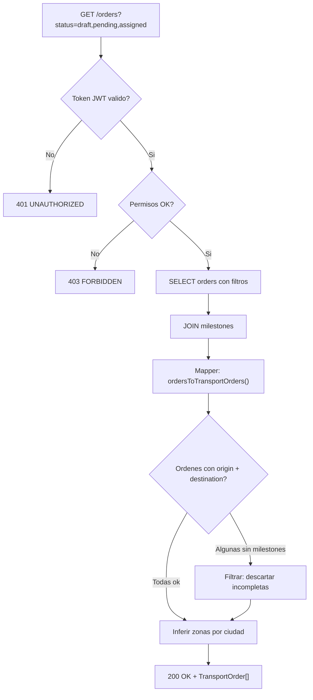

---

## CU-02: Configurar Parametros de Optimizacion

| Atributo | Valor |
|---|---|
| **Endpoint** | `POST /api/v1/routing/configure` (o en memoria del frontend antes de CU-03) |
| **Actor Principal** | Owner / Usuario Maestro / Subusuario (permiso `route_planner:create`) |
| **Actor Secundario** | Validacion Zod |
| **Trigger** | El operador ajusta parametros en el paso "Configurar" del wizard (PlannerStep = "configure") |
| **Frecuencia** | 5-15 veces/dia |

**Precondiciones (backend DEBE validar)**

| # | Precondicion | Si no se cumple |
|---|---|---|
| PRE-01 | Token JWT valido y no expirado | HTTP `401 UNAUTHORIZED` |
| PRE-02 | Usuario tiene permiso `route_planner:create` | HTTP `403 FORBIDDEN` |
| PRE-03 | `params.truckCount` entre 1 y 10 | HTTP `400 VALIDATION_ERROR` |
| PRE-04 | `params.stopDuration` entre 5 y 120 minutos | HTTP `400 VALIDATION_ERROR` |
| PRE-05 | `params.timeWindowStart < params.timeWindowEnd` | HTTP `400 VALIDATION_ERROR` |

**Request Body — ConfigureOptimizationDTO**

| Campo | Tipo | Obligatorio | Validacion |
|---|---|---|---|
| priority | enum | Si | `speed`, `cost`, `balanced` |
| avoidTolls | boolean | Si | — |
| considerTraffic | boolean | Si | — |
| timeBuffer | integer | Si | 0-30 minutos |
| timeWindowStart | string | Si | Formato `HH:mm`, ej: "08:00" |
| timeWindowEnd | string | Si | Formato `HH:mm`, ej: "18:00" |
| truckCount | integer | Si | 1-10 |
| stopDuration | integer | Si | 5-120 minutos |
| maxStops | integer | No | Maximo de paradas por ruta |

**Secuencia Backend (flujo principal)**

| Paso | Accion del backend | Detalle |
|---|---|---|
| 1 | Validar DTO con `optimizationConfigSchema` (Zod) | Validar todos los campos |
| 2 | Verificar coherencia de ventana temporal | timeWindowStart < timeWindowEnd |
| 3 | Verificar que truckCount no exceda vehiculos disponibles | Consultar vehiculos con `status = 'available'` |
| 4 | Almacenar configuracion en sesion de planificacion | Asociar a `planner_session_id` |
| 5 | Si se envia `maxStops`: validar >= 2 | Minimo 2 paradas por ruta (1 pickup + 1 delivery) |
| 6 | Retornar HTTP `200 OK` con configuracion validada | RouteConfiguration + OptimizationParams |

**Postcondiciones (backend DEBE garantizar)**

| # | Postcondicion | Verificacion |
|---|---|---|
| POST-01 | Configuracion almacenada y lista para optimizacion | Disponible para CU-03 |
| POST-02 | Parametros validados contra rangos permitidos | truckCount 1-10, stopDuration 5-120 |

**Excepciones**

| HTTP | Codigo | Cuando | Respuesta |
|---|---|---|---|
| `400` | VALIDATION_ERROR | Parametros fuera de rango | `{ error: { code, message, details: { campo: "mensaje" } } }` |
| `400` | INVALID_TIME_WINDOW | timeWindowStart >= timeWindowEnd | `{ error: { code, message } }` |
| `422` | INSUFFICIENT_VEHICLES | truckCount > vehiculos disponibles | `{ error: { code, message, details: { available: N, requested: M } } }` |

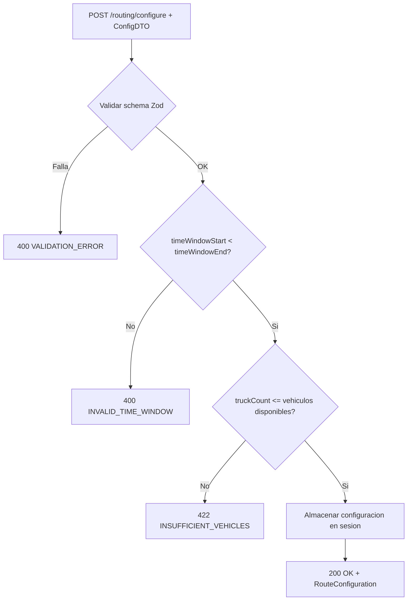

---

## CU-03: Generar Rutas Optimizadas

| Atributo | Valor |
|---|---|
| **Endpoint** | `POST /api/v1/routing/optimize` |
| **Actor Principal** | Owner / Usuario Maestro / Subusuario (permiso `route_planner:create`) |
| **Actor Secundario** | OSRM API (calculo de polylines y distancias reales), Motor de clustering K-means++ |
| **Trigger** | El operador presiona "Generar Rutas" con ordenes seleccionadas y parametros configurados |
| **Frecuencia** | 5-15 veces/dia |

**Precondiciones (backend DEBE validar)**

| # | Precondicion | Si no se cumple |
|---|---|---|
| PRE-01 | Token JWT valido y no expirado | HTTP `401 UNAUTHORIZED` |
| PRE-02 | Usuario tiene permiso `route_planner:create` | HTTP `403 FORBIDDEN` |
| PRE-03 | `orders.length >= 1` (al menos 1 orden seleccionada) | HTTP `400 VALIDATION_ERROR`: "Seleccione al menos 1 orden" |
| PRE-04 | Cada orden tiene coordenadas de pickup Y delivery validas | HTTP `400 VALIDATION_ERROR`: "Orden {orderNumber} sin coordenadas" |
| PRE-05 | `params.truckCount >= 1 AND <= 10` | HTTP `400 VALIDATION_ERROR` |
| PRE-06 | `params.stopDuration >= 5 AND <= 120` | HTTP `400 VALIDATION_ERROR` |
| PRE-07 | `config.timeBuffer >= 0 AND <= 30` | HTTP `400 VALIDATION_ERROR` |

**Request Body — RouteOptimizationRequest**

| Campo | Tipo | Obligatorio | Validacion |
|---|---|---|---|
| orders | TransportOrder[] | Si | length >= 1. Cada orden con pickup.coordinates y delivery.coordinates validos |
| params.timeWindowStart | string | Si | Formato `HH:mm` |
| params.timeWindowEnd | string | Si | Formato `HH:mm`, mayor que timeWindowStart |
| params.truckCount | integer | Si | 1-10 |
| params.stopDuration | integer | Si | 5-120 minutos |
| config.avoidTolls | boolean | Si | — |
| config.priority | enum | Si | `speed`, `cost`, `balanced` |
| config.considerTraffic | boolean | Si | — |
| config.timeBuffer | integer | Si | 0-30 minutos |
| depotCoordinates | [number, number] | No | [lat, lng] del deposito de partida |
| vehicleIds | string[] | No | IDs de vehiculos pre-seleccionados |

**Secuencia Backend (flujo principal)**

| Paso | Accion del backend | Detalle |
|---|---|---|
| 1 | Validar `RouteOptimizationRequest` con schema Zod | Validar todos los campos del request body |
| 2 | Verificar que todas las ordenes existen y estan en status planificable | `draft`, `pending`, `assigned` |
| 3 | Generar `planner_session_id` (UUID v4) | Agrupa todas las rutas de esta optimizacion |
| 4 | Ejecutar **K-means++ clustering** sobre ordenes | Agrupar por proximidad geografica. centroide = promedio(pickup.coords, delivery.coords). K = truckCount |
| 5 | **Por cada cluster**: generar stops (1 pickup + 1 delivery por orden) | Total stops = ordenes_del_cluster * 2 |
| 6 | **Por cada cluster**: optimizar secuencia con **Nearest-Neighbor TSP** | Restriccion de precedencia: pickup de orden X antes que delivery de orden X |
| 7 | **Por cada cluster**: mejorar con **2-opt** | Invertir subrutas si reduce distancia total sin violar precedencia |
| 8 | **Por cada cluster**: solicitar polyline a OSRM | `routingService.calculateConstrainedRoute(coordinates[])`. Fallback: interpolacion lineal |
| 9 | **Por cada cluster**: calcular metricas | totalDistance (OSRM o Haversine), estimatedDuration (velocidad segun prioridad + trafico + paradas + buffer), estimatedCost (combustible + peajes + conductor) |
| 10 | **Por cada cluster**: calcular ETAs secuenciales | Para cada stop: ETA = ETA_anterior + travelTime + duration + timeBuffer |
| 11 | **Por cada cluster**: generar alertas automaticas | Si duracion > 480 min -> `DELAY_RISK`. Si stop.ETA fuera de timeWindow -> `TIME_WINDOW_CONFLICT` |
| 12 | Asignar color del pool a cada ruta | `ROUTE_COLORS[index % 10]` |
| 13 | Persistir rutas en BD con status `generated` | INSERT routes + route_stops |
| 14 | Retornar `RouteOptimizationResponse` | routes[], summary (totalRoutes, totalDistance, totalDuration, totalCost, unassignedOrders, optimizationTimeMs) |

**Postcondiciones (backend DEBE garantizar)**

| # | Postcondicion | Verificacion |
|---|---|---|
| POST-01 | N rutas generadas, donde N = truckCount (o menos si hay pocos ordenes) | `routes.length <= params.truckCount` |
| POST-02 | Cada ruta tiene status `generated` | Verificar en response |
| POST-03 | Cada orden aparece exactamente en 1 ruta (pickup + delivery) | No duplicados ni omisiones |
| POST-04 | Metricas calculadas para cada ruta | totalDistance, estimatedDuration, estimatedCost > 0 |
| POST-05 | Restriccion pickup-antes-de-delivery respetada | Para cada orden: stop(pickup).sequence < stop(delivery).sequence |
| POST-06 | Alertas generadas para rutas con problemas | DELAY_RISK si > 8h, TIME_WINDOW_CONFLICT si ETA fuera de ventana |

**Excepciones**

| HTTP | Codigo | Cuando | Respuesta |
|---|---|---|---|
| `400` | VALIDATION_ERROR | Campos invalidos o faltantes | `{ error: { code, message, details: { campo: "mensaje" } } }` |
| `400` | NO_ORDERS_SELECTED | orders array vacio | `{ error: { code, message } }` |
| `400` | INVALID_COORDINATES | Orden sin coordenadas validas | `{ error: { code, message, details: { orderNumber } } }` |
| `422` | OPTIMIZATION_FAILED | Error interno del algoritmo de optimizacion | `{ error: { code, message } }` |
| `502` | OSRM_UNAVAILABLE | OSRM API no responde (se usa fallback Haversine) | No es error bloqueante — se retorna con polyline interpolada |

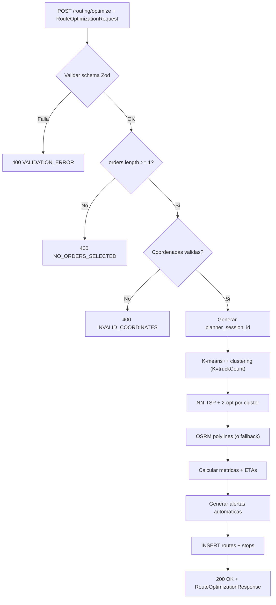

---

## CU-04: Reordenar Paradas Manualmente

| Atributo | Valor |
|---|---|
| **Endpoint** | `PATCH /api/v1/routes/:id/stops/reorder` |
| **Actor Principal** | Owner / Usuario Maestro / Subusuario (permiso `route_planner:edit`) |
| **Actor Secundario** | OSRM API (recalculo de polyline y metricas) |
| **Trigger** | El operador arrastra y suelta paradas en el componente `StopSequence` / `StopSequenceEnhanced` |
| **Frecuencia** | 10-30 veces/dia |

**Precondiciones (backend DEBE validar)**

| # | Precondicion | Si no se cumple |
|---|---|---|
| PRE-01 | Token JWT valido y no expirado | HTTP `401 UNAUTHORIZED` |
| PRE-02 | Usuario tiene permiso `route_planner:edit` | HTTP `403 FORBIDDEN` |
| PRE-03 | Ruta con `id` existe y `status = 'generated'` | HTTP `404 ROUTE_NOT_FOUND` o `422 INVALID_STATE` |
| PRE-04 | Restriccion de precedencia: pickup antes de delivery para cada orden | HTTP `422 PRECEDENCE_VIOLATION` con `{ orderId, orderNumber }` |
| PRE-05 | `stops.length >= 2` | HTTP `400 VALIDATION_ERROR` |

**Request Body**

| Campo | Tipo | Obligatorio | Validacion |
|---|---|---|---|
| stops | RouteStop[] | Si | Array reordenado. Cada stop con id, sequence nueva. length >= 2 |

**Secuencia Backend (flujo principal)**

| Paso | Accion del backend | Detalle |
|---|---|---|
| 1 | Verificar ruta existe y status = `generated` | Si no -> 404/422 |
| 2 | Validar restriccion de precedencia para cada orden | Para cada orderId: sequence(pickup) < sequence(delivery) |
| 3 | Actualizar `sequence` de cada stop | UPDATE route_stops SET sequence = :newSeq WHERE id = :stopId |
| 4 | Recalcular metricas: totalDistance, estimatedDuration, estimatedCost | Usando misma configuracion de la ruta |
| 5 | Solicitar nueva polyline a OSRM | `routingService.calculateConstrainedRoute(newCoordinates[])` |
| 6 | Recalcular ETAs secuenciales | Para cada stop: ETA = ETA_anterior + travelTime + duration + timeBuffer |
| 7 | Re-evaluar alertas | DELAY_RISK si nueva duracion > 480min. TIME_WINDOW_CONFLICT si ETA fuera de ventana |
| 8 | Persistir cambios en BD | UPDATE route_stops, UPDATE route (metrics, polyline, alerts) |
| 9 | Retornar HTTP `200 OK` con ruta actualizada | Incluir stops reordenados, metricas recalculadas, nueva polyline |

**Postcondiciones (backend DEBE garantizar)**

| # | Postcondicion | Verificacion |
|---|---|---|
| POST-01 | Stops reordenados con sequence consecutiva | sequence 1..N sin gaps |
| POST-02 | Metricas recalculadas | totalDistance, estimatedDuration, estimatedCost actualizados |
| POST-03 | Polyline actualizada segun nuevo orden | polyline != null |
| POST-04 | ETAs recalculadas para todas las paradas | estimatedArrival actualizado |
| POST-05 | Alertas re-evaluadas | Nuevas alertas si aplica, removidas las anteriores |

**Excepciones**

| HTTP | Codigo | Cuando | Respuesta |
|---|---|---|---|
| `404` | ROUTE_NOT_FOUND | Ruta no existe | `{ error: { code, message } }` |
| `422` | INVALID_STATE | Ruta no esta en status `generated` | `{ error: { code, message, details: { currentStatus } } }` |
| `422` | PRECEDENCE_VIOLATION | Pickup despues de delivery para una orden | `{ error: { code, message, details: { orderId, orderNumber } } }` |
| `400` | VALIDATION_ERROR | Menos de 2 stops | `{ error: { code, message } }` |

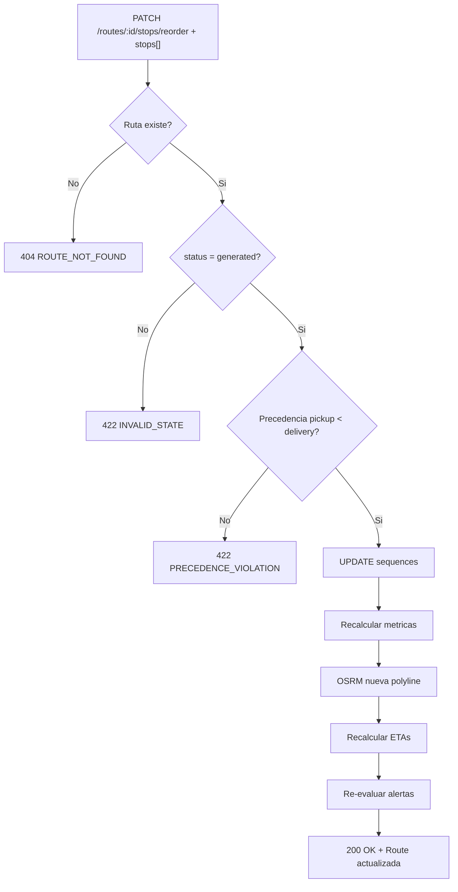

---

## CU-05: Asignar Vehiculo y Conductor a Ruta

| Atributo | Valor |
|---|---|
| **Endpoint** | `PATCH /api/v1/routes/:id/assign` |
| **Actor Principal** | Owner / Usuario Maestro / Subusuario (permiso `route_planner:edit`) |
| **Actor Secundario** | Validacion de capacidad del vehiculo |
| **Trigger** | El operador selecciona vehiculo y conductor en el paso "Asignar" del wizard |
| **Frecuencia** | 10-30 veces/dia |

**Precondiciones (backend DEBE validar)**

| # | Precondicion | Si no se cumple |
|---|---|---|
| PRE-01 | Token JWT valido y no expirado | HTTP `401 UNAUTHORIZED` |
| PRE-02 | Usuario tiene permiso `route_planner:edit` | HTTP `403 FORBIDDEN` |
| PRE-03 | Ruta con `id` existe y `status = 'generated'` | HTTP `404 ROUTE_NOT_FOUND` o `422 INVALID_STATE` |
| PRE-04 | Si se envia `vehicleId`: vehiculo existe y `status = 'available'` | HTTP `404 VEHICLE_NOT_FOUND` o `422 VEHICLE_UNAVAILABLE` |
| PRE-05 | Si se envia `driverId`: conductor existe y `status = 'available'` | HTTP `404 DRIVER_NOT_FOUND` o `422 DRIVER_UNAVAILABLE` |
| PRE-06 | Vehiculo no esta asignado a otra ruta activa (generated/confirmed) | HTTP `409 VEHICLE_CONFLICT` |
| PRE-07 | Conductor no esta asignado a otra ruta activa (generated/confirmed) | HTTP `409 DRIVER_CONFLICT` |
| PRE-08 | Capacidad del vehiculo >= peso y volumen total de la ruta | Genera alerta `CAPACITY_EXCEEDED` severity `high` (no bloquea, pero alerta) |

**Request Body — AssignResourcesDTO**

| Campo | Tipo | Obligatorio | Validacion |
|---|---|---|---|
| vehicleId | string UUID | No | Vehiculo a asignar. Si null, desasigna |
| driverId | string UUID | No | Conductor a asignar. Si null, desasigna |

**Secuencia Backend (flujo principal)**

| Paso | Accion del backend | Detalle |
|---|---|---|
| 1 | Verificar ruta existe y status = `generated` | Si no -> 404/422 |
| 2 | Si `vehicleId`: buscar vehiculo por ID | Si no existe -> 404. Si no available -> 422 |
| 3 | Si `vehicleId`: verificar no asignado a otra ruta activa | Buscar en route_assignments WHERE vehicle_id = :vehicleId AND route.status IN ('generated','confirmed') |
| 4 | Si `vehicleId`: comparar capacidad vs carga de la ruta | `vehicle.capacity.weight >= route.metrics.totalWeight AND vehicle.capacity.volume >= route.metrics.totalVolume`. Si excede -> generar alerta CAPACITY_EXCEEDED |
| 5 | Si `driverId`: buscar conductor por ID | Si no existe -> 404. Si no available -> 422 |
| 6 | Si `driverId`: verificar licencia vigente | Si `licenseExpiry < TODAY` -> generar alerta `warning` |
| 7 | Si `driverId`: verificar no asignado a otra ruta activa | Buscar en route_assignments WHERE driver_id = :driverId AND route.status IN ('generated','confirmed') |
| 8 | Crear o actualizar `route_assignment` | UPSERT route_assignments (route_id, vehicle_id, driver_id, assigned_at, assigned_by) |
| 9 | Actualizar `route.vehicle` y `route.driver` en JSONB si se desnormaliza | Para acceso rapido sin JOIN |
| 10 | Retornar HTTP `200 OK` con ruta actualizada | Incluir vehiculo, conductor, alertas nuevas |

**Postcondiciones (backend DEBE garantizar)**

| # | Postcondicion | Verificacion |
|---|---|---|
| POST-01 | Asignacion registrada en `route_assignments` | vehicle_id y/o driver_id actualizados |
| POST-02 | Si capacidad excedida: alerta `CAPACITY_EXCEEDED` generada | Verificar en route_alerts |
| POST-03 | Vehiculo y conductor no duplicados en otra ruta activa | Unicidad verificada |

**Excepciones**

| HTTP | Codigo | Cuando | Respuesta |
|---|---|---|---|
| `404` | ROUTE_NOT_FOUND | Ruta no existe | `{ error: { code, message } }` |
| `404` | VEHICLE_NOT_FOUND | Vehiculo no existe | `{ error: { code, message } }` |
| `404` | DRIVER_NOT_FOUND | Conductor no existe | `{ error: { code, message } }` |
| `422` | INVALID_STATE | Ruta no esta en status `generated` | `{ error: { code, message } }` |
| `422` | VEHICLE_UNAVAILABLE | Vehiculo no esta disponible | `{ error: { code, message, details: { vehicleStatus } } }` |
| `422` | DRIVER_UNAVAILABLE | Conductor no esta disponible | `{ error: { code, message, details: { driverStatus } } }` |
| `409` | VEHICLE_CONFLICT | Vehiculo ya asignado a otra ruta activa | `{ error: { code, message, details: { conflictingRouteId } } }` |
| `409` | DRIVER_CONFLICT | Conductor ya asignado a otra ruta activa | `{ error: { code, message, details: { conflictingRouteId } } }` |

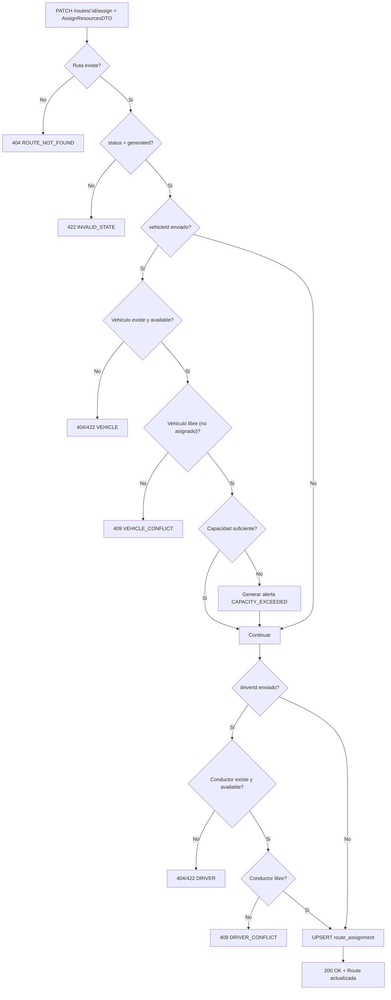

---

## CU-06: Confirmar Ruta Individual

| Atributo | Valor |
|---|---|
| **Endpoint** | `PATCH /api/v1/routes/:id/confirm` |
| **Actor Principal** | Owner / Usuario Maestro / Subusuario (permiso `route_planner:confirm`) |
| **Actor Secundario** | Event Bus (publicacion de `route:confirmed`) |
| **Trigger** | El operador presiona "Confirmar Ruta" en el modal de confirmacion |
| **Frecuencia** | 5-15 veces/dia |

**Precondiciones (backend DEBE validar)**

| # | Precondicion | Si no se cumple |
|---|---|---|
| PRE-01 | Token JWT valido y no expirado | HTTP `401 UNAUTHORIZED` |
| PRE-02 | Usuario tiene permiso `route_planner:confirm` | HTTP `403 FORBIDDEN` |
| PRE-03 | Ruta con `id` existe y `status = 'generated'` | HTTP `404 ROUTE_NOT_FOUND` o `422 INVALID_STATE` |
| PRE-04 | Ruta tiene al menos 2 stops | HTTP `422 INSUFFICIENT_STOPS` |

**Request Body**

| Campo | Tipo | Obligatorio | Validacion |
|---|---|---|---|
| — | — | — | No requiere body. La confirmacion usa los datos ya asignados. |

**Secuencia Backend (flujo principal)**

| Paso | Accion del backend | Detalle |
|---|---|---|
| 1 | Verificar ruta existe y status = `generated` | Si no -> 404/422 |
| 2 | Verificar que la ruta tiene stops validos | stops.length >= 2 |
| 3 | Transicionar status: `generated -> confirmed` | UPDATE routes SET status = 'confirmed' |
| 4 | Registrar `confirmedAt = NOW()`, `confirmedBy = currentUserId` | Timestamp UTC |
| 5 | Construir payload `RouteConfirmedPayload` | Incluir: routeId, routeName, vehicleId, vehiclePlate, driverId, driverName, stops (orderId, type, address, city, coordinates), metrics completas |
| 6 | Emitir evento `route:confirmed` via Event Bus | Payload: RouteConfirmedPayload. Suscriptores: Scheduling, Monitoring, Orders |
| 7 | Retornar HTTP `200 OK` con ruta confirmada | Incluir confirmedAt en response |

**Postcondiciones (backend DEBE garantizar)**

| # | Postcondicion | Verificacion |
|---|---|---|
| POST-01 | `route.status === 'confirmed'` | Verificar en response |
| POST-02 | `confirmedAt` poblado con timestamp UTC | confirmedAt != null |
| POST-03 | Evento `route:confirmed` publicado en Event Bus | Log de auditoria |
| POST-04 | Modulos suscriptores notificados (Scheduling, Monitoring) | Verificar logs |

**Excepciones**

| HTTP | Codigo | Cuando | Respuesta |
|---|---|---|---|
| `404` | ROUTE_NOT_FOUND | Ruta no existe | `{ error: { code, message } }` |
| `422` | INVALID_STATE | Ruta no esta en status `generated` | `{ error: { code, message, details: { currentStatus } } }` |
| `422` | INSUFFICIENT_STOPS | Ruta tiene menos de 2 paradas | `{ error: { code, message } }` |

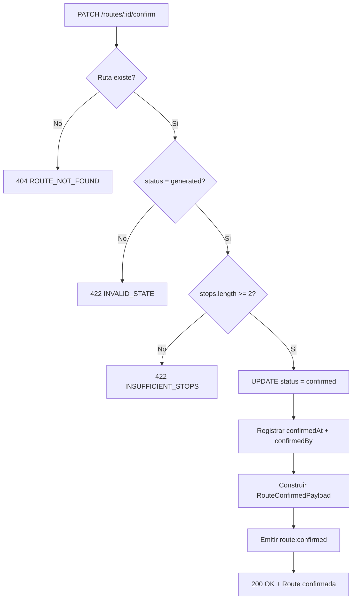

---

## CU-07: Confirmar Todas las Rutas

| Atributo | Valor |
|---|---|
| **Endpoint** | `POST /api/v1/routes/confirm-all` |
| **Actor Principal** | Owner / Usuario Maestro (Subusuario NO tiene acceso) |
| **Actor Secundario** | Event Bus (publicacion de `route:all_confirmed`) |
| **Trigger** | El operador presiona "Confirmar Todas las Rutas" en la vista de resultados |
| **Frecuencia** | 2-5 veces/dia |

**Precondiciones (backend DEBE validar)**

| # | Precondicion | Si no se cumple |
|---|---|---|
| PRE-01 | Token JWT valido y no expirado | HTTP `401 UNAUTHORIZED` |
| PRE-02 | Usuario es Owner o Usuario Maestro | HTTP `403 FORBIDDEN` |
| PRE-03 | `routeIds.length >= 1` | HTTP `400 VALIDATION_ERROR` |
| PRE-04 | Todas las rutas en `routeIds` existen y tienen `status = 'generated'` | HTTP `422 INVALID_STATE`: "Ruta {id} no esta en estado generado" |
| PRE-05 | No hay duplicados de vehiculo entre las rutas | HTTP `409 VEHICLE_CONFLICT`: "Vehiculo {plate} asignado a multiples rutas" |
| PRE-06 | No hay duplicados de conductor entre las rutas | HTTP `409 DRIVER_CONFLICT`: "Conductor {name} asignado a multiples rutas" |

**Request Body**

| Campo | Tipo | Obligatorio | Validacion |
|---|---|---|---|
| routeIds | string[] | Si | Array de UUIDs. length >= 1. Todas deben ser rutas en status `generated` |

**Secuencia Backend (flujo principal)**

| Paso | Accion del backend | Detalle |
|---|---|---|
| 1 | Validar que routeIds no esta vacio | Si vacio -> 400 |
| 2 | Buscar todas las rutas por IDs | Si alguna no existe -> 404 |
| 3 | Verificar que todas estan en status `generated` | Si alguna no -> 422 |
| 4 | Verificar unicidad de vehiculos entre rutas | Si duplicado -> 409 VEHICLE_CONFLICT |
| 5 | Verificar unicidad de conductores entre rutas | Si duplicado -> 409 DRIVER_CONFLICT |
| 6 | **Transaccion atomica:** confirmar todas las rutas | UPDATE routes SET status = 'confirmed', confirmed_at = NOW(), confirmed_by = :userId WHERE id IN (:routeIds) |
| 7 | Construir array de `RouteConfirmedPayload` por cada ruta | Incluir metricas, stops, asignaciones |
| 8 | Construir `AllRoutesConfirmedPayload` | `{ routes: RouteConfirmedPayload[], totalOrders, plannerSessionId }` |
| 9 | Emitir evento `route:all_confirmed` via Event Bus | Un solo evento con todas las rutas |
| 10 | Retornar HTTP `200 OK` con resumen | `{ confirmedRoutes: N, totalOrders: M, confirmedAt }` |

**Postcondiciones (backend DEBE garantizar)**

| # | Postcondicion | Verificacion |
|---|---|---|
| POST-01 | Todas las rutas en status `confirmed` | Verificar cada ruta |
| POST-02 | `confirmedAt` poblado en cada ruta | confirmedAt != null |
| POST-03 | Evento `route:all_confirmed` publicado con payload completo | Log de auditoria |
| POST-04 | Operacion atomica: todas confirman o ninguna | Transaccion BD |

**Excepciones**

| HTTP | Codigo | Cuando | Respuesta |
|---|---|---|---|
| `400` | VALIDATION_ERROR | routeIds vacio | `{ error: { code, message } }` |
| `404` | ROUTE_NOT_FOUND | Alguna ruta no existe | `{ error: { code, message, details: { missingRouteId } } }` |
| `422` | INVALID_STATE | Alguna ruta no esta en status `generated` | `{ error: { code, message, details: { routeId, currentStatus } } }` |
| `409` | VEHICLE_CONFLICT | Vehiculo duplicado entre rutas | `{ error: { code, message, details: { vehicleId, vehiclePlate, conflictingRouteIds } } }` |
| `409` | DRIVER_CONFLICT | Conductor duplicado entre rutas | `{ error: { code, message, details: { driverId, driverName, conflictingRouteIds } } }` |

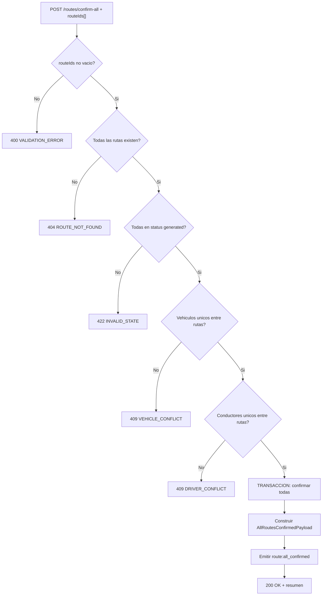

---

## CU-08: Crear Ruta Manual

| Atributo | Valor |
|---|---|
| **Endpoint** | `POST /api/v1/routes/manual` |
| **Actor Principal** | Owner / Usuario Maestro / Subusuario (permiso `route_planner:create`) |
| **Actor Secundario** | OSRM API (calculo de polyline), Validacion Zod |
| **Trigger** | El operador usa el dialogo `ManualRouteCreator` para agregar paradas manualmente |
| **Frecuencia** | 1-5 veces/dia |

**Precondiciones (backend DEBE validar)**

| # | Precondicion | Si no se cumple |
|---|---|---|
| PRE-01 | Token JWT valido y no expirado | HTTP `401 UNAUTHORIZED` |
| PRE-02 | Usuario tiene permiso `route_planner:create` | HTTP `403 FORBIDDEN` |
| PRE-03 | `stops.length >= 2` | HTTP `400 VALIDATION_ERROR`: "Minimo 2 paradas" |
| PRE-04 | Coordenadas validas: lat -90..90, lng -180..180 | HTTP `400 VALIDATION_ERROR` |
| PRE-05 | Cada stop tiene `type` = 'pickup' o 'delivery' | HTTP `400 VALIDATION_ERROR` |
| PRE-06 | Cada stop tiene `duration` >= 1 minuto | HTTP `400 VALIDATION_ERROR` |

**Request Body — CreateManualRouteDTO**

| Campo | Tipo | Obligatorio | Validacion |
|---|---|---|---|
| stops | CreateRouteStopDTO[] | Si | length >= 2. Cada uno: { address, city, lat, lng, type, duration } |
| stops[].address | string | Si | min 1 char |
| stops[].city | string | Si | min 1 char |
| stops[].lat | decimal | Si | -90..90 |
| stops[].lng | decimal | Si | -180..180 |
| stops[].type | enum | Si | `pickup` o `delivery` |
| stops[].duration | integer | Si | 1-480 minutos |
| configuration | RouteConfiguration | No | Si no se envia, usa defaults |
| name | string | No | Nombre de la ruta. Si no se envia, auto-genera |

**Secuencia Backend (flujo principal)**

| Paso | Accion del backend | Detalle |
|---|---|---|
| 1 | Validar DTO completo con schema Zod | Validar stops, coordenadas, duraciones |
| 2 | Generar `id` (UUID v4) para la ruta | Auto-generado |
| 3 | Generar nombre si no proporcionado | Formato: "Ruta Manual #{N}" |
| 4 | Crear RouteStops con sequence 1..N | Orden respeta el array enviado |
| 5 | Solicitar polyline a OSRM | `routingService.calculateConstrainedRoute(coordinates[])` |
| 6 | Calcular metricas | totalDistance (OSRM o Haversine), estimatedDuration, estimatedCost |
| 7 | Calcular ETAs secuenciales | Basado en configuracion (velocidad + trafico + paradas + buffer) |
| 8 | Persistir ruta con status `generated` | INSERT route + route_stops |
| 9 | Retornar HTTP `201 Created` con la ruta creada | Incluir stops, metricas, polyline |

**Postcondiciones (backend DEBE garantizar)**

| # | Postcondicion | Verificacion |
|---|---|---|
| POST-01 | Ruta creada con status `generated` | Verificar en response |
| POST-02 | Stops con sequence consecutiva (1..N) | Verificar array |
| POST-03 | Metricas calculadas | totalDistance, estimatedDuration, estimatedCost > 0 |
| POST-04 | Polyline generada (OSRM o interpolacion) | polyline != null |

**Excepciones**

| HTTP | Codigo | Cuando | Respuesta |
|---|---|---|---|
| `400` | VALIDATION_ERROR | Campos invalidos o faltantes | `{ error: { code, message, details } }` |
| `400` | INSUFFICIENT_STOPS | Menos de 2 paradas | `{ error: { code, message } }` |
| `400` | INVALID_COORDINATES | Coordenadas fuera de rango | `{ error: { code, message, details: { stopIndex, field } } }` |

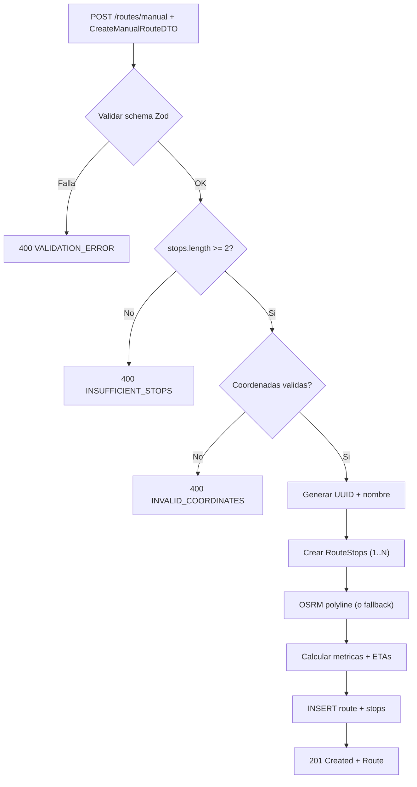

---

## CU-09: Despachar Ruta

| Atributo | Valor |
|---|---|
| **Endpoint** | `PATCH /api/v1/routes/:id/dispatch` |
| **Actor Principal** | Owner / Usuario Maestro / Subusuario (permiso `route_planner:dispatch`) |
| **Actor Secundario** | Event Bus (publicacion de `route:dispatched`), Modulo Ordenes (actualiza status de ordenes) |
| **Trigger** | El operador presiona "Despachar" en una ruta confirmada |
| **Frecuencia** | 5-10 veces/dia |

**Precondiciones (backend DEBE validar)**

| # | Precondicion | Si no se cumple |
|---|---|---|
| PRE-01 | Token JWT valido y no expirado | HTTP `401 UNAUTHORIZED` |
| PRE-02 | Usuario tiene permiso `route_planner:dispatch` | HTTP `403 FORBIDDEN` |
| PRE-03 | Ruta con `id` existe y `status = 'confirmed'` | HTTP `404 ROUTE_NOT_FOUND` o `422 INVALID_STATE` |
| PRE-04 | Ruta tiene vehiculo asignado (`vehicleId != null`) | HTTP `422 MISSING_VEHICLE`: "Asigne un vehiculo antes de despachar" |
| PRE-05 | Ruta tiene conductor asignado (`driverId != null`) | HTTP `422 MISSING_DRIVER`: "Asigne un conductor antes de despachar" |
| PRE-06 | No hay alertas de severidad `high` sin resolver | HTTP `422 UNRESOLVED_ALERTS`: "Resuelva alertas criticas antes de despachar" |

**Request Body**

| Campo | Tipo | Obligatorio | Validacion |
|---|---|---|---|
| — | — | — | No requiere body |

**Secuencia Backend (flujo principal)**

| Paso | Accion del backend | Detalle |
|---|---|---|
| 1 | Verificar ruta existe y status = `confirmed` | Si no -> 404/422 |
| 2 | Verificar vehiculo y conductor asignados | Si falta -> 422 MISSING_VEHICLE / MISSING_DRIVER |
| 3 | Verificar no hay alertas severity=high activas | Si hay -> 422 UNRESOLVED_ALERTS |
| 4 | Transicionar status: `confirmed -> dispatched` | UPDATE routes SET status = 'dispatched', dispatched_at = NOW() |
| 5 | Registrar `dispatchedAt = NOW()`, `dispatchedBy = currentUserId` | Timestamp UTC |
| 6 | Actualizar ordenes asociadas: `status = 'assigned'` (si estaban en pending/draft) | UPDATE orders SET status = 'assigned', vehicle_id = :vId, driver_id = :dId WHERE id IN (SELECT DISTINCT order_id FROM route_stops WHERE route_id = :routeId) |
| 7 | Emitir evento `route:dispatched` via Event Bus | Payload: routeId, routeName, vehicleId, driverId, stops, metrics |
| 8 | Retornar HTTP `200 OK` con ruta despachada | Incluir dispatchedAt |

**Postcondiciones (backend DEBE garantizar)**

| # | Postcondicion | Verificacion |
|---|---|---|
| POST-01 | `route.status === 'dispatched'` (estado terminal) | Verificar en response |
| POST-02 | `dispatchedAt` poblado con timestamp UTC | dispatchedAt != null |
| POST-03 | Ordenes asociadas transicionadas a `assigned` con vehicleId y driverId | GET /orders/:orderId muestra asignacion |
| POST-04 | Evento `route:dispatched` publicado | Log de auditoria |

**Excepciones**

| HTTP | Codigo | Cuando | Respuesta |
|---|---|---|---|
| `404` | ROUTE_NOT_FOUND | Ruta no existe | `{ error: { code, message } }` |
| `422` | INVALID_STATE | Ruta no esta en status `confirmed` | `{ error: { code, message, details: { currentStatus } } }` |
| `422` | MISSING_VEHICLE | No hay vehiculo asignado | `{ error: { code, message } }` |
| `422` | MISSING_DRIVER | No hay conductor asignado | `{ error: { code, message } }` |
| `422` | UNRESOLVED_ALERTS | Alertas criticas sin resolver | `{ error: { code, message, details: { alerts[] } } }` |

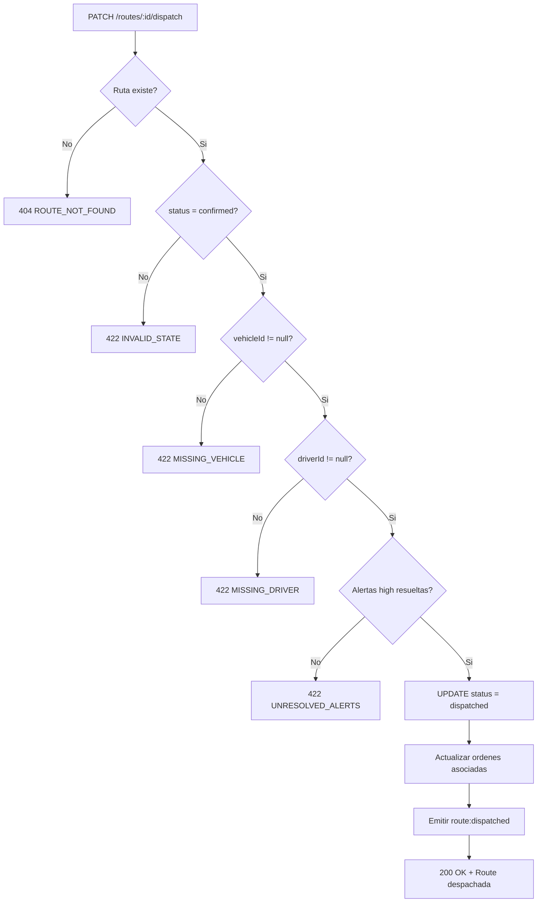

---

### Diagrama general de interaccion CU

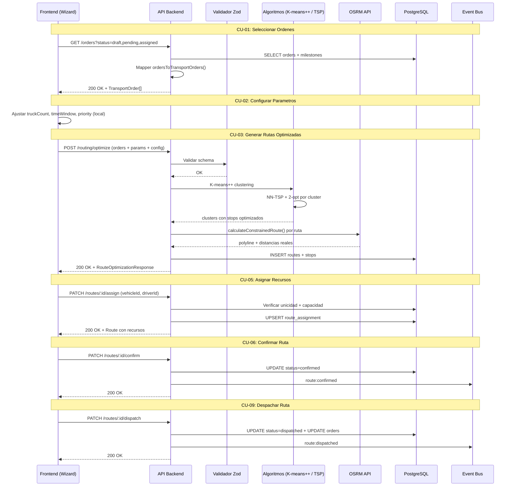

---

# 9. Endpoints API REST

**Base path:** `/api/v1`

| # | Metodo | Endpoint | Descripcion | Permiso | Request Body | Response |
|---|---|---|---|---|---|---|
| E-01 | POST | /routing/optimize | Generar rutas optimizadas multi-ruta | route_planner:create | `RouteOptimizationRequest` | `RouteOptimizationResponse { routes[], summary }` |
| E-02 | POST | /routing/calculate | Calcular ruta punto a punto (OSRM) | route_planner:read | `{ coordinates: [number,number][], options: RouteConfiguration }` | `RoutingResult { polyline, totalDistance, totalDuration, segments }` |
| E-03 | GET | /routing/geocode | Geocodificacion de direccion | route_planner:read | Query: `?query=string` | `{ results: Array<{ address, coordinates, city }> }` |
| E-04 | GET | /routes | Listar rutas con paginacion y filtros | route_planner:read | Query: page, limit, status, sessionId, dateFrom, dateTo, sortBy, sortDir | `{ items[], total, page, totalPages }` |
| E-05 | GET | /routes/:id | Obtener detalle de una ruta | route_planner:read | — | Route completa con stops, assignment, metrics, alerts |
| E-06 | POST | /routes/manual | Crear ruta manual | route_planner:create | `CreateManualRouteDTO` | `201` Route con status=generated |
| E-07 | PATCH | /routes/:id/assign | Asignar vehiculo/conductor | route_planner:edit | `{ vehicleId?, driverId? }` | Route actualizada con asignacion |
| E-08 | PATCH | /routes/:id/stops/reorder | Reordenar paradas | route_planner:edit | `{ stops: RouteStop[] }` | Route con stops reordenados y metricas recalculadas |
| E-09 | PATCH | /routes/:id/confirm | Confirmar ruta individual | route_planner:confirm | — | Route con status=confirmed |
| E-10 | POST | /routes/confirm-all | Confirmar todas las rutas | route_planner:confirm | `{ routeIds: string[] }` | `{ confirmedRoutes: N, totalOrders, confirmedAt }` |
| E-11 | PATCH | /routes/:id/dispatch | Despachar ruta | route_planner:dispatch | — | Route con status=dispatched |
| E-12 | PATCH | /routes/:id/reset | Resetear ruta a draft | route_planner:edit | — | Route con status=draft |
| E-13 | PATCH | /routes/:id/revoke | Revocar confirmacion | route_planner:edit | — | Route con status=generated |
| E-14 | DELETE | /routes/:id | Eliminar ruta (solo draft/generated) | route_planner:delete | — | `204 No Content` |
| E-15 | GET | /routes/:id/calculate | Recalcular metricas y polyline | route_planner:read | Query: `?recalculate=true` | Route con metricas actualizadas |
| E-16 | GET | /depots | Listar depositos del tenant | route_planner:read | Query: page, limit, active | `{ items: Depot[], total }` |
| E-17 | GET | /vehicles?status=available | Listar vehiculos disponibles | route_planner:read | Query: status | `{ items: Vehicle[] }` |
| E-18 | GET | /drivers?status=available | Listar conductores disponibles | route_planner:read | Query: status | `{ items: Driver[] }` |
| E-19 | GET | /route-templates | Listar plantillas de ruta | route_planner:read | Query: page, limit, tags | `{ items: RouteTemplate[] }` |
| E-20 | POST | /route-templates | Crear plantilla | route_planner:create | `CreateRouteTemplateDTO` | `201 RouteTemplate` |
| E-21 | POST | /whatif-scenarios | Crear escenario what-if | route_planner:create | `CreateWhatIfScenarioDTO` | `201 WhatIfScenario` |
| E-22 | GET | /whatif-scenarios | Listar escenarios | route_planner:read | Query: page, limit | `{ items: WhatIfScenario[] }` |

### Diagrama de flujo API

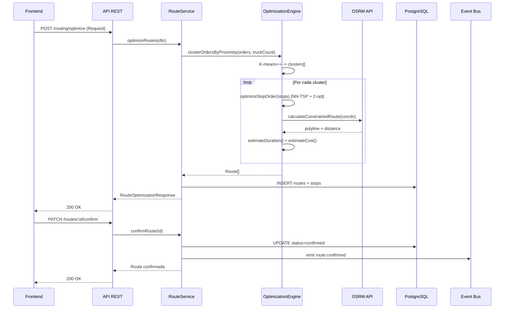

---

# 10. Eventos de Dominio

### Catalogo

| Evento | Payload | Se emite cuando | Modulos suscriptores |
|---|---|---|---|
| route.generated | plannerSessionId, routeCount, totalOrders, totalDistance, optimizationTimeMs | Se generan rutas optimizadas (CU-03) | Dashboard, Auditoria |
| route:confirmed | RouteConfirmedPayload (routeId, routeName, vehicleId, vehiclePlate, driverId, driverName, stops[], metrics) | Se confirma una ruta individual (CU-06) | Scheduling, Monitoring, Orders |
| route:all_confirmed | AllRoutesConfirmedPayload (routes[], totalOrders, plannerSessionId) | Se confirman todas las rutas (CU-07) | Scheduling, Monitoring, Orders |
| route:dispatched | routeId, routeName, vehicleId, driverId, stops[], metrics, dispatchedBy | Se despacha una ruta (CU-09) | Monitoring, Orders, GPS |
| route.assigned | routeId, vehicleId, vehiclePlate, driverId, driverName, assignedBy | Se asigna vehiculo/conductor (CU-05) | Scheduling |
| route.stops_reordered | routeId, newStopOrder[], newMetrics | Se reordenan paradas (CU-04) | — |
| route.revoked | routeId, revokedBy, reason | Se revoca confirmacion (T-05) | Scheduling, Monitoring |
| route.manual_created | routeId, routeName, stopsCount, createdBy | Se crea ruta manual (CU-08) | Auditoria |
| route.batch_generated | plannerSessionId, routeCount, totalOrders, configuration | Se genera batch de rutas (T-06) | Dashboard |

### Diagrama de propagacion

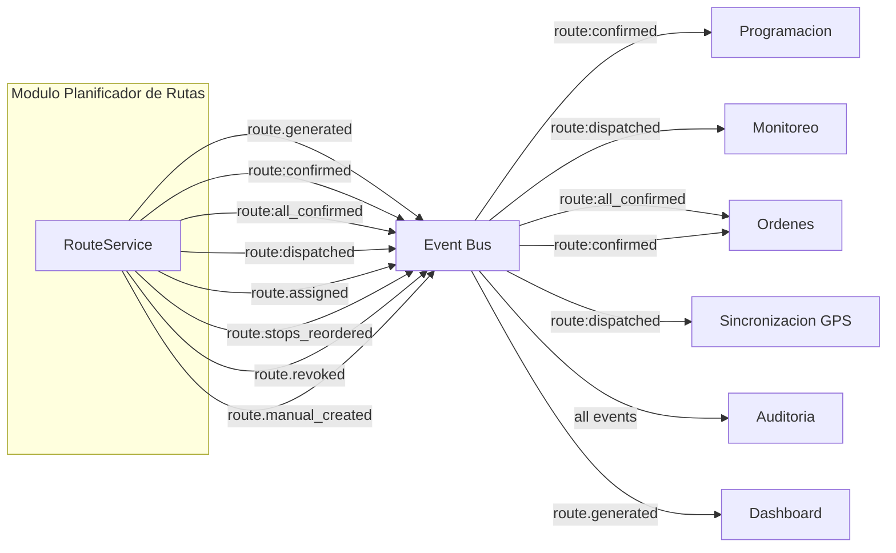

---

# 11. Reglas de Negocio Clave

| # | Regla | Descripcion |
|---|---|---|
| R-01 | Estado terminal | `dispatched` es el unico estado terminal de una ruta. Una vez despachada, no se puede modificar |
| R-02 | Solo draft/generated se elimina | DELETE solo valido si status = `draft` o `generated`. Marca `deleted_at = NOW()`. HTTP 409 si status = confirmed/dispatched |
| R-03 | Precedencia pickup-delivery | El pickup de una orden SIEMPRE debe ir antes que su delivery en la secuencia de paradas. Validar en reorden y optimizacion |
| R-04 | Confirmacion requiere stops | Una ruta debe tener al menos 2 stops para ser confirmada |
| R-05 | Despacho requiere recursos | Para despachar, la ruta debe tener vehicleId AND driverId asignados |
| R-06 | Despacho requiere alertas resueltas | No se puede despachar si hay alertas de severity `high` activas (no descartadas) |
| R-07 | Unicidad de vehiculo | Un vehiculo no puede estar asignado a mas de una ruta activa (generated/confirmed) simultaneamente |
| R-08 | Unicidad de conductor | Un conductor no puede estar asignado a mas de una ruta activa simultaneamente |
| R-09 | Alerta de capacidad | Al asignar vehiculo, si `route.metrics.totalWeight > vehicle.capacity.weight` o `totalVolume > capacity.volume`, generar alerta `CAPACITY_EXCEEDED` severity `high` |
| R-10 | Alerta de duracion | Si `route.metrics.estimatedDuration > 480` (8 horas), generar alerta `DELAY_RISK` severity `medium` |
| R-11 | Alerta de ventana temporal | Si el ETA de un stop esta fuera de su `timeWindow`, generar alerta `TIME_WINDOW_CONFLICT` severity `high` |
| R-12 | Recalculo en reorden | Al reordenar paradas, se recalculan automaticamente: metricas, polyline (via OSRM), ETAs, alertas |
| R-13 | Confirmacion con evento | `confirmRoute()` cambia status a `confirmed`, registra `confirmedAt`, emite `route:confirmed` en Event Bus |
| R-14 | Confirmacion masiva atomica | `confirmAllRoutes()` opera en transaccion: todas se confirman o ninguna. Emite `route:all_confirmed` |
| R-15 | Velocidades por prioridad | speed = 55 km/h, cost = 35 km/h, balanced = 40 km/h. Con trafico: +25% duracion |
| R-16 | Costo de combustible | $4.5 USD/galon. Costo = distancia / fuelConsumption * precioPorGalon |
| R-17 | Costo de peajes | speed = $0.15/km, cost = $0.05/km, balanced = $0.10/km. Si `avoidTolls = true`, peajes = $0 |
| R-18 | Costo de conductor | $0.08/km fijo |
| R-19 | OSRM rate limiting | 1100ms entre requests al servidor OSRM publico. Cache LRU de 100 entradas |
| R-20 | Fallback sin OSRM | Si OSRM no responde: polyline por interpolacion lineal (10 puntos entre stops), distancias por Haversine |
| R-21 | Ordenes planificables | Solo ordenes en status `draft`, `pending` o `assigned` se muestran en el planificador |
| R-22 | Colores de ruta | Pool de 10 colores: `#3B82F6, #EF4444, #10B981, #F59E0B, #8B5CF6, #EC4899, #06B6D4, #84CC16, #F97316, #6366F1`. Se asignan ciclicamente |
| R-23 | Zonas peruanas | Inferencia por ciudad: Lima Centro, Lima Este, Lima Norte, Lima Sur, Callao, Arequipa, Trujillo, Cusco, Junin, Piura, Lambayeque, Ica, "Otra zona" |

---

# 12. Catalogo de Errores HTTP

| HTTP | Codigo interno | Cuando ocurre | Resolucion |
|---|---|---|---|
| 400 | VALIDATION_ERROR | Campos invalidos segun schema Zod | Leer details: mapa {campo: mensaje} |
| 400 | NO_ORDERS_SELECTED | Array de ordenes vacio al optimizar | Seleccionar al menos 1 orden |
| 400 | INVALID_COORDINATES | Coordenadas fuera de rango (-90..90, -180..180) | Verificar lat/lng del stop o la orden |
| 400 | INVALID_TIME_WINDOW | timeWindowStart >= timeWindowEnd | Corregir ventana temporal |
| 400 | INSUFFICIENT_STOPS | Menos de 2 paradas en la ruta | Agregar mas paradas |
| 401 | UNAUTHORIZED | Token JWT ausente o expirado | Redirigir a /login |
| 403 | FORBIDDEN | Sin permisos para la operacion | Verificar rol del usuario (ver seccion 13) |
| 404 | ROUTE_NOT_FOUND | ID de ruta no existe | Verificar UUID |
| 404 | VEHICLE_NOT_FOUND | vehicleId no existe o inactivo | Seleccionar otro vehiculo |
| 404 | DRIVER_NOT_FOUND | driverId no existe o licencia vencida | Seleccionar otro conductor |
| 409 | VEHICLE_CONFLICT | Vehiculo ya asignado a otra ruta activa | Elegir otro vehiculo |
| 409 | DRIVER_CONFLICT | Conductor ya asignado a otra ruta activa | Elegir otro conductor |
| 409 | CANNOT_DELETE_ROUTE | DELETE con status = confirmed o dispatched | Solo se eliminan rutas en draft/generated |
| 422 | INVALID_STATE | Transicion no permitida en maquina de estados | Verificar status actual de la ruta |
| 422 | PRECEDENCE_VIOLATION | Pickup despues de delivery al reordenar | Reordenar respetando precedencia |
| 422 | INSUFFICIENT_VEHICLES | truckCount superior a vehiculos disponibles | Reducir truckCount o agregar vehiculos |
| 422 | VEHICLE_UNAVAILABLE | Vehiculo no esta en status `available` | Elegir un vehiculo disponible |
| 422 | DRIVER_UNAVAILABLE | Conductor no esta en status `available` | Elegir un conductor disponible |
| 422 | MISSING_VEHICLE | Despacho sin vehiculo asignado | Asignar vehiculo antes de despachar |
| 422 | MISSING_DRIVER | Despacho sin conductor asignado | Asignar conductor antes de despachar |
| 422 | UNRESOLVED_ALERTS | Despacho con alertas severity=high activas | Resolver o descartar alertas criticas |
| 422 | OPTIMIZATION_FAILED | Error interno del motor de optimizacion | Reintentar con menos ordenes o parametros diferentes |
| 500 | INTERNAL_ERROR | Error inesperado del servidor | Reintentar; si persiste, contactar soporte |
| 502 | OSRM_UNAVAILABLE | OSRM API no responde | Se usa fallback automatico (Haversine). No es error bloqueante |

---

# 13. Permisos RBAC

**3 niveles jerarquicos (definicion de Edson). Arquitectura Multi-tenant con RBAC granular por modulo y por accion.**

```
Owner (Proveedor TMS)
   └── Cuenta Cliente (Tenant)
           └── Usuario Maestro
                   └── Subusuarios
```

> **Leyenda:** ✅ = Permitido | ❌ = Denegado | ⚙️ = Configurable por el Usuario Maestro

| Permiso | Owner | Usuario Maestro | Subusuario |
|---|:---:|:---:|:---:|
| route_planner:read | ✅ | ✅ | ⚙️ |
| route_planner:create | ✅ | ✅ | ⚙️ |
| route_planner:edit | ✅ | ✅ | ⚙️ |
| route_planner:delete | ✅ | ✅ | ❌ |
| route_planner:confirm | ✅ | ✅ | ⚙️ |
| route_planner:confirm_all | ✅ | ✅ | ❌ |
| route_planner:dispatch | ✅ | ✅ | ⚙️ |
| route_planner:templates | ✅ | ✅ | ⚙️ |
| route_planner:whatif | ✅ | ✅ | ⚙️ |

> **Owner:** Rol maximo del sistema (proveedor TMS). Acceso total sin restricciones a todas las cuentas. Puede crear/suspender/eliminar cuentas de clientes, activar/desactivar modulos, crear Usuarios Maestros, resetear credenciales.
> **Usuario Maestro:** Administrador principal de una cuenta cliente. Control total SOLO dentro de su empresa. Crea subusuarios, asigna roles y permisos internos por modulo, asigna unidades, restringe visibilidad por grupo/flota/geocerca. NO puede crear cuentas, activar modulos no contratados, ni ver otras cuentas.
> **Subusuario:** Operador con permisos limitados definidos por el Usuario Maestro. NO puede crear usuarios, modificar estructura de permisos, activar/desactivar modulos, ni cambiar configuracion de la cuenta.
> **⚙️ Configurable:** El Usuario Maestro habilita o deshabilita cada permiso por subusuario segun necesidades operativas. Control granular por modulo y por accion.
> **route_planner:delete:** Solo Owner y Usuario Maestro. Solo valido para rutas en estado `draft` o `generated` (soft delete).
> **route_planner:confirm_all:** Solo Owner y Usuario Maestro. Confirmacion masiva compromete multiples recursos simultaneamente.
> **Recomendacion tecnica:** Sistema basado en Role-Based Access Control (RBAC) con control de alcance por unidades y grupos.
> **Multi-tenant:** Todos los queries filtran por `tenantId` del JWT. Un Usuario Maestro y sus Subusuarios solo ven rutas de su propio tenant. El Owner puede ver todos los tenants.

### Restricciones del Subusuario

- **route_planner:delete = siempre denegado:** Eliminar rutas es accion administrativa exclusiva de Owner y Usuario Maestro, independientemente de los permisos asignados.
- **route_planner:confirm_all = siempre denegado:** Confirmacion masiva compromete multiples recursos simultaneamente. Solo Owner y Usuario Maestro.
- El Subusuario **NO puede**: crear usuarios, modificar estructura de permisos, activar/desactivar modulos, cambiar configuracion de la cuenta.
- El Subusuario **SI puede** (si tiene el permiso asignado): seleccionar ordenes, generar rutas, reordenar paradas, asignar recursos, confirmar ruta individual, crear ruta manual, despachar ruta.

---

# 14. Diagrama de Componentes

```mermaid
graph TB
    subgraph "Modulo Planificador de Rutas"
        subgraph "Capa Presentacion - Next.js 15"
            UI_PAGE["RoutePlannerPage (Wizard)<br/>4 pasos: select → configure → results → assign"]
            UI_ENHANCED["RoutePlannerEnhanced<br/>Layout 3 paneles (alternativo)"]
            UI_ORDERLIST["OrderList<br/>Seleccion + filtros + Excel"]
            UI_MAP["RouteMapEnhanced<br/>Leaflet multi-ruta + polylines"]
            UI_STOPS["StopSequenceEnhanced<br/>Timeline + drag-and-drop"]
            UI_VEHICLE["VehicleSelector<br/>Cards + capacidad"]
            UI_DRIVER["DriverSelector<br/>Cards + rating"]
            UI_KPI["KpiCards<br/>Metricas animadas"]
            UI_CONFIG["RouteConfigPanel<br/>Configuracion + toggles"]
            UI_ACTIONS["RouteActionsEnhanced<br/>Generar + Confirmar"]
            UI_CONFIRM["ConfirmationModal<br/>Resumen + confirmacion"]
            UI_ALERTS["RouteAlerts + AlertBanner<br/>Alertas por severidad"]
            UI_MANUAL["ManualRouteCreator<br/>Ruta manual con form"]
            UI_METRICS["RouteMetrics<br/>Grid 4 metricas + alertas"]
        end

        subgraph "Capa Logica - React Context + Hooks"
            CTX["RoutePlannerProvider<br/>30+ metodos, estado global"]
            H_ORDERS["useRoutePlannerOrders<br/>Bridge Order → TransportOrder"]
        end

        subgraph "Capa Servicios"
            SVC_ROUTING["RoutingService (singleton)<br/>OSRM API + cache + fallback"]
            SVC_MAPPER["OrderToTransportOrderMapper<br/>Conversion + inferencia zona"]
            SVC_ALGO["OptimizationEngine<br/>K-means++ / NN-TSP / 2-opt"]
        end

        subgraph "Capa Integracion"
            EVT["tmsEventBus<br/>Event Bus"]
            SVC_ORDERS["OrderService<br/>getOrders (bridge)"]
        end

        subgraph "Capa Validacion"
            VAL["Schemas Zod<br/>routeOptimizationSchema<br/>manualRouteSchema<br/>assignResourcesSchema"]
        end
    end

    UI_PAGE --> CTX
    UI_ENHANCED --> CTX
    UI_ORDERLIST --> CTX
    UI_MAP --> CTX
    UI_STOPS --> CTX
    UI_VEHICLE --> CTX
    UI_DRIVER --> CTX
    UI_CONFIG --> CTX
    UI_ACTIONS --> CTX

    CTX --> H_ORDERS
    CTX --> SVC_ROUTING
    CTX --> SVC_ALGO
    CTX --> EVT

    H_ORDERS --> SVC_ORDERS
    H_ORDERS --> SVC_MAPPER

    SVC_ROUTING -->|HTTPS rate-limited| OSRM_API["OSRM API"]
```

---

# 15. Diagrama de Despliegue

```mermaid
graph TB
    subgraph "Nodo: Cloud Server - Vercel"
        FE["Next.js 15 Frontend<br/>App Router + SSR<br/>React 19<br/>Leaflet Maps"]
    end

    subgraph "Nodo: API Backend"
        API["REST API<br/>Node.js (NestJS 10+)"]
        WS["WebSocket Server<br/>Eventos tiempo real"]
    end

    subgraph "Nodo: Base de Datos"
        DB["PostgreSQL<br/>+ PostGIS<br/>routes, route_stops,<br/>route_alerts, depots"]
    end

    subgraph "Nodo: Servicios Externos"
        OSRM["OSRM API (publico)<br/>router.project-osrm.org<br/>Rate limit: 1100ms"]
        TILES["Tile Server<br/>OpenStreetMap<br/>Mapas base + satelite"]
    end

    subgraph "Nodo: Message Broker"
        EVT["tmsEventBus<br/>Redis Pub/Sub"]
    end

    subgraph "Nodo: Cache"
        CACHE["Redis Cache<br/>OSRM responses (LRU 100)"]
    end

    FE -->|HTTPS REST| API
    FE -->|WSS| WS
    FE -->|HTTPS| TILES
    API -->|SQL| DB
    API -->|HTTPS rate-limited| OSRM
    API -->|publish| EVT
    API -->|get/set| CACHE
    EVT -->|notify| WS
    WS -->|subscribe| EVT
```

---

> **Nota:** Este documento es una referencia operativa para desarrollo frontend y backend. Incluye 9 Casos de Uso con precondiciones, secuencia, postcondiciones y excepciones. Para detalles completos sobre algoritmos de optimizacion (K-means++, NN-TSP, 2-opt), integracion OSRM, mapeo de ordenes, y descripcion de los 17 componentes React, consultar los archivos fuente: `src/types/route-planner.ts`, `src/contexts/route-planner-context.tsx`, `src/services/routing.service.ts`, `src/lib/mock-data/route-planner.ts`.
