# Referencia Rapida — Modulo de Programacion
## TMS Navitel · Cheat Sheet para Desarrollo

> **Basado en:** RFC_BACKEND_TMS_NAVITEL.md (Seccion 4) + Frontend src/types/scheduling.ts + src/hooks/use-scheduling.ts + src/services/scheduling-service.ts
> **Fecha:** Febrero 2026
> **Proposito:** Consulta rapida para desarrolladores. Para detalle completo, ver el documento fuente.

---

## Indice

| # | Seccion |
|---|---------|
| 1 | [Contexto del Modulo](#1-contexto-del-modulo) |
| 2 | [Entidades del Dominio](#2-entidades-del-dominio) |
| 3 | [Modelo de Base de Datos — PostgreSQL](#3-modelo-de-base-de-datos--postgresql) |
| 4 | [Maquina de Estados — ScheduleStatus](#4-maquina-de-estados--schedulestatus) |
| 5 | [Maquina de Estados — ConflictType](#5-maquina-de-estados--conflicttype) |
| 6 | [Maquina de Estados — ScheduleAuditAction](#6-maquina-de-estados--scheduleauditaction) |
| 7 | [Tabla de Referencia Operativa de Transiciones](#7-tabla-de-referencia-operativa-de-transiciones) |
| 8 | [Casos de Uso — Referencia Backend](#8-casos-de-uso--referencia-backend) |
| 9 | [Endpoints API REST](#9-endpoints-api-rest) |
| 10 | [Eventos de Dominio](#10-eventos-de-dominio) |
| 11 | [Reglas de Negocio Clave](#11-reglas-de-negocio-clave) |
| 12 | [Catalogo de Errores HTTP](#12-catalogo-de-errores-http) |
| 13 | [Permisos RBAC](#13-permisos-rbac) |
| 14 | [Diagrama de Componentes](#14-diagrama-de-componentes) |
| 15 | [Diagrama de Despliegue](#15-diagrama-de-despliegue) |

---

# 1. Contexto del Modulo

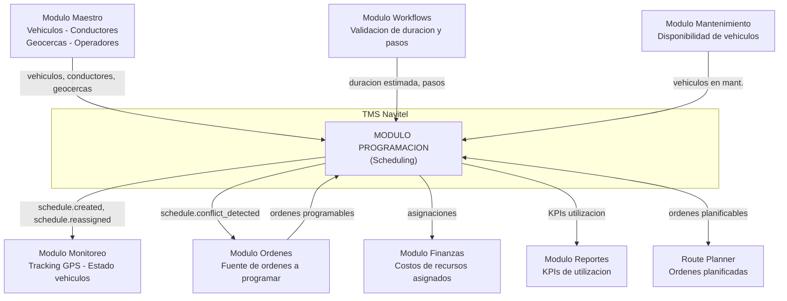
```mermaid
graph TB
    subgraph "TMS Navitel"
        SCHED["MODULO PROGRAMACION<br/>(Scheduling)"]
    end

    ORD["Modulo Ordenes<br/>Fuente de ordenes a programar"]
    MASTER["Modulo Maestro<br/>Vehiculos - Conductores<br/>Geocercas - Operadores"]
    WORKFLOW["Modulo Workflows<br/>Validacion de duracion y pasos"]
    MONITOR["Modulo Monitoreo<br/>Tracking GPS - Estado vehiculos"]
    FIN["Modulo Finanzas<br/>Costos de recursos asignados"]
    REP["Modulo Reportes<br/>KPIs de utilizacion"]
    ROUTE["Route Planner<br/>Ordenes planificadas"]
    MAINT["Modulo Mantenimiento<br/>Disponibilidad de vehiculos"]

    ORD -->|ordenes programables| SCHED
    MASTER -->|vehiculos, conductores, geocercas| SCHED
    WORKFLOW -->|duracion estimada, pasos| SCHED
    MAINT -->|vehiculos en mant.| SCHED
    SCHED -->|schedule.created, schedule.reassigned| MONITOR
    SCHED -->|schedule.conflict_detected| ORD
    SCHED -->|asignaciones| FIN
    SCHED -->|KPIs utilizacion| REP
    SCHED <-->|ordenes planificables| ROUTE
```

**Responsabilidades:** Asignacion de vehiculos y conductores a ordenes, gestion del calendario de programacion (8 estados, 17 transiciones), deteccion de conflictos (8 tipos), validacion HOS (Hours of Service), auto-programacion, asignacion masiva, bloqueo de dias, vista Gantt multi-dia, auditoria de cambios, notificaciones del modulo, exportacion CSV.

---

# 2. Entidades del Dominio

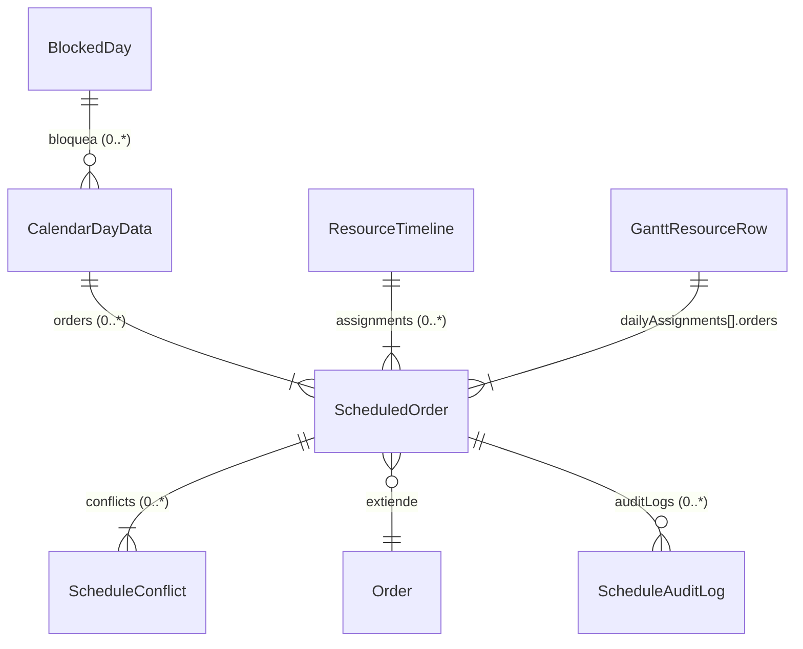
```mermaid
erDiagram
    ScheduledOrder ||--|{ ScheduleConflict : "conflicts (0..*)"
    ScheduledOrder }o--|| Order : "extiende"
    ScheduledOrder ||--o{ ScheduleAuditLog : "auditLogs (0..*)"
    CalendarDayData ||--|{ ScheduledOrder : "orders (0..*)"
    ResourceTimeline ||--|{ ScheduledOrder : "assignments (0..*)"
    BlockedDay ||--o{ CalendarDayData : "bloquea (0..*)"
    GanttResourceRow ||--|{ ScheduledOrder : "dailyAssignments[].orders"
```

| Entidad | Tipo | Campos clave | Descripcion |
|---|---|---|---|
| **ScheduledOrder** | Raiz (extends Order) | id, orderId, scheduledDate, scheduledStartTime, estimatedEndTime, estimatedDuration, vehicleId, driverId, scheduleStatus, conflicts[], scheduledBy | Orden con datos de programacion. Extiende la entidad Order del modulo de ordenes. |
| **ScheduleConflict** | Value Object | id, type, severity, message, suggestedResolution, affectedEntity, relatedOrderIds[], detectedAt | Conflicto detectado (vehicle_overlap, driver_overlap, driver_hos, etc). |
| **ResourceSuggestion** | Value Object | type, resourceId, name, score, reason, reasons[], warnings[], isAvailable | Recurso sugerido por el motor de auto-asignacion. Score 0-100. |
| **ResourceTimeline** | Sub-entidad | resourceId, type, name, code, utilization, assignments[], hasConflicts | Linea de tiempo de un vehiculo o conductor. |
| **CalendarDayData** | Value Object | date, orders[], utilization, isBlocked, blockReason | Datos de un dia en la vista de calendario. |
| **SchedulingKPIs** | Value Object | pendingOrders, scheduledToday, atRiskOrders, fleetUtilization, driverUtilization, onTimeDeliveryRate, averageLeadTime, weeklyTrend | Indicadores del modulo en tiempo real. |
| **ScheduleAuditLog** | Sub-entidad | id, scheduleId, action, description, changes[], performedBy, performedByName, performedAt | Registro inmutable de cada cambio en la programacion. |
| **BlockedDay** | Sub-entidad | id, date, reason, blockType, appliesToAll, resourceIds[], createdBy, createdAt | Dia bloqueado para programacion (feriado, parcial, etc). |
| **HOSValidationResult** | Value Object | isValid, remainingHoursToday, weeklyHoursUsed, violations[], warnings[] | Resultado de validacion de horas de servicio de un conductor. |
| **BulkAssignmentResult** | Value Object | total, success, failed, errors[] | Resultado de una operacion de asignacion masiva. |
| **GanttResourceRow** | Value Object | resourceId, type, name, code, dailyAssignments[] | Datos de recurso para la vista Gantt multi-dia. |
| **DeliveryTimeWindow** | Value Object | startTime, endTime, isStrict | Ventana de tiempo para entrega (estricta o flexible). |

### Campos clave de ScheduledOrder (resumen)

| Campo | Tipo | Obligatorio | Descripcion rapida |
|---|---|---|---|
| id | UUID | Si | PK de la programacion, heredado de Order |
| scheduledDate | Date / string ISO | Si | Fecha programada |
| scheduledStartTime | string (HH:mm) | No | Hora de inicio programada |
| estimatedEndTime | string (HH:mm) | No | Hora de fin estimada (calculada: start + duration) |
| estimatedDuration | number (horas) | No | Duracion estimada calculada por distancia Haversine origen-destino |
| vehicleId | UUID FK | No | Vehiculo asignado (puede ser null si scheduleStatus=partial) |
| driverId | UUID FK | No | Conductor asignado (puede ser null si scheduleStatus=partial) |
| scheduleStatus | Enum | Si | 8 estados (ver seccion 4). Default: unscheduled |
| hasConflict | boolean | Si | Indicador rapido de conflicto detectado |
| conflicts | ScheduleConflict[] | No | Array de conflictos activos |
| schedulingNotes | string | No | Notas del operador al programar |
| scheduledBy | UUID FK | No | ID del usuario que programo |
| scheduledByName | string | No | Nombre del usuario que programo |

### Campos clave de ScheduleConflict

| Campo | Tipo | Obligatorio | Descripcion rapida |
|---|---|---|---|
| id | string | Si | ID unico del conflicto |
| type | ConflictType | Si | Tipo: vehicle_overlap, driver_overlap, driver_hos, vehicle_maintenance, driver_unavailable, capacity_exceeded, license_expired, no_resource |
| severity | ConflictSeverity | Si | low, medium, high |
| message | string | Si | Descripcion legible del conflicto |
| suggestedResolution | string | No | Resolucion sugerida automaticamente |
| affectedEntity | object | No | `{ type: 'vehicle'|'driver'|'order', id, name }` |
| relatedOrderIds | string[] | No | Ordenes afectadas por el conflicto |
| autoResolved | boolean | No | Si fue resuelto automaticamente |
| detectedAt | string ISO | Si | Timestamp de deteccion |

---

# 3. Modelo de Base de Datos — PostgreSQL

> Esquema relacional para PostgreSQL. Todas las tablas usan `UUID` como PK y timestamps UTC. Filtrado multi-tenant obligatorio por `tenant_id`.

### Diagrama Entidad-Relacion

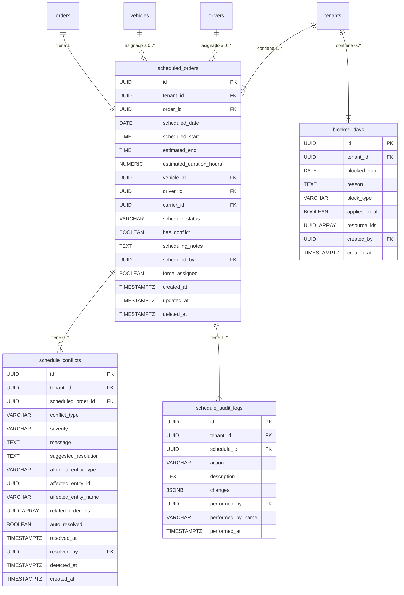
```mermaid
erDiagram
    scheduled_orders ||--o{ schedule_conflicts : "tiene 0..*"
    scheduled_orders ||--|{ schedule_audit_logs : "tiene 1..*"
    orders ||--|| scheduled_orders : "tiene 1"
    vehicles ||--o{ scheduled_orders : "asignado a 0..*"
    drivers ||--o{ scheduled_orders : "asignado a 0..*"
    tenants ||--|{ scheduled_orders : "contiene 1..*"
    tenants ||--|{ blocked_days : "contiene 0..*"

    scheduled_orders {
        UUID id PK
        UUID tenant_id FK
        UUID order_id FK
        DATE scheduled_date
        TIME scheduled_start
        TIME estimated_end
        NUMERIC estimated_duration_hours
        UUID vehicle_id FK
        UUID driver_id FK
        UUID carrier_id FK
        VARCHAR schedule_status
        BOOLEAN has_conflict
        TEXT scheduling_notes
        UUID scheduled_by FK
        BOOLEAN force_assigned
        TIMESTAMPTZ created_at
        TIMESTAMPTZ updated_at
        TIMESTAMPTZ deleted_at
    }

    schedule_conflicts {
        UUID id PK
        UUID tenant_id FK
        UUID scheduled_order_id FK
        VARCHAR conflict_type
        VARCHAR severity
        TEXT message
        TEXT suggested_resolution
        VARCHAR affected_entity_type
        UUID affected_entity_id
        VARCHAR affected_entity_name
        UUID_ARRAY related_order_ids
        BOOLEAN auto_resolved
        TIMESTAMPTZ resolved_at
        UUID resolved_by FK
        TIMESTAMPTZ detected_at
        TIMESTAMPTZ created_at
    }

    schedule_audit_logs {
        UUID id PK
        UUID tenant_id FK
        UUID schedule_id FK
        VARCHAR action
        TEXT description
        JSONB changes
        UUID performed_by FK
        VARCHAR performed_by_name
        TIMESTAMPTZ performed_at
    }

    blocked_days {
        UUID id PK
        UUID tenant_id FK
        DATE blocked_date
        TEXT reason
        VARCHAR block_type
        BOOLEAN applies_to_all
        UUID_ARRAY resource_ids
        UUID created_by FK
        TIMESTAMPTZ created_at
    }
```

---

### Tabla: `scheduled_orders`

> Tabla principal. Registra la programacion de cada orden con vehiculo, conductor, fecha y estado.

| Columna | Tipo PostgreSQL | Nullable | Default | Constraint | Descripcion |
|---|---|---|---|---|---|
| id | UUID | NOT NULL | `gen_random_uuid()` | PK | Identificador unico |
| tenant_id | UUID | NOT NULL | — | FK → tenants(id) | Tenant del registro (multi-tenant) |
| order_id | UUID | NOT NULL | — | FK → orders(id) | Orden asociada |
| scheduled_date | DATE | NOT NULL | — | — | Fecha programada de ejecucion |
| scheduled_start | TIME | NULL | — | — | Hora de inicio programada |
| estimated_end | TIME | NULL | — | — | Hora estimada de finalizacion |
| estimated_duration_hours | NUMERIC(5,2) | NULL | — | — | Duracion estimada (Haversine: km/55 + 1h buffer) |
| vehicle_id | UUID | NULL | — | FK → vehicles(id) | Vehiculo asignado (null si pendiente) |
| driver_id | UUID | NULL | — | FK → drivers(id) | Conductor asignado (null si pendiente) |
| carrier_id | UUID | NULL | — | FK → operators(id) | Operador logistico / carrier |
| schedule_status | VARCHAR(20) | NOT NULL | `'unscheduled'` | CHECK IN (8 estados) | Estado actual: `unscheduled`, `scheduled`, `partial`, `ready`, `in_progress`, `conflict`, `completed`, `cancelled` |
| has_conflict | BOOLEAN | NOT NULL | `false` | — | Indica si tiene conflictos activos |
| scheduling_notes | TEXT | NULL | — | — | Notas del operador |
| scheduled_by | UUID | NULL | — | FK → users(id) | Usuario que programo |
| force_assigned | BOOLEAN | NOT NULL | `false` | — | Si se forzo asignacion ignorando conflictos high |
| created_at | TIMESTAMPTZ | NOT NULL | `NOW()` | — | Fecha de creacion |
| updated_at | TIMESTAMPTZ | NOT NULL | `NOW()` | — | Ultima actualizacion |
| deleted_at | TIMESTAMPTZ | NULL | — | — | Soft delete |

> **Constraint UNIQUE:** `(order_id, tenant_id)` — una orden solo puede tener una programacion activa por tenant.

---

### Tabla: `schedule_conflicts`

> Conflictos detectados al programar/reasignar. Se resuelven manualmente o automaticamente.

| Columna | Tipo PostgreSQL | Nullable | Default | Constraint | Descripcion |
|---|---|---|---|---|---|
| id | UUID | NOT NULL | `gen_random_uuid()` | PK | Identificador unico |
| tenant_id | UUID | NOT NULL | — | FK → tenants(id) | Tenant del registro |
| scheduled_order_id | UUID | NOT NULL | — | FK → scheduled_orders(id) ON DELETE CASCADE | Programacion asociada |
| conflict_type | VARCHAR(30) | NOT NULL | — | CHECK IN (8 tipos) | Tipo: `vehicle_overlap`, `driver_overlap`, `driver_hos`, `vehicle_maintenance`, `driver_unavailable`, `capacity_exceeded`, `license_expired`, `no_resource` |
| severity | VARCHAR(10) | NOT NULL | — | CHECK IN (`low`, `medium`, `high`) | Severidad del conflicto |
| message | TEXT | NOT NULL | — | — | Descripcion legible del conflicto |
| suggested_resolution | TEXT | NULL | — | — | Sugerencia de resolucion |
| affected_entity_type | VARCHAR(10) | NULL | — | CHECK IN (`vehicle`, `driver`, `order`) | Tipo de entidad afectada |
| affected_entity_id | UUID | NULL | — | — | ID de la entidad afectada |
| affected_entity_name | VARCHAR(200) | NULL | — | — | Nombre legible de la entidad |
| related_order_ids | UUID[] | NULL | — | — | IDs de ordenes relacionadas al conflicto |
| auto_resolved | BOOLEAN | NOT NULL | `false` | — | Si se resolvio automaticamente |
| resolved_at | TIMESTAMPTZ | NULL | — | — | Fecha de resolucion |
| resolved_by | UUID | NULL | — | FK → users(id) | Usuario que resolvio |
| detected_at | TIMESTAMPTZ | NOT NULL | `NOW()` | — | Fecha de deteccion |
| created_at | TIMESTAMPTZ | NOT NULL | `NOW()` | — | Fecha de creacion |

---

### Tabla: `schedule_audit_logs`

> Registro inmutable de cada accion sobre programaciones. NUNCA se modifica ni elimina.

| Columna | Tipo PostgreSQL | Nullable | Default | Constraint | Descripcion |
|---|---|---|---|---|---|
| id | UUID | NOT NULL | `gen_random_uuid()` | PK | Identificador unico |
| tenant_id | UUID | NOT NULL | — | FK → tenants(id) | Tenant del registro |
| schedule_id | UUID | NOT NULL | — | FK → scheduled_orders(id) | Programacion auditada |
| action | VARCHAR(30) | NOT NULL | — | CHECK IN (6 acciones) | Accion: `created`, `updated`, `reassigned`, `unscheduled`, `conflict_detected`, `conflict_resolved` |
| description | TEXT | NOT NULL | — | — | Descripcion legible de la accion |
| changes | JSONB | NULL | — | — | Objeto JSON con old/new values |
| performed_by | UUID | NOT NULL | — | FK → users(id) | Usuario que ejecuto la accion |
| performed_by_name | VARCHAR(200) | NOT NULL | — | — | Nombre legible del usuario |
| performed_at | TIMESTAMPTZ | NOT NULL | `NOW()` | — | Timestamp de la accion |

---

### Tabla: `blocked_days`

> Dias bloqueados para programacion (feriados, paros, mantenimiento masivo). Solo Owner / Usuario Maestro pueden gestionar.

| Columna | Tipo PostgreSQL | Nullable | Default | Constraint | Descripcion |
|---|---|---|---|---|---|
| id | UUID | NOT NULL | `gen_random_uuid()` | PK | Identificador unico |
| tenant_id | UUID | NOT NULL | — | FK → tenants(id) | Tenant del registro |
| blocked_date | DATE | NOT NULL | — | — | Fecha bloqueada |
| reason | TEXT | NOT NULL | — | — | Motivo del bloqueo |
| block_type | VARCHAR(20) | NOT NULL | — | CHECK IN (`full_day`, `partial`, `holiday`) | Tipo de bloqueo |
| applies_to_all | BOOLEAN | NOT NULL | `true` | — | Si aplica a todos los recursos |
| resource_ids | UUID[] | NULL | — | — | IDs de recursos afectados (si applies_to_all = false) |
| created_by | UUID | NOT NULL | — | FK → users(id) | Usuario que creo el bloqueo |
| created_at | TIMESTAMPTZ | NOT NULL | `NOW()` | — | Fecha de creacion |

> **Constraint UNIQUE:** `(tenant_id, blocked_date, block_type)` — no se puede duplicar el mismo tipo de bloqueo en la misma fecha y tenant.

---

### Indices

| Tabla | Indice | Columna(s) | Tipo | Notas |
|---|---|---|---|---|
| scheduled_orders | idx_scheduled_orders_tenant | tenant_id | B-tree | Filtro multi-tenant obligatorio |
| scheduled_orders | idx_scheduled_orders_date | scheduled_date | B-tree | Consultas por calendario |
| scheduled_orders | idx_scheduled_orders_vehicle | vehicle_id | B-tree | Busqueda por vehiculo |
| scheduled_orders | idx_scheduled_orders_driver | driver_id | B-tree | Busqueda por conductor |
| scheduled_orders | idx_scheduled_orders_status | schedule_status | B-tree | Filtro por estado |
| scheduled_orders | idx_scheduled_orders_deleted | deleted_at | B-tree | Partial: WHERE deleted_at IS NULL (soft delete) |
| schedule_conflicts | idx_schedule_conflicts_order | scheduled_order_id | B-tree | JOIN con programaciones |
| schedule_conflicts | idx_schedule_conflicts_type | conflict_type | B-tree | Filtro por tipo de conflicto |
| schedule_audit_logs | idx_audit_logs_schedule | schedule_id | B-tree | Historial por programacion |
| schedule_audit_logs | idx_audit_logs_action | action | B-tree | Filtro por tipo de accion |
| schedule_audit_logs | idx_audit_logs_date | performed_at | B-tree | Consultas por rango de fecha |
| blocked_days | idx_blocked_days_date | blocked_date | B-tree | Busqueda por fecha |
| blocked_days | idx_blocked_days_tenant | tenant_id | B-tree | Filtro multi-tenant |

---

### Vista Materializada: `v_scheduling_kpis`

> Se refresca automaticamente cada 5 minutos. Proporciona KPIs agregados por tenant.

| KPI | Tipo | Calculo |
|---|---|---|
| pending_orders | INTEGER | `COUNT(*) WHERE schedule_status = 'unscheduled'` |
| scheduled_today | INTEGER | `COUNT(*) WHERE scheduled_date = TODAY AND status IN ('scheduled','ready','in_progress')` |
| at_risk_orders | INTEGER | `COUNT(*) WHERE has_conflict = true` |
| fleet_utilization | NUMERIC(5,1) | `(vehiculos asignados hoy / vehiculos activos del tenant) * 100` |
| driver_utilization | NUMERIC(5,1) | `(conductores asignados hoy / conductores activos del tenant) * 100` |

> **Agrupacion:** Por `tenant_id`. Cada tenant ve solo sus propios KPIs.
> **Filtro:** Solo registros con `deleted_at IS NULL`.

---

# 4. Maquina de Estados — ScheduleStatus

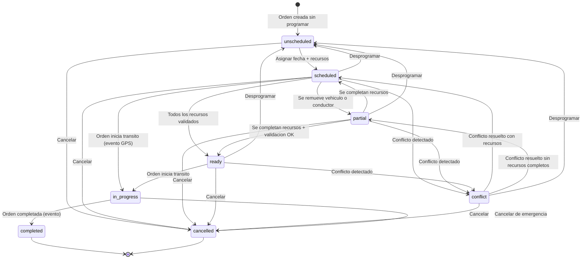
```mermaid
stateDiagram-v2
    [*] --> unscheduled : Orden creada sin programar

    unscheduled --> scheduled : Asignar fecha + recursos
    unscheduled --> cancelled : Cancelar

    scheduled --> partial : Se remueve vehiculo o conductor
    scheduled --> ready : Todos los recursos validados
    scheduled --> in_progress : Orden inicia transito (evento GPS)
    scheduled --> conflict : Conflicto detectado
    scheduled --> unscheduled : Desprogramar
    scheduled --> cancelled : Cancelar

    partial --> scheduled : Se completan recursos
    partial --> ready : Se completan recursos + validacion OK
    partial --> conflict : Conflicto detectado
    partial --> unscheduled : Desprogramar
    partial --> cancelled : Cancelar

    ready --> in_progress : Orden inicia transito
    ready --> conflict : Conflicto detectado
    ready --> unscheduled : Desprogramar
    ready --> cancelled : Cancelar

    conflict --> scheduled : Conflicto resuelto con recursos
    conflict --> partial : Conflicto resuelto sin recursos completos
    conflict --> unscheduled : Desprogramar
    conflict --> cancelled : Cancelar

    in_progress --> completed : Orden completada (evento)
    in_progress --> cancelled : Cancelar de emergencia

    completed --> [*]
    cancelled --> [*]
```

### Tabla de estados

| Estado | Codigo | Descripcion | Campos requeridos | Es terminal |
|---|---|---|---|---|
| Sin Programar | `unscheduled` | Orden existe pero no tiene fecha asignada | — | No |
| Programada | `scheduled` | Tiene fecha y al menos un recurso | scheduledDate | No |
| Parcial | `partial` | Tiene fecha pero falta vehiculo o conductor | scheduledDate, (vehicleId o driverId pero no ambos) | No |
| Lista | `ready` | Todos los recursos asignados y validados | scheduledDate, vehicleId, driverId, sin conflictos | No |
| En Ejecucion | `in_progress` | La orden ya esta en transito | vehicleId, driverId | No |
| Conflicto | `conflict` | Conflicto detectado (solapamiento, HOS, etc) | scheduledDate, conflicts.length > 0 | No |
| Completada | `completed` | La orden fue completada exitosamente | — | **Si** |
| Cancelada | `cancelled` | Programacion cancelada | cancellationReason | **Si** |

---

# 5. Maquina de Estados — ConflictType

> Los conflictos se detectan automaticamente al asignar o reasignar recursos. Cada conflicto tiene severidad (low/medium/high) y resolucion sugerida.

| ConflictType | Codigo | Severidad default | Descripcion | Resolucion sugerida |
|---|---|---|---|---|
| Solapamiento Vehiculo | `vehicle_overlap` | high | Vehiculo asignado a 2+ ordenes con horarios solapados | Seleccionar otro vehiculo o ajustar horario |
| Solapamiento Conductor | `driver_overlap` | high | Conductor asignado a 2+ ordenes con horarios solapados | Seleccionar otro conductor o ajustar horario |
| Exceso HOS | `driver_hos` | high | Conductor excede horas maximas de conduccion (FMCSA) | Reasignar a otro conductor o reprogramar a otro dia |
| Vehiculo en Mantenimiento | `vehicle_maintenance` | high | Vehiculo tiene mantenimiento programado en esa fecha | Seleccionar otro vehiculo |
| Conductor No Disponible | `driver_unavailable` | medium | Conductor con dia libre, vacaciones o incapacidad | Seleccionar otro conductor |
| Capacidad Excedida | `capacity_exceeded` | medium | Peso/volumen de carga excede capacidad del vehiculo | Seleccionar vehiculo con mayor capacidad |
| Licencia Vencida | `license_expired` | high | Licencia de conducir del conductor vencida | Seleccionar otro conductor |
| Sin Recurso | `no_resource` | low | Orden programada sin vehiculo ni conductor asignado | Usar auto-sugerencia o asignar manualmente |

### Validacion HOS (Hours of Service)

> Basado en regulaciones FMCSA §395.3. Se valida al asignar conductor.

| Limite | Valor | Referencia |
|---|---|---|
| Max horas conduccion diaria | 11h | FMCSA §395.3 |
| Max horas servicio diario | 14h | FMCSA §395.3 |
| Max horas semanales | 60h / 7 dias | FMCSA §395.3 |
| Break obligatorio | 30 min cada 8h continuas | FMCSA §395.3(a)(3)(ii) |

```typescript
// Interface de resultado HOS
HOSValidationResult {
  isValid: boolean;           // false si hay violations
  remainingHoursToday: number; // Horas restantes hoy (max 11 - usadas)
  weeklyHoursUsed: number;    // Horas acumuladas esta semana
  violations: string[];       // Violaciones detectadas
  warnings?: string[];        // Advertencias (ej: break req)
}
```

---

# 6. Maquina de Estados — ScheduleAuditAction

> Cada cambio en la programacion genera un registro inmutable de auditoria.

| Accion | Codigo | Descripcion | Campos que cambian |
|---|---|---|---|
| Creada | `created` | Programacion creada (primera asignacion) | scheduledDate, vehicleId, driverId |
| Actualizada | `updated` | Cambio de fecha, hora, notas | scheduledDate, scheduledStartTime, notes |
| Reasignada | `reassigned` | Cambio de vehiculo o conductor | vehicleId, driverId (oldValue → newValue) |
| Desprogramada | `unscheduled` | Orden removida del calendario | reason obligatorio |
| Conflicto Detectado | `conflict_detected` | Sistema detecto conflicto automaticamente | conflictType, severity |
| Conflicto Resuelto | `conflict_resolved` | Conflicto resuelto manual o automaticamente | conflictId, resolutionMethod |

```typescript
// Interface de registro de auditoria
ScheduleAuditLog {
  id: string;
  scheduleId: string;
  action: 'created' | 'updated' | 'reassigned' | 'unscheduled' | 'conflict_detected' | 'conflict_resolved';
  description: string;
  changes?: { field: string; oldValue: string; newValue: string }[];
  performedBy: string;       // userId
  performedByName: string;
  performedAt: string;       // ISO 8601
}
```

---

# 7. Tabla de Referencia Operativa de Transiciones

> Tabla unificada que cruza: estado origen/destino, endpoint, payload, validaciones, actor, evento emitido e idempotencia.

| # | From | To | Endpoint | Payload | Validaciones | Actor | Evento | Idempotente |
|---|---|---|---|---|---|---|---|---|
| T-01 | unscheduled | scheduled | POST /assign | `ScheduleOrderPayload` | orderId valido, scheduledDate futuro o hoy, vehicleId o driverId (al menos uno) | Owner / Usuario Maestro / Subusuario (scheduling:assign) | schedule.created | Si |
| T-02 | unscheduled | cancelled | PATCH /:id/cancel | `{ reason: "..." }` | reason.length >= 1 | Owner / Usuario Maestro / Subusuario (scheduling:unschedule) | schedule.unscheduled | Si |
| T-03 | scheduled | partial | POST /reassign | `ReassignResourcePayload` con vehicleId=null o driverId=null | Se remueve un recurso pero no ambos | Owner / Usuario Maestro / Subusuario (scheduling:reassign) | schedule.updated | Si |
| T-04 | scheduled | ready | (automatica) | — | vehicleId != null AND driverId != null AND conflicts.length === 0 AND HOS valid | Sistema (validacion) | schedule.updated | Si |
| T-05 | scheduled | in_progress | (evento externo) | — | Orden transiciona a `in_transit` en modulo Ordenes | Sistema (evento order.status_changed) | — | Si |
| T-06 | scheduled | conflict | (automatica) | — | detectConflicts() retorna conflictos con severity=high | Sistema (conflicto detectado) | schedule.conflict_detected | Si |
| T-07 | scheduled | unscheduled | POST /unschedule | `UnscheduleOrderPayload` | reason.length >= 1 | Owner / Usuario Maestro / Subusuario (scheduling:unschedule) | schedule.unscheduled | Si |
| T-08 | scheduled | cancelled | PATCH /:id/cancel | `{ reason: "..." }` | reason.length >= 1 | Owner / Usuario Maestro / Subusuario (scheduling:unschedule) | schedule.unscheduled | Si |
| T-09 | partial | scheduled | POST /reassign | `ReassignResourcePayload` con vehicleId AND driverId | Se asignan ambos recursos | Owner / Usuario Maestro / Subusuario (scheduling:reassign) | schedule.updated | Si |
| T-10 | partial | ready | (automatica) | — | vehicleId != null AND driverId != null AND no conflicts AND HOS valid | Sistema | schedule.updated | Si |
| T-11 | partial | conflict | (automatica) | — | Conflicto detectado en recurso asignado | Sistema | schedule.conflict_detected | Si |
| T-12 | partial | unscheduled | POST /unschedule | `UnscheduleOrderPayload` | reason.length >= 1 | Owner / Usuario Maestro / Subusuario (scheduling:unschedule) | schedule.unscheduled | Si |
| T-13 | partial | cancelled | PATCH /:id/cancel | `{ reason: "..." }` | reason.length >= 1 | Owner / Usuario Maestro / Subusuario (scheduling:unschedule) | schedule.unscheduled | Si |
| T-14 | ready | in_progress | (evento externo) | — | Orden transiciona a `in_transit` en modulo Ordenes | Sistema (evento) | — | Si |
| T-15 | ready | conflict | (automatica) | — | Conflicto nuevo detectado (ej: vehiculo entra en mant.) | Sistema | schedule.conflict_detected | Si |
| T-16 | ready | unscheduled | POST /unschedule | `UnscheduleOrderPayload` | reason.length >= 1 | Owner / Usuario Maestro / Subusuario (scheduling:unschedule) | schedule.unscheduled | Si |
| T-17 | ready | cancelled | PATCH /:id/cancel | `{ reason: "..." }` | reason.length >= 1 | Owner / Usuario Maestro / Subusuario (scheduling:unschedule) | schedule.unscheduled | Si |
| T-18 | conflict | scheduled | POST /resolve-conflict | `{ conflictId, resolution }` | Conflicto resuelto + recursos completos | Owner / Usuario Maestro / Subusuario (scheduling:resolve_conflict) | schedule.conflict_resolved | Si |
| T-19 | conflict | partial | POST /resolve-conflict | `{ conflictId, resolution }` | Conflicto resuelto pero falta recurso | Owner / Usuario Maestro / Subusuario (scheduling:resolve_conflict) | schedule.conflict_resolved | Si |
| T-20 | conflict | unscheduled | POST /unschedule | `UnscheduleOrderPayload` | reason.length >= 1 | Owner / Usuario Maestro / Subusuario (scheduling:unschedule) | schedule.unscheduled | Si |
| T-21 | conflict | cancelled | PATCH /:id/cancel | `{ reason: "..." }` | reason.length >= 1 | Owner / Usuario Maestro / Subusuario (scheduling:unschedule) | schedule.unscheduled | Si |
| T-22 | in_progress | completed | (evento externo) | — | Orden alcanza `completed` en modulo Ordenes | Sistema (evento order.completed) | — | Si |
| T-23 | in_progress | cancelled | PATCH /:id/cancel | `{ reason: "..." }` | reason.length >= 1; cancelacion de emergencia | Owner / Usuario Maestro | schedule.unscheduled | Si |

### Diagrama de flujo de transiciones con endpoints

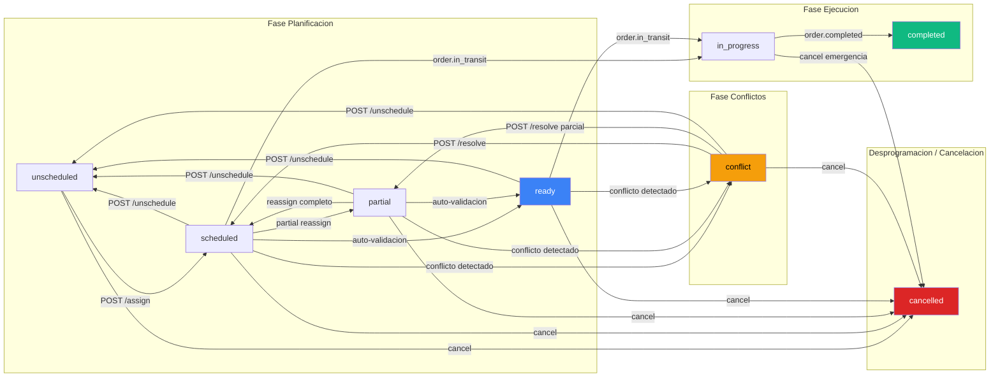
```mermaid
graph LR
    subgraph "Fase Planificacion"
        A[unscheduled] -->|POST /assign| B[scheduled]
        B -->|partial reassign| C[partial]
        C -->|reassign completo| B
        B -->|auto-validacion| D[ready]
        C -->|auto-validacion| D
    end

    subgraph "Fase Conflictos"
        B -->|conflicto detectado| E[conflict]
        C -->|conflicto detectado| E
        D -->|conflicto detectado| E
        E -->|POST /resolve| B
        E -->|POST /resolve parcial| C
    end

    subgraph "Fase Ejecucion"
        B -->|order.in_transit| F[in_progress]
        D -->|order.in_transit| F
        F -->|order.completed| G[completed]
    end

    subgraph "Desprogramacion / Cancelacion"
        B -->|POST /unschedule| A
        C -->|POST /unschedule| A
        D -->|POST /unschedule| A
        E -->|POST /unschedule| A
        A -->|cancel| X[cancelled]
        B -->|cancel| X
        C -->|cancel| X
        D -->|cancel| X
        E -->|cancel| X
        F -->|cancel emergencia| X
    end

    style G fill:#10B981,color:#fff
    style X fill:#DC2626,color:#fff
    style E fill:#F59E0B,color:#000
    style D fill:#3B82F6,color:#fff
```

---

# 8. Casos de Uso — Referencia Backend

> **9 Casos de Uso UML** con precondiciones, flujo principal, excepciones y postcondiciones. Cada CU indica quien ejecuta, que endpoint consume, que debe validar el backend y que debe devolver.

### Matriz Actor x Caso de Uso

> **Modelo de 3 roles (definicion Edson):** Owner (Super Admin TMS), Usuario Maestro (Admin de cuenta cliente), Subusuario (Operador con permisos configurables).
> **Leyenda:** ✅ = Permitido | ⚙️ = Permitido si el Usuario Maestro le asigno el permiso | ❌ = Denegado

| Caso de Uso | Owner | Usuario Maestro | Subusuario | Sistema (auto) |
|---|:---:|:---:|:---:|:---:|
| **CU-01** Programar Orden | ✅ | ✅ | ⚙️ `scheduling:assign` | — |
| **CU-02** Reasignar Recursos | ✅ | ✅ | ⚙️ `scheduling:reassign` | — |
| **CU-03** Desprogramar Orden | ✅ | ✅ | ⚙️ `scheduling:unschedule` | — |
| **CU-04** Asignacion Masiva | ✅ | ✅ | ⚙️ `scheduling:bulk_assign` | — |
| **CU-05** Auto-Programacion | ✅ | ✅ | ⚙️ `scheduling:auto_schedule` | Motor de scoring |
| **CU-06** Resolver Conflicto | ✅ | ✅ | ⚙️ `scheduling:resolve_conflict` | — |
| **CU-07** Bloquear/Desbloquear Dia | ✅ | ✅ | ❌ | — |
| **CU-08** Consultar Calendario/Timeline/Gantt | ✅ | ✅ | ⚙️ `scheduling:read` | — |
| **CU-09** Exportar Programacion | ✅ | ✅ | ⚙️ `scheduling:export` | — |

> **Restriccion CU-07:** Bloquear/desbloquear dias es accion administrativa. Solo **Owner** y **Usuario Maestro**. Los Subusuarios NO pueden bloquear dias independientemente de sus permisos.
> **Nota:** Los permisos del Subusuario son configurables por el Usuario Maestro. Un Subusuario sin el permiso correspondiente recibira HTTP `403 FORBIDDEN`.

---

## CU-01: Programar Orden (Asignar Recursos)

| Atributo | Valor |
|---|---|
| **Endpoint** | `POST /api/v1/operations/scheduling/assign` |
| **Actor Principal** | Owner / Usuario Maestro / Subusuario (permiso `scheduling:assign`) |
| **Actor Secundario** | Motor de validacion HOS, Detector de conflictos, Motor de Workflows |
| **Trigger** | El operador arrastra orden al calendario (drag&drop) o selecciona "Programar" en el modal |
| **Frecuencia** | 20-100 veces/dia |

**Precondiciones (backend DEBE validar)**

| # | Precondicion | Si no se cumple |
|---|---|---|
| PRE-01 | Token JWT valido y no expirado | HTTP `401 UNAUTHORIZED` |
| PRE-02 | Usuario tiene permiso `scheduling:assign` | HTTP `403 FORBIDDEN` |
| PRE-03 | `orderId` existe en BD y pertenece al tenant | HTTP `404 ORDER_NOT_FOUND` |
| PRE-04 | `scheduledDate` es hoy o futuro | HTTP `400 VALIDATION_ERROR` |
| PRE-05 | Si `vehicleId` proporcionado: vehiculo existe, esta activo y no tiene mantenimiento agendado en esa fecha | HTTP `404 VEHICLE_NOT_FOUND` / `409 VEHICLE_MAINTENANCE` |
| PRE-06 | Si `driverId` proporcionado: conductor existe, esta activo, licencia vigente | HTTP `404 DRIVER_NOT_FOUND` / `422 LICENSE_EXPIRED` |
| PRE-07 | Dia no esta bloqueado para el recurso asignado | HTTP `422 DAY_BLOCKED` |
| PRE-08 | Si `force != true`: no deben existir conflictos de tipo `high` | HTTP `409 SCHEDULING_CONFLICT` con `conflicts[]` |
| PRE-09 | Si HOS habilitado: conductor cumple limites FMCSA | HTTP `422 HOS_VIOLATION` con `violations[]` |

**Request Body — ScheduleOrderPayload**

| Campo | Tipo | Obligatorio | Validacion |
|---|---|---|---|
| orderId | UUID | **Si** | Debe existir en orders y pertenecer al tenant |
| scheduledDate | string ISO | **Si** | Fecha >= hoy |
| scheduledStartTime | string HH:mm | **Si** | Formato 24h valido |
| vehicleId | UUID | No | Si se envia, vehiculo debe existir y estar activo |
| driverId | UUID | No | Si se envia, conductor debe existir, activo, licencia vigente |
| notes | string | No | max 2000 chars |
| force | boolean | No | Si `true`, ignora conflictos de severidad `high` |

**Secuencia Backend (flujo principal)**

| Paso | Accion del backend | Detalle |
|---|---|---|
| 1 | Validar DTO con `scheduleOrderSchema` (Zod) | Validar todos los campos del request body |
| 2 | Verificar que `orderId` existe y pertenece al tenant | `SELECT * FROM orders WHERE id = :orderId AND tenant_id = :tenantId` |
| 3 | Verificar que la fecha no esta bloqueada | `SELECT * FROM blocked_days WHERE blocked_date = :date AND tenant_id = :tenantId AND (applies_to_all = true OR :vehicleId = ANY(resource_ids))` |
| 4 | Si `vehicleId`: verificar existencia, estado activo, sin mantenimiento | JOIN con vehicles + maintenance_schedules |
| 5 | Si `driverId`: verificar existencia, activo, licencia vigente | JOIN con drivers, verificar license_expiry_date > NOW() |
| 6 | Detectar conflictos: solapamiento vehiculo, conductor, HOS | Buscar scheduled_orders del mismo dia con ventanas de tiempo solapadas |
| 7 | Si hay conflictos severity=high y `force != true`: retornar 409 | Incluir array de conflictos en la respuesta |
| 8 | Validar contra workflow (si la orden tiene workflowId) | Via moduleConnectorService.validateSchedulingWithWorkflow |
| 9 | Calcular `estimatedDuration` por distancia Haversine origen→destino | `distancia_km / 55_km_h + 1h_buffer` |
| 10 | Determinar `scheduleStatus`: si vehicleId AND driverId → `scheduled`; si falta uno → `partial` | Logica condicional |
| 11 | INSERT en `scheduled_orders` | Transaccion atomica |
| 12 | INSERT en `schedule_audit_logs` con action=`created` | Registro inmutable |
| 13 | Si hay conflictos severity=low/medium: INSERT en `schedule_conflicts` | Registrar advertencias |
| 14 | Emitir evento `schedule.created` via Event Bus | Payload: `{ orderId, vehicleId, driverId, scheduledDate }` |
| 15 | Retornar HTTP `201 Created` con `ScheduledOrder` completa | Incluir conflicts[], estimatedDuration, scheduleStatus |

**Postcondiciones (backend DEBE garantizar)**

| # | Postcondicion | Verificacion |
|---|---|---|
| POST-01 | `scheduled_orders` tiene nuevo registro con `schedule_status` correcto | `GET /scheduling/orders` lo incluye |
| POST-02 | `schedule_audit_logs` tiene entrada con `action = 'created'` | Log de auditoria |
| POST-03 | Si hay conflictos: `schedule_conflicts` tiene registros | conflicts[] en respuesta |
| POST-04 | Evento `schedule.created` publicado en Event Bus | Modulo Monitoreo suscrito |
| POST-05 | `estimatedDuration` calculada por Haversine (no hardcodeada) | Campo en respuesta |
| POST-06 | Si vehicleId + driverId ambos: `scheduleStatus = 'scheduled'`. Si falta uno: `scheduleStatus = 'partial'` | Campo en respuesta |

**Excepciones**

| HTTP | Codigo | Cuando | Respuesta |
|---|---|---|---|
| `400` | VALIDATION_ERROR | Campos invalidos segun schema Zod | `{ error: { code, message, details: { campo: "mensaje" } } }` |
| `404` | ORDER_NOT_FOUND | Orden no existe o no pertenece al tenant | `{ error: { code, message } }` |
| `404` | VEHICLE_NOT_FOUND | Vehiculo no existe o inactivo | `{ error: { code, message } }` |
| `404` | DRIVER_NOT_FOUND | Conductor no existe o inactivo | `{ error: { code, message } }` |
| `409` | SCHEDULING_CONFLICT | Conflictos de severidad alta detectados | `{ error: { code, message, details: { conflicts: ScheduleConflict[] } } }` |
| `409` | VEHICLE_MAINTENANCE | Vehiculo en mantenimiento en esa fecha | `{ error: { code, message } }` |
| `422` | DAY_BLOCKED | Dia bloqueado para programacion | `{ error: { code, message, details: { blockReason } } }` |
| `422` | LICENSE_EXPIRED | Licencia del conductor vencida | `{ error: { code, message, details: { expiryDate } } }` |
| `422` | HOS_VIOLATION | Conductor excede horas maximas | `{ error: { code, message, details: { violations[], remainingHours } } }` |

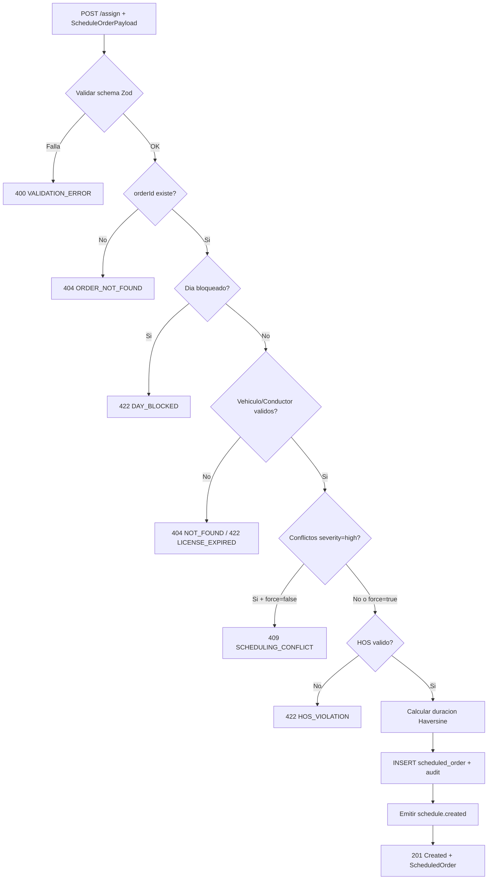
```mermaid
graph TD
    A["POST /assign + ScheduleOrderPayload"] --> B{"Validar schema Zod"}
    B -->|Falla| C["400 VALIDATION_ERROR"]
    B -->|OK| D{"orderId existe?"}
    D -->|No| E["404 ORDER_NOT_FOUND"]
    D -->|Si| F{"Dia bloqueado?"}
    F -->|Si| G["422 DAY_BLOCKED"]
    F -->|No| H{"Vehiculo/Conductor validos?"}
    H -->|No| I["404 NOT_FOUND / 422 LICENSE_EXPIRED"]
    H -->|Si| J{"Conflictos severity=high?"}
    J -->|Si + force=false| K["409 SCHEDULING_CONFLICT"]
    J -->|No o force=true| L{"HOS valido?"}
    L -->|No| M["422 HOS_VIOLATION"]
    L -->|Si| N["Calcular duracion Haversine"]
    N --> O["INSERT scheduled_order + audit"]
    O --> P["Emitir schedule.created"]
    P --> Q["201 Created + ScheduledOrder"]
```

---

## CU-02: Reasignar Recursos

| Atributo | Valor |
|---|---|
| **Endpoint** | `POST /api/v1/operations/scheduling/reassign` |
| **Actor Principal** | Owner / Usuario Maestro / Subusuario (permiso `scheduling:reassign`) |
| **Trigger** | El operador cambia vehiculo o conductor de una orden ya programada |
| **Frecuencia** | 10-30 veces/dia |

**Precondiciones**

| # | Precondicion | Si no se cumple |
|---|---|---|
| PRE-01 | Programacion existe con `scheduleId` valido | HTTP `404 SCHEDULE_NOT_FOUND` |
| PRE-02 | `scheduleStatus` NO es terminal (`completed`, `cancelled`) | HTTP `422 CANNOT_MODIFY_TERMINAL` |
| PRE-03 | Nuevo vehiculo/conductor cumple validaciones de CU-01 (existe, activo, sin conflicto, HOS) | Mismos errores que CU-01 |

**Request Body — ReassignResourcePayload**

| Campo | Tipo | Obligatorio | Validacion |
|---|---|---|---|
| scheduleId | UUID | **Si** | Debe existir en scheduled_orders |
| vehicleId | UUID | No | Si se envia, vehiculo valido |
| driverId | UUID | No | Si se envia, conductor valido con HOS OK |
| reason | string | No | max 2000 chars |

**Secuencia Backend**

| Paso | Accion | Detalle |
|---|---|---|
| 1 | Buscar programacion por `scheduleId` | Si no existe → 404 |
| 2 | Verificar que no esta en estado terminal | Si completed/cancelled → 422 |
| 3 | Validar nuevos recursos (mismas reglas CU-01) | Conflictos, HOS, mantenimiento |
| 4 | UPDATE `scheduled_orders` con nuevos vehicleId/driverId | UPDATE + updated_at = NOW() |
| 5 | Recalcular `scheduleStatus` (scheduled/partial/ready/conflict) | Logica de negocio |
| 6 | INSERT `schedule_audit_logs` con action=`reassigned` | Incluir oldValue → newValue |
| 7 | Emitir evento `schedule.reassigned` | Payload: `{ orderId, oldVehicleId, newVehicleId, oldDriverId, newDriverId }` |
| 8 | Retornar HTTP `200 OK` con `ScheduledOrder` actualizada | Incluir cambios y nuevo status |

**Postcondiciones**

| # | Postcondicion |
|---|---|
| POST-01 | Recurso anterior liberado, nuevo recurso asignado |
| POST-02 | `schedule_audit_logs` tiene registro de reasignacion con old/new values |
| POST-03 | `scheduleStatus` recalculado |
| POST-04 | Evento `schedule.reassigned` emitido |

**Excepciones**

| HTTP | Codigo | Cuando | Respuesta |
|---|---|---|---|
| `404` | SCHEDULE_NOT_FOUND | Programacion no existe o no pertenece al tenant | `{ error: { code, message } }` |
| `422` | CANNOT_MODIFY_TERMINAL | Programacion en estado terminal (completed/cancelled) | `{ error: { code, message } }` |
| `404` | VEHICLE_NOT_FOUND | Nuevo vehiculo no existe o inactivo | `{ error: { code, message } }` |
| `404` | DRIVER_NOT_FOUND | Nuevo conductor no existe o inactivo | `{ error: { code, message } }` |
| `409` | SCHEDULING_CONFLICT | Nuevo recurso genera conflictos severity=high | `{ error: { code, message, details: { conflicts: ScheduleConflict[] } } }` |
| `422` | HOS_VIOLATION | Nuevo conductor excede horas maximas | `{ error: { code, message, details: { violations[], remainingHours } } }` |

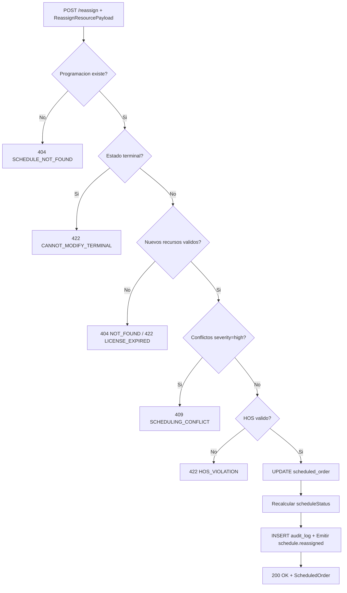
```mermaid
graph TD
    A["POST /reassign + ReassignResourcePayload"] --> B{"Programacion existe?"}
    B -->|No| C["404 SCHEDULE_NOT_FOUND"]
    B -->|Si| D{"Estado terminal?"}
    D -->|Si| E["422 CANNOT_MODIFY_TERMINAL"]
    D -->|No| F{"Nuevos recursos validos?"}
    F -->|No| G["404 NOT_FOUND / 422 LICENSE_EXPIRED"]
    F -->|Si| H{"Conflictos severity=high?"}
    H -->|Si| I["409 SCHEDULING_CONFLICT"]
    H -->|No| J{"HOS valido?"}
    J -->|No| K["422 HOS_VIOLATION"]
    J -->|Si| L["UPDATE scheduled_order"]
    L --> M["Recalcular scheduleStatus"]
    M --> N["INSERT audit_log + Emitir schedule.reassigned"]
    N --> O["200 OK + ScheduledOrder"]
```

---

## CU-03: Desprogramar Orden

| Atributo | Valor |
|---|---|
| **Endpoint** | `POST /api/v1/operations/scheduling/unschedule` |
| **Actor Principal** | Owner / Usuario Maestro / Subusuario (permiso `scheduling:unschedule`) |
| **Trigger** | El operador decide remover una orden del calendario |
| **Frecuencia** | 5-15 veces/dia |

**Precondiciones**

| # | Precondicion | Si no se cumple |
|---|---|---|
| PRE-01 | Programacion existe | HTTP `404 SCHEDULE_NOT_FOUND` |
| PRE-02 | `scheduleStatus` no es terminal ni `in_progress` | HTTP `422 CANNOT_UNSCHEDULE` |
| PRE-03 | `reason` proporcionado (min 1 char) | HTTP `400 VALIDATION_ERROR` |

**Request Body — UnscheduleOrderPayload**

| Campo | Tipo | Obligatorio | Validacion |
|---|---|---|---|
| scheduleId | UUID | **Si** | Existe en scheduled_orders |
| reason | string | **Si** | min 1 char, max 2000 chars |

**Secuencia Backend**

| Paso | Accion |
|---|---|
| 1 | Verificar programacion existe y no esta en estado terminal/in_progress |
| 2 | Liberar vehiculo y conductor (nullificar vehicleId, driverId) |
| 3 | UPDATE `schedule_status = 'unscheduled'`, `updated_at = NOW()` |
| 4 | Eliminar conflictos asociados (`DELETE FROM schedule_conflicts WHERE scheduled_order_id = :id`) |
| 5 | INSERT `schedule_audit_logs` con action=`unscheduled` + reason |
| 6 | Emitir evento `schedule.unscheduled` con `{ orderId, reason }` |
| 7 | Retornar HTTP `200 OK` |

**Postcondiciones**

| # | Postcondicion |
|---|---|
| POST-01 | `scheduleStatus = 'unscheduled'`, vehicleId/driverId = null |
| POST-02 | Conflictos eliminados |
| POST-03 | Audit log con reason |
| POST-04 | Evento `schedule.unscheduled` emitido |

**Excepciones**

| HTTP | Codigo | Cuando | Respuesta |
|---|---|---|---|
| `404` | SCHEDULE_NOT_FOUND | Programacion no existe o no pertenece al tenant | `{ error: { code, message } }` |
| `422` | CANNOT_UNSCHEDULE | Programacion en estado terminal o `in_progress` | `{ error: { code, message } }` |
| `400` | VALIDATION_ERROR | `reason` vacio o ausente | `{ error: { code, message, details: { campo: "mensaje" } } }` |

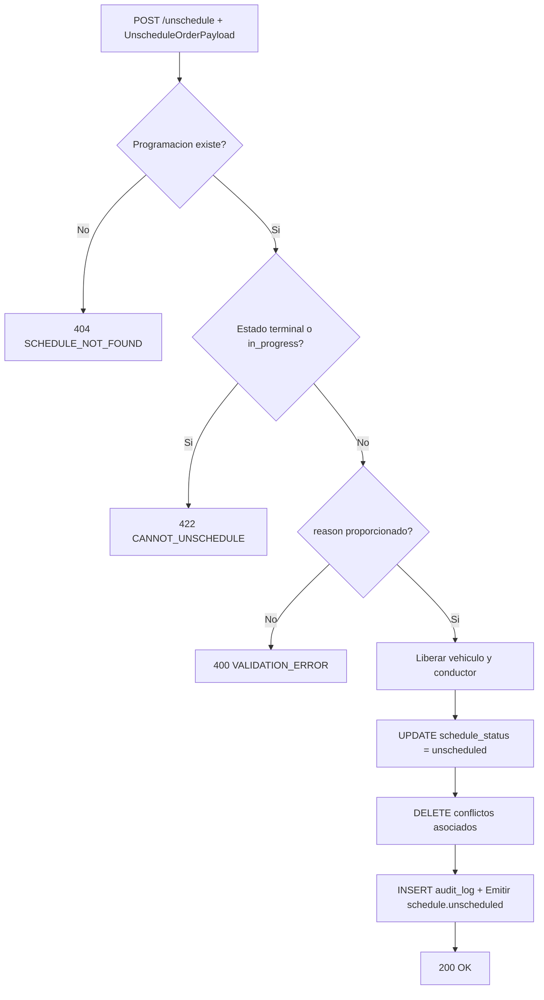
```mermaid
graph TD
    A["POST /unschedule + UnscheduleOrderPayload"] --> B{"Programacion existe?"}
    B -->|No| C["404 SCHEDULE_NOT_FOUND"]
    B -->|Si| D{"Estado terminal o in_progress?"}
    D -->|Si| E["422 CANNOT_UNSCHEDULE"]
    D -->|No| F{"reason proporcionado?"}
    F -->|No| G["400 VALIDATION_ERROR"]
    F -->|Si| H["Liberar vehiculo y conductor"]
    H --> I["UPDATE schedule_status = unscheduled"]
    I --> J["DELETE conflictos asociados"]
    J --> K["INSERT audit_log + Emitir schedule.unscheduled"]
    K --> L["200 OK"]
```

---

## CU-04: Asignacion Masiva (Bulk Assign)

| Atributo | Valor |
|---|---|
| **Endpoint** | `POST /api/v1/operations/scheduling/bulk-assign` |
| **Actor Principal** | Owner / Usuario Maestro / Subusuario (permiso `scheduling:bulk_assign`) |
| **Trigger** | El operador selecciona multiples ordenes y asigna el mismo vehiculo/conductor/fecha |
| **Frecuencia** | 2-10 veces/dia |

**Precondiciones**

| # | Precondicion | Si no se cumple |
|---|---|---|
| PRE-01 | `orderIds[]` con al menos 1 y maximo 50 elementos | HTTP `400 VALIDATION_ERROR` |
| PRE-02 | Todos los `orderIds` existen y pertenecen al tenant | HTTP `404` en resultados parciales |
| PRE-03 | Vehiculo y conductor existen y estan activos | HTTP `404 VEHICLE_NOT_FOUND` / `DRIVER_NOT_FOUND` |

**Request Body**

| Campo | Tipo | Obligatorio | Validacion |
|---|---|---|---|
| orderIds | UUID[] | **Si** | 1-50 elementos |
| vehicleId | UUID | **Si** | Vehiculo activo |
| driverId | UUID | **Si** | Conductor activo con licencia vigente |
| scheduledDate | string ISO | **Si** | Fecha >= hoy |
| notes | string | No | max 2000 chars |

**Secuencia Backend**

| Paso | Accion |
|---|---|
| 1 | Validar vehiculo y conductor una sola vez (reutilizar para todas las ordenes) |
| 2 | Procesar ordenes **secuencialmente** (no paralelo para HOS acumulativo correcto) |
| 3 | Para cada orden: validar conflictos + HOS acumulativo (cada asignacion incrementa hoursToday) |
| 4 | Si una orden falla: registrar error, continuar con la siguiente (partial success) |
| 5 | INSERT `scheduled_orders` para cada orden exitosa |
| 6 | INSERT `schedule_audit_logs` con action=`created` por cada una |
| 7 | Emitir evento `schedule.bulk_assignment` con resumen |
| 8 | Retornar HTTP `200 OK` con `BulkAssignmentResult` |

**Response — BulkAssignmentResult**

```json
{
  "total": 5,
  "success": 4,
  "failed": 1,
  "errors": [
    { "orderId": "uuid-xxx", "orderNumber": "ORD-2026-00123", "error": "HOS_VIOLATION: Excede 11h diarias" }
  ]
}
```

**Postcondiciones**

| # | Postcondicion |
|---|---|
| POST-01 | `BulkAssignmentResult.success` ordenes programadas correctamente |
| POST-02 | Ordenes fallidas NO fueron modificadas |
| POST-03 | Evento `schedule.bulk_assignment` emitido con resumen |

**Excepciones**

| HTTP | Codigo | Cuando | Respuesta |
|---|---|---|---|
| `400` | VALIDATION_ERROR | `orderIds[]` vacio, > 50 elementos, o campos invalidos | `{ error: { code, message, details: { campo: "mensaje" } } }` |
| `404` | VEHICLE_NOT_FOUND | Vehiculo no existe o inactivo | `{ error: { code, message } }` |
| `404` | DRIVER_NOT_FOUND | Conductor no existe o inactivo | `{ error: { code, message } }` |
| `422` | LICENSE_EXPIRED | Licencia del conductor vencida | `{ error: { code, message, details: { expiryDate } } }` |

> **Nota:** Errores por orden individual (conflictos, HOS, orden no encontrada) se reportan en `BulkAssignmentResult.errors[]` y no generan HTTP error global. El endpoint retorna `200 OK` con resultado parcial.

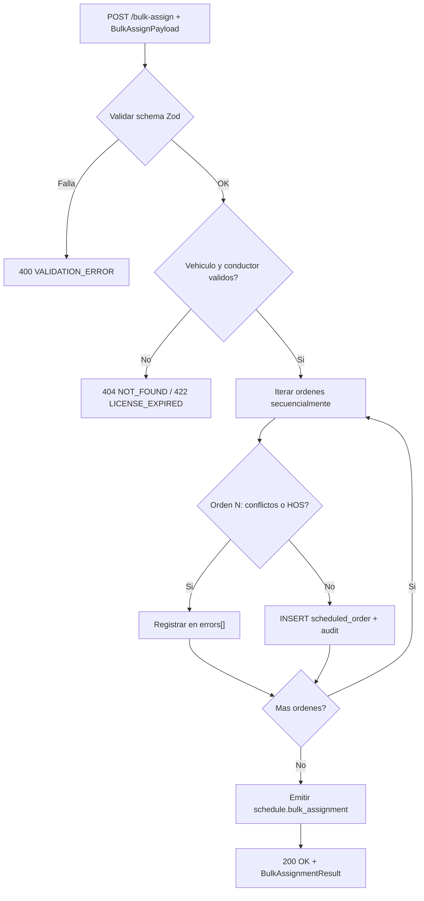
```mermaid
graph TD
    A["POST /bulk-assign + BulkAssignPayload"] --> B{"Validar schema Zod"}
    B -->|Falla| C["400 VALIDATION_ERROR"]
    B -->|OK| D{"Vehiculo y conductor validos?"}
    D -->|No| E["404 NOT_FOUND / 422 LICENSE_EXPIRED"]
    D -->|Si| F["Iterar ordenes secuencialmente"]
    F --> G{"Orden N: conflictos o HOS?"}
    G -->|Si| H["Registrar en errors[]"]
    G -->|No| I["INSERT scheduled_order + audit"]
    H --> J{"Mas ordenes?"}
    I --> J
    J -->|Si| F
    J -->|No| K["Emitir schedule.bulk_assignment"]
    K --> L["200 OK + BulkAssignmentResult"]
```

---

## CU-05: Auto-Programacion

| Atributo | Valor |
|---|---|
| **Endpoint** | `POST /api/v1/operations/scheduling/auto-schedule` |
| **Actor Principal** | Owner / Usuario Maestro / Subusuario (permiso `scheduling:auto_schedule`) |
| **Actor Secundario** | Motor de scoring automatico |
| **Trigger** | El operador ejecuta "Auto-programar" para ordenes pendientes |
| **Frecuencia** | 1-5 veces/dia |

**Precondiciones**

| # | Precondicion | Si no se cumple |
|---|---|---|
| PRE-01 | Existen ordenes pendientes (unscheduled) | HTTP `422 NO_PENDING_ORDERS` |
| PRE-02 | Existen vehiculos y conductores activos disponibles | HTTP `422 NO_RESOURCES_AVAILABLE` |

**Request Body**

| Campo | Tipo | Obligatorio | Validacion |
|---|---|---|---|
| orderIds | UUID[] | No | Si vacio, toma todas las pendientes |
| targetDate | string ISO | No | Default: hoy |
| prioritizeBy | enum | No | `priority` (default), `deadline`, `distance` |

**Secuencia Backend**

| Paso | Accion |
|---|---|
| 1 | Obtener ordenes pendientes (todas o filtradas por orderIds) |
| 2 | Obtener vehiculos y conductores disponibles para la fecha objetivo |
| 3 | Ejecutar algoritmo de scoring: para cada orden evaluar cada par vehiculo/conductor |
| 4 | Score basado en: proximidad geografica, capacidad del vehiculo, HOS del conductor, prioridad, historial |
| 5 | Asignar ordenes al mejor par disponible, en orden de prioridad |
| 6 | Respetar limites HOS acumulativamente (cada asignacion reduce horas disponibles) |
| 7 | Retornar resultado con asignaciones propuestas (no aplicadas hasta confirmacion) |
| 8 | Si el usuario confirma: aplicar como CU-04 (bulk) |

**Response — AutoScheduleResult**

```json
{
  "assigned": 8,
  "failed": 2,
  "assignments": [
    { "orderId": "uuid", "vehicleId": "uuid", "driverId": "uuid", "scheduledDate": "2026-02-15", "score": 87 }
  ],
  "unassignedReasons": [
    { "orderId": "uuid", "reason": "No hay vehiculos con capacidad suficiente" }
  ]
}
```

**Postcondiciones**

| # | Postcondicion |
|---|---|
| POST-01 | Resultado es de solo lectura hasta que el operador confirme |
| POST-02 | Al confirmar: cada asignacion crea registro en scheduled_orders |
| POST-03 | Notificacion generada con resumen |

**Excepciones**

| HTTP | Codigo | Cuando | Respuesta |
|---|---|---|---|
| `422` | NO_PENDING_ORDERS | No existen ordenes pendientes para programar | `{ error: { code, message } }` |
| `422` | NO_RESOURCES_AVAILABLE | No hay vehiculos ni conductores activos disponibles | `{ error: { code, message } }` |
| `400` | VALIDATION_ERROR | Parametros invalidos (orderIds inexistentes, fecha invalida) | `{ error: { code, message, details: { campo: "mensaje" } } }` |

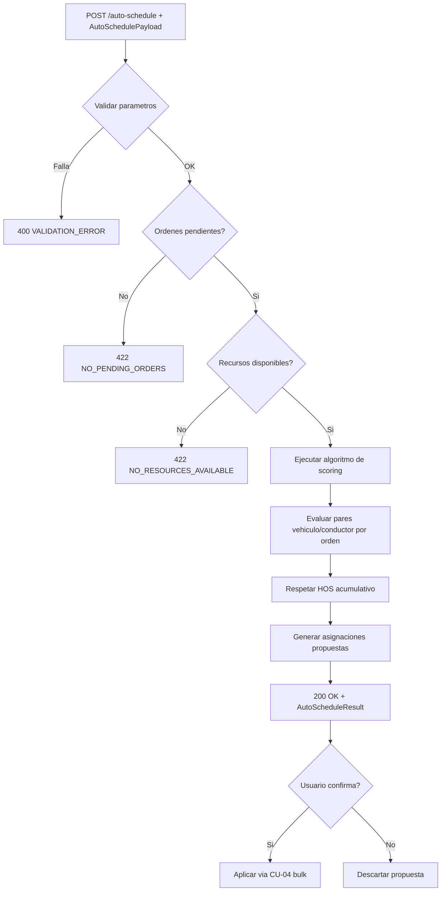
```mermaid
graph TD
    A["POST /auto-schedule + AutoSchedulePayload"] --> B{"Validar parametros"}
    B -->|Falla| C["400 VALIDATION_ERROR"]
    B -->|OK| D{"Ordenes pendientes?"}
    D -->|No| E["422 NO_PENDING_ORDERS"]
    D -->|Si| F{"Recursos disponibles?"}
    F -->|No| G["422 NO_RESOURCES_AVAILABLE"]
    F -->|Si| H["Ejecutar algoritmo de scoring"]
    H --> I["Evaluar pares vehiculo/conductor por orden"]
    I --> J["Respetar HOS acumulativo"]
    J --> K["Generar asignaciones propuestas"]
    K --> L["200 OK + AutoScheduleResult"]
    L --> M{"Usuario confirma?"}
    M -->|Si| N["Aplicar via CU-04 bulk"]
    M -->|No| O["Descartar propuesta"]
```

---

## CU-06: Resolver Conflicto

| Atributo | Valor |
|---|---|
| **Endpoint** | `POST /api/v1/operations/scheduling/resolve-conflict` |
| **Actor Principal** | Owner / Usuario Maestro / Subusuario (permiso `scheduling:resolve_conflict`) |
| **Trigger** | El operador selecciona un conflicto y elige resolucion |
| **Frecuencia** | 5-20 veces/dia |

**Precondiciones**

| # | Precondicion | Si no se cumple |
|---|---|---|
| PRE-01 | Conflicto con `conflictId` existe y no esta resuelto | HTTP `404 CONFLICT_NOT_FOUND` |
| PRE-02 | Programacion asociada tiene `scheduleStatus = 'conflict'` | HTTP `422 NOT_IN_CONFLICT_STATE` |

**Secuencia Backend**

| Paso | Accion |
|---|---|
| 1 | Buscar conflicto por ID |
| 2 | Aplicar resolucion (reasignar recurso, cambiar fecha, forzar asignacion) |
| 3 | Validar que la resolucion no genera nuevos conflictos |
| 4 | UPDATE `schedule_conflicts` → `resolved_at = NOW(), resolved_by = userId` |
| 5 | UPDATE `scheduled_orders` → recalcular `scheduleStatus`, `has_conflict = false` si no quedan conflictos |
| 6 | INSERT `schedule_audit_logs` con action=`conflict_resolved` |
| 7 | Emitir evento `schedule.conflict_resolved` |
| 8 | Retornar HTTP `200 OK` |

**Postcondiciones**

| # | Postcondicion |
|---|---|
| POST-01 | Conflicto marcado como resuelto |
| POST-02 | `scheduleStatus` recalculado (scheduled/partial/ready) |
| POST-03 | Evento `schedule.conflict_resolved` emitido |

**Excepciones**

| HTTP | Codigo | Cuando | Respuesta |
|---|---|---|---|
| `404` | CONFLICT_NOT_FOUND | Conflicto no existe o ya fue resuelto | `{ error: { code, message } }` |
| `422` | NOT_IN_CONFLICT_STATE | Programacion no esta en estado `conflict` | `{ error: { code, message } }` |
| `409` | SCHEDULING_CONFLICT | La resolucion genera nuevos conflictos | `{ error: { code, message, details: { conflicts: ScheduleConflict[] } } }` |

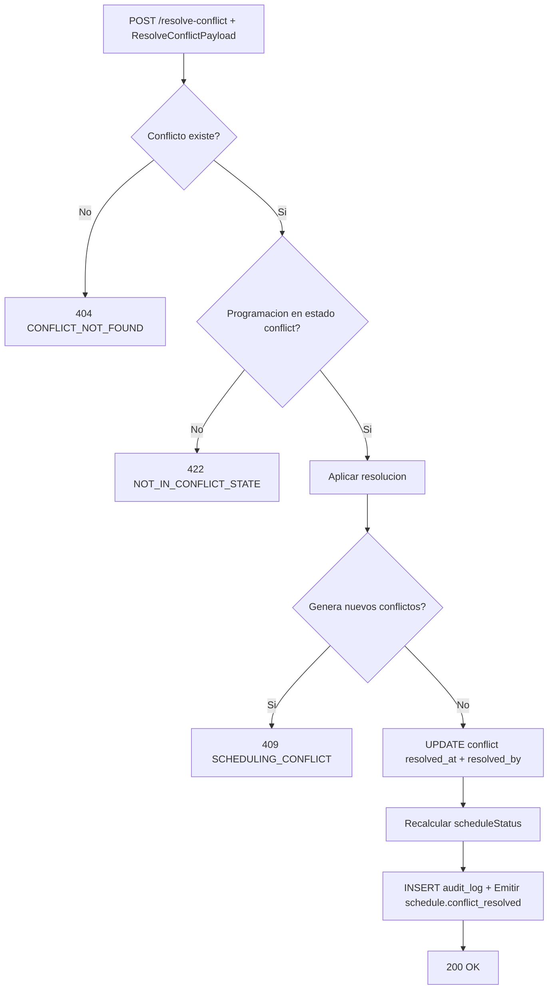
```mermaid
graph TD
    A["POST /resolve-conflict + ResolveConflictPayload"] --> B{"Conflicto existe?"}
    B -->|No| C["404 CONFLICT_NOT_FOUND"]
    B -->|Si| D{"Programacion en estado conflict?"}
    D -->|No| E["422 NOT_IN_CONFLICT_STATE"]
    D -->|Si| F["Aplicar resolucion"]
    F --> G{"Genera nuevos conflictos?"}
    G -->|Si| H["409 SCHEDULING_CONFLICT"]
    G -->|No| I["UPDATE conflict resolved_at + resolved_by"]
    I --> J["Recalcular scheduleStatus"]
    J --> K["INSERT audit_log + Emitir schedule.conflict_resolved"]
    K --> L["200 OK"]
```

---

## CU-07: Bloquear / Desbloquear Dia

| Atributo | Valor |
|---|---|
| **Endpoint Bloquear** | `POST /api/v1/operations/scheduling/block-day` |
| **Endpoint Desbloquear** | `DELETE /api/v1/operations/scheduling/block-day/:id` |
| **Actor Principal** | Owner / Usuario Maestro (permiso `scheduling:block_day`). **Subusuario NO tiene acceso.** |
| **Trigger** | Feriado, paro, mantenimiento masivo |
| **Frecuencia** | 1-5 veces/semana |

**Precondiciones (bloquear)**

| # | Precondicion | Si no se cumple |
|---|---|---|
| PRE-01 | Rol es Owner o Usuario Maestro (Subusuario NO permitido) | HTTP `403 FORBIDDEN` |
| PRE-02 | `date` no esta ya bloqueada con el mismo `blockType` | HTTP `409 ALREADY_BLOCKED` |
| PRE-03 | `reason` proporcionado (min 1 char) | HTTP `400 VALIDATION_ERROR` |

**Request Body (bloquear)**

| Campo | Tipo | Obligatorio | Validacion |
|---|---|---|---|
| date | string ISO | **Si** | Fecha valida |
| reason | string | **Si** | min 1 char, max 500 chars |
| blockType | enum | **Si** | `full_day`, `partial`, `holiday` |
| appliesToAll | boolean | **Si** | true = todos los recursos, false = solo resourceIds |
| resourceIds | UUID[] | Condicional | Obligatorio si appliesToAll = false |
| createdBy | UUID | Auto | Se toma del JWT |

**Secuencia Backend (bloquear)**

| Paso | Accion |
|---|---|
| 1 | Verificar que el rol tiene permiso `scheduling:block_day` (solo Owner, Usuario Maestro) |
| 2 | Verificar que no existe bloqueo duplicado (mismo tenant, fecha, tipo) |
| 3 | INSERT en `blocked_days` |
| 4 | Si existen ordenes programadas en esa fecha: generar alertas/notificaciones |
| 5 | Emitir evento `schedule.day_blocked` |
| 6 | Retornar HTTP `201 Created` con `BlockedDay` |

**Secuencia Backend (desbloquear)**

| Paso | Accion |
|---|---|
| 1 | Verificar que el bloqueo con `:id` existe y pertenece al tenant |
| 2 | DELETE de `blocked_days` |
| 3 | Retornar HTTP `204 No Content` |

**Postcondiciones**

| # | Postcondicion |
|---|---|
| POST-01 | Dia bloqueado/desbloqueado en BD |
| POST-02 | Calendario refleja cambio |
| POST-03 | Evento `schedule.day_blocked` emitido (solo bloqueo) |

**Excepciones**

| HTTP | Codigo | Cuando | Respuesta |
|---|---|---|---|
| `403` | FORBIDDEN | Subusuario intenta bloquear/desbloquear (no permitido) | `{ error: { code, message } }` |
| `409` | ALREADY_BLOCKED | Ya existe bloqueo con mismo tipo en esa fecha | `{ error: { code, message } }` |
| `400` | VALIDATION_ERROR | `reason` vacio, `blockType` invalido, o `resourceIds` faltante cuando `appliesToAll=false` | `{ error: { code, message, details: { campo: "mensaje" } } }` |
| `404` | BLOCK_NOT_FOUND | Bloqueo con `:id` no existe (al desbloquear) | `{ error: { code, message } }` |

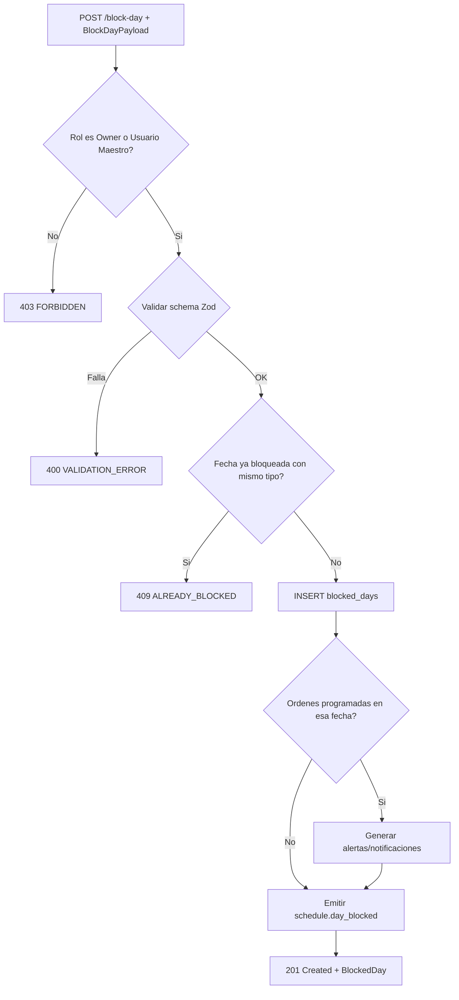
```mermaid
graph TD
    A["POST /block-day + BlockDayPayload"] --> B{"Rol es Owner o Usuario Maestro?"}
    B -->|No| C["403 FORBIDDEN"]
    B -->|Si| D{"Validar schema Zod"}
    D -->|Falla| E["400 VALIDATION_ERROR"]
    D -->|OK| F{"Fecha ya bloqueada con mismo tipo?"}
    F -->|Si| G["409 ALREADY_BLOCKED"]
    F -->|No| H["INSERT blocked_days"]
    H --> I{"Ordenes programadas en esa fecha?"}
    I -->|Si| J["Generar alertas/notificaciones"]
    I -->|No| K["Emitir schedule.day_blocked"]
    J --> K
    K --> L["201 Created + BlockedDay"]
```

---

## CU-08: Consultar Calendario / Timeline / Gantt

| Atributo | Valor |
|---|---|
| **Endpoints** | `GET /calendar`, `GET /timeline`, `GET /gantt` |
| **Actor Principal** | Owner / Usuario Maestro / Subusuario (permiso `scheduling:read`) |
| **Trigger** | Navegacion a la vista de Programacion |
| **Frecuencia** | 100-500 veces/dia |

**Precondiciones**

| # | Precondicion | Si no se cumple |
|---|---|---|
| PRE-01 | Token JWT valido | HTTP `401 UNAUTHORIZED` |
| PRE-02 | Usuario tiene permiso `scheduling:read` | HTTP `403 FORBIDDEN` |

**Endpoints y parametros**

| Vista | Endpoint | Query Params |
|---|---|---|
| **Calendario** | `GET /api/v1/operations/scheduling/calendar` | `month` (YYYY-MM), `vehicleId?`, `statuses[]?`, `onlyWithConflicts?` |
| **Timeline** | `GET /api/v1/operations/scheduling/timeline` | `date` (YYYY-MM-DD), `resourceType?` (vehicle/driver) |
| **Gantt** | `GET /api/v1/operations/scheduling/gantt` | `startDate` (ISO), `days` (default: 7) |
| **KPIs** | `GET /api/v1/operations/scheduling/kpis` | — |

**Response Calendario** — `CalendarDayData[]`

```json
[{
  "date": "2026-02-15",
  "dayOfMonth": 15,
  "isToday": true,
  "isCurrentMonth": true,
  "isWeekend": false,
  "isBlocked": false,
  "scheduledOrders": [{ "...ScheduledOrder" }],
  "capacitySummary": {
    "totalVehicles": 20,
    "assignedVehicles": 12,
    "totalOrders": 18,
    "ordersWithConflicts": 2,
    "ordersWithoutResource": 3,
    "totalCapacityKg": 150000,
    "usedCapacityKg": 87000,
    "utilizationPercent": 58
  }
}]
```

**Postcondiciones**

| # | Postcondicion |
|---|---|
| POST-01 | Datos filtrados por `tenantId` del JWT |
| POST-02 | Subusuario sin permisos de modificacion puede consultar pero no ejecutar CU-01 a CU-07 |

**Secuencia Backend**

| Paso | Accion | Detalle |
|---|---|---|
| 1 | Validar token JWT y permiso `scheduling:read` | Si no → 401/403 |
| 2 | Extraer `tenantId` del JWT | Filtrado multi-tenant obligatorio |
| 3 | Parsear query params (`month`, `date`, `startDate`, `days`, filtros) | Validar formatos de fecha |
| 4 | Consultar `scheduled_orders` + JOINs con `orders`, `vehicles`, `drivers` | Filtrar por tenant + rango de fecha + statuses |
| 5 | Consultar `blocked_days` para el rango solicitado | Incluir en datos del calendario |
| 6 | Consultar `schedule_conflicts` activos | Incluir en cada orden afectada |
| 7 | Calcular `capacitySummary` (calendario) o `utilization` (timeline/Gantt) | Metricas agregadas por dia/recurso |
| 8 | Si vista KPIs: calcular `pendingOrders`, `scheduledToday`, `atRiskOrders`, `fleetUtilization`, etc. | Queries agregados |
| 9 | Retornar HTTP `200 OK` con datos formateados segun vista | `CalendarDayData[]`, `ResourceTimeline[]`, o `GanttResourceRow[]` |

**Excepciones**

| HTTP | Codigo | Cuando | Respuesta |
|---|---|---|---|
| `401` | UNAUTHORIZED | Token JWT invalido o expirado | `{ error: { code, message } }` |
| `403` | FORBIDDEN | Usuario sin permiso `scheduling:read` | `{ error: { code, message } }` |
| `400` | VALIDATION_ERROR | Parametros de fecha invalidos (formato incorrecto, rango excesivo) | `{ error: { code, message, details: { campo: "mensaje" } } }` |

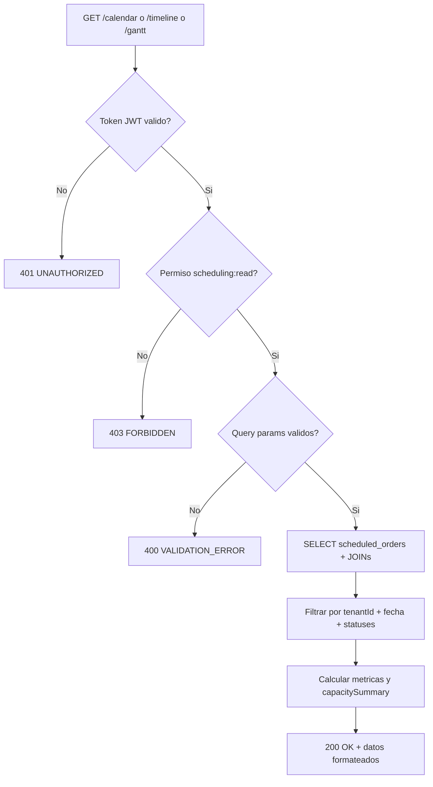
```mermaid
graph TD
    A["GET /calendar o /timeline o /gantt"] --> B{"Token JWT valido?"}
    B -->|No| C["401 UNAUTHORIZED"]
    B -->|Si| D{"Permiso scheduling:read?"}
    D -->|No| E["403 FORBIDDEN"]
    D -->|Si| F{"Query params validos?"}
    F -->|No| G["400 VALIDATION_ERROR"]
    F -->|Si| H["SELECT scheduled_orders + JOINs"]
    H --> I["Filtrar por tenantId + fecha + statuses"]
    I --> J["Calcular metricas y capacitySummary"]
    J --> K["200 OK + datos formateados"]
```

---

## CU-09: Exportar Programacion

| Atributo | Valor |
|---|---|
| **Endpoint** | `GET /api/v1/operations/scheduling/export` |
| **Actor Principal** | Owner / Usuario Maestro / Subusuario (permiso `scheduling:export`) |
| **Trigger** | El operador hace clic en "Exportar CSV" |
| **Frecuencia** | 2-10 veces/dia |

**Precondiciones**

| # | Precondicion | Si no se cumple |
|---|---|---|
| PRE-01 | Token JWT valido y no expirado | HTTP `401 UNAUTHORIZED` |
| PRE-02 | Usuario tiene permiso `scheduling:export` | HTTP `403 FORBIDDEN` |
| PRE-03 | `format` es `csv` o `xlsx` (si se proporciona) | HTTP `400 VALIDATION_ERROR` |
| PRE-04 | `dateFrom < dateTo` (si ambos se proporcionan) | HTTP `400 VALIDATION_ERROR` |

**Query Params**

| Param | Tipo | Obligatorio | Descripcion |
|---|---|---|---|
| format | enum | No | `csv` (default), `xlsx` |
| dateFrom | string ISO | No | Fecha inicio |
| dateTo | string ISO | No | Fecha fin |
| statuses | string[] | No | Filtrar por estados |

**Columnas del CSV**

| Columna | Descripcion |
|---|---|
| Orden | orderNumber |
| Referencia | reference |
| Cliente | customer.name |
| Estado | status |
| Prioridad | priority |
| Vehiculo | vehicle.plate |
| Conductor | driver.fullName |
| Origen | milestones[origin].geofenceName |
| Destino | milestones[destination].geofenceName |
| Fecha Prog. | scheduledDate |
| Peso (kg) | cargo.weightKg |

**Postcondiciones**

| # | Postcondicion |
|---|---|
| POST-01 | Archivo descargado con datos filtrados por tenant |
| POST-02 | Solo incluye ordenes a las que el usuario tiene acceso |

**Secuencia Backend**

| Paso | Accion | Detalle |
|---|---|---|
| 1 | Validar token JWT y permiso `scheduling:export` | Si no → 401/403 |
| 2 | Validar query params (`format`, `dateFrom`, `dateTo`, `statuses[]`) | Si invalidos → 400 |
| 3 | Consultar `scheduled_orders` filtradas por tenant + rango de fecha + statuses | JOINs con orders, vehicles, drivers |
| 4 | Formatear datos segun columnas del CSV/XLSX | Mapear campos a nombres legibles |
| 5 | Generar archivo en formato solicitado (`csv` o `xlsx`) | Encoding UTF-8 con BOM para compatibilidad Excel |
| 6 | Retornar HTTP `200 OK` con `Content-Type` y `Content-Disposition` apropiados | Header: `attachment; filename="scheduling_export_YYYY-MM-DD.csv"` |

**Excepciones**

| HTTP | Codigo | Cuando | Respuesta |
|---|---|---|---|
| `401` | UNAUTHORIZED | Token JWT invalido o expirado | `{ error: { code, message } }` |
| `403` | FORBIDDEN | Usuario sin permiso `scheduling:export` | `{ error: { code, message } }` |
| `400` | VALIDATION_ERROR | Formato invalido, rango de fechas incorrecto | `{ error: { code, message, details: { campo: "mensaje" } } }` |

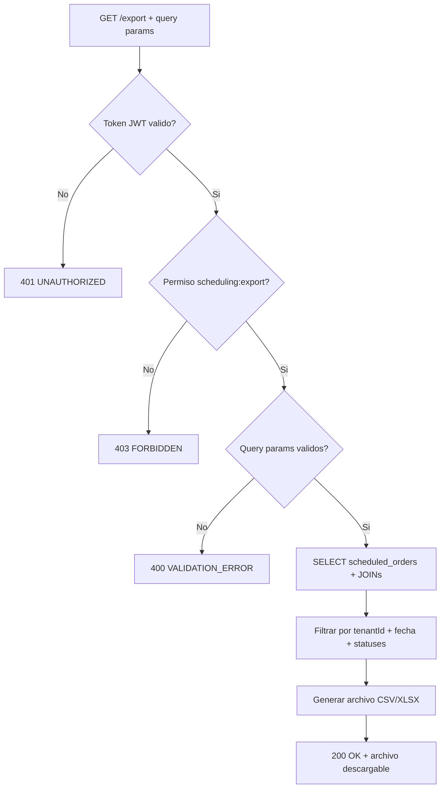
```mermaid
graph TD
    A["GET /export + query params"] --> B{"Token JWT valido?"}
    B -->|No| C["401 UNAUTHORIZED"]
    B -->|Si| D{"Permiso scheduling:export?"}
    D -->|No| E["403 FORBIDDEN"]
    D -->|Si| F{"Query params validos?"}
    F -->|No| G["400 VALIDATION_ERROR"]
    F -->|Si| H["SELECT scheduled_orders + JOINs"]
    H --> I["Filtrar por tenantId + fecha + statuses"]
    I --> J["Generar archivo CSV/XLSX"]
    J --> K["200 OK + archivo descargable"]
```

### Diagrama general de interaccion CU

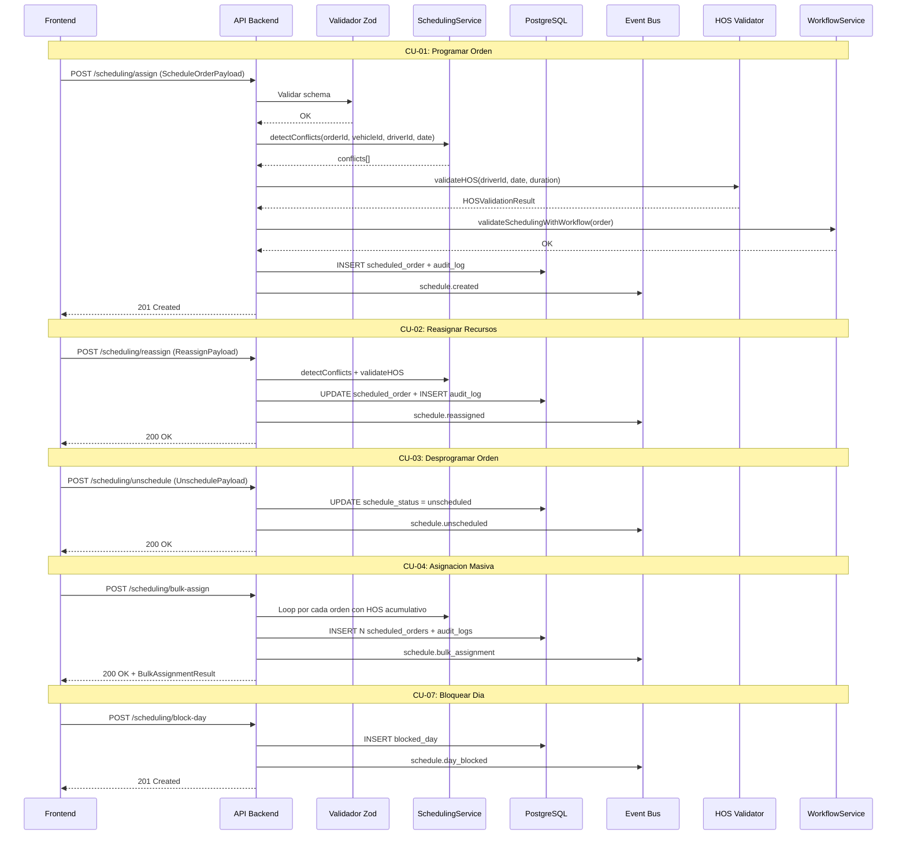
```mermaid
sequenceDiagram
    participant FE as Frontend
    participant API as API Backend
    participant VAL as Validador Zod
    participant SCHED as SchedulingService
    participant DB as PostgreSQL
    participant EVT as Event Bus
    participant HOS as HOS Validator
    participant WF as WorkflowService

    Note over FE,WF: CU-01: Programar Orden
    FE->>API: POST /scheduling/assign (ScheduleOrderPayload)
    API->>VAL: Validar schema
    VAL-->>API: OK
    API->>SCHED: detectConflicts(orderId, vehicleId, driverId, date)
    SCHED-->>API: conflicts[]
    API->>HOS: validateHOS(driverId, date, duration)
    HOS-->>API: HOSValidationResult
    API->>WF: validateSchedulingWithWorkflow(order)
    WF-->>API: OK
    API->>DB: INSERT scheduled_order + audit_log
    API->>EVT: schedule.created
    API-->>FE: 201 Created

    Note over FE,WF: CU-02: Reasignar Recursos
    FE->>API: POST /scheduling/reassign (ReassignPayload)
    API->>SCHED: detectConflicts + validateHOS
    API->>DB: UPDATE scheduled_order + INSERT audit_log
    API->>EVT: schedule.reassigned
    API-->>FE: 200 OK

    Note over FE,WF: CU-03: Desprogramar Orden
    FE->>API: POST /scheduling/unschedule (UnschedulePayload)
    API->>DB: UPDATE schedule_status = unscheduled
    API->>EVT: schedule.unscheduled
    API-->>FE: 200 OK

    Note over FE,WF: CU-04: Asignacion Masiva
    FE->>API: POST /scheduling/bulk-assign
    API->>SCHED: Loop por cada orden con HOS acumulativo
    API->>DB: INSERT N scheduled_orders + audit_logs
    API->>EVT: schedule.bulk_assignment
    API-->>FE: 200 OK + BulkAssignmentResult

    Note over FE,WF: CU-07: Bloquear Dia
    FE->>API: POST /scheduling/block-day
    API->>DB: INSERT blocked_day
    API->>EVT: schedule.day_blocked
    API-->>FE: 201 Created
```

---

# 9. Endpoints API REST

**Base path:** `/api/v1/operations/scheduling`

| # | Metodo | Endpoint | Descripcion | Permiso | Request Body / Query | Response |
|---|---|---|---|---|---|---|
| E-01 | GET | /orders | Listar ordenes programables con filtros | scheduling:read | Query: search, companyId, operatorId, priority, dateFrom, dateTo, onlyAssigned, onlyUnassigned | `{ items: Order[], total }` |
| E-02 | POST | /assign | Programar orden (asignar recursos) | scheduling:assign | ScheduleOrderPayload | `201` ScheduledOrder |
| E-03 | POST | /unschedule | Desprogramar orden | scheduling:unschedule | UnscheduleOrderPayload | `200` OK |
| E-04 | POST | /reassign | Reasignar recursos a orden programada | scheduling:reassign | ReassignResourcePayload | `200` ScheduledOrder actualizada |
| E-05 | POST | /bulk-assign | Asignacion masiva | scheduling:bulk_assign | `{ orderIds[], vehicleId, driverId, scheduledDate, notes? }` | `200` BulkAssignmentResult |
| E-06 | GET | /calendar | Vista de calendario mensual | scheduling:read | Query: month (YYYY-MM), vehicleId?, statuses[]?, onlyWithConflicts? | CalendarDayDataExtended[] |
| E-07 | GET | /timeline | Vista linea de tiempo por dia | scheduling:read | Query: date (YYYY-MM-DD), resourceType? | ResourceTimelineExtended[] |
| E-08 | GET | /conflicts | Listar conflictos activos | scheduling:read | — | ScheduleConflict[] |
| E-09 | POST | /resolve-conflict | Resolver conflicto | scheduling:resolve_conflict | `{ conflictId, resolution }` | `200` OK |
| E-10 | GET | /suggestions/:orderId | Obtener sugerencias de recursos | scheduling:read | Query: date (ISO) | ResourceSuggestion[] |
| E-11 | POST | /validate-hos | Validar horas de servicio | scheduling:read | `{ driverId, date, estimatedDuration }` | HOSValidationResult |
| E-12 | GET | /kpis | KPIs de programacion | scheduling:read | — | SchedulingKPIs |
| E-13 | POST | /block-day | Bloquear dia | scheduling:block_day | BlockedDay (sin id, createdAt) | `201` BlockedDay |
| E-14 | DELETE | /block-day/:id | Desbloquear dia | scheduling:block_day | — | `204` No Content |
| E-15 | GET | /blocked-days | Listar dias bloqueados | scheduling:read | — | BlockedDay[] |
| E-16 | POST | /auto-schedule | Auto-programacion | scheduling:auto_schedule | `{ orderIds[]?, targetDate?, prioritizeBy? }` | AutoScheduleResult |
| E-17 | GET | /gantt | Vista Gantt multi-dia | scheduling:read | Query: startDate (ISO), days (default: 7) | GanttResourceRow[] |
| E-18 | GET | /audit-logs | Historial de auditoria | scheduling:read | Query: scheduleId?, action?, dateFrom?, dateTo? | ScheduleAuditLog[] |
| E-19 | GET | /export | Exportar programacion a CSV/XLSX | scheduling:export | Query: format?, dateFrom?, dateTo?, statuses[]? | Archivo descargable |
| E-20 | POST | /detect-conflicts | Detectar conflictos (pre-validacion) | scheduling:read | `{ orderId, vehicleId, driverId, scheduledDate }` | ScheduleConflict[] |
| E-21 | POST | /reschedule | Reprogramar orden a otra fecha/hora | scheduling:reassign | `{ orderId, newDate, newResourceId? }` | ScheduledOrder |
| E-22 | GET | /notifications | Listar notificaciones del modulo | scheduling:read | — | SchedulingNotification[] |

### Diagrama de flujo API

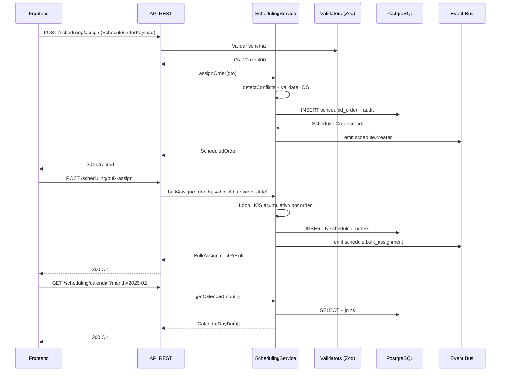
```mermaid
sequenceDiagram
    participant FE as Frontend
    participant API as API REST
    participant SVC as SchedulingService
    participant VAL as Validators (Zod)
    participant DB as PostgreSQL
    participant EVT as Event Bus

    FE->>API: POST /scheduling/assign (ScheduleOrderPayload)
    API->>VAL: Validar schema
    VAL-->>API: OK / Error 400
    API->>SVC: assignOrder(dto)
    SVC->>SVC: detectConflicts + validateHOS
    SVC->>DB: INSERT scheduled_order + audit
    DB-->>SVC: ScheduledOrder creada
    SVC->>EVT: emit schedule.created
    SVC-->>API: ScheduledOrder
    API-->>FE: 201 Created

    FE->>API: POST /scheduling/bulk-assign
    API->>SVC: bulkAssign(orderIds, vehicleId, driverId, date)
    SVC->>SVC: Loop HOS acumulativo por orden
    SVC->>DB: INSERT N scheduled_orders
    SVC->>EVT: emit schedule.bulk_assignment
    SVC-->>API: BulkAssignmentResult
    API-->>FE: 200 OK

    FE->>API: GET /scheduling/calendar?month=2026-02
    API->>SVC: getCalendar(month)
    SVC->>DB: SELECT + joins
    SVC-->>API: CalendarDayData[]
    API-->>FE: 200 OK
```

---

# 10. Eventos de Dominio

### Catalogo

| Evento | Payload | Se emite cuando | Modulos suscriptores |
|---|---|---|---|
| schedule.created | orderId, vehicleId, driverId, scheduledDate, vehiclePlate, driverName | Se programa una orden | Monitoreo, Notificaciones |
| schedule.updated | orderId, changes | Se actualiza fecha/hora/notas de programacion | Notificaciones |
| schedule.reassigned | orderId, oldVehicleId, newVehicleId, oldDriverId, newDriverId | Se reasignan recursos | Monitoreo, Notificaciones |
| schedule.unscheduled | orderId, reason | Se desprograma una orden | Notificaciones, Ordenes |
| schedule.conflict_detected | orderId, conflictType, severity | Sistema detecta conflicto | Notificaciones |
| schedule.conflict_resolved | orderId, conflictId, resolution | Conflicto resuelto | Notificaciones |
| schedule.hos_warning | driverId, hoursWorked, maxHours | Conductor cerca del limite HOS | Notificaciones, Compliance |
| schedule.bulk_assignment | totalOrders, successCount, failCount | Asignacion masiva completada | Notificaciones |
| schedule.day_blocked | date, reason, blockedBy | Dia bloqueado para programacion | Notificaciones |

### Diagrama de propagacion

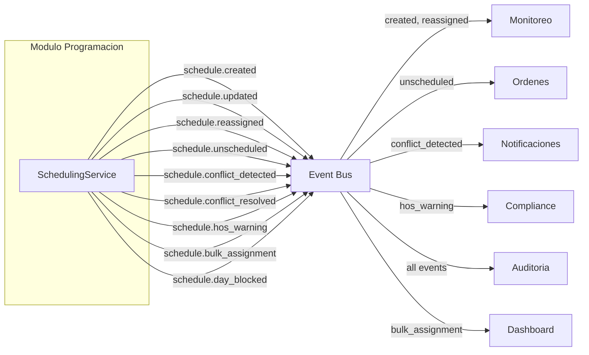
```mermaid
graph LR
    subgraph "Modulo Programacion"
        SS[SchedulingService]
    end

    SS -->|schedule.created| EB["Event Bus"]
    SS -->|schedule.updated| EB
    SS -->|schedule.reassigned| EB
    SS -->|schedule.unscheduled| EB
    SS -->|schedule.conflict_detected| EB
    SS -->|schedule.conflict_resolved| EB
    SS -->|schedule.hos_warning| EB
    SS -->|schedule.bulk_assignment| EB
    SS -->|schedule.day_blocked| EB

    EB -->|created, reassigned| MON["Monitoreo"]
    EB -->|unscheduled| ORD["Ordenes"]
    EB -->|conflict_detected| NOTIF["Notificaciones"]
    EB -->|hos_warning| COMP["Compliance"]
    EB -->|all events| AUDIT["Auditoria"]
    EB -->|bulk_assignment| DASH["Dashboard"]
```

### Eventos que CONSUME este modulo

| Evento externo | Origen | Accion en Programacion |
|---|---|---|
| order.created | Modulo Ordenes | Crear entrada `unscheduled` en scheduled_orders |
| order.status_changed (→ in_transit) | Modulo Ordenes | Transicionar scheduleStatus → `in_progress` |
| order.completed | Modulo Ordenes | Transicionar scheduleStatus → `completed` |
| order.cancelled | Modulo Ordenes | Transicionar scheduleStatus → `cancelled`, liberar recursos |
| maintenance.scheduled | Modulo Mantenimiento | Generar conflicto `vehicle_maintenance` si hay ordenes en esa fecha |

---

# 11. Reglas de Negocio Clave

| # | Regla | Descripcion |
|---|---|---|
| R-01 | Estados terminales | `completed` y `cancelled` no tienen transiciones de salida |
| R-02 | Asignacion minima | Se puede programar con solo vehiculo, solo conductor, o ambos. Si falta uno, `scheduleStatus = 'partial'` |
| R-03 | HOS acumulativo | La validacion HOS suma las horas de TODAS las ordenes del conductor en el mismo dia, no solo la actual |
| R-04 | Conflictos por ventana de tiempo | Solapamiento se detecta por `startHour < existingEnd AND existingStart < newEnd`, no solo por dia |
| R-05 | Force assignment | Si `force = true`, ignora conflictos severity=high pero los registra como warnings |
| R-06 | Dia bloqueado impide asignacion | Si un dia esta bloqueado (full_day + appliesToAll), no se puede programar ordenes en ese dia |
| R-07 | Desprogramar libera recursos | Al desprogramar, vehiculo y conductor quedan disponibles para otras ordenes |
| R-08 | Auto-scheduling es propuesta | Los resultados de auto-programacion no se aplican hasta que el operador confirme |
| R-09 | Auditoria inmutable | Cada cambio genera `ScheduleAuditLog`. NUNCA se modifica ni elimina |
| R-10 | Duracion estimada por Haversine | `estimatedDuration = distancia_km / 55 km/h + 1h buffer`. Min 2 horas |
| R-11 | Estado `ready` requiere validacion | Solo pasa a `ready` si vehicleId AND driverId AND conflicts.length === 0 AND HOS valido |
| R-12 | Conflictos en cascada | Si se asigna un vehiculo a una orden y esto genera conflicto en otra orden ya programada, ambas ordenes se marcan con conflicto |
| R-13 | Notificaciones internas | Cada conflicto detectado, asignacion masiva y bloqueo de dia genera notificacion en el modulo |
| R-14 | Multi-tenant | Todos los queries filtran por `tenantId`. Un usuario solo ve/modifica programaciones de su tenant |
| R-15 | Persistencia en localStorage (frontend) | El frontend persiste `scheduledOrders` en localStorage para UX inmediata mientras se sincroniza con la API |
| R-16 | Bulk max 50 | Asignacion masiva permite maximo 50 ordenes por llamada |

---

# 12. Catalogo de Errores HTTP

| HTTP | Codigo interno | Cuando ocurre | Resolucion |
|---|---|---|---|
| 400 | VALIDATION_ERROR | Campos invalidos segun schema Zod | Leer details: mapa {campo: mensaje} |
| 401 | UNAUTHORIZED | Token JWT ausente o expirado | Redirigir a /login |
| 403 | FORBIDDEN | Sin permisos para la operacion | Verificar rol del usuario (ver seccion 13) |
| 404 | ORDER_NOT_FOUND | orderId no existe o no pertenece al tenant | Verificar UUID |
| 404 | VEHICLE_NOT_FOUND | vehicleId no existe o inactivo | Seleccionar otro vehiculo |
| 404 | DRIVER_NOT_FOUND | driverId no existe o licencia vencida | Seleccionar otro conductor |
| 404 | SCHEDULE_NOT_FOUND | scheduledOrderId no existe | Verificar UUID |
| 404 | CONFLICT_NOT_FOUND | conflictId no existe o ya resuelto | Verificar ID |
| 409 | SCHEDULING_CONFLICT | Conflictos de severidad alta al asignar | Resolver conflicto o usar force=true |
| 409 | VEHICLE_MAINTENANCE | Vehiculo en mantenimiento en esa fecha | Elegir otro vehiculo |
| 409 | ALREADY_BLOCKED | Dia ya bloqueado con el mismo tipo | — |
| 422 | DAY_BLOCKED | Dia bloqueado para programacion | Elegir otra fecha o desbloquear |
| 422 | LICENSE_EXPIRED | Licencia del conductor vencida | Seleccionar otro conductor |
| 422 | HOS_VIOLATION | Conductor excede limites FMCSA | Reasignar conductor o reprogramar |
| 422 | CANNOT_MODIFY_TERMINAL | Intento de modificar programacion en estado terminal | Estado es completed/cancelled |
| 422 | CANNOT_UNSCHEDULE | Intento de desprogramar orden en ejecucion | Orden ya esta in_progress |
| 422 | NO_PENDING_ORDERS | Auto-programacion sin ordenes pendientes | Verificar que existan ordenes unscheduled |
| 422 | NO_RESOURCES_AVAILABLE | Auto-programacion sin recursos disponibles | Verificar vehiculos/conductores activos |
| 422 | NOT_IN_CONFLICT_STATE | Resolver conflicto en orden sin estado conflict | Verificar scheduleStatus |
| 500 | INTERNAL_ERROR | Error inesperado del servidor | Reintentar; si persiste, contactar soporte |

---

# 13. Permisos RBAC

**Modelo de 3 roles (definicion Edson). Arquitectura multi-tenant con control granular por modulo y accion.**

```
Owner (Proveedor TMS)
  └── Cuenta Cliente (Tenant)
        └── Usuario Maestro (Admin de cuenta)
              └── Subusuarios (Operadores con permisos configurables)
```

> **Leyenda:** ✅ = Permitido siempre | ⚙️ = Configurable por el Usuario Maestro | ❌ = Denegado (no configurable)

| Permiso | Owner | Usuario Maestro | Subusuario |
|---|:---:|:---:|:---:|
| scheduling:read | ✅ | ✅ | ⚙️ |
| scheduling:assign | ✅ | ✅ | ⚙️ |
| scheduling:reassign | ✅ | ✅ | ⚙️ |
| scheduling:unschedule | ✅ | ✅ | ⚙️ |
| scheduling:bulk_assign | ✅ | ✅ | ⚙️ |
| scheduling:auto_schedule | ✅ | ✅ | ⚙️ |
| scheduling:resolve_conflict | ✅ | ✅ | ⚙️ |
| scheduling:block_day | ✅ | ✅ | ❌ |
| scheduling:export | ✅ | ✅ | ⚙️ |

### Descripcion de Roles

| Rol | Descripcion | Alcance |
|---|---|---|
| **Owner** | Super Administrador / Proveedor TMS. Control total sobre todos los tenants. Sin restricciones. | Todos los tenants |
| **Usuario Maestro** | Admin principal de una cuenta cliente. Control total DENTRO de su empresa. Crea subusuarios, asigna permisos por modulo y accion. | Solo su tenant |
| **Subusuario** | Operador con permisos limitados configurables por el Usuario Maestro. Puede tener acceso granular: view, create, edit por modulo. | Solo su tenant, segun permisos asignados |

### Restricciones del Subusuario

- **scheduling:block_day = ❌ siempre:** Bloquear/desbloquear dias es accion administrativa exclusiva de Owner y Usuario Maestro, independientemente de los permisos asignados.
- El Subusuario **NO puede**: crear usuarios, modificar estructura de permisos, activar/desactivar modulos, cambiar configuracion de la cuenta.
- El Subusuario **SI puede** (si tiene el permiso asignado): programar ordenes, reasignar recursos, resolver conflictos, exportar programacion, consultar calendario/timeline/Gantt.

> **Multi-tenant:** Todos los queries filtran por `tenantId` del JWT. Un Usuario Maestro y sus Subusuarios solo ven programaciones de su propio tenant. El Owner puede ver todos los tenants.
---

# 14. Diagrama de Componentes

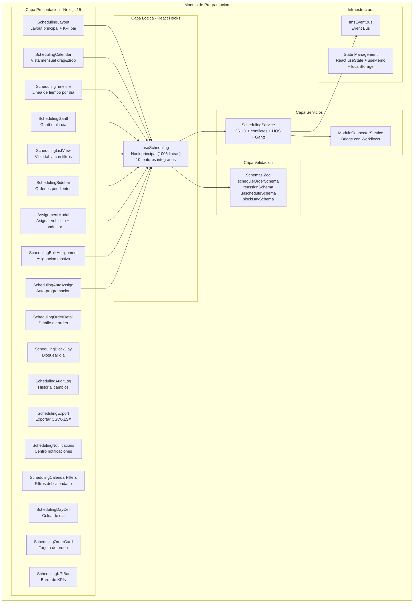
```mermaid
graph TB
    subgraph "Modulo de Programacion"
        subgraph "Capa Presentacion - Next.js 15"
            UI_LAYOUT["SchedulingLayout<br/>Layout principal + KPI bar"]
            UI_CALENDAR["SchedulingCalendar<br/>Vista mensual drag&drop"]
            UI_TIMELINE["SchedulingTimeline<br/>Linea de tiempo por dia"]
            UI_GANTT["SchedulingGantt<br/>Gantt multi-dia"]
            UI_LIST["SchedulingListView<br/>Vista tabla con filtros"]
            UI_SIDEBAR["SchedulingSidebar<br/>Ordenes pendientes"]
            UI_MODAL["AssignmentModal<br/>Asignar vehiculo + conductor"]
            UI_BULK["SchedulingBulkAssignment<br/>Asignacion masiva"]
            UI_AUTO["SchedulingAutoAssign<br/>Auto-programacion"]
            UI_DETAIL["SchedulingOrderDetail<br/>Detalle de orden"]
            UI_BLOCK["SchedulingBlockDay<br/>Bloquear dia"]
            UI_AUDIT["SchedulingAuditLog<br/>Historial cambios"]
            UI_EXPORT["SchedulingExport<br/>Exportar CSV/XLSX"]
            UI_NOTIF["SchedulingNotifications<br/>Centro notificaciones"]
            UI_FILTERS["SchedulingCalendarFilters<br/>Filtros del calendario"]
            UI_DAYCEL["SchedulingDayCell<br/>Celda de dia"]
            UI_CARD["SchedulingOrderCard<br/>Tarjeta de orden"]
            UI_KPI["SchedulingKPIBar<br/>Barra de KPIs"]
        end

        subgraph "Capa Logica - React Hooks"
            H_SCHED["useScheduling<br/>Hook principal (1005 lineas)<br/>10 features integradas"]
        end

        subgraph "Capa Servicios"
            SVC_SCHED["SchedulingService<br/>CRUD + conflictos + HOS + Gantt"]
            SVC_CONNECTOR["ModuleConnectorService<br/>Bridge con Workflows"]
        end

        subgraph "Capa Validacion"
            VAL["Schemas Zod<br/>scheduleOrderSchema<br/>reassignSchema<br/>unscheduleSchema<br/>blockDaySchema"]
        end

        subgraph "Infraestructura"
            EVT["tmsEventBus<br/>Event Bus"]
            STORE["State Management<br/>React useState + useMemo<br/>+ localStorage"]
        end
    end

    UI_LAYOUT --> H_SCHED
    UI_CALENDAR --> H_SCHED
    UI_TIMELINE --> H_SCHED
    UI_GANTT --> H_SCHED
    UI_LIST --> H_SCHED
    UI_SIDEBAR --> H_SCHED
    UI_MODAL --> H_SCHED
    UI_BULK --> H_SCHED
    UI_AUTO --> H_SCHED

    H_SCHED --> SVC_SCHED
    H_SCHED --> VAL
    SVC_SCHED --> SVC_CONNECTOR
    SVC_SCHED --> EVT
```

---

# 15. Diagrama de Despliegue

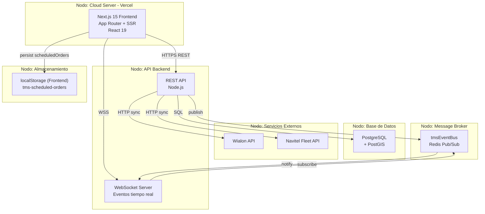
```mermaid
graph TB
    subgraph "Nodo: Cloud Server - Vercel"
        FE["Next.js 15 Frontend<br/>App Router + SSR<br/>React 19"]
    end

    subgraph "Nodo: API Backend"
        API["REST API<br/>Node.js"]
        WS["WebSocket Server<br/>Eventos tiempo real"]
    end

    subgraph "Nodo: Base de Datos"
        DB["PostgreSQL<br/>+ PostGIS"]
    end

    subgraph "Nodo: Almacenamiento"
        LS["localStorage (Frontend)<br/>tms-scheduled-orders"]
    end

    subgraph "Nodo: Servicios Externos"
        GPS_W["Wialon API"]
        GPS_N["Navitel Fleet API"]
    end

    subgraph "Nodo: Message Broker"
        EVT["tmsEventBus<br/>Redis Pub/Sub"]
    end

    FE -->|HTTPS REST| API
    FE -->|WSS| WS
    FE -->|persist scheduledOrders| LS
    API -->|SQL| DB
    API -->|HTTP sync| GPS_W
    API -->|HTTP sync| GPS_N
    API -->|publish| EVT
    EVT -->|notify| WS
    WS -->|subscribe| EVT
```

---

## Feature Flags

> Configuracion por tenant. Se gestionan desde la API de configuracion.

| Feature Flag | Tipo | Default | Descripcion |
|---|---|---|---|
| `enableHOSValidation` | boolean | `false` | Habilita validacion de Hours of Service FMCSA |
| `maxDrivingHours` | number | `10` | Maximo horas conduccion por dia (si HOS habilitado) |
| `enableAutoSuggestion` | boolean | `false` | Habilita sugerencias automaticas de recursos |
| `enableRealtimeConflictCheck` | boolean | `false` | Habilita verificacion de conflictos en tiempo real al abrir modal |
| `conflictCheckIntervalMs` | number | `5000` | Intervalo de verificacion en ms |
| `gpsIntegrationType` | enum | `'none'` | `'internal'`, `'external'`, `'none'` — tipo de integracion GPS |
| `externalGpsProviderUrl` | string | — | URL del proveedor GPS externo |
| `gpsWebhookUrl` | string | — | Webhook para notificaciones GPS |

---

> **Nota:** Este documento es una referencia operativa para desarrollo frontend y backend. Incluye los 9 Casos de Uso con precondiciones, secuencia, postcondiciones y excepciones. Para detalles completos sobre la arquitectura general, tipos TypeScript y modulos relacionados, consultar **RFC_BACKEND_TMS_NAVITEL.md** (Seccion 4) y los archivos fuente: `src/types/scheduling.ts` (635 lineas), `src/hooks/use-scheduling.ts` (1005 lineas), `src/services/scheduling-service.ts` (953 lineas), `src/components/scheduling/` (18 componentes).
