# Referencia Rapida — Modulo de Configuracion
## TMS Navitel . Cheat Sheet para Desarrollo

> **Fecha:** Febrero 2026
> **Proposito:** Consulta rapida para desarrolladores. Gestion completa de la configuracion del tenant: parametros por categoria (general, operaciones, flota, finanzas, notificaciones, seguridad, localizacion, apariencia), gestion de roles y permisos RBAC granular, integraciones externas con test y sync, y log de auditoria.

---

## Indice

| # | Seccion |
|---|---------|
| 1 | [Contexto del Modulo](#1-contexto-del-modulo) |
| 2 | [Entidades del Dominio](#2-entidades-del-dominio) |
| 3 | [Modelo de Base de Datos — PostgreSQL](#3-modelo-de-base-de-datos--postgresql) |
| 4 | [Maquina de Estados — IntegrationStatus](#4-maquina-de-estados--integrationstatus) |
| 5 | [Modelo de Permisos Granular](#5-modelo-de-permisos-granular) |
| 6 | [Catalogo de Categorias y Tipos](#6-catalogo-de-categorias-y-tipos) |
| 7 | [Tabla de Referencia Operativa de Transiciones](#7-tabla-de-referencia-operativa-de-transiciones) |
| 8 | [Casos de Uso — Referencia Backend](#8-casos-de-uso--referencia-backend) |
| 9 | [Endpoints API REST](#9-endpoints-api-rest) |
| 10 | [Eventos de Dominio](#10-eventos-de-dominio) |
| 11 | [Reglas de Negocio Clave](#11-reglas-de-negocio-clave) |
| 12 | [Catalogo de Errores HTTP](#12-catalogo-de-errores-http) |
| 13 | [Permisos RBAC](#13-permisos-rbac) |
| 14 | [Diagrama de Componentes](#14-diagrama-de-componentes) |
| 15 | [Diagrama de Despliegue](#15-diagrama-de-despliegue) |

---

# 1. Contexto del Modulo

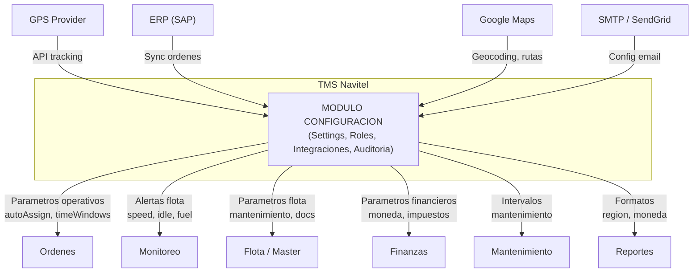

**Responsabilidades:** Gestionar toda la configuracion del tenant: parametros del sistema agrupados por categoria (general, operaciones, flota, finanzas, notificaciones, seguridad, localizacion, apariencia), gestion de roles y permisos granulares (RBAC por recurso y accion), administracion de integraciones externas (GPS, ERP, mapas, email, webhooks) con testing y sincronizacion, y registro completo de auditoria de todas las acciones del sistema.

**Alcance:** Pagina `/settings` con cuatro secciones principales: Configuracion del Sistema (8 categorias), Roles y Permisos, Integraciones Externas, y Log de Auditoria. Este modulo provee los parametros que consumen todos los demas modulos. Es el modulo mas critico para la seguridad y gobernanza del tenant.

---

# 2. Entidades del Dominio

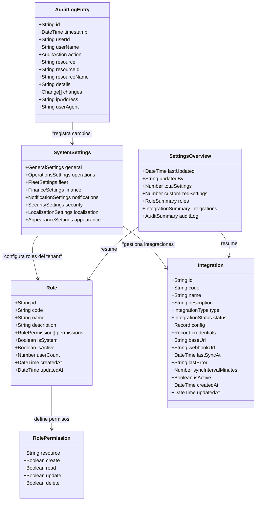

---

# 3. Modelo de Base de Datos — PostgreSQL

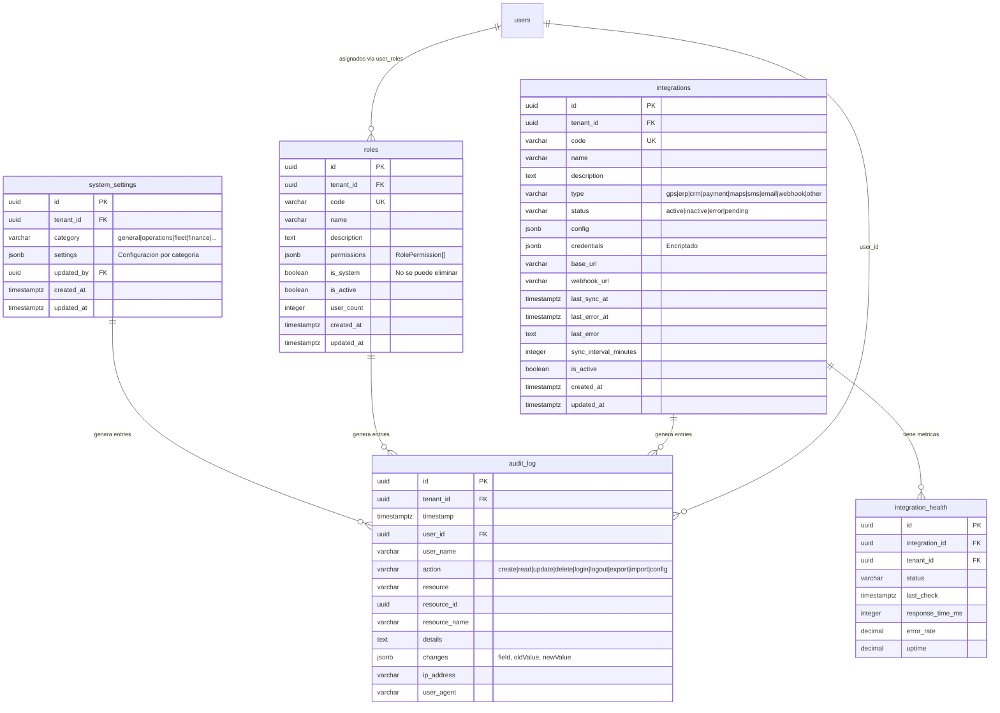

> **Nota multi-tenant:** Todas las consultas a tablas de configuracion filtran por `tenant_id` del JWT. Cada tenant tiene su propia configuracion, roles, integraciones y log de auditoria. El `tenant_id` NO se envia en el body — se inyecta automaticamente en el backend. Los campos `credentials` de integraciones se almacenan encriptados.

---

# 4. Maquina de Estados — IntegrationStatus

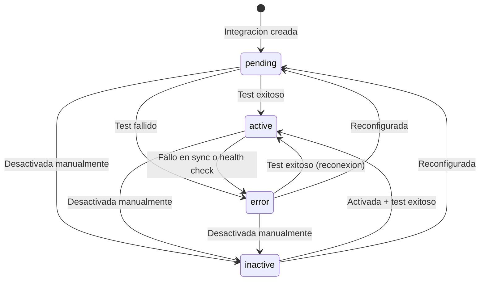

| Estado | Valor | Descripcion |
|--------|-------|-------------|
| Pendiente | `pending` | Integracion creada pero no probada. Requiere test de conexion. |
| Activa | `active` | Integracion operativa. Ultima prueba o sync exitoso. |
| Inactiva | `inactive` | Desactivada manualmente por el usuario. No procesa sync. |
| Error | `error` | Ultimo intento de conexion o sync fallo. Requiere atencion. |

---

# 5. Modelo de Permisos Granular

Este modulo define el sistema de permisos RBAC granular que usan todos los demas modulos del TMS.

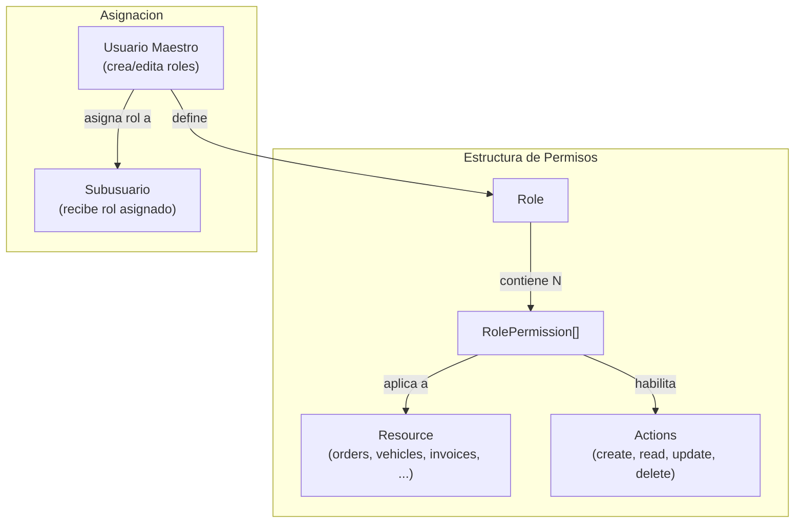

### Estructura de RolePermission

Cada permiso en un rol define acceso a un recurso con 4 acciones CRUD:

| Campo | Tipo | Descripcion |
|-------|------|-------------|
| `resource` | string | Recurso del sistema (ej: `orders`, `vehicles`, `invoices`, `*` para todos) |
| `actions.create` | boolean | Puede crear registros |
| `actions.read` | boolean | Puede leer/listar registros |
| `actions.update` | boolean | Puede modificar registros |
| `actions.delete` | boolean | Puede eliminar registros |

### Nivel de Permiso (PermissionLevel)

| Nivel | Valor | Descripcion |
|-------|-------|-------------|
| Ninguno | `none` | Sin acceso al recurso |
| Lectura | `read` | Solo puede ver |
| Escritura | `write` | Puede ver y modificar |
| Administrador | `admin` | Control total (incluye eliminar) |

### Roles del Sistema (isSystem=true)

Los roles del sistema son predefinidos y no se pueden eliminar ni renombrar. Sus permisos pueden ser usados como base para crear roles personalizados:

| Rol Sistema | Codigo | Recursos | Descripcion |
|-------------|--------|----------|-------------|
| Administrador | `admin` | `*` (todos) | Acceso total al sistema |
| Operaciones | `operations` | orders, routes, vehicles, drivers | Gestion operativa |
| Finanzas | `finance` | invoices, payments, costs, reports.financial | Gestion financiera |
| Conductor | `driver` | orders (read/update), vehicles (read) | Acceso movil limitado |

---

# 6. Catalogo de Categorias y Tipos

### Categorias de Configuracion (SettingCategory)

| Categoria | Valor | Campos clave | Descripcion |
|-----------|-------|-------------|-------------|
| General | `general` | companyName, timezone, dateFormat, defaultLanguage | Datos de la empresa y formatos basicos |
| Operaciones | `operations` | autoAssignOrders, maxOrdersPerVehicle, requireSignature, workingHours | Parametros de gestion de ordenes y rutas |
| Flota | `fleet` | maxSpeedKmh, maxIdleMinutes, maintenanceIntervalKm, trackingIntervalSeconds | Alertas, intervalos de mantenimiento y tracking |
| Finanzas | `finance` | defaultCurrency, defaultTaxRate, invoicePrefix, paymentTermsDays | Moneda, impuestos, facturacion, cuentas bancarias |
| Notificaciones | `notifications` | emailProvider, smsProvider, notifyOnNewOrder, notifyOnIncident | Proveedores y eventos que generan notificacion |
| Seguridad | `security` | passwordMinLength, maxLoginAttempts, sessionTimeoutMinutes, enableTwoFactor | Politicas de password, sesion, 2FA, rate limiting |
| Localizacion | `localization` | defaultCountry, dateFormat, numberFormat, distanceUnit, weightUnit | Formatos regionales, unidades de medida |
| Apariencia | `appearance` | theme, primaryColor, fontSize, compactMode, mapStyle | Tema visual, colores, tipografia, mapa |

### Tipos de Dato de Configuracion (SettingType)

| Tipo | Valor | Ejemplo | Uso |
|------|-------|---------|-----|
| Texto | `string` | "TMS NAVITEL" | Nombres, URLs, emails |
| Numero | `number` | 90 | Limites, intervalos, porcentajes |
| Booleano | `boolean` | true | Activar/desactivar features |
| Seleccion | `select` | "genetic" | Algoritmos, proveedores |
| Multi-seleccion | `multiSelect` | ["es", "en"] | Idiomas soportados, dias laborales |
| Fecha | `date` | "2026-01-01" | Fechas de inicio, vencimiento |
| Hora | `time` | "06:00" | Horarios laborales |
| Color | `color` | "#1E88E5" | Colores del tema |
| JSON | `json` | { lat: -12, lng: -77 } | Configuraciones complejas anidadas |
| Archivo | `file` | "/logo/navitel.png" | Logos, imagenes |

### Tipos de Integracion

| Tipo | Valor | Ejemplo | Descripcion |
|------|-------|---------|-------------|
| GPS | `gps` | GPS Tracker Pro | Rastreo vehicular en tiempo real |
| ERP | `erp` | SAP | Sincronizacion de ordenes y clientes |
| CRM | `crm` | Salesforce | Gestion de relacion con clientes |
| Pagos | `payment` | Stripe, MercadoPago | Procesamiento de pagos |
| Mapas | `maps` | Google Maps | Geocodificacion, direcciones, rutas |
| SMS | `sms` | Twilio | Notificaciones por mensaje de texto |
| Email | `email` | SendGrid, SES | Envio de emails transaccionales |
| Webhook | `webhook` | Custom | Notificaciones HTTP a sistemas externos |
| Otro | `other` | Custom | Integraciones no categorizadas |

### Acciones de Auditoria

| Accion | Valor | Descripcion |
|--------|-------|-------------|
| Crear | `create` | Creacion de un recurso |
| Leer | `read` | Consulta de un recurso (solo eventos criticos) |
| Actualizar | `update` | Modificacion de un recurso |
| Eliminar | `delete` | Eliminacion de un recurso |
| Login | `login` | Inicio de sesion |
| Logout | `logout` | Cierre de sesion |
| Exportar | `export` | Exportacion de datos |
| Importar | `import` | Importacion de datos |
| Configurar | `config` | Cambio de configuracion del sistema |

---

# 7. Tabla de Referencia Operativa de Transiciones

### Transiciones de IntegrationStatus

| # | Transicion | De | A | Actor(es) | Endpoint | Condiciones |
|---|-----------|-----|---|-----------|----------|-------------|
| T-01 | Crear integracion | (nueva) | `pending` | Owner, Usuario Maestro | POST /api/settings/integrations | Datos validos, codigo unico |
| T-02 | Test exitoso | `pending` | `active` | Owner, Usuario Maestro | POST /api/settings/integrations/:id/test | Respuesta OK del proveedor |
| T-03 | Test fallido | `pending` | `error` | Owner, Usuario Maestro | POST /api/settings/integrations/:id/test | Timeout o error de conexion |
| T-04 | Desactivar | `active` | `inactive` | Owner, Usuario Maestro | PATCH /api/settings/integrations/:id/toggle | isActive=true -> false |
| T-05 | Fallo en sync | `active` | `error` | Sistema (sync worker) | (interno) | Error en sincronizacion periodica |
| T-06 | Activar | `inactive` | `active` | Owner, Usuario Maestro | PATCH /api/settings/integrations/:id/toggle | isActive=false -> true, ultimo test OK |
| T-07 | Reconectar | `error` | `active` | Owner, Usuario Maestro | POST /api/settings/integrations/:id/test | Test exitoso despues de error |
| T-08 | Desactivar en error | `error` | `inactive` | Owner, Usuario Maestro | PATCH /api/settings/integrations/:id/toggle | Desactivacion manual |
| T-09 | Reconfigurar | `error` | `pending` | Owner, Usuario Maestro | PUT /api/settings/integrations/:id | Cambio de config/credentials |

---

# 8. Casos de Uso — Referencia Backend

## CU-01: Ver Configuracion del Sistema

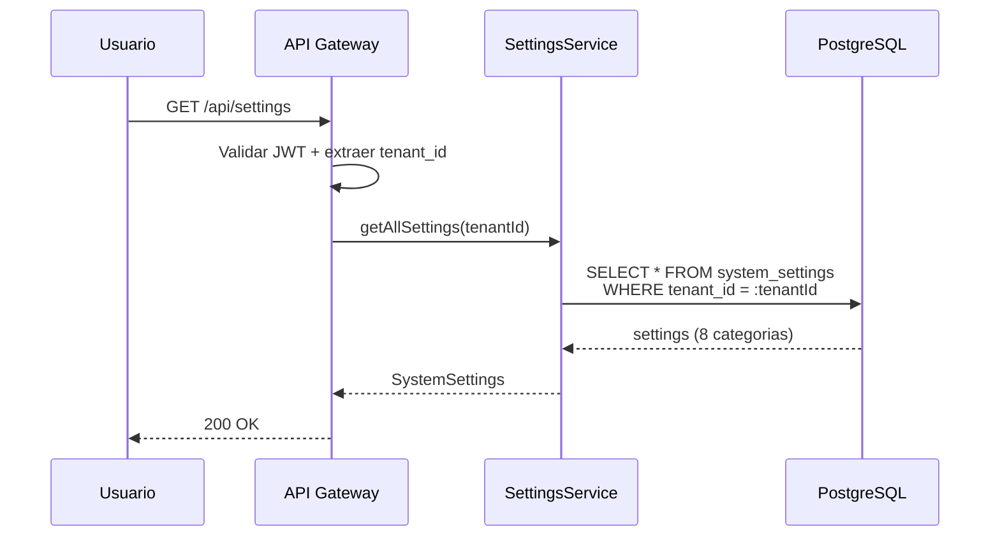

| Campo | Detalle |
|-------|---------|
| Nombre | Ver Configuracion del Sistema |
| Actor(es) | Owner, Usuario Maestro |
| Precondiciones | PRE-01: Usuario autenticado con JWT valido. PRE-02: tenant_id extraido del token. |
| Flujo | 1. Usuario accede a la pagina de configuracion. 2. Se cargan todas las categorias con sus valores actuales. 3. Se retorna SystemSettings completo. |
| Postcondiciones | Configuracion del sistema desplegada por categorias |
| Excepciones | 401 si JWT invalido; 403 si Subusuario sin permiso `settings.read` |

---

## CU-02: Actualizar Configuracion por Categoria

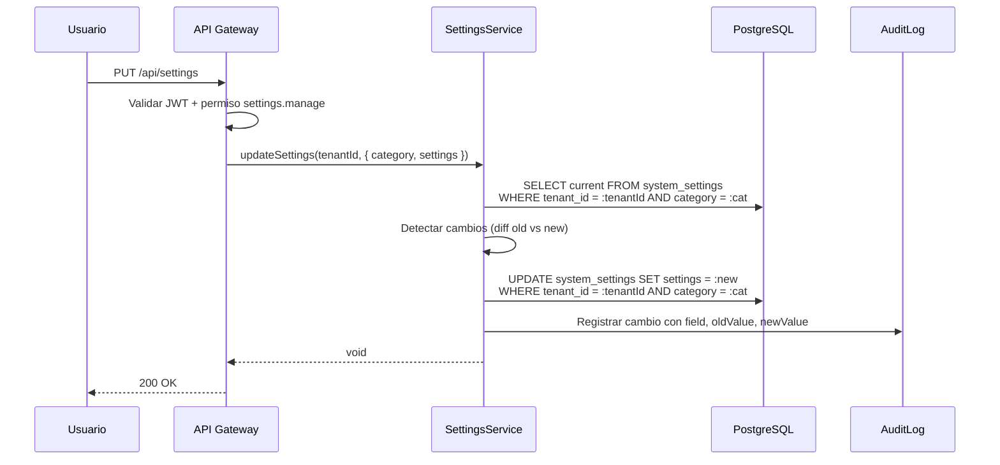

| Campo | Detalle |
|-------|---------|
| Nombre | Actualizar Configuracion por Categoria |
| Actor(es) | Owner, Usuario Maestro |
| Precondiciones | PRE-01, PRE-02. Permiso `settings.manage`. |
| Flujo | 1. Usuario modifica valores en un formulario de categoria. 2. Se envian solo los campos modificados. 3. Se detectan cambios (diff). 4. Se actualiza en BD. 5. Se registra en auditoria con campo, valor anterior y valor nuevo. |
| Postcondiciones | Configuracion actualizada; entrada de auditoria creada |
| Excepciones | 422 si valor fuera de rango o formato invalido; 403 si sin permiso |

---

## CU-03: Restablecer Configuracion por Defecto

| Campo | Detalle |
|-------|---------|
| Nombre | Restablecer Configuracion por Defecto |
| Actor(es) | Owner, Usuario Maestro |
| Precondiciones | PRE-01, PRE-02. Permiso `settings.manage`. |
| Flujo | 1. Usuario hace clic en "Restablecer" para una categoria. 2. Se restauran los valores predeterminados del sistema. 3. Se registra en auditoria. |
| Postcondiciones | Categoria restaurada a valores por defecto |
| Excepciones | 403 si sin permiso |

---

## CU-04: Exportar e Importar Configuracion

| Campo | Detalle |
|-------|---------|
| Nombre | Exportar e Importar Configuracion |
| Actor(es) | Owner, Usuario Maestro |
| Precondiciones | PRE-01, PRE-02. Permiso `settings.manage`. |
| Flujo | **Exportar:** 1. Usuario hace clic en "Exportar". 2. Se genera JSON con toda la configuracion. 3. Se descarga archivo. **Importar:** 1. Usuario selecciona archivo JSON. 2. Se valida estructura. 3. Se sobreescriben las categorias incluidas. 4. Se registra en auditoria. |
| Postcondiciones | Configuracion exportada como JSON o importada desde JSON |
| Excepciones | 422 si JSON invalido o estructura incorrecta |

---

## CU-05: Crear Rol

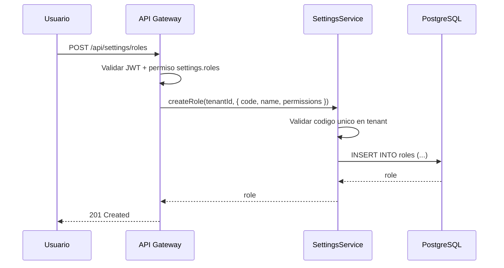

| Campo | Detalle |
|-------|---------|
| Nombre | Crear Rol |
| Actor(es) | Owner, Usuario Maestro |
| Precondiciones | PRE-01, PRE-02. Permiso `settings.roles`. |
| Flujo | 1. Usuario define nombre, codigo y permisos del rol. 2. Se valida que el codigo sea unico en el tenant. 3. Se crea el rol con isSystem=false. 4. Se registra en auditoria. |
| Postcondiciones | Nuevo rol creado y disponible para asignar a usuarios |
| Excepciones | 409 si codigo duplicado; 422 si permisos invalidos |

---

## CU-06: Eliminar Rol

| Campo | Detalle |
|-------|---------|
| Nombre | Eliminar Rol |
| Actor(es) | Owner, Usuario Maestro |
| Precondiciones | PRE-01, PRE-02. Permiso `settings.roles`. Rol existe. |
| Flujo | 1. Usuario selecciona eliminar rol. 2. Se valida que no sea rol de sistema (isSystem=false). 3. Se valida que no tenga usuarios asignados (userCount=0). 4. Se elimina el rol. 5. Se registra en auditoria. |
| Postcondiciones | Rol eliminado del sistema |
| Excepciones | 409 si es rol de sistema; 409 si tiene usuarios asignados; 404 si no existe |

---

## CU-07: Crear Integracion

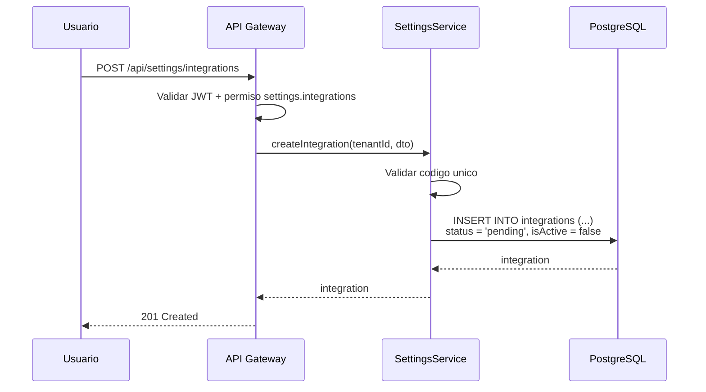

| Campo | Detalle |
|-------|---------|
| Nombre | Crear Integracion |
| Actor(es) | Owner, Usuario Maestro |
| Precondiciones | PRE-01, PRE-02. Permiso `settings.integrations`. |
| Flujo | 1. Usuario define tipo, nombre, URL base, credenciales. 2. Se valida codigo unico. 3. Se crea con status=`pending` y isActive=false. 4. Credenciales se encriptan antes de almacenar. 5. Se registra en auditoria. |
| Postcondiciones | Integracion creada en estado pendiente. Requiere test para activar. |
| Excepciones | 409 si codigo duplicado; 422 si datos invalidos |

---

## CU-08: Probar Conexion de Integracion

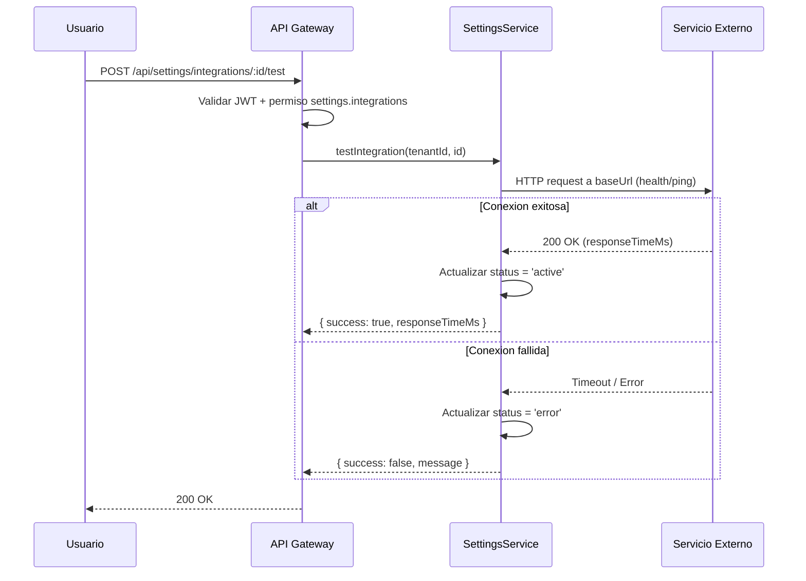

| Campo | Detalle |
|-------|---------|
| Nombre | Probar Conexion de Integracion |
| Actor(es) | Owner, Usuario Maestro |
| Precondiciones | PRE-01, PRE-02. Integracion existe. |
| Flujo | 1. Usuario hace clic en "Probar conexion". 2. Se envia request al proveedor. 3. Si exitoso: status=active, se registra lastSyncAt. 4. Si fallido: status=error, se registra lastError. |
| Postcondiciones | Status de integracion actualizado; resultado de test visible |
| Excepciones | 404 si integracion no existe |

---

## CU-09: Sincronizar Integracion

| Campo | Detalle |
|-------|---------|
| Nombre | Sincronizar Integracion |
| Actor(es) | Owner, Usuario Maestro |
| Precondiciones | PRE-01, PRE-02. Integracion existe y esta activa. |
| Flujo | 1. Usuario hace clic en "Sincronizar ahora". 2. Se ejecuta sync con el proveedor externo. 3. Se actualizan registros (ordenes, vehiculos, etc. segun tipo). 4. Se registra lastSyncAt y recordsSynced. |
| Postcondiciones | Datos sincronizados con el sistema externo |
| Excepciones | 409 si integracion no esta activa; 500 si error en sync |

---

## CU-10: Consultar Log de Auditoria

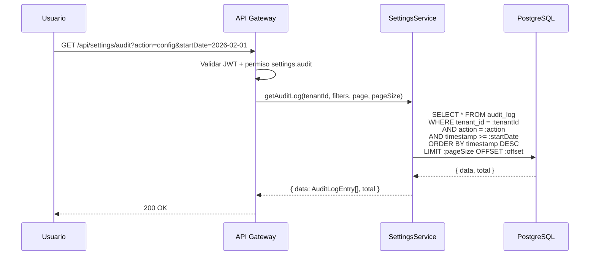

| Campo | Detalle |
|-------|---------|
| Nombre | Consultar Log de Auditoria |
| Actor(es) | Owner, Usuario Maestro |
| Precondiciones | PRE-01, PRE-02. Permiso `settings.audit`. |
| Flujo | 1. Usuario accede al log de auditoria. 2. Opcionalmente filtra por: usuario, accion, recurso, rango de fechas, busqueda. 3. Se retorna lista paginada ordenada por timestamp DESC. |
| Postcondiciones | Lista de entradas de auditoria con paginacion |
| Excepciones | 403 si sin permiso `settings.audit` |

---

## CU-11: Exportar Log de Auditoria

| Campo | Detalle |
|-------|---------|
| Nombre | Exportar Log de Auditoria |
| Actor(es) | Owner, Usuario Maestro |
| Precondiciones | PRE-01, PRE-02. Permiso `settings.audit`. |
| Flujo | 1. Usuario aplica filtros deseados. 2. Hace clic en "Exportar". 3. Se genera JSON con todas las entradas que coinciden. 4. Se descarga archivo. |
| Postcondiciones | Archivo JSON con entradas de auditoria filtradas |
| Excepciones | 403 si sin permiso |

---

## CU-12: Ver Resumen de Configuracion

| Campo | Detalle |
|-------|---------|
| Nombre | Ver Resumen de Configuracion |
| Actor(es) | Owner, Usuario Maestro |
| Precondiciones | PRE-01, PRE-02. |
| Flujo | 1. Se calcula: total/customized settings, roles activos, integraciones activas/con errores, entries auditoria 24h y 7d, top acciones y top usuarios. 2. Se retorna SettingsOverview. |
| Postcondiciones | Dashboard de resumen con metricas de configuracion |
| Excepciones | 403 si Subusuario |

---

# 9. Endpoints API REST

| ID | Metodo | Ruta | Descripcion | Roles | Request Body / Params | Response | CU |
|----|--------|------|-------------|-------|----------------------|----------|-----|
| E-01 | GET | `/api/settings` | Obtener toda la configuracion | Owner, UM | (ninguno) | `SystemSettings` | CU-01 |
| E-02 | GET | `/api/settings/:category` | Obtener configuracion por categoria | Owner, UM | Path: `category` | `SystemSettings[category]` | CU-01 |
| E-03 | PUT | `/api/settings` | Actualizar configuracion | Owner, UM | `UpdateSettingsDTO` | `void` | CU-02 |
| E-04 | POST | `/api/settings/:category/reset` | Restablecer a valores por defecto | Owner, UM | Path: `category` | `SystemSettings[category]` | CU-03 |
| E-05 | GET | `/api/settings/export` | Exportar toda la configuracion | Owner, UM | (ninguno) | `string (JSON)` | CU-04 |
| E-06 | POST | `/api/settings/import` | Importar configuracion | Owner, UM | `{ json: string }` | `void` | CU-04 |
| E-07 | GET | `/api/settings/overview` | Resumen de configuracion | Owner, UM | (ninguno) | `SettingsOverview` | CU-12 |
| E-08 | GET | `/api/settings/roles` | Listar roles | Owner, UM | (ninguno) | `Role[]` | CU-05 |
| E-09 | GET | `/api/settings/roles/:id` | Obtener rol por ID | Owner, UM | Path: `id` | `Role` | CU-05 |
| E-10 | POST | `/api/settings/roles` | Crear rol | Owner, UM | `CreateRoleDTO` | `Role` | CU-05 |
| E-11 | PUT | `/api/settings/roles/:id` | Actualizar rol | Owner, UM | `Partial<CreateRoleDTO>` | `Role` | CU-05 |
| E-12 | DELETE | `/api/settings/roles/:id` | Eliminar rol | Owner, UM | Path: `id` | `204 No Content` | CU-06 |
| E-13 | GET | `/api/settings/integrations` | Listar integraciones | Owner, UM | (ninguno) | `Integration[]` | CU-07 |
| E-14 | GET | `/api/settings/integrations/:id` | Obtener integracion | Owner, UM | Path: `id` | `Integration` | CU-07 |
| E-15 | POST | `/api/settings/integrations` | Crear integracion | Owner, UM | `CreateIntegrationDTO` | `Integration` | CU-07 |
| E-16 | PUT | `/api/settings/integrations/:id` | Actualizar integracion | Owner, UM | `Partial<CreateIntegrationDTO>` | `Integration` | CU-07 |
| E-17 | PATCH | `/api/settings/integrations/:id/toggle` | Activar/desactivar | Owner, UM | Path: `id` | `Integration` | CU-07 |
| E-18 | POST | `/api/settings/integrations/:id/test` | Probar conexion | Owner, UM | Path: `id` | `{ success, message, responseTimeMs }` | CU-08 |
| E-19 | POST | `/api/settings/integrations/:id/sync` | Sincronizar | Owner, UM | Path: `id` | `{ recordsSynced }` | CU-09 |
| E-20 | GET | `/api/settings/integrations/health` | Salud de integraciones | Owner, UM | (ninguno) | `IntegrationHealthStatus[]` | CU-07 |
| E-21 | GET | `/api/settings/audit` | Consultar auditoria | Owner, UM | Query: `userId`, `action`, `resource`, `startDate`, `endDate`, `search`, `page`, `pageSize` | `{ data: AuditLogEntry[], total }` | CU-10 |
| E-22 | GET | `/api/settings/audit/export` | Exportar auditoria | Owner, UM | Query: mismos filtros que E-21 | `string (JSON)` | CU-11 |

---

# 10. Eventos de Dominio

| ID | Evento | Trigger | Payload clave | Consumidor(es) |
|----|--------|---------|---------------|----------------|
| EV-01 | `settings.updated` | Configuracion actualizada | `{ category, changes[], tenantId }` | Todos los modulos (recarga config), Auditoria |
| EV-02 | `settings.reset` | Configuracion restablecida | `{ category, tenantId }` | Todos los modulos (recarga config), Auditoria |
| EV-03 | `settings.imported` | Configuracion importada | `{ categories[], tenantId }` | Todos los modulos, Auditoria |
| EV-04 | `role.created` | Nuevo rol creado | `{ roleId, roleName, tenantId }` | Auth service, Auditoria |
| EV-05 | `role.updated` | Rol modificado | `{ roleId, changes[], tenantId }` | Auth service (revalidar sesiones), Auditoria |
| EV-06 | `role.deleted` | Rol eliminado | `{ roleId, tenantId }` | Auth service (revocar sesiones con ese rol), Auditoria |
| EV-07 | `integration.created` | Integracion creada | `{ integrationId, type, tenantId }` | Auditoria |
| EV-08 | `integration.status_changed` | Status de integracion cambia | `{ integrationId, oldStatus, newStatus, tenantId }` | Dashboard de salud, Auditoria |
| EV-09 | `integration.synced` | Sincronizacion completada | `{ integrationId, recordsSynced, tenantId }` | Modulos destino (Flota, Ordenes, etc.), Auditoria |
| EV-10 | `integration.error` | Error en integracion | `{ integrationId, error, tenantId }` | Alertas, Dashboard, Auditoria |

---

# 11. Reglas de Negocio Clave

| ID | Regla | Detalle |
|----|-------|---------|
| R-01 | Multi-tenant obligatorio | Toda configuracion pertenece a un tenant. Un tenant no puede ver ni modificar la configuracion de otro tenant. |
| R-02 | Roles de sistema inmutables | Los roles con `isSystem=true` no se pueden eliminar ni renombrar. Solo se pueden clonar como base para roles personalizados. |
| R-03 | No eliminar rol con usuarios | Un rol con `userCount > 0` no puede eliminarse. Primero se deben reasignar o desvincular todos los usuarios. |
| R-04 | Credenciales encriptadas | Los campos `credentials` de integraciones se almacenan encriptados en BD. Nunca se retornan en texto plano al frontend. |
| R-05 | Codigo unico por tenant | El campo `code` de roles e integraciones es unico dentro del tenant. |
| R-06 | Test antes de activar | Una integracion nueva (status=`pending`) debe pasar un test exitoso antes de poder activarse. |
| R-07 | Auditoria obligatoria | Todo cambio de configuracion, roles e integraciones genera una entrada de auditoria con: quien, que, cuando, valores anteriores y nuevos. |
| R-08 | Seguridad: politica de password | Los valores de seguridad (passwordMinLength, maxLoginAttempts, etc.) aplican inmediatamente a nuevos logins y cambios de password. |
| R-09 | Retencion de auditoria | Las entradas de auditoria se retienen segun `auditLogRetentionDays` (default: 365 dias). Se purgan automaticamente por cron. |
| R-10 | Configuracion financiera sensible | Cambios en configuracion financiera (tasas, moneda, facturacion) requieren confirmacion adicional y se registran con detalle completo de cambios. |
| R-11 | Solo Owner y UM acceden a Settings | Los Subusuarios no tienen acceso al modulo de Configuracion. Es un modulo exclusivo de administracion. |
| R-12 | Integracion inactiva no sincroniza | Una integracion con isActive=false no ejecuta sincronizaciones periodicas ni recibe webhooks. |

---

# 12. Catalogo de Errores HTTP

| Codigo | Tipo | Detalle | Causa tipica |
|--------|------|---------|--------------|
| 400 | Bad Request | Datos de entrada invalidos | Categoria inexistente, formato invalido |
| 401 | Unauthorized | Token JWT ausente o expirado | Sesion expirada |
| 403 | Forbidden | Sin permiso para la accion | Subusuario intentando acceder a Settings; sin permiso especifico |
| 404 | Not Found | Recurso no encontrado | Rol, integracion o entry de auditoria no existe en el tenant |
| 409 | Conflict | Conflicto de estado o unicidad | Codigo duplicado; intentar eliminar rol de sistema; rol con usuarios asignados |
| 422 | Unprocessable Entity | Datos logicamente invalidos | Valor fuera de rango; JSON de importacion malformado; permisos invalidos en rol |
| 500 | Internal Server Error | Error inesperado | Fallo en DB; error en encriptacion de credenciales |
| 503 | Service Unavailable | Servicio externo no disponible | Integracion no responde durante test o sync |

---

# 13. Permisos RBAC

**Jerarquia de roles (modelo Edson):**

| Rol | Descripcion |
|-----|-------------|
| **Owner** | Proveedor/Super Admin del TMS. Acceso total a todas las funcionalidades de la plataforma y todos los tenants. |
| **Usuario Maestro** | Administrador del tenant (empresa cliente). Control total dentro de su empresa: gestiona usuarios, configura permisos, opera todos los modulos habilitados. |
| **Subusuario** | Operador con permisos configurables. Solo puede realizar las acciones que el Usuario Maestro le haya asignado explicitamente. |

**Leyenda de permisos:**

| Simbolo | Significado |
|---------|-------------|
| Si | Permitido |
| Configurable | Permitido si el Usuario Maestro le asigno el permiso al Subusuario |
| No | Denegado |

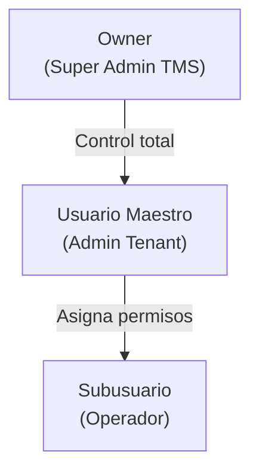

### Tabla de Permisos — Modulo Configuracion

| Permiso | Recurso.Accion | Owner | Usuario Maestro | Subusuario |
|---------|---------------|-------|-----------------|------------|
| Ver configuracion del sistema | `settings.read` | Si | Si | No |
| Modificar configuracion | `settings.manage` | Si | Si | No |
| Restablecer configuracion | `settings.reset` | Si | Si | No |
| Exportar/Importar configuracion | `settings.export_import` | Si | Si | No |
| Ver roles | `settings.roles.read` | Si | Si | No |
| Crear/editar/eliminar roles | `settings.roles` | Si | Si | No |
| Ver integraciones | `settings.integrations.read` | Si | Si | No |
| Crear/editar integraciones | `settings.integrations` | Si | Si | No |
| Probar/sincronizar integraciones | `settings.integrations.test` | Si | Si | No |
| Ver log de auditoria | `settings.audit` | Si | Si | No |
| Exportar log de auditoria | `settings.audit.export` | Si | Si | No |
| Ver resumen de configuracion | `settings.overview` | Si | Si | No |

> **Nota:** El modulo de Configuracion es exclusivo para Owner y Usuario Maestro. Los Subusuarios NO tienen acceso a ninguna funcionalidad de este modulo. Esto incluye todas las sub-secciones: configuracion del sistema, roles, integraciones y auditoria. El acceso de los Subusuarios a otros modulos esta definido por los roles que el Usuario Maestro les asigne a traves de este mismo modulo.

---

# 14. Diagrama de Componentes

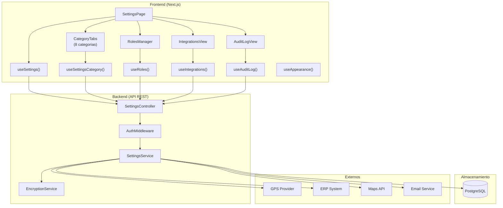

---

# 15. Diagrama de Despliegue

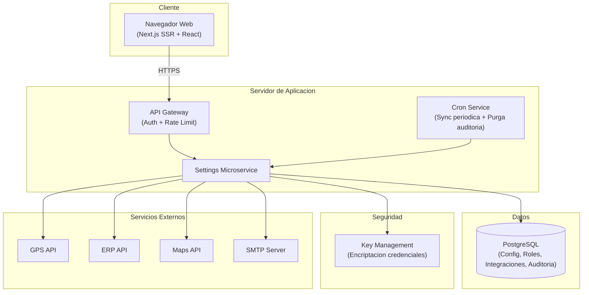

---

> **Nota final:** Este documento es una referencia operativa para desarrollo frontend y backend. El modulo de Configuracion es el nucleo administrativo del TMS: define los parametros que todos los demas modulos consumen, gestiona los roles y permisos que controlan el acceso a todo el sistema, y mantiene el registro de auditoria de todas las acciones. Todos los endpoints requieren autenticacion via JWT y filtraje automatico por `tenant_id`. Para detalles de implementacion, consultar: `src/types/settings.ts`, `src/services/settings.service.ts`, `src/hooks/useSettings.ts`.
