# Referencia Rapida — Modulo de Workflows
## TMS Navitel . Cheat Sheet para Desarrollo

> **Fecha:** Febrero 2026
> **Proposito:** Consulta rapida para desarrolladores. Motor de workflows configurable que define la secuencia de hitos (pasos) para la ejecucion de ordenes de transporte. Conecta con geocercas, ordenes y programacion. Cada workflow define pasos con acciones (enter_geofence, manual_check, document_upload, etc.), condiciones de transicion, notificaciones y reglas de escalamiento.

---

## Indice

| # | Seccion |
|---|---------|
| 1 | [Contexto del Modulo](#1-contexto-del-modulo) |
| 2 | [Entidades del Dominio](#2-entidades-del-dominio) |
| 3 | [Modelo de Base de Datos — PostgreSQL](#3-modelo-de-base-de-datos--postgresql) |
| 4 | [Maquina de Estados — WorkflowStatus](#4-maquina-de-estados--workflowstatus) |
| 5 | [Maquina de Estados — WorkflowStepProgress](#5-maquina-de-estados--workflowstepprogress) |
| 6 | [Catalogos de Acciones, Condiciones y Notificaciones](#6-catalogos-de-acciones-condiciones-y-notificaciones) |
| 7 | [Tabla de Referencia Operativa de Transiciones](#7-tabla-de-referencia-operativa-de-transiciones) |
| 8 | [Casos de Uso — Referencia Backend](#8-casos-de-uso--referencia-backend) |
| 9 | [Endpoints API REST](#9-endpoints-api-rest) |
| 10 | [Eventos de Dominio](#10-eventos-de-dominio) |
| 11 | [Reglas de Negocio Clave](#11-reglas-de-negocio-clave) |
| 12 | [Catalogo de Errores HTTP](#12-catalogo-de-errores-http) |
| 13 | [Permisos RBAC](#13-permisos-rbac) |
| 14 | [Diagrama de Componentes](#14-diagrama-de-componentes) |
| 15 | [Diagrama de Despliegue](#15-diagrama-de-despliegue) |

---

# 1. Contexto del Modulo

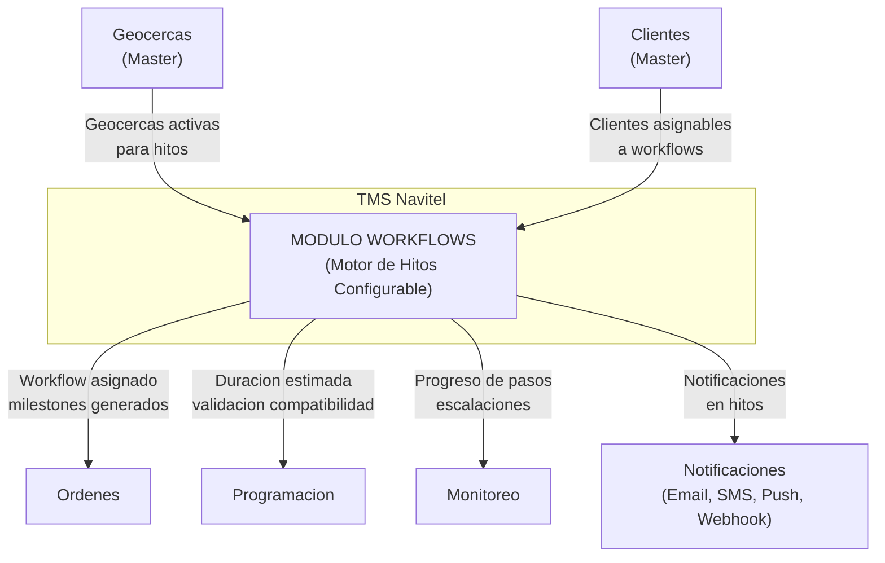

**Responsabilidades:** Definir y gestionar workflows configurables que dictan la secuencia de hitos en la ejecucion de ordenes. Cada workflow contiene pasos con acciones especificas (entrar geocerca, verificacion manual, captura de foto/firma, subir documento, verificar temperatura/peso), condiciones de transicion entre pasos, notificaciones automaticas y reglas de escalamiento por retraso. El motor es cross-cutting: lo consumen Ordenes (asignacion de milestones), Programacion (calculo de duracion, validacion) y Monitoreo (tracking de progreso).

**Alcance:** Pagina `/workflows` para administracion CRUD. Ademas, integracion activa con el formulario de ordenes (auto-asignacion, selector de workflow), programacion (duracion sugerida, validacion) y monitoreo (progreso en tiempo real, escalaciones).

---

# 2. Entidades del Dominio

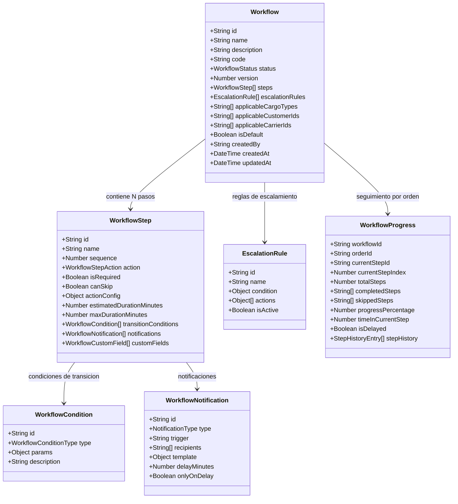

---

# 3. Modelo de Base de Datos — PostgreSQL

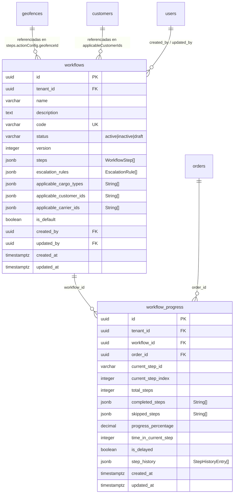

> **Nota multi-tenant:** Todas las consultas a tablas de workflows filtran por `tenant_id` del JWT. Cada tenant tiene sus propios workflows, progreso y reglas de escalamiento. El `tenant_id` NO se envia en el body — se inyecta automaticamente en el backend.

---

# 4. Maquina de Estados — WorkflowStatus

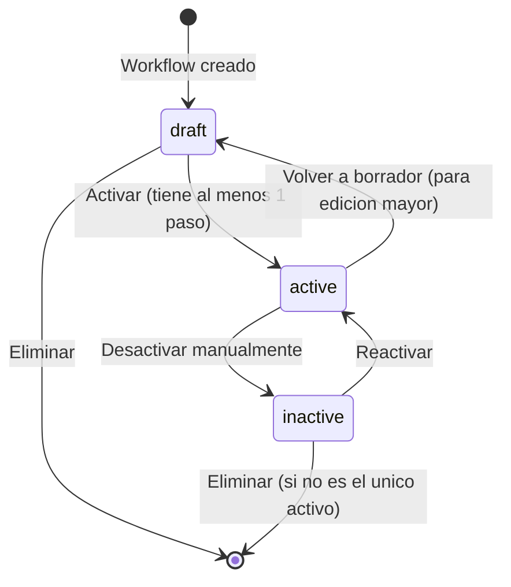

| Estado | Valor | Descripcion |
|--------|-------|-------------|
| Borrador | `draft` | Workflow en construccion. No se puede asignar a ordenes. Edicion libre. |
| Activo | `active` | Workflow operativo. Puede asignarse a ordenes. Se incrementa version en cada edicion. |
| Inactivo | `inactive` | Desactivado temporalmente. Ordenes existentes mantienen su asignacion. No se asigna a nuevas. |

---

# 5. Maquina de Estados — WorkflowStepProgress

Cada paso de un workflow tiene su propio ciclo de vida durante la ejecucion de una orden:

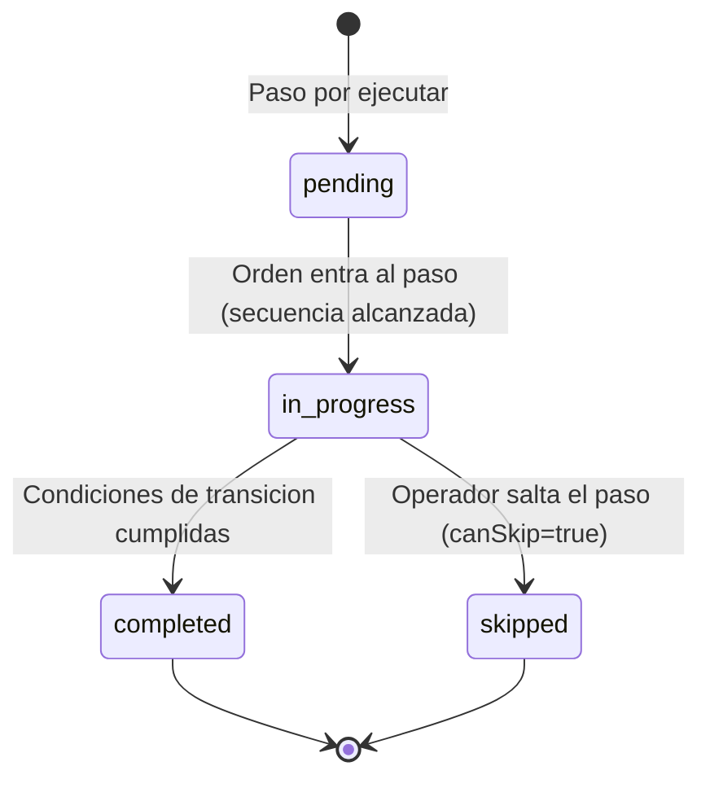

| Estado | Valor | Descripcion |
|--------|-------|-------------|
| Pendiente | `pending` | Paso aun no alcanzado. Esperando que el paso anterior se complete. |
| En progreso | `in_progress` | Paso actual. La orden esta ejecutando este hito. Timer activo. |
| Completado | `completed` | Condiciones de transicion satisfechas (geocerca alcanzada, documento subido, etc.). |
| Saltado | `skipped` | Paso omitido por el operador. Solo si `canSkip=true`. |

---

# 6. Catalogos de Acciones, Condiciones y Notificaciones

### Tipos de Accion (WorkflowStepAction)

| Accion | Valor | Descripcion | ActionConfig clave |
|--------|-------|-------------|-------------------|
| Entrar geocerca | `enter_geofence` | Vehiculo entra en una geocerca | `geofenceId`, `geofenceName`, `instructions` |
| Salir geocerca | `exit_geofence` | Vehiculo sale de una geocerca | `geofenceId`, `geofenceName` |
| Verificacion manual | `manual_check` | Operador confirma manualmente | `instructions` |
| Subir documento | `document_upload` | Subir documento requerido | `acceptedDocumentTypes` |
| Capturar firma | `signature` | Capturar firma digital | `instructions` |
| Tomar foto | `photo_capture` | Capturar foto como evidencia | `minPhotos`, `instructions` |
| Verificar temperatura | `temperature_check` | Verificar temperatura (cadena de frio) | `temperatureRange: { min, max }` |
| Verificar peso | `weight_check` | Verificar peso de la carga | `instructions` |
| Personalizada | `custom` | Accion definida por el usuario | `customFields[]`, `instructions` |

### Tipos de Condicion de Transicion (WorkflowConditionType)

| Condicion | Valor | Descripcion | Params clave |
|-----------|-------|-------------|-------------|
| Tiempo transcurrido | `time_elapsed` | Avanza despues de N minutos | `minutes` |
| Ventana horaria | `time_window` | Solo avanza dentro de horario | `startTime`, `endTime` |
| Ubicacion alcanzada | `location_reached` | GPS confirma geocerca | `geofenceId` |
| Documento subido | `document_uploaded` | Documento tipo X subido | `documentType` |
| Aprobacion recibida | `approval_received` | Aprobado por rol especifico | `approverRoles[]` |
| Trigger manual | `manual_trigger` | Operador avanza manualmente | (ninguno) |
| Siempre | `always` | Sin condicion, avanza automaticamente | (ninguno) |

### Tipos de Notificacion (NotificationType)

| Tipo | Valor | Trigger events | Descripcion |
|------|-------|---------------|-------------|
| Email | `email` | on_enter, on_exit, on_delay, on_complete | Correo a destinatarios |
| SMS | `sms` | on_enter, on_exit, on_delay, on_complete | Mensaje de texto |
| Push | `push` | on_enter, on_exit, on_delay, on_complete | Notificacion push movil |
| Webhook | `webhook` | on_enter, on_exit, on_delay, on_complete | HTTP POST a URL externa |
| In-app | `in_app` | on_enter, on_exit, on_delay, on_complete | Notificacion interna del TMS |

### Tipos de Escalamiento

| Condicion | Valor | Descripcion |
|-----------|-------|-------------|
| Umbral de retraso | `delay_threshold` | Se activa cuando el paso excede N minutos del estimado |
| Paso estancado | `step_stuck` | Se activa cuando no hay actualizacion en N minutos |
| Sin actualizacion | `no_update` | Se activa cuando la orden no reporta GPS en N minutos |

| Accion | Valor | Descripcion |
|--------|-------|-------------|
| Notificar | `notify` | Enviar notificacion a supervisores |
| Reasignar | `reassign` | Reasignar a otro conductor/vehiculo |
| Marcar | `flag` | Marcar como warning o critical |
| Auto-cerrar | `auto_close` | Cerrar automaticamente con razon |

---

# 7. Tabla de Referencia Operativa de Transiciones

### Transiciones de WorkflowStatus

| # | Transicion | De | A | Actor(es) | Endpoint | Condiciones |
|---|-----------|-----|---|-----------|----------|-------------|
| T-01 | Crear workflow | (nuevo) | `draft` | Owner, Usuario Maestro, Subusuario (si tiene permiso `workflows.manage`) | POST /api/workflows | Datos validos, codigo unico |
| T-02 | Activar workflow | `draft` | `active` | Owner, Usuario Maestro, Subusuario (si tiene permiso `workflows.manage`) | PATCH /api/workflows/:id/status | Al menos 1 paso definido |
| T-03 | Desactivar workflow | `active` | `inactive` | Owner, Usuario Maestro | PATCH /api/workflows/:id/status | No es el unico workflow activo |
| T-04 | Reactivar workflow | `inactive` | `active` | Owner, Usuario Maestro | PATCH /api/workflows/:id/status | Al menos 1 paso definido |
| T-05 | Volver a borrador | `active` | `draft` | Owner, Usuario Maestro | PATCH /api/workflows/:id/status | No hay ordenes activas usando este workflow |
| T-06 | Eliminar workflow | `draft`/`inactive` | (eliminado) | Owner, Usuario Maestro | DELETE /api/workflows/:id | No es el unico activo; sin ordenes activas |

### Transiciones de WorkflowStepProgress

| # | Transicion | De | A | Actor(es) | Trigger | Condiciones |
|---|-----------|-----|---|-----------|---------|-------------|
| T-07 | Iniciar paso | `pending` | `in_progress` | Sistema | Paso anterior completado o primera ejecucion | Secuencia correcta |
| T-08 | Completar paso | `in_progress` | `completed` | Sistema / Subusuario (conductor) | Condiciones de transicion cumplidas | Todas las condiciones de transicion satisfechas |
| T-09 | Saltar paso | `in_progress` | `skipped` | Subusuario (conductor) | Subusuario selecciona saltar | `canSkip=true` en el paso |

---

# 8. Casos de Uso — Referencia Backend

## CU-01: Listar Workflows

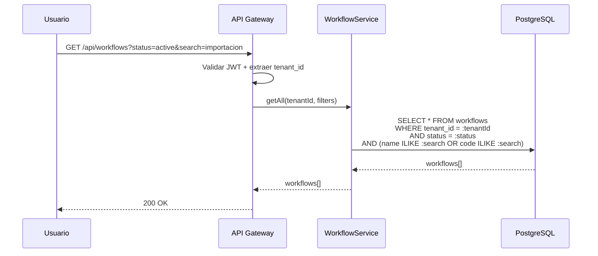

| Campo | Detalle |
|-------|---------|
| Nombre | Listar Workflows |
| Actor(es) | Owner, Usuario Maestro, Subusuario (si tiene permiso `workflows.read`) |
| Precondiciones | PRE-01: Usuario autenticado con JWT valido. PRE-02: tenant_id extraido del token. |
| Flujo | 1. Usuario accede a la pagina de workflows. 2. Opcionalmente filtra por status, busqueda, isDefault, cliente, tipo de carga. 3. Se retorna lista de workflows del tenant. |
| Postcondiciones | Lista de workflows con sus pasos, reglas y metadata |
| Excepciones | 401 si JWT invalido; 403 si sin permiso `workflows.read` |

---

## CU-02: Crear Workflow

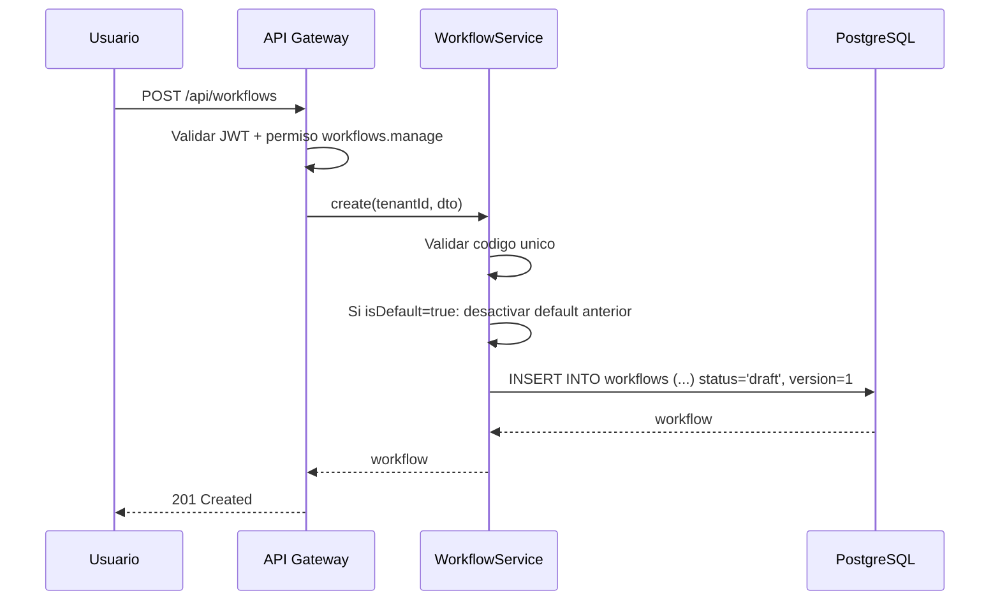

| Campo | Detalle |
|-------|---------|
| Nombre | Crear Workflow |
| Actor(es) | Owner, Usuario Maestro, Subusuario (si tiene permiso `workflows.manage`) |
| Precondiciones | PRE-01, PRE-02. |
| Flujo | 1. Usuario define nombre, codigo, descripcion, pasos con acciones y geocercas. 2. Se valida codigo unico. 3. Si isDefault=true, se desactiva el default anterior. 4. Se crea con status=`draft` y version=1. |
| Postcondiciones | Workflow creado en borrador, listo para activacion |
| Excepciones | 409 si codigo duplicado; 422 si datos invalidos |

---

## CU-03: Activar Workflow

| Campo | Detalle |
|-------|---------|
| Nombre | Activar Workflow |
| Actor(es) | Owner, Usuario Maestro, Subusuario (si tiene permiso `workflows.manage`) |
| Precondiciones | PRE-01, PRE-02. Workflow en estado `draft` o `inactive`. Al menos 1 paso definido. |
| Flujo | 1. Usuario hace clic en "Activar". 2. Se valida que tenga al menos 1 paso. 3. Se cambia status a `active`. |
| Postcondiciones | Workflow disponible para asignar a ordenes |
| Excepciones | 409 si no tiene pasos; 404 si no existe |

---

## CU-04: Duplicar Workflow

| Campo | Detalle |
|-------|---------|
| Nombre | Duplicar Workflow |
| Actor(es) | Owner, Usuario Maestro, Subusuario (si tiene permiso `workflows.manage`) |
| Precondiciones | PRE-01, PRE-02. Workflow original existe. |
| Flujo | 1. Usuario selecciona "Duplicar" y define nuevo nombre. 2. Se copia la estructura completa (pasos, condiciones, notificaciones). 3. Se genera nuevo codigo con sufijo COPY. 4. Se crea como `draft`, version=1, isDefault=false. |
| Postcondiciones | Copia del workflow creada en borrador |
| Excepciones | 404 si original no existe |

---

## CU-05: Aplicar Workflow a Orden

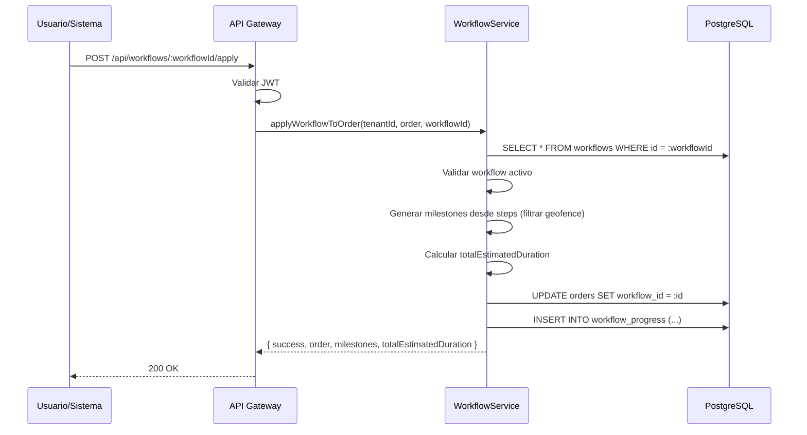

| Campo | Detalle |
|-------|---------|
| Nombre | Aplicar Workflow a Orden |
| Actor(es) | Owner, Usuario Maestro, Subusuario (si tiene permiso `workflows.apply`), Sistema (auto-asignacion) |
| Precondiciones | PRE-01, PRE-02. Workflow activo. Orden existe y no tiene workflow asignado. |
| Flujo | 1. Se valida que workflow este activo. 2. Se generan milestones a partir de los pasos tipo geofence. 3. Se calcula duracion total estimada. 4. Se asigna workflow_id a la orden. 5. Se crea registro de progress. |
| Postcondiciones | Orden tiene workflow asignado con milestones; registro de progress creado |
| Excepciones | 404 si workflow no existe; 409 si workflow no esta activo; 409 si orden ya tiene workflow |

---

## CU-06: Consultar Progreso de Orden en Workflow

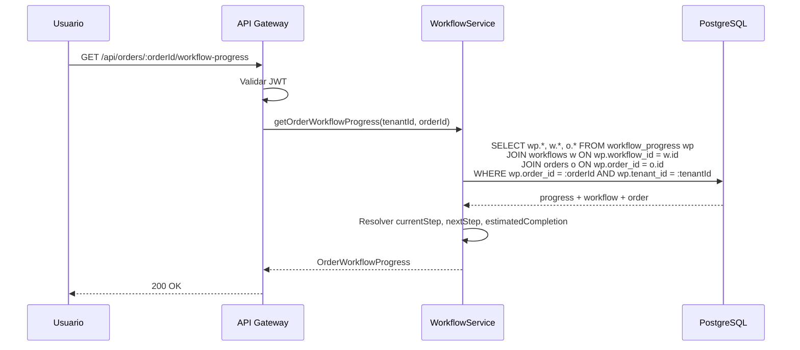

| Campo | Detalle |
|-------|---------|
| Nombre | Consultar Progreso de Orden en Workflow |
| Actor(es) | Owner, Usuario Maestro, Subusuario (si tiene permiso `workflows.read`) |
| Precondiciones | PRE-01, PRE-02. Orden tiene workflow asignado. |
| Flujo | 1. Se consulta workflow_progress de la orden. 2. Se resuelve paso actual, siguiente paso, hora estimada de finalizacion. 3. Se retorna OrderWorkflowProgress completo. |
| Postcondiciones | Progreso de la orden con pasos completados, porcentaje y estimaciones |
| Excepciones | 404 si orden no tiene workflow; 404 si orden no existe |

---

## CU-07: Sugerir Workflow para Orden

| Campo | Detalle |
|-------|---------|
| Nombre | Sugerir Workflow para Orden |
| Actor(es) | Sistema (automatico), Owner, Usuario Maestro, Subusuario |
| Precondiciones | PRE-01, PRE-02. Al menos un workflow activo. |
| Flujo | 1. Se busca workflow especifico: cliente + tipo de carga. 2. Si no hay: workflow del cliente. 3. Si no hay: workflow del tipo de carga. 4. Si no hay: workflow default. 5. Se retorna el mejor match o null. |
| Postcondiciones | Workflow sugerido o null si no hay match |
| Excepciones | (ninguna - retorna null si no encuentra) |

---

## CU-08: Calcular Duracion Estimada del Workflow

| Campo | Detalle |
|-------|---------|
| Nombre | Calcular Duracion Estimada del Workflow |
| Actor(es) | Sistema (para programacion), Owner, Usuario Maestro, Subusuario |
| Precondiciones | PRE-01, PRE-02. Workflow existe. |
| Flujo | 1. Se suman los estimatedDurationMinutes de todos los pasos. 2. Se retorna totalMinutes, totalHours, y desglose por paso. |
| Postcondiciones | Duracion total con desglose por paso |
| Excepciones | 404 si workflow no existe |

---

## CU-09: Validar Workflow para Orden Programada

| Campo | Detalle |
|-------|---------|
| Nombre | Validar Workflow para Orden Programada |
| Actor(es) | Sistema (desde modulo Programacion) |
| Precondiciones | PRE-01, PRE-02. Workflow existe. |
| Flujo | 1. Se valida que workflow este activo. 2. Se valida compatibilidad con cliente. 3. Se valida compatibilidad con tipo de carga. 4. Se compara duracion estimada vs tiempo programado. 5. Se retorna compatible/warnings/errors. |
| Postcondiciones | Resultado de validacion con warnings y errores |
| Excepciones | (ninguna - retorna resultado de validacion) |

---

## CU-10: Validar Geocercas del Workflow

| Campo | Detalle |
|-------|---------|
| Nombre | Validar Geocercas del Workflow |
| Actor(es) | Owner, Usuario Maestro, Subusuario (si tiene permiso `workflows.manage`) |
| Precondiciones | PRE-01, PRE-02. Workflow existe. |
| Flujo | 1. Se recorren todos los pasos tipo enter_geofence/exit_geofence. 2. Se valida que cada geofenceId exista en el modulo de geocercas. 3. Se reportan pasos sin geocerca asignada o con geocerca eliminada. |
| Postcondiciones | Resultado con valid=true/false y lista de issues |
| Excepciones | 404 si workflow no existe |

---

## CU-11: Configurar Reglas de Escalamiento

| Campo | Detalle |
|-------|---------|
| Nombre | Configurar Reglas de Escalamiento |
| Actor(es) | Owner, Usuario Maestro |
| Precondiciones | PRE-01, PRE-02. Workflow existe. |
| Flujo | 1. Usuario define reglas: condicion (delay_threshold/step_stuck/no_update), umbral en minutos, pasos aplicables. 2. Define acciones: notificar, reasignar, marcar, auto-cerrar. 3. Se guardan como parte del workflow. |
| Postcondiciones | Reglas de escalamiento configuradas y activas |
| Excepciones | 422 si umbral invalido; 409 si workflow en draft |

---

# 9. Endpoints API REST

| ID | Metodo | Ruta | Descripcion | Roles | Request Body / Params | Response | CU |
|----|--------|------|-------------|-------|----------------------|----------|-----|
| E-01 | GET | `/api/workflows` | Listar workflows | Owner, UM, Sub (`workflows.read`) | Query: `search`, `status`, `isDefault`, `applicableCustomerId`, `applicableCargoType` | `Workflow[]` | CU-01 |
| E-02 | GET | `/api/workflows/:id` | Obtener workflow por ID | Owner, UM, Sub (`workflows.read`) | Path: `id` | `Workflow` | CU-01 |
| E-03 | GET | `/api/workflows/default` | Obtener workflow por defecto | Owner, UM, Sub (`workflows.read`) | (ninguno) | `Workflow` | CU-01 |
| E-04 | GET | `/api/workflows/active` | Listar workflows activos | Owner, UM, Sub (`workflows.read`) | (ninguno) | `Workflow[]` | CU-01 |
| E-05 | POST | `/api/workflows` | Crear workflow | Owner, UM, Sub (`workflows.manage`) | `CreateWorkflowDTO` | `Workflow` | CU-02 |
| E-06 | PUT | `/api/workflows/:id` | Actualizar workflow | Owner, UM, Sub (`workflows.manage`) | `UpdateWorkflowDTO` | `Workflow` | CU-02 |
| E-07 | DELETE | `/api/workflows/:id` | Eliminar workflow | Owner, UM | Path: `id` | `204 No Content` | CU-02 |
| E-08 | PATCH | `/api/workflows/:id/status` | Cambiar estado | Owner, UM, Sub (`workflows.manage`) | `{ status: WorkflowStatus }` | `Workflow` | CU-03 |
| E-09 | POST | `/api/workflows/:id/duplicate` | Duplicar workflow | Owner, UM, Sub (`workflows.manage`) | `{ newName: string }` | `Workflow` | CU-04 |
| E-10 | POST | `/api/workflows/:id/apply` | Aplicar a orden | Owner, UM, Sub (`workflows.apply`) | `{ orderId: string }` | `ApplyWorkflowResult` | CU-05 |
| E-11 | GET | `/api/orders/:orderId/workflow-progress` | Progreso de orden | Owner, UM, Sub (`workflows.read`) | Path: `orderId` | `OrderWorkflowProgress` | CU-06 |
| E-12 | GET | `/api/workflows/suggest` | Sugerir workflow | Owner, UM, Sub (`workflows.read`) | Query: `customerId`, `cargoType` | `Workflow` | CU-07 |
| E-13 | GET | `/api/workflows/:id/schedule-duration` | Calcular duracion | Owner, UM, Sub (`workflows.read`) | Path: `id` | `{ totalMinutes, totalHours, breakdown }` | CU-08 |
| E-14 | POST | `/api/workflows/:id/validate-for-schedule` | Validar para programacion | Owner, UM, Sub | `Partial<ScheduledOrder>` | `{ compatible, warnings, errors }` | CU-09 |
| E-15 | GET | `/api/workflows/:id/validate-geofences` | Validar geocercas | Owner, UM, Sub (`workflows.manage`) | Path: `id` | `{ valid, issues[] }` | CU-10 |
| E-16 | GET | `/api/workflows/available-geofences` | Geocercas disponibles | Owner, UM, Sub (`workflows.read`) | (ninguno) | `WorkflowGeofence[]` | CU-10 |
| E-17 | GET | `/api/workflows/geofences-by-category/:category` | Geocercas por categoria | Owner, UM, Sub (`workflows.read`) | Path: `category` | `WorkflowGeofence[]` | CU-10 |
| E-18 | GET | `/api/workflows/available-customers` | Clientes disponibles | Owner, UM, Sub (`workflows.read`) | (ninguno) | `WorkflowCustomer[]` | CU-02 |

---

# 10. Eventos de Dominio

| ID | Evento | Trigger | Payload clave | Consumidor(es) |
|----|--------|---------|---------------|----------------|
| EV-01 | `workflow.created` | Nuevo workflow creado | `{ workflowId, code, status, tenantId }` | Auditoria |
| EV-02 | `workflow.activated` | Workflow activado | `{ workflowId, tenantId }` | Ordenes (disponible para asignacion), Auditoria |
| EV-03 | `workflow.deactivated` | Workflow desactivado | `{ workflowId, tenantId }` | Ordenes (no asignar nuevas), Auditoria |
| EV-04 | `workflow.deleted` | Workflow eliminado | `{ workflowId, tenantId }` | Ordenes, Auditoria |
| EV-05 | `workflow.applied` | Workflow asignado a orden | `{ workflowId, orderId, milestones[], tenantId }` | Monitoreo (iniciar tracking), Auditoria |
| EV-06 | `workflow.step.entered` | Orden entra a un paso | `{ workflowId, orderId, stepId, stepName, tenantId }` | Notificaciones, Monitoreo |
| EV-07 | `workflow.step.completed` | Paso completado | `{ workflowId, orderId, stepId, stepName, tenantId }` | Notificaciones, Progreso |
| EV-08 | `workflow.step.skipped` | Paso saltado | `{ workflowId, orderId, stepId, reason, tenantId }` | Auditoria, Progreso |
| EV-09 | `workflow.escalation.triggered` | Regla de escalamiento activada | `{ workflowId, orderId, ruleId, message, tenantId }` | Supervisores (notificacion), Monitoreo |
| EV-10 | `workflow.completed` | Todos los pasos completados | `{ workflowId, orderId, totalDuration, tenantId }` | Ordenes (completar), Auditoria |

---

# 11. Reglas de Negocio Clave

| ID | Regla | Detalle |
|----|-------|---------|
| R-01 | Multi-tenant obligatorio | Todas las queries filtran por `tenant_id` del JWT. Un tenant solo ve sus propios workflows. |
| R-02 | Codigo unico por tenant | El campo `code` del workflow es unico dentro del tenant. Al duplicar, se genera sufijo automatico. |
| R-03 | No activar sin pasos | Un workflow no puede activarse (status=`active`) si no tiene al menos 1 paso definido. |
| R-04 | No eliminar unico activo | No se puede eliminar el unico workflow activo del tenant. Debe existir al menos uno. |
| R-05 | Un solo workflow default | Solo un workflow puede ser `isDefault=true` por tenant. Al marcar uno nuevo, el anterior pierde el flag. |
| R-06 | Versionado en edicion | Cada edicion de un workflow activo incrementa el campo `version`. Los workflows en draft no incrementan. |
| R-07 | Sugerencia priorizada | El algoritmo de sugerencia busca en orden: (1) cliente + cargo, (2) cliente, (3) cargo, (4) default. |
| R-08 | Geocercas deben existir | Los pasos tipo `enter_geofence`/`exit_geofence` deben referenciar geocercas activas. La validacion reporta issues si no existen. |
| R-09 | Escalamiento configurable | Las reglas de escalamiento solo aplican a ordenes con progreso activo. Umbral en minutos configurable por paso o global. |
| R-10 | canSkip respetado | Un paso con `canSkip=false` no puede saltarse. Solo pasos con `canSkip=true` permiten omision por el operador. |
| R-11 | Workflow activo requerido para aplicar | Solo workflows con status=`active` pueden aplicarse a ordenes. Draft e inactive no son asignables. |
| R-12 | Compatibilidad de carga y cliente | Los campos `applicableCargoTypes` y `applicableCustomerIds` filtran la disponibilidad. Array vacio significa "aplica a todos". |

---

# 12. Catalogo de Errores HTTP

| Codigo | Tipo | Detalle | Causa tipica |
|--------|------|---------|--------------|
| 400 | Bad Request | Datos de entrada invalidos | Filtros invalidos, formato incorrecto |
| 401 | Unauthorized | Token JWT ausente o expirado | Sesion expirada |
| 403 | Forbidden | Sin permiso para la accion | Subusuario sin permiso `workflows.manage`, `workflows.apply` |
| 404 | Not Found | Recurso no encontrado | Workflow, orden o geocerca no existe en el tenant |
| 409 | Conflict | Conflicto de estado o unicidad | Codigo duplicado; activar sin pasos; eliminar unico activo; workflow no activo |
| 422 | Unprocessable Entity | Datos logicamente invalidos | Pasos sin geocerca; escalamiento con umbral negativo; duracion invalida |
| 500 | Internal Server Error | Error inesperado | Fallo en DB; error en calculo de milestones |

---

# 13. Permisos RBAC

**Jerarquia de roles (modelo Edson):**

| Rol | Descripcion |
|-----|-------------|
| **Owner** | Proveedor/Super Admin del TMS. Acceso total a todas las funcionalidades de la plataforma y todos los tenants. |
| **Usuario Maestro** | Administrador del tenant (empresa cliente). Control total dentro de su empresa: gestiona usuarios, configura permisos, opera todos los modulos habilitados. |
| **Subusuario** | Operador con permisos configurables. Solo puede realizar las acciones que el Usuario Maestro le haya asignado explicitamente. |

**Leyenda de permisos:**

| Simbolo | Significado |
|---------|-------------|
| Si | Permitido |
| Configurable | Permitido si el Usuario Maestro le asigno el permiso al Subusuario |
| No | Denegado |

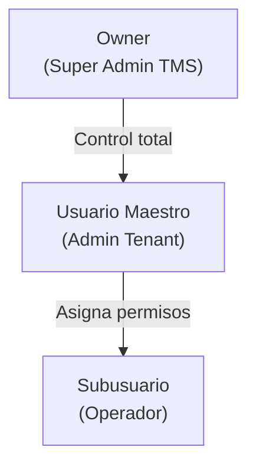

### Tabla de Permisos — Modulo Workflows

| Permiso | Recurso.Accion | Owner | Usuario Maestro | Subusuario |
|---------|---------------|-------|-----------------|------------|
| Ver workflows y progreso | `workflows.read` | Si | Si | Configurable |
| Crear/editar/duplicar workflows | `workflows.manage` | Si | Si | Configurable |
| Eliminar workflows | `workflows.delete` | Si | Si | No |
| Activar/desactivar workflows | `workflows.status` | Si | Si | No |
| Aplicar workflow a orden | `workflows.apply` | Si | Si | Configurable |
| Configurar escalamientos | `workflows.escalation` | Si | Si | No |
| Validar geocercas | `workflows.validate` | Si | Si | Configurable |

> **Nota:** Los permisos de eliminacion (`workflows.delete`), cambio de estado (`workflows.status`) y configuracion de escalamientos (`workflows.escalation`) no son configurables para Subusuario — solo Owner y Usuario Maestro pueden realizarlos. Los Subusuarios con permiso `workflows.apply` pueden asignar workflows a ordenes pero no crear ni modificar la definicion del workflow.

---

# 14. Diagrama de Componentes

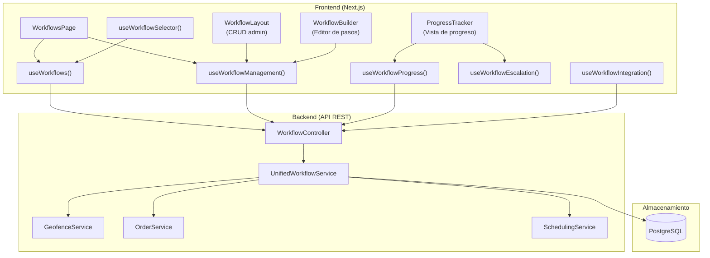

---

# 15. Diagrama de Despliegue

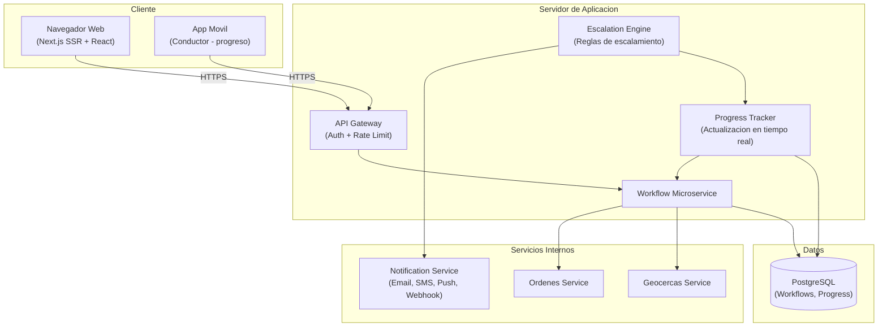

---

> **Nota final:** Este documento es una referencia operativa para desarrollo frontend y backend. El modulo de Workflows es un motor cross-cutting que define la secuencia de hitos para la ejecucion de ordenes. Se integra con Geocercas (hitos con ubicacion), Ordenes (asignacion de milestones), Programacion (validacion y duracion) y Monitoreo (tracking de progreso). Todos los endpoints requieren autenticacion via JWT y filtraje automatico por `tenant_id`. Para detalles de implementacion, consultar: `src/types/workflow.ts`, `src/services/workflow.service.ts`, `src/hooks/useWorkflows.ts`, `src/hooks/useWorkflowManagement.ts`, `src/hooks/useWorkflowIntegration.ts`.
