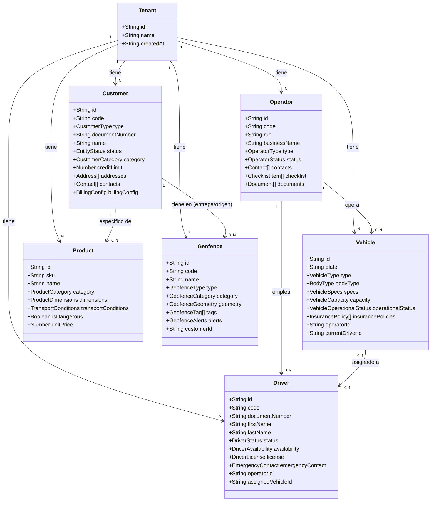
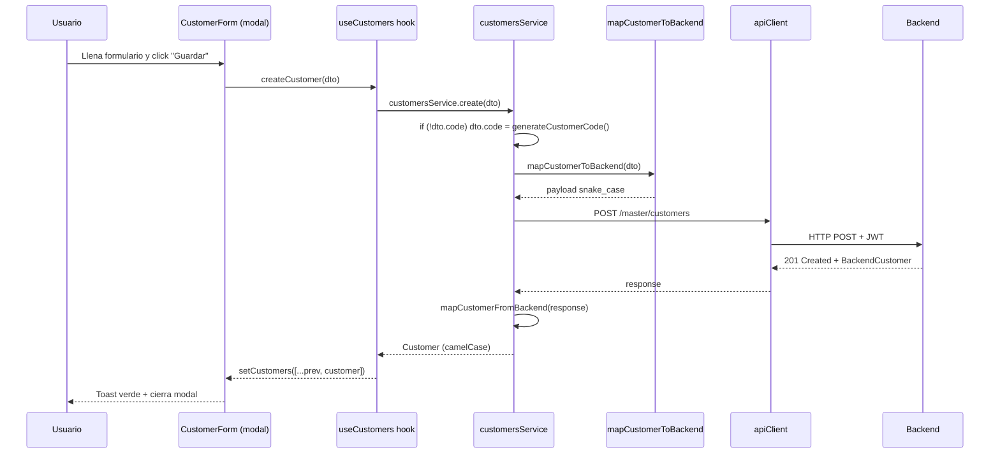
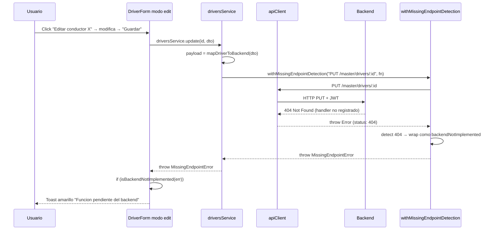
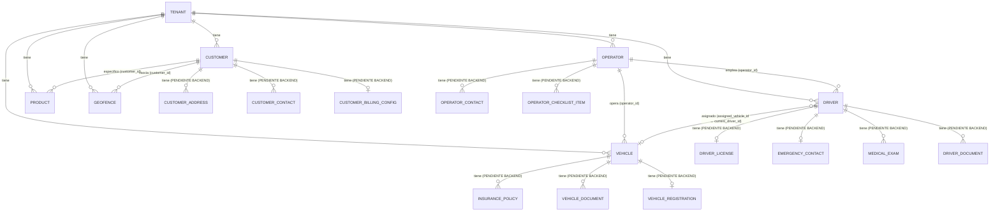

# Modulo MAESTRO — Documentacion Tecnica Exhaustiva (con guia de implementacion backend)

**Fecha de auditoria:** 2026-05-03
**Backend:** `https://api-service.gruponavitel.com`
**Prefijo de API:** `/api/v1` (excepto Geocercas que viven en root)
**Validacion:** 6 tests E2E reales contra produccion + auditoria linea por linea de los 6 services + 5 transformers.
**Audiencia:** equipo backend que necesita implementar las rutas faltantes y el equipo frontend para mantener fidelidad.

---

## Como leer este documento

Cada endpoint esta documentado con la siguiente estructura:

1. **Que hace y para que sirve** — proposito de negocio en lenguaje del usuario final.
2. **Donde se usa en el frontend** — pantalla, componente, disparador UI, momento de la llamada.
3. **Estado real medido** — HTTP devuelto por produccion (test E2E del 2026-05-03).
4. **Que envia el frontend** — payload exacto: campos, tipos, opcional/requerido, de donde sale en la UI.
5. **Que espera recibir** — shape esperado, transformaciones aplicadas.
6. **Codigo del frontend** — bloque TypeScript real que hace la llamada.
7. **Para los endpoints con 404 — Receta para el backend:** schema SQL sugerido, validaciones, pseudocodigo.

Todo es fiel al codigo. Nada inventado.

---

## Indice

1. [Convenciones transversales](#1-convenciones-transversales)
2. [Diagramas UML del modulo](#2-diagramas-uml-del-modulo)
3. [Modulo Clientes (Customers)](#3-modulo-clientes-customers)
4. [Modulo Conductores (Drivers)](#4-modulo-conductores-drivers)
5. [Modulo Vehiculos (Vehicles)](#5-modulo-vehiculos-vehicles)
6. [Modulo Operadores Logisticos](#6-modulo-operadores-logisticos)
7. [Modulo Productos](#7-modulo-productos)
8. [Modulo Geocercas](#8-modulo-geocercas)
9. [Tabla maestra de endpoints](#9-tabla-maestra-de-endpoints)
10. [Diagrama ER consolidado del backend que falta](#10-diagrama-er-consolidado-del-backend-que-falta)
11. [Plan de implementacion backend priorizado](#11-plan-de-implementacion-backend-priorizado)
12. [Receta tipo para implementar un endpoint :id](#12-receta-tipo-para-implementar-un-endpoint-id)
13. [Anexo — Reproducir esta auditoria](#13-anexo--reproducir-esta-auditoria)

---

## 1. Convenciones transversales

### 1.1 Headers obligatorios

Todos los endpoints requieren:

```
Authorization: Bearer <accessToken>
Content-Type: application/json
```

El backend resuelve el `tenant_id` desde el JWT — el frontend NO lo envia en el body. Toda query y mutacion debe respetar el aislamiento por tenant en SQL: `WHERE tenant_id = <jwt.tenant_id>`.

### 1.2 Conversion snake_case <-> camelCase

El backend SIEMPRE responde en snake_case. El frontend usa camelCase. Cada modulo tiene su propio transformer:

| Modulo | Transformer | Funciones |
|---|---|---|
| Customers | `src/lib/transformers/customer.transformer.ts` | `mapCustomerFromBackend`, `mapCustomerToBackend` |
| Drivers | `src/lib/transformers/driver.transformer.ts` | `mapDriverFromBackend`, `mapDriverToBackend` |
| Vehicles | `src/lib/transformers/vehicle.transformer.ts` | `mapVehicleFromBackend`, `mapVehicleToBackend` |
| Operators | `src/lib/transformers/operator.transformer.ts` | `mapOperatorFromBackend`, `mapOperatorToBackend` |
| Products | `src/lib/transformers/product.transformer.ts` | `mapProductFromBackend`, `mapProductToBackend` |
| Geofences | inline en `geofences.service.ts` | `mapBackendGeofence` (custom shape) |

### 1.3 Helper de detencion de endpoints faltantes

Cada service tiene un metodo privado `withMissingEndpointDetection(operation, fn)` que envuelve las llamadas. Si el backend devuelve 404, lanza un Error con `backendNotImplemented: true` para que la UI muestre toast amarillo en lugar de crashear.

```ts
// Pattern uniforme en todos los services del Maestro
private async withMissingEndpointDetection<T>(operation: string, fn: () => Promise<T>): Promise<T> {
  try { return await fn(); }
  catch (err) {
    if ((err as { status?: number }).status === 404) {
      const explanatory = new Error(
        `${operation} no esta disponible: el backend devuelve 404 porque ` +
        `esta ruta NO esta implementada en produccion.`
      ) as Error & { status?: number; backendNotImplemented?: boolean };
      explanatory.status = 404;
      explanatory.backendNotImplemented = true;
      throw explanatory;
    }
    throw err;
  }
}
```

### 1.4 Patron sistematico observado

Tras los 6 tests E2E, el patron es identico al modulo Operaciones:

- **Lectura raiz:** `GET /master/<recurso>` siempre funciona.
- **Crear raiz:** `POST /master/<recurso>` siempre funciona.
- **Stats:** `GET /master/<recurso>/stats` funciona.
- **Bulk-delete:** `POST /master/<recurso>/bulk-delete` funciona donde existe.
- **Endpoints con `:id`:** TODOS devuelven 404. **El backend no implementa rutas con parametro de id.**
- **Acciones con `:id/<algo>`:** todas 404.

### 1.5 Codigos auto-generados por el frontend

Customers y Operators requieren un campo `code` obligatorio en POST. El frontend NO captura este codigo en la UI; lo genera automaticamente:

| Recurso | Funcion | Formato |
|---|---|---|
| Customer | `generateCustomerCode()` | `CLI-${ts36}-${rand3}` ej `CLI-LZBRA8X-K7Y` |
| Operator | inline en `create()` | `OPL-${ts36}` ej `OPL-LZBRA8X` |

### 1.6 BulkService como base

Todos los services excepto Operators y Products extienden `BulkService<T>` que ya provee metodos generales (`getAll`, `getById`, `create`, `update`, `delete`, `bulkDelete`, etc.). Cada service hace `override` solo de los metodos que requieren transformer + manejo especial de errores 404.

---

## 2. Diagramas UML del modulo

### 2.1 Diagrama de capas del frontend

```mermaid
flowchart TB
    subgraph PAGE["Paginas Next.js"]
        P1[/master/customers]
        P2[/master/drivers]
        P3[/master/vehicles]
        P4[/master/operators]
        P5[/master/products]
        P6[/master/geofences]
    end
    subgraph SERV["Services"]
        S1[customersService]
        S2[driversService]
        S3[vehiclesService]
        S4[operatorsService]
        S5[productsService]
        S6[geofencesService]
    end
    subgraph TX["Transformers"]
        T1[customer.transformer]
        T2[driver.transformer]
        T3[vehicle.transformer]
        T4[operator.transformer]
        T5[product.transformer]
        T6[mapBackendGeofence inline]
    end
    HELPER["withMissingEndpointDetection<br/>(404 → backendNotImplemented)"]
    AC[apiClient<br/>JWT + refresh token + retry]
    BACK[Backend Express/Fastify]

    P1 --> S1 --> T1 --> AC
    P2 --> S2 --> T2 --> AC
    P3 --> S3 --> T3 --> AC
    P4 --> S4 --> T4 --> AC
    P5 --> S5 --> T5 --> AC
    P6 --> S6 --> T6 --> AC
    S1 -.envuelve mutaciones.- HELPER
    S2 -.envuelve mutaciones.- HELPER
    S3 -.envuelve mutaciones.- HELPER
    S4 -.envuelve mutaciones.- HELPER
    S5 -.envuelve mutaciones.- HELPER
    S6 -.envuelve mutaciones.- HELPER
    AC --> BACK
```

### 2.2 Diagrama de clases — Modelo del dominio Maestro



### 2.3 Diagrama de secuencia — Flujo de creacion (POST que SI funciona)

Caso: creacion de un cliente.



### 2.4 Diagrama de secuencia — Flujo de edicion (PATCH/PUT que NO funciona hoy)

Caso: editar un conductor.



### 2.5 Diagrama ER simplificado del Maestro



---

## 3. Modulo Clientes (Customers)

### 3.1 Resumen del modulo

Los **clientes** representan a las empresas o personas que solicitan servicios de transporte. Cada orden esta asociada a un cliente. Los clientes tienen direcciones (origen/destino habituales), contactos, configuracion de facturacion, limite de credito, estadisticas operativas y categoria comercial.

**Pagina:** `/master/customers` en `src/app/(dashboard)/master/customers/page.tsx`.
**Service:** `src/services/master/customers.service.ts` (599 lineas).
**Transformer:** `src/lib/transformers/customer.transformer.ts` (327 lineas).
**Tipos:** `src/types/models/customer.ts` (215 lineas).

### 3.2 Tipos clave

```ts
export type CustomerType = "company" | "person";
export type DocumentType = "RUC" | "DNI" | "CE" | "PASSPORT";
export type CustomerCategory = "standard" | "premium" | "vip" | "wholesale" | "corporate" | "government";
export type PaymentTerms = "immediate" | "15_days" | "30_days" | "45_days" | "60_days";

export interface Customer {
  id: string;
  code?: string;                      // CLI-XXX. Auto-generado si no viene del form.
  type: CustomerType;                 // SOLO "company" | "person" (backend rechaza valores en español).
  documentType: DocumentType;
  documentNumber: string;
  name: string;                       // Razon social o nombre completo.
  tradeName?: string;
  email: string;
  phone: string;
  phone2?: string;
  website?: string;
  status: "active" | "inactive";
  category?: CustomerCategory;
  addresses: CustomerAddress[];       // Multiples direcciones — backend pendiente.
  contacts: CustomerContact[];        // Multiples contactos — backend pendiente.
  creditLimit?: number;
  creditUsed?: number;
  billingConfig?: CustomerBillingConfig;  // backend pendiente.
  operationalStats?: CustomerOperationalStats;  // Calculado client-side desde /orders.
  notes?: string;
  tags?: string[];
  industry?: string;
  firstOrderDate?: string;
  preferredWorkflowId?: string;
  createdAt: string;
  updatedAt: string;
}

export interface CustomerAddress {
  id?: string;
  label?: string;                     // "Almacen central", "Oficina principal", etc.
  street: string;
  city: string;
  state: string;
  country: string;                    // Default "Peru".
  zipCode?: string;
  reference?: string;
  isDefault: boolean;
  coordinates?: { lat: number; lng: number };  // Si hay geocodificacion.
  geofenceId?: string;
}

export interface CustomerContact {
  id: string;
  name: string;
  email: string;
  phone: string;
  position?: string;
  department?: string;
  isPrimary: boolean;
  notifyDeliveries?: boolean;
  notifyIncidents?: boolean;
}

export interface CustomerBillingConfig {
  paymentTerms: PaymentTerms;
  currency: "PEN" | "USD";
  requiresPO: boolean;
  billingEmail?: string;
  billingAddress?: CustomerAddress;   // BUG backend: enviarlo causa HTTP 500.
  volumeDiscount?: number;
}
```

### 3.3 Endpoints (18 totales)

#### Endpoint 1 — `GET /master/customers` (Listar)

**Que hace y para que sirve:** lista paginada de clientes del tenant. Es el endpoint mas usado.

**Donde se usa en el frontend:**
- **Pantalla:** `/master/customers` (tabla principal).
- **Componente:** `CustomerList`.
- **Disparador UI:** carga inicial, cambio de filtros (status/type/category/search), paginacion, click en boton "Refrescar".
- **Tambien se usa en:**
  - `/orders/new` — dropdown "Cliente".
  - `/scheduling` — referencia.
  - `customersService.computeStatsFromList()` — fallback cuando `/stats` falla.
- **Que hace con la respuesta:**
  1. Filtra items que sean object/non-null.
  2. Aplica `mapCustomerFromBackend` a cada uno.
  3. Pinta tabla con badges de estado, category badges, credit limit.

**Estado real medido:** `HTTP 200 OK`. 20 clientes/pagina (tenant tiene 61 totales).

**Que envia el frontend (query params):**

```ts
{
  page?: number;        // Default 1.
  pageSize?: number;    // Default 10.
  search?: string;      // Input de busqueda libre.
  sortBy?: string;
  sortOrder?: "asc" | "desc";
  status?: "active" | "inactive";
}
```

**Que recibe:** `{items: BackendCustomer[], meta: {total, page, pageSize, totalPages}}` o `{data: [...], pagination: {...}}`. El frontend cubre ambos shapes.

**Codigo del frontend:**

```ts
async getAll(params?: SearchParams): Promise<PaginatedResponse<Customer>> {
  const queryParams = params ? {
    page: params.page, pageSize: params.pageSize,
    search: params.search, sortBy: params.sortBy,
    sortOrder: params.sortOrder, status: params.status,
  } : undefined;

  const response = await apiClient.get<Record<string, unknown>>(this.endpoint, { params: queryParams });
  const rawList = ((response.items ?? response.data ?? []) as unknown[])
    .filter((x): x is BackendCustomer => typeof x === "object" && x !== null);
  const items = rawList.map(mapCustomerFromBackend);

  const meta = (response.meta ?? response.pagination ?? {}) as Record<string, number>;
  return {
    items,
    pagination: {
      page: meta.page ?? params?.page ?? 1,
      pageSize: meta.pageSize ?? params?.pageSize ?? items.length,
      totalItems: meta.total ?? meta.totalItems ?? items.length,
      totalPages: meta.totalPages ?? 1,
      hasNext: (meta.page ?? 1) < (meta.totalPages ?? 1),
      hasPrevious: (meta.page ?? 1) > 1,
    },
  };
}
```

---

#### Endpoint 2 — `POST /master/customers` (Crear)

**Que hace y para que sirve:** crea un nuevo cliente. El backend EXIGE `code` obligatorio (responde 422 si falta), por lo que el service lo auto-genera.

**Donde se usa en el frontend:**
- **Pantalla:** `/master/customers` — boton "Nuevo cliente" abre formulario modal.
- **Componente:** `CustomerForm`.
- **Disparador UI:** click en "Guardar cliente".
- **Tambien:** importacion masiva (cada fila CSV genera un POST independiente).
- **Que hace con la respuesta:** mapea, cierra modal, refresca listado, toast verde.

**Estado real medido:** `HTTP 201 Created`.

**Que envia el frontend** (`CreateCustomerDTO` completo):

```ts
{
  type: "company" | "person";          // REQUERIDO. Radio.
  documentType: "RUC" | "DNI" | "CE" | "PASSPORT";  // REQUERIDO.
  documentNumber: string;              // REQUERIDO.
  name: string;                        // REQUERIDO.
  tradeName?: string;
  email: string;                       // REQUERIDO.
  phone: string;                       // REQUERIDO.
  phone2?: string;
  website?: string;
  category?: CustomerCategory;
  addresses: CustomerAddress[];        // REQUERIDO (al menos 1 con isDefault: true).
  contacts: CustomerContact[];         // REQUERIDO (al menos 1 con isPrimary: true).
  billingConfig?: Partial<CustomerBillingConfig>;
  notes?: string;
  tags?: string[];
  industry?: string;
}
```

**Conversion** (`mapCustomerToBackend`):

```ts
{
  code: string;                  // <- auto-generado o del form.
  type: "company" | "person";
  document_type: string;
  document_number: string;
  name: string;
  trade_name?: string;
  email: string;
  phone: string;
  phone2?: string;
  website?: string;
  status?: string;
  category?: string;
  credit_limit?: number;
  credit_used?: number;
  notes?: string;
  industry?: string;
  tags?: string[];
  preferred_workflow_id?: string;
  address?: string;                                // String concatenado de la dir default.
  addresses?: BackendCustomerAddressPayload[];     // Array rico — backend lo IGNORA hoy.
  contacts?: BackendCustomerContactPayload[];      // Array rico — backend lo IGNORA hoy.
  billing_config?: BackendCustomerBillingPayload;  // Sub-objeto — backend lo IGNORA hoy.
}
```

**El backend hoy SOLO persiste:** `id`, `tenant_id`, `code`, `type`, `document_type`, `document_number`, `name`, `trade_name`, `email`, `phone`, `phone2`, `website`, `address` (string plano), `status`, `category`, `credit_limit`, `credit_used`, `notes`, `industry`, `first_order_date`, `preferred_workflow_id`, `tags`, `operational_stats`, `stats_updated_at`, `created_by`, `created_at`, `updated_at`, `deleted_at`.

**El backend IGNORA silenciosamente:** `addresses[]`, `contacts[]`, `billing_config{}`. Estos campos van a deuda backend.

**BUG conocido del backend:** si se envia `billing_address` dentro de `billing_config`, devuelve `HTTP 500`. Probablemente intenta hacer JOIN/INSERT con tabla `customer_billing_address` que no existe. El frontend lo OMITE hoy (codigo comentado en `customer.transformer.ts:311`).

**Codigo del frontend:**

```ts
function generateCustomerCode(): string {
  const timestamp = Date.now().toString(36).toUpperCase();
  const random = Math.random().toString(36).substring(2, 5).toUpperCase();
  return `CLI-${timestamp}-${random}`;
}

async create(data: CreateDTO<Customer>): Promise<Customer> {
  const dataWithCode = data as Partial<Customer>;
  if (!dataWithCode.code) {
    dataWithCode.code = generateCustomerCode();
  }
  const payload = mapCustomerToBackend(dataWithCode);
  const response = await apiClient.post<Record<string, unknown>>(this.endpoint, payload);
  const raw = (response.data ?? response) as BackendCustomer;
  return mapCustomerFromBackend(raw);
}
```

---

#### Endpoint 3 — `GET /master/customers/:id` (Detalle)

**Que hace y para que sirve:** detalle completo de un cliente con direcciones, contactos, billing, stats.

**Donde se usa:**
- **Pantalla:** modal "Ver detalle" desde el listado, pestaña "Informacion general".
- **Disparador UI:** click en una fila.
- **Que hace con la respuesta:** pinta tabs (info, direcciones, contactos, facturacion, ordenes, stats).

**Estado real medido:** `HTTP 404 Not Found`.

**Codigo del frontend:**

```ts
async getById(id: string): Promise<Customer> {
  return this.withMissingEndpointDetection(
    "Detalle cliente (GET /master/customers/:id)",
    async () => {
      const response = await apiClient.get<Record<string, unknown>>(`${this.endpoint}/${id}`);
      const raw = (response.data ?? response) as BackendCustomer;
      return mapCustomerFromBackend(raw);
    }
  );
}
```

##### Receta para implementar en backend

**SQL:**

```sql
SELECT
  c.id, c.tenant_id, c.code, c.type, c.document_type, c.document_number,
  c.name, c.trade_name, c.email, c.phone, c.phone2, c.website,
  c.address, c.status, c.category, c.credit_limit, c.credit_used,
  c.notes, c.industry, c.first_order_date, c.preferred_workflow_id,
  c.tags, c.operational_stats, c.stats_updated_at,
  c.created_by, c.created_at, c.updated_at, c.deleted_at
FROM customers c
WHERE c.id = $1
  AND c.tenant_id = $jwt_tenant_id
  AND c.deleted_at IS NULL
LIMIT 1;
```

**Validaciones:**
1. Si `id` no es UUID valido -> `400 Bad Request`.
2. Si query devuelve 0 filas -> `404 Not Found` con `{error: "Customer not found"}`.
3. Si fila pertenece a otro tenant -> `403 Forbidden` (NO `404` — eso revela existencia).

**Pseudocodigo:**

```js
GET /master/customers/:id
  -> verificar JWT, extraer tenant_id
  -> validar id es UUID
  -> SELECT desde customers WHERE id = :id AND tenant_id = jwt.tenant_id AND deleted_at IS NULL
  -> if rows == 0: return 404
  -> response: {data: row}
```

---

#### Endpoint 4 — `PUT /master/customers/:id` (Actualizar)

**Que hace y para que sirve:** edita un cliente existente.

**Donde se usa:**
- **Pantalla:** modal "Editar cliente" desde menu "..." del listado.
- **Disparador UI:** "Editar" -> modal pre-cargado -> "Guardar".

**Estado real medido:** `HTTP 404 Not Found`.

**Que envia:** `UpdateCustomerDTO extends Partial<CreateCustomerDTO>` mas `status?` y `creditLimit?`. Solo los campos cambiados pasan por `mapCustomerToBackend`.

**Codigo:**

```ts
async update(id: string, data: UpdateDTO<Customer>): Promise<Customer> {
  const payload = mapCustomerToBackend(data as Partial<Customer>);
  return this.withMissingEndpointDetection(
    "Actualizar cliente (PUT /master/customers/:id)",
    async () => {
      const response = await apiClient.put<Record<string, unknown>>(`${this.endpoint}/${id}`, payload);
      const raw = (response.data ?? response) as BackendCustomer;
      return mapCustomerFromBackend(raw);
    }
  );
}
```

##### Receta backend

**SQL:**

```sql
UPDATE customers
SET
  name = COALESCE($2, name),
  trade_name = COALESCE($3, trade_name),
  email = COALESCE($4, email),
  phone = COALESCE($5, phone),
  phone2 = COALESCE($6, phone2),
  website = COALESCE($7, website),
  address = COALESCE($8, address),
  status = COALESCE($9, status),
  category = COALESCE($10, category),
  credit_limit = COALESCE($11, credit_limit),
  credit_used = COALESCE($12, credit_used),
  notes = COALESCE($13, notes),
  industry = COALESCE($14, industry),
  tags = COALESCE($15, tags),
  preferred_workflow_id = COALESCE($16, preferred_workflow_id),
  updated_at = NOW()
WHERE id = $1
  AND tenant_id = $jwt_tenant_id
  AND deleted_at IS NULL
RETURNING *;
```

**Validaciones:**
1. UUID valido.
2. `type` solo acepta `"company" | "person"` (rechazar valores en español).
3. `document_number` unicidad por tenant.
4. `email` formato valido.
5. Si fila no existe o es de otro tenant -> `404` o `403`.

---

#### Endpoint 5 — `GET /master/customers/stats`

**Que hace y para que sirve:** stats globales de clientes para cards superiores del modulo.

**Donde se usa:**
- **Pantalla:** `/master/customers` — fila de stats cards.
- **Disparador UI:** carga inicial.

**Estado real medido:** `HTTP 200 OK`. Total = 61 en sample.

**Que recibe** (`CustomerStats`):

```ts
{
  total: number;
  active: number;
  inactive: number;
  newThisMonth: number;
  byCategory?: Record<CustomerCategory, number>;
  totalCreditLimit?: number;
  totalCreditUsed?: number;
}
```

**Fallback:** si backend devuelve 404 o 500, el frontend calcula stats client-side desde `getAll({pageSize: 200})`.

---

#### Endpoint 6 — `GET /master/customers/cities`

**Que hace y para que sirve:** lista ciudades unicas de las direcciones de los clientes para popular dropdown de filtro.

**Donde se usa:** dropdown "Ciudad" en panel de filtros del listado.

**Estado real medido:** `HTTP 200 OK`. Devolvio 11 ciudades en sample.

**Que recibe:** `["Lima", "Arequipa", "Trujillo", "Chiclayo", "Piura", ...]`.

##### Receta backend (si no existe)

```sql
SELECT DISTINCT TRIM(SPLIT_PART(address, ',', 2)) AS city
FROM customers
WHERE tenant_id = $jwt_tenant_id
  AND deleted_at IS NULL
  AND address IS NOT NULL
ORDER BY city;
```

(Cuando exista la tabla `customer_addresses`, se cambiara a `SELECT DISTINCT city FROM customer_addresses WHERE...`.)

---

#### Endpoint 7 — `GET /master/customers/find-by-document?documentNumber=X`

**Que hace y para que sirve:** busca cliente por documento (RUC/DNI/etc.) para evitar duplicados al crear.

**Donde se usa:** formulario de creacion - blur del input "Numero de documento".

**Estado real medido:** `HTTP 200 OK`.

**Codigo:**

```ts
async findByDocument(documentNumber: string): Promise<Customer | null> {
  try {
    const response = await this.request<Record<string, unknown>>(
      "GET",
      `${this.endpoint}/find-by-document?documentNumber=${encodeURIComponent(documentNumber)}`
    );
    const raw = (response.data ?? response) as BackendCustomer | null;
    if (!raw || !raw.id) return null;
    return mapCustomerFromBackend(raw);
  } catch (err) {
    if ((err as { status?: number }).status === 404) return null;
    throw err;
  }
}
```

---

#### Endpoint 8 — `GET /master/customers/by-document/:documentNumber`

**Estado real medido:** `HTTP 200 OK`. Variante con path param. Frontend usa `find-by-document?` por compatibilidad.

---

#### Endpoint 9 — `GET /master/customers/:id/operational-stats`

**Que hace y para que sirve:** stats operativas de un cliente especifico (total ordenes, completadas, canceladas, on-time rate, volumen total, ultima orden, total facturado).

**Donde se usa:** modal "Detalle cliente" - pestaña "Estadisticas operativas".

**Estado real medido:** `HTTP 404 Not Found`.

**Workaround actual:** el frontend lo calcula client-side desde `GET /orders?customerId=X`:

```ts
async getOperationalStats(customerId: string): Promise<CustomerOperationalStats> {
  try {
    const ordersResponse = await this.request<{
      data?: OrderShape[]; items?: OrderShape[];
    }>("GET", `/orders?customerId=${customerId}&pageSize=200`);
    const orders = ordersResponse.data ?? ordersResponse.items ?? [];
    const completed = orders.filter(o => o.status === "completed").length;
    const cancelled = orders.filter(o => o.status === "cancelled").length;
    const totalVolumeKg = orders.reduce((sum, o) => {
      const weight = o.weightKg ?? o.weight_kg ?? o.cargo_weight_kg ?? o.cargo?.totalWeight ?? 0;
      return sum + weight;
    }, 0);
    const lastOrder = orders[0];
    return {
      totalOrders: orders.length,
      completedOrders: completed,
      cancelledOrders: cancelled,
      onTimeDeliveryRate: 0,
      totalVolumeKg,
      lastOrderDate: lastOrder?.createdAt ?? lastOrder?.created_at ?? undefined,
      totalBilledAmount: 0,
    };
  } catch (err) {
    return { /* zeros */ };
  }
}
```

##### Receta backend

```sql
SELECT
  COUNT(*) AS total_orders,
  COUNT(*) FILTER (WHERE status = 'completed') AS completed_orders,
  COUNT(*) FILTER (WHERE status = 'cancelled') AS cancelled_orders,
  AVG(CASE WHEN actual_delivery_at <= scheduled_delivery_at THEN 1.0 ELSE 0.0 END) AS on_time_delivery_rate,
  SUM(COALESCE(total_weight, 0)) AS total_volume_kg,
  MAX(created_at) AS last_order_date,
  SUM(COALESCE(billed_amount, 0)) AS total_billed_amount
FROM orders
WHERE customer_id = $1
  AND tenant_id = $jwt_tenant_id;
```

---

#### Endpoint 10 — `GET /master/customers/:id/orders`

**Que hace:** historial de ordenes de un cliente.

**Estado real medido:** `HTTP 404 Not Found`.

**Workaround:** el frontend usa `GET /orders?customerId=X` directamente (que SI funciona).

---

#### Endpoint 11 — `POST /master/customers/:id/refresh-stats`

**Que hace:** forzaba al backend a recalcular las stats operativas del cliente.

**Estado real medido:** `HTTP 404 Not Found`.

**Workaround:** el frontend simplemente reinvoca `getOperationalStats()` (que recalcula client-side).

---

#### Endpoint 12 — `POST /master/customers/:id/toggle-status`

**Que hace:** alterna estado active <-> inactive.

**Estado real medido:** `HTTP 404 Not Found`.

##### Receta backend

```sql
UPDATE customers
SET
  status = CASE WHEN status = 'active' THEN 'inactive' ELSE 'active' END,
  updated_at = NOW()
WHERE id = $1 AND tenant_id = $jwt_tenant_id AND deleted_at IS NULL
RETURNING *;
```

---

#### Endpoint 13 — `PATCH /master/customers/:id/status`

**Que hace:** cambia estado a uno especifico (`active` | `inactive` | `blocked`). Mas explicito que toggle.

**Estado real medido:** `HTTP 404 Not Found`.

**Que envia:** `{status: "active" | "inactive" | "blocked"}`.

---

#### Endpoint 14 — `POST /master/customers/import`

**Que hace:** importacion masiva desde CSV/Excel. El frontend parsea client-side y envia el array de DTOs.

**Donde se usa:** boton "Importar" en `/master/customers`.

**Estado real medido:** `HTTP 200 OK`.

**Que envia:** `CreateCustomerDTO[]` (array).

**Que recibe:** `{success: string[], failed: [{row, message}]}`.

---

#### Endpoint 15 — `GET /master/customers/export/csv`

**Que hace:** exporta CSV con filtros aplicados.

**Donde se usa:** boton "Exportar".

**Estado real medido:** `HTTP 200 OK`.

**Codigo del frontend:**

```ts
async exportToCSV(filters?: CustomerFilters): Promise<Blob> {
  const params = new URLSearchParams();
  if (filters) {
    for (const [k, v] of Object.entries(filters)) {
      if (v !== undefined && v !== null && v !== "") {
        params.append(k, String(v));
      }
    }
  }
  const query = params.toString();
  const url = `${apiConfig.baseUrl}${this.endpoint}/export/csv${query ? `?${query}` : ""}`;
  const token = typeof window !== "undefined"
    ? localStorage.getItem("tms_access_token") ?? localStorage.getItem("accessToken")
    : null;
  const response = await fetch(url, {
    method: "GET",
    headers: token ? { Authorization: `Bearer ${token}` } : undefined,
  });
  if (!response.ok) throw new Error(`Export CSV fallo: HTTP ${response.status}`);
  return response.blob();
}
```

---

#### Endpoint 16 — `POST /master/customers/bulk-delete`

**Que hace:** elimina multiples clientes en una sola llamada.

**Donde se usa:** seleccion multiple en el listado + boton "Eliminar seleccionados" + confirmacion.

**Estado real medido:** `HTTP 200 OK`.

**Que envia:** `{ids: string[]}`.

**Que recibe:** `{success: string[], failed: [{id, reason}]}`.

##### Receta backend

```sql
UPDATE customers
SET deleted_at = NOW(), updated_at = NOW()
WHERE id = ANY($1::uuid[])
  AND tenant_id = $jwt_tenant_id
  AND deleted_at IS NULL
RETURNING id;
```

(Soft delete via `deleted_at`. Reportar como `success` los IDs devueltos por `RETURNING`, y como `failed` los que faltaron.)

---

#### Endpoint 17 — `DELETE /master/customers/:id`

**Que hace:** elimina un cliente individualmente (soft delete).

**Estado real medido:** `HTTP 404 Not Found`.

##### Receta backend

```sql
UPDATE customers
SET deleted_at = NOW(), updated_at = NOW()
WHERE id = $1 AND tenant_id = $jwt_tenant_id AND deleted_at IS NULL
RETURNING id;
```

Si rows = 0 -> `404`. Si rows = 1 -> `204 No Content`.

**Validacion adicional:** rechazar (`409 Conflict`) si el cliente tiene ordenes activas (status NOT IN ('cancelled', 'closed')).

---

#### Endpoint 18 — Bulk POST (alias)

Mismo endpoint que el 2 invocado en bucle desde la importacion. No es endpoint distinto.

---

## 4. Modulo Conductores (Drivers)

### 4.1 Resumen del modulo

Los **conductores** son las personas habilitadas para conducir vehiculos. Cada conductor tiene licencia (con categoria, fecha de vencimiento, restricciones), examenes medicos y psicologicos, contacto de emergencia, antecedentes, certificaciones, control de horas de servicio (HOS), y metricas de desempeño.

**Pagina:** `/master/drivers` en `src/app/(dashboard)/master/drivers/page.tsx`.
**Service:** `src/services/master/drivers.service.ts` (351 lineas).
**Transformer:** `src/lib/transformers/driver.transformer.ts` (399 lineas).
**Tipos:** `src/types/models/driver.ts` (725 lineas — modelo mas complejo del frontend).

### 4.2 Tipos clave

```ts
export type DriverStatus = "active" | "inactive" | "suspended" | "on_leave" | "terminated";
export type DriverAvailability = "available" | "on-route" | "resting" | "vacation" | "sick-leave" | "suspended" | "unavailable";
export type LicenseCategory = "A-I" | "A-IIa" | "A-IIb" | "A-IIIa" | "A-IIIb" | "A-IIIc";  // MTC Peru
export type DriverDocumentType = "DNI" | "CE" | "PASSPORT";
export type BloodType = "A+" | "A-" | "B+" | "B-" | "AB+" | "AB-" | "O+" | "O-";

export interface Driver {
  id: string;
  code: string;
  documentType: DriverDocumentType;
  documentNumber: string;
  firstName: string;
  lastName: string;
  motherLastName?: string;
  fullName: string;
  email: string;
  phone: string;
  alternativePhone?: string;
  birthDate: string;
  birthPlace?: string;
  nationality: string;
  bloodType?: BloodType;
  address: string;
  district?: string; province?: string; department?: string;
  license: DriverLicense;             // sub-objeto.
  emergencyContact: EmergencyContact;  // sub-objeto.
  availability: DriverAvailability;
  unavailabilityReason?: string;
  expectedReturnDate?: string;
  currentMedicalExam?: MedicalExam;
  medicalExamHistory: MedicalExam[];
  currentPsychologicalExam?: PsychologicalExam;
  psychologicalExamHistory: PsychologicalExam[];
  certifications: TrainingCertification[];
  policeRecord?: PoliceRecord;
  criminalRecord?: CriminalRecord;
  drivingRecord?: DrivingRecord;
  drivingLimits: DrivingLimits;
  currentWeekHours?: WeeklyHoursSummary;
  incidents: DriverIncident[];
  performanceMetrics?: DriverPerformanceMetrics;
  hireDate: string;
  terminationDate?: string;
  operatorId?: string;
  assignedVehicleId?: string;
  status: DriverStatus;
  isEnabled: boolean;
  checklist: ValidationChecklist;     // computed client-side.
  documents: RequiredDocument[];
  photoUrl?: string;
  signatureUrl?: string;
  notes?: string;
  tags?: string[];
  createdAt: string;
  updatedAt: string;
}

export interface DriverLicense {
  number: string;                       // Q12345678 (MTC Peru).
  category: LicenseCategory;
  issueDate: string;
  expiryDate: string;
  issuingAuthority: string;
  issuingCountry: string;
  points: number;
  maxPoints: number;
  restrictions: LicenseRestrictions;    // requiresGlasses, requiresHearingAid, automaticOnly.
  fileUrl?: string;
  verificationStatus: "pending" | "verified" | "rejected";
  lastVerificationDate?: string;
}

export interface EmergencyContact {
  name: string;
  relationship: "spouse" | "parent" | "sibling" | "child" | "friend" | "other";
  relationshipDetail?: string;
  phone: string;
  alternativePhone?: string;
  address?: string;
}
```

### 4.3 Endpoints (16 totales)

#### Endpoint 1 — `GET /master/drivers` (Listar)

**Que hace y para que sirve:** lista paginada de conductores con filtros.

**Donde se usa:**
- **Pantalla:** `/master/drivers` (tabla).
- **Tambien en:** `/orders/[id]` modal asignar conductor, `/scheduling` modal asignar, `/master/vehicles` al asignar driver.
- **Disparador UI:** carga inicial, filtros, paginacion, refrescar.
- **Que hace con la respuesta:** aplica `mapDriverFromBackend` (con remapeo critico del status: `blocked` -> `suspended`, etc.).

**Estado real medido:** `HTTP 200 OK`. 20 conductores/pagina (tenant tiene 42).

**Que envia:**

```ts
{
  page?: number; pageSize?: number;
  search?: string; sortBy?: string; sortOrder?: "asc" | "desc";
  status?: DriverStatus;
}
```

**Que recibe** (verificado 2026-04-21):

```json
{
  "items": [
    {
      "id": "uuid",
      "tenant_id": "uuid",
      "code": "DRV-...",
      "document_type": "DNI",
      "document_number": "12345678",
      "first_name": "Juan",
      "last_name": "Perez",
      "birth_date": "1980-01-15",
      "email": "juan@example.com",
      "phone": "+51999888777",
      "status": "active",
      "availability": "available",
      "operator_id": null,
      "assigned_vehicle_id": null,
      "created_at": "...",
      "updated_at": "...",
      "deleted_at": null
    }
  ],
  "meta": {...}
}
```

**Conversion critica del status:**

```ts
const driverStatusMap: Record<string, DriverStatus> = {
  active: "active",
  inactive: "inactive",
  blocked: "suspended",      // <- backend "blocked" -> frontend "suspended"
  suspended: "suspended",
  on_leave: "on_leave",
  terminated: "terminated",
};
```

---

#### Endpoint 2 — `POST /master/drivers` (Crear)

**Que hace:** crea conductor con sub-objetos (license, emergencyContact, documents).

**Donde se usa:**
- **Pantalla:** `/master/drivers` boton "Nuevo conductor".
- **Componente:** formulario multi-tab (info personal, licencia, contacto emergencia, documentos).
- **Disparador UI:** click "Guardar".

**Estado real medido:** `HTTP 201 Created`.

**Que envia el frontend** — payload completo del transformer:

```ts
{
  // Identificacion (planos)
  code?: string;
  document_type: string;
  document_number: string;
  first_name: string;
  last_name: string;
  mother_last_name?: string;
  birth_date?: string;
  blood_type?: string;
  nationality?: string;

  // Contacto
  email: string;
  phone: string;
  alternative_phone?: string;
  address?: string;
  district?: string;
  province?: string;
  department?: string;

  // Laboral
  hire_date?: string;
  termination_date?: string;
  status?: string;                    // derived from isEnabled.
  availability?: string;
  operator_id?: string;
  assigned_vehicle_id?: string;

  // Multimedia
  photo_url?: string;
  signature_url?: string;
  notes?: string;
  tags?: string[];

  // Sub-objeto LICENSE (form rich)
  license?: {
    number?: string;
    category?: string;          // "A-IIIb", "A-IIIc", etc.
    issue_date?: string;
    expiry_date?: string;
    issuing_authority?: string;
    issuing_country?: string;
    points?: number;
    max_points?: number;
    restrictions?: {
      requires_glasses?: boolean;
      requires_hearing_aid?: boolean;
      automatic_only?: boolean;
      other_restrictions?: string[];
    };
    verification_status?: string;
  };

  // Sub-objeto EMERGENCY_CONTACT (form rich)
  emergency_contact?: {
    name?: string;
    relationship?: string;
    relationship_detail?: string;
    phone?: string;
    alternative_phone?: string;
    email?: string;
    address?: string;
  };

  // Documentos (form rich)
  documents?: [
    {
      id?: string;
      name?: string;
      is_required?: boolean;
      status?: string;
      expiration_date?: string;
      file_url?: string;
    }
  ];
}
```

**Backend HOY persiste:** `id`, `tenant_id`, `code`, `document_type`, `document_number`, `first_name`, `last_name`, `birth_date`, `email`, `phone`, `status`, `availability`, `operator_id`, `assigned_vehicle_id`, `created_at`, `updated_at`, `deleted_at`.

**Backend IGNORA:** `mother_last_name`, `blood_type`, `nationality`, `address`, `district`, `province`, `department`, `hire_date`, `termination_date`, `alternative_phone`, `photo_url`, `signature_url`, `notes`, `tags`, `license{}`, `emergency_contact{}`, `documents[]`. Todos van a deuda backend.

---

#### Endpoint 3 — `GET /master/drivers/:id` (Detalle)

**Que hace:** detalle completo con license, emergencyContact, exams, certifications, incidents.

**Estado real medido:** `HTTP 404 Not Found`. Comentario en codigo: `Excel: SI / Backend: NO IMPLEMENTADO`.

**Codigo del frontend:**

```ts
async getById(id: string): Promise<Driver> {
  return this.withMissingEndpointDetection(
    "Detalle conductor (GET /master/drivers/:id)",
    async () => {
      const response = await apiClient.get<Record<string, unknown>>(`${this.endpoint}/${id}`);
      const raw = (response.data ?? response) as BackendDriver;
      return mapDriverFromBackend(raw);
    }
  );
}
```

##### Receta backend

**SQL (cuando solo existan campos planos):**

```sql
SELECT * FROM drivers
WHERE id = $1 AND tenant_id = $jwt_tenant_id AND deleted_at IS NULL;
```

**SQL ideal (cuando se implementen las tablas relacionadas):**

```sql
SELECT
  d.*,
  row_to_json(dl.*) AS license,
  row_to_json(ec.*) AS emergency_contact,
  COALESCE(json_agg(DISTINCT me.*) FILTER (WHERE me.id IS NOT NULL), '[]') AS medical_exam_history,
  COALESCE(json_agg(DISTINCT cert.*) FILTER (WHERE cert.id IS NOT NULL), '[]') AS certifications,
  COALESCE(json_agg(DISTINCT inc.*) FILTER (WHERE inc.id IS NOT NULL), '[]') AS incidents
FROM drivers d
LEFT JOIN driver_licenses dl ON dl.driver_id = d.id
LEFT JOIN emergency_contacts ec ON ec.driver_id = d.id AND ec.is_primary = true
LEFT JOIN medical_exams me ON me.driver_id = d.id
LEFT JOIN certifications cert ON cert.driver_id = d.id AND cert.is_active = true
LEFT JOIN driver_incidents inc ON inc.driver_id = d.id AND inc.status != 'closed'
WHERE d.id = $1 AND d.tenant_id = $jwt_tenant_id AND d.deleted_at IS NULL
GROUP BY d.id, dl.id, ec.id;
```

---

#### Endpoint 4 — `PUT /master/drivers/:id` (Actualizar)

**Estado real medido:** `HTTP 404 Not Found`.

**Que envia:** `Partial<CreateDriverDTO>` con todos los campos opcionales.

##### Receta backend

```sql
UPDATE drivers SET
  document_type = COALESCE($2, document_type),
  document_number = COALESCE($3, document_number),
  first_name = COALESCE($4, first_name),
  last_name = COALESCE($5, last_name),
  email = COALESCE($6, email),
  phone = COALESCE($7, phone),
  birth_date = COALESCE($8, birth_date),
  status = COALESCE($9, status),
  availability = COALESCE($10, availability),
  operator_id = COALESCE($11, operator_id),
  assigned_vehicle_id = COALESCE($12, assigned_vehicle_id),
  updated_at = NOW()
WHERE id = $1 AND tenant_id = $jwt_tenant_id AND deleted_at IS NULL
RETURNING *;
```

**Validacion de unicidad:**

```sql
-- Antes del UPDATE, verificar que document_number no este en otro driver del tenant
SELECT id FROM drivers
WHERE document_number = $3 AND tenant_id = $jwt_tenant_id
  AND id != $1 AND deleted_at IS NULL;
```

---

#### Endpoint 5 — `GET /master/drivers/stats`

**Estado real medido:** `HTTP 200 OK`. Total = 42 en sample.

**Que recibe** (`DriverStats`):

```ts
{
  total: number;
  enabled: number;
  blocked: number;
  expiringSoon: number;        // Documentos por vencer 30 dias.
  expired: number;
  available: number;
  onRoute: number;
  resting: number;
  onVacation: number;
  withOpenIncidents: number;
}
```

##### SQL del backend (referencial)

```sql
SELECT
  COUNT(*) AS total,
  COUNT(*) FILTER (WHERE status = 'active') AS enabled,
  COUNT(*) FILTER (WHERE status IN ('blocked', 'suspended')) AS blocked,
  COUNT(*) FILTER (WHERE availability = 'available') AS available,
  COUNT(*) FILTER (WHERE availability = 'on-route') AS on_route,
  COUNT(*) FILTER (WHERE availability = 'resting') AS resting,
  COUNT(*) FILTER (WHERE availability = 'vacation') AS on_vacation
FROM drivers
WHERE tenant_id = $jwt_tenant_id AND deleted_at IS NULL;
```

---

#### Endpoint 6 — `GET /master/drivers/expiring-licenses`

**Que hace:** conductores con licencia que vence en los proximos 30 dias.

**Donde se usa:** widget de alertas en `/master/drivers`. Notifica al admin de RRHH para programar renovacion.

**Estado real medido:** `HTTP 200 OK`.

**Que recibe:** `DriverDocumentAlert[]`:

```ts
[
  {
    driverId: string;
    driverName: string;
    documentType: string;
    documentName: string;
    expiryDate: string;
    daysRemaining: number;
    alertLevel: "warning" | "urgent" | "expired";
  }
]
```

##### SQL del backend

```sql
SELECT
  d.id AS driver_id,
  d.first_name || ' ' || d.last_name AS driver_name,
  'license' AS document_type,
  'Licencia de conducir' AS document_name,
  dl.expiry_date,
  EXTRACT(DAY FROM dl.expiry_date - NOW())::int AS days_remaining,
  CASE
    WHEN dl.expiry_date < NOW() THEN 'expired'
    WHEN dl.expiry_date < NOW() + INTERVAL '7 days' THEN 'urgent'
    ELSE 'warning'
  END AS alert_level
FROM drivers d
JOIN driver_licenses dl ON dl.driver_id = d.id
WHERE d.tenant_id = $jwt_tenant_id
  AND d.deleted_at IS NULL
  AND dl.expiry_date < NOW() + INTERVAL '30 days'
ORDER BY dl.expiry_date ASC;
```

---

#### Endpoint 7 — `GET /master/drivers/by-document/:documentNumber`

**Estado real medido:** `HTTP 200 OK` (NO esta en Excel oficial pero el backend lo tiene).

**Que hace:** busca por DNI/CE/Pasaporte.

**Donde se usa:** formulario de creacion - blur del input "Numero de documento".

**Codigo:**

```ts
async findByDocument(documentNumber: string): Promise<Driver | null> {
  return this.request<Driver | null>("GET", `${this.endpoint}/by-document/${documentNumber}`);
}
```

---

#### Endpoint 8 — `GET /master/drivers/:id/checklist`

**Estado real medido:** `HTTP 404 Not Found` (NO en Excel; calculo client-side).

**Workaround:** el `mapDriverFromBackend` calcula el checklist al hidratar:

```ts
function computeChecklistFromBackendDriver(b: BackendDriver): ValidationChecklist {
  const documents: ValidationChecklist["documents"] = [
    {
      id: "doc-id",
      name: "Documento de identidad",
      isRequired: true,
      status: b.document_number ? "valid" : "missing",
    },
    {
      id: "doc-contact",
      name: "Datos de contacto (email + telefono)",
      isRequired: true,
      status: (b.email && b.phone) ? "valid" : "missing",
    },
    {
      id: "doc-status",
      name: "Estado activo del conductor",
      isRequired: true,
      status: b.status === "active" ? "valid" : "missing",
    },
  ];
  const total = documents.filter(d => d.isRequired).length;
  const valid = documents.filter(d => d.status === "valid").length;
  return {
    entityId: b.id,
    entityType: "driver",
    documents,
    isComplete: valid === total,
    completionPercentage: total === 0 ? 0 : Math.round((valid / total) * 100),
  };
}
```

---

#### Endpoint 9 — `PATCH /master/drivers/:id/status` (active/blocked/on_leave)

**Estado real medido:** `HTTP 404 Not Found`.

**Que hace:** cambia estado del conductor. El frontend lo usa con tres firmas distintas:

```ts
// Habilitar
async enable(driverId: string): Promise<Driver> {
  return this.withMissingEndpointDetection(
    "Habilitar conductor (PATCH /master/drivers/:id/status con status=active)",
    async () => {
      const response = await apiClient.patch<Record<string, unknown>>(
        `${this.endpoint}/${driverId}/status`,
        { status: "active" }
      );
      return mapDriverFromBackend(response.data ?? response);
    }
  );
}

// Bloquear con razon
async block(driverId: string, reason: string): Promise<Driver> {
  return this.withMissingEndpointDetection(
    "Bloquear conductor (PATCH /master/drivers/:id/status con status=blocked)",
    async () => {
      const response = await apiClient.patch<Record<string, unknown>>(
        `${this.endpoint}/${driverId}/status`,
        { status: "blocked", reason }
      );
      return mapDriverFromBackend(response.data ?? response);
    }
  );
}

// Cambio explicito (vacaciones, licencia medica, terminated)
async changeStatus(driverId: string, status: string, reason?: string): Promise<Driver> {
  return this.withMissingEndpointDetection(
    "Cambiar status conductor (PATCH /master/drivers/:id/status)",
    async () => {
      const body: Record<string, unknown> = { status };
      if (reason) body.reason = reason;
      const response = await apiClient.patch<Record<string, unknown>>(
        `${this.endpoint}/${driverId}/status`,
        body
      );
      return mapDriverFromBackend(response.data ?? response);
    }
  );
}
```

##### Receta backend

```sql
UPDATE drivers SET
  status = $2,
  notes = CASE WHEN $3 IS NOT NULL THEN COALESCE(notes, '') || E'\n[' || NOW() || '] Status -> ' || $2 || ': ' || $3 ELSE notes END,
  updated_at = NOW()
WHERE id = $1 AND tenant_id = $jwt_tenant_id AND deleted_at IS NULL
RETURNING *;
```

**Validar status:** debe ser uno de `'active' | 'inactive' | 'blocked' | 'suspended' | 'on_leave' | 'terminated'`.

---

#### Endpoint 10 — `POST /master/drivers/:id/assign-vehicle`

**Estado real medido:** `HTTP 404 Not Found`. Comentario: `NO en Excel; deberia ir por /master/assignments`.

**Que envia:** `{vehicle_id: string}`.

**Codigo:**

```ts
async assignVehicle(driverId: string, vehicleId: string): Promise<Driver> {
  return this.withMissingEndpointDetection(
    "Asignar vehiculo (POST /master/drivers/:id/assign-vehicle)",
    () => this.request<Driver>("POST", `${this.endpoint}/${driverId}/assign-vehicle`, { vehicle_id: vehicleId })
  );
}
```

##### Receta backend

Esta operacion deberia ser bidireccional (actualiza driver Y vehicle). En SQL transaccional:

```sql
BEGIN;

-- Liberar vehiculo anterior del driver (si tenia)
UPDATE vehicles SET current_driver_id = NULL, updated_at = NOW()
WHERE current_driver_id = $1 AND tenant_id = $jwt_tenant_id;

-- Liberar driver anterior del vehiculo (si tenia)
UPDATE drivers SET assigned_vehicle_id = NULL, updated_at = NOW()
WHERE assigned_vehicle_id = $2 AND tenant_id = $jwt_tenant_id;

-- Asignar
UPDATE drivers SET assigned_vehicle_id = $2, updated_at = NOW()
WHERE id = $1 AND tenant_id = $jwt_tenant_id AND deleted_at IS NULL;

UPDATE vehicles SET current_driver_id = $1, updated_at = NOW()
WHERE id = $2 AND tenant_id = $jwt_tenant_id AND deleted_at IS NULL;

COMMIT;
```

**Recomendacion arquitectural:** centralizar via tabla `assignments` con trigger que mantenga la consistencia bilateral en lugar de columnas duplicadas.

---

#### Endpoint 11 — `POST /master/drivers/:id/unassign-vehicle`

**Estado real medido:** `HTTP 404 Not Found`.

##### Receta backend

```sql
UPDATE vehicles SET current_driver_id = NULL, updated_at = NOW()
WHERE current_driver_id = $1 AND tenant_id = $jwt_tenant_id;

UPDATE drivers SET assigned_vehicle_id = NULL, updated_at = NOW()
WHERE id = $1 AND tenant_id = $jwt_tenant_id AND deleted_at IS NULL
RETURNING *;
```

---

#### Endpoint 12 — `POST /master/drivers/bulk-delete`

**Estado real medido:** `HTTP 200 OK`.

**Que envia:** `{ids: string[]}`.

**SQL:**

```sql
UPDATE drivers SET deleted_at = NOW()
WHERE id = ANY($1::uuid[]) AND tenant_id = $jwt_tenant_id AND deleted_at IS NULL
RETURNING id;
```

---

#### Endpoint 13 — `DELETE /master/drivers/:id`

**Estado real medido:** `HTTP 404 Not Found`.

**Codigo:**

```ts
async delete(id: string): Promise<void> {
  return this.withMissingEndpointDetection(
    "Eliminar conductor (DELETE /master/drivers/:id)",
    () => apiClient.delete(`${this.endpoint}/${id}`)
  );
}
```

##### Receta backend

```sql
UPDATE drivers SET deleted_at = NOW()
WHERE id = $1 AND tenant_id = $jwt_tenant_id AND deleted_at IS NULL
RETURNING id;
```

**Validacion adicional:** rechazar `409 Conflict` si tiene viajes activos:

```sql
SELECT 1 FROM orders
WHERE driver_id = $1 AND status IN ('assigned', 'in_transit') LIMIT 1;
```

---

## 5. Modulo Vehiculos (Vehicles)

### 5.1 Resumen del modulo

Los **vehiculos** son las unidades de transporte. Cada uno tiene placa, tipo (camion/trailer/van/etc.), specs (marca/modelo/año/VIN/combustible/transmision), capacidad (kg/m3/pallets/peso bruto), GPS (gps_device_id), seguros (multiples polizas), registracion SUNARP, documentos (SOAT, revision tecnica), estado operacional, conductor asignado.

**Pagina:** `/master/vehicles` en `src/app/(dashboard)/master/vehicles/page.tsx`.
**Service:** `src/services/master/vehicles.service.ts` (398 lineas).
**Transformer:** `src/lib/transformers/vehicle.transformer.ts` (418 lineas).
**Tipos:** `src/types/models/vehicle.ts` (888 lineas — modelo mas extenso).

### 5.2 Tipos clave

```ts
export type VehicleType = "camion" | "tractocamion" | "remolque" | "semiremolque" | "furgoneta" | "pickup" | "minivan" | "cisterna" | "volquete";
export type BodyType = "furgon" | "furgon_frigorifico" | "plataforma" | "cisterna" | "tolva" | "volquete" | "portacontenedor" | "cama_baja" | "jaula" | "baranda" | "otros";
export type VehicleOperationalStatus = "available" | "on-route" | "loading" | "unloading" | "maintenance" | "repair" | "inspection" | "standby" | "inactive";
export type FuelType = "diesel" | "gasoline" | "gas_glp" | "gas_gnv" | "electric" | "hybrid";
export type TransmissionType = "manual" | "automatic" | "semi_automatic";

export interface Vehicle {
  id: string;
  code?: string;
  plate: string;                                 // Placa unica.
  trailerPlate?: string;                         // Si es tracto-trailer.
  type: VehicleType;
  bodyType: BodyType;
  specs: VehicleSpecs;                           // brand, model, year, VIN, fuelType, transmission, axles, wheels.
  capacity: VehicleCapacity;                     // grossWeight, tareWeight, maxPayload, maxVolume, palletCapacity.
  registration: VehicleRegistration;             // registrationNumber, ownerName, ownerDocument, registryOffice.
  insurancePolicies: InsurancePolicy[];          // SOAT, todo riesgo, etc.
  inspectionHistory: VehicleInspection[];
  operationalStatus: VehicleOperationalStatus;
  currentMileage: number;
  maintenanceSchedules: MaintenanceSchedule[];
  maintenanceHistory: MaintenanceRecord[];
  fuelHistory: FuelRecord[];
  incidents: VehicleIncident[];
  certifications: VehicleCertification[];
  documents: RequiredDocument[];
  checklist: ValidationChecklist;                // computed client-side.
  status: "active" | "inactive";
  isEnabled: boolean;
  blockedAt?: string;
  blockedReason?: string;
  operatorId?: string;
  currentDriverId?: string;
  gpsDeviceId?: string;
  notes?: string;
  createdAt: string;
  updatedAt: string;
}
```

### 5.3 Endpoints (14 totales)

#### Endpoint 1 — `GET /master/vehicles` (Listar)

**Estado real:** `HTTP 200 OK`. 17 vehiculos en sample.

**Donde se usa:** `/master/vehicles`, `/orders/[id]` modal asignar, `/scheduling`.

**Que envia:** mismos query params que customers.

**Que recibe** (verificado 2026-04-29):

```json
{
  "items": [
    {
      "id": "uuid",
      "tenant_id": "uuid",
      "code": "VH-001",
      "plate": "ABC-123",
      "type": "camion",
      "body_type": "furgon",
      "trailer_plate": null,
      "brand": "Volvo", "model": "FH16", "year": 2020,
      "vin": "YV1...", "color": "Blanco",
      "fuel_type": "diesel",
      "operational_status": "available", "status": "active",
      "current_mileage": 125000,
      "gps_device_id": null,
      "operator_id": null, "current_driver_id": null,
      "blocked_at": null, "blocked_reason": null,
      "notes": "...",
      "created_at": "...", "updated_at": "..."
    }
  ]
}
```

---

#### Endpoint 2 — `POST /master/vehicles` (Crear)

**Estado real:** `HTTP 201 Created`.

**Que envia el frontend** — payload completo:

```ts
{
  // Planos al root
  code?: string;
  plate: string;                  // REQUERIDO.
  type: string;
  body_type?: string;
  trailer_plate?: string;
  brand?: string; model?: string; year?: number;
  vin?: string; color?: string; fuel_type?: string;
  operational_status?: string; status?: string;
  current_mileage?: number;
  gps_device_id?: string;
  notes?: string;
  operator_id?: string;
  current_driver_id?: string | null;     // Asignacion driver↔vehicle.
  capacity_kg?: number;                  // duplicado plano de capacity.maxPayload.
  capacity_m3?: number;                  // duplicado plano de capacity.maxVolume.

  // Sub-objeto specs{} rico (engine, axles, tires, transmission)
  specs?: {
    engine_number?: string;
    chassis_number?: string;
    fuel_tank_capacity?: number;
    axles?: number;
    tires?: number;
    transmission?: string;
  };

  // Sub-objeto capacity{} rico
  capacity?: {
    max_weight_kg?: number;
    max_volume_m3?: number;
    max_pallets?: number;
    gross_weight?: number;
    tare_weight?: number;
  };

  // Insurance: singular Y array (compat duo)
  insurance?: BackendVehicleInsurancePayload;        // primer policy (lo que el POST persiste hoy).
  insurance_policies?: BackendVehicleInsurancePayload[];   // array completo (deuda backend).

  // Registracion SUNARP
  registration?: {
    registration_number?: string;
    owner_name?: string;
    owner_document?: string;
    registration_date?: string;
    registry_office?: string;
  };

  // Documentos (SOAT, revision, etc.)
  documents?: [
    { id?: string; name?: string; is_required?: boolean; status?: string; expiration_date?: string; file_url?: string; }
  ];
}
```

**Backend HOY persiste:** `id`, `tenant_id`, `code`, `plate`, `type`, `body_type`, `trailer_plate`, `brand`, `model`, `year`, `vin`, `color`, `fuel_type`, `operational_status`, `status`, `current_mileage`, `gps_device_id`, `notes`, `operator_id`, `current_driver_id`, `blocked_at`, `blocked_reason`, `created_by`, `created_at`, `updated_at`, `deleted_at`.

**Backend IGNORA:** `capacity_kg`, `capacity_m3`, `specs{}`, `capacity{}`, `insurance{}`, `documents[]`. Va a deuda backend.

---

#### Endpoint 3 — `GET /master/vehicles/:id`

**Estado real:** `HTTP 404 Not Found`.

**Receta backend:** identica al patron de drivers (`SELECT * WHERE id AND tenant_id`).

---

#### Endpoint 4 — `PUT /master/vehicles/:id`

**Estado real:** `HTTP 404 Not Found`.

##### Receta backend

```sql
UPDATE vehicles SET
  plate = COALESCE($2, plate),
  type = COALESCE($3, type),
  body_type = COALESCE($4, body_type),
  brand = COALESCE($5, brand),
  model = COALESCE($6, model),
  year = COALESCE($7, year),
  vin = COALESCE($8, vin),
  color = COALESCE($9, color),
  fuel_type = COALESCE($10, fuel_type),
  operational_status = COALESCE($11, operational_status),
  status = COALESCE($12, status),
  current_mileage = COALESCE($13, current_mileage),
  gps_device_id = COALESCE($14, gps_device_id),
  operator_id = COALESCE($15, operator_id),
  current_driver_id = COALESCE($16, current_driver_id),
  notes = COALESCE($17, notes),
  updated_at = NOW()
WHERE id = $1 AND tenant_id = $jwt_tenant_id AND deleted_at IS NULL
RETURNING *;
```

**Unicidad de placa:**

```sql
SELECT id FROM vehicles
WHERE plate = $2 AND tenant_id = $jwt_tenant_id
  AND id != $1 AND deleted_at IS NULL;
```

---

#### Endpoint 5 — `GET /master/vehicles/stats`

**Estado real:** `HTTP 200 OK`. Total = 17 en sample.

**Que recibe** (`VehicleStats`):

```ts
{
  total: number;
  enabled: number;
  blocked: number;
  expiringSoon: number;
  expired: number;
  available: number;
  onRoute: number;
  inMaintenance: number;
  inRepair: number;
  inactive: number;
  withOpenIncidents: number;
}
```

---

#### Endpoint 6 — `GET /master/vehicles/by-plate/:plate`

**Estado real:** `HTTP 200 OK` (NO en Excel, pero implementado).

**Donde se usa:** form de creacion - blur del input "Placa" para validar duplicados.

##### Receta backend

```sql
SELECT * FROM vehicles
WHERE plate = $1 AND tenant_id = $jwt_tenant_id AND deleted_at IS NULL
LIMIT 1;
```

---

#### Endpoint 7 — `GET /master/vehicles/:id/checklist`

**Estado real:** `HTTP 404 Not Found`. Calculado client-side igual que drivers.

```ts
function computeChecklistFromBackendVehicle(b: BackendVehicle): ValidationChecklist {
  const documents: ValidationChecklist["documents"] = [
    { id: "doc-plate", name: "Placa registrada", isRequired: true, status: b.plate ? "valid" : "missing" },
    { id: "doc-type", name: "Tipo y carroceria", isRequired: true, status: (b.type && b.body_type) ? "valid" : "missing" },
    { id: "doc-vin", name: "VIN / chassis", isRequired: true, status: b.vin ? "valid" : "missing" },
    { id: "doc-status", name: "Estado activo", isRequired: true, status: b.status === "active" ? "valid" : "missing" },
  ];
  // ... computa percentage
}
```

---

#### Endpoint 8 — `POST /master/vehicles/:id/enable`

**Estado real:** `HTTP 404 Not Found`. NO en Excel; deberia ser PATCH `/:id/status` (que tambien es 404).

**Codigo:**

```ts
async enable(vehicleId: string): Promise<Vehicle> {
  return this.withMissingEndpointDetection(
    "Habilitar vehiculo (PATCH /master/vehicles/:id/status con status=active)",
    async () => {
      const response = await apiClient.patch<Record<string, unknown>>(
        `${this.endpoint}/${vehicleId}/status`,
        { status: "active" }
      );
      return mapVehicleFromBackend(response.data ?? response);
    }
  );
}
```

---

#### Endpoint 9 — `POST /master/vehicles/:id/block`

**Estado real:** `HTTP 404 Not Found`. Mismo patron que enable pero envia `{status: "blocked", reason}`.

##### Receta backend (unificado para enable/block/changeStatus)

```sql
UPDATE vehicles SET
  status = $2,
  blocked_at = CASE WHEN $2 = 'blocked' THEN NOW() ELSE NULL END,
  blocked_reason = CASE WHEN $2 = 'blocked' THEN $3 ELSE NULL END,
  updated_at = NOW()
WHERE id = $1 AND tenant_id = $jwt_tenant_id AND deleted_at IS NULL
RETURNING *;
```

---

#### Endpoint 10 — `POST /master/vehicles/:id/assign-driver`

**Estado real:** `HTTP 404 Not Found`.

**Que envia:** `{driver_id: string}`.

**Receta backend:** misma transaccion bilateral que drivers/:id/assign-vehicle pero invertida.

---

#### Endpoint 11 — `POST /master/vehicles/:id/unassign-driver`

**Estado real:** `HTTP 404 Not Found`. Inverso del 10.

---

#### Endpoint 12 — `POST /master/vehicles/bulk-delete`

**Estado real:** `HTTP 200 OK`.

**SQL:** identico a customers/drivers bulk-delete.

---

#### Endpoint 13 — `DELETE /master/vehicles/:id`

**Estado real:** `HTTP 404 Not Found`.

##### Receta backend

```sql
UPDATE vehicles SET deleted_at = NOW()
WHERE id = $1 AND tenant_id = $jwt_tenant_id AND deleted_at IS NULL
RETURNING id;
```

**Validar:** rechazar 409 si tiene asignaciones activas.

---

## 6. Modulo Operadores Logisticos

### 6.1 Resumen del modulo

Los **operadores logisticos** son empresas terceras (o areas internas) que prestan servicios de transporte. Cada operador tiene su set de conductores y vehiculos, contratos, documentos requeridos, checklist de validacion.

**Service:** `src/services/master/operators.service.ts` (391 lineas).
**Transformer:** `src/lib/transformers/operator.transformer.ts` (304 lineas).

### 6.2 Mejor cobertura del Maestro: 70% funcional.

El backend tiene implementados varios endpoints custom (by-ruc, by-code, search, status filter). Solo falta el patron `:id` (detalle/editar/eliminar).

### 6.3 Tipos clave

```ts
export type OperatorType = "propio" | "tercero" | "asociado";
export type OperatorStatus = "enabled" | "blocked" | "pending";

export interface Operator {
  id: string;
  code: string;                    // OPL-XXX. Auto-generado si no viene del form.
  ruc: string;                     // 11 digitos.
  businessName: string;
  tradeName?: string;
  type: OperatorType;
  email: string;
  phone: string;
  fiscalAddress: string;
  contacts: OperatorContact[];     // backend pendiente.
  checklist: OperatorValidationChecklist;
  documents: OperatorDocument[];   // backend pendiente.
  driversCount: number;            // computed.
  vehiclesCount: number;           // computed.
  contractStartDate?: string;
  contractEndDate?: string;
  notes?: string;
  status: OperatorStatus;
}
```

### 6.4 Mapeo critico de status (backend usa nomenclatura distinta)

```ts
// mapOperatorFromBackend
let statusValue: OperatorStatus = "pending";
if (b.status === "active" || b.status === "enabled") statusValue = "enabled";
else if (b.status === "blocked" || b.status === "suspended" || b.status === "inactive") statusValue = "blocked";

// mapOperatorToBackend
if (o.status === "enabled") payload.status = "active";
else if (o.status === "blocked") payload.status = "blocked";
else if (o.status === "pending") payload.status = "pending";
```

### 6.5 Mapeo del type

```ts
// mapOperatorFromBackend
let typeValue: OperatorType = "tercero";
if (b.type === "propio" || b.type === "tercero" || b.type === "asociado") typeValue = b.type;
else if (b.type === "owned" || b.type === "internal") typeValue = "propio";

// mapOperatorToBackend (backend canonico es "carrier" para "tercero")
if (o.type !== undefined) payload.type = o.type === "tercero" ? "carrier" : o.type;
```

### 6.6 Auto-generacion de code

```ts
async create(data: CreateOperatorDTO): Promise<Operator> {
  if (!data.code) {
    const ts = Date.now().toString(36).toUpperCase();
    data = { ...data, code: `OPL-${ts}` };
  }
  // ... mapOperatorToBackend + apiClient.post
}
```

### 6.7 Endpoints (10 totales)

| # | Verbo | Path | Estado | Receta backend |
|---|---|---|---|---|
| 1 | POST | `/master/operators` | OK 201 | — |
| 2 | GET | `/master/operators` | OK 200 | — |
| 3 | GET | `/master/operators/:id` | 404 | `SELECT * FROM operators WHERE id = $1 AND tenant_id = $jwt` |
| 4 | PUT | `/master/operators/:id` | 404 | `UPDATE operators SET ... WHERE id = $1 AND tenant_id = $jwt RETURNING *` |
| 5 | GET | `/master/operators/stats` | OK 200 | — |
| 6 | GET | `/master/operators/by-ruc/:ruc` | OK 200 | — |
| 7 | GET | `/master/operators/by-code/:code` | OK 200 | — |
| 8 | GET | `/master/operators?search=X` | OK 200 | — |
| 9 | GET | `/master/operators?status=active` | OK 200 | — |
| 10 | DELETE | `/master/operators/:id` | 404 | `UPDATE operators SET deleted_at = NOW() WHERE id = $1 AND tenant_id = $jwt` |

### 6.8 Cache de stats

El service tiene cache module-scope de 60 segundos para `getStats()` para mitigar rate-limit 429 del backend:

```ts
const STATS_CACHE_MS = 60_000;
let operatorsStatsCache: { value: OperatorStats; timestamp: number } | null = null;
```

---

## 7. Modulo Productos

### 7.1 Resumen del modulo

Catalogo de articulos transportados. Cada producto tiene SKU, categoria, unidad de medida, dimensiones, condiciones de transporte, peligrosidad, precio referencial, cliente asociado, imagen.

**Service:** `src/services/master/products.service.ts` (337 lineas).
**Transformer:** `src/lib/transformers/product.transformer.ts` (303 lineas).

**Es el modulo con peor cobertura: 37.5% funcional.**

### 7.2 Endpoints (8 totales)

| # | Verbo | Path | Estado | Que necesita backend |
|---|---|---|---|---|
| 1 | GET | `/master/products` | OK 200 | — |
| 2 | POST | `/master/products` | OK 201 | — (pero IGNORA `dimensions{}` y `transport_conditions{}` ricos; persiste solo planos) |
| 3 | GET | `/master/products/stats` | OK 200 | — |
| 4 | GET | `/master/products/:id` | 404 | SQL detalle |
| 5 | PUT | `/master/products/:id` | 404 | SQL update |
| 6 | PATCH | `/master/products/:id/status` | 404 | `UPDATE products SET status = $2 WHERE id = $1 AND tenant_id = $jwt` |
| 7 | POST | `/master/products/:id/duplicate` | 404 | `INSERT INTO products SELECT ... FROM products WHERE id = $1 AND tenant_id = $jwt` con nuevo `id` y `sku` modificado |
| 8 | DELETE | `/master/products/:id` | 404 | Soft delete |

### 7.3 Convenciones criticas del backend

**Backend RECHAZA:**
- `weight_kg` y `volume_m3` (campos no existentes). Usa `weight` y `volume` planos.
- `is_dangerous`. Usa `is_hazardous`.

**Backend persiste hoy:** `id`, `tenant_id`, `sku`, `name`, `description`, `category`, `unit_of_measure`, `barcode`, `unit_price`, `image_url`, `weight`, `volume`, `requires_refrigeration` (0/1), `is_hazardous` (0/1), `hazardous_class`, `stackable` (0/1), `max_stack_height`, `requires_special_handling` (0/1), `min_temperature`, `max_temperature`, `handling_instructions`, `notes`, `customer_id`, `status`, `created/updated/deleted_at`.

**Backend IGNORA:** `dimensions{}` (length/width/height), `transport_conditions{}` completo si se manda anidado.

**Bug del backend:** `code` siempre se devuelve `null`, `unit` siempre `null`. Hay que arreglarlo.

### 7.4 Conversion del frontend

```ts
// El frontend envia AMBOS shapes (planos + sub-objetos ricos):
//   - Planos: backend SI persiste
//   - sub-objetos: backend ignora hoy, listos para cuando los implemente

if (p.dimensions?.weight !== undefined) payload.weight = p.dimensions.weight;
if (p.dimensions?.volume !== undefined) payload.volume = p.dimensions.volume;
if (p.isDangerous !== undefined) payload.is_hazardous = p.isDangerous;

// Sub-objetos ricos (deuda backend):
if (p.dimensions) payload.dimensions = { length, width, height, weight, volume };
if (p.transportConditions) payload.transport_conditions = { ... };
```

---

## 8. Modulo Geocercas

### 8.1 Resumen del modulo

Las **geocercas** son zonas geograficas delimitadas que el sistema usa para detectar eventos automaticos: ingreso/salida de un vehiculo, permanencia prolongada, desviacion. Cada geocerca tiene nombre, codigo, categoria, geometria (poligono o circulo), tags, alertas configurables.

**Es el modulo con la arquitectura mas particular del Maestro:**

- **Path NO esta bajo `/master/`** sino directamente en root: `/api/v1/geofences`.
- El service usa `rootUrl()` helper en lugar de `apiClient`.
- El backend devuelve un shape **muy distinto** al del frontend (`geofenceid`, `gname`, `gpoints`, `glat`, `glng`, `grad`).
- Tags vienen como JSON-string de strings.
- POST devuelve `200` (NO 201).

**Service:** `src/services/master/geofences.service.ts` (1119 lineas — el mas largo).
**Tipos:** `src/types/models/geofence.ts`.

### 8.2 Patron tryEndpoints — discovery dinamico

El service prueba multiples paths hasta encontrar el correcto:

```ts
private async tryEndpoints<T>(operation: (basePath: string) => Promise<T>): Promise<T> {
  const candidates = this.resolvedPath
    ? [this.resolvedPath]
    : [
        "/geofences",                // /api/v1/geofences (Rev3) ← primero
        "/master/geofences",         // legacy /api/v1/master/geofences
        this.endpoint,               // root sin /api/v1 (Excel, parece roto)
      ];

  let lastError: unknown = null;
  for (const path of candidates) {
    try {
      const result = await operation(path);
      this.resolvedPath = path;     // cachear el que funciono
      return result;
    } catch (err) {
      const status = (err as { status?: number })?.status;
      if (status === 404 || status === 429) {
        lastError = err;
        continue;
      }
      this.resolvedPath = path;
      throw err;
    }
  }
  throw lastError;
}
```

### 8.3 Shape del backend (verificado 2026-04-21)

```json
{
  "geofenceid": "GEO-1158-XYZ",
  "tenantid": "00000000-…",
  "status": 1,                         // 0|1 numerico
  "gname": "Almacen Lurin",
  "gshortname": "AL-LURIN",
  "gaddress": "Av. Industrial 123",
  "glat": -12.27,                      // lat del centro o referencia
  "glng": -76.87,
  "alt": null,
  "type": "POLYGON",                   // POLYGON | CIRCLE
  "gpoints": "[{\"lat\":-12.27,\"lng\":-76.87},…]",  // JSON string
  "grad": null,                        // Radio en metros (solo circulo)
  "date_created": "...", "date_modified": "...",
  "ggroup": null, "category": "warehouse",
  "color": "#3b82f6", "customer_id": null,
  "tags": "[\"lima\",\"warehouse\"]",  // JSON string de strings
  "alert_on_entry": 1, "alert_on_exit": 0, "alert_on_dwell": 0,
  "dwell_time_minutes": null, "notify_emails": null,
  "deleted_at": null
}
```

### 8.4 Conversion (`mapBackendGeofence`)

```ts
function mapBackendGeofence(b: Record<string, unknown>): Geofence {
  const id = String(b.geofenceid ?? b.id ?? "");
  const name = String(b.gname ?? b.name ?? "Sin nombre");
  const backendType = String(b.type ?? "POLYGON").toUpperCase();

  // Geometria
  let geometry: Geofence["geometry"];
  if (backendType === "CIRCLE") {
    geometry = {
      type: "circle",
      center: { lat: typeof b.glat === "number" ? b.glat : 0, lng: typeof b.glng === "number" ? b.glng : 0 },
      radius: typeof b.grad === "number" ? b.grad : 0,
    };
  } else if (backendType === "POLYGON") {
    const points = parseJsonField<Array<{lat: number; lng: number}>>(b.gpoints, []);
    geometry = { type: "polygon", coordinates: points };
  }

  // Tags
  const rawTags = parseJsonField<unknown[]>(b.tags, []);
  const tags: GeofenceTag[] = (rawTags as unknown[]).map((t) => {
    if (typeof t === "string") return { id: t, name: t, color: "#3b82f6" };
    if (t && typeof t === "object") {
      const obj = t as Partial<GeofenceTag>;
      return { id: obj.id ?? obj.name ?? "", name: obj.name ?? obj.id ?? "", color: obj.color ?? "#3b82f6" };
    }
    return { id: String(t), name: String(t), color: "#3b82f6" };
  });

  // Alerts
  const alerts: GeofenceAlerts = {
    onEntry: toBool(b.alert_on_entry),
    onExit: toBool(b.alert_on_exit),
    onDwell: toBool(b.alert_on_dwell),
    dwellTimeMinutes: typeof b.dwell_time_minutes === "number" ? b.dwell_time_minutes : undefined,
    notifyEmails: parseJsonField<string[]>(b.notify_emails, []),
  };

  return { id, name, code: id, type: backendType.toLowerCase() as GeofenceType,
           category: normalizedCategory, geometry, tags, alerts,
           status: toBool(b.status) ? "active" : "inactive",
           color: String(b.color ?? "#3b82f6"), opacity: 0.5,
           address: b.gaddress as string | undefined,
           customerId: b.customer_id as string | undefined,
           createdAt: String(b.date_created), updatedAt: String(b.date_modified) };
}
```

### 8.5 Mapeo al backend (`mapGeofenceToBackend`)

```ts
function mapGeofenceToBackend(g: Partial<Geofence>): Record<string, unknown> {
  const payload: Record<string, unknown> = {};

  if (g.code !== undefined) payload.code = g.code;
  if (g.name !== undefined) payload.name = g.name;
  if (g.code !== undefined) payload.shortName = g.code;
  if (g.description !== undefined) payload.description = g.description;
  if (g.address !== undefined) payload.address = g.address;
  if (g.category !== undefined) payload.category = g.category;
  if (g.color !== undefined) payload.color = g.color;
  if (g.opacity !== undefined) payload.opacity = g.opacity;
  payload.alt = 0;

  // Geometria — backend exige type en UPPERCASE: "CIRCLE" o "POLYGON"
  if (g.geometry) {
    if (g.geometry.type === "circle") {
      payload.type = "CIRCLE";
      payload.lat = g.geometry.center.lat;
      payload.lng = g.geometry.center.lng;
      payload.radius = g.geometry.radius;
      payload.gpoints = null;
    } else if (g.geometry.type === "polygon") {
      payload.type = "POLYGON";
      const points = g.geometry.coordinates ?? [];
      if (points.length > 0) {
        payload.lat = points.reduce((s, p) => s + p.lat, 0) / points.length;
        payload.lng = points.reduce((s, p) => s + p.lng, 0) / points.length;
      }
      payload.gpoints = points;
      payload.radius = null;
    }
  }

  if (g.alerts) {
    payload.alerts = {
      onEntry: !!g.alerts.onEntry, onExit: !!g.alerts.onExit, onDwell: !!g.alerts.onDwell,
      dwellTimeMinutes: g.alerts.dwellTimeMinutes ?? null,
      notifyEmails: g.alerts.notifyEmails ?? [],
    };
  }

  if (g.tags !== undefined) {
    const tagArray = Array.isArray(g.tags)
      ? g.tags.map((t) => (typeof t === "string" ? t : (t as { name?: string }).name ?? ""))
      : [];
    payload.tags = tagArray.filter((t) => t && t.length > 0);
  }

  if (g.status !== undefined) {
    payload.status = g.status === "active" ? "active" : "inactive";
  }

  if (g.customerId) payload.customer_id = g.customerId;

  return payload;
}
```

### 8.6 Endpoints (6 totales)

| # | Verbo | Path | Estado |
|---|---|---|---|
| 1 | GET | `/api/v1/geofences` | OK 200 |
| 2 | POST | `/api/v1/geofences` | OK 200 (NO 201) |
| 3 | GET | `/api/v1/geofences/:id` | 404 |
| 4 | PUT | `/api/v1/geofences/:id` | 404 |
| 5 | GET | `/api/v1/geofences/stats` | OK 200 |
| 6 | DELETE | `/api/v1/geofences/:id` | 404 |

### 8.7 Donde se usan las geocercas

- **Modulo Geocercas:** `/master/geofences` con mapa Leaflet/Mapbox, tabla, formulario con dibujo.
- **Modulo Ordenes:** dropdowns "Geocerca origen/destino" en `/orders/new`.
- **Modulo Workflows:** dropdown "Geocerca" en cada step.
- **Modulo Bitacora:** las entries automaticas referencian `geofence_id` y `geofence_name`.
- **Modulo Monitoreo:** torre de control pinta las geocercas en el mapa.
- **Modulo Clientes:** direcciones del cliente pueden estar asociadas a una geofence.

---

## 9. Tabla maestra de endpoints

### 9.1 Conteos consolidados

| Modulo | Total | OK | 404 | % Funcional |
|---|---|---|---|---|
| Customers | 18 | 10 | 8 | **55.6%** |
| Drivers | 16 | 7 | 9 | **43.8%** |
| Vehicles | 14 | 6 | 8 | **42.9%** |
| Operators | 10 | 7 | 3 | **70.0%** |
| Products | 8 | 3 | 5 | **37.5%** |
| Geofences | 6 | 3 | 3 | **50.0%** |
| **TOTAL** | **72** | **36** | **36** | **50.0%** |

### 9.2 OK — funcionan en produccion (36)

| Modulo | Verbo | Path |
|---|---|---|
| Customers | GET | `/master/customers` |
| Customers | POST | `/master/customers` |
| Customers | GET | `/master/customers/stats` |
| Customers | GET | `/master/customers/cities` |
| Customers | GET | `/master/customers/find-by-document?` |
| Customers | GET | `/master/customers/by-document/:n` |
| Customers | POST | `/master/customers/import` |
| Customers | GET | `/master/customers/export/csv` |
| Customers | POST | `/master/customers/bulk-delete` |
| Drivers | GET | `/master/drivers` |
| Drivers | POST | `/master/drivers` |
| Drivers | GET | `/master/drivers/stats` |
| Drivers | GET | `/master/drivers/expiring-licenses` |
| Drivers | GET | `/master/drivers/by-document/:n` |
| Drivers | POST | `/master/drivers/bulk-delete` |
| Vehicles | GET | `/master/vehicles` |
| Vehicles | POST | `/master/vehicles` |
| Vehicles | GET | `/master/vehicles/stats` |
| Vehicles | GET | `/master/vehicles/by-plate/:p` |
| Vehicles | POST | `/master/vehicles/bulk-delete` |
| Operators | POST | `/master/operators` |
| Operators | GET | `/master/operators` |
| Operators | GET | `/master/operators/stats` |
| Operators | GET | `/master/operators/by-ruc/:r` |
| Operators | GET | `/master/operators/by-code/:c` |
| Operators | GET | `/master/operators?search=X` |
| Operators | GET | `/master/operators?status=Y` |
| Products | GET | `/master/products` |
| Products | POST | `/master/products` |
| Products | GET | `/master/products/stats` |
| Geofences | GET | `/api/v1/geofences` |
| Geofences | POST | `/api/v1/geofences` |
| Geofences | GET | `/api/v1/geofences/stats` |

### 9.3 404 — Backend NO implementa la ruta (36)

| Modulo | Verbo | Path |
|---|---|---|
| Customers | GET | `/master/customers/:id` |
| Customers | PUT | `/master/customers/:id` |
| Customers | GET | `/master/customers/:id/operational-stats` |
| Customers | GET | `/master/customers/:id/orders` |
| Customers | POST | `/master/customers/:id/refresh-stats` |
| Customers | POST | `/master/customers/:id/toggle-status` |
| Customers | PATCH | `/master/customers/:id/status` |
| Customers | DELETE | `/master/customers/:id` |
| Drivers | GET | `/master/drivers/:id` |
| Drivers | PUT | `/master/drivers/:id` |
| Drivers | GET | `/master/drivers/:id/checklist` |
| Drivers | PATCH | `/master/drivers/:id/status` |
| Drivers | POST | `/master/drivers/:id/assign-vehicle` |
| Drivers | POST | `/master/drivers/:id/unassign-vehicle` |
| Drivers | DELETE | `/master/drivers/:id` |
| Vehicles | GET | `/master/vehicles/:id` |
| Vehicles | PUT | `/master/vehicles/:id` |
| Vehicles | GET | `/master/vehicles/:id/checklist` |
| Vehicles | POST | `/master/vehicles/:id/enable` |
| Vehicles | POST | `/master/vehicles/:id/block` |
| Vehicles | POST | `/master/vehicles/:id/assign-driver` |
| Vehicles | POST | `/master/vehicles/:id/unassign-driver` |
| Vehicles | DELETE | `/master/vehicles/:id` |
| Operators | GET | `/master/operators/:id` |
| Operators | PUT | `/master/operators/:id` |
| Operators | DELETE | `/master/operators/:id` |
| Products | GET | `/master/products/:id` |
| Products | PUT | `/master/products/:id` |
| Products | PATCH | `/master/products/:id/status` |
| Products | POST | `/master/products/:id/duplicate` |
| Products | DELETE | `/master/products/:id` |
| Geofences | GET | `/api/v1/geofences/:id` |
| Geofences | PUT | `/api/v1/geofences/:id` |
| Geofences | DELETE | `/api/v1/geofences/:id` |

---

## 10. Diagrama ER consolidado del backend que falta

```mermaid
erDiagram
    customers {
        uuid id PK
        uuid tenant_id FK
        varchar code UK
        varchar type "company|person"
        varchar document_type "RUC|DNI|CE|PASSPORT"
        varchar document_number UK
        varchar name
        varchar trade_name
        varchar email
        varchar phone
        varchar phone2
        varchar website
        text address
        varchar status
        varchar category
        decimal credit_limit
        decimal credit_used
        text notes
        varchar industry
        timestamp first_order_date
        uuid preferred_workflow_id
        text[] tags
        jsonb operational_stats
        timestamp stats_updated_at
        uuid created_by
        timestamp created_at
        timestamp updated_at
        timestamp deleted_at
    }
    customer_addresses {
        uuid id PK
        uuid customer_id FK
        varchar label
        text street
        varchar city
        varchar state
        varchar country
        varchar zip_code
        text reference
        boolean is_default
        decimal lat
        decimal lng
        uuid geofence_id FK
        timestamp created_at
    }
    customer_contacts {
        uuid id PK
        uuid customer_id FK
        varchar name
        varchar email
        varchar phone
        varchar position
        varchar department
        boolean is_primary
        boolean notify_deliveries
        boolean notify_incidents
    }
    customer_billing_config {
        uuid customer_id PK_FK
        varchar payment_terms
        varchar currency
        boolean requires_po
        varchar billing_email
        decimal volume_discount
    }

    drivers {
        uuid id PK
        uuid tenant_id FK
        varchar code UK
        varchar document_type
        varchar document_number UK
        varchar first_name
        varchar last_name
        varchar mother_last_name
        date birth_date
        varchar email
        varchar phone
        varchar alternative_phone
        varchar status
        varchar availability
        uuid operator_id FK
        uuid assigned_vehicle_id FK
        varchar nationality
        text address
        date hire_date
        date termination_date
        text notes
        text[] tags
        timestamp created_at
        timestamp updated_at
        timestamp deleted_at
    }
    driver_licenses {
        uuid driver_id PK_FK
        varchar number
        varchar category "A-I|A-IIa|A-IIb|A-IIIa|A-IIIb|A-IIIc"
        date issue_date
        date expiry_date
        varchar issuing_authority
        varchar issuing_country
        int points
        int max_points
        boolean requires_glasses
        boolean requires_hearing_aid
        boolean automatic_only
        text other_restrictions
        text file_url
        varchar verification_status
    }
    emergency_contacts {
        uuid id PK
        uuid driver_id FK
        varchar name
        varchar relationship
        varchar phone
        varchar alternative_phone
        text address
        boolean is_primary
    }
    medical_exams {
        uuid id PK
        uuid driver_id FK
        varchar type
        date date
        date expiry_date
        varchar result
        text restrictions
        varchar clinic_name
        varchar doctor_name
        varchar certificate_number
    }

    vehicles {
        uuid id PK
        uuid tenant_id FK
        varchar code
        varchar plate UK
        varchar type
        varchar body_type
        varchar trailer_plate
        varchar brand
        varchar model
        int year
        varchar vin UK
        varchar color
        varchar fuel_type
        varchar operational_status
        varchar status
        int current_mileage
        varchar gps_device_id
        text notes
        uuid operator_id FK
        uuid current_driver_id FK
        timestamp blocked_at
        text blocked_reason
        timestamp created_at
        timestamp updated_at
        timestamp deleted_at
    }
    vehicle_specs {
        uuid vehicle_id PK_FK
        varchar engine_number
        varchar chassis_number
        decimal fuel_tank_capacity
        int axles
        int tires
        varchar transmission
    }
    vehicle_capacity {
        uuid vehicle_id PK_FK
        decimal max_weight_kg
        decimal max_volume_m3
        int max_pallets
        decimal gross_weight
        decimal tare_weight
    }
    insurance_policies {
        uuid id PK
        uuid vehicle_id FK
        varchar type
        varchar policy_number
        varchar insurer_name
        date start_date
        date end_date
        decimal coverage_amount
    }

    operators {
        uuid id PK
        uuid tenant_id FK
        varchar code UK
        varchar name
        varchar trade_name
        varchar type
        varchar document_type
        varchar document_number
        varchar email
        varchar phone
        text address
        varchar status
        date contract_start_date
        date contract_end_date
        int drivers_count
        int vehicles_count
        decimal rating
        text notes
        timestamp created_at
        timestamp updated_at
        timestamp deleted_at
    }

    products {
        uuid id PK
        uuid tenant_id FK
        varchar sku UK
        varchar name
        text description
        varchar category
        varchar unit_of_measure
        varchar barcode
        decimal unit_price
        text image_url
        decimal weight
        decimal volume
        boolean requires_refrigeration
        boolean is_hazardous
        varchar hazardous_class
        boolean stackable
        int max_stack_height
        boolean requires_special_handling
        decimal min_temperature
        decimal max_temperature
        text handling_instructions
        text notes
        uuid customer_id FK
        varchar status
        timestamp created_at
        timestamp updated_at
        timestamp deleted_at
    }

    geofences {
        varchar geofenceid PK
        uuid tenantid FK
        int status "0|1"
        varchar gname
        varchar gshortname
        text gaddress
        decimal glat
        decimal glng
        varchar type "POLYGON|CIRCLE"
        jsonb gpoints
        decimal grad
        varchar category
        varchar color
        decimal opacity
        text tags "JSON string"
        boolean alert_on_entry
        boolean alert_on_exit
        boolean alert_on_dwell
        int dwell_time_minutes
        text notify_emails
        uuid customer_id FK
        timestamp date_created
        timestamp date_modified
        timestamp deleted_at
    }

    customers ||--o{ customer_addresses : "tiene"
    customers ||--o{ customer_contacts : "tiene"
    customers ||--o| customer_billing_config : "tiene"
    drivers ||--o| driver_licenses : "tiene"
    drivers ||--o{ emergency_contacts : "tiene"
    drivers ||--o{ medical_exams : "tiene"
    vehicles ||--o| vehicle_specs : "tiene"
    vehicles ||--o| vehicle_capacity : "tiene"
    vehicles ||--o{ insurance_policies : "tiene"
    operators ||--o{ drivers : "emplea"
    operators ||--o{ vehicles : "opera"
    drivers }o--o| vehicles : "asignado"
    customers ||--o{ products : "especifico"
    customers ||--o{ geofences : "asocia"
```

---

## 11. Plan de implementacion backend priorizado

### 11.1 Sprint 1 — CRUD basico de los 6 recursos (CRITICO)

Los 6 modulos comparten el mismo patron faltante: **GET/PUT/DELETE con `:id`**. Sin estos no hay edicion ni eliminacion individual.

| # | Endpoint | SQL pattern |
|---|---|---|
| 1-3 | `GET/PUT/DELETE /master/customers/:id` | `SELECT/UPDATE WHERE id=$1 AND tenant_id=$jwt` |
| 4-6 | `GET/PUT/DELETE /master/drivers/:id` | idem |
| 7-9 | `GET/PUT/DELETE /master/vehicles/:id` | idem |
| 10-12 | `GET/PUT/DELETE /master/operators/:id` | idem |
| 13-15 | `GET/PUT/DELETE /master/products/:id` | idem |
| 16-18 | `GET/PUT/DELETE /api/v1/geofences/:id` | idem (con `geofenceid` PK) |

### 11.2 Sprint 2 — Acciones de status

| # | Endpoint |
|---|---|
| 19 | `PATCH /master/customers/:id/status` |
| 20 | `PATCH /master/drivers/:id/status` (active/blocked/on_leave) |
| 21 | `PATCH /master/vehicles/:id/status` (incluyendo `blocked_at`/`blocked_reason`) |
| 22 | `PATCH /master/products/:id/status` |

### 11.3 Sprint 3 — Asignacion bidireccional

Centralizar via tabla `assignments` con triggers que mantengan consistencia bilateral:

```sql
CREATE TABLE assignments (
  id UUID PRIMARY KEY,
  tenant_id UUID NOT NULL,
  driver_id UUID NOT NULL,
  vehicle_id UUID NOT NULL,
  start_date TIMESTAMP NOT NULL DEFAULT NOW(),
  end_date TIMESTAMP,
  status VARCHAR NOT NULL DEFAULT 'active',
  notes TEXT,
  created_at TIMESTAMP DEFAULT NOW(),
  CONSTRAINT unique_active_driver UNIQUE (driver_id, status) WHERE status = 'active',
  CONSTRAINT unique_active_vehicle UNIQUE (vehicle_id, status) WHERE status = 'active'
);

-- Trigger que actualiza drivers.assigned_vehicle_id y vehicles.current_driver_id
CREATE OR REPLACE FUNCTION sync_assignment() RETURNS TRIGGER AS $$
BEGIN
  IF TG_OP = 'INSERT' AND NEW.status = 'active' THEN
    UPDATE drivers SET assigned_vehicle_id = NEW.vehicle_id WHERE id = NEW.driver_id;
    UPDATE vehicles SET current_driver_id = NEW.driver_id WHERE id = NEW.vehicle_id;
  ELSIF TG_OP = 'UPDATE' AND NEW.status = 'completed' THEN
    UPDATE drivers SET assigned_vehicle_id = NULL WHERE id = OLD.driver_id;
    UPDATE vehicles SET current_driver_id = NULL WHERE id = OLD.vehicle_id;
  END IF;
  RETURN NEW;
END;
$$ LANGUAGE plpgsql;

CREATE TRIGGER assignment_sync AFTER INSERT OR UPDATE ON assignments
FOR EACH ROW EXECUTE FUNCTION sync_assignment();
```

| # | Endpoint |
|---|---|
| 23 | `POST /master/assignments` (driver_id + vehicle_id + dates) |
| 24 | `DELETE /master/assignments/:id` (cierra la asignacion) |
| 25 | Eliminar `/master/drivers/:id/assign-vehicle` y duplicados (ahora redirigen a /assignments) |

### 11.4 Sprint 4 — Stats operativas y checklist

| # | Endpoint | SQL |
|---|---|---|
| 26 | `GET /master/customers/:id/operational-stats` | aggregate sobre `orders WHERE customer_id` |
| 27 | `GET /master/customers/:id/orders` | `SELECT * FROM orders WHERE customer_id` paginado |
| 28 | `GET /master/drivers/:id/checklist` | (o eliminar — ya se calcula client-side) |
| 29 | `GET /master/vehicles/:id/checklist` | idem |

### 11.5 Sprint 5 — Tablas relacionadas (riqueza completa)

Implementar las tablas que el frontend ya manda en el body pero el backend ignora:

| Tabla | Origen frontend |
|---|---|
| `customer_addresses` | `addresses[]` en POST/PUT customer |
| `customer_contacts` | `contacts[]` en POST/PUT customer |
| `customer_billing_config` | `billing_config{}` (con bug del 500 en `billing_address` a corregir) |
| `driver_licenses` | `license{}` en POST/PUT driver |
| `emergency_contacts` | `emergency_contact{}` en POST/PUT driver |
| `medical_exams` | endpoint dedicado a futuro |
| `vehicle_specs` | `specs{}` rico en POST/PUT vehicle |
| `vehicle_capacity` | `capacity{}` rico |
| `insurance_policies` | `insurance_policies[]` en vehicle |
| `vehicle_registration` | `registration{}` |
| `operator_contacts` | `contacts[]` en operator |

### 11.6 Sprint 6 — Acciones especiales

| # | Endpoint |
|---|---|
| 30 | `POST /master/products/:id/duplicate` (INSERT con sku modificado) |
| 31 | `POST /master/customers/:id/refresh-stats` (forzar recalculo) |

---

## 12. Receta tipo para implementar un endpoint :id

Para que el equipo backend tenga una plantilla repetible, este es el patron que aplica a TODOS los endpoints `:id` faltantes (GET/PUT/DELETE):

### 12.1 Plantilla GET /master/<recurso>/:id

```js
// Pseudocodigo Express/Fastify
app.get('/master/<recurso>/:id', async (req, res) => {
  // 1. Auth: extraer tenant_id del JWT
  const tenantId = req.user.tenant_id;
  const { id } = req.params;

  // 2. Validar id es UUID
  if (!isUUID(id)) {
    return res.status(400).json({ error: 'Invalid UUID' });
  }

  // 3. Query
  const row = await db.queryOne(
    `SELECT * FROM <recurso> WHERE id = $1 AND tenant_id = $2 AND deleted_at IS NULL`,
    [id, tenantId]
  );

  // 4. Not found
  if (!row) return res.status(404).json({ error: '<Recurso> not found' });

  // 5. Response
  res.status(200).json({ data: row });
});
```

### 12.2 Plantilla PUT /master/<recurso>/:id

```js
app.put('/master/<recurso>/:id', async (req, res) => {
  const tenantId = req.user.tenant_id;
  const { id } = req.params;
  const body = req.body;

  // 1. Validar id es UUID
  if (!isUUID(id)) return res.status(400).json({ error: 'Invalid UUID' });

  // 2. Validar body con schema (Joi/Zod/etc.)
  const { error, value } = updateSchema.validate(body);
  if (error) return res.status(400).json({ error: error.message });

  // 3. Verificar unicidad si aplica (ej: document_number, plate, sku)
  if (value.document_number) {
    const conflict = await db.queryOne(
      `SELECT id FROM <recurso> WHERE document_number = $1 AND tenant_id = $2 AND id != $3 AND deleted_at IS NULL`,
      [value.document_number, tenantId, id]
    );
    if (conflict) return res.status(409).json({ error: 'Document number already exists' });
  }

  // 4. UPDATE con COALESCE
  const updated = await db.queryOne(
    `UPDATE <recurso> SET
      ${buildSetClause(value)},
      updated_at = NOW()
    WHERE id = $1 AND tenant_id = $2 AND deleted_at IS NULL
    RETURNING *`,
    [id, tenantId, ...Object.values(value)]
  );

  // 5. Not found or response
  if (!updated) return res.status(404).json({ error: '<Recurso> not found' });
  res.status(200).json({ data: updated });
});
```

### 12.3 Plantilla DELETE /master/<recurso>/:id

```js
app.delete('/master/<recurso>/:id', async (req, res) => {
  const tenantId = req.user.tenant_id;
  const { id } = req.params;

  if (!isUUID(id)) return res.status(400).json({ error: 'Invalid UUID' });

  // Validacion adicional: verificar dependencias activas
  const hasDependencies = await db.queryOne(
    `SELECT 1 FROM orders WHERE <recurso>_id = $1 AND status IN ('assigned','in_transit') LIMIT 1`,
    [id]
  );
  if (hasDependencies) {
    return res.status(409).json({ error: 'Cannot delete: <recurso> has active orders' });
  }

  // Soft delete
  const deleted = await db.queryOne(
    `UPDATE <recurso> SET deleted_at = NOW() WHERE id = $1 AND tenant_id = $2 AND deleted_at IS NULL RETURNING id`,
    [id, tenantId]
  );

  if (!deleted) return res.status(404).json({ error: '<Recurso> not found' });
  res.status(204).send();
});
```

### 12.4 Plantilla PATCH /master/<recurso>/:id/status

```js
app.patch('/master/<recurso>/:id/status', async (req, res) => {
  const tenantId = req.user.tenant_id;
  const { id } = req.params;
  const { status, reason } = req.body;

  if (!isUUID(id)) return res.status(400).json({ error: 'Invalid UUID' });

  // Validar status valido
  const validStatuses = ['active','inactive','blocked','suspended','on_leave','terminated'];
  if (!validStatuses.includes(status)) {
    return res.status(400).json({ error: 'Invalid status' });
  }

  const updated = await db.queryOne(
    `UPDATE <recurso> SET
      status = $1,
      blocked_at = CASE WHEN $1 = 'blocked' THEN NOW() ELSE NULL END,
      blocked_reason = CASE WHEN $1 = 'blocked' THEN $2 ELSE NULL END,
      updated_at = NOW()
    WHERE id = $3 AND tenant_id = $4 AND deleted_at IS NULL
    RETURNING *`,
    [status, reason, id, tenantId]
  );

  if (!updated) return res.status(404).json({ error: 'Not found' });
  res.status(200).json({ data: updated });
});
```

### 12.5 Reglas de seguridad transversales

1. **TODA query debe filtrar por `tenant_id`** del JWT. NUNCA confiar en `tenant_id` del body.
2. **Soft delete:** SIEMPRE filtrar `deleted_at IS NULL` en lecturas. Para borrar, `UPDATE SET deleted_at = NOW()`.
3. **Unicidad por tenant:** los UNIQUE deberian ser `(tenant_id, campo)` no solo `(campo)`.
4. **Status code:** 404 si la fila no existe O pertenece a otro tenant (NUNCA 403 — eso revelaria que existe).
5. **Cache invalidation:** despues de UPDATE/DELETE, invalidar el cache de stats si lo hay.

---

## 13. Anexo — Reproducir esta auditoria

```bash
export API_BASE="https://api-service.gruponavitel.com"
export LOGIN_USER="admin"
export LOGIN_PASSWORD="Admin1432!"

node otros/testing/test-customers-full.mjs
node otros/testing/test-drivers-full.mjs
node otros/testing/test-vehicles-full.mjs
node otros/testing/test-operators-full.mjs
node otros/testing/test-products-full.mjs
node otros/testing/test-geofences-full.mjs
```

Cada test:
- Hace `POST /auth/login` con las credenciales.
- Itera todos los endpoints del modulo con datos sinteticos.
- Reporta HTTP status, latencia, notas (Excel oficial, Backend implementado, etc.).
- Calcula porcentaje funcional.

---

**Documento generado:** 2026-05-03
**Basado en:** auditoria automatica de produccion (6 tests E2E reales) + lectura linea por linea del codigo fuente (6 services 2.6k+ lineas, 5 transformers 1.7k+ lineas, 6 archivos de tipos 1.9k+ lineas).
**Mantenedor:** Equipo Frontend TMS-NAVITEL.
**Audiencia primaria:** Equipo backend para implementar los 36 endpoints `:id` faltantes.
