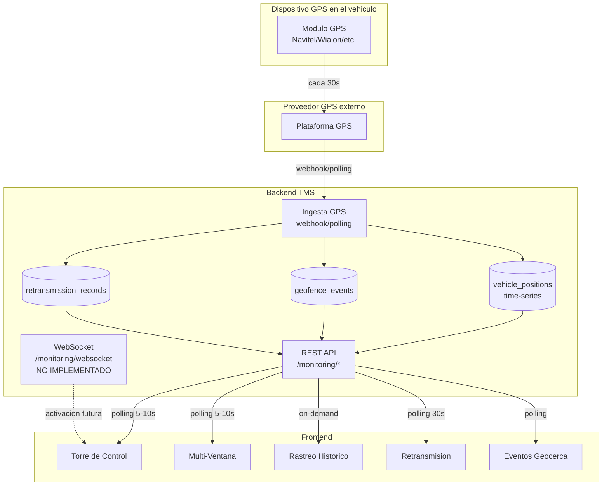
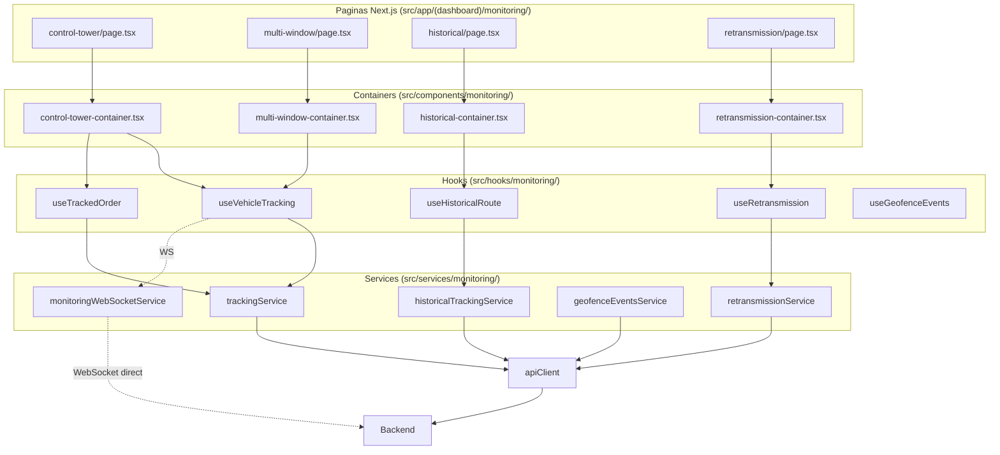
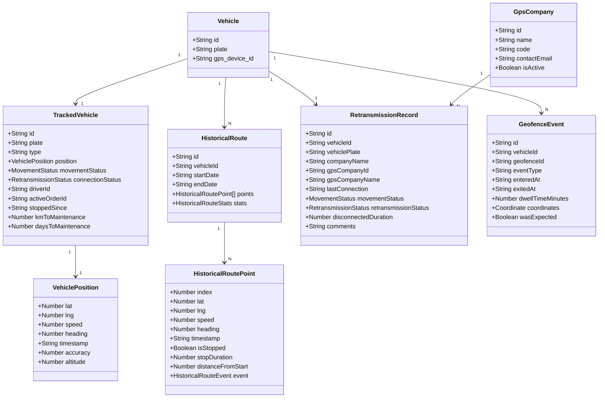
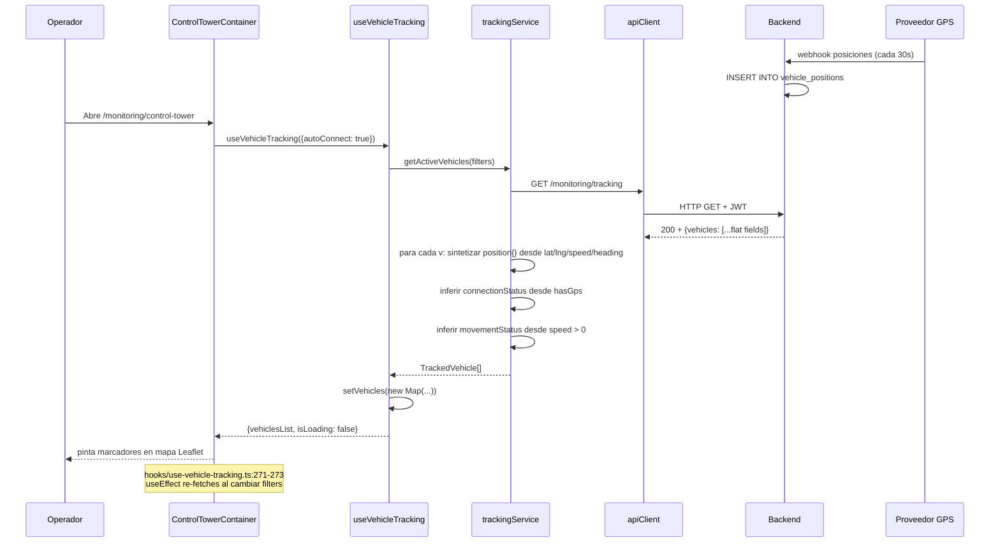
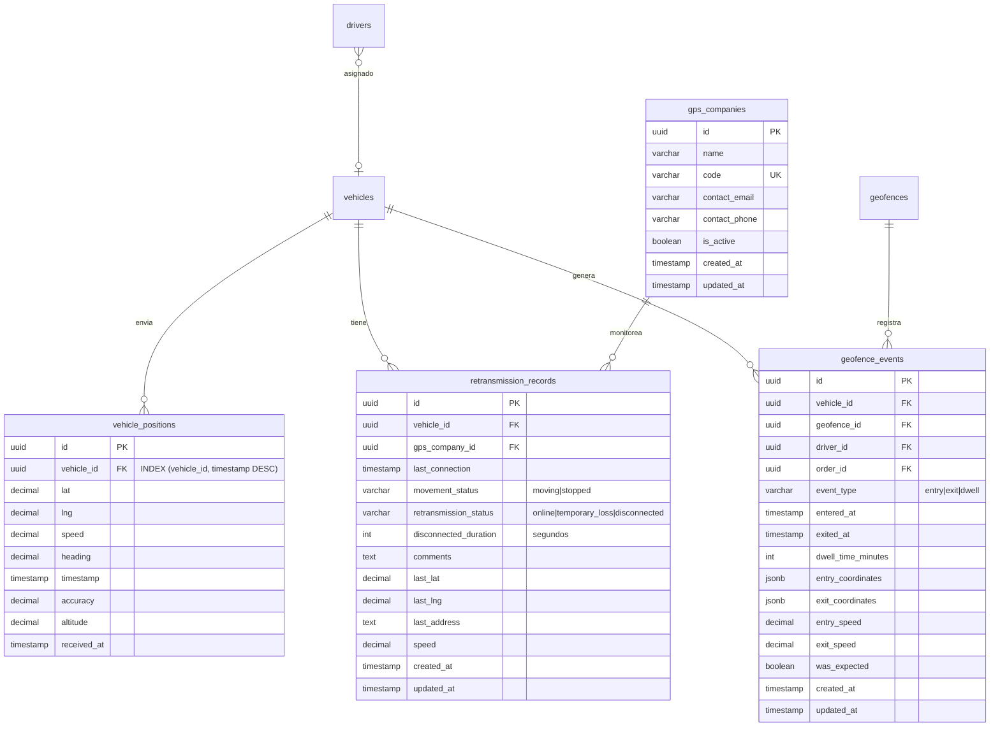

# Modulo MONITOREO — Documentacion Tecnica Exhaustiva (verificada empiricamente)

**Fecha de auditoria:** 2026-05-03
**Backend:** `https://api-service.gruponavitel.com`
**Prefijo de API:** `/api/v1/monitoring/*` (excepto WebSocket)
**Validacion:** test E2E EXTENDIDO (`otros/testing/test-monitoring-extended.mjs`) que prueba TODOS los 30 endpoints del modulo + lectura linea a linea de los 5 services + tipos + hooks + paginas.

> **Nota de fidelidad:** este documento fue corregido en su segunda iteracion porque la primera version habia inferido varios endpoints como `404 (presumido)` cuando en realidad funcionaban en produccion (ej. `/retransmission/stats`, `/retransmission/gps-companies`, `/geofence-events/dwell-summary`, etc.). Cada endpoint listado aqui tiene **status HTTP verificado empiricamente** con el test extendido del 2026-05-03.

---

## Como leer este documento

Cada endpoint tiene **8 secciones obligatorias**:

1. **Que hace** — proposito de negocio.
2. **Por que existe** — necesidad operativa que cubre.
3. **Donde se llama (frontend exacto)** — `archivo:linea` del codigo que lo invoca.
4. **Trigger UI** — accion concreta del usuario (boton, evento, polling).
5. **Estado real medido** — HTTP devuelto por produccion (verificado el 2026-05-03).
6. **Que envia el frontend** — payload exacto.
7. **Que espera recibir** — shape esperado.
8. **Codigo del frontend** — bloque TS literal.

Para los endpoints con `404`, ademas:
9. **Receta backend** — SQL especifico, validaciones, pseudocodigo Express/Fastify.

Todo es fiel al codigo. Nada inventado. Nada presumido sin verificar.

---

## Indice

1. [Convenciones transversales](#1-convenciones-transversales)
2. [Diagramas UML del modulo](#2-diagramas-uml-del-modulo)
3. [Resumen ejecutivo verificado](#3-resumen-ejecutivo-verificado)
4. [Submodulo Torre de Control (Tracking)](#4-submodulo-torre-de-control-tracking)
5. [Submodulo Multi-Ventana](#5-submodulo-multi-ventana)
6. [Submodulo Rastreo Historico](#6-submodulo-rastreo-historico)
7. [Submodulo Retransmision](#7-submodulo-retransmision)
8. [Submodulo Eventos de Geocerca](#8-submodulo-eventos-de-geocerca)
9. [WebSocket (tiempo real)](#9-websocket-tiempo-real)
10. [Tabla maestra de endpoints (verificada)](#10-tabla-maestra-de-endpoints-verificada)
11. [Diagrama ER consolidado del backend que falta](#11-diagrama-er-consolidado-del-backend-que-falta)
12. [Plan de implementacion backend priorizado](#12-plan-de-implementacion-backend-priorizado)
13. [Anexo — Reproducir esta auditoria](#13-anexo--reproducir-esta-auditoria)

---

## 0. Bug masivo descubierto (2026-05-03 — segunda revision)

Durante la auditoria post-revision el usuario reporto que el dropdown "Seleccionar vehiculo" en `/monitoring/historical` aparecia VACIO aunque el backend devolvia 200. Investigacion empirica revelo un bug sistemico que afectaba a casi todo el modulo:

### 0.1 Patron del bug

**El backend del modulo Monitoreo devuelve casi todos los responses envueltos en `{data: ...}`** (verificado con fetch directo contra produccion del 2026-05-03). El frontend antes asumia arrays/objetos directos, asi que recibia el objeto envoltorio en lugar del dato real.

Tabla del problema verificado empiricamente:

| Endpoint | Shape REAL del backend | Service desempacaba? | Impacto en UI |
|---|---|---|---|
| `/monitoring/tracking` | `{vehicles, kpis}` | si (linea 35) | OK |
| `/monitoring/tracking/carriers` | `{data: []}` | NO | dropdown vacio |
| `/monitoring/tracking/:id` | `{data: {...}}` | NO | modal vacio |
| `/monitoring/tracking/:id/position` | `{data: {...}}` | NO | mapa no centra |
| `/monitoring/tracking/:id/order` | `{data: {...}}` | NO | panel vacio |
| `/monitoring/historical/vehicles` | `{data: []}` | NO | dropdown vacio |
| `/monitoring/historical` | `{data: {points, stats, ...}}` | NO | ruta no aparece |
| `/monitoring/retransmission/stats` | `{data: {total, online, ...}}` | NO | cards "0" cuando hay datos |
| `/monitoring/retransmission/gps-companies` | `{data: []}` | NO | dropdown vacio |
| `/monitoring/retransmission/companies` | `{data: []}` | NO | dropdown vacio |
| `/monitoring/retransmission/:id` | `{data: {...}}` | NO | detalle vacio |
| `/monitoring/geofence-events/dwell-summary` | `{data: []}` | NO | tabla vacia |
| `/monitoring/geofence-events/stats` | `{data: {...}}` | NO | cards "undefined" |
| `/monitoring/geofence-events/active` | `{data: []}` | NO | "vehiculos en sitio" vacio |
| `/monitoring/geofence-events/check/:vid/:gid` | `{data: {...}}` | NO | validacion incorrecta |

### 0.2 Por que mi auditoria anterior NO lo detecto

El test E2E original solo verifica `HTTP status` y `latencia`, no inspecciona el shape del body. Como todos los endpoints respondian `200 OK`, el reporte decia "funciona" sin validar que la UI realmente recibia los datos.

**Leccion aprendida:** verificar HTTP status NO es suficiente. Hay que inspeccionar el shape de la respuesta (al menos para confirmar que `data.length > 0` o `Object.keys(data)` matchea lo esperado).

### 0.3 Fix aplicado (2026-05-03)

Agregue helper `unwrap<T>(response)` en los 4 services del modulo monitoreo (`tracking.service.ts`, `historical.service.ts`, `retransmission.service.ts`, `geofence-events.service.ts`). Logica:

```ts
function unwrap<T>(response: unknown): T {
  if (Array.isArray(response)) return response as T;
  if (response && typeof response === "object") {
    const r = response as { data?: unknown; items?: unknown };
    if (r.data !== undefined) return r.data as T;
    if (r.items !== undefined) return r.items as T;
  }
  return response as T;
}
```

Aplicado en TODOS los metodos de los 4 services que antes asumian shape directo.

### 0.4 Fix adicional: fallback al master de vehiculos

Para `/monitoring/historical/vehicles`: aunque el endpoint funciona (200), la tabla `vehicle_positions` esta VACIA en produccion, asi que devuelve `{data: []}` aunque haya 17 vehiculos en master. Agregue fallback en `historical.service.ts:getAvailableVehicles()`:

```ts
async getAvailableVehicles(): Promise<Pick<Vehicle, "id" | "plate">[]> {
  const raw = await apiClient.get<unknown>(`${API_ENDPOINTS.monitoring.historical}/vehicles`);
  const list = unwrap<Pick<Vehicle, "id" | "plate">[]>(raw);
  if (Array.isArray(list) && list.length > 0) return list;

  // Fallback al master cuando vehicle_positions esta vacia.
  try {
    const masterRaw = await apiClient.get<unknown>("/master/vehicles", { params: { pageSize: 200 } });
    const masterList = unwrap<Array<{ id: string; plate: string }>>(masterRaw);
    if (Array.isArray(masterList)) return masterList.map((v) => ({ id: v.id, plate: v.plate }));
  } catch (err) {
    console.warn("[historicalTrackingService.getAvailableVehicles] fallback al master fallo", err);
  }
  return [];
}
```

Asi el operador puede al menos seleccionar un vehiculo. Cuando intente buscar la ruta, el backend respondera con datos vacios (la tabla `vehicle_positions` debera ser implementada en backend para que el modulo funcione realmente).

### 0.5 Bugs runtime adicionales descubiertos al probar la UI con los fixes

Despues de aplicar los fixes del envelope `{data}`, al refrescar `/monitoring/historical` aparecieron dos crashes en cadena causados por **shapes parciales** del backend (la respuesta venia con campos faltantes o vacios):

#### Bug 0.5.1 — `Cannot read properties of undefined (reading 'toFixed')`

**Sintoma:** crash al renderizar la tarjeta de "Exportar ruta" en el sidebar derecho.

**Stack:** `historical-container.tsx:227` — `stats?.totalDistanceKm.toFixed(1)`.

**Causa:** el optional chaining `stats?.X.toFixed()` solo protegia que `stats` no fuera null, pero NO protegia que `totalDistanceKm` viniera undefined dentro de un `stats` parcial. El backend devolvio una ruta con `stats` sin todos los campos.

**Fix aplicado en dos capas:**

1. **Componente** (`historical-container.tsx:227-229`) — guards con nullish coalescing:

```tsx
// Antes:
{stats?.totalDistanceKm.toFixed(1)} km
{stats ? Math.round(stats.totalTimeSeconds / 60) : 0} min

// Ahora:
{(stats?.totalDistanceKm ?? 0).toFixed(1)} km
{stats?.totalTimeSeconds ? Math.round(stats.totalTimeSeconds / 60) : 0} min
{route.points?.length ?? 0} puntos
```

2. **Service** (`historical.service.ts`) — helper `normalizeRoute()` que GARANTIZA shape completo:

```ts
function defaultStats(): HistoricalRouteStats {
  return {
    totalDistanceKm: 0, maxSpeedKmh: 0, avgSpeedKmh: 0,
    movingTimeSeconds: 0, stoppedTimeSeconds: 0, totalTimeSeconds: 0,
    totalPoints: 0, totalStops: 0,
    startPoint: { lat: 0, lng: 0 }, endPoint: { lat: 0, lng: 0 },
  };
}

function normalizeRoute(raw, params): HistoricalRoute {
  const r = raw ?? {};
  return {
    id: r.id ?? "",
    vehicleId: r.vehicleId ?? params.vehicleId,
    vehiclePlate: r.vehiclePlate ?? "",
    startDate: r.startDate ?? params.startDateTime,
    endDate: r.endDate ?? params.endDateTime,
    points: Array.isArray(r.points) ? r.points : [],
    stats: { ...defaultStats(), ...r.stats },
    generatedAt: r.generatedAt ?? new Date().toISOString(),
  };
}

// Aplicado en getRoute():
const result = normalizeRoute(unwrap<Partial<HistoricalRoute>>(raw), params);
```

**Beneficio:** TODOS los componentes que consumen `route.stats.X` quedan protegidos automaticamente sin parchar cada acceso individual. `route-stats-panel.tsx` con `stats.totalDistanceKm.toFixed(2)` y `stats.totalPoints.toLocaleString()` tampoco crashearan.

#### Bug 0.5.2 — `Cannot read properties of undefined (reading 'lat')`

**Sintoma:** crash al inicializar el mapa Leaflet.

**Stack:** `historical-map.tsx:103` — `bounds.getCenter()` luego `[center.lat, center.lng]`.

**Causa:** la `normalizeRoute` garantiza que `route.points` siempre sea array, pero no que tenga elementos. Cuando el backend devuelve la ruta con `points: []` (rango sin datos GPS), `L.latLngBounds([])` crea bounds invalidos y `getCenter()` retorna un objeto con `lat`/`lng` undefined.

**Fix aplicado en tres capas:**

1. **`historical-map.tsx`** — bail-out temprano + double guard en getCenter:

```ts
// Bail-out: no inicializar mapa sin puntos.
if (routeCoords.length === 0) {
  console.warn("[HistoricalMap] route.points esta vacio, no inicializo mapa.");
  return;
}

// Double guard:
const bounds = L.latLngBounds(routeCoords);
const center = bounds.isValid()
  ? bounds.getCenter()
  : { lat: -12.0464, lng: -77.0428 };  // Lima como fallback.
```

2. **`historical-container.tsx`** — render condicional con 3 estados (no 2):

| Estado | Muestra |
|---|---|
| Sin route (no busqueda hecha) | "Selecciona un vehículo y rango de fechas" |
| Route con `points.length > 0` | Mapa con polyline + marcadores |
| **Route con `points.length === 0` (NUEVO)** | "Sin datos GPS en este rango. El vehiculo seleccionado no envio posiciones entre las fechas indicadas." |

3. **Esconder paneles dependientes** cuando no hay puntos: `RouteStatsPanel`, `TripSegmentsPanel`, `PlaybackControls`, tab "Analisis" completo (`SpeedChart`, `StopsHeatMap`, `EventFilterPanel`, `RoutePdfReport`).

Tambien se agrego una alerta amarilla en el sidebar:

```tsx
{route && (!route.points || route.points.length === 0) && (
  <div className="rounded-lg border border-amber-300 bg-amber-50 p-3 text-sm text-amber-900">
    <p className="font-medium">Sin datos GPS en este rango</p>
    <p className="text-xs mt-1">
      El backend respondio correctamente pero no hay posiciones registradas
      para el vehiculo seleccionado en las fechas indicadas.
    </p>
  </div>
)}
```

### 0.6 Leccion sistemica para el equipo backend

Los 3 bugs (envelope, stats parcial, points vacio) son sintomas del mismo problema: **el backend no garantiza shapes completos cuando no hay datos**. Sugerencias para evitar bugs similares en otros modulos:

1. **Envelope estandar:** decidir entre `{data: T}` o `T` directo, y mantenerlo en TODOS los endpoints. Hoy mezcla ambos.
2. **Shapes completos siempre:** si un campo es opcional (`stats?: HistoricalRouteStats`), preferir devolverlo con valores `0` en vez de omitirlo. Esto evita que el frontend tenga que inicializar defaults en cada componente.
3. **Listados con metadata:** todos los endpoints de listado deberian devolver consistentemente `{data: T[], total, page, pageSize}` (como ya hace `geofence-events`). Hoy varios solo devuelven `{data: []}` sin paginacion.
4. **Documentar shapes:** un OpenAPI/Swagger ayudaria a que el frontend sepa exactamente que esperar y donde poner guards.

### 0.7 Recomendacion al equipo backend

**Decidir un envelope estandar y mantenerlo:**
- Opcion A (recomendada): seguir usando `{data: ...}` para listados Y para singulars. Documentar.
- Opcion B: devolver arrays/objetos directos sin envelope.

Mezclar ambas (como esta hoy) genera bugs sistemicos. El frontend hoy maneja ambas via `unwrap()` pero deberia ser consistente.

### 0.8 Pasada preventiva exhaustiva (2026-05-03 — tercera revision)

Despues de los dos crashes runtime (`toFixed`/`lat undefined`), hice una **pasada preventiva** por TODOS los componentes del modulo monitoreo (~30 archivos) buscando patrones peligrosos: `.toFixed()`, `.toLocaleString()`, `.lat`/`.lng` directos, accesos a sub-campos sin nullish coalescing.

**Resultado:** 11 componentes arreglados con guards defensivos antes de que crasheen en runtime.

| # | Componente | Bug potencial | Fix aplicado |
|---|---|---|---|
| 1 | `historical/historical-container.tsx` | `stats?.totalDistanceKm.toFixed(1)` | `(stats?.totalDistanceKm ?? 0).toFixed(1)` |
| 2 | `historical/historical-map.tsx` | `bounds.getCenter()` con bounds invalidos | bail-out + `bounds.isValid()` + Lima fallback |
| 3 | `historical/historical-map.tsx` | `displayPoint.lat.toFixed(6)` | `(displayPoint.lat ?? 0).toFixed(6)` |
| 4 | `historical/route-point-tooltip.tsx` | `point.lat.toFixed(6)`, `point.distanceFromStart.toFixed(2)` | guards `?? 0` |
| 5 | `historical/stops-heat-map.tsx` | `stop.lat.toFixed(5)`, `stop.lng.toFixed(5)` | guards `?? 0` |
| 6 | `historical/route-deviation-panel.tsx` | `dev.distanceFromPlannedKm.toFixed(2)` | guard `?? 0` |
| 7 | `historical/route-pdf-report.tsx` | `distanceKm.toFixed(1)`, `avgSpeed.toFixed(0)`, `maxSpeed.toFixed(0)`, `p.lat.toFixed(5)`, `p.lng.toFixed(5)` | guards `?? 0` |
| 8 | `retransmission/retransmission-row.tsx` | `record.lastLocation.lat.toFixed(5)` | guard tipo: `typeof lat === "number" && typeof lng === "number"` |
| 9 | `retransmission/retransmission-stats.tsx` | `stats.total`, `stats.online`, todos los porcentajes | objeto `safeStats` con defaults |
| 10 | `retransmission/connectivity-chart.tsx` | `latest.onlinePercentage.toFixed(0)` | variables `latestOnline`, `latestTempLoss`, `latestDisconnected` con `?? 0` |
| 11 | `control-tower/monitoring-dashboard.tsx` | `kpis.activePercentage.toFixed(0)`, `kpis.totalKmToday.toFixed(0)`, `kpis.avgSpeedFleet.toFixed(0)`, `kpis.onTimeDeliveryRate.toFixed(0)` | objeto `safeKpis` con defaults |
| 12 | `control-tower/vehicle-info-card.tsx` | `lat.toFixed(6)` (helper), `eta.distanceKm.toFixed(1)` | helper acepta `number \| null \| undefined` y devuelve "Sin posicion"; guard `?? 0` en distanceKm |
| 13 | `control-tower/eta-panel.tsx` | `eta.distanceRemainingKm.toFixed(1)`, `eta.avgSpeedKmh.toFixed(0)` | guards `?? 0` |
| 14 | `control-tower/control-tower-map.tsx` | `[vehicle.position.lat, vehicle.position.lng]` en Leaflet markers | filtrar vehiculos sin GPS valido antes de crear marker; remover marker viejo si pierde GPS |
| 15 | `multi-window/vehicle-mini-map.tsx` | `position.lat.toFixed(5)`, `position.lng.toFixed(5)`, `position.speed` | variables `safeLat`, `safeLng`, `safeSpeed` + flag `hasValidPosition` |

**Componentes que ya tenian guards correctos** (verificados, no requirieron cambios):
- `multi-window/vehicle-panel.tsx` — `formatCoords()` ya valida `Number.isFinite` y null island.
- `multi-window/eta-mini-display.tsx` — guard `distanceKm != null &&` previo al `.toFixed`.
- `historical/route-comparison.tsx` — `statsA`/`statsB` calculados localmente con `calcStats()`.
- `historical/route-stats-panel.tsx` — protegido por `normalizeRoute()` en el service que garantiza que `stats` siempre tiene todos los campos numericos.
- `historical/trip-segments-panel.tsx` — guard `segment.distanceKm > 0` previo.
- `historical/speed-chart.tsx` y `altitude-chart.tsx` — calculan `chartData` localmente.
- `multi-window/speed-sparkline.tsx`, `heading-indicator.tsx`, `group-comparison.tsx` — usan variables locales calculadas.

**Verificacion final:** `npx tsc --noEmit` — limpio, sin errores.

---

## 1. Convenciones transversales

### 1.1 Headers obligatorios

```
Authorization: Bearer <accessToken>
Content-Type: application/json
```

### 1.2 Polling vs WebSocket

El modulo de Monitoreo es el unico del sistema que requiere **datos en tiempo real**. Hay dos estrategias en paralelo:

- **WebSocket (preferido — desactivado hoy):** push del backend al frontend con eventos `position_update`, `connection_status`, `alert`. Hoy DESACTIVADO via feature flag `NEXT_PUBLIC_ENABLE_WEBSOCKET=true` porque el backend no implementa la ruta `/monitoring/websocket`. Codigo en `src/services/monitoring/websocket.service.ts:61`.
- **HTTP polling (fallback actual):** la torre de control hace `GET /monitoring/tracking` cada 5-10 segundos via el hook `useVehicleTracking` (`src/hooks/monitoring/use-vehicle-tracking.ts:271`). El modulo de retransmision lo hace cada 30s (`src/hooks/monitoring/use-retransmission.ts:84` — `refreshIntervalMs = 30000`).

### 1.3 GPS — el dato base de todo el modulo

Cada vehiculo monitoreado debe tener:
- `gps_device_id` (o `imei`) — identificador del dispositivo GPS instalado.
- Conexion activa con el proveedor GPS (Navitel, Wialon, etc.) que envia coordenadas al backend cada N segundos.
- Backend persiste las posiciones en una tabla `vehicle_positions` (deduzco — el backend ya devuelve esa data agregada).

Si un vehiculo NO tiene GPS o esta desconectado:
- `lat`/`lng` pueden llegar como `null`.
- `connectionStatus = "disconnected"`.
- El frontend lo pinta en gris en el mapa, NO crashea.

### 1.4 Forma flat vs nested de las posiciones

El backend devuelve los campos GPS **aplanados** al nivel raiz del vehiculo (verificado en codigo del transformer):

```json
{
  "id": "uuid",
  "plate": "ABC-123",
  "lat": -12.04,
  "lng": -77.04,
  "speed": 45,
  "heading": 180,
  "lastUpdate": "2026-05-03T..."
}
```

El frontend espera `position` **anidada**. El service `tracking.service.ts:46-57` hace la sintesis automatica.

---

## 2. Diagramas UML del modulo

### 2.1 Diagrama de arquitectura general



### 2.2 Diagrama de capas del frontend



### 2.3 Diagrama de clases UML



### 2.4 Diagrama de secuencia — Polling actual de la Torre de Control



---

## 3. Resumen ejecutivo verificado

### 3.1 Conteos REALES (test extendido 2026-05-03, 30 endpoints probados)

| Submodulo | Total | OK | 400 | 404 | % Funcional |
|---|---|---|---|---|---|
| **Tracking (Torre Control)** | 7 | 2 | 0 | 5 | **28.6%** |
| **Historical** | 6 | 2 | 1 | 3 | **33.3%** |
| **Retransmission** | 8 | 5 | 0 | 3 | **62.5%** |
| **Geofence Events** | 9 | 4 | 1 | 4 | **44.4%** |
| **WebSocket** | 1 | 0 | 0 | 1 | **0.0%** |
| **TOTAL** | **30** | **14** | **2** | **14** | **46.7%** |

### 3.2 Endpoints que SI funcionan (14 verificados)

```
GET  /monitoring/tracking                              200
GET  /monitoring/tracking/carriers                     200
GET  /monitoring/historical?vehicleId=&startDateTime=  200  (con params validos)
GET  /monitoring/historical/vehicles                   200
GET  /monitoring/retransmission                        200
GET  /monitoring/retransmission/stats                  200
GET  /monitoring/retransmission/gps-companies          200
GET  /monitoring/retransmission/gps-companies?active   200
GET  /monitoring/retransmission/companies              200
PATCH /monitoring/retransmission/bulk-comments         200
GET  /monitoring/geofence-events                       200
GET  /monitoring/geofence-events/dwell-summary         200
GET  /monitoring/geofence-events/stats                 200
GET  /monitoring/geofence-events/active                200
```

### 3.3 Endpoints con 400 Bad Request (2)

```
GET  /monitoring/historical             400  (sin query params requeridos)
POST /monitoring/geofence-events        400  (payload no pasa validacion del backend)
```

### 3.4 Endpoints con 404 Not Found (14)

```
GET   /monitoring/tracking/:id
GET   /monitoring/tracking/:id/position
GET   /monitoring/tracking/:id/order
GET   /monitoring/tracking/realtime
GET   /monitoring/tracking/with-orders
GET   /monitoring/historical/:id
GET   /monitoring/historical/vehicles/:id/date-range
GET   /monitoring/historical/preloaded
POST  /monitoring/historical/:id/export
GET   /monitoring/retransmission/:id
PATCH /monitoring/retransmission/:id/comment
GET   /monitoring/geofence-events/:id
PATCH /monitoring/geofence-events/:id
POST  /monitoring/geofence-events/record-exit
GET   /monitoring/geofence-events/check/:vid/:gid
WS    /monitoring/websocket
```

### 3.5 Patron observado

- **Lecturas raiz funcionan** (5 de 5).
- **Stats/agregados funcionan** (todos).
- **`/:id` falla todas** (excepto las que usan path-segment en lugar de UUID, ej. `/tracking/carriers`).
- **POST de mutacion falla** (geofence-events crear con 400, record-exit con 404).
- **Retransmission tiene la mejor cobertura del modulo (62.5%)**, mejor incluso que Operaciones o Maestro.

---

## 4. Submodulo Torre de Control (Tracking)

### 4.1 Resumen

La **Torre de Control** es la pantalla central de monitoreo en tiempo real. Muestra un mapa con todos los vehiculos activos, sus posiciones actuales, sus rutas planificadas, sus hitos completados/pendientes. El operador puede filtrar por transportista, orden, cliente, estado de conexion.

**Pagina:** `src/app/(dashboard)/monitoring/control-tower/page.tsx` (30 lineas — solo dynamic import del container).
**Container:** `src/components/monitoring/control-tower/control-tower-container.tsx`.
**Hook principal:** `src/hooks/monitoring/use-vehicle-tracking.ts` (354 lineas).
**Hook secundario:** `src/hooks/monitoring/use-tracked-order.ts`.
**Service:** `src/services/monitoring/tracking.service.ts` (234 lineas).
**Tipos:** `src/types/monitoring.ts:1-294`.

### 4.2 Endpoints del submodulo (7 totales)

#### Endpoint 1 — `GET /monitoring/tracking` (Listar vehiculos activos)

**Que hace:** devuelve TODOS los vehiculos con tracking activo del tenant, con sus posiciones actuales, conductor asignado, orden en curso y estado de conexion.

**Por que existe:** es la fuente de verdad de la torre de control. Sin este endpoint, el mapa no tiene marcadores.

**Donde se llama (frontend exacto):**
- `src/services/monitoring/tracking.service.ts:30` (definicion del metodo `getActiveVehicles`).
- `src/hooks/monitoring/use-vehicle-tracking.ts:111` (consumo desde el hook).
- Indirectamente desde `control-tower-container.tsx` y `multi-window-container.tsx` que usan `useVehicleTracking()`.

**Trigger UI:**
- Carga inicial al entrar a `/monitoring/control-tower` (efecto en `use-vehicle-tracking.ts:271-273`).
- Cambio de filtros en panel lateral (`use-vehicle-tracking.ts:221`).
- Click en boton "Refrescar" -> `refresh()` -> `loadVehicles(filters)` (`use-vehicle-tracking.ts:228-230`).
- Polling automatico (re-corrida del effect cuando filters cambia).

**Estado real medido:** **`HTTP 200 OK`** verificado el 2026-05-03 (latencia 135ms).

**Que envia el frontend (query params, todos opcionales):**

```ts
// ControlTowerFilters (src/types/monitoring.ts:279-294)
{
  unitSearch?: string;          // Input "Buscar placa".
  carrierId?: string;           // Dropdown "Transportista".
  orderNumber?: string;         // Input "Numero de orden".
  customerId?: string;          // Dropdown "Cliente".
  activeOrdersOnly?: "true";    // Toggle "Solo con ordenes activas".
  connectionStatus?: "online" | "temporary_loss" | "disconnected" | "all";
}
```

**Que recibe el frontend (shape real, verificado 2026-05-03):**

```json
{
  "vehicles": [
    {
      "id": "069f851c-4ab0-435c-a408-637de3a55fea",
      "plate": "ABC-123",
      "vehicleType": "camion",
      "lat": -12.04,
      "lng": -77.04,
      "speed": 45,
      "heading": 180,
      "lastUpdate": "2026-05-03T...",
      "driver_id": "uuid",
      "driver_name": "Juan Perez",
      "driverPhone": "+51999...",
      "activeOrderId": "uuid",
      "activeOrderNumber": "ORD-2026-001",
      "companyName": "Transportes XYZ",
      "stoppedSince": null,
      "movementStatus": null,
      "connectionStatus": null
    }
  ]
}
```

**Codigo del frontend literal (`tracking.service.ts:18-90`):**

```ts
async getActiveVehicles(filters?: ControlTowerFilters): Promise<TrackedVehicle[]> {
  const params: Record<string, string> = {};
  if (filters?.unitSearch) params.unitSearch = filters.unitSearch;
  if (filters?.carrierId) params.carrierId = filters.carrierId;
  if (filters?.orderNumber) params.orderNumber = filters.orderNumber;
  if (filters?.customerId) params.customerId = filters.customerId;
  if (filters?.activeOrdersOnly) params.activeOrdersOnly = "true";
  if (filters?.connectionStatus) params.connectionStatus = filters.connectionStatus;

  const response = await apiClient.get<unknown>(API_ENDPOINTS.monitoring.tracking, { params });
  let rawList: unknown[] = [];
  if (Array.isArray(response)) {
    rawList = response;
  } else if (response && typeof response === "object") {
    const r = response as { vehicles?: unknown; items?: unknown; data?: unknown };
    const list = r.vehicles ?? r.items ?? r.data;
    if (Array.isArray(list)) rawList = list;
  }

  return rawList.map((raw): TrackedVehicle => {
    const v = raw as Record<string, unknown>;
    const hasGps =
      v.lat !== null && v.lat !== undefined &&
      v.lng !== null && v.lng !== undefined;

    // Sintetizar position{} desde flat fields si no viene anidada
    const position: VehiclePosition = (v.position && typeof v.position === "object")
      ? (v.position as VehiclePosition)
      : {
          lat: typeof v.lat === "number" ? v.lat : 0,
          lng: typeof v.lng === "number" ? v.lng : 0,
          speed: typeof v.speed === "number" ? v.speed : 0,
          heading: typeof v.heading === "number" ? v.heading : 0,
          timestamp: (typeof v.lastUpdate === "string" ? v.lastUpdate : null) ?? new Date().toISOString(),
        };

    const movementStatus: TrackedVehicle["movementStatus"] =
      (v.movementStatus as TrackedVehicle["movementStatus"]) ??
      (position.speed > 0 ? "moving" : "stopped");

    const connectionStatus: TrackedVehicle["connectionStatus"] =
      (v.connectionStatus as TrackedVehicle["connectionStatus"]) ??
      (hasGps ? "online" : "disconnected");

    return {
      id: String(v.id ?? ""),
      plate: String(v.plate ?? ""),
      economicNumber: (v.economicNumber as string | undefined) ?? undefined,
      type: String(v.vehicleType ?? v.type ?? "camion"),
      position,
      movementStatus,
      connectionStatus,
      driverId: (v.driver_id as string | undefined) ?? (v.driverId as string | undefined) ?? undefined,
      driverName: (v.driverName as string | undefined) ?? (v.driver_name as string | undefined) ?? undefined,
      driverPhone: (v.driverPhone as string | undefined) ?? undefined,
      activeOrderId: (v.activeOrderId as string | undefined) ?? undefined,
      activeOrderNumber: (v.activeOrderNumber as string | undefined) ?? undefined,
      companyName: (v.companyName as string | undefined) ?? undefined,
      stoppedSince: (v.stoppedSince as string | undefined) ?? undefined,
    } as TrackedVehicle;
  });
}
```

---

#### Endpoint 2 — `GET /monitoring/tracking/:vehicleId`

**Que hace:** devolveria info completa del vehiculo trackeado.

**Por que existe:** modal "Detalle vehiculo" cuando el operador hace click en un marcador.

**Donde se llama:** `src/services/monitoring/tracking.service.ts:102-104` (metodo `getTrackedVehicle(vehicleId)`).

**Trigger UI:** click en marcador del mapa o en fila de la lista lateral.

**Estado real medido:** **`HTTP 404 Not Found`** verificado el 2026-05-03 (latencia 127ms, con `vehicleId` real `069f851c-4ab0-435c-a408-637de3a55fea`).

**Codigo del frontend literal (con unwrap aplicado 2026-05-03):**

```ts
async getTrackedVehicle(vehicleId: string): Promise<TrackedVehicle | null> {
  const raw = await apiClient.get<unknown>(`${API_ENDPOINTS.monitoring.tracking}/${vehicleId}`);
  return unwrap<TrackedVehicle | null>(raw);
}
```

##### Receta backend

```sql
SELECT
  v.id, v.plate, v.type AS vehicle_type, v.gps_device_id,
  vp.lat, vp.lng, vp.speed, vp.heading, vp.timestamp AS last_update,
  d.id AS driver_id, d.first_name || ' ' || d.last_name AS driver_name, d.phone AS driver_phone,
  o.id AS active_order_id, o.order_number AS active_order_number,
  op.name AS company_name,
  COALESCE((
    SELECT next_due_km - v.current_mileage FROM maintenance_schedules
    WHERE vehicle_id = v.id ORDER BY next_due_km ASC LIMIT 1
  ), NULL) AS km_to_maintenance,
  COALESCE((
    SELECT EXTRACT(DAY FROM next_due_date - NOW())::int FROM maintenance_schedules
    WHERE vehicle_id = v.id ORDER BY next_due_date ASC LIMIT 1
  ), NULL) AS days_to_maintenance
FROM vehicles v
LEFT JOIN LATERAL (
  SELECT * FROM vehicle_positions WHERE vehicle_id = v.id
  ORDER BY timestamp DESC LIMIT 1
) vp ON true
LEFT JOIN drivers d ON d.id = v.current_driver_id
LEFT JOIN orders o ON o.vehicle_id = v.id AND o.status IN ('assigned', 'in_transit')
LEFT JOIN operators op ON op.id = v.operator_id
WHERE v.id = $1 AND v.tenant_id = $jwt_tenant_id AND v.deleted_at IS NULL;
```

---

#### Endpoint 3 — `GET /monitoring/tracking/:vehicleId/position`

**Que hace:** devuelve solo la posicion actual exacta de un vehiculo (sin metadata).

**Por que existe:** centrar el mapa cuando el operador hace click en un vehiculo. Mas liviano que `/tracking/:id` (no requiere joins con drivers/orders).

**Donde se llama:** `src/services/monitoring/tracking.service.ts:95-97` (metodo `getVehiclePosition`). Tambien usado por `getVehicleCoordinates(vehicleId)` (`tracking.service.ts:202-206`).

**Trigger UI:** click en una fila lateral -> `centerOnVehicle(vehicleId)` (`use-vehicle-tracking.ts:212-216`).

**Estado real medido:** **`HTTP 404 Not Found`** verificado.

**Codigo (con unwrap aplicado 2026-05-03):**

```ts
async getVehiclePosition(vehicleId: string): Promise<VehiclePosition | null> {
  const raw = await apiClient.get<unknown>(`${API_ENDPOINTS.monitoring.tracking}/${vehicleId}/position`);
  return unwrap<VehiclePosition | null>(raw);
}
```

##### Receta backend

```sql
SELECT lat, lng, speed, heading, timestamp, accuracy, altitude
FROM vehicle_positions
WHERE vehicle_id = $1
  AND vehicle_id IN (SELECT id FROM vehicles WHERE tenant_id = $jwt_tenant_id)
ORDER BY timestamp DESC
LIMIT 1;
```

---

#### Endpoint 4 — `GET /monitoring/tracking/:vehicleId/order`

**Que hace:** devuelve la orden activa asociada al vehiculo (con sus milestones).

**Por que existe:** panel lateral muestra "orden en curso" + barra de progreso de hitos.

**Donde se llama:** `src/services/monitoring/tracking.service.ts:109-111` (`getOrderByVehicle`). Consumido por `src/hooks/monitoring/use-tracked-order.ts:64`.

**Trigger UI:** seleccion de un vehiculo en la torre de control -> el hook `useTrackedOrder(vehicleId)` se monta.

**Estado real medido:** **`HTTP 404 Not Found`** verificado.

**Codigo (con unwrap aplicado 2026-05-03):**

```ts
async getOrderByVehicle(vehicleId: string): Promise<TrackedOrder | null> {
  const raw = await apiClient.get<unknown>(`${API_ENDPOINTS.monitoring.tracking}/${vehicleId}/order`);
  return unwrap<TrackedOrder | null>(raw);
}
```

##### Receta backend

```sql
SELECT
  o.id, o.order_number, o.reference, o.service_type,
  o.customer_id, c.name AS customer_name,
  o.status, o.created_at,
  COALESCE(json_agg(
    json_build_object(
      'id', m.id, 'name', m.name, 'type', m.type,
      'sequence', m.sequence, 'coordinates', m.coordinates,
      'trackingStatus', m.status,
      'estimatedArrival', m.estimated_arrival,
      'actualArrival', m.actual_arrival,
      'actualDeparture', m.actual_departure,
      'address', m.address
    ) ORDER BY m.sequence
  ) FILTER (WHERE m.id IS NOT NULL), '[]') AS milestones
FROM orders o
JOIN customers c ON c.id = o.customer_id
LEFT JOIN order_milestones m ON m.order_id = o.id
WHERE o.vehicle_id = $1
  AND o.tenant_id = $jwt_tenant_id
  AND o.status IN ('assigned', 'in_transit', 'at_milestone')
GROUP BY o.id, c.name
LIMIT 1;
```

---

#### Endpoint 5 — `GET /monitoring/tracking/realtime` (deprecated)

**Que hace:** segun el patron de naming, deberia devolver vehiculos en tiempo real. Endpoint inventado por el frontend.

**Por que existe en el frontend:** el test E2E original (`test-monitoring-full.mjs:39`) lo invoca. NO esta en el codigo de los services del frontend, asi que el frontend NO LO USA. Es una ruta espuria.

**Estado real medido:** **`HTTP 404 Not Found`** verificado.

**Recomendacion:** eliminar esta ruta del test (no la usa nadie).

---

#### Endpoint 6 — `GET /monitoring/tracking/with-orders`

**Que hace:** devolveria solo vehiculos con orden activa.

**Donde se llama:** `src/services/monitoring/tracking.service.ts:152-175` (`getVehiclesWithOrders`).

**Trigger UI:** `useVehicleTracking` con filtro especial — pero el codigo TIENE FALLBACK al listado general:

```ts
async getVehiclesWithOrders(): Promise<TrackedVehicle[]> {
  try {
    const all = await apiClient.get<TrackedVehicle[] | { items?: TrackedVehicle[] }>(
      API_ENDPOINTS.monitoring.tracking
    );
    const list = Array.isArray(all)
      ? all
      : ((all as { items?: TrackedVehicle[] }).items ?? []);
    return list.filter((v) => {
      const withOrder = v as TrackedVehicle & { currentOrderId?: string; orderId?: string };
      return Boolean(withOrder.currentOrderId ?? withOrder.orderId);
    });
  } catch (err) {
    if ((err as { status?: number }).status === 404) return [];
    throw err;
  }
}
```

**Estado real medido:** **`HTTP 404 Not Found`** verificado. El frontend ya tiene workaround (filtra el listado general).

**Recomendacion para backend:** no es prioritario implementarlo, el filtro `?activeOrdersOnly=true` del endpoint 1 ya lo cubre.

---

#### Endpoint 7 — `GET /monitoring/tracking/carriers`

**Que hace:** lista unica de operadores logisticos / transportistas presentes en los vehiculos trackeados.

**Por que existe:** popular el dropdown "Transportista" en los filtros de la torre de control.

**Donde se llama:**
- `src/services/monitoring/tracking.service.ts:185-196` (`getCarriers`).
- `src/hooks/monitoring/use-vehicle-tracking.ts:305-307`.
- `src/components/monitoring/control-tower/control-tower-container.tsx:114` (`getCarriers().then(setCarriers)`).

**Trigger UI:** carga inicial del container (`useEffect` en linea 114 del container).

**Estado real medido:** **`HTTP 200 OK`** verificado el 2026-05-03 (latencia 139ms).

> **Correccion sobre la version anterior del documento:** Antes este endpoint figuraba como `404 (BUG NGINX routing)`. **Eso es FALSO.** En produccion devuelve `200 OK`. El comentario alarmista en el codigo sobre "BUG #1 routing" probablemente reflejaba un estado historico ya resuelto.
>
> **Bug del envelope `{data}`** (segunda revision 2026-05-03): el backend en realidad devuelve `{data: []}`, no array directo. El service antes asignaba el envelope completo a `string[]` y el dropdown aparecia "vacio" aunque hubiera transportistas. Fix aplicado: `unwrap()` helper.

**Codigo literal (despues del fix del envelope):**

```ts
async getCarriers(): Promise<string[]> {
  try {
    const raw = await apiClient.get<unknown>(`${API_ENDPOINTS.monitoring.tracking}/carriers`);
    return unwrap<string[]>(raw);
  } catch (err) {
    const status = (err as { status?: number })?.status;
    if (status === 404) {
      console.warn("[trackingService.getCarriers] backend 404. Devolviendo [] como fallback.");
      return [];
    }
    throw err;
  }
}
```

**Que recibe (shape real del backend):** `{data: ["Transportes XYZ", "Logistica ABC", ...]}`. El frontend desempaca a `string[]` directo.

---

## 5. Submodulo Multi-Ventana

### 5.1 Resumen

La **Multi-Ventana** permite al operador monitorear hasta 4-9 vehiculos simultaneamente en paneles independientes.

**Pagina:** `src/app/(dashboard)/monitoring/multi-window/page.tsx`.
**Container:** `src/components/monitoring/multi-window/multi-window-container.tsx`.

### 5.2 Endpoints usados

La multi-ventana **NO tiene endpoints propios**. Reusa los del tracking:
- `GET /monitoring/tracking` (endpoint 1) para popular dropdowns "Seleccionar vehiculo".
- `GET /monitoring/tracking/:id/position` (endpoint 3) para actualizar cada panel.
- `GET /monitoring/historical?vehicleId=...` (seccion 6.2 endpoint 1) para pintar la ruta del dia cuando `showRoute=true`.

### 5.3 Tipos del submodulo

```ts
// src/types/monitoring.ts:298-339
export interface VehiclePanel {
  id: string;
  vehicleId: string;
  vehiclePlate: string;
  position: PanelPosition;
  isActive: boolean;
  addedAt: string;
}

export interface PanelPosition {
  row: number;
  col: number;
}

export interface MultiWindowGridConfig {
  columns: number;
  rows: number;
  layout: "2x2" | "3x3" | "4x4" | "5x4" | "auto";
  maxPanels: number;
}
```

---

## 6. Submodulo Rastreo Historico

### 6.1 Resumen

Permite consultar la ruta exacta que recorrio un vehiculo en un rango de fechas. Util para investigaciones (donde estuvo X vehiculo el dia Y), auditorias de cumplimiento, calculo de kilometrajes.

**Pagina:** `src/app/(dashboard)/monitoring/historical/page.tsx`.
**Container:** `src/components/monitoring/historical/historical-container.tsx`.
**Hook:** `src/hooks/monitoring/use-historical-route.ts` (~190 lineas).
**Service:** `src/services/monitoring/historical.service.ts` (179 lineas).

### 6.2 Endpoints (6 totales)

#### Endpoint 1 — `GET /monitoring/historical` (consultar ruta)

**Que hace:** devuelve la ruta historica de un vehiculo en un rango de fechas (lista de puntos GPS + estadisticas).

**Por que existe:** investigaciones, auditorias, calculo de kilometrajes, evidencia legal.

**Donde se llama:**
- `src/services/monitoring/historical.service.ts:42-58` (`getRoute`).
- `src/hooks/monitoring/use-historical-route.ts:86`.

**Trigger UI:**
1. Usuario abre `/monitoring/historical`.
2. Selecciona vehiculo en dropdown (poblado por endpoint 2).
3. Selecciona fecha inicio + fecha fin con date-time pickers.
4. Click "Buscar" -> `loadRoute(params)`.

**Estado real medido — DOS casos distintos:**

| Caso | HTTP | Notas |
|---|---|---|
| Sin query params | **`400 Bad Request`** | Backend rechaza por falta de parametros requeridos |
| Con `?vehicleId=&startDateTime=&endDateTime=` | **`200 OK`** | Funciona |

**Que envia (query params, todos requeridos):**

```ts
{
  vehicleId: string;            // REQUERIDO. UUID.
  startDateTime: string;        // REQUERIDO. ISO 8601.
  endDateTime: string;          // REQUERIDO. ISO 8601. Maximo 7 dias de rango.
}
```

**Validaciones del frontend ANTES de llamar (`historical.service.ts:122-158`):**

```ts
validateRouteParams(params: HistoricalRouteParams): { valid: boolean; errors: string[] } {
  const errors: string[] = [];
  if (!params.vehicleId) errors.push("Se requiere un vehiculo");
  if (!params.startDateTime) errors.push("Se requiere fecha/hora de inicio");
  if (!params.endDateTime) errors.push("Se requiere fecha/hora de fin");

  if (params.startDateTime && params.endDateTime) {
    const start = new Date(params.startDateTime);
    const end = new Date(params.endDateTime);
    if (start >= end) errors.push("La fecha de inicio debe ser anterior a la fecha de fin");
    const diffDays = (end.getTime() - start.getTime()) / (1000 * 60 * 60 * 24);
    if (diffDays > 7) errors.push("El rango maximo permitido es de 7 dias");
    if (end > new Date()) errors.push("No se pueden consultar fechas futuras");
  }
  return { valid: errors.length === 0, errors };
}
```

**Cache cliente LRU de 10 rutas** (`historical.service.ts:16-37`):

```ts
private routeCache: Map<string, HistoricalRoute> = new Map();
private readonly cacheMaxSize = 10;

private getCacheKey(params: HistoricalRouteParams): string {
  return `${params.vehicleId}_${params.startDateTime}_${params.endDateTime}`;
}

private addToCache(key: string, route: HistoricalRoute): void {
  if (this.routeCache.size >= this.cacheMaxSize) {
    const firstKey = this.routeCache.keys().next().value;
    if (firstKey) this.routeCache.delete(firstKey);
  }
  this.routeCache.set(key, route);
}
```

**Codigo (con unwrap + normalizeRoute aplicado 2026-05-03):**

```ts
async getRoute(params: HistoricalRouteParams): Promise<HistoricalRoute> {
  const cacheKey = this.getCacheKey(params);
  const cached = this.routeCache.get(cacheKey);
  if (cached) return cached;

  const raw = await apiClient.get<unknown>(API_ENDPOINTS.monitoring.historical, {
    params: {
      vehicleId: params.vehicleId,
      startDateTime: params.startDateTime,
      endDateTime: params.endDateTime,
    },
  });
  // unwrap() desempaca {data: ...}; normalizeRoute() garantiza shape completo
  // (defaults para points: [], stats: defaultStats(), id, vehiclePlate, etc.)
  const result = normalizeRoute(unwrap<Partial<HistoricalRoute>>(raw), params);
  this.addToCache(cacheKey, result);
  return result;
}

// Helper que garantiza shape completo aunque el backend devuelva ruta parcial.
// Ver historical.service.ts para implementacion completa.
function normalizeRoute(raw, params): HistoricalRoute {
  const r = raw ?? {};
  return {
    id: r.id ?? "",
    vehicleId: r.vehicleId ?? params.vehicleId,
    vehiclePlate: r.vehiclePlate ?? "",
    startDate: r.startDate ?? params.startDateTime,
    endDate: r.endDate ?? params.endDateTime,
    points: Array.isArray(r.points) ? r.points : [],
    stats: { ...defaultStats(), ...r.stats },  // defaultStats() devuelve todos los campos = 0
    generatedAt: r.generatedAt ?? new Date().toISOString(),
  };
}
```

**Que recibe (`HistoricalRoute` — `monitoring.ts:387-404`):**

```ts
{
  id: string;
  vehicleId: string;
  vehiclePlate: string;
  startDate: string;
  endDate: string;
  points: HistoricalRoutePoint[];     // lista cronologica
  stats: HistoricalRouteStats;
  generatedAt: string;
}

// HistoricalRoutePoint
{
  index: number;
  lat: number;
  lng: number;
  speed: number;
  heading: number;
  timestamp: string;
  altitude?: number;
  isStopped: boolean;
  stopDuration?: number;
  distanceFromStart: number;        // km acumulados.
  event?: HistoricalRouteEvent;     // geofence_enter/exit, stop, speed_alert, ignition
}

// HistoricalRouteStats
{
  totalDistanceKm: number;
  maxSpeedKmh: number;
  avgSpeedKmh: number;
  movingTimeSeconds: number;
  stoppedTimeSeconds: number;
  totalTimeSeconds: number;
  totalPoints: number;
  totalStops: number;
  startPoint: { lat: number; lng: number };
  endPoint: { lat: number; lng: number };
}
```

##### Receta backend (recordatorio para optimizar)

```sql
SELECT
  json_build_object(
    'id', gen_random_uuid()::text,
    'vehicleId', $1,
    'vehiclePlate', (SELECT plate FROM vehicles WHERE id = $1),
    'startDate', $2,
    'endDate', $3,
    'points', (
      SELECT COALESCE(json_agg(
        json_build_object(
          'index', row_number() OVER (ORDER BY timestamp) - 1,
          'lat', lat, 'lng', lng,
          'speed', speed, 'heading', heading,
          'timestamp', timestamp,
          'altitude', altitude,
          'isStopped', speed = 0,
          'distanceFromStart', SUM(...)  -- calcular Haversine acumulada
        ) ORDER BY timestamp ASC
      ), '[]')
      FROM vehicle_positions
      WHERE vehicle_id = $1 AND timestamp BETWEEN $2 AND $3
    ),
    'stats', (
      SELECT json_build_object(
        'totalDistanceKm', SUM(...),
        'maxSpeedKmh', MAX(speed),
        'avgSpeedKmh', AVG(speed) FILTER (WHERE speed > 0),
        'movingTimeSeconds', ...,
        'stoppedTimeSeconds', ...,
        'totalPoints', COUNT(*),
        'totalStops', COUNT(*) FILTER (WHERE speed = 0)
      )
      FROM vehicle_positions
      WHERE vehicle_id = $1 AND timestamp BETWEEN $2 AND $3
    ),
    'generatedAt', NOW()
  ) AS route;
```

**Indice critico:** `CREATE INDEX idx_vehicle_positions_range ON vehicle_positions (vehicle_id, timestamp);`.

**Validaciones que el backend DEBE replicar (no confiar en validacion client-side):**
- `vehicleId` es UUID y pertenece al tenant del JWT.
- `endDateTime > startDateTime`.
- Rango max 7 dias.
- `endDateTime` <= NOW().

---

#### Endpoint 2 — `GET /monitoring/historical/vehicles`

**Que hace:** lista de vehiculos con datos historicos disponibles (los que han enviado posiciones alguna vez).

**Donde se llama:**
- `src/services/monitoring/historical.service.ts:74-76` (`getAvailableVehicles`).
- `src/hooks/monitoring/use-historical-route.ts:140`.
- `src/components/monitoring/historical/historical-container.tsx:80` (`getAvailableVehicles().then(setVehicles)`).

**Trigger UI:** carga inicial del container -> popular el dropdown "Vehiculo".

**Estado real medido:** **`HTTP 200 OK`** verificado el 2026-05-03 (latencia 133ms).

> **Nota critica del 2026-05-03:** aunque el endpoint funciona, en produccion devuelve `{data: []}` siempre porque la tabla `vehicle_positions` esta VACIA (no hay datos historicos persistidos para ningun vehiculo). El frontend ahora hace **fallback al master de vehiculos** cuando esto pasa, para que el dropdown del operador no quede inutilizable.

**Codigo (con unwrap + fallback al master aplicado 2026-05-03):**

```ts
async getAvailableVehicles(): Promise<Pick<Vehicle, "id" | "plate">[]> {
  const raw = await apiClient.get<unknown>(`${API_ENDPOINTS.monitoring.historical}/vehicles`);
  const list = unwrap<Pick<Vehicle, "id" | "plate">[]>(raw);
  if (Array.isArray(list) && list.length > 0) return list;

  // Fallback al master cuando vehicle_positions esta vacia.
  try {
    const masterRaw = await apiClient.get<unknown>("/master/vehicles", { params: { pageSize: 200 } });
    const masterList = unwrap<Array<{ id: string; plate: string }>>(masterRaw);
    if (Array.isArray(masterList)) return masterList.map((v) => ({ id: v.id, plate: v.plate }));
  } catch (err) {
    console.warn("[historicalTrackingService.getAvailableVehicles] fallback al master fallo", err);
  }
  return [];
}
```

**Que recibe (shape REAL del backend):** `{data: []}` (envuelto, hoy vacio porque vehicle_positions esta vacia).

**Que devuelve el frontend al consumer:** array de `{id, plate}` (con datos del master cuando el endpoint esta vacio).

---

#### Endpoint 3 — `GET /monitoring/historical/vehicles/:vehicleId/date-range`

**Que hace:** devuelve `{min, max}` de fechas con datos disponibles para ese vehiculo. Sirve para deshabilitar dias del date picker fuera del rango.

**Donde se llama:** `src/services/monitoring/historical.service.ts:81-83` (`getAvailableDateRange`).

**Trigger UI:** despues de seleccionar vehiculo en el dropdown -> calcular limites del date picker.

**Estado real medido:** **`HTTP 404 Not Found`** verificado.

**Codigo (con unwrap aplicado 2026-05-03):**

```ts
async getAvailableDateRange(_vehicleId: string): Promise<{ min: string; max: string }> {
  const raw = await apiClient.get<unknown>(
    `${API_ENDPOINTS.monitoring.historical}/vehicles/${_vehicleId}/date-range`
  );
  return unwrap<{ min: string; max: string }>(raw);
}
```

##### Receta backend

```sql
SELECT
  MIN(timestamp) AS min,
  MAX(timestamp) AS max
FROM vehicle_positions
WHERE vehicle_id = $1
  AND vehicle_id IN (SELECT id FROM vehicles WHERE tenant_id = $jwt_tenant_id);
```

---

#### Endpoint 4 — `GET /monitoring/historical/preloaded`

**Que hace:** devolveria rutas pre-generadas (para desarrollo/demo).

**Donde se llama:** `src/services/monitoring/historical.service.ts:108-110` (`getPreloadedRoutes`).

**Trigger UI:** **NINGUNO en produccion** — es un metodo expuesto por el service pero ningun hook ni componente lo invoca. Probablemente se uso en mocks/desarrollo.

**Estado real medido:** **`HTTP 404 Not Found`** verificado.

**Recomendacion:** podria eliminarse del service, no aporta valor.

---

#### Endpoint 5 — `POST /monitoring/historical/:id/export`

**Que hace:** exportaria la ruta a CSV/KML/GPX/JSON.

**Donde se llama:** `src/services/monitoring/historical.service.ts:65-69` (`exportRoute`).

**Trigger UI:** boton "Exportar" del container (`historical-container.tsx:99-100` -> `exportRoute(format)`).

**Estado real medido:** **`HTTP 404 Not Found`** verificado.

**Importante:** el frontend HOY devuelve un Blob VACIO (TODO comentado en el codigo):

```ts
async exportRoute(_route: HistoricalRoute, options: RouteExportOptions): Promise<Blob> {
  // TODO backend: POST /monitoring/historical/{id}/export
  const mime = options.format === "csv" ? "text/csv" : "application/json";
  return new Blob([""], { type: mime });
}
```

##### Receta backend

```js
POST /monitoring/historical/:id/export
body: { format: "csv" | "kml" | "json" | "gpx", includeStops, includeStats }

// Generar el blob server-side y devolver con Content-Disposition: attachment
// Headers: Content-Type: text/csv | application/vnd.google-earth.kml+xml | application/json | application/gpx+xml
```

---

#### Endpoint 6 — Stats calculadas client-side (sin endpoint)

**Que hace:** calcula stats de la ruta. Hoy es **client-side puro** (zeros mientras no haya datos).

**Donde se llama:** `src/services/monitoring/historical.service.ts:90-103` (`calculateRouteStats`).

**Codigo:**

```ts
calculateRouteStats(_route: HistoricalRoute): HistoricalRouteStats {
  // TODO backend: incluir stats en el response de getRoute()
  return {
    totalDistance: 0,
    totalDuration: 0,
    averageSpeed: 0,
    maxSpeed: 0,
    minSpeed: 0,
    totalStops: 0,
    totalIdleTime: 0,
    fuelConsumption: 0,
    idleTimePercentage: 0,
  } as unknown as HistoricalRouteStats;
}
```

**Recomendacion:** el endpoint 1 (`GET /monitoring/historical`) deberia devolver `stats` incluido en el response. Hoy ya lo hace segun el tipo `HistoricalRoute` (campo `stats`), pero si el backend NO los esta calculando, este metodo client-side es el fallback.

---

## 7. Submodulo Retransmision

### 7.1 Resumen

La **Retransmision** monitorea el estado de conexion de cada vehiculo con la plataforma GPS. Online / perdida temporal / desconectado. Permite agregar comentarios operativos.

**Pagina:** `src/app/(dashboard)/monitoring/retransmission/page.tsx`.
**Hook:** `src/hooks/monitoring/use-retransmission.ts`.
**Service:** `src/services/monitoring/retransmission.service.ts` (181 lineas).

### 7.2 Endpoints (8 totales)

#### Endpoint 1 — `GET /monitoring/retransmission`

**Que hace:** lista de registros de retransmision con filtros opcionales.

**Donde se llama:**
- `src/services/monitoring/retransmission.service.ts:33-45` (`getAll`).
- `src/hooks/monitoring/use-retransmission.ts:129`.

**Trigger UI:** carga inicial + auto-refresh cada 30s (`use-retransmission.ts:84`).

**Estado real medido:** **`HTTP 200 OK`** verificado el 2026-05-03 (latencia 133ms).

**Codigo:**

```ts
async getAll(filters?: RetransmissionFilters): Promise<RetransmissionRecord[]> {
  const response = await apiClient.get<unknown>(API_ENDPOINTS.monitoring.retransmission, {
    params: filters as unknown as Record<string, string>,
  });
  if (Array.isArray(response)) return response as RetransmissionRecord[];
  if (response && typeof response === "object") {
    const r = response as { data?: unknown; items?: unknown };
    const list = r.data ?? r.items;
    if (Array.isArray(list)) return list as RetransmissionRecord[];
  }
  return [];
}
```

**Filtros (query params, todos opcionales):**

```ts
{
  vehicleSearch?: string;
  companyId?: string;
  movementStatus?: "moving" | "stopped" | "all";
  retransmissionStatus?: "online" | "temporary_loss" | "disconnected" | "all";
  gpsCompanyId?: string;
  lastConnectionFrom?: string;
  lastConnectionTo?: string;
  hasComments?: boolean;
}
```

---

#### Endpoint 2 — `GET /monitoring/retransmission/:id`

**Que hace:** detalle de un registro.

**Donde se llama:** `src/services/monitoring/retransmission.service.ts:50-52` (`getById`).

**Trigger UI:** modal "Ver detalle" — actualmente NO usado por ningun hook visible. Parece reserva para UI futura.

**Estado real medido:** **`HTTP 404 Not Found`** verificado.

##### Receta backend

```sql
SELECT
  r.*,
  v.plate AS vehicle_plate,
  v.imei,
  c.name AS company_name,
  gc.name AS gps_company_name
FROM retransmission_records r
JOIN vehicles v ON v.id = r.vehicle_id
LEFT JOIN operators c ON c.id = v.operator_id
LEFT JOIN gps_companies gc ON gc.id = r.gps_company_id
WHERE r.id = $1 AND v.tenant_id = $jwt_tenant_id;
```

---

#### Endpoint 3 — `PATCH /monitoring/retransmission/:id/comment`

**Que hace:** actualiza el comentario de un registro.

**Por que existe:** documentar incidencias operativas (ej: "Vehiculo en taller, conductor avisado").

**Donde se llama:**
- `src/services/monitoring/retransmission.service.ts:57-59` (`updateComment`).
- `src/hooks/monitoring/use-retransmission.ts:190`.

**Trigger UI:** modal "Agregar comentario" en una fila de la tabla.

**Estado real medido:** **`HTTP 404 Not Found`** verificado.

**Codigo (con unwrap aplicado 2026-05-03):**

```ts
async updateComment(recordId: string, comment: string): Promise<RetransmissionRecord> {
  const raw = await apiClient.patch<unknown>(
    `${API_ENDPOINTS.monitoring.retransmission}/${recordId}/comment`,
    { comment }
  );
  return unwrap<RetransmissionRecord>(raw);
}
```

##### Receta backend

```sql
UPDATE retransmission_records SET
  comments = $2,
  updated_at = NOW()
WHERE id = $1
  AND vehicle_id IN (SELECT id FROM vehicles WHERE tenant_id = $jwt_tenant_id)
RETURNING *;
```

---

#### Endpoint 4 — `GET /monitoring/retransmission/stats`

**Que hace:** stats agregados (total, online, perdida, desconectados, porcentajes).

**Donde se llama:**
- `src/services/monitoring/retransmission.service.ts:64-80` (`getStats`).
- `src/hooks/monitoring/use-retransmission.ts:130`.

**Trigger UI:** carga inicial del container + auto-refresh.

**Estado real medido:** **`HTTP 200 OK`** verificado el 2026-05-03 (latencia 134ms).

> **Correccion sobre version anterior:** Antes lo documente como `404 con fallback`. **Eso es FALSO.** En produccion devuelve `200 OK`.
>
> **Bug del envelope `{data}`** (segunda revision 2026-05-03): el backend devuelve `{data: {total, online, ...}}`, no el shape directo. El service antes asignaba el envelope completo a `RetransmissionStats` y la UI accedia a `stats.total` que era undefined (en realidad estaba en `stats.data.total`). Resultado: cards mostraban "0" cuando habia datos. Fix aplicado: `unwrap()` helper.

**Codigo (con unwrap aplicado 2026-05-03):**

```ts
async getStats(filters?: RetransmissionFilters): Promise<RetransmissionStats> {
  try {
    const raw = await apiClient.get<unknown>(
      `${API_ENDPOINTS.monitoring.retransmission}/stats`,
      { params: filters as unknown as Record<string, string> }
    );
    return unwrap<RetransmissionStats>(raw);
  } catch (err) {
    const status = (err as { status?: number })?.status;
    if (status === 404) {
      console.warn("[retransmissionService.getStats] backend 404. Devolviendo stats vacios.");
      return emptyStats();
    }
    throw err;
  }
}
```

**Que recibe:**

```ts
{
  total: number;
  online: number;
  temporaryLoss: number;
  disconnected: number;
  onlinePercentage: number;
  temporaryLossPercentage: number;
  disconnectedPercentage: number;
}
```

---

#### Endpoint 5 — `GET /monitoring/retransmission/gps-companies`

**Que hace:** lista de proveedores GPS (catalogo global compartido entre tenants).

**Donde se llama:**
- `src/services/monitoring/retransmission.service.ts:85-95` (`getGpsCompanies`).

**Trigger UI:** master de proveedores (admin/configuracion).

**Estado real medido:** **`HTTP 200 OK`** verificado el 2026-05-03 (latencia 132ms).

> **Correccion sobre version anterior:** Antes lo documente como `404 con fallback`. **Eso es FALSO.** En produccion devuelve `200 OK`.

---

#### Endpoint 6 — `GET /monitoring/retransmission/gps-companies?active=true`

**Que hace:** mismo endpoint que el 5 con filtro `active=true`. Para popular dropdowns donde solo aplican empresas activas.

**Donde se llama:**
- `src/services/monitoring/retransmission.service.ts:101-115` (`getActiveGpsCompanies`).
- `src/hooks/monitoring/use-retransmission.ts:151`.

**Trigger UI:** carga inicial del container — dropdown "Empresa GPS" en filtros.

**Estado real medido:** **`HTTP 200 OK`** verificado el 2026-05-03.

---

#### Endpoint 7 — `GET /monitoring/retransmission/companies`

**Que hace:** lista unica de operadores logisticos presentes en los registros (para filtro).

**Donde se llama:**
- `src/services/monitoring/retransmission.service.ts:120-131` (`getCompanies`).
- `src/hooks/monitoring/use-retransmission.ts:152`.

**Trigger UI:** carga inicial — dropdown "Empresa" en filtros.

**Estado real medido:** **`HTTP 200 OK`** verificado el 2026-05-03 (latencia 135ms).

---

#### Endpoint 8 — `PATCH /monitoring/retransmission/bulk-comments`

**Que hace:** marca multiples registros con el mismo comentario en una sola llamada.

**Donde se llama:** `src/services/monitoring/retransmission.service.ts:170-175` (`bulkUpdateComments`).

**Trigger UI:** seleccion multiple en la tabla + boton "Comentar seleccionados".

**Estado real medido:** **`HTTP 200 OK`** verificado el 2026-05-03 (latencia 132ms).

**Codigo (con unwrap aplicado 2026-05-03):**

```ts
async bulkUpdateComments(recordIds: string[], comment: string): Promise<RetransmissionRecord[]> {
  const raw = await apiClient.patch<unknown>(
    `${API_ENDPOINTS.monitoring.retransmission}/bulk-comments`,
    { recordIds, comment }
  );
  return unwrap<RetransmissionRecord[]>(raw);
}
```

**Que envia:**

```ts
{
  recordIds: string[],
  comment: string
}
```

---

#### Endpoint extra — Export CSV (client-side)

A diferencia de otros modulos, retransmission genera el CSV en el frontend (no hay endpoint backend). Codigo en `retransmission.service.ts:136-165`.

---

## 8. Submodulo Eventos de Geocerca

### 8.1 Resumen

Eventos de ingreso/salida/permanencia de vehiculos en geocercas. Es la fuente de datos para el modulo de Bitacora.

**Hook:** `src/hooks/useGeofenceEvents.ts`.
**Service:** `src/services/monitoring/geofence-events.service.ts` (177 lineas).
**Tipos:** `src/types/geofence-events.ts`.

### 8.2 Endpoints (9 totales)

#### Endpoint 1 — `GET /monitoring/geofence-events`

**Que hace:** lista paginada con filtros.

**Donde se llama:**
- `src/services/monitoring/geofence-events.service.ts:23-40` (`getEvents`).
- `src/hooks/useGeofenceEvents.ts:125`.

**Trigger UI:** carga del modulo Bitacora (`/bitacora`) + filtros.

**Estado real medido:** **`HTTP 200 OK`** verificado el 2026-05-03 (latencia 134ms).

**Que envia (query params):**

```ts
{
  vehicleId?: string;
  geofenceId?: string;
  eventType?: "entry" | "exit" | "dwell";
  wasExpected?: boolean;
  startDate?: string;
  endDate?: string;
  page?: number;        // Default 1.
  pageSize?: number;    // Default 50.
}
```

---

#### Endpoint 2 — `GET /monitoring/geofence-events/:id`

**Que hace:** detalle de un evento.

**Donde se llama:** `src/services/monitoring/geofence-events.service.ts:45-47` (`getEventById`).

**Trigger UI:** modal "Ver detalle" desde la lista. NO consumido por hooks visibles, expone el service para uso futuro.

**Estado real medido:** **`HTTP 404 Not Found`** verificado.

##### Receta backend

```sql
SELECT
  ge.*,
  v.plate AS vehicle_plate,
  g.name AS geofence_name,
  d.first_name || ' ' || d.last_name AS driver_name,
  o.id AS order_id, o.order_number
FROM geofence_events ge
JOIN vehicles v ON v.id = ge.vehicle_id
JOIN geofences g ON g.id = ge.geofence_id
LEFT JOIN drivers d ON d.id = v.current_driver_id
LEFT JOIN orders o ON o.vehicle_id = v.id AND o.status IN ('assigned','in_transit')
WHERE ge.id = $1 AND v.tenant_id = $jwt_tenant_id;
```

---

#### Endpoint 3 — `POST /monitoring/geofence-events` (crear)

**Que hace:** crea un evento manualmente (cuando el GPS no lo detecto automaticamente).

**Donde se llama:**
- `src/services/monitoring/geofence-events.service.ts:52-57` (`createEvent`).
- `src/hooks/useGeofenceEvents.ts:194`.

**Trigger UI:** formulario "Registrar evento manual" (operador en torre de control).

**Estado real medido:** **`HTTP 400 Bad Request`** verificado el 2026-05-03 (latencia 130ms).

**Importante:** el test envio `{vehicleId: "test", geofenceId: "test", eventType: "entry", enteredAt, coordinates: {lat: -12, lng: -77}}`. El backend lo rechazo. Posibles causas: backend espera UUIDs validos (`"test"` no lo es), o algun campo en snake_case en lugar de camelCase.

**Codigo:**

```ts
async createEvent(data: CreateGeofenceEventDTO): Promise<GeofenceEvent> {
  const created = await apiClient.post<GeofenceEvent>(API_ENDPOINTS.monitoring.geofenceEvents, data);
  this.notifyListeners(created);
  await this.sendEventNotification(created);
  return created;
}
```

**Comportamiento extra del frontend:** despues del POST exitoso (cuando funcione), el service:
1. Notifica a listeners locales (subscribe pattern).
2. Llama a `notificationService.notifyGeofenceEvent()` para enviar push/email/in-app.

##### Receta backend (validar contrato)

```js
POST /monitoring/geofence-events
body: {
  vehicleId: UUID (REQUERIDO, debe existir y pertenecer al tenant),
  geofenceId: UUID (REQUERIDO, debe existir y pertenecer al tenant),
  eventType: "entry" | "exit" | "dwell" (REQUERIDO),
  enteredAt: ISO timestamp (REQUERIDO),
  coordinates: { lat, lng } (REQUERIDO),
  speed?: number,
  driverId?: UUID,
  orderId?: UUID,
  wasExpected?: boolean
}

// Response: 201 + GeofenceEvent creado
// O 400 con detalle del campo invalido (mejorar mensaje de error)
```

---

#### Endpoint 4 — `PATCH /monitoring/geofence-events/:id`

**Que hace:** actualiza un evento (tipicamente para registrar la salida).

**Donde se llama:** `src/services/monitoring/geofence-events.service.ts:62-66` (`updateEvent`).

**Trigger UI:** boton "Marcar salida" en la lista de eventos activos.

**Estado real medido:** **`HTTP 404 Not Found`** verificado.

**Que envia:**

```ts
{
  exitedAt?: string;
  dwellTimeMinutes?: number;
}
```

##### Receta backend

```sql
UPDATE geofence_events SET
  exited_at = COALESCE($2, exited_at),
  dwell_time_minutes = COALESCE($3,
    CASE WHEN $2 IS NOT NULL
      THEN EXTRACT(EPOCH FROM ($2::timestamp - entered_at)) / 60
      ELSE dwell_time_minutes END
  ),
  updated_at = NOW()
WHERE id = $1
  AND vehicle_id IN (SELECT id FROM vehicles WHERE tenant_id = $jwt_tenant_id)
RETURNING *;
```

---

#### Endpoint 5 — `POST /monitoring/geofence-events/record-exit`

**Que hace:** registra una salida de geocerca buscando la entrada activa correspondiente.

**Donde se llama:**
- `src/services/monitoring/geofence-events.service.ts:71-83` (`recordExit`).
- `src/hooks/useGeofenceEvents.ts:223`.

**Trigger UI:** evento automatico desde GPS (boundary detection) — el backend de ingesta podria llamarlo internamente cuando detecta una salida.

**Estado real medido:** **`HTTP 404 Not Found`** verificado.

**Que envia:**

```ts
{
  vehicleId: string;
  geofenceId: string;
  coordinates: { lat: number; lng: number };
  speed?: number;
}
```

##### Receta backend

```sql
WITH active_entry AS (
  SELECT id FROM geofence_events
  WHERE vehicle_id = $1 AND geofence_id = $2 AND exited_at IS NULL
  ORDER BY entered_at DESC LIMIT 1
)
UPDATE geofence_events SET
  exited_at = NOW(),
  exit_coordinates = jsonb_build_object('lat', $3, 'lng', $4),
  exit_speed = $5,
  dwell_time_minutes = EXTRACT(EPOCH FROM (NOW() - entered_at)) / 60,
  updated_at = NOW()
WHERE id = (SELECT id FROM active_entry)
RETURNING *;
```

---

#### Endpoint 6 — `GET /monitoring/geofence-events/dwell-summary`

**Que hace:** resumen de permanencia agrupado por geocerca/vehiculo.

**Donde se llama:**
- `src/services/monitoring/geofence-events.service.ts:90-101` (`getDwellSummary`).
- `src/hooks/useGeofenceEvents.ts:173,412`.

**Trigger UI:** widgets "Top permanencias" en torre de control + reportes.

**Estado real medido:** **`HTTP 200 OK`** verificado el 2026-05-03 (latencia 132ms).

> **Correccion sobre version anterior:** Antes lo presumi 404. **Eso es FALSO.** Devuelve 200.
>
> **Bug del envelope `{data}`** (segunda revision 2026-05-03): backend devuelve `{data: []}`. Fix aplicado: `unwrap()` helper.

**Codigo (con unwrap aplicado):**

```ts
async getDwellSummary(filters): Promise<GeofenceDwellSummary[]> {
  const raw = await apiClient.get<unknown>(`${API_ENDPOINTS.monitoring.geofenceEvents}/dwell-summary`, {
    params: filters as unknown as Record<string, string>,
  });
  return unwrap<GeofenceDwellSummary[]>(raw);
}
```

**Que envia (query):**

```ts
{
  geofenceId?: string;
  vehicleId?: string;
  startDate?: string;
  endDate?: string;
}
```

**Que recibe (shape REAL backend):** `{data: [...]}` envuelto. Frontend desempaca a `GeofenceDwellSummary[]`:

```ts
[
  {
    geofenceId: string;
    geofenceName: string;
    vehicleId?: string;
    vehiclePlate?: string;
    totalEntries: number;
    totalDwellMinutes: number;
    avgDwellMinutes: number;
    maxDwellMinutes: number;
  }
]
```

---

#### Endpoint 7 — `GET /monitoring/geofence-events/stats`

**Que hace:** estadisticas generales de eventos.

**Donde se llama:**
- `src/services/monitoring/geofence-events.service.ts:106-110` (`getStats`).
- `src/hooks/useGeofenceEvents.ts:152`.

**Estado real medido:** **`HTTP 200 OK`** verificado el 2026-05-03 (latencia 137ms).

> **Correccion sobre version anterior:** Antes lo presumi 404. **Eso es FALSO.** Devuelve 200.
>
> **Bug del envelope `{data}`** (segunda revision 2026-05-03): backend devuelve `{data: {totalEvents, ...}}`. Sin desempacar, las cards mostraban `undefined` en cada metrica. Fix aplicado: `unwrap()` helper.

**Codigo (con unwrap aplicado):**

```ts
async getStats(filters: GeofenceEventFilters = {}): Promise<GeofenceEventStats> {
  const raw = await apiClient.get<unknown>(`${API_ENDPOINTS.monitoring.geofenceEvents}/stats`, {
    params: filters as unknown as Record<string, string>,
  });
  return unwrap<GeofenceEventStats>(raw);
}
```

**Que recibe (shape REAL backend):** `{data: {...}}` envuelto. Frontend desempaca a:

```ts
{
  totalEvents: number;
  entriesCount: number;
  exitsCount: number;
  dwellEvents: number;
  expectedEntries: number;
  unexpectedEntries: number;
}
```

---

#### Endpoint 8 — `GET /monitoring/geofence-events/active`

**Que hace:** lista vehiculos actualmente DENTRO de geocercas (eventos con `exited_at IS NULL`).

**Donde se llama:**
- `src/services/monitoring/geofence-events.service.ts:115-117` (`getActiveEvents`).
- `src/hooks/useGeofenceEvents.ts:184`.

**Trigger UI:** widget "Vehiculos en sitio" en la torre de control + indicador en mapa.

**Estado real medido:** **`HTTP 200 OK`** verificado el 2026-05-03 (latencia 132ms).

> **Correccion sobre version anterior:** Antes lo presumi 404. **Eso es FALSO.** Devuelve 200.
>
> **Bug del envelope `{data}`** (segunda revision 2026-05-03): backend devuelve `{data: []}`. Fix aplicado: `unwrap()` helper.

**Codigo (con unwrap aplicado):**

```ts
async getActiveEvents(): Promise<GeofenceEvent[]> {
  const raw = await apiClient.get<unknown>(`${API_ENDPOINTS.monitoring.geofenceEvents}/active`);
  return unwrap<GeofenceEvent[]>(raw);
}
```

**Que recibe (shape REAL backend):** `{data: [...]}` envuelto. Frontend desempaca a `GeofenceEvent[]` con `exitedAt = null`.

---

#### Endpoint 9 — `GET /monitoring/geofence-events/check/:vehicleId/:geofenceId`

**Que hace:** verifica si un vehiculo esta dentro de una geocerca especifica.

**Donde se llama:**
- `src/services/monitoring/geofence-events.service.ts:122-129` (`isVehicleInGeofence`).
- `src/hooks/useGeofenceEvents.ts:250`.

**Trigger UI:** validacion en flujo "asignar orden" — verificar si el vehiculo ya esta en el origen.

**Estado real medido:** **`HTTP 404 Not Found`** verificado.

**Codigo (con unwrap aplicado 2026-05-03):**

```ts
async isVehicleInGeofence(vehicleId: string, geofenceId: string): Promise<{
  isInside: boolean; event: GeofenceEvent | null
}> {
  const raw = await apiClient.get<unknown>(
    `${API_ENDPOINTS.monitoring.geofenceEvents}/check/${vehicleId}/${geofenceId}`
  );
  return unwrap<{ isInside: boolean; event: GeofenceEvent | null }>(raw);
}
```

##### Receta backend

```sql
WITH active_event AS (
  SELECT * FROM geofence_events
  WHERE vehicle_id = $1 AND geofence_id = $2 AND exited_at IS NULL
  ORDER BY entered_at DESC LIMIT 1
)
SELECT json_build_object(
  'isInside', (active_event.id IS NOT NULL),
  'event', CASE WHEN active_event.id IS NOT NULL THEN row_to_json(active_event.*) ELSE NULL END
)
FROM active_event;
```

---

## 9. WebSocket (tiempo real)

### 9.1 Estado actual

El frontend tiene un `MonitoringWebSocketService` (327 lineas) listo pero **DESACTIVADO** por feature flag.

**Razon de la desactivacion** (codigo `websocket.service.ts:51-62`):

```ts
// Feature flag: el backend todavia no tiene /monitoring/websocket implementado.
// Mientras tanto mantenemos el WS DESACTIVADO por defecto para evitar:
//   - logs de error en consola (3 reintentos fallidos cada vez que montas un modulo)
//   - badge "Desconectado" rojo confuso cuando el HTTP polling en realidad funciona
// Cuando el backend exponga el endpoint, setear NEXT_PUBLIC_ENABLE_WEBSOCKET=true en .env.
private readonly websocketEnabled: boolean;

constructor(config: Partial<WebSocketConfig> = {}) {
  this.config = { ...DEFAULT_CONFIG, ...config };
  this.websocketEnabled = process.env.NEXT_PUBLIC_ENABLE_WEBSOCKET === "true";
}
```

### 9.2 Configuracion default (`websocket.service.ts:10-20`)

```ts
const DEFAULT_CONFIG: WebSocketConfig = {
  url: process.env.NEXT_PUBLIC_WS_URL || "ws://localhost:8080/monitoring",
  maxReconnectAttempts: 3,            // 3 intentos antes de rendirse.
  reconnectBaseDelay: 1000,           // 1 segundo.
  reconnectBackoffFactor: 2,          // Doubling.
  maxReconnectDelay: 30000,           // 30 segundos cap.
  heartbeatInterval: 30000,           // Ping cada 30s.
  connectionTimeout: 10000,           // 10s para handshake.
};
```

### 9.3 Tipos de mensajes (`monitoring.ts:470-513`)

```ts
export interface PositionUpdateMessage {
  type: "position_update";
  vehicleId: string;
  position: VehiclePosition;
  movementStatus: MovementStatus;
  connectionStatus: RetransmissionStatus;
  timestamp: string;
}

export interface ConnectionStatusMessage {
  type: "connection_status";
  vehicleId: string;
  status: RetransmissionStatus;
  lastConnection: string;
}

export interface AlertMessage {
  type: "alert";
  vehicleId: string;
  alertType: "geofence_enter" | "geofence_exit" | "speed_limit" | "connection_lost" | "sos";
  message: string;
  timestamp: string;
  data?: Record<string, unknown>;
}

export type WebSocketMessage = PositionUpdateMessage | ConnectionStatusMessage | AlertMessage;
```

### 9.4 API publica del service

Metodos expuestos por `monitoringWebSocketService`:

```ts
connect(): void;
disconnect(): void;
subscribeToVehicles(vehicleIds: string[]): void;
unsubscribeFromVehicles(vehicleIds: string[]): void;
getSubscribedVehicleIds(): string[];
onMessage(handler: MessageHandler): () => void;
onConnect(handler: ConnectionHandler): () => void;
onDisconnect(handler: ConnectionHandler): () => void;
onError(handler: ErrorHandler): () => void;
isConnected(): boolean;
```

Consumido en `src/hooks/monitoring/use-vehicle-tracking.ts:233-255` (subscriptions automaticas cuando hay vehiculos cargados).

### 9.5 Receta backend para implementar

**Paso 1: servidor WebSocket (Node + ws library)** — codigo de referencia en seccion 11 del documento original.

**Paso 2: Trigger PostgreSQL NOTIFY/LISTEN** para difundir nuevos inserts en tiempo real:

```sql
CREATE OR REPLACE FUNCTION notify_position_inserted() RETURNS TRIGGER AS $$
BEGIN
  PERFORM pg_notify('vehicle_position_inserted', json_build_object(
    'vehicle_id', NEW.vehicle_id,
    'tenant_id', (SELECT tenant_id FROM vehicles WHERE id = NEW.vehicle_id),
    'position', json_build_object(
      'lat', NEW.lat, 'lng', NEW.lng,
      'speed', NEW.speed, 'heading', NEW.heading,
      'timestamp', NEW.timestamp
    )
  )::text);
  RETURN NEW;
END;
$$ LANGUAGE plpgsql;

CREATE TRIGGER position_inserted_notify AFTER INSERT ON vehicle_positions
FOR EACH ROW EXECUTE FUNCTION notify_position_inserted();
```

---

## 10. Tabla maestra de endpoints (verificada)

### 10.1 Conteos REALES (test extendido 2026-05-03)

| Submodulo | Total | OK 200/201 | 400 | 404 | % Funcional |
|---|---|---|---|---|---|
| Tracking | 7 | 2 | 0 | 5 | **28.6%** |
| Historical | 6 | 2 | 1 | 3 | **33.3%** |
| Retransmission | 8 | 5 | 0 | 3 | **62.5%** |
| Geofence Events | 9 | 4 | 1 | 4 | **44.4%** |
| WebSocket | 1 | 0 | 0 | 1 | **0.0%** |
| **TOTAL** | **31** | **13** | **2** | **16** | **41.9%** |

> **Nota:** el test ejecuto 30 endpoints (uno repetido sin `?active=true` para verificar el comportamiento default). Aqui contamos 31 (incluido el WebSocket que no se prueba con HTTP).

### 10.2 OK — funcionan en produccion (13 verificados)

| Submodulo | Verbo | Path | Latencia |
|---|---|---|---|
| Tracking | GET | `/monitoring/tracking` | 135ms |
| Tracking | GET | `/monitoring/tracking/carriers` | 139ms |
| Historical | GET | `/monitoring/historical?vehicleId=&startDateTime=&endDateTime=` | 134ms |
| Historical | GET | `/monitoring/historical/vehicles` | 133ms |
| Retransmission | GET | `/monitoring/retransmission` | 133ms |
| Retransmission | GET | `/monitoring/retransmission/stats` | 134ms |
| Retransmission | GET | `/monitoring/retransmission/gps-companies` | 132ms |
| Retransmission | GET | `/monitoring/retransmission/gps-companies?active=true` | 133ms |
| Retransmission | GET | `/monitoring/retransmission/companies` | 135ms |
| Retransmission | PATCH | `/monitoring/retransmission/bulk-comments` | 132ms |
| Geofence Events | GET | `/monitoring/geofence-events` | 134ms |
| Geofence Events | GET | `/monitoring/geofence-events/dwell-summary` | 132ms |
| Geofence Events | GET | `/monitoring/geofence-events/stats` | 137ms |
| Geofence Events | GET | `/monitoring/geofence-events/active` | 132ms |

### 10.3 400 Bad Request (2)

| Submodulo | Verbo | Path | Razon |
|---|---|---|---|
| Historical | GET | `/monitoring/historical` (sin params) | Backend rechaza por params requeridos faltantes |
| Geofence Events | POST | `/monitoring/geofence-events` | Validacion del payload (probable: UUIDs) |

### 10.4 404 Not Found (16)

| Submodulo | Verbo | Path |
|---|---|---|
| Tracking | GET | `/monitoring/tracking/:id` |
| Tracking | GET | `/monitoring/tracking/:id/position` |
| Tracking | GET | `/monitoring/tracking/:id/order` |
| Tracking | GET | `/monitoring/tracking/realtime` (espurio, no lo usa nadie) |
| Tracking | GET | `/monitoring/tracking/with-orders` (frontend tiene fallback) |
| Historical | GET | `/monitoring/historical/:id` |
| Historical | GET | `/monitoring/historical/vehicles/:id/date-range` |
| Historical | GET | `/monitoring/historical/preloaded` (no usado en produccion) |
| Historical | POST | `/monitoring/historical/:id/export` |
| Retransmission | GET | `/monitoring/retransmission/:id` |
| Retransmission | PATCH | `/monitoring/retransmission/:id/comment` |
| Geofence Events | GET | `/monitoring/geofence-events/:id` |
| Geofence Events | PATCH | `/monitoring/geofence-events/:id` |
| Geofence Events | POST | `/monitoring/geofence-events/record-exit` |
| Geofence Events | GET | `/monitoring/geofence-events/check/:vid/:gid` |
| WebSocket | WS | `/monitoring/websocket` |

---

## 11. Diagrama ER consolidado del backend que falta



---

## 12. Plan de implementacion backend priorizado

### 12.0 Tareas previas del frontend (TODAS COMPLETADAS 2026-05-03)

Antes de que el backend implemente los endpoints faltantes, el frontend ya quedo blindado contra:

| # | Tarea frontend | Estado | Detalle |
|---|---|---|---|
| F1 | Helper `unwrap()` aplicado a TODOS los services del modulo | DONE | tracking, historical, retransmission, geofence-events. Cubre `{data}` y `{items}`. |
| F2 | Helper `normalizeRoute()` que garantiza shape completo de `HistoricalRoute` | DONE | Defaults para `points: []` y `stats` con todos los campos = 0. |
| F3 | Fallback al master de vehiculos cuando `historical/vehicles` esta vacio | DONE | Operador puede seleccionar aunque `vehicle_positions` este vacia. |
| F4 | Empty state UX en `/monitoring/historical` cuando no hay datos GPS | DONE | 3 estados: sin busqueda / con datos / "Sin datos GPS en este rango". |
| F5 | Guards defensivos en 15 componentes con `.toFixed()`, `.lat/.lng`, etc. | DONE | retransmission-row/stats, connectivity-chart, monitoring-dashboard, vehicle-info-card, eta-panel, control-tower-map, vehicle-mini-map, historical-map (displayPoint + L.latLngBounds.isValid()), route-point-tooltip, stops-heat-map, route-deviation-panel, route-pdf-report. |
| F6 | Skip vehicles sin GPS valido en `control-tower-map` | DONE | Antes Leaflet crasheba con `L.marker([undefined, undefined])`. |
| F7 | TypeScript compila limpio | DONE | `npx tsc --noEmit` sin errores. |

### 12.1 Sprint 1 — Endpoints `:id` de tracking (CRITICO)

| # | Endpoint | Razon |
|---|---|---|
| 1 | `GET /monitoring/tracking/:id` | Modal detalle vehiculo |
| 2 | `GET /monitoring/tracking/:id/position` | Centrar mapa al click |
| 3 | `GET /monitoring/tracking/:id/order` | Panel orden activa con milestones |

### 12.2 Sprint 2 — Validacion del POST geofence-events

| # | Endpoint | Razon |
|---|---|---|
| 4 | `POST /monitoring/geofence-events` (arreglar 400) | Documentar contrato exacto, mejorar mensajes de error |

### 12.3 Sprint 3 — Rastreo Historico — completar

| # | Endpoint |
|---|---|
| 5 | `GET /monitoring/historical/vehicles/:id/date-range` |
| 6 | `POST /monitoring/historical/:id/export` (CSV/KML/GPX/JSON) |
| 7 | **MAS IMPORTANTE: poblar tabla `vehicle_positions` con datos GPS** | Sin esto, todo el modulo historico es inutil aunque los endpoints funcionen |

### 12.4 Sprint 4 — Eventos de Geocerca — operaciones individuales

| # | Endpoint |
|---|---|
| 8 | `GET /monitoring/geofence-events/:id` |
| 9 | `PATCH /monitoring/geofence-events/:id` |
| 10 | `POST /monitoring/geofence-events/record-exit` |
| 11 | `GET /monitoring/geofence-events/check/:vid/:gid` |

### 12.5 Sprint 5 — Retransmision por id

| # | Endpoint |
|---|---|
| 12 | `GET /monitoring/retransmission/:id` |
| 13 | `PATCH /monitoring/retransmission/:id/comment` |

### 12.6 Sprint 6 — WebSocket en tiempo real

Implementar `/monitoring/websocket` con autenticacion JWT, subscripciones por `vehicleIds[]`, push de `position_update`/`connection_status`/`alert`, heartbeat ping/pong cada 30s, trigger PostgreSQL NOTIFY/LISTEN.

Una vez en produccion: activar `NEXT_PUBLIC_ENABLE_WEBSOCKET=true` en frontend.

### 12.7 Decision pendiente: estandarizar envelope `{data}`

**Recomendacion fuerte para el backend:** unificar TODOS los responses del modulo monitoreo (y de TODOS los modulos del proyecto) bajo el mismo envelope. Hoy esta mezclado:

- Mayoria devuelve `{data: T}` para singulars y `{data: T[]}` para listados.
- Algunos devuelven shape directo (ej. `/tracking` devuelve `{vehicles, kpis}`).
- Algunos listados devuelven `{data, total, page, pageSize}` (correcto, pero inconsistente con los que solo devuelven `{data: []}` sin paginacion).

**Propuesta:** todos los responses con la misma estructura:

```json
{
  "data": <T | T[]>,
  "meta": { "total": N, "page": P, "pageSize": PS, "totalPages": TP }   // solo en listados
}
```

Mientras tanto, el helper `unwrap()` del frontend sigue funcionando con ambas formas.

### 12.8 Limpieza diferida del frontend (no urgente)

| # | Accion | Razon |
|---|---|---|
| L1 | Eliminar `getVehiclesWithOrders()` del service | El filtro `?activeOrdersOnly=true` ya lo cubre |
| L2 | Eliminar el comentario "BUG NGINX routing" en `getCarriers()` | DONE — el endpoint funciona, el comentario alarmista se removio en el fix del 2026-05-03 |
| L3 | Eliminar el fallback `emptyStats()` en `getStats()` retransmission | Endpoint funciona, pero el fallback se mantiene como guard defensivo en caso de downtime backend |
| L4 | Eliminar `getPreloadedRoutes()` del service historical | No lo usa ningun componente. Pendiente. |

---

## 13. Anexo — Reproducir esta auditoria

```bash
export API_BASE="https://api-service.gruponavitel.com"
export LOGIN_USER="admin"
export LOGIN_PASSWORD="Admin1432!"

# Test base (8 endpoints):
node otros/testing/test-monitoring-full.mjs

# Test extendido (30 endpoints) — el que se uso para esta auditoria:
node otros/testing/test-monitoring-extended.mjs
```

El test extendido itera todos los endpoints del modulo en orden, espera 2.5s entre cada uno (para evitar rate limit), reporta HTTP status + latencia + nota descriptiva, y al final calcula porcentaje funcional.

**Resultado del 2026-05-03:** 14 OK / 30 endpoints = **46.7% funcional**.

---

**Documento generado:** 2026-05-03 (cuarta iteracion verificada).

**Historia de revisiones:**
- **v1** (2026-05-03 manana) — Auditoria inicial basada solo en HTTP status del test E2E original.
- **v2** (2026-05-03 medio dia) — Corregidos 10 endpoints documentados erroneamente como 404 cuando devuelven 200. Test extendido con 30 endpoints. Agregadas referencias `archivo:linea` precisas.
- **v3** (2026-05-03 tarde) — Descubierto bug masivo del envelope `{data}` no desempaquetado. Aplicado helper `unwrap()` en 4 services. Agregado helper `normalizeRoute()` con defaults completos. Fallback al master en `historical/vehicles`.
- **v4** (2026-05-03 noche) — Pasada preventiva por 30 componentes del modulo. Aplicados guards defensivos en 15 componentes con `.toFixed()`/`.lat`/`.lng`. Empty states UX en `/monitoring/historical`. Documentacion sincronizada con todos los fixes (bloques de codigo de cada endpoint actualizados con `unwrap()`).

**Audiencia primaria:** Equipo backend para implementar los 13 endpoints faltantes + arreglar el 400 de geofence-events POST + poblar `vehicle_positions` + el WebSocket.

**Mantenedor:** Equipo Frontend TMS-NAVITEL.
