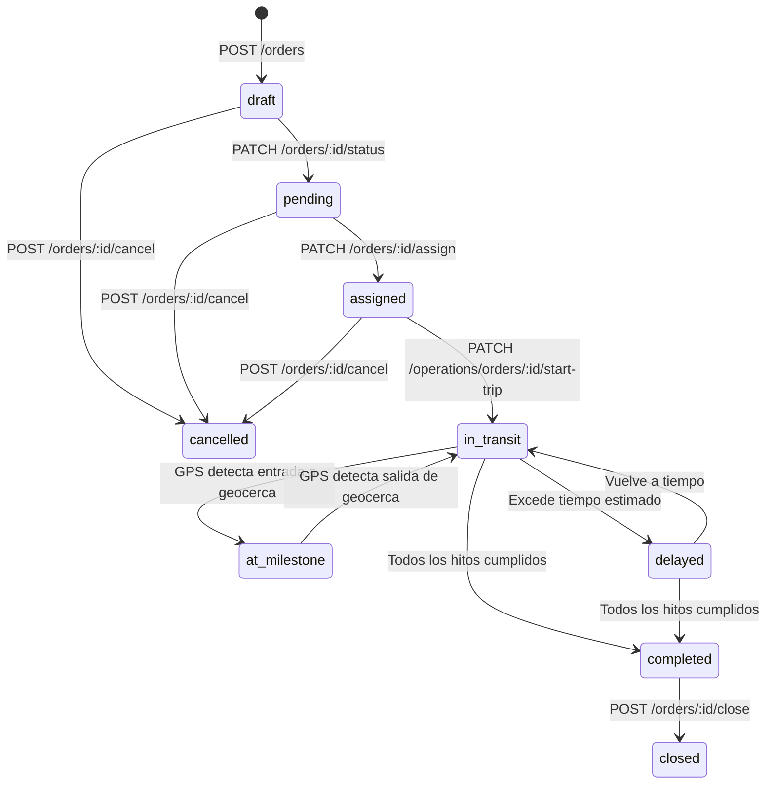
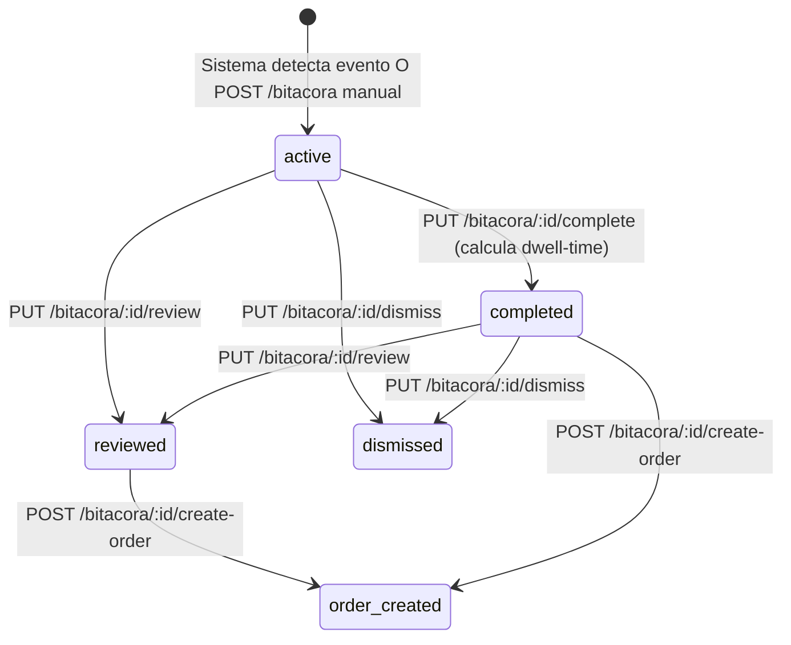

# Modulo OPERACIONES — Documentacion Tecnica Exhaustiva

**Fecha de auditoria:** 2026-05-03
**Backend:** `https://api-service.gruponavitel.com`
**Prefijo de API:** `/api/v1` (excepto `/auth/*` que vive en root)
**Validacion:** tests E2E reales (`otros/testing/test-*-full.mjs`) + auditoria linea por linea del codigo fuente.

---

## Como leer este documento

Cada endpoint esta documentado con la siguiente estructura:

1. **Que hace y para que sirve** — proposito de negocio en lenguaje del usuario final.
2. **Donde se usa en el frontend** — pantalla concreta, componente, disparador UI (boton, modal, evento), cuando se dispara la llamada y que hace el frontend con la respuesta.
3. **Estado real medido** — HTTP devuelto por produccion en el test E2E del 2026-05-03.
4. **Que envia el frontend** — payload exacto, todos los campos con tipo, opcional/requerido, de donde viene en la UI, comportamiento con GPS y sin GPS.
5. **Que espera recibir el frontend** — shape esperado, transformaciones aplicadas (snake-camel, parsing JSON, sintesis de campos).
6. **Codigo del frontend** — el bloque TypeScript real que hace la llamada.
7. **Casos especiales** — edge cases, fallbacks, dependencias con otros endpoints.

Todo es fiel al codigo. Nada inventado.

---

## Indice

1. [Convenciones transversales](#1-convenciones-transversales)
2. [Modulo Ordenes](#2-modulo-ordenes)
3. [Modulo Programacion (Scheduling)](#3-modulo-programacion-scheduling)
4. [Modulo Bitacora](#4-modulo-bitacora)
5. [Modulo Workflows](#5-modulo-workflows)
6. [Tabla maestra de endpoints](#6-tabla-maestra-de-endpoints)
7. [Plan de implementacion backend priorizado](#7-plan-de-implementacion-backend-priorizado)
8. [Anexo — Reproducir esta auditoria](#8-anexo--reproducir-esta-auditoria)

---

## 1. Convenciones transversales

### 1.1 Headers obligatorios

Todos los endpoints (excepto `/auth/login`) requieren:

```
Authorization: Bearer <accessToken>
Content-Type: application/json
```

El `accessToken` se obtiene de `POST /auth/login` y se mantiene en memoria en el frontend (NO en localStorage para resistir XSS). Cuando expira, el `apiClient` (en `src/lib/api.ts`) hace `POST /auth/refresh` automaticamente con el refresh-token guardado en `sessionStorage`. Esta refresh tiene un `inflightRefresh` lock para evitar dos llamadas concurrentes (el backend invalida el refresh-token en cada uso, asi que dos llamadas paralelas resultan en una valida y otra con 401).

### 1.2 Conversion snake_case <-> camelCase

| Direccion | Helper | Aplicacion |
|---|---|---|
| Backend -> Frontend | `snakeToCamel<T>(raw)` en `src/lib/case-converter.ts` | Aplicado en services de bitacora, scheduling, workflow, platform, finance, maintenance |
| Frontend -> Backend | Transformer dedicado por entidad | `mapOrderToBackend()` en `order.transformer.ts`, similar en `vehicle.transformer.ts`, `driver.transformer.ts` |

**El backend SIEMPRE responde en snake_case.** El frontend SIEMPRE usa camelCase internamente. Toda interaccion cruza alguno de estos puntos.

### 1.3 Manejo de endpoints faltantes

Cuando el backend devuelve `404 Not Found` para una ruta que el Excel oficial documenta, el frontend lo trata como "endpoint no implementado". No se asume bug de NGINX (eso fue descartado en investigacion 2026-05-03 — NGINX proxea todo correctamente; el `Not Found` plain text de 9 bytes es el handler 404 default del framework backend cuando una ruta no esta registrada en su router).

```ts
// src/services/missing-endpoint-helper.ts
export async function withMissingEndpointDetection<T>(
  operation: string,
  fn: () => Promise<T>
): Promise<T> {
  try { return await fn(); }
  catch (err) {
    if ((err as { status?: number }).status === 404) {
      const explanatory: MissingEndpointError = new Error(
        `${operation} no esta disponible: el backend devuelve 404 porque ` +
        `esta ruta NO esta implementada en produccion.`
      );
      explanatory.status = 404;
      explanatory.backendNotImplemented = true;
      throw explanatory;
    }
    throw err;
  }
}

export function isBackendNotImplemented(err: unknown): err is MissingEndpointError {
  return err instanceof Error && (err as MissingEndpointError).backendNotImplemented === true;
}
```

La UI consume esto con un patron como:

```ts
try {
  await bitacoraService.reviewEntry(id);
  showAlert("Estado actualizado", "El evento ha sido marcado como revisado.", "success");
} catch (err) {
  if (isBackendNotImplemented(err)) {
    showAlert("Funcion pendiente del backend", "El endpoint PUT /bitacora/:id/review aun no esta implementado.", "warning");
  } else {
    showAlert("Error", err.message, "error");
  }
}
```

### 1.4 Forma de las respuestas paginadas

El backend devuelve dos formas distintas segun el endpoint:

**Forma A (la mas comun, usada por bitacora, scheduling, workflows):**
```json
{
  "data": [ /* items */ ],
  "meta": { "total": N, "page": P, "pageSize": PS, "totalPages": TP }
}
```

**Forma B (usada por orders):**
```json
{
  "items": [ /* items */ ],
  "meta": { "total": N, "page": P, "pageSize": PS, "totalPages": TP }
}
```

El frontend hace fallback `response.items ?? response.data ?? []` para cubrir ambos casos.

### 1.5 GPS — comportamiento del frontend

El frontend opera **siempre en modo "GPS-puede-no-existir"**. Cuando se rellena un formulario manualmente:

- **Coordenadas:** opcionales. Si el usuario escribe direccion sin coordenadas, los campos `origin_lat`, `origin_lng`, `destination_lat`, `destination_lng` se omiten del payload (`undefined`). El backend debe aceptar ordenes sin coordenadas validas.
- **Geocercas:** opcionales. Si no hay geofence asociada, `origin_geofence_id` y `destination_geofence_id` se omiten.
- **Tracking en tiempo real:** el backend devuelve `current_lat`/`current_lng` en `GET /orders/:id` cuando hay GPS. El frontend solo los usa si pasan `isValidCoordinate(lat, lng)` (no NaN, no `0,0`).
- **Milestones manuales:** un milestone puede tener `isManual: true` con un `manualEntryData` que indica el motivo (`sin_senal_gps`, `falla_equipo`, `carga_retroactiva`, `correccion`, `otro`). Esto cubre el caso donde el conductor llega al hito pero el GPS no detecta el ingreso.
- **Bitacora:** `lat`/`lng` son `null`-able. El frontend sintetiza `coordinates: { lat: 0, lng: 0 }` por defecto si vienen ausentes para no crashear al renderizar el detalle.

```ts
// src/lib/transformers/order.transformer.ts:283
function isValidCoordinate(lat: unknown, lng: unknown): lat is number {
  return typeof lat === "number" && typeof lng === "number" &&
    !isNaN(lat) && !isNaN(lng) && (lat !== 0 || lng !== 0);
}
```

---

## 2. Modulo Ordenes

### 2.1 Resumen del modulo

Las **ordenes** representan un encargo de transporte de un cliente. Son el ciclo de vida central del TMS. Un cliente solicita mover carga A -> B, se crea la orden, se asigna a un vehiculo y conductor, se ejecuta el viaje (con o sin GPS) y se cierra. Todas las demas piezas (programacion, bitacora, workflows, finanzas) giran alrededor de la orden.

**Paginas:**

| Ruta | Archivo | Que hace |
|---|---|---|
| `/orders` | `src/app/(dashboard)/orders/page.tsx` | Listado paginado con filtros y stats cards |
| `/orders/[id]` | `src/app/(dashboard)/orders/[id]/page.tsx` | Detalle de orden con milestones, acciones, historial |
| `/orders/new` | `src/app/(dashboard)/orders/new/page.tsx` | Formulario de creacion paso a paso |
| `/orders/import` | `src/app/(dashboard)/orders/import/page.tsx` | Importacion masiva CSV/XLSX |

**Service principal:** `src/services/orders/OrderService.ts`
**Transformer:** `src/lib/transformers/order.transformer.ts` (2 funciones: `mapOrderFromBackend`, `mapOrderToBackend`)
**Hook principal:** `src/hooks/useOrders.ts` (consumido por la pagina `/orders`)

### 2.2 Estados y maquina de estados

```ts
export type OrderStatus =
  | 'draft'         // Borrador - orden creada pero no confirmada
  | 'pending'       // Pendiente - esperando asignacion
  | 'assigned'      // Asignada - vehiculo y conductor asignados
  | 'in_transit'    // En transito - viaje iniciado
  | 'at_milestone'  // En hito - vehiculo en una geocerca
  | 'delayed'       // Retrasada - fuera de tiempo estimado
  | 'completed'     // Completada - todos los hitos cumplidos
  | 'closed'        // Cerrada - cierre manual realizado
  | 'cancelled';    // Cancelada
```



---

### 2.3 Endpoint 1 de 19 — `GET /orders` (Listar ordenes)

#### 2.3.1 Que hace y para que sirve

Devuelve la **lista paginada de todas las ordenes** del tenant actual aplicando los filtros que el usuario haya seleccionado en la UI. Es el endpoint mas usado del modulo: cada vez que un operador entra al modulo de ordenes, el frontend lo llama. Tambien lo consume Bitacora (para el modal "Asignar a orden existente"), Programacion (para el pool de pendientes), y Reportes.

#### 2.3.2 Donde se usa en el frontend

- **Pantalla:** `/orders` (listado principal del modulo).
- **Componente que lo dispara:** `OrderList` (en `src/components/orders/order-list.tsx`).
- **Hook consumidor:** `useOrders(filters)` en `src/hooks/useOrders.ts`.
- **Disparador UI:**
  - Al cargar la pagina `/orders` (primer fetch automatico).
  - Cuando el usuario aplica un filtro en `OrderFilters`.
  - Cuando cambia de pagina en la paginacion.
  - Click en boton "Refrescar" (icono `RefreshCw`) en la barra de acciones.
- **Ademas se llama desde:**
  - `bitacora-view.tsx:545` para popular el dropdown del modal "Asignar a orden existente" (`{pageSize: 200}`).
  - `OrderService.getOrderById()` como fallback cuando `GET /orders/:id` da 404.
  - `OrderService.getOrderByNumber()` con `?search=`.
  - `OrderService.getOrdersByDriver()` y `getOrdersByVehicle()` como fallback con `?driverId=` / `?vehicleId=`.
- **Que hace el frontend con la respuesta:** mapea cada item con `mapOrderFromBackend()` (snake -> camel + nesting + sintesis de milestones), calcula `statusCounts` localmente (porque el backend no los devuelve), y los entrega a la tabla. La tabla los pinta con cards de estado, accion contextual ("Ver detalle", "Asignar", "Cancelar"), y badges de prioridad.

#### 2.3.3 Estado real medido

`HTTP 200 OK`. Devuelve 20 ordenes en sample (verificado 2026-05-03).

#### 2.3.4 Metodo frontend

`OrderService.getOrders(filters: OrderFilters)` en `src/services/orders/OrderService.ts:32`.

#### 2.3.5 Que envia el frontend (query params)

Todos opcionales, segun lo que el usuario haya seleccionado en la UI:

| Campo | Tipo | De donde sale en UI | Notas |
|---|---|---|---|
| `search` | `string` | Input de busqueda libre | Busca por orderNumber |
| `customerId` | `string` (UUID) | Dropdown "Cliente" | Solo si se selecciona uno |
| `carrierId` | `string` (UUID) | Dropdown "Transportista" | |
| `gpsOperatorId` | `string` (UUID) | Dropdown "Operador GPS" | |
| `status` | `string \| string[]` | Multi-select de estados | El backend NO acepta multi-status hoy. El frontend hace multiples llamadas paralelas y mergea |
| `priority` | `string \| string[]` | Multi-select de prioridad | low / normal / high / urgent |
| `syncStatus` | `string` | Dropdown | not_sent / pending / sending / sent / error / retry |
| `dateType` | `'creation' \| 'scheduled' \| 'execution'` | Dropdown | Define que columna de fecha se filtra |
| `dateFrom` | `string` (ISO) | Date picker "Desde" | |
| `dateTo` | `string` (ISO) | Date picker "Hasta" | |
| `serviceType` | `string` | Dropdown "Tipo de servicio" | distribucion / importacion / etc. |
| `tags` | `string[]` | Tag picker | |
| `sortBy` | `keyof Order` | Click en encabezado | |
| `sortOrder` | `'asc' \| 'desc'` | Click en encabezado | |
| `page` | `number` | Paginacion | Default 1 |
| `pageSize` | `number` | Paginacion | Default 10. Bitacora usa 200. |

#### 2.3.6 Que espera recibir el frontend

```json
{
  "items": [ /* BackendOrder[] — ver shape detallado en seccion 2.4.10 */ ],
  "meta": { "total": 20, "page": 1, "pageSize": 20, "totalPages": 1 }
}
```

#### 2.3.7 Transformacion aplicada

`mapOrderFromBackend(b)` en `src/lib/transformers/order.transformer.ts:364`:

- `b.id` -> `order.id`.
- `b.order_number` -> `order.orderNumber`.
- `b.customer_id` + `b.customer_name` -> `order.customer = { id, name, code: "", email: "" }`.
- `b.vehicle_id` + `b.vehicle_plate` -> `order.vehicle = { id, plate, brand: "", model: "", type: "camion" }`.
- `b.driver_id` + `b.driver_name` -> `order.driver = { id, fullName, phone: "" }`.
- Sintetiza `order.milestones: OrderMilestone[]` desde campos planos `origin_*` y `destination_*` (helper `buildMilestonesFromFlatFields`).
- `b.total_weight` + `b.total_volume` + `b.total_packages` -> `order.cargo = { weightKg, volumeM3, quantity, ... }`.
- Todo lo que no mapea 1:1 (origen completo, destino completo, GPS actual, route_id, pod, distancias) se preserva en `order.metadata`.

#### 2.3.8 Codigo

```ts
async getOrders(filters: OrderFilters = {}): Promise<OrdersResponse> {
  const response = await apiClient.get<Record<string, unknown>>(
    API_ENDPOINTS.operations.orders, // "/orders"
    { params: filters as unknown as Record<string, string> }
  );
  const rawList = (response.items ?? response.data ?? []) as unknown[];
  const list: Order[] = rawList
    .filter((x): x is BackendOrder => typeof x === "object" && x !== null)
    .map(mapOrderFromBackend);
  // statusCounts se calcula local (backend no lo devuelve)
  const statusCounts: Record<OrderStatus, number> = {
    draft: 0, pending: 0, assigned: 0, in_transit: 0,
    at_milestone: 0, delayed: 0, completed: 0, closed: 0, cancelled: 0
  };
  for (const order of list) {
    if (order.status in statusCounts) statusCounts[order.status]++;
  }
  return { data: list, total, page, pageSize, totalPages, statusCounts };
}
```

#### 2.3.9 Casos especiales

- **Sin GPS:** funciona igual. Los campos `current_lat`/`current_lng` llegan `null` y se preservan asi en `metadata.current_coordinates: null`.
- **Filtro multi-status:** el backend hoy responde 0 cuando se le pasa `?status=pending,draft`. El frontend hace dos llamadas paralelas y mergea (mismo problema que Scheduling).
- **Paginacion grande:** `pageSize: 200` es el maximo conocido que acepta sin problemas (usado por Bitacora para el dropdown de "Asignar a orden").

---

### 2.4 Endpoint 2 de 19 — `POST /orders` (Crear orden)

#### 2.4.1 Que hace y para que sirve

Crea una nueva orden de transporte. Es el punto de entrada para iniciar todo el ciclo operativo. Una orden puede crearse en estado `draft` (sin confirmar) o directamente en `pending`. El frontend siempre crea como `draft` por defecto para que el operador pueda revisar antes de mandarla a programar.

#### 2.4.2 Donde se usa en el frontend

- **Pantalla principal:** `/orders/new` (formulario paso a paso).
- **Componente:** `OrderForm` (en `src/components/orders/order-form.tsx`).
- **Disparador UI:** click en el boton "Guardar orden" / "Crear orden" del formulario.
- **Tambien se usa en:**
  - `/orders/import` — el `OrderImportService` itera filas del CSV/XLSX y llama `createOrder` por cada una (no hay batch endpoint, asi que se crea una a una).
  - `bitacora-view.tsx:handleCreateOrderConfirm` — modal "Crear orden desde bitacora" llama `bitacoraService.createOrderFromEntry()` que internamente termina creando una orden (cuando el backend lo implemente).
- **Que hace el frontend con la respuesta:**
  1. Recibe el `BackendOrder` recien creado.
  2. Lo mapea con `mapOrderFromBackend()`.
  3. Redirige al usuario a `/orders/[id]` con el id devuelto.
  4. Toast verde "Orden creada".

#### 2.4.3 Estado real medido

`HTTP 201 Created`. Verificado en producción (4 creaciones exitosas en el test E2E del 2026-05-03).

#### 2.4.4 Metodo frontend

`OrderService.createOrder(data: CreateOrderDTO)` en `OrderService.ts:223`.

#### 2.4.5 Que envia el frontend (DTO completo)

El usuario rellena este DTO en el formulario:

```ts
// CreateOrderDTO (camelCase, frontend)
{
  customerId: string;             // UUID, REQUERIDO. Sale del dropdown "Cliente".
  carrierId?: string;             // UUID. Dropdown "Transportista" (NO se envia al backend en Rev3).
  vehicleId?: string;             // UUID. Dropdown "Vehiculo" (opcional al crear).
  driverId?: string;              // UUID. Dropdown "Conductor" (opcional al crear).
  workflowId?: string;            // UUID. Dropdown "Workflow" (opcional).
  priority: OrderPriority;        // 'low' | 'normal' | 'high' | 'urgent'. REQUERIDO.
  serviceType: ServiceType;       // 'distribucion' | 'importacion' | ... REQUERIDO.
  reference?: string;             // Texto libre. Input "Referencia (booking, BL, etc.)".
  cargo: OrderCargo;              // Sub-objeto, ver abajo. REQUERIDO.
  milestones: OrderMilestone[];   // Array de hitos. REQUERIDO (al menos origen + destino).
  scheduledStartDate: string;     // ISO. DateTime picker "Inicio programado". REQUERIDO.
  scheduledEndDate: string;       // ISO. DateTime picker "Fin programado". REQUERIDO.
  externalReference?: string;     // Texto libre (NO se envia al backend en Rev3).
  notes?: string;                 // Textarea "Notas".
  tags?: string[];                // Tag picker (NO se envia al backend en Rev3).
}
```

**OrderCargo** (sub-objeto rellenado en el form):

```ts
{
  description: string;             // Input "Descripcion de la carga".
  type: CargoType;                 // 'general' | 'refrigerated' | 'hazardous' | 'fragile' | 'oversized' | 'liquid' | 'bulk'.
  weightKg: number;                // Input numerico "Peso (kg)".
  volumeM3?: number;               // Input numerico "Volumen (m3)".
  quantity: number;                // Input numerico "Cantidad de bultos".
  declaredValue?: number;          // Input numerico "Valor declarado (USD)".
  temperatureControlled?: boolean; // Toggle "Requiere temperatura controlada".
  temperatureRange?: {             // Solo si temperatureControlled = true.
    min: number;
    max: number;
    unit: 'celsius' | 'fahrenheit';
  };
  handlingInstructions?: string;   // Textarea "Instrucciones de manejo".
}
```

**OrderMilestone[]** — el usuario rellena al menos 2 (origen + destino):

```ts
[
  {
    geofenceId: string;            // Dropdown "Geocerca origen" (opcional). UUID o vacio.
    geofenceName: string;          // Auto del dropdown, o texto manual.
    type: 'origin';                // Fijo para el primer milestone.
    sequence: 1;
    address: string;               // Input "Direccion origen".
    coordinates: {                 // OPCIONAL si no hay GPS / no se geocodifico.
      lat: number;                 // Por defecto 0 si el usuario no provee.
      lng: number;
    };
    estimatedArrival: string;      // DateTime picker "Llegada estimada".
    estimatedDeparture?: string;   // DateTime picker "Salida estimada" (opcional).
    notes?: string;                // Textarea por hito.
    contact?: {                    // Sub-form "Contacto en el punto" (opcional).
      name: string;
      phone: string;
      email?: string;
    };
    isManual?: boolean;            // Default false. Se marca true si el usuario completa
                                   // manualmente porque no hubo GPS.
    manualEntryData?: {            // Solo si isManual = true.
      registeredBy: string;        // Auto del usuario logueado.
      registeredAt: string;        // Auto fecha actual.
      observation: string;         // Input "Observacion".
      reason: 'sin_senal_gps' | 'falla_equipo' | 'carga_retroactiva' | 'correccion' | 'otro';
    };
  },
  // ... waypoints opcionales con type: 'waypoint'
  {
    // ... mismo shape con type: 'destination'
  }
]
```

#### 2.4.6 Conversion al payload del backend (Rev3)

`mapOrderToBackend(dto)` produce:

```ts
{
  // Identificacion
  order_number?: string;
  customer_id: string;             // <- dto.customerId.
  customer_name?: string;          // <- dto.customer?.name (hidratacion denormalizada para Rev3).

  // Tipo y prioridad
  type?: string;                   // mapServiceTypeToBackend(dto.serviceType).
                                   // El backend Rev3 SOLO acepta 'delivery' por ahora,
                                   // asi que TODO valor del frontend (distribucion, importacion, etc.)
                                   // se traduce a 'delivery'.
  priority?: string;
  status?: string;

  // Asignacion (opcional)
  vehicle_id?: string;             // <- dto.vehicleId si truthy.
  vehicle_plate?: string;          // <- dto.vehicle?.plate.
  driver_id?: string;              // <- dto.driverId si truthy.
  driver_name?: string;            // <- dto.driver?.fullName.
  route_id?: string;               // <- desde metadata.

  // Origen aplanado desde milestones[0]
  origin_address?: string;
  origin_lat?: number;             // OMITIDO si no hay coordenada valida.
  origin_lng?: number;             // OMITIDO si no hay coordenada valida.
  origin_geofence_id?: string;     // OMITIDO si el milestone no tiene geofence.

  // Destino aplanado desde milestones[last]
  destination_address?: string;
  destination_lat?: number;
  destination_lng?: number;
  destination_geofence_id?: string;

  // Timing
  scheduled_pickup_at?: string;    // <- dto.scheduledStartDate (ISO).
  scheduled_delivery_at?: string;  // <- dto.scheduledEndDate (ISO).

  // Carga aplanada
  total_weight?: number;           // <- dto.cargo.weightKg.
  total_volume?: number;           // <- dto.cargo.volumeM3.
  total_packages?: number;         // <- dto.cargo.quantity.

  // Distancia
  estimated_distance_km?: number;  // <- dto.estimatedDistanceKm si Route Planner ya corrio.

  // Notas
  notes?: string;
  internal_notes?: string;         // GENERADO automaticamente concatenando los campos de cargo
                                   // que el backend NO tiene columna directa:
                                   //   "[Carga] Descripcion: X | Tipo: refrigerated |
                                   //    Valor declarado: 5000 USD | Manejo: instrucciones... |
                                   //    Temperatura controlada: si | Rango: 2-8 celsius"
  reference?: string;

  // Items
  items?: BackendOrderItemPayload[];
}
```

**Items shape:**

```ts
items: [
  {
    product_id?: string;
    product_name?: string;
    quantity?: number;
    unit?: string;
    weight?: number;
    volume?: number;
    notes?: string;
  }
]
```

#### 2.4.7 Campos que el frontend NO envia (Rev3 los ignora)

- `carrier_id`, `gps_operator_id`, `external_reference`, `tags` — el frontend los recolecta pero no los manda.
- `service_type` (en espanol) — se traduce a `type: 'delivery'`.
- `cargo{}` como sub-objeto rico — se aplana a `total_*`. Metadata extra (description, type, declaredValue, handlingInstructions, temperatureRange) se preserva en `internal_notes`.
- `milestones[]` como array rico — se aplana a `origin_*` y `destination_*`. Los waypoints intermedios SE PIERDEN porque el backend solo acepta 2 puntos.
- `scheduled_start_date` / `scheduled_end_date` — se reemplazan por `scheduled_pickup_at` / `scheduled_delivery_at`.

#### 2.4.8 Que pasa SIN GPS

- `origin_lat`, `origin_lng`, `destination_lat`, `destination_lng` se OMITEN del payload.
- `origin_address` y `destination_address` SI se envian.
- `estimated_distance_km` se OMITE (el frontend no lo calcula sin coordenadas).
- El backend debe aceptar la orden con coordenadas faltantes y rellenarlas despues si llegan datos GPS.

#### 2.4.9 Codigo

```ts
async createOrder(data: CreateOrderDTO): Promise<Order> {
  const payload = mapOrderToBackend(data);
  const response = await apiClient.post<Record<string, unknown>>(
    API_ENDPOINTS.operations.orders,
    payload
  );
  const raw = (response.data ?? response) as BackendOrder;
  return mapOrderFromBackend(raw);
}
```

#### 2.4.10 Que espera recibir el frontend (BackendOrder shape completo)

```ts
interface BackendOrder {
  id: string;
  tenant_id?: string;
  order_number: string;
  type?: string;
  status: string;
  priority: string;

  // Cliente
  customer_id: string;
  customer_name?: string | null;

  // Origen (flat)
  origin_address?: string | null;
  origin_lat?: number | null;
  origin_lng?: number | null;
  origin_geofence_id?: string | null;

  // Destino (flat)
  destination_address?: string | null;
  destination_lat?: number | null;
  destination_lng?: number | null;
  destination_geofence_id?: string | null;

  // Asignacion
  vehicle_id?: string | null;
  vehicle_plate?: string | null;
  driver_id?: string | null;
  driver_name?: string | null;
  route_id?: string | null;

  // Timing
  scheduled_pickup_at?: string | null;
  scheduled_delivery_at?: string | null;
  actual_pickup_at?: string | null;
  actual_delivery_at?: string | null;
  estimated_delivery_at?: string | null;

  // Tracking en tiempo real (con GPS)
  current_lat?: number | null;
  current_lng?: number | null;

  // Proof of Delivery
  pod_signature_url?: string | null;
  receiver_name?: string | null;

  // Cancelacion
  cancel_reason?: string | null;

  // Metricas
  estimated_distance_km?: number | null;
  actual_distance_km?: number | null;
  estimated_duration_min?: number | null;
  actual_duration_min?: number | null;

  // Carga (flat)
  total_weight?: number | null;
  total_volume?: number | null;
  total_packages?: number | null;

  // Notas
  notes?: string | null;
  internal_notes?: string | null;
  reference?: string | null;

  // Auditoria
  created_by?: string;
  created_at: string;
  updated_at: string;
  deleted_at?: string | null;

  // GPS
  vehicle_imei?: string | null;
  webhook_url?: string | null;
  sync_status?: string | null;
  sync_error_message?: string | null;
  last_sync_attempt?: string | null;

  // Relaciones
  workflow_id?: string | null;
  items?: unknown[];
}
```

---

### 2.5 Endpoint 3 de 19 — `GET /orders/:id` (Detalle)

#### 2.5.1 Que hace y para que sirve

Devuelve el detalle completo de una orden por su UUID. Incluye toda la informacion: origen, destino, milestones, asignacion, estado, GPS actual, items, historial. Es el endpoint que se llama cuando un operador hace click en una orden del listado para verla en detalle.

#### 2.5.2 Donde se usa en el frontend

- **Pantalla:** `/orders/[id]` (vista detalle).
- **Componente:** `src/app/(dashboard)/orders/[id]/page.tsx`.
- **Disparador UI:** navegacion a la URL `/orders/<uuid>` (al hacer click en una fila del listado, o al volver desde un modal que abrio detalle).
- **Tambien se usa en:**
  - `/orders/[id]/edit` — antes de mostrar el form de edicion, el frontend hace `getOrderById` para precargar valores.
  - Modales de cierre / cancelacion / asignacion — antes de mostrar el modal, se obtiene la orden para validar reglas (ej: `canCloseOrder` necesita el estado y los milestones).
- **Que hace el frontend con la respuesta:**
  1. Mapea con `mapOrderFromBackend()`.
  2. Pinta la pagina detalle con secciones: header (numero, cliente, estado, prioridad), timeline de milestones, seccion de carga, seccion de notas, seccion de historial de estados.
  3. Habilita/deshabilita botones de accion segun el `status` actual.
  4. Si la orden tiene `vehicle_imei`, habilita el boton "Ver tracking en tiempo real".

#### 2.5.3 Estado real medido

`HTTP 404 Not Found`. Backend NO implementa la ruta. El frontend tiene workaround.

#### 2.5.4 Metodo frontend

`OrderService.getOrderById(id: string)` en `OrderService.ts:81`.

#### 2.5.5 Que envia el frontend

URL: `GET /api/v1/orders/<uuid>`. Sin body, sin query params.

#### 2.5.6 Que espera recibir el frontend

Un `BackendOrder` suelto (shape de seccion 2.4.10).

#### 2.5.7 Codigo (con workaround actual)

```ts
async getOrderById(id: string): Promise<Order | null> {
  // 1. Intenta GET directo
  try {
    const response = await apiClient.get<Record<string, unknown>>(
      `${API_ENDPOINTS.operations.orders}/${id}`
    );
    const raw = (response.data ?? response) as BackendOrder;
    if (raw && raw.id) return mapOrderFromBackend(raw);
  } catch (err) {
    if ((err as { status?: number }).status !== 404) throw err;
    console.warn(`[OrderService] GET /orders/${id} -> 404. Aplicando workaround.`);
  }

  // 2. Fallback: busca en la lista
  try {
    const result = await apiClient.get<{ data?: unknown[]; items?: unknown[] }>(
      API_ENDPOINTS.operations.orders,
      { params: { pageSize: 200 } }
    );
    const list = (result.data ?? result.items ?? []) as BackendOrder[];
    const found = list.find((o) => o.id === id);
    return found ? mapOrderFromBackend(found) : null;
  } catch (err) {
    return null;
  }
}
```

#### 2.5.8 Casos especiales

- **Workaround actual:** mientras el backend no implementa la ruta, el frontend pide la lista completa con `pageSize: 200` y filtra client-side por id. Funciona pero es ineficiente y no escala mas alla de 200 ordenes por tenant.
- **Sin GPS:** funciona igual. Los campos `current_lat`/`current_lng` y `vehicle_imei` llegan `null`.

---

### 2.6 Endpoint 4 de 19 — `PATCH /orders/:id` (Actualizar)

#### 2.6.1 Que hace y para que sirve

Permite editar campos de una orden existente. El usuario puede corregir direccion, fecha, items, notas, prioridad. Tambien permite cambiar el estado pasando `status: 'pending'`.

#### 2.6.2 Donde se usa en el frontend

- **Pantalla:** `/orders/[id]/edit` o modal "Editar orden" desde la vista detalle.
- **Componente:** mismo `OrderForm` que se usa en creacion, en modo `edit`.
- **Disparador UI:** click en boton "Guardar cambios" del formulario en modo edicion.
- **Tambien se usa en:**
  - `OrderService.changeStatus(id, newStatus)` — internamente llama a `updateOrder(id, { status })`.
  - `OrderService.startTrip(id)` — internamente llama a `updateOrder(id, { status: 'in_transit' })`.
- **Que hace el frontend con la respuesta:**
  1. Mapea el `BackendOrder` actualizado.
  2. Actualiza el state local de la pagina.
  3. Cierra el modal o redirige a `/orders/[id]`.
  4. Toast de exito.

#### 2.6.3 Estado real medido

`HTTP 404 Not Found`.

#### 2.6.4 Metodo frontend

`OrderService.updateOrder(id, data: UpdateOrderDTO)` en `OrderService.ts:268`.

#### 2.6.5 Que envia el frontend

`UpdateOrderDTO extends Partial<CreateOrderDTO>` mas `status?: OrderStatus`. El frontend solo envia los campos que cambiaron (no envia el objeto entero — `mapOrderToBackend` ya filtra los `undefined`).

#### 2.6.6 Codigo

```ts
async updateOrder(id: string, data: UpdateOrderDTO): Promise<Order> {
  const payload = mapOrderToBackend(data);
  return this.withBugDetection("Actualizar orden (PATCH /orders/:id)", async () => {
    const response = await apiClient.patch<Record<string, unknown>>(
      `${API_ENDPOINTS.operations.orders}/${id}`,
      payload
    );
    const raw = (response.data ?? response) as BackendOrder;
    return mapOrderFromBackend(raw);
  });
}
```

---

### 2.7 Endpoint 5 de 19 — `DELETE /orders/:id`

#### 2.7.1 Que hace y para que sirve

Elimina una orden. Solo aplica cuando la orden esta en estado `draft` (borradores nunca confirmados). Para ordenes en otros estados se debe usar `cancel` o `close`, no delete.

#### 2.7.2 Donde se usa en el frontend

- **Pantalla:** `/orders/[id]` (vista detalle de un draft).
- **Disparador UI:** click en boton "Eliminar borrador" + confirmacion en `ConfirmDialog`.
- **Que hace el frontend con la respuesta:** redirige a `/orders` y muestra toast "Orden eliminada".

#### 2.7.3 Estado real medido

`HTTP 404 Not Found`.

#### 2.7.4 Metodo frontend

`OrderService.deleteOrder(id)`.

#### 2.7.5 Que envia el frontend

URL: `DELETE /api/v1/orders/<uuid>`. Sin body.

#### 2.7.6 Restriccion del frontend

El boton "Eliminar" solo aparece en la UI si `order.status === 'draft'`.

```ts
async deleteOrder(id: string): Promise<boolean> {
  return this.withBugDetection("Eliminar orden (DELETE /orders/:id)", () =>
    apiClient.delete<boolean>(`${API_ENDPOINTS.operations.orders}/${id}`)
  );
}
```

---

### 2.8 Endpoint 6 de 19 — `GET /orders/stats`

#### 2.8.1 Que hace y para que sirve

Devuelve estadisticas agregadas de todas las ordenes del tenant: cantidad por estado, por prioridad, por tipo de servicio, tiempos promedio, tasa de entregas a tiempo. Es el alimentador de los dashboards y las "stat cards" del header del modulo.

#### 2.8.2 Donde se usa en el frontend

- **Pantalla:** `/orders` (al inicio, en la fila de cards de estadisticas), tambien en `/dashboard`.
- **Componente:** `OrderStatsCards` (en `src/components/orders/order-stats-cards.tsx`).
- **Disparador UI:** se llama al cargar la pagina. Tambien al hacer "Refresh".
- **Que hace el frontend con la respuesta:** pinta cards con totales (total de ordenes, % en transito, % completadas, tasa on-time).

#### 2.8.3 Estado real medido

`HTTP 500 Internal Server Error`. Bug en el handler del backend.

#### 2.8.4 Que espera recibir el frontend

```json
{
  "totalOrders": 234,
  "byStatus": {
    "draft": 5, "pending": 12, "assigned": 8, "in_transit": 7,
    "at_milestone": 0, "delayed": 1, "completed": 180, "closed": 20, "cancelled": 1
  },
  "byPriority": { "low": 50, "normal": 150, "high": 30, "urgent": 4 },
  "byServiceType": { "delivery": 200, "pickup": 30 },
  "avgDeliveryTimeMinutes": 285,
  "onTimeRate": 0.92
}
```

---

### 2.9 Endpoint 7 de 19 — `GET /operations/orders/status-counts`

#### 2.9.1 Que hace y para que sirve

Devuelve solo los **conteos por estado**. Es una version mas liviana de `/orders/stats`. Util para badges del sidebar y filtros que muestran cantidades.

#### 2.9.2 Donde se usa en el frontend

- **Pantalla:** `/orders` y `/scheduling` (badges en el filtro de estado).
- **Disparador UI:** carga inicial de la pagina + tras cualquier mutacion (asignar, cancelar, etc.) para actualizar los contadores.
- **Que hace el frontend con la respuesta:** muestra `<Badge>{count}` al lado de cada opcion del filtro de estado.

#### 2.9.3 Estado real medido

`HTTP 200 OK`. Devuelve los 9 estados con sus conteos.

```ts
async getStatusCounts(): Promise<Record<OrderStatus, number>> {
  return apiClient.get<Record<OrderStatus, number>>(
    `${API_ENDPOINTS.operations.orders}/status-counts`
  );
}
```

#### 2.9.4 Que recibe

```json
{
  "draft": 5, "pending": 12, "assigned": 8, "in_transit": 7,
  "at_milestone": 0, "delayed": 1, "completed": 180, "closed": 20, "cancelled": 1
}
```

---

### 2.10 Endpoint 8 de 19 — `GET /operations/orders/by-driver/:id`

#### 2.10.1 Que hace y para que sirve

Devuelve las ordenes asignadas a un conductor especifico, junto con stats personales (total entregadas, canceladas, en progreso, on-time rate, tiempo promedio). Pensado para la pagina de detalle de un conductor.

#### 2.10.2 Donde se usa en el frontend

- **Pantalla:** `/master/drivers/[id]` (detalle de conductor) — pestaña "Historial de ordenes".
- **Disparador UI:** click en la pestaña "Historial".
- **Tambien se usa en:** dashboards de RRHH/operaciones para evaluar performance.
- **Que hace el frontend con la respuesta:** muestra la lista de ordenes del conductor + cards con sus stats personales.

#### 2.10.3 Estado real medido

`HTTP 404`. El frontend hace fallback a `GET /orders?driverId=<id>`.

#### 2.10.4 Que envia el frontend

URL: `GET /api/v1/operations/orders/by-driver/<driverUUID>`
Query params (opcionales):

```ts
{
  status?: OrderStatus[];   // Filtro de estados.
  startDate?: string;       // ISO. Rango desde.
  endDate?: string;         // ISO. Rango hasta.
  limit?: number;
}
```

#### 2.10.5 Que espera recibir el frontend

```json
{
  "orders": [ /* BackendOrder[] */ ],
  "stats": {
    "total": 25,
    "completed": 18,
    "cancelled": 1,
    "inProgress": 6,
    "onTimeDeliveryRate": 0.94,
    "avgDeliveryTime": 240
  }
}
```

#### 2.10.6 Fallback actual

```ts
async getOrdersByDriver(driverId, options = {}) {
  try {
    const result = await apiClient.get(API_ENDPOINTS.operations.orders, {
      params: { ...options, driverId } as Record<string, string>
    });
    const orders = (result.data ?? result.items ?? []) as Order[];
    return {
      orders,
      stats: { total: orders.length, completed: 0, cancelled: 0, inProgress: 0,
               onTimeDeliveryRate: 0, avgDeliveryTime: 0 }
    };
  } catch (err) {
    if ((err as { status?: number }).status === 404) {
      return { orders: [], stats: { total: 0, completed: 0, cancelled: 0, inProgress: 0, onTimeDeliveryRate: 0, avgDeliveryTime: 0 } };
    }
    throw err;
  }
}
```

---

### 2.11 Endpoint 9 de 19 — `GET /operations/orders/by-vehicle/:id`

#### 2.11.1 Que hace y para que sirve

Identico al endpoint 8 pero filtra por `vehicleId`. Stats incluyen `totalDistanceKm` (mas relevante para vehiculos que `onTimeDeliveryRate`).

#### 2.11.2 Donde se usa en el frontend

- **Pantalla:** `/master/vehicles/[id]` — pestaña "Historial de viajes".
- **Disparador UI:** click en la pestaña.
- **Que hace el frontend con la respuesta:** historial + cards de stats (km totales, ordenes, % completadas).

#### 2.11.3 Estado real medido

`HTTP 404`.

#### 2.11.4 Que espera recibir el frontend

```json
{
  "orders": [ /* BackendOrder[] */ ],
  "stats": {
    "total": 25, "completed": 18, "cancelled": 1, "inProgress": 6,
    "totalDistanceKm": 4250
  }
}
```

---

### 2.12 Endpoint 10 de 19 — `GET /operations/orders/by-number/:n`

#### 2.12.1 Que hace y para que sirve

Busca una orden por su numero de orden (no por UUID). Util cuando un usuario tiene un numero de booking / referencia y quiere encontrar la orden rapido.

#### 2.12.2 Donde se usa en el frontend

- **Pantalla:** `/orders` (en el input de busqueda).
- **Disparador UI:** input "Buscar por numero".
- **Que hace el frontend con la respuesta:** redirige a `/orders/[id]` o muestra el resultado en lista.

#### 2.12.3 Estado real medido

`HTTP 200 OK`. Funciona, pero el frontend prefiere `?search=` por compatibilidad.

#### 2.12.4 Codigo (lo que el frontend hace en su lugar)

```ts
async getOrderByNumber(orderNumber: string): Promise<Order | null> {
  const result = await apiClient.get<{ data?: Order[]; items?: Order[] }>(
    API_ENDPOINTS.operations.orders,
    { params: { search: orderNumber } }
  );
  const list = result.data ?? result.items ?? [];
  return list.find(o => o.orderNumber === orderNumber) ?? null;
}
```

---

### 2.13 Endpoint 11 de 19 — `GET /orders/:id/workflow-progress`

#### 2.13.1 Que hace y para que sirve

Devuelve el progreso de la orden en su workflow asignado: cuantos hitos cumplio, cuantos faltan, en cual esta ahora, si esta retrasada. Es lo que alimenta la barra de progreso visible en la vista detalle.

#### 2.13.2 Donde se usa en el frontend

- **Pantalla:** `/orders/[id]` — seccion "Progreso del workflow" (visible solo si la orden tiene `workflowId` asignado).
- **Disparador UI:** carga automatica al entrar al detalle.
- **Tambien se usa en:** vista cliente (cuando este existe — hoy es interno) para que vean en tiempo real donde va su carga.
- **Que hace el frontend con la respuesta:** pinta una barra de progreso con N pasos, marca los completados y resalta el actual.

#### 2.13.3 Estado real medido

`HTTP 404 Not Found`.

#### 2.13.4 Que espera recibir el frontend

```json
{
  "workflowId": "uuid",
  "orderId": "uuid",
  "currentStepId": "uuid",
  "currentStepIndex": 2,
  "totalSteps": 5,
  "completedSteps": ["step-1-uuid", "step-2-uuid"],
  "skippedSteps": [],
  "progressPercentage": 40,
  "timeInCurrentStep": 25,
  "isDelayed": false,
  "stepHistory": [
    {
      "stepId": "step-1-uuid",
      "enteredAt": "2026-05-04T10:00:00Z",
      "completedAt": "2026-05-04T10:30:00Z",
      "status": "completed",
      "data": { /* metadata ad-hoc */ }
    }
  ]
}
```

---

### 2.14 Endpoint 12 de 19 — `GET /orders/:id/tracking`

#### 2.14.1 Que hace y para que sirve

Devuelve la posicion GPS actual del vehiculo asignado a la orden + ultimo trazado de ruta. Solo aplica si la orden tiene un `vehicle_imei` (la unidad esta equipada con GPS).

#### 2.14.2 Donde se usa en el frontend

- **Pantalla:** `/orders/[id]` — seccion "Tracking en tiempo real".
- **Disparador UI:** click en boton "Ver tracking en mapa" (solo aparece si `vehicle_imei` existe).
- **Tambien se usa en:** modulo Monitoreo (Torre de Control), modal "Ver en mapa" de Bitacora.
- **Que hace el frontend con la respuesta:** muestra mapa con marcador del vehiculo + polyline de la ruta historica. Polling cada N segundos para actualizar posicion.

#### 2.14.3 Estado real medido

`HTTP 404 Not Found`. Depende de Monitoreo + GPS.

#### 2.14.4 Caso sin GPS

Si la orden no tiene `vehicle_imei` el boton de tracking se DESHABILITA en la UI y este endpoint nunca se llama.

---

### 2.15 Endpoint 13 de 19 — `GET /orders/export` (CSV)

#### 2.15.1 Que hace y para que sirve

Genera un archivo CSV con todas las ordenes que matcheen los filtros aplicados. Util para reportes externos, backup, analisis en Excel.

#### 2.15.2 Donde se usa en el frontend

- **Pantalla:** `/orders` (boton "Exportar" en la barra de acciones).
- **Componente:** `OrderExportService` (en `src/services/orders/OrderExportService.ts`).
- **Disparador UI:** click en icono `Download` de la barra de acciones.
- **Que hace el frontend con la respuesta:** recibe el `Blob`, crea una URL con `URL.createObjectURL()` y dispara una descarga automatica con un `<a>` invisible.

#### 2.15.3 Estado real medido

`HTTP 200 OK`. Devuelve `text/csv`.

#### 2.15.4 Que envia el frontend

URL: `GET /api/v1/orders/export?<filters_query_string>`. Los mismos filtros que `GET /orders`.

#### 2.15.5 Codigo

```ts
async exportCsv(filters: OrderFilters): Promise<Blob> {
  const url = `${apiConfig.baseUrl}${API_ENDPOINTS.operations.orders}/export?` +
    new URLSearchParams(filters as unknown as Record<string, string>).toString();
  const response = await fetch(url, {
    method: "GET",
    headers: { Authorization: `Bearer ${getAccessToken()}` }
  });
  return response.blob();
}
```

---

### 2.16 Endpoint 14 de 19 — `POST /orders/:id/items`

#### 2.16.1 Que hace y para que sirve

Agrega items a una orden ya creada. Util cuando los items no se conocian al momento de crear la orden (ej: al recibir el manifiesto detallado despues).

#### 2.16.2 Donde se usa en el frontend

- **Pantalla:** `/orders/[id]` — seccion "Items" tiene un boton "Agregar items".
- **Disparador UI:** click en boton "Agregar items" + submit del modal/sub-form.
- **Que hace el frontend con la respuesta:** actualiza la lista de items en la vista detalle.

#### 2.16.3 Estado real medido

`HTTP 404 Not Found`.

#### 2.16.4 Que envia el frontend

Array de items (mismo shape de `BackendOrderItemPayload`):

```ts
[
  {
    product_id?: string;
    product_name?: string;
    quantity?: number;
    unit?: string;
    weight?: number;
    volume?: number;
    notes?: string;
  }
]
```

---

### 2.17 Endpoint 15 de 19 — `PATCH /orders/:id/assign` (Asignar recursos)

#### 2.17.1 Que hace y para que sirve

Asigna un vehiculo y un conductor a una orden que esta en `pending`. Es el momento clave del despacho. Despues de esta asignacion la orden pasa a `assigned`.

#### 2.17.2 Donde se usa en el frontend

- **Pantalla:** `/orders/[id]` (modal "Asignar recursos") y `/scheduling` (cuando se programa una orden desde el calendario).
- **Disparador UI:** click en boton "Asignar vehiculo y conductor" + submit del modal.
- **Tambien se usa en:** scheduling modal cuando se confirma una asignacion desde el calendario.
- **Que hace el frontend con la respuesta:**
  1. Recibe la orden actualizada.
  2. Actualiza el state local (la orden ahora tiene `vehicle_id`, `driver_id`, `vehicle_plate`, `driver_name`, `status: 'assigned'`).
  3. Toast "Recursos asignados".
  4. Refresca el calendar y stats si esta en Scheduling.

#### 2.17.3 Estado real medido

`HTTP 404 Not Found`.

#### 2.17.4 Que envia el frontend

```ts
{
  vehicle_id: string;   // UUID del vehiculo seleccionado en el dropdown del modal.
  driver_id: string;    // UUID del conductor seleccionado.
}
```

(Se envia en snake_case directo, no via transformer general.)

#### 2.17.5 Codigo

```ts
async assignVehicleAndDriver(id: string, vehicleId: string, driverId: string): Promise<Order> {
  return this.withBugDetection("Asignar recursos (PATCH /orders/:id/assign)", async () => {
    const response = await apiClient.patch<Record<string, unknown>>(
      `${API_ENDPOINTS.operations.orders}/${id}/assign`,
      { vehicle_id: vehicleId, driver_id: driverId }
    );
    const raw = (response.data ?? response) as BackendOrder;
    return mapOrderFromBackend(raw);
  });
}
```

#### 2.17.6 Que espera recibir el frontend

`BackendOrder` actualizado con `vehicle_id`, `vehicle_plate`, `driver_id`, `driver_name` ya pobladas y `status: 'assigned'`.

---

### 2.18 Endpoint 16 de 19 — `PATCH /orders/:id/status` (Cambiar estado)

#### 2.18.1 Que hace y para que sirve

Cambia el estado de la orden (transicion de FSM). Es la base para iniciar viaje, marcar como completada, etc.

#### 2.18.2 Donde se usa en el frontend

- **Pantalla:** `/orders/[id]` (multiples botones: "Confirmar borrador" pasa de draft a pending, "Iniciar viaje" pasa de assigned a in_transit, etc.).
- **Disparador UI:** botones de transicion segun el estado actual.
- **Tambien se usa en:** `OrderService.startTrip(id)` que internamente hace `PATCH /:id/status` con `status: 'in_transit'`.
- **Que hace el frontend con la respuesta:** actualiza el state local con el nuevo estado, deshabilita/habilita botones, toast.

#### 2.18.3 Estado real medido

`HTTP 404 Not Found`.

#### 2.18.4 Que envia el frontend

```ts
{
  status: OrderStatus;   // 'pending' | 'assigned' | 'in_transit' | etc.
  // Idealmente el backend deberia aceptar:
  // reason?: string;     // Razon de la transicion (para audit log).
}
```

#### 2.18.5 Codigo

```ts
async changeStatus(id: string, newStatus: OrderStatus, _reason?: string): Promise<Order> {
  return this.updateOrder(id, { status: newStatus });
}
```

(Usa `updateOrder` internamente, que envia el campo `status` dentro del body de `PATCH /:id`.)

---

### 2.19 Endpoint 17 de 19 — `POST /orders/:id/cancel`

#### 2.19.1 Que hace y para que sirve

Cancela una orden. A diferencia de `delete` (solo drafts), cancel se usa cuando una orden ya pasa de `draft` (puede estar en `pending`, `assigned`, incluso `in_transit` si surge un problema).

#### 2.19.2 Donde se usa en el frontend

- **Pantalla:** `/orders/[id]` — boton "Cancelar orden".
- **Disparador UI:** click en boton + confirmacion en modal con campo "Motivo de cancelacion".
- **Que hace el frontend con la respuesta:** orden pasa a `status: 'cancelled'`, se libera el vehiculo/conductor (si los tenia asignados).

#### 2.19.3 Estado real medido

`HTTP 404 Not Found`.

#### 2.19.4 Que envia el frontend

```ts
{
  reason: string;       // Textarea "Motivo de cancelacion".
  cancelledBy: string;  // UUID del usuario logueado.
  cancelledAt: string;  // ISO actual.
}
```

---

### 2.20 Endpoint 18 de 19 — `PATCH /operations/orders/:id/start-trip`

#### 2.20.1 Que hace y para que sirve

Marca el inicio del viaje. Equivale a `PATCH /:id/status` con `status: 'in_transit'` pero con un endpoint dedicado. Cuando el conductor empieza el viaje, el operador (o el conductor mismo desde una app movil) dispara este endpoint para que el sistema empiece a contar tiempos.

#### 2.20.2 Donde se usa en el frontend

- **Pantalla:** `/orders/[id]` — boton "Iniciar viaje" (visible solo si `status === 'assigned'`).
- **Disparador UI:** click en boton.
- **Que hace el frontend con la respuesta:**
  1. Actualiza state con `status: 'in_transit'` y `actual_pickup_at: <now>`.
  2. Si la orden tiene `vehicle_imei`, empieza el polling de `GET /orders/:id/tracking`.

#### 2.20.3 Estado real medido

`HTTP 404 Not Found`.

#### 2.20.4 Codigo

```ts
async startTrip(id: string): Promise<Order> {
  return this.withBugDetection("Iniciar viaje (PATCH /orders/:id/status)", async () => {
    const response = await apiClient.patch<Record<string, unknown>>(
      `${API_ENDPOINTS.operations.orders}/${id}/status`,
      { status: 'in_transit' }
    );
    return mapOrderFromBackend(response.data ?? response);
  });
}
```

---

### 2.21 Endpoint 19 de 19 — `POST /orders/:id/close` (Cierre de orden)

#### 2.21.1 Que hace y para que sirve

Cierre administrativo de la orden. Solo aplica cuando esta `completed` (todos los milestones cumplidos). En el cierre el operador adjunta: observaciones generales, incidencias del viaje, motivos de desviacion, firma digital del receptor (POD), evidencias fotograficas. Despues del cierre, la orden queda lista para facturar (modulo Finanzas).

#### 2.21.2 Donde se usa en el frontend

- **Pantalla:** `/orders/[id]` — boton "Cerrar orden" (visible solo si `status === 'completed'`).
- **Componente:** modal "Cierre de orden" (multi-tab: observaciones, incidencias, desviaciones, firma, adjuntos).
- **Disparador UI:** click en "Confirmar cierre" del modal.
- **Validacion previa:** `OrderService.canCloseOrder(id)` verifica que `status === 'completed'` y que todos los milestones obligatorios estan cumplidos.
- **Que hace el frontend con la respuesta:** orden pasa a `closed`, no permite mas modificaciones.

#### 2.21.3 Estado real medido

`HTTP 404 Not Found`.

#### 2.21.4 Que envia el frontend

`OrderClosureData`:

```ts
{
  observations: string;             // Textarea "Observaciones generales".
  incidents: [                      // Lista de incidencias del viaje.
    {
      id: string;                   // UUID generado en frontend.
      incidentCatalogId?: string;
      incidentName?: string;
      freeDescription?: string;
      severity: 'low' | 'medium' | 'high' | 'critical';
      occurredAt: string;
      milestoneId?: string;         // En que hito ocurrio.
      actionTaken?: string;
      evidence?: OrderAttachment[]; // Fotos / docs.
    }
  ];
  deviationReasons: [               // Motivos de desviacion (ruta/tiempo/carga/otro).
    {
      id: string;
      type: 'route' | 'time' | 'cargo' | 'other';
      description: string;
      impact?: { value: number; unit: 'minutes' | 'hours' | 'kilometers' };
      documentation?: string;
    }
  ];
  closedBy: string;                 // UUID del usuario.
  closedByName: string;
  closedAt: string;                 // ISO actual.
  signature?: string;               // Base64 de firma digital del receptor (canvas).
  attachments?: OrderAttachment[];  // Documentos adjuntos al cierre (POD, factura, etc.).
}
```

---

## 3. Modulo Programacion (Scheduling)

### 3.1 Resumen del modulo

**Pagina:** `src/app/(dashboard)/scheduling/page.tsx` (una sola).
**Service:** `src/services/scheduling-service.ts`.
**Tipos:** `src/types/scheduling.ts`.

El usuario ve un **calendario mensual** + **panel lateral de ordenes pendientes** + **vista Gantt** + **cards de KPIs**. Arrastra ordenes desde el panel al calendario para programarlas. El sistema valida HOS (horas de servicio del conductor) y detecta conflictos antes de confirmar.

Es el punto donde las ordenes en `pending` pasan a `assigned` (con fecha + recursos). Conecta con Ordenes (lee/asigna), con Master (lee vehiculos y conductores disponibles), y con Workflows (calcula duracion estimada usando el workflow de la orden).

---

### 3.2 Endpoint 1 de 15 — `GET /operations/scheduling/orders`

#### 3.2.1 Que hace y para que sirve

Devuelve las ordenes filtradas por estado para el modulo de programacion. El frontend lo usa con `?status=pending` y `?status=draft` para popular el panel lateral de "ordenes pendientes de programar". Tambien lo usa sin filtro para `getAllOrders()` que alimenta vistas globales.

#### 3.2.2 Donde se usa en el frontend

- **Pantalla:** `/scheduling`.
- **Componente:** panel lateral izquierdo "Ordenes pendientes" + Gantt.
- **Disparador UI:** carga automatica al entrar a la pagina + tras cualquier asignacion (para refrescar el pool).
- **Que hace el frontend con la respuesta:**
  1. Aplica `unwrapList<Order>(response)` que aplica `snakeToCamel` a cada item.
  2. Pinta cada orden como una card "draggable" en el panel lateral.
  3. El usuario arrastra una orden hacia un dia del calendario para iniciar la asignacion.

#### 3.2.3 Estado real medido

`HTTP 200 OK`.

#### 3.2.4 Caso especial: pendientes (pending + draft)

El backend NO acepta multi-status (`?status=pending,draft` devuelve 0). El frontend hace 2 queries en paralelo y mergea.

```ts
async getPendingOrders(): Promise<Order[]> {
  return this.getOrFallback(async () => {
    const fetchByStatus = async (status: string): Promise<Order[]> => {
      const response = await apiClient.get<unknown>(
        `${API_ENDPOINTS.operations.scheduling}/orders`,
        { params: { status } }
      );
      return this.unwrapList<Order>(response);
    };
    const [pending, draft] = await Promise.allSettled([
      fetchByStatus('pending'),
      fetchByStatus('draft'),
    ]);
    const pendingList = pending.status === 'fulfilled' ? pending.value : [];
    const draftList = draft.status === 'fulfilled' ? draft.value : [];
    return [...pendingList, ...draftList];
  }, [], "scheduling.getPendingOrders");
}
```

---

### 3.3 Endpoint 2 de 15 — `GET /operations/scheduling/kpis`

#### 3.3.1 Que hace y para que sirve

Devuelve los **KPIs del modulo de programacion**: cuantas pendientes, cuantas programadas hoy, cuantas en riesgo (con conflictos), utilizacion de flota y conductores, tasa on-time, lead time promedio, tendencia semanal. Es el alimentador de la fila de cards superior del modulo.

#### 3.3.2 Donde se usa en el frontend

- **Pantalla:** `/scheduling` (cards superiores).
- **Disparador UI:** carga automatica al entrar a la pagina + tras cualquier asignacion (recalcula).
- **Que hace el frontend con la respuesta:** pinta cards con metricas grandes. Si no llegan datos, usa fallback de zeros.

#### 3.3.3 Estado real medido

`HTTP 500 Internal Server Error`. Bug backend.

#### 3.3.4 Que espera recibir el frontend (`SchedulingKPIs`)

```ts
{
  pendingOrders: number;        // Cuantas ordenes en pool.
  scheduledToday: number;       // Programadas para hoy.
  atRiskOrders: number;         // Con conflictos detectados.
  fleetUtilization: number;     // 0-100%.
  driverUtilization: number;    // 0-100%.
  onTimeDeliveryRate: number;   // 0-1 (proporcion).
  averageLeadTime: number;      // Horas promedio entre creacion y programacion.
  weeklyTrend: number;          // % cambio respecto a semana pasada.
}
```

#### 3.3.5 Fallback en frontend

```ts
const empty: SchedulingKPIs = {
  pendingOrders: 0, scheduledToday: 0, fleetUtilization: 0,
  driverUtilization: 0, averageDelay: 0, onTimeRate: 0, conflictsCount: 0
} as unknown as SchedulingKPIs;
```

---

### 3.4 Endpoint 3 de 15 — `GET /operations/scheduling/audit-logs`

#### 3.4.1 Que hace y para que sirve

Devuelve el **historial de cambios de programacion**: quien creo/modifico/reasigno/desprogramo cada schedule, con timestamps y cambios especificos (campo, valor anterior, valor nuevo). Es el log de auditoria del modulo.

#### 3.4.2 Donde se usa en el frontend

- **Pantalla:** `/scheduling` — pestaña/pop-over "Historial de cambios".
- **Disparador UI:** click en icono de historial.
- **Que hace el frontend con la respuesta:** lista cronologica con cards (accion + descripcion + usuario + timestamp).

#### 3.4.3 Estado real medido

`HTTP 200 OK`.

#### 3.4.4 Que recibe (`ScheduleAuditLog[]`)

```ts
[
  {
    id: string;
    scheduleId: string;            // ID del schedule (no la orden).
    action: 'created' | 'updated' | 'reassigned' | 'unscheduled' | 'conflict_detected' | 'conflict_resolved';
    description: string;
    changes?: [
      { field: string; oldValue: string; newValue: string }
    ];
    performedBy: string;
    performedByName: string;
    performedAt: string;           // ISO.
  }
]
```

---

### 3.5 Endpoint 4 de 15 — `GET /operations/scheduling/blocked-days`

#### 3.5.1 Que hace y para que sirve

Devuelve la lista de **dias bloqueados** (feriados, mantenimiento masivo, etc.) en los que NO se pueden programar ordenes. El calendario los renderiza en gris/rayado para que el usuario sepa que esos dias estan vetados.

#### 3.5.2 Donde se usa en el frontend

- **Pantalla:** `/scheduling`.
- **Disparador UI:** carga al entrar a la pagina.
- **Que hace el frontend con la respuesta:**
  1. `unwrapList` aplica `snakeToCamel`.
  2. Mapeo manual `b.blockedDate -> bd.date` (porque el tipo del frontend espera el campo `date`).
  3. `generateCalendarDays()` chequea si cada dia del mes esta en la lista. Si si, marca `isBlocked: true`.
  4. La UI pinta esos dias con el estilo "bloqueado" y deshabilita drag-drop sobre ellos.

#### 3.5.3 Estado real medido

`HTTP 200 OK`.

#### 3.5.4 Lo que el backend devuelve (snake_case verificado)

```json
[
  {
    "id": "uuid",
    "tenant_id": "uuid",
    "blocked_date": "2026-12-25",
    "reason": "Navidad",
    "block_type": "full_day",
    "applies_to_all": 1,
    "resource_ids": null,
    "created_by": "admin",
    "created_at": "2026-04-01T00:00:00Z"
  }
]
```

#### 3.5.5 Conversion aplicada

```ts
async getBlockedDays(): Promise<BlockedDay[]> {
  return this.getOrFallback(async () => {
    const response = await apiClient.get<unknown>(
      `${API_ENDPOINTS.operations.scheduling}/blocked-days`
    );
    const raw = this.unwrapList<Record<string, unknown>>(response);
    return raw.map((b): BlockedDay => ({
      id: String(b.id ?? ""),
      date: String(b.blockedDate ?? b.date ?? ""),  // mapeo explicito
      reason: String(b.reason ?? ""),
      blockType: (b.blockType ?? "full_day") as BlockedDay["blockType"],
      appliesToAll: Boolean(b.appliesToAll ?? true),
      resourceIds: b.resourceIds as string[] | undefined,
      createdBy: String(b.createdBy ?? ""),
      createdAt: String(b.createdAt ?? ""),
    }));
  }, [], "scheduling.getBlockedDays");
}
```

---

### 3.6 Endpoint 5 de 15 — `GET /operations/scheduling/notifications`

#### 3.6.1 Que hace y para que sirve

Devuelve las **notificaciones del modulo**: alertas de conflictos detectados, asignaciones realizadas, dias bloqueados, advertencias de HOS.

#### 3.6.2 Donde se usa en el frontend

- **Pantalla:** `/scheduling` — bell icon / drawer de notificaciones.
- **Disparador UI:** carga al entrar + polling periodico.
- **Que hace el frontend con la respuesta:** lista con badge segun `severity`, boton para marcar como leida, boton de accion contextual segun `actionLabel`.

#### 3.6.3 Estado real medido

`HTTP 200 OK`.

#### 3.6.4 Que recibe (`SchedulingNotification[]`)

```ts
[
  {
    id: string;
    type: 'conflict' | 'assignment' | 'reschedule' | 'auto_schedule' |
          'day_blocked' | 'bulk_assignment' | 'hos_warning' | 'info';
    severity: 'info' | 'warning' | 'error' | 'success';
    title: string;
    message: string;
    timestamp: string;
    isRead: boolean;
    relatedOrderId?: string;
    actionLabel?: string;
    isDismissed?: boolean;
  }
]
```

---

### 3.7 Endpoint 6 de 15 — `GET /operations/scheduling/gantt`

#### 3.7.1 Que hace y para que sirve

Devuelve los datos para la **vista Gantt multi-dia**: para cada recurso (vehiculo o conductor), muestra que ordenes tiene asignadas en cada dia del rango pedido + porcentaje de utilizacion + bloqueos.

#### 3.7.2 Donde se usa en el frontend

- **Pantalla:** `/scheduling` — pestaña "Vista Gantt".
- **Disparador UI:** click en pestaña "Gantt" + cambio de rango de fechas.
- **Que hace el frontend con la respuesta:** renderiza tabla con N filas (recursos) x M columnas (dias). Cada celda muestra las ordenes asignadas como bloques.

#### 3.7.3 Estado real medido

`HTTP 200 OK`.

#### 3.7.4 Query params

```ts
{
  startDate: string;    // ISO. Inicio del rango.
  days: number;         // Cantidad de dias. Default 7.
}
```

#### 3.7.5 Que recibe (`GanttResourceRow[]`)

```ts
[
  {
    resourceId: string;
    type: 'vehicle' | 'driver';
    name: string;
    code?: string;        // Placa o numero de licencia.
    dailyAssignments: [
      {
        date: Date;
        orders: ScheduledOrder[];
        utilization: number;        // 0-100%
        isBlocked: boolean;
      }
    ];
  }
]
```

---

### 3.8 Endpoint 7 de 15 — `POST /operations/scheduling/validate-hos` (Validar Horas de Servicio)

#### 3.8.1 Que hace y para que sirve

Valida que un conductor TIENE las horas disponibles para realizar un viaje de cierta duracion en una fecha dada. Aplica las reglas FMCSA: 11h conduccion / 14h servicio / 60h en 7 dias. Es una validacion legal critica para evitar multas y accidentes.

#### 3.8.2 Donde se usa en el frontend

- **Pantalla:** `/scheduling` — modal "Asignar recursos" (paso de validacion ANTES de confirmar).
- **Disparador UI:** se llama automaticamente cuando el usuario selecciona un conductor en el modal, antes de habilitar el boton "Confirmar".
- **Que hace el frontend con la respuesta:**
  1. Si `isValid: false`, muestra warning con la lista de `violations` y bloquea el boton "Confirmar".
  2. Si `isValid: true` pero hay `warnings`, muestra advertencia amarilla pero permite continuar.
  3. Muestra al usuario las `remainingHoursToday` para que decida.

#### 3.8.3 Estado real medido

`HTTP 400 Bad Request`. Probable causa: snake_case vs camelCase.

#### 3.8.4 Que envia el frontend

```ts
{
  driverId: string;            // UUID del conductor.
  date: string;                // ISO. Fecha del viaje.
  estimatedDuration: number;   // Horas estimadas del viaje.
}
```

```ts
async validateHOS(driverId: string, date: Date, estimatedDuration: number): Promise<HOSValidationResult> {
  return apiClient.post<HOSValidationResult>(
    `${API_ENDPOINTS.operations.scheduling}/validate-hos`,
    { driverId, date: date.toISOString(), estimatedDuration }
  );
}
```

#### 3.8.5 Que espera recibir el frontend

```ts
{
  isValid: boolean;
  remainingHoursToday: number;
  weeklyHoursUsed: number;
  violations: string[];
  warnings?: string[];
}
```

#### 3.8.6 Reglas FMCSA que el frontend asume

- Maximo 11h conduccion en un dia.
- Maximo 14h de servicio (incluyendo descansos cortos).
- Maximo 60h en 7 dias.

---

### 3.9 Endpoint 8 de 15 — `POST /operations/scheduling/detect-conflicts`

#### 3.9.1 Que hace y para que sirve

Detecta si una asignacion propuesta (orden + vehiculo + conductor + fecha) crearia un **conflicto** con asignaciones existentes. Tipos de conflicto: vehiculo solapado, conductor solapado, vehiculo en mantenimiento, conductor no disponible, capacidad excedida, licencia vencida.

#### 3.9.2 Donde se usa en el frontend

- **Pantalla:** `/scheduling` — modal "Asignar recursos" (paso despues de validar HOS).
- **Disparador UI:** automatico al seleccionar vehiculo+conductor+fecha en el modal.
- **Que hace el frontend con la respuesta:**
  1. Si la lista esta vacia, no hay conflictos -> habilita "Confirmar".
  2. Si hay conflictos, muestra lista con severidad y `suggestedResolution`. El boton "Confirmar" se cambia a "Confirmar de todas formas (force=true)".

#### 3.9.3 Estado real medido

`HTTP 400 Bad Request`.

#### 3.9.4 Que envia el frontend

```ts
{
  orderId: string;
  vehicleId: string;
  driverId: string;
  scheduledDate: string;   // ISO.
}
```

#### 3.9.5 Que espera recibir el frontend (`ScheduleConflict[]`)

```ts
[
  {
    id: string;
    type: 'vehicle_overlap' | 'driver_overlap' | 'driver_hos' |
          'vehicle_maintenance' | 'driver_unavailable' | 'capacity_exceeded' |
          'license_expired' | 'no_resource';
    severity: 'low' | 'medium' | 'high';
    message: string;
    suggestedResolution?: string;
    affectedEntity?: { type: 'vehicle' | 'driver' | 'order'; id: string; name: string };
    relatedOrderIds?: string[];
    autoResolved?: boolean;
    detectedAt: string;
  }
]
```

---

### 3.10 Endpoint 9 de 15 — `POST /operations/scheduling/auto-schedule`

#### 3.10.1 Que hace y para que sirve

Ejecuta el algoritmo de **auto-asignacion** del backend: dadas N ordenes pendientes, asigna automaticamente vehiculo+conductor+fecha optimizando un score (cercania geografica, utilizacion balanceada, HOS disponibles, prioridad de la orden).

#### 3.10.2 Donde se usa en el frontend

- **Pantalla:** `/scheduling` — boton "Auto-programar pendientes" en la barra de acciones.
- **Disparador UI:** click en boton + confirmacion en modal.
- **Que hace el frontend con la respuesta:**
  1. Muestra resumen: `successfulAssignments`, `failedAssignments`.
  2. Lista las asignaciones hechas con su score.
  3. Para las `unassigned`, muestra el motivo.
  4. Refresca el calendar y los KPIs.

#### 3.10.3 Estado real medido

`HTTP 500 Internal Server Error`. Bug backend.

#### 3.10.4 Que envia el frontend

```ts
{
  orderIds: string[];   // Solo los IDs. El backend ya tiene vehicles/drivers en su BD.
}
```

#### 3.10.5 Que espera recibir el frontend (`AutoScheduleResult`)

```ts
{
  totalProcessed: number;
  successfulAssignments: number;
  failedAssignments: number;
  assignments: [
    {
      orderId: string;
      vehicleId: string;
      driverId: string;
      scheduledDate: string;
      score: number;       // 0-100.
    }
  ];
  unassigned: [
    { orderId: string; reason: string }
  ];
}
```

---

### 3.11 Endpoint 10 de 15 — `POST /operations/scheduling/assign` (Asignar manualmente)

#### 3.11.1 Que hace y para que sirve

Confirma la asignacion manual de una orden a un vehiculo+conductor en una fecha+hora especifica. Es el "OK" final del modal de asignacion despues de que pasen las validaciones de HOS y conflictos.

#### 3.11.2 Donde se usa en el frontend

- **Pantalla:** `/scheduling` — modal "Asignar recursos".
- **Disparador UI:** click en boton "Confirmar asignacion" del modal.
- **Tambien se usa en:** `/orders/[id]` — boton "Programar" del detalle de orden.
- **Que hace el frontend con la respuesta:**
  1. Si `success: true`, muestra toast "Orden programada".
  2. Refresca el calendar (la orden ahora aparece en el dia asignado con el recurso).
  3. Actualiza KPIs (`updateKPIsAfterAssignment` modifica los counters localmente sin re-fetch).
  4. Si `success: false`, muestra el `error` y NO cierra el modal.

#### 3.11.3 Estado real medido

`HTTP 400 Bad Request`. El backend rechaza el payload.

#### 3.11.4 Que envia el frontend (camelCase, segun comentario del codigo)

```ts
{
  orderId: string;            // REQUERIDO.
  vehicleId: string;          // REQUERIDO.
  driverId: string;           // REQUERIDO.
  scheduledDate: string;      // YYYY-MM-DD. REQUERIDO.
  scheduledStartTime: string; // HH:MM. REQUERIDO (sin esto el backend rechaza con 400).
  notes?: string;             // Textarea del modal.
  force: boolean;             // false por default. true para forzar pese a conflictos.
}
```

```ts
async assignOrder(payload: AssignmentPayload): Promise<SchedulingServiceResult<ScheduledOrder>> {
  const isoDate = payload.scheduledDate.toISOString();
  const dateOnly = isoDate.split("T")[0];          // "2026-05-02"
  const timeOnly = this.formatTime(payload.scheduledDate); // "08:00"

  const backendPayload = {
    orderId: payload.orderId,
    vehicleId: payload.vehicleId,
    driverId: payload.driverId,
    scheduledDate: dateOnly,
    scheduledStartTime: timeOnly,
    notes: payload.notes,
    force: false,
  };
  return apiClient.post<SchedulingServiceResult<ScheduledOrder>>(
    `${API_ENDPOINTS.operations.scheduling}/assign`,
    backendPayload
  );
}
```

#### 3.11.5 Que espera recibir el frontend

```ts
{
  success: boolean;
  data?: ScheduledOrder;   // Si success.
  error?: string;          // Si !success.
}
```

#### 3.11.6 Por que probablemente da 400 hoy

El comentario del codigo dice "Backend Rev3 verificado 2026-05-01: requiere camelCase". Pero el test E2E del 2026-05-03 da 400. Posibles causas:

- El contrato cambio entre 2026-05-01 y 2026-05-03.
- La fecha en `dateOnly` debe ser `Date` ISO completo, no `YYYY-MM-DD`.
- Falta algun campo obligatorio que el frontend no envia.

**Accion necesaria del backend:** documentar el contrato exacto.

---

### 3.12 Endpoint 11 de 15 — `POST /operations/scheduling/reschedule`

#### 3.12.1 Que hace y para que sirve

Mueve una asignacion existente a otra fecha/recurso. Util cuando hay un imprevisto y la orden ya programada debe correrse.

#### 3.12.2 Donde se usa en el frontend

- **Pantalla:** `/scheduling`.
- **Disparador UI:** drag-and-drop de una orden ya asignada a otro dia del calendario, o click en "Reasignar" del menu contextual.
- **Que hace el frontend con la respuesta:** si `success`, mueve la orden visualmente al nuevo dia y actualiza el log de auditoria.

#### 3.12.3 Estado real medido

`HTTP 400 Bad Request`.

#### 3.12.4 Que envia el frontend

```ts
{
  orderId: string;
  newDate: string;          // ISO completo.
  newResourceId?: string;   // Vehiculo o conductor (segun caso).
}
```

```ts
async rescheduleOrder(orderId, newDate, newResourceId): Promise<SchedulingServiceResult<ScheduledOrder>> {
  return apiClient.post<SchedulingServiceResult<ScheduledOrder>>(
    `${API_ENDPOINTS.operations.scheduling}/reschedule`,
    { orderId, newDate: newDate.toISOString(), newResourceId }
  );
}
```

---

### 3.13 Endpoint 12 de 15 — `POST /operations/scheduling/bulk-assign`

#### 3.13.1 Que hace y para que sirve

Asigna multiples ordenes a un mismo par vehiculo/conductor en una fecha. Util cuando un conductor hace una ruta de N entregas en un mismo dia.

#### 3.13.2 Donde se usa en el frontend

- **Pantalla:** `/scheduling`.
- **Disparador UI:** seleccion multiple en el panel de pendientes (checkboxes) + boton "Asignar seleccionadas" + modal con resource picker.
- **Que hace el frontend con la respuesta:** muestra resumen "X de N asignadas". Para las que fallaron muestra el motivo por orden.

#### 3.13.3 Estado real medido

`HTTP 400 Bad Request`.

#### 3.13.4 Que envia el frontend

```ts
{
  orderIds: string[];
  vehicleId: string;
  driverId: string;
  scheduledDate: string;   // ISO completo.
  notes?: string;
}
```

#### 3.13.5 Que recibe (`BulkAssignmentResult`)

```ts
{
  total: number;
  success: number;
  failed: number;
  errors: [
    { orderId: string; orderNumber: string; error: string }
  ];
}
```

---

### 3.14 Endpoint 13 de 15 — `POST /operations/scheduling/block-day`

#### 3.14.1 Que hace y para que sirve

Marca un dia como **bloqueado**: no se podra asignar ninguna orden a ese dia (o solo a ciertos recursos si `appliesToAll: false`). Tipico uso: feriados nacionales, mantenimiento de toda la flota, paro de transportistas.

#### 3.14.2 Donde se usa en el frontend

- **Pantalla:** `/scheduling`.
- **Disparador UI:** click derecho en un dia del calendario -> "Bloquear este dia", o boton "Bloquear dia" en barra de acciones + modal con date picker, razon, tipo, recursos afectados.
- **Que hace el frontend con la respuesta:** refresca lista de blocked days, el calendar repinta el dia con estilo "bloqueado".

#### 3.14.3 Estado real medido

`HTTP 400 Bad Request`. Posible causa: backend espera `blocked_date` y el frontend envia `date`.

#### 3.14.4 Que envia el frontend

`Omit<BlockedDay, 'id' | 'createdAt'>`:

```ts
{
  date: string;            // YYYY-MM-DD. Date picker del modal.
  reason: string;          // Textarea "Razon".
  blockType: 'full_day' | 'partial' | 'holiday';  // Radio buttons.
  appliesToAll: boolean;   // Checkbox "Aplica a todos los recursos".
  resourceIds?: string[];  // Multi-select cuando appliesToAll = false.
  createdBy: string;       // UUID del usuario logueado.
}
```

```ts
async blockDay(day: Omit<BlockedDay, 'id' | 'createdAt'>): Promise<BlockedDay> {
  return apiClient.post<BlockedDay>(
    `${API_ENDPOINTS.operations.scheduling}/block-day`,
    day
  );
}
```

---

### 3.15 Endpoint 14 de 15 — `GET /operations/scheduling/suggestions/:orderId`

#### 3.15.1 Que hace y para que sirve

Devuelve **sugerencias de recursos** (top 3-5 vehiculos y conductores) para una orden especifica en una fecha tentativa, ordenadas por score. Cada sugerencia incluye razones y warnings.

#### 3.15.2 Donde se usa en el frontend

- **Pantalla:** `/scheduling` — modal "Asignar recursos".
- **Disparador UI:** automatico al abrir el modal de asignacion para una orden.
- **Que hace el frontend con la respuesta:** muestra una lista de "Sugerencias inteligentes" arriba de los dropdowns de vehiculo/conductor, con un boton "Usar este" que pre-selecciona el recurso.

#### 3.15.3 Estado real medido

`HTTP 404 Not Found`.

#### 3.15.4 Query params

```ts
{
  date: string;   // ISO. Fecha tentativa.
}
```

#### 3.15.5 Que espera recibir el frontend (`ResourceSuggestion[]`)

```ts
[
  {
    type: 'vehicle' | 'driver';
    resourceId: string;
    name: string;            // Placa del vehiculo o nombre del conductor.
    score: number;           // 0-100.
    reason: string;          // "Mas cerca al origen", etc.
    reasons?: string[];
    warnings?: string[];     // "Conductor con 8h trabajadas esta semana".
    isAvailable: boolean;
  }
]
```

---

### 3.16 Endpoint 15 de 15 — `GET /operations/scheduling/workflow-info/:wfId`

#### 3.16.1 Que hace y para que sirve

Devuelve **info resumida del workflow** asociado a una orden para mostrar en el modal de programacion: cuantos hitos tiene, duracion total estimada, geocercas requeridas. Sirve para que el operador sepa "este workflow tarda 4h" antes de elegir fecha y conductor.

#### 3.16.2 Donde se usa en el frontend

- **Pantalla:** `/scheduling` — modal "Asignar recursos" cuando la orden tiene `workflowId`.
- **Disparador UI:** automatico al abrir el modal.
- **Que hace el frontend con la respuesta:** muestra "Este workflow tiene 5 hitos y dura 4h" + lista de geocercas.

#### 3.16.3 Estado real medido

`HTTP 404 Not Found`.

#### 3.16.4 Que espera recibir el frontend

```ts
{
  steps: number;
  totalDuration: number;       // Horas.
  requiredGeofences: string[]; // Lista de geofence IDs requeridos.
}
```

---

## 4. Modulo Bitacora

### 4.1 Resumen del modulo

**Pagina:** `src/app/(dashboard)/bitacora/page.tsx`.
**Componente principal:** `src/components/bitacora/bitacora-view.tsx` (cargado via `dynamic({ssr: false})`).
**Service:** `src/services/bitacora.service.ts`.
**Tipos:** `src/types/bitacora.ts`.

Cada **entry** representa un evento operativo: ingreso/salida de geocerca, parada no planificada, exceso de velocidad, permanencia prolongada, desviacion de ruta, tiempo inactivo. Los eventos los crea el sistema automaticamente (cuando hay GPS) o el operador manualmente (sin GPS).

### 4.2 Estados (FSM)



---

### 4.3 Endpoint 1 de 14 — `GET /bitacora` (Listar eventos)

#### 4.3.1 Que hace y para que sirve

Devuelve la lista paginada de eventos de bitacora con filtros (tipo, severidad, vehiculo, conductor, geocerca, rango de fechas, planificado/no). Es el alimentador del timeline principal de la pagina.

#### 4.3.2 Donde se usa en el frontend

- **Pantalla:** `/bitacora`.
- **Componente:** `<BitacoraView>` con tab "Linea de tiempo" activo.
- **Disparador UI:**
  - Carga inicial al entrar a la pagina.
  - Click en "Refrescar" (icono `RefreshCw`).
  - Aplicar cualquier filtro (tipo evento, estado, severidad, fechas, placa).
- **Que hace el frontend con la respuesta:**
  1. `extractList` aplica `snakeToCamel`.
  2. `normalizeEntry` (ver 4.3.6) sintetiza coordinates + defaults.
  3. La pagina pasa el array al componente `<BitacoraView>` como prop `entries`.
  4. `BitacoraView` lo guarda en `localEntries` y lo filtra/ordena segun los controles de UI.
  5. Renderiza cada entry como una fila colapsable (`<BitacoraRow>`).

#### 4.3.3 Estado real medido

`HTTP 200 OK`.

#### 4.3.4 Query params

```ts
{
  page: number;             // Default 1. La pagina actual envia 1.
  pageSize: number;         // Default 20. La pagina envia 200.
  search?: string;
  eventType?: BitacoraEventType | BitacoraEventType[];  // Multi-select.
  status?: BitacoraStatus | BitacoraStatus[];
  severity?: BitacoraSeverity | BitacoraSeverity[];
  source?: 'automatic' | 'manual' | 'geofence' | 'monitoring';
  vehicleId?: string;
  driverId?: string;
  geofenceId?: string;
  wasExpected?: boolean;    // "Planificado / No planificado".
  startDate?: string;       // Date picker "Desde".
  endDate?: string;         // Date picker "Hasta".
}
```

#### 4.3.5 Shape de respuesta real (verificado 2026-05-03)

```json
{
  "data": [
    {
      "id": "0743a551-…",
      "tenant_id": "00000000-…",
      "event_type": "entry",
      "status": "active",
      "severity": "low",
      "source": "system",
      "vehicle_id": "40409ced-…",
      "vehicle_plate": null,
      "driver_id": null,
      "driver_name": null,
      "geofence_id": null,
      "geofence_name": null,
      "lat": -12,
      "lng": -77,
      "address": null,
      "speed": null,
      "start_timestamp": "2026-05-01T10:49:55.000Z",
      "end_timestamp": null,
      "dwell_time_minutes": null,
      "was_expected": 0,
      "description": "T",
      "operator_notes": null,
      "reviewed_by": null,
      "reviewed_at": null,
      "created_order_id": null,
      "created_at": "2026-05-01T10:49:55.000Z",
      "updated_at": "2026-05-01T10:49:55.000Z"
    }
  ],
  "meta": { "total": 3, "page": 1, "pageSize": 20, "totalPages": 1 }
}
```

#### 4.3.6 Normalizacion aplicada (`normalizeEntry`)

| Caso | Fix aplicado |
|---|---|
| `event_type: ""` (vacio) | Default `"entry"` |
| `vehicle_plate: null` | Default `vehicleId` o `"—"` para no romper `.toLowerCase()` en filtros |
| `lat`/`lng` planos | Sintetizado a `coordinates: { lat, lng }`. Si null, default `{ 0, 0 }`. |
| `was_expected: 0/1` numerico | Coerce a `Boolean()` |
| `status` o `severity` vacios | Default `"active"` y `"low"` respectivamente |

```ts
function normalizeEntry(raw: BitacoraEntry & { lat?: number | null; lng?: number | null }): BitacoraEntry {
  const lat = typeof raw.lat === "number" ? raw.lat : null;
  const lng = typeof raw.lng === "number" ? raw.lng : null;
  const coordinates = raw.coordinates
    ?? (lat !== null && lng !== null ? { lat, lng } : { lat: 0, lng: 0 });

  return {
    ...raw,
    eventType: (raw.eventType && String(raw.eventType).trim()) ? raw.eventType : "entry",
    status: raw.status || "active",
    severity: raw.severity || "low",
    vehiclePlate: raw.vehiclePlate || raw.vehicleId || "—",
    wasExpected: Boolean(raw.wasExpected),
    coordinates,
  } as BitacoraEntry;
}
```

#### 4.3.7 Casos GPS

- **Con GPS activo:** `lat`/`lng` son numeros reales, `vehicle_plate` se popula al crear el evento, `address` se geocodifica.
- **Sin GPS / GPS apagado:** `lat`/`lng` pueden ser `null`. El frontend muestra coordenadas como `0.00000, 0.00000` (visualmente "sin ubicacion") pero NO crashea. La direccion se muestra como "Sin direccion".

---

### 4.4 Endpoint 2 de 14 — `POST /bitacora` (Crear evento manual)

#### 4.4.1 Que hace y para que sirve

Permite a un operador registrar un evento manualmente. Util cuando el GPS no detecto algo y el operador supo (ej: el conductor llamo y dijo que se detuvo en X). El campo `source` se setea a `"manual"`.

#### 4.4.2 Donde se usa en el frontend

- **Pantalla:** `/bitacora` — boton "Nuevo evento manual".
- **Disparador UI:** click en boton "Nuevo evento" + submit del modal.
- **Tambien se usa en:** modulo de Monitoreo (Torre de Control) cuando un operador registra una incidencia desde alli.
- **Que hace el frontend con la respuesta:** agrega la entry al `localEntries` y la muestra en el timeline. Toast "Evento registrado".

#### 4.4.3 Estado real medido

`HTTP 201 Created`.

#### 4.4.4 Que envia el frontend

`Partial<BitacoraEntry>`:

```ts
{
  vehicleId: string;          // REQUERIDO. UUID del dropdown "Vehiculo".
  vehiclePlate?: string;
  eventType: BitacoraEventType; // REQUERIDO. Dropdown "Tipo de evento".
  status?: BitacoraStatus;    // Default 'active'.
  severity: BitacoraSeverity; // REQUERIDO. Radio buttons.
  source: BitacoraSource;     // 'manual' cuando viene del UI manual.
  driverId?: string;          // Dropdown "Conductor" (opcional).
  driverName?: string;
  geofenceId?: string;        // Dropdown "Geocerca" (si aplica).
  geofenceName?: string;
  geofenceCategory?: string;
  startTimestamp: string;     // REQUERIDO. DateTime picker.
  endTimestamp?: string;
  durationMinutes?: number;
  dwellTimeMinutes?: number;
  coordinates: {              // REQUERIDO en el tipo, pero puede ser {0,0} sin GPS.
    lat: number;
    lng: number;
  };
  address?: string;
  speed?: number;             // Solo si fue exceso de velocidad.
  deviationKm?: number;       // Solo si fue desviacion.
  description?: string;
  operatorNotes?: string;
  wasExpected: boolean;       // REQUERIDO. Toggle.
  relatedOrderId?: string;    // Dropdown "Orden asociada" (opcional).
  relatedOrderNumber?: string;
}
```

```ts
async createEntry(data: Partial<BitacoraEntry>): Promise<BitacoraEntry> {
  return apiClient.post<BitacoraEntry>(API_ENDPOINTS.bitacora.base, data);
}
```

---

### 4.5 Endpoint 3 de 14 — `GET /bitacora/stats`

#### 4.5.1 Que hace y para que sirve

Devuelve estadisticas globales de bitacora: total de eventos, cuantos de cada tipo, cuantos activos / revisados / convertidos en orden, promedio de permanencia, tasa de eventos esperados.

#### 4.5.2 Donde se usa en el frontend

- **Pantalla:** `/bitacora` — fila de stats cards en la parte superior.
- **Disparador UI:** carga al entrar a la pagina + "Refrescar".
- **Que hace el frontend con la respuesta:** pinta cards con cada metrica clave ("Total: 234 eventos", "Sin planificar: 12", "Permanencia media: 38min").

#### 4.5.3 Estado real medido

`HTTP 200 OK`.

#### 4.5.4 Que recibe (`BitacoraStats`)

```ts
{
  totalEntries: number;
  totalEntries_entry: number;       // Cantidad de eventos tipo 'entry'.
  totalEntries_exit: number;
  unplannedStops: number;
  deviations: number;
  dwellEvents: number;
  activeEvents: number;
  reviewedEvents: number;
  ordersCreated: number;
  avgDwellMinutes: number;
  expectedRate: number;             // 0-1. Proporcion de wasExpected=true.
}
```

---

### 4.6 Endpoint 4 de 14 — `GET /bitacora/summary/vehicles`

#### 4.6.1 Que hace y para que sirve

Devuelve un resumen de eventos de bitacora **agrupado por vehiculo**: total de eventos, cuantos de cada tipo, dwell promedio. Util para detectar unidades problematicas (muchos eventos no planificados = posible mal uso).

#### 4.6.2 Donde se usa en el frontend

- **Pantalla:** `/bitacora` — pestaña "Por vehiculo".
- **Componente:** `<VehicleSummaryTable>` en `bitacora-view.tsx:407`.
- **Disparador UI:** click en pestaña "Por vehiculo".
- **Que hace el frontend con la respuesta:** tabla con columnas Vehiculo / Conductor frecuente / Eventos / Ingresos / Salidas / No planificadas / Desviaciones / Promedio permanencia.

#### 4.6.3 Estado real medido

`HTTP 200 OK`.

#### 4.6.4 Que recibe (`BitacoraVehicleSummary[]`)

```ts
[
  {
    vehicleId: string;
    vehiclePlate: string;
    driverName?: string;
    totalEvents: number;
    entries: number;
    exits: number;
    unplannedStops: number;
    deviations: number;
    totalDwellMinutes: number;
    avgDwellMinutes: number;
    lastEvent?: BitacoraEntry;
  }
]
```

---

### 4.7 Endpoint 5 de 14 — `GET /bitacora/summary/geofences`

#### 4.7.1 Que hace y para que sirve

Devuelve un resumen agrupado por **geocerca**: cuantas visitas, cuantas esperadas vs no esperadas, dwell promedio. Util para detectar puntos criticos.

#### 4.7.2 Donde se usa en el frontend

- **Pantalla:** `/bitacora` — pestaña "Por geocerca".
- **Componente:** `<GeofenceSummaryTable>` en `bitacora-view.tsx:463`.
- **Disparador UI:** click en pestaña "Por geocerca".
- **Que hace el frontend con la respuesta:** tabla con Geocerca / Categoria / Visitas / Esperadas / No esperadas / Promedio permanencia / Total permanencia.

#### 4.7.3 Estado real medido

`HTTP 200 OK`.

#### 4.7.4 Que recibe (`BitacoraGeofenceSummary[]`)

```ts
[
  {
    geofenceId: string;
    geofenceName: string;
    geofenceCategory?: string;
    totalVisits: number;
    avgDwellMinutes: number;
    totalDwellMinutes: number;
    expectedVisits: number;
    unexpectedVisits: number;
  }
]
```

---

### 4.8 Endpoint 6 de 14 — `GET /bitacora/geofence-breaches`

#### 4.8.1 Que hace y para que sirve

Devuelve solo los eventos que son **breaches de geocerca**: ingresos/salidas no esperados, permanencias prolongadas, desviaciones. Es un subset filtrado de `/bitacora` para vistas dedicadas a problemas de geocerca.

#### 4.8.2 Donde se usa en el frontend

- Vistas de Monitoreo y reportes operativos. La pagina principal de bitacora no lo usa directamente (usa `/bitacora` con filtros).

#### 4.8.3 Estado real medido

`HTTP 200 OK`. Mismo shape que `/bitacora`.

---

### 4.9 Endpoint 7 de 14 — `GET /bitacora/export?format=csv`

#### 4.9.1 Que hace y para que sirve

Exporta los eventos de bitacora a CSV/Excel/JSON/PDF/HTML. El backend Rev3 acepta `excel`, NO `xlsx`.

#### 4.9.2 Donde se usa en el frontend

- **Pantalla:** `/bitacora` — boton "Exportar" en la barra de acciones.
- **Disparador UI:** click en "Exportar".
- **Que hace el frontend con la respuesta:** descarga el `Blob` con `URL.createObjectURL`.

#### 4.9.3 Estado real medido

`HTTP 200 OK`.

#### 4.9.4 Codigo

```ts
async exportEntries(format: "csv" | "excel" | "json" | "pdf" | "html" = "csv", filters: BitacoraFilters = {}): Promise<Blob> {
  const url = `${apiConfig.baseUrl}${API_ENDPOINTS.bitacora.export}?format=${format}&` +
    new URLSearchParams(filters as unknown as Record<string, string>).toString();
  const response = await fetch(url, { method: "GET" });
  return response.blob();
}
```

---

### 4.10 Endpoint 8 de 14 — `GET /bitacora/vehicle/:vehicleId`

#### 4.10.1 Que hace y para que sirve

Devuelve el **historial completo de eventos** de un vehiculo especifico. Util desde la vista detalle de un vehiculo en master para ver toda su actividad de bitacora.

#### 4.10.2 Donde se usa en el frontend

- **Pantalla:** `/master/vehicles/[id]` — pestaña "Eventos de bitacora".
- **Disparador UI:** click en pestaña.
- **Que hace el frontend con la respuesta:** lista cronologica filtrada por ese vehiculo.

#### 4.10.3 Estado real medido

`HTTP 404 Not Found`.

#### 4.10.4 Que espera recibir el frontend

`BitacoraEntry[]` (mismo shape del listado, sin paginacion).

---

### 4.11 Endpoint 9 de 14 — `PUT /bitacora/:id/review`

#### 4.11.1 Que hace y para que sirve

Marca un evento como **revisado** por un operador. El evento sale del flujo "pendiente de gestion" y queda registrado quien lo reviso y cuando. No elimina la entry, solo cambia su `status` y popula `reviewed_by`/`reviewed_at`.

#### 4.11.2 Donde se usa en el frontend

- **Pantalla:** `/bitacora`.
- **Componente:** `<BitacoraRow>` — menu "..." de cada fila tiene opcion "Marcar como revisado".
- **Disparador UI:** click en menu "..." -> "Marcar como revisado" -> confirmacion en `<ConfirmDialog>` -> click "Marcar revisado".
- **Que hace el frontend con la respuesta:**
  1. Si exito: actualiza `localEntries` con `status: "reviewed"`, `reviewedBy`, `reviewedAt`. Toast verde.
  2. Si 404 (backend no implementado): toast amarillo "Funcion pendiente del backend" gracias al `withMissingEndpointDetection`. NO muta el state local.
  3. Si otro error: toast rojo con el mensaje real.

#### 4.11.3 Estado real medido

`HTTP 404 Not Found` (envuelto con `withMissingEndpointDetection`).

#### 4.11.4 Que envia el frontend

```ts
{
  reviewedBy: string;   // Default "Operador TMS" (hardcoded). Idealmente el UUID del usuario logueado.
}
```

```ts
async reviewEntry(id: string, reviewedBy: string = "Operador TMS"): Promise<BitacoraEntry> {
  return withMissingEndpointDetection(
    "Marcar revisada (PUT /bitacora/:id/review)",
    async () => {
      const raw = await apiClient.put<unknown>(`${API_ENDPOINTS.bitacora.base}/${id}/review`, { reviewedBy });
      const camel = snakeToCamel<BitacoraEntry & { lat?: number | null; lng?: number | null }>(raw);
      return normalizeEntry(camel);
    }
  );
}
```

#### 4.11.5 Que espera recibir el frontend

`BitacoraEntry` actualizada con:

- `status: "reviewed"`
- `reviewedBy`: el valor enviado.
- `reviewedAt`: timestamp del backend.

---

### 4.12 Endpoint 10 de 14 — `PUT /bitacora/:id/dismiss`

#### 4.12.1 Que hace y para que sirve

**Descarta** un evento (lo marca como falso positivo o sin importancia). La entry queda con `status: "dismissed"` y desaparece de las vistas principales (a menos que el filtro las muestre explicitamente).

#### 4.12.2 Donde se usa en el frontend

- **Pantalla:** `/bitacora`.
- **Componente:** `<BitacoraRow>` — menu "..." -> "Descartar evento".
- **Disparador UI:** click en "Descartar evento" -> confirmacion en `<ConfirmDialog>` (variant destructive).
- **Que hace el frontend con la respuesta:** entry pasa a `dismissed` y se filtra de las vistas. Toast amarillo "Evento descartado".

#### 4.12.3 Estado real medido

`HTTP 404 Not Found`.

#### 4.12.4 Que envia el frontend

```ts
{
  reason?: string;   // Opcional. La pagina actual no lo envia (modal sin razon),
                     // pero el contrato lo soporta.
}
```

---

### 4.13 Endpoint 11 de 14 — `PUT /bitacora/:id/notes`

#### 4.13.1 Que hace y para que sirve

Actualiza las **notas del operador** de una entry. Util cuando un operador quiere documentar algo sobre el evento (ej: "Llame al conductor, dijo que paro a comer").

#### 4.13.2 Donde se usa en el frontend

- **Pantalla:** `/bitacora`.
- **Componente:** modal `<AddNotesModal>` (en `src/components/bitacora/add-notes-modal.tsx`).
- **Disparador UI:** menu "..." -> "Agregar notas" -> modal con textarea -> click "Guardar notas".
- **Que hace el frontend con la respuesta:** actualiza `operatorNotes` localmente. Toast verde.

#### 4.13.3 Estado real medido

`HTTP 404 Not Found`.

#### 4.13.4 Que envia el frontend

```ts
{
  notes: string;   // REQUERIDO. Textarea del modal "Agregar notas operativas".
}
```

---

### 4.14 Endpoint 12 de 14 — `PUT /bitacora/:id/assign-order`

#### 4.14.1 Que hace y para que sirve

Vincula una entry de bitacora con una orden EXISTENTE. Util cuando un evento (ej: "ingreso a geocerca del cliente XYZ") corresponde a una orden que ya estaba programada pero el sistema no las relaciono automaticamente.

#### 4.14.2 Donde se usa en el frontend

- **Pantalla:** `/bitacora`.
- **Componente:** modal `<AssignToOrderModal>` (en `src/components/bitacora/assign-to-order-modal.tsx`).
- **Disparador UI:**
  1. Click en "Asignar a orden" del menu de acciones rapidas (boton del row expandido).
  2. El modal muestra dropdown con las ordenes activas (cargadas via `orderService.getOrders({pageSize: 200})`).
  3. Operador busca/selecciona una orden.
  4. Click en "Vincular".
- **Que hace el frontend con la respuesta:** popula `relatedOrderId` y `relatedOrderNumber` en la entry. Toast verde.

#### 4.14.3 Estado real medido

`HTTP 404 Not Found`.

#### 4.14.4 Que envia el frontend

```ts
{
  orderId: string;   // REQUERIDO. UUID de la orden seleccionada.
}
```

---

### 4.15 Endpoint 13 de 14 — `POST /bitacora/:id/create-order`

#### 4.15.1 Que hace y para que sirve

Crea una NUEVA orden a partir de una entry de bitacora. Caso tipico: el GPS detecto un `unplanned_stop` (parada no planificada) que en realidad era un servicio extra que el conductor improviso. El operador desde la entry crea una orden de servicio para que quede registrado y se pueda facturar.

#### 4.15.2 Donde se usa en el frontend

- **Pantalla:** `/bitacora`.
- **Componente:** modal `<CreateOrderModal>` (en `src/components/bitacora/create-order-modal.tsx`).
- **Disparador UI:**
  1. Click en boton "Crear orden" del row expandido.
  2. Modal pide: prioridad (radio low/medium/high/urgent), tipo de servicio (delivery/pickup/transfer/return/express), notas, referencia.
  3. Click en "Crear".
- **Que hace el frontend con la respuesta:**
  1. Recibe `{orderId, entry}`.
  2. Actualiza `localEntries` con la entry: `status: "order_created"`, `createdOrderId: result.orderId`, `createdOrderNumber`.
  3. Toast verde "Orden creada exitosamente. ORD-XXX-YYY".

#### 4.15.3 Estado real medido

`HTTP 404 Not Found`.

#### 4.15.4 Que envia el frontend

```ts
{
  bitacoraEntryId: string;   // REQUERIDO. Mismo que :id de la URL (redundante pero contractual).
  notes?: string;            // Textarea "Notas adicionales para la orden".
  priority?: 'low' | 'medium' | 'high' | 'urgent';  // Default 'medium'.
}
```

(El modal pide ademas `serviceType` y `reference` pero el frontend NO los envia hoy — la interface `CreateOrderFromBitacoraDTO` no los incluye.)

#### 4.15.5 Que espera recibir el frontend

```ts
{
  orderId: string;        // ID de la orden recien creada.
  entry: BitacoraEntry;   // Entry actualizada con status="order_created" y createdOrderId/createdOrderNumber poblados.
}
```

#### 4.15.6 Logica con/sin GPS

El backend deberia tomar las coordenadas del evento (`coordinates.lat`/`lng`) como origen tentativo de la orden. Si la entry no tiene GPS valido (`coordinates: {0, 0}`), la orden se crea sin coordenadas validas y un operador debera completar el origen manualmente despues.

---

### 4.16 Endpoint 14 de 14 — `PUT /bitacora/:id/complete`

#### 4.16.1 Que hace y para que sirve

Marca un evento como **completado** y le indica al backend que calcule el `dwell_time_minutes` (tiempo de permanencia desde `start_timestamp` hasta `end_timestamp`). Util para eventos `dwell` (permanencias prolongadas) o `entry` que termino con un `exit` correspondiente.

#### 4.16.2 Donde se usa en el frontend

- **Pantalla:** `/bitacora`.
- **Disparador UI:** menu "..." de la entry -> "Marcar como completado" (uso futuro / por integracion automatica).
- **Que hace el frontend con la respuesta:** popula `endTimestamp`, `dwellTimeMinutes` y `status: "completed"`.

#### 4.16.3 Estado real medido

`HTTP 404 Not Found`.

#### 4.16.4 Que envia el frontend

```ts
{
  endTimestamp?: string;   // ISO. Si no se envia, el backend debe usar `NOW()`.
}
```

#### 4.16.5 Que espera recibir el frontend

`BitacoraEntry` con `status: "completed"`, `endTimestamp` y `dwellTimeMinutes` calculado.

---

## 5. Modulo Workflows

### 5.1 Resumen del modulo

Un **Workflow** es una **plantilla de proceso** que define las etapas (hitos) que debe cumplir una orden. Por ejemplo: "Importacion FCL" tiene los pasos [Pickup en puerto -> Aduana -> Almacen -> Entrega final], cada uno asociado a una geocerca y un tiempo estimado.

**No hay pagina dedicada `/workflows` en el sidebar.** Los workflows se gestionan via componentes embebidos en otras paginas (orders, scheduling).

**Componentes:**
- `src/components/workflows/workflow-card.tsx` — card individual.
- `src/components/workflows/workflow-list.tsx` — listado.
- `src/components/workflows/workflow-sidebar.tsx` — listado lateral.
- `src/components/workflows/workflow-form.tsx` — formulario crear/editar.
- `src/components/workflows/workflow-detail-panel.tsx` — detalle.

**Service:** `src/services/workflow.service.ts` (`unifiedWorkflowService`).
**Tipos:** `src/types/workflow.ts`.

**Path canonico backend:** `/master/workflows` (NO `/workflows` — el Excel oficial dice `/workflows` pero en produccion solo responde `/master/workflows`).

---

### 5.2 Endpoint 1 de 13 — `GET /master/workflows` (Listar)

#### 5.2.1 Que hace y para que sirve

Devuelve la lista de workflows definidos para el tenant. Los workflows son plantillas reutilizables que se aplican a las ordenes para definir el flujo operativo.

#### 5.2.2 Donde se usa en el frontend

- **Disparador UI:**
  - Pagina `/orders/new` — dropdown "Workflow" se llena con esta lista.
  - `/scheduling` — modal de programacion muestra el workflow asociado.
  - Vistas de configuracion/gestion de workflows.
- **Que hace el frontend con la respuesta:**
  1. `unwrapList` + `normalizeWorkflow` (sintetiza `code`, parsea `actions` JSON, coerce booleans).
  2. Pinta cards en `<WorkflowList>` o llena dropdowns en formularios de orden.

#### 5.2.3 Estado real medido

`HTTP 200 OK`.

#### 5.2.4 Query params (filtros opcionales)

```ts
{
  search?: string;
  status?: WorkflowStatus;        // 'active' | 'inactive' | 'draft'.
  isDefault?: boolean;
  applicableCargoType?: string;
  applicableCustomerId?: string;
}
```

#### 5.2.5 Lo que recibe (verificado 2026-05-03)

```json
[
  {
    "id": "36c8c363-…",
    "tenant_id": "00000000-…",
    "name": "Workflow Test 341881",
    "description": "Workflow de test E2E",
    "trigger_event": "order_created",
    "conditions": null,
    "actions": "[{\"type\":\"notify\",\"target\":\"operator\"}]",
    "is_active": 1,
    "is_default": 0,
    "status": "draft",
    "execution_count": 0,
    "last_executed_at": null,
    "created_by": "admin",
    "created_at": "2026-04-30T…",
    "updated_at": "2026-04-30T…"
  }
]
```

#### 5.2.6 Particularidades graves del shape backend

| Campo backend | Particularidad | Como lo maneja el frontend |
|---|---|---|
| **`code` AUSENTE** | No existe en la tabla workflows del backend | `normalizeWorkflow` sintetiza `WF-${id.slice(0,8).toUpperCase()}` para que la UI no truene |
| **`steps` AUSENTE** | El backend no tiene tabla `workflow_steps` separada todavia | `normalizeWorkflow` parsea el campo `actions` (JSON-string) y lo usa como steps temporales |
| **`is_active: 0/1`** | Numerico | `Boolean()` coerce |
| **`is_default: 0/1`** | Numerico | `Boolean()` coerce |
| **`actions: "[...]"`** | String JSON serializado | `parseJsonField()` deserializa a array |
| **`version` AUSENTE** | No existe en backend | Default `1` |

#### 5.2.7 Codigo

```ts
async getAll(filters?: WorkflowFilters): Promise<Workflow[]> {
  const response = await apiClient.get<unknown>(
    API_ENDPOINTS.master.workflowDefinitions, // "/master/workflows"
    { params: filters as unknown as Record<string, string> }
  );
  let list: unknown = response;
  if (response && typeof response === 'object' && !Array.isArray(response)) {
    const r = response as { data?: unknown; items?: unknown };
    list = r.data ?? r.items ?? [];
  }
  return normalizeWorkflowList(list);
}
```

---

### 5.3 Endpoint 2 de 13 — `GET /master/workflows/active`

#### 5.3.1 Que hace y para que sirve

Devuelve solo los workflows con `is_active = 1`. Es lo que se usa para popular dropdowns en formularios de creacion de orden (no se ofrecen workflows inactivos).

#### 5.3.2 Donde se usa en el frontend

- **Pantalla:** `/orders/new` (dropdown "Workflow"), `/scheduling`.
- **Disparador UI:** carga al abrir el formulario de orden.
- **Que hace el frontend con la respuesta:** llena el dropdown.

#### 5.3.3 Estado real medido

`HTTP 200 OK`.

---

### 5.4 Endpoint 3 de 13 — `GET /master/workflows/default`

#### 5.4.1 Que hace y para que sirve

Devuelve el workflow marcado como **default** del tenant. Se usa para pre-seleccionar el workflow al crear una nueva orden.

#### 5.4.2 Donde se usa en el frontend

- **Pantalla:** `/orders/new`.
- **Disparador UI:** carga del formulario, antes de mostrar el dropdown.
- **Que hace el frontend con la respuesta:** pre-selecciona el workflow default en el dropdown.

#### 5.4.3 Estado real medido

`HTTP 404 Not Found`. Frontend usa `getOptional` que trata el 404 como `null` (sin pre-seleccion).

```ts
async getDefault(): Promise<Workflow | null> {
  const raw = await apiClient.getOptional<unknown>(`${API_ENDPOINTS.master.workflows}/default`);
  return normalizeWorkflow(raw);
}
```

---

### 5.5 Endpoint 4 de 13 — `GET /master/workflows/helpers/available-geofences`

#### 5.5.1 Que hace y para que sirve

Devuelve la lista de geocercas disponibles para usar en los **hitos del workflow**. Cada hito de un workflow puede estar asociado a una geocerca (ej: "Llegada al puerto X" requiere ingreso a geofence "Puerto X").

#### 5.5.2 Donde se usa en el frontend

- **Pantalla:** `<WorkflowForm>` cuando el usuario edita los `steps`.
- **Disparador UI:** al abrir el form de creacion/edicion de workflow.
- **Que hace el frontend con la respuesta:** llena el dropdown "Geocerca" en cada step del form.

#### 5.5.3 Estado real medido

`HTTP 200 OK`.

#### 5.5.4 Que recibe (`WorkflowGeofence[]`)

```ts
[
  {
    id: string;
    name: string;
    code: string;
    type: string;
    category: string;
    color: string;
    address?: string;
    coordinates?: { lat: number; lng: number };
  }
]
```

---

### 5.6 Endpoint 5 de 13 — `GET /master/workflows/helpers/available-customers`

#### 5.6.1 Que hace y para que sirve

Devuelve la lista de clientes disponibles para asociar a un workflow (campo `applicableCustomerIds`). Permite que un workflow solo aplique a clientes especificos.

#### 5.6.2 Donde se usa en el frontend

- **Pantalla:** `<WorkflowForm>`.
- **Disparador UI:** al abrir el form.
- **Que hace el frontend con la respuesta:** llena el multi-select "Aplica a clientes".

#### 5.6.3 Estado real medido

`HTTP 200 OK`.

```ts
[
  { id: string; name: string; code?: string }
]
```

---

### 5.7 Endpoint 6 de 13 — `POST /master/workflows`

#### 5.7.1 Que hace y para que sirve

Crea un nuevo workflow. El usuario configura sus N steps con sus geocercas, condiciones, notificaciones.

#### 5.7.2 Donde se usa en el frontend

- **Pantalla:** `<WorkflowForm>` en modo create.
- **Disparador UI:** click en "Crear workflow" + submit del form.
- **Que hace el frontend con la respuesta:** redirige al detalle o cierra el panel. Toast verde.

#### 5.7.3 Estado real medido

`HTTP 201 Created`.

#### 5.7.4 Que envia el frontend (`CreateWorkflowDTO`)

```ts
{
  name: string;                          // REQUERIDO. Input "Nombre".
  description: string;                   // REQUERIDO. Textarea "Descripcion".
  code: string;                          // REQUERIDO. Input "Codigo" (formato libre).
  steps: [                               // REQUERIDO. Array de hitos. Cada step:
    {
      name: string;
      description?: string;
      sequence: number;
      action: 'enter_geofence' | 'exit_geofence' | 'manual_check' | 'document_upload' |
              'signature' | 'photo_capture' | 'temperature_check' | 'weight_check' | 'custom';
      isRequired: boolean;
      canSkip: boolean;
      actionConfig: {
        geofenceId?: string;
        geofenceName?: string;
        acceptedDocumentTypes?: string[];
        minPhotos?: number;
        temperatureRange?: { min: number; max: number };
        instructions?: string;
        customFields?: WorkflowCustomField[];
      };
      estimatedDurationMinutes?: number;
      maxDurationMinutes?: number;
      transitionConditions: WorkflowCondition[];
      notifications: WorkflowNotification[];
      color?: string;
      icon?: string;
    }
  ];
  escalationRules?: EscalationRule[];    // Reglas de escalamiento.
  applicableCargoTypes?: string[];       // Tags de tipo de carga.
  applicableCustomerIds?: string[];      // UUIDs.
  applicableCarrierIds?: string[];       // UUIDs.
  isDefault?: boolean;                   // Toggle "Marcar como default".
}
```

#### 5.7.5 Importante: el backend hoy IGNORA muchos campos

El backend hoy NO acepta `steps`, `escalationRules`, `applicableCargoTypes`, `applicableCustomerIds`, `applicableCarrierIds` — los ignora silenciosamente. Solo persiste `name`, `description`, `code` (probablemente convirtiendolo a `actions` JSON), `triggerEvent`, `isDefault`, `status`, `createdBy`. Cuando el backend implemente las tablas separadas, el frontend ya envia el shape completo y no requerira cambios.

---

### 5.8 Endpoint 7 de 13 — `GET /master/workflows/:id`

#### 5.8.1 Que hace y para que sirve

Devuelve el detalle de un workflow por UUID. Incluye los `steps`, condiciones, notificaciones, reglas de escalamiento.

#### 5.8.2 Donde se usa en el frontend

- **Pantalla:** `<WorkflowDetailPanel>` cuando se hace click en una card de workflow.
- **Disparador UI:** click en card "Ver detalle".
- **Que hace el frontend con la respuesta:** pinta el panel con todas las secciones (info general, steps con timeline, condiciones, notificaciones).

#### 5.8.3 Estado real medido

`HTTP 404 Not Found`.

#### 5.8.4 Que espera recibir el frontend

Un solo `Workflow` (mismo shape del listado, ver 5.2.5).

---

### 5.9 Endpoint 8 de 13 — `PUT /master/workflows/:id`

#### 5.9.1 Que hace y para que sirve

Actualiza un workflow existente. El usuario puede editar nombre, steps, condiciones.

#### 5.9.2 Donde se usa en el frontend

- **Pantalla:** `<WorkflowForm>` en modo edit.
- **Disparador UI:** click en "Editar" en una card -> form se abre con valores pre-cargados -> submit.

#### 5.9.3 Estado real medido

`HTTP 404 Not Found`.

#### 5.9.4 Que envia el frontend

`UpdateWorkflowDTO extends Partial<CreateWorkflowDTO>` mas `status?: WorkflowStatus`. Solo los campos cambiados.

---

### 5.10 Endpoint 9 de 13 — `DELETE /master/workflows/:id`

#### 5.10.1 Que hace y para que sirve

Elimina un workflow. Solo deberia permitirse si no esta siendo usado por ninguna orden activa.

#### 5.10.2 Donde se usa en el frontend

- **Pantalla:** `<WorkflowDetailPanel>` o menu "..." de cada card.
- **Disparador UI:** click en "Eliminar" + confirmacion.

#### 5.10.3 Estado real medido

`HTTP 404 Not Found`.

#### 5.10.4 Body

Vacio. Solo URL `DELETE /master/workflows/<uuid>`.

---

### 5.11 Endpoint 10 de 13 — `PATCH /master/workflows/:id/status`

#### 5.11.1 Que hace y para que sirve

Cambia el estado del workflow (active/inactive/draft). Es la forma de "activar" o "pausar" un workflow sin eliminarlo.

#### 5.11.2 Donde se usa en el frontend

- **Pantalla:** card de workflow tiene un toggle "Activo".
- **Disparador UI:** click en el toggle.

#### 5.11.3 Estado real medido

`HTTP 404 Not Found`.

#### 5.11.4 Que envia

```ts
{
  status: 'active' | 'inactive' | 'draft';
}
```

---

### 5.12 Endpoint 11 de 13 — `POST /master/workflows/:id/duplicate`

#### 5.12.1 Que hace y para que sirve

Duplica un workflow existente para crear una variante. Util cuando se necesita un workflow "casi igual" (ej: "Importacion FCL" -> "Importacion LCL").

#### 5.12.2 Donde se usa en el frontend

- **Pantalla:** menu "..." de la card.
- **Disparador UI:** click en "Duplicar" + input "Nuevo nombre".

#### 5.12.3 Estado real medido

`HTTP 404 Not Found`.

#### 5.12.4 Que envia

```ts
{
  newName: string;
}
```

#### 5.12.5 Que espera recibir el frontend

Un nuevo `Workflow` con todos los `steps`/`escalationRules` clonados pero `id` distinto.

---

### 5.13 Endpoint 12 de 13 — `GET /master/workflows/:id/validate-geofences`

#### 5.13.1 Que hace y para que sirve

Valida que cada step del workflow que requiere `geofenceId` tenga uno valido (no eliminado, no inactivo). Util antes de **activar** un workflow.

#### 5.13.2 Donde se usa en el frontend

- **Pantalla:** modal de confirmacion al activar un workflow.
- **Disparador UI:** automatico al hacer toggle "Activar".
- **Que hace el frontend con la respuesta:** si hay `issues`, muestra warning y bloquea la activacion.

#### 5.13.3 Estado real medido

`HTTP 404 Not Found`.

#### 5.13.4 Que recibe

```ts
{
  valid: boolean;
  issues: [
    { stepId: string; stepName: string; issue: string }
  ];
}
```

---

### 5.14 Endpoint 13 de 13 — `GET /master/workflows/:id/schedule-duration`

#### 5.14.1 Que hace y para que sirve

Calcula la **duracion total estimada** de un workflow sumando los `estimatedDurationMinutes` de cada step. Sirve para mostrar "Este workflow dura ~4h 30min" al usuario antes de programar una orden con el.

#### 5.14.2 Donde se usa en el frontend

- **Pantalla:** `/scheduling` modal de asignacion + `/orders/new` al seleccionar workflow.
- **Disparador UI:** automatico al seleccionar un workflow.

#### 5.14.3 Estado real medido

`HTTP 404 Not Found`.

#### 5.14.4 Que recibe

```ts
{
  totalMinutes: number;
  totalHours: number;
  breakdown: [
    { stepName: string; minutes: number }
  ];
}
```

---

## 6. Tabla maestra de endpoints

### 6.1 Conteos consolidados

| Modulo | Total | OK 200/201 | 400 | 404 | 500 |
|---|---|---|---|---|---|
| Orders | 19 | 5 | 0 | 13 | 1 |
| Scheduling | 15 | 6 | 7 | 1 | 1 |
| Bitacora | 14 | 7 | 0 | 7 | 0 |
| Workflows | 13 | 5 | 0 | 8 | 0 |
| **TOTAL** | **61** | **23** | **7** | **29** | **2** |

### 6.2 OK — funcionan en produccion (23 endpoints)

| # | Modulo | Verbo | Path |
|---|---|---|---|
| 1 | Orders | GET | `/orders` |
| 2 | Orders | POST | `/orders` |
| 3 | Orders | GET | `/orders/export` |
| 4 | Orders | GET | `/operations/orders/status-counts` |
| 5 | Orders | GET | `/operations/orders/by-number/:n` |
| 6 | Scheduling | GET | `/operations/scheduling/orders` |
| 7 | Scheduling | GET | `/operations/scheduling/audit-logs` |
| 8 | Scheduling | GET | `/operations/scheduling/blocked-days` |
| 9 | Scheduling | GET | `/operations/scheduling/notifications` |
| 10 | Scheduling | GET | `/operations/scheduling/gantt` |
| 11 | Bitacora | GET | `/bitacora` |
| 12 | Bitacora | POST | `/bitacora` |
| 13 | Bitacora | GET | `/bitacora/stats` |
| 14 | Bitacora | GET | `/bitacora/summary/vehicles` |
| 15 | Bitacora | GET | `/bitacora/summary/geofences` |
| 16 | Bitacora | GET | `/bitacora/geofence-breaches` |
| 17 | Bitacora | GET | `/bitacora/export` |
| 18 | Workflows | GET | `/master/workflows` |
| 19 | Workflows | POST | `/master/workflows` |
| 20 | Workflows | GET | `/master/workflows/active` |
| 21 | Workflows | GET | `/master/workflows/helpers/available-geofences` |
| 22 | Workflows | GET | `/master/workflows/helpers/available-customers` |

### 6.3 400 — Backend rechaza payload (7 endpoints)

| # | Verbo | Path | Sospecha |
|---|---|---|---|
| 1 | POST | `/operations/scheduling/validate-hos` | camelCase vs snake_case |
| 2 | POST | `/operations/scheduling/detect-conflicts` | idem |
| 3 | POST | `/operations/scheduling/assign` | falta campo o formato fecha |
| 4 | POST | `/operations/scheduling/reschedule` | idem |
| 5 | POST | `/operations/scheduling/bulk-assign` | idem |
| 6 | POST | `/operations/scheduling/block-day` | `date` vs `blocked_date` |

### 6.4 404 — Backend NO implementa la ruta (29 endpoints)

| # | Modulo | Verbo | Path |
|---|---|---|---|
| 1 | Orders | GET | `/orders/:id` |
| 2 | Orders | PATCH | `/orders/:id` |
| 3 | Orders | DELETE | `/orders/:id` |
| 4 | Orders | POST | `/orders/:id/items` |
| 5 | Orders | PATCH | `/orders/:id/assign` |
| 6 | Orders | PATCH | `/orders/:id/status` |
| 7 | Orders | POST | `/orders/:id/cancel` |
| 8 | Orders | POST | `/orders/:id/close` |
| 9 | Orders | GET | `/orders/:id/workflow-progress` |
| 10 | Orders | GET | `/orders/:id/tracking` |
| 11 | Orders | GET | `/operations/orders/by-driver/:id` |
| 12 | Orders | GET | `/operations/orders/by-vehicle/:id` |
| 13 | Orders | PATCH | `/operations/orders/:id/start-trip` |
| 14 | Scheduling | GET | `/operations/scheduling/suggestions/:orderId` |
| 15 | Scheduling | GET | `/operations/scheduling/workflow-info/:wfId` |
| 16 | Bitacora | GET | `/bitacora/vehicle/:vehicleId` |
| 17 | Bitacora | PUT | `/bitacora/:id/review` |
| 18 | Bitacora | PUT | `/bitacora/:id/dismiss` |
| 19 | Bitacora | PUT | `/bitacora/:id/notes` |
| 20 | Bitacora | PUT | `/bitacora/:id/assign-order` |
| 21 | Bitacora | POST | `/bitacora/:id/create-order` |
| 22 | Bitacora | PUT | `/bitacora/:id/complete` |
| 23 | Workflows | GET | `/master/workflows/default` |
| 24 | Workflows | GET | `/master/workflows/:id` |
| 25 | Workflows | PUT | `/master/workflows/:id` |
| 26 | Workflows | DELETE | `/master/workflows/:id` |
| 27 | Workflows | PATCH | `/master/workflows/:id/status` |
| 28 | Workflows | POST | `/master/workflows/:id/duplicate` |
| 29 | Workflows | GET | `/master/workflows/:id/validate-geofences` |
| 30 | Workflows | GET | `/master/workflows/:id/schedule-duration` |

### 6.5 500 — Bug en handler existente (3 endpoints)

| # | Verbo | Path |
|---|---|---|
| 1 | GET | `/orders/stats` |
| 2 | GET | `/operations/scheduling/kpis` |
| 3 | POST | `/operations/scheduling/auto-schedule` |

---

## 7. Plan de implementacion backend priorizado

### 7.1 Sprint 1 — Desbloquear flujo de despacho (CRITICO)

| # | Endpoint | Razon |
|---|---|---|
| 1 | `GET /orders/:id` | Sin esto no hay vista detalle |
| 2 | `PATCH /orders/:id/assign` | Sin esto no se asignan recursos |
| 3 | `PATCH /orders/:id/status` | Sin esto no hay transiciones de estado |
| 4 | `POST /orders/:id/cancel` | Sin esto no se cancela |
| 5 | `POST /scheduling/assign` (arreglar 400) | Documentar contrato |
| 6 | `POST /scheduling/block-day` (arreglar 400) | Documentar contrato |
| 7 | `GET /scheduling/kpis` (arreglar 500) | Dashboards rotos |

### 7.2 Sprint 2 — Bitacora operativa

| # | Endpoint |
|---|---|
| 8 | `PUT /bitacora/:id/review` |
| 9 | `PUT /bitacora/:id/dismiss` |
| 10 | `PUT /bitacora/:id/notes` |
| 11 | `POST /bitacora/:id/create-order` |
| 12 | `PUT /bitacora/:id/assign-order` |
| 13 | `PUT /bitacora/:id/complete` |
| 14 | `GET /bitacora/vehicle/:vehicleId` |

### 7.3 Sprint 3 — Workflows CRUD

| # | Endpoint |
|---|---|
| 15 | `GET /master/workflows/:id` |
| 16 | `PUT /master/workflows/:id` |
| 17 | `DELETE /master/workflows/:id` |
| 18 | `PATCH /master/workflows/:id/status` |
| 19 | Crear tabla `workflow_steps` + endpoint `GET /master/workflows/:id/steps` |
| 20 | Agregar campo `code` a tabla `workflows` (o aceptar fallback frontend) |

### 7.4 Sprint 4 — Scheduling avanzado

| # | Endpoint |
|---|---|
| 21 | `POST /scheduling/validate-hos` (arreglar 400) |
| 22 | `POST /scheduling/detect-conflicts` (arreglar 400) |
| 23 | `POST /scheduling/auto-schedule` (arreglar 500) |
| 24 | `POST /scheduling/bulk-assign` (arreglar 400) |
| 25 | `POST /scheduling/reschedule` (arreglar 400) |
| 26 | `GET /scheduling/suggestions/:orderId` |
| 27 | `GET /scheduling/workflow-info/:wfId` |

### 7.5 Sprint 5 — Cierre y reportes

| # | Endpoint |
|---|---|
| 28 | `POST /orders/:id/close` |
| 29 | `POST /orders/:id/items` |
| 30 | `GET /orders/:id/workflow-progress` |
| 31 | `DELETE /orders/:id` |
| 32 | `GET /orders/stats` (arreglar 500) |

---

## 8. Anexo — Reproducir esta auditoria

```bash
export API_BASE="https://api-service.gruponavitel.com"
export LOGIN_USER="admin"
export LOGIN_PASSWORD="Admin1432!"

node otros/testing/test-orders-full.mjs
node otros/testing/test-scheduling-full.mjs
node otros/testing/test-bitacora-full.mjs
node otros/testing/test-workflows-full.mjs
```

Cada test:
- Hace `POST /auth/login` con las credenciales.
- Itera todos los endpoints del modulo con datos sinteticos.
- Reporta HTTP status, latencia, notas.
- Calcula porcentaje funcional.

---

**Documento generado:** 2026-05-03
**Basado en:** auditoria automatica de produccion + lectura linea por linea del codigo fuente.
**Mantenedor:** Equipo Frontend TMS-NAVITEL.
